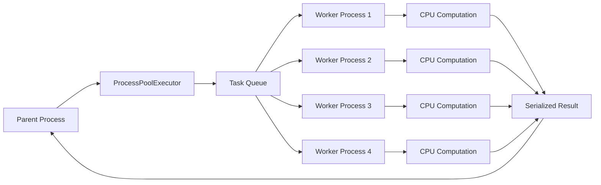

# 07- ProcessPool Executor

## Overview

`ProcessPoolExecutor` is the high-level `concurrent.futures` API for executing Python callables concurrently in separate processes.

It is primarily useful for **CPU-bound workloads** where traditional GIL-enabled CPython threads cannot provide the required parallel execution of Python bytecode.

```python
from concurrent.futures import ProcessPoolExecutor
```

The execution model is:

```text
                    Parent Process
                         │
                ProcessPoolExecutor
                         │
             ┌───────────┼───────────┐
             ↓           ↓           ↓
         Worker P1    Worker P2    Worker P3
             │           │           │
         Python VM    Python VM    Python VM
             │           │           │
          CPU Core    CPU Core    CPU Core
```

Unlike `ThreadPoolExecutor`, each worker is a separate process with its own Python interpreter and memory space.

This makes `ProcessPoolExecutor` particularly suitable for:

- CPU-intensive transformations
- computationally expensive data processing
- image or document processing
- compression
- parsing
- numerical computation
- CPU-heavy ETL stages

It is generally not the right abstraction for ordinary blocking I/O or durable background jobs.

---

## Why ProcessPoolExecutor Exists

Python provides several concurrency models because different workloads have different bottlenecks.

```text
I/O-bound
    ↓
asyncio / ThreadPoolExecutor

CPU-bound
    ↓
ProcessPoolExecutor

Durable background work
    ↓
Celery / SQS / Kafka / worker system
```

Under traditional GIL-enabled CPython, multiple threads within one interpreter cannot simultaneously execute Python bytecode in parallel.

Separate processes provide independent interpreters:

```text
Process 1 → Python bytecode → CPU core
Process 2 → Python bytecode → CPU core
Process 3 → Python bytecode → CPU core
```

This allows CPU-bound work to utilize multiple cores.

---

## What ProcessPoolExecutor Provides

`ProcessPoolExecutor` manages:

- worker processes
- task submission
- task queues
- futures
- result collection
- exception propagation
- worker lifecycle
- shutdown

The application generally interacts with:

```text
submit()
map()
Future
result()
exception()
cancel()
shutdown()
```

This is similar to `ThreadPoolExecutor`, but the execution boundary is a process rather than a thread.

---

## Basic Usage

```python
from concurrent.futures import ProcessPoolExecutor


def calculate(value: int) -> int:
    return value * value


def main() -> None:
    with ProcessPoolExecutor(max_workers=4) as executor:
        results = list(
            executor.map(calculate, range(100))
        )

    print(results)


if __name__ == "__main__":
    main()
```

The `with` statement provides structured lifecycle management.

The `if __name__ == "__main__"` guard is important for multiprocessing programs, particularly when the `spawn` start method is used.

---

## Execution Lifecycle

A simplified lifecycle is:

```text
Application
    │
    ├── Create ProcessPoolExecutor
    │
    ├── Submit callable
    │
    ├── Serialize arguments
    │
    ├── Transfer task to worker
    │
    ├── Execute in separate process
    │
    ├── Serialize result
    │
    ├── Transfer result to parent
    │
    └── Future receives result
```

The serialization and process communication steps are important because they introduce overhead that does not exist in the same form for ordinary function calls.

---

## ProcessPoolExecutor Architecture



The executor abstracts the details of process creation and inter-process communication.

---

## `max_workers`

`max_workers` controls the maximum number of worker processes.

```python
executor = ProcessPoolExecutor(
    max_workers=4,
)
```

For CPU-bound workloads, a useful starting point is often related to the CPU capacity available to the process.

However, blindly setting:

```python
max_workers=os.cpu_count()
```

is not always correct.

You must consider:

- container CPU limits
- other application processes
- native libraries
- memory per worker
- database usage
- workload characteristics
- machine utilization

---

## CPU Capacity and Containers

Suppose:

```text
Kubernetes CPU limit = 2 cores
ProcessPoolExecutor = 16 workers
```

The 16 processes do not create 16 CPU cores.

Instead:

```text
16 processes
     ↓
2 CPU cores
     ↓
CPU contention
     ↓
context switching
     ↓
potentially worse performance
```

Process-pool sizing should use the application's **effective CPU allocation**, not the physical CPU count of the host.

---

## Worker Count and Memory

Processes have independent memory spaces.

If one worker consumes approximately:

```text
400 MiB
```

then:

```text
8 workers × 400 MiB
≈ 3.2 GiB
```

The actual memory footprint may differ because of:

- copy-on-write
- imported libraries
- allocator behavior
- shared pages
- workload mutations

Nevertheless, process count is a major memory-scaling factor.

---

## `submit()`

`submit()` schedules one callable and returns a `Future`.

```python
from concurrent.futures import ProcessPoolExecutor


def calculate(value: int) -> int:
    return expensive_calculation(value)


with ProcessPoolExecutor(max_workers=4) as executor:
    future = executor.submit(calculate, 42)

    result = future.result()
```

Use `submit()` when individual task control is important.

It is particularly useful when:

- tasks have different arguments
- tasks have different behavior
- individual exceptions need handling
- completion order matters
- tasks need cancellation attempts

---

## `map()`

`map()` is convenient for uniform workloads.

```python
from concurrent.futures import ProcessPoolExecutor


def transform(value: int) -> int:
    return expensive_calculation(value)


values = range(10_000)

with ProcessPoolExecutor(max_workers=8) as executor:
    results = list(
        executor.map(
            transform,
            values,
            chunksize=100,
        )
    )
```

For large collections of small tasks, `chunksize` can reduce scheduling and IPC overhead.

---

## `submit()` vs `map()`

| Capability | `submit()` | `map()` |
|---|---|---|
| Individual futures | Yes | Abstracted |
| Per-task control | Excellent | Limited |
| Different functions | Yes | No |
| Completion-order processing | `as_completed()` | Input order |
| Simple bulk transformation | Good | Excellent |
| Custom error handling | Excellent | Less explicit |
| Cancellation | Individual futures | Less direct |
| Chunking | Manual | `chunksize` supported |

Use the simplest API that matches the workload.

---

## Futures

A `Future` represents the eventual result of submitted work.

```python
future.done()
future.running()
future.cancelled()
future.cancel()
future.result()
future.exception()
```

Conceptually:

```text
Pending
  ↓
Running
  ↓
Completed
  │
  └── Result

Running
  │
  └── Failed
       ↓
    Exception
```

The future exists in the parent process while the computation happens in a worker process.

---

## Future Exceptions

Worker exceptions are propagated when the result is retrieved.

```python
from concurrent.futures import ProcessPoolExecutor


def process() -> int:
    raise ValueError("invalid input")


with ProcessPoolExecutor(max_workers=4) as executor:
    future = executor.submit(process)

    try:
        result = future.result()
    except ValueError as exc:
        logger.exception(
            "process task failed: %s",
            exc,
        )
```

A production application should explicitly define how task failures affect the surrounding workflow.

---

## `as_completed()`

`as_completed()` allows results to be processed as soon as tasks finish.

```python
from concurrent.futures import (
    ProcessPoolExecutor,
    as_completed,
)


with ProcessPoolExecutor(max_workers=8) as executor:
    futures = [
        executor.submit(process_partition, partition)
        for partition in partitions
    ]

    for future in as_completed(futures):
        try:
            result = future.result()
        except Exception:
            logger.exception("partition failed")
            continue

        persist_result(result)
```

This is useful when task durations vary significantly.

---

## `wait()`

`wait()` coordinates groups of futures.

```python
from concurrent.futures import (
    ProcessPoolExecutor,
    wait,
)


with ProcessPoolExecutor(max_workers=8) as executor:
    futures = [
        executor.submit(process_partition, partition)
        for partition in partitions
    ]

    done, pending = wait(futures)
```

It can also return when:

```python
from concurrent.futures import FIRST_COMPLETED
```

or:

```python
from concurrent.futures import FIRST_EXCEPTION
```

conditions are met.

---

## Serialization Boundary

The most important difference from ordinary function execution is the process boundary.

```text
Parent object
      │
   serialize
      ↓
Process IPC
      ↓
Worker object
      │
   execute
      ↓
Worker result
      │
   serialize
      ↓
Process IPC
      ↓
Parent result
```

This means large Python objects can make a process pool significantly slower.

---

## Picklability

Process-pool tasks generally need to be serializable.

Prefer module-level functions:

```python
def transform(record: dict) -> dict:
    return {
        "id": record["id"],
        "processed": True,
    }
```

Avoid relying on:

```python
lambda record: ...
```

or deeply nested local functions.

The exact serialization behavior depends on the multiprocessing start method and runtime implementation, but portable process-pool code should use importable module-level callables and serializable arguments.

---

## Closures

Closures can capture large or non-serializable state.

Avoid patterns such as:

```python
def create_worker(configuration):
    def worker(item):
        return process(item, configuration)

    return worker
```

for process-pool submission.

Prefer passing the required data explicitly or using an initializer for process-local setup.

---

## Main Guard

Always structure standalone multiprocessing programs safely:

```python
def main() -> None:
    with ProcessPoolExecutor(max_workers=4) as executor:
        results = list(
            executor.map(process_item, items)
        )

    save_results(results)


if __name__ == "__main__":
    main()
```

Without the guard, a spawned child interpreter can import the module and execute process-creation code again.

This can cause recursive worker creation.

---

## Process Start Methods

Python supports several process-start methods:

| Method | General behavior |
|---|---|
| `spawn` | Starts a fresh interpreter |
| `fork` | Creates a child using OS fork semantics |
| `forkserver` | Uses a dedicated server process to create workers |

The available methods and defaults depend on the operating system and Python runtime.

Production applications should avoid assuming that one start method behaves identically everywhere.

---

## `spawn`

With `spawn`:

```text
Parent
  │
  └── Start fresh interpreter
           ↓
       Import module
           ↓
       Initialize worker
```

Advantages:

- fresh interpreter state
- fewer inherited runtime resources

Costs:

- higher startup overhead
- repeated imports
- serialization requirements
- main-guard requirements

---

## `fork`

With `fork`:

```text
Parent
   │
 fork()
   │
   ├── Parent
   └── Child
```

The child initially inherits the parent's address space using copy-on-write semantics.

This can make startup efficient, but forking an already multithreaded application or one containing complex native-library state can introduce subtle correctness problems.

Do not assume `fork` is universally the best choice.

---

## Copy-on-Write

After `fork`, memory pages can initially be physically shared.

```text
Parent Page
     │
     ├── Parent
     │
     └── Child
```

When a process modifies a shared page:

```text
Shared Page
    ↓
Write
    ↓
Copy
    ↓
Independent Page
```

This can make fork-based process creation memory-efficient initially.

Large mutations can progressively eliminate those savings.

---

## Task Granularity

Process pools work best when each task contains enough computation to amortize:

- task submission
- serialization
- IPC
- scheduling
- result transfer

Poor:

```python
executor.map(lambda x: x + 1, millions_of_values)
```

Better:

```text
Large dataset
     ↓
Partition into substantial chunks
     ↓
Process each chunk
     ↓
Aggregate results
```

---

## Partitioning

For data processing:

```text
Input Dataset
     │
     ├── Partition A → Worker 1
     ├── Partition B → Worker 2
     ├── Partition C → Worker 3
     └── Partition D → Worker 4
```

This is particularly useful for:

- ETL
- file processing
- batch computation
- image processing
- document processing

The partitioning strategy should minimize communication and balance CPU work.

---

## `chunksize`

`map()` supports `chunksize`:

```python
with ProcessPoolExecutor(max_workers=8) as executor:
    results = executor.map(
        process_record,
        records,
        chunksize=100,
    )
```

A larger chunk can reduce scheduling overhead.

However:

```text
Too small
→ overhead increases

Too large
→ load balancing worsens
```

Choose the value through benchmarking.

---

## Load Balancing

Consider:

```text
Worker 1 → 2 sec
Worker 2 → 2 sec
Worker 3 → 2 sec
Worker 4 → 60 sec
```

Three workers become idle while the fourth completes.

If task duration varies significantly, smaller or dynamically distributed work units can improve utilization.

---

## Data Movement

For large datasets, process pools can become limited by data transfer rather than CPU.

```text
Parent
  │
  │ 10 GB data
  ↓
Serialization / IPC
  ↓
Worker
```

This can eliminate the benefit of parallel computation.

Prefer:

- partition-local data
- file offsets
- object-store references
- shared-memory techniques where justified
- external storage access inside workers when appropriate

rather than repeatedly copying large objects through the parent.

---

## Shared Memory

Python provides shared-memory mechanisms for specialized workloads.

Shared memory can reduce copying for large numerical data, but introduces:

- synchronization complexity
- lifecycle management
- memory ownership concerns
- platform-specific behavior

Use it only when profiling demonstrates that data movement is the bottleneck.

---

## NumPy and ProcessPoolExecutor

Large NumPy arrays require special consideration.

Naively passing an array to every worker can create significant serialization and memory overhead.

For large numerical workloads, consider:

- NumPy operations that already execute efficiently in native code
- shared memory
- memory-mapped files
- partitioned arrays
- specialized parallel frameworks

Do not assume multiprocessing automatically makes vectorized NumPy operations faster.

---

## Database Connections

Do not blindly pass an existing database connection into a worker process.

Instead, create process-local resources when required:

```python
def process_partition(partition_id: int) -> int:
    connection = create_connection()

    try:
        return process_partition_data(
            connection,
            partition_id,
        )
    finally:
        connection.close()
```

Database clients may have sockets, locks, background state, and connection-pool internals that are not safe to inherit or serialize across processes.

---

## PostgreSQL Capacity

Suppose:

```text
Kubernetes replicas = 4
Application processes = 2
Process pool workers = 4
```

Potential CPU workers:

```text
4 × 2 × 4 = 32
```

If every worker establishes a database connection:

```text
32 database connections
```

This may be in addition to normal web-application connections.

Process-pool sizing must therefore be coordinated with PostgreSQL capacity.

---

## Redis

Redis clients should be handled according to their documented multiprocessing behavior.

Avoid assuming that a connection created in the parent can simply be reused by every child process.

For CPU-heavy tasks, minimize Redis calls in tight computation loops.

Prefer:

```text
Fetch inputs
   ↓
CPU processing
   ↓
Batch results
   ↓
Persist
```

over thousands of small cross-process or network operations.

---

## External APIs

`ProcessPoolExecutor` is usually not the first choice for network-bound work.

For:

```text
HTTP call
→ wait
→ response
```

prefer:

```text
asyncio
```

or:

```text
ThreadPoolExecutor
```

Use a process pool when the workload contains substantial CPU computation in addition to I/O.

---

## FastAPI

A FastAPI request should not perform expensive CPU-bound work directly on the event-loop thread.

A bounded process pool can provide an execution boundary:

```text
HTTP Request
      ↓
FastAPI
      ↓
CPU Task Submission
      ↓
ProcessPoolExecutor
      ↓
Worker Process
      ↓
Result
      ↓
HTTP Response
```

However, for long-running computation, keeping an HTTP request open may be the wrong architecture.

Prefer:

```text
FastAPI
   ↓
SQS / Celery / Kafka
   ↓
CPU Worker Fleet
   ↓
ProcessPoolExecutor if useful
```

when work is durable or independently scalable.

---

## Django

Django applications can use process pools for CPU-heavy operations, but framework state should not be casually shared across process boundaries.

Prefer passing simple values such as:

```python
user_id
partition_id
file_path
object_key
```

and having workers acquire process-local resources as required.

Database transactions and application-level state must be designed explicitly.

---

## Celery

`ProcessPoolExecutor` and Celery solve different problems.

```text
ProcessPoolExecutor
→ local parallelism inside one application process

Celery
→ distributed durable background execution
```

A Celery worker can itself use multiple processes, depending on its worker configuration.

For production background workloads, the durable queue is often more important than the local process-pool abstraction.

---

## Kafka

A Kafka consumer may use process-based parallelism for CPU-heavy record processing.

```text
Kafka
  ↓
Consumer
  ↓
Partitioned work
  ↓
Process workers
  ↓
CPU transformation
  ↓
Output / offset management
```

Offset commits must align with processing guarantees.

Do not commit an offset before processing is safely complete if losing the result would violate business requirements.

---

## Kubernetes

Process pools multiply across pods and application workers.

Example:

```text
Pods = 6
Web workers per pod = 2
Process pool = 4
```

Potential process count:

```text
6 × 2 × 4 = 48 CPU worker processes
```

If each pod has:

```text
CPU limit = 2
```

then the deployment has many more workers than CPU capacity.

Oversubscription can significantly reduce performance.

---

## Docker Resource Limits

Container resource limits should be part of executor configuration.

Example:

```yaml
resources:
  requests:
    cpu: "4"
    memory: "4Gi"
  limits:
    cpu: "4"
    memory: "8Gi"
```

A process pool running in this container should be sized against the allocated four CPUs and available memory.

Do not size it based only on the physical host.

---

## Process Initialization

`ProcessPoolExecutor` supports an initializer:

```python
from concurrent.futures import ProcessPoolExecutor


def initialize_worker() -> None:
    configure_logging()
    initialize_metrics()


def process_partition(partition: list[int]) -> int:
    return expensive_computation(partition)


with ProcessPoolExecutor(
    max_workers=4,
    initializer=initialize_worker,
) as executor:
    results = list(
        executor.map(
            process_partition,
            partitions,
        )
    )
```

Initialization runs in each worker process.

Keep it deterministic, lightweight, and process-safe.

---

## Process Failure

A worker process can terminate unexpectedly because of:

- uncaught fatal errors
- native-library crashes
- operating-system termination
- memory exhaustion
- external signals

A process pool can become unusable after severe worker failure.

Production applications should have an explicit recovery strategy.

---

## BrokenProcessPool

If a worker terminates unexpectedly, executor operations may raise an exception indicating that the process pool is broken.

Treat this differently from an ordinary business exception.

```text
Business task failure
→ individual task failed

Worker/process failure
→ executor infrastructure may be unhealthy
```

The latter may require:

- recreating the executor
- failing the batch
- retrying work
- restarting the service
- moving work to durable infrastructure

---

## Timeouts

A future can have a timeout:

```python
future = executor.submit(
    expensive_computation,
    data,
)

result = future.result(timeout=30)
```

The timeout limits how long the caller waits.

It does not provide a general guarantee that the underlying worker computation has been safely terminated at that instant.

For strict execution limits, design the workload and worker lifecycle accordingly.

---

## Cancellation

```python
future.cancel()
```

can prevent pending work from starting when cancellation succeeds.

Once a worker is already executing the function, cancellation does not provide arbitrary safe termination.

For long-running work, use cooperative cancellation patterns or move execution to a system capable of managing task termination explicitly.

---

## Side Effects and Retries

Consider:

```text
Worker
  ↓
Charge customer
  ↓
Process crashes
  ↓
Parent does not observe completion
  ↓
Retry
  ↓
Second charge
```

Process-pool execution does not provide exactly-once business semantics.

For side effects, use:

- idempotency keys
- database uniqueness constraints
- transactions
- durable task state
- carefully designed retry policies

---

## Reliability Model

A process pool is ephemeral.

```text
Process crashes
      ↓
Worker state disappears
```

Therefore:

```text
Critical state
      ↓
PostgreSQL / S3 / Kafka / SQS
```

rather than:

```text
Critical state
      ↓
Python process memory
```

---

## High Availability

`ProcessPoolExecutor` does not provide high availability by itself.

A production architecture may use:

```text
Load Balancer
      ↓
Multiple Kubernetes Pods
      ↓
Independent Process Pools
```

If one pod fails, other pods can continue processing requests.

For background workloads, a durable queue provides stronger recovery semantics.

---

## Disaster Recovery

Process-local state is not suitable for disaster recovery.

Persist important work and checkpoints in durable systems.

For example:

```text
Input
 ↓
S3
 ↓
Job metadata → PostgreSQL
 ↓
Worker
 ↓
Output → S3
```

A worker restart can then resume or safely retry from durable state.

---

## Observability

Monitor:

- process count
- CPU utilization
- memory usage
- task throughput
- task duration
- queue depth
- serialization time
- task failures
- executor failures
- retries
- worker startup time

Useful metrics include:

```text
process_pool_tasks_submitted_total
process_pool_tasks_completed_total
process_pool_tasks_failed_total
process_pool_task_duration_seconds
process_pool_worker_memory_bytes
process_pool_worker_cpu_seconds
```

The exact metric names are application-specific.

---

## Logging

Identify worker processes in logs.

```python
import logging
import os


logger = logging.getLogger(__name__)


def process_partition(partition_id: str) -> None:
    logger.info(
        "processing partition",
        extra={
            "partition_id": partition_id,
            "pid": os.getpid(),
        },
    )
```

Centralized logging is preferable in containerized environments.

---

## Profiling

Measure before increasing worker count.

Useful tools include:

```bash
python -m cProfile app.py
```

and system-level profilers such as:

```text
py-spy
scalene
perf
```

Container and cloud metrics should be used alongside Python-level profiling.

---

## Benchmarking

Benchmark at least:

```text
Sequential
Process pool: 2 workers
Process pool: 4 workers
Process pool: 8 workers
```

Measure:

- wall-clock time
- CPU utilization
- memory
- serialization overhead
- throughput
- p95/p99 task latency

The fastest configuration is not automatically the best production configuration.

---

## Cost Considerations

Increasing process count can increase:

- CPU consumption
- memory requirements
- cloud compute cost
- container size
- database usage
- downstream traffic

The useful metric is often:

```text
cost per successfully processed unit
```

rather than simply:

```text
lowest wall-clock time
```

---

## Security Considerations

Separate processes provide memory isolation, but a process pool is not a security sandbox.

Do not execute arbitrary user-supplied Python code inside a process pool and assume it is safe.

For untrusted workloads, use stronger isolation:

- containers
- sandboxed runtimes
- separate worker infrastructure
- restricted IAM permissions
- resource limits

Security boundaries should be explicit.

---

## Common Mistakes

### Using ProcessPoolExecutor for I/O

Processes are usually unnecessary for ordinary HTTP or database waiting.

Use `asyncio` or threads.

### Creating a Pool Per Request

This can cause severe process multiplication.

Avoid:

```python
def endpoint():
    with ProcessPoolExecutor(max_workers=4):
        ...
```

for high-volume requests.

### Forgetting the Main Guard

Always use:

```python
if __name__ == "__main__":
```

for standalone multiprocessing programs.

### Passing Huge Objects

Large serialization payloads can dominate execution time.

### Passing Database Connections

Create process-local connections where required.

### Using Lambdas

Use module-level functions for portable process-pool tasks.

### Oversubscribing CPU

More workers than available CPU capacity can reduce throughput.

### Ignoring Memory

Every process can maintain its own heap and imported state.

### Nested Process Pools

Nested pools can multiply process counts rapidly.

### Treating Cancellation as Termination

`Future.cancel()` does not safely kill arbitrary running computation.

### Treating the Pool as Durable

A process crash loses in-memory worker state.

---

## Production Pitfalls

### Web Worker Multiplication

```text
Pods
×
Web Workers
×
Process Pool Workers
```

can produce far more processes than expected.

### Native Library Oversubscription

Numerical libraries may create their own worker threads.

For example:

```text
4 Python processes
×
8 native BLAS threads
=
up to 32 native compute threads
```

This can severely oversubscribe CPU.

Control native-library threading when necessary.

### Memory Fragmentation

Long-running CPU workers can accumulate memory overhead depending on workload and native dependencies.

Monitor actual resident memory rather than assuming stable usage.

### Serialization Bottlenecks

High CPU usage in the parent process can indicate serialization rather than useful computation.

### Uneven Work

A single large task can keep a worker busy while other workers remain idle.

### Hidden Database Contention

CPU workers that also access PostgreSQL can turn a CPU optimization into a database bottleneck.

---

## ProcessPoolExecutor with Native Libraries

The GIL is not the only factor in parallel performance.

Libraries such as NumPy may already execute computational work in optimized native code and may use their own threading.

Adding a process pool on top can produce:

```text
ProcessPool
   ↓
Native numerical library
   ↓
Internal thread pool
```

This can lead to oversubscription.

Benchmark the entire stack.

---

## ProcessPoolExecutor vs ThreadPoolExecutor

| Dimension | ProcessPoolExecutor | ThreadPoolExecutor |
|---|---|---|
| Execution boundary | Process | Thread |
| Memory | Isolated | Shared |
| CPU-bound Python | Strong fit | Limited under traditional GIL |
| Blocking I/O | Usually unnecessary overhead | Strong fit |
| Serialization | Required for task boundaries | Usually not |
| Memory overhead | Higher | Lower |
| Failure isolation | Stronger | Weaker |
| Shared state | Explicit IPC | Shared memory |
| Startup | More expensive | Cheaper |
| Typical use | CPU parallelism | I/O concurrency |

---

## ProcessPoolExecutor vs `asyncio`

| Workload | Better Fit |
|---|---|
| High-volume HTTP I/O | `asyncio` |
| Async database access | `asyncio` |
| Blocking synchronous API | Thread pool |
| CPU-heavy Python | Process pool |
| Long-running durable work | Worker system |
| Distributed CPU processing | Distributed workers |

The concurrency model should follow the dominant resource bottleneck.

---

## ProcessPoolExecutor vs Celery

| Requirement | ProcessPoolExecutor | Celery |
|---|---|---|
| Local CPU parallelism | Excellent | Possible |
| Durable queue | No | Yes |
| Retry infrastructure | Application-managed | Built-in mechanisms |
| Horizontal worker scaling | No | Yes |
| Crash recovery | Limited | Stronger |
| Scheduled jobs | No | Yes |
| Distributed execution | No | Yes |
| Operational complexity | Lower | Higher |

Use `ProcessPoolExecutor` for local parallelism and Celery or another durable worker platform when operational requirements exceed process-local execution.

---

## Backend Architecture

A production CPU-heavy API may evolve from:

```text
Client
  ↓
FastAPI
  ↓
ProcessPoolExecutor
  ↓
CPU task
  ↓
Response
```

to:

```text
Client
  ↓
FastAPI
  ↓
SQS / Kafka
  ↓
Worker Fleet
  ↓
ProcessPoolExecutor
  ↓
CPU Processing
  ↓
S3 / PostgreSQL
```

The second architecture is preferable when work is:

- long-running
- retryable
- durable
- independently scalable
- too expensive to perform synchronously

---

## Data Engineering Example

Consider a batch transformation:

```text
S3 objects
    ↓
Manifest
    ↓
Partitioning
    ↓
ProcessPoolExecutor
 ┌──┼──┬──┐
 ↓  ↓  ↓  ↓
P1 P2 P3 P4
 └──┼──┴──┘
    ↓
Aggregated results
    ↓
S3 / PostgreSQL
```

Each process handles an independent partition.

This design minimizes shared state and makes retrying individual partitions easier.

---

## Graceful Shutdown

For long-lived services:

```text
SIGTERM
   ↓
Stop accepting new work
   ↓
Stop submitting new process tasks
   ↓
Allow bounded work to finish
   ↓
Shutdown executor
   ↓
Exit
```

This is particularly important for Kubernetes deployments.

The application's termination grace period should account for the shutdown policy.

---

## Testing

Test process-pool code at multiple levels.

### Unit Tests

Test the computation directly:

```python
def test_transform_partition() -> None:
    result = transform_partition(
        [1, 2, 3],
    )

    assert result == expected
```

### Integration Tests

Test:

- actual process creation
- serialization
- worker initialization
- exception propagation
- shutdown

### Performance Tests

Use production-like datasets and measure:

- throughput
- CPU
- memory
- serialization
- scaling efficiency

Do not make every unit test create multiple processes.

---

## Maintainable Design

Separate computation from orchestration.

Prefer:

```python
def transform_partition(
    records: list[dict],
) -> list[dict]:
    return [
        transform(record)
        for record in records
    ]
```

Then:

```python
def run_parallel(
    partitions: list[list[dict]],
) -> list[list[dict]]:
    with ProcessPoolExecutor(max_workers=4) as executor:
        return list(
            executor.map(
                transform_partition,
                partitions,
            )
        )
```

This allows the computational function to be tested independently.

---

## Production Decision Framework

Ask:

```text
Is the workload CPU-bound?
        │
        ├── No → asyncio / threads
        │
        └── Yes
             ↓
Can work be partitioned independently?
        │
        ├── No → redesign dependencies
        │
        └── Yes
             ↓
Is local process execution sufficient?
        │
        ├── No → distributed workers
        │
        └── Yes
             ↓
Is serialization affordable?
        │
        ├── No → reduce data movement
        │
        └── Yes
             ↓
Benchmark workers + partition size
```

Then evaluate:

```text
CPU
Memory
Serialization
Database
Network
Native library threads
Failure recovery
Deployment topology
```

---

## Production Checklist

- [ ] Workload is demonstrably CPU-bound.
- [ ] Sequential performance has been measured.
- [ ] `ProcessPoolExecutor` provides measurable improvement.
- [ ] `max_workers` is aligned with CPU capacity.
- [ ] Kubernetes CPU limits have been considered.
- [ ] Memory consumption per worker has been measured.
- [ ] Replica and web-worker multiplication has been calculated.
- [ ] Task functions are importable and serializable.
- [ ] `if __name__ == "__main__"` is used where required.
- [ ] Process-start behavior has been evaluated.
- [ ] Task inputs and outputs are not unnecessarily large.
- [ ] Partitioning strategy has been benchmarked.
- [ ] `chunksize` has been evaluated for bulk workloads.
- [ ] Worker initialization is process-safe.
- [ ] Database connections are process-local where required.
- [ ] Redis and HTTP clients follow their multiprocessing guarantees.
- [ ] Native-library thread counts have been considered.
- [ ] Worker failures have an explicit recovery strategy.
- [ ] Retry behavior is idempotent where necessary.
- [ ] Cancellation semantics are understood.
- [ ] Timeouts exist at appropriate execution and I/O layers.
- [ ] Critical state is stored outside worker memory.
- [ ] Metrics expose throughput, latency, failures, CPU, and memory.
- [ ] Logs identify worker processes.
- [ ] Graceful shutdown has been tested.
- [ ] Kubernetes termination behavior has been validated.
- [ ] Durable work uses an appropriate queue or worker platform.
- [ ] Security does not depend on process isolation as a sandbox.
- [ ] Load testing uses production-like data and task distributions.

## Key Takeaways

- **`ProcessPoolExecutor` provides process-based parallelism for CPU-heavy Python workloads:** separate worker processes have independent interpreters and can execute CPU-bound Python code across multiple cores under traditional GIL-enabled CPython.
- **Process pools have meaningful data-movement and memory costs:** arguments and results cross process boundaries, so task granularity, partitioning, serialization, and `chunksize` strongly affect real-world performance.
- **Process count must be sized against the complete deployment topology:** Kubernetes replicas, web workers, process pools, native-library threads, CPU limits, memory limits, and database connections can multiply resource consumption rapidly.
- **`ProcessPoolExecutor` is local parallelism, not durable job infrastructure:** long-running or business-critical work should generally use Celery, SQS, Kafka, or another durable worker architecture.
- **Production multiprocessing requires explicit failure and lifecycle design:** handle worker failures, idempotent retries, graceful shutdown, observability, resource limits, and process-local external resources rather than relying on executor mechanics alone.