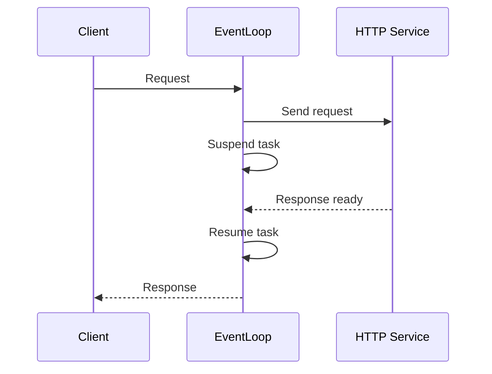
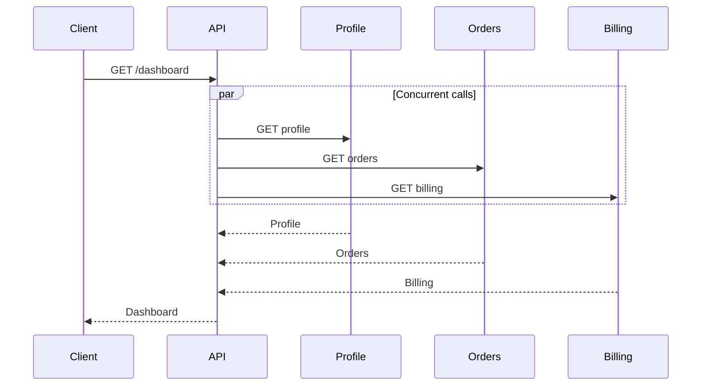
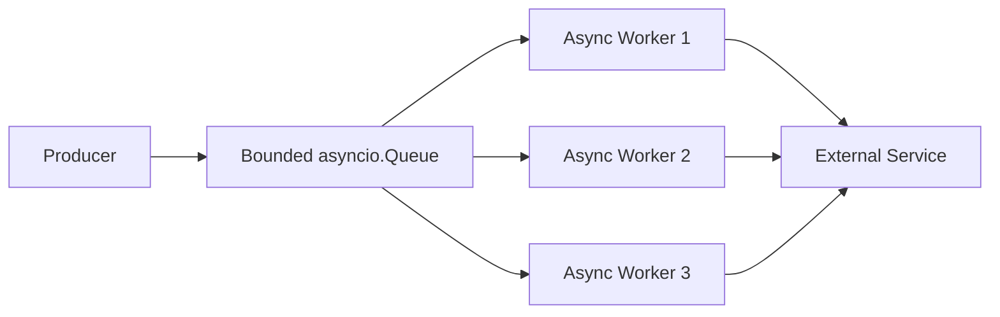
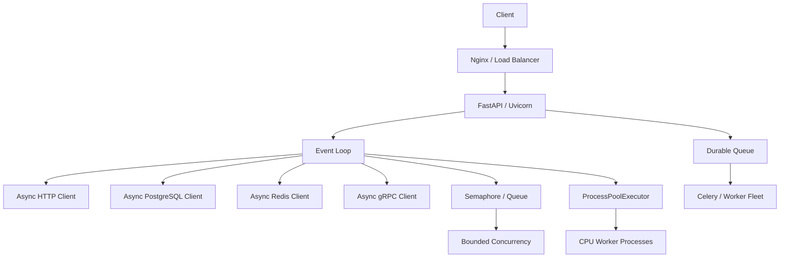

# 08- Asyncio

## Overview

`asyncio` is Python's standard-library framework for **cooperative asynchronous concurrency**. It is designed primarily for workloads where tasks spend significant time waiting for I/O, such as HTTP requests, database operations, sockets, Redis calls, and other network services.

The central idea is that one operating-system thread can manage many concurrent operations by switching between tasks whenever the current task reaches an `await` point.

```text
                    Event Loop
                        │
          ┌─────────────┼─────────────┐
          ↓             ↓             ↓
       Task A         Task B         Task C
          │             │             │
       await I/O      await I/O      await I/O
          │             │             │
          └─────────────┼─────────────┘
                        ↓
                 Ready task runs
```

`asyncio` provides concurrency, not automatic CPU parallelism.

For traditional GIL-enabled CPython:

```text
CPU-bound Python
    → ProcessPoolExecutor / worker processes

Blocking synchronous I/O
    → ThreadPoolExecutor / asyncio.to_thread()

High-volume non-blocking I/O
    → asyncio
```

Understanding `asyncio` is essential for modern Python backend development, particularly with frameworks such as FastAPI and asynchronous clients for HTTP, PostgreSQL, Redis, and messaging systems.

---

## Why Asyncio Exists

A synchronous I/O operation often spends most of its lifetime waiting.

For example:

```text
Application
    ↓
HTTP request
    ↓
Waiting for network
    ↓
Response
```

During the wait, a synchronous thread may remain blocked.

With asynchronous I/O:

```text
Task A
  ↓
await HTTP request
  ↓
Event loop runs Task B

Task B
  ↓
await database query
  ↓
Event loop runs Task C

Task C
  ↓
await Redis operation
```

One thread can keep useful work progressing while individual operations wait for external events.

---

## Concurrency vs Parallelism

`asyncio` primarily provides **concurrency**.

```text
Concurrency

Task A ──┐     ┌──
         └─────┘
Task B      ──┐     ┌──
              └─────┘
Task C          ──┐
                  └──
        One CPU thread
```

Parallelism means work executes simultaneously on multiple CPU cores:

```text
CPU Core 1 → Process A
CPU Core 2 → Process B
CPU Core 3 → Process C
```

`asyncio` does not inherently provide this CPU-level parallelism.

---

## Core Concepts

The most important `asyncio` concepts are:

| Concept | Purpose |
|---|---|
| Coroutine function | Defines asynchronous behavior with `async def` |
| Coroutine object | Represents a coroutine that can be awaited |
| `await` | Suspends the current coroutine until an awaitable completes |
| Event loop | Schedules and drives asynchronous execution |
| Task | Schedules a coroutine for concurrent execution |
| Future | Represents an eventual asynchronous result |
| Event-loop policy | Controls event-loop behavior and implementation details |
| Async context manager | Manages asynchronous resources |
| Async iterator | Produces values asynchronously |

The most important relationship is:

```text
async def
   ↓
coroutine
   ↓
Task
   ↓
event loop
   ↓
await I/O
   ↓
resume coroutine
```

---

## Coroutine Functions

A coroutine function is declared with `async def`.

```python
async def fetch_customer(customer_id: int) -> dict:
    customer = await customer_client.get(customer_id)
    return customer
```

Calling the function does not immediately execute its body.

```python
coroutine = fetch_customer(42)
```

This creates a coroutine object.

Execution begins when the coroutine is awaited or scheduled as a task.

---

## `await`

`await` tells Python to suspend the current coroutine until an awaitable produces a result.

```python
async def get_customer(customer_id: int) -> dict:
    response = await client.get(
        f"/customers/{customer_id}"
    )

    return response.json()
```

Conceptually:

```text
Coroutine
   ↓
await operation
   ↓
Suspend coroutine
   ↓
Event loop runs another ready task
   ↓
I/O completes
   ↓
Coroutine becomes runnable
   ↓
Resume execution
```

This cooperative behavior is the foundation of `asyncio`.

---

## Event Loop

The event loop is the scheduler that drives asynchronous tasks.

Conceptually:

```text
                Event Loop
                    │
       ┌────────────┼────────────┐
       ↓            ↓            ↓
    Task A       Task B       Task C
       │            │            │
    await I/O    await I/O    CPU work
       │            │            │
       └────────────┼────────────┘
                    ↓
              Ready callbacks
```

The event loop:

1. identifies ready tasks
2. resumes coroutine execution
3. detects when awaited operations become ready
4. schedules continuations
5. repeats until no work remains

The exact implementation involves OS-level readiness mechanisms and event-loop internals, but application code normally interacts through the high-level `asyncio` APIs.

---

## Running an Async Program

For a top-level application entry point:

```python
import asyncio


async def main() -> None:
    result = await fetch_customer(42)
    print(result)


if __name__ == "__main__":
    asyncio.run(main())
```

`asyncio.run()` creates and manages an event loop for the coroutine and shuts it down when execution completes.

It is intended as a top-level entry point rather than something repeatedly called inside an already-running event loop.

---

## `asyncio.run()`

Use:

```python
asyncio.run(main())
```

for a normal synchronous application entry point.

Avoid:

```python
async def another_function():
    asyncio.run(main())
```

because an event loop is already running.

Inside asynchronous code, use:

```python
await main()
```

instead.

---

## Sequential Async Code

This is asynchronous but sequential:

```python
async def load_dashboard() -> dict:
    profile = await fetch_profile()
    orders = await fetch_orders()

    return {
        "profile": profile,
        "orders": orders,
    }
```

The second operation does not start until the first completes.

Asynchrony does not automatically make independent operations concurrent.

---

## Concurrent Tasks

Independent operations can be scheduled concurrently.

```python
import asyncio


async def load_dashboard() -> dict:
    profile_task = asyncio.create_task(
        fetch_profile()
    )
    orders_task = asyncio.create_task(
        fetch_orders()
    )

    profile = await profile_task
    orders = await orders_task

    return {
        "profile": profile,
        "orders": orders,
    }
```

Conceptually:

```text
Request
  │
  ├── Task A → Profile API ────────┐
  │                                │
  └── Task B → Orders API ────────┤
                                   ↓
                              Build response
```

---

## `asyncio.gather()`

For straightforward fan-out/fan-in workflows, `asyncio.gather()` is usually cleaner.

```python
import asyncio


async def load_dashboard() -> dict:
    profile, orders = await asyncio.gather(
        fetch_profile(),
        fetch_orders(),
    )

    return {
        "profile": profile,
        "orders": orders,
    }
```

The operations are scheduled concurrently.

The results are returned in the same order as the awaitables supplied to `gather()`.

---

## `gather()` and Exceptions

By default, if an awaitable raises an exception, `gather()` propagates that exception to the caller.

```python
results = await asyncio.gather(
    operation_a(),
    operation_b(),
)
```

If partial failure must be represented explicitly:

```python
results = await asyncio.gather(
    operation_a(),
    operation_b(),
    return_exceptions=True,
)
```

Use `return_exceptions=True` carefully. It changes exceptions into result values, so application code must inspect the returned objects.

---

## Task

A `Task` wraps a coroutine and schedules it to run on the event loop.

```python
task = asyncio.create_task(
    fetch_customer(42)
)
```

The task can later be awaited:

```python
customer = await task
```

Task creation is appropriate when work should begin before the current coroutine reaches the corresponding `await`.

---

## Task Lifecycle

A simplified lifecycle is:

```text
Created
  ↓
Scheduled
  ↓
Running
  ↓
Awaiting I/O
  ↓
Runnable
  ↓
Running
  ↓
Completed
```

A task can also terminate with:

```text
Cancelled
```

or:

```text
Exception
```

---

## `create_task()`

Use `create_task()` when concurrency is intentional.

```python
task = asyncio.create_task(
    refresh_cache()
)

await process_request()

await task
```

The cache refresh can progress while `process_request()` runs.

Do not create tasks merely to make code appear asynchronous.

---

## Task References

Keep references to important tasks.

```python
task = asyncio.create_task(background_operation())

try:
    await task
finally:
    ...
```

Untracked tasks can make lifecycle, cancellation, and error handling harder to reason about.

For durable business work, an in-process task should not be treated as a persistent job.

---

## Futures

A `Future` represents a result that will become available later.

Most application code should work primarily with:

```text
coroutines
tasks
asyncio APIs
```

rather than manually constructing futures.

Futures are more relevant when integrating lower-level callback-based or event-loop-driven APIs.

---

## Async Context Managers

Asynchronous resources can implement:

```python
async with resource:
    ...
```

For example:

```python
async with http_client:
    response = await http_client.get("/customers")
```

This allows asynchronous acquisition and cleanup.

It is especially useful for:

- network clients
- database transactions
- locks
- connection resources

---

## Async Iterators

An asynchronous iterator provides values using `async for`.

```python
async for event in event_stream:
    await process_event(event)
```

This is useful for:

- streaming HTTP responses
- database cursors
- Kafka consumers
- WebSocket messages
- large asynchronous data sources

---

## Async Generators

An async generator combines asynchronous execution with lazy production.

```python
async def stream_events():
    while True:
        event = await read_event()
        yield event
```

Consumption:

```python
async for event in stream_events():
    process(event)
```

This avoids loading the entire stream into memory.

---

## Asyncio Networking

A typical async HTTP flow is:



The event loop remains available to execute other tasks while the network operation is waiting.

---

## Non-Blocking I/O

`asyncio` requires non-blocking or asyncio-compatible operations to provide its concurrency benefits.

Good:

```python
response = await async_http_client.get(url)
```

Problematic:

```python
response = requests.get(url)
```

The second call blocks the event-loop thread.

---

## Blocking the Event Loop

This is one of the most important `asyncio` production mistakes.

```python
async def endpoint():
    response = requests.get(url)
    return response.json()
```

While `requests.get()` runs:

```text
Event loop
    ↓
blocked
    ↓
other requests cannot progress
```

A single blocking call can therefore damage the concurrency characteristics of the entire service.

---

## `asyncio.to_thread()`

When a blocking synchronous function must be used from async code:

```python
import asyncio


async def get_customer(customer_id: int) -> dict:
    return await asyncio.to_thread(
        synchronous_client.get,
        customer_id,
    )
```

This moves the blocking function to a worker thread rather than blocking the event-loop thread.

Use this as an integration mechanism, not as a replacement for properly asynchronous libraries at very high scale.

---

## `run_in_executor()`

Lower-level integration is also possible:

```python
import asyncio


async def process(data: bytes) -> bytes:
    loop = asyncio.get_running_loop()

    return await loop.run_in_executor(
        None,
        blocking_operation,
        data,
    )
```

`asyncio.to_thread()` is usually clearer for ordinary blocking function calls.

---

## Asyncio and the GIL

`asyncio` does not bypass the GIL.

For CPU-bound Python code:

```text
Event Loop
   ↓
CPU-heavy function
   ↓
Event loop blocked
```

This is still one thread executing CPU work.

For CPU-heavy operations, use:

```text
ProcessPoolExecutor
```

or a separate worker architecture.

---

## CPU-Bound Work in Asyncio

Bad:

```python
async def endpoint():
    result = expensive_cpu_computation()
    return result
```

The event loop cannot switch to another task while the synchronous computation is executing.

Better:

```python
async def endpoint():
    result = await asyncio.to_thread(
        expensive_cpu_computation,
    )
    return result
```

For genuinely CPU-heavy pure Python work, process-based execution is usually more appropriate:

```text
asyncio
   ↓
ProcessPoolExecutor
   ↓
CPU workers
```

---

## Cooperative Scheduling

`asyncio` tasks cooperate.

A task gives the event loop an opportunity to run other tasks when it:

- awaits an incomplete operation
- yields explicitly
- completes

Unlike preemptive operating-system thread scheduling, the event loop cannot automatically interrupt arbitrary Python code between every instruction.

Therefore:

```python
async def bad():
    for _ in range(10_000_000):
        expensive_operation()
```

can monopolize the event-loop thread.

---

## Yielding

Long-running asynchronous loops may need explicit yielding:

```python
async def process_items(items):
    for item in items:
        process(item)

        await asyncio.sleep(0)
```

This can give other tasks an opportunity to run.

However, `sleep(0)` is not a substitute for moving genuinely CPU-heavy work out of the event-loop thread.

---

## Asyncio Synchronization

`asyncio` provides synchronization primitives designed for asynchronous tasks.

Examples include:

- `asyncio.Lock`
- `asyncio.Event`
- `asyncio.Condition`
- `asyncio.Semaphore`
- `asyncio.BoundedSemaphore`
- `asyncio.Queue`

These are distinct from their thread-based counterparts.

---

## Asyncio Lock

Use an async lock to protect shared state between asyncio tasks.

```python
import asyncio


lock = asyncio.Lock()
cache: dict[str, object] = {}


async def update_cache(
    key: str,
    value: object,
) -> None:
    async with lock:
        cache[key] = value
```

Do not use `threading.Lock` as a general substitute inside async code.

---

## Why `threading.Lock` Can Be Dangerous

A blocking thread lock can block the event-loop thread.

```python
with threading.Lock():
    blocking_or_long_operation()
```

If another coroutine needs the event loop to release progress, the entire loop can become stuck.

Use asyncio-native synchronization for coroutine coordination.

---

## Async Semaphore

A semaphore limits concurrent access.

```python
import asyncio


partner_limit = asyncio.Semaphore(10)


async def call_partner(request: dict) -> dict:
    async with partner_limit:
        return await partner_client.send(request)
```

This is useful when:

```text
1000 async tasks
      ↓
Partner API limit = 10 concurrent requests
```

The semaphore prevents every task from simultaneously hitting the dependency.

---

## Async Queue

`asyncio.Queue` implements producer-consumer coordination.

```python
import asyncio


queue: asyncio.Queue[dict] = asyncio.Queue(
    maxsize=100,
)


async def producer() -> None:
    async for event in event_stream():
        await queue.put(event)


async def consumer() -> None:
    while True:
        event = await queue.get()

        try:
            await process_event(event)
        finally:
            queue.task_done()
```

A bounded queue provides natural backpressure.

---

## Backpressure

Without backpressure:

```text
Producer
  ↓
10,000 tasks/sec

Consumer
  ↓
1,000 tasks/sec
```

In-flight work grows indefinitely.

With a bounded queue:

```text
Producer
    ↓
Bounded Queue
    ↓
Consumer
```

When the queue is full, `put()` waits.

This keeps memory growth bounded.

---

## Asyncio Queue vs Kafka

An `asyncio.Queue` is process-local and ephemeral.

Kafka is distributed and durable.

```text
asyncio.Queue
→ local coordination

Kafka
→ durable distributed event streaming
```

Use `asyncio.Queue` for in-process producer-consumer patterns.

Use Kafka when events must survive process failure and be consumed by independent services.

---

## Asyncio and HTTP Clients

A production async HTTP stack commonly looks like:

```text
FastAPI
   ↓
async HTTP client
   ↓
connection pool
   ↓
network
   ↓
external service
```

Use connection pooling rather than creating a new HTTP client for every request.

---

## HTTP Connection Pooling

Creating a new client for every call can cause:

- repeated TCP setup
- repeated TLS handshakes
- increased latency
- excessive sockets
- poor connection reuse

Prefer a long-lived client:

```python
async with AsyncClient() as client:
    ...
```

or an application-scoped client whose lifecycle is tied to the application.

---

## Timeouts

Every external asynchronous operation should have appropriate timeouts.

```python
response = await client.get(
    url,
    timeout=5.0,
)
```

Timeouts should exist at the actual I/O layer.

Do not rely solely on:

```python
await asyncio.wait_for(...)
```

as the only timeout mechanism.

---

## `asyncio.wait_for()`

A coroutine can be wrapped with a timeout:

```python
result = await asyncio.wait_for(
    fetch_customer(42),
    timeout=2.0,
)
```

This controls how long the caller waits and can cancel the awaited task when the timeout expires.

The underlying operation must still cooperate correctly with cancellation.

---

## `asyncio.timeout()`

Modern Python also provides the asynchronous timeout context manager:

```python
async def load_customer(customer_id: int) -> dict:
    async with asyncio.timeout(2.0):
        return await fetch_customer(customer_id)
```

This is often clearer when a timeout should cover a block containing multiple awaits.

---

## Cancellation

Cancellation is a first-class part of asyncio.

```python
task = asyncio.create_task(
    long_running_operation()
)

task.cancel()
```

The cancellation is delivered to the coroutine, typically through `asyncio.CancelledError`.

Well-behaved coroutines should allow cancellation to propagate.

---

## Handling Cancellation

Prefer:

```python
async def worker() -> None:
    try:
        await process()
    except asyncio.CancelledError:
        await cleanup()
        raise
```

The `raise` is important.

Swallowing cancellation can prevent structured shutdown and make applications difficult to terminate cleanly.

---

## Cancellation and Cleanup

Use `finally` for essential cleanup:

```python
async def process() -> None:
    resource = await acquire()

    try:
        await do_work(resource)
    finally:
        await resource.close()
```

This ensures cleanup executes when the coroutine completes or is cancelled.

---

## Shielding

`asyncio.shield()` can protect an operation from cancellation by the surrounding task:

```python
await asyncio.shield(
    critical_operation()
)
```

Use shielding sparingly.

If overused, it can prevent graceful request cancellation and increase shutdown latency.

Critical durable work should generally be moved to a proper job system rather than relying on shielding.

---

## Structured Concurrency

Modern Python provides `asyncio.TaskGroup` for structured concurrency.

```python
import asyncio


async def load_dashboard() -> dict:
    async with asyncio.TaskGroup() as group:
        profile_task = group.create_task(
            fetch_profile()
        )
        orders_task = group.create_task(
            fetch_orders()
        )

    return {
        "profile": profile_task.result(),
        "orders": orders_task.result(),
    }
```

`TaskGroup` makes task ownership and lifecycle more explicit.

---

## TaskGroup Semantics

A `TaskGroup` establishes a structured scope:

```text
TaskGroup
├── Task A
├── Task B
└── Task C
```

When the scope exits:

- child tasks must finish or be cancelled
- failures are coordinated
- task lifetime remains tied to the surrounding scope

This is generally easier to reason about than creating detached background tasks.

---

## TaskGroup Failure Handling

If one child task fails, the task group coordinates cancellation of remaining child tasks and raises an exception group after the group exits.

This is useful when tasks form one logical operation.

For example:

```text
Request
  │
  └── TaskGroup
       ├── Profile
       ├── Orders
       └── Preferences
```

If one required operation fails, the request can fail as a coordinated unit.

---

## Exception Groups

Python's modern exception model allows multiple concurrent failures to be represented using `ExceptionGroup`.

For example:

```python
try:
    async with asyncio.TaskGroup() as group:
        group.create_task(operation_a())
        group.create_task(operation_b())
except* ValueError as exc:
    handle_validation_errors(exc)
```

Use `except*` when concurrent operations can produce multiple independently meaningful exceptions.

---

## `gather()` vs `TaskGroup`

| Requirement | `asyncio.gather()` | `TaskGroup` |
|---|---|---|
| Simple concurrent calls | Excellent | Excellent |
| Structured task ownership | Less explicit | Strong |
| Coordinated cancellation | Less structured | Strong |
| Exception groups | No direct model | Yes |
| Modern structured concurrency | Limited | Strong |
| Simple result collection | Excellent | Good |

Prefer `TaskGroup` when tasks form a structured unit of work.

Use `gather()` when simple fan-out/fan-in semantics are sufficient.

---

## Async Context Managers

Resources can be managed using `async with`.

```python
async with database.transaction():
    await repository.update_order(order_id)
    await repository.write_audit_log(order_id)
```

This is particularly useful for resources that require asynchronous setup or cleanup.

---

## Async Database Access

A production async database flow can look like:

```text
FastAPI
   ↓
Coroutine
   ↓
Async DB Client
   ↓
Connection Pool
   ↓
PostgreSQL
```

The database driver must actually support asynchronous operation.

Wrapping a blocking database driver in `async def` does not make it asynchronous.

---

## Async ORM Considerations

Framework support varies.

For Django, asynchronous views and ORM operations are available, but not every operation behaves identically to a fully asynchronous database stack.

The important engineering distinction is:

```text
async function
≠
non-blocking implementation
```

Verify the underlying framework and database driver's actual behavior.

---

## Redis

An asynchronous Redis client can integrate naturally with an asyncio application:

```python
value = await redis.get("customer:42")
```

The important requirement is that the client itself provides asynchronous I/O rather than internally blocking the event-loop thread.

---

## gRPC

Async gRPC clients can fit naturally into an event-loop architecture.

```text
FastAPI
  ↓
async coroutine
  ↓
async gRPC client
  ↓
remote service
```

This allows multiple outbound RPC calls to overlap without creating a thread for every operation.

---

## REST APIs

An async REST endpoint can fan out to multiple services:



This is a common high-value use case for `asyncio`.

---

## Asyncio and FastAPI

FastAPI is designed to work naturally with asynchronous Python.

```python
from fastapi import FastAPI

app = FastAPI()


@app.get("/customers/{customer_id}")
async def get_customer(customer_id: int) -> dict:
    return await customer_service.get(customer_id)
```

The benefit depends on `customer_service` actually performing non-blocking I/O.

An `async def` endpoint containing blocking code can still block the event loop.

---

## FastAPI Request Lifecycle

A simplified lifecycle is:

```text
Nginx / Load Balancer
        ↓
Uvicorn
        ↓
Event Loop
        ↓
FastAPI
        ↓
Endpoint Coroutine
        ↓
await database / HTTP / Redis
        ↓
Event Loop handles other requests
        ↓
I/O completes
        ↓
Endpoint resumes
        ↓
HTTP Response
```

This is why non-blocking dependencies are essential.

---

## Uvicorn Workers

A production deployment may use multiple worker processes:

```text
Kubernetes Pod
├── Worker Process 1
│     └── Event Loop
├── Worker Process 2
│     └── Event Loop
└── Worker Process 3
      └── Event Loop
```

Each process has its own event loop and memory.

This combines:

```text
Process-level parallelism
+
Async I/O concurrency
```

---

## Asyncio and Nginx

A typical request path is:

```text
Client
  ↓
Nginx / Load Balancer
  ↓
Uvicorn
  ↓
FastAPI
  ↓
Async I/O
  ↓
PostgreSQL / Redis / Services
```

Nginx handles connection-level concerns while the Python event loop manages application-level asynchronous execution.

---

## Asyncio and Kubernetes

Async applications scale horizontally through multiple pods.

For example:

```text
Load Balancer
      ↓
┌─────┼─────┐
↓     ↓     ↓
Pod 1 Pod 2 Pod 3
 │     │     │
Loop  Loop  Loop
```

Each event loop can manage many concurrent I/O operations.

However, high concurrency does not eliminate downstream capacity limits.

---

## Concurrency Limits

An application may accept:

```text
10,000 concurrent HTTP requests
```

while PostgreSQL can support only:

```text
200 concurrent connections
```

Asyncio does not remove that constraint.

Use:

- connection pools
- semaphores
- queues
- rate limits
- backpressure

to control downstream pressure.

---

## Connection Pooling

Concurrency and connection count are different.

For example:

```text
10,000 async tasks
        ↓
PostgreSQL pool
        ↓
100 connections
```

Tasks can wait asynchronously for available connections.

This is usually preferable to creating one database connection per request.

---

## Asyncio and Backpressure

A mature async service needs explicit backpressure.

```text
Client requests
      ↓
Application concurrency limit
      ↓
Async tasks
      ↓
Connection pool / semaphore
      ↓
Dependency
```

Without limits, asyncio makes it easy to create thousands of concurrent operations.

That can overwhelm:

- memory
- file descriptors
- database pools
- external services
- network bandwidth

---

## File Descriptors

Large numbers of concurrent network connections consume file descriptors.

Monitor and configure:

```text
ulimit
container limits
OS limits
connection pools
HTTP client limits
```

High async concurrency still depends on operating-system resource limits.

---

## Rate Limiting

A semaphore controls concurrency:

```python
limit = asyncio.Semaphore(20)
```

A rate limiter controls throughput over time.

These are different:

```text
Concurrency limit
→ maximum in-flight operations

Rate limit
→ maximum operations per time window
```

Production integrations may require both.

---

## Asyncio Queues for Work Control

For a bounded asynchronous worker pattern:

```python
import asyncio


queue: asyncio.Queue[dict] = asyncio.Queue(
    maxsize=500,
)


async def worker() -> None:
    while True:
        item = await queue.get()

        try:
            await process(item)
        finally:
            queue.task_done()
```

Start a fixed number of workers:

```python
workers = [
    asyncio.create_task(worker())
    for _ in range(20)
]
```

This provides controlled concurrency rather than one task per item.

---

## Producer-Consumer Flow



The queue creates a clear boundary between production and processing.

---

## Asyncio and Kafka

An async Kafka consumer can integrate naturally with an event loop, but Kafka's partitioning, consumer-group, offset, and delivery semantics remain independent of asyncio.

A typical flow is:

```text
Kafka
  ↓
Async Consumer
  ↓
Bounded Processing
  ↓
Async I/O
  ↓
Commit Offset
```

Do not confuse asynchronous execution with durable processing guarantees.

---

## Asyncio and Celery

`asyncio` and Celery solve different problems.

```text
asyncio
→ concurrency within an application process

Celery
→ distributed background task execution
```

Asyncio is appropriate for short-lived request-scoped I/O.

Celery is appropriate when work must:

- survive process restarts
- retry independently
- run asynchronously from the HTTP request
- scale across worker processes or machines

---

## Background Tasks

Detached asyncio tasks are ephemeral.

```python
asyncio.create_task(send_notification())
```

If the process crashes:

```text
Process crash
    ↓
Task disappears
```

Do not use detached tasks as a durable job queue.

Use:

```text
SQS
Celery
Kafka
database-backed job system
```

when business work must survive process failure.

---

## Graceful Shutdown

A production async application should handle shutdown:

```text
SIGTERM
  ↓
Stop accepting new requests
  ↓
Cancel or stop background tasks
  ↓
Allow active operations to finish where appropriate
  ↓
Close HTTP clients
  ↓
Close database pools
  ↓
Close Redis clients
  ↓
Stop event loop
```

Cancellation and cleanup should be designed together.

---

## Asyncio Cancellation During Shutdown

Cancellation should normally propagate.

```python
async def worker() -> None:
    try:
        while True:
            await process_next()
    except asyncio.CancelledError:
        await cleanup()
        raise
```

Swallowing `CancelledError` can cause shutdown to hang or take longer than expected.

---

## Asyncio and Signals

Operating-system signals are normally handled by the process hosting the event loop.

Production frameworks provide lifecycle hooks, but application code should still understand:

```text
SIGTERM
→ graceful shutdown
→ task cancellation
→ resource cleanup
```

This is particularly important in Docker and Kubernetes environments.

---

## Performance

Asyncio can provide excellent I/O concurrency with relatively low per-task overhead compared with one thread per operation.

Potential advantages include:

- fewer operating-system threads
- lower thread scheduling overhead
- efficient connection handling
- high concurrency for I/O workloads

But async code is not automatically faster.

It can be slower when:

- tasks are CPU-heavy
- libraries are blocking
- concurrency is excessive
- serialization dominates
- downstream systems are saturated

---

## Latency

For independent I/O:

```text
Sequential:
A = 200 ms
B = 400 ms
C = 300 ms

≈ 900 ms
```

Concurrent:

```text
max(A, B, C)
≈ 400 ms
```

The actual latency also includes:

- event-loop scheduling
- connection acquisition
- serialization
- dependency queueing
- retries

---

## Event-Loop Latency

Monitor event-loop responsiveness.

A CPU-heavy callback can cause:

```text
Task A
  ↓
CPU work for 500 ms
  ↓
Task B waits
Task C waits
Task D waits
```

Even though thousands of tasks may be registered, they cannot make progress while the event-loop thread is blocked.

---

## Asyncio Debugging

Enable debug mode when investigating event-loop problems:

```bash
PYTHONASYNCIODEBUG=1 python app.py
```

Or:

```python
asyncio.run(
    main(),
    debug=True,
)
```

This can help identify slow callbacks and other asynchronous misuse.

Use debug configuration appropriately; do not assume development diagnostics should always be enabled in production.

---

## Monitoring

Important metrics include:

- request concurrency
- event-loop latency
- event-loop utilization
- task duration
- task cancellation count
- timeout count
- connection-pool utilization
- queue depth
- downstream latency
- error rate
- retry rate

For production systems, correlate these metrics with:

```text
CPU
Memory
File descriptors
Database connections
HTTP connections
Pod replicas
```

---

## Security Considerations

Async concurrency can amplify security-sensitive operations.

Examples:

- many concurrent authentication checks
- brute-force attempts
- excessive outbound requests
- cache stampedes
- tenant resource exhaustion

Use:

- rate limiting
- concurrency limits
- authentication
- authorization
- per-tenant quotas
- bounded queues
- timeouts

Asyncio increases concurrency; security controls must scale with that concurrency.

---

## Cache Stampede

Suppose many requests detect the same missing cache entry:

```text
10,000 requests
      ↓
cache miss
      ↓
10,000 database queries
```

Asyncio can make this happen extremely quickly.

Use mechanisms such as:

- request coalescing
- distributed locks where justified
- cache warming
- TTL jitter
- bounded concurrency

---

## Reliability

Async systems must explicitly handle:

- timeouts
- cancellation
- retries
- partial failures
- connection failures
- dependency overload
- shutdown

A common production pattern is:

```text
Request
  ↓
Timeout budget
  ↓
Bounded concurrency
  ↓
Async dependency call
  ↓
Retry only when safe
  ↓
Fallback / failure
```

---

## Retry Policies

Avoid unbounded asynchronous retries.

Bad:

```python
while True:
    try:
        return await call_service()
    except Exception:
        await asyncio.sleep(1)
```

This can create infinite work and retry storms.

Prefer:

```text
bounded attempts
+
exponential backoff
+
jitter
+
overall timeout
+
idempotency
```

---

## Timeout Budgets

A request should have an overall latency budget.

For example:

```text
API timeout = 2 seconds

Profile = 500 ms
Orders  = 700 ms
Billing = 600 ms
```

Parallel execution can fit within the budget better than sequential execution, but retries and downstream delays must remain within the total budget.

---

## Resource Ownership

Async resources should have explicit owners.

Examples:

```text
Application
 ├── HTTP client
 ├── DB pool
 ├── Redis client
 └── Background task group
```

The owner should also control cleanup.

Avoid creating expensive clients repeatedly inside individual request handlers.

---

## Common Mistakes

### Blocking the Event Loop

```python
requests.get(url)
```

inside an async function can block all other tasks on that loop.

### Assuming `async def` Means Fast

Async syntax does not make blocking code non-blocking.

### Using `time.sleep()`

Bad:

```python
time.sleep(2)
```

Prefer:

```python
await asyncio.sleep(2)
```

when an actual asynchronous delay is required.

### Performing CPU Work on the Event Loop

CPU-heavy loops block other tasks.

### Creating Unlimited Tasks

```python
for item in millions_of_items:
    asyncio.create_task(process(item))
```

can consume large amounts of memory and overwhelm dependencies.

### Ignoring Cancellation

Swallowing `CancelledError` can break graceful shutdown.

### Creating Clients Per Request

This prevents effective connection pooling.

### Using Thread Locks Incorrectly

Blocking synchronization primitives can stall the event loop.

### Retrying Everything

Async retries can rapidly amplify dependency failures.

### Detached Background Work

In-process tasks disappear when the process crashes.

---

## Production Pitfalls

### Async All the Way Is Not Automatic

A single blocking library call can undermine the entire architecture.

### Downstream Saturation

Asyncio can generate requests faster than PostgreSQL, Redis, or external APIs can handle them.

### Event-Loop Starvation

CPU-heavy work can produce high request latency even when CPU utilization does not initially appear extreme.

### Connection Pool Exhaustion

Thousands of tasks can wait on a small connection pool.

### File Descriptor Exhaustion

Large concurrent connection counts can exceed OS limits.

### Cancellation Bugs

Poor cleanup can leak connections and tasks.

### Retry Storms

Highly concurrent retries can multiply an outage.

---

## Testing Async Code

Async code should be tested with an async-aware test framework such as `pytest` with an appropriate asyncio integration.

Example:

```python
import pytest


@pytest.mark.asyncio
async def test_fetch_customer():
    result = await fetch_customer(42)

    assert result["id"] == 42
```

Test:

- successful operations
- timeouts
- cancellations
- dependency failures
- concurrent execution
- race conditions
- queue backpressure
- shutdown behavior

---

## Testing Concurrency

Avoid tests that depend on arbitrary sleeps:

```python
await asyncio.sleep(0.1)
```

to "wait for something to happen."

Prefer explicit synchronization:

```python
event = asyncio.Event()

await event.wait()
```

Deterministic synchronization produces more reliable tests.

---

## Load Testing

Load tests should measure:

```text
Requests/sec
Concurrent requests
p50 latency
p95 latency
p99 latency
Event-loop latency
CPU
Memory
DB connections
HTTP connections
Error rate
```

Test both normal operation and downstream degradation.

---

## Asyncio vs ThreadPoolExecutor

| Workload | `asyncio` | `ThreadPoolExecutor` |
|---|---|---|
| Native async HTTP | Excellent | Unnecessary |
| Blocking HTTP client | Poor unless offloaded | Excellent |
| Async DB driver | Excellent | Unnecessary |
| Blocking DB driver | Requires thread offload | Possible |
| CPU-bound Python | Poor | Limited |
| High I/O concurrency | Excellent | Good |
| Shared memory | Same process | Same process |
| Scheduling | Cooperative | Thread scheduler |
| Cancellation | Strong async model | Limited for running work |

Choose asyncio when the dependencies are genuinely asynchronous.

---

## Asyncio vs ProcessPoolExecutor

| Workload | `asyncio` | `ProcessPoolExecutor` |
|---|---|---|
| Network I/O | Excellent | Poor fit |
| CPU-bound Python | Poor | Excellent |
| Memory isolation | No | Yes |
| Multi-core execution | No by itself | Yes |
| Task overhead | Low | Higher |
| Serialization | Usually not needed | Usually required |
| Typical backend role | Request I/O | CPU worker |

---

## Asyncio vs Multiprocessing

```text
Asyncio
→ many concurrent I/O operations
→ typically one event-loop thread

Multiprocessing
→ multiple Python interpreters
→ CPU parallelism
```

They can also be combined:

```text
FastAPI
  ↓
Asyncio
  ↓
ProcessPoolExecutor
  ↓
CPU-heavy computation
```

Use this combination deliberately and benchmark the complete architecture.

---

## Architecture Pattern

A mature async backend might look like:



Each execution model has a defined responsibility.

---

## Production Design Principles

A reliable asyncio service generally follows these principles:

```text
Non-blocking dependencies
        ↓
Bounded concurrency
        ↓
Connection pooling
        ↓
Timeouts
        ↓
Cancellation
        ↓
Retry policy
        ↓
Backpressure
        ↓
Observability
        ↓
Graceful shutdown
```

Asyncio is most effective when all of these are treated as part of one system.

---

## When to Use Asyncio

Use `asyncio` when:

- the workload is I/O-bound
- dependencies support asynchronous APIs
- high concurrency is required
- operations spend substantial time waiting
- connection management benefits from event-driven I/O
- request-level fan-out is common

Typical examples:

- REST API aggregation
- async HTTP clients
- async PostgreSQL
- Redis
- WebSockets
- gRPC
- streaming APIs
- high-concurrency service gateways

---

## When Not to Use Asyncio

Avoid introducing asyncio solely for style.

It may be inappropriate when:

- workload is CPU-bound
- dependencies are predominantly blocking
- concurrency requirements are low
- synchronous code is significantly simpler
- the application has no meaningful I/O overlap

A synchronous application can be more maintainable when asynchronous concurrency provides no measurable benefit.

---

## Production Checklist

- [ ] All hot-path I/O libraries are genuinely asynchronous or explicitly offloaded.
- [ ] Blocking calls are not executed on the event-loop thread.
- [ ] CPU-heavy work is moved outside the event loop.
- [ ] Event-loop latency is monitored.
- [ ] HTTP connection pooling is configured.
- [ ] Database connection pooling is configured.
- [ ] Redis connection pooling is configured.
- [ ] External API concurrency limits are enforced.
- [ ] Rate limits are implemented where required.
- [ ] Task creation is bounded for large workloads.
- [ ] Queues have appropriate size limits.
- [ ] Backpressure behavior is defined.
- [ ] Timeouts exist at the I/O layer.
- [ ] Overall request timeout budgets are defined.
- [ ] Retry policies are bounded and use backoff and jitter.
- [ ] Side effects are idempotent where retries are possible.
- [ ] Cancellation is handled correctly.
- [ ] `CancelledError` is not accidentally swallowed.
- [ ] Resources are cleaned up with async context managers or lifecycle hooks.
- [ ] Detached background tasks are not used for durable business work.
- [ ] Durable jobs use Celery, SQS, Kafka, or another appropriate system.
- [ ] Async synchronization primitives are used for coroutine coordination.
- [ ] Cache stampedes and concurrency amplification are addressed.
- [ ] File-descriptor limits have been considered.
- [ ] Kubernetes pod and worker topology has been evaluated.
- [ ] Graceful shutdown has been tested.
- [ ] Async tests are deterministic and avoid arbitrary sleeps.
- [ ] Load tests measure p95/p99 latency and downstream saturation.
- [ ] Observability includes task, queue, connection, and event-loop metrics.
- [ ] Security controls account for increased concurrency.

## Key Takeaways

- **`asyncio` provides cooperative concurrency for I/O-bound workloads:** the event loop suspends tasks at `await` points so other ready tasks can make progress without requiring one thread per operation.
- **`async def` does not automatically make code asynchronous:** every important dependency must be non-blocking, or blocking work must be explicitly offloaded with mechanisms such as `asyncio.to_thread()` or a process pool.
- **Structured concurrency, cancellation, timeouts, and backpressure are production requirements:** `TaskGroup`, bounded queues, semaphores, connection pools, and explicit timeout budgets make high concurrency controllable rather than merely fast.
- **Asyncio does not provide CPU parallelism or durable background execution:** use process-based execution for CPU-heavy Python workloads and Celery, SQS, Kafka, or similar infrastructure for durable jobs.
- **Async performance is an end-to-end property:** event-loop responsiveness, downstream connection limits, database capacity, external API rate limits, memory, file descriptors, retries, and Kubernetes deployment topology must all be considered together.