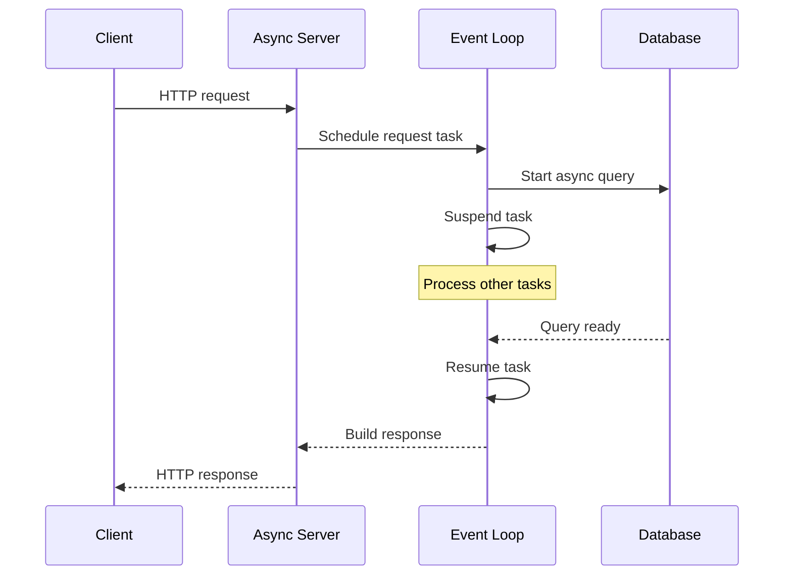
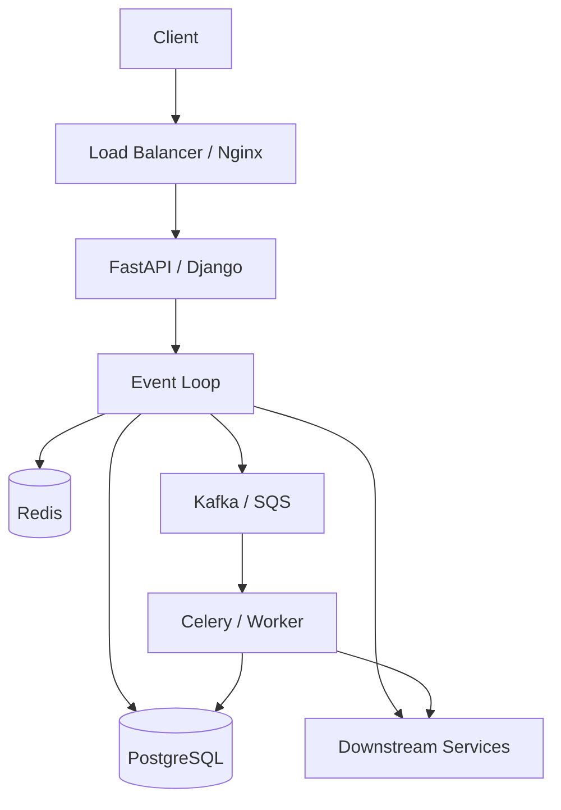

# 10- Event Loop

## Overview

The **event loop** is the execution engine behind Python's asynchronous programming model. It coordinates coroutines, tasks, timers, callbacks, and non-blocking I/O so that a single thread can make progress on many I/O-bound operations without blocking on each operation individually.

In Python, `async` and `await` provide the programming interface, while the event loop provides the runtime mechanism that drives those operations.

```text
async def
    ↓
Coroutine
    ↓
Task
    ↓
Event Loop
    ↓
Non-blocking I/O
    ↓
I/O readiness
    ↓
Resume Task
```

A production backend using FastAPI, asynchronous PostgreSQL, Redis, HTTP, or gRPC typically relies on this model.

The central engineering principle is:

> An event loop is effective when application code frequently yields control while waiting for I/O.

If synchronous blocking work runs on the event-loop thread, unrelated requests and tasks can stall.

---

## What Is an Event Loop?

An event loop is a scheduler that repeatedly:

1. checks which asynchronous operations are ready;
2. runs callbacks or advances ready tasks;
3. registers or waits for I/O readiness;
4. resumes suspended tasks when their awaited operations become available;
5. repeats until there is no more work.

A simplified model is:

```text
while application_is_running:
    run_ready_tasks()
    process_callbacks()
    process_timers()
    wait_for_io()
```

The actual implementation is more sophisticated, but this model is useful for understanding application behavior.

---

## Why Event Loops Exist

Traditional synchronous code commonly follows:

```text
Request A
   ↓
Wait for database
   ↓
Continue
   ↓
Response

Request B
   ↓
Wait for database
   ↓
Continue
```

The executing thread spends significant time waiting.

An event loop changes the execution model:

```text
Task A → database I/O → suspend
Task B → database I/O → suspend
Task C → HTTP I/O → suspend
Task A → database ready → resume
Task C → HTTP ready → resume
Task B → database ready → resume
```

The thread remains productive while operations are waiting for external resources.

This makes event loops particularly effective for:

- HTTP APIs
- database access
- Redis
- network clients
- WebSockets
- gRPC
- message consumers
- high-concurrency I/O services

---

## Event Loop vs Thread

An event loop is not equivalent to a thread.

A common architecture is:

```text
Process
└── Main Thread
    └── Event Loop
        ├── Task A
        ├── Task B
        ├── Task C
        └── Task D
```

One thread can execute many asynchronous tasks because tasks voluntarily suspend at awaitable operations.

By contrast:

```text
Process
├── Thread A
├── Thread B
├── Thread C
└── Thread D
```

uses operating-system threads.

| Property | Event Loop | Threads |
|---|---|---|
| Scheduling | Cooperative | OS/preemptive |
| Typical execution | One thread | Multiple threads |
| Best for | I/O concurrency | I/O and blocking libraries |
| Context switching | Lightweight task switching | More expensive |
| Shared memory | Same process | Same process |
| Blocking risk | Very high | Usually isolated to blocked thread |
| CPU parallelism in traditional CPython | No | No for Python bytecode |
| Cancellation | Built into async model | Usually cooperative |
| Typical abstraction | `asyncio` | `threading` |

The two models can also be combined.

---

## Event Loop and `asyncio`

Python's standard asynchronous framework is `asyncio`.

```python
import asyncio


async def main() -> None:
    await asyncio.sleep(1)
    print("done")


asyncio.run(main())
```

`asyncio.run()` creates and manages an event loop for the top-level coroutine.

Conceptually:

```text
asyncio.run(main())
        ↓
Create event loop
        ↓
Run main coroutine
        ↓
Drive child tasks and I/O
        ↓
Complete main
        ↓
Clean up
        ↓
Close event loop
```

Application servers such as Uvicorn typically manage the event-loop lifecycle themselves, so application code normally should not create a new loop per request.

---

## Coroutine

An `async def` function creates a coroutine function.

```python
async def fetch_customer(customer_id: int) -> dict:
    ...
```

Calling it produces a coroutine object:

```python
coroutine = fetch_customer(42)
```

The coroutine does not execute merely because it was created.

It must be:

- awaited;
- scheduled as a task;
- or otherwise driven by an event loop.

---

## Task

A task wraps a coroutine and schedules it on an event loop.

```python
import asyncio


async def fetch_customer(customer_id: int) -> dict:
    ...


async def main() -> None:
    task = asyncio.create_task(
        fetch_customer(42)
    )

    customer = await task
```

Conceptually:

```text
Coroutine
    ↓
create_task()
    ↓
Task
    ↓
Event Loop
    ↓
Execution
```

A task provides lifecycle management around a coroutine.

---

## Coroutine vs Task

| Concept | Meaning |
|---|---|
| Coroutine function | Function declared with `async def` |
| Coroutine object | Result of calling the coroutine function |
| Task | Scheduled coroutine managed by the event loop |
| Future | Low-level placeholder representing eventual completion |
| Event loop | Runtime scheduler driving asynchronous work |

Understanding these distinctions is important when debugging asynchronous systems.

---

## The Event Loop Execution Cycle

A simplified event-loop cycle looks like:

```text
                 ┌────────────────────┐
                 │    Ready Tasks     │
                 └─────────┬──────────┘
                           ↓
                  Execute ready work
                           ↓
                    Task reaches
                    await point
                           ↓
                ┌──────────┴──────────┐
                ↓                     ↓
             Timer                 I/O wait
                ↓                     ↓
                └──────────┬──────────┘
                           ↓
                    Operation ready
                           ↓
                     Task runnable
                           ↓
                  Execute next cycle
```

The event loop does not continuously execute every task.

Instead, it advances tasks when they are runnable.

---

## Cooperative Scheduling

Asyncio uses cooperative scheduling.

A task continues executing until it:

- completes;
- raises an exception;
- awaits an operation;
- or otherwise yields control.

For example:

```python
async def handler() -> None:
    result = await fetch_from_database()
    await send_response(result)
```

The task yields at the `await` points.

This differs from preemptive thread scheduling, where the operating system can interrupt a thread independently of application-level cooperation.

---

## The Most Important Rule

Never block the event-loop thread with long-running synchronous work.

Bad:

```python
async def handler() -> None:
    time.sleep(5)
```

This blocks the event loop for approximately five seconds.

Correct for an asynchronous delay:

```python
async def handler() -> None:
    await asyncio.sleep(5)
```

The second version suspends the task and allows other tasks to run.

---

## Event-Loop Blocking

Consider:

```python
async def request_handler() -> dict:
    result = expensive_cpu_function()
    return result
```

Even though the function is declared `async`, the CPU-heavy function runs synchronously.

During that period:

```text
Event Loop
    ↓
request_handler()
    ↓
CPU-heavy function
    ↓
BLOCKED
    ↓
Other tasks cannot execute
```

This can cause:

- increased latency;
- poor p99 response times;
- connection buildup;
- request timeouts;
- apparent application-wide slowness.

---

## Blocking I/O

The same problem occurs with synchronous I/O libraries.

Bad:

```python
import requests


async def get_customer() -> dict:
    response = requests.get(
        "https://customer-service.internal"
    )

    return response.json()
```

`requests.get()` blocks the event-loop thread.

Use an asynchronous client instead:

```python
async def get_customer() -> dict:
    response = await http_client.get(
        "https://customer-service.internal"
    )

    return response.json()
```

The client itself must provide genuine asynchronous I/O.

---

## Offloading Blocking Work

When a synchronous dependency cannot be replaced, move it away from the event-loop thread.

```python
import asyncio


async def get_customer() -> dict:
    return await asyncio.to_thread(
        synchronous_client.get_customer,
        42,
    )
```

Conceptually:

```text
Event Loop Thread
       │
       │ await
       ↓
Thread Pool
       │
       ↓
Blocking operation
       │
       ↓
Result
       │
       ↓
Event Loop resumes
```

This is useful for blocking I/O.

It is generally not the preferred solution for CPU-heavy pure Python work.

---

## CPU-Bound Work

The event loop is not a CPU parallelism mechanism.

Bad:

```python
async def generate_report() -> bytes:
    return render_large_report()
```

If `render_large_report()` consumes significant CPU, it blocks the event loop.

For CPU-heavy workloads, consider:

```text
Event Loop
    ↓
Process Pool
    ↓
CPU-intensive computation
```

or move the work to a durable background worker such as Celery.

---

## Event Loop and the GIL

In traditional CPython builds, the GIL prevents multiple threads within the same interpreter from executing Python bytecode simultaneously.

The event loop normally runs in one thread, so asyncio does not bypass the GIL.

Its advantage comes from:

```text
Task A waits for I/O
        ↓
Event loop runs Task B
        ↓
Task B waits for I/O
        ↓
Event loop runs Task C
```

not from executing Python bytecode on multiple CPU cores.

---

## Event Loop and Native Code

Some native libraries release the GIL during expensive operations.

This does not automatically mean such operations are safe to perform on the event-loop thread.

The event-loop question is separate:

> Does this operation return control to the event loop while it is waiting or computing?

A native operation can release the GIL and still occupy the event-loop thread.

---

## Awaitables

The event loop drives awaitable objects.

Common awaitables include:

- coroutine objects;
- `asyncio.Task`;
- `asyncio.Future`;
- objects implementing the relevant asynchronous protocol.

Example:

```python
async def fetch() -> str:
    return "ok"


async def main() -> None:
    result = await fetch()
    print(result)
```

`await fetch()` suspends the current coroutine until `fetch()` completes.

---

## Futures

A future represents a result that may become available later.

```python
future = loop.create_future()
```

A future is generally lower-level than a task.

Typical application code should usually work with:

- coroutines;
- tasks;
- `TaskGroup`;
- high-level async libraries.

Framework and library authors may need futures to bridge callback-based or low-level asynchronous systems.

---

## Callbacks

The event loop can also execute callbacks.

```python
loop.call_soon(callback)
```

Timers can be scheduled:

```python
loop.call_later(
    5,
    callback,
)
```

These lower-level APIs are useful when implementing frameworks or integrations, but application code should generally prefer coroutine-based interfaces when possible.

---

## Timers

Asyncio timers allow work to be scheduled without blocking the event-loop thread.

```python
await asyncio.sleep(2)
```

The task is suspended while the event loop handles other work.

Timer-based behavior is useful for:

- retry delays;
- periodic processing;
- timeout handling;
- scheduled internal operations.

For durable scheduling requirements, use dedicated infrastructure rather than relying on an in-process event loop.

---

## `asyncio.sleep()`

`asyncio.sleep()` is an important demonstration of cooperative scheduling.

```python
async def worker(name: str) -> None:
    for _ in range(3):
        print(name)
        await asyncio.sleep(1)
```

Multiple workers can overlap:

```text
Worker A → sleep
Worker B → sleep
Worker C → sleep
Worker A → resume
Worker B → resume
Worker C → resume
```

By contrast:

```python
time.sleep(1)
```

blocks the event-loop thread.

---

## Task Scheduling

Use `asyncio.create_task()` when a coroutine should run concurrently with the current coroutine.

```python
async def load_data() -> None:
    task = asyncio.create_task(fetch_data())

    await do_other_work()

    result = await task
```

This gives the event loop an opportunity to execute `fetch_data()` while `do_other_work()` runs.

---

## Structured Concurrency

For related child tasks, prefer structured concurrency.

```python
async def load_dashboard() -> dict:
    async with asyncio.TaskGroup() as group:
        profile_task = group.create_task(
            fetch_profile()
        )
        orders_task = group.create_task(
            fetch_orders()
        )

    return {
        "profile": profile_task.result(),
        "orders": orders_task.result(),
    }
```

The `TaskGroup` owns the child tasks.

This makes:

- task lifetime;
- error propagation;
- cancellation;
- cleanup

easier to reason about.

---

## Event Loop and `gather()`

`asyncio.gather()` provides a convenient way to await multiple operations.

```python
profile, orders = await asyncio.gather(
    fetch_profile(),
    fetch_orders(),
)
```

The operations can progress concurrently while they are waiting for I/O.

Use structured concurrency where lifecycle and failure semantics need to be explicit.

---

## Task Cancellation

Tasks can be cancelled:

```python
task.cancel()
```

Cancellation is delivered through the coroutine's execution.

A task should normally allow cancellation to propagate:

```python
async def worker() -> None:
    try:
        await process()
    except asyncio.CancelledError:
        await cleanup()
        raise
```

Swallowing cancellation can interfere with shutdown and structured concurrency.

---

## Event Loop and Timeouts

Timeouts should be implemented explicitly.

```python
async with asyncio.timeout(2):
    result = await dependency.call()
```

This prevents a task from waiting indefinitely.

Timeouts should be aligned with:

- API latency budgets;
- load-balancer timeouts;
- client timeouts;
- downstream service behavior;
- database timeouts.

---

## Event Loop and I/O Multiplexing

Underneath high-level asyncio APIs, event loops rely on operating-system mechanisms for waiting on multiple I/O sources.

Depending on platform, mechanisms include technologies such as:

- `epoll` on Linux;
- `kqueue` on BSD/macOS;
- IOCP-related mechanisms on Windows.

The important principle is:

```text
Many sockets
      ↓
OS I/O readiness mechanism
      ↓
Event loop
      ↓
Resume relevant tasks
```

The event loop does not need one thread blocked on every socket.

---

## Networking Flow

A simplified HTTP request can look like:



The critical step is suspension while the database operation is pending.

---

## FastAPI and Uvicorn

A typical deployment might look like:

```text
Nginx / Load Balancer
          ↓
      Uvicorn
          ↓
       Process
          ↓
      Event Loop
      ├── Request A
      ├── Request B
      ├── Request C
      └── Request D
```

An endpoint:

```python
@app.get("/customers/{customer_id}")
async def get_customer(customer_id: int):
    return await service.get_customer(
        customer_id
    )
```

can handle many concurrent requests efficiently when its dependencies are also asynchronous.

---

## Django and Event Loops

Django supports asynchronous views:

```python
async def customer_view(request):
    customer = await service.get_customer()
    return JsonResponse(customer)
```

However, framework compatibility and database/client behavior must be considered.

An async view containing blocking operations can still block the underlying event-loop thread.

---

## Async Database Access

An asynchronous database client allows:

```python
customer = await repository.get_customer(
    customer_id
)
```

while the database operation is pending.

The event loop can execute other tasks.

The database connection pool still imposes a concurrency limit.

```text
10,000 Tasks
     ↓
DB Pool
     ↓
100 Connections
     ↓
PostgreSQL
```

Asyncio does not create unlimited database capacity.

---

## Async HTTP Clients

Reuse long-lived clients where appropriate:

```text
Application
    ↓
HTTP Client
    ↓
Connection Pool
    ├── Connection 1
    ├── Connection 2
    └── Connection N
```

Creating a new client for every request can increase:

- TCP connection setup;
- TLS negotiation;
- memory usage;
- file-descriptor consumption;
- latency.

---

## Redis

An asynchronous Redis client can integrate naturally with the event loop:

```python
value = await redis.get(
    f"customer:{customer_id}"
)
```

Use connection pooling and explicit timeouts.

High task concurrency should not translate directly into unlimited Redis connections.

---

## gRPC

Async gRPC clients can use the same event-loop model:

```python
response = await grpc_client.get_customer(
    request
)
```

The event loop can continue processing other requests while the RPC is in flight.

---

## Kafka

An asynchronous consumer can integrate event processing with the event loop:

```text
Kafka
  ↓
Async Consumer
  ↓
Event Loop
  ↓
Process Message
  ↓
Commit Offset
```

The event loop handles concurrency, but Kafka remains responsible for durable messaging and offset semantics.

---

## Backpressure

The event loop makes it easy to create large numbers of concurrent tasks.

That does not mean it should.

Consider:

```python
for item in items:
    asyncio.create_task(process(item))
```

If `items` contains millions of entries, this can consume substantial memory.

Instead, bound concurrency.

```python
semaphore = asyncio.Semaphore(50)


async def process_bounded(item):
    async with semaphore:
        return await process(item)
```

Concurrency limits protect both the application and downstream dependencies.

---

## Asyncio Queue

A bounded queue can provide local backpressure:

```python
queue: asyncio.Queue[dict] = asyncio.Queue(
    maxsize=1000
)
```

When the queue reaches capacity, producers wait:

```python
await queue.put(event)
```

This prevents unlimited in-memory accumulation.

For durable distributed workloads, use Kafka, SQS, Celery, or another appropriate queueing system.

---

## Event-Loop Starvation

Event-loop starvation occurs when the loop cannot get enough opportunities to run other tasks.

Common causes:

- CPU-heavy Python;
- synchronous HTTP;
- blocking database drivers;
- large serialization operations;
- expensive JSON processing;
- synchronous logging;
- unbounded loops;
- large in-memory transformations.

Symptoms include:

- rising p99 latency;
- request timeouts;
- delayed timers;
- slow WebSocket handling;
- growing connection queues.

---

## Detecting Event-Loop Blocking

Production monitoring should include event-loop responsiveness.

Useful signals include:

```text
Event-loop lag
Request latency
p95 / p99 latency
CPU utilization
Active tasks
Connection-pool wait time
Queue depth
Dependency latency
Timeout rate
```

A service can have low CPU utilization and still suffer severe latency if the event loop is blocked by a synchronous operation.

---

## Debugging

Asyncio provides debugging support.

For example:

```python
import asyncio


async def main() -> None:
    loop = asyncio.get_running_loop()
    loop.set_debug(True)

    await application()


asyncio.run(main())
```

Development and test environments can also use asyncio debug configuration to identify slow callbacks and problematic asynchronous behavior.

Avoid enabling expensive debugging settings indiscriminately in high-throughput production environments without measuring their impact.

---

## Testing Event-Loop Behavior

Async tests should test behavior rather than timing assumptions.

Prefer:

```python
event = asyncio.Event()

await event.wait()
```

over:

```python
await asyncio.sleep(0.1)
```

for synchronization.

Test:

- concurrent execution;
- cancellation;
- timeouts;
- task failures;
- resource cleanup;
- bounded concurrency;
- event-loop blocking;
- dependency failures.

---

## Async Race Conditions

Because tasks can interleave at `await` points, race conditions remain possible.

```python
balance = 100


async def withdraw(amount: int) -> None:
    global balance

    current = balance
    await asyncio.sleep(0)
    balance = current - amount
```

Two tasks can observe the same value before either writes the new value.

Use:

```python
lock = asyncio.Lock()
```

when appropriate for process-local coordination.

For persistent shared state, prefer database transactions or appropriate distributed coordination.

---

## Event Loop and Locks

Asyncio synchronization primitives are designed for asynchronous tasks.

Examples include:

- `asyncio.Lock`
- `asyncio.Semaphore`
- `asyncio.Event`
- `asyncio.Condition`
- `asyncio.Queue`

They should not be treated as universal synchronization mechanisms.

An `asyncio.Lock` does not coordinate:

```text
Pod A
Pod B
Pod C
```

in Kubernetes.

---

## Multiple Event Loops

A process may technically have multiple event loops in different threads, but this is an advanced design and should not be introduced casually.

A more common production model is:

```text
Pod
├── Worker Process 1
│   └── Event Loop
└── Worker Process 2
    └── Event Loop
```

Each process has its own event loop and its own local task state.

Scaling across CPU cores is typically achieved by running multiple processes and/or Kubernetes replicas.

---

## High Availability

An event loop is process-local.

If a process crashes:

```text
Process
   ↓
Event Loop
   ↓
Tasks
   ↓
Lost
```

In-memory tasks are not durable.

For high availability:

```text
Load Balancer
   ↓
Multiple Pods
   ├── Event Loop
   ├── Event Loop
   └── Event Loop
```

Critical work should be persisted or placed into durable infrastructure.

---

## Graceful Shutdown

A production event-loop application should handle termination signals.

A typical shutdown sequence is:

```text
SIGTERM
   ↓
Stop accepting new work
   ↓
Stop scheduling new background tasks
   ↓
Cancel or drain active tasks
   ↓
Close HTTP clients
   ↓
Close DB pools
   ↓
Close Redis clients
   ↓
Flush required telemetry
   ↓
Exit
```

This is particularly important in Kubernetes, where deployments routinely terminate application processes.

---

## Event Loop and Background Tasks

Avoid unmanaged background tasks:

```python
asyncio.create_task(send_email())
```

if the email is business-critical.

The task may disappear when:

- the process crashes;
- the pod is terminated;
- the application restarts;
- the event loop closes.

Use a durable queue for important asynchronous work.

---

## Event Loop and Celery

The event loop and Celery solve different problems.

```text
Asyncio
→ concurrent I/O inside a process

Celery
→ distributed background task execution
```

They can coexist:

```text
FastAPI
   ↓
Event Loop
   ↓
Publish Job
   ↓
Broker
   ↓
Celery Worker
```

This separates request latency from long-running background work.

---

## Event Loop and AWS

An asynchronous Python service deployed on AWS may look like:

```text
Internet
   ↓
ALB
   ↓
ECS / EKS
   ↓
FastAPI + Uvicorn
   ↓
Event Loop
   ├── RDS PostgreSQL
   ├── ElastiCache Redis
   ├── Internal HTTP services
   └── Kafka / SQS
```

The event loop improves application-side I/O concurrency, but AWS service quotas, connection limits, network capacity, and database capacity remain hard constraints.

---

## Scalability

Asyncio scales concurrency primarily by reducing the number of threads required for many waiting operations.

It does not remove resource limits.

The actual capacity is constrained by:

```text
Application CPU
Application memory
Event-loop responsiveness
Database connections
Database throughput
HTTP connection pools
File descriptors
Network bandwidth
Downstream rate limits
External service quotas
```

A mature capacity model accounts for all of them.

---

## Cost Considerations

Async I/O can reduce the number of threads and processes required for highly concurrent I/O workloads.

Potential benefits include:

- lower memory overhead;
- fewer thread context switches;
- higher connection concurrency per process;
- better utilization of compute resources.

But excessive concurrency can increase:

- downstream infrastructure costs;
- database load;
- network traffic;
- retry volume;
- memory usage.

The goal is controlled concurrency, not maximum concurrency.

---

## Security Considerations

Event-loop applications should defend against resource exhaustion.

Controls include:

- request-size limits;
- authentication;
- authorization;
- rate limiting;
- concurrency limits;
- timeouts;
- bounded queues;
- per-tenant quotas;
- connection limits;
- maximum fan-out.

An attacker who can trigger expensive asynchronous fan-out can consume significant resources even when individual operations appear inexpensive.

---

## Disaster Recovery

The event loop itself has no disaster-recovery properties.

In-memory state disappears when the process disappears.

Durable state should reside in systems such as:

- PostgreSQL;
- S3;
- Kafka;
- SQS;
- Redis where appropriate for recoverable cache/state use cases.

For critical workflows:

```text
Request
  ↓
Persist intent / enqueue durable job
  ↓
Process asynchronously
  ↓
Persist result
```

Do not rely on an in-memory task surviving infrastructure failure.

---

## Common Mistakes

| Mistake | Why it fails | Better approach |
|---|---|---|
| `time.sleep()` in async code | Blocks event loop | `await asyncio.sleep()` |
| `requests.get()` in async handler | Blocks event loop | Async HTTP client |
| CPU-heavy computation in event loop | Starves other tasks | Process pool / worker |
| Unlimited `create_task()` | Memory and dependency overload | Bound concurrency |
| Creating clients per request | Connection overhead | Reuse pooled clients |
| Ignoring cancellation | Broken shutdown semantics | Propagate cancellation |
| Using local locks for distributed state | Lock is process-local | DB transaction/distributed coordination |
| Fire-and-forget critical work | Work can be lost | Durable queue |
| Assuming `async def` means non-blocking | Implementation may still block | Audit every dependency |
| Measuring only average latency | Hides tail latency | Track p95/p99 |

---

## Interview Traps

### Is asyncio parallel?

Not by itself.

Asyncio provides cooperative concurrency, typically within one event-loop thread.

### Does `await` create a new thread?

No.

It suspends the current coroutine and allows the event loop to run other work.

### Does asyncio bypass the GIL?

No.

Asyncio primarily improves I/O concurrency rather than CPU parallelism.

### Can async code have race conditions?

Yes.

Tasks can interleave at suspension points, and shared mutable state can still be inconsistent.

### Can an event loop execute CPU-bound code?

It can, but doing substantial CPU-bound work there blocks other tasks.

### Does creating many tasks make the application faster?

No.

Unbounded concurrency can reduce performance through memory pressure, connection exhaustion, downstream overload, and scheduling overhead.

### Is an asyncio task durable?

No.

It is process-local in-memory work.

### Can an asyncio lock coordinate Kubernetes pods?

No.

It does not provide distributed locking.

---

## Production Architecture

A mature asynchronous backend might use:



The event loop is one part of the architecture, not the entire concurrency strategy.

---

## Event Loop vs Other Concurrency Models

| Model | Best fit | CPU parallelism | Blocking I/O handling | Durable |
|---|---|---:|---:|---:|
| Asyncio | High-volume I/O | No | Excellent when async | No |
| Threads | Blocking I/O | Limited in traditional CPython | Good | No |
| Processes | CPU-bound work | Yes | Possible | No |
| Celery | Background jobs | Yes, via workers | Yes | Queue-dependent |
| Kafka consumers | Event processing | Consumer/process dependent | Yes | Yes |

A production system frequently combines multiple models.

---

## Senior Engineering Decision Framework

When evaluating an event-loop architecture, ask:

### Is the workload I/O-bound?

If yes, async execution may be appropriate.

### Are the dependencies actually asynchronous?

Check:

- HTTP client;
- database driver;
- Redis client;
- gRPC library;
- filesystem behavior;
- SDKs.

### Can concurrency be bounded?

Define:

- maximum in-flight requests;
- connection-pool sizes;
- semaphore limits;
- queue sizes;
- per-tenant limits.

### What happens when a dependency fails?

Define:

- timeout;
- retry;
- backoff;
- jitter;
- circuit breaking;
- fallback;
- cancellation.

### What happens during shutdown?

Verify that:

- requests stop entering;
- tasks drain or cancel;
- clients close;
- queues are handled;
- telemetry is flushed.

### What happens when the process crashes?

If work must survive, it must be durable outside the event loop.

---

## Production Checklist

- [ ] Event-loop workloads are primarily I/O-bound.
- [ ] All major dependencies have been audited for blocking behavior.
- [ ] Async HTTP clients are used where appropriate.
- [ ] Async database and Redis clients are used where supported.
- [ ] Blocking libraries are explicitly offloaded.
- [ ] CPU-heavy work is moved to processes or workers.
- [ ] Connection pools have explicit limits.
- [ ] Task concurrency is bounded.
- [ ] Request fan-out is bounded.
- [ ] Timeouts exist at appropriate layers.
- [ ] Retries use bounded exponential backoff and jitter.
- [ ] Cancellation propagates correctly.
- [ ] `CancelledError` is not accidentally swallowed.
- [ ] Structured concurrency is used for related child tasks.
- [ ] Background tasks are not relied upon for durable business operations.
- [ ] Event-loop latency is monitored.
- [ ] p95 and p99 latency are tracked.
- [ ] Memory usage under high concurrency has been measured.
- [ ] File-descriptor limits have been evaluated.
- [ ] Graceful shutdown has been tested.
- [ ] Kubernetes termination behavior has been tested.
- [ ] Database and downstream capacity are included in concurrency planning.
- [ ] Async tests do not depend on arbitrary sleeps.
- [ ] Resource cleanup works during cancellation.
- [ ] Load tests include dependency saturation and failure scenarios.
- [ ] Local synchronization is not incorrectly used as distributed coordination.
- [ ] Critical asynchronous work is persisted or queued durably.
- [ ] Capacity and cost are evaluated across the entire deployment topology.

## Key Takeaways

- **The event loop is the execution engine behind asyncio:** it advances runnable coroutines and waits efficiently for I/O readiness instead of dedicating a blocked thread to every operation.
- **Asyncio provides cooperative concurrency, not CPU parallelism:** tasks must yield at appropriate suspension points, and blocking or CPU-heavy work can stall the entire event loop.
- **`async def` does not guarantee non-blocking execution:** every dependency must be genuinely asynchronous or explicitly moved to a thread/process when appropriate.
- **Production event loops require controlled concurrency:** connection pools, semaphores, queues, timeouts, cancellation, backpressure, and observability prevent high concurrency from becoming resource exhaustion.
- **Event-loop state is process-local and ephemeral:** critical work must use durable systems such as PostgreSQL, Kafka, SQS, or worker infrastructure when it must survive crashes, deployments, or pod termination.