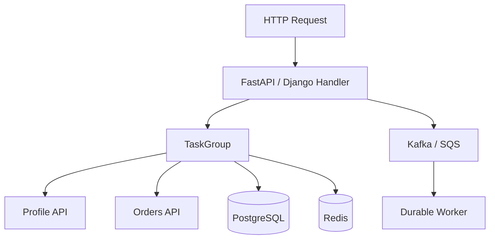

# 11- Asyncio Tasks

## Overview

An `asyncio.Task` is the runtime object that schedules and manages the execution of a coroutine on an event loop.

Coroutines describe asynchronous work:

```python
async def fetch_customer(customer_id: int) -> dict:
    ...
```

Tasks make that work independently runnable by the event loop:

```python
task = asyncio.create_task(
    fetch_customer(42)
)
```

The distinction matters:

```text
Coroutine
    ↓
create_task()
    ↓
Task
    ↓
Event Loop
    ↓
Coroutine execution
    ↓
await I/O
    ↓
Task suspended
    ↓
Event Loop runs other tasks
    ↓
I/O ready
    ↓
Task resumes
```

Tasks are the primary mechanism for expressing concurrent asynchronous work within an asyncio event loop.

They are especially useful for backend workloads such as:

- concurrent HTTP requests;
- database operations;
- Redis operations;
- gRPC calls;
- WebSocket handling;
- asynchronous message processing;
- bounded fan-out/fan-in workflows.

A task is **not** a thread, process, or durable background job. It is an in-memory, event-loop-managed unit of asynchronous execution.

---

## Coroutine vs Task

A coroutine function:

```python
async def fetch_customer(customer_id: int) -> dict:
    ...
```

returns a coroutine object when called:

```python
coroutine = fetch_customer(42)
```

The coroutine object represents work that has not necessarily been scheduled.

A task schedules that coroutine:

```python
task = asyncio.create_task(
    fetch_customer(42)
)
```

The distinction can be summarized as:

| Object | Purpose | Scheduled? | Managed by event loop? |
|---|---|---:|---:|
| Coroutine function | Defines async behavior | No | No |
| Coroutine object | Represents async execution | Not necessarily | When driven |
| Task | Schedules and tracks a coroutine | Yes | Yes |
| Future | Represents eventual completion | Depends | Yes |

For application code, tasks are generally the preferred abstraction when independent asynchronous operations need to run concurrently.

---

## Creating Tasks

Use `asyncio.create_task()`:

```python
import asyncio


async def fetch_customer(customer_id: int) -> dict:
    await asyncio.sleep(0.1)
    return {"id": customer_id}


async def main() -> None:
    task = asyncio.create_task(
        fetch_customer(42)
    )

    customer = await task
    print(customer)


asyncio.run(main())
```

`create_task()` must be called while an event loop is running.

It schedules the coroutine to run on the current running loop.

---

## Why Tasks Exist

Consider sequential asynchronous operations:

```python
profile = await fetch_profile()
orders = await fetch_orders()
```

The second operation does not start until the first operation completes.

If the operations are independent, tasks can overlap them:

```python
profile_task = asyncio.create_task(
    fetch_profile()
)

orders_task = asyncio.create_task(
    fetch_orders()
)

profile = await profile_task
orders = await orders_task
```

The event loop can now progress both operations while they are waiting for I/O.

---

## Task Scheduling

Creating a task does not mean the coroutine immediately executes to completion.

```python
task = asyncio.create_task(operation())
```

means:

```text
Create Task
    ↓
Register Task with event loop
    ↓
Task becomes runnable
    ↓
Event loop gets opportunity to execute it
```

The current coroutine continues until it reaches a suspension point or completes.

This distinction is important when reasoning about ordering.

---

## Task Execution Model

Suppose:

```python
async def worker(name: str) -> None:
    print(f"{name}: start")
    await asyncio.sleep(1)
    print(f"{name}: finish")
```

Then:

```python
async def main() -> None:
    task_a = asyncio.create_task(worker("A"))
    task_b = asyncio.create_task(worker("B"))

    await task_a
    await task_b
```

Conceptually:

```text
Event Loop
   │
   ├── Task A → start → await sleep
   │
   ├── Task B → start → await sleep
   │
   ├── Task A → resume → finish
   │
   └── Task B → resume → finish
```

There is concurrency because both tasks can make progress while their I/O/timers are pending.

---

## Tasks Are Cooperatively Scheduled

Asyncio tasks are cooperatively scheduled.

A task normally continues executing until it:

- completes;
- raises an exception;
- reaches an `await` that suspends;
- otherwise yields control.

For example:

```python
async def handler() -> None:
    result = await fetch_data()
    process(result)
```

The event loop can run another task while `fetch_data()` is waiting.

But this:

```python
async def handler() -> None:
    process_large_dataset()
```

can block the event loop if `process_large_dataset()` performs substantial synchronous CPU work.

---

## Task Lifecycle

A task can conceptually transition through:

```text
Created
   ↓
Scheduled
   ↓
Running
   ↓
Suspended
   ↓
Runnable
   ↓
Running
   ↓
Completed
```

It can instead terminate through:

```text
Exception
Cancellation
```

A task exposes state and result information that can be used for coordination and debugging.

---

## Task Results

Awaiting a task returns the coroutine's result:

```python
task = asyncio.create_task(
    fetch_customer(42)
)

customer = await task
```

If the coroutine raises an exception, awaiting the task raises that exception:

```python
task = asyncio.create_task(
    failing_operation()
)

try:
    await task
except RuntimeError:
    handle_failure()
```

Exceptions therefore should not be ignored simply because the work was started as a task.

---

## Task Exceptions

Consider:

```python
async def failing_worker() -> None:
    raise RuntimeError("worker failed")


async def main() -> None:
    task = asyncio.create_task(
        failing_worker()
    )

    await task
```

The exception propagates through `await task`.

If a task is created and its result is never observed, failures can become difficult to diagnose and may produce warnings or otherwise escape normal application error handling.

---

## Task Ownership

Every task should have a clear owner.

Good:

```python
async def handler() -> None:
    task = asyncio.create_task(
        perform_operation()
    )

    await task
```

The request handler owns the task.

More robust structured concurrency:

```python
async def handler() -> None:
    async with asyncio.TaskGroup() as group:
        group.create_task(operation_a())
        group.create_task(operation_b())
```

The `TaskGroup` owns both tasks.

Avoid creating tasks whose lifecycle is unclear.

---

## Task References

Keep a reference when the task's lifecycle must be explicitly managed:

```python
task = asyncio.create_task(
    operation()
)

try:
    await task
finally:
    if not task.done():
        task.cancel()
```

For application-level concurrent workflows, structured task ownership is usually preferable to maintaining large collections of unmanaged tasks.

---

## Task Groups

Modern Python provides `asyncio.TaskGroup` for structured concurrency.

```python
import asyncio


async def load_customer_data(
    customer_id: int,
) -> dict:
    async with asyncio.TaskGroup() as group:
        profile_task = group.create_task(
            fetch_profile(customer_id)
        )
        orders_task = group.create_task(
            fetch_orders(customer_id)
        )

    return {
        "profile": profile_task.result(),
        "orders": orders_task.result(),
    }
```

The group defines the lifetime of the child tasks.

When the `async with` block exits successfully, its child tasks have completed.

---

## TaskGroup Failure Semantics

Suppose multiple child tasks are running:

```text
TaskGroup
├── Profile
├── Orders
└── Recommendations
```

If one task fails, structured concurrency coordinates cancellation of related tasks.

Conceptually:

```text
Orders fails
    ↓
TaskGroup observes failure
    ↓
Cancel remaining children
    ↓
Wait for cleanup
    ↓
Propagate grouped failure
```

This prevents sibling tasks from accidentally continuing after the parent operation has already failed.

---

## `create_task()` vs `TaskGroup`

| Requirement | `create_task()` | `TaskGroup` |
|---|---:|---:|
| Schedule one task | Excellent | Good |
| Explicit task reference | Excellent | Excellent |
| Structured lifetime | Manual | Built in |
| Sibling failure coordination | Manual | Built in |
| Cancellation management | Manual | Better |
| Request-scoped concurrent work | Good | Usually preferred |
| Fire-and-forget | Possible but risky | Not the purpose |

Use `TaskGroup` when multiple child tasks form one logical operation.

Use `create_task()` when an independently managed task is genuinely appropriate.

---

## `asyncio.gather()`

`asyncio.gather()` is convenient for concurrent operations:

```python
profile, orders = await asyncio.gather(
    fetch_profile(customer_id),
    fetch_orders(customer_id),
)
```

It can also accept already-created tasks:

```python
profile_task = asyncio.create_task(
    fetch_profile(customer_id)
)

orders_task = asyncio.create_task(
    fetch_orders(customer_id)
)

profile, orders = await asyncio.gather(
    profile_task,
    orders_task,
)
```

For new structured application code, `TaskGroup` is often a better choice when task ownership and failure coordination matter.

---

## `gather()` Result Ordering

Results correspond to the order of the awaitables passed to `gather()`.

```python
results = await asyncio.gather(
    operation_a(),
    operation_b(),
)
```

Therefore:

```text
results[0] → operation_a()
results[1] → operation_b()
```

even if `operation_b()` completes first.

---

## `gather()` Exception Behavior

Exception handling depends on `return_exceptions`.

Default:

```python
await asyncio.gather(
    operation_a(),
    operation_b(),
)
```

An exception is propagated to the caller.

With:

```python
await asyncio.gather(
    operation_a(),
    operation_b(),
    return_exceptions=True,
)
```

exceptions are returned as result values.

This can be useful when each operation should be independently evaluated, but it requires explicit result validation.

---

## `asyncio.wait()`

`asyncio.wait()` provides lower-level control over a collection of tasks.

```python
done, pending = await asyncio.wait(
    tasks,
    timeout=2,
)
```

This is useful when you need to distinguish:

```text
Completed tasks
Pending tasks
```

rather than simply collecting all results.

---

## `asyncio.as_completed()`

Use `as_completed()` when results should be processed as soon as individual tasks finish.

```python
tasks = [
    asyncio.create_task(fetch(item))
    for item in items
]

for completed in asyncio.as_completed(tasks):
    result = await completed
    process(result)
```

This differs from `gather()`:

```text
gather()
→ wait for all
→ return results in input order

as_completed()
→ process each result as it completes
```

This is useful for fan-out/fan-in workflows where early results have value.

---

## Task Cancellation

Tasks support cancellation:

```python
task.cancel()
```

Cancellation is cooperative.

Python does not forcibly terminate arbitrary execution at an instruction boundary.

A cancellation request causes `asyncio.CancelledError` to be raised at an appropriate point in the task.

---

## Cancellation Flow

```text
Caller
  ↓
task.cancel()
  ↓
Task receives cancellation
  ↓
CancelledError
  ↓
Coroutine cleanup
  ↓
Cancellation propagates
```

A well-designed coroutine should release resources and normally re-raise cancellation.

---

## Handling Cancellation

Correct:

```python
async def worker() -> None:
    try:
        await process()
    except asyncio.CancelledError:
        await cleanup()
        raise
```

The `raise` is important.

Without it, the caller may incorrectly believe the operation completed normally.

---

## Cancellation During Cleanup

Cleanup itself should be designed carefully.

```python
async def worker() -> None:
    resource = await acquire()

    try:
        await process(resource)
    finally:
        await resource.close()
```

Async context managers are often preferable:

```python
async def worker() -> None:
    async with acquire_resource() as resource:
        await process(resource)
```

They make cleanup semantics explicit.

---

## Task Cancellation and Timeouts

Timeouts often trigger cancellation.

For example:

```python
async with asyncio.timeout(2):
    await task
```

If the timeout expires, cancellation propagates according to the timeout's semantics.

Therefore, timeout handling and cancellation handling should be designed together.

---

## Shielding

`asyncio.shield()` can prevent an awaited operation from being cancelled by cancellation of the surrounding task.

```python
await asyncio.shield(
    critical_operation()
)
```

Shielding should be used sparingly.

It can be appropriate when a short cleanup or commit operation must continue despite cancellation, but indiscriminate shielding can make shutdown and timeout behavior difficult to reason about.

---

## Task Naming

Tasks can be named for debugging:

```python
task = asyncio.create_task(
    process_customer(42),
    name="customer-42",
)
```

This is useful when inspecting running tasks.

Good task names can make production diagnostics significantly easier.

---

## Inspecting Tasks

Within a running event loop:

```python
for task in asyncio.all_tasks():
    print(task.get_name())
```

A task can expose:

```python
task.done()
task.cancelled()
task.exception()
```

Be careful when calling `task.exception()` because it should generally only be called once the task has completed.

---

## Current Task

Use:

```python
current = asyncio.current_task()
```

This can be useful for diagnostics and advanced framework code.

Application code should generally avoid relying heavily on implicit task identity.

Explicit context and dependency ownership are easier to reason about.

---

## Task Stack Inspection

For debugging, task stack information can help identify where a task is suspended:

```python
for task in asyncio.all_tasks():
    task.print_stack()
```

This is useful for diagnosing:

- tasks waiting indefinitely;
- unexpected task accumulation;
- deadlocks;
- long-running operations;
- shutdown problems.

Use debugging APIs carefully in production environments.

---

## Context Variables

Async tasks interact with Python's `contextvars` system.

For request-scoped information such as correlation IDs:

```python
from contextvars import ContextVar


request_id: ContextVar[str] = ContextVar(
    "request_id"
)
```

A task generally receives the current context when it is created.

This makes context variables useful for:

- request IDs;
- tracing metadata;
- tenant context;
- logging context.

Avoid using global mutable variables for request-scoped state.

---

## Task Context Example

```python
import asyncio
from contextvars import ContextVar


request_id = ContextVar("request_id")


async def worker() -> None:
    print(request_id.get())


async def handler() -> None:
    request_id.set("req-123")

    task = asyncio.create_task(worker())

    await task
```

The worker can access the context associated with its task.

This is especially useful for observability in asynchronous applications.

---

## Task Scheduling and Context

Task creation captures the current context by default.

This means task creation location can matter.

```python
request_id.set("request-a")

task = asyncio.create_task(worker())
```

The task inherits the relevant context at creation.

When designing libraries, be explicit about context-sensitive behavior because implicit context propagation can surprise users when tasks are created outside the expected request scope.

---

## Task Concurrency vs Parallelism

Tasks provide concurrency:

```text
Task A → await I/O
Task B → await I/O
Task C → await I/O
```

They do not automatically provide CPU parallelism.

For CPU-bound work:

```text
Event Loop
    ↓
Process Pool
    ↓
Multiple CPU cores
```

The event loop remains responsible for coordinating asynchronous application work.

---

## Bounded Task Concurrency

Avoid:

```python
tasks = [
    asyncio.create_task(process(item))
    for item in millions_of_items
]
```

This can consume large amounts of memory.

Use a bounded concurrency strategy.

```python
import asyncio


semaphore = asyncio.Semaphore(50)


async def process_bounded(item: dict) -> None:
    async with semaphore:
        await process(item)
```

The semaphore limits the number of active operations.

---

## Worker Pool Pattern

For large streams of work, a fixed number of consumers can be clearer:

```python
import asyncio


queue: asyncio.Queue[dict] = asyncio.Queue(
    maxsize=1000
)


async def worker() -> None:
    while True:
        item = await queue.get()

        try:
            await process(item)
        finally:
            queue.task_done()
```

Start a controlled number of workers:

```python
workers = [
    asyncio.create_task(worker())
    for _ in range(20)
]
```

This provides explicit concurrency control.

---

## Backpressure

Bounded concurrency prevents the producer from overwhelming downstream systems.

```text
Producer
   ↓
Bounded Queue
   ↓
20 Async Workers
   ↓
Database / API
```

If processing slows:

```text
Worker capacity decreases
        ↓
Queue grows
        ↓
Queue reaches limit
        ↓
Producer waits
```

This is backpressure.

Without it, asynchronous systems can accumulate unbounded in-memory work.

---

## Database Connection Pools

Tasks should not be confused with database connections.

For example:

```text
10,000 Tasks
      ↓
100 DB connections
      ↓
PostgreSQL
```

Most tasks may simply wait asynchronously for a connection.

The database pool remains a hard capacity boundary.

Concurrency should therefore be designed around downstream limits.

---

## HTTP Fan-Out

A service aggregator may create several tasks:

```python
async def build_response(
    customer_id: int,
) -> dict:
    async with asyncio.TaskGroup() as group:
        profile = group.create_task(
            profile_client.get(customer_id)
        )
        orders = group.create_task(
            order_client.list(customer_id)
        )
        billing = group.create_task(
            billing_client.get(customer_id)
        )

    return {
        "profile": profile.result(),
        "orders": orders.result(),
        "billing": billing.result(),
    }
```

This can reduce total latency when the downstream operations are independent.

---

## Fan-Out Failure

Fan-out increases failure complexity.

Suppose:

```text
Request
 ├── Profile ✓
 ├── Orders ✗
 └── Billing ✓
```

The service must define whether the response should:

- fail completely;
- return partial data;
- use cached data;
- use a fallback;
- retry the failed dependency.

Async task scheduling does not answer this business question.

---

## Partial Results

If partial success is valid, independent tasks can be evaluated individually.

For example:

```python
results = await asyncio.gather(
    fetch_profile(),
    fetch_orders(),
    fetch_recommendations(),
    return_exceptions=True,
)

profile, orders, recommendations = results
```

The application must explicitly distinguish successful values from exceptions.

Do not blindly serialize exception objects into API responses.

---

## Request Lifecycle

A production request may follow:

```text
HTTP request
    ↓
FastAPI endpoint
    ↓
Create child tasks
    ├── PostgreSQL
    ├── Redis
    └── HTTP service
    ↓
Await child completion
    ↓
Combine results
    ↓
HTTP response
```

If the client disconnects or the request times out, the application should ensure request-owned tasks do not continue performing unnecessary work.

---

## Request-Scoped Task Ownership

A strong design principle is:

> Tasks created for a request should normally have a lifecycle bounded by that request.

Structured concurrency supports this:

```python
async def endpoint() -> dict:
    async with asyncio.TaskGroup() as group:
        task_a = group.create_task(operation_a())
        task_b = group.create_task(operation_b())

    return {
        "a": task_a.result(),
        "b": task_b.result(),
    }
```

If work must outlive the request, it usually belongs in a durable background-processing architecture.

---

## Background Tasks

This pattern:

```python
asyncio.create_task(send_email())
```

does not provide durable background processing.

The task can be lost when:

- the process crashes;
- the pod restarts;
- Kubernetes terminates the process;
- the application is redeployed;
- the event loop shuts down.

For critical operations:

```text
API
 ↓
Durable queue
 ↓
Worker
 ↓
External service
```

Use Celery, SQS, Kafka, or another appropriate durable mechanism.

---

## Graceful Shutdown

During shutdown, tasks should be handled intentionally.

A typical flow:

```text
SIGTERM
   ↓
Stop accepting new requests
   ↓
Stop creating new tasks
   ↓
Drain/cancel request tasks
   ↓
Cleanup resources
   ↓
Close event loop
```

Detached tasks make this significantly harder.

Structured task ownership simplifies shutdown.

---

## Task Leaks

A task leak occurs when tasks accumulate without completing or being properly cancelled.

Common causes include:

- infinite background tasks;
- blocked operations;
- missing timeouts;
- forgotten task references;
- tasks waiting on queues forever;
- failed shutdown logic.

Monitor active-task counts where appropriate.

---

## Task Lifetime

A task should have a clearly defined lifetime.

```text
Request
  ↓
Task created
  ↓
Task runs
  ↓
Task completes
  ↓
Result consumed
  ↓
Task released
```

For long-running workers:

```text
Application startup
  ↓
Worker task
  ↓
Run until shutdown
  ↓
Cancel
  ↓
Cleanup
  ↓
Exit
```

Different task lifetimes require different ownership strategies.

---

## Long-Running Tasks

Long-lived tasks are appropriate for certain process-local infrastructure:

- local queue consumers;
- WebSocket managers;
- periodic maintenance loops;
- internal event dispatchers.

Example:

```python
async def poller(
    stop_event: asyncio.Event,
) -> None:
    while not stop_event.is_set():
        await poll_once()

        try:
            await asyncio.wait_for(
                stop_event.wait(),
                timeout=10,
            )
        except asyncio.TimeoutError:
            continue
```

The shutdown mechanism should be explicit.

---

## Periodic Tasks

Avoid naive loops:

```python
while True:
    await do_work()
    await asyncio.sleep(60)
```

if exact scheduling or drift matters.

For simple best-effort periodic work, this can be acceptable.

For business-critical scheduling, use durable schedulers or job infrastructure.

An in-process timer disappears when the process disappears.

---

## Task Queue vs Kafka

An `asyncio.Queue` is:

- process-local;
- in-memory;
- ephemeral.

Kafka is:

- distributed;
- durable;
- replayable;
- partitioned.

Therefore:

```text
asyncio.Queue
→ local coordination/backpressure

Kafka
→ durable distributed event streaming
```

Do not substitute one for the other based solely on API similarity.

---

## Performance

Tasks are generally cheaper than operating-system threads, but they are not free.

Each task can retain:

- coroutine state;
- local variables;
- references to request data;
- awaited objects;
- exceptions;
- buffers.

Thousands of tasks can therefore consume significant memory.

The correct goal is:

```text
Enough concurrency to hide I/O latency
+
Enough limits to protect system capacity
```

---

## Task Scheduling Overhead

Too many tiny tasks can reduce performance.

For example:

```python
for item in small_items:
    asyncio.create_task(tiny_operation(item))
```

may create more scheduling overhead than useful concurrency.

Task granularity should be large enough to justify scheduling overhead.

Benchmark realistic workloads rather than assuming more tasks means better throughput.

---

## Event-Loop Latency

A large number of runnable tasks can increase scheduling pressure.

More importantly, one blocking operation can stall all tasks on the loop.

Monitor:

```text
Event-loop lag
Active task count
Task duration
CPU usage
Memory usage
Queue depth
Connection-pool wait time
```

Tail latency is particularly important for API workloads.

---

## Timeouts and Task Budgets

Every external operation should have a reasonable time budget.

```python
async def fetch_customer() -> dict:
    async with asyncio.timeout(2):
        return await client.get_customer()
```

For fan-out requests, the total request deadline should be coordinated with individual dependency deadlines.

```text
Request budget: 2.0s
├── Profile: 500ms
├── Orders: 700ms
└── Billing: 500ms
```

The exact values depend on the service's latency requirements.

---

## Retries and Tasks

Retries can multiply task concurrency.

Bad architecture:

```text
100 requests
 ×
3 retries
 ×
5 downstream calls
=
1500 downstream operations
```

Use:

- bounded retries;
- exponential backoff;
- jitter;
- concurrency limits;
- idempotency;
- circuit breakers where appropriate.

Retries should not create an uncontrolled feedback loop.

---

## Security

Tasks can amplify resource-exhaustion risks.

An attacker who causes a request to fan out into many tasks may consume:

- memory;
- sockets;
- database connections;
- downstream API quotas;
- CPU;
- network bandwidth.

Mitigate with:

- authentication;
- authorization;
- rate limiting;
- request limits;
- bounded fan-out;
- semaphores;
- timeouts;
- per-tenant quotas.

---

## Reliability

Task-based systems should define behavior for:

- task failure;
- cancellation;
- timeout;
- dependency outage;
- process crash;
- deployment;
- partial fan-out;
- resource exhaustion.

A useful reliability principle is:

> Every asynchronous task needs explicit success, failure, cancellation, and ownership semantics.

---

## High Availability

Tasks are process-local.

If a pod terminates:

```text
Pod
 ↓
Process
 ↓
Event Loop
 ↓
Tasks
 ↓
Lost
```

Therefore, task execution should not be the sole persistence mechanism for important business operations.

Use multiple application replicas and durable state for high availability.

---

## Disaster Recovery

In-memory tasks do not survive process or infrastructure failure.

For durable workflows:

```text
Request
   ↓
Persist / enqueue
   ↓
Worker
   ↓
Persist result
```

This allows processing to resume after:

- pod termination;
- node failure;
- application crash;
- deployment;
- regional infrastructure failure, depending on the architecture.

---

## Observability

Useful task-level observability includes:

| Signal | Purpose |
|---|---|
| Active tasks | Detect accumulation |
| Task duration | Identify slow operations |
| Event-loop lag | Detect blocking/starvation |
| Task failures | Detect async errors |
| Cancellation count | Detect shutdown/timeouts |
| Queue depth | Detect backpressure |
| Pool wait time | Detect downstream saturation |
| p95/p99 latency | Detect user-visible degradation |

Include correlation IDs in task logging.

---

## Logging

Prefer structured logs:

```python
logger.info(
    "customer_task_completed",
    extra={
        "customer_id": customer_id,
        "task_name": asyncio.current_task().get_name(),
    },
)
```

Avoid relying solely on thread identifiers because many asyncio tasks can execute on the same thread.

Use request IDs and task names to make asynchronous execution traceable.

---

## Tracing

Distributed tracing should preserve context across asynchronous boundaries.

A request might look like:

```text
HTTP Request
   ↓
Trace Span
   ↓
Task A ──→ PostgreSQL
   ↓
Task B ──→ Redis
   ↓
Task C ──→ HTTP Service
```

Tracing tools and framework instrumentation should be configured to propagate context correctly.

---

## Testing Tasks

Test task lifecycle explicitly.

Important cases include:

- successful completion;
- exception propagation;
- cancellation;
- timeout;
- concurrent execution;
- bounded concurrency;
- sibling failure;
- cleanup;
- shutdown.

Avoid synchronization based purely on arbitrary sleeps.

Prefer explicit events, queues, or controlled test doubles.

---

## Example: Testing Cancellation

```python
import asyncio
import pytest


async def worker(
    stopped: asyncio.Event,
) -> None:
    try:
        await asyncio.sleep(60)
    except asyncio.CancelledError:
        stopped.set()
        raise


@pytest.mark.asyncio
async def test_worker_cancellation() -> None:
    stopped = asyncio.Event()

    task = asyncio.create_task(
        worker(stopped)
    )

    task.cancel()

    with pytest.raises(asyncio.CancelledError):
        await task

    assert stopped.is_set()
```

The test verifies both cancellation propagation and cleanup behavior.

---

## Common Mistakes

### Creating a Coroutine Without Scheduling It

Bad:

```python
operation()
```

if the coroutine result is discarded.

Correct:

```python
await operation()
```

or:

```python
task = asyncio.create_task(operation())
await task
```

### Creating Tasks Without Ownership

Bad:

```python
asyncio.create_task(operation())
```

for critical work with no lifecycle management.

Use structured concurrency or durable background infrastructure.

### Ignoring Task Exceptions

A task that fails without its result being observed can make failures difficult to diagnose.

### Unlimited Task Creation

Creating one task per record for millions of records can exhaust memory.

Use bounded workers, semaphores, or queues.

### Blocking Inside Tasks

A task running:

```python
time.sleep(5)
```

blocks the event loop.

### Swallowing Cancellation

Bad:

```python
except asyncio.CancelledError:
    pass
```

unless cancellation is intentionally transformed and the consequences are fully understood.

### Using Tasks for CPU Parallelism

Tasks do not make CPU-bound Python code execute across multiple CPU cores.

### Using Local Tasks for Durable Work

A task disappears with its process.

### Assuming Task Order

Concurrent tasks can complete in nondeterministic order.

Never rely on scheduling order unless explicitly synchronized.

---

## Production Pitfalls

### Fire-and-Forget Request Tasks

A request creates a task and immediately returns:

```python
asyncio.create_task(send_notification())
return {"status": "accepted"}
```

If the notification is important, this is unreliable.

### Fan-Out Without Limits

A single request can unintentionally create hundreds of downstream requests.

### Missing Timeouts

A task waiting indefinitely can accumulate and consume resources.

### Connection-Pool Saturation

Tasks may all wait for a small connection pool, increasing latency and memory retention.

### Retry Amplification

Concurrent retries can overload an already unhealthy dependency.

### Shutdown Races

Tasks may continue accessing resources while the application is closing those resources.

### Hidden Blocking

A task may call a synchronous SDK, blocking every other task on the event loop.

---

## Interview Traps

### Does `create_task()` create a thread?

No. It schedules a coroutine on the event loop.

### Are asyncio tasks parallel?

Not by themselves. They provide cooperative concurrency.

### What happens when a task reaches `await`?

If the awaited operation is not immediately ready, the task suspends and the event loop can run other work.

### Can two asyncio tasks have a race condition?

Yes. They can interleave at suspension points.

### What happens when `task.cancel()` is called?

Cancellation is requested and `CancelledError` is injected at an appropriate execution point.

### Can a task be forcibly killed?

Python's task cancellation model is cooperative. Cancellation is not equivalent to safely terminating arbitrary execution immediately.

### Are tasks durable?

No. They are process-local in-memory execution state.

### Should every task be awaited?

Every task should have intentional lifecycle and result/error ownership. That does not necessarily mean the creating coroutine immediately awaits it.

### When should `TaskGroup` be preferred?

When several child tasks form one logical operation and should have coordinated lifetime, cancellation, and failure semantics.

---

## Task State Comparison

| State/Method | Meaning |
|---|---|
| `task.done()` | Task completed, failed, or was cancelled |
| `task.cancelled()` | Task terminated through cancellation |
| `task.result()` | Return completed result |
| `task.exception()` | Retrieve completed task exception |
| `task.cancel()` | Request cancellation |
| `task.get_name()` | Retrieve task name |
| `task.set_name()` | Change task name |
| `task.get_coro()` | Access underlying coroutine |
| `task.get_stack()` | Inspect suspended stack |
| `task.print_stack()` | Print task stack |

Use low-level inspection APIs primarily for diagnostics and infrastructure code.

---

## Task Architecture for a Backend Service

A production asynchronous service can use:



The event-loop tasks handle request-scoped I/O concurrency.

Durable queues handle work that must survive process failure or outlive the request.

---

## Production Decision Framework

Before creating an asyncio task, ask:

### Does this work need concurrency?

If the operation is independent from the current execution path and benefits from overlapping I/O, a task may be appropriate.

### Does it need to outlive the current request?

If yes, consider durable background processing instead of an in-process task.

### Who owns the task?

Define:

- creator;
- lifetime;
- cancellation policy;
- result consumer;
- failure handler.

### How many can run concurrently?

Define:

- semaphore limits;
- worker counts;
- connection-pool limits;
- queue capacity.

### What happens on failure?

Define:

- retry;
- fallback;
- cancellation;
- partial response;
- error propagation.

### What happens during shutdown?

Ensure tasks can:

- cancel;
- clean up;
- stop accepting work;
- close resources.

---

## Recommended Patterns

### Request-Scoped Concurrent Work

```python
async def handler() -> dict:
    async with asyncio.TaskGroup() as group:
        task_a = group.create_task(operation_a())
        task_b = group.create_task(operation_b())

    return {
        "a": task_a.result(),
        "b": task_b.result(),
    }
```

### Bounded Concurrency

```python
semaphore = asyncio.Semaphore(20)


async def bounded_operation(item: dict) -> dict:
    async with semaphore:
        return await operation(item)
```

### Blocking I/O

```python
result = await asyncio.to_thread(
    synchronous_operation
)
```

### CPU-Bound Work

Use a process pool or external worker.

### Durable Background Work

Use:

```text
API
 ↓
Kafka / SQS / Celery
 ↓
Worker
```

rather than relying on detached tasks.

---

## Production Checklist

- [ ] Every created task has intentional ownership.
- [ ] Request-scoped tasks do not accidentally outlive the request.
- [ ] `TaskGroup` is used for logically related child tasks where appropriate.
- [ ] Task exceptions are observed and handled.
- [ ] Cancellation is propagated correctly.
- [ ] Cleanup runs during cancellation.
- [ ] Blocking synchronous code is not executed on the event-loop thread.
- [ ] CPU-heavy work is not performed directly in event-loop tasks.
- [ ] Task concurrency is bounded.
- [ ] Connection pools have appropriate limits.
- [ ] Queue sizes are bounded.
- [ ] External operations have explicit timeouts.
- [ ] Retries use backoff and jitter.
- [ ] Fan-out is bounded.
- [ ] Task names are useful for diagnostics.
- [ ] Correlation IDs propagate across asynchronous boundaries.
- [ ] Event-loop latency is monitored.
- [ ] Active-task accumulation is monitored.
- [ ] p95 and p99 latency are measured.
- [ ] Graceful shutdown cancels or drains owned tasks.
- [ ] Detached tasks are not used for durable business operations.
- [ ] Durable work is persisted or queued externally.
- [ ] Async race conditions are considered.
- [ ] Local asyncio synchronization is not mistaken for distributed locking.
- [ ] Load tests include high concurrency and downstream saturation.
- [ ] Cancellation and timeout behavior are tested.
- [ ] Task lifecycle behavior is covered by automated tests.
- [ ] Kubernetes termination behavior has been validated.
- [ ] Memory consumption under high task counts has been measured.

## Key Takeaways

- **An asyncio Task schedules and manages a coroutine on an event loop:** it provides concurrent asynchronous execution without creating a separate operating-system thread.
- **Task ownership and lifecycle are critical:** use `TaskGroup` for structured concurrent work, explicitly manage standalone tasks, and always define failure and cancellation behavior.
- **Concurrency must be bounded:** unlimited tasks can exhaust memory, database connections, sockets, downstream quotas, and other resources even when each individual operation is asynchronous.
- **Cancellation and exceptions are part of the task contract:** propagate `CancelledError`, observe task failures, use timeouts, and guarantee resource cleanup.
- **Tasks are process-local and ephemeral:** use durable infrastructure such as PostgreSQL, Kafka, SQS, or Celery when asynchronous work must survive crashes, deployments, or pod termination.