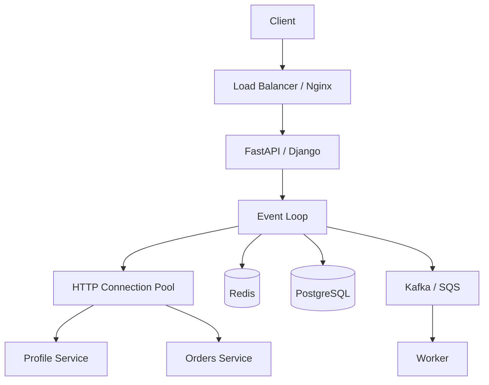

# 12- Async HTTP

## Overview

Asynchronous HTTP allows Python applications to issue and receive HTTP requests without blocking the event-loop thread while network I/O is pending.

This is especially valuable in backend services that spend significant time waiting on downstream APIs:

```text
Client Request
      ↓
FastAPI / Async Application
      ↓
Async HTTP Client
      ↓
Event Loop
      ↓
Downstream Service
      ↓
I/O wait
      ↓
Event Loop handles other tasks
      ↓
Response arrives
      ↓
Original task resumes
```

A synchronous HTTP call typically occupies its thread until the response arrives. An asynchronous HTTP client instead integrates network operations with the event loop, allowing the process to handle other runnable tasks during network waits.

The main engineering benefit is therefore **I/O concurrency**, not CPU parallelism.

Async HTTP is particularly useful for:

- REST API clients;
- microservice-to-microservice communication;
- service aggregation;
- external SaaS integrations;
- payment or identity-provider APIs;
- asynchronous webhooks;
- high-concurrency API gateways;
- async gRPC/HTTP hybrid services.

---

## Why Async HTTP Matters

Suppose an API request calls three independent services:

```text
Profile Service: 100 ms
Orders Service:  200 ms
Billing Service: 150 ms
```

Sequential execution can approach:

```text
100 + 200 + 150 = 450 ms
```

Concurrent asynchronous execution can approach:

```text
max(100, 200, 150) = 200 ms
```

plus connection, scheduling, serialization, and application overhead.

This only works when the HTTP client and surrounding application code are genuinely non-blocking.

---

## Synchronous vs Asynchronous HTTP

| Property | Synchronous HTTP | Async HTTP |
|---|---|---|
| Waiting model | Blocks executing thread | Suspends coroutine |
| Typical API | `requests` | `httpx.AsyncClient`, `aiohttp` |
| Concurrency model | Threads/processes | Event loop/tasks |
| Best fit | Traditional synchronous apps | Async applications |
| Memory per concurrent request | Higher with many threads | Generally lower |
| Blocking risk | Local to thread | Can block entire event loop |
| CPU parallelism | No by itself | No by itself |
| Connection pooling | Supported | Supported |
| Cancellation | Usually application-specific | Native async cancellation model |

Async HTTP is not universally faster. It is most valuable when the application has many concurrent I/O operations.

---

## Async HTTP Request Lifecycle

A simplified request lifecycle is:

```mermaid
sequenceDiagram
    participant App as Async Application
    participant Loop as Event Loop
    participant Pool as HTTP Connection Pool
    participant API as Downstream API

    App->>Loop: Schedule HTTP request
    Loop->>Pool: Acquire connection
    Pool->>API: Send request
    Loop->>Loop: Suspend coroutine
    Note over Loop: Process other tasks
    API-->>Pool: Response
    Pool-->>Loop: I/O ready
    Loop->>Loop: Resume coroutine
    Loop-->>App: Response object
```

The important transition is:

```text
send request
    ↓
await network I/O
    ↓
coroutine suspended
    ↓
event loop handles other work
    ↓
network response ready
    ↓
coroutine resumes
```

---

## Async HTTP Clients

Popular Python async HTTP clients include:

- `httpx`
- `aiohttp`

For many modern backend applications, `httpx` provides a convenient synchronous and asynchronous API.

Example:

```python
import httpx


async def fetch_customer(
    client: httpx.AsyncClient,
    customer_id: int,
) -> dict:
    response = await client.get(
        f"https://customer-service.internal/customers/{customer_id}"
    )

    response.raise_for_status()

    return response.json()
```

The important part is not the library name but the execution model: the network operation must integrate with the event loop.

---

## `httpx.AsyncClient`

A reusable async client:

```python
import httpx


client = httpx.AsyncClient(
    timeout=httpx.Timeout(
        connect=1.0,
        read=2.0,
        write=2.0,
        pool=1.0,
    ),
)
```

Requests can then be issued with:

```python
response = await client.get(url)
```

In a production application, the client should normally be created and closed according to the application's lifecycle rather than instantiated for every request.

---

## Client Lifecycle

Avoid:

```python
async def handler():
    async with httpx.AsyncClient() as client:
        return await client.get(url)
```

for every incoming request when the application can safely reuse a long-lived client.

Repeated client creation can cause:

- unnecessary TCP connections;
- repeated TLS handshakes;
- connection-pool churn;
- increased latency;
- increased CPU usage;
- excessive socket usage.

Prefer:

```text
Application startup
        ↓
Create AsyncClient
        ↓
Reuse pooled connections
        ↓
Serve requests
        ↓
Application shutdown
        ↓
Close AsyncClient
```

---

## Connection Pooling

A connection pool maintains reusable HTTP connections.

```text
Async HTTP Client
       ↓
Connection Pool
 ┌─────┼─────┐
 ↓     ↓     ↓
Conn1 Conn2 Conn3
       ↓
Downstream API
```

Pooling reduces repeated connection establishment.

The pool is also an important concurrency boundary.

If the application creates 10,000 tasks but the HTTP pool allows only 100 concurrent connections, many tasks will wait for a connection.

---

## Connection Limits

`httpx` allows explicit connection limits:

```python
import httpx


limits = httpx.Limits(
    max_connections=100,
    max_keepalive_connections=20,
)

client = httpx.AsyncClient(
    limits=limits,
)
```

The exact values should be derived from:

- application concurrency;
- downstream capacity;
- pod count;
- worker count;
- connection limits;
- latency requirements.

Do not select limits arbitrarily.

---

## Keep-Alive

HTTP persistent connections allow multiple requests to reuse established connections.

Benefits include:

- lower latency;
- fewer TCP handshakes;
- fewer TLS negotiations;
- reduced CPU overhead.

Keep-alive configuration should account for downstream service behavior and load-balancer timeouts.

---

## HTTP/1.1 and HTTP/2

Async HTTP clients may support HTTP/1.1 and HTTP/2.

HTTP/1.1 commonly uses multiple persistent connections for concurrency.

HTTP/2 supports multiplexing multiple streams over a connection.

```text
HTTP/1.1
Client
 ├── Connection 1 → Request A
 ├── Connection 2 → Request B
 └── Connection 3 → Request C

HTTP/2
Client
 └── Connection 1
      ├── Stream A
      ├── Stream B
      └── Stream C
```

HTTP/2 can reduce connection overhead, but application concurrency and downstream capacity limits still apply.

---

## DNS Resolution

An HTTP request can involve:

```text
DNS
 ↓
TCP
 ↓
TLS
 ↓
HTTP
 ↓
Response
```

DNS resolution can therefore contribute to latency.

Long-lived clients and connection reuse reduce how often the complete connection establishment path occurs.

Production systems should also understand DNS caching and service-discovery behavior in their deployment environment.

---

## TCP Connection Establishment

For a new TCP connection:

```text
Client → SYN
Server → SYN-ACK
Client → ACK
```

Then TLS may be negotiated before encrypted HTTP traffic begins.

Connection pooling avoids repeating this process for every request.

---

## TLS

HTTPS provides encryption and server authentication.

A new TLS connection may require:

```text
TCP setup
    ↓
TLS handshake
    ↓
Encrypted HTTP
```

Reusing connections reduces the frequency of these expensive operations.

Never disable TLS verification merely to work around certificate problems in production.

---

## Basic Async GET

```python
import httpx


async def get_customer(
    client: httpx.AsyncClient,
    customer_id: int,
) -> dict:
    response = await client.get(
        f"https://customer-api.internal/customers/{customer_id}"
    )

    response.raise_for_status()

    return response.json()
```

This pattern is appropriate when:

- the caller is already asynchronous;
- the downstream operation is I/O-bound;
- the client is reused;
- timeouts are configured;
- HTTP errors are handled explicitly.

---

## Query Parameters

Prefer structured query parameters:

```python
response = await client.get(
    "https://orders.internal/orders",
    params={
        "customer_id": customer_id,
        "limit": 50,
    },
)
```

This avoids manually constructing query strings and reduces encoding errors.

---

## Request Headers

```python
response = await client.get(
    url,
    headers={
        "Accept": "application/json",
        "X-Request-ID": request_id,
    },
)
```

Common production headers include:

- `Authorization`;
- `Accept`;
- `Content-Type`;
- correlation/request IDs;
- tracing headers;
- idempotency keys.

Avoid logging sensitive authorization headers.

---

## POST Requests

JSON APIs commonly use:

```python
response = await client.post(
    "https://payments.internal/payments",
    json={
        "customer_id": customer_id,
        "amount": amount,
        "currency": "USD",
    },
)
```

Always distinguish between:

```python
json=payload
```

and:

```python
content=raw_bytes
```

based on the downstream API contract.

---

## Authentication

Bearer authentication:

```python
headers = {
    "Authorization": f"Bearer {access_token}",
}

response = await client.get(
    url,
    headers=headers,
)
```

Production considerations include:

- never hard-code credentials;
- load secrets securely;
- rotate credentials;
- avoid logging tokens;
- use TLS;
- validate the target host;
- restrict credentials to required scopes.

AWS applications can use services such as Secrets Manager or IAM-based mechanisms where appropriate.

---

## Request Timeout

Every production HTTP client should have explicit timeout behavior.

```python
timeout = httpx.Timeout(
    connect=1.0,
    read=2.0,
    write=2.0,
    pool=1.0,
)
```

Timeouts should cover different phases where the client supports them:

| Timeout | Protects against |
|---|---|
| Connect | Slow/unreachable endpoint |
| Read | Server stops responding |
| Write | Slow request transmission |
| Pool | Waiting too long for a connection |

A single large timeout can hide where latency is actually occurring.

---

## Timeout Budgeting

Suppose:

```text
API request budget = 2 seconds
```

and the handler calls:

```text
Profile Service
Orders Service
Billing Service
```

The dependency timeouts should fit inside the overall request budget.

```text
Client timeout
      ↓
Load balancer timeout
      ↓
Application deadline
      ↓
HTTP dependency timeout
      ↓
Database timeout
```

Avoid configuring every layer independently without considering the total deadline.

---

## HTTP Exceptions

Handle expected HTTP failures explicitly.

```python
import httpx


async def fetch_customer(
    client: httpx.AsyncClient,
    customer_id: int,
) -> dict:
    try:
        response = await client.get(
            f"https://customer.internal/customers/{customer_id}"
        )
        response.raise_for_status()
    except httpx.TimeoutException:
        raise CustomerServiceTimeout
    except httpx.HTTPStatusError as exc:
        if exc.response.status_code == 404:
            raise CustomerNotFound from exc
        raise

    return response.json()
```

Separate:

- transport failures;
- timeouts;
- HTTP status failures;
- application-level validation failures.

---

## HTTP Status Codes

Do not treat every non-2xx response identically.

| Status | Typical handling |
|---|---|
| `200` | Success |
| `201` | Resource created |
| `204` | Success without response body |
| `400` | Client/request error |
| `401` | Authentication failure |
| `403` | Authorization failure |
| `404` | Resource absent |
| `409` | Conflict |
| `422` | Validation error |
| `429` | Rate limited |
| `500` | Server error |
| `502` | Upstream/proxy failure |
| `503` | Temporary service unavailable |
| `504` | Gateway timeout |

Retry decisions should depend on operation semantics, status code, and idempotency.

---

## Retries

Retries can improve resilience against transient failures.

A retry policy should define:

- maximum attempts;
- retryable failures;
- backoff;
- jitter;
- total deadline;
- idempotency requirements.

Conceptually:

```text
Request
  ↓
Failure
  ↓
Retryable?
 ├── No → Fail
 └── Yes
      ↓
Backoff + jitter
      ↓
Retry
```

Never retry every error indiscriminately.

---

## Exponential Backoff

A typical strategy:

```text
Attempt 1 → immediate
Attempt 2 → short delay
Attempt 3 → longer delay
Attempt 4 → longer delay
```

Jitter prevents many clients from retrying simultaneously.

Without jitter:

```text
1000 clients
    ↓
same failure
    ↓
same retry delay
    ↓
1000 simultaneous retries
```

This can create a retry storm.

---

## Idempotency

Retries are safest when operations are idempotent.

Generally safer:

```http
GET /customers/42
```

Potentially dangerous:

```http
POST /payments
```

For non-idempotent operations, use an idempotency key when supported:

```python
headers = {
    "Idempotency-Key": request_id,
}

await client.post(
    payment_url,
    json=payload,
    headers=headers,
)
```

The downstream service must actually support and correctly implement idempotency.

---

## Concurrent HTTP Requests

Independent downstream requests can run concurrently:

```python
import asyncio


async def build_dashboard(
    customer_id: int,
) -> dict:
    profile, orders, recommendations = await asyncio.gather(
        fetch_profile(customer_id),
        fetch_orders(customer_id),
        fetch_recommendations(customer_id),
    )

    return {
        "profile": profile,
        "orders": orders,
        "recommendations": recommendations,
    }
```

This is one of the strongest use cases for async HTTP.

---

## Structured Fan-Out

For stronger task lifecycle management:

```python
import asyncio


async def build_dashboard(
    customer_id: int,
) -> dict:
    async with asyncio.TaskGroup() as group:
        profile_task = group.create_task(
            fetch_profile(customer_id)
        )
        orders_task = group.create_task(
            fetch_orders(customer_id)
        )
        recommendations_task = group.create_task(
            fetch_recommendations(customer_id)
        )

    return {
        "profile": profile_task.result(),
        "orders": orders_task.result(),
        "recommendations": recommendations_task.result(),
    }
```

`TaskGroup` makes the child-task lifetime explicit.

---

## Fan-Out Latency

If three requests are independent:

```text
Sequential:
T1 + T2 + T3

Concurrent:
max(T1, T2, T3)
```

But real systems also include:

```text
Connection acquisition
DNS
TLS
Serialization
Scheduling
Retries
Queueing
```

Therefore, measured latency will not exactly equal the mathematical maximum.

---

## Fan-Out Capacity

Concurrency can overload downstream systems.

Suppose:

```text
100 application requests
×
5 downstream calls
=
500 downstream requests
```

With:

```text
10 Kubernetes pods
```

the effective pressure can become substantially larger.

Fan-out must be included in capacity planning.

---

## Bounded HTTP Concurrency

Use a semaphore:

```python
import asyncio


partner_limit = asyncio.Semaphore(50)


async def call_partner(
    client: httpx.AsyncClient,
    item: dict,
) -> dict:
    async with partner_limit:
        response = await client.post(
            "https://partner.internal/process",
            json=item,
        )
        response.raise_for_status()
        return response.json()
```

This protects the partner and the application.

---

## Connection Pool vs Semaphore

These controls solve different problems.

| Mechanism | Controls |
|---|---|
| HTTP connection pool | Available connections |
| Semaphore | Application-level concurrent operations |
| Rate limiter | Operations per unit of time |
| Queue | Amount of buffered work |
| Timeout | Maximum waiting/execution budget |

A production service may need several of these simultaneously.

---

## Rate Limiting

A semaphore limits concurrency:

```text
50 requests at once
```

A rate limiter controls throughput:

```text
100 requests/second
```

They are not interchangeable.

A service may require:

```text
Maximum 50 concurrent requests
AND
Maximum 100 requests/second
```

to satisfy downstream contracts.

---

## Streaming Responses

Large responses should not always be loaded into memory.

Conceptually:

```text
Downstream API
      ↓
HTTP stream
      ↓
Application
      ↓
Process chunks
```

With an async client, streaming APIs can process response data incrementally.

The exact implementation depends on the client and protocol.

---

## Streaming with `httpx`

```python
import httpx


async def download_stream(
    client: httpx.AsyncClient,
    url: str,
) -> None:
    async with client.stream(
        "GET",
        url,
    ) as response:
        response.raise_for_status()

        async for chunk in response.aiter_bytes():
            process_chunk(chunk)
```

This avoids materializing the entire response body at once.

Be careful to keep `process_chunk()` lightweight. CPU-heavy processing can still block the event loop.

---

## Upload Streaming

Large uploads should similarly avoid unnecessary in-memory buffering.

Depending on the API and client, streaming request bodies can reduce memory usage.

Production design should consider:

- maximum payload size;
- streaming behavior;
- timeout;
- retryability;
- content integrity;
- authentication.

---

## Response Size Limits

Never assume an upstream response is small.

An external or compromised service could return unexpectedly large data.

Use:

- maximum acceptable response size;
- streaming where appropriate;
- request limits;
- validation;
- timeouts.

This is both a reliability and security concern.

---

## JSON Parsing

This:

```python
data = response.json()
```

can be CPU and memory intensive for very large responses.

The network operation may be asynchronous, but JSON decoding itself is generally synchronous Python-side work.

For large payloads:

```text
Network I/O
    ↓
Streaming
    ↓
Incremental processing
```

may be preferable.

---

## WebSockets

Async HTTP infrastructure can also support long-lived connections such as WebSockets.

```text
Client
  ⇅
WebSocket
  ⇅
Event Loop
  ⇅
Application
```

The same rules still apply:

- avoid blocking;
- limit resources;
- handle cancellation;
- enforce authentication;
- monitor connection counts;
- manage shutdown.

---

## REST Microservices

Async HTTP is particularly useful in microservice architectures:

```text
API Service
   ↓
Async HTTP Client
   ├── User Service
   ├── Order Service
   ├── Payment Service
   └── Recommendation Service
```

However, synchronous service-to-service calls can create cascading latency and failure.

Asynchronous execution helps with concurrency, but architectural concerns remain:

- dependency coupling;
- timeout budgets;
- retries;
- circuit breaking;
- service discovery;
- observability;
- failure isolation.

---

## Circuit Breaking

Retries alone are not enough during sustained dependency failure.

A circuit breaker can prevent repeated calls to an unhealthy dependency:

```text
Closed
  ↓
Failures increase
  ↓
Open
  ↓
Reject calls quickly
  ↓
Recovery period
  ↓
Half-open
  ↓
Test request
  ↓
Closed / Open
```

Circuit breakers should be implemented carefully and based on actual service requirements.

---

## Bulkheads

Separate concurrency budgets for different dependencies.

```text
Application
├── Payment → 20 concurrent
├── Search  → 50 concurrent
└── Profile → 100 concurrent
```

Without separate limits, one failing dependency can consume all available concurrency.

Bulkheading improves failure isolation.

---

## Dependency Failure Isolation

Suppose recommendations are optional:

```python
profile, orders = await asyncio.gather(
    fetch_profile(),
    fetch_orders(),
)

try:
    recommendations = await fetch_recommendations()
except RecommendationUnavailable:
    recommendations = []
```

This allows the core request to succeed without an optional dependency.

Failure policy should follow business requirements.

---

## Authentication Token Refresh

Async HTTP clients often need token refresh logic.

Avoid multiple concurrent tasks independently refreshing the same expired token.

A coordinated approach can use an async lock:

```python
token_lock = asyncio.Lock()


async def get_valid_token() -> str:
    async with token_lock:
        if token_is_still_valid():
            return current_token

        return await refresh_token()
```

For distributed deployments, a local asyncio lock does not coordinate across replicas.

---

## Request IDs

Propagate correlation information:

```python
headers = {
    "X-Request-ID": request_id,
}

response = await client.get(
    url,
    headers=headers,
)
```

This makes it possible to trace:

```text
Client Request
    ↓
API Service
    ↓
HTTP Request
    ↓
Downstream Service
```

across service boundaries.

---

## Distributed Tracing

Async HTTP calls should participate in distributed tracing where possible.

```text
Trace
 └── Incoming HTTP
      ├── DB span
      ├── Redis span
      ├── HTTP Profile span
      └── HTTP Orders span
```

Useful measurements include:

- DNS duration;
- connection duration;
- TLS duration;
- request duration;
- response duration;
- retries;
- status codes;
- connection-pool wait.

---

## Logging

Do not log entire request or response bodies indiscriminately.

Avoid:

```python
logger.info(
    "response=%s",
    response.text,
)
```

for sensitive or large payloads.

Prefer structured metadata:

```python
logger.info(
    "downstream_request_completed",
    extra={
        "service": "customer-service",
        "status_code": response.status_code,
        "request_id": request_id,
    },
)
```

Never log:

- access tokens;
- passwords;
- API keys;
- payment credentials;
- sensitive personal data.

---

## Security

Production async HTTP clients should enforce:

- HTTPS;
- TLS certificate verification;
- hostname validation;
- authentication;
- authorization;
- request-size limits;
- response-size limits;
- timeouts;
- rate limits;
- safe redirects;
- SSRF protections where URLs are user-controlled.

---

## SSRF

Server-side request forgery is especially relevant when the application accepts a URL from users.

Dangerous:

```python
await client.get(user_supplied_url)
```

An attacker may attempt to access:

```text
http://169.254.169.254/
```

or internal services.

For user-controlled URLs:

- allowlist destinations where possible;
- restrict private IP ranges;
- validate DNS resolution;
- restrict protocols;
- disable unsafe redirects;
- enforce network-level egress controls.

AWS environments should treat access to instance or workload metadata endpoints as particularly sensitive.

---

## Redirects

Automatic redirects can have security implications.

A trusted URL may redirect to an unexpected host.

For sensitive requests:

- validate redirect behavior;
- restrict redirect destinations;
- avoid forwarding credentials blindly.

Authentication headers should not be indiscriminately propagated across trust boundaries.

---

## Proxy Configuration

Production environments may route outbound traffic through proxies:

```text
Application
    ↓
HTTP Client
    ↓
Proxy
    ↓
Internet / Service
```

Proxy configuration must account for:

- authentication;
- TLS interception;
- trusted certificates;
- bypass rules;
- internal service destinations.

Do not accidentally route internal service traffic through an external proxy.

---

## Kubernetes Considerations

A Kubernetes deployment might look like:

```text
Load Balancer
      ↓
Service
      ↓
┌─────────────┬─────────────┐
│ Pod 1       │ Pod 2       │
│ Event Loop  │ Event Loop  │
│ HTTP Pool   │ HTTP Pool   │
└─────────────┴─────────────┘
```

Each pod has its own HTTP connection pool.

Therefore:

```text
5 pods
×
100 max HTTP connections
=
up to 500 connections
```

The downstream service must be capable of handling the resulting connection volume.

---

## AWS Considerations

For AWS-based systems, async HTTP may be used to call:

- internal services;
- API Gateway endpoints;
- third-party APIs;
- AWS-compatible HTTP endpoints;
- service integrations.

Consider:

- NAT gateway capacity and cost;
- security groups;
- network ACLs;
- DNS;
- connection reuse;
- outbound connection limits;
- AWS service quotas;
- private networking.

Async concurrency can increase outbound traffic dramatically, so network capacity must be part of capacity planning.

---

## High Availability

Async HTTP clients should not become a single point of failure.

Use:

- multiple application replicas;
- resilient DNS/service discovery;
- health checks;
- bounded connection pools;
- timeouts;
- retry policies;
- circuit breakers where appropriate.

Do not rely on retries to compensate for an unavailable service indefinitely.

---

## Graceful Shutdown

When the application receives `SIGTERM`:

```text
Stop accepting requests
        ↓
Stop creating new downstream calls
        ↓
Allow/cancel active tasks
        ↓
Close HTTP clients
        ↓
Close connection pools
        ↓
Exit
```

This is particularly important during Kubernetes rolling deployments.

---

## Async HTTP Client Lifecycle in FastAPI

A long-lived client can be initialized and closed with application lifecycle management.

Conceptually:

```python
import httpx
from contextlib import asynccontextmanager
from fastapi import FastAPI


@asynccontextmanager
async def lifespan(app: FastAPI):
    app.state.http_client = httpx.AsyncClient(
        timeout=httpx.Timeout(2.0),
    )

    try:
        yield
    finally:
        await app.state.http_client.aclose()


app = FastAPI(lifespan=lifespan)
```

Handlers can then reuse the client.

The exact dependency-injection strategy can vary by application architecture.

---

## Testing Async HTTP

Use mocked transports or dedicated test doubles for unit tests.

For integration tests, use a real test service or controlled HTTP server.

Test:

- successful responses;
- connection failures;
- DNS failures;
- timeouts;
- malformed responses;
- non-2xx responses;
- retries;
- cancellation;
- concurrency limits;
- connection-pool exhaustion;
- authentication failures.

Avoid tests that depend on arbitrary real-world internet services.

---

## Async HTTP Load Testing

Load testing should measure:

```text
Requests/second
p50 latency
p95 latency
p99 latency
Error rate
Active connections
Pool wait time
CPU
Memory
Event-loop latency
Downstream saturation
```

A benchmark that measures only application CPU can miss the actual bottleneck.

---

## Common Mistakes

### Using `requests` Inside Async Code

Bad:

```python
async def handler():
    return requests.get(url)
```

This blocks the event loop.

Use an async HTTP client or explicitly offload the synchronous call.

### Creating a Client Per Request

This prevents effective connection reuse.

### No Timeout

A downstream service can hold tasks indefinitely.

### Retry Everything

Retries can amplify failures.

### Unlimited Concurrency

Thousands of tasks can overwhelm the downstream API.

### Logging Response Bodies

Large or sensitive responses can create security and memory problems.

### Ignoring HTTP Status Codes

A `500` response is not equivalent to a successful `200`.

### Retrying Non-Idempotent Operations

This can duplicate business actions.

### Ignoring Connection Pool Limits

Application concurrency can exceed network or downstream capacity.

### Assuming Async Means Faster

Async improves concurrency for I/O workloads. It does not automatically reduce the latency of one individual network request.

---

## Production Pitfalls

### Connection Pool Explosion

With:

```text
10 pods × 100 connections
```

the downstream service may receive up to roughly 1000 application-side connections.

### Retry Storms

Large fleets can synchronize retries during an outage.

### Timeout Mismatch

An upstream may time out before the downstream operation does, causing wasted work.

### Event-Loop Blocking

Large JSON parsing or synchronous SDK calls can block unrelated requests.

### Dependency Cascades

One slow downstream service can consume task and connection capacity across the application.

### Missing Backpressure

Unbounded fan-out can cause memory growth and downstream overload.

### Shutdown Races

The HTTP client may close while tasks are still trying to issue requests.

---

## Async HTTP Architecture

A production service may use:



The HTTP connection pool, concurrency limits, timeout policy, and downstream capacity are all part of the architecture.

---

## End-to-End Request Example

Consider:

```text
GET /dashboard/42
```

The backend performs:

```text
1. Read customer profile
2. Read recent orders
3. Read recommendation service
4. Read cached preferences
5. Build response
```

A concurrent implementation can be:

```python
import asyncio


async def dashboard(customer_id: int) -> dict:
    async with asyncio.TaskGroup() as group:
        profile_task = group.create_task(
            profile_client.get(customer_id)
        )
        orders_task = group.create_task(
            orders_client.list(customer_id)
        )
        recommendations_task = group.create_task(
            recommendations_client.get(customer_id)
        )
        preferences_task = group.create_task(
            redis_client.get(
                f"preferences:{customer_id}"
            )
        )

    return {
        "profile": profile_task.result(),
        "orders": orders_task.result(),
        "recommendations": recommendations_task.result(),
        "preferences": preferences_task.result(),
    }
```

The actual production implementation should additionally define:

- timeouts;
- fallback behavior;
- concurrency limits;
- retries;
- tracing;
- logging;
- cancellation;
- response validation.

---

## Reliability Checklist

For every downstream HTTP dependency, define:

| Concern | Decision |
|---|---|
| Timeout | Maximum acceptable latency |
| Retry | Which failures are retryable |
| Backoff | Delay strategy |
| Jitter | Randomized retry delay |
| Idempotency | Whether retry is safe |
| Concurrency | Maximum in-flight calls |
| Rate limit | Requests per second |
| Pool | Connection capacity |
| Fallback | Behavior during outage |
| Circuit breaker | Whether fail-fast isolation is needed |
| Observability | Logs, metrics, traces |
| Security | TLS, auth, SSRF controls |

This converts an HTTP client call into a deliberate production dependency contract.

---

## Performance Checklist

- Reuse async HTTP clients.
- Enable appropriate connection pooling.
- Configure connection limits.
- Use HTTP/2 where it provides a measurable benefit.
- Avoid unnecessary DNS/TLS/connection setup.
- Use concurrent requests for independent I/O.
- Bound concurrency.
- Stream large payloads.
- Avoid unnecessary JSON transformations.
- Keep CPU-heavy work away from the event loop.
- Measure p95 and p99 latency.
- Monitor connection-pool wait time.
- Load-test downstream dependencies.

---

## Operational Checklist

- [ ] Async HTTP client is reused across requests where appropriate.
- [ ] Client lifecycle is tied to application startup/shutdown.
- [ ] Connection pools have explicit limits.
- [ ] Connect, read, write, and pool timeouts are configured.
- [ ] All important HTTP status codes are handled.
- [ ] Retry policies are bounded.
- [ ] Retries use exponential backoff and jitter.
- [ ] Non-idempotent operations are not retried blindly.
- [ ] Idempotency keys are used where appropriate.
- [ ] Concurrent fan-out is bounded.
- [ ] Downstream rate limits are respected.
- [ ] Circuit breakers or bulkheads are used where justified.
- [ ] Request IDs and tracing context propagate downstream.
- [ ] Sensitive headers and payloads are not logged.
- [ ] TLS certificate verification remains enabled.
- [ ] SSRF protections exist for user-controlled destinations.
- [ ] Response sizes are bounded or streamed where appropriate.
- [ ] Event-loop blocking operations have been identified.
- [ ] Async cancellation is handled correctly.
- [ ] Graceful shutdown closes HTTP clients and pools.
- [ ] Kubernetes replica multiplication is included in capacity planning.
- [ ] AWS outbound network capacity and costs are considered.
- [ ] Integration tests cover real HTTP failure modes.
- [ ] Load tests include downstream latency and failures.
- [ ] p95/p99 latency and error rates are monitored.
- [ ] Connection-pool utilization and wait time are monitored.
- [ ] Critical dependency failures have documented fallback behavior.

## Key Takeaways

- **Async HTTP provides high I/O concurrency by suspending tasks during network waits:** it is most valuable for backend services that communicate with multiple HTTP dependencies.
- **Reuse connection-pooled async clients:** creating a client per request wastes TCP/TLS setup, increases resource consumption, and reduces connection reuse.
- **Production HTTP clients require explicit reliability controls:** timeouts, bounded retries, exponential backoff with jitter, idempotency, concurrency limits, and failure isolation are essential.
- **Async concurrency must be planned across the deployment topology:** Kubernetes replicas, workers, connection pools, fan-out, downstream quotas, sockets, and AWS networking can multiply effective traffic.
- **Async does not make CPU-bound or blocking work non-blocking:** use genuinely asynchronous clients for I/O and move blocking or CPU-heavy work away from the event-loop thread.