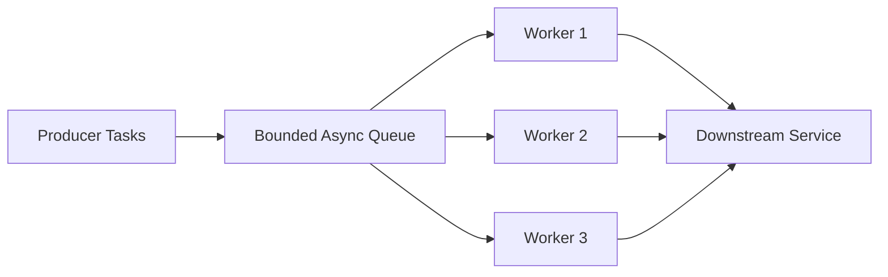
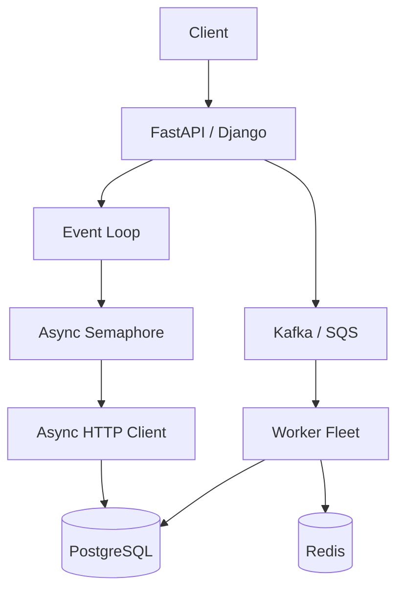

# 13- Queues and Synchronization

## Overview

Queues and synchronization primitives are fundamental building blocks for coordinating concurrent Python tasks, threads, and processes.

In asynchronous applications, a queue can decouple producers from consumers and provide backpressure:

```text
Producer
   ↓
Bounded Queue
   ↓
Consumer Workers
   ↓
External Service
```

Synchronization primitives coordinate access to shared resources:

```text
Tasks
 ├── Lock
 ├── Semaphore
 ├── Event
 └── Condition
```

Python provides different primitives for different concurrency models:

| Concurrency model | Queue / synchronization |
|---|---|
| `asyncio` tasks | `asyncio.Queue`, `asyncio.Lock`, `asyncio.Semaphore`, `asyncio.Event`, `asyncio.Condition` |
| Threads | `queue.Queue`, `threading.Lock`, `threading.Semaphore`, `threading.Event`, `threading.Condition` |
| Processes | `multiprocessing.Queue`, process synchronization primitives |
| Distributed systems | Kafka, SQS, Redis-based coordination, PostgreSQL locking, distributed coordination systems |

The most important engineering distinction is that **local synchronization is not distributed synchronization**.

An `asyncio.Lock` can coordinate tasks within its process. It cannot coordinate application replicas running in different Kubernetes pods.

---

## Why Queues and Synchronization Matter

Concurrency introduces problems that do not exist in simple sequential programs:

- multiple tasks may access shared state;
- producers may generate work faster than consumers can process it;
- downstream services may have limited capacity;
- tasks may need to wait for a condition;
- work may need to be ordered;
- shutdown may need to drain outstanding work;
- resource usage may need to be bounded.

Queues and synchronization primitives provide explicit mechanisms for solving these problems.

A production design often combines them:

```text
Incoming Requests
       ↓
Bounded Queue
       ↓
Worker Tasks
       ↓
Semaphore
       ↓
Database / API
```

---

## Queue Fundamentals

A queue stores work until a consumer can process it.

The conventional queue model is FIFO:

```text
First In
   ↓
[ A ][ B ][ C ][ D ]
 ↑                 ↑
read              write
```

`A` is consumed before `B`, `B` before `C`, and so on.

Queues provide several useful properties:

- decoupling;
- buffering;
- ordering;
- backpressure;
- work distribution.

---

## Producer-Consumer Pattern

The producer creates work:

```python
await queue.put(item)
```

The consumer retrieves it:

```python
item = await queue.get()
```

The architecture becomes:



The producer does not need to know which worker will process a particular item.

---

## `asyncio.Queue`

For asyncio applications, use `asyncio.Queue`.

```python
import asyncio


queue: asyncio.Queue[dict] = asyncio.Queue(
    maxsize=1000
)
```

Producer:

```python
await queue.put(
    {
        "customer_id": 42,
        "operation": "refresh",
    }
)
```

Consumer:

```python
item = await queue.get()

try:
    await process(item)
finally:
    queue.task_done()
```

The queue coordinates asynchronous producers and consumers within the process.

---

## Why Bound a Queue?

An unbounded queue can hide overload.

```text
Producer: 10,000 items/sec
Consumer: 1,000 items/sec

Backlog:
+9,000 items/sec
```

Memory usage can continue increasing.

A bounded queue:

```python
queue = asyncio.Queue(maxsize=1000)
```

forces producers to wait when capacity is exhausted.

This is backpressure.

---

## Backpressure

Backpressure means downstream capacity influences upstream production.

```text
Producer
   ↓
Queue
   ↓
Workers
   ↓
Database
```

If the database slows down:

```text
Database slows
      ↓
Workers slow
      ↓
Queue grows
      ↓
Queue reaches capacity
      ↓
Producer blocks
```

This is preferable to unlimited memory growth.

---

## Queue Size Is a Capacity Decision

Do not choose `maxsize=1000` simply because it looks reasonable.

Queue capacity should reflect:

- expected burst size;
- processing rate;
- memory per item;
- acceptable queueing latency;
- downstream capacity;
- failure recovery behavior.

A queue is part of capacity planning, not merely a data structure configuration.

---

## Queue Operations

Common `asyncio.Queue` operations include:

| Operation | Behavior |
|---|---|
| `put()` | Wait until space is available |
| `put_nowait()` | Insert immediately or raise `QueueFull` |
| `get()` | Wait until an item exists |
| `get_nowait()` | Retrieve immediately or raise `QueueEmpty` |
| `task_done()` | Mark retrieved work complete |
| `join()` | Wait until all tracked work is complete |
| `qsize()` | Return current approximate queue size |

---

## `task_done()` and `join()`

A consumer should call:

```python
queue.task_done()
```

after processing an item.

This allows:

```python
await queue.join()
```

to wait until all enqueued items have been marked complete.

Example:

```python
async def worker(
    queue: asyncio.Queue[dict],
) -> None:
    while True:
        item = await queue.get()

        try:
            await process(item)
        finally:
            queue.task_done()
```

Then:

```python
await queue.join()
```

can wait for all currently tracked work.

---

## Why `task_done()` Matters

If a consumer retrieves an item but never calls:

```python
queue.task_done()
```

the queue's unfinished-task counter never reaches zero.

Consequently:

```python
await queue.join()
```

may wait indefinitely.

Call `task_done()` exactly once for every successful `get()`.

---

## Queue Ordering

`asyncio.Queue` provides FIFO ordering for queued items.

However, concurrent processing can make **completion order** different from queue order.

```text
Queue:
A → B → C

Workers:
A → slow
B → fast
C → medium

Completion:
B → C → A
```

If business semantics require ordered processing, the queue alone is not sufficient.

---

## Priority Queues

Some workloads require higher-priority work to execute first.

Python provides:

```python
asyncio.PriorityQueue()
```

Example:

```python
queue = asyncio.PriorityQueue()

await queue.put((1, "critical"))
await queue.put((5, "normal"))
await queue.put((10, "low"))
```

Lower priority values are retrieved first.

Use priority queues carefully because low-priority work can starve if high-priority work continuously arrives.

---

## LIFO Queues

`asyncio.LifoQueue` retrieves the most recently inserted item first.

This is less common in backend request processing but can be useful for specific algorithms or local work scheduling.

The correct queue type should reflect actual workload semantics.

---

## Queue as a Local Work Buffer

A queue can decouple request ingestion from processing:

```text
HTTP Handler
    ↓
asyncio.Queue
    ↓
Worker Tasks
    ↓
Service
```

This can be useful for short-lived, process-local work.

However, it does not provide durability.

If the process crashes:

```text
Process crash
    ↓
In-memory queue lost
```

For durable workloads, use infrastructure such as Kafka, SQS, or a persistent job system.

---

## Asyncio Queue vs Kafka

| Feature | `asyncio.Queue` | Kafka |
|---|---|---|
| Scope | Process-local | Distributed |
| Persistence | No | Yes |
| Replay | No | Yes |
| Ordering | FIFO locally | Partition ordering |
| Consumer groups | No | Yes |
| Survives process restart | No | Yes |
| Backpressure | Yes | Yes |
| Use case | Local coordination | Event streaming |

Do not use an in-memory queue when business requirements demand durability.

---

## Asyncio Queue vs SQS

| Feature | `asyncio.Queue` | Amazon SQS |
|---|---|---|
| Scope | Process | Distributed |
| Persistence | No | Yes |
| Managed service | No | Yes |
| Retry/redelivery | Manual | Built in |
| Visibility timeout | No | Yes |
| Horizontal workers | Limited to process | Native |
| Survives pod restart | No | Yes |

A common architecture is:

```text
FastAPI
   ↓
SQS
   ↓
Worker Fleet
```

rather than:

```text
FastAPI
   ↓
asyncio.Queue
```

for durable background work.

---

## `asyncio.Lock`

An `asyncio.Lock` provides mutual exclusion among asyncio tasks.

```python
lock = asyncio.Lock()
```

Use:

```python
async with lock:
    await protected_operation()
```

Only one task can hold the lock at a time.

---

## Why Locks Exist

Without synchronization:

```text
Task A → read state
Task B → read state
Task A → update state
Task B → update state
```

The result can be inconsistent.

A lock serializes the protected critical section:

```text
Task A → acquire → update → release
Task B → acquire → update → release
```

---

## Async Lock Example

```python
import asyncio


balance = 100
balance_lock = asyncio.Lock()


async def withdraw(amount: int) -> None:
    global balance

    async with balance_lock:
        if balance < amount:
            raise ValueError("insufficient funds")

        balance -= amount
```

The lock protects the local in-memory state.

It does not make the underlying business operation transactionally durable.

---

## Keep Critical Sections Small

Avoid:

```python
async with lock:
    await slow_external_api_call()
    await database_operation()
    await expensive_processing()
```

unless holding the lock across those operations is required for correctness.

Prefer:

```text
Acquire lock
   ↓
Read/update required state
   ↓
Release lock
   ↓
Perform slow I/O
```

Long lock durations increase contention.

However, correctness always takes priority over premature lock minimization.

---

## Lock Scope

A lock only coordinates code using the same lock object.

This:

```python
lock_a = asyncio.Lock()
lock_b = asyncio.Lock()
```

does not coordinate access between users of different locks.

Similarly:

```text
Pod A → asyncio.Lock()
Pod B → asyncio.Lock()
```

does not create a distributed lock.

---

## `asyncio.Semaphore`

A semaphore limits the number of tasks allowed into a section simultaneously.

```python
semaphore = asyncio.Semaphore(20)
```

Use:

```python
async with semaphore:
    await call_service()
```

At most 20 tasks can hold the semaphore concurrently.

---

## Semaphore vs Lock

| Primitive | Maximum concurrent holders | Typical use |
|---|---:|---|
| `Lock` | 1 | Mutual exclusion |
| `Semaphore(20)` | 20 | Concurrency limit |
| `BoundedSemaphore(20)` | 20 | Concurrency limit with stricter release accounting |

A semaphore is useful when some concurrency is desirable but unlimited concurrency is unsafe.

---

## HTTP Concurrency Limiting

For example:

```python
partner_limit = asyncio.Semaphore(50)


async def call_partner(
    client,
    payload: dict,
) -> dict:
    async with partner_limit:
        response = await client.post(
            "https://partner.internal/process",
            json=payload,
        )

        response.raise_for_status()
        return response.json()
```

This prevents an application from issuing unlimited concurrent calls.

---

## Database Concurrency

A semaphore can protect a downstream database from excessive application-level concurrency.

```python
db_limit = asyncio.Semaphore(100)
```

However, the database connection pool itself may already provide a tighter limit.

A mature design considers both:

```text
Tasks
  ↓
Semaphore
  ↓
Connection Pool
  ↓
PostgreSQL
```

The smaller capacity typically becomes the effective bottleneck.

---

## Rate Limiting vs Semaphore

A semaphore controls concurrency:

```text
Maximum 50 in-flight operations
```

A rate limiter controls throughput:

```text
Maximum 500 operations/sec
```

They solve different problems.

A production service may require both.

---

## `asyncio.Event`

An event is a one-to-many signaling primitive.

```python
ready = asyncio.Event()
```

Consumers can wait:

```python
await ready.wait()
```

Another task signals:

```python
ready.set()
```

All tasks currently waiting on the event can proceed.

---

## Event Use Case

An event is useful for application lifecycle signaling:

```text
Application startup
       ↓
Initialize resources
       ↓
ready.set()
       ↓
Workers begin processing
```

It can also be used for graceful shutdown:

```python
shutdown_event = asyncio.Event()
```

Workers can periodically observe it.

---

## Event Example

```python
import asyncio


ready = asyncio.Event()


async def worker() -> None:
    await ready.wait()
    await process_work()


async def startup() -> None:
    await initialize_resources()
    ready.set()
```

The event represents a state transition rather than ownership of a resource.

---

## Event vs Queue

Use an event for signaling:

```text
"Something is ready."
```

Use a queue for transferring work:

```text
"Here is the item you need to process."
```

Do not use an event as a substitute for a work queue.

---

## `asyncio.Condition`

A condition combines a lock with notification around a state predicate.

```python
condition = asyncio.Condition()
```

A task can wait:

```python
async with condition:
    await condition.wait()
```

Another task can notify:

```python
async with condition:
    condition.notify_all()
```

Conditions are useful when tasks need to wait until shared state satisfies a particular condition.

---

## Condition Example

```python
import asyncio


items: list[str] = []
condition = asyncio.Condition()


async def consumer() -> str:
    async with condition:
        await condition.wait_for(items.__len__)

        return items.pop(0)


async def producer(item: str) -> None:
    async with condition:
        items.append(item)
        condition.notify()
```

The condition coordinates access to shared state and notification.

For ordinary producer-consumer workloads, `asyncio.Queue` is usually simpler.

---

## Choosing the Right Primitive

| Requirement | Primitive |
|---|---|
| Transfer work | `asyncio.Queue` |
| One task at a time | `asyncio.Lock` |
| Limit concurrent operations | `asyncio.Semaphore` |
| Signal readiness/state change | `asyncio.Event` |
| Wait for a state predicate | `asyncio.Condition` |

Prefer the simplest primitive that expresses the required semantics.

---

## Threading Queues

For thread-based concurrency, use:

```python
from queue import Queue
```

Example:

```python
queue: Queue[dict] = Queue(maxsize=1000)
```

Producer:

```python
queue.put(item)
```

Consumer:

```python
item = queue.get()

try:
    process(item)
finally:
    queue.task_done()
```

`queue.Queue` is designed for communication between threads.

Do not use `asyncio.Queue` directly as a general-purpose thread synchronization primitive.

---

## Thread Locks vs Asyncio Locks

| Primitive | Intended environment |
|---|---|
| `asyncio.Lock` | Asyncio tasks |
| `threading.Lock` | Threads |
| `multiprocessing.Lock` | Processes |
| Database lock | Persistent distributed state |
| Distributed lock | Cross-process/machine coordination |

Using the wrong primitive can result in deadlocks, blocking, or incorrect synchronization.

---

## Process Queues

For process-based concurrency:

```python
from multiprocessing import Queue
```

A process queue provides communication across process boundaries.

Because processes have isolated memory, data generally crosses a serialization boundary.

This makes process queues different from in-memory asyncio queues.

---

## Multiprocessing Synchronization

The `multiprocessing` module provides process-oriented synchronization primitives such as:

- `Lock`;
- `RLock`;
- `Semaphore`;
- `Event`;
- `Condition`;
- `Queue`.

These coordinate processes rather than asyncio tasks.

---

## Threading vs Asyncio Queues

A critical distinction:

```text
asyncio.Queue
→ coroutine synchronization

queue.Queue
→ thread synchronization
```

A blocking `queue.Queue.get()` called directly from an event-loop thread can block the entire event loop.

If a synchronous queue must be used from async code, integrate it through an appropriate thread boundary rather than blocking the loop.

---

## Race Conditions

Queues and synchronization exist largely because concurrency creates race conditions.

Example:

```python
counter = 0


async def increment() -> None:
    global counter

    current = counter
    await asyncio.sleep(0)
    counter = current + 1
```

Two tasks can observe the same value.

A lock can protect the update:

```python
counter_lock = asyncio.Lock()


async def increment() -> None:
    global counter

    async with counter_lock:
        counter += 1
```

---

## Race Conditions and Databases

Application locks are not a substitute for database concurrency control.

For persistent state:

```text
Application
    ↓
PostgreSQL transaction
    ↓
Row-level lock / constraint
    ↓
Commit
```

For example, balance updates should generally be protected through transactional database semantics rather than relying on an `asyncio.Lock`.

---

## Deadlocks

A deadlock occurs when tasks wait indefinitely for resources held by each other.

Example:

```text
Task A
  holds Lock 1
  waits for Lock 2

Task B
  holds Lock 2
  waits for Lock 1
```

Neither can proceed.

Avoid:

- multiple locks where possible;
- inconsistent lock ordering;
- holding locks across unnecessary I/O;
- complex nested synchronization.

---

## Lock Ordering

If multiple locks are unavoidable, define a consistent acquisition order:

```text
Lock A
   ↓
Lock B
   ↓
Lock C
```

Every task should acquire them in that order.

Never allow:

```text
Task 1: A → B
Task 2: B → A
```

without a strong reason and carefully designed coordination.

---

## Starvation

Starvation occurs when a task repeatedly fails to obtain access to a required resource.

Possible causes include:

- unfair scheduling;
- continuously arriving high-priority work;
- excessive lock contention;
- poorly designed priority queues.

Monitoring wait time can help detect these conditions.

---

## Contention

Contention occurs when many tasks compete for the same resource.

Examples:

```text
1000 tasks
    ↓
1 lock
```

or:

```text
500 tasks
    ↓
20 DB connections
```

High contention can increase latency even when CPU utilization remains low.

---

## Bounded Worker Pool

A common async architecture uses a fixed worker count:

```python
async def worker(
    queue: asyncio.Queue[dict],
) -> None:
    while True:
        item = await queue.get()

        try:
            await process(item)
        finally:
            queue.task_done()
```

Start a controlled number:

```python
workers = [
    asyncio.create_task(worker(queue))
    for _ in range(20)
]
```

This creates an explicit concurrency budget.

---

## Worker Pool Architecture

```text
                Producers
                    │
                    ↓
            ┌──────────────┐
            │ Bounded Queue│
            └──────┬───────┘
                   │
       ┌───────────┼───────────┐
       ↓           ↓           ↓
    Worker 1    Worker 2    Worker 3
       │           │           │
       └───────────┼───────────┘
                   ↓
             Downstream API
```

Worker count should be based on:

- workload;
- CPU;
- I/O latency;
- downstream capacity;
- memory;
- connection-pool size.

---

## Queue Shutdown

Long-running workers need an explicit shutdown strategy.

A common pattern is to use a sentinel:

```python
STOP = object()


async def worker(
    queue: asyncio.Queue[object],
) -> None:
    while True:
        item = await queue.get()

        try:
            if item is STOP:
                return

            await process(item)
        finally:
            queue.task_done()
```

The producer or shutdown coordinator can enqueue termination signals.

The exact strategy should account for the number of workers and whether all queued work must be drained first.

---

## Graceful Queue Draining

A production shutdown might follow:

```text
SIGTERM
   ↓
Stop accepting new work
   ↓
Stop producers
   ↓
Allow queue to drain
   ↓
Workers finish current tasks
   ↓
Send shutdown signals
   ↓
Close dependencies
   ↓
Exit
```

If draining cannot complete within the deployment deadline, the application needs a defined policy for abandoned work.

---

## Cancellation and Queues

Queue consumers should cleanly handle cancellation:

```python
async def worker(
    queue: asyncio.Queue[dict],
) -> None:
    while True:
        item = await queue.get()

        try:
            await process(item)
        except asyncio.CancelledError:
            raise
        finally:
            queue.task_done()
```

More complex workers may need to distinguish between:

- work retrieved but not completed;
- work successfully committed;
- work safe to retry.

This is a business-level reliability concern.

---

## Exactly-Once Processing

An in-memory queue does not provide exactly-once business semantics.

Even durable messaging systems generally require careful application design.

For critical operations, prefer:

```text
At-least-once delivery
       ↓
Idempotent consumer
       ↓
Transactional state update
```

rather than assuming that queue semantics alone guarantee exactly-once business behavior.

---

## Idempotent Consumers

A consumer should safely handle duplicate work where possible.

For example:

```text
Message ID: 123
     ↓
Process
     ↓
Crash before acknowledgement
     ↓
Message redelivered
     ↓
Detect message ID already processed
     ↓
Do not duplicate business effect
```

PostgreSQL unique constraints or idempotency records can help implement this pattern.

---

## Local vs Distributed Synchronization

This distinction is critical:

```text
Local process
├── asyncio.Lock
├── asyncio.Queue
└── asyncio.Semaphore
```

versus:

```text
Distributed system
├── PostgreSQL transaction
├── Kafka
├── SQS
├── Redis coordination
└── Distributed lock
```

Local primitives cannot coordinate replicas automatically.

---

## Redis-Based Coordination

Redis can provide distributed coordination mechanisms, but correctness depends heavily on the algorithm and failure model.

Examples include:

- distributed locks;
- rate limiting;
- shared counters;
- ephemeral coordination;
- distributed queues.

Do not assume:

```text
Redis SET
→ automatically a correct distributed lock
```

Lock ownership, expiration, retries, failover, and fencing semantics may all matter.

For persistent business invariants, PostgreSQL transactional constraints are often preferable.

---

## PostgreSQL as Synchronization

Database primitives can coordinate distributed workers.

Examples include:

- row-level locks;
- unique constraints;
- advisory locks;
- transactions;
- `SELECT ... FOR UPDATE`.

This can be appropriate when the state being synchronized already belongs in PostgreSQL.

Avoid introducing a separate distributed lock service when a database transaction can express the invariant more reliably.

---

## Queue-Based Decoupling

Queues can isolate services:

```text
Order API
   ↓
Kafka / SQS
   ↓
Payment Worker
   ↓
Payment Provider
```

The API does not need to wait for the entire payment workflow.

This improves:

- resilience;
- load smoothing;
- independent scaling;
- failure isolation.

It also introduces:

- eventual consistency;
- duplicate processing;
- monitoring requirements;
- operational complexity.

---

## Async Queue vs Durable Queue

Use `asyncio.Queue` when:

- work is process-local;
- durability is unnecessary;
- latency is more important than persistence;
- the queue exists only as a coordination mechanism.

Use Kafka/SQS/Celery when:

- work must survive process failure;
- multiple processes consume work;
- retries/redelivery matter;
- workloads need independent scaling;
- operational durability is required.

---

## Security Considerations

Queues and synchronization systems can introduce security risks.

Protect against:

- unbounded message sizes;
- unauthorized producers;
- unauthorized consumers;
- sensitive data in messages;
- queue flooding;
- tenant starvation;
- replay;
- duplicate processing;
- malicious fan-out.

Use:

- authentication;
- authorization;
- encryption;
- message-size limits;
- rate limits;
- tenant-aware quotas;
- audit logging.

Never put secrets into queue messages unnecessarily.

---

## Multi-Tenant Fairness

A shared queue can allow one tenant to consume disproportionate capacity.

```text
Tenant A → 10,000 jobs
Tenant B → 10 jobs
```

Possible controls include:

- per-tenant queues;
- weighted scheduling;
- concurrency quotas;
- rate limits;
- tenant-specific worker pools.

This becomes important in SaaS systems.

---

## Observability

Monitor queue and synchronization behavior.

Important metrics include:

| Metric | Why it matters |
|---|---|
| Queue depth | Backlog |
| Queue age | Processing delay |
| Enqueue rate | Incoming workload |
| Dequeue rate | Processing capacity |
| Worker count | Active capacity |
| Processing latency | Work duration |
| Lock wait time | Contention |
| Semaphore wait time | Capacity pressure |
| Task failure rate | Reliability |
| Retry rate | Dependency health |
| Dropped/expired work | Data loss risk |

Queue depth alone is insufficient. Queue age is often more useful for user-visible latency.

---

## Backlog Age

Suppose:

```text
Queue depth = 1000
```

This number is meaningful only relative to processing rate.

If workers process:

```text
1000 items/sec
```

the queue may clear quickly.

If they process:

```text
10 items/sec
```

the backlog represents a serious incident.

Monitor:

```text
Oldest queued item age
```

where possible.

---

## Alerting

Useful alert conditions include:

```text
Queue depth continuously increasing
Queue age exceeds SLA
Worker count unexpectedly falls
Lock wait time increases
Semaphore saturation persists
Retry rate spikes
Task failure rate increases
```

Alert on sustained unhealthy behavior rather than transient short-lived bursts.

---

## Performance

Synchronization adds coordination overhead.

Potential costs include:

- context switching;
- queue operations;
- lock contention;
- task scheduling;
- memory retention;
- serialization;
- network communication for distributed queues.

Use synchronization only where it expresses a real correctness or capacity requirement.

---

## Memory Considerations

Queued objects remain reachable until consumed.

Therefore:

```text
Queue depth
×
Memory per item
=
Queue memory
```

If each item retains a 1 MB payload:

```text
10,000 queued items
≈
10 GB
```

This is why bounded queues and message-size limits are important.

Prefer storing references or compact job metadata when large payloads can be placed in durable object storage.

---

## Cost Considerations

Local queues are inexpensive but ephemeral.

Managed distributed queues introduce infrastructure cost but provide:

- durability;
- scalability;
- operational guarantees;
- independent worker scaling.

For AWS workloads, compare the cost and operational requirements of:

- SQS;
- SNS + SQS;
- MSK/Kafka;
- ElastiCache/Redis;
- ECS/EKS workers;
- Lambda-based consumers.

The cheapest component is not necessarily the cheapest architecture when operational risk is included.

---

## High Availability

A process-local queue does not provide high availability.

If:

```text
Pod A
  ↓
asyncio.Queue
  ↓
Crash
```

the queued work disappears.

For high-availability workflows:

```text
Producer
   ↓
Durable Queue
   ↓
Multiple Consumers
```

Use multiple workers and durable storage.

---

## Disaster Recovery

Critical queues should have an explicit recovery strategy.

Consider:

- message durability;
- retention;
- replay;
- dead-letter queues;
- cross-region strategy;
- backup;
- consumer restart behavior.

For Kafka, partition replication and retention are central to recovery.

For SQS, durability and redelivery semantics are managed by the service.

For local asyncio queues, recovery means reconstructing work from external durable state.

---

## Dead-Letter Queues

Repeatedly failing messages should not necessarily remain in the primary queue forever.

A common pattern:

```text
Primary Queue
     ↓
Consumer
     ↓
Failure
     ↓
Retry
     ↓
Repeated failure
     ↓
Dead-Letter Queue
```

A DLQ allows operators to inspect and recover poison messages without blocking healthy work.

---

## Poison Messages

A poison message is a message that repeatedly fails processing.

Causes include:

- malformed data;
- incompatible schema;
- invalid business state;
- downstream dependency assumptions;
- programming bugs.

Without a retry limit or DLQ:

```text
Message
 ↓
Fail
 ↓
Retry
 ↓
Fail
 ↓
Retry forever
```

This wastes capacity and can starve healthy work.

---

## Common Mistakes

### Unbounded Queues

They hide overload until memory becomes the bottleneck.

### Blocking Queue Operations in Async Code

Calling blocking queue APIs directly on the event-loop thread can stall the entire application.

### Using `asyncio.Lock` Across Pods

The lock exists only within its process.

### Holding Locks Across Slow I/O

This increases contention and can cause deadlocks.

### Forgetting `task_done()`

This can cause `queue.join()` to wait indefinitely.

### Creating Unlimited Workers

More workers can overwhelm downstream services.

### Using Local Queues for Durable Work

Process crashes can permanently lose queued work.

### Treating FIFO as Completion Ordering

Concurrent workers can complete tasks in a different order from queue insertion.

### Retrying Poison Messages Forever

This can create infinite processing loops.

### Assuming Exactly-Once Delivery

Queue delivery and business-level exactly-once effects are different problems.

---

## Production Pitfalls

### Queue Backlog Growth

A growing queue indicates:

```text
Arrival rate > Processing rate
```

Adding more queue capacity only delays failure.

The real solution may require:

- more workers;
- faster processing;
- downstream scaling;
- rate limiting producers;
- workload reduction.

### Lock Contention

A lock protecting too much work can serialize an otherwise concurrent system.

### Semaphore Misconfiguration

A semaphore that is too large may overload the dependency.

One that is too small may unnecessarily reduce throughput.

### Shutdown Data Loss

Stopping a pod without draining or durably persisting queued work can lose requests.

### Distributed Lock Failure

A simplistic Redis lock may fail under expiration, process pauses, network partitions, or ownership ambiguity.

### Shared Queue Starvation

One tenant or workload class can consume all worker capacity.

---

## Queue and Synchronization Decision Framework

Ask these questions before selecting a primitive:

### Is the state local or distributed?

```text
Local → asyncio/thread/process primitives
Distributed → database/message broker/distributed coordination
```

### Is the problem work transfer or state coordination?

```text
Work transfer → Queue
State coordination → Lock/Event/Condition
Capacity limiting → Semaphore
```

### Must work survive process failure?

```text
No → In-memory queue may be appropriate
Yes → Durable queue/storage
```

### Is ordering required?

Define whether you need:

- FIFO insertion;
- ordered processing;
- partition-level ordering;
- globally ordered processing.

### Is concurrency bounded?

Define:

```text
Producer rate
Worker count
Connection pool
Downstream limit
Queue capacity
```

### What happens when processing fails?

Define:

- retry;
- backoff;
- dead-letter behavior;
- idempotency;
- observability.

---

## Production Architecture

A mature backend may combine local and distributed primitives:



Local synchronization controls process-level concurrency.

Durable infrastructure controls distributed work.

---

## Practical Worker Pattern

```python
import asyncio
from collections.abc import Awaitable, Callable
from typing import TypeVar


T = TypeVar("T")


async def worker(
    queue: asyncio.Queue[T],
    handler: Callable[[T], Awaitable[None]],
) -> None:
    while True:
        item = await queue.get()

        try:
            await handler(item)
        except asyncio.CancelledError:
            raise
        finally:
            queue.task_done()
```

This separates queue mechanics from business processing.

A production implementation would additionally define shutdown, retry, error routing, and observability policies.

---

## Practical Bounded Processing

```python
import asyncio


async def process_items(
    items: list[dict],
    limit: int = 50,
) -> None:
    semaphore = asyncio.Semaphore(limit)

    async def process_bounded(item: dict) -> None:
        async with semaphore:
            await process(item)

    await asyncio.gather(
        *(process_bounded(item) for item in items)
    )
```

This is appropriate for bounded collections.

For very large or unbounded workloads, a worker queue is generally preferable to creating one task per item.

---

## Testing

Test synchronization behavior explicitly.

Important test cases include:

- queue backpressure;
- producer blocking when full;
- worker cancellation;
- queue draining;
- lock contention;
- semaphore limits;
- task failures;
- duplicate processing;
- shutdown;
- retry behavior.

Avoid tests that depend on arbitrary timing:

```python
await asyncio.sleep(0.1)
```

Prefer:

- `asyncio.Event`;
- queues;
- controlled futures;
- explicit barriers;
- deterministic test doubles.

---

## Reliability Checklist

- [ ] Queue capacity is explicitly bounded where memory protection matters.
- [ ] Queue size is based on workload and memory characteristics.
- [ ] Producers experience backpressure when consumers cannot keep up.
- [ ] Worker concurrency is explicitly controlled.
- [ ] Downstream connection pools and rate limits are considered.
- [ ] `task_done()` is called exactly once for every successful `get()`.
- [ ] Queue draining behavior is defined.
- [ ] Worker cancellation is handled correctly.
- [ ] Task exceptions are observed.
- [ ] Poison messages cannot retry forever.
- [ ] Retry policies use bounded attempts and backoff.
- [ ] Dead-letter handling exists where appropriate.
- [ ] Consumers are idempotent for retryable workloads.
- [ ] Critical work does not depend solely on an in-memory queue.
- [ ] Local locks are not mistaken for distributed locks.
- [ ] Lock scopes are small and well-defined.
- [ ] Multiple-lock acquisition order is consistent.
- [ ] Semaphore limits reflect downstream capacity.
- [ ] Rate limiting is used when throughput, not just concurrency, must be controlled.
- [ ] Queue age is monitored.
- [ ] Queue depth and worker utilization are monitored.
- [ ] Lock and semaphore contention are observable where needed.
- [ ] Sensitive data is protected in queued messages.
- [ ] Message sizes are bounded.
- [ ] Multi-tenant workloads have appropriate fairness controls.
- [ ] Graceful shutdown has been tested.
- [ ] Kubernetes termination behavior has been validated.
- [ ] Durable queues have documented retention and recovery behavior.
- [ ] Disaster-recovery requirements are defined for critical work.
- [ ] Load tests cover burst traffic and downstream degradation.

## Key Takeaways

- **Queues transfer work and provide backpressure:** bounded `asyncio.Queue` instances protect process memory and downstream systems by making producers wait when consumers cannot keep up.
- **Synchronization primitives solve different problems:** use locks for mutual exclusion, semaphores for concurrency limits, events for signaling, conditions for state-based coordination, and queues for work transfer.
- **Local primitives are not distributed coordination:** `asyncio.Lock`, `asyncio.Queue`, and semaphores do not coordinate Kubernetes replicas; use PostgreSQL transactions, Kafka, SQS, Redis coordination, or other appropriate distributed mechanisms.
- **Reliability requires explicit lifecycle and failure semantics:** define cancellation, retries, idempotency, dead-letter handling, queue draining, shutdown behavior, and observability.
- **Concurrency limits must reflect the entire system:** worker counts, queue capacity, connection pools, rate limits, downstream quotas, memory, and deployment replicas together determine safe production capacity.