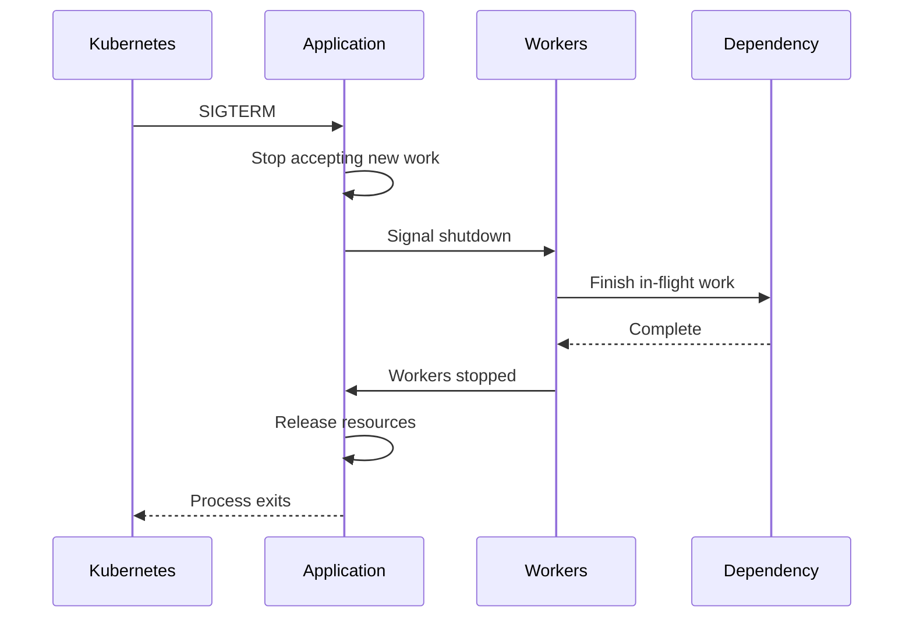

# 14- Locks Semaphores Events

## Overview

Locks, semaphores, and events are synchronization primitives used to coordinate concurrent execution.

In Python backend systems, synchronization is required whenever multiple threads, processes, or asynchronous tasks interact with shared state or compete for limited resources.

The primitives solve different problems:

| Primitive | Primary purpose | Typical scope |
|---|---|---|
| `asyncio.Lock` | Mutual exclusion between async tasks | One event loop |
| `threading.Lock` | Mutual exclusion between threads | One process |
| `multiprocessing.Lock` | Mutual exclusion between processes | Coordinated processes |
| `asyncio.Semaphore` | Limit concurrent async operations | One event loop |
| `threading.Semaphore` | Limit concurrent thread operations | One process |
| `asyncio.Event` | Signal a state change | One event loop |
| `threading.Event` | Signal a state change | One process |
| Database locks | Coordinate persistent state | Distributed application |
| Distributed locks | Coordinate independent processes/nodes | Distributed system |

The core engineering distinction is:

> **A synchronization primitive controls concurrency; it does not automatically provide persistence, transactional correctness, or distributed coordination.**

---

## Synchronization and Concurrency

Concurrency means multiple units of work can make progress during overlapping periods.

Examples include:

- multiple asyncio tasks;
- multiple threads;
- multiple processes;
- multiple HTTP requests;
- multiple workers processing messages.

Without coordination, concurrent operations can interfere with each other.

```text
Task A ────────┐
               ├── Shared Resource
Task B ────────┘
```

If both tasks modify the same resource without appropriate coordination, the result may depend on timing.

That is a race condition.

Synchronization introduces controlled access:

```text
Task A ──┐
         │
       Lock
         │
Task B ──┘
```

Only one task can enter the protected critical section when a mutual-exclusion lock is used.

---

## Critical Sections

A critical section is a region of code that must not be executed concurrently by multiple participants.

```python
async with lock:
    state.update(...)
```

The goal is not to lock an entire application.

The goal is to protect the smallest state transition that requires exclusive access.

A good critical section is:

- small;
- deterministic;
- easy to reason about;
- free of unnecessary blocking operations.

---

## `asyncio.Lock`

`asyncio.Lock` provides mutual exclusion between asyncio tasks.

```python
import asyncio

lock = asyncio.Lock()
```

Use it with an asynchronous context manager:

```python
async with lock:
    await update_shared_state()
```

If another task already owns the lock, the waiting task yields control rather than blocking the operating-system thread.

---

## How `asyncio.Lock` Works

Conceptually:

```text
Task A
   │
   ├── acquire lock
   │
   ├── critical section
   │
   └── release lock
             │
             ↓
          Task B
             │
             ├── acquire
             └── continue
```

The event loop schedules other tasks while a task waits for the lock.

This is fundamentally different from blocking a thread with a synchronous synchronization primitive.

---

## Lock Example

Consider an in-memory counter:

```python
import asyncio


class RequestCounter:
    def __init__(self) -> None:
        self._count = 0
        self._lock = asyncio.Lock()

    async def increment(self) -> int:
        async with self._lock:
            self._count += 1
            return self._count

    async def value(self) -> int:
        async with self._lock:
            return self._count
```

The lock protects the state transition.

---

## Why `asyncio.Lock` Can Be Necessary

Even though asyncio uses cooperative scheduling, async code can still have race conditions.

Consider:

```python
current = balance

await external_call()

balance = current - amount
```

The `await` creates an opportunity for another task to run.

The operation is therefore not automatically atomic merely because it runs in one OS thread.

---

## Asyncio Race Condition

```python
balance = 100


async def withdraw(amount: int) -> None:
    global balance

    current = balance

    await asyncio.sleep(0)

    balance = current - amount
```

Two concurrent withdrawals can read the same balance.

The event loop's single-threaded execution does not eliminate logical races.

---

## Correcting the Race

```python
balance = 100
balance_lock = asyncio.Lock()


async def withdraw(amount: int) -> None:
    global balance

    async with balance_lock:
        if balance < amount:
            raise ValueError("insufficient funds")

        balance -= amount
```

The state transition is now serialized within that process.

This still does **not** make a real banking system correct because persistent financial state belongs in a transactional database.

---

## Lock Does Not Mean Transaction

This is a critical distinction:

```text
asyncio.Lock
    ↓
Protects in-memory concurrent access
```

versus:

```text
PostgreSQL transaction
    ↓
Protects persistent state transition
```

For business-critical data, use the database's transactional guarantees.

For example:

```sql
SELECT balance
FROM accounts
WHERE id = $1
FOR UPDATE;
```

can provide database-level row locking within a transaction.

---

## Lock Scope

A lock protects only code that uses the same lock.

```python
lock_a = asyncio.Lock()
lock_b = asyncio.Lock()
```

These are independent.

Acquiring `lock_a` does not prevent another task from entering code protected by `lock_b`.

This is a common source of accidental concurrency bugs.

---

## Keep Lock Scope Small

Prefer:

```python
async with lock:
    state = update_state()
```

over:

```python
async with lock:
    response = await remote_api()
    await database_call()
    await expensive_computation()
    state = update_state()
```

The second design may serialize unrelated work for a long time.

However, do not shorten a critical section if doing so breaks correctness.

Correctness determines the required scope; performance optimization comes afterward.

---

## Never Assume the GIL Replaces Locks

The GIL is not an application synchronization mechanism.

The GIL:

- is a CPython implementation detail;
- does not define Python language semantics;
- does not provide application-level mutual exclusion;
- does not coordinate multiple processes;
- does not coordinate multiple machines;
- does not replace database transactions.

Even when Python bytecode execution is constrained by the GIL, application-level race conditions remain possible.

---

## `threading.Lock`

For threaded applications, use `threading.Lock`.

```python
import threading

lock = threading.Lock()
```

Example:

```python
import threading


class Counter:
    def __init__(self) -> None:
        self._value = 0
        self._lock = threading.Lock()

    def increment(self) -> int:
        with self._lock:
            self._value += 1
            return self._value
```

The `with` statement guarantees release when leaving the block.

---

## `asyncio.Lock` vs `threading.Lock`

| Property | `asyncio.Lock` | `threading.Lock` |
|---|---|---|
| Protects | Asyncio tasks | Threads |
| Blocking behavior | Cooperative waiting | Blocks calling thread |
| Used with | `async with` | `with` |
| Event-loop compatible | Yes | Not directly |
| Cross-process | No | No |
| Distributed | No | No |

Do not use `threading.Lock` as a general synchronization primitive inside async code.

A blocking lock acquisition can stall the event-loop thread.

---

## `threading.RLock`

An `RLock` is a reentrant lock.

The same thread can acquire it multiple times:

```python
import threading

lock = threading.RLock()

with lock:
    with lock:
        perform_work()
```

The thread must release the lock the corresponding number of times.

Use an `RLock` only when reentrancy is actually required.

A normal `Lock` is preferable when possible because the ownership model is simpler.

---

## Reentrancy

Reentrancy can matter when:

```text
Method A
  ↓
acquires lock
  ↓
Method B
  ↓
tries to acquire same lock
```

With a normal non-reentrant lock, this can deadlock.

With an `RLock`, the owning thread can acquire it again.

However, using `RLock` to hide poorly structured locking can make concurrency behavior harder to reason about.

---

## `asyncio.Semaphore`

A semaphore limits the number of concurrent operations.

```python
semaphore = asyncio.Semaphore(20)
```

Use it as:

```python
async with semaphore:
    await call_dependency()
```

At most 20 tasks can be inside the protected section simultaneously.

---

## Why Semaphores Exist

Suppose an API receives 5,000 concurrent requests and each request calls a downstream service.

Without a limit:

```text
5,000 requests
      ↓
5,000 downstream calls
```

This may overwhelm:

- the downstream service;
- connection pools;
- CPU;
- memory;
- file descriptors;
- network capacity.

A semaphore introduces a concurrency budget:

```text
5,000 requests
      ↓
Semaphore(100)
      ↓
100 in-flight calls
```

---

## Semaphore Example

```python
import asyncio


partner_limit = asyncio.Semaphore(50)


async def fetch_customer(
    client,
    customer_id: int,
) -> dict:
    async with partner_limit:
        response = await client.get(
            f"https://partner.example/customers/{customer_id}"
        )
        response.raise_for_status()
        return response.json()
```

The application can have many tasks waiting while only 50 calls execute concurrently.

---

## Semaphore vs Lock

A lock permits one concurrent holder:

```text
Lock
→ 1
```

A semaphore can permit multiple holders:

```text
Semaphore(20)
→ up to 20
```

| Requirement | Primitive |
|---|---|
| Exactly one task at a time | Lock |
| Up to N concurrent operations | Semaphore |
| Signal readiness | Event |

Do not use a lock when controlled concurrency is actually required.

---

## Semaphore Is Not Rate Limiting

A semaphore controls **concurrent operations**.

A rate limiter controls **operations over time**.

For example:

```text
Semaphore(20)
→ maximum 20 in-flight requests
```

does not mean:

```text
20 requests/second
```

If each request takes 10 ms, the service could potentially issue far more than 20 requests per second.

For external API quotas, use an explicit rate limiter when necessary.

---

## Semaphore and Connection Pools

A semaphore and a connection pool control different resources.

```text
Application Tasks
       ↓
Semaphore(100)
       ↓
HTTP/DB Connection Pool(20)
       ↓
Dependency
```

The semaphore limits application-level in-flight operations.

The pool limits available connections.

The effective throughput may be constrained by the smaller downstream capacity.

---

## Semaphore Sizing

Do not automatically choose a large value.

Consider:

- downstream API limits;
- database connection count;
- CPU capacity;
- memory;
- network bandwidth;
- expected latency;
- request burst size;
- number of application replicas.

For Kubernetes:

```text
50 concurrency/pod
×
10 pods
=
500 possible concurrent operations
```

The distributed system sees the aggregate, not the per-pod setting.

---

## `asyncio.BoundedSemaphore`

`asyncio.BoundedSemaphore` behaves like a semaphore but detects excessive releases.

```python
semaphore = asyncio.BoundedSemaphore(20)
```

This is useful when accidentally releasing more times than acquired should be treated as a programming error.

A normal semaphore can increase its internal counter beyond the initial value through unmatched releases.

---

## Semaphore Release Discipline

Prefer:

```python
async with semaphore:
    await operation()
```

instead of manually managing:

```python
await semaphore.acquire()

try:
    await operation()
finally:
    semaphore.release()
```

The explicit form is still useful when acquisition and release need custom lifecycle handling.

---

## `asyncio.Event`

An event represents a boolean-like state transition.

```python
ready = asyncio.Event()
```

A task can wait:

```python
await ready.wait()
```

Another task can signal:

```python
ready.set()
```

Once set, the event remains set until cleared:

```python
ready.clear()
```

---

## Event Semantics

Think of an event as:

```text
NOT READY
   │
   │ set()
   ↓
READY
   │
   │ clear()
   ↓
NOT READY
```

Unlike a queue, an event does not carry a payload.

It communicates state.

---

## Event Example

```python
import asyncio


application_ready = asyncio.Event()


async def worker() -> None:
    await application_ready.wait()
    await process_requests()


async def initialize_application() -> None:
    await load_configuration()
    await initialize_dependencies()

    application_ready.set()
```

Workers wait until initialization completes.

---

## Event Is Not a Queue

An event means:

```text
"The condition is true."
```

A queue means:

```text
"Here is a unit of work."
```

If five tasks are waiting on an event and `set()` is called, they can all proceed.

If five items are added to a queue, those five items must be individually consumed.

---

## Event vs Condition

An event is appropriate when the state is simple:

```text
Application ready
Shutdown requested
Configuration loaded
```

A condition is better when tasks must coordinate around a more complex shared predicate.

```text
Buffer contains at least N items
Capacity became available
State transitioned to a particular condition
```

---

## `threading.Event`

For threads, use:

```python
import threading

shutdown_event = threading.Event()
```

Worker:

```python
def worker() -> None:
    while not shutdown_event.is_set():
        process_work()
```

Shutdown:

```python
shutdown_event.set()
```

This provides cooperative thread cancellation signaling.

---

## Events and Cancellation

An event is useful for cooperative shutdown, but it does not forcibly terminate work.

For example:

```python
shutdown_event.set()
```

does not kill a thread currently executing:

```python
process_large_file()
```

The worker must periodically observe the event or otherwise use a cancellation-aware design.

Python has no general safe mechanism for forcibly terminating an arbitrary running thread.

---

## `asyncio.Event` for Shutdown

An async application can use an event:

```python
shutdown = asyncio.Event()


async def worker() -> None:
    while not shutdown.is_set():
        await process_next_item()
```

A shutdown coordinator can signal:

```python
shutdown.set()
```

In production, cancellation, task ownership, queue draining, and application lifecycle management should usually be combined rather than relying on one event alone.

---

## Lock, Semaphore, and Event Together

A production component may use all three:

```text
                    ┌───────────────┐
                    │ Shutdown Event│
                    └───────┬───────┘
                            │
                            ↓
Producer ─────→ Queue ─────→ Workers
                            │
                            ↓
                     Semaphore(20)
                            │
                            ↓
                      External API
                            │
                            ↓
                         Lock
                            │
                            ↓
                      Local State
```

Each primitive has a separate responsibility.

---

## Combining Synchronization Primitives

Example:

```python
import asyncio


class Service:
    def __init__(self) -> None:
        self._queue: asyncio.Queue[int] = asyncio.Queue(maxsize=1000)
        self._limit = asyncio.Semaphore(20)
        self._state_lock = asyncio.Lock()
        self._shutdown = asyncio.Event()
        self._processed = 0

    async def process(self, item: int) -> None:
        async with self._limit:
            await self._call_dependency(item)

        async with self._state_lock:
            self._processed += 1

    async def stop(self) -> None:
        self._shutdown.set()
```

The design separates:

- work buffering;
- concurrency limiting;
- state protection;
- lifecycle signaling.

---

## Conditions and Shared State

`asyncio.Condition` is useful when synchronization depends on a predicate.

```python
import asyncio


items: list[str] = []
condition = asyncio.Condition()


async def consumer() -> str:
    async with condition:
        await condition.wait_for(items.__len__)
        return items.pop(0)


async def producer(item: str) -> None:
    async with condition:
        items.append(item)
        condition.notify()
```

For standard producer-consumer workloads, `asyncio.Queue` is generally easier to use because it already combines storage and coordination.

---

## Deadlocks

Deadlocks occur when concurrent participants wait forever for resources held by one another.

Classic example:

```text
Task A:
    Lock 1 → acquired
    Lock 2 → waiting

Task B:
    Lock 2 → acquired
    Lock 1 → waiting
```

Neither task can proceed.

---

## Avoiding Deadlocks

Prefer:

- one lock where possible;
- consistent lock acquisition order;
- small critical sections;
- avoiding nested locks;
- avoiding unnecessary locks around I/O;
- explicit timeouts where appropriate.

If multiple locks are necessary, establish an invariant:

```text
Lock A must always be acquired before Lock B.
```

All code paths must follow it.

---

## Lock Contention

Lock contention occurs when many tasks compete for the same lock.

```text
1000 tasks
    ↓
    Lock
    ↓
one task progresses
```

If the protected operation is expensive, concurrency can collapse into serialization.

Measure:

- lock wait time;
- lock hold time;
- number of waiters;
- throughput while locked.

---

## Starvation

Starvation occurs when a task continuously fails to obtain access to a required resource.

Possible causes include:

- excessive contention;
- unfair workload distribution;
- priority scheduling;
- continuously arriving high-priority work.

A semaphore can also contribute to starvation if one workload class consumes all available permits.

---

## Async Locks and Blocking Code

An async lock does not make blocking code asynchronous.

This is dangerous:

```python
async with lock:
    blocking_database_call()
```

If the function blocks the event-loop thread, unrelated tasks can stop making progress.

Use genuinely asynchronous dependencies or explicitly offload blocking work:

```python
asyncio.to_thread(blocking_function)
```

For CPU-heavy pure Python work, a process-based design may be more appropriate.

---

## FastAPI Example

A FastAPI service may limit calls to an external dependency:

```python
import asyncio

from fastapi import FastAPI

app = FastAPI()

partner_limit = asyncio.Semaphore(50)


@app.get("/customers/{customer_id}")
async def get_customer(customer_id: int) -> dict:
    async with partner_limit:
        return await fetch_customer_from_partner(customer_id)
```

This protects the dependency from uncontrolled concurrency within the process.

However, with multiple replicas:

```text
50 permits/pod
×
10 pods
=
500 potential concurrent calls
```

Global limits require distributed or dependency-level controls.

---

## Django Considerations

Django applications may use multiple concurrency mechanisms depending on deployment:

- synchronous workers;
- threads;
- ASGI;
- asyncio;
- Celery workers.

A lock created inside one process cannot coordinate all Django workers.

For shared application state, prefer:

- PostgreSQL transactions;
- Redis coordination where appropriate;
- durable queues;
- database constraints.

---

## gRPC and REST Services

Synchronization often appears around downstream calls.

```text
HTTP/gRPC Requests
       ↓
Concurrency Limit
       ↓
Connection Pool
       ↓
Downstream Service
```

The application should enforce both:

- maximum in-flight work;
- maximum sustainable request rate.

Timeouts must also be configured so that waiting work does not accumulate indefinitely.

---

## PostgreSQL Synchronization

For distributed applications, PostgreSQL can provide stronger coordination semantics.

Examples include:

```sql
BEGIN;

SELECT *
FROM jobs
WHERE id = $1
FOR UPDATE;

UPDATE jobs
SET status = 'processing'
WHERE id = $1;

COMMIT;
```

The database lock coordinates independent application processes accessing the same persistent record.

This is fundamentally different from:

```python
asyncio.Lock()
```

which exists only in one Python process.

---

## Redis Synchronization

Redis can support distributed coordination, including:

- distributed locks;
- counters;
- rate limiting;
- leases;
- ephemeral coordination.

However, distributed locking is subtle.

A production design must consider:

- lock ownership;
- expiration;
- client pauses;
- network partitions;
- failover;
- stale lock holders;
- fencing;
- retry behavior.

Do not build a critical distributed lock from a simplistic `SET`/`DEL` pattern without understanding the failure model.

---

## Kubernetes Implications

Kubernetes multiplies concurrency.

Suppose:

```text
10 replicas
20 workers/replica
50 semaphore permits/replica
```

Potential aggregate capacity may be much larger than any individual pod's configuration.

Capacity planning must consider:

```text
Replicas
×
Workers
×
Concurrency limits
×
Connection pools
```

and compare that with downstream capacity.

---

## High Availability

Local locks and events are not high-availability mechanisms.

If a pod holding a local lock crashes:

```text
Pod crashes
    ↓
Lock object disappears
```

Another pod has no knowledge of that lock.

For distributed coordination, use infrastructure designed for the required consistency and failure guarantees.

---

## Graceful Shutdown

Production services should stop accepting new work before terminating workers.

A typical lifecycle is:



The exact behavior depends on whether work is durable and whether unfinished work can safely be retried.

---

## Timeouts and Synchronization

Synchronization waits should not necessarily be unbounded.

For example:

```python
try:
    await asyncio.wait_for(
        acquire_resource(),
        timeout=2.0,
    )
except TimeoutError:
    handle_capacity_timeout()
```

Timeouts prevent indefinitely waiting operations from consuming resources.

However, a timeout does not necessarily terminate work that is already executing elsewhere.

Cancellation and resource cleanup must still be designed correctly.

---

## Monitoring Synchronization

Useful metrics include:

| Metric | Signal |
|---|---|
| Lock wait duration | Contention |
| Lock hold duration | Critical-section size |
| Semaphore wait duration | Capacity pressure |
| Semaphore utilization | Saturation |
| Worker count | Processing capacity |
| Queue depth | Backlog |
| Queue age | User-visible delay |
| Task cancellation rate | Lifecycle pressure |
| Timeout rate | Dependency/resource pressure |
| Retry rate | Failure amplification |

High lock wait time combined with low CPU utilization can indicate unnecessary serialization.

---

## Observability and Logging

Avoid logging every successful lock acquisition.

That can create excessive log volume.

Instead, instrument meaningful events:

```text
lock_wait_duration
semaphore_wait_duration
queue_wait_duration
operation_duration
timeout_count
cancellation_count
```

Use tracing to correlate synchronization delays with downstream latency.

For example:

```text
HTTP request
   ↓
Semaphore wait: 180 ms
   ↓
HTTP call: 40 ms
   ↓
Database: 20 ms
```

The primary latency problem is then visible as local capacity contention rather than downstream latency.

---

## Security Considerations

Synchronization can become a security concern when untrusted traffic controls resource consumption.

Potential attacks include:

- exhausting semaphore permits;
- flooding queues;
- monopolizing workers;
- creating long-running lock holders;
- triggering expensive synchronized operations;
- causing retry storms.

Mitigations include:

- authentication;
- authorization;
- rate limiting;
- request timeouts;
- bounded queues;
- concurrency limits;
- payload-size limits;
- per-tenant quotas;
- circuit breakers;
- bulkheads.

---

## Testing Locks and Semaphores

Concurrency tests should verify invariants rather than relying on timing.

Good tests verify:

```text
Maximum concurrent operations ≤ configured limit
```

For example:

```python
import asyncio


async def test_concurrency_limit() -> None:
    semaphore = asyncio.Semaphore(3)
    active = 0
    maximum = 0

    async def operation() -> None:
        nonlocal active, maximum

        async with semaphore:
            active += 1
            maximum = max(maximum, active)

            await asyncio.sleep(0)

            active -= 1

    await asyncio.gather(
        *(operation() for _ in range(20))
    )

    assert maximum <= 3
```

This tests the actual invariant rather than assuming a particular scheduling order.

---

## Testing Shutdown Events

Events are useful in deterministic tests:

```python
shutdown = asyncio.Event()


async def worker() -> None:
    await shutdown.wait()


async def test_shutdown() -> None:
    task = asyncio.create_task(worker())

    shutdown.set()

    await task
```

This is more reliable than sleeping for an arbitrary duration.

---

## Common Mistakes

### Using the Wrong Primitive

Using `threading.Lock` inside async code can block the event loop.

Use `asyncio.Lock` for asyncio task coordination.

### Assuming Asyncio Has No Race Conditions

Async tasks can interleave at `await` points.

Single-threaded execution does not eliminate logical races.

### Locking Too Much

Large critical sections create unnecessary serialization.

### Locking Too Little

Insufficient locking can corrupt shared state or violate invariants.

### Holding Locks Across Slow I/O

This increases contention and deadlock risk.

### Treating Semaphore as Rate Limiter

A concurrency limit is not a requests-per-second limit.

### Forgetting Replica Multiplication

A semaphore of 50 per pod is not a global limit of 50.

### Using Local Locks for Distributed State

Multiple pods have separate memory and separate lock objects.

### Assuming the GIL Solves Synchronization

The GIL does not provide application-level correctness.

### Using In-Memory Coordination for Durable Work

Process termination destroys in-memory synchronization state and queued work.

---

## Production Pitfalls

### Semaphore Too Large

Increasing concurrency can reduce latency initially but eventually overload:

```text
Application
   ↓
Connection Pool
   ↓
Database
```

### Semaphore Too Small

A limit below sustainable downstream capacity can unnecessarily reduce throughput.

### Lock Convoys

When many tasks wait for one lock, releasing it can create a large group of waiting tasks competing for progress.

### Deadlock Through Nested Locks

Independent code paths acquiring locks in different orders can deadlock.

### Cancellation While Holding Resources

Use context managers and `finally` blocks to guarantee cleanup.

### Unbounded Waiting

A task waiting forever for a lock, semaphore permit, queue item, or event may consume application resources indefinitely.

### Hidden Global State

Module-level locks can make tests and application behavior difficult to isolate.

### Detached Background Tasks

A synchronization primitive does not make a background task durable.

Important business work belongs in a durable job system when necessary.

---

## Senior-Level Design Principles

### Prefer Ownership Over Shared Mutable State

The simplest synchronization problem is often the one that never exists.

Instead of:

```text
Many tasks
    ↓
Shared mutable object
    ↓
Lock
```

consider:

```text
Producer
    ↓
Queue
    ↓
Single owner
```

Message passing can reduce shared-state complexity.

### Prefer Database Guarantees for Persistent State

If correctness depends on persistent data, enforce invariants at the database layer where possible.

### Use Semaphores as Capacity Controls

A semaphore is especially valuable at boundaries:

- external APIs;
- database-heavy operations;
- expensive CPU sections;
- filesystem resources;
- connection-limited systems.

### Make Concurrency Budgets Explicit

Document:

```text
workers = 20
semaphore = 50
DB pool = 20
HTTP pool = 100
```

and understand how those numbers multiply across replicas.

---

## Decision Matrix

| Problem | Recommended primitive |
|---|---|
| Protect local async state | `asyncio.Lock` |
| Protect thread-shared state | `threading.Lock` |
| Reentrant thread synchronization | `threading.RLock` |
| Limit async concurrency | `asyncio.Semaphore` |
| Detect excessive semaphore releases | `asyncio.BoundedSemaphore` |
| Signal async readiness | `asyncio.Event` |
| Signal thread shutdown | `threading.Event` |
| Wait for a complex state predicate | `asyncio.Condition` |
| Transfer local async work | `asyncio.Queue` |
| Transfer local thread work | `queue.Queue` |
| Coordinate persistent state | PostgreSQL transactions/locks |
| Durable distributed work | Kafka, SQS, Celery |
| Distributed coordination | Purpose-built distributed mechanism |

---

## Architecture Example

A production FastAPI service might look like:

```text
                         ┌───────────────┐
                         │   Clients     │
                         └───────┬───────┘
                                 │
                                 ↓
                         ┌───────────────┐
                         │ Nginx / LB    │
                         └───────┬───────┘
                                 │
                 ┌───────────────┴───────────────┐
                 ↓                               ↓
             FastAPI Pod 1                   FastAPI Pod N
                 │                               │
        ┌────────┼────────┐             ┌────────┼────────┐
        ↓        ↓        ↓             ↓        ↓        ↓
      Lock  Semaphore   Queue          Lock  Semaphore   Queue
        │        │        │             │        │        │
        │        ↓        ↓             │        ↓        ↓
        │   HTTP/DB Pool Kafka/SQS      │   HTTP/DB Pool Kafka/SQS
        │                 │             │                 │
        └──────────────┬──┘             └──────────────┬──┘
                       ↓                               ↓
                   PostgreSQL                    External APIs
```

Local primitives manage local concurrency.

Distributed systems manage durable and cross-process coordination.

---

## Production Checklist

- [ ] Every shared mutable state invariant has an explicit synchronization strategy.
- [ ] `asyncio.Lock` is used for asyncio task coordination rather than blocking thread locks.
- [ ] Thread synchronization uses appropriate `threading` primitives.
- [ ] Lock critical sections are intentionally scoped.
- [ ] Slow I/O is not unnecessarily performed while holding locks.
- [ ] Multiple locks have a consistent acquisition order.
- [ ] Semaphore limits reflect downstream capacity.
- [ ] Concurrency limits are multiplied across deployment replicas during capacity planning.
- [ ] Rate limits are implemented separately from concurrency limits when required.
- [ ] Events are used for signaling rather than work transfer.
- [ ] Local primitives are not treated as distributed locks.
- [ ] Persistent invariants are enforced transactionally where appropriate.
- [ ] Cancellation safely releases locks and permits.
- [ ] Shutdown behavior is explicitly defined.
- [ ] Waiting operations have appropriate timeouts.
- [ ] Queue and synchronization metrics are observable.
- [ ] Lock and semaphore contention can be diagnosed.
- [ ] Tests verify concurrency invariants deterministically.
- [ ] Security controls prevent resource-exhaustion abuse.
- [ ] Durable work does not depend solely on in-memory synchronization.
- [ ] Kubernetes termination and graceful shutdown have been tested.
- [ ] Failure behavior is defined for crashed lock holders and interrupted work.
- [ ] Distributed coordination uses infrastructure appropriate to the consistency and failure model.

## Key Takeaways

- **Locks provide mutual exclusion:** use `asyncio.Lock` for async tasks and `threading.Lock` for threads; keep critical sections small without compromising correctness.
- **Semaphores control concurrency, not throughput:** use them to protect downstream capacity, but implement rate limiting separately when request-per-second limits matter.
- **Events communicate state transitions:** they are useful for readiness and shutdown signaling but are not substitutes for queues, cancellation, or durable work systems.
- **Local synchronization is not distributed synchronization:** locks, semaphores, and events inside a process cannot coordinate Kubernetes replicas; use transactional databases or purpose-built distributed infrastructure when required.
- **Production correctness depends on lifecycle and capacity design:** account for cancellation, timeouts, deadlocks, contention, replica multiplication, observability, graceful shutdown, and downstream limits.