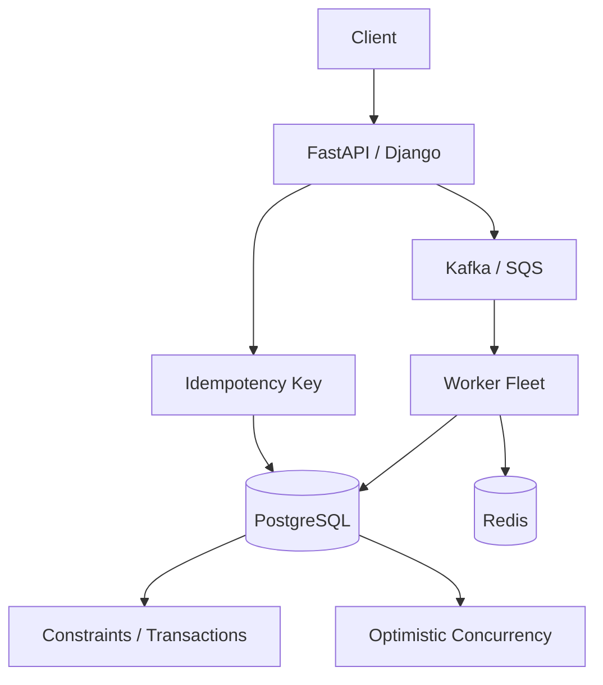

# 15- Race Conditions

## Overview

A race condition occurs when the correctness of a program depends on the timing or interleaving of concurrent operations.

Race conditions are one of the most important failure modes in concurrent Python systems. They can occur with:

- `asyncio` tasks;
- threads;
- processes;
- multiple application workers;
- multiple Kubernetes replicas;
- distributed consumers;
- database transactions;
- external APIs and message brokers.

The critical distinction is that a race condition is about **incorrect coordination between concurrent operations**, not simply about multiple operations running at the same time.

A useful mental model is:

```text
Concurrent execution
        ↓
Shared state / shared resource
        ↓
Multiple operations can overlap
        ↓
Ordering affects the result
        ↓
Race condition possible
```

The solution is not always a lock. Depending on the system boundary, the correct solution may be:

- a lock;
- a semaphore;
- a queue;
- immutable state;
- message passing;
- an atomic database operation;
- a database transaction;
- a unique constraint;
- optimistic concurrency control;
- an idempotency key;
- distributed coordination.

---

## What Is a Race Condition?

A race condition exists when two or more concurrent operations access shared state and the result depends on their execution order.

Consider:

```python
counter = 0


def increment() -> None:
    global counter

    current = counter
    counter = current + 1
```

Conceptually, the operation consists of:

```text
read counter
    ↓
calculate new value
    ↓
write counter
```

If two execution contexts interleave those operations, one update can overwrite the other.

The problem is not that the addition itself is complicated.

The problem is that the **read-modify-write sequence is not protected as one logical operation**.

---

## Race Condition vs Data Race

The terms are related but should not be treated as identical.

A **data race** generally refers to unsynchronized concurrent access to shared memory where at least one operation writes.

A **race condition** is broader: correctness depends on timing or ordering between concurrent operations.

A distributed application can have race conditions even when there is no shared memory.

For example:

```text
Request A → checks inventory = 1
Request B → checks inventory = 1

Request A → creates order
Request B → creates order
```

The race exists across separate application processes and a shared database.

---

## Why Race Conditions Are Difficult

Race conditions are often:

- intermittent;
- workload-dependent;
- difficult to reproduce;
- sensitive to timing;
- absent during debugging;
- more likely under load;
- capable of silently corrupting state.

A system may pass thousands of tests and still contain a race that appears only under a particular interleaving.

```text
Normal load
    ↓
Rare interleaving
    ↓
Incorrect state
    ↓
Only occasionally observable
```

This makes race conditions particularly dangerous in production.

---

## Concurrency Does Not Require Multiple CPU Cores

Race conditions can occur even when code executes on a single CPU core.

Asyncio is a good example.

```python
async def operation():
    value = shared_state

    await some_io()

    shared_state = value + 1
```

The `await` gives another task an opportunity to execute.

Therefore:

```text
Task A
  read
  ↓
await ──────────────┐
                    ↓
                 Task B
                    ↓
                 modify
                    ↓
Task A resumes
  ↓
write stale value
```

The application is single-threaded but still concurrent.

---

## Asyncio Race Conditions

Asyncio uses cooperative scheduling.

A task normally continues executing until it:

- awaits an awaitable;
- returns;
- raises an exception.

This makes some operations easier to reason about than preemptive threads, but it does not eliminate race conditions.

Explicit suspension points are especially important:

```python
value = state.value

await fetch_remote_data()

state.value = value + 1
```

The `await` separates the read from the write.

---

## Asyncio Race Example

```python
import asyncio


counter = 0


async def increment() -> None:
    global counter

    current = counter
    await asyncio.sleep(0)
    counter = current + 1


async def main() -> None:
    await asyncio.gather(
        increment(),
        increment(),
        increment(),
    )

    print(counter)


asyncio.run(main())
```

The final value may be less than the number of increments because multiple tasks can read the same value before another task writes its update.

---

## Fixing an Asyncio Race

Use `asyncio.Lock` when shared in-memory state genuinely requires mutual exclusion.

```python
import asyncio


counter = 0
counter_lock = asyncio.Lock()


async def increment() -> None:
    global counter

    async with counter_lock:
        counter += 1
```

Now the read-modify-write operation is protected.

However, this only coordinates tasks using that lock within the same process.

---

## Lock Scope Matters

A lock only protects operations that participate in the same synchronization protocol.

```python
lock = asyncio.Lock()
```

protects:

```python
async with lock:
    update_state()
```

It does not automatically protect:

```python
update_state()
```

somewhere else.

A lock is therefore not a magical property attached to the underlying variable.

The correctness invariant must be shared by all code paths that access the protected state.

---

## Race Conditions in Threads

Threads can race over shared mutable state.

Example:

```python
import threading


counter = 0


def increment() -> None:
    global counter

    current = counter
    counter = current + 1
```

Multiple threads executing this operation can interleave.

Use a lock:

```python
import threading


counter = 0
counter_lock = threading.Lock()


def increment() -> None:
    global counter

    with counter_lock:
        counter += 1
```

---

## The GIL Does Not Eliminate Race Conditions

The CPython GIL should not be treated as an application-level synchronization mechanism.

The GIL:

- is an implementation detail of CPython;
- historically limits execution of Python bytecode to one thread at a time within a GIL-enabled interpreter;
- does not define business-level atomicity;
- does not protect multi-step application operations;
- does not coordinate processes;
- does not coordinate Kubernetes replicas.

This is unsafe reasoning:

```text
"Python has a GIL, therefore shared state is safe."
```

The correct reasoning is:

```text
"Does this logical state transition have an explicit correctness guarantee?"
```

---

## Race Conditions in Processes

Processes have separate memory spaces, so ordinary Python objects are not shared automatically.

However, processes can still race through shared resources:

- shared memory;
- files;
- databases;
- Redis;
- message brokers;
- external APIs;
- distributed locks.

For example:

```text
Process A ──┐
            ├── PostgreSQL row
Process B ──┘
```

Both processes can independently modify the same persistent state.

---

## Classic Check-Then-Act Race

One of the most important race patterns is:

```python
if not resource_exists():
    create_resource()
```

The operations are individually correct but the combined sequence is not atomic.

Two requests can execute:

```text
Request A: check → does not exist
Request B: check → does not exist
Request A: create
Request B: create
```

This is a check-then-act race.

---

## Database Example

Suppose an application must ensure one email address is registered only once.

Unsafe:

```python
user = await find_user_by_email(email)

if user is None:
    await create_user(email)
```

Concurrent requests can both observe no user.

The correct solution should generally include a database uniqueness constraint:

```sql
CREATE UNIQUE INDEX users_email_unique
ON users (email);
```

Then the database enforces the invariant even when requests run concurrently.

---

## Database Constraints Beat Application Locks

If the invariant is:

```text
email must be unique
```

prefer:

```text
PostgreSQL UNIQUE constraint
```

over:

```text
asyncio.Lock
```

because the database constraint coordinates:

- multiple application processes;
- multiple application hosts;
- Kubernetes replicas;
- different programming languages;
- independent clients.

The database is the authoritative owner of the persistent invariant.

---

## Lost Update

A lost update occurs when one concurrent modification overwrites another.

Example:

```text
Initial value = 100

Request A reads 100
Request B reads 100

Request A writes 110
Request B writes 90

Final value = 90
```

The update from A has effectively disappeared.

This is a common race in read-modify-write operations.

---

## Lost Update in APIs

Consider:

```http
GET /accounts/42
```

returns:

```json
{
  "balance": 100
}
```

Two clients independently calculate new balances and send:

```http
PUT /accounts/42
```

One update can overwrite the other.

A REST API that exposes mutable state must consider concurrency semantics explicitly.

---

## Optimistic Concurrency Control

One solution is versioning.

Database state:

```text
id = 42
balance = 100
version = 7
```

Client A reads version 7.

Client B reads version 7.

Client A updates:

```text
version 7 → 8
```

Client B attempts to update version 7 and fails because the expected version is stale.

Conceptually:

```sql
UPDATE accounts
SET balance = $1,
    version = version + 1
WHERE id = $2
  AND version = $3;
```

If zero rows are updated, the client encountered a concurrency conflict.

---

## Pessimistic Concurrency Control

Another approach is to lock the database row while operating on it.

```sql
BEGIN;

SELECT balance
FROM accounts
WHERE id = $1
FOR UPDATE;

UPDATE accounts
SET balance = balance - $2
WHERE id = $1;

COMMIT;
```

The row lock prevents conflicting transactions from simultaneously modifying the protected row.

Use pessimistic locking when contention and correctness requirements justify it.

---

## Optimistic vs Pessimistic Concurrency

| Strategy | Mechanism | Best suited for |
|---|---|---|
| Optimistic | Version/check condition | Low-to-moderate contention |
| Pessimistic | Lock resource | High-contention critical updates |
| Unique constraint | Database invariant | Uniqueness |
| Atomic SQL update | Single statement | Simple state transitions |
| Application lock | Process-local coordination | Local in-memory state |

The database should enforce persistent invariants whenever practical.

---

## Atomic Database Operations

Sometimes a transaction or explicit lock is unnecessary.

Instead of:

```text
SELECT balance
UPDATE balance
```

use one atomic statement:

```sql
UPDATE accounts
SET balance = balance - $1
WHERE id = $2
  AND balance >= $1;
```

Then inspect the affected-row count.

This can eliminate an entire class of application-level race conditions.

---

## Compare-and-Set

A common concurrency pattern is:

```text
Expected state
      ↓
Conditional update
      ↓
Success or conflict
```

For example:

```sql
UPDATE jobs
SET status = 'processing'
WHERE id = $1
  AND status = 'pending';
```

If exactly one worker changes the row:

```text
Worker A → success
Worker B → zero rows
```

Only one worker acquired the logical transition.

---

## Queue-Based Race Avoidance

Message passing can reduce shared-state races.

Instead of:

```text
Many tasks
    ↓
Shared mutable object
    ↓
Lock
```

use:

```text
Producers
    ↓
Queue
    ↓
Single owner / controlled workers
    ↓
State
```

The queue establishes a clear ownership boundary.

This does not eliminate all races, especially with multiple consumers, but it can significantly simplify state management.

---

## Single-Writer Architecture

A powerful design pattern is single ownership.

```text
Commands
   ↓
Queue
   ↓
Single Writer
   ↓
State
```

Only one component mutates a particular piece of state.

This reduces synchronization requirements because there is no concurrent mutation of that state.

The tradeoff is that the single writer can become a throughput bottleneck and may require partitioning.

---

## Partitioned Ownership

A scalable version uses multiple independent partitions:

```text
Partition A → Worker A → State A
Partition B → Worker B → State B
Partition C → Worker C → State C
```

Kafka partitioning is a common example.

If all events for an entity are routed to the same partition, processing for that entity can remain ordered without requiring a global lock.

---

## Race Conditions in Kafka Consumers

Kafka consumers can still encounter races.

For example:

```text
Consumer A → processes entity 42
Consumer B → processes entity 42
```

If events for the same entity are not partitioned consistently, concurrent processing can violate ordering assumptions.

A common strategy is to use a stable partition key:

```text
customer_id
    ↓
Kafka partition
    ↓
ordered processing
```

Partition-level ordering is not global ordering.

---

## Race Conditions with Redis

Redis operations can be atomic individually, but multi-step workflows may still race.

Unsafe conceptual sequence:

```text
GET value
check value
SET value
```

Two clients can interleave those operations.

Prefer atomic Redis operations or server-side mechanisms where appropriate.

Examples include:

- `INCR`;
- conditional operations;
- Lua scripts;
- transactions where appropriate.

---

## Race Conditions with Caches

Cache updates can race with database updates.

Example:

```text
Request A → update DB
Request B → read DB
Request B → populate cache with old value
Request A → invalidate cache
```

Depending on ordering, stale data may remain cached.

Cache consistency must therefore be designed explicitly.

Possible strategies include:

- cache-aside with careful invalidation;
- write-through;
- versioned cache keys;
- short TTLs;
- event-driven invalidation.

---

## Race Conditions and Idempotency

Retries can create duplicate operations.

Example:

```text
Client
  ↓
POST /payments
  ↓
Payment succeeds
  ↓
Network failure
  ↓
Client retries
  ↓
Second payment
```

The problem is not necessarily a memory race.

It is a distributed race between the original request and the retry.

Use an idempotency key:

```http
Idempotency-Key: 8f7f3d...
```

and persist the result associated with that key.

---

## Idempotency as Concurrency Control

A robust payment flow can look like:

```text
Request
   ↓
Idempotency key
   ↓
Check/create operation record
   ↓
Transactional state transition
   ↓
External payment operation
   ↓
Persist result
```

The implementation must carefully handle concurrent requests using the same key.

A unique database constraint can ensure only one operation record wins.

---

## Double-Submission Race

Users can submit the same request multiple times:

```text
Browser
 ├── POST /orders
 └── POST /orders
```

Both requests can arrive before the first response is returned.

Prevent duplicate business effects through:

- idempotency keys;
- unique business constraints;
- transactional state transitions;
- deduplication.

Client-side button disabling is useful UX but is not a correctness mechanism.

---

## Race Conditions in Background Jobs

Celery workers can concurrently process the same logical job if:

- messages are redelivered;
- retries overlap;
- visibility/acknowledgement behavior allows duplicates;
- multiple producers submit the same work.

Workers should therefore assume duplicate delivery can occur where the system semantics permit it.

Use:

- idempotent handlers;
- unique constraints;
- job state transitions;
- appropriate acknowledgement strategy.

---

## Race Conditions in Scheduled Jobs

Suppose Kubernetes runs several replicas and every replica executes:

```python
run_daily_report()
```

Without coordination:

```text
Pod A → report
Pod B → report
Pod C → report
```

A job intended to run once can execute multiple times.

Solutions include:

- Kubernetes CronJob;
- Celery beat with appropriate deployment design;
- database-based job claiming;
- distributed scheduling;
- idempotent job execution.

---

## Race Conditions in File Operations

Files are shared resources.

This is unsafe:

```python
if not path.exists():
    path.write_text(content)
```

Another process can create the file between the check and the write.

This is another check-then-act race.

Prefer atomic filesystem operations or use a coordination mechanism appropriate to the environment.

---

## Time-of-Check to Time-of-Use

TOCTOU is a general race pattern:

```text
Check resource
      ↓
Time passes
      ↓
Use resource
```

The resource can change between the check and use.

Examples:

- file existence;
- permissions;
- database state;
- object ownership;
- cache entries;
- distributed leases.

The best mitigation is often to combine the check and action into one atomic operation.

---

## Synchronization Strategies

| Strategy | Scope | Strength |
|---|---|---|
| `asyncio.Lock` | Async tasks in one process | Local |
| `threading.Lock` | Threads in one process | Local |
| Queue | Producer/consumer boundary | Decoupling |
| Atomic DB statement | Persistent shared state | Strong |
| DB transaction | Persistent multi-step operation | Strong |
| DB constraint | Persistent invariant | Strong |
| Optimistic versioning | Distributed state | Conflict detection |
| Redis atomic operation | Redis state | Strong for supported operation |
| Distributed lock | Cross-process coordination | Depends on implementation |
| Idempotency key | Repeated requests | Duplicate-effect prevention |

The correct strategy depends on where the authoritative state lives.

---

## Race Conditions and Distributed Locks

A distributed lock can coordinate independent application instances:

```text
Pod A ──┐
Pod B ──┼── Distributed Lock ── Shared Resource
Pod C ──┘
```

However, distributed locks introduce failure scenarios:

- network partitions;
- process pauses;
- lock expiration;
- stale owners;
- clock assumptions;
- client crashes;
- failover.

A distributed lock should not be the default answer to every race condition.

If the invariant belongs in PostgreSQL, a transaction or constraint is often simpler and stronger.

---

## Lock Expiration and Stale Owners

Consider:

```text
Pod A acquires lock
       ↓
Pod A pauses
       ↓
Lock expires
       ↓
Pod B acquires lock
       ↓
Pod A resumes
```

Now both A and B may believe they can operate on the resource.

This is why serious distributed locking designs may require leases and fencing mechanisms.

The key question is not:

> "Can I acquire a lock?"

It is:

> "Can an old lock holder still cause damage after its lease has expired?"

---

## Race Conditions and Transactions

A transaction groups related database operations into a consistent unit.

Example:

```text
BEGIN
  ↓
Read/lock state
  ↓
Validate invariant
  ↓
Update state
  ↓
COMMIT
```

Without appropriate isolation or locking, concurrent transactions can still experience anomalies.

Therefore:

> A transaction does not automatically mean race-free execution.

The transaction isolation level and SQL operations must match the required correctness guarantees.

---

## Isolation Levels

Common PostgreSQL isolation levels include:

| Level | General behavior |
|---|---|
| Read Committed | Default; statements see committed data under PostgreSQL semantics |
| Repeatable Read | Stronger transaction-level snapshot consistency |
| Serializable | Strongest standard isolation; conflicting transactions may need retry |

Higher isolation can reduce concurrency anomalies but may increase contention or transaction aborts.

Use the weakest isolation level that correctly enforces the business invariant, unless stronger isolation is justified.

---

## Race Conditions and REST

REST APIs are exposed to concurrent requests by default.

For mutable resources, consider:

- optimistic concurrency;
- ETags;
- `If-Match`;
- version fields;
- idempotency keys;
- database constraints;
- atomic updates.

Example:

```http
PUT /orders/123
If-Match: "version-7"
```

The server can reject updates based on stale resource versions.

---

## Race Conditions and gRPC

The same concurrency principles apply to gRPC.

Multiple RPC calls can target the same resource concurrently:

```text
Client A ── RPC ──┐
                  ├── Service ── Database
Client B ── RPC ──┘
```

Do not assume HTTP/2 or gRPC provides application-level serialization.

Concurrency correctness remains the responsibility of the service and its persistence layer.

---

## Race Conditions in FastAPI

FastAPI can execute many requests concurrently, depending on its deployment and endpoint implementation.

Async endpoints may interleave at `await` points.

Synchronous endpoints may execute in worker threads depending on the framework/runtime configuration.

Therefore, shared mutable process state should be treated carefully.

Avoid:

```python
global mutable_cache = {}
```

as an uncoordinated source of shared application state.

Prefer:

- immutable configuration;
- request-local state;
- external caches;
- database state;
- explicit synchronization.

---

## Race Conditions in Django

Django deployments can include multiple workers and threads.

A module-level variable:

```python
cache = {}
```

is not globally shared across all workers.

You can therefore have two separate problems:

```text
Worker A → local state
Worker B → different local state
```

and:

```text
Multiple threads → same local state
```

Local locks solve only the second problem.

---

## Kubernetes Multiplies Race Opportunities

Consider:

```text
10 pods
×
4 workers
×
multiple concurrent requests
```

The number of concurrent execution contexts can be large.

A process-local synchronization primitive cannot coordinate them.

For cross-pod correctness, move coordination to a shared authoritative system.

---

## Common Race Patterns

### Read-Modify-Write

```text
read
modify
write
```

Fix with atomic operations, locks, or transactions.

### Check-Then-Act

```text
check
act
```

Fix by combining the operations or enforcing the invariant at the resource owner.

### Lost Update

```text
read A
read B
write A
write B
```

Fix with transactions, locking, or optimistic concurrency.

### Duplicate Processing

```text
process
retry
process again
```

Fix with idempotency and deduplication.

### Stale Cache

```text
update
invalidate
repopulate
```

Fix with explicit cache consistency strategy.

### Scheduled Job Duplication

```text
multiple workers
    ↓
same scheduled operation
```

Fix with job ownership or idempotent execution.

---

## Common Mistakes

### Assuming the GIL Prevents Races

The GIL does not protect business-level invariants.

### Assuming Asyncio Is Race-Free

Async tasks can interleave at suspension points.

### Protecting Persistent Data with an Asyncio Lock

The lock exists only inside one process.

### Using Locks Everywhere

Locks increase complexity and can reduce throughput.

Prefer atomic state transitions and ownership boundaries where possible.

### Checking Before Inserting

A prior existence check does not guarantee uniqueness.

Use a database constraint.

### Assuming Transactions Automatically Prevent Races

Isolation level and transaction structure matter.

### Creating a Global Lock in FastAPI

A process-local lock does not coordinate multiple workers or pods.

### Ignoring Retries

Retries can create duplicate business operations.

### Relying on Client-Side Deduplication

The server must enforce business correctness.

### Testing Only Sequentially

A race condition may never appear in sequential tests.

---

## Production Pitfalls

### Rare Race Under Load

A race can remain invisible until concurrency increases.

Use load and stress testing to exercise concurrent paths.

### Lock Contention

A lock can eliminate races by serializing so much work that throughput collapses.

Measure before optimizing.

### Deadlocks

Multiple locks acquired in inconsistent order can cause permanent waiting.

### Retry Storms

Concurrent retries can amplify the original failure:

```text
Dependency slows
      ↓
Requests timeout
      ↓
Retries increase traffic
      ↓
Dependency slows further
```

Use bounded retries, exponential backoff, jitter, and concurrency limits.

### Race During Failure Recovery

Recovery code is often less tested than the happy path and may execute concurrently with normal operations.

### Distributed Lock Expiration

Expired locks can allow old owners to continue operating unless the design prevents stale writes.

---

## Testing Race Conditions

Concurrency tests should focus on invariants rather than expected timing.

For example:

```python
import asyncio


async def test_counter_is_consistent() -> None:
    counter = 0
    lock = asyncio.Lock()

    async def increment() -> None:
        nonlocal counter

        async with lock:
            current = counter
            await asyncio.sleep(0)
            counter = current + 1

    await asyncio.gather(
        *(increment() for _ in range(100))
    )

    assert counter == 100
```

The test verifies the business invariant:

```text
100 operations
→ final count = 100
```

---

## Stress Testing

A race may require thousands of interleavings before appearing.

Useful approaches include:

- repeated concurrent execution;
- randomized scheduling;
- high request concurrency;
- fault injection;
- dependency latency injection;
- process restarts;
- database contention;
- message redelivery.

Do not rely on one successful test run as proof of race-free behavior.

---

## Deterministic Race Testing

The most useful concurrency tests often deliberately create an interleaving.

For example:

```python
import asyncio


async def test_interleaving() -> None:
    ready = asyncio.Event()
    continue_event = asyncio.Event()

    async def first() -> None:
        ready.set()
        await continue_event.wait()

    task = asyncio.create_task(first())

    await ready.wait()
    continue_event.set()

    await task
```

Events and barriers make scheduling relationships explicit instead of relying on arbitrary sleeps.

---

## Observability

Race conditions often appear indirectly.

Monitor:

- duplicate requests;
- duplicate jobs;
- database constraint violations;
- optimistic concurrency conflicts;
- transaction retries;
- deadlocks;
- lock wait time;
- queue redeliveries;
- idempotency conflicts;
- inconsistent state transitions.

Useful structured log fields include:

```text
request_id
operation_id
entity_id
version
idempotency_key
worker_id
attempt
```

These make concurrent operations easier to reconstruct.

---

## Detecting Database Contention

For PostgreSQL-backed systems, investigate:

- lock waits;
- blocked queries;
- transaction duration;
- deadlocks;
- serialization failures;
- long-running transactions.

A race-condition investigation should correlate:

```text
Application request
      ↓
Transaction
      ↓
SQL statements
      ↓
Lock/wait behavior
      ↓
Final state
```

Tracing can significantly reduce debugging time.

---

## Security Implications

Race conditions can become security vulnerabilities.

Examples include:

- double spending;
- privilege escalation;
- duplicate token use;
- bypassing authorization checks;
- TOCTOU file vulnerabilities;
- duplicate resource creation;
- replay attacks;
- quota bypass.

Security-sensitive invariants should be enforced at the authoritative resource boundary.

For example:

```text
Authorization check
      ↓
Atomic state transition
```

is safer than:

```text
Authorization check
      ↓
unrelated asynchronous work
      ↓
state transition
```

when the state can change between those steps.

---

## Race Conditions and Authorization

Consider:

```text
Check:
User owns document

Later:
Delete document
```

Another operation could transfer ownership between those operations.

Authorization and mutation should be coordinated with the same authoritative state where security requires it.

Database transactions and conditional updates are often preferable to process-local locks.

---

## Reliability and High Availability

Race-condition fixes must survive the deployment topology.

A solution that works on one laptop may fail with:

```text
1 process
```

but behave differently with:

```text
10 Kubernetes pods
×
4 workers/pod
```

For production systems, define:

- authoritative state;
- synchronization scope;
- failure behavior;
- retry semantics;
- ownership;
- recovery behavior.

---

## Disaster Recovery

Race-condition correctness should remain valid during recovery.

Consider:

```text
Worker processes job
      ↓
Crash
      ↓
Message redelivered
      ↓
Another worker processes job
```

The system must tolerate this sequence if redelivery is part of its delivery model.

Idempotency and durable state transitions are often more valuable than attempting to prevent every duplicate execution.

---

## Performance Tradeoffs

Synchronization reduces possible concurrency.

```text
More locking
    ↓
Less concurrent work
    ↓
Potentially lower throughput
```

But removing synchronization can make the system incorrect.

The engineering objective is not:

> Maximum concurrency.

It is:

> Maximum safe concurrency.

Prefer designs that reduce the amount of shared mutable state instead of simply adding increasingly complex locking.

---

## Cost Considerations

Poor concurrency control can increase infrastructure cost.

Examples:

```text
Race
 ↓
Duplicate jobs
 ↓
Duplicate API calls
 ↓
More CPU/network usage
 ↓
Higher cloud cost
```

Conversely, excessive serialization can require unnecessary replicas to achieve the same throughput.

Correct synchronization is therefore both a reliability and cost optimization.

---

## Choosing a Race-Condition Solution

Use this decision framework:

```text
Where does the shared state live?
            │
     ┌──────┴──────┐
     ↓             ↓
   Local       Distributed
     │             │
     ↓             ↓
 Lock/Queue    DB/Redis/Broker
     │             │
     └──────┬──────┘
            ↓
Is the operation persistent?
            │
      ┌─────┴─────┐
      ↓           ↓
     No          Yes
      │           │
 Local sync    Transaction /
               constraint /
               atomic update
```

Ask:

1. What resource is shared?
2. Who owns the authoritative state?
3. What invariant must always hold?
4. Can the operation be made atomic?
5. Can shared mutable state be eliminated?
6. Does the solution work across processes?
7. Does it work across replicas?
8. What happens during retries?
9. What happens if a worker crashes?
10. How will contention and conflicts be observed?

---

## Preferred Mitigation Order

When solving a race condition, prefer simpler and stronger guarantees first:

```text
1. Eliminate shared mutable state
        ↓
2. Define clear ownership
        ↓
3. Use atomic operations
        ↓
4. Enforce database constraints
        ↓
5. Use transactions / optimistic concurrency
        ↓
6. Use local synchronization when state is local
        ↓
7. Use distributed coordination only when required
```

This prevents unnecessarily complicated synchronization architectures.

---

## Production Architecture

A robust backend often combines multiple strategies:



The architecture avoids relying on one global lock.

Instead:

- idempotency prevents duplicate request effects;
- database constraints enforce invariants;
- transactions coordinate persistent state;
- queues decouple work;
- workers process durable work;
- Redis can provide appropriate distributed coordination where necessary.

---

## Race-Condition Review Checklist

When reviewing concurrent code, ask:

### Shared State

- Is mutable state shared?
- Who owns it?
- Can ownership be made exclusive?

### Atomicity

- Is there a read-modify-write sequence?
- Is there a check-then-act sequence?
- Can the operation be expressed as one atomic statement?

### Asyncio

- Where are the `await` points?
- Can another task modify state between them?
- Is an `asyncio.Lock` actually necessary?

### Threads

- Can multiple threads access the same object?
- Is the critical section protected?
- Is a `threading.Lock` appropriate?

### Processes

- Is the resource shared outside process memory?
- Does process-local synchronization actually cover all workers?

### Database

- Is there a unique constraint?
- Is a transaction required?
- Is the isolation level appropriate?
- Would `SELECT ... FOR UPDATE` help?
- Could an atomic `UPDATE ... WHERE` eliminate the race?

### Distributed Systems

- Can multiple pods execute the operation?
- Can messages be duplicated?
- Can requests be retried?
- Is idempotency required?
- Is a distributed lock actually necessary?

### Operations

- Can contention be observed?
- Are conflicts retried safely?
- Are deadlocks detected?
- Can the system recover after worker failure?

---

## Interview Traps

### "Python Has the GIL, So There Are No Race Conditions."

False.

The GIL does not protect application-level invariants.

### "Asyncio Is Single-Threaded, So It Cannot Have Races."

False.

Tasks can interleave at `await` points.

### "A Lock Makes the System Thread-Safe."

Only the state protected by that synchronization protocol is protected.

### "A Database Transaction Prevents All Race Conditions."

False.

Isolation level, transaction boundaries, queries, and constraints determine the actual guarantees.

### "Just Use a Distributed Lock."

Not necessarily.

An atomic database operation or unique constraint is often simpler and more reliable.

### "The Client Prevents Double Submission."

Client-side controls are not authoritative.

The server must tolerate duplicate requests.

### "FIFO Means Concurrent Processing Is Ordered."

A queue can preserve insertion order while multiple workers complete tasks out of order.

---

## Best Practices

- Prefer immutable state and clear ownership over shared mutable state.
- Make critical state transitions atomic whenever possible.
- Use `asyncio.Lock` for genuinely shared async in-memory state.
- Use `threading.Lock` for shared thread state.
- Use database constraints for persistent invariants.
- Prefer atomic SQL operations over application-level check-then-act sequences.
- Use transactions when multiple persistent operations must remain consistent.
- Use optimistic concurrency when conflicts are acceptable and detectable.
- Use pessimistic locking when high-contention operations require serialization.
- Design message consumers to tolerate duplicate delivery.
- Use idempotency keys for retryable non-idempotent APIs.
- Treat process-local synchronization as local only.
- Avoid holding locks across slow I/O unless required for correctness.
- Establish consistent lock ordering when multiple locks are unavoidable.
- Bound concurrency to prevent downstream overload.
- Test concurrent invariants under controlled interleavings.
- Load-test race-prone paths.
- Instrument conflicts, lock waits, retries, and duplicate processing.
- Document synchronization ownership and scope.
- Prefer the simplest mechanism that enforces the required invariant.

## Key Takeaways

- **Race conditions occur when correctness depends on concurrent operation ordering:** they can happen in asyncio, threads, processes, databases, APIs, queues, and distributed systems.
- **Asyncio does not eliminate races:** tasks can interleave at `await` points, so multi-step access to shared mutable state may require explicit synchronization.
- **Prefer atomic and authoritative guarantees:** database constraints, atomic SQL statements, transactions, optimistic concurrency, and idempotency are often stronger than application-level locks for persistent distributed state.
- **Local locks do not solve distributed races:** a process-local lock cannot coordinate Kubernetes replicas, multiple workers, or independent services.
- **Design for retries and failure:** duplicate delivery, request retries, worker crashes, and concurrent updates are normal distributed-system conditions; correctness should remain intact under those scenarios.