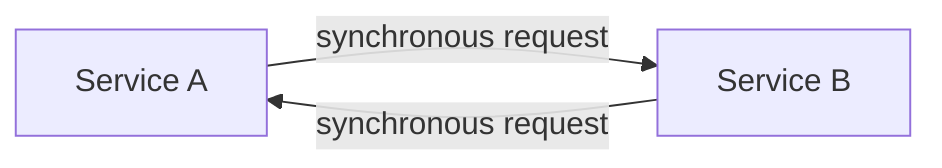
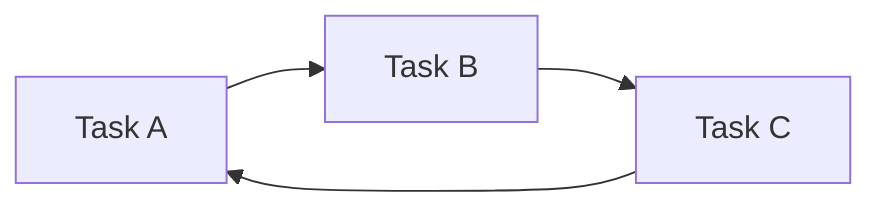
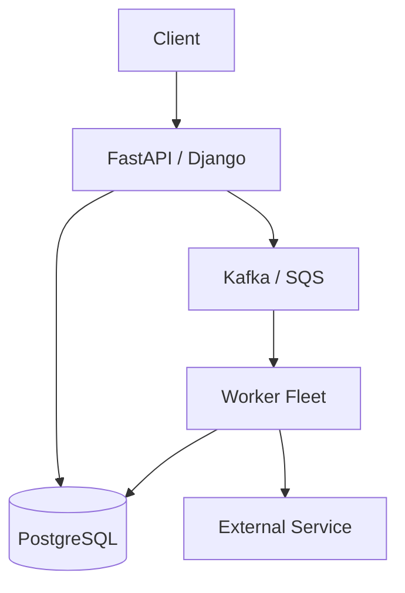

# 16- Deadlocks

## Overview

A deadlock occurs when concurrent execution contexts become permanently blocked because each is waiting for a resource or condition that another execution context holds or controls.

The classic pattern is:

```text
Task A holds Lock 1
       ↓
Task A waits for Lock 2

Task B holds Lock 2
       ↓
Task B waits for Lock 1
```

Neither task can make progress.

Deadlocks can occur in:

- `threading`;
- `asyncio`;
- `multiprocessing`;
- database transactions;
- distributed locks;
- worker systems;
- microservices;
- resource pools.

Deadlocks are particularly dangerous because they can appear only under specific interleavings and may cause requests, workers, or entire subsystems to stop making progress without immediately crashing.

A senior-level concurrency design therefore considers not only correctness but also:

- lock ownership;
- acquisition ordering;
- wait time;
- timeout behavior;
- cancellation;
- failure recovery;
- resource capacity;
- deployment topology;
- observability.

---

## What Is a Deadlock?

A deadlock is a state in which a set of concurrent participants cannot proceed because each participant is waiting for another participant to release a required resource or satisfy a required condition.

Example:

```text
Thread A                    Thread B
   │                           │
   ├── acquire Lock A          │
   │                           ├── acquire Lock B
   │                           │
   ├── wait for Lock B ────────┤
   │                           │
   └──────────── blocked ──────┘
                               │
                       waits for Lock A
```

The system has no natural progress path.

---

## The Four Deadlock Conditions

Classical deadlock analysis identifies four conditions that can exist simultaneously:

| Condition | Meaning |
|---|---|
| Mutual exclusion | A resource can be held by only one participant |
| Hold and wait | A participant holds one resource while waiting for another |
| No preemption | Resources cannot simply be forcibly taken away |
| Circular wait | Participants form a cycle of dependencies |

Deadlock prevention generally means breaking at least one of these conditions.

---

## Mutual Exclusion

A lock intentionally provides mutual exclusion.

```text
Lock
 ↓
Only one owner
```

This is necessary for many correctness problems, but it creates the possibility of deadlock when multiple resources must be acquired.

A single lock can still cause a system to stall if the lock holder waits forever for another dependency.

---

## Hold and Wait

Consider:

```python
with lock_a:
    perform_work_requiring(lock_b)
```

If `lock_b` cannot be acquired while `lock_a` remains held, the thread is in a hold-and-wait state.

With multiple resources:

```text
A holds resource 1
A waits for resource 2
```

Reducing nested resource acquisition can significantly simplify concurrency.

---

## No Preemption

Python synchronization primitives generally do not forcibly take a lock away from an owner.

If a thread owns:

```python
threading.Lock()
```

another thread cannot safely steal that lock because it wants to make progress.

The owner must eventually release it.

This makes failure handling and `finally` blocks important.

---

## Circular Wait

The most recognizable deadlock pattern is circular dependency:

```text
A → waits for B
B → waits for A
```

With more participants:

```text
A → B
B → C
C → D
D → A
```

The cycle prevents progress.

---

## Simple Thread Deadlock

```python
import threading


lock_a = threading.Lock()
lock_b = threading.Lock()


def worker_a() -> None:
    with lock_a:
        with lock_b:
            print("worker A")


def worker_b() -> None:
    with lock_b:
        with lock_a:
            print("worker B")
```

If the threads execute concurrently:

```text
worker A → Lock A → waits for B
worker B → Lock B → waits for A
```

the program can deadlock.

---

## Why Lock Ordering Prevents Deadlocks

Define a global ordering:

```text
Lock A < Lock B
```

Every execution path must acquire:

```text
Lock A
    ↓
Lock B
```

Never:

```text
Lock B
    ↓
Lock A
```

Then a circular wait cannot form through those two locks.

Example:

```python
def worker_a() -> None:
    with lock_a:
        with lock_b:
            process()


def worker_b() -> None:
    with lock_a:
        with lock_b:
            process()
```

Both functions follow the same acquisition order.

---

## Global Lock Ordering

For larger systems, explicitly define lock hierarchy.

```text
Account Lock
     ↓
Order Lock
     ↓
Payment Lock
```

Every code path must obey the hierarchy.

A lock-ordering rule should be treated as an architectural invariant rather than an informal convention.

Useful documentation might state:

```text
Lock hierarchy:
1. tenant_lock
2. account_lock
3. transaction_lock
```

This makes reviews and debugging easier.

---

## Asyncio Deadlocks

Asyncio tasks can also deadlock.

Consider:

```python
import asyncio


lock_a = asyncio.Lock()
lock_b = asyncio.Lock()


async def task_a() -> None:
    async with lock_a:
        await asyncio.sleep(0)
        async with lock_b:
            pass


async def task_b() -> None:
    async with lock_b:
        await asyncio.sleep(0)
        async with lock_a:
            pass
```

The tasks can reach:

```text
Task A → holds A → waits for B
Task B → holds B → waits for A
```

The event loop remains active, but the tasks involved cannot progress.

---

## Asyncio Deadlock Is Not CPU Deadlock

With threads, a deadlock can leave threads blocked.

With asyncio, the event loop itself may continue running other tasks.

For example:

```text
Event loop
 ├── Task A → blocked on Lock B
 ├── Task B → blocked on Lock A
 └── Task C → still running
```

This can make async deadlocks harder to notice.

The service may appear partially healthy while specific requests remain stuck.

---

## Blocking the Event Loop

A separate but related failure is blocking the event-loop thread:

```python
async def handler() -> None:
    time.sleep(30)
```

This is not technically a lock deadlock, but it can produce similar symptoms:

```text
Event loop blocked
    ↓
Other tasks cannot execute
    ↓
Requests stop progressing
```

This is event-loop starvation.

Do not classify every application stall as a deadlock.

---

## Deadlock vs Starvation

| Problem | Description |
|---|---|
| Deadlock | Participants wait in a cycle and cannot progress |
| Starvation | A participant repeatedly fails to obtain resources |
| Livelock | Participants continue changing state but make no useful progress |
| Event-loop starvation | Blocking/CPU-heavy work prevents async tasks from running |

The symptoms can overlap, but the root causes differ.

---

## Livelock

In a livelock, tasks are active but no useful progress occurs.

For example:

```text
Worker A detects conflict → backs off
Worker B detects conflict → backs off

Worker A retries → conflict
Worker B retries → conflict

Repeat forever
```

Unlike a deadlock, the participants are not necessarily blocked.

They are doing work without achieving progress.

Poor retry algorithms can create livelocks.

---

## Starvation

A resource may remain available, but one participant repeatedly fails to acquire it.

Example:

```text
Worker A → repeatedly acquires lock
Worker B → repeatedly waits
```

Starvation is often caused by:

- unfair scheduling;
- excessive contention;
- priority workloads;
- long critical sections;
- aggressive retry loops.

Deadlock prevention does not automatically solve starvation.

---

## Deadlocks with Semaphores

Semaphores can participate in deadlocks when tasks acquire multiple resources.

Suppose:

```text
Semaphore A capacity = 1
Semaphore B capacity = 1
```

Task A:

```text
acquire A
wait for B
```

Task B:

```text
acquire B
wait for A
```

The same circular dependency exists even though the resources are semaphores rather than locks.

---

## Deadlocks with Connection Pools

A common production deadlock pattern involves resource pools.

Consider:

```text
Worker A
  holds DB connection
  waits for HTTP connection

Worker B
  holds HTTP connection
  waits for DB connection
```

If both pools are exhausted, neither can proceed.

The resources involved do not have to be explicit locks.

Connection pools, worker slots, semaphores, and other capacity-limited resources can create circular waits.

---

## Database Deadlocks

PostgreSQL and other databases can experience transaction deadlocks.

Example:

```text
Transaction A:
  lock row 1
  wait for row 2

Transaction B:
  lock row 2
  wait for row 1
```

Conceptually:

```text
T1 → Row 1 → Row 2
T2 → Row 2 → Row 1
```

The database can detect the cycle and abort one transaction.

This is preferable to allowing the database to remain indefinitely deadlocked.

---

## PostgreSQL Example

Transaction A:

```sql
BEGIN;

SELECT *
FROM accounts
WHERE id = 1
FOR UPDATE;

SELECT *
FROM accounts
WHERE id = 2
FOR UPDATE;
```

Transaction B:

```sql
BEGIN;

SELECT *
FROM accounts
WHERE id = 2
FOR UPDATE;

SELECT *
FROM accounts
WHERE id = 1
FOR UPDATE;
```

If both transactions acquire their first lock before requesting the second, a deadlock can occur.

---

## Preventing Database Deadlocks

Acquire database locks in a consistent order.

For example:

```text
Always lock accounts by ascending ID
```

Then:

```sql
SELECT *
FROM accounts
WHERE id IN (1, 2)
ORDER BY id
FOR UPDATE;
```

Both transactions follow:

```text
1 → 2
```

rather than allowing:

```text
1 → 2
2 → 1
```

This dramatically reduces deadlock risk.

---

## Database Deadlock Detection

Database systems can detect deadlock cycles.

PostgreSQL may abort one transaction with a deadlock error.

Application code should treat such failures as potentially retryable when the operation is safe to retry.

Conceptually:

```text
Transaction
    ↓
Deadlock detected
    ↓
One transaction aborted
    ↓
Application receives error
    ↓
Retry transaction
```

Retry logic must be bounded and idempotent.

---

## Deadlock Retry

A transaction retry should retry the **transaction**, not arbitrary individual statements.

Conceptually:

```python
for attempt in range(max_attempts):
    try:
        return await execute_transaction()
    except DeadlockDetected:
        if attempt == max_attempts - 1:
            raise

        await asyncio.sleep(backoff(attempt))
```

The exact database exception depends on the PostgreSQL driver or framework being used.

Use exponential backoff and jitter when retries can overlap.

---

## Deadlocks and Transactions

Long transactions increase deadlock risk because locks remain held longer.

Avoid:

```text
BEGIN
 ↓
HTTP API call
 ↓
large computation
 ↓
multiple queries
 ↓
COMMIT
```

Prefer:

```text
Prepare data
 ↓
BEGIN
 ↓
Short database operations
 ↓
COMMIT
 ↓
External side effects
```

External side effects require additional consistency design, especially when they cannot participate in the database transaction.

---

## Never Hold a Database Lock During Remote I/O Without a Strong Reason

This pattern is dangerous:

```text
BEGIN
 ↓
SELECT ... FOR UPDATE
 ↓
Call payment provider
 ↓
Wait for network
 ↓
Update database
 ↓
COMMIT
```

The database row remains locked while the remote service responds.

If the provider takes 10 seconds, the lock may remain held for 10 seconds.

Prefer transaction boundaries that minimize lock duration while preserving correctness.

For workflows that require atomic coordination between a database and external service, consider patterns such as:

- transactional outbox;
- state machines;
- idempotency keys;
- asynchronous workers;
- compensating actions.

---

## Deadlocks in Distributed Systems

Distributed systems can deadlock without using Python locks.

Example:

```text
Service A
  waits for Service B

Service B
  waits for Service A
```

If both services synchronously depend on each other, the system can form a distributed circular wait.



This architecture is fragile because each service's availability becomes dependent on the other.

---

## Distributed Circular Dependencies

A larger cycle might look like:

```text
API
 ↓
Order Service
 ↓
Payment Service
 ↓
Inventory Service
 ↓
Order Service
```

If every dependency waits synchronously for completion, a failure can propagate around the cycle.

Avoid circular service dependencies where possible.

Use:

- asynchronous messaging;
- event-driven workflows;
- explicit workflow orchestration;
- timeouts;
- circuit breakers;
- compensation.

---

## Timeouts Are a Safety Mechanism

Timeouts do not prevent every deadlock, but they can convert indefinite waiting into recoverable failure.

For example:

```python
import asyncio


async def acquire_with_timeout(
    lock: asyncio.Lock,
) -> None:
    try:
        async with asyncio.timeout(2):
            await lock.acquire()
    except TimeoutError:
        raise RuntimeError("lock acquisition timed out")
```

If you manually acquire a lock this way, ensure that successful acquisition is always followed by a release.

A context manager is usually safer when the whole critical section belongs under the timeout.

---

## Lock Acquisition Timeout

A useful production pattern is to bound lock waiting:

```text
Request
   ↓
Try lock
   ↓
Within timeout?
 ┌─┴──────────┐
Yes           No
 ↓             ↓
Work       Fail/retry
```

This protects the system from requests waiting forever.

The timeout should reflect the business operation's latency budget.

---

## Timeout Does Not Kill Arbitrary Work

A timeout around an awaitable does not necessarily terminate arbitrary underlying work.

For example:

```python
await asyncio.wait_for(
    some_operation(),
    timeout=2,
)
```

cancels the asyncio operation according to asyncio cancellation semantics.

But a timeout does not magically terminate arbitrary work already executing in another thread, process, or external service.

Resource ownership must still be handled correctly.

---

## Cancellation and Locks

Async tasks can be cancelled while waiting for a lock or while executing a critical section.

Prefer:

```python
async with lock:
    await perform_operation()
```

because the context manager ensures the lock is released when the context exits.

For manual acquisition:

```python
await lock.acquire()

try:
    await perform_operation()
finally:
    lock.release()
```

The `finally` block is essential.

---

## Cancellation During Lock Acquisition

Consider:

```python
await lock.acquire()
```

If the task is cancelled while waiting, it should not release a lock it never acquired.

Using:

```python
async with lock:
    ...
```

is generally the safest pattern.

Do not write cleanup logic that assumes acquisition always succeeded.

---

## Exception Safety

A deadlock can result from a lock that is never released after an exception.

Unsafe:

```python
lock.acquire()

process()

lock.release()
```

If `process()` raises:

```text
acquire
 ↓
exception
 ↓
release never executes
 ↓
future callers wait forever
```

Use:

```python
with lock:
    process()
```

or:

```python
async with lock:
    await process()
```

---

## Nested Locks

Nested locks are one of the strongest warning signs during code review.

Example:

```python
async with lock_a:
    async with lock_b:
        ...
```

Nested locks are not automatically wrong, but they increase the number of possible lock-order relationships.

If nested locking is unavoidable:

- define lock ordering;
- keep scopes small;
- document ownership;
- test concurrent paths.

---

## Avoid Hidden Lock Acquisition

Deadlocks can be introduced indirectly.

Example:

```python
async with account_lock:
    await service.update_account()
```

If `update_account()` internally acquires:

```text
transaction_lock
```

and another code path acquires:

```text
transaction_lock
    ↓
account_lock
```

a circular dependency exists even though neither caller explicitly sees both locks.

Make synchronization dependencies visible during design and code review.

---

## Lock Hierarchies

For complex systems, define a lock hierarchy:

```text
Global resource
      ↓
Tenant resource
      ↓
Account resource
      ↓
Order resource
```

Code should never acquire a lower-level lock and then attempt to acquire a higher-level lock.

This is especially important in large codebases where different teams own different components.

---

## Avoid Calling Unknown Code While Holding Locks

This is risky:

```python
async with lock:
    await third_party_plugin.execute()
```

The called code may:

- acquire another lock;
- make a blocking call;
- perform database operations;
- call back into your application;
- wait for a resource already held elsewhere.

Prefer keeping critical sections around well-understood state transitions.

---

## Deadlock Detection

Deadlock detection involves identifying cycles in resource dependencies.

Conceptually:

```text
Task A
  waits for Lock B

Lock B
  owned by Task B

Task B
  waits for Lock A

Lock A
  owned by Task A
```

This forms:

```text
A → B → A
```

A cycle indicates a potential deadlock.

Database engines commonly implement wait-for graph analysis.

Application-level systems may require explicit instrumentation.

---

## Wait-For Graph

A wait-for graph represents:

```text
A waits for B
B waits for C
C waits for A
```

as:



The cycle is the key signal.

This model is useful for reasoning about:

- locks;
- database transactions;
- resource pools;
- distributed dependencies.

---

## Observability

Deadlocks should be observable as operational events.

Track:

- lock acquisition latency;
- lock hold duration;
- timeout count;
- transaction deadlocks;
- retry count;
- transaction duration;
- blocked query duration;
- queue wait time;
- connection-pool wait time;
- semaphore wait time.

For distributed workflows, include:

```text
request_id
trace_id
operation_id
entity_id
transaction_id
worker_id
attempt
```

This allows operators to reconstruct dependency chains.

---

## Logging

Avoid logging every lock operation in normal production traffic.

Instead, log abnormal conditions:

```text
lock acquisition timeout
transaction deadlock
retry after deadlock
unexpected lock ownership state
excessive lock hold duration
```

Useful structured fields include:

```json
{
  "event": "lock_timeout",
  "resource": "account:42",
  "wait_ms": 2000,
  "request_id": "..."
}
```

---

## PostgreSQL Monitoring

When diagnosing database deadlocks, inspect:

- blocked sessions;
- lock types;
- transaction duration;
- query duration;
- waiting transactions;
- deadlock errors;
- long-running transactions.

PostgreSQL exposes lock information through system views such as:

```sql
SELECT *
FROM pg_stat_activity;
```

and:

```sql
SELECT *
FROM pg_locks;
```

These can be combined to investigate blocking relationships.

---

## Production Architecture

A robust architecture minimizes circular dependencies:



Instead of:

```text
API
 ↓
Service A
 ↓
Service B
 ↓
API
```

durable queues and explicit workflows can reduce synchronous dependency cycles.

---

## Deadlocks and Kafka

Kafka consumers typically do not use distributed locks for ordinary message processing.

Instead, partition ownership and consumer groups coordinate processing.

However, application-level deadlocks can still occur if consumers:

- hold database locks while waiting for external systems;
- synchronously depend on another consumer;
- exhaust worker pools;
- wait for resources owned by another workflow.

Message-driven architecture reduces some circular dependencies but does not automatically eliminate all concurrency problems.

---

## Deadlocks and Celery

Celery workers can encounter resource deadlocks when tasks:

- acquire distributed resources in inconsistent order;
- wait synchronously for other tasks;
- exhaust worker concurrency;
- hold database locks while performing slow operations;
- recursively submit dependent work.

Avoid designs where a worker occupies a scarce slot while synchronously waiting for another task that requires the same pool.

---

## Worker Pool Deadlock

A particularly dangerous pattern:

```text
Worker pool size = 4

Task A occupies worker 1 → waits for task E
Task B occupies worker 2 → waits for task F
Task C occupies worker 3 → waits for task G
Task D occupies worker 4 → waits for task H

E, F, G, H require the same worker pool
```

No worker remains available to execute the dependencies.

This is a resource-exhaustion deadlock.

The system has no explicit lock, but the worker pool itself is the constrained resource.

---

## Avoid Synchronous Waiting on the Same Pool

Prefer:

```text
Task
 ↓
enqueue follow-up work
 ↓
return worker
 ↓
follow-up work executes independently
```

over:

```text
Task
 ↓
enqueue child task
 ↓
wait synchronously
 ↓
child requires same exhausted pool
```

For Celery workflows, use appropriate primitives such as chains, groups, chords, or external workflow coordination instead of blocking workers unnecessarily.

---

## Connection Pool Deadlocks

Consider:

```text
Pool size = 10
Worker count = 10

Each worker:
    holds one connection
    waits for another connection
```

All ten connections are occupied.

No worker can acquire the second connection.

This is effectively:

```text
10 workers
   ↓
10 connections held
   ↓
10 additional connections required
   ↓
progress impossible
```

Design database access patterns to avoid nested acquisition where possible.

---

## Deadlocks and HTTP Calls

Holding a resource while making an HTTP call is risky:

```text
Acquire resource
      ↓
HTTP request
      ↓
Remote service
      ↓
Remote service waits for your resource
```

This can form a distributed cycle.

Prefer architectures where external calls do not require unnecessarily long ownership of scarce local resources.

---

## Circuit Breakers

Circuit breakers can prevent repeated calls to an unhealthy dependency.

They do not directly prevent deadlocks, but they can reduce cascading waits:

```text
Dependency unhealthy
       ↓
Circuit opens
       ↓
Requests fail fast
       ↓
Resources are released
```

This is particularly useful when a service would otherwise hold worker slots, connections, or locks while waiting for a failing dependency.

---

## Bulkheads

Bulkheads isolate resource pools.

For example:

```text
Critical API
    ↓
Pool A

Reporting API
    ↓
Pool B
```

If reporting becomes overloaded, it does not consume all worker capacity needed by critical requests.

Bulkheads reduce the blast radius of resource exhaustion and can prevent one workload from contributing to system-wide deadlock-like behavior.

---

## Security Considerations

Attackers can intentionally create resource contention.

Potential attacks include:

- holding expensive operations open;
- exhausting connection pools;
- creating long-running requests;
- triggering lock contention;
- flooding queues;
- exhausting worker pools.

Defenses include:

- authentication;
- authorization;
- request timeouts;
- connection limits;
- concurrency limits;
- queue limits;
- rate limiting;
- payload-size limits;
- per-tenant quotas;
- circuit breakers.

Security controls should protect not only data but also resource availability.

---

## Reliability Considerations

A production system should assume:

- processes can crash while holding resources;
- network calls can hang;
- transactions can deadlock;
- messages can be duplicated;
- workers can disappear;
- pods can be terminated.

Design synchronization so failure produces bounded, recoverable behavior.

Useful mechanisms include:

- context managers;
- timeouts;
- transaction rollback;
- retries;
- idempotency;
- durable queues;
- health checks;
- graceful shutdown.

---

## High Availability

High availability does not mean eliminating every lock.

It means ensuring synchronization failures do not permanently prevent the system from recovering.

For example:

```text
Worker crashes
    ↓
Transaction rolls back
    ↓
Lock released
    ↓
Another worker retries
```

Durable systems should make resource ownership recoverable.

Process-local locks disappear when their process exits.

Distributed leases require explicit expiration and recovery semantics.

---

## Disaster Recovery

Recovery procedures should account for:

- in-flight transactions;
- unfinished jobs;
- expired leases;
- duplicate messages;
- partially completed workflows;
- stale locks;
- replayed events.

Do not assume that restoring infrastructure automatically restores synchronization state correctly.

The recovery design should define:

```text
What was committed?
What was acknowledged?
What can be retried?
What must be reconciled?
```

---

## Performance

Deadlock prevention often improves performance because it reduces unnecessary waiting.

However, excessive serialization can also hurt throughput.

For example:

```text
Global lock
   ↓
All requests serialize
   ↓
Low throughput
```

Prefer:

- fine-grained ownership;
- short critical sections;
- partitioning;
- atomic operations;
- lock-free designs where appropriate;
- asynchronous workflows.

Do not replace a deadlock with a system that technically progresses but cannot meet its latency or throughput requirements.

---

## Testing Deadlocks

Concurrency tests should deliberately exercise conflicting resource acquisition.

A useful test strategy is:

```text
Create workers
     ↓
Force known interleaving
     ↓
Acquire resources in conflicting paths
     ↓
Verify timeout / prevention
```

Avoid relying solely on random timing.

Use:

- barriers;
- events;
- controlled futures;
- test hooks;
- deterministic scheduling where available.

---

## Testing Lock Ordering

For code that uses multiple locks, create tests that execute competing operations concurrently.

Verify that:

- both operations complete;
- no lock remains held;
- timeout thresholds are not exceeded;
- cancellation is safe.

The key assertion should be:

```text
Concurrent operations eventually make progress.
```

---

## Testing Database Deadlocks

Database integration tests can intentionally create conflicting transactions.

For example:

```text
Transaction A:
    lock row 1
    wait
    lock row 2

Transaction B:
    lock row 2
    wait
    lock row 1
```

The test can verify that the application:

- detects the database deadlock;
- rolls back correctly;
- retries safely where appropriate;
- does not duplicate business effects.

---

## Debugging a Deadlock

A practical investigation sequence is:

1. Identify which operation is not making progress.
2. Determine whether it is blocked on a lock, queue, connection, semaphore, transaction, or external dependency.
3. Identify the current owner of the resource.
4. Identify what that owner is waiting for.
5. Continue following dependencies until the cycle is found.
6. Determine whether the cycle is local or distributed.
7. Fix acquisition ordering, resource ownership, or architecture.
8. Add instrumentation to detect recurrence.

The goal is to construct a dependency graph, not simply restart the application.

---

## Deadlock Debugging Model

```text
Stalled Request
      ↓
Waiting for Resource A
      ↓
Resource A owned by Worker B
      ↓
Worker B waiting for Resource B
      ↓
Resource B owned by Worker C
      ↓
Worker C waiting for Resource A
      ↓
Circular dependency
```

Once the cycle is visible, the appropriate mitigation becomes easier to identify.

---

## Common Mistakes

### Acquiring Locks in Different Orders

```text
Path A: A → B
Path B: B → A
```

This is the classic deadlock pattern.

### Holding Locks During I/O

Remote calls can take unpredictable amounts of time.

### Forgetting `finally`

An exception can leave resources permanently held.

### Using Many Nested Locks

Each additional lock increases dependency complexity.

### Blocking Inside Async Code

A blocking call can stall the entire event loop.

### Assuming Timeouts Solve Everything

Timeouts limit waiting but do not automatically make underlying operations safe.

### Waiting for Child Work from an Exhausted Worker Pool

The child may require a worker that is never available.

### Ignoring Database Deadlocks

Database engines may abort transactions under contention. Applications should handle retryable deadlock failures correctly.

---

## Production Pitfalls

### Lock Convoys

A large group of tasks may repeatedly queue behind one lock.

### Long Transactions

Long-held database locks increase both contention and deadlock probability.

### Hidden Dependencies

Helper functions can acquire locks or resources that are not obvious at the call site.

### Inconsistent Resource Ordering

Teams can independently introduce conflicting acquisition orders.

### Distributed Circular Calls

Microservices can create synchronous dependency cycles.

### Retry Amplification

A deadlocked operation that is retried aggressively can increase contention.

Use bounded exponential backoff with jitter.

### Resource Pool Exhaustion

Worker pools, database pools, HTTP pools, and semaphores can participate in circular waits.

### Poor Shutdown Behavior

A service terminating while holding resources can leave dependent workflows waiting until leases or connections expire.

---

## Best Practices

- Prefer one synchronization primitive over multiple nested primitives where possible.
- Establish a global lock ordering when multiple locks are required.
- Keep critical sections small.
- Avoid slow I/O while holding locks.
- Use `with` and `async with` for exception-safe resource release.
- Use timeouts to prevent indefinite waiting.
- Treat cancellation as a normal lifecycle event.
- Avoid synchronous waiting on work that requires the same exhausted worker pool.
- Use database transactions and constraints for persistent state.
- Acquire database resources in deterministic order.
- Keep transactions short.
- Retry deadlock-aborted transactions only when the operation is safe and idempotent.
- Use exponential backoff and jitter for retries.
- Avoid synchronous circular dependencies between microservices.
- Use asynchronous messaging for workflows that do not require immediate synchronous completion.
- Apply circuit breakers and bulkheads around unreliable dependencies.
- Monitor lock waits, transaction deadlocks, pool saturation, and queue delays.
- Test concurrency with controlled interleavings.
- Document resource ownership and acquisition order.
- Prefer designs that minimize shared mutable state.

---

## Production Decision Framework

When a system appears stuck, distinguish the failure mode first:

| Symptom | Likely problem |
|---|---|
| Two tasks wait on each other | Deadlock |
| One task repeatedly loses access | Starvation |
| Tasks continuously retry without progress | Livelock |
| Entire event loop stops | Blocking/event-loop starvation |
| Database reports deadlock | Transaction deadlock |
| Workers all wait for unavailable workers | Worker-pool deadlock |
| Requests wait for exhausted connections | Pool/resource contention |

Then determine:

```text
What resource is constrained?
        ↓
Who owns it?
        ↓
What does the owner wait for?
        ↓
Does the dependency form a cycle?
        ↓
Can ordering or ownership eliminate the cycle?
```

---

## Production Checklist

- [ ] Multiple-lock acquisition order is explicitly defined.
- [ ] All code paths follow the same lock hierarchy.
- [ ] Critical sections are intentionally small.
- [ ] Slow external I/O is not unnecessarily performed while holding locks.
- [ ] Lock acquisition and release use exception-safe context managers.
- [ ] Manual resource management uses `finally`.
- [ ] Async code does not use blocking synchronization on the event-loop thread.
- [ ] Lock and semaphore waits have appropriate time budgets where required.
- [ ] Cancellation cannot leave resources permanently held.
- [ ] Worker pools cannot synchronously wait on tasks requiring the same exhausted pool.
- [ ] Database locks are acquired consistently.
- [ ] Transactions are kept as short as practical.
- [ ] Database deadlocks are observable.
- [ ] Retryable deadlock failures are retried only when safe.
- [ ] Retries use bounded attempts and backoff.
- [ ] Connection pools are included in deadlock/resource analysis.
- [ ] HTTP calls cannot create unnecessary circular dependencies.
- [ ] Distributed service dependencies are reviewed for cycles.
- [ ] Circuit breakers protect unhealthy downstream services.
- [ ] Bulkheads isolate critical workloads from noisy neighbors.
- [ ] Lock wait time and hold time are measurable where necessary.
- [ ] Database lock and blocked-query information can be inspected.
- [ ] Concurrency tests exercise conflicting resource acquisition.
- [ ] Shutdown behavior releases or expires resources safely.
- [ ] Durable workflows tolerate worker crashes and retries.
- [ ] Security controls prevent intentional resource exhaustion.
- [ ] Deadlock recovery behavior is documented and tested.

## Key Takeaways

- **Deadlocks are circular resource dependencies:** they occur when concurrent participants hold resources while waiting for resources held by others.
- **Consistent resource ordering is the primary prevention technique:** define a lock or resource hierarchy and ensure every execution path follows it.
- **Deadlocks are not limited to Python locks:** databases, connection pools, worker pools, semaphores, distributed services, and synchronous task dependencies can all participate in circular waits.
- **Timeouts, cancellation, and retries provide recovery mechanisms:** they bound waiting and allow systems to recover, but they do not replace correct ownership and synchronization design.
- **Senior concurrency design minimizes shared state and circular dependencies:** prefer atomic database operations, clear ownership, short transactions, bounded resources, asynchronous workflows, and observable failure behavior.