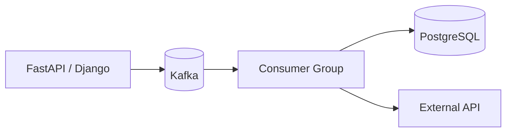
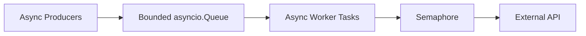
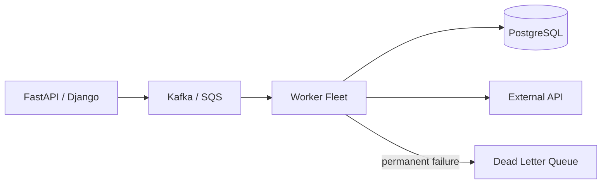

# 17- Producer Consumer

## Overview

The Producer-Consumer pattern separates the creation of work from its processing.

A producer generates work items and places them into a queue. Consumers retrieve those items and process them independently.

```text
Producers
    │
    ▼
┌───────────────┐
│     Queue     │
└───────┬───────┘
        │
        ▼
Consumers / Workers
```

The pattern is useful because production and consumption often operate at different rates.

For example:

```text
API requests       → 2,000/sec
Worker capacity    →   500/sec
```

A queue can temporarily absorb the difference:

```text
Requests
   ↓
Queue
   ↓
Workers
   ↓
Database / API
```

For production systems, the important concerns are not merely how to implement a queue. They are:

- how much work can be buffered;
- how backpressure is applied;
- how many consumers should run;
- what happens when consumers fail;
- whether work is durable;
- whether processing can be duplicated;
- how shutdown works;
- how queue latency is monitored;
- how capacity scales across replicas.

---

## Producer-Consumer Model

The pattern has three primary components:

| Component | Responsibility |
|---|---|
| Producer | Creates or receives work |
| Queue | Buffers and coordinates work |
| Consumer | Processes work |

The basic lifecycle is:

```text
Produce
   ↓
Enqueue
   ↓
Wait
   ↓
Dequeue
   ↓
Process
   ↓
Acknowledge completion
```

The queue decouples producers from consumers.

A producer does not need to know which consumer processes a specific item.

---

## Why Producer-Consumer Exists

Without a queue, a producer may need to execute the entire operation synchronously:

```text
HTTP Request
    ↓
Validate
    ↓
Call external API
    ↓
Generate report
    ↓
Write database
    ↓
Return response
```

This increases request latency and couples the API to every downstream dependency.

With producer-consumer:

```text
HTTP Request
    ↓
Validate
    ↓
Enqueue Job
    ↓
Return response
```

Then:

```text
Queue
  ↓
Worker
  ↓
External API
  ↓
Database
```

This provides temporal decoupling.

---

## Temporal Decoupling

Producer-consumer allows the producer and consumer to operate at different times and rates.

```text
Producer rate
     ↓
  1,000/sec

Queue
     ↓
buffers burst

Consumer rate
     ↓
   500/sec
```

The queue absorbs temporary bursts.

However, a queue does not solve a permanent capacity mismatch.

If:

```text
Arrival rate = 1,000/sec
Processing rate = 500/sec
```

the backlog grows continuously.

Eventually:

- latency increases;
- queue capacity is exhausted;
- producers experience backpressure;
- work may be rejected or delayed.

---

## Basic Asyncio Implementation

For process-local asynchronous workloads, use `asyncio.Queue`.

```python
import asyncio


async def producer(
    queue: asyncio.Queue[int],
) -> None:
    for item in range(100):
        await queue.put(item)


async def consumer(
    queue: asyncio.Queue[int],
) -> None:
    while True:
        item = await queue.get()

        try:
            await process(item)
        finally:
            queue.task_done()


async def process(item: int) -> None:
    await asyncio.sleep(0.01)
```

A production implementation should additionally define:

- worker lifecycle;
- cancellation;
- shutdown;
- error handling;
- retries;
- observability;
- queue capacity.

---

## Bounded Queues

A queue should often be bounded:

```python
queue = asyncio.Queue(maxsize=1000)
```

This prevents unlimited memory growth.

When the queue is full:

```python
await queue.put(item)
```

waits until capacity becomes available.

This creates backpressure.

---

## Why Unbounded Queues Are Dangerous

Suppose:

```text
Producer = 10,000 items/sec
Consumer = 1,000 items/sec
```

An unbounded queue can grow indefinitely.

```text
Queue depth
   │
   │       /
   │      /
   │     /
   │    /
   │___/____________
        time
```

The system may eventually fail because queued objects consume memory.

A bounded queue converts unlimited memory growth into controlled producer waiting or rejection.

---

## Backpressure

Backpressure is the mechanism by which downstream capacity limits upstream production.

```text
Downstream slows
      ↓
Consumers slow
      ↓
Queue grows
      ↓
Queue reaches capacity
      ↓
Producer waits/rejects
```

Backpressure is one of the most important properties of a production producer-consumer system.

Without it, overload propagates through memory rather than through explicit flow control.

---

## Backpressure Strategies

When the queue is full, possible policies include:

| Strategy | Behavior | Suitable for |
|---|---|---|
| Block | Producer waits | Work that should be retained locally |
| Reject | Producer receives failure | Strict latency/capacity limits |
| Drop newest | New work discarded | Best-effort telemetry |
| Drop oldest | Old work discarded | Fresh-state workloads |
| Persist externally | Durable buffering | Important background work |
| Rate limit | Reduce producer throughput | External API quotas |

The correct strategy depends on business semantics.

Never silently drop business-critical work.

---

## Queue Capacity

Queue size should be based on:

- expected burst size;
- processing rate;
- acceptable queue latency;
- memory per item;
- downstream capacity;
- failure recovery requirements.

A useful approximation is:

```text
Queue memory
≈
Queue depth × memory per queued item
```

For example:

```text
5,000 items
×
100 KB/item
≈
500 MB
```

The actual Python process overhead may be higher.

---

## Queue Latency

Queue depth alone is not enough.

Consider:

```text
Queue depth = 1,000
```

This could be healthy if consumers process:

```text
10,000/sec
```

but dangerous if they process:

```text
10/sec
```

Monitor:

```text
oldest message age
```

and:

```text
time from enqueue → processing start
```

These metrics directly represent queueing delay.

---

## Multiple Consumers

A queue can distribute work among multiple consumers:

```text
                 Queue
                   │
       ┌───────────┼───────────┐
       ▼           ▼           ▼
   Consumer A  Consumer B  Consumer C
```

Increasing consumers can increase throughput.

But only until another bottleneck is reached:

```text
Workers
   ↓
DB connection pool
   ↓
PostgreSQL
```

Adding workers beyond database capacity can increase contention rather than throughput.

---

## Worker Count

Worker count should be derived from capacity rather than chosen arbitrarily.

Consider:

```text
CPU
Memory
I/O latency
DB connections
HTTP connections
External API quotas
Queue depth
Replica count
```

For I/O-bound work, more concurrency may be useful.

For CPU-bound Python work under traditional GIL-enabled CPython, threads do not generally provide CPU parallelism; processes may be more appropriate.

---

## Worker Pool

A common asyncio architecture is a fixed worker pool:

```python
import asyncio


async def worker(
    queue: asyncio.Queue[dict],
) -> None:
    while True:
        item = await queue.get()

        try:
            await process(item)
        finally:
            queue.task_done()


async def run_workers(
    queue: asyncio.Queue[dict],
    worker_count: int,
) -> None:
    workers = [
        asyncio.create_task(worker(queue))
        for _ in range(worker_count)
    ]

    await queue.join()

    for task in workers:
        task.cancel()

    await asyncio.gather(
        *workers,
        return_exceptions=True,
    )
```

The worker count is an explicit concurrency budget.

---

## Worker Ownership

Every worker should have a clearly defined lifecycle.

A worker typically:

1. waits for work;
2. retrieves one item;
3. processes it;
4. records success or failure;
5. marks the item complete;
6. continues or exits during shutdown.

This lifecycle should be observable.

---

## `queue.task_done()`

For Python queues that support task tracking, every successful `get()` should eventually have exactly one:

```python
queue.task_done()
```

A safe pattern is:

```python
item = await queue.get()

try:
    await process(item)
finally:
    queue.task_done()
```

This ensures exceptions do not leave the queue's unfinished-task count inconsistent.

---

## `queue.join()`

After producers finish submitting work:

```python
await queue.join()
```

waits until every retrieved item has been marked complete.

The relationship is:

```text
put()
  ↓
unfinished task count +1

get()
  ↓
consumer processes item

task_done()
  ↓
unfinished task count -1

join()
  ↓
wait until count = 0
```

Calling `join()` does not automatically stop workers.

Worker lifecycle must be handled separately.

---

## Error Handling

A consumer should distinguish between:

- successful processing;
- retryable failure;
- permanent failure;
- cancellation;
- malformed work.

Example:

```python
async def worker(
    queue: asyncio.Queue[dict],
) -> None:
    while True:
        item = await queue.get()

        try:
            await process(item)
        except RetryableError:
            await schedule_retry(item)
        except PermanentError:
            await send_to_dead_letter(item)
        finally:
            queue.task_done()
```

The exact error policy should be explicit.

---

## Retry Semantics

Retries can create duplicate processing.

Consider:

```text
Consumer
   ↓
Process succeeds
   ↓
Process crashes before acknowledgement
   ↓
Message becomes available again
   ↓
Second consumer processes it
```

Therefore consumers should generally be designed for idempotency.

---

## Idempotent Consumers

An idempotent consumer can process the same logical work multiple times without producing an incorrect final state.

For example:

```text
Message ID = 123
       ↓
Check processing record
       ↓
Already completed?
   ┌───┴────┐
  Yes      No
   │         │
Ignore    Process
            ↓
        Record result
```

PostgreSQL unique constraints can help implement deduplication.

---

## Exactly-Once Processing

Do not assume producer-consumer systems automatically provide exactly-once business semantics.

There are several separate concepts:

```text
Message delivery
      ≠
Message processing
      ≠
Business side effect
```

A system may deliver a message once but still execute the business operation more than once due to retries or failures.

At-least-once delivery combined with idempotent processing is often a practical production strategy.

---

## Poison Messages

A poison message consistently fails processing.

Example:

```text
Message
  ↓
Consumer
  ↓
Validation error
  ↓
Retry
  ↓
Validation error
  ↓
Retry forever
```

This can consume worker capacity indefinitely.

Use:

- bounded retry attempts;
- exponential backoff;
- dead-letter queues;
- alerting;
- manual recovery procedures.

---

## Dead-Letter Queue

A dead-letter queue separates permanently failing work:

```text
Main Queue
    ↓
Consumer
    ↓
Failure
    ↓
Retry
    ↓
Retry limit reached
    ↓
Dead-Letter Queue
```

Operators can inspect the failed message and determine whether it should be:

- fixed and replayed;
- permanently discarded;
- manually reconciled.

---

## Queue Ordering

FIFO queues preserve insertion order at the queue level.

However, multiple consumers can complete work out of order:

```text
Queue:
A → B → C

Workers:
A → slow
B → fast
C → medium

Completion:
B → C → A
```

If strict ordering is required, concurrency must be constrained appropriately.

---

## Partitioned Ordering

A scalable alternative is partitioned ordering:

```text
Customer 1 → Partition A → Worker A
Customer 2 → Partition B → Worker B
Customer 3 → Partition A → Worker A
```

All events for one entity can be routed to the same partition.

Kafka commonly uses this model.

The system gets:

```text
Ordering per partition
```

rather than:

```text
Global ordering
```

This enables horizontal scaling while preserving ordering for specific keys.

---

## Producer-Consumer with Kafka

A distributed architecture may look like:



Kafka provides durable distributed buffering and consumer-group coordination.

The application still needs to handle:

- duplicate processing;
- partitioning;
- offsets;
- retries;
- dead-letter handling;
- schema evolution;
- consumer lag.

---

## Producer-Consumer with SQS

AWS applications commonly use SQS:

```text
API
 ↓
SQS
 ↓
Worker Fleet
 ↓
PostgreSQL
```

SQS provides durable distributed work buffering.

Consumers typically:

1. receive a message;
2. process it;
3. delete it after successful processing.

If processing fails and the message is not successfully deleted, it can become available again according to the queue's visibility behavior.

This makes idempotency important.

---

## Visibility Timeout

For queue systems such as SQS, visibility timeout prevents a received message from being immediately delivered to another consumer.

Conceptually:

```text
Message available
      ↓
Consumer receives
      ↓
Message temporarily hidden
      ↓
Processing
      ↓
Delete → success
```

If processing exceeds the visibility timeout without appropriate handling:

```text
Message becomes visible
      ↓
Another consumer may receive it
```

The processing duration and visibility timeout must therefore be designed together.

---

## Producer-Consumer with Celery

Celery provides a higher-level distributed task model:

```text
Django / FastAPI
      ↓
Celery Broker
      ↓
Celery Workers
      ↓
PostgreSQL / Redis / External APIs
```

Celery is appropriate when application work needs:

- background execution;
- retries;
- distributed workers;
- task routing;
- scheduled tasks;
- operational monitoring.

Important business operations should not rely on an in-process asyncio queue when they need durability.

---

## Local Queue vs Durable Queue

| Property | `asyncio.Queue` | Kafka | SQS | Celery |
|---|---|---|---|---|
| Process-local | Yes | No | No | No |
| Durable | No | Yes | Yes | Depends on broker |
| Replay | No | Yes | Limited by retention/visibility semantics | Broker-dependent |
| Horizontal consumers | Process-local | Yes | Yes | Yes |
| Consumer groups | No | Yes | Queue consumers | Worker model |
| Best use | Local coordination | Event streaming | Durable jobs | Background tasks |

The choice should follow durability and delivery requirements.

---

## Producer Responsibilities

A producer should:

- validate work before enqueueing when practical;
- attach correlation or idempotency identifiers;
- avoid unbounded production;
- handle queue-full behavior;
- avoid placing unnecessarily large payloads in messages;
- preserve enough metadata for observability;
- define failure behavior if enqueueing fails.

For durable queues, producer success should be tied to successful durable submission where the business contract requires it.

---

## Consumer Responsibilities

A consumer should:

- validate message structure;
- enforce authorization where relevant;
- process idempotently;
- apply timeouts;
- classify failures;
- retry only appropriate failures;
- record metrics;
- acknowledge only after successful processing;
- release resources during cancellation;
- shut down gracefully.

---

## Message Size

Large messages increase:

- memory usage;
- network cost;
- serialization cost;
- queue storage;
- processing latency.

Prefer:

```text
Queue message
{
    "job_id": 12345,
    "object_key": "reports/12345.json"
}
```

rather than placing a very large document directly in the message.

The worker can retrieve the payload from object storage such as Amazon S3.

---

## Producer-Consumer and Object Storage

A scalable AWS pattern is:

```text
Client
   ↓
API
   ↓
S3
   ↓
SQS
   ↓
Worker
   ↓
PostgreSQL
```

The queue contains metadata identifying the durable object.

This avoids transferring large payloads through every queue and worker layer.

---

## Backpressure Across Services

Backpressure must be considered across the entire architecture:

```text
Client
  ↓
Nginx / Load Balancer
  ↓
FastAPI
  ↓
Queue
  ↓
Workers
  ↓
Connection Pool
  ↓
PostgreSQL
```

A queue can protect workers from bursts, but it does not make an overloaded database infinitely scalable.

Every layer needs an appropriate capacity limit.

---

## Concurrency Limits

A consumer system may use both a worker count and a semaphore.

```python
import asyncio


dependency_limit = asyncio.Semaphore(20)


async def process(item: dict) -> None:
    async with dependency_limit:
        await call_external_service(item)
```

This allows many workers while limiting the number of concurrent calls to the dependency.

The worker pool and semaphore solve different problems.

---

## Queue and Database Connection Pool

Suppose:

```text
Workers = 100
DB pool = 20
```

Only a subset of workers can actively use database connections at once.

Increasing workers beyond what the database can support may produce:

- connection waits;
- higher latency;
- increased context switching;
- database contention.

Worker count should therefore be evaluated together with connection-pool capacity.

---

## Work Distribution

There are several ways to distribute work:

### Single Shared Queue

```text
Queue
 ├── Worker A
 ├── Worker B
 └── Worker C
```

Simple and effective for homogeneous work.

### Multiple Queues

```text
Critical Queue → Critical Workers
Normal Queue   → Normal Workers
Low Queue      → Low Workers
```

Useful when workloads have different priorities or resource requirements.

### Partitioned Queue

```text
Partition A → Worker Group A
Partition B → Worker Group B
```

Useful when ordering or tenant/entity affinity matters.

---

## Priority and Fairness

A single queue can allow one workload to dominate worker capacity.

Example:

```text
Tenant A → 100,000 jobs
Tenant B → 100 jobs
```

Possible solutions include:

- per-tenant queues;
- weighted scheduling;
- per-tenant concurrency limits;
- separate worker pools;
- priority queues.

Do not optimize solely for aggregate throughput if some workloads have strict latency requirements.

---

## Work Stealing

Some worker systems use work stealing to improve utilization.

Conceptually:

```text
Worker A queue → empty
Worker B queue → many jobs

Worker A
   ↓
steals work from B
```

This can improve load balancing for heterogeneous tasks.

However, work stealing introduces additional synchronization and ordering complexity.

---

## Graceful Shutdown

Producer-consumer systems need explicit shutdown behavior.

A typical lifecycle is:

```text
SIGTERM
   ↓
Stop accepting new work
   ↓
Stop producers
   ↓
Allow consumers to finish current work
   ↓
Drain local queue where appropriate
   ↓
Release resources
   ↓
Exit
```

For durable queues, uncompleted work should normally remain available for another consumer according to the broker's delivery semantics.

---

## Async Worker Cancellation

A worker should handle cancellation correctly:

```python
async def worker(
    queue: asyncio.Queue[dict],
) -> None:
    while True:
        item = await queue.get()

        try:
            await process(item)
        except asyncio.CancelledError:
            raise
        finally:
            queue.task_done()
```

If processing requires compensating cleanup, use explicit `finally` blocks.

Cancellation should not leave:

- locks held;
- semaphore permits consumed;
- database connections checked out;
- temporary files open.

---

## Failure During Processing

A worker can fail at any point:

```text
Receive
  ↓
Validate
  ↓
Database write
  ↓
External API
  ↓
Crash
```

The system must define what happens when the worker restarts.

This is why durable processing generally relies on:

- transactional state changes;
- idempotency;
- retries;
- acknowledgements;
- dead-letter handling.

---

## Transactional Boundaries

A consumer often updates a database and acknowledges a message.

The order matters.

Unsafe reasoning:

```text
Acknowledge message
      ↓
Database update
      ↓
Crash
```

The message may be gone while the database update never happened.

A safer general strategy is:

```text
Process
   ↓
Commit required durable state
   ↓
Acknowledge
```

But when the database and broker cannot participate in one transaction, there is still a failure window.

Design for duplicate processing rather than assuming perfect atomicity across systems.

---

## Transactional Outbox

When an application needs to atomically persist business state and publish an event, a transactional outbox can help:

```text
BEGIN
  ↓
Update business tables
  ↓
Insert outbox event
  ↓
COMMIT
  ↓
Outbox publisher
  ↓
Kafka / SQS
```

The database transaction makes the business update and event record atomic.

The publisher can retry publishing the outbox event safely.

This is often preferable to attempting a distributed transaction across PostgreSQL and a message broker.

---

## Consumer Idempotency with PostgreSQL

A common approach is a unique processing record:

```sql
CREATE TABLE processed_messages (
    message_id TEXT PRIMARY KEY,
    processed_at TIMESTAMPTZ NOT NULL DEFAULT now()
);
```

The consumer can use the unique constraint to detect duplicates.

The exact implementation must ensure the deduplication record and business update have appropriate transactional boundaries.

---

## Race Conditions in Consumers

Multiple consumers can race when processing related state.

Example:

```text
Consumer A → customer 42
Consumer B → customer 42
```

Possible mitigations include:

- partitioning by customer ID;
- database row locking;
- optimistic concurrency;
- atomic updates;
- serialized ownership.

Do not assume the queue itself eliminates application-level races.

---

## Security Considerations

Producer-consumer systems must protect both the queue and the messages.

Consider:

- producer authentication;
- consumer authorization;
- encryption in transit;
- encryption at rest;
- message integrity;
- sensitive-data exposure;
- message-size limits;
- tenant isolation;
- replay;
- poison-message attacks.

An attacker who can enqueue unlimited expensive jobs can effectively perform a resource-exhaustion attack.

Use:

- authentication;
- authorization;
- rate limits;
- quotas;
- bounded concurrency;
- payload limits.

---

## Observability

A production queue should be observable end-to-end.

Important metrics include:

| Metric | Purpose |
|---|---|
| Enqueue rate | Incoming workload |
| Dequeue rate | Processing capacity |
| Queue depth | Backlog |
| Oldest message age | Queue latency |
| Processing latency | Worker performance |
| Success rate | Reliability |
| Failure rate | Error detection |
| Retry rate | Dependency health |
| DLQ count | Permanent failures |
| Consumer count | Processing capacity |
| Consumer lag | Processing delay |
| Lock wait | Synchronization pressure |
| Connection wait | Resource saturation |

---

## Distributed Tracing

Propagate correlation identifiers through the queue:

```text
HTTP request
    ↓
trace_id
    ↓
Queue message
    ↓
Worker
    ↓
Database / HTTP
```

This allows an operator to connect:

```text
API latency
→ queue delay
→ worker execution
→ downstream latency
```

Without correlation identifiers, asynchronous workflows are significantly harder to debug.

---

## Queue Lag

For Kafka-like systems, consumer lag measures the distance between produced data and consumer progress.

Conceptually:

```text
Produced position: 1,000,000
Consumed position:   950,000

Lag = 50,000
```

Lag should be evaluated alongside:

- production rate;
- consumption rate;
- message age;
- partition distribution.

Increasing lag indicates consumers are not keeping pace with producers.

---

## Alerting

Useful alerts include:

```text
Queue depth continuously increasing
Oldest message age exceeds SLA
Consumer lag continuously increasing
Worker failure rate spikes
Retry rate spikes
DLQ receives messages
Consumer count drops unexpectedly
Connection pool wait increases
```

Avoid alerting on every short-lived queue burst.

Focus on sustained inability to recover.

---

## Scaling Consumers

Consumer scaling should be driven by workload and service capacity.

```text
Queue backlog increases
        ↓
Add consumers
        ↓
Processing rate increases
        ↓
Backlog decreases
```

But scaling consumers can be harmful if the downstream dependency is already saturated.

A better scaling model is:

```text
Queue pressure
     ↓
Worker capacity
     ↓
Downstream capacity
```

All three must be considered together.

---

## Kubernetes Scaling

Kubernetes can scale worker deployments based on queue-related signals.

Conceptually:

```text
Queue depth / lag
      ↓
Autoscaler
      ↓
Worker replicas
      ↓
Processing capacity
```

For AWS workloads, queue metrics can be used with appropriate autoscaling mechanisms.

Do not scale solely from CPU when the actual bottleneck is queue backlog.

---

## Autoscaling Pitfalls

Suppose:

```text
Queue depth increases
    ↓
100 workers created
    ↓
Database overloaded
    ↓
Processing slows
    ↓
Queue grows faster
```

This is a positive feedback loop.

Autoscaling must respect downstream capacity limits.

Use:

- maximum worker counts;
- concurrency limits;
- connection-pool limits;
- rate limits;
- circuit breakers.

---

## Cost Considerations

Consumer scaling increases infrastructure cost.

A worker fleet should therefore balance:

```text
Throughput
+
Latency
+
Reliability
+
Infrastructure cost
```

Excessive workers can increase:

- compute cost;
- database connections;
- network traffic;
- external API usage;
- contention.

The optimal worker count is a capacity decision, not simply the highest possible number.

---

## High Availability

A durable producer-consumer architecture should avoid a single consumer instance becoming a single point of failure.

Prefer:

```text
Durable Queue
     ↓
Worker A
Worker B
Worker C
```

If one worker fails:

```text
Worker A → crash
Worker B → continue
Worker C → continue
```

Unfinished work should become available again according to the queue's delivery semantics.

---

## Disaster Recovery

For critical queues, define:

- message retention;
- replay strategy;
- dead-letter retention;
- cross-region requirements;
- backup requirements;
- consumer recovery;
- duplicate processing behavior.

For local asyncio queues:

```text
Process crash
   ↓
Queue contents lost
```

Therefore they should not be the sole storage mechanism for critical work.

---

## Local Producer-Consumer Architecture

Suitable for process-local coordination:



Characteristics:

- low latency;
- simple;
- no network broker;
- no durability;
- lost on process failure;
- limited to one process.

---

## Distributed Producer-Consumer Architecture

For durable workloads:



This provides independent scaling and durable work buffering.

The additional complexity must be justified by the workload's requirements.

---

## Common Mistakes

### Using an Unbounded Queue

This can convert traffic overload into memory exhaustion.

### Creating One Task Per Item Indefinitely

For very large workloads, millions of asyncio tasks can consume substantial memory and scheduling overhead.

Use bounded workers and queues.

### Treating a Local Queue as Durable

Process termination destroys in-memory queue contents.

### Ignoring Duplicate Processing

Failures can occur after processing but before acknowledgement.

Consumers should be idempotent where appropriate.

### Using Too Many Workers

Workers can overwhelm databases and external services.

### Using Too Few Workers

Insufficient concurrency can create unnecessary queue latency.

### Calling `task_done()` Incorrectly

Calling it zero times can leave `join()` blocked.

Calling it multiple times violates queue task tracking.

### Assuming FIFO Guarantees Completion Order

Concurrent workers can finish in arbitrary order.

### Retrying Forever

Poison messages can consume all worker capacity.

### Acknowledging Before Durable Processing

The message can disappear before the business effect is committed.

---

## Production Pitfalls

### Queue Growth Is Not Automatically a Capacity Problem

A temporary burst may be healthy.

The important signal is sustained backlog growth or increasing message age.

### Scaling Consumers Without Checking the Database

More workers can turn queue pressure into database saturation.

### Retry Storms

If every consumer retries immediately:

```text
Failure
 ↓
Retry
 ↓
Failure
 ↓
Retry
```

the dependency can become even less healthy.

Use exponential backoff and jitter.

### Long-Running Jobs

If a job takes much longer than normal, it may occupy a worker for a long time and distort capacity planning.

Use explicit execution timeouts where safe.

### Large Message Payloads

Large messages increase network, memory, and storage costs.

Store large objects externally when appropriate.

### No DLQ

A single poison message can repeatedly consume worker capacity.

### No Queue Age Metric

Queue depth can appear normal while old messages remain unprocessed.

### Per-Pod Limits Misinterpreted as Global Limits

If each pod has:

```text
Semaphore = 50
```

and there are 10 pods:

```text
Potential aggregate concurrency = 500
```

Capacity must be evaluated globally.

---

## Testing

Producer-consumer systems should test both functional behavior and concurrency invariants.

Important tests include:

- producers enqueue correctly;
- consumers process all work;
- queue backpressure occurs;
- queue capacity is respected;
- worker failures are handled;
- retries occur correctly;
- poison messages reach the DLQ;
- duplicate messages are safe;
- shutdown drains or preserves work correctly;
- cancellation releases resources.

---

## Testing Backpressure

A deterministic test can use a bounded queue:

```python
import asyncio


async def test_queue_applies_backpressure() -> None:
    queue: asyncio.Queue[int] = asyncio.Queue(maxsize=1)

    await queue.put(1)

    producer = asyncio.create_task(queue.put(2))

    await asyncio.sleep(0)

    assert not producer.done()

    assert queue.get_nowait() == 1
    queue.task_done()

    await producer

    assert queue.get_nowait() == 2
    queue.task_done()
```

Production test suites should avoid arbitrary sleeps where explicit synchronization can be used.

---

## Testing Worker Limits

Verify the concurrency invariant directly:

```python
import asyncio


async def test_worker_concurrency_limit() -> None:
    semaphore = asyncio.Semaphore(3)

    active = 0
    maximum = 0

    async def process() -> None:
        nonlocal active, maximum

        async with semaphore:
            active += 1
            maximum = max(maximum, active)

            await asyncio.sleep(0)

            active -= 1

    await asyncio.gather(
        *(process() for _ in range(20))
    )

    assert maximum <= 3
```

The test validates a property of the system rather than a particular scheduling sequence.

---

## Testing Failure Recovery

A useful integration test should simulate:

```text
Message received
     ↓
Processing starts
     ↓
Worker failure
     ↓
Message becomes available again
     ↓
Second worker processes
```

Verify that:

- the business operation remains correct;
- duplicate processing is safe;
- retries are bounded;
- the message eventually succeeds or reaches the DLQ.

---

## Production Checklist

- [ ] Producer and consumer responsibilities are clearly separated.
- [ ] Queue capacity is explicitly bounded where memory protection matters.
- [ ] Backpressure behavior is defined.
- [ ] Queue capacity is based on expected workload and memory characteristics.
- [ ] Worker count is explicitly configured.
- [ ] Worker count considers CPU, memory, I/O, and downstream capacity.
- [ ] `task_done()` is called exactly once per successful queue retrieval.
- [ ] Shutdown behavior is explicitly defined.
- [ ] Cancellation safely releases resources.
- [ ] Processing failures are classified.
- [ ] Retryable failures use bounded retries.
- [ ] Retries use exponential backoff and jitter.
- [ ] Poison messages cannot retry indefinitely.
- [ ] Dead-letter handling exists where required.
- [ ] Consumers are idempotent where duplicate delivery is possible.
- [ ] Durable work is not stored solely in an in-memory queue.
- [ ] Message acknowledgement occurs only after the required durable work is completed.
- [ ] Database transactions are appropriately scoped.
- [ ] Atomic state transitions are used where appropriate.
- [ ] Queue depth and message age are monitored.
- [ ] Consumer lag is monitored for partitioned brokers.
- [ ] Worker failure and retry rates are observable.
- [ ] Queue-related traces carry correlation identifiers.
- [ ] Connection pools are included in capacity planning.
- [ ] External API quotas are included in worker sizing.
- [ ] Kubernetes replica multiplication is included in concurrency calculations.
- [ ] Autoscaling has a maximum safe capacity.
- [ ] Security controls protect queue access and message contents.
- [ ] Large payloads are stored externally when appropriate.
- [ ] Disaster recovery and replay behavior are documented.
- [ ] Load tests cover bursts, sustained overload, and downstream degradation.

## Key Takeaways

- **Producer-consumer decouples work creation from work processing:** queues absorb temporary bursts, allow independent scaling, and separate producer and consumer lifecycles.
- **Bounded queues provide backpressure:** queue capacity must be based on memory, workload, processing rate, and acceptable latency rather than an arbitrary number.
- **Consumers must assume failure and duplicate processing:** design idempotent handlers, bounded retries, dead-letter handling, and durable state transitions.
- **Worker capacity must match the entire dependency chain:** worker counts, semaphores, database pools, external API limits, and Kubernetes replicas collectively determine safe concurrency.
- **Choose queue infrastructure based on durability requirements:** `asyncio.Queue` is suitable for process-local coordination, while Kafka, SQS, and Celery-style worker architectures are appropriate when work must survive process failure and scale across instances.