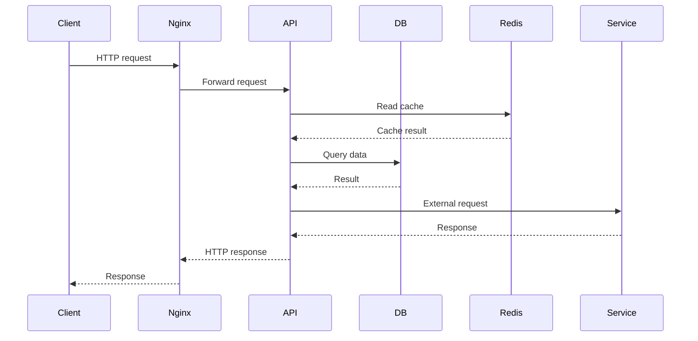
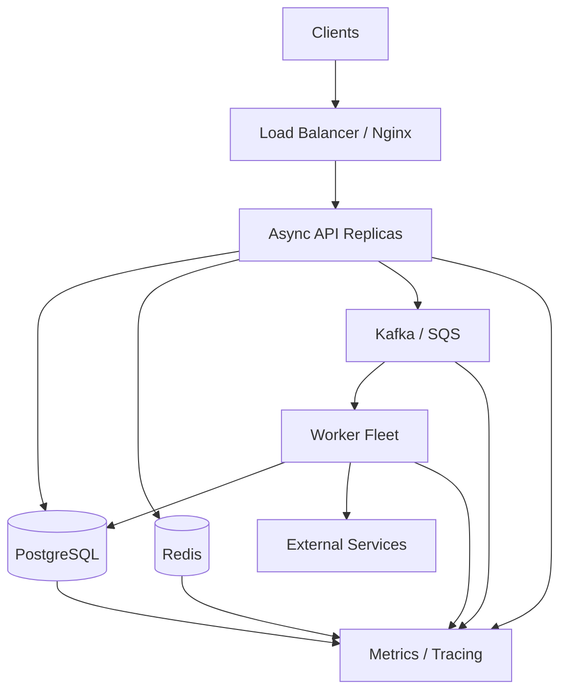

# 18- Backend Concurrency

## Overview

Backend concurrency is the ability of a server to make progress on multiple independent operations without requiring each operation to complete before another begins.

In Python backends, concurrency is primarily used to improve throughput and latency for workloads that spend significant time waiting for:

- network responses;
- database operations;
- Redis;
- Kafka;
- external APIs;
- file or object storage;
- other services.

Concurrency is not the same as parallelism.

```text
Concurrency
├── asyncio
├── threads
└── task coordination

Parallelism
├── processes
├── multiple CPU cores
└── distributed workers
```

A production backend typically combines several forms of concurrency:

```text
                   ┌───────────────┐
                   │ Load Balancer │
                   └───────┬───────┘
                           │
              ┌────────────┴────────────┐
              ▼                         ▼
        API Instance 1            API Instance 2
        ┌─────────────┐           ┌─────────────┐
        │ Event Loop  │           │ Event Loop  │
        │ / Threads  │           │ / Threads  │
        └──────┬──────┘           └──────┬──────┘
               │                         │
               └────────────┬────────────┘
                            ▼
                    PostgreSQL / Redis
                            │
                            ▼
                       Kafka / SQS
                            │
                            ▼
                       Worker Fleet
```

The engineering challenge is not maximizing concurrency. It is choosing a concurrency model that improves utilization while keeping latency, resource consumption, correctness, and downstream pressure within safe limits.

---

## Concurrency vs Parallelism

| Concept | Meaning | Python examples |
|---|---|---|
| Concurrency | Multiple operations make progress during overlapping time periods | `asyncio`, threads |
| Parallelism | Multiple operations execute simultaneously | Processes, multiple machines |
| I/O concurrency | Overlap waiting for I/O | `asyncio`, threads |
| CPU parallelism | Execute CPU work across cores | `multiprocessing`, process pools |
| Distributed concurrency | Coordinate work across instances | Kafka, SQS, Celery |

A backend handling 1,000 concurrent HTTP requests does not necessarily execute 1,000 pieces of Python code simultaneously.

For example, with asyncio:

```text
Request A → waiting for PostgreSQL
Request B → waiting for HTTP API
Request C → executing Python code
Request D → waiting for Redis
```

The event loop can make progress on C while A, B, and D are waiting.

---

## Why Backend Concurrency Matters

A synchronous request path can waste server capacity while waiting:

```text
Request
  ↓
Database query
  ↓
WAIT 80 ms
  ↓
External API
  ↓
WAIT 150 ms
  ↓
Response
```

During the waits, the application is not necessarily consuming significant CPU, but a synchronous worker may remain occupied.

Concurrency allows other work to proceed:

```text
Request A → DB wait ───────────────┐
                                   │
Request B → Redis → response       │
                                   │
Request C → HTTP wait ─────────────┤
                                   │
Request D → Python processing ─────┘
```

This is especially valuable for I/O-heavy APIs.

---

## Backend Request Lifecycle

A typical concurrent request may follow:



The API may have many requests simultaneously waiting on different dependencies.

Concurrency allows those requests to share execution resources efficiently.

---

## Python Concurrency Models

Python backend applications commonly use four models:

| Model | Best suited for | Parallel CPU execution |
|---|---|---|
| `asyncio` | High-volume I/O | No, not by itself |
| Threads | Blocking I/O | Generally no for Python bytecode under traditional GIL-enabled CPython |
| Processes | CPU-heavy work | Yes |
| Distributed workers | Durable/background workloads | Yes, across workers |

These models can be combined.

For example:

```text
FastAPI
   ↓
asyncio
   ↓
async DB / HTTP
   ↓
Kafka
   ↓
Process-based workers
```

---

## Asyncio for Backend APIs

Asyncio uses cooperative concurrency.

```python
import asyncio


async def fetch_user(user_id: int) -> dict:
    await asyncio.sleep(0.05)
    return {"id": user_id}


async def fetch_orders(user_id: int) -> list[dict]:
    await asyncio.sleep(0.05)
    return [{"id": 1001}]


async def load_dashboard(user_id: int) -> dict:
    user, orders = await asyncio.gather(
        fetch_user(user_id),
        fetch_orders(user_id),
    )

    return {
        "user": user,
        "orders": orders,
    }
```

The two independent operations can overlap.

If each takes approximately 50 ms, the combined I/O portion can approach the slower operation's latency rather than their sum, excluding scheduling and processing overhead.

---

## Cooperative Scheduling

Asyncio tasks yield control when they await an operation that can suspend:

```python
result = await client.get(...)
```

Conceptually:

```text
Task A
  ↓
await network I/O
  ↓
Event loop runs Task B
  ↓
Task B awaits DB
  ↓
Event loop runs Task C
  ↓
...
```

There is no automatic preemption at every Python statement.

This means blocking synchronous code can block unrelated requests.

---

## The Event Loop

The event loop coordinates asynchronous tasks and I/O readiness.

```text
                Event Loop
                    │
       ┌────────────┼────────────┐
       ▼            ▼            ▼
    Task A        Task B       Task C
       │            │            │
       ▼            ▼            ▼
     HTTP          DB           Redis
       │            │            │
       └────── I/O readiness ────┘
```

When a task cannot make progress because it is waiting for asynchronous I/O, the event loop can run another ready task.

---

## Blocking the Event Loop

This is a major backend failure mode:

```python
async def handler() -> dict:
    result = requests.get("https://example.com")
    return result.json()
```

`requests.get()` is synchronous.

While it waits, the event-loop thread cannot efficiently execute other asyncio tasks.

Use an async-compatible client:

```python
import httpx


async def handler() -> dict:
    async with httpx.AsyncClient() as client:
        response = await client.get("https://example.com")
        response.raise_for_status()
        return response.json()
```

In production, the client should normally be reused rather than created for every request.

---

## Offloading Blocking Work

Sometimes a synchronous library cannot be replaced.

Use a worker thread for blocking I/O:

```python
import asyncio


def blocking_operation() -> str:
    return "result"


async def handler() -> str:
    return await asyncio.to_thread(blocking_operation)
```

This prevents the blocking function from running directly on the event-loop thread.

`asyncio.to_thread()` is primarily useful for blocking I/O. It is not a general solution for CPU-bound Python code.

---

## CPU-Bound Work

Consider:

```python
def calculate_report(data: list[int]) -> int:
    return sum(
        value * value
        for value in data
    )
```

Large CPU-bound operations can occupy the event-loop thread for too long.

For CPU-heavy Python workloads, process-based execution may be more appropriate:

```python
import asyncio
from concurrent.futures import ProcessPoolExecutor


def calculate_report(data: list[int]) -> int:
    return sum(value * value for value in data)


async def generate_report(
    executor: ProcessPoolExecutor,
    data: list[int],
) -> int:
    loop = asyncio.get_running_loop()

    return await loop.run_in_executor(
        executor,
        calculate_report,
        data,
    )
```

Under traditional GIL-enabled CPython, separate processes can execute Python bytecode on multiple CPU cores.

---

## Threads in Backend Applications

Threads are useful when working with blocking I/O libraries.

Typical examples include:

- legacy database drivers;
- synchronous HTTP clients;
- blocking SDKs;
- filesystem operations;
- libraries that cannot be converted to async.

Use a bounded thread pool rather than creating unbounded threads.

```python
from concurrent.futures import ThreadPoolExecutor

executor = ThreadPoolExecutor(max_workers=20)
```

Thread count should be based on workload and downstream capacity.

---

## Thread Safety

Concurrent threads can access shared mutable state simultaneously.

Unsafe:

```python
counter = 0


def increment() -> None:
    global counter
    counter += 1
```

Multiple threads can race around read-modify-write operations.

Use appropriate synchronization:

```python
import threading

counter = 0
lock = threading.Lock()


def increment() -> None:
    global counter

    with lock:
        counter += 1
```

The GIL is not a substitute for application-level synchronization.

---

## Asyncio Race Conditions

Async code can also have race conditions.

```python
balance = 100


async def withdraw(amount: int) -> None:
    global balance

    current = balance
    await some_external_check()

    balance = current - amount
```

Two tasks can read the same value before either writes the result.

Use an appropriate synchronization strategy:

```python
import asyncio

balance = 100
balance_lock = asyncio.Lock()


async def withdraw(amount: int) -> None:
    global balance

    async with balance_lock:
        current = balance
        await some_external_check()
        balance = current - amount
```

However, holding a local lock during slow external I/O may create unnecessary contention. In real systems, database transactions or atomic updates are often a better correctness boundary.

---

## Local Locks vs Distributed Coordination

A Python lock coordinates only within its synchronization domain.

For example:

```text
Pod A
  └── asyncio.Lock

Pod B
  └── asyncio.Lock
```

These locks do not coordinate with each other.

If multiple Kubernetes pods update the same business resource, use an appropriate distributed mechanism such as:

- PostgreSQL transactions;
- PostgreSQL row locks;
- atomic SQL;
- optimistic concurrency;
- Redis-based coordination where justified;
- queue partitioning;
- application-level ownership.

Do not use an in-process lock to solve a distributed concurrency problem.

---

## Database Concurrency

The database is often the real concurrency boundary of a backend.

Consider two requests:

```text
Request A ──┐
            ├── PostgreSQL → same row
Request B ──┘
```

Possible strategies include:

- atomic SQL updates;
- transactions;
- unique constraints;
- optimistic concurrency;
- `SELECT ... FOR UPDATE`;
- advisory locks where appropriate.

For example:

```sql
UPDATE accounts
SET balance = balance - 100
WHERE id = 42
  AND balance >= 100;
```

The database can enforce the condition atomically.

This is usually safer than:

```text
SELECT balance
↓
Python comparison
↓
UPDATE balance
```

because another transaction may modify the value between those operations.

---

## Connection Pools

Concurrency is limited by connection capacity.

Suppose:

```text
API replicas = 10
DB pool per replica = 20
```

Potential maximum database connections:

```text
10 × 20 = 200
```

This multiplication must be included in capacity planning.

A highly concurrent application can overwhelm PostgreSQL even when CPU usage on the application servers appears low.

---

## HTTP Connection Pools

The same principle applies to downstream HTTP clients.

```text
API replicas
    ↓
HTTP connection pools
    ↓
External service
```

Connection limits should be configured intentionally.

A semaphore can provide a separate application-level concurrency limit:

```python
import asyncio

external_limit = asyncio.Semaphore(50)


async def call_service(client, url: str):
    async with external_limit:
        response = await client.get(url)
        response.raise_for_status()
        return response.json()
```

A connection pool and a semaphore are not interchangeable:

| Mechanism | Controls |
|---|---|
| Connection pool | Number of reusable network connections |
| Semaphore | Number of concurrent application operations |
| Rate limiter | Requests per unit of time |
| Queue | Amount of buffered work |

---

## Fan-Out Requests

Backend APIs often call multiple services:

```text
             ┌── Inventory
API ─────────┼── Pricing
             ├── Recommendations
             └── Customer Profile
```

Independent calls can execute concurrently.

```python
import asyncio


async def load_page(user_id: int) -> dict:
    profile, orders, recommendations = await asyncio.gather(
        fetch_profile(user_id),
        fetch_orders(user_id),
        fetch_recommendations(user_id),
    )

    return {
        "profile": profile,
        "orders": orders,
        "recommendations": recommendations,
    }
```

Fan-out reduces latency when dependencies are independent.

---

## Fan-Out Capacity Explosion

Concurrency also amplifies downstream traffic.

If:

```text
1 request
→ 5 downstream calls
```

and:

```text
1,000 concurrent requests
```

then the application may create up to:

```text
5,000 downstream operations
```

With 10 Kubernetes replicas, the aggregate pressure can become much larger.

This is why concurrency limits must be designed globally.

---

## TaskGroup

Modern asyncio applications can use structured concurrency with `TaskGroup`.

```python
import asyncio


async def load_data() -> tuple[dict, list[dict]]:
    async with asyncio.TaskGroup() as group:
        user_task = group.create_task(fetch_user())
        orders_task = group.create_task(fetch_orders())

    return user_task.result(), orders_task.result()
```

If a child task fails, `TaskGroup` coordinates cancellation of sibling tasks and propagates grouped failures.

This gives task lifetimes an explicit ownership boundary.

---

## `gather()` vs `TaskGroup`

| Feature | `asyncio.gather()` | `asyncio.TaskGroup` |
|---|---|---|
| Concurrent execution | Yes | Yes |
| Structured ownership | Less explicit | Strong |
| Sibling cancellation on child failure | Not automatically in the default exception case | Yes |
| Grouped exception propagation | No | Yes |
| Good for | Simple aggregation | Structured application workflows |

`gather()` remains useful, particularly when its specific exception and result semantics are appropriate.

---

## Timeouts

Every remote operation should have an explicit time budget.

Conceptually:

```text
Request timeout = 2 seconds

├── DB = 500 ms
├── HTTP = 800 ms
└── remaining application work
```

Without timeouts, a backend can accumulate stuck work.

Asyncio provides:

```python
import asyncio


async def operation() -> dict:
    async with asyncio.timeout(2.0):
        return await fetch_data()
```

The underlying HTTP or database client should also have appropriate operation-specific timeouts.

---

## Cancellation

Cancellation is part of normal backend lifecycle management.

A request may be cancelled because:

- the client disconnected;
- the server is shutting down;
- a parent task failed;
- a timeout expired;
- an operation is no longer needed.

Cleanup should be reliable:

```python
async def process() -> None:
    resource = await acquire_resource()

    try:
        await do_work(resource)
    finally:
        await resource.close()
```

When catching `asyncio.CancelledError`, cleanup should normally be performed and cancellation re-raised.

---

## Retries and Concurrency

Retries can multiply load.

Suppose:

```text
1,000 requests
×
3 retry attempts
=
up to 3,000 attempts
```

If the downstream system is already unhealthy, aggressive retries can create a retry storm.

Use:

- bounded retry attempts;
- exponential backoff;
- jitter;
- timeouts;
- circuit breakers;
- idempotency where required.

---

## Rate Limiting

Concurrency limiting and rate limiting solve different problems.

```text
Semaphore:
How many operations are active simultaneously?

Rate limiter:
How many operations may start per second?
```

An external API might allow:

```text
100 concurrent requests
but only
1,000 requests/minute
```

Both limits may need to be enforced.

---

## Backpressure

Backend concurrency should have a mechanism for overload.


Useful techniques include:

- bounded queues;
- semaphores;
- rate limits;
- connection limits;
- request limits;
- circuit breakers;
- load shedding;
- admission control.

---

## Load Shedding

When the system cannot safely accept more work, rejecting some work is often better than allowing everything to fail slowly.

Possible responses include:

```text
429 Too Many Requests
503 Service Unavailable
```

This preserves resources for requests that can still succeed.

Load shedding should be explicit and observable.

---

## Bulkheads

Bulkheads isolate resource pools between workloads.

For example:

```text
Critical API
   ↓
Pool A

Analytics API
   ↓
Pool B
```

If analytics traffic becomes expensive, it should not consume all workers or database capacity needed by critical operations.

Bulkheads can be implemented using:

- separate worker pools;
- separate queues;
- separate connection pools;
- concurrency limits;
- separate Kubernetes deployments.

---

## Circuit Breakers

A circuit breaker prevents repeatedly calling a failing dependency.

Conceptually:

```text
Closed
  ↓ failures
Open
  ↓ cooldown
Half-Open
  ↓ success
Closed
```

When a dependency is clearly unhealthy, failing fast is often better than consuming every available worker while waiting for timeouts.

---

## Background Work

Do not perform long-running business operations inside the request lifecycle when the client does not need to wait for completion.

Instead:

```text
HTTP Request
    ↓
Persist job
    ↓
Publish message
    ↓
Return 202 Accepted

Queue
    ↓
Worker
    ↓
Process
```

Suitable infrastructure includes:

- Celery;
- Kafka;
- SQS;
- dedicated worker deployments.

An in-process asyncio task is not durable.

---

## FastAPI Concurrency

FastAPI supports asynchronous endpoints:

```python
from fastapi import FastAPI

app = FastAPI()


@app.get("/users/{user_id}")
async def get_user(user_id: int) -> dict:
    user = await fetch_user(user_id)
    return user
```

This works well when dependencies are also asynchronous.

If the endpoint calls blocking code directly, the event-loop benefits can be lost.

---

## FastAPI Worker Architecture

A production deployment may look like:

```text
Nginx / Load Balancer
          ↓
     ┌────┴────┐
     ▼         ▼
 Uvicorn      Uvicorn
 Process      Process
     │         │
 Event Loop  Event Loop
     │         │
     └────┬────┘
          ↓
   PostgreSQL / Redis
```

Multiple worker processes provide process-level parallelism.

Each process has its own:

- Python interpreter;
- event loop;
- memory;
- connection pools;
- in-process locks;
- background tasks.

Therefore concurrency limits are often multiplied across processes and replicas.

---

## Django Concurrency

Django can run in multiple deployment models.

For traditional synchronous deployments:

```text
Nginx
 ↓
Gunicorn
 ↓
Multiple worker processes/threads
 ↓
Django
```

For asynchronous workloads, Django supports ASGI deployment and asynchronous views.

The same fundamental rule applies:

> An async endpoint provides useful concurrency only when the operations it awaits are genuinely non-blocking or are safely offloaded.

Django's synchronous ORM usage and other blocking components must be considered carefully when designing async request paths.

---

## REST API Concurrency

REST APIs should explicitly define concurrency-sensitive behavior.

Important mechanisms include:

- idempotency keys;
- optimistic concurrency;
- conditional requests;
- ETags;
- database constraints;
- atomic updates.

For example:

```http
PUT /orders/123
If-Match: "version-7"
```

The server can reject an update if the resource has changed since the client last read it.

This prevents lost updates.

---

## gRPC Concurrency

gRPC services can have many simultaneous requests over persistent HTTP/2 connections.

Concurrency limits should account for:

- maximum active RPCs;
- connection limits;
- server worker capacity;
- downstream database capacity;
- streaming RPC lifetime.

Long-lived streams require particular attention because they can consume resources for extended periods.

---

## Redis and Concurrency

Redis can provide atomic operations useful for concurrency control.

Examples include:

- counters;
- atomic increments;
- short-lived coordination;
- distributed rate limiting;
- caching.

However, distributed locking with Redis requires careful consideration of:

- lease expiration;
- stale owners;
- network partitions;
- failover;
- fencing;
- correctness requirements.

Prefer database constraints or transactional mechanisms when they directly express the required business invariant.

---

## Kafka and Consumer Concurrency

Kafka provides parallelism through partitions and consumer groups.

```text
Topic
├── Partition 0 → Consumer A
├── Partition 1 → Consumer B
├── Partition 2 → Consumer C
└── Partition 3 → Consumer D
```

A consumer group can process partitions concurrently.

The maximum useful consumer parallelism is constrained by partition count.

Ordering is generally maintained within a partition, not globally across all partitions.

---

## Celery and Worker Concurrency

Celery can distribute background tasks across worker processes.

```text
API
 ↓
Broker
 ↓
Celery Worker Fleet
 ├── Worker Process
 ├── Worker Process
 └── Worker Process
```

Worker concurrency must consider:

- task CPU intensity;
- task memory;
- database connections;
- external API limits;
- broker capacity;
- task duration.

More worker concurrency is not automatically better.

---

## Kubernetes Concurrency Multiplication

Capacity calculations must consider the complete deployment.

Suppose:

```text
Replicas = 8
Processes per replica = 4
Concurrency per process = 100
```

The theoretical request concurrency can reach:

```text
8 × 4 × 100 = 3,200
```

If each request can make two downstream calls:

```text
3,200 × 2 = 6,400
```

potential concurrent downstream operations.

This is why application-level configuration cannot be designed independently from deployment topology.

---

## Memory Implications

Concurrency increases memory usage.

Potential sources include:

- request objects;
- asyncio tasks;
- thread stacks;
- database connections;
- HTTP connections;
- response buffers;
- serialization buffers;
- queues;
- caches.

If a process handles too many concurrent operations, memory can become the limiting resource before CPU.

Monitor memory under realistic concurrency rather than estimating from idle behavior.

---

## File Descriptors

High concurrency can increase open file descriptors.

Sockets, files, pipes, and other resources consume descriptors.

A high-concurrency server should monitor:

```text
open file descriptors
socket count
connection pool usage
connection errors
```

Operating-system limits must be configured appropriately, but increasing limits does not solve uncontrolled resource usage.

---

## Latency and Tail Latency

Concurrency often improves average utilization but can worsen tail latency when resources become saturated.

For example:

```text
Concurrency ↑
    ↓
DB contention ↑
    ↓
Queueing ↑
    ↓
p95/p99 latency ↑
```

Always evaluate:

- p50;
- p95;
- p99;
- throughput;
- error rate;
- resource saturation.

A system that processes more requests but produces unacceptable p99 latency is not necessarily better.

---

## Throughput vs Latency

Concurrency can improve throughput by overlapping waits.

However:

```text
More concurrency
      ≠
Infinite throughput
```

At some point:

```text
Resource saturation
      ↓
Queueing
      ↓
Contention
      ↓
Latency increases
      ↓
Timeouts
      ↓
Retries
      ↓
More load
```

This feedback loop can produce cascading failure.

---

## Graceful Shutdown

A concurrent backend should stop accepting new work before terminating existing work.

Typical sequence:

```text
SIGTERM
  ↓
Stop accepting new requests
  ↓
Stop producers
  ↓
Stop creating new background tasks
  ↓
Finish/cancel active operations
  ↓
Drain appropriate queues
  ↓
Close DB/HTTP/Redis connections
  ↓
Exit
```

Kubernetes deployments should provide enough termination grace period for this process.

---

## Observability

Concurrency requires more than CPU and memory monitoring.

Track:

### Application

- active requests;
- request duration;
- p95/p99 latency;
- event-loop latency;
- task count;
- task failures;
- cancellation rate.

### Dependency

- DB pool utilization;
- DB wait time;
- HTTP connection pool utilization;
- external API latency;
- Redis latency;
- Kafka consumer lag.

### Queue

- queue depth;
- enqueue rate;
- dequeue rate;
- oldest item age;
- retry count;
- DLQ count.

---

## Event-Loop Monitoring

For asyncio services, event-loop responsiveness is a critical metric.

A busy event loop can cause:

```text
Request arrives
   ↓
Task scheduled
   ↓
Event loop blocked by CPU / sync I/O
   ↓
Task waits
   ↓
Latency increases
```

A service may show low database latency while still having poor response times because the application process is blocking the event loop.

---

## Logging

Concurrency complicates logs because operations interleave.

Include identifiers such as:

```text
request_id
trace_id
user_id
job_id
message_id
task_name
```

Example:

```text
request_id=abc123 task=payment-worker job_id=789
payment processing started
```

Avoid relying on log ordering as proof of execution ordering.

---

## Distributed Tracing

A useful trace may look like:

```text
HTTP request
 ├── Redis 8ms
 ├── PostgreSQL 42ms
 ├── HTTP inventory 70ms
 └── HTTP pricing 55ms
```

For asynchronous workflows:

```text
HTTP request
   ↓
Kafka publish
   ↓
Consumer
   ↓
PostgreSQL
   ↓
External API
```

Trace propagation helps identify where time is spent.

---

## Security Considerations

Concurrency can become a security issue when attackers can force expensive operations.

Examples:

- unbounded concurrent requests;
- expensive report generation;
- large uploads;
- connection exhaustion;
- queue flooding;
- retry amplification;
- expensive database queries.

Use:

- authentication;
- authorization;
- request-size limits;
- rate limiting;
- concurrency limits;
- quotas;
- timeouts;
- resource isolation.

Never allow untrusted input to determine unlimited concurrency.

---

## High Availability

Concurrency improves resource utilization but does not itself provide high availability.

For HA:

```text
Load Balancer
    ↓
Multiple API replicas
    ↓
Multiple worker instances
    ↓
Highly available dependencies
```

Avoid relying on:

- one worker;
- one process;
- one pod;
- local memory as the only state;
- local queues for durable business work.

State required for recovery should be stored in durable infrastructure.

---

## Disaster Recovery

Concurrency design should account for process and infrastructure failure.

Ask:

- What happens if a worker dies?
- What happens if a pod is terminated?
- Can unfinished work be retried?
- Is processing idempotent?
- Can messages be replayed?
- Where is durable state stored?
- What happens during a regional outage?

Durable queues and transactional state are usually more recoverable than in-memory task state.

---

## Cost Optimization

Higher concurrency can reduce infrastructure cost for I/O-heavy services by improving utilization.

But excessive concurrency can increase costs through:

- database scaling;
- connection infrastructure;
- external API consumption;
- memory usage;
- retries;
- larger worker fleets;
- inefficient CPU scheduling.

Optimize for completed useful work, not raw concurrency.

---

## Choosing a Concurrency Model

| Workload | Recommended approach |
|---|---|
| Async HTTP API | `asyncio` |
| Many concurrent network calls | `asyncio` |
| Blocking third-party SDK | Thread pool / `asyncio.to_thread()` |
| CPU-heavy Python computation | Process pool |
| Durable background job | Celery / SQS / Kafka-based workers |
| Event streaming | Kafka consumer groups |
| Local producer-consumer coordination | `asyncio.Queue` |
| Cross-process coordination | Database/broker/distributed mechanism |
| Strict database invariant | Database transaction/constraint |
| External API quota | Rate limiter + concurrency limit |

The decision should be based on the workload rather than framework preference.

---

## Production Concurrency Architecture

A robust backend often separates concerns:



Important boundaries are explicit:

```text
Request concurrency
        ↓
Dependency concurrency
        ↓
Queue capacity
        ↓
Worker concurrency
        ↓
Database capacity
```

---

## Concurrency Design Principles

### Bound Every Expensive Resource

Examples:

```text
HTTP connections
DB connections
worker tasks
queue depth
request body size
CPU-heavy jobs
```

### Prefer Explicit Budgets

Instead of:

```text
"Allow as much concurrency as possible"
```

define:

```text
API concurrency = 500
DB connections = 100
External API concurrency = 50
Worker concurrency = 20
```

The values should come from capacity testing.

### Keep Critical Sections Small

Do not hold locks across slow operations unless required for correctness.

### Push Durability to Durable Systems

Use PostgreSQL, Kafka, SQS, or another durable system when work must survive process failure.

### Make Retries Safe

Assume operations can execute more than once.

### Measure Before Tuning

Concurrency should be optimized using load tests and production telemetry rather than intuition.

---

## Common Mistakes

### Treating Asyncio as Parallelism

Asyncio overlaps I/O but does not automatically execute CPU-bound Python work across CPU cores.

### Using Async Functions with Blocking Libraries

`async def` does not magically make synchronous I/O asynchronous.

### Adding More Workers to Fix Every Bottleneck

More workers can overload the database or external service.

### Ignoring Connection Pools

Concurrency may be limited by a pool long before application CPU reaches saturation.

### Holding Locks During Network Calls

This can create unnecessary contention and increase deadlock risk.

### Creating Unlimited Tasks

Creating a task for every item in an unbounded workload can exhaust memory.

### Using Local Locks Across Kubernetes Pods

A Python lock exists only within its process.

### Relying on In-Memory Background Tasks

Process crashes can lose unfinished work.

### Retrying Without Limits

Retries can amplify outages into cascading failures.

### Measuring Only Average Latency

Tail latency often reveals resource saturation first.

---

## Interview Traps

### "Does asyncio make Python multi-core?"

No. Asyncio provides cooperative concurrency within an event loop. CPU parallelism generally requires processes or other execution models capable of using multiple cores.

### "Does the GIL make threads useless?"

No. Threads can be effective for I/O-bound workloads, and some native operations release the GIL. The GIL primarily limits simultaneous execution of Python bytecode in traditional GIL-enabled CPython.

### "Is more concurrency always faster?"

No. Beyond the capacity of CPU, memory, databases, connection pools, or downstream services, additional concurrency can increase contention and latency.

### "Can a local lock protect a shared database record?"

Not across multiple processes or pods. The database or another distributed coordination mechanism must enforce the cross-process invariant.

### "Does a timeout kill the underlying work?"

Not necessarily. A timeout changes the waiting/cancellation behavior of the caller, but an already-running operation may continue unless the underlying execution mechanism supports and performs cancellation.

### "Does FIFO mean consumers finish in order?"

No. Multiple consumers can process items concurrently and complete them in a different order.

---

## Production Checklist

- [ ] Workload has been classified as I/O-bound, CPU-bound, or mixed.
- [ ] Concurrency model matches workload characteristics.
- [ ] Async endpoints use genuinely asynchronous dependencies where practical.
- [ ] Blocking operations are isolated from the event-loop thread.
- [ ] CPU-heavy work is isolated from request/event-loop execution.
- [ ] Worker and task counts are explicitly bounded.
- [ ] Queue sizes are bounded where appropriate.
- [ ] Database connection pools are included in capacity calculations.
- [ ] HTTP connection pools are explicitly configured.
- [ ] External API concurrency and rate limits are enforced.
- [ ] Kubernetes replica multiplication is included in capacity planning.
- [ ] Race conditions are addressed at the correct synchronization boundary.
- [ ] Database invariants are enforced by transactions or constraints.
- [ ] Critical operations are idempotent where duplicate execution is possible.
- [ ] Timeouts exist for network and database operations.
- [ ] Retries are bounded and use backoff with jitter.
- [ ] Circuit breakers or load shedding are used where appropriate.
- [ ] Background business work uses durable infrastructure.
- [ ] Graceful shutdown is implemented.
- [ ] Cancellation releases resources correctly.
- [ ] Queue lag and message age are monitored.
- [ ] Event-loop latency is monitored for async services.
- [ ] p95 and p99 latency are measured.
- [ ] Connection and resource saturation are observable.
- [ ] Correlation IDs and distributed tracing are propagated.
- [ ] Concurrency-related security limits are enforced.
- [ ] Load tests cover sustained traffic and burst traffic.
- [ ] Failure tests cover dependency degradation and worker termination.
- [ ] Autoscaling limits protect downstream dependencies.
- [ ] Disaster recovery behavior for queued work is documented.

## Key Takeaways

- **Backend concurrency is a capacity-management problem:** the goal is controlled overlap of work, not maximum concurrency.
- **Match the concurrency model to the workload:** use asyncio for asynchronous I/O, threads for suitable blocking I/O, processes for CPU-heavy Python work, and durable workers for background processing.
- **Concurrency multiplies downstream pressure:** database pools, HTTP connections, worker counts, replicas, and fan-out calls must be sized as one system.
- **Correctness requires explicit synchronization boundaries:** use locks for local coordination, but use database transactions, constraints, queues, or distributed mechanisms for cross-process invariants.
- **Production concurrency requires limits and observability:** timeouts, backpressure, rate limits, retries, graceful shutdown, queue metrics, tail latency, and resource saturation signals are essential.