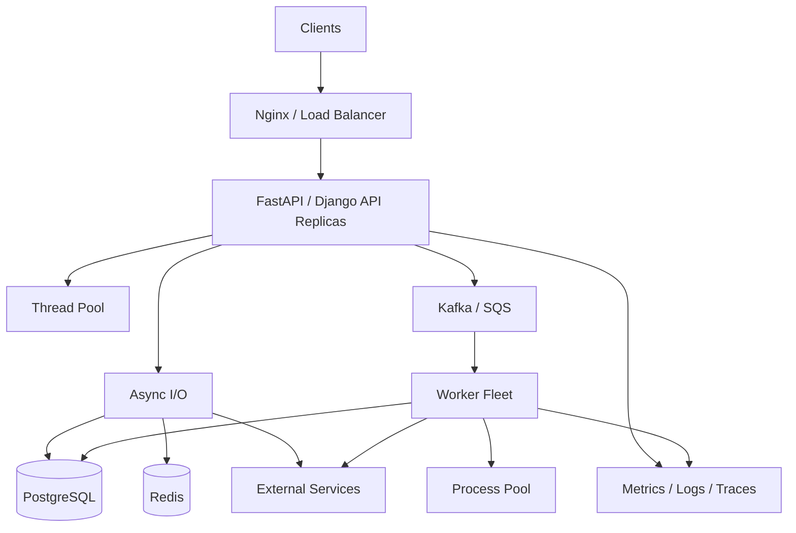

# README

## Overview

Concurrency and parallelism are core Python backend engineering concepts for building services that remain responsive under concurrent workloads and use compute resources efficiently.

This section focuses on how Python executes concurrent work and how that behavior translates into production backend systems.

The central distinction is:

```text
Concurrency
├── Multiple operations make progress during overlapping periods
├── asyncio
└── threads

Parallelism
├── Multiple operations execute simultaneously
├── processes
└── multiple machines / worker instances
```

Python provides several execution models because backend workloads have different bottlenecks.

```text
                 Python Concurrency
                        │
        ┌───────────────┼────────────────┐
        ▼               ▼                ▼
     asyncio         Threads          Processes
        │               │                │
    Async I/O       Blocking I/O      CPU work
        │               │                │
        └───────────────┼────────────────┘
                        ▼
              Distributed Workers
                        │
              Kafka / SQS / Celery
```

The goal is not to maximize concurrency. The goal is to choose controlled concurrency that improves throughput and latency without exhausting CPU, memory, database connections, network connections, or downstream services.

---

## Navigation

| # | File | Topic |
|---|---|---|
| 01 | [Concurrency Fundamentals](01-%20Concurrency%20Fundamentals.md) | Conceptual foundation: concurrency vs parallelism, I/O-bound vs CPU-bound workloads |
| 02 | [Processes vs Threads](02-%20Processes%20vs%20Threads.md) | Runtime differences, isolation, GIL implications, decision rules |
| 03 | [GIL](03-%20GIL.md) | Global Interpreter Lock, CPython impact, free-threaded CPython |
| 04 | [Threading](04-%20Threading.md) | Thread lifecycle, locks, semaphores, queues, graceful shutdown |
| 05 | [ThreadPool Executor](05-%20ThreadPool%20Executor.md) | `ThreadPoolExecutor`, futures, backpressure, production sizing |
| 06 | [Multiprocessing](06-%20Multiprocessing.md) | Process isolation, CPU-bound execution, shared memory, start methods |
| 07 | [ProcessPool Executor](07-%20ProcessPool%20Executor.md) | `ProcessPoolExecutor`, pickling, task granularity, CPU/memory sizing |
| 08 | [Asyncio](08-%20Asyncio.md) | Event loops, coroutines, tasks, gather, TaskGroup, cancellation |
| 09 | [Async and Await](09-%20Async%20and%20Await.md) | `async def` / `await` semantics, awaitables, structured concurrency |
| 10 | [Event Loop](10-%20Event%20Loop.md) | Execution engine, scheduling, OS I/O multiplexing, starvation |
| 11 | [Asyncio Tasks](11-%20Asyncio%20Tasks.md) | Task ownership, TaskGroup, cancellation, shielding, task leaks |
| 12 | [Async HTTP](12-%20Async%20HTTP.md) | `httpx.AsyncClient`, connection pooling, retries, fan-out |
| 13 | [Queues and Synchronization](13-%20Queues%20and%20Synchronization.md) | `asyncio.Queue`, bounded queues, backpressure, durable queues |
| 14 | [Locks, Semaphores, and Events](14-%20Locks%20Semaphores%20Events.md) | Synchronization primitives, scope, deadlock prevention |
| 15 | [Race Conditions](15-%20Race%20Conditions.md) | Data races, TOCTOU, atomic SQL, optimistic/pessimistic locking |
| 16 | [Deadlocks](16-%20Deadlocks.md) | Classical conditions, prevention techniques, PostgreSQL deadlocks |
| 17 | [Producer-Consumer](17-%20Producer%20Consumer.md) | Bounded queues, backpressure, Kafka, SQS, Celery, graceful shutdown |
| 18 | [Backend Concurrency](18-%20Backend%20Concurrency.md) | Production architecture, bulkheads, circuit breakers, capacity planning |

---

## Why Concurrency Matters in Backend Systems

Backend applications spend significant time waiting for external resources:

- PostgreSQL;
- Redis;
- HTTP services;
- gRPC services;
- Kafka;
- object storage;
- filesystem operations.

A sequential request path may look like:

```text
HTTP Request
    ↓
PostgreSQL
    ↓
wait 40 ms
    ↓
External API
    ↓
wait 100 ms
    ↓
Redis
    ↓
wait 10 ms
    ↓
Response
```

Concurrency allows independent operations to overlap:

```text
Request A → PostgreSQL wait ──────────────┐
Request B → Redis wait ───────┐          │
Request C → HTTP wait ────────┼──────────┤
Request D → Python processing │          │
                              └──────────┘
```

This can significantly improve resource utilization for I/O-bound services.

---

## Section Structure

```text
08- Concurrency and Parallelism/
│
├── 01- Concurrency Fundamentals.md
├── 02- Processes vs Threads.md
├── 03- GIL.md
├── 04- Threading.md
├── 05- ThreadPool Executor.md
├── 06- Multiprocessing.md
├── 07- ProcessPool Executor.md
├── 08- Asyncio.md
├── 09- Async and Await.md
├── 10- Event Loop.md
├── 11- Asyncio Tasks.md
├── 12- Async HTTP.md
├── 13- Queues and Synchronization.md
├── 14- Locks Semaphores Events.md
├── 15- Race Conditions.md
├── 16- Deadlocks.md
├── 17- Producer Consumer.md
├── 18- Backend Concurrency.md
└── README.md
```

The files progress from fundamental execution models to synchronization, task coordination, and production backend architecture.

---

## Concurrency Fundamentals

**File:** `01- Concurrency Fundamentals.md`

Introduces the conceptual foundation for Python concurrency.

Key topics:

- concurrency vs parallelism;
- I/O-bound vs CPU-bound workloads;
- synchronous execution;
- cooperative concurrency;
- threads;
- processes;
- asyncio;
- synchronization;
- backpressure;
- cancellation;
- timeouts;
- deadlocks;
- backend concurrency architecture.

The main engineering question is:

> What resource is the workload waiting for, and which execution model handles that waiting efficiently?

---

## Processes vs Threads

**File:** `02- Processes vs Threads.md`

Explains the runtime and operational differences between processes and threads.

Key topics:

- process isolation;
- shared thread memory;
- startup cost;
- context switching;
- GIL implications;
- CPU-bound workloads;
- I/O-bound workloads;
- process communication;
- serialization;
- failure isolation;
- worker capacity.

A useful decision rule is:

```text
I/O-bound
   ├── Async-compatible → asyncio
   └── Blocking library → threads

CPU-bound Python
   └── processes

Durable background work
   └── distributed workers
```

---

## GIL

**File:** `03- GIL.md`

Explains the Global Interpreter Lock in CPython and its impact on concurrency.

Key topics:

- why the GIL exists;
- Python bytecode execution;
- threads and I/O;
- CPU-bound workloads;
- native extensions;
- processes;
- thread safety;
- asyncio;
- free-threaded CPython;
- backend deployment implications.

An important distinction is:

```text
GIL
≠
Application lock
≠
Database transaction
≠
Distributed lock
```

The GIL does not eliminate application-level race conditions.

---

## Threading

**File:** `04- Threading.md`

Covers Python's thread-based concurrency model.

Key topics:

- `threading.Thread`;
- thread lifecycle;
- `ThreadPoolExecutor`;
- shared state;
- locks;
- semaphores;
- events;
- conditions;
- queues;
- race conditions;
- thread-local state;
- cancellation;
- graceful shutdown.

Threads are particularly useful for blocking I/O and libraries that do not provide asynchronous APIs.

Production systems should generally prefer bounded thread pools over uncontrolled thread creation.

---

## ThreadPool Executor

**File:** `05- ThreadPool Executor.md`

Focuses on the higher-level thread-pool abstraction:

```python
from concurrent.futures import ThreadPoolExecutor

executor = ThreadPoolExecutor(max_workers=20)
```

Key topics:

- worker pools;
- `submit()`;
- futures;
- `map()`;
- `as_completed()`;
- exception handling;
- timeouts;
- cancellation;
- backpressure;
- thread-local context;
- async integration;
- connection-pool interactions;
- production sizing.

The primary engineering benefit is controlled reuse of a bounded number of threads.

---

## Multiprocessing

**File:** `06- Multiprocessing.md`

Explains process-based parallelism for Python workloads.

Key topics:

- `multiprocessing`;
- process isolation;
- CPU-bound execution;
- GIL avoidance through separate processes;
- serialization;
- process communication;
- start methods;
- copy-on-write;
- shared memory;
- process failure;
- worker sizing;
- Kubernetes deployment.

Processes provide independent Python interpreters and can execute Python workloads concurrently across CPU cores.

The trade-off is greater memory and process-management overhead.

---

## ProcessPool Executor

**File:** `07- ProcessPool Executor.md`

Focuses on `concurrent.futures.ProcessPoolExecutor`.

Key topics:

- process pools;
- futures;
- `submit()`;
- `map()`;
- `as_completed()`;
- pickling;
- task granularity;
- chunksize;
- worker initialization;
- process failures;
- CPU and memory sizing;
- NumPy considerations.

A process pool is often a convenient abstraction for CPU-heavy work that can be divided into independent tasks.

---

## Asyncio

**File:** `08- Asyncio.md`

Introduces Python's asynchronous concurrency framework.

Key topics:

- event loops;
- coroutines;
- `async def`;
- `await`;
- tasks;
- futures;
- `gather()`;
- `TaskGroup`;
- async HTTP;
- async database access;
- queues;
- semaphores;
- cancellation;
- timeouts;
- backpressure.

The basic execution model is:

```text
Task A
  ↓
await I/O
  ↓
Event loop runs Task B
  ↓
await I/O
  ↓
Event loop runs Task C
  ↓
Task A becomes ready
```

Asyncio is particularly effective when the workload contains many concurrent I/O operations.

---

## Async and Await

**File:** `09- Async and Await.md`

Explains the semantics of:

```python
async def
await
```

and how they interact with the event loop.

Key topics:

- coroutine functions;
- coroutine objects;
- awaitables;
- task scheduling;
- sequential vs concurrent awaits;
- `create_task()`;
- `gather()`;
- `TaskGroup`;
- cancellation;
- blocking code;
- async context managers;
- async iterators;
- backend API design.

A critical production rule is:

> `async def` does not make synchronous blocking code asynchronous.

A blocking operation inside an async function can still block the event-loop thread.

---

## Event Loop

**File:** `10- Event Loop.md`

Explains the execution engine behind asyncio.

Key topics:

- event-loop lifecycle;
- task scheduling;
- I/O readiness;
- callbacks;
- timers;
- OS-level I/O multiplexing;
- cooperative scheduling;
- event-loop starvation;
- cancellation;
- multiple event loops;
- FastAPI and ASGI;
- debugging and observability.

Conceptually:

```text
Event Loop
    │
    ├── Ready Task A
    ├── Ready Task B
    ├── Waiting Task C
    └── Waiting Task D
          │
          ▼
     OS I/O readiness
          │
          ▼
     Tasks become ready
```

The event loop should remain responsive. CPU-heavy or blocking synchronous work should not execute directly on it.

---

## Asyncio Tasks

**File:** `11- Asyncio Tasks.md`

Focuses on concurrent units of asyncio execution.

Key topics:

- coroutine vs task;
- `asyncio.create_task()`;
- task lifecycle;
- task ownership;
- `TaskGroup`;
- `gather()`;
- `wait()`;
- `as_completed()`;
- cancellation;
- shielding;
- task naming;
- context variables;
- task leaks;
- structured concurrency.

Task lifetime should be intentionally owned.

Detached background tasks are not a substitute for durable job infrastructure.

---

## Async HTTP

**File:** `12- Async HTTP.md`

Covers asynchronous HTTP communication in backend services.

Key topics:

- `httpx.AsyncClient`;
- connection pooling;
- keep-alive;
- HTTP/1.1;
- HTTP/2;
- DNS;
- TCP;
- TLS;
- timeouts;
- retries;
- exponential backoff;
- jitter;
- idempotency;
- concurrent fan-out;
- bounded concurrency;
- streaming;
- WebSockets;
- SSRF protection;
- graceful client shutdown.

A production async HTTP client should normally be reused and explicitly configured with timeouts and connection limits.

---

## Queues and Synchronization

**File:** `13- Queues and Synchronization.md`

Introduces queues and synchronization primitives used to coordinate concurrent work.

Key topics:

- producer-consumer;
- `asyncio.Queue`;
- bounded queues;
- backpressure;
- locks;
- semaphores;
- events;
- conditions;
- worker pools;
- graceful shutdown;
- local vs distributed coordination;
- durable queues;
- dead-letter queues;
- idempotent consumers.

An important distinction is:

```text
asyncio.Queue
    ↓
Process-local coordination

Kafka / SQS
    ↓
Distributed durable work
```

---

## Locks, Semaphores, and Events

**File:** `14- Locks Semaphores Events.md`

Explains synchronization primitives and their appropriate scope.

Key topics:

- `asyncio.Lock`;
- `threading.Lock`;
- `RLock`;
- semaphores;
- bounded semaphores;
- events;
- conditions;
- critical sections;
- lock ordering;
- contention;
- starvation;
- deadlocks;
- distributed synchronization.

The scope of the synchronization primitive must match the scope of the resource being protected.

```text
Same task/process
    → asyncio/thread locks

Multiple processes
    → process-safe coordination

Multiple pods/services
    → database / broker / distributed mechanism
```

---

## Race Conditions

**File:** `15- Race Conditions.md`

Explains correctness failures caused by concurrent access to shared state.

Key topics:

- race conditions;
- data races;
- check-then-act;
- lost updates;
- TOCTOU;
- asyncio races;
- thread races;
- process races;
- distributed races;
- database transactions;
- optimistic concurrency;
- pessimistic locking;
- atomic SQL;
- idempotency.

The GIL does not eliminate race conditions.

For business-critical invariants, prefer mechanisms that enforce correctness at the appropriate ownership boundary, often the database.

---

## Deadlocks

**File:** `16- Deadlocks.md`

Explains situations where concurrent operations wait indefinitely for each other.

The classical conditions are:

```text
Mutual exclusion
Hold and wait
No preemption
Circular wait
```

The document covers deadlocks involving:

- threads;
- asyncio;
- semaphores;
- worker pools;
- connection pools;
- PostgreSQL;
- distributed services;
- transactions.

Important prevention techniques include:

- consistent lock ordering;
- short critical sections;
- timeouts;
- bounded resource ownership;
- avoiding nested resource waits;
- retrying safe database transactions.

---

## Producer-Consumer

**File:** `17- Producer Consumer.md`

Explains the producer-consumer pattern for separating work creation from processing.

Core architecture:

```text
Producer
   ↓
Queue
   ↓
Consumer
```

Key topics:

- bounded queues;
- backpressure;
- worker pools;
- task completion;
- retries;
- poison messages;
- dead-letter queues;
- ordering;
- idempotency;
- Kafka;
- SQS;
- Celery;
- graceful shutdown;
- queue monitoring.

The central production principle is:

> A queue absorbs temporary workload differences; it does not eliminate a permanent capacity mismatch.

---

## Backend Concurrency

**File:** `18- Backend Concurrency.md`

Brings the preceding concepts together into production backend architecture.

Key topics:

- concurrent HTTP requests;
- asyncio;
- threads;
- processes;
- database concurrency;
- connection pools;
- HTTP connection pools;
- fan-out;
- rate limiting;
- backpressure;
- load shedding;
- bulkheads;
- circuit breakers;
- FastAPI;
- Django;
- gRPC;
- Kafka;
- Celery;
- Kubernetes;
- observability;
- graceful shutdown;
- capacity planning.

The key engineering model is:

```text
Client Load
    ↓
API Concurrency
    ↓
Application Concurrency
    ↓
Connection Pools
    ↓
Downstream Capacity
    ↓
Database / External Services
```

Concurrency limits should be designed across the entire dependency graph rather than independently within one process.

---

## Concurrency Decision Framework

Use the workload characteristics to choose the execution model.

| Workload | Primary choice | Reason |
|---|---|---|
| Many async HTTP calls | `asyncio` | Efficient I/O concurrency |
| Async database access | `asyncio` | Overlap database waits |
| Blocking I/O library | Threads | Offload blocking operations |
| CPU-heavy Python | Processes | Multi-core execution |
| Independent background jobs | Celery / SQS | Durable worker execution |
| Event streaming | Kafka | Partitioned durable processing |
| Local coordination | `asyncio.Queue` | Lightweight process-local buffering |
| Cross-process invariant | Database / process-safe mechanism | Shared coordination |
| Cross-pod invariant | Database / distributed mechanism | Cluster-wide coordination |

The correct choice depends on:

- workload type;
- latency requirements;
- throughput requirements;
- resource limits;
- failure semantics;
- durability requirements;
- operational complexity.

---

## Backend Concurrency Architecture

A production backend may combine multiple concurrency mechanisms:



Each mechanism has a specific responsibility:

```text
asyncio
    → concurrent I/O

threads
    → blocking I/O isolation

processes
    → CPU parallelism

queue
    → work buffering

database
    → durable state and transactional correctness

Kafka / SQS
    → distributed durable work

Celery
    → distributed background task execution
```

---

## Capacity Planning

Concurrency must be modeled across deployment topology.

Suppose:

```text
Kubernetes replicas = 8
Processes per replica = 4
Async concurrency per process = 100
```

Theoretical application concurrency is:

```text
8 × 4 × 100 = 3,200
```

If each request performs three downstream operations:

```text
3,200 × 3 = 9,600
```

potential downstream operations.

Now add connection pools:

```text
8 replicas
×
20 DB connections
=
160 potential DB connections
```

This is why concurrency settings cannot be evaluated in isolation.

---

## Concurrency and Resource Limits

Every expensive resource should have a controlled capacity.

| Resource | Typical control |
|---|---|
| HTTP requests | Admission/concurrency limit |
| Async tasks | Semaphore / bounded task creation |
| Queue | Maximum queue size |
| Threads | Thread pool size |
| Processes | Process pool size |
| PostgreSQL | Connection pool |
| HTTP connections | Client connection limits |
| External API | Rate limiter + semaphore |
| CPU | Worker/process count |
| Memory | Concurrency + payload limits |
| Kafka consumers | Partition count / consumer count |

A production system should fail predictably when capacity is exhausted rather than consuming resources until the process crashes.

---

## Reliability Principles

Production concurrency design should assume:

- tasks can fail;
- workers can terminate;
- clients can disconnect;
- requests can be duplicated;
- messages can be delivered more than once;
- dependencies can become slow;
- connections can be exhausted;
- Kubernetes pods can be terminated;
- processes can restart.

Design accordingly with:

- idempotency;
- timeouts;
- retries;
- backoff;
- jitter;
- circuit breakers;
- bounded queues;
- graceful shutdown;
- durable messaging;
- transactional state changes.

---

## Observability

Concurrency systems require visibility into both application execution and resource pressure.

Important signals include:

### Request Metrics

- request rate;
- active requests;
- p50 latency;
- p95 latency;
- p99 latency;
- timeout rate;
- error rate.

### Async Metrics

- active task count;
- task duration;
- cancellation rate;
- event-loop latency;
- blocked-event-loop detection.

### Resource Metrics

- CPU;
- memory;
- thread count;
- process count;
- file descriptors;
- connection-pool utilization.

### Database Metrics

- active connections;
- pool wait time;
- query latency;
- lock waits;
- transaction duration.

### Queue Metrics

- queue depth;
- enqueue rate;
- dequeue rate;
- oldest message age;
- retry count;
- dead-letter count;
- consumer lag.

---

## Security Considerations

Concurrency controls are also security controls.

An attacker can exploit unbounded concurrency through:

- connection exhaustion;
- expensive API calls;
- queue flooding;
- large payloads;
- expensive database queries;
- repeated retries.

Protect services using:

- authentication;
- authorization;
- request limits;
- rate limits;
- concurrency limits;
- quotas;
- payload limits;
- timeouts;
- resource isolation.

Never allow untrusted input to create unlimited tasks, threads, processes, or expensive background jobs.

---

## High Availability and Disaster Recovery

Concurrency itself does not provide high availability.

A resilient architecture requires:

```text
Multiple API replicas
        +
Multiple workers
        +
Durable shared state
        +
Recoverable queues
        +
Healthy dependencies
```

For critical background work, avoid relying exclusively on process-local state:

```text
In-memory task
    ↓
Process crash
    ↓
Work lost
```

Prefer:

```text
Durable queue
    ↓
Worker crash
    ↓
Work becomes retryable
```

Recovery semantics should be documented for every important asynchronous operation.

---

## Testing Strategy

Concurrency testing should verify both behavior and resource boundaries.

Important test categories include:

- unit tests for synchronization logic;
- integration tests for database concurrency;
- async task tests;
- race-condition tests;
- deadlock detection;
- queue backpressure tests;
- retry tests;
- cancellation tests;
- graceful-shutdown tests;
- load tests;
- stress tests;
- dependency-failure tests.

Production-like load testing is particularly important because concurrency failures often appear only under contention.

---

## Common Engineering Mistakes

### Maximizing Concurrency

More concurrency can increase contention and tail latency.

### Ignoring Downstream Capacity

The API may be able to accept 10,000 concurrent operations while PostgreSQL can safely handle only a fraction of that workload.

### Blocking the Event Loop

A single blocking operation can delay unrelated asynchronous requests.

### Using Local Synchronization for Distributed Problems

An `asyncio.Lock` cannot coordinate multiple pods.

### Treating Queues as Infinite Buffers

A queue should have explicit capacity and overload behavior.

### Assuming Exactly-Once Processing

Failure between processing and acknowledgement can produce duplicate execution.

### Retrying Aggressively

Retries can amplify an outage into a cascading failure.

### Ignoring Tail Latency

Average latency can look healthy while p99 latency is already unacceptable.

---

## Senior-Level Design Questions

When designing a concurrent backend, ask:

1. What is the workload: CPU-bound, I/O-bound, or mixed?
2. Which operations can execute independently?
3. Where does work wait?
4. Which execution model is appropriate?
5. What is the maximum safe concurrency?
6. Which resources become bottlenecks first?
7. What happens when the queue is full?
8. What happens when a worker fails?
9. Can processing happen more than once?
10. Where is correctness enforced?
11. What happens during cancellation?
12. What happens during deployment shutdown?
13. How does concurrency multiply across processes and replicas?
14. What happens when a dependency becomes slow?
15. How is overload detected?
16. How is work recovered after failure?
17. Which metrics reveal saturation before users report failures?

These questions move concurrency design from implementation-level thinking to system-level engineering.

---

## Recommended Engineering Principles

### Prefer Bounded Concurrency

Every expensive operation should have a deliberate concurrency limit.

### Keep Synchronization Local

Use the smallest synchronization scope that correctly protects the resource.

### Prefer Durable State for Recoverable Work

Critical background work should survive process failure.

### Make Consumers Idempotent

Assume retries and duplicate delivery unless the infrastructure and business semantics genuinely guarantee otherwise.

### Protect Dependencies

A service should not consume all available downstream capacity simply because it can generate more concurrent requests.

### Use Backpressure

When downstream capacity is exhausted, slow or reject upstream work rather than allowing uncontrolled memory and queue growth.

### Measure Under Load

Concurrency settings should be validated using realistic traffic patterns and dependency behavior.

### Treat Shutdown as a Normal State

Cancellation and termination are normal lifecycle events, not exceptional edge cases.

## Key Takeaways

- **Concurrency is controlled resource sharing:** use asyncio, threads, processes, and distributed workers according to workload characteristics rather than treating them as interchangeable tools.
- **Downstream capacity defines safe concurrency:** application workers, database pools, HTTP connections, queues, external API limits, and Kubernetes replicas must be planned as one system.
- **Correctness and concurrency are inseparable:** race conditions, duplicate processing, deadlocks, transactions, idempotency, and synchronization boundaries must be designed explicitly.
- **Production systems need bounded behavior:** backpressure, timeouts, rate limits, retries, cancellation, graceful shutdown, and load shedding prevent overload from becoming cascading failure.
- **Observability is part of concurrency design:** queue age, event-loop latency, tail latency, connection waits, consumer lag, resource saturation, and failure rates reveal whether concurrency is actually improving the system.