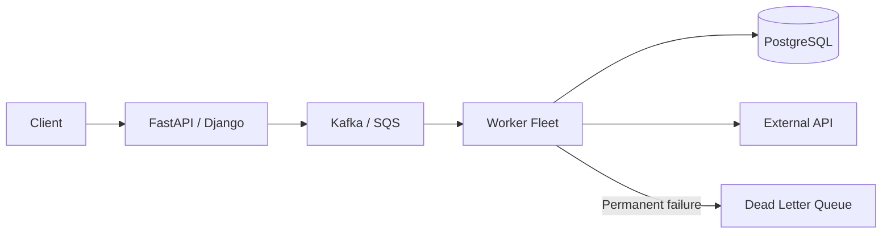
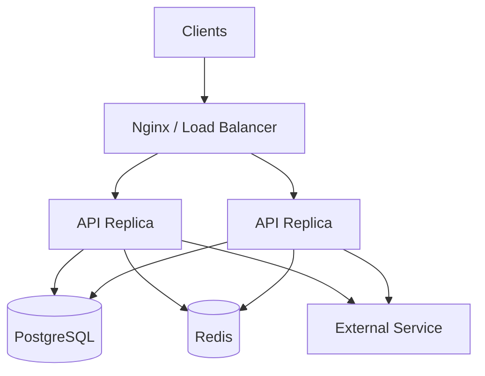

# README

## Overview

Concurrency and Parallelism covers how Python applications execute multiple operations concurrently, how work can execute in parallel, and how these mechanisms behave inside production backend systems.

The section progresses from Python's execution model to threads, processes, asyncio, synchronization, task coordination, and distributed backend concurrency.

The central distinction is:

```text
Concurrency
    Multiple operations make progress during overlapping periods

Parallelism
    Multiple operations execute simultaneously
```

Python provides several mechanisms because backend workloads have different characteristics:

```text
                         Concurrency & Parallelism
                                  │
             ┌────────────────────┼────────────────────┐
             ▼                    ▼                    ▼
          asyncio              Threads             Processes
             │                    │                    │
        Async I/O            Blocking I/O         CPU work
             │                    │                    │
             └────────────────────┼────────────────────┘
                                  ▼
                         Distributed Workers
                                  │
                         Kafka / SQS / Celery
```

The engineering objective is not to maximize concurrency. It is to establish a controlled execution model that improves throughput and latency while preserving correctness and protecting system resources.

---

## Section Structure

```text
08- Concurrency and Parallelism/
│
├── 01- Concurrency Fundamentals.md
├── 02- Processes vs Threads.md
├── 03- GIL.md
├── 04- Threading.md
├── 05- ThreadPool Executor.md
├── 06- Multiprocessing.md
├── 07- ProcessPool Executor.md
├── 08- Asyncio.md
├── 09- Async and Await.md
├── 10- Event Loop.md
├── 11- Asyncio Tasks.md
├── 12- Async HTTP.md
├── 13- Queues and Synchronization.md
├── 14- Locks Semaphores Events.md
├── 15- Race Conditions.md
├── 16- Deadlocks.md
├── 17- Producer Consumer.md
├── 18- Backend Concurrency.md
└── README.md
```

---

## Learning Progression

The material is intentionally ordered from execution fundamentals toward production architecture.

```text
Execution Model
      ↓
Processes vs Threads
      ↓
GIL
      ↓
Threading
      ↓
Thread Pools
      ↓
Multiprocessing
      ↓
Process Pools
      ↓
Asyncio
      ↓
Async / Await
      ↓
Event Loop
      ↓
Asyncio Tasks
      ↓
Async HTTP
      ↓
Queues & Synchronization
      ↓
Locks / Semaphores / Events
      ↓
Race Conditions
      ↓
Deadlocks
      ↓
Producer / Consumer
      ↓
Backend Concurrency
```

This progression is important because production concurrency problems are usually combinations of several lower-level concepts rather than isolated framework features.

---

## Concurrency Fundamentals

**File:** `01- Concurrency Fundamentals.md`

Establishes the conceptual foundation for Python concurrency.

Key topics:

- concurrency vs parallelism;
- I/O-bound vs CPU-bound workloads;
- synchronous execution;
- cooperative concurrency;
- threads;
- processes;
- asyncio;
- synchronization;
- queues;
- backpressure;
- cancellation;
- timeouts;
- deadlocks.

The key question introduced here is:

> What resource is the application waiting for, and which execution model handles that waiting efficiently?

---

## Processes vs Threads

**File:** `02- Processes vs Threads.md`

Explains the runtime and operational differences between processes and threads.

Key topics:

- process isolation;
- shared thread memory;
- memory boundaries;
- startup overhead;
- context switching;
- I/O-bound workloads;
- CPU-bound workloads;
- GIL implications;
- process communication;
- serialization;
- failure isolation.

The distinction becomes important when deciding whether work should share memory or execute in isolated interpreters.

---

## GIL

**File:** `03- GIL.md`

Explains the Global Interpreter Lock in CPython and its practical impact on backend concurrency.

Key topics:

- why the GIL exists;
- Python bytecode execution;
- thread behavior;
- I/O operations;
- CPU-bound work;
- native extensions;
- multiprocessing;
- asyncio;
- thread safety;
- free-threaded CPython;
- production deployment implications.

A critical distinction is:

```text
GIL
≠
application-level lock
≠
database transaction
≠
distributed lock
```

Understanding this prevents many incorrect assumptions about Python concurrency.

---

## Threading

**File:** `04- Threading.md`

Covers Python's thread-based concurrency model.

Key topics:

- `threading.Thread`;
- thread lifecycle;
- thread safety;
- shared mutable state;
- locks;
- reentrant locks;
- semaphores;
- events;
- conditions;
- queues;
- thread-local state;
- cancellation;
- graceful shutdown.

Threads are especially useful when integrating blocking I/O or synchronous libraries into concurrent applications.

---

## ThreadPool Executor

**File:** `05- ThreadPool Executor.md`

Focuses on `concurrent.futures.ThreadPoolExecutor`.

Key topics:

- bounded worker pools;
- `submit()`;
- futures;
- `map()`;
- `as_completed()`;
- `wait()`;
- exception propagation;
- timeouts;
- cancellation;
- backpressure;
- thread-local state;
- async integration;
- connection-pool interactions.

The primary production principle is to use bounded thread capacity rather than creating uncontrolled threads.

---

## Multiprocessing

**File:** `06- Multiprocessing.md`

Explains process-based parallelism.

Key topics:

- `multiprocessing`;
- process isolation;
- CPU-bound workloads;
- GIL avoidance through separate processes;
- serialization;
- inter-process communication;
- start methods;
- `spawn`;
- `fork`;
- `forkserver`;
- copy-on-write;
- shared memory;
- process failure;
- Kubernetes and container deployment.

Processes provide independent Python interpreters and can execute Python workloads across multiple CPU cores.

---

## ProcessPool Executor

**File:** `07- ProcessPool Executor.md`

Focuses on `concurrent.futures.ProcessPoolExecutor`.

Key topics:

- process pools;
- futures;
- task submission;
- task mapping;
- serialization boundaries;
- picklability;
- task granularity;
- chunksize;
- load balancing;
- process initialization;
- process failure;
- CPU and memory sizing.

A process pool is particularly useful when CPU-heavy work can be partitioned into independent tasks.

---

## Asyncio

**File:** `08- Asyncio.md`

Introduces Python's asynchronous concurrency framework.

Key topics:

- event loops;
- coroutines;
- `async def`;
- `await`;
- tasks;
- futures;
- `create_task()`;
- `gather()`;
- `TaskGroup`;
- async I/O;
- queues;
- semaphores;
- cancellation;
- timeouts;
- backpressure.

The fundamental model is:

```text
Task A
  ↓
await I/O
  ↓
Event loop executes Task B
  ↓
await I/O
  ↓
Event loop executes Task C
  ↓
Task A becomes ready
```

Asyncio is particularly effective for services handling many concurrent I/O operations.

---

## Async and Await

**File:** `09- Async and Await.md`

Explains the semantics of asynchronous functions and awaitables.

Key topics:

- coroutine functions;
- coroutine objects;
- awaitables;
- `await`;
- task scheduling;
- sequential vs concurrent awaits;
- `create_task()`;
- `gather()`;
- `TaskGroup`;
- cancellation;
- blocking calls;
- async context managers;
- async iterators;
- async API design.

The most important rule is:

> `async def` does not make blocking synchronous code asynchronous.

An async function can still block the event-loop thread if it executes blocking operations.

---

## Event Loop

**File:** `10- Event Loop.md`

Explains the execution engine behind asyncio.

Key topics:

- event-loop lifecycle;
- scheduling;
- I/O readiness;
- callbacks;
- timers;
- cooperative scheduling;
- OS I/O multiplexing;
- event-loop starvation;
- cancellation;
- multiple event loops;
- FastAPI;
- ASGI;
- debugging;
- observability.

Conceptually:

```text
                 Event Loop
                     │
        ┌────────────┼────────────┐
        ▼            ▼            ▼
      Task A       Task B       Task C
        │            │            │
      HTTP          DB          Redis
        │            │            │
        └────────────┼────────────┘
                     ▼
              I/O readiness
```

Keeping the event loop responsive is a critical production requirement.

---

## Asyncio Tasks

**File:** `11- Asyncio Tasks.md`

Focuses on concurrent units of asyncio execution.

Key topics:

- coroutine vs task;
- task lifecycle;
- `asyncio.create_task()`;
- task ownership;
- `TaskGroup`;
- `gather()`;
- `wait()`;
- `as_completed()`;
- cancellation;
- shielding;
- task naming;
- context variables;
- task leaks;
- structured concurrency.

Task ownership is particularly important for backend applications because detached tasks can outlive their intended request or service lifecycle.

---

## Async HTTP

**File:** `12- Async HTTP.md`

Covers asynchronous HTTP communication between backend services.

Key topics:

- `httpx.AsyncClient`;
- connection pooling;
- keep-alive;
- HTTP/1.1;
- HTTP/2;
- DNS;
- TCP;
- TLS;
- timeouts;
- retries;
- exponential backoff;
- jitter;
- idempotency;
- concurrent fan-out;
- bounded concurrency;
- streaming;
- WebSockets;
- SSRF protection.

A production async HTTP client should normally be reused and explicitly configured with connection limits and timeouts.

---

## Queues and Synchronization

**File:** `13- Queues and Synchronization.md`

Introduces mechanisms for coordinating concurrent work.

Key topics:

- producer-consumer;
- `asyncio.Queue`;
- bounded queues;
- backpressure;
- locks;
- semaphores;
- events;
- conditions;
- worker pools;
- graceful shutdown;
- durable queues;
- dead-letter queues;
- local vs distributed synchronization.

The distinction between local and distributed coordination is fundamental:

```text
asyncio.Queue
    ↓
Process-local coordination

Kafka / SQS
    ↓
Distributed durable work
```

---

## Locks, Semaphores, and Events

**File:** `14- Locks Semaphores Events.md`

Explains Python synchronization primitives and their appropriate scope.

Key topics:

- `asyncio.Lock`;
- `threading.Lock`;
- `RLock`;
- semaphores;
- bounded semaphores;
- events;
- conditions;
- critical sections;
- lock ordering;
- contention;
- starvation;
- deadlocks;
- distributed synchronization.

The scope of the synchronization mechanism should match the scope of the resource being protected.

```text
Same event loop
    → asyncio synchronization

Same process
    → thread/process synchronization

Multiple pods
    → database / broker / distributed mechanism
```

---

## Race Conditions

**File:** `15- Race Conditions.md`

Explains correctness problems caused by concurrent access to shared state.

Key topics:

- race conditions;
- data races;
- check-then-act;
- lost updates;
- TOCTOU;
- asyncio races;
- thread races;
- process races;
- distributed races;
- database transactions;
- optimistic concurrency;
- pessimistic concurrency;
- atomic SQL;
- idempotency.

The GIL does not make business operations atomic.

For critical invariants, correctness should be enforced at the appropriate ownership boundary, often PostgreSQL.

---

## Deadlocks

**File:** `16- Deadlocks.md`

Explains situations where concurrent operations wait indefinitely for resources held by one another.

The classical conditions are:

```text
Mutual exclusion
Hold and wait
No preemption
Circular wait
```

The document covers deadlocks involving:

- threads;
- asyncio;
- semaphores;
- worker pools;
- connection pools;
- PostgreSQL;
- transactions;
- distributed service dependencies.

Important prevention techniques include:

- consistent lock ordering;
- short critical sections;
- bounded resource ownership;
- timeouts;
- avoiding unnecessary nested resource acquisition;
- retrying safe transactions.

---

## Producer Consumer

**File:** `17- Producer Consumer.md`

Explains the producer-consumer pattern for separating work creation from processing.

Core model:

```text
Producer
   ↓
Queue
   ↓
Consumer
```

Key topics:

- bounded queues;
- backpressure;
- worker pools;
- task completion;
- retries;
- poison messages;
- dead-letter queues;
- ordering;
- idempotency;
- Kafka;
- SQS;
- Celery;
- graceful shutdown;
- queue monitoring.

A queue absorbs temporary differences between production and processing rates. It does not solve a permanent capacity mismatch.

---

## Backend Concurrency

**File:** `18- Backend Concurrency.md`

Brings the section's concepts together into production backend architecture.

Key topics:

- concurrent HTTP requests;
- asyncio;
- threads;
- processes;
- database concurrency;
- connection pools;
- HTTP connection pools;
- fan-out;
- rate limiting;
- backpressure;
- load shedding;
- bulkheads;
- circuit breakers;
- FastAPI;
- Django;
- gRPC;
- Kafka;
- Celery;
- Kubernetes;
- observability;
- graceful shutdown;
- capacity planning.

The central production model is:

```text
Client Traffic
      ↓
API Concurrency
      ↓
Application Concurrency
      ↓
Connection Pools
      ↓
Downstream Services
      ↓
Database / External APIs
```

Concurrency must be designed across the complete dependency graph.

---

## Execution Model Comparison

| Mechanism | Primary use | Memory model | CPU parallelism | Typical backend use |
|---|---|---|---|---|
| `asyncio` | Async I/O | Shared process memory | No by itself | High-concurrency APIs |
| Threads | Blocking I/O | Shared process memory | Generally no for Python bytecode under traditional GIL-enabled CPython | Legacy/synchronous SDKs |
| Processes | CPU-heavy work | Isolated memory | Yes | Computation, transformation |
| Thread pool | Bounded blocking I/O | Shared process memory | Generally no for Python bytecode under traditional GIL-enabled CPython | Blocking dependency calls |
| Process pool | Bounded CPU work | Isolated memory | Yes | CPU-heavy jobs |
| `asyncio.Queue` | Local work coordination | Process-local | No | Producer-consumer workflows |
| Kafka | Distributed event processing | Durable distributed storage | Through consumer parallelism | Event streaming |
| SQS | Durable work queue | Durable distributed storage | Through worker scaling | Background jobs |
| Celery | Distributed task execution | Broker-dependent | Through worker processes/instances | Background tasks |

---

## Synchronization Comparison

| Mechanism | Scope | Primary purpose |
|---|---|---|
| `asyncio.Lock` | Event loop | Protect async critical sections |
| `threading.Lock` | Process | Protect shared thread state |
| `threading.RLock` | Process | Reentrant thread synchronization |
| `asyncio.Semaphore` | Event loop | Bound concurrent operations |
| `threading.Semaphore` | Process | Bound thread concurrency |
| `asyncio.Event` | Event loop | Signal state changes |
| `asyncio.Queue` | Event loop | Coordinate producer-consumer work |
| PostgreSQL transaction | Database | Maintain durable state invariants |
| PostgreSQL row lock | Database | Coordinate concurrent row access |
| Kafka partition | Distributed | Ordered partitioned processing |
| Distributed lock | Distributed | Coordinate shared ownership where necessary |

---

## Queue and Worker Architecture

A typical production background workflow can look like:



The important boundaries are:

```text
API
  → accepts and validates work

Queue
  → buffers and durably transports work

Workers
  → execute work

Database
  → stores durable business state

DLQ
  → isolates permanently failing work
```

---

## Async Backend Architecture

For an I/O-heavy API:



Each API process may contain an event loop and its own connection pools.

Therefore the aggregate concurrency of the deployment is greater than the concurrency configured in any single process.

---

## Capacity Planning

Concurrency configuration must account for the complete deployment topology.

For example:

```text
Kubernetes replicas = 8
Processes per replica = 4
Concurrency per process = 100
```

Potential application concurrency:

```text
8 × 4 × 100 = 3,200
```

If each request creates two downstream operations:

```text
3,200 × 2 = 6,400
```

potential concurrent downstream operations.

Likewise:

```text
8 replicas
×
20 DB connections per replica
=
160 potential database connections
```

These calculations demonstrate why application concurrency, connection pools, deployment topology, and downstream capacity must be considered together.

---

## Concurrency and Backpressure

A production system should establish explicit capacity boundaries:

```text
Incoming traffic
      ↓
Admission control
      ↓
Application concurrency
      ↓
Queue
      ↓
Worker concurrency
      ↓
Connection pool
      ↓
Database / external dependency
```

Useful controls include:

- request rate limits;
- concurrency limits;
- bounded queues;
- semaphores;
- connection pools;
- worker limits;
- circuit breakers;
- load shedding.

The goal is controlled degradation rather than uncontrolled resource exhaustion.

---

## Reliability Model

Concurrent systems should assume that:

- tasks can fail;
- workers can terminate;
- requests can be cancelled;
- clients can disconnect;
- messages can be delivered more than once;
- dependencies can become slow;
- connections can be exhausted;
- processes can restart;
- Kubernetes pods can be terminated.

Production designs should therefore incorporate:

- idempotency;
- explicit timeouts;
- bounded retries;
- exponential backoff;
- jitter;
- graceful shutdown;
- durable messaging;
- transactional state changes;
- dead-letter handling where appropriate.

---

## Observability

Concurrency requires visibility into execution and resource pressure.

Important metrics include:

### Application

- request rate;
- active requests;
- p50 latency;
- p95 latency;
- p99 latency;
- timeout rate;
- error rate.

### Async Runtime

- active task count;
- task duration;
- cancellation rate;
- event-loop latency;
- blocked-event-loop detection.

### Threads and Processes

- thread count;
- process count;
- worker utilization;
- process restarts;
- memory usage.

### Databases

- connection-pool utilization;
- connection wait time;
- query latency;
- transaction duration;
- lock waits.

### Queues

- queue depth;
- enqueue rate;
- dequeue rate;
- oldest message age;
- retry count;
- DLQ count;
- Kafka consumer lag.

---

## Security Considerations

Concurrency controls are also resource-protection mechanisms.

Potential abuse includes:

- connection exhaustion;
- queue flooding;
- expensive endpoint invocation;
- large payloads;
- CPU-intensive requests;
- retry amplification;
- excessive background jobs.

Protect the system with:

- authentication;
- authorization;
- rate limiting;
- concurrency limits;
- request-size limits;
- quotas;
- timeouts;
- resource isolation.

Untrusted input should never be allowed to create unlimited threads, tasks, processes, or expensive jobs.

---

## High Availability

Concurrency mechanisms should not accidentally introduce single points of failure.

A resilient architecture generally uses:

```text
Multiple API replicas
        +
Multiple worker instances
        +
Durable shared state
        +
Recoverable queues
        +
Redundant dependencies
```

Avoid treating local memory as durable system state.

For example:

```text
In-process background task
        ↓
Process crashes
        ↓
Task disappears
```

For critical work:

```text
Durable queue
        ↓
Worker crashes
        ↓
Work can be retried
```

---

## Disaster Recovery

Concurrency design should define recovery semantics.

Questions to answer include:

- Can queued work be replayed?
- How long are messages retained?
- What happens to in-flight work?
- Can duplicate processing be tolerated?
- Is the DLQ retained?
- Can workers recover after a region failure?
- Where is durable business state stored?
- Which operations must be reconciled after recovery?

For critical systems, these decisions should be part of the architecture rather than left to individual worker implementations.

---

## Testing Strategy

Concurrency requires testing beyond normal unit-test behavior.

Important test categories include:

- unit tests for synchronization logic;
- asyncio task tests;
- thread-safety tests;
- process-pool tests;
- race-condition tests;
- deadlock tests;
- queue backpressure tests;
- retry tests;
- cancellation tests;
- graceful-shutdown tests;
- database concurrency tests;
- load tests;
- stress tests;
- dependency-failure tests.

Concurrency bugs often appear only under contention, so realistic load and failure testing are essential.

---

## Common Mistakes

### Assuming More Concurrency Is Always Better

Additional concurrency can increase contention, memory usage, connection pressure, and tail latency.

### Blocking the Event Loop

A single synchronous blocking operation can delay unrelated async tasks.

### Ignoring Downstream Limits

Application concurrency may exceed database or external-service capacity.

### Treating the GIL as a Synchronization Primitive

The GIL does not provide business-level atomicity.

### Using Local Locks for Distributed Problems

A Python lock cannot coordinate multiple processes or Kubernetes pods.

### Using In-Memory Queues for Critical Work

Process termination can destroy queued work.

### Retrying Without Limits

Retries can turn dependency failures into cascading overload.

### Ignoring Tail Latency

Average latency can remain healthy while p99 latency becomes unacceptable.

### Creating Unlimited Tasks

Large numbers of asyncio tasks can consume substantial memory and scheduling resources.

---

## Senior-Level Design Framework

When reviewing a concurrent backend, evaluate the system in this order:

```text
Workload
   ↓
CPU vs I/O
   ↓
Execution model
   ↓
Concurrency budget
   ↓
Resource limits
   ↓
Synchronization
   ↓
Failure semantics
   ↓
Durability
   ↓
Scaling
   ↓
Observability
```

Ask:

1. Is the workload CPU-bound, I/O-bound, or mixed?
2. Which operations can execute independently?
3. Where does work spend time waiting?
4. Which concurrency model fits that waiting?
5. What is the maximum safe concurrency?
6. Which resource saturates first?
7. What happens when capacity is exhausted?
8. What happens when a worker fails?
9. Can an operation execute more than once?
10. Where is correctness enforced?
11. What happens during cancellation?
12. What happens during deployment shutdown?
13. How does concurrency multiply across processes and replicas?
14. What happens when a dependency becomes slow?
15. How will operators detect saturation?

These questions are more important than knowing the syntax of any individual concurrency API.

---

## Recommended Engineering Principles

### Bound Expensive Resources

Control:

- tasks;
- threads;
- processes;
- queue depth;
- database connections;
- HTTP connections;
- external API concurrency;
- request sizes.

### Match the Execution Model to the Workload

```text
Async I/O
    → asyncio

Blocking I/O
    → threads / thread pools

CPU-heavy Python
    → processes / process pools

Durable background work
    → Kafka / SQS / Celery
```

### Protect Downstream Systems

Concurrency should never be increased without considering the capacity of dependencies.

### Enforce Correctness at the Right Boundary

Use local synchronization for local state and database or distributed mechanisms for shared state.

### Assume Duplicate Execution

Retries, worker failures, and acknowledgement boundaries can produce duplicate work.

### Prefer Explicit Time Budgets

Every network and database operation should have a defined timeout appropriate to the request or job.

### Treat Cancellation as Normal

Graceful shutdown, client disconnects, and task cancellation are normal lifecycle events in concurrent applications.

### Measure Under Realistic Load

Concurrency settings should be validated through load testing and production telemetry rather than intuition.

## Key Takeaways

- **Concurrency and parallelism solve different problems:** use asyncio and threads primarily for overlapping I/O, processes for CPU parallelism, and distributed workers for durable background execution.
- **Concurrency must be bounded:** worker counts, tasks, queues, database pools, HTTP connections, and external-service limits collectively define safe system capacity.
- **Correctness requires explicit synchronization boundaries:** the GIL does not prevent race conditions, local locks do not coordinate pods, and durable business invariants generally belong in transactional systems.
- **Production concurrency requires failure and overload handling:** timeouts, cancellation, backpressure, bounded retries, idempotency, graceful shutdown, and load shedding prevent local failures from becoming system-wide failures.
- **Concurrency is a system-level concern:** deployment topology, downstream capacity, observability, high availability, cost, and disaster recovery must be considered together rather than tuned independently.