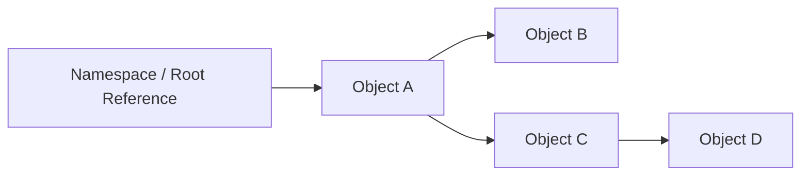

# 02- Object References

## Overview

Python variables do not directly contain objects. A variable name is a reference to an object managed by the Python runtime.

This distinction is fundamental to understanding:

- assignment;
- aliasing;
- mutation;
- copying;
- function arguments;
- return values;
- object identity;
- memory usage;
- garbage collection;
- reference counting;
- shallow and deep copies;
- shared state in concurrent applications.

The core model is:

```text
Variable name
     │
     │ references
     ▼
   Object
```

For example:

```python
users = ["alice", "bob"]
```

Conceptually:

```text
users ───────────────► list object
                       ├── "alice"
                       └── "bob"
```

The name `users` is not the list itself. It is bound to a list object.

This becomes especially important in backend applications where objects may be shared between:

- functions;
- request handlers;
- caches;
- worker tasks;
- threads;
- processes;
- database layers;
- application state.

Understanding references prevents subtle bugs involving unexpected mutation, shared state, memory retention, and incorrect assumptions about copying.

---

## Names and Objects

Python execution can be understood as a relationship between **names**, **objects**, and **bindings**.

```python
name = "alice"
```

The runtime creates or reuses a string object and binds the name `name` to it.

```text
Namespace

name ─────────► "alice"
```

Rebinding the name does not mutate the original object:

```python
name = "alice"
name = "bob"
```

Conceptually:

```text
Before:

name ─────► "alice"

After:

name ─────► "bob"
             ▲
             │
        "alice" may become
        unreachable
```

The important operation is **rebinding**, not mutation.

---

## Binding

A Python assignment usually creates or changes a binding.

```python
x = 100
```

The name `x` is bound to an integer object.

Another assignment:

```python
x = 200
```

rebinds `x`.

It does not modify the integer `100`.

This distinction becomes critical when comparing immutable and mutable objects.

---

## Object Identity

Every Python object has an identity during its lifetime.

The built-in `id()` function exposes an identity value:

```python
user = {"name": "alice"}

print(id(user))
```

The identity can be compared with `is`:

```python
a = []
b = a

assert a is b
```

Both names reference the same object.

```text
a ─────┐
       ├────► list object
b ─────┘
```

---

## Identity vs Equality

Identity and equality answer different questions.

| Operation | Question |
|---|---|
| `is` | Are these references to the same object? |
| `==` | Do these objects compare as equal? |

Example:

```python
a = [1, 2, 3]
b = [1, 2, 3]

assert a == b
assert a is not b
```

The lists contain equivalent values but are different objects.

This distinction is important when reasoning about caches, object ownership, sentinels, and mutable state.

---

## Use `is` for Identity

Use `is` when identity itself matters.

The canonical example is `None`:

```python
if value is None:
    ...
```

Do not write:

```python
if value == None:
    ...
```

`None` is a singleton object, and identity comparison communicates the intended semantics.

For ordinary value comparisons, use `==`.

---

## Aliasing

Aliasing occurs when multiple names reference the same object.

```python
users = []

active_users = users

active_users.append("alice")
```

Now:

```python
print(users)
```

produces:

```text
["alice"]
```

Both names refer to the same list.

```text
users ───────────────┐
                     ▼
                  list []
                     ▲
active_users ────────┘
```

Aliasing is not inherently bad. It becomes dangerous when ownership and mutation are unclear.

---

## Why Aliasing Matters

Consider a backend service:

```python
request_data = {
    "roles": ["reader"],
}

service_data = request_data

service_data["roles"].append("admin")
```

The original `request_data` has also changed.

If the original object is reused elsewhere, the mutation can create unexpected behavior.

Potential consequences include:

- corrupted application state;
- incorrect authorization decisions;
- test contamination;
- cache inconsistencies;
- race conditions;
- difficult debugging.

---

## Mutable vs Immutable Objects

The most important reference-related distinction is mutability.

### Common immutable objects

Examples include:

- `int`;
- `float`;
- `bool`;
- `str`;
- `bytes`;
- `tuple` when its contents are themselves immutable;
- `frozenset`.

### Common mutable objects

Examples include:

- `list`;
- `dict`;
- `set`;
- most user-defined class instances.

```text
Immutable object
    ↓
Cannot change its internal value
    ↓
Rebinding creates a different binding

Mutable object
    ↓
Object can change in place
    ↓
All aliases observe the mutation
```

---

## Immutable Objects

Consider:

```python
x = 10
y = x

x += 1
```

The integer object `10` is not modified.

Conceptually:

```text
Before:

x ───┐
     ├──► 10
y ───┘

After:

y ─────► 10

x ─────► 11
```

`x += 1` results in a new integer value being bound to `x`.

This is one reason immutable values are easier to reason about when shared.

---

## Mutable Objects

With a list:

```python
x = [1, 2]
y = x

x.append(3)
```

the list itself is modified:

```text
x ───┐
     ├──► [1, 2, 3]
y ───┘
```

Therefore:

```python
assert y == [1, 2, 3]
```

This is aliasing through shared mutable state.

---

## Assignment Does Not Copy

This is a common mistake:

```python
original = [1, 2, 3]
copy = original
```

`copy` is not a copy.

It is another reference.

```text
original ──┐
           ├──► [1, 2, 3]
copy ──────┘
```

To create a new list:

```python
copy = original.copy()
```

Now:

```text
original ─────► [1, 2, 3]

copy ─────────► [1, 2, 3]
```

The outer list objects are different.

---

## Shallow Copy

A shallow copy creates a new outer container while preserving references to nested objects.

```python
original = {
    "roles": ["reader"],
    "active": True,
}

copy = original.copy()
```

Now:

```text
original ───────► dict
                    │
                    └──► roles list

copy ────────────► dict
                    │
                    └──► same roles list
```

Therefore:

```python
copy["roles"].append("writer")

assert original["roles"] == ["reader", "writer"]
```

The dictionaries are different, but the nested list is shared.

---

## Deep Copy

`copy.deepcopy()` recursively copies supported nested objects.

```python
from copy import deepcopy

original = {
    "roles": ["reader"],
    "metadata": {
        "source": "api",
    },
}

copy = deepcopy(original)

copy["roles"].append("writer")
copy["metadata"]["source"] = "worker"
```

The original nested structures remain independent.

```text
original
  ├── dict
  ├── roles ───► list A
  └── metadata ─► dict A

copy
  ├── dict
  ├── roles ───► list B
  └── metadata ─► dict B
```

Deep copying can be expensive and should not be treated as a default solution for state management.

---

## Copying Comparison

| Operation | New outer object | Nested objects copied |
|---|---:|---:|
| Assignment `b = a` | No | No |
| `list(a)` | Yes | No |
| `dict(a)` | Yes | No |
| `a.copy()` | Yes | No |
| `copy.copy(a)` | Usually yes | No |
| `copy.deepcopy(a)` | Yes | Recursively where supported |

The correct choice depends on the ownership boundary and object graph.

---

## Function Arguments

Python uses object references when passing arguments.

Consider:

```python
def add_role(user: dict) -> None:
    user["roles"].append("admin")
```

Calling:

```python
user = {
    "roles": ["reader"],
}

add_role(user)
```

passes a reference to the same dictionary.

```text
caller
  │
user ───────────────► dict
                         ▲
                         │
function                │
user ───────────────────┘
```

The function can mutate the shared object.

---

## Argument Rebinding

Rebinding a parameter does not rebind the caller's variable.

```python
def replace_user(user: dict) -> None:
    user = {"name": "bob"}
```

The caller's variable remains unchanged:

```python
user = {"name": "alice"}

replace_user(user)

assert user["name"] == "alice"
```

The parameter was simply rebound locally.

```text
Caller:

user ───────► dict A

Inside function:

user ───────► dict B
```

The caller's `user` still points to dict A.

---

## Mutation vs Rebinding

This distinction is central to Python semantics.

```python
def update(items: list[int]) -> None:
    items.append(4)
```

This mutates the shared list.

By contrast:

```python
def replace(items: list[int]) -> None:
    items = [4]
```

This only rebinds the local parameter.

| Operation | Caller object affected? |
|---|---:|
| `items.append(...)` | Yes |
| `items[0] = ...` | Yes |
| `items.clear()` | Yes |
| `items = [...]` | No |
| `items = None` | No |

---

## Default Mutable Arguments

Never use a mutable object as a default argument when the intention is to create fresh state per call.

Avoid:

```python
def create_user(tags: list[str] = []) -> dict:
    tags.append("default")
    return {"tags": tags}
```

The default list is created once when the function is defined and can be reused across calls.

Use:

```python
def create_user(tags: list[str] | None = None) -> dict:
    if tags is None:
        tags = ["default"]

    return {"tags": tags}
```

The important principle is:

> Default argument expressions are evaluated once when the function definition executes.

---

## Function Default Argument References

Default arguments can intentionally capture an object:

```python
DEFAULT_TIMEOUT = 5

def request(timeout: int = DEFAULT_TIMEOUT) -> int:
    return timeout
```

The default value is evaluated at function definition time.

This is usually fine for immutable values.

It becomes problematic when the default object is mutable or when developers expect the default to be recalculated for each call.

---

## Local and Global References

Names exist in namespaces.

Common namespaces include:

```text
Local
Enclosing
Global
Builtins
```

Python's LEGB lookup rule determines where a name is resolved:

```text
Local
  ↓
Enclosing
  ↓
Global
  ↓
Builtins
```

The referenced object may live independently of the namespace that currently exposes it.

---

## Reference Counts in CPython

CPython primarily uses reference counting for immediate object lifetime management.

Conceptually:

```text
name ───► object

reference count = 1
```

Adding another reference:

```python
a = []
b = a
```

increases the number of references to the object.

Removing references can eventually make the object unreachable.

```text
a ───┐
     ├──► object
b ───┘

delete a

b ─────► object

delete b

object becomes unreachable
```

CPython can usually reclaim such an object immediately through reference counting.

---

## Garbage Collection

Reference counting alone cannot reclaim reference cycles.

Example:

```python
a = []
b = []

a.append(b)
b.append(a)
```

Conceptually:

```text
a ───► list A ───► list B
       ▲            │
       └────────────┘
```

Even after external references disappear, the objects can still reference each other.

Python's cyclic garbage collector can detect and collect suitable unreachable cycles.

---

## Reference Counting vs Garbage Collection

These mechanisms solve related but different problems.

| Mechanism | Purpose |
|---|---|
| Reference counting | Immediate reclamation when reference count reaches zero in CPython |
| Cyclic garbage collector | Detect unreachable reference cycles |
| `weakref` | Hold non-owning references that do not keep objects alive |

Do not assume every Python implementation uses the same memory-management internals as CPython.

Reference counting is a CPython implementation detail, not a universal Python language guarantee.

---

## Object Lifetime

An object remains alive while it is reachable through the runtime's object graph.

Conceptually:

```text
Root references
     ↓
Object A
     ↓
Object B
     ↓
Object C
```

If no relevant references can reach an object, it becomes eligible for reclamation.

In CPython, an object with zero references can usually be deallocated immediately, subject to implementation details and special cases.

---

## `del` Deletes a Binding

`del` does not mean "destroy this object immediately."

```python
user = {"name": "alice"}

del user
```

This removes the name binding.

If another reference exists:

```python
user = {"name": "alice"}
backup = user

del user
```

the dictionary remains alive:

```text
backup ─────► dict
```

`del` affects references, not object identity directly.

---

## Reference Graph

A useful senior-level mental model is to think of Python memory as an object graph.



Removing the root reference to `A` may make the entire reachable subgraph eligible for collection if no other references exist.

This model is useful when diagnosing memory retention.

---

## Memory Retention

A memory leak in Python often means objects remain reachable longer than intended rather than that the runtime cannot ever reclaim them.

Common causes include:

- global collections;
- caches without eviction;
- long-lived task references;
- callbacks;
- closures;
- module-level state;
- queues;
- ORM identity maps;
- request data accidentally retained;
- logging structures;
- reference cycles involving objects with special cleanup behavior.

A useful diagnostic question is:

> What object is still holding a reference to this memory?

---

## Closures and References

Closures can retain objects.

```python
def create_handler(config: dict):
    def handler() -> str:
        return config["name"]

    return handler
```

The returned function retains access to `config`.

```text
handler
   │
   └── closure
          │
          └── config
```

If the handler remains alive for the lifetime of a service, the captured object may also remain alive.

This is useful when intentional, but dangerous when large objects are captured accidentally.

---

## Caches and Object References

An application cache can keep objects alive simply by retaining references.

```python
cache: dict[str, object] = {}

cache["large-result"] = expensive_result
```

As long as the cache references `expensive_result`, the object remains reachable.

Production caches should therefore have explicit policies:

- maximum size;
- TTL;
- eviction;
- ownership;
- serialization boundaries.

For distributed caches such as Redis, the memory belongs to Redis rather than the Python process, but Python objects still consume memory while being materialized.

---

## Weak References

A weak reference does not keep the referenced object alive.

Python provides `weakref` for use cases where an object should not be retained solely because another structure references it.

```python
import weakref


class Connection:
    pass


connection = Connection()
reference = weakref.ref(connection)

assert reference() is connection

del connection

assert reference() is None
```

Weak references are useful for certain caches, registries, and observer structures.

They are not a general-purpose replacement for normal references.

---

## Ownership

Reference semantics become easier to reason about when ownership is explicit.

For example:

```text
Request handler
    owns request-local state

Service layer
    owns business operation state

Repository
    owns database interaction

Cache
    owns cached representation
```

Avoid unclear mutation across layers.

A strong production pattern is to make ownership and mutation boundaries explicit:

```text
Input
  ↓
Validate
  ↓
Transform
  ↓
Persist
  ↓
Return immutable/value-oriented representation
```

This reduces accidental aliasing.

---

## Defensive Copying

Sometimes a function should prevent callers from mutating internal state.

Instead of exposing a mutable internal list:

```python
class UserService:
    def __init__(self) -> None:
        self._roles = ["reader"]

    def roles(self) -> list[str]:
        return self._roles
```

callers can mutate internal state:

```python
service.roles().append("admin")
```

A defensive copy can isolate ownership:

```python
class UserService:
    def __init__(self) -> None:
        self._roles = ["reader"]

    def roles(self) -> list[str]:
        return self._roles.copy()
```

For read-only APIs, an immutable representation may be preferable.

---

## Immutable Interfaces

If callers should not mutate returned data, consider immutable types.

```python
class User:
    def __init__(self, roles: tuple[str, ...]) -> None:
        self.roles = roles
```

Then:

```python
user = User(("reader", "writer"))
```

The tuple cannot be modified in place.

However, immutability is only as deep as the contained objects:

```python
tuple containing mutable lists
```

can still expose mutable nested state.

---

## Object References and Dataclasses

Dataclasses do not change Python's reference semantics.

```python
from dataclasses import dataclass


@dataclass
class User:
    roles: list[str]
```

If two objects share the same list:

```python
roles = ["reader"]

a = User(roles)
b = User(roles)
```

then:

```python
a.roles.append("writer")
```

also affects:

```python
b.roles
```

Dataclasses provide convenient data modeling, not automatic deep copying or ownership isolation.

---

## Frozen Dataclasses

A frozen dataclass prevents normal attribute reassignment:

```python
from dataclasses import dataclass


@dataclass(frozen=True)
class User:
    name: str
```

This prevents:

```python
user.name = "bob"
```

but does not make nested mutable objects immutable.

```python
from dataclasses import dataclass


@dataclass(frozen=True)
class User:
    roles: list[str]
```

The `roles` list can still be mutated.

```python
user.roles.append("admin")
```

Therefore:

```text
frozen object
    ≠
deeply immutable object
```

---

## Object References and Concurrency

Shared references become especially important in concurrent applications.

Consider:

```text
Thread A ───┐
            ├──► shared mutable object
Thread B ───┘
```

Both execution contexts can modify the same object.

This creates potential race conditions.

Asyncio has the same conceptual problem:

```text
Task A ─────┐
            ├──► shared mutable state
Task B ─────┘
```

The appropriate response may be:

- avoid shared mutable state;
- use immutable values;
- use local ownership;
- synchronize access;
- move correctness to PostgreSQL;
- use queues for ownership transfer.

---

## Object References Across Processes

Processes generally have separate memory spaces.

```text
Process A
    └── object graph A

Process B
    └── object graph B
```

A normal Python object reference cannot simply be shared between processes.

Objects may instead be:

- serialized;
- copied;
- placed in shared memory;
- transferred through IPC;
- stored in external systems.

This distinction is fundamental to multiprocessing performance.

---

## Serialization Boundary

When an object crosses a process or service boundary, the reference relationship changes.

For example:

```text
Process A
  object A
     ↓
 serialization
     ↓
 bytes
     ↓
Process B
     ↓
object B
```

Object B is not the same Python object as object A.

This matters for:

- identity;
- mutation;
- memory;
- serialization cost;
- compatibility.

The same principle applies to HTTP, gRPC, Kafka, and SQS boundaries.

---

## API Boundaries

A REST response does not expose Python object references to the client.

```text
Python object
    ↓
serialization
    ↓
JSON
    ↓
network
    ↓
client object
```

The client receives a representation of the data, not a reference to the server's object.

This creates an important ownership boundary.

Mutating a client-side object does not mutate the server-side Python object.

---

## ORM Object References

ORMs such as Django's ORM can expose Python objects representing database rows.

For example:

```python
user = User.objects.get(id=42)
```

The Python object is an in-memory representation.

It is not the database row itself.

```text
Python object
    │
    │ represents
    ▼
PostgreSQL row
```

Mutating the Python object does not automatically persist the change unless the ORM performs the appropriate database operation.

```python
user.name = "Alice"
user.save()
```

The database update occurs during `save()`.

---

## Database Identity vs Python Identity

Two ORM objects can represent the same database row while being different Python objects.

Conceptually:

```text
user_a ───► Python object A ───► row 42
user_b ───► Python object B ───► row 42
```

Therefore:

```python
user_a is user_b
```

does not generally imply database identity.

Business identity should normally be based on the database key or domain identifier, not Python object identity.

---

## Redis and Object References

Redis stores serialized data rather than Python object references.

```text
Python object
    ↓
serialization
    ↓
Redis value
```

When the value is retrieved:

```text
Redis value
    ↓
deserialization
    ↓
new Python object
```

Therefore mutating the retrieved object does not mutate a Python object that originally produced the Redis value.

The same principle applies to most external caches and message brokers.

---

## Kafka and Object References

Kafka messages contain serialized data.

```text
Producer object
     ↓
serialization
     ↓
Kafka record
     ↓
deserialization
     ↓
Consumer object
```

The producer and consumer do not share Python object references.

This provides an important isolation boundary but introduces:

- serialization cost;
- schema compatibility concerns;
- data-copy overhead;
- object reconstruction.

---

## Memory Cost of References

A Python reference itself has a memory cost, and Python objects have significant runtime overhead.

A large data structure may therefore consume much more memory than the raw payload suggests.

For example:

```text
1 million logical values
        ↓
Python object representation
        ↓
objects + containers + references + allocator overhead
```

This is one reason Python data-processing workloads can use substantially more memory than compact binary representations.

For memory-sensitive workloads, consider:

- generators;
- streaming;
- arrays;
- NumPy;
- compact serialization;
- batching;
- database-side processing.

---

## Reference Sharing Can Save Memory

Aliasing can be beneficial when the same immutable object is intentionally reused.

```python
shared_config = {
    "timeout": 5,
}
```

If many components reference the same object without mutating it, unnecessary copies are avoided.

However, shared mutable objects create correctness risks.

The engineering principle is:

> Share immutable data freely; share mutable data deliberately.

---

## Interning and Object Reuse

CPython may reuse certain immutable objects.

For example:

```python
a = "hello"
b = "hello"
```

may result in shared string objects.

Similarly, some small integers may be reused.

Do not rely on these implementation details for correctness.

This is another reason that:

```python
a is b
```

should not be used as a substitute for:

```python
a == b
```

when comparing values.

---

## Reference Cycles

Reference cycles occur when objects directly or indirectly reference each other.

```python
class Node:
    def __init__(self) -> None:
        self.next: Node | None = None


a = Node()
b = Node()

a.next = b
b.next = a
```

The graph is:

```text
a ───► b
▲      │
└──────┘
```

If external references disappear, the cycle can still exist internally.

CPython's cyclic garbage collector can identify suitable unreachable cycles.

---

## `__del__` and Object Finalization

Custom finalizers complicate object lifetime.

```python
class Resource:
    def __del__(self) -> None:
        ...
```

Do not use `__del__` as the primary mechanism for managing critical external resources.

Prefer explicit context managers:

```python
with resource:
    process()
```

or explicit cleanup:

```python
resource.close()
```

This makes lifetime deterministic and easier to reason about.

---

## Context Managers and Ownership

Context managers express resource ownership clearly.

```python
with open("data.txt") as file:
    process(file)
```

The reference to the resource exists within a defined scope.

The same pattern applies to:

- database transactions;
- locks;
- HTTP clients;
- temporary resources;
- files;
- connection pools.

This is often preferable to relying on object destruction.

---

## Common Reference Patterns

| Pattern | Behavior |
|---|---|
| `b = a` | Alias |
| `b = a.copy()` | Shallow copy |
| `b = deepcopy(a)` | Recursive copy |
| `a is b` | Identity comparison |
| `a == b` | Equality comparison |
| `del a` | Remove name binding |
| `weakref.ref(a)` | Non-owning reference |
| Function argument | Reference to the same object |
| Serialization | New representation/object after deserialization |

---

## Production Design Guidance

### Prefer Explicit Ownership

Know which component is allowed to mutate an object.

### Avoid Shared Mutable Global State

Global mutable structures are difficult to reason about and especially dangerous in concurrent applications.

### Prefer Immutable Data Across Boundaries

Use immutable or value-oriented representations for configuration and shared read-only state where practical.

### Copy at Ownership Boundaries

A copy may be appropriate when a component needs independent ownership.

Do not copy indiscriminately because large deep copies can become expensive.

### Use Database Transactions for Database State

Python object references do not provide transactional guarantees.

### Use Durable Infrastructure for Cross-Process State

Use PostgreSQL, Redis, Kafka, SQS, or another appropriate system rather than attempting to share normal Python references across processes.

---

## Performance Considerations

Copying large object graphs can be expensive.

Consider:

```text
Large object
    ↓
deepcopy()
    ↓
CPU cost
    +
memory allocation
    +
temporary memory pressure
```

Repeated copying inside high-throughput API handlers can become a significant performance bottleneck.

Before copying, determine whether:

- mutation can be avoided;
- immutable data can be shared;
- only a small subset needs copying;
- serialization already provides isolation;
- the operation can be performed in the database;
- a view or iterator is sufficient.

---

## Memory Profiling

When diagnosing unexpected memory growth, inspect:

- object counts;
- retained references;
- cache size;
- queue depth;
- task lifetime;
- closures;
- global state;
- ORM objects;
- large response buffers.

Useful tools include:

```bash
python -m tracemalloc
```

and Python's `tracemalloc` module:

```python
import tracemalloc

tracemalloc.start()

# Application workload

snapshot = tracemalloc.take_snapshot()
for statistic in snapshot.statistics("lineno")[:10]:
    print(statistic)
```

Memory profiling should be performed under realistic workloads.

---

## Debugging Reference Behavior

`id()` can help inspect identity:

```python
a = []
b = a
c = []

print(id(a))
print(id(b))
print(id(c))

assert a is b
assert a is not c
```

For deeper object-graph analysis, tools such as `gc` and memory profilers can help identify retained objects and reference paths.

Use these tools diagnostically rather than adding identity-based logic to application code.

---

## Common Mistakes

### Mistaking Assignment for Copying

```python
copy = original
```

creates an alias.

Use an appropriate copy operation when independent ownership is required.

### Using `is` for Value Comparison

Avoid:

```python
if status is "ready":
    ...
```

Use:

```python
if status == "ready":
    ...
```

Identity is appropriate for singleton objects such as `None`.

### Mutating Function Inputs Unexpectedly

A function that mutates a caller-owned object creates hidden side effects.

Document or avoid mutation depending on the API contract.

### Using Mutable Default Arguments

Mutable defaults persist across function calls.

Use `None` and create a fresh object inside the function.

### Deep-Copying Everything

`deepcopy()` can be expensive and may have surprising behavior for custom objects.

Copy only when ownership semantics require it.

### Assuming `del` Destroys an Object

`del` removes a binding. Other references may keep the object alive.

### Treating Frozen Dataclasses as Deeply Immutable

`frozen=True` prevents normal field reassignment but does not recursively freeze nested mutable objects.

### Sharing Mutable State Between Concurrent Tasks

This can create race conditions even in asyncio applications.

### Treating ORM Objects as Database Rows

A Python ORM instance is an in-memory object representing persisted state.

Python identity and database identity are separate concepts.

### Assuming External Systems Share Python References

HTTP, Redis, Kafka, SQS, and process boundaries serialize data. They do not share ordinary Python object references.

---

## Interview Traps

### "Are Python variables boxes that contain values?"

Not in the usual Python object model. Names are bindings to objects.

### "Does Python pass by reference?"

The phrase is ambiguous. Python passes object references as argument values. Functions receive references to the same objects, but rebinding a parameter does not rebind the caller's variable.

### "Why does changing a list inside a function affect the caller?"

Because both the caller and function parameter can reference the same mutable list object.

### "Why doesn't assigning a new list inside the function affect the caller?"

Because the parameter is locally rebound to a different object.

### "Is `a == b` the same as `a is b`?"

No. `==` tests equality; `is` tests object identity.

### "Does `del` immediately free memory?"

Not necessarily. It removes a reference binding. The object may remain alive through other references.

### "Does Python always use reference counting?"

No. Reference counting is a CPython implementation detail. Other Python implementations may use different memory-management strategies.

### "Does `deepcopy()` guarantee every object is independently copied?"

No. Copying behavior depends on object type and its copy protocol. Some objects cannot or should not be deep-copied in the ordinary sense.

---

## Production Checklist

- [ ] Object ownership is clear.
- [ ] Shared mutable state is minimized.
- [ ] Immutable objects are preferred for shared read-only state.
- [ ] Function APIs document intentional mutation.
- [ ] Mutable default arguments are avoided.
- [ ] `is` is used for identity checks, especially `None`.
- [ ] `==` is used for value comparisons.
- [ ] Copying strategy is explicit.
- [ ] Shallow vs deep copy semantics are understood.
- [ ] Large object graphs are not deep-copied unnecessarily.
- [ ] Global caches have explicit eviction policies.
- [ ] Long-lived closures do not accidentally retain large objects.
- [ ] Async tasks do not retain unnecessary request state.
- [ ] Concurrent access to shared mutable state is synchronized or eliminated.
- [ ] Cross-process state does not depend on Python references.
- [ ] Database invariants are enforced by database mechanisms.
- [ ] External systems use explicit serialization formats.
- [ ] Critical resources use context managers or explicit cleanup.
- [ ] `__del__` is not relied upon for critical resource management.
- [ ] Memory growth is investigated using object/reference profiling.
- [ ] Queue and cache retention are included in memory analysis.
- [ ] ORM object identity is not confused with database identity.
- [ ] Memory behavior is tested under realistic workload sizes.

## Key Takeaways

- **Python names reference objects:** assignment normally creates or changes bindings; it does not implicitly copy objects.
- **Mutation and rebinding are fundamentally different:** mutating a shared mutable object affects all aliases, while rebinding a local name does not affect the caller's binding.
- **Identity and equality are different:** use `is` for object identity and `==` for value equality; identity-based behavior should not rely on CPython interning or object-reuse implementation details.
- **References determine memory lifetime:** CPython uses reference counting plus cyclic garbage collection, so unexpected memory retention often comes from objects that remain reachable through caches, closures, tasks, globals, or object graphs.
- **Production code should make ownership explicit:** minimize shared mutable state, copy only when needed, prefer immutable data where practical, and use databases or durable infrastructure for state that crosses process or service boundaries.