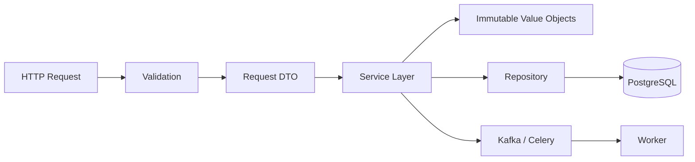

# 04- Mutable vs Immutable

## Overview

Mutability describes whether an object's state can be changed after the object has been created.

Python contains both mutable and immutable types:

| Category | Common examples | Can object state change in place? |
|---|---|---:|
| Immutable | `int`, `float`, `bool`, `str`, `bytes`, `tuple`, `frozenset` | No |
| Mutable | `list`, `dict`, `set`, most class instances | Yes |

Mutability is closely connected to Python's reference model.

```python
users = ["alice", "bob"]
alias = users

alias.append("charlie")
```

Both names reference the same mutable object:

```text
users ─────┐
           ▼
        list object
           ▲
alias ─────┘

append()
   │
   ▼
same object is modified
```

With immutable objects, operations that appear to modify a value instead produce or select another object and rebind the name:

```python
name = "alice"
name += " smith"
```

The original string is not modified.

Understanding mutability is essential for designing predictable APIs, controlling memory usage, avoiding accidental shared state, implementing safe caching, and reasoning about concurrency.

---

## Mutable Objects

A mutable object can change its internal state without changing its identity.

```python
items = [1, 2]

original_id = id(items)

items.append(3)

assert id(items) == original_id
assert items == [1, 2, 3]
```

The object remains the same object while its contents change.

Common mutable built-in types include:

- `list`;
- `dict`;
- `set`;
- `bytearray`.

Most user-defined class instances are also mutable unless their design prevents state changes.

---

## Immutable Objects

An immutable object cannot be changed after creation.

```python
value = 10
```

An operation that appears to modify it creates another value rather than changing the existing integer object:

```python
value += 1
```

Conceptually:

```text
Before:

value ─────► integer 10

After:

value ─────► integer 11
```

The original `10` remains unchanged.

Common immutable types include:

- integers;
- floating-point numbers;
- booleans;
- strings;
- bytes;
- tuples;
- frozensets.

A tuple itself is immutable, although it can contain mutable objects.

---

## Identity and Mutability

Identity helps demonstrate the difference.

### Mutable

```python
items = [1, 2]
alias = items

items.append(3)

assert items is alias
assert alias == [1, 2, 3]
```

### Immutable

```python
value = 10
alias = value

value += 1

assert alias == 10
assert value == 11
```

The name `value` was rebound to another integer object rather than modifying the original integer.

---

## Mutation vs Rebinding

This distinction is fundamental.

```python
items = [1, 2]

items.append(3)   # mutation
items = [4, 5]    # rebinding
```

Mutation changes the existing object.

Rebinding changes what the name references.

```text
Mutation:

name ─────► Object A
             │
             └── state changes


Rebinding:

name ─────► Object B

Object A may still exist elsewhere.
```

---

## Function Arguments

Python functions receive references to objects.

Consider:

```python
def add_role(roles: list[str]) -> None:
    roles.append("admin")


roles = ["reader"]

add_role(roles)

assert roles == ["reader", "admin"]
```

The function mutated the same list object owned by the caller.

With an immutable object:

```python
def increment(value: int) -> None:
    value += 1


value = 10
increment(value)

assert value == 10
```

The parameter was rebound locally to another integer.

---

## Shared Mutable State

Aliasing a mutable object creates shared state.

```python
configuration = {
    "timeouts": {
        "connect": 2,
        "read": 5,
    }
}

service_config = configuration

service_config["timeouts"]["read"] = 10
```

Now the original configuration has also changed.

This is particularly dangerous when objects cross architectural boundaries:

```text
HTTP request
     ↓
validation model
     ↓
service layer
     ↓
repository
     ↓
shared mutable object
```

If multiple layers mutate the same object without an explicit ownership contract, debugging becomes difficult.

---

## Why Immutability Helps

Immutability reduces the number of possible state transitions.

Instead of:

```text
Object A
  ├── state 1
  ├── state 2
  ├── state 3
  └── state 4
```

an immutable value behaves more like:

```text
Value A ───► fixed state

new operation
     ↓
Value B ───► another fixed state
```

This provides useful properties:

- easier reasoning;
- safer sharing;
- simpler testing;
- safer caching;
- predictable hashing;
- fewer accidental side effects;
- easier concurrency reasoning.

Immutability does not eliminate every concurrency problem, but it removes an important class of shared-state mutations.

---

## Immutability Is Not Deep Immutability

A common misconception is that an immutable container makes everything inside it immutable.

Consider:

```python
items = ([1, 2], [3, 4])
```

The tuple is immutable:

```python
items[0] = [5, 6]
```

is invalid.

But the nested list is mutable:

```python
items[0].append(3)
```

is valid.

Conceptually:

```text
tuple
 ├──► list A ──► mutable
 └──► list B ──► mutable
```

Therefore:

> Container immutability does not imply recursive immutability.

---

## Strings

Strings are immutable.

```python
name = "alice"

name.upper()
```

does not modify `name`.

```python
name = name.upper()
```

rebinds the name to another string.

This is useful because strings can be safely shared without worrying that another component will mutate the underlying value.

---

## Tuples

Tuples are immutable containers:

```python
coordinates = (10, 20)
```

You cannot replace an element:

```python
coordinates[0] = 15
```

But a tuple may contain mutable values:

```python
record = ({"status": "pending"},)

record[0]["status"] = "complete"
```

The tuple itself did not change its element reference. The referenced dictionary changed.

---

## Frozensets

`frozenset` is an immutable counterpart to `set`.

```python
permissions = frozenset({"read", "write"})
```

It cannot be mutated:

```python
permissions.add("delete")
```

would fail.

A `frozenset` can also be used where hashability is required, provided all contained elements are hashable.

---

## Mutable vs Immutable Built-ins

| Type | Mutable | Hashable |
|---|---:|---:|
| `int` | No | Yes |
| `float` | No | Yes |
| `bool` | No | Yes |
| `str` | No | Yes |
| `bytes` | No | Yes |
| `tuple` | No | If all elements are hashable |
| `frozenset` | No | If all elements are hashable |
| `list` | Yes | No |
| `dict` | Yes | No |
| `set` | Yes | No |
| `bytearray` | Yes | No |

Hashability and immutability are related but not identical concepts.

A custom object can be immutable without being hashable, and a hashable object must maintain stable hash-relevant state while used as a key.

---

## Mutable Default Arguments

One of the classic Python pitfalls is a mutable default argument.

Avoid:

```python
def add_tag(tag: str, tags: list[str] = []) -> list[str]:
    tags.append(tag)
    return tags
```

The default list is created when the function definition executes, not every time the function is called.

Use:

```python
def add_tag(
    tag: str,
    tags: list[str] | None = None,
) -> list[str]:
    if tags is None:
        tags = []

    tags.append(tag)
    return tags
```

Each call that omits `tags` receives a new list.

---

## Mutable Class Attributes

The same issue can occur with class attributes.

Avoid:

```python
class RequestTracker:
    requests: list[str] = []
```

All instances share the same list:

```text
RequestTracker instance A ──┐
                            ├──► class-level list
RequestTracker instance B ──┘
```

Use an instance attribute:

```python
class RequestTracker:
    def __init__(self) -> None:
        self.requests: list[str] = []
```

Now each instance owns its own list.

---

## Shallow Copy

A shallow copy creates a new outer object while retaining references to nested objects.

```python
original = {
    "roles": ["reader"],
}

copy = original.copy()

copy["roles"].append("writer")

assert original["roles"] == ["reader", "writer"]
```

The dictionaries are independent, but the nested list is shared.

```text
original ───► dict A ───► roles list
                              ▲
copy ───────► dict B ─────────┘
```

Use shallow copying when nested objects are intentionally shared or are immutable.

---

## Deep Copy

A deep copy recursively copies supported nested objects.

```python
from copy import deepcopy

original = {
    "roles": ["reader"],
    "metadata": {
        "source": "api",
    },
}

copy = deepcopy(original)

copy["roles"].append("writer")
copy["metadata"]["source"] = "worker"

assert original["roles"] == ["reader"]
assert original["metadata"]["source"] == "api"
```

Deep copying provides stronger isolation but can be significantly more expensive.

---

## When to Copy

Copying is appropriate when you need an ownership boundary.

For example:

```python
def process_config(config: dict[str, object]) -> None:
    local_config = config.copy()
    ...
```

However, blindly copying every object can increase:

- CPU usage;
- memory allocation;
- garbage-collection pressure;
- request latency;
- peak memory consumption.

Before copying, determine whether immutable data or explicit ownership would solve the problem more efficiently.

---

## Immutability and Hashing

Immutable objects are natural candidates for hash-based collections.

```python
user_id = (42,)

mapping = {
    user_id: "Alice",
}
```

A mutable object should generally not be hashable when its hash-relevant state can change.

This relationship is important:

```text
equality
   +
stable hash
   +
stable state
   ↓
safe dictionary/set membership
```

Immutable value objects are therefore commonly useful as:

- dictionary keys;
- set members;
- cache keys;
- memoization inputs.

---

## Frozen Dataclasses

`dataclasses` can provide convenient immutable value objects.

```python
from dataclasses import dataclass


@dataclass(frozen=True, slots=True)
class UserId:
    value: int
```

Now:

```python
user_id = UserId(42)

assert user_id.value == 42
```

Normal reassignment is prevented:

```python
user_id.value = 99
```

This raises an exception.

A frozen dataclass can be hashable when its configuration and fields permit it.

---

## Frozen Does Not Mean Thread-Safe

Immutability helps concurrent access but does not make an entire operation atomic.

For example:

```python
@dataclass(frozen=True)
class Account:
    balance: int
```

Two threads can still perform a problematic sequence:

```text
read balance
calculate new balance
write result
```

if the surrounding operation involves mutable external state.

Database transactions, locks, optimistic concurrency, or atomic SQL may still be required.

The correct principle is:

> Immutable values reduce shared-state hazards; they do not replace transactional or synchronization mechanisms.

---

## Mutable Objects and Concurrency

Consider:

```python
state = {
    "count": 0,
}
```

If multiple threads or asynchronous tasks mutate it:

```text
Task A ───┐
          ├──► shared mutable state
Task B ───┘
```

the program may experience race conditions.

Possible strategies include:

- eliminate shared mutation;
- give each task local ownership;
- use immutable snapshots;
- synchronize access;
- use a queue;
- use database atomic operations.

The best solution is often to redesign ownership rather than add more locks.

---

## Asyncio and Mutability

`asyncio` uses cooperative concurrency, but mutable state can still be shared between tasks.

```python
state = {
    "active": 0,
}
```

Multiple tasks may access it across `await` boundaries.

Even though only one coroutine executes Python code at a time in a given event-loop thread, the state can still change between suspension points.

A safer design is often:

```text
request
   ↓
local state
   ↓
compute
   ↓
persist
```

instead of maintaining mutable global application state.

---

## Multiprocessing

Processes have separate memory spaces.

```text
Process A
  └── mutable object A

Process B
  └── mutable object B
```

A normal Python reference cannot be directly shared between independent processes.

Data must cross the process boundary through mechanisms such as:

- serialization;
- pipes;
- queues;
- shared memory;
- external stores.

Therefore, process isolation provides a strong memory ownership boundary, although the cost of copying or serializing data must be considered.

---

## Backend Request State

Request-local mutable state is often appropriate.

For example:

```python
request_context = {
    "request_id": request_id,
    "user_id": user_id,
}
```

The important property is that its lifetime and ownership are bounded by the request.

Avoid putting request-specific mutable data into module-level globals:

```python
CURRENT_REQUEST = {}
```

This creates problems under:

- concurrent requests;
- multiple threads;
- asyncio;
- multiple workers;
- Kubernetes replicas.

---

## Configuration Objects

Configuration is usually read frequently and mutated rarely or never.

Immutable configuration objects are therefore often a good design.

```python
from dataclasses import dataclass


@dataclass(frozen=True, slots=True)
class DatabaseConfig:
    host: str
    port: int
    pool_size: int
```

This makes accidental runtime mutation harder:

```python
config.pool_size = 100
```

Instead, create a new configuration object when configuration changes are intentionally supported.

---

## API Data Models

Request and response models can benefit from controlled mutability.

For example, a FastAPI service may validate incoming data and then transform it into a domain value object.

```text
HTTP JSON
   ↓
Request model
   ↓
Validation
   ↓
Domain value
   ↓
Service
   ↓
Persistence
```

The service should avoid unintentionally sharing mutable request structures across unrelated components.

Whether a model should be mutable or immutable depends on its lifecycle and framework conventions.

---

## Django Considerations

Django applications frequently deal with mutable Python objects:

- request dictionaries;
- model instances;
- serializer data;
- caches;
- service-layer structures.

A Django model instance is mutable in memory:

```python
user.name = "Alice"
```

but changing the Python object does not necessarily update PostgreSQL until the appropriate persistence operation occurs:

```python
user.save(update_fields=["name"])
```

Do not confuse in-memory mutability with database transaction semantics.

---

## PostgreSQL and Immutability

Database state is fundamentally different from Python object state.

A Python immutable object does not make a database row immutable.

For example:

```text
Immutable Python value
        ↓
SQL UPDATE
        ↓
mutable database state
```

Database correctness still requires:

- transactions;
- constraints;
- isolation;
- optimistic/pessimistic locking where necessary;
- atomic SQL operations.

Use Python immutability to control application state, not as a replacement for database consistency mechanisms.

---

## Redis and Kafka

External systems create serialization boundaries.

```text
Python object
    ↓
serialize
    ↓
Redis / Kafka
    ↓
deserialize
    ↓
new Python object
```

The consumer does not receive the original Python object reference.

This provides isolation but introduces copying and serialization costs.

For high-throughput systems, avoid repeatedly constructing enormous mutable object graphs when a compact representation is sufficient.

---

## Memory Considerations

Mutability itself is not necessarily more memory-efficient or less memory-efficient.

The important factors include:

- object allocation;
- copying;
- object lifetime;
- aliasing;
- container size;
- retained references.

Immutable values can sometimes reduce memory consumption through safe sharing:

```text
Component A ──┐
Component B ──┼──► same immutable object
Component C ──┘
```

If independent mutable copies are required, memory usage can increase substantially.

---

## Copy-on-Write Thinking

A useful optimization strategy is to share data until modification is actually required.

Conceptually:

```text
shared immutable state
        │
        ├── reader A
        ├── reader B
        └── reader C

writer needs change
        ↓
create independent state
```

Python does not provide a general transparent copy-on-write object model for ordinary containers, but this design principle can be implemented at the application or library level.

It is particularly useful when large read-heavy structures are rarely modified.

---

## Immutability and Caching

Immutable objects are easier to cache safely.

```python
@dataclass(frozen=True, slots=True)
class PricingKey:
    product_id: int
    region: str
```

A cache can use the value as a stable key:

```python
cache: dict[PricingKey, float] = {}
```

Because the key's relevant state does not change, its equality and hash behavior remain stable.

This is safer than using mutable objects as keys.

---

## Immutability and Memoization

Memoization works best with stable, hashable inputs.

```python
from functools import lru_cache


@lru_cache(maxsize=1024)
def calculate_rate(
    region: str,
    customer_tier: str,
) -> float:
    ...
```

Immutable arguments are naturally suited to this model.

If an input is mutable, consider converting it to an immutable canonical representation before caching.

For example:

```python
roles = ("reader", "writer")
```

rather than:

```python
roles = ["reader", "writer"]
```

when the value is semantically a fixed collection.

---

## Immutability and Functional Design

Immutable values support functional-style designs where functions transform values instead of mutating shared state.

```python
def with_role(
    roles: frozenset[str],
    role: str,
) -> frozenset[str]:
    return roles | {role}
```

Usage:

```python
roles = frozenset({"reader"})
updated_roles = with_role(roles, "writer")

assert roles == frozenset({"reader"})
assert updated_roles == frozenset({"reader", "writer"})
```

This can make behavior easier to test and reason about.

It may, however, create additional allocations if large structures are repeatedly rebuilt.

---

## Choosing Mutable or Immutable Data

| Requirement | Preferred approach |
|---|---|
| Request-local accumulation | Mutable object can be appropriate |
| Shared read-only configuration | Immutable object |
| Dictionary key | Immutable/stable hashable value |
| Cache key | Immutable value |
| Domain identifier | Immutable value object |
| Large mutable working buffer | Mutable object |
| Cross-component shared state | Prefer immutable or explicit ownership |
| Database state | Database transaction/invariant mechanisms |
| Concurrent shared state | Prefer immutability or controlled synchronization |
| Durable message | Serialized value |
| Temporary local transformation | Mutation can be appropriate |

The goal is not "make everything immutable."

The goal is:

> Make mutation intentional and keep ownership boundaries clear.

---

## Production Design Pattern

A robust backend architecture often separates mutable processing state from immutable domain values.



A practical pattern is:

1. Accept mutable framework-managed input where appropriate.
2. Validate and normalize it.
3. Convert important domain values into explicit immutable representations.
4. Keep mutable state local to the operation that owns it.
5. Persist through transactional boundaries.
6. Serialize values when crossing process or service boundaries.

This reduces accidental state sharing without forcing every object in the application to be immutable.

---

## Common Mistakes

### Assuming `const`-Like Behavior

Python does not provide a general language-level `const` mechanism.

Naming conventions such as:

```python
MAX_RETRIES = 3
```

communicate intent but do not prevent reassignment.

Use immutable objects and encapsulation where actual immutability matters.

### Confusing Tuple Immutability With Deep Immutability

A tuple can contain mutable objects.

```python
data = ([1, 2],)
```

The tuple is immutable, but the list is not.

### Using `deepcopy()` as a Universal Fix

Deep copying can hide poor ownership design and create substantial memory and CPU overhead.

### Mutating Inputs Without an API Contract

A function that silently modifies caller-owned state creates hidden coupling.

### Sharing Mutable Globals

Global mutable state is especially problematic in web applications and concurrent workers.

### Using Mutable Objects as Hash Keys

Mutation of hash-relevant state can break dictionary and set behavior.

### Assuming Frozen Means Thread-Safe

Immutability reduces shared mutation but does not make external operations atomic.

### Assuming Process Isolation Is Free

Processes isolate memory, but moving large objects between processes requires copying or serialization and can become expensive.

---

## Production Pitfalls

### Large Deep Copies Per Request

An API that deep-copies a large request or response graph on every request can produce unnecessary latency and memory pressure.

### Cache Retention

A mutable cache can retain large object graphs for longer than expected.

Use explicit:

- TTLs;
- maximum sizes;
- eviction policies;
- ownership rules.

### Mutable Configuration

Runtime mutation of configuration can produce inconsistent behavior across threads, workers, or replicas.

Prefer immutable configuration snapshots when configuration is intended to be stable.

### Shared Serializer Structures

Reusing mutable dictionaries or lists between requests can accidentally leak data between users.

Request-scoped state should have request-scoped ownership.

### Concurrency Through Shared State

Adding locks to poorly designed shared mutable structures can reduce throughput and introduce deadlocks.

First ask whether the shared state can be eliminated or made immutable.

---

## Security Considerations

Immutability can reduce accidental state corruption, but it is not a security mechanism by itself.

For example:

```python
@dataclass(frozen=True)
class AuthorizationContext:
    user_id: int
    roles: frozenset[str]
```

This makes accidental mutation harder, but it does not establish that the roles are trustworthy.

Authorization still requires:

- authenticated identity;
- trusted authorization data;
- server-side validation;
- correct access-control checks;
- appropriate database constraints.

Never treat immutable client-provided data as inherently trusted.

---

## Scalability and High Availability

In-memory mutable state does not automatically scale across workers.

Consider:

```text
Nginx
  │
  ├── Pod A ── local mutable state
  ├── Pod B ── local mutable state
  └── Pod C ── local mutable state
```

Each process has independent Python objects.

If shared application state is required, use an appropriate external system:

```text
FastAPI / Django
       │
       ├── PostgreSQL
       ├── Redis
       └── Kafka
```

Immutable request-local objects can be freely discarded with the request, while durable shared state belongs in systems designed to provide the required consistency and availability guarantees.

---

## Observability

Memory and mutability problems often appear indirectly through:

- increasing RSS;
- allocation growth;
- cache size;
- queue depth;
- request latency;
- garbage-collection activity;
- worker restarts;
- out-of-memory kills.

Useful diagnostic tools include:

```python
import tracemalloc

tracemalloc.start()
```

and runtime memory profiling.

When investigating retention, focus on:

```text
What object remains reachable?
        ↓
Which reference retains it?
        ↓
Why does that reference live so long?
```

This is generally more useful than simply asking why garbage collection is "not freeing memory."

---

## Testing Mutable and Immutable Behavior

Tests should verify ownership and mutation contracts.

For a mutable API:

```python
def add_role(user: dict[str, object]) -> None:
    roles = user["roles"]
    assert isinstance(roles, list)
    roles.append("admin")
```

A test should make the mutation explicit.

For an immutable value:

```python
from dataclasses import dataclass


@dataclass(frozen=True)
class UserId:
    value: int
```

Test equality and immutability:

```python
def test_user_id_value_semantics() -> None:
    assert UserId(42) == UserId(42)
    assert UserId(42) != UserId(99)
```

Tests should reflect the intended ownership contract rather than merely checking implementation details.

---

## Interview Traps

### "Is Python pass-by-reference or pass-by-value?"

The useful answer is that Python passes object references as argument values. Mutation of a referenced mutable object is observable by the caller, while parameter rebinding is local.

### "Are tuples immutable?"

The tuple's element references cannot be changed, but referenced mutable objects can still be modified.

### "Is immutable the same as hashable?"

No. Hashability requires stable hashing and equality semantics. Many immutable built-ins are hashable, but the concepts are not identical.

### "Does `copy()` make a completely independent object?"

Usually only the outer object is copied. Nested objects can remain shared.

### "Does `frozen=True` make a dataclass deeply immutable?"

No. Nested mutable objects remain mutable.

### "Does immutability eliminate race conditions?"

It eliminates races caused by mutation of that immutable state, but other shared resources and operations can still race.

### "Should everything in a backend service be immutable?"

No. Mutable local state is often appropriate and efficient. The objective is controlled mutation and explicit ownership.

---

## Engineering Guidelines

### Prefer Immutable Values for Shared Read-Only State

Configuration, identifiers, and value objects are good candidates.

### Keep Mutation Local

If an object must be mutable, limit its scope to the component or operation that owns it.

### Avoid Hidden Mutation

Functions should not unexpectedly modify caller-owned structures.

### Copy Deliberately

Use shallow or deep copies only when the ownership model requires them.

### Use Immutable Keys

Dictionary and set keys should have stable equality and hashing semantics.

### Separate In-Memory State From Persistent State

Python object mutability does not define database consistency.

### Prefer Explicit State Transitions

Instead of allowing arbitrary mutations across many components, expose controlled operations that enforce invariants.

### Measure Before Optimizing

Immutability can simplify design but may create allocations. Mutation can be efficient but may create coupling and concurrency risks. Choose based on actual workload and correctness requirements.

---

## Key Takeaways

- **Mutable objects can change in place, while immutable objects cannot:** operations on immutable values create or select another value rather than modifying the existing object.
- **Aliasing makes mutability observable across components:** multiple references to the same mutable object share its mutations, so ownership boundaries should be explicit.
- **Immutability improves reasoning, caching, and concurrency safety:** immutable values are easier to share and make strong candidates for stable dictionary keys, set members, and cache keys.
- **Immutability is not automatically deep or transactional:** tuples and frozen dataclasses can contain mutable state, and immutable Python objects do not replace database transactions or synchronization.
- **Production code should control mutation rather than eliminate it:** keep mutable state local, use immutable value objects for shared semantics, copy only when necessary, and use PostgreSQL, Redis, Kafka, or other appropriate systems for shared durable state.