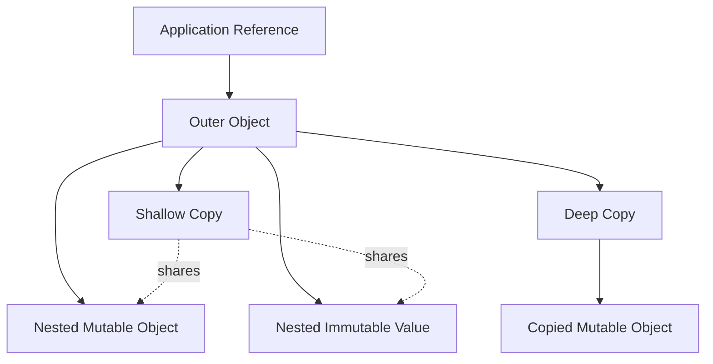

# 05- Shallow vs Deep Copy

## Overview

Python assignment binds another name to an existing object. It does not automatically create a copy.

When an independent object is required, Python provides several copying strategies:

- direct aliasing;
- shallow copying;
- deep copying;
- type-specific copying;
- explicit reconstruction.

The difference becomes important when objects contain nested mutable structures.

```python
original = {
    "user": {
        "name": "alice",
        "roles": ["reader"],
    }
}

copy = original.copy()
```

The outer dictionaries are different objects, but the nested objects may still be shared:

```text
original ─────► dict A
                  │
                  └──► dict B
                         │
                         └──► roles list

copy ──────────► dict C
                  │
                  └──► same dict B
```

Therefore:

> A shallow copy duplicates the outer container; a deep copy recursively duplicates supported nested objects.

Understanding this distinction is important for backend request processing, configuration management, caching, data transformation, concurrent workloads, and memory optimization.

---

## Assignment Is Not Copying

This creates an alias:

```python
original = [1, 2, 3]
copy = original

assert original is copy
```

Both names reference the same list.

```text
original ───┐
            ├──► [1, 2, 3]
copy ───────┘
```

Mutating through either reference changes the same object:

```python
copy.append(4)

assert original == [1, 2, 3, 4]
```

Use assignment when shared ownership is intentional.

Do not use assignment when independent mutation is required.

---

## What Is a Shallow Copy?

A shallow copy creates a new outer object but keeps references to nested objects.

```python
original = {
    "roles": ["reader"],
    "active": True,
}

copy = original.copy()

assert copy is not original
assert copy["roles"] is original["roles"]
```

The structure is:

```text
original ─────► dict A
                  ├── active ──► True
                  └── roles ───► list B
                                  ▲
copy ───────────► dict C ─────────┘
```

The dictionaries are independent.

The nested list is shared.

---

## Why Shallow Copy Exists

Shallow copying is useful when:

- only the outer container needs independent ownership;
- nested values are immutable;
- nested objects are intentionally shared;
- copying the entire object graph would be unnecessarily expensive.

For example:

```python
defaults = {
    "timeout": 5,
    "retries": 3,
}

request_config = defaults.copy()
request_config["timeout"] = 10
```

Because the values are immutable integers, sharing them is harmless.

---

## Shallow Copy Methods

Python provides several ways to perform shallow copies.

### List Copy

```python
items = [1, 2, 3]

copy_a = items.copy()
copy_b = list(items)
copy_c = items[:]
```

For normal lists, all three create a new outer list.

### Dictionary Copy

```python
config = {"timeout": 5}

copy_a = config.copy()
copy_b = dict(config)
```

### Generic Shallow Copy

```python
import copy

copy_a = copy.copy(original)
```

The appropriate approach depends on the object's type and API.

---

## Shallow Copy of Nested Data

Consider:

```python
original = {
    "database": {
        "host": "db.internal",
        "port": 5432,
    },
    "features": ["search"],
}

copy = original.copy()
```

Now:

```python
copy["database"]["port"] = 5433
```

also changes:

```python
original["database"]["port"]
```

because the nested dictionary is shared.

However:

```python
copy["database"] = {
    "host": "db.internal",
    "port": 5434,
}
```

does not replace the nested dictionary inside `original`.

The distinction is:

```text
Mutating shared nested object
        ↓
affects original

Replacing outer reference
        ↓
does not affect original
```

---

## What Is a Deep Copy?

A deep copy recursively creates copies of nested objects where the copy protocol supports it.

```python
from copy import deepcopy

original = {
    "user": {
        "name": "alice",
        "roles": ["reader"],
    },
}

copy = deepcopy(original)

assert copy is not original
assert copy["user"] is not original["user"]
assert copy["user"]["roles"] is not original["user"]["roles"]
```

The resulting object graph is independent for the copied mutable structures.

```text
original
  └── dict A
       └── dict B
            └── list C

copy
  └── dict D
       └── dict E
            └── list F
```

---

## How `deepcopy()` Works

`copy.deepcopy()` recursively traverses an object graph and constructs copies according to Python's copy protocol.

It maintains an internal memoization dictionary during a deep-copy operation.

This is important for object graphs containing shared references or cycles.

Consider:

```python
a = []
a.append(a)
```

The structure is cyclic:

```text
list A
  │
  └────► itself
```

A naive recursive copy would never terminate.

`deepcopy()` tracks objects it has already copied so that supported cyclic structures can be reconstructed correctly.

---

## Deep Copy Preserves Internal Sharing

Deep copying does not simply create a completely independent copy of every reference occurrence.

If two attributes point to the same object:

```python
shared = {"enabled": True}

original = {
    "first": shared,
    "second": shared,
}
```

then:

```python
from copy import deepcopy

copy = deepcopy(original)

assert copy["first"] is copy["second"]
assert copy["first"] is not shared
```

The copied graph preserves the sharing relationship:

```text
Original:

first ───┐
         ├──► shared
second ──┘


Deep copy:

first ───┐
         ├──► copied_shared
second ──┘
```

This is an important distinction between deep copying and blindly recursively cloning every reference.

---

## Shallow vs Deep Copy

| Property | Assignment | Shallow copy | Deep copy |
|---|---:|---:|---:|
| New outer object | No | Yes | Yes |
| Nested mutable objects copied | No | No | Usually |
| Nested references shared | Yes | Yes | Usually no |
| Handles cycles | N/A | N/A | Yes, through memoization |
| Memory cost | Lowest | Moderate | Potentially high |
| CPU cost | Lowest | Low | Potentially high |
| Isolation | None | Partial | Stronger |

"Deep copy" should still be understood as behavior defined by the copy protocol, not a universal guarantee that every referenced resource becomes independently duplicated.

---

## Immutable Nested Objects

Deep copying immutable values may not create a meaningfully new object.

For example:

```python
from copy import deepcopy

value = ("region", "prod")
copied = deepcopy(value)
```

Immutable objects can safely be shared when their semantics permit it.

This is one reason deep-copying an entire object graph can perform unnecessary work.

---

## Copying Tuples

A tuple is immutable, but it may contain mutable objects.

```python
original = (
    ["reader"],
    {"active": True},
)
```

A shallow copy may still share the nested list and dictionary.

```python
import copy

copied = copy.copy(original)

assert copied is original
```

For immutable tuples, a shallow copy can return the original object because there is no mutable outer container that needs duplication.

Deep copying behaves differently if nested mutable objects require independent copies:

```python
copied = copy.deepcopy(original)

assert copied[0] is not original[0]
assert copied[1] is not original[1]
```

---

## Copying User-Defined Objects

Consider:

```python
class RequestContext:
    def __init__(
        self,
        request_id: str,
        metadata: dict[str, str],
    ) -> None:
        self.request_id = request_id
        self.metadata = metadata
```

A shallow copy:

```python
import copy

original = RequestContext(
    request_id="req-123",
    metadata={"source": "api"},
)

copied = copy.copy(original)
```

creates another instance but normally shares the referenced `metadata` dictionary.

```python
copied.metadata["source"] = "worker"

assert original.metadata["source"] == "worker"
```

Deep copying:

```python
copied = copy.deepcopy(original)
```

creates a separate nested dictionary.

---

## Custom Copy Behavior

Python's copy machinery can interact with special methods such as:

```python
__copy__()
__deepcopy__()
```

A custom class can control copying behavior when the default behavior is inappropriate.

Example:

```python
import copy


class ServiceConfig:
    def __init__(
        self,
        settings: dict[str, str],
    ) -> None:
        self.settings = settings

    def __copy__(self) -> "ServiceConfig":
        cls = type(self)
        result = cls.__new__(cls)
        result.settings = self.settings
        return result

    def __deepcopy__(self, memo: dict[int, object]) -> "ServiceConfig":
        cls = type(self)
        result = cls.__new__(cls)
        memo[id(self)] = result
        result.settings = copy.deepcopy(self.settings, memo)
        return result
```

Custom copy behavior should be implemented only when there is a clear semantic requirement.

---

## Objects That Should Not Be Copied Naively

Not every Python object represents ordinary application data.

Examples include:

- open file handles;
- sockets;
- database connections;
- thread locks;
- event loops;
- operating-system resources;
- generators;
- some extension objects.

A deep copy is not a substitute for constructing a new resource.

For example, duplicating a database connection object is generally not how a second database connection should be obtained.

Instead:

```text
configuration
      ↓
connection factory
      ↓
new connection
```

Resource lifecycle should be controlled explicitly.

---

## Deep Copy and External Resources

Suppose an object contains:

```python
class Service:
    def __init__(self, client) -> None:
        self.client = client
```

A deep copy should not automatically be assumed to produce a valid independent HTTP client, database client, Redis connection, or Kafka producer.

Resource-owning objects should usually expose explicit lifecycle and construction mechanisms rather than relying on generic copying.

Prefer:

```python
new_service = Service(client_factory.create())
```

over assuming:

```python
new_service = deepcopy(service)
```

is semantically correct.

---

## Copying and Dataclasses

Dataclasses can be copied using normal Python mechanisms.

```python
from dataclasses import dataclass


@dataclass
class User:
    name: str
    roles: list[str]
```

A shallow copy:

```python
import copy

user_copy = copy.copy(user)
```

shares the roles list.

A deep copy:

```python
user_copy = copy.deepcopy(user)
```

copies the nested list.

Dataclasses do not automatically imply deep-copy semantics.

---

## Dataclass `replace()`

For dataclasses, `dataclasses.replace()` is often preferable when the intention is to create another instance with selected fields changed.

```python
from dataclasses import dataclass, replace


@dataclass(frozen=True)
class User:
    name: str
    role: str


user = User("alice", "reader")
admin = replace(user, role="admin")
```

This expresses a value transformation rather than an arbitrary object-graph clone.

It is especially useful with immutable domain models.

---

## Copying Frozen Dataclasses

A frozen dataclass is not necessarily deeply immutable.

```python
from dataclasses import dataclass


@dataclass(frozen=True)
class User:
    roles: list[str]
```

A shallow copy can still share the list.

A deep copy can create another list.

However, if the object is intentionally a value object, using immutable nested structures is usually clearer:

```python
@dataclass(frozen=True)
class User:
    roles: tuple[str, ...]
```

Then copying may be unnecessary because the value can safely be shared.

---

## Copying and Pydantic Models

Frameworks and libraries may provide their own copying semantics.

For example, Pydantic models can provide model-specific copying functionality depending on the version and API being used.

When working with framework-managed objects, prefer the framework's documented copy/model transformation API when it provides one rather than assuming generic `copy.copy()` or `deepcopy()` has the desired semantics.

The general rule is:

> Use type-specific APIs when object semantics are richer than ordinary Python containers.

---

## Request Processing Example

Consider a FastAPI service receiving structured request data.

A naive approach might be:

```python
payload = request_model.model_dump()
working = deepcopy(payload)
```

This can become expensive for large nested payloads.

A better design is often to:

- validate the input once;
- transform only the fields that need transformation;
- avoid mutating the original structure;
- create domain-specific values;
- keep working state local.

```text
HTTP request
     ↓
validation model
     ↓
explicit transformation
     ↓
domain state
     ↓
service operation
```

Do not use deep copying merely because mutation feels uncomfortable.

---

## Configuration Example

Suppose multiple requests need configuration derived from a shared immutable baseline.

Avoid unnecessary deep copying:

```python
base_config = {
    "timeout": 5,
    "retry": {
        "max_attempts": 3,
    },
}
```

If request-specific configuration must mutate nested state:

```python
from copy import deepcopy

request_config = deepcopy(base_config)
request_config["retry"]["max_attempts"] = 5
```

This is correct when full nested isolation is required.

But if only a small portion needs to change, explicit reconstruction may be clearer and cheaper:

```python
request_config = {
    **base_config,
    "retry": {
        **base_config["retry"],
        "max_attempts": 5,
    },
}
```

For predictable schemas, explicit copying can make ownership semantics easier to understand.

---

## Structural Copying

Explicit reconstruction is often better than generic deep copying for domain models.

```python
updated = {
    **original,
    "metadata": {
        **original["metadata"],
        "source": "worker",
    },
}
```

This copies only the levels that need independent ownership.

Advantages include:

- explicit behavior;
- predictable memory cost;
- easier code review;
- clearer domain intent;
- no accidental copying of unrelated resources.

The tradeoff is more verbose code.

---

## Copying Large Object Graphs

Deep copying a large graph can have substantial cost.

```text
Large request
     ↓
deepcopy()
     ↓
many allocations
     ↓
higher RSS
     ↓
more allocator / GC activity
     ↓
higher latency
```

This matters in high-throughput APIs.

A 100 MB logical object graph may temporarily require significantly more memory while a deep copy is being constructed.

Under Kubernetes, this can contribute to:

- container memory pressure;
- OOM kills;
- reduced pod density;
- increased infrastructure cost.

---

## Copy-on-Write Design

Instead of copying immediately, applications can sometimes share immutable state and create a new structure only when modification is required.

```text
shared state
   │
   ├── reader A
   ├── reader B
   └── reader C

writer
   │
   ▼
new modified state
```

Python's ordinary lists and dictionaries do not transparently implement general-purpose copy-on-write.

However, application-level immutable data structures and persistent data structures can provide similar semantics.

This approach is particularly useful for read-heavy state.

---

## Copying and Garbage Collection

Copies increase object allocation.

A deep copy may temporarily create:

```text
original graph
     +
new graph
     +
temporary objects
```

Until the original or intermediate objects become unreachable.

High-frequency deep copying can therefore increase:

- allocation rate;
- memory pressure;
- garbage collection work;
- CPU consumption;
- latency.

When performance matters, measure allocations rather than assuming copying is cheap.

---

## Copying and Caches

Avoid storing unnecessary duplicate object graphs in an in-process cache.

For example:

```python
cache[key] = deepcopy(result)
```

may isolate cached state from callers, but it also doubles or increases memory consumption.

Alternatives include:

- immutable cached values;
- serialized cache entries;
- defensive copies only at the API boundary;
- explicit read-only interfaces;
- Redis for shared cache state.

Choose based on the mutation contract and workload.

---

## Copying and Concurrency

Copying can be used to isolate mutable state between concurrent tasks.

```text
Shared input
    │
    ├── Task A → independent copy
    └── Task B → independent copy
```

This can reduce synchronization requirements.

However, copying is not automatically better than shared immutable state.

For large data:

```text
copy per task
    ↓
high memory consumption
```

A better design may be:

```text
immutable shared input
    ↓
read concurrently
```

or partition the work so each task owns a disjoint subset.

---

## Threads

Threads share the same process memory.

```text
Thread A ───┐
Thread B ───┼──► same process object graph
Thread C ───┘
```

A shallow copy may therefore leave nested mutable objects shared between threads.

If thread isolation is required, ensure the copied graph actually isolates all mutable state that can be modified.

Even then, copying does not solve synchronization requirements for other shared resources.

---

## Processes

Processes have separate memory spaces.

```text
Process A
    └── object graph A

Process B
    └── object graph B
```

Passing data to another process normally requires serialization or another IPC mechanism.

This naturally creates a copy-like boundary:

```text
object A
   ↓
serialization
   ↓
bytes
   ↓
deserialization
   ↓
object B
```

The cost of this transfer can exceed the cost of a local shallow or deep copy.

---

## Serialization Is Not Deep Copy

These operations have different semantics.

```text
deepcopy()
    ↓
Python object graph
    ↓
Python object graph

serialization
    ↓
Python object
    ↓
wire/storage representation
    ↓
new object
```

Serialization may intentionally omit runtime-only state and can change types or representations.

For example:

```python
import json

original = {
    "created": True,
}

payload = json.dumps(original)
restored = json.loads(payload)
```

`restored` is a newly constructed Python object, but JSON serialization is not equivalent to `deepcopy()`.

---

## Copying Across Service Boundaries

REST, gRPC, Kafka, Redis, and Celery workflows naturally cross serialization boundaries.

```text
Service A
  object
    ↓
serialization
    ↓
network / broker / cache
    ↓
deserialization
    ↓
Service B
  object
```

The receiving service does not need a Python deep copy of the sender's object graph because the runtime object boundary has already been crossed.

This is an important architectural distinction.

---

## Security Considerations

Deep copying untrusted objects is not a security validation mechanism.

More importantly, avoid using dangerous deserialization mechanisms simply because they appear to preserve Python objects conveniently.

For example, `pickle` can execute arbitrary code during unpickling and should never be treated as a safe format for untrusted input.

Prefer validated formats such as:

- JSON;
- protobuf;
- carefully designed schemas;
- application-specific validated models.

Copying should occur after data has entered a trusted application representation.

---

## Reliability Considerations

Copying can provide isolation but can also introduce inconsistency.

Suppose:

```text
database state
      ↓
Python object
      ↓
deep copy
      ↓
modified copy
```

The copied object is only a snapshot.

Another transaction may modify the database before the copy is persisted.

Therefore, object copying does not provide transactional isolation.

For database correctness, use:

- PostgreSQL transactions;
- constraints;
- optimistic concurrency;
- pessimistic locking where justified;
- atomic SQL operations.

---

## High Availability and Kubernetes

Deep copies occur inside individual application processes.

With:

```text
Nginx
  │
  ├── Pod A → Python process → memory
  ├── Pod B → Python process → memory
  └── Pod C → Python process → memory
```

each pod has its own object graph.

Copying an object does not synchronize it with another pod.

For shared state, use appropriate external systems such as:

- PostgreSQL;
- Redis;
- Kafka;
- S3;
- other durable infrastructure.

---

## Observability and Profiling

If copying is suspected to cause performance or memory problems, measure it.

Useful tools include:

```python
import tracemalloc

tracemalloc.start()
```

and allocation profiling.

Benchmark CPU cost separately from memory cost:

```python
from copy import deepcopy
from time import perf_counter

start = perf_counter()

copied = deepcopy(payload)

elapsed = perf_counter() - start
print(f"deepcopy took {elapsed:.6f}s")
```

For production analysis, prefer representative payload sizes and realistic concurrency.

Measure:

- p50 latency;
- p95/p99 latency;
- RSS;
- allocation rate;
- garbage-collection activity;
- request throughput.

---

## Testing Copy Semantics

Tests should explicitly verify whether nested state is shared or isolated.

For shallow copying:

```python
def test_shallow_copy_shares_nested_objects() -> None:
    original = {
        "roles": ["reader"],
    }

    copied = original.copy()

    assert copied is not original
    assert copied["roles"] is original["roles"]
```

For deep copying:

```python
from copy import deepcopy


def test_deep_copy_isolates_nested_objects() -> None:
    original = {
        "roles": ["reader"],
    }

    copied = deepcopy(original)

    assert copied is not original
    assert copied["roles"] is not original["roles"]
```

These tests make the ownership contract explicit.

---

## Common Mistakes

### Assuming `.copy()` Is Recursive

It usually creates only a shallow copy.

```python
copied = original.copy()
```

Nested mutable objects may remain shared.

### Using `deepcopy()` Everywhere

Deep copying can consume substantial CPU and memory.

Use it when full graph isolation is actually required.

### Copying Database Connections

Create new connections through connection factories or pools instead of generic copying.

### Deep Copying HTTP Clients

HTTP clients often maintain connection pools and runtime state. Use explicit client construction and lifecycle management.

### Assuming Immutable Containers Are Deeply Immutable

A tuple can contain mutable lists or dictionaries.

### Mutating Shared Nested Objects After Shallow Copy

This defeats the expected isolation.

### Using Copying to Solve Transaction Problems

Object copies do not replace database transactions or concurrency control.

### Copying Untrusted Objects as Validation

Copying does not make untrusted data safe.

---

## Production Pitfalls

### Deep Copying Every Request

A high-throughput API that deep-copies large request bodies can create unnecessary allocation pressure and latency.

### Copying Large Cache Entries

Duplicating cached object graphs can significantly increase process memory.

### Copying ORM Graphs

Deep-copying ORM objects can include complicated relationships and state that should not be duplicated generically.

Prefer explicit DTOs or domain models when an independent representation is required.

### Copying Objects With External Resources

Sockets, connections, locks, clients, and other runtime resources often require explicit lifecycle management.

### Hidden Shared State

A shallow copy can give the appearance of isolation while leaving nested mutable state shared.

Always identify the complete mutation boundary.

---

## Decision Framework

| Requirement | Recommended approach |
|---|---|
| Share same object intentionally | Assignment |
| Copy flat list/dict | Shallow copy |
| Nested immutable values | Shallow copy often sufficient |
| Nested mutable graph requires isolation | `deepcopy()` |
| Immutable dataclass transformation | `dataclasses.replace()` |
| Known nested structure | Explicit reconstruction |
| Large read-only data | Share immutable representation |
| Database entity duplication | Explicit domain/application operation |
| New DB/HTTP connection | Connection/client factory |
| Cross-process transfer | Serialization / IPC |
| Cross-service transfer | Explicit wire format |
| Performance-sensitive path | Measure before copying |

---

## Best Practices

### Prefer Explicit Ownership

Before copying, determine who owns and may mutate the object.

### Use Shallow Copies by Default for Flat Containers

When the structure is flat or nested values are immutable, shallow copying is often sufficient.

### Use Deep Copy Deliberately

Use `deepcopy()` when nested mutable state must be independently owned and the object graph supports meaningful copying.

### Prefer Explicit Reconstruction for Domain Models

When the schema is known, explicit reconstruction often communicates intent better than generic deep copying.

### Prefer Immutable Values

If data can be immutable, sharing it can eliminate the need for defensive copies.

### Keep Resource Ownership Explicit

Do not rely on generic copying for files, sockets, connections, locks, event loops, or clients.

### Measure Memory and CPU

Copying decisions should be validated with realistic workloads.

### Copy at Clear Boundaries

Good boundaries include:

- request-to-domain transformation;
- ownership transfer;
- cache isolation;
- worker isolation.

Avoid arbitrary copying throughout the call stack.

---

## Senior-Level Mental Model

Think in terms of an object graph rather than "copying a variable."



The engineering question is not simply:

> "Should I use `copy()` or `deepcopy()`?"

The better question is:

> "Which parts of this object graph should remain shared, and which parts require independent ownership?"

That question leads to better performance and more predictable application behavior.

---

## Key Takeaways

- **Assignment is aliasing, shallow copy duplicates only the outer object, and deep copy recursively copies supported nested objects:** the correct choice depends on the required ownership boundary.
- **Shallow copies can still share dangerous mutable state:** always inspect nested objects before assuming a copy provides isolation.
- **`deepcopy()` is powerful but expensive:** it can increase CPU usage, allocations, memory pressure, and latency, so it should not be a default defensive programming technique.
- **Explicit reconstruction and immutable data are often better designs:** for known domain models, copying only the required fields or sharing immutable values can be clearer and more efficient.
- **Copying does not replace architectural boundaries:** database transactions, synchronization, serialization, connection management, and distributed state require mechanisms designed specifically for those responsibilities.