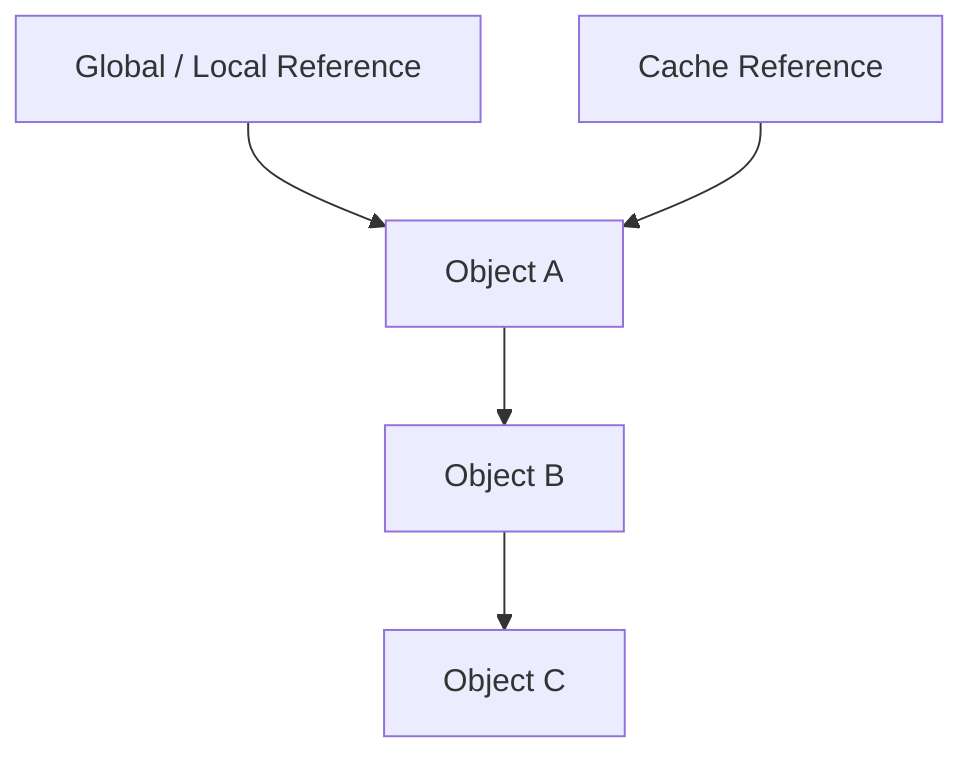
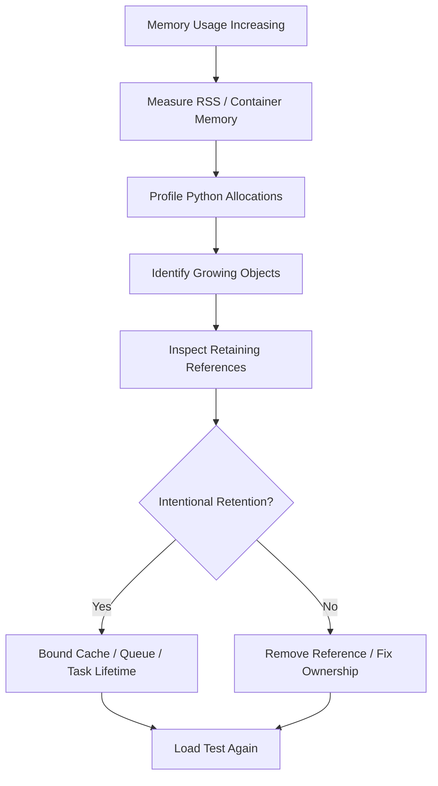
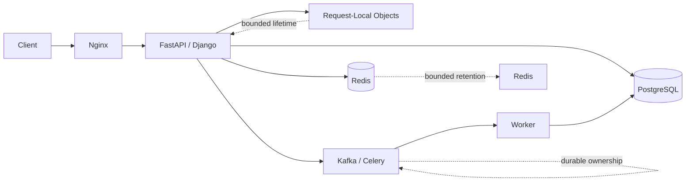

# 06- Reference Counting

## Overview

Reference counting is a memory-management technique in which an object tracks how many references currently point to it.

In CPython, reference counting is the primary mechanism responsible for promptly reclaiming objects whose reference count reaches zero. CPython also has a cyclic garbage collector because reference counting alone cannot reclaim unreachable reference cycles.

A useful mental model is:

```text
References
    │
    ├──────────► Object
    │               │
    └───────────────┘
                  reference count = 2
```

When one reference disappears:

```text
reference count = 1
```

When the final reference disappears:

```text
reference count = 0
        ↓
object can be deallocated
```

Reference counting matters because it connects Python's object-reference model to:

- object lifetime;
- memory reclamation;
- temporary objects;
- function calls;
- containers;
- reference cycles;
- garbage collection;
- memory retention;
- resource management;
- backend application performance.

Reference counting is primarily a **CPython implementation detail**. It should not be treated as a guarantee of the Python language itself or assumed to behave identically in every Python implementation.

---

## What Is a Reference?

A Python name normally refers to an object.

```python
user = {"id": 42}
```

Conceptually:

```text
user ─────────► dictionary object
```

Creating another reference:

```python
alias = user
```

creates:

```text
user ───────┐
            ├────► dictionary object
alias ──────┘
```

The object now has another reference keeping it reachable.

---

## Reference Count

In CPython, an object maintains a reference count representing active strong references to it.

A simplified model is:

```text
Object
  │
  └── reference count
          │
          ├── reference A
          ├── reference B
          └── reference C
```

If three relevant references point to the object:

```text
reference count ≈ 3
```

When those references disappear:

```text
3 → 2 → 1 → 0
```

the object becomes eligible for immediate deallocation in CPython.

The exact implementation is more sophisticated than this conceptual model, particularly in modern CPython implementations.

---

## Inspecting Reference Counts

CPython exposes reference-count information through `sys.getrefcount()`.

```python
import sys

value = []

print(sys.getrefcount(value))
```

The returned value is usually one higher than expected because passing `value` to `getrefcount()` temporarily creates another reference.

For example:

```python
value = []

count = sys.getrefcount(value)
```

The call itself temporarily holds a reference to `value`.

Therefore, `getrefcount()` is primarily a debugging and educational tool, not an application-level memory-management API.

---

## Basic Reference Lifecycle

Consider:

```python
value = []
```

Conceptually:

```text
value ─────► list
```

Then:

```python
alias = value
```

becomes:

```text
value ─────┐
           ├──► list
alias ─────┘
```

Then:

```python
del value
```

removes one binding:

```text
alias ─────► list
```

Finally:

```python
del alias
```

removes the remaining reference.

If no other references exist:

```text
reference count → 0
                  ↓
            object deallocated
```

---

## `del` and Reference Counting

`del` removes a name binding, not necessarily the object itself.

```python
user = {"id": 42}
backup = user

del user
```

The dictionary remains alive because:

```python
backup
```

still references it.

This distinction is important:

```text
del name
    ↓
remove one reference

reference count reaches zero
    ↓
object can be deallocated
```

Therefore, `del` and object destruction are not synonymous.

---

## Rebinding

Rebinding a name can decrease the reference count of the old object.

```python
value = []
value = {}
```

Conceptually:

```text
Before:

value ─────► list


After:

value ─────► dict

list reference count decreases
```

If that list had no other references, it may be immediately deallocated by CPython.

---

## Function Calls

Function arguments create references to objects.

```python
def process(value: list[int]) -> None:
    ...
```

Calling:

```python
items = [1, 2, 3]
process(items)
```

causes the function parameter to reference the same list.

```text
caller
items ───────┐
             ├──► list
             │
function     │
value ───────┘
```

The additional reference exists while the function is executing.

After the function returns, the local parameter reference is removed.

---

## Local Variables and Lifetime

Consider:

```python
def build_user() -> dict[str, object]:
    user = {
        "id": 42,
        "active": True,
    }

    return user
```

The returned dictionary remains alive after the function exits because the caller receives a reference to it.

```text
build_user()
    │
    └── local user ───► dict
                           ▲
                           │
                        caller
```

The local reference disappears when the frame is released, but the returned object remains reachable through the caller.

---

## Temporaries

Python creates temporary objects during expression evaluation.

For example:

```python
result = calculate(a) + calculate(b)
```

Temporary objects may be created during the expression.

CPython's reference counting can often reclaim temporary objects promptly when they become unreachable.

This can reduce the amount of memory retained between operations, although temporary allocation itself still has CPU and allocator costs.

---

## Containers Hold References

Python containers store references to objects.

```python
items = [
    "alice",
    "bob",
]
```

Conceptually:

```text
list
 ├── reference ──► "alice"
 └── reference ──► "bob"
```

Removing an element:

```python
items.pop()
```

removes a reference from the list.

If no other reference exists to the removed object, its reference count can reach zero.

This is why modifying large containers can affect object lifetime.

---

## Nested Objects

Consider:

```python
user = {
    "profile": {
        "name": "alice",
    }
}
```

The reference graph is approximately:

```text
user
 │
 ▼
dict A
 │
 └── profile ───► dict B
                    │
                    └── name ───► "alice"
```

Deleting `user` removes one root reference to the graph.

If no other references exist to the nested objects, they can become unreachable.

However, if another part of the application references the nested dictionary, that object remains alive.

---

## Reference Graphs

Memory analysis is often easier when viewed as a graph.



Deleting `Root1` does not make `A` collectible because the cache still references it.

Deleting both roots may make the graph unreachable, assuming no other references exist.

This graph-based reasoning is more useful for production memory debugging than simply looking at individual variables.

---

## Reference Counting and Garbage Collection

Reference counting and cyclic garbage collection complement each other.

```text
                 Python objects
                       │
             ┌─────────┴─────────┐
             │                   │
     Reference counting    Cyclic GC
             │                   │
      refcount reaches 0   unreachable cycles
             │                   │
             └─────────┬─────────┘
                       ▼
                  reclamation
```

Reference counting handles ordinary object lifetime efficiently.

Cyclic garbage collection handles unreachable cycles that reference counting cannot resolve by itself.

---

## Why Reference Counting Alone Fails

Consider:

```python
a = []
b = []

a.append(b)
b.append(a)
```

The graph is:

```text
a ───► list A ───► list B
       ▲            │
       └────────────┘
```

Now remove the external references:

```python
del a
del b
```

The objects still reference each other.

Conceptually:

```text
list A refcount > 0
list B refcount > 0
```

Reference counting alone cannot determine that the cycle is unreachable from the rest of the program.

The cyclic garbage collector is required to identify and reclaim suitable unreachable cycles.

---

## Cyclic Garbage Collector

Python's `gc` module exposes the cyclic garbage collector in CPython and other implementations that provide compatible functionality.

```python
import gc

gc.collect()
```

This requests a garbage-collection pass.

It does not mean:

```text
"free all unused memory immediately"
```

It primarily addresses cyclic garbage and follows the implementation's collection behavior.

---

## Generational Garbage Collection

CPython's cyclic garbage collector uses generations to avoid repeatedly scanning every tracked object.

The underlying strategy has evolved across Python versions, so application code should not depend on a particular generation-counting implementation detail.

The practical principle is:

> Objects that survive collection are less likely to need expensive repeated inspection than newly created objects.

This helps make cyclic garbage collection practical for long-running processes.

---

## Which Objects Are Tracked?

Not every Python object needs to participate in cyclic garbage collection.

Objects that cannot participate in reference cycles may not need tracking.

For example, simple immutable values such as integers do not form ordinary Python-level reference cycles.

Container objects and user-defined objects can participate in cycles and are candidates for GC tracking depending on their structure and implementation.

You can inspect tracking behavior:

```python
import gc

values = []
print(gc.is_tracked(values))
```

Do not use GC tracking status as a business-logic mechanism.

---

## Reference Counting vs Garbage Collection

| Mechanism | Primary role | Typical trigger |
|---|---|---|
| Reference counting | Reclaim objects with no remaining references | Reference count reaches zero |
| Cyclic GC | Reclaim unreachable reference cycles | GC collection |
| `weakref` | Avoid retaining objects through non-owning references | Object lifetime |
| Context manager | Deterministic resource cleanup | Scope exit |

The important distinction is between **memory reclamation** and **resource management**.

---

## Memory Reclamation vs Resource Cleanup

Reference counting can reclaim Python objects, but object destruction should not be treated as the primary mechanism for managing external resources.

Examples:

- file descriptors;
- database connections;
- sockets;
- locks;
- temporary files;
- network clients.

Prefer explicit lifecycle management:

```python
with open("data.txt") as file:
    process(file)
```

or:

```python
connection = create_connection()

try:
    process(connection)
finally:
    connection.close()
```

Object lifetime and resource lifetime are related but should not be assumed to be identical.

---

## `__del__` and Reference Counting

Python supports object finalization through `__del__()`.

```python
class Resource:
    def __del__(self) -> None:
        ...
```

However, relying on `__del__()` for critical resource cleanup is discouraged.

Reasons include:

- cycles can complicate finalization;
- interpreter shutdown has special behavior;
- finalization order can be difficult to reason about;
- exceptions in finalizers are not normal application control flow;
- deterministic cleanup is clearer with context managers.

Prefer:

```python
with resource:
    ...
```

for resources requiring predictable cleanup.

---

## Reference Cycles in Application Code

Cycles can arise naturally.

Common sources include:

- parent-child object relationships;
- bidirectional ORM-like structures;
- callbacks;
- event handlers;
- closures;
- caches;
- observer patterns;
- graphs;
- custom object networks.

For example:

```python
class Parent:
    def __init__(self) -> None:
        self.child = Child(self)


class Child:
    def __init__(self, parent: Parent) -> None:
        self.parent = parent
```

This creates:

```text
Parent ───► Child
   ▲          │
   └──────────┘
```

If no external references remain, cyclic GC may eventually reclaim the cycle.

---

## Weak References

Weak references allow an object to be referenced without keeping it alive.

```python
import weakref


class User:
    pass


user = User()
reference = weakref.ref(user)

assert reference() is user

del user

assert reference() is None
```

This can be useful for:

- caches;
- registries;
- observer relationships;
- metadata associated with object lifetime.

Weak references are particularly useful when the secondary structure should not become the owner of the object.

---

## Weak Reference Architecture

A typical cache or registry can use weak references:

```text
Primary owner
     │
     └────► object

Weak registry
     │
     └─ weak reference ──► object
```

When the primary owner releases the object:

```text
object becomes unreachable
       ↓
object reclaimed
       ↓
weak reference returns None
```

This prevents the registry itself from unintentionally extending object lifetime.

---

## Reference Counting and Caches

Caches are a common source of memory retention.

```python
cache: dict[str, object] = {}

cache["result"] = expensive_result
```

As long as the dictionary contains the value:

```text
cache ───► expensive_result
```

the object remains reachable.

A cache should therefore have explicit lifecycle policies:

- TTL;
- maximum entries;
- maximum memory;
- eviction;
- invalidation.

Reference counting is working correctly if the cache intentionally owns the object.

The problem is often the cache's ownership policy, not the memory manager.

---

## Reference Counting and Queues

Queues also retain references.

```python
queue.append(large_payload)
```

Until the item is removed and no other references remain:

```text
queue ───► large_payload
```

the payload stays alive.

This matters for backend systems with:

- in-process work queues;
- `asyncio.Queue`;
- task queues;
- buffering;
- batch processing.

An unexpectedly large queue can therefore create large memory retention even when individual tasks complete successfully.

---

## Asyncio Tasks

Asyncio tasks can retain references to their coroutine frames and local variables while they are alive.

```text
Task
 │
 └── coroutine frame
        │
        ├── request
        ├── response
        └── large payload
```

A long-lived task can therefore retain large objects.

This is important when debugging memory growth in FastAPI or other asyncio applications.

Long-running tasks should:

- have explicit ownership;
- avoid unnecessary captured state;
- terminate when their work is complete;
- have bounded queues;
- be cancelled and awaited during shutdown.

---

## Closures and Retained References

Closures can retain objects through their captured variables.

```python
def create_handler(configuration: dict[str, object]):
    def handler() -> object:
        return configuration["timeout"]

    return handler
```

The returned function retains access to `configuration`.

```text
handler
   │
   └── closure
          │
          └── configuration
```

If the handler lives for the lifetime of the process, the configuration object can also remain alive.

This is useful when intentional, but problematic when a closure accidentally captures a large request or response object.

---

## Global References

Module-level state can extend object lifetime dramatically.

```python
CACHE: dict[str, object] = {}
```

Any object stored there can remain alive until it is explicitly removed or the process exits.

In web applications, global mutable state should therefore be carefully controlled.

With Kubernetes:

```text
Pod A
  └── process
       └── global cache

Pod B
  └── process
       └── separate global cache
```

Each process has independent memory and reference graphs.

---

## Threads and Reference Counts

Threads share process memory.

```text
Thread A ───┐
Thread B ───┼──► same object graph
Thread C ───┘
```

All threads can create or remove references to the same objects.

CPython's internal reference-count updates are implemented to remain safe under its execution model, but this does not make arbitrary application-level mutations thread-safe.

For example:

```python
shared.append(value)
```

may still participate in application-level race conditions.

Reference counting and synchronization solve different problems.

---

## GIL Relationship

In traditional GIL-enabled CPython, the Global Interpreter Lock coordinates execution of Python bytecode within an interpreter.

Reference counting is one of the implementation concerns affected by CPython's concurrency model.

However:

> The GIL is not an application-level memory-management lock.

It does not mean developers can safely mutate arbitrary shared state without synchronization.

Reference-count safety and application data-race safety are different concerns.

Free-threaded CPython builds also change assumptions around interpreter-level concurrency, so code should not rely on the traditional GIL as a general synchronization mechanism.

---

## Multiprocessing

Processes have separate memory spaces.

```text
Process A
    └── object graph A

Process B
    └── object graph B
```

Reference counts belong to the objects in their respective process memory.

When data moves between processes:

```text
Process A
object
  ↓
serialization / IPC
  ↓
Process B
object
```

the receiving process normally has a different object with its own lifetime and reference relationships.

---

## Backend Request Lifecycle

In a typical FastAPI or Django request:

```text
HTTP request
    ↓
framework creates request state
    ↓
application objects created
    ↓
service/repository calls
    ↓
response object constructed
    ↓
response serialized
    ↓
request-local references released
    ↓
objects become collectible when unreachable
```

Reference counting can promptly reclaim many short-lived request objects in CPython after they become unreachable.

However, a cache, background task, global structure, closure, or queue can intentionally or accidentally extend their lifetime.

---

## Memory Retention in Web Services

A common production failure pattern is:

```text
Request
   ↓
large payload
   ↓
background task captures payload
   ↓
request finishes
   ↓
payload remains referenced
   ↓
memory stays allocated
```

The request itself has ended, but the object has not become unreachable.

This is why memory debugging should focus on **retaining references**, not only garbage-collection frequency.

---

## PostgreSQL and ORM Objects

A database row does not become a Python object automatically.

When Django or another ORM materializes a row:

```text
PostgreSQL row
      ↓
ORM query
      ↓
Python object
```

the Python object has its own lifecycle.

If application code retains ORM instances in:

- global caches;
- task queues;
- long-lived collections;
- closures;

those objects remain in memory independently of the database row.

The database's lifecycle and Python object's lifecycle are separate.

---

## Redis and Kafka

Redis and Kafka do not share Python object references.

Instead:

```text
Python object
      ↓
serialization
      ↓
Redis / Kafka
      ↓
deserialization
      ↓
new Python object
```

The consumer receives a new runtime object with its own references.

This creates a memory boundary but also introduces:

- serialization cost;
- deserialization allocations;
- temporary buffers;
- object reconstruction.

---

## Reference Counting and Performance

Reference-count operations have runtime overhead.

Creating and destroying references can require internal bookkeeping.

High-volume Python workloads can therefore be affected by:

- object allocation;
- reference-count updates;
- temporary objects;
- container operations;
- garbage collection;
- memory allocator behavior.

However, developers should not optimize individual reference operations blindly.

The larger performance wins usually come from:

- reducing unnecessary allocations;
- avoiding large copies;
- streaming data;
- batching;
- choosing appropriate data structures;
- reducing object graph size.

---

## Reference Counting and Temporary Allocations

Consider:

```python
result = [
    transform(item)
    for item in items
]
```

This creates and releases many objects depending on `transform()` and the input data.

For large pipelines, a generator may reduce peak memory:

```python
result = (
    transform(item)
    for item in items
)
```

The generator does not materialize the complete result list immediately.

This is an example of memory optimization through lifetime management rather than manually manipulating reference counts.

---

## Reference Counting and Streaming

For large files or API responses, avoid loading everything into memory when streaming is possible.

Instead of:

```text
file
 ↓
entire contents
 ↓
large Python object
```

prefer:

```text
file
 ↓
chunk
 ↓
process
 ↓
discard
 ↓
next chunk
```

As each chunk becomes unreachable, CPython can often reclaim it promptly.

This is particularly useful in ETL, file processing, and large-response backend workloads.

---

## Memory Fragmentation

Object deallocation does not necessarily mean the operating system immediately receives the same amount of memory back.

CPython uses memory allocators and arenas to manage object memory efficiently.

Therefore:

```text
object deallocated
    ≠
RSS immediately decreases by object size
```

The memory may remain available for reuse by the Python process.

This distinction is important when interpreting container memory metrics.

---

## RSS vs Python Object Lifetime

A process can have:

```text
many objects deallocated
```

while still showing high resident memory.

Possible reasons include:

- allocator reuse;
- fragmentation;
- retained larger allocations;
- native-extension memory;
- memory arenas;
- process-level allocation behavior.

Therefore, high RSS does not automatically mean reference counting is failing.

Use allocation profiling and process-level memory analysis to determine the actual cause.

---

## `gc` Controls

Python exposes garbage-collection controls through `gc`.

Examples:

```python
import gc

gc.disable()
gc.enable()
gc.collect()
```

These controls should be used carefully.

Disabling cyclic GC globally in a production web application without measuring the consequences can create long-lived cyclic garbage.

If GC tuning is necessary, benchmark the workload and monitor:

- memory;
- latency;
- allocation rate;
- GC activity;
- request throughput.

---

## Debugging Reference Retention

When investigating a suspected memory leak, ask:

1. Which object is growing?
2. Is it actually unreachable?
3. Which object still references it?
4. Why does that owner remain alive?
5. Is the retention intentional?
6. Is the retention bounded?

Useful tools include:

- `tracemalloc`;
- `gc`;
- `weakref`;
- memory profilers;
- process RSS metrics.

For example:

```python
import tracemalloc

tracemalloc.start()

# Run representative workload.

snapshot = tracemalloc.take_snapshot()

for statistic in snapshot.statistics("lineno")[:10]:
    print(statistic)
```

The goal is to identify allocation and retention patterns rather than simply forcing garbage collection repeatedly.

---

## Production Memory Investigation

A practical investigation flow is:



This avoids the common mistake of treating `gc.collect()` as the first and only solution.

---

## Security Considerations

Reference retention can become a security concern when sensitive data remains in memory longer than intended.

Examples include:

- authentication context;
- tokens;
- personal data;
- large request bodies;
- credentials;
- decrypted payloads.

Avoid retaining sensitive data in:

- global caches;
- long-lived queues;
- debug structures;
- logs;
- background tasks;

unless there is a clear business and security requirement.

Memory lifetime is part of the data lifecycle.

---

## Reliability Considerations

Memory retention can eventually cause:

- high latency;
- garbage-collection pressure;
- container memory pressure;
- OOM kills;
- worker restarts;
- degraded availability.

Production systems should therefore establish memory limits and observe:

- process RSS;
- container memory usage;
- allocation growth;
- queue depth;
- cache size;
- worker restarts.

Kubernetes memory limits should be based on measured application behavior rather than arbitrary values.

---

## High Availability

Reference counting is process-local.

It does not coordinate memory or object ownership across replicas.

```text
Kubernetes
├── Pod A → object graph A
├── Pod B → object graph B
└── Pod C → object graph C
```

If a state must survive process failure or be shared between replicas, it belongs in an appropriate external system.

Examples include:

- PostgreSQL;
- Redis;
- Kafka;
- S3.

Do not attempt to use Python object references as distributed state.

---

## Cost Considerations

Memory retention directly affects infrastructure cost.

For example:

```text
1 worker
    → 500 MB

8 workers
    → ~4 GB baseline

10 pods
    → ~40 GB baseline
```

The exact numbers depend on workload and sharing characteristics, but the multiplication effect is real.

Large caches and retained object graphs should therefore be included in capacity planning.

For AWS and Kubernetes deployments, measure:

- memory per worker;
- memory per request under peak load;
- cache growth;
- queue growth;
- replica count;
- worker count.

---

## Common Mistakes

### Assuming Reference Counting Is Python's Entire GC System

CPython uses reference counting plus cyclic garbage collection.

### Calling `gc.collect()` Everywhere

Forced collection does not fix objects that are still reachable.

### Assuming `del` Immediately Returns Memory to the OS

`del` removes a binding. CPython's allocator may retain freed memory for reuse.

### Relying on `__del__()` for Critical Cleanup

Use context managers or explicit cleanup for deterministic resource management.

### Ignoring Caches

A cache intentionally holds references. Unbounded caches can become memory-retention problems.

### Ignoring Async Tasks

Long-lived tasks can retain coroutine frames and large local objects.

### Assuming the GIL Solves Shared-State Problems

Reference-count safety and application-level synchronization are different concerns.

### Assuming Process Memory Is Shared

Processes have independent object graphs.

### Treating RSS as Exact Python Object Memory

RSS includes memory managed outside ordinary Python objects and may remain high after objects are freed.

---

## Production Pitfalls

### Unbounded In-Process Caches

An in-memory dictionary can retain objects indefinitely.

Use bounded caches with explicit eviction policies.

### Unbounded Queues

A queue containing large payloads retains every queued object.

Use bounded queues and backpressure.

### Background Task Retention

A background task may accidentally capture an entire request object or large payload.

Pass only the minimum required data.

### Large Closures

Long-lived callbacks can retain configuration, requests, ORM objects, or other large graphs.

Inspect closure captures when diagnosing retention.

### ORM Object Retention

Accumulating millions of ORM objects in a long-running worker can cause significant memory growth.

Process data in bounded batches and release references between batches.

### Long-Lived Worker Processes

Celery or other worker processes may accumulate memory through application-level retention or native libraries.

Use memory monitoring and appropriate worker lifecycle policies where justified.

---

## Best Practices

### Design Explicit Ownership

Know which component owns a reference and how long it should live.

### Bound Retention

Apply limits to:

- caches;
- queues;
- batches;
- task collections;
- in-memory indexes.

### Prefer Streaming for Large Data

Process large files and responses incrementally rather than materializing the entire dataset.

### Avoid Accidental Captures

Do not retain entire request objects when only a small identifier is needed.

Prefer:

```python
task_id = request.task_id
```

over capturing the complete request object in long-lived work.

### Use Context Managers

Make resource ownership explicit:

```python
with open(path) as file:
    process(file)
```

### Profile Before Tuning GC

Use `tracemalloc` and workload measurements before changing garbage-collection behavior.

### Distinguish Object Lifetime From OS Memory

A deallocated object may not immediately reduce RSS.

### Keep Shared State Deliberate

For multi-worker or multi-pod applications, use appropriate external systems for shared state.

---

## Reference Counting Decision Framework

| Situation | Recommended approach |
|---|---|
| Short-lived local object | Normal Python references |
| Need deterministic resource cleanup | Context manager |
| Suspected reference cycle | Inspect with `gc` |
| Need non-owning relationship | `weakref` |
| Large streaming workload | Generator / streaming |
| Unbounded cache growth | Add eviction / TTL / size limits |
| Large queue growth | Bounded queue / backpressure |
| Memory leak investigation | `tracemalloc` + reference analysis |
| Shared state across pods | Redis / PostgreSQL / Kafka |
| Cross-process data | IPC / serialization |
| Critical external resource | Explicit lifecycle management |
| GC tuning | Benchmark and measure first |

---

## Interview Traps

### "Does Python immediately free memory when an object goes out of scope?"

In CPython, if the object's reference count reaches zero, it can generally be deallocated immediately. This is not a universal Python-language guarantee.

### "Does `del` delete the object?"

No. It removes a reference or binding. The object may still be referenced elsewhere.

### "Why does Python need garbage collection if it uses reference counting?"

Because reference counting alone cannot reclaim unreachable cycles.

### "Does `gc.collect()` free every unused object?"

No. It primarily handles cyclic garbage and does not reclaim objects that remain reachable.

### "Does deallocating an object reduce process RSS immediately?"

Not necessarily. CPython's allocator may retain memory for reuse.

### "Are reference counting and the GIL the same thing?"

No. Reference counting concerns object lifetime; the GIL concerns interpreter execution in traditional CPython.

### "Does reference counting make Python code thread-safe?"

No. It does not make application-level shared mutable state safe.

### "Can Python reference counts be used as application logic?"

No. They are implementation details and are unsuitable for business logic.

---

## Testing and Operational Validation

Memory-sensitive code should be tested under realistic workloads.

Useful tests include:

- repeated request processing;
- large payload processing;
- cache growth;
- queue growth;
- long-running worker execution;
- repeated task creation;
- cancellation and shutdown;
- concurrent requests.

A basic regression test can repeatedly execute a workload while observing memory:

```python
def process_batch(records: list[dict[str, object]]) -> None:
    for record in records:
        process_record(record)


for _ in range(100):
    process_batch(load_test_batch())
```

For meaningful memory analysis, combine this with process-level metrics and allocation profiling rather than relying on a single snapshot.

---

## Production Architecture

A memory-conscious backend typically establishes bounded lifetimes:



The key architectural principle is that Python memory should primarily hold transient working state, while durable or shared state belongs in systems designed for that responsibility.

---

## Senior-Level Mental Model

Reference counting is best understood as part of a larger object-lifetime system:

```text
Name / Container / Closure / Task / Cache
                 │
                 ▼
            Python object
                 │
        ┌────────┴────────┐
        │                 │
 reference count      object graph
        │                 │
        ▼                 ▼
 zero references     reference cycle
        │                 │
        ▼                 ▼
 immediate CPython   cyclic garbage
 reclamation         collection
        │                 │
        └────────┬────────┘
                 ▼
             deallocation
```

For production debugging, the most useful question is rarely:

> "Why didn't Python garbage collect this?"

Instead ask:

> "Why is this object still reachable, and which component owns the reference?"

That shift leads directly to better fixes.

---

## Key Takeaways

- **CPython primarily uses reference counting for prompt object reclamation:** when an object's reference count reaches zero, it can generally be deallocated immediately.
- **Reference counting cannot resolve unreachable cycles:** CPython supplements it with cyclic garbage collection for reference graphs that remain internally connected.
- **Object retention is usually an ownership problem:** caches, queues, globals, closures, ORM objects, and long-lived asyncio tasks can keep objects reachable long after the original operation completes.
- **Deallocation does not equal immediate OS memory reduction:** CPython's allocator may retain freed memory for reuse, so RSS must be interpreted separately from Python object lifetime.
- **Production memory management requires bounded lifetimes and measurement:** use explicit ownership, streaming, bounded caches and queues, context managers, and profiling tools such as `tracemalloc` rather than relying on forced garbage collection.