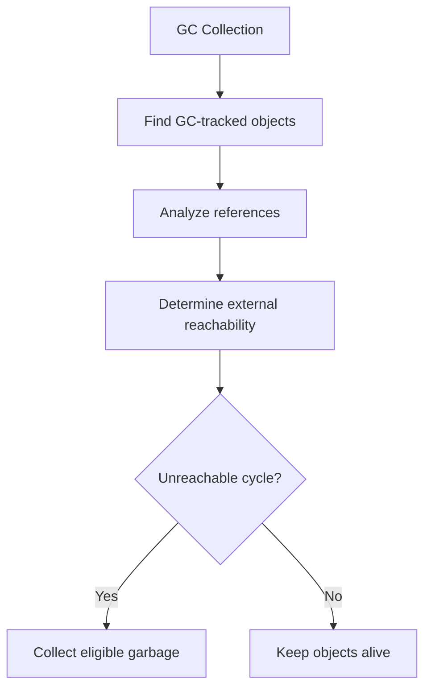
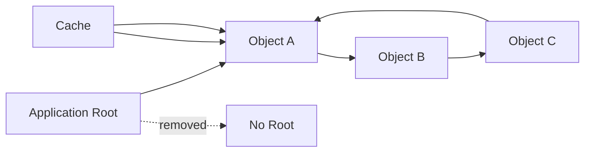
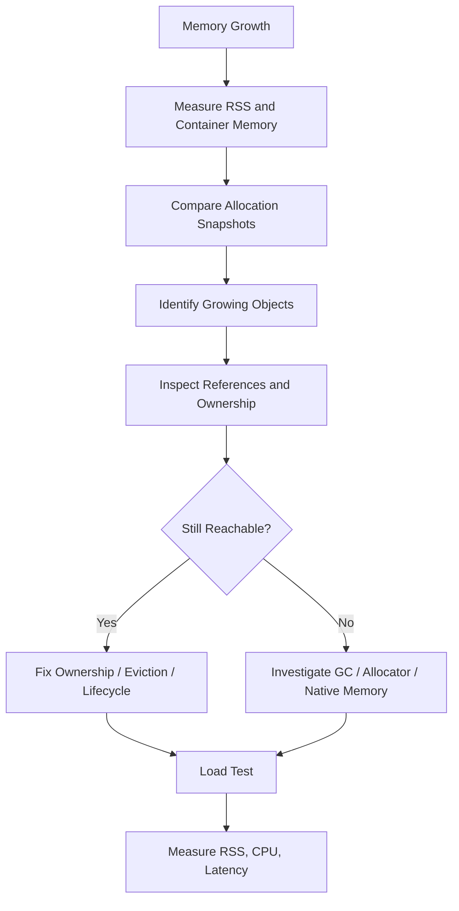

# 07- Garbage Collection

## Overview

Python's garbage collection is the runtime mechanism responsible for reclaiming objects that are no longer reachable. In CPython, garbage collection works alongside reference counting:

- **Reference counting** promptly reclaims objects whose reference count reaches zero.
- **Cyclic garbage collection** detects unreachable reference cycles that reference counting alone cannot reclaim.

This distinction is important when diagnosing memory behavior in production Python applications. Garbage collection is not a general-purpose solution for every memory problem. If an object is still reachable through a cache, queue, global variable, closure, task, or other object, the garbage collector correctly leaves it alive.

A useful mental model is:

```text
                 Python objects
                       │
              ┌────────┴────────┐
              │                 │
      Reference counting    Cyclic GC
              │                 │
       refcount == 0      unreachable cycle
              │                 │
              └────────┬────────┘
                       ▼
                  reclamation
```

Understanding garbage collection is particularly valuable for long-running backend processes such as:

- FastAPI and Django workers;
- Celery workers;
- asynchronous services;
- ETL processes;
- data-processing pipelines;
- background consumers;
- Kafka consumers;
- scheduled jobs.

---

## Garbage Collection vs Memory Management

Garbage collection is only one part of Python's memory-management system.

```text
Application
    │
    ▼
Python object model
    │
    ├── Object allocation
    │
    ├── Reference counting
    │
    ├── Cyclic garbage collection
    │
    └── Memory allocator
             │
             ▼
        Process memory
             │
             ▼
       Operating system
```

These layers solve different problems.

| Layer | Responsibility |
|---|---|
| Python references | Determine object reachability |
| Reference counting | Reclaim objects with zero references in CPython |
| Cyclic GC | Reclaim unreachable reference cycles |
| Python allocator | Manage memory used by Python objects |
| Native allocators | Manage memory used by extensions and native libraries |
| OS | Provides and manages process memory |

This is why:

```text
object becomes unreachable
```

does not necessarily mean:

```text
process RSS decreases immediately
```

---

## What Is Garbage?

An object is garbage when it is no longer reachable from the application's live object graph.

For example:

```python
def build_payload() -> dict[str, object]:
    payload = {
        "status": "ok",
        "items": [1, 2, 3],
    }
    return payload
```

After the caller releases the returned object and no other references remain, the objects can become unreachable.

Conceptually:

```text
Application roots
       │
       ▼
   payload
       │
       └──► items

After final reference is removed:

Application roots
       │
       X

payload ───► items

unreachable object graph
```

For ordinary non-cyclic objects in CPython, reference counting will usually reclaim them without requiring a cyclic GC pass.

---

## Reachability

Garbage collection is fundamentally about reachability.

Consider:

```python
cache = {}

user = {"id": 42}
cache["user:42"] = user

del user
```

The local name is gone, but:

```text
cache ─────► user dictionary
```

still exists.

The dictionary is therefore reachable and is not garbage.

Removing the local variable does not make the object collectible.

---

## Reference Counting and Cyclic GC

The relationship can be summarized as:

| Mechanism | Handles | Example |
|---|---|---|
| Reference counting | Objects with zero references | Temporary list |
| Cyclic GC | Unreachable reference cycles | Parent ↔ child |
| Explicit cleanup | External resources | Database connection |
| Cache eviction | Intentional retention | TTL cache |

Garbage collection should not be confused with:

- cache eviction;
- closing sockets;
- committing database transactions;
- deleting files;
- releasing distributed locks.

Those require explicit application-level lifecycle management.

---

## Why Cyclic GC Exists

Reference counting alone cannot reclaim cycles.

```python
a = []
b = []

a.append(b)
b.append(a)

del a
del b
```

The object graph becomes:

```text
list A ─────► list B
   ▲             │
   └─────────────┘
```

Even though the external references are gone, each list keeps the other alive.

Reference counting sees references inside the cycle and cannot conclude that the objects are unreachable from the rest of the application.

Cyclic garbage collection solves this problem.

---

## How Cyclic GC Works

The cyclic collector conceptually looks for groups of tracked objects that are internally referencing one another but are no longer reachable from outside the group.

Simplified:



The actual CPython implementation is more sophisticated than this conceptual model. The important engineering point is that cyclic GC reasons about object graphs rather than simply counting references.

---

## Which Objects Participate in Cyclic GC?

Not every Python object needs cyclic-GC tracking.

Objects that cannot participate in ordinary Python-level reference cycles generally do not need to be tracked.

Examples such as integers and many immutable scalar objects do not require cyclic collection.

Container and user-defined objects are more likely to participate in cycles.

You can inspect an object's tracking status:

```python
import gc

values = []
print(gc.is_tracked(values))
```

Tracking behavior is an implementation detail and should not be used as application logic.

---

## The `gc` Module

Python exposes garbage-collection controls and diagnostics through the `gc` module.

```python
import gc

print(gc.isenabled())

gc.collect()
```

Common APIs include:

| API | Purpose |
|---|---|
| `gc.collect()` | Trigger collection |
| `gc.enable()` | Enable automatic cyclic GC |
| `gc.disable()` | Disable automatic cyclic GC |
| `gc.isenabled()` | Check whether automatic GC is enabled |
| `gc.is_tracked(obj)` | Check whether an object is GC-tracked |
| `gc.get_count()` | Inspect GC counters |
| `gc.get_threshold()` | Inspect configured thresholds |
| `gc.get_objects()` | Inspect tracked objects |
| `gc.get_referrers(obj)` | Inspect objects referring to an object |
| `gc.get_referents(obj)` | Inspect objects directly referenced by an object |

Several of these APIs are primarily diagnostic and can themselves be expensive or difficult to interpret in large applications.

---

## Automatic Garbage Collection

CPython automatically performs cyclic garbage collection according to its internal collection heuristics.

Application code normally should not manually call:

```python
gc.collect()
```

during every request or task.

A production service should normally allow the runtime to manage collection automatically.

Manual collection is most useful for:

- diagnostics;
- controlled experiments;
- specialized workloads;
- benchmark investigations;
- carefully measured memory-management strategies.

---

## Generational Collection

CPython uses generational ideas to reduce the cost of repeatedly examining objects that are unlikely to have become garbage.

The exact generation model and implementation details have changed across Python versions, so production code should not depend on a particular number of generations or internal threshold semantics.

The underlying optimization is based on an important observation:

> Objects that survive previous collections are often more likely to remain alive.

Therefore, the collector can avoid treating the entire object population as equally likely to be garbage every time.

---

## GC Thresholds

CPython exposes GC thresholds:

```python
import gc

print(gc.get_threshold())
```

Threshold configuration has changed across Python versions, so values should not be hard-coded into documentation or production assumptions.

You can inspect or configure them:

```python
import gc

thresholds = gc.get_threshold()

gc.set_threshold(*thresholds)
```

Changing thresholds can affect:

- CPU overhead;
- collection frequency;
- memory retention;
- application latency.

Only tune them after measuring a representative workload.

---

## Manual Collection

A manual collection can be useful during controlled investigation:

```python
import gc

collected = gc.collect()

print(f"Collected objects: {collected}")
```

This can help answer questions such as:

- Does cyclic garbage exist?
- Does memory behavior change after a collection?
- Is a suspected cycle actually collectible?

It does not solve a leak where objects remain reachable.

If a cache still references an object:

```text
cache ───► object
```

then:

```python
gc.collect()
```

will correctly leave it alive.

---

## Why `gc.collect()` Does Not Fix Memory Leaks

Consider:

```python
REQUESTS: list[dict[str, object]] = []

def handle_request(payload: dict[str, object]) -> None:
    REQUESTS.append(payload)
```

Every request payload is intentionally retained by `REQUESTS`.

Calling:

```python
gc.collect()
```

does not remove them.

The correct fix is to change the ownership policy:

```python
REQUESTS.clear()
```

or, better, avoid retaining request payloads indefinitely in the first place.

This distinction is critical:

```text
Unreachable objects
        ↓
GC can reclaim them

Reachable but unwanted objects
        ↓
Application must release them
```

---

## Detecting Reference Cycles

The `gc` module can help inspect garbage.

```python
import gc

gc.collect()

for obj in gc.garbage:
    print(type(obj))
```

Modern Python applications should not normally rely on `gc.garbage` as a routine leak detector. Its behavior is tied to specific finalization and debugging situations.

For general memory investigations, allocation tracing and reference analysis are usually more useful.

---

## `gc.DEBUG_LEAK`

The `gc` module provides debugging flags.

For example:

```python
import gc

gc.set_debug(gc.DEBUG_LEAK)
```

These flags can produce significant diagnostic output and should not be enabled casually in production.

Use them in controlled environments when investigating object lifecycle behavior.

---

## `gc.get_objects()`

You can inspect currently tracked objects:

```python
import gc

objects = gc.get_objects()

print(len(objects))
```

This can be useful when diagnosing unexpectedly large populations of tracked objects.

However, the returned collection can itself be large and should not be repeatedly generated in a hot production path.

Use profiling or targeted diagnostic scripts instead.

---

## `gc.get_referrers()`

You can inspect objects that reference another object:

```python
import gc

target = []

referrers = gc.get_referrers(target)

for referrer in referrers:
    print(type(referrer))
```

This is useful for debugging ownership and retention.

However, diagnostic functions themselves can create temporary references and therefore alter the object graph being investigated.

Treat the results as debugging evidence, not perfect snapshots of runtime state.

---

## `gc.get_referents()`

`gc.get_referents()` examines objects directly referenced by an object.

```python
import gc

payload = {
    "items": [1, 2, 3],
}

for obj in gc.get_referents(payload):
    print(type(obj))
```

This can help visualize object graphs.

For large objects, recursive inspection can become expensive quickly.

---

## Object Graph Analysis

A useful production debugging model is:



Even if the normal application reference disappears, the cache continues to make `A` reachable.

The cycle:

```text
A → B → C → A
```

does not matter if an external root still reaches it.

This is why reference analysis must distinguish:

1. internal cycles;
2. external roots;
3. intentional ownership;
4. accidental retention.

---

## Finalization and `__del__`

Objects with finalizers require special consideration.

```python
class Resource:
    def __del__(self) -> None:
        print("finalizing")
```

Finalization complicates garbage collection because object destruction may have application-visible side effects.

A cycle involving finalizers historically created particularly difficult collection behavior. Modern Python has improved cycle finalization substantially, but `__del__` still introduces lifecycle complexity.

Avoid using `__del__()` as the primary mechanism for critical resource management.

Prefer:

```python
with resource:
    process(resource)
```

or explicit cleanup:

```python
resource = acquire_resource()

try:
    process(resource)
finally:
    resource.close()
```

---

## Garbage Collection and Context Managers

Context managers provide deterministic resource cleanup.

```python
with open("events.log") as file:
    process(file)
```

The context manager ensures the file is closed when leaving the block, regardless of whether normal execution or an exception occurs.

This is fundamentally different from:

```text
wait for garbage collection
```

For production systems:

> Use garbage collection for memory management; use explicit lifecycle mechanisms for external resources.

---

## Garbage Collection and Asyncio

Asyncio applications can create many short-lived objects.

```text
HTTP request
    ↓
coroutine
    ↓
local objects
    ↓
await I/O
    ↓
response
    ↓
task completion
```

Completed tasks become collectible when no references remain.

However, retaining tasks can retain their coroutine state:

```python
tasks: set[asyncio.Task[object]] = set()
```

If completed tasks are never removed, the set can become a memory-retention structure.

Long-running asyncio services should explicitly manage task ownership and lifecycle.

---

## Garbage Collection and FastAPI

A FastAPI service may process thousands or millions of requests over the lifetime of a worker.

A typical request creates:

- request objects;
- parsed payloads;
- validation objects;
- database models;
- response objects;
- temporary collections.

Most should have bounded lifetimes.

A healthy lifecycle looks like:

```text
Request
  ↓
Request-local objects
  ↓
Business logic
  ↓
Response serialization
  ↓
Request completes
  ↓
References released
  ↓
Objects become unreachable
  ↓
CPython reclaims eligible objects
```

If memory continuously grows, investigate what is retaining the objects rather than assuming GC is malfunctioning.

---

## Garbage Collection and Django

Django applications can create substantial object graphs through:

- ORM query results;
- model instances;
- serializers;
- middleware;
- request objects;
- caches;
- signals;
- background tasks.

Long-lived processes should avoid accumulating model instances unnecessarily.

For example, processing a large query should use bounded iteration rather than materializing millions of rows at once.

The exact ORM strategy depends on workload, but the memory principle is general:

```text
bounded working set
        ↓
bounded object lifetime
        ↓
predictable memory usage
```

---

## Garbage Collection and Celery Workers

Celery workers are long-lived processes and therefore expose memory-retention problems that may not appear during short local tests.

A worker may accumulate memory because of:

- application-level references;
- large task arguments;
- task result retention;
- caches;
- native libraries;
- fragmentation;
- genuine memory leaks.

Worker configuration can include process recycling strategies where appropriate, but recycling should not replace fixing application-level retention.

Measure memory behavior before choosing worker lifecycle policies.

---

## Garbage Collection and Kafka Consumers

Kafka consumers can accidentally retain large batches.

For example:

```python
batch = []

for message in messages:
    batch.append(message)
```

If `batch` grows without a bound, every message remains referenced.

A safer architecture uses bounded batches:

```text
Kafka
  ↓
bounded batch
  ↓
process
  ↓
release references
  ↓
next batch
```

This improves both application memory behavior and downstream backpressure.

---

## Garbage Collection and Redis

Redis itself is external to the Python process.

However, the Python client can retain objects through:

- application caches;
- pipelines;
- response collections;
- connection-related structures;
- pending commands.

The Redis server has its own memory management and eviction policies.

Therefore, monitor both:

```text
Application process memory
```

and:

```text
Redis memory
```

They are separate resource-management domains.

---

## Garbage Collection and Multiprocessing

Each process has its own Python heap and garbage collector.

```text
Process A
 ├── Python heap
 └── GC state

Process B
 ├── Python heap
 └── GC state

Process C
 ├── Python heap
 └── GC state
```

Garbage collection in one process does not collect objects in another process.

When using process pools or worker processes, memory must therefore be monitored per process and at the aggregate service level.

---

## Threads and Garbage Collection

Threads within the same process share Python objects.

```text
Process
 ├── Thread A ──┐
 ├── Thread B ──┼── shared heap
 └── Thread C ──┘
```

Garbage collection concerns the shared process object graph.

However, shared object access still requires correct application-level synchronization.

Garbage collection does not eliminate race conditions.

---

## Free-Threaded CPython

Traditional CPython has used the GIL to serialize execution of Python bytecode within an interpreter.

Free-threaded CPython builds change the concurrency model and introduce different implementation requirements for reference management and object access.

This reinforces an important rule:

> Never design application logic around assumptions about CPython's internal locking or reference-count implementation.

Use documented Python synchronization primitives and concurrency abstractions.

---

## Garbage Collection and Memory Allocation

Collecting an object does not guarantee that the operating system immediately receives all memory associated with it.

The lifecycle can look like:

```text
Python object
    ↓
object becomes unreachable
    ↓
deallocated
    ↓
allocator retains memory
    ↓
future Python allocations reuse memory
```

Therefore:

```text
GC successful
```

and:

```text
RSS decreases
```

are different observations.

---

## RSS and Container Memory

In Docker or Kubernetes, monitor process and container memory separately from Python GC metrics.

For example:

```text
Pod
 └── Python process
      ├── Python objects
      ├── Python allocator
      ├── native allocations
      └── shared libraries
```

A pod can approach its memory limit even when Python's garbage collector is operating normally.

An OOM kill is an operating-system/container resource event, not proof that Python GC failed.

---

## Memory Fragmentation

Memory fragmentation can cause a process to retain more memory than the currently live Python objects require.

Possible contributors include:

- allocation patterns;
- long-lived objects mixed with short-lived objects;
- native libraries;
- allocator behavior;
- varying object sizes.

This is one reason a worker can show stable or elevated RSS even after temporary objects are collected.

For serious memory investigations, examine both Python-level allocations and process-level memory.

---

## Garbage Collection and Generators

Generators can reduce memory pressure because they produce values lazily.

```python
def read_events(events: list[dict[str, object]]):
    for event in events:
        yield transform(event)
```

A generator still retains its execution state while alive.

Therefore:

```text
lazy ≠ zero memory
```

A generator can retain references to:

- input collections;
- local variables;
- closures;
- objects required to resume execution.

Release generators when their work is complete and avoid accidentally keeping them alive indefinitely.

---

## Garbage Collection and Closures

Closures can extend object lifetimes.

```python
def create_processor(configuration: dict[str, object]):
    def process(event: dict[str, object]) -> object:
        return transform(event, configuration)

    return process
```

The returned function retains the captured configuration.

This is intentional and useful.

The same mechanism becomes problematic when a long-lived callback accidentally captures:

- an entire request;
- a large response;
- a database result;
- a large cache;
- a batch of messages.

When debugging memory retention, inspect closure ownership.

---

## Weak References

Weak references can prevent secondary structures from keeping objects alive.

```python
import weakref


class Client:
    pass


client = Client()
weak_client = weakref.ref(client)

del client

assert weak_client() is None
```

Useful applications include:

- object registries;
- metadata caches;
- observer relationships;
- memoization structures.

Weak references are appropriate when the secondary structure should observe an object without owning its lifetime.

---

## Memory Leaks in Python

A "memory leak" in a managed-language application often means:

> Memory remains reachable or otherwise unavailable for reuse longer than the application requires.

Typical causes include:

```text
Global collection
    ↓
Unbounded growth

Cache
    ↓
No eviction

Queue
    ↓
No backpressure

Task registry
    ↓
Completed tasks retained

Closure
    ↓
Large object captured

Native extension
    ↓
Memory not released as expected
```

Not all of these are garbage-collector bugs.

---

## Detecting Memory Growth

A production investigation should start with measurement.

Useful metrics include:

- process RSS;
- container memory;
- heap/allocation statistics;
- object counts;
- cache size;
- queue depth;
- task count;
- worker restarts;
- GC activity;
- request latency.

A basic `tracemalloc` workflow is:

```python
import tracemalloc

tracemalloc.start()

# Run representative workload.

snapshot = tracemalloc.take_snapshot()

for statistic in snapshot.statistics("lineno")[:10]:
    print(statistic)
```

For production incidents, compare snapshots before and after a controlled workload.

---

## Comparing `tracemalloc` Snapshots

```python
import tracemalloc

tracemalloc.start()

before = tracemalloc.take_snapshot()

run_workload()

after = tracemalloc.take_snapshot()

for statistic in after.compare_to(before, "lineno")[:10]:
    print(statistic)
```

This helps identify Python allocation sites associated with memory growth.

It does not capture every possible allocation, particularly memory managed outside Python's tracked allocation mechanisms.

---

## Monitoring Garbage Collection

For advanced diagnostics, Python exposes GC callbacks.

```python
import gc


def on_gc(phase: str, info: dict[str, object]) -> None:
    if phase == "stop":
        print(
            f"generation={info.get('generation')} "
            f"collected={info.get('collected')} "
            f"uncollectable={info.get('uncollectable')}"
        )


gc.callbacks.append(on_gc)
```

Instrumentation should be lightweight.

For production observability, prefer structured metrics over printing from a callback.

Useful measurements include:

```text
gc_collections_total
gc_objects_collected_total
gc_uncollectable_total
process_resident_memory_bytes
```

---

## Latency Implications

Garbage collection consumes CPU.

A workload that creates very large numbers of objects can increase GC and allocation overhead.

Potential symptoms include:

- higher CPU usage;
- increased p95/p99 latency;
- throughput degradation;
- latency spikes;
- increased memory pressure.

Do not assume that more frequent collection is always better.

The correct goal is:

```text
acceptable memory usage
+
acceptable CPU overhead
+
predictable latency
```

---

## Production Tuning

GC tuning should follow measurement.

A practical process is:

1. Establish a representative workload.
2. Measure memory and latency.
3. Identify whether cyclic garbage is significant.
4. Profile allocations and object retention.
5. Test GC configuration changes in isolation.
6. Compare throughput, p95/p99 latency, RSS, and CPU.
7. Validate under production-like concurrency.
8. Roll out gradually.

Do not tune GC based on intuition alone.

---

## Disabling Garbage Collection

Python allows automatic cyclic GC to be disabled:

```python
import gc

gc.disable()
```

This can be useful in highly specialized workloads where the application controls object lifetimes and has demonstrated that cyclic garbage is not relevant.

It is risky as a generic optimization.

A long-running service that creates cycles while automatic GC is disabled can accumulate unreachable objects.

If disabling GC is considered, explicitly verify:

- whether cycles can occur;
- peak memory;
- workload duration;
- allocation behavior;
- cleanup strategy;
- operational failure modes.

---

## Production Memory Investigation Flow



This workflow prevents a common operational mistake: repeatedly forcing GC without determining why memory remains retained.

---

## Kubernetes Considerations

Kubernetes does not understand Python objects.

It observes process/container resource usage.

A typical failure sequence is:

```text
Python application
      ↓
retained objects / allocation growth
      ↓
RSS increases
      ↓
container approaches memory limit
      ↓
Kubernetes / kernel OOM behavior
      ↓
pod restart
```

Recommended practices include:

- set realistic memory requests and limits;
- monitor RSS;
- monitor worker count;
- monitor queue and cache growth;
- establish alerts before OOM conditions;
- perform load testing with production-like traffic;
- use graceful worker recycling where appropriate.

Memory limits should not be used as the primary leak-management strategy.

---

## High Availability

GC is process-local.

In a multi-replica service:

```text
Load Balancer
      │
 ┌────┼────┐
 ▼    ▼    ▼
Pod A Pod B Pod C
```

each process independently manages its own object graph.

A memory leak affecting every worker can therefore scale with replica count.

For example:

```text
memory leak per pod
        ×
number of pods
        =
cluster-level memory pressure
```

Autoscaling can temporarily mask a memory problem while increasing infrastructure consumption.

---

## Cost Considerations

Memory-intensive applications directly affect infrastructure cost.

If each worker consumes significantly more memory than expected:

```text
worker memory
    ×
workers per pod
    ×
number of pods
```

can substantially increase infrastructure requirements.

Memory optimization can therefore improve both:

- application reliability;
- cloud infrastructure cost.

Measure before optimizing, and optimize the largest contributors first.

---

## Security Considerations

Garbage collection does not guarantee that sensitive data disappears from physical memory immediately after becoming unreachable.

Applications should therefore avoid treating Python object collection as a secure memory-erasure mechanism.

For sensitive information:

- minimize retention time;
- avoid unnecessary copies;
- avoid global storage;
- avoid long-lived task capture;
- avoid logging secrets;
- use appropriate secret-management systems;
- follow platform-specific security requirements.

Python's ordinary memory-management mechanisms are not designed to provide guaranteed secure memory wiping.

---

## Disaster Recovery

Garbage collection has no role in durable recovery.

If a Python process crashes because of memory exhaustion:

```text
Python heap
    ↓
process termination
    ↓
in-memory state lost
```

Durable state should exist in appropriate external systems such as:

- PostgreSQL;
- durable Kafka topics;
- object storage;
- other persistent systems.

This separation allows a replacement worker or Kubernetes pod to recover without relying on the previous process's memory.

---

## Common Mistakes

### Assuming GC Handles All Memory Problems

GC only handles objects that are eligible for collection.

Reachable objects require application-level lifecycle changes.

### Calling `gc.collect()` on Every Request

This can add CPU overhead and latency without solving retention problems.

### Disabling GC as a Generic Optimization

This can allow unreachable cycles to accumulate.

### Treating RSS as Python Heap Size

RSS includes more than ordinary Python objects.

### Using `__del__()` for Resource Management

Use context managers and explicit cleanup instead.

### Ignoring Background Tasks

Tasks can retain entire object graphs until they finish or are released.

### Ignoring Cache Ownership

Caches intentionally retain references and need bounded policies.

### Assuming Garbage Collection Is Deterministic Across Python Implementations

Reference counting and cyclic GC behavior are implementation-specific details.

---

## Production Pitfalls

### Unbounded In-Memory Collections

```python
events: list[dict[str, object]] = []

def record(event: dict[str, object]) -> None:
    events.append(event)
```

This creates an intentional memory-retention problem.

### Large Request Capture

```python
def create_task(request):
    async def worker():
        await process(request)

    return worker
```

The task can retain the complete request object.

Prefer passing only the required data.

### Large Batch Accumulation

```python
batch = list(stream)
```

can materialize an unexpectedly large object graph.

Prefer bounded batches or streaming processing.

### Completed Task Retention

A registry of tasks can retain completed tasks and their state.

Remove completed tasks when they are no longer needed.

### Long-Lived Worker Memory Growth

A worker that processes millions of tasks should be tested over a long duration, not just against a single request.

---

## Best Practices

### Prefer Bounded Working Sets

Design processing pipelines around predictable memory limits.

### Make Ownership Explicit

For every long-lived object, identify:

- who owns it;
- why it remains alive;
- when it should be released;
- whether retention is bounded.

### Use Explicit Resource Management

Use context managers for files, sockets, transactions, locks, and similar resources.

### Keep Caches Bounded

Use:

- TTL;
- maximum size;
- eviction;
- explicit invalidation.

### Bound Queues

Use backpressure instead of allowing memory to grow indefinitely.

### Avoid Unnecessary Copies

Copies create additional object graphs and increase allocation pressure.

### Profile Before Tuning

Use `tracemalloc`, process metrics, GC diagnostics, and workload benchmarks.

### Test Long-Running Processes

Memory behavior that appears healthy over 100 requests may fail after millions.

### Treat Worker Recycling as a Safety Mechanism

Worker recycling can limit blast radius for gradual memory growth, but it should not replace root-cause analysis.

---

## Garbage Collection Decision Framework

| Situation | Recommended approach |
|---|---|
| Normal application execution | Leave automatic GC enabled |
| Object reaches zero references | Let CPython reclaim it |
| Suspected reference cycle | Investigate with `gc` |
| Suspected memory retention | Inspect ownership and references |
| Large allocation growth | Use `tracemalloc` and profiling |
| External resource cleanup | Context manager / explicit cleanup |
| Cache growth | TTL / size limit / eviction |
| Queue growth | Backpressure / bounded queue |
| Long-lived worker growth | Profile and consider controlled recycling |
| GC tuning | Benchmark first |
| Multi-pod shared state | External durable/shared systems |

---

## Interview Traps

### "Python Has Garbage Collection, So Memory Leaks Cannot Happen"

False. Reachable objects can remain retained indefinitely, and native extensions can introduce additional memory-management issues.

### "Reference Counting and Garbage Collection Are the Same"

Not in CPython. Reference counting handles zero-reference objects, while cyclic GC handles unreachable reference cycles.

### "Calling `gc.collect()` Fixes Memory Leaks"

Only if the problem is collectible garbage. It cannot reclaim objects that are still reachable.

### "Garbage Collection Immediately Returns Memory to the OS"

Not necessarily. Python allocators can retain freed memory for reuse.

### "Every Python Object Is Tracked by the Garbage Collector"

No. GC tracking is selective and implementation-dependent.

### "GC Makes Threads Safe"

No. Garbage collection manages object lifetime; it does not provide application-level synchronization.

### "A Kubernetes Memory Limit Controls Python GC"

No. Kubernetes observes process/container resource consumption. It does not manage Python's object graph.

### "Disabling GC Always Improves Performance"

No. It may reduce some collection overhead in specialized workloads but can increase memory retention and eventually degrade performance.

---

## Key Takeaways

- **CPython combines reference counting with cyclic garbage collection:** reference counting handles zero-reference objects while cyclic GC handles unreachable reference cycles.
- **Garbage collection only reclaims eligible objects:** reachable objects retained by caches, queues, globals, closures, tasks, or other owners require application-level lifecycle fixes.
- **`gc.collect()` is a diagnostic and specialized tool, not a routine memory-leak solution:** use profiling and reference analysis to determine why memory remains retained.
- **Object collection and process memory are different concerns:** deallocated Python objects may leave memory available for allocator reuse rather than immediately reducing RSS.
- **Production memory management requires bounded ownership and measurement:** control caches, queues, tasks, and batches; monitor memory and latency; and tune GC only after validating the workload.