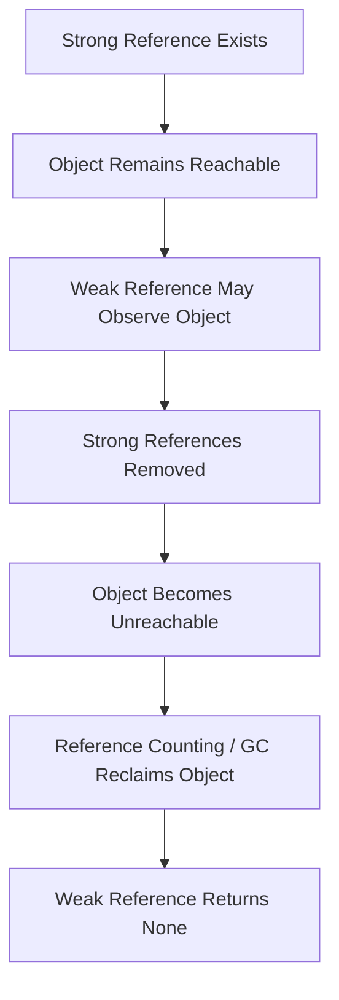
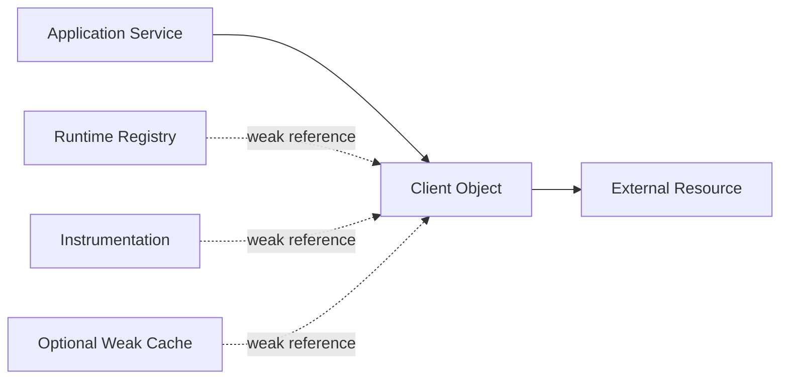

# 08- Weak References

## Overview

A weak reference is a reference to an object that does **not keep that object alive**.

Normally, a Python reference establishes ownership in the sense that the referenced object remains reachable as long as that reference exists:

```text
owner ─────────► object
```

A weak reference changes that relationship:

```text
owner ─────────► object
observer - - - ► object
              weak reference
```

If the strong reference disappears, the object can be reclaimed even though weak references still point to it:

```text
strong reference removed
        ↓
object unreachable
        ↓
object reclaimed
        ↓
weak reference becomes invalid
```

Weak references are primarily useful when one component needs to **observe, index, cache, or associate metadata with an object without extending its lifetime**.

They are especially relevant to:

- memory-sensitive applications;
- caches;
- object registries;
- observer patterns;
- plugin systems;
- ORM-related identity maps;
- connection/client registries;
- long-running backend workers;
- applications where accidental object retention can become a memory problem.

Weak references do not replace normal memory management. They are an explicit tool for controlling object ownership and retention.

---

## Strong References vs Weak References

A strong reference keeps an object reachable.

```python
user = User()
registry["user"] = user
```

The registry now owns a strong reference:

```text
user ────────────┐
                 ▼
              User object
                 ▲
                 │
registry["user"] ┘
```

Deleting the local reference does not destroy the object:

```python
del user
```

because:

```text
registry["user"] ───► User object
```

still exists.

A weak reference does not behave this way.

```text
strong reference:
registry ─────────► object

weak reference:
registry - - - - - ► object
```

The weak reference does not prevent the object's lifetime from ending.

---

## Why Weak References Exist

A normal reference expresses:

> This structure needs the object to remain alive.

A weak reference expresses:

> This structure would like to refer to the object if it is still alive, but should not control its lifetime.

That distinction is valuable in systems containing secondary indexes or caches.

For example:

```text
Application owns Client
        │
        └────────► Client

Registry observes Client
        │
        └─ weak ─► Client
```

Without a weak reference, the registry could accidentally become the owner and prevent the client from being reclaimed.

---

## The `weakref` Module

Python provides weak-reference functionality through the standard-library `weakref` module.

```python
import weakref
```

Common APIs include:

| API | Purpose |
|---|---|
| `weakref.ref` | Create a weak reference to an object |
| `weakref.WeakKeyDictionary` | Dictionary whose keys are weakly referenced |
| `weakref.WeakValueDictionary` | Dictionary whose values are weakly referenced |
| `weakref.WeakSet` | Set containing weakly referenced objects |
| `weakref.finalize` | Register cleanup behavior associated with object finalization |
| `weakref.getweakrefcount` | Inspect weak references to an object |
| `weakref.getweakrefs` | Retrieve weak references to an object |

The `weakref` module is primarily a memory-lifetime and object-ownership mechanism.

---

## Creating a Weak Reference

A basic example:

```python
import weakref


class Client:
    pass


client = Client()
client_ref = weakref.ref(client)
```

The weak reference can be called to retrieve the object if it is still alive:

```python
current_client = client_ref()

if current_client is not None:
    print("Client is still alive")
```

The weak reference itself is not the object.

```text
client_ref
    │
    └─ weak reference ─ - - ► Client
```

---

## Object Lifetime

Consider:

```python
import weakref


class Client:
    pass


client = Client()
client_ref = weakref.ref(client)

print(client_ref() is client)

del client

print(client_ref())
```

The expected conceptual behavior is:

```text
True
None
```

After the final strong reference disappears, the object can be reclaimed.

The weak reference then returns `None`.

In CPython, ordinary objects with no remaining strong references are typically reclaimed promptly due to reference counting. Weak references themselves do not delay that process.

---

## Dereferencing a Weak Reference

A weak reference is callable:

```python
client = client_ref()
```

This operation returns:

- the live object, if it still exists;
- `None`, if it has already been reclaimed.

Always account for the possibility that the object is gone.

Prefer:

```python
client = client_ref()

if client is not None:
    client.send(...)
```

rather than assuming the weak reference remains valid indefinitely.

---

## The Lifetime Race

Weak references introduce an important lifecycle rule:

> The object can disappear when you are no longer holding a strong reference to it.

This matters especially in concurrent programs.

Prefer:

```python
client = client_ref()

if client is not None:
    client.send(...)
```

Here, `client` is a strong local reference for the duration of the operation.

Avoid designs that repeatedly dereference the weak reference while assuming the object remains alive between operations.

The strong local reference establishes a temporary ownership boundary.

---

## Weak References Do Not Copy Objects

A weak reference does not create a second object.

```text
weakref ─ - - - ► object
```

There is still only one object.

This differs from:

```python
copy.copy(obj)
```

or:

```python
copy.deepcopy(obj)
```

which create new object structures.

Weak references solve **lifetime and ownership**, not copying.

---

## Weak References and Garbage Collection

Weak references interact with Python's object lifecycle but do not themselves perform garbage collection.

The lifecycle is approximately:



Weak references are therefore observers of object lifetime, not an alternative garbage collector.

---

## Which Objects Support Weak References?

Not every Python object can be weakly referenced.

For example:

```python
class User:
    pass


user = User()
```

Instances of ordinary user-defined classes generally support weak references.

But some built-in types do not.

For example:

```python
import weakref

value = []
weakref.ref(value)
```

can raise:

```text
TypeError: cannot create weak reference to 'list' object
```

Weak-reference support depends on the object's type and implementation.

---

## `__slots__` and Weak References

`__slots__` can affect weak-reference support.

Consider:

```python
class User:
    __slots__ = ("name",)
```

Instances of this class do not automatically have the weak-reference slot.

To support weak references:

```python
class User:
    __slots__ = ("name", "__weakref__")
```

Now:

```python
import weakref

user = User()
reference = weakref.ref(user)
```

can work.

This matters when combining memory optimization through `__slots__` with weak-reference-based registries.

---

## WeakValueDictionary

`WeakValueDictionary` stores values weakly.

```python
import weakref


class Client:
    pass


clients = weakref.WeakValueDictionary()

client = Client()
clients["primary"] = client

print("primary" in clients)

del client

print("primary" in clients)
```

The registry does not keep the `Client` alive.

Conceptually:

```text
clients["primary"]
        │
        └─ weak ─ - - ► Client
```

When the final strong reference disappears, the entry can disappear from the weak dictionary.

---

## Why WeakValueDictionary Is Useful

A weak-value dictionary is useful for a secondary lookup structure.

For example:

```text
Application ownership
        │
        ▼
    Client object
        ▲
        │
Weak registry
```

The registry can provide lookup functionality without becoming the owner of every client object.

Potential uses include:

- object identity maps;
- in-memory object registries;
- metadata associations;
- deduplication structures;
- runtime object indexes.

---

## WeakKeyDictionary

`WeakKeyDictionary` weakly references its keys.

```python
import weakref


class Request:
    pass


metadata = weakref.WeakKeyDictionary()

request = Request()
metadata[request] = {
    "trace_id": "abc123",
}
```

The dictionary associates metadata with `request` without keeping `request` alive through the key.

When the request object is no longer strongly referenced, its entry can disappear.

---

## WeakKeyDictionary Use Case

This is useful when attaching metadata to objects you do not own.

For example:

```text
Framework object
       │
       ▼
    Request
       ▲
       │
WeakKeyDictionary
       │
       └── metadata
```

The metadata structure should not determine the request's lifetime.

This pattern is useful in instrumentation and framework extensions, provided the metadata itself is appropriately bounded.

---

## WeakSet

A `WeakSet` stores weak references to objects.

```python
import weakref


class Worker:
    pass


workers = weakref.WeakSet()

worker = Worker()
workers.add(worker)

print(worker in workers)

del worker
```

When the object is no longer strongly referenced, it can disappear from the set.

This is useful for tracking a collection of currently live objects without owning them.

---

## Observer Registries

Weak references are particularly useful for observer patterns.

Suppose a service maintains listeners:

```text
Event source
     │
     ├── listener A
     ├── listener B
     └── listener C
```

A normal strong-reference registry can keep listeners alive indefinitely.

A weak registry changes ownership:

```text
Event source
     │
     ├─ weak ─► listener A
     ├─ weak ─► listener B
     └─ weak ─► listener C
```

When a listener is otherwise unused, it can disappear naturally.

This avoids requiring every subscriber to explicitly unregister in order to become collectible.

---

## Weak References and Caches

Weak references can be useful for caches where cached objects should not outlive their primary owners.

For example:

```python
import weakref


class ExpensiveObject:
    pass


cache = weakref.WeakValueDictionary()


def get_object(key: str) -> ExpensiveObject:
    obj = cache.get(key)

    if obj is None:
        obj = ExpensiveObject()
        cache[key] = obj

    return obj
```

The cache is opportunistic.

If another component still owns the object:

```text
owner ─────► object
cache - - - ► object
```

the cache can return it.

If the owner releases it:

```text
owner removed
     ↓
object reclaimed
     ↓
cache entry disappears
```

---

## Weak Caches vs Bounded Caches

Weak references are not a replacement for a normal cache policy.

| Requirement | Better mechanism |
|---|---|
| Cache must retain values for a minimum period | TTL cache |
| Cache must have a maximum size | LRU / bounded cache |
| Cache should not own object lifetime | Weak-value cache |
| Cache contains serialized data | Explicit eviction |
| Cache is shared across pods | Redis |
| Cache is process-local and opportunistic | Weak references may fit |

A weak cache can lose entries whenever objects become otherwise unreachable.

Therefore, it should only be used when cache misses are acceptable.

---

## Weak References vs Redis

A weak-reference cache is process-local:

```text
Pod A
 └── Python process
      └── weak cache
```

Redis is external and shared:

```text
Pod A ──┐
Pod B ──┼──► Redis
Pod C ──┘
```

Use weak references for runtime object relationships, not for distributed caching requirements.

Weak references do not provide:

- cross-process visibility;
- persistence;
- TTL semantics equivalent to Redis;
- distributed coordination;
- failover.

---

## Weak References and FastAPI

In a FastAPI application, request objects are normally short-lived.

A weak registry can be appropriate when instrumentation needs to associate metadata with an object without retaining it indefinitely.

For example:

```text
Request
  │
  └── weakly referenced by instrumentation registry
             │
             └── metadata
```

This can reduce accidental request retention.

However, request-scoped state should normally remain request-scoped. Weak references should not be introduced merely because they are available.

---

## Weak References and Django

Django applications often contain long-lived process state such as:

- signal registries;
- application caches;
- plugin registries;
- instrumentation;
- connection-related metadata.

A weak-reference-based registry can be useful when registered objects should not be retained solely because they were observed.

Care is required because Django process lifetime can be much longer than an individual HTTP request.

---

## Weak References and Background Workers

Long-running Celery workers are particularly sensitive to accidental retention.

A strong registry can produce:

```text
worker
  ↓
registry
  ↓
all processed objects
  ↓
memory growth
```

A weak registry can instead provide:

```text
worker
  ↓
weak registry
  - - -► currently live objects
```

However, weak references only solve one ownership path. Other strong references can still retain the objects.

They should therefore be combined with:

- bounded task state;
- controlled caches;
- limited batch sizes;
- explicit cleanup;
- long-running worker memory monitoring.

---

## Weak References and ORM Objects

ORM objects can be large object graphs.

For example:

```text
Order
 ├── Customer
 ├── LineItem
 ├── Product
 └── related metadata
```

A long-lived registry containing strong references to these objects can unintentionally retain the entire graph.

A weak registry can be appropriate when the registry is only an auxiliary index.

However, weak references should not be used as a substitute for correct ORM query patterns or transaction boundaries.

---

## Weak References and Object Identity Maps

An identity map associates an application-level key with an object instance:

```text
database identity
       │
       ▼
 object registry
       │
       └──► Python object
```

If the registry strongly owns every object, memory can grow indefinitely.

A weak-value identity map can allow objects to disappear when no other part of the application needs them.

This pattern is useful when object reuse is opportunistic rather than mandatory.

---

## Weak References and Memoization

Weak references can support memoization when cached objects should not be retained solely by the memoization structure.

For example:

```text
input
  ↓
memoization registry
  │
  └─ weak ─► computed object
```

This differs from conventional memoization, where the cache intentionally keeps values alive.

Choose weak memoization only when cache misses are acceptable and recomputation is safe.

---

## `weakref.finalize`

`weakref.finalize` provides a mechanism for associating a callback with an object's eventual finalization.

```python
import weakref


class Resource:
    pass


def cleanup() -> None:
    print("cleanup")


resource = Resource()

finalizer = weakref.finalize(resource, cleanup)
```

The finalizer is called when the object becomes unreachable and can be finalized.

Unlike directly implementing `__del__`, `weakref.finalize` is designed to avoid several common lifecycle problems associated with finalizer methods.

---

## `weakref.finalize` Limitations

Finalization is still not equivalent to deterministic cleanup.

Do not use:

```python
weakref.finalize(...)
```

as a replacement for:

```python
with resource:
    ...
```

when the resource must be released at a specific point.

Use finalizers for fallback cleanup or lifecycle-associated actions where delayed execution is acceptable.

For example:

```text
Normal path
    ↓
explicit close()

Fallback path
    ↓
finalizer
```

The explicit path should remain the primary lifecycle mechanism.

---

## Avoid Capturing the Object in Its Finalizer

A common mistake is accidentally creating a strong reference from the finalizer back to the object.

For example, conceptually avoid:

```python
weakref.finalize(resource, lambda: resource.close())
```

because the callback may capture `resource`.

Prefer passing the minimum independent state required for cleanup:

```python
weakref.finalize(resource, close_resource, resource_handle)
```

where `resource_handle` does not itself keep `resource` alive.

The principle is:

> A finalizer must not accidentally become another strong ownership path to the object it is supposed to observe.

---

## Finalizers and External Resources

Suppose a class manages a resource:

```python
class Client:
    def __init__(self, handle) -> None:
        self.handle = handle
```

The preferred lifecycle is explicit:

```python
client = Client(handle)

try:
    client.request()
finally:
    client.close()
```

A finalizer can be a defensive fallback, but it should not be the primary reliability mechanism.

This is particularly important for:

- sockets;
- database connections;
- file descriptors;
- temporary files;
- cloud SDK clients.

---

## Weak References and Threading

Weak-reference access is compatible with concurrent applications, but weak references do not provide synchronization.

For example:

```python
client = client_ref()

if client is not None:
    client.send()
```

The local variable `client` keeps the object strongly referenced during the operation.

But a registry itself may still require synchronization if multiple threads modify it.

Weak references solve ownership, not concurrent mutation.

---

## Weak References and Asyncio

In asyncio applications, weak references can help prevent task-related registries from unintentionally owning objects.

However, task lifecycle remains explicit.

A task registry should distinguish:

```text
task currently running
        ↓
strong ownership may be required

task completed
        ↓
remove from registry
```

Weak references should not be used to make task lifecycle management implicit.

For critical tasks, maintain explicit strong references until completion and handle cancellation and shutdown correctly.

---

## Weak References and Multiprocessing

Weak references are process-local.

```text
Process A
 └── weak reference ─ - - ► object A

Process B
 └── cannot directly weak-reference object A
```

A weak reference cannot point to a normal Python object living in another process.

For inter-process relationships, use:

- IPC;
- multiprocessing primitives;
- serialization;
- shared memory where appropriate;
- external services.

---

## Weak References and Kubernetes

Each Kubernetes pod normally has its own Python process and object graph.

```text
Pod A
 └── weak registry A

Pod B
 └── weak registry B

Pod C
 └── weak registry C
```

Weak references do not create distributed ownership.

If an object relationship must survive pod replacement or be visible across replicas, represent it in a durable or shared system.

---

## Performance Characteristics

Weak references have overhead.

Potential costs include:

- weak-reference objects;
- callback bookkeeping;
- weak container bookkeeping;
- additional indirection;
- cleanup processing.

Do not replace every ordinary reference with a weak reference.

The performance question is not:

> "Are weak references cheaper?"

The correct question is:

> "Does avoiding unnecessary object retention justify the additional lifecycle complexity and overhead?"

---

## Memory Benefits

Weak references can reduce memory retention when secondary structures would otherwise keep objects alive.

Consider:

```text
Strong registry:

registry
   │
   └────► object
           ▲
           │
       application

Object remains alive because registry owns it.
```

With weak references:

```text
Weak registry:

registry
   │
   └─ - - ► object
           ▲
           │
       application

Object lifetime is controlled by application ownership.
```

This can be valuable in long-running processes.

---

## Weak References Do Not Guarantee Low Memory

A weak reference does not reduce memory if another strong reference exists.

```text
A ─────► object
B ─────► object
registry - - - ► object
```

Removing the weak registry entry changes nothing if `A` and `B` remain.

Similarly, if the object graph itself is large, weak references do not magically shrink it while it remains strongly reachable.

---

## Weak References and `__slots__`

`__slots__` can reduce per-instance memory by avoiding an instance `__dict__`, but weak-reference support requires `__weakref__`.

Compare:

```python
class CompactUser:
    __slots__ = ("name",)
```

with:

```python
class WeakRefUser:
    __slots__ = ("name", "__weakref__")
```

The second class supports weak references.

This creates a trade-off between:

- instance memory footprint;
- dynamic attributes;
- weak-reference support.

Choose based on actual requirements.

---

## Weak Reference Limitations

Weak references are not universally applicable.

Important limitations include:

- some built-in types cannot be weakly referenced;
- objects can disappear at any time after strong ownership ends;
- weak references introduce lifecycle complexity;
- weak caches can lose values unexpectedly;
- callbacks can complicate debugging;
- they do not provide synchronization;
- they do not provide persistence;
- they do not replace explicit resource cleanup.

Use them when the ownership semantics specifically require them.

---

## Common Mistakes

### Using Weak References for Normal Business Data

Business-critical state should not disappear merely because there are no other strong references.

Use durable storage or explicit ownership.

### Treating a Weak Cache Like a Normal Cache

Weak caches are opportunistic.

Entries can disappear when objects are no longer strongly referenced.

### Forgetting to Check for `None`

```python
client_ref().send()
```

is unsafe if the object may already have been reclaimed.

Prefer:

```python
client = client_ref()

if client is not None:
    client.send()
```

### Creating a Strong Reference in a Finalizer

A callback that captures the target object can defeat the intended lifecycle.

### Using Weak References Instead of Cleanup

Weak references do not replace:

- `close()`;
- context managers;
- transaction handling;
- cancellation;
- shutdown logic.

### Assuming Weak References Solve Memory Leaks

They only remove one possible ownership path.

Other references may continue retaining the object.

---

## Production Pitfalls

### Weak Cache Misses

An object may disappear between cache lookups because no strong owner remains.

Applications must tolerate recomputation or cache misses.

### Callback Complexity

Weak-reference callbacks can execute as part of object lifecycle events, making debugging and ordering harder.

Keep callbacks small and failure-safe.

### Accidental Strong Ownership

A supposedly weak registry may contain another strong structure that retains the same objects.

Always inspect the complete reference graph.

### Hidden Lifecycle Dependencies

Code that expects an object to remain available because it was "registered" can break when registration uses weak references.

Document ownership semantics explicitly.

### `__slots__` Regression

Adding `__slots__` for memory optimization can unintentionally break code that expects weak-reference support unless `__weakref__` is included.

### Long-Lived Registries

Weak references prevent one class of retention but do not automatically bound:

- metadata;
- registry keys;
- callbacks;
- auxiliary structures.

The entire registry design still needs lifecycle analysis.

---

## Security Considerations

Weak references can reduce accidental retention of sensitive objects, but they should not be considered a security boundary.

For sensitive data:

- minimize object lifetime;
- avoid unnecessary copies;
- avoid global references;
- avoid logging sensitive values;
- avoid retaining request objects in long-lived registries;
- use appropriate secret-management systems.

Weak-reference cleanup also does not guarantee secure memory erasure.

---

## Reliability Considerations

Weak references make object availability conditional.

Therefore, code using them must explicitly handle object disappearance.

For example:

```python
def send_if_available(client_ref: weakref.ReferenceType[Client]) -> bool:
    client = client_ref()

    if client is None:
        return False

    client.send()
    return True
```

This makes the lifecycle contract explicit.

For critical operations, maintain a strong reference for the duration of the operation.

---

## Monitoring Considerations

Weak references are difficult to monitor directly through standard application metrics.

Instead, monitor the behavior they are intended to control.

Useful metrics include:

- process RSS;
- object counts;
- cache hit/miss rates;
- registry size;
- active listener count;
- task count;
- worker memory;
- GC activity;
- p95/p99 latency.

If a weak cache is used, cache-miss behavior should be monitored because entries can disappear as objects become unreachable.

---

## Debugging Weak References

A useful debugging pattern is:

```python
import weakref


class Client:
    pass


client = Client()
client_ref = weakref.ref(client)

print(client_ref())
print(weakref.getweakrefcount(client))
```

For deeper investigations, combine weak-reference inspection with:

```python
import gc
import tracemalloc
```

The goal is to understand:

```text
Who owns the object?
Who observes the object?
When should ownership end?
Why is the object still reachable?
```

---

## Production Architecture

A useful architecture separates primary ownership from secondary observation:



The service owns the client.

The registry and instrumentation observe it without extending its lifetime.

This prevents auxiliary infrastructure from accidentally becoming the owner of application objects.

---

## Decision Framework

| Question | If yes | If no |
|---|---|---|
| Should this structure keep the object alive? | Strong reference | Consider weak reference |
| Is the object merely observed or indexed? | Weak reference may fit | Strong reference may be appropriate |
| Can the object disappear unexpectedly? | Caller must handle `None` | Normal reference may be simpler |
| Is cache loss acceptable? | Weak cache may fit | Use explicit cache policy |
| Does state need persistence? | Use database / durable storage | Process-local structure may fit |
| Does state cross processes? | Use IPC / external system | Weak reference may fit |
| Is cleanup time-critical? | Explicit cleanup | Finalizer may be acceptable as fallback |
| Is memory retention causing problems? | Profile first | Avoid premature weak-reference complexity |

---

## Best Practices

### Define Ownership Explicitly

For every weak reference, document which component actually owns the object.

### Use Weak References for Secondary Relationships

Good candidates include:

- registries;
- observers;
- metadata;
- optional caches;
- object indexes.

### Hold Strong References During Operations

Immediately dereference when needed:

```python
obj = weak_ref()

if obj is not None:
    perform_operation(obj)
```

The local variable keeps the object alive during the operation.

### Make Cache Misses Normal

A weak cache should be treated as an optimization, not authoritative state.

### Keep Finalizers Minimal

Avoid complex business logic in finalization callbacks.

### Prefer Context Managers for Resources

Use:

```python
with resource:
    ...
```

for deterministic resource cleanup.

### Profile Before Introducing Weak References

Use memory measurements to establish that object retention is actually a problem.

### Test Object Lifetime

Tests should verify that secondary structures do not unexpectedly keep objects alive.

---

## Testing Weak-Reference Behavior

A practical test can verify that a registry does not own an object:

```python
import gc
import weakref


class Client:
    pass


def test_registry_does_not_keep_client_alive() -> None:
    registry = weakref.WeakValueDictionary()

    client = Client()
    registry["client"] = client

    client_ref = weakref.ref(client)

    del client
    gc.collect()

    assert client_ref() is None
    assert "client" not in registry
```

The explicit `gc.collect()` in a test can make lifecycle behavior deterministic enough for a controlled assertion involving collectible cycles or implementation-specific timing.

Do not copy this pattern into production request handling merely to force collection.

---

## Testing Weak References With `__slots__`

If a class uses `__slots__`, test weak-reference support explicitly:

```python
import weakref


class Client:
    __slots__ = ("name", "__weakref__")

    def __init__(self, name: str) -> None:
        self.name = name


def test_client_supports_weak_references() -> None:
    client = Client("api")
    reference = weakref.ref(client)

    assert reference() is client
```

This prevents future refactoring from accidentally removing weak-reference support.

---

## Interview Traps

### "A Weak Reference Keeps an Object Alive"

False. A weak reference explicitly does not keep the object alive.

### "Weak References Are Just Pointers"

They provide a Python-level lifecycle-aware reference that can become invalid when the target object is reclaimed.

### "A Weak Reference Can Always Be Created for Any Python Object"

False. Weak-reference support depends on the target type.

### "Weak References Prevent Memory Leaks"

Not generally. They prevent a particular reference from extending object lifetime.

### "WeakValueDictionary Is a Normal Cache"

No. Values can disappear when no strong references remain.

### "Weak References Are Thread-Safe"

They do not provide application-level synchronization.

### "Weak References Work Across Processes"

No. Ordinary Python weak references are process-local.

### "`weakref.finalize` Is Equivalent to `finally`"

No. `finally` provides deterministic control-flow cleanup; finalization occurs as part of object lifecycle.

### "Adding `__slots__` Automatically Preserves Weak-Reference Support"

No. If weak references are required, include `__weakref__` where appropriate.

---

## Senior-Level Mental Model

Weak references are fundamentally about **ownership boundaries**.

```text
                    Object
                      ▲
                      │
             strong ownership
                      │
                Application
                      │
        ┌─────────────┼─────────────┐
        │             │             │
        ▼             ▼             ▼
    Registry      Observer       Cache
        │             │             │
      weak          weak          weak
        │             │             │
        └─────────────┴─────────────┘
                      │
                no ownership
```

The key architectural question is:

> Which component is responsible for keeping this object alive?

If the answer is the application service, an auxiliary registry should generally not become another owner merely because it needs to reference the object.

Weak references make that ownership distinction explicit.

---

## Key Takeaways

- **Weak references observe objects without keeping them alive:** they are useful for secondary structures such as registries, observers, and opportunistic caches.
- **A weak reference can become invalid:** always obtain a strong local reference and handle `None` before operating on the target.
- **Weak references control one ownership path, not the entire object graph:** other strong references can continue to retain the object.
- **Weak caches are not authoritative caches:** entries can disappear naturally, so they are appropriate only when cache misses and recomputation are acceptable.
- **Weak references are a lifecycle tool, not a cleanup or synchronization mechanism:** use explicit resource management, concurrency primitives, durable storage, and bounded cache policies for those responsibilities.