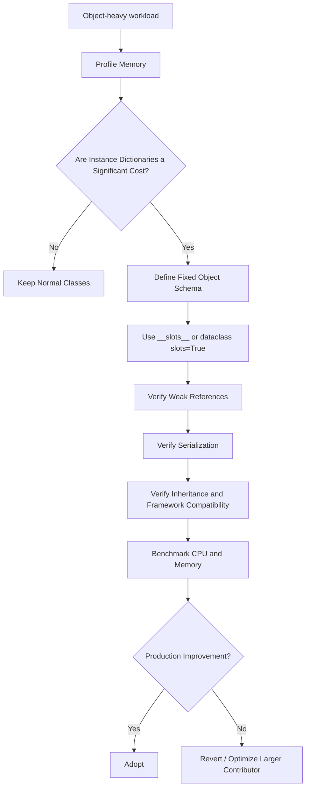

# 09- Slots

## Overview

`__slots__` is a Python class feature that allows a class to explicitly declare the instance attributes it supports.

Its most important effects are:

- removing the need for a normal per-instance `__dict__` in many cases;
- reducing per-instance memory overhead;
- restricting which instance attributes can be created;
- optionally removing the instance `__weakref__` slot unless it is explicitly included.

A conventional Python class typically stores instance attributes through an instance dictionary:

```text
User instance
├── __dict__
│   ├── id
│   ├── name
│   └── active
└── other object metadata
```

A slotted class can instead use dedicated slots:

```text
User instance
├── id slot
├── name slot
└── active slot
```

This can matter significantly when an application creates very large numbers of small objects.

However, `__slots__` is **not a general-purpose performance optimization**. It changes class semantics and can complicate inheritance, weak references, serialization, dynamic attributes, and framework integration.

For most backend applications, use `__slots__` deliberately when memory measurements or object-model requirements justify it.

---

## What `__slots__` Is

A class can declare:

```python
class User:
    __slots__ = ("user_id", "name", "active")

    def __init__(
        self,
        user_id: int,
        name: str,
        active: bool,
    ) -> None:
        self.user_id = user_id
        self.name = name
        self.active = active
```

The class declares the attributes that instances are expected to store.

This differs from:

```python
class User:
    def __init__(
        self,
        user_id: int,
        name: str,
        active: bool,
    ) -> None:
        self.user_id = user_id
        self.name = name
        self.active = active
```

where instances normally have an instance `__dict__`.

---

## Why `__slots__` Exists

Normal Python instances are flexible.

You can often add attributes dynamically:

```python
user = User(...)

user.region = "ap-south-1"
user.last_login = timestamp
```

That flexibility requires per-instance storage for arbitrary attribute names.

For a class with millions of instances, this can create significant memory overhead.

`__slots__` provides a way to trade some of Python's dynamic flexibility for:

- lower per-instance overhead;
- more predictable instance layout;
- prevention of undeclared instance attributes.

---

## Basic Behavior

Consider:

```python
class User:
    __slots__ = ("user_id", "name")

    def __init__(self, user_id: int, name: str) -> None:
        self.user_id = user_id
        self.name = name
```

Valid:

```python
user = User(42, "alice")

print(user.user_id)
print(user.name)
```

Invalid:

```python
user.email = "alice@example.com"
```

This normally raises:

```text
AttributeError
```

because `email` was not declared as a slot.

---

## Instance `__dict__`

A normal class usually provides an instance dictionary:

```python
class User:
    pass


user = User()

print(user.__dict__)
```

You can dynamically add:

```python
user.name = "alice"

print(user.__dict__)
```

Conceptually:

```text
user
 │
 └── __dict__
       └── "name" → "alice"
```

With:

```python
class User:
    __slots__ = ("name",)
```

the normal instance dictionary is not created automatically.

```python
user = User()
user.name = "alice"
```

but:

```python
user.__dict__
```

normally raises `AttributeError`.

---

## Memory Model

The primary memory advantage comes from avoiding a separate instance dictionary and, in many cases, its associated dictionary storage.

Conceptually:

```text
Normal instance

Instance
   │
   └── __dict__
         ├── key → value
         ├── key → value
         └── key → value
```

versus:

```text
Slotted instance

Instance
   ├── slot → value
   ├── slot → value
   └── slot → value
```

The exact memory layout is an implementation detail of Python and should not be reduced to a simple fixed-byte calculation.

The practical effect is most significant when:

- objects are numerous;
- objects are relatively small;
- attribute sets are stable;
- memory is a meaningful constraint.

---

## When `__slots__` Is Useful

Good candidates include:

- millions of small domain objects;
- high-volume parsed records;
- AST-like structures;
- graph nodes;
- protocol/message objects;
- immutable-ish value objects;
- memory-sensitive data-processing pipelines;
- internal framework objects;
- object pools with predictable schemas.

For example:

```text
Kafka messages
      ↓
millions of small Python objects
      ↓
memory pressure
```

Reducing per-object overhead can become meaningful at this scale.

---

## When Not to Use `__slots__`

Avoid using it merely because:

> "Slots are faster."

They are not automatically faster for every workload.

Avoid or reconsider `__slots__` when:

- instances require arbitrary attributes;
- third-party libraries expect `__dict__`;
- serialization depends on instance dictionaries;
- classes are heavily extended dynamically;
- inheritance is complicated;
- weak references are required but not accounted for;
- the object count is small;
- memory is not a bottleneck.

Measure first.

---

## Attribute Access

Slotted attributes are implemented differently from ordinary instance-dictionary attributes.

For a slotted class:

```python
class User:
    __slots__ = ("name",)
```

the class contains descriptors associated with the declared slots.

Conceptually:

```text
user.name
   ↓
slot descriptor
   ↓
stored instance value
```

For a normal class:

```text
user.name
   ↓
attribute lookup
   ↓
instance dictionary / class hierarchy
```

The exact lookup rules are more complex, and `__slots__` should not be treated as a guarantee of faster attribute access.

The strongest generally useful benefit is memory reduction.

---

## Slots Are Descriptors

When Python processes:

```python
class User:
    __slots__ = ("name",)
```

it creates class-level slot descriptors.

Conceptually:

```text
User
 └── name descriptor
        │
        └── accesses per-instance slot
```

Therefore, `__slots__` is closely connected to Python's descriptor and attribute-access machinery.

This is one reason slots are more than a simple syntax shortcut.

---

## Class Attributes and Slots

A slot declares instance storage.

Class attributes remain separate:

```python
class User:
    __slots__ = ("name",)

    category = "customer"

    def __init__(self, name: str) -> None:
        self.name = name
```

Here:

```python
user.name
```

uses the instance slot, while:

```python
user.category
```

resolves through the class attribute.

Slots do not eliminate class-level state.

---

## Default Values

Slots do not directly support ordinary class-level default values in the same way as dataclass fields.

This is problematic:

```python
class User:
    __slots__ = ("active",)
    active = True
```

A slot name conflicts with the class attribute.

Instead, initialize the instance:

```python
class User:
    __slots__ = ("active",)

    def __init__(self) -> None:
        self.active = True
```

For more sophisticated modeling, a dataclass with `slots=True` is often clearer.

---

## `dataclass(slots=True)`

Modern Python provides a convenient integration with dataclasses:

```python
from dataclasses import dataclass


@dataclass(slots=True)
class User:
    user_id: int
    name: str
    active: bool = True
```

This provides a slotted dataclass without manually declaring `__slots__`.

It is often preferable for data-oriented classes because the dataclass machinery handles:

- generated `__init__`;
- representation;
- equality;
- field metadata;
- slot configuration.

---

## Slots and Dataclasses

For application data models:

```python
from dataclasses import dataclass


@dataclass(slots=True)
class OrderSummary:
    order_id: int
    customer_id: int
    total_cents: int
```

This can be an effective combination when:

- the object schema is fixed;
- instances are numerous;
- dynamic attributes are unnecessary.

It is especially useful for internal DTO-like or processing objects where memory overhead matters.

---

## Slots and Frozen Dataclasses

Slots can be combined with immutability:

```python
from dataclasses import dataclass


@dataclass(frozen=True, slots=True)
class Money:
    amount_cents: int
    currency: str
```

This provides:

- slotted storage;
- generated value-based equality;
- frozen attribute assignment;
- reduced per-instance overhead compared with an equivalent non-slotted dataclass in many implementations.

However, `frozen=True` does not recursively freeze nested mutable objects.

---

## Slots Do Not Mean Immutable

This is a common misconception.

```python
class User:
    __slots__ = ("name",)

    def __init__(self, name: str) -> None:
        self.name = name
```

This is still mutable:

```python
user.name = "bob"
```

`__slots__` controls attribute storage and availability.

It does not prevent reassignment of declared attributes.

For immutability, use an appropriate design such as:

```python
from dataclasses import dataclass


@dataclass(frozen=True, slots=True)
class User:
    name: str
```

---

## Slots Do Not Automatically Make Objects Thread-Safe

A slotted object can still be shared between threads:

```text
Thread A ──┐
Thread B ──┼──► same slotted object
Thread C ──┘
```

If mutable attributes are modified concurrently, normal synchronization concerns remain.

`__slots__` provides no general thread-safety guarantee.

---

## Slots and `__weakref__`

Slotted classes do not automatically support weak references unless appropriate weak-reference storage is available.

Consider:

```python
class User:
    __slots__ = ("name",)
```

A weak reference may fail:

```python
import weakref

user = User()
weakref.ref(user)
```

To support weak references:

```python
class User:
    __slots__ = ("name", "__weakref__")
```

Now:

```python
reference = weakref.ref(user)
```

can work.

This is an important interaction between `__slots__` and the `weakref` module.

---

## Slots and `__dict__`

You can explicitly include `__dict__` in slots:

```python
class User:
    __slots__ = ("name", "__dict__")
```

This restores dynamic attribute storage.

For example:

```python
user = User()
user.name = "alice"
user.region = "ap-south-1"
```

works because the instance has a dictionary.

However, including `__dict__` removes much of the memory benefit that motivated slots in the first place.

Use it only when the flexibility is actually required.

---

## Slots With Both `__dict__` and `__weakref__`

A class can explicitly request both:

```python
class User:
    __slots__ = (
        "name",
        "__dict__",
        "__weakref__",
    )
```

This provides:

- declared slot storage;
- dynamic instance attributes;
- weak-reference support.

But it also means the class no longer has the strict memory characteristics of a purely slotted class.

This pattern should be deliberate rather than automatic.

---

## Inheritance

Inheritance makes `__slots__` more subtle.

Consider:

```python
class User:
    __slots__ = ("name",)


class Admin(User):
    __slots__ = ("permissions",)
```

The subclass has slots for its additional attributes.

Conceptually:

```text
User
 └── name slot

Admin
 ├── inherited name slot
 └── permissions slot
```

Each class should declare the storage it owns.

---

## Subclass Without Slots

A major pitfall occurs when a slotted base class has a subclass that does not define `__slots__`.

```python
class User:
    __slots__ = ("name",)


class Admin(User):
    pass
```

The subclass can have an instance `__dict__`.

Therefore:

```python
admin = Admin()
admin.name = "alice"
admin.permissions = {"read", "write"}
```

can work, and `permissions` may be stored in the subclass dictionary.

This can partially defeat the memory benefits expected from slots.

---

## Consistent Slotting Across an Hierarchy

If memory reduction is the objective, use slots consistently where appropriate:

```python
class User:
    __slots__ = ("name",)


class Admin(User):
    __slots__ = ("permissions",)
```

This maintains predictable storage.

However, inheritance hierarchies should not be redesigned solely to use slots. Favor simple composition when it produces clearer domain models.

---

## Multiple Inheritance

Multiple inheritance and slots can become difficult because Python must reconcile storage layouts across base classes.

For example:

```python
class A:
    __slots__ = ("a",)


class B:
    __slots__ = ("b",)


class C(A, B):
    __slots__ = ()
```

Some combinations can produce layout conflicts.

A practical rule is:

> Avoid introducing multiple inheritance solely to reuse slotted state.

Prefer composition or carefully designed base classes when object layout matters.

---

## Empty Slots

A subclass can use:

```python
class Admin(User):
    __slots__ = ()
```

This explicitly prevents the subclass from introducing a new instance dictionary through the subclass definition.

It is useful when a subclass adds behavior but no new instance state.

```python
class User:
    __slots__ = ("name",)


class Admin(User):
    __slots__ = ()

    def is_admin(self) -> bool:
        return True
```

---

## Slots and `super()`

Slots do not change normal method resolution or `super()` semantics.

```python
class User:
    __slots__ = ("name",)

    def __init__(self, name: str) -> None:
        self.name = name


class Admin(User):
    __slots__ = ("permissions",)

    def __init__(
        self,
        name: str,
        permissions: set[str],
    ) -> None:
        super().__init__(name)
        self.permissions = permissions
```

The inherited `name` slot and subclass `permissions` slot coexist.

---

## Slots and Properties

Properties work normally with slotted classes.

```python
class User:
    __slots__ = ("_name",)

    def __init__(self, name: str) -> None:
        self._name = name

    @property
    def name(self) -> str:
        return self._name
```

This can be useful when encapsulation is required without allocating a normal instance dictionary.

---

## Slots and Descriptors

Because slots themselves use descriptors, slotted classes interact naturally with Python's descriptor protocol.

For example:

```python
class User:
    __slots__ = ("name",)

    @property
    def normalized_name(self) -> str:
        return self.name.strip().lower()
```

The important distinction is:

```text
slot
  → storage

property
  → computed attribute behavior
```

They solve different problems and can coexist.

---

## Slots and Pickling

Serialization can become more complicated with slotted classes.

Some slotted classes are pickleable, but assumptions based on `__dict__` do not automatically apply.

If a custom serialization mechanism expects:

```python
obj.__dict__
```

a purely slotted object will not provide it.

This matters when integrating with:

- job queues;
- multiprocessing;
- caching;
- persistence;
- custom serializers.

Prefer explicit serialization contracts for important production data structures.

---

## Slots and `vars()`

For a normal object:

```python
vars(user)
```

usually returns the instance dictionary.

For a purely slotted object:

```python
vars(user)
```

can raise `TypeError` because there is no instance dictionary.

This is a common compatibility issue with generic framework code.

Do not assume every Python object has `__dict__`.

---

## Slots and Introspection

Code like:

```python
user.__dict__
```

is often used for debugging or serialization.

That code becomes invalid for pure slotted instances.

Instead, expose explicit APIs when appropriate:

```python
class User:
    __slots__ = ("user_id", "name")

    def to_dict(self) -> dict[str, object]:
        return {
            "user_id": self.user_id,
            "name": self.name,
        }
```

This makes the serialization contract explicit.

---

## Slots and Dynamic Frameworks

Some Python frameworks rely heavily on dynamic attributes.

Potential compatibility concerns include:

- serializers;
- ORMs;
- dependency injection systems;
- validation frameworks;
- mocking tools;
- plugins;
- instrumentation;
- object mappers.

Before adding slots to framework-facing classes, verify that the framework does not require:

```python
obj.__dict__
```

or arbitrary attribute assignment.

---

## Slots and FastAPI

FastAPI applications often use Pydantic models for request and response validation.

Do not replace framework models with slotted classes merely to save a small amount of memory.

For internal high-volume objects, slots may be appropriate:

```text
HTTP request
    ↓
Pydantic validation model
    ↓
internal slotted DTO
    ↓
business logic
```

The optimization should target a measured object population rather than adding complexity to framework-managed models without evidence.

---

## Slots and Django

Django model instances have framework-managed behavior and metadata.

Adding `__slots__` to Django model classes is generally not a simple memory optimization and can conflict with Django's model machinery.

Do not assume that slots can safely be applied to ORM models just because they reduce memory for ordinary Python classes.

Use slots primarily for your own controlled internal classes unless framework documentation explicitly supports the pattern.

---

## Slots and gRPC / REST

For internal request-processing structures, slots can be useful when large numbers of transient objects are created.

For example:

```text
gRPC / REST request
       ↓
decode payload
       ↓
create internal objects
       ↓
business logic
       ↓
response
```

If millions of small internal objects are created during batch processing, reducing per-object overhead may improve memory efficiency.

The network protocol itself does not require slots.

---

## Slots and Kafka

Kafka consumers can process very large message volumes.

A pipeline such as:

```text
Kafka
  ↓
deserialize
  ↓
create Event objects
  ↓
transform
  ↓
batch write
```

can create large numbers of Python objects.

For a stable internal event model:

```python
from dataclasses import dataclass


@dataclass(slots=True)
class Event:
    event_id: str
    event_type: str
    timestamp: int
```

slots can reduce per-object overhead.

However, the total memory footprint is also influenced by:

- message payload size;
- strings;
- nested objects;
- batch size;
- Kafka client buffers;
- serialization;
- queues.

Slots address only one component.

---

## Slots and Celery

Celery task arguments cross a serialization boundary.

Slots do not eliminate:

```text
serialization
      ↓
broker
      ↓
deserialization
```

If slotted objects are used as task arguments, verify serializer compatibility.

For durable task boundaries, simple serializable data such as:

```python
{
    "order_id": 123,
    "operation": "rebuild",
}
```

is often preferable to passing complex Python objects.

---

## Slots and Copying

Slots interact with copying differently from ordinary dictionary-backed objects.

Generic:

```python
copy.copy(obj)
```

or:

```python
copy.deepcopy(obj)
```

may work for many slotted classes, but custom classes and complex inheritance structures can require explicit copy support.

If copying is performance-sensitive, prefer explicit reconstruction when the schema is known:

```python
new_user = User(
    user_id=user.user_id,
    name=user.name,
)
```

This makes the copied fields explicit.

---

## Slots and Weak References

A particularly important combination is:

```python
class Client:
    __slots__ = (
        "name",
        "__weakref__",
    )
```

This provides:

- reduced instance overhead compared with a normal dictionary-backed class;
- explicit attribute storage;
- weak-reference support.

It is useful for classes that appear in large object populations and also participate in weak registries.

---

## Slots and Memory Profiling

Do not assume slots are beneficial without measuring.

A useful comparison is:

```text
Normal class
      ↓
baseline memory

Slotted class
      ↓
optimized memory

Compare:
- RSS
- allocation count
- object population
- latency
- throughput
```

Tools such as `tracemalloc` can help analyze Python-level allocations.

For object-heavy workloads, benchmark representative object counts rather than a handful of instances.

---

## Measuring With `tracemalloc`

A basic experiment:

```python
import tracemalloc


def create_users(factory, count: int) -> list[object]:
    return [factory(i) for i in range(count)]


tracemalloc.start()

users = create_users(create_user, 100_000)

snapshot = tracemalloc.take_snapshot()

for statistic in snapshot.statistics("lineno")[:10]:
    print(statistic)
```

Run separate experiments for the dictionary-backed and slotted implementations.

Do not rely on `sys.getsizeof()` alone for total memory analysis because referenced objects and allocator behavior also matter.

---

## `sys.getsizeof()` Limitations

You can inspect an individual object:

```python
import sys

print(sys.getsizeof(user))
```

But this does not recursively measure everything referenced by the object.

For example:

```text
User
 ├── string
 ├── list
 │    └── strings
 └── metadata
```

`sys.getsizeof(user)` does not represent the full object graph.

For production memory analysis, combine:

- object-size measurements;
- allocation profiling;
- object counts;
- process RSS;
- realistic workload benchmarks.

---

## Performance Considerations

Slots are primarily a memory optimization.

Potential benefits include:

- lower per-instance memory overhead;
- better cache locality in some workloads;
- fewer allocations associated with per-instance dictionaries;
- reduced memory pressure for large object populations.

Potential costs include:

- less flexibility;
- more complicated inheritance;
- weaker compatibility with dynamic frameworks;
- more explicit serialization requirements;
- weak-reference considerations.

The performance impact should be measured rather than assumed.

---

## Large Object Populations

The value of slots grows with object count.

Conceptually:

```text
per-instance overhead
        ×
number of instances
        =
aggregate memory impact
```

For:

```text
10 objects
```

the difference is usually irrelevant.

For:

```text
10,000,000 objects
```

even a relatively small per-object reduction can become significant.

This is the primary reason slots matter in memory-intensive Python systems.

---

## Backend Example

Suppose a service processes a large batch of records.

Without slots:

```text
10 million records
       ↓
10 million object dictionaries
       ↓
high memory overhead
```

With a suitable slotted representation:

```text
10 million records
       ↓
10 million slotted objects
       ↓
lower per-instance overhead
```

The overall workload may still be memory-heavy, so streaming and batching should usually be considered first.

Slots are an optimization within a broader memory strategy.

---

## Slots vs Dictionaries

| Characteristic | Normal class | Slotted class |
|---|---|---|
| Instance `__dict__` | Usually yes | Usually no |
| Dynamic attributes | Yes | No, unless `__dict__` included |
| Weak references | Usually yes | Requires appropriate support |
| Per-instance memory | Higher | Often lower |
| Attribute schema | Flexible | Explicit |
| Introspection via `__dict__` | Available | Usually unavailable |
| Inheritance | Straightforward | Requires more care |
| Framework compatibility | Broad | Must be verified |
| Best use case | General application objects | Large, fixed-shape object populations |

---

## Slots vs Dataclasses

| Requirement | Regular dataclass | `dataclass(slots=True)` |
|---|---|---|
| Generated constructor | Yes | Yes |
| Instance dictionary | Usually yes | Usually no |
| Dynamic attributes | Yes | No |
| Memory efficiency | Standard | Better for many instances |
| Value-style modeling | Excellent | Excellent |
| Weak-reference considerations | Usually simpler | Must account for slots |
| Explicit schema | Yes | Yes |
| Good default for DTO-like objects | Often | Strong choice when memory matters |

---

## Slots vs Dictionaries as Data Structures

Do not confuse:

```python
__slots__
```

with:

```python
dict
```

A dictionary is a general-purpose mapping.

Slots are a class-level declaration for instance storage.

Use a dictionary when:

- keys are dynamic;
- schema varies;
- mapping behavior is required.

Use slots when:

- schema is fixed;
- object semantics are useful;
- many instances exist;
- memory overhead matters.

---

## Slots and Type Checking

Slots complement type hints but do not replace them.

```python
class User:
    __slots__ = ("user_id", "name")

    user_id: int
    name: str

    def __init__(self, user_id: int, name: str) -> None:
        self.user_id = user_id
        self.name = name
```

Type hints describe expected types.

Slots describe allowed instance storage.

Together they make the object model more explicit.

---

## Slots and Immutability

A useful production combination for value objects is:

```python
from dataclasses import dataclass


@dataclass(frozen=True, slots=True)
class UserId:
    value: int
```

This communicates:

```text
fixed schema
+
value semantics
+
restricted mutation
+
reduced instance overhead
```

This is often a strong fit for domain value objects.

It is still important to remember that nested referenced objects can remain mutable.

---

## Slots and Hashability

Slots do not automatically make an object hashable.

For example:

```python
class User:
    __slots__ = ("name",)

    def __init__(self, name: str) -> None:
        self.name = name
```

Hashability follows the class's equality and hashing behavior, not the presence of slots.

For immutable value objects, dataclasses can make the intent clearer:

```python
from dataclasses import dataclass


@dataclass(frozen=True, slots=True)
class Region:
    name: str
```

---

## Security Considerations

Slots can reduce accidental storage of arbitrary attributes.

For example:

```python
class TokenMetadata:
    __slots__ = ("subject", "issued_at")
```

Code cannot silently add:

```python
metadata.secret_copy = ...
```

through ordinary attribute assignment.

However, slots are not a security boundary.

They do not provide:

- authorization;
- confidentiality;
- memory erasure;
- protection against introspection;
- protection against malicious code with access to the object.

Use them for object-model constraints, not security enforcement.

---

## Reliability Considerations

A slotted object can fail differently from a dictionary-backed object.

Code that unexpectedly assigns:

```python
obj.new_attribute = value
```

can raise `AttributeError`.

This is often desirable because it exposes programming errors early, but it can break assumptions in dynamically composed systems.

Before adopting slots in shared libraries or framework-facing models, test:

- serialization;
- copying;
- mocking;
- inheritance;
- plugins;
- instrumentation;
- dependency injection;
- framework integration.

---

## Operational Considerations

Memory optimization should be evaluated under realistic service conditions.

Measure:

- process RSS;
- container memory;
- object counts;
- allocation rate;
- p50/p95/p99 latency;
- CPU usage;
- throughput;
- garbage-collection activity.

A memory optimization that saves RAM but increases CPU or complicates operations may not be worthwhile.

---

## Kubernetes Considerations

Kubernetes manages process and container resources, not Python object layouts.

Suppose a service has:

```text
500 MB memory per worker
×
4 workers
×
5 pods
=
~10 GB baseline
```

Reducing per-object memory can improve pod density if those objects dominate memory usage.

However, the correct approach is:

```text
measure
  ↓
identify object-heavy workload
  ↓
optimize representation
  ↓
benchmark
  ↓
validate under load
```

Do not add slots solely to avoid increasing Kubernetes memory limits.

---

## High Availability

Slots have no direct distributed-system semantics.

Each process independently creates its own objects:

```text
Pod A → slotted objects A
Pod B → slotted objects B
Pod C → slotted objects C
```

Object layout does not affect whether state is shared across replicas.

For shared state, use appropriate external systems such as:

- PostgreSQL;
- Redis;
- Kafka;
- object storage.

---

## Cost Considerations

Memory efficiency can reduce infrastructure requirements when object populations are large.

For example:

```text
lower memory per object
        ↓
lower worker RSS
        ↓
more workload per pod
        ↓
fewer required resources
```

But this only matters when object storage is a meaningful portion of the memory footprint.

If PostgreSQL buffers, Redis clients, native extensions, or large payloads dominate memory, slots may have little impact.

---

## Common Mistakes

### Assuming `__slots__` Makes Every Program Faster

Its primary benefit is reduced per-instance memory overhead.

### Using Slots Everywhere

Slots add constraints and can make framework integration harder.

### Forgetting `__weakref__`

A slotted class may no longer support weak references unless appropriate support is included.

### Forgetting `__dict__`

Code that relies on:

```python
obj.__dict__
```

can fail.

### Slotted Base With Unslotted Subclass

The subclass may regain an instance dictionary, reducing the intended memory benefit.

### Assuming Slots Make Objects Immutable

Declared attributes can still be reassigned.

### Using Slots on Framework Models Without Verification

Framework internals may depend on dynamic attributes or instance dictionaries.

### Measuring Only `sys.getsizeof()`

This does not represent the entire object graph or process memory.

### Optimizing Before Profiling

A class-level optimization is not useful if the real memory problem is a cache, queue, payload, or database result set.

---

## Production Pitfalls

### Dynamic Instrumentation

Some observability libraries or internal tooling may attach attributes dynamically.

A slotted object can reject such attributes.

Prefer external metadata structures or supported instrumentation mechanisms.

### Serialization Assumptions

Custom serializers may expect `__dict__`.

Define explicit serialization methods where appropriate.

### Inheritance Complexity

Deep inheritance hierarchies with multiple slotted bases can produce layout conflicts and maintenance complexity.

### Weak-Reference Regression

Adding slots to an existing class can silently break code that creates weak references.

### Mocking and Testing

Tests that dynamically attach attributes can fail after introducing slots.

Update tests to reflect the intended object contract rather than restoring unrestricted dynamic behavior without consideration.

### Accidental `__dict__` Restoration

Adding `__dict__` to slots restores dynamic attributes and may substantially reduce the memory advantage.

---

## Best Practices

### Use Slots for Measured Memory Problems

Start with profiling.

Do not optimize object representation without evidence that object overhead matters.

### Prefer `dataclass(slots=True)` for Data Models

When a class is naturally a dataclass, this is usually clearer than manually managing slots.

### Keep Schemas Stable

Slots work best when instances have a predictable set of attributes.

### Include `__weakref__` When Required

If the class participates in weak-reference registries, declare support explicitly.

### Avoid `__dict__` Unless Necessary

Including it defeats much of the memory-saving objective.

### Test Framework Compatibility

Verify serialization, introspection, mocking, inheritance, and instrumentation.

### Prefer Composition Over Complex Slot-Based Inheritance

Complex multiple-inheritance layouts are harder to reason about.

### Measure Production Impact

Compare memory, CPU, latency, and throughput before and after the change.

---

## Practical Pattern

A compact internal event model can use:

```python
from dataclasses import dataclass


@dataclass(slots=True)
class OrderEvent:
    order_id: int
    event_type: str
    occurred_at: int
```

A processing pipeline can then keep a bounded working set:

```python
def process_events(events: list[OrderEvent]) -> None:
    for event in events:
        process_event(event)
```

For very large streams, combine the representation optimization with bounded batching:

```python
def process_stream(events):
    batch: list[OrderEvent] = []

    for event in events:
        batch.append(event)

        if len(batch) >= 1_000:
            process_events(batch)
            batch.clear()

    if batch:
        process_events(batch)
```

The important design is the combination:

```text
fixed-shape objects
        +
bounded batches
        +
streaming input
        =
predictable memory usage
```

Slots alone do not solve unbounded working sets.

---

## Senior-Level Mental Model

`__slots__` is best understood as an **object-layout and memory-ownership optimization**, not simply a syntax feature.



The senior-level question is not:

> "Should I use `__slots__`?"

It is:

> "Is per-instance dynamic storage a meaningful part of this workload's memory footprint, and is the loss of flexibility worth the measured reduction?"

For a service processing millions of fixed-shape objects, the answer may be yes.

For a typical Django or FastAPI application with a few thousand active objects, the complexity may provide little practical benefit.

---

## Key Takeaways

- **`__slots__` replaces the usual per-instance dictionary with explicitly declared attribute storage:** its primary value is reducing per-instance memory overhead for large populations of fixed-shape objects.
- **Slots are an optimization, not a universal best practice:** use profiling to establish that instance dictionaries materially contribute to memory usage before adopting them.
- **Slots change object semantics:** dynamic attributes and `__dict__` access are normally unavailable, weak-reference support may require `__weakref__`, and inheritance requires additional care.
- **`dataclass(slots=True)` is often the cleanest modern approach for data-oriented classes:** it combines explicit schemas with generated dataclass behavior and reduced instance overhead.
- **Slots should be combined with broader memory engineering:** bounded batches, streaming, profiling, cache limits, and controlled object lifetimes usually matter more than object layout alone.