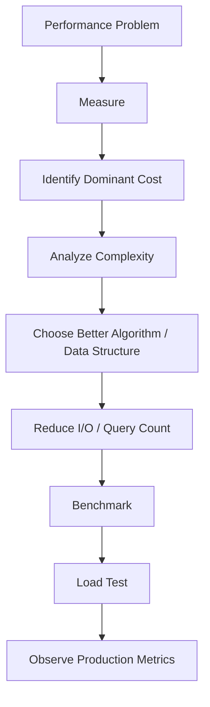
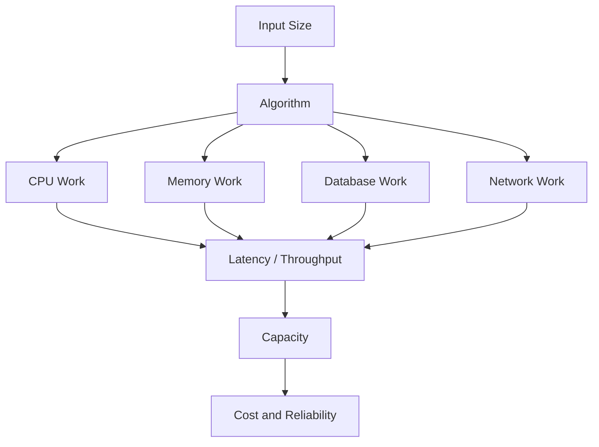

# 10- Time Complexity

## Overview

Time complexity describes how an algorithm's execution work grows as the size of its input increases.

For backend engineering, time complexity is more useful than asking:

> "How many milliseconds does this function take?"

A single benchmark measures one environment and one input size. Complexity analysis asks a more durable question:

> "How does the amount of work change as the workload grows?"

This matters because backend workloads rarely remain constant. A function that is fast for 100 records may become a major bottleneck at 100,000 or 10 million records.

Consider:

```python
def find_user(users: list[dict[str, object]], user_id: int):
    for user in users:
        if user["id"] == user_id:
            return user

    return None
```

For `n` users, the function may inspect every user.

Its time complexity is:

```text
O(n)
```

A database-backed lookup using an indexed column can instead provide approximately logarithmic or near-constant lookup behavior depending on the access path:

```text
Application
    ↓
PostgreSQL
    ↓
Index lookup
```

Understanding complexity helps engineers choose appropriate:

- data structures;
- algorithms;
- database queries;
- caching strategies;
- batching approaches;
- concurrency models;
- API designs.

---

## Why Time Complexity Matters

Complexity becomes increasingly important as input size grows.

Suppose an operation performs:

```text
n operations
```

For:

```text
n = 100
```

that is manageable.

For:

```text
n = 10,000,000
```

the same algorithm may become prohibitively expensive.

Consider the difference between:

```text
O(n)
O(n log n)
O(n²)
O(2ⁿ)
```

As `n` increases, their execution work diverges rapidly.

This is why algorithmic complexity is an important engineering constraint, not merely an interview topic.

---

## What Big O Means

Big O describes an asymptotic upper-growth classification.

For example:

```text
T(n) = 3n + 10
```

is:

```text
O(n)
```

because the linear term dominates as `n` becomes large.

Similarly:

```text
T(n) = 5n² + 2n + 100
```

is:

```text
O(n²)
```

The exact constants matter for real performance, but Big O intentionally focuses on growth behavior.

---

## Common Complexity Classes

| Complexity | Name | Typical example |
|---|---|---|
| `O(1)` | Constant | Dictionary lookup on average |
| `O(log n)` | Logarithmic | Binary search |
| `O(n)` | Linear | Single list scan |
| `O(n log n)` | Linearithmic | Efficient comparison sorting |
| `O(n²)` | Quadratic | Nested pairwise comparison |
| `O(n³)` | Cubic | Three nested loops |
| `O(2ⁿ)` | Exponential | Some brute-force subset algorithms |
| `O(n!)` | Factorial | Brute-force permutations |

The actual performance also depends on:

- constants;
- hardware;
- implementation;
- memory hierarchy;
- interpreter overhead;
- I/O;
- database latency;
- network latency;
- workload distribution.

---

## Constant Time `O(1)`

An operation is `O(1)` when its work does not grow with input size.

Example:

```python
def first_item(items: list[int]) -> int | None:
    if not items:
        return None

    return items[0]
```

The function performs one indexing operation regardless of whether the list contains:

```text
10 elements
100,000 elements
10,000,000 elements
```

The lookup remains constant-time in the algorithmic model.

---

## Dictionary Lookup

Python dictionaries are hash tables.

Typical lookup:

```python
user = users_by_id[user_id]
```

has average-case:

```text
O(1)
```

This is one reason dictionaries are fundamental to backend application code.

For example:

```python
users_by_id = {
    user["id"]: user
    for user in users
}
```

Then:

```python
user = users_by_id.get(user_id)
```

can avoid repeatedly scanning the entire collection.

---

## Average Case vs Worst Case

Complexity should specify the relevant case when it matters.

For a dictionary:

| Operation | Typical complexity |
|---|---|
| Lookup | Average `O(1)` |
| Insert | Average `O(1)` |
| Delete | Average `O(1)` |
| Iteration | `O(n)` |

Hash collisions can affect behavior, but Python's dictionary implementation is engineered for efficient average-case performance.

Do not interpret `O(1)` as:

> "Always exactly one CPU operation."

It means the expected growth is approximately constant with respect to `n`.

---

## Linear Time `O(n)`

A single pass over `n` items is generally:

```text
O(n)
```

Example:

```python
def find_order(
    orders: list[dict[str, object]],
    order_id: int,
) -> dict[str, object] | None:
    for order in orders:
        if order["id"] == order_id:
            return order

    return None
```

Worst-case behavior:

```text
n comparisons
```

Therefore:

```text
O(n)
```

---

## Multiple Linear Passes

Consider:

```python
def process(items: list[int]) -> int:
    total = sum(items)

    maximum = max(items)

    return total + maximum
```

This performs two linear operations:

```text
O(n) + O(n)
```

which simplifies to:

```text
O(n)
```

Big O ignores constant multipliers.

The function still performs approximately twice as much work as one pass, so benchmark-level performance can differ even though both are `O(n)`.

---

## Sequential Loops

These loops:

```python
for item in items:
    process(item)

for item in items:
    validate(item)
```

have:

```text
O(n) + O(n)
= O(2n)
= O(n)
```

They do not become `O(n²)` simply because there are two loops.

This is a common interview mistake.

---

## Nested Loops

Consider:

```python
for left in items:
    for right in items:
        compare(left, right)
```

If there are `n` items:

```text
n × n
= n²
```

Therefore:

```text
O(n²)
```

This becomes problematic quickly.

For:

```text
n = 10,000
```

the nested loop may perform approximately:

```text
100,000,000
```

pairwise operations.

---

## Quadratic Complexity in Backend Code

A common anti-pattern is repeatedly searching one collection inside another loop.

```python
for order in orders:
    for customer in customers:
        if order.customer_id == customer.id:
            attach_customer(order, customer)
```

If:

```text
orders = n
customers = m
```

the complexity is:

```text
O(n × m)
```

If both are approximately `n`:

```text
O(n²)
```

A dictionary index can often reduce the lookup:

```python
customers_by_id = {
    customer.id: customer
    for customer in customers
}

for order in orders:
    customer = customers_by_id.get(order.customer_id)

    if customer is not None:
        attach_customer(order, customer)
```

The complexity becomes approximately:

```text
Build index: O(m)
Lookups:     O(n)

Total:       O(n + m)
```

This is a common backend optimization.

---

## Logarithmic Time `O(log n)`

Logarithmic algorithms reduce the problem size substantially at each step.

Binary search is the classic example.

For a sorted collection:

```text
1,000,000 items
```

binary search requires only around:

```text
log₂(1,000,000)
≈ 20
```

comparisons.

The algorithm repeatedly eliminates approximately half the remaining search space.

---

## Binary Search

A simplified implementation:

```python
def binary_search(items: list[int], target: int) -> int | None:
    left = 0
    right = len(items) - 1

    while left <= right:
        middle = (left + right) // 2
        value = items[middle]

        if value == target:
            return middle

        if value < target:
            left = middle + 1
        else:
            right = middle - 1

    return None
```

The complexity is:

```text
O(log n)
```

provided the input is sorted and random access is efficient.

---

## Linearithmic Time `O(n log n)`

`O(n log n)` commonly appears in efficient comparison-based sorting algorithms.

For example:

```python
sorted_items = sorted(items)
```

Python's sorting implementation uses Timsort.

Its documented worst-case time complexity is:

```text
O(n log n)
```

Sorting is therefore generally more expensive than a single linear scan but substantially better than naive quadratic sorting for large inputs.

---

## Sorting and Backend Systems

Sorting frequently appears in backend operations:

- ranking results;
- ordering API responses;
- generating reports;
- processing event streams;
- preparing batches;
- prioritizing tasks.

Consider:

```python
orders.sort(key=lambda order: order.created_at)
```

If there are `n` orders, sorting contributes approximately:

```text
O(n log n)
```

If the database can perform the ordering efficiently:

```sql
SELECT *
FROM orders
ORDER BY created_at;
```

it may be preferable to push the operation to PostgreSQL, particularly when combined with filtering and indexes.

---

## Quadratic vs Linearithmic

The difference becomes significant at scale.

| `n` | `O(n)` | `O(n log n)` | `O(n²)` |
|---:|---:|---:|---:|
| 10 | 10 | ~33 | 100 |
| 100 | 100 | ~664 | 10,000 |
| 1,000 | 1,000 | ~9,966 | 1,000,000 |
| 10,000 | 10,000 | ~132,877 | 100,000,000 |

These values illustrate growth rather than actual execution time.

---

## Exponential Complexity `O(2ⁿ)`

Exponential algorithms can become impractical quickly.

A common example is brute-force subset enumeration:

```text
n items
→ 2ⁿ possible subsets
```

For:

```text
n = 10
```

there are:

```text
1,024
```

subsets.

For:

```text
n = 50
```

there are:

```text
1,125,899,906,842,624
```

subsets.

Such algorithms should generally be avoided for large production inputs unless the input size is tightly bounded.

---

## Factorial Complexity `O(n!)`

Generating every permutation can require:

```text
n!
```

possibilities.

For example:

```text
5! = 120
10! = 3,628,800
20! = 2,432,902,008,176,640,000
```

Brute-force factorial algorithms become impractical extremely quickly.

They may still be appropriate when:

- `n` is very small;
- the search space is inherently factorial;
- pruning dramatically reduces the actual search.

---

## Best, Average, and Worst Case

An algorithm can have different complexity depending on input.

For example:

```python
def find_user(users, user_id):
    for user in users:
        if user["id"] == user_id:
            return user
```

Best case:

```text
O(1)
```

if the first element matches.

Worst case:

```text
O(n)
```

if the match is last or absent.

Average-case complexity depends on assumptions about input distribution.

For production capacity planning, worst-case behavior and realistic workload distributions are often more important than best-case performance.

---

## Amortized Complexity

Some operations are occasionally expensive but inexpensive on average over many operations.

Python lists provide a useful example.

Appending:

```python
items.append(value)
```

is amortized:

```text
O(1)
```

although individual append operations can trigger a resize that costs more.

Conceptually:

```text
capacity:
[ ][ ][ ][ ]

append
  ↓
resize when full
  ↓
[ ][ ][ ][ ][ ][ ][ ][ ]
```

The occasional resize is distributed across many append operations.

---

## Python List Operations

Typical complexity:

| Operation | Complexity |
|---|---:|
| `items[i]` | `O(1)` |
| `items.append(x)` | Amortized `O(1)` |
| `items.pop()` | `O(1)` |
| `items.insert(0, x)` | `O(n)` |
| `items.pop(0)` | `O(n)` |
| `x in items` | `O(n)` |
| `items.remove(x)` | `O(n)` |
| `items.sort()` | `O(n log n)` |
| `len(items)` | `O(1)` |

The exact implementation details are CPython-specific, but these complexity characteristics are the useful engineering model for standard Python lists.

---

## `deque` for Queue Operations

Using a list as a queue can produce poor complexity:

```python
items.pop(0)
```

This requires shifting remaining elements and is:

```text
O(n)
```

For FIFO operations, use `collections.deque`:

```python
from collections import deque

queue = deque()

queue.append(item)
item = queue.popleft()
```

Both ends support efficient operations.

This is a practical example where choosing the right data structure changes algorithmic complexity.

---

## Set Membership

For a list:

```python
if user_id in user_ids:
    ...
```

membership is:

```text
O(n)
```

For a set:

```python
user_ids = set(user_ids)

if user_id in user_ids:
    ...
```

membership is typically:

```text
O(1)
```

on average.

The trade-off is additional memory for the set.

This is often worthwhile when many membership checks are required.

---

## Dictionary Indexing

Suppose an application repeatedly needs:

```python
find_customer(customers, customer_id)
```

A list scan costs:

```text
O(n)
```

for each lookup.

Building an index:

```python
customers_by_id = {
    customer.id: customer
    for customer in customers
}
```

costs:

```text
O(n)
```

once.

Subsequent average lookups are:

```text
O(1)
```

For `q` queries:

```text
Repeated scan:
O(nq)

Indexed:
O(n + q)
```

When `q` is large, indexing can produce a major improvement.

---

## Time-Space Trade-Off

Faster algorithms often require additional memory.

For example:

```python
customer_by_id = {
    customer.id: customer
    for customer in customers
}
```

uses extra memory but reduces repeated lookup time.

Conceptually:

```text
More memory
     ↓
Build index
     ↓
Faster queries
```

This is the classic time-space trade-off.

Senior-level optimization considers both dimensions rather than minimizing time at any cost.

---

## Complexity of Comprehensions

Consider:

```python
active_users = [
    user
    for user in users
    if user.is_active
]
```

This is:

```text
O(n)
```

The comprehension does not become more expensive simply because it is syntactically compact.

Nested comprehensions can have multiplicative complexity:

```python
pairs = [
    (a, b)
    for a in values
    for b in values
]
```

This is:

```text
O(n²)
```

Readable syntax does not change algorithmic complexity.

---

## Generator Expressions

Consider:

```python
active_users = (
    user
    for user in users
    if user.is_active
)
```

Creating the generator is approximately:

```text
O(1)
```

because the entire result is not computed immediately.

Consuming all `n` items still requires:

```text
O(n)
```

time.

Therefore:

```text
lazy evaluation reduces immediate work and memory
```

but does not eliminate the total work if all results are eventually consumed.

---

## Nested Function Calls

Complexity must include called functions.

Consider:

```python
for user in users:
    validate_user(user)
```

If:

```text
users = n
validate_user = O(n)
```

then the total complexity may be:

```text
O(n²)
```

Do not analyze loops in isolation.

A loop containing a seemingly small function can hide expensive work.

---

## Hidden Complexity

Common hidden sources include:

- `x in list`;
- `list.remove()`;
- sorting;
- copying;
- serialization;
- database queries;
- network requests;
- regex processing;
- nested comprehensions;
- ORM relationship access.

For example:

```python
for order in orders:
    if order.customer_id in customer_ids:
        ...
```

has different complexity depending on whether:

```python
customer_ids
```

is a list or set.

Data structure selection is part of complexity analysis.

---

## Database Queries

Application-level complexity is only one layer.

Consider:

```python
for user_id in user_ids:
    user = fetch_user(user_id)
```

If `fetch_user()` executes a database query, the application may have:

```text
O(n) Python iterations
+
n database round trips
```

This is the classic N+1 query problem.

The algorithmic issue is not merely CPU complexity.

It is also:

```text
network round trips
+
database work
+
connection utilization
+
latency
```

Batching or joining can often reduce the number of database interactions dramatically.

---

## N+1 Query Example

Problematic pattern:

```python
for order in orders:
    customer = get_customer(order.customer_id)
    attach_customer(order, customer)
```

If there are `n` orders:

```text
1 query for orders
+
n customer queries
```

This produces:

```text
O(n) database calls
```

A better approach is to fetch related data in one operation using appropriate ORM capabilities or SQL joins.

The exact implementation differs between Django and other data-access layers, but the principle is:

> Complexity analysis must include external calls, not just Python loops.

---

## PostgreSQL Indexes

Suppose an API executes:

```sql
SELECT *
FROM users
WHERE email = $1;
```

An appropriate index can allow PostgreSQL to avoid scanning the entire table.

Without an appropriate access path, a query may require work proportional to table size.

With an index, lookup can often be substantially more efficient.

The exact complexity depends on:

- index type;
- query planner;
- selectivity;
- table statistics;
- storage layout;
- query predicates.

Do not blindly assign a single Big O value to every database query.

Use:

```sql
EXPLAIN (ANALYZE, BUFFERS)
SELECT *
FROM users
WHERE email = 'user@example.com';
```

to understand actual database behavior.

---

## API Complexity

An API endpoint can have complexity based on request size.

Suppose:

```text
POST /bulk-users
```

accepts `n` users and validates each exactly once.

The application work may be approximately:

```text
O(n)
```

If each user is compared against every other user for duplicate detection:

```text
O(n²)
```

If duplicate detection uses a set:

```python
seen_ids: set[int] = set()

for user_id in user_ids:
    if user_id in seen_ids:
        raise ValueError("Duplicate user ID")

    seen_ids.add(user_id)
```

the expected complexity becomes:

```text
O(n)
```

This matters directly for API scalability.

---

## Pagination and Complexity

Returning all records:

```http
GET /orders
```

may create work proportional to the number of records returned.

Pagination limits the working set:

```http
GET /orders?limit=100&offset=1000
```

However, large offset pagination can become inefficient because the database may still need to traverse skipped rows.

Keyset or cursor pagination can often provide more stable performance for large datasets:

```http
GET /orders?limit=100&after=2026-09-01T12:00:00Z
```

The database can use an indexed ordering key rather than repeatedly skipping large numbers of rows.

---

## Complexity and Batch Processing

Suppose a service processes:

```text
10 million records
```

A single giant in-memory operation may have acceptable asymptotic complexity but unacceptable memory and latency.

Batching:

```text
10,000-record batch
       ↓
process
       ↓
release
       ↓
next batch
```

does not necessarily change the overall `O(n)` time complexity.

It improves:

- peak memory;
- failure isolation;
- backpressure;
- operational control;
- transaction size.

Complexity is necessary but not sufficient for production design.

---

## Complexity and Caching

Caching can trade memory and consistency complexity for reduced computation.

Without cache:

```text
request
  ↓
expensive computation
  ↓
response
```

With cache:

```text
request
  ↓
cache lookup O(1) average
  ├── hit → response
  └── miss → computation → cache
```

For Redis:

```text
Application
    ↓
Redis
    ↓
cache hit
```

The effective request cost can decrease substantially when the hit rate is high.

However, caching introduces:

- memory/storage cost;
- invalidation;
- stale data;
- consistency concerns;
- cache stampedes.

---

## Complexity and Concurrency

Concurrency does not automatically improve algorithmic complexity.

An `O(n²)` operation remains `O(n²)` when executed concurrently.

Concurrency can reduce elapsed time when work can overlap:

```text
Sequential:
A → B → C → D

Concurrent:
A ─────┐
B ─────┼──► completion
C ─────┤
D ─────┘
```

But it may also introduce:

- synchronization overhead;
- contention;
- memory overhead;
- scheduling overhead;
- database pressure.

Complexity and concurrency should be analyzed separately.

---

## CPU-Bound vs I/O-Bound Complexity

For backend systems, asymptotic CPU complexity is only part of the picture.

Consider:

```text
O(n) CPU work
+
100 ms database call
```

The database latency may dominate.

Similarly:

```text
O(n²) CPU work
```

may dominate a workload with negligible I/O.

A useful model is:

```text
Request cost
=
CPU work
+
memory work
+
database work
+
network work
+
serialization
+
synchronization
```

Senior performance analysis considers all of these.

---

## Complexity and Serialization

Serialization can become a hidden `O(n)` or worse operation depending on the structure and serializer.

For example:

```python
payload = {
    "users": users,
}
```

Serializing all `n` users requires processing the data.

If nested structures contain `m` elements per user, total work can approach:

```text
O(n × m)
```

Large REST or gRPC payloads should therefore be bounded and designed around explicit schemas.

---

## Complexity and Regular Expressions

Regex performance can be input-sensitive.

Simple expressions can behave approximately linearly, while poorly designed patterns with heavy backtracking can exhibit severe performance degradation.

For externally supplied input:

- avoid pathological regex patterns;
- bound input size;
- test worst-case strings;
- use timeouts or safer regex engines where appropriate.

This is both a performance and security consideration.

---

## Amortized vs Worst-Case Complexity

Different complexity guarantees answer different questions.

| Analysis | Question |
|---|---|
| Best case | What is the minimum possible work? |
| Average case | What is expected work under assumptions? |
| Worst case | What is the maximum algorithmic work? |
| Amortized | What is the average cost over a sequence of operations? |

For production engineering:

- worst-case behavior matters for resilience;
- average-case behavior matters for capacity planning;
- amortized analysis matters for data structures;
- actual benchmarks matter for implementation decisions.

---

## Big O Is Not Runtime

Two algorithms can both be:

```text
O(n)
```

but have very different real performance.

For example:

```python
sum(values)
```

and:

```python
complex_python_function(value)
```

may both process `n` elements but have very different constant factors.

Similarly:

```text
O(n)
```

does not mean:

```text
n milliseconds
```

Big O describes growth, not absolute latency.

---

## Constants Matter in Production

Suppose:

```text
Algorithm A = 100n operations
Algorithm B = n log n operations
```

For small `n`, A may be faster.

For sufficiently large `n`, B may win.

Similarly, a theoretically better algorithm may be slower for realistic workloads because of:

- allocation overhead;
- cache locality;
- Python interpreter overhead;
- function-call overhead;
- network latency;
- database behavior.

Use complexity to narrow choices, then benchmark realistic workloads.

---

## Complexity and Memory

Time and space complexity are related but distinct.

For example:

```python
users_by_id = {
    user.id: user
    for user in users
}
```

Time:

```text
O(n)
```

Additional space:

```text
O(n)
```

The index improves lookup time at the cost of memory.

A senior engineer evaluates:

```text
time complexity
+
space complexity
+
operational constraints
```

together.

---

## Space Complexity

Space complexity describes how additional memory usage grows with input size.

Example:

```python
result = [transform(item) for item in items]
```

The result list requires storage proportional to the number of output items:

```text
O(n)
```

A generator:

```python
result = (transform(item) for item in items)
```

can keep additional working memory much smaller when consumed incrementally.

This is why time and space complexity should be analyzed together.

---

## Recursive Algorithms

Recursion can introduce both time and space complexity.

Consider a recursive tree traversal:

```python
def visit(node):
    if node is None:
        return

    visit(node.left)
    visit(node.right)
```

If there are `n` nodes:

```text
Time:  O(n)
Space: O(h)
```

where `h` is tree height due to the call stack.

For a balanced tree:

```text
h ≈ log n
```

For a highly skewed tree:

```text
h ≈ n
```

Python also has a recursion-depth limit, so iterative approaches may be preferable for deeply nested structures.

---

## Complexity of Graph Algorithms

Graph algorithms often depend on:

```text
V = number of vertices
E = number of edges
```

For example, BFS and DFS are typically:

```text
O(V + E)
```

when using an appropriate adjacency representation.

This matters for backend systems that process:

- dependency graphs;
- workflow graphs;
- relationship networks;
- service topology;
- authorization graphs.

The input-size definition must be explicit.

---

## Complexity of Multiple Inputs

Do not automatically collapse different input sizes.

Suppose:

```python
for user in users:
    for permission in permissions:
        check(user, permission)
```

If:

```text
n = number of users
m = number of permissions
```

the complexity is:

```text
O(nm)
```

not necessarily:

```text
O(n²)
```

Only use `O(n²)` when both dimensions scale together and treating them as one variable is justified.

---

## Complexity Analysis Workflow

A practical process:

1. Identify the input size variables.
2. Identify the dominant operation.
3. Count how often that operation executes.
4. Analyze nested and sequential operations.
5. Include called functions.
6. Include database and network operations where relevant.
7. Determine best, average, worst, or amortized behavior.
8. Analyze additional space usage.
9. Validate with benchmarks and production telemetry.

Example:

```python
for order in orders:
    customer = customers_by_id.get(order.customer_id)
    process(order, customer)
```

Analysis:

```text
Build index: O(m)
Loop:        O(n)
Lookup:      O(1) average

Total:       O(n + m)
```

---

## Production Optimization Strategy

A practical optimization sequence is:



Do not optimize based solely on code appearance.

Measure where the system actually spends time.

---

## Profiling vs Complexity Analysis

These techniques answer different questions.

| Technique | Answers |
|---|---|
| Complexity analysis | How does work scale with input size? |
| Benchmarking | How fast is this implementation under a given workload? |
| CPU profiling | Where is CPU time being spent? |
| Memory profiling | Where is memory being allocated or retained? |
| Database `EXPLAIN` | How is the database executing the query? |
| Distributed tracing | Where does request latency accumulate? |

A senior engineer typically uses several together.

---

## Benchmarking

Python's `timeit` can measure small operations:

```python
from timeit import timeit

duration = timeit(
    "lookup.get(5000)",
    setup="lookup = {i: i for i in range(10_000)}",
    number=100_000,
)

print(duration)
```

For realistic backend workloads, use application-level benchmarks and load tests rather than microbenchmarks alone.

Measure:

- throughput;
- p50 latency;
- p95 latency;
- p99 latency;
- CPU;
- memory;
- database load.

---

## Database Complexity Validation

For PostgreSQL queries, inspect the actual plan:

```sql
EXPLAIN (ANALYZE, BUFFERS)
SELECT id, email
FROM users
WHERE email = 'user@example.com';
```

Look for:

- sequential scans;
- index scans;
- row estimates;
- actual rows;
- loops;
- execution time;
- buffer activity.

This is often more valuable than assigning an abstract Big O label to the SQL statement.

---

## Distributed Systems

Microservices introduce additional complexity dimensions.

A request may perform:

```text
API Gateway
   ↓
Service A
   ↓
Service B
   ↓
PostgreSQL
   ↓
Redis
```

Even if every local operation is efficient, repeated network calls can dominate latency.

For example:

```text
100 sequential service calls
```

can be much worse than:

```text
1 batched request
```

The application-level algorithm may still be `O(n)`, but the distributed cost differs dramatically.

---

## Complexity and API Design

Avoid APIs that require clients to repeatedly request related resources.

Potentially inefficient:

```text
GET /orders
GET /orders/1/customer
GET /orders/2/customer
GET /orders/3/customer
...
```

A better design may:

- embed required summary data;
- provide batch endpoints;
- support filtering;
- use server-side joins;
- provide appropriate expansion options.

Algorithmic thinking applies to API request patterns as well as local code.

---

## Complexity and AWS

Cloud systems make inefficient algorithms expensive.

An application that performs unnecessary work can increase:

- CPU utilization;
- Lambda execution duration;
- ECS/EKS resource requirements;
- RDS load;
- ElastiCache usage;
- network traffic;
- Kafka processing time.

A seemingly small `O(n²)` operation can therefore become a direct infrastructure-cost problem at scale.

---

## Security Considerations

Complexity can become a security concern when attackers control input size.

For example:

```text
attacker
   ↓
large request
   ↓
O(n²) processing
   ↓
CPU exhaustion
   ↓
service degradation
```

This is an algorithmic denial-of-service risk.

Protect externally controlled workloads with:

- request-size limits;
- pagination;
- bounded batch sizes;
- timeouts;
- rate limiting;
- efficient algorithms;
- safe regex patterns;
- concurrency limits.

Complexity analysis is therefore part of defensive API design.

---

## Reliability Considerations

Worst-case complexity affects tail behavior.

A request that is normally:

```text
20 ms
```

but occasionally triggers:

```text
O(n²)
```

work can produce severe p99 latency.

For production systems, analyze:

- maximum request size;
- maximum batch size;
- worst-case query cardinality;
- pathological input;
- retry amplification.

A performance problem that occurs only under peak load is still a reliability problem.

---

## High Availability

Poor complexity can reduce availability through resource exhaustion.

For example:

```text
Traffic spike
    ↓
more requests
    ↓
O(n²) work/request
    ↓
CPU saturation
    ↓
queue growth
    ↓
latency increase
    ↓
timeouts
    ↓
retries
    ↓
more traffic
```

This feedback loop can destabilize a service.

Efficient algorithms, bounded inputs, backpressure, and load shedding help prevent this failure mode.

---

## Retry Amplification

Retries can multiply expensive work.

Suppose:

```text
1 request
→ O(n²) computation
```

times three retries becomes:

```text
3 × O(n²)
```

At the system level, a local algorithmic problem can become a distributed load multiplier.

Retries should therefore be:

- bounded;
- timeout-aware;
- jittered where appropriate;
- used only for retryable failures.

---

## Monitoring Considerations

Useful production metrics include:

- request rate;
- request latency;
- p50/p95/p99;
- CPU utilization;
- memory usage;
- database query latency;
- query count;
- cache hit rate;
- queue depth;
- batch size;
- error rate;
- timeout rate.

When an algorithm depends on input size, consider measuring that size explicitly.

For example:

```text
request_items_count
batch_size
query_result_rows
payload_bytes
```

This makes scaling behavior observable.

---

## Common Mistakes

### Counting Lines Instead of Operations

A five-line nested algorithm can be much more expensive than a twenty-line linear algorithm.

Complexity is about execution behavior, not source-code length.

### Assuming Two Loops Mean `O(n²)`

Sequential loops are:

```text
O(n) + O(n) = O(n)
```

Nested loops are potentially:

```text
O(n²)
```

### Ignoring Called Functions

A loop can hide an expensive function.

### Ignoring Data Structures

`x in list` is `O(n)` while set membership is typically `O(1)` average.

### Ignoring Database Calls

A loop containing one query per item creates an N+1 pattern.

### Assuming Big O Gives Exact Runtime

It does not account for constants, hardware, I/O, or implementation details.

### Optimizing Without Measuring

An algorithmic improvement that is irrelevant to the actual bottleneck adds complexity without value.

### Ignoring Space Complexity

A faster algorithm may require substantially more memory.

---

## Production Pitfalls

### N+1 Database Queries

A linear Python loop can produce hundreds or thousands of database round trips.

### Unbounded API Input

Even an `O(n)` endpoint can become expensive when `n` is unlimited.

### Large In-Memory Sorting

Sorting millions of records inside a worker can create substantial CPU and memory pressure.

### Repeated Linear Searches

Repeatedly scanning the same list can turn:

```text
O(n)
```

into:

```text
O(n²)
```

### Accidental Quadratic Deduplication

Patterns such as:

```python
unique = []

for item in items:
    if item not in unique:
        unique.append(item)
```

can become quadratic.

Use an appropriate set or dictionary when ordering and hashability permit.

### Retry Multiplication

Expensive operations can be repeated by retries and create cascading load.

### Overusing Concurrency

Parallelizing an inefficient algorithm can increase database load and memory consumption without fixing the underlying complexity.

---

## Practical Refactoring Example

### Before

```python
def attach_customers(
    orders: list[dict[str, int]],
    customers: list[dict[str, int]],
) -> None:
    for order in orders:
        for customer in customers:
            if order["customer_id"] == customer["id"]:
                order["customer"] = customer
                break
```

If there are `n` orders and `m` customers:

```text
O(nm)
```

### After

```python
def attach_customers(
    orders: list[dict[str, int]],
    customers: list[dict[str, int]],
) -> None:
    customers_by_id = {
        customer["id"]: customer
        for customer in customers
    }

    for order in orders:
        customer = customers_by_id.get(order["customer_id"])

        if customer is not None:
            order["customer"] = customer
```

Complexity:

```text
Build dictionary: O(m)
Process orders:   O(n) average

Total:            O(n + m)
```

The trade-off is additional memory:

```text
Space: O(m)
```

This is a typical production optimization: spend bounded memory to eliminate repeated work.

---

## Best Practices

### Choose Data Structures Based on Operations

Ask what the workload needs:

- indexed access;
- membership;
- insertion;
- deletion;
- ordering;
- uniqueness;
- key-based lookup.

Then choose accordingly.

### Avoid Repeated Work

Build indexes or caches when repeated computation is expensive and memory allows it.

### Push Work to the Right Layer

Let PostgreSQL handle database filtering, joining, and indexing where appropriate rather than pulling excessive data into Python.

### Bound Input Size

API and batch workloads should have explicit limits.

### Batch External Operations

Prefer:

```text
one batch operation
```

over:

```text
N individual network/database operations
```

when semantics allow it.

### Analyze Space and Time Together

A fast algorithm that exhausts memory is not production-ready.

### Measure Real Workloads

Use profiling, benchmarks, load tests, and production telemetry.

### Consider Tail Latency

Worst-case input sizes and pathological data can disproportionately affect p95/p99 latency.

---

## Complexity Checklist

When reviewing an algorithm, ask:

- What are the input dimensions?
- What is the dominant operation?
- How many times does it execute?
- Are loops nested or sequential?
- What functions are called inside loops?
- Are there hidden list scans?
- Are there repeated database queries?
- Are network calls involved?
- Is sorting performed?
- Is additional memory allocated?
- What happens at maximum input size?
- What is the worst-case behavior?
- What is the realistic average-case behavior?
- Can the operation be batched or indexed?
- Has the optimization been measured?

---

## Senior-Level Mental Model

Time complexity is a model for reasoning about scalability.



A senior engineer does not stop at:

```text
"This function is O(n)."
```

The more useful analysis is:

```text
What is n?
How large can n become?
What is the constant factor?
What memory does the operation require?
Does it call PostgreSQL?
Does it perform network I/O?
Does it run once or once per request?
Can requests execute concurrently?
What happens at peak traffic?
What happens when retries occur?
```

This turns algorithm analysis into production capacity reasoning.

---

## Key Takeaways

- **Time complexity describes how computational work scales with input size:** `O(1)`, `O(log n)`, `O(n)`, `O(n log n)`, and `O(n²)` represent fundamentally different scaling behavior.
- **Data-structure selection can change complexity dramatically:** replacing repeated list scans with dictionaries or sets can turn repeated `O(n)` lookups into average `O(1)` lookups.
- **Backend complexity includes more than Python CPU work:** database queries, network round trips, serialization, retries, and external-service calls can dominate real request latency.
- **Time and space complexity must be evaluated together:** indexes, caches, batching, and faster algorithms often trade additional memory for reduced execution time.
- **Production optimization requires measurement and bounded workloads:** analyze worst-case inputs, profile real bottlenecks, benchmark realistic traffic, and validate p95/p99 latency, resource usage, and capacity before adopting an optimization.