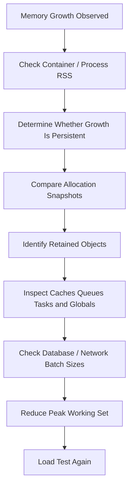
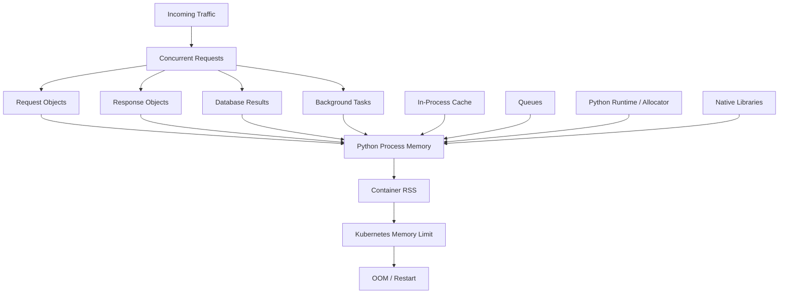

# 11- Space Complexity

## Overview

Space complexity describes how an algorithm's memory requirements grow as the size of its input increases.

For Python backend systems, space complexity is especially important because memory usage is affected by more than the logical data being processed. Python objects carry runtime overhead, containers maintain internal structures, and applications may simultaneously hold request data, database results, caches, queues, serialized payloads, and framework objects.

A function that is `O(n)` in time can also be `O(n)` in additional memory:

```python
def active_users(users):
    return [
        user
        for user in users
        if user.is_active
    ]
```

The resulting list grows with the number of users.

A streaming implementation can keep additional working memory close to `O(1)`:

```python
def iter_active_users(users):
    for user in users:
        if user.is_active:
            yield user
```

Both process the input in linear time if all results are consumed, but their memory behavior is different.

Space complexity therefore helps answer:

- How much memory does this algorithm require?
- Does memory grow with input size?
- Can the workload be streamed?
- Is an index or cache worth the memory cost?
- Can multiple requests exhaust container memory?
- Does concurrency multiply memory consumption?

---

## What Space Complexity Measures

Space complexity describes how memory usage scales with input size.

A useful distinction is:

```text
Total space
=
input space
+
auxiliary space
+
output space
```

In algorithm analysis, engineers often focus on **auxiliary space**: additional memory required by the algorithm beyond the input itself.

For production systems, however, total memory matters because the operating system and Kubernetes container care about actual resident memory, not whether an allocation is classified as "input" or "auxiliary."

---

## Common Space Complexity Classes

| Complexity | Meaning | Typical example |
|---|---|---|
| `O(1)` | Constant additional space | A few scalar variables |
| `O(log n)` | Logarithmic additional space | Recursive balanced-tree traversal |
| `O(n)` | Linear additional space | Copying `n` items into a new list |
| `O(n log n)` | Linearithmic additional space | Certain algorithms/data structures |
| `O(n²)` | Quadratic additional space | Storing all pairwise combinations |

As with time complexity, Big O describes growth rather than exact memory consumption.

---

## Constant Space `O(1)`

An algorithm uses `O(1)` auxiliary space when the amount of additional memory does not grow with input size.

Example:

```python
def find_max(values: list[int]) -> int:
    if not values:
        raise ValueError("values must not be empty")

    maximum = values[0]

    for value in values[1:]:
        if value > maximum:
            maximum = value

    return maximum
```

The algorithm keeps only a fixed number of variables:

```text
maximum
value
```

Therefore, auxiliary space is approximately:

```text
O(1)
```

The input list itself is `O(n)`, but the algorithm does not create another structure proportional to `n`.

---

## Linear Space `O(n)`

Consider:

```python
def normalize(values: list[int]) -> list[int]:
    return [value * 2 for value in values]
```

The output contains `n` elements.

Therefore, additional space is:

```text
O(n)
```

The algorithm needs memory proportional to the number of results produced.

This is often completely reasonable when the output itself must be materialized.

---

## Input Space vs Auxiliary Space

Consider:

```python
def count_positive(values: list[int]) -> int:
    count = 0

    for value in values:
        if value > 0:
            count += 1

    return count
```

If the input contains `n` elements:

```text
Input space:     O(n)
Auxiliary space: O(1)
```

It is misleading to say the function "uses `O(1)` memory" without specifying what is being measured.

A more precise statement is:

> The algorithm requires `O(1)` auxiliary space in addition to the `O(n)` input.

---

## Output Space

Consider:

```python
def double(values: list[int]) -> list[int]:
    return [value * 2 for value in values]
```

The output requires `O(n)` space.

There are two common conventions:

### Auxiliary Space

Do not count the output:

```text
O(1)
```

if the transformation itself requires no other growing structure.

### Total Space

Count the output:

```text
O(n)
```

For production memory planning, total allocations are generally more useful.

---

## Python Objects Have Memory Overhead

Python does not store most values as raw machine primitives inside ordinary containers.

For example:

```python
values = [1, 2, 3]
```

conceptually contains references to Python integer objects.

The memory footprint includes:

```text
list object
+
list allocation for references
+
integer objects
```

This means:

```text
O(n)
```

does not tell you the actual number of bytes.

Two `O(n)` implementations can have very different memory consumption.

---

## Container Overhead

Different Python containers have different memory characteristics.

| Structure | Typical purpose | Memory characteristic |
|---|---|---|
| `list` | Ordered sequence | Dynamic array of references |
| `tuple` | Fixed sequence | Compact fixed-size reference array |
| `dict` | Key-value lookup | Hash-table structures plus objects |
| `set` | Membership/uniqueness | Hash-table structures |
| `deque` | Double-ended queue | Block-based deque structure |
| Generator | Lazy iteration | Small state object plus retained references |

Exact memory usage is implementation-dependent and Python-version-dependent.

Use measurement tools when byte-level behavior matters.

---

## List vs Generator

Materializing data:

```python
users = [
    transform(user)
    for user in source
]
```

requires memory proportional to the result size:

```text
O(n)
```

A generator:

```python
users = (
    transform(user)
    for user in source
)
```

does not materialize all results immediately.

Additional working memory can remain approximately constant relative to the number of generated results.

This is one of the most important memory optimization patterns in Python.

---

## Streaming Large Files

Avoid loading a large file into memory unnecessarily.

Potentially expensive:

```python
from pathlib import Path

data = Path("events.log").read_text()
lines = data.splitlines()

for line in lines:
    process(line)
```

This can simultaneously hold:

```text
entire file string
+
list of lines
+
individual string objects
```

A streaming approach is preferable:

```python
from pathlib import Path

def process_file(path: Path) -> None:
    with path.open("rt", encoding="utf-8") as file:
        for line in file:
            process(line)
```

The application processes records incrementally rather than materializing the entire file.

---

## Streaming HTTP Responses

The same principle applies to network data.

Instead of:

```text
HTTP response
    ↓
download entire payload
    ↓
deserialize everything
    ↓
process
```

a streaming design can use:

```text
HTTP response
    ↓
read chunk
    ↓
process
    ↓
read next chunk
    ↓
process
```

This reduces peak application memory.

The exact implementation depends on the HTTP client and protocol, but the architectural principle is the same: **bound the amount of data simultaneously resident in memory**.

---

## Database Result Sets

A common backend memory problem is materializing a very large query result.

Conceptually expensive:

```python
rows = repository.fetch_all()

for row in rows:
    process(row)
```

If millions of rows are returned, the application may retain the entire result set.

Prefer:

- server-side cursors where supported;
- ORM iteration APIs;
- pagination;
- chunked queries;
- streaming exports;
- bounded batch processing.

The goal is to transform:

```text
O(n) peak memory
```

into something closer to:

```text
O(batch_size)
```

when the complete result does not need to exist simultaneously.

---

## Batch Processing

Suppose a job processes one million records.

Instead of:

```python
records = fetch_all_records()

for record in records:
    process(record)
```

use bounded batches:

```python
BATCH_SIZE = 1_000

for batch in fetch_batches(batch_size=BATCH_SIZE):
    for record in batch:
        process(record)
```

If the batch size is fixed independently of total input size:

```text
Peak working memory ≈ O(batch_size)
```

instead of:

```text
O(n)
```

This is one of the most practical techniques for controlling memory in ETL and background workloads.

---

## Space Complexity of Common Python Operations

| Operation | Typical additional space |
|---|---:|
| `values[i]` | `O(1)` |
| `values.append(x)` | Amortized `O(1)` additional allocation |
| `list(values)` | `O(n)` |
| `values.copy()` | `O(n)` |
| `sorted(values)` | `O(n)` auxiliary/output-related memory |
| List comprehension | `O(n)` for materialized output |
| Generator expression | Approximately `O(1)` additional working space |
| `set(values)` | `O(n)` |
| `dict.fromkeys(values)` | `O(n)` |
| `values[:]` | `O(n)` |
| `values + other` | `O(n + m)` |

Exact memory behavior can depend on object types and implementation details.

---

## Sorting and Memory

There is an important distinction between:

```python
values.sort()
```

and:

```python
sorted(values)
```

The first mutates the existing list:

```python
values.sort()
```

while the second produces a new list:

```python
result = sorted(values)
```

Therefore, when memory matters, avoid creating unnecessary copies.

Python's sorting implementation uses additional memory internally, and the exact allocation behavior should not be reduced to a simplistic "sorting is always `O(1)` space" rule.

---

## Shallow Copies

A shallow copy creates a new outer container.

```python
items = [
    {"id": 1},
    {"id": 2},
]

copied = items.copy()
```

The outer list is new, but nested dictionaries are shared.

Memory therefore grows for the new list structure:

```text
O(n)
```

but does not duplicate the entire nested object graph.

This can be substantially cheaper than a deep copy.

---

## Deep Copies

Consider:

```python
from copy import deepcopy

copied = deepcopy(configuration)
```

Deep copying recursively duplicates supported nested objects.

If the object graph contains `n` objects, memory usage can approach:

```text
O(n)
```

for the copied graph.

For large request payloads, configuration graphs, ORM structures, or nested data, deep copying can cause:

- significant allocations;
- higher CPU usage;
- garbage-collection pressure;
- higher peak RSS;
- increased latency.

Use deep copying deliberately rather than as a default safety mechanism.

---

## Sets and Dictionaries

A set can improve lookup complexity:

```python
allowed_ids = set(user_ids)
```

but it requires additional memory:

```text
Space: O(n)
```

Similarly:

```python
users_by_id = {
    user.id: user
    for user in users
}
```

uses:

```text
O(n)
```

additional container storage.

This illustrates the time-space trade-off:

```text
more memory
    ↓
faster lookup
```

The trade-off is worthwhile when lookup frequency or latency justifies the memory cost.

---

## Hash Table Memory

Dictionaries and sets maintain internal hash-table structures.

Their memory usage is not simply:

```text
number_of_items × size_of_value
```

There is additional overhead for:

- hash-table capacity;
- entries;
- references;
- keys;
- values;
- object headers.

Hash tables also maintain spare capacity to support efficient operations.

Consequently, memory estimates based only on payload size can significantly underestimate Python process memory.

---

## Recursion and Stack Space

Recursive algorithms consume call-stack space.

Example:

```python
def traverse(node) -> None:
    if node is None:
        return

    traverse(node.left)
    traverse(node.right)
```

For a tree with height `h`:

```text
Auxiliary space: O(h)
```

A balanced tree may have:

```text
h = O(log n)
```

while a highly skewed tree can have:

```text
h = O(n)
```

Python also has a recursion-depth limit, so deeply recursive production workloads often need an iterative design.

---

## Iterative vs Recursive Traversal

Recursive:

```python
def walk(node):
    if node is None:
        return

    walk(node.left)
    walk(node.right)
```

The call stack grows with tree depth.

An iterative approach:

```python
def walk(root):
    if root is None:
        return

    stack = [root]

    while stack:
        node = stack.pop()

        if node.right is not None:
            stack.append(node.right)

        if node.left is not None:
            stack.append(node.left)
```

uses an explicit stack.

The asymptotic space requirement can still be `O(h)`, but the memory is now represented by an application-controlled data structure rather than the Python call stack.

---

## Queues and Backpressure

Queues are a major source of memory growth in backend systems.

Consider:

```text
Producer
   ↓
Queue
   ↓
Consumer
```

If producers consistently outpace consumers:

```text
queue size → → → → grows
```

Memory consumption can grow with queue depth.

For in-process queues, use bounded capacity where appropriate:

```python
from queue import Queue

queue = Queue(maxsize=1_000)
```

A bounded queue provides backpressure rather than allowing unbounded memory growth.

---

## Asyncio and Memory

Creating many asyncio tasks consumes memory.

Potentially dangerous:

```python
tasks = [
    asyncio.create_task(process(item))
    for item in items
]

await asyncio.gather(*tasks)
```

If `items` contains hundreds of thousands of entries, the application may retain a very large task set.

Prefer bounded concurrency:

```python
import asyncio

semaphore = asyncio.Semaphore(100)

async def limited_process(item):
    async with semaphore:
        await process(item)
```

A semaphore limits concurrency, but it does not by itself limit how many task objects you create. For truly large inputs, combine bounded concurrency with streaming or bounded task creation.

---

## Celery and Background Workers

A background worker can also accumulate memory through:

- large task arguments;
- large result payloads;
- retained references;
- batch processing;
- unbounded prefetch;
- task-level caches.

Avoid passing huge Python objects through a task queue when a durable identifier is sufficient.

Prefer:

```text
Celery task
    ↓
record ID
    ↓
worker
    ↓
database/object storage
```

rather than:

```text
Celery task
    ↓
entire multi-megabyte object graph
```

This reduces broker traffic and worker memory pressure.

---

## FastAPI and Django Request Memory

Every concurrent request can consume memory.

A simplified model is:

```text
Process memory
≈
baseline application memory
+
concurrent requests × per-request memory
+
caches
+
connection state
+
background tasks
```

If:

```text
per-request memory = 5 MB
concurrency = 500
```

the request working set alone can approach:

```text
2.5 GB
```

before accounting for the application baseline and native allocations.

This is why memory-efficient request handling must consider concurrency, not only individual request size.

---

## Kubernetes Memory

Kubernetes enforces container memory limits.

For example:

```yaml
resources:
  requests:
    memory: "512Mi"
  limits:
    memory: "1Gi"
```

If a Python process exceeds its effective container memory limit, it can be terminated by the platform.

The important relationship is:

```text
per-request memory
× concurrency
+
process baseline
+
native memory
+
worker processes
+
caches
<
container memory limit
```

A memory-safe function in isolation can still cause an OOMKilled container when executed concurrently.

---

## Multiple Worker Processes

Suppose a service uses:

```text
4 worker processes
```

If each process has a roughly 300 MB resident working set:

```text
4 × 300 MB
=
1.2 GB
```

before accounting for additional overhead.

Process-based concurrency therefore multiplies memory consumption.

This is especially important with:

- Gunicorn;
- Celery workers;
- multiprocessing;
- Kubernetes replicas.

Capacity planning must consider the process topology.

---

## Copy-on-Write

Some process models can initially share physical memory pages through copy-on-write.

Conceptually:

```text
Parent process
      ↓ fork
 ┌────┴────┐
Worker A  Worker B
```

Pages can initially be shared.

If a worker modifies a shared page, the operating system may create a private copy.

Therefore, large mutable global structures can become expensive under multiple processes.

Preloading data may reduce startup duplication in some architectures, but mutating large shared structures can eliminate much of the memory benefit.

---

## `__slots__`

Python classes normally provide an instance dictionary for dynamic attributes.

For large populations of small objects, `__slots__` can reduce per-instance memory overhead:

```python
class UserRecord:
    __slots__ = ("user_id", "email")

    def __init__(self, user_id: int, email: str) -> None:
        self.user_id = user_id
        self.email = email
```

This can matter when millions of instances exist simultaneously.

However:

- exact savings depend on implementation;
- slots do not recursively reduce referenced object memory;
- slots do not make objects immutable;
- slots do not make objects thread-safe;
- framework compatibility should be considered.

For data-oriented models, modern dataclasses also support:

```python
from dataclasses import dataclass

@dataclass(slots=True)
class UserRecord:
    user_id: int
    email: str
```

---

## `sys.getsizeof()`

Python provides:

```python
import sys

size = sys.getsizeof(value)
```

This measures the object's immediate memory footprint as defined by the Python implementation.

It does not recursively measure referenced objects.

For example:

```python
values = [1, 2, 3]

print(sys.getsizeof(values))
```

does not represent the complete memory consumed by:

```text
list
+
integer objects
```

Therefore, `sys.getsizeof()` is useful for targeted inspection but insufficient for complete application memory analysis.

---

## Measuring Process Memory

Operating-system-level memory metrics are often more useful for production analysis.

Important concepts include:

- RSS;
- virtual memory;
- anonymous memory;
- file-backed memory;
- allocator arenas;
- native extension allocations.

A simplified view:

```text
Python application
      ↓
Python objects
      ↓
Python allocator
      ↓
C runtime / OS allocator
      ↓
Virtual memory
      ↓
Physical memory / RSS
```

Deleting a Python object does not guarantee an immediate proportional decrease in process RSS.

---

## Python Allocator and RSS

CPython uses specialized allocation mechanisms for many small objects.

When objects are freed:

```text
Python object released
       ↓
allocator reuses memory
```

The memory may remain mapped to the process for reuse rather than immediately returning to the operating system.

Therefore:

```text
objects freed
≠
RSS immediately decreases
```

This distinction is important when investigating apparent memory leaks.

---

## `tracemalloc`

Python's `tracemalloc` can track Python-level memory allocations.

Example:

```python
import tracemalloc

tracemalloc.start()

snapshot_before = tracemalloc.take_snapshot()

run_workload()

snapshot_after = tracemalloc.take_snapshot()

for statistic in snapshot_after.compare_to(
    snapshot_before,
    "lineno",
)[:10]:
    print(statistic)
```

This can help identify Python source locations associated with increased allocations.

However, `tracemalloc` does not represent every source of process memory, particularly memory allocated outside Python's tracked allocation mechanisms.

---

## Memory Profiling Strategy

A practical investigation flow is:



The goal is to distinguish:

```text
legitimate growth
```

from:

```text
unbounded retention
```

and:

```text
allocator / native-memory behavior
```

---

## Lazy Evaluation

Lazy evaluation is one of the most effective memory-management techniques for large data streams.

Materialized:

```python
values = [transform(x) for x in source]
```

Lazy:

```python
values = (transform(x) for x in source)
```

A generator only produces the next value when requested.

For a pipeline:

```python
def transformed(source):
    for item in source:
        if should_process(item):
            yield transform(item)
```

the pipeline can process data incrementally.

This is particularly useful for:

- files;
- database exports;
- Kafka consumers;
- ETL;
- large API payloads;
- batch jobs.

---

## Generator Pipelines

Multiple generators can form a memory-efficient pipeline:

```python
def read_events(file):
    for line in file:
        yield parse_event(line)


def valid_events(events):
    for event in events:
        if event.is_valid:
            yield event


def transformed_events(events):
    for event in events:
        yield transform(event)
```

Then:

```python
events = read_events(file)
events = valid_events(events)
events = transformed_events(events)

for event in events:
    write_event(event)
```

The entire dataset does not need to be stored in memory.

---

## Kafka Consumers

Kafka processing naturally benefits from bounded consumption.

Avoid accumulating unbounded records:

```python
records = []

for record in consumer:
    records.append(record)
```

Instead, process records in bounded batches:

```text
Kafka
  ↓
bounded batch
  ↓
process
  ↓
commit / acknowledge
  ↓
next batch
```

The exact consumer configuration depends on the Kafka client, but memory should be bounded through:

- fetch limits;
- batch limits;
- bounded queues;
- controlled concurrency;
- appropriate commit behavior.

---

## Redis and Memory

Redis is itself an in-memory data store, so application memory and Redis memory are separate resource pools.

A backend architecture may look like:

```text
Kubernetes Pod
├── Python process memory
└── network client buffers

Redis
└── cache / data memory
```

Do not solve application memory problems by blindly moving everything into Redis.

Caching trades local process memory for external memory and introduces:

- network overhead;
- serialization;
- eviction;
- consistency concerns;
- infrastructure cost.

---

## Memory-Aware API Design

For large APIs:

- enforce maximum page sizes;
- avoid unbounded batch endpoints;
- stream large downloads where appropriate;
- avoid loading entire datasets into request memory;
- validate payload size;
- limit nested structures;
- use pagination;
- return only required fields.

For example:

```http
GET /events?limit=100
```

is safer than allowing:

```http
GET /events?limit=100000000
```

without a server-side maximum.

---

## Serialization Memory

Serialization can temporarily require multiple representations of the same data.

Conceptually:

```text
Python objects
     ↓
serialized representation
     ↓
network buffer
```

During processing, an application may temporarily hold:

```text
original objects
+
serialized bytes
+
transport buffers
```

Large JSON payloads can therefore create significant peak memory.

For large data transfers, consider:

- streaming;
- pagination;
- compression;
- binary formats where appropriate;
- chunked processing.

---

## Copy Amplification

Memory usage can increase dramatically when data is repeatedly copied.

Example:

```python
payload = build_payload()

encoded = json.dumps(payload).encode("utf-8")
compressed = compress(encoded)
```

At peak, the process may hold several representations:

```text
Python object graph
+
JSON string
+
encoded bytes
+
compressed bytes
```

The exact lifetime depends on implementation and reference behavior, but the architectural risk is real.

For large payloads, design pipelines to avoid unnecessary intermediate representations.

---

## Memory and Caching

An unbounded in-process cache is a common production memory failure.

Dangerous pattern:

```python
cache = {}

def get_user(user_id):
    if user_id not in cache:
        cache[user_id] = load_user(user_id)

    return cache[user_id]
```

If the key space grows continuously:

```text
cache size → ∞
```

The process can eventually exhaust memory.

Use explicit policies such as:

- maximum size;
- TTL;
- LRU eviction;
- bounded cache libraries;
- external caches such as Redis.

---

## Weak References

Weak references can allow certain cached or observer objects to disappear when no strong references remain.

For example:

```python
import weakref

cache = weakref.WeakValueDictionary()
```

Weak caches are useful when cached objects are opportunistic and should not determine object lifetime.

They should not be treated as authoritative storage because entries may disappear at any time.

For durable or shared caching, use an explicit cache such as Redis with clear eviction and TTL policies.

---

## Concurrency Multiplies Memory

Memory must be evaluated at the concurrency level.

If one request requires:

```text
10 MB
```

then:

```text
100 concurrent requests
≈ 1 GB
```

of request-local memory before other process memory is considered.

A useful capacity model is:

```text
Total memory
≈
baseline
+
(concurrency × per-request working set)
+
cache
+
queues
+
background tasks
+
native allocations
```

This is often more useful than analyzing a function in isolation.

---

## Memory and High Availability

Multiple replicas multiply infrastructure memory consumption.

For example:

```text
4 Kubernetes replicas
×
1 GiB working set
=
~4 GiB cluster memory
```

If each pod also contains multiple worker processes, the multiplication continues.

Memory efficiency can therefore reduce both:

- OOM risk;
- infrastructure cost.

High availability should not be achieved by simply overprovisioning memory without understanding the workload.

---

## Disaster Recovery Considerations

Application process memory is normally ephemeral.

Do not treat:

- in-process caches;
- Python dictionaries;
- queues;
- worker state;

as durable storage.

For recoverable state, use durable systems such as:

- PostgreSQL;
- durable object storage;
- Kafka where appropriate;
- persistent Redis configurations where the durability model supports the requirement.

After a process restart or Kubernetes rescheduling, in-memory state may disappear.

---

## Memory Leaks vs High Memory Usage

High memory usage does not automatically mean a memory leak.

Possible causes include:

| Cause | Typical behavior |
|---|---|
| Large legitimate workload | Memory rises with workload |
| Large batch size | Memory follows batch size |
| Unbounded cache | Memory grows with unique keys |
| Retained references | Memory remains after work completes |
| Task accumulation | Memory grows with pending work |
| Allocator behavior | RSS may remain elevated after objects are freed |
| Native extension allocation | Memory may not appear in Python-level profiling |

Diagnosis should establish whether memory is:

```text
allocated
retained
reused
or merely still mapped
```

---

## Common Mistakes

### Loading Everything Into Memory

```python
rows = list(query)
```

can turn a streaming workload into an `O(n)` memory workload.

### Using Lists for Membership Indexes

Repeated membership checks may justify a set, but the memory cost must be understood.

### Unbounded Caches

A cache without eviction is effectively persistent process memory.

### Unbounded Queues

If consumers cannot keep up, queue memory grows indefinitely.

### Creating Millions of Tasks

Task objects themselves consume memory.

### Excessive Deep Copies

Deep copies can duplicate large object graphs unnecessarily.

### Ignoring Object Overhead

Payload size is not equivalent to Python process memory.

### Assuming `del` Returns Memory to the OS

Removing references can make objects collectible, but RSS may remain high because of allocator behavior.

---

## Production Pitfalls

### Memory Limits Too Close to Normal Usage

If a container normally uses:

```text
900 MiB
```

with a limit of:

```text
1 GiB
```

a traffic spike can cause OOM termination.

Leave appropriate operational headroom.

### Large Request Bodies

A request parser may materialize a large payload before application logic begins.

Enforce request-size limits at appropriate layers such as Nginx, ingress, load balancer, and application validation.

### Large ORM Result Sets

Fetching hundreds of thousands of ORM objects can create substantial object overhead.

Prefer pagination, iteration, projections, or database-side aggregation where appropriate.

### Memory Multiplication Through Workers

Four worker processes using 500 MB each already require approximately:

```text
2 GB
```

before additional overhead.

### Retry Storms

Repeated requests can multiply simultaneous memory consumption.

### Unbounded Background Work

Background queues and task systems require explicit capacity and backpressure.

---

## Security Considerations

Memory exhaustion can become a denial-of-service vector.

Potential attack pattern:

```text
Attacker
   ↓
large / complex request
   ↓
large allocation
   ↓
many concurrent requests
   ↓
memory exhaustion
   ↓
OOM / service instability
```

Defenses include:

- request-size limits;
- maximum collection sizes;
- pagination;
- bounded queues;
- rate limiting;
- concurrency limits;
- timeouts;
- safe parsing;
- controlled recursion depth;
- bounded regex/input processing.

Security review should consider both algorithmic complexity and memory growth.

---

## Testing Memory Behavior

Performance tests should include memory characteristics when the workload justifies it.

Test:

- small inputs;
- typical inputs;
- maximum supported inputs;
- concurrent requests;
- large batches;
- large files;
- cache growth;
- queue backlog;
- failure and retry scenarios.

A useful test matrix is:

| Scenario | Measure |
|---|---|
| Single request | Peak memory |
| Maximum payload | Peak memory |
| High concurrency | Process/container RSS |
| Large batch | Batch working set |
| Long-running worker | Memory trend |
| Cache growth | Cache size and RSS |
| Queue backlog | Queue depth and RSS |

---

## Observability

Track memory at multiple levels.

### Application Metrics

Monitor:

- process RSS;
- Python allocation statistics where available;
- cache size;
- queue depth;
- active tasks;
- batch size;
- request payload size.

### Container Metrics

Monitor:

- memory working set;
- memory limits;
- OOM events;
- restart counts.

### Infrastructure Metrics

Monitor:

- node memory pressure;
- pod eviction;
- autoscaling behavior;
- replica count.

Memory observability should correlate resource usage with workload size.

---

## Performance Optimization Strategy

A practical memory optimization sequence is:

1. Measure process/container memory.
2. Identify whether growth is allocation or retention.
3. Determine which workload dimension drives memory.
4. Profile Python-level allocations where appropriate.
5. Inspect caches, queues, tasks, globals, and object graphs.
6. Reduce unnecessary materialization.
7. Stream or batch large workloads.
8. Remove unnecessary copies.
9. Bound concurrency and queue sizes.
10. Load-test the revised implementation.
11. Validate behavior under realistic peak traffic.

Do not optimize memory solely by increasing container limits.

That can hide an underlying retention or workload-boundary problem.

---

## Time-Space Trade-Off

Many optimizations intentionally exchange memory for speed.

Example:

```python
users_by_id = {
    user.id: user
    for user in users
}
```

provides faster lookup but consumes additional memory.

Conversely:

```python
for user in users:
    if user.id == target_id:
        return user
```

uses less auxiliary memory but performs a linear scan.

The correct decision depends on:

- number of lookups;
- input size;
- latency requirements;
- memory limits;
- concurrency;
- cache lifetime;
- operational cost.

---

## Memory Complexity vs Real Memory

Big O is an abstraction.

Two algorithms can both be:

```text
O(n)
```

while one uses:

```text
10 bytes × n
```

and another effectively uses:

```text
1 KB × n
```

because of object and container overhead.

Real memory usage also depends on:

- Python implementation;
- object types;
- allocator behavior;
- fragmentation;
- native libraries;
- serialization buffers;
- framework internals.

Use complexity for scalability reasoning and profiling for actual byte-level behavior.

---

## Senior-Level Memory Model

A production Python service can be modeled as:



The important engineering question is not simply:

> "Is this function `O(n)` space?"

It is:

> "What determines the process's peak working set, and how does that working set scale with traffic, concurrency, input size, and worker count?"

That is the level of analysis required for production capacity planning.

---

## Practical Decision Framework

Use the following framework when evaluating a memory-intensive operation:

| Situation | Preferred approach |
|---|---|
| Small bounded dataset | Materialize for simplicity |
| Large sequential dataset | Stream |
| Large transformation pipeline | Generators |
| Repeated key lookups | Dictionary/set index |
| Huge database result | Pagination/iteration/chunking |
| Large export | Streaming output |
| High-concurrency API | Bound request working set |
| Background processing | Bounded batches |
| Cache with growing key space | TTL/size-based eviction |
| Millions of small objects | Consider `slots=True` after measurement |
| Large nested object copy | Avoid unnecessary `deepcopy()` |
| Unbounded producer | Apply backpressure |

---

## Best Practices

- Treat peak memory as a first-class production metric.
- Distinguish input, output, auxiliary, and process-level memory.
- Stream large datasets instead of materializing them unnecessarily.
- Use bounded batches for ETL and background workloads.
- Bound queues, task creation, caches, and concurrency.
- Use dictionaries and sets deliberately when their memory cost buys meaningful lookup performance.
- Avoid unnecessary deep copies and intermediate representations.
- Profile before making memory optimizations.
- Measure container RSS in addition to Python-level allocations.
- Size Kubernetes memory limits using realistic peak workloads rather than average usage.
- Account for worker-process and replica multiplication.
- Treat in-process state as ephemeral unless explicitly designed otherwise.
- Enforce external input limits to prevent memory-exhaustion attacks.

---

## Interview Traps

### "Generators Always Use `O(1)` Space"

A generator itself can use small additional memory, but the objects it retains and the downstream consumer may still require substantial memory.

### "`O(n)` Space Means the Program Uses Exactly `n` Bytes"

Big O describes growth, not bytes.

### "Deleting an Object Immediately Reduces RSS"

Object deallocation and operating-system memory return are different events.

### "A Set Is Free Because Lookup Is `O(1)`"

Sets use additional memory to maintain their hash table.

### "Concurrency Only Affects CPU"

Concurrency can multiply per-request memory and task state.

### "A Memory Increase Means a Leak"

Legitimate workload growth, caching, allocator behavior, and native allocations can all increase RSS.

### "Increasing the Container Limit Fixes Memory Problems"

It can postpone OOM events but does not fix unbounded retention or excessive working sets.

---

## Production Checklist

Before deploying a memory-sensitive workload, verify:

- [ ] Maximum input size is defined.
- [ ] Maximum batch size is defined.
- [ ] Queue capacity is bounded where appropriate.
- [ ] Concurrency is bounded.
- [ ] Cache growth has an explicit policy.
- [ ] Large datasets are streamed or paginated where possible.
- [ ] Unnecessary copies have been removed.
- [ ] Database results are processed incrementally when appropriate.
- [ ] Request and response payload sizes are bounded.
- [ ] Worker-process memory multiplication is understood.
- [ ] Kubernetes memory requests and limits reflect peak usage.
- [ ] RSS and OOM events are monitored.
- [ ] Large-input load tests have been executed.
- [ ] Long-running workers have been tested for memory growth.
- [ ] Security testing includes memory-exhaustion scenarios.

## Key Takeaways

- **Space complexity describes how memory requirements scale with input size:** distinguish input, output, auxiliary space, and total process memory when analyzing real systems.
- **Streaming, generators, pagination, and bounded batches control peak memory:** they can change a workload from `O(n)` peak working memory toward `O(batch_size)` without changing total processing complexity.
- **Python object overhead matters:** `O(n)` does not specify bytes, and lists, dictionaries, sets, ORM objects, serialized payloads, and copies can consume substantially different amounts of memory.
- **Concurrency multiplies memory consumption:** capacity planning must account for per-request memory, concurrent requests, worker processes, caches, queues, background tasks, and Kubernetes replicas.
- **Memory optimization requires measurement and operational limits:** use profiling and RSS metrics, bound external inputs and internal queues, and validate behavior under realistic peak workloads.