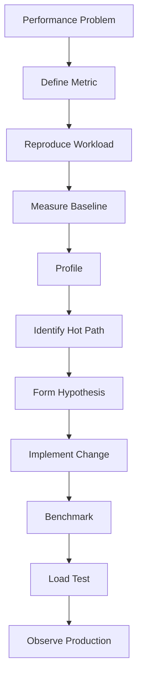
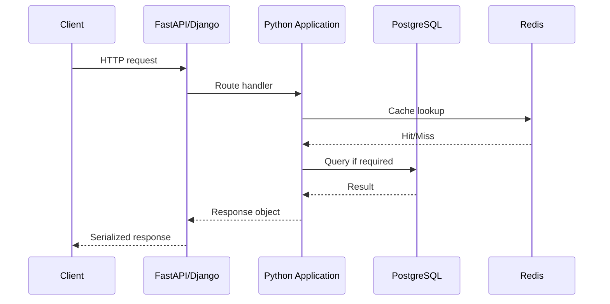
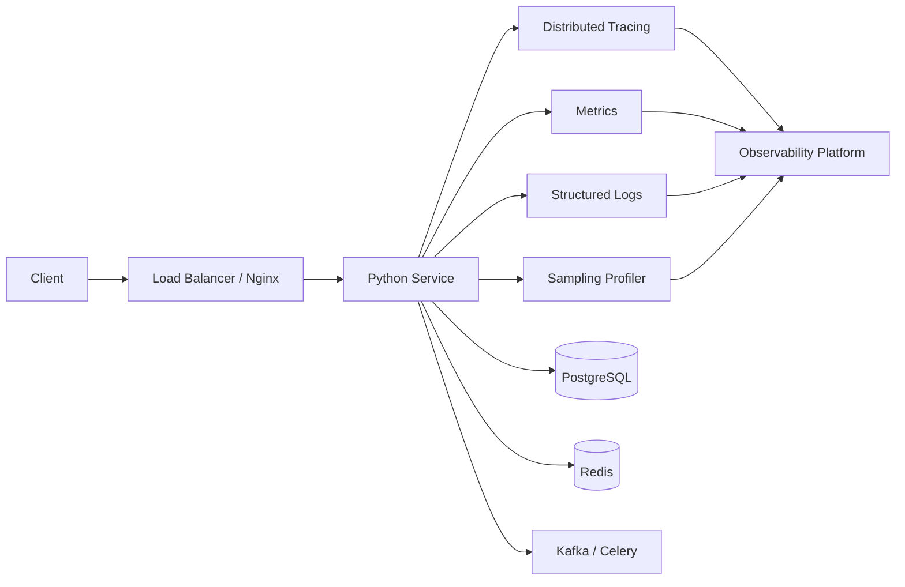

# 12- Profiling

## Overview

Profiling is the systematic measurement of where an application spends CPU time, allocates memory, waits on external systems, and consumes other resources.

Complexity analysis answers:

```text
How does this algorithm scale?
```

Profiling answers:

```text
Where is this implementation actually spending its time or memory?
```

Both are necessary for production performance engineering.

A backend service may have efficient algorithms but still exhibit high latency because of:

- inefficient database queries;
- excessive serialization;
- repeated network calls;
- unnecessary object creation;
- lock contention;
- expensive Python functions;
- memory retention;
- excessive logging;
- poor batching;
- inefficient framework configuration.

Profiling helps identify the dominant cost before changing the implementation.

The fundamental performance workflow is:

```text
Measure
  ↓
Locate bottleneck
  ↓
Understand cause
  ↓
Change implementation
  ↓
Measure again
  ↓
Validate under realistic load
```

---

## Why Profiling Matters

Performance optimization without measurement is speculation.

Consider:

```python
def process_users(users):
    return [
        transform(user)
        for user in users
    ]
```

Possible assumptions might include:

- `transform()` is slow;
- list allocation is expensive;
- Python iteration is the bottleneck.

But the actual bottleneck could instead be:

```text
transform()
    ↓
database query
```

Profiling reveals where execution time is actually being spent.

This is particularly important in backend systems because request latency often spans multiple layers:

```text
Client
  ↓
Nginx / Load Balancer
  ↓
FastAPI / Django
  ↓
Python application
  ↓
Redis / PostgreSQL / Kafka / external API
  ↓
Response serialization
```

Python CPU profiling alone cannot explain the entire request lifecycle.

---

## Profiling vs Benchmarking

Profiling and benchmarking are related but different.

| Technique | Primary question |
|---|---|
| Complexity analysis | How does work scale with input size? |
| Benchmarking | How fast is this implementation? |
| CPU profiling | Where is CPU time being spent? |
| Memory profiling | Where is memory allocated or retained? |
| Database profiling | How is SQL executing? |
| Distributed tracing | Where does request latency accumulate? |
| Load testing | How does the system behave under realistic concurrency? |

A mature performance investigation often uses several of these together.

---

## Profiling Workflow

A practical workflow is:



Do not begin by rewriting code.

Begin by defining the performance problem.

---

## Define the Performance Problem

A useful performance statement is specific:

```text
p95 latency for POST /orders increased from 180 ms to 650 ms
after order volume exceeded 10,000 records per request.
```

This is more useful than:

```text
The service feels slow.
```

Define:

- endpoint or workload;
- input size;
- concurrency;
- latency target;
- throughput target;
- memory target;
- environment;
- expected behavior.

---

## Baseline Measurements

Before optimizing, record a baseline.

For an API:

```text
p50 = 120 ms
p95 = 350 ms
p99 = 900 ms
CPU = 72%
RSS = 480 MB
DB latency = 180 ms
```

After optimization, compare against the same workload.

Without a baseline, it is difficult to determine whether a change actually helped.

---

## CPU Profiling

CPU profiling identifies functions consuming execution time.

A typical question is:

> Which Python functions account for most of the CPU time?

For synchronous Python code, `cProfile` is a useful built-in profiler.

Example:

```python
import cProfile
import pstats

def main() -> None:
    process_batch()

if __name__ == "__main__":
    profiler = cProfile.Profile()
    profiler.enable()

    main()

    profiler.disable()

    stats = pstats.Stats(profiler)
    stats.sort_stats("cumulative")
    stats.print_stats(30)
```

This can identify functions that dominate cumulative execution time.

---

## `cProfile`

`cProfile` is a deterministic profiler included with Python.

It records function calls and timing information.

Useful fields include:

| Field | Meaning |
|---|---|
| `ncalls` | Number of calls |
| `tottime` | Time spent directly in the function |
| `cumtime` | Time spent in the function plus called functions |
| `percall` | Average time per call |
| `filename:lineno` | Source location |

The distinction between `tottime` and `cumtime` is important.

A function can have low `tottime` but high `cumtime` because it calls expensive downstream functions.

---

## `tottime` vs `cumtime`

Consider:

```python
def process_order(order):
    validate(order)
    save(order)
```

If `save()` is expensive:

```text
process_order
    tottime  = small
    cumtime  = large
```

`cumtime` includes time spent in child calls.

This helps identify functions high in the call hierarchy that contribute significantly to total execution time.

---

## Command-Line Profiling

Python can profile a module directly:

```bash
python -m cProfile -s cumulative -m myapp.worker
```

For an executable script:

```bash
python -m cProfile -s cumulative app.py
```

For more detailed analysis, save the profile:

```bash
python -m cProfile -o profile.prof -m myapp.worker
```

The profile can then be analyzed separately.

---

## Sorting Profiling Results

Useful sort criteria include:

```text
cumulative
time
calls
pcalls
```

For example:

```python
stats.sort_stats("cumulative")
```

is useful when searching for the call paths contributing most to total execution time.

Sorting by internal time can help identify functions that themselves perform expensive CPU work.

---

## Function Call Amplification

A common profiling finding is excessive call frequency.

For example:

```text
function:
    normalize_email()

calls:
    5,000,000

total time:
    12 seconds
```

The function may be individually fast but expensive at scale.

Optimization opportunities often come from reducing:

```text
number of calls
```

rather than optimizing the function's internal implementation.

This is a recurring senior-level performance pattern.

---

## Deterministic vs Statistical Profiling

Two major approaches are:

### Deterministic Profiling

Tracks function calls and timing events.

Example:

```text
cProfile
```

Advantages:

- detailed call relationships;
- exact call counts;
- useful for focused workloads.

Limitations:

- instrumentation overhead;
- can distort timing;
- less suitable for continuously profiling production traffic.

### Statistical Profiling

Samples execution periodically.

Conceptually:

```text
CPU
 ↓
sample stack
 ↓
sample stack
 ↓
sample stack
 ↓
aggregate stacks
```

Advantages:

- lower overhead;
- suitable for long-running processes;
- useful for production workloads.

Limitations:

- statistical rather than exact;
- short-lived functions may be missed.

---

## `py-spy`

`py-spy` is a commonly used external sampling profiler for Python processes.

A typical command is:

```bash
py-spy top --pid <PID>
```

It can inspect a running Python process without requiring application instrumentation.

For recording:

```bash
py-spy record -o profile.svg --pid <PID>
```

Sampling profilers are particularly useful when investigating production-like workloads where deterministic profiling overhead would be undesirable.

---

## Profiling Running Services

Production profiling should be approached carefully.

Avoid attaching heavyweight instrumentation indiscriminately to every request.

A safer strategy is:

```text
production traffic
      ↓
low-overhead sampling
      ↓
representative profile
      ↓
identify hot path
```

Use:

- controlled profiling windows;
- representative traffic;
- low sampling overhead;
- access controls;
- profiling outside critical paths where possible.

Profiling infrastructure itself must not become the incident.

---

## `timeit` for Microbenchmarks

For small isolated operations, use `timeit`:

```python
from timeit import timeit

duration = timeit(
    "lookup.get(5000)",
    setup="lookup = {i: i for i in range(10_000)}",
    number=100_000,
)

print(duration)
```

This is useful for comparing implementations of small operations.

It should not be used as the primary performance tool for an entire web service.

---

## Benchmarking Good Practices

A useful benchmark should:

- use representative inputs;
- perform enough iterations;
- warm up relevant code paths;
- avoid unrelated system activity;
- measure multiple runs;
- report distributions rather than one lucky result;
- compare equivalent workloads.

Avoid conclusions such as:

```text
Implementation B is faster because one run took 2.1 ms instead of 2.3 ms.
```

The difference may be measurement noise.

---

## Memory Profiling

CPU profiling answers:

```text
Where is execution time going?
```

Memory profiling asks:

```text
Where is memory being allocated or retained?
```

This matters for:

- memory leaks;
- growing caches;
- large object graphs;
- excessive copies;
- batch processing;
- worker processes;
- request payloads.

---

## `tracemalloc`

`tracemalloc` is part of Python's standard library and tracks Python memory allocations.

Example:

```python
import tracemalloc

tracemalloc.start()

before = tracemalloc.take_snapshot()

run_workload()

after = tracemalloc.take_snapshot()

for statistic in after.compare_to(before, "lineno")[:10]:
    print(statistic)
```

This is useful for finding source locations associated with allocation growth.

---

## Comparing Memory Snapshots

Snapshot comparison is particularly useful for identifying allocation differences.

Conceptually:

```text
Before workload
      ↓
snapshot A
      ↓
run workload
      ↓
snapshot B
      ↓
B - A
      ↓
allocation growth
```

Useful grouping options include:

```python
snapshot.compare_to(other, "lineno")
```

or grouping by traceback when deeper allocation context is required.

---

## Important `tracemalloc` Limitation

`tracemalloc` primarily tracks Python-level allocations.

It does not explain every byte of process memory.

A process can consume memory through:

- native extensions;
- C libraries;
- memory mappings;
- allocator behavior;
- shared libraries;
- buffers outside tracked Python allocations.

Therefore:

```text
tracemalloc ≠ complete process memory accounting
```

Compare it with operating-system/container-level metrics such as RSS.

---

## RSS vs Python Allocations

Suppose:

```text
tracemalloc:
    +20 MB

RSS:
    +200 MB
```

The difference may come from:

- native memory;
- allocator behavior;
- memory fragmentation;
- shared libraries;
- untracked buffers.

This distinction is critical when debugging Kubernetes OOM events.

---

## Line-Level Memory Profiling

For more targeted investigation, external tools such as `memory-profiler` can help identify memory behavior at the line level.

A typical workflow is:

```text
large function
    ↓
identify suspicious region
    ↓
line-level memory measurement
    ↓
reduce allocation / retention
```

Use such tools selectively because profiling overhead and tooling support vary.

---

## Allocation vs Retention

An allocation increase is not necessarily a leak.

For example:

```python
def process_batch(records):
    transformed = [
        transform(record)
        for record in records
    ]

    return transformed
```

The allocation is legitimate if the output must be retained.

A leak-like pattern is:

```text
request
  ↓
allocate objects
  ↓
request completes
  ↓
objects remain reachable
  ↓
repeat
  ↓
memory continuously grows
```

Profiling should therefore establish whether objects remain reachable after the workload completes.

---

## Profiling Web Applications

For FastAPI or Django, a request may involve:



CPU profiling may explain application CPU time, while distributed tracing and database analysis explain the rest of the latency.

---

## Application Profiling vs Distributed Tracing

These tools operate at different levels.

| Tooling | Scope |
|---|---|
| `cProfile` | Python function calls |
| Sampling profiler | Python process execution |
| `tracemalloc` | Python allocations |
| PostgreSQL `EXPLAIN ANALYZE` | Database execution |
| HTTP client metrics | External requests |
| Distributed tracing | End-to-end request path |
| Container metrics | CPU/memory resource usage |

For microservices, distributed tracing is often essential.

---

## Database Profiling

Suppose profiling shows:

```text
Python CPU:
    15 ms

PostgreSQL:
    400 ms
```

Optimizing a Python loop is unlikely to materially improve the request.

Inspect the SQL:

```sql
EXPLAIN (ANALYZE, BUFFERS)
SELECT id, email
FROM users
WHERE email = $1;
```

Look for:

- sequential scans;
- unexpected row counts;
- poor index usage;
- expensive joins;
- sorting;
- aggregation;
- disk reads.

The bottleneck must be optimized at the layer where it exists.

---

## N+1 Detection

Profiling can reveal repeated database operations:

```text
GET /orders
  ↓
1 query: orders
  ↓
100 queries: customers
```

The Python function may appear inexpensive while database latency dominates.

A query counter, ORM instrumentation, tracing, or database metrics can expose the pattern.

The optimization is usually architectural:

```text
N queries
→
join / eager loading / batch query
```

rather than micro-optimizing Python.

---

## Profiling Network Calls

External HTTP or gRPC calls should be measured separately.

For example:

```text
Request latency = 800 ms

Python CPU       = 70 ms
PostgreSQL       = 120 ms
External API     = 580 ms
```

CPU profiling alone might incorrectly lead an engineer to optimize the 70 ms Python path.

Distributed tracing makes the dominant latency source visible.

---

## Async Profiling

Async applications require careful interpretation.

Example:

```python
async def handler():
    result = await client.fetch()
    return transform(result)
```

The coroutine may spend most of its wall-clock time waiting.

CPU profiling primarily reveals CPU execution, not necessarily the complete waiting time experienced by the request.

For asyncio applications, combine:

- CPU profiling;
- event-loop metrics;
- task metrics;
- tracing;
- external I/O latency;
- timeout metrics.

---

## Event Loop Blocking

A particularly important async performance problem is blocking synchronous work inside the event loop.

Problematic:

```python
async def handler():
    data = expensive_cpu_function()
    return data
```

If the computation takes 500 ms, other tasks on the same event loop may be delayed.

A profiler or event-loop monitoring can help identify such blocking operations.

The solution may involve:

- optimizing the function;
- moving CPU work to a process pool;
- using an appropriate worker architecture;
- reducing workload size.

---

## Profiling Concurrency

Concurrency changes profiling interpretation.

Suppose four workers each execute:

```text
25% CPU
```

The service may collectively consume:

```text
100% of one CPU
```

depending on the environment and CPU allocation.

Always interpret profiling results in context of:

- process count;
- thread count;
- asyncio tasks;
- CPU allocation;
- container limits;
- replica count.

---

## Profiling Lock Contention

A service can have low CPU utilization but poor latency because threads or processes are waiting.

Potential causes include:

- locks;
- connection pools;
- database connections;
- rate limiters;
- queue capacity;
- external services.

A CPU-only profile may not reveal the complete issue.

Use concurrency metrics, tracing, and system-level profiling when waiting dominates.

---

## Profiling Background Workers

Celery workers and other long-running processes require different profiling considerations from HTTP requests.

Monitor:

- task execution time;
- task throughput;
- queue depth;
- memory growth;
- CPU utilization;
- task failure rate;
- retry count.

A useful diagnostic relationship is:

```text
queue depth ↑
+
task latency ↑
+
CPU saturation
=
worker capacity problem
```

If CPU is low but queue depth grows, investigate I/O or downstream dependencies.

---

## Profiling Kafka Consumers

Kafka consumers should be analyzed across:

```text
fetch
 ↓
deserialize
 ↓
process
 ↓
database / external I/O
 ↓
commit
```

Measure:

- records per second;
- processing latency;
- batch size;
- consumer lag;
- CPU;
- memory;
- downstream latency.

An optimization that reduces per-record CPU time may have little effect if PostgreSQL is the actual bottleneck.

---

## Profiling in Docker

Profiling should distinguish application behavior from container resource constraints.

Useful commands include:

```bash
docker stats
```

and:

```bash
docker top <container>
```

These provide container-level context.

For deeper analysis, profile the process inside the container or use an external profiler that can observe the process appropriately.

---

## Profiling in Kubernetes

Kubernetes adds another layer:

```text
Pod
 ├── Python process
 ├── worker processes
 └── sidecars
```

Monitor:

- pod CPU;
- pod memory;
- throttling;
- OOM events;
- restarts;
- request latency;
- replica count.

A Python profiler cannot by itself explain CPU throttling or node-level contention.

Correlate application profiles with Kubernetes metrics.

---

## CPU Throttling

A container can appear slow because of CPU limits.

For example:

```yaml
resources:
  limits:
    cpu: "500m"
```

If the workload requires more CPU, Kubernetes/container runtime enforcement may throttle execution.

Profiling application code without checking CPU throttling can produce misleading conclusions.

Always correlate:

```text
profiled CPU work
+
allocated CPU
+
actual CPU usage
+
throttling
```

---

## Profiling in CI/CD

Performance regression testing can be incorporated into CI/CD.

Example:

```text
Pull Request
     ↓
Unit Tests
     ↓
Benchmark Suite
     ↓
Compare Baseline
     ↓
Performance Regression?
     ├── No → Merge
     └── Yes → Investigate
```

Avoid treating tiny microbenchmark differences as automatic failures.

Use stable thresholds and representative workloads.

---

## Performance Regression Testing

Useful benchmark metrics include:

```text
execution time
throughput
allocation count
peak memory
database query count
payload size
```

For example:

```text
baseline:
    100 ms
candidate:
    180 ms

regression:
    +80%
```

A substantial regression should trigger investigation.

---

## Profiling Test Workloads

A profile is only as useful as the workload being profiled.

A workload should approximate production characteristics:

- realistic input sizes;
- representative data distributions;
- realistic cache state;
- realistic concurrency;
- realistic database cardinality;
- realistic network dependencies.

Profiling a 10-record dataset does not necessarily reveal behavior at one million records.

---

## Warm-Up and Caching

Performance can vary depending on application state.

Examples:

```text
cold cache
warm cache
cold process
warm process
```

Benchmark both when relevant.

For example, Redis cache hits can hide database latency:

```text
warm cache → fast
cold cache → slow
```

A production performance test should understand both states.

---

## Profiling Methodology

A disciplined investigation should follow:

### Establish

Define the metric and workload.

### Measure

Capture baseline latency, throughput, CPU, and memory.

### Profile

Identify the dominant execution or allocation path.

### Hypothesize

Explain why the bottleneck exists.

### Change

Make the smallest justified optimization.

### Validate

Repeat the same measurement.

### Load Test

Verify behavior under concurrency and realistic input sizes.

### Observe

Confirm the improvement in production-like environments.

---

## Common Mistakes

### Profiling Without a Question

Collecting huge amounts of profiling data without defining the problem creates noise.

### Optimizing the Wrong Layer

Improving a 20 ms Python function does not matter when PostgreSQL takes 500 ms.

### Using Microbenchmarks for System Performance

A faster dictionary lookup does not prove an API will be faster.

### Profiling Unrealistic Workloads

Small synthetic inputs can hide scaling problems.

### Ignoring I/O

CPU profiles do not fully represent waiting on databases or network services.

### Ignoring Concurrency

A function that is fast in isolation may behave differently under contention.

### Trusting a Single Measurement

System load, CPU scheduling, caching, and external dependencies create variance.

---

## Production Pitfalls

### High Profiling Overhead

Deterministic profilers can significantly alter execution characteristics.

Use sampling approaches when lower overhead is required.

### Profiling Every Request

Continuous heavy instrumentation can itself affect latency and resource consumption.

### Exposing Profiling Endpoints

Profiling interfaces can reveal sensitive implementation details and should never be publicly accessible without strong controls.

### Collecting Sensitive Data

Profiles, traces, SQL statements, and payload metadata may contain:

- identifiers;
- URLs;
- query parameters;
- internal service names;
- customer information.

Apply appropriate access control and data-redaction policies.

### Profiling Only CPU

A service can be latency-bound by:

- PostgreSQL;
- Redis;
- HTTP;
- gRPC;
- Kafka;
- filesystem;
- locks.

### Ignoring Memory

A CPU optimization that creates large intermediate objects may trade CPU time for memory pressure.

---

## Security Considerations

Profiling data can be sensitive.

Potentially exposed information includes:

- database query text;
- endpoint paths;
- object identifiers;
- file paths;
- internal architecture;
- request metadata.

Production profiling infrastructure should therefore have:

- authentication;
- authorization;
- restricted network access;
- controlled retention;
- redaction where necessary;
- auditability.

Never expose profiler interfaces directly to the public internet.

---

## Reliability Considerations

Performance profiling should not destabilize production.

Use:

- controlled sampling;
- limited profiling duration;
- representative instances;
- rate-limited collection;
- asynchronous export where appropriate;
- rollback procedures.

When investigating an incident, prioritize service stability over obtaining a perfect profile.

---

## Cost Considerations

Profiling can reduce infrastructure cost by identifying inefficient resource usage.

For example:

```text
Before:
8 replicas × 2 vCPU

After optimization:
4 replicas × 2 vCPU
```

If the optimization safely reduces required capacity, the result can be both faster and cheaper.

However, profiling infrastructure itself can add costs through:

- storage;
- telemetry ingestion;
- tracing;
- CPU overhead;
- network traffic.

Use retention and sampling policies appropriate to the diagnostic value.

---

## High Availability

Performance optimization should preserve availability.

Avoid changes that:

- increase memory enough to trigger OOM;
- increase database load;
- remove backpressure;
- increase concurrency without capacity planning;
- create cache stampedes;
- increase retry volume.

A faster single request is not an improvement if it reduces the system's sustainable throughput.

---

## Profiling and Capacity Planning

Profiling can inform capacity models.

Suppose:

```text
One request:
    20 ms CPU

Available CPU:
    4 cores
```

Ignoring other constraints, the theoretical CPU capacity is roughly related to:

```text
4 cores / 0.020 CPU-seconds
≈ 200 CPU-bound requests/second
```

Real capacity will be lower because of:

- I/O;
- scheduling;
- garbage collection;
- synchronization;
- other processes;
- CPU limits;
- target utilization.

Profiling provides the measurements needed to construct more realistic models.

---

## Production Performance Architecture

A mature observability stack may look like:



Each tool answers a different question.

---

## Profiling Decision Matrix

| Problem | Start with |
|---|---|
| High Python CPU | CPU profiler |
| Slow function | `cProfile` / sampling profiler |
| Memory growth | `tracemalloc` + RSS |
| Slow SQL | PostgreSQL `EXPLAIN ANALYZE` |
| Slow external API | Distributed tracing |
| High API p99 | Tracing + application profiling |
| Async event-loop stalls | Event-loop metrics + profiler |
| Worker backlog | Queue metrics + task profiling |
| Kubernetes OOM | RSS + memory profiling |
| CPU throttling | Kubernetes/container metrics |
| Regression in a function | Benchmark / `timeit` |
| Production hot path | Sampling profiler |

---

## Best Practices

- Profile before optimizing.
- Define a measurable performance problem first.
- Establish a reproducible baseline.
- Use complexity analysis to understand scaling and profiling to find implementation bottlenecks.
- Use `cProfile` for focused deterministic Python profiling.
- Use statistical profilers for lower-overhead long-running workloads.
- Use `tracemalloc` for Python allocation analysis.
- Correlate Python profiles with PostgreSQL, Redis, network, and infrastructure metrics.
- Profile realistic workloads and representative input sizes.
- Measure p50, p95, and p99 latency where latency matters.
- Validate optimizations with benchmarks and load tests.
- Monitor CPU, memory, database latency, queue depth, and downstream dependencies.
- Treat profiling data as potentially sensitive.
- Keep production profiling controlled, authenticated, and low impact.
- Optimize sustainable system throughput rather than isolated request latency.

---

## Production Profiling Checklist

Before declaring a performance problem solved:

- [ ] The performance problem is measurable.
- [ ] A reproducible baseline exists.
- [ ] Input size and concurrency are representative.
- [ ] The dominant bottleneck has been identified.
- [ ] Python CPU time has been distinguished from I/O wait.
- [ ] Database performance has been checked where relevant.
- [ ] Memory behavior has been checked where relevant.
- [ ] The optimization targets the measured bottleneck.
- [ ] Benchmark results confirm improvement.
- [ ] Load testing confirms the improvement under concurrency.
- [ ] p95/p99 behavior has been evaluated.
- [ ] CPU and memory resource usage remain within limits.
- [ ] Kubernetes throttling/OOM behavior has been checked where applicable.
- [ ] Security and privacy implications of profiling data are addressed.
- [ ] Production telemetry confirms the expected improvement.

## Interview Traps

### "Profiling and Benchmarking Are the Same"

Benchmarking measures performance; profiling identifies where resources are being consumed.

### "`cProfile` Tells You Why the Database Is Slow"

It can show time associated with Python calls that invoke the database, but database execution should be analyzed with database-specific tooling.

### "CPU Profiling Explains API Latency"

Only partially. Network, database, cache, serialization, scheduling, and lock waiting can dominate latency.

### "The Most Frequently Called Function Is Always the Bottleneck"

Not necessarily. A rarely called function can dominate runtime if each call is extremely expensive.

### "A Faster Function Means a Faster Service"

Only if that function contributes materially to the service's critical path.

### "Memory Growth Means a Python Leak"

RSS growth can come from legitimate allocations, retained references, allocator behavior, native memory, or workload growth.

### "Profile Production With Maximum Instrumentation"

Heavy instrumentation can distort the workload and degrade service performance.

## Key Takeaways

- **Profiling identifies actual resource bottlenecks:** use CPU profilers, memory profilers, database analysis, tracing, and infrastructure metrics according to the problem being investigated.
- **Measure before optimizing:** establish a reproducible baseline and profile representative workloads rather than relying on intuition or microbenchmarks.
- **Profile the complete backend path:** Python CPU time is only one component of request latency; PostgreSQL, Redis, network calls, serialization, concurrency, and infrastructure constraints can dominate.
- **Use the right profiling technique for the environment:** `cProfile` is useful for focused deterministic analysis, sampling profilers reduce overhead for long-running processes, and `tracemalloc` helps investigate Python-level memory allocations.
- **Validate optimizations under production-like conditions:** compare latency distributions, throughput, CPU, memory, database load, and tail behavior before and after the change.