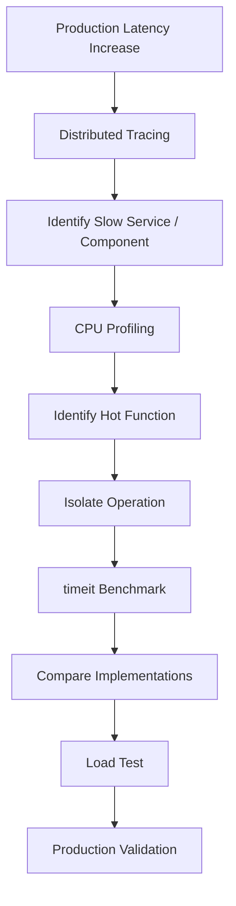

# 13- Timeit

## Overview

`timeit` is Python's standard-library module for measuring the execution time of small, isolated pieces of Python code.

It is primarily a **microbenchmarking tool**. It helps answer questions such as:

- Is a set membership check faster than a list membership check for this workload?
- Which of two implementations performs better?
- How much does a particular Python operation cost?
- Did a local optimization improve execution time?

It should not be confused with:

- `cProfile` for function-level profiling;
- statistical profilers for production processes;
- `tracemalloc` for Python memory allocation analysis;
- distributed tracing for end-to-end request latency;
- load testing for concurrent system behavior.

A useful performance-engineering model is:

```text
Complexity analysis
        ↓
Understand scaling behavior

timeit
        ↓
Measure isolated implementation cost

Profiler
        ↓
Find actual hot paths

Tracing
        ↓
Find distributed latency

Load testing
        ↓
Validate system behavior under concurrency
```

`timeit` is most valuable when the performance question is narrow and reproducible.

---

## Why `timeit` Exists

Naively measuring code with:

```python
import time

start = time.perf_counter()

run_operation()

elapsed = time.perf_counter() - start

print(elapsed)
```

can produce noisy measurements for very small operations.

Potential sources of noise include:

- operating-system scheduling;
- timer resolution;
- garbage collection;
- interpreter startup;
- unrelated process activity;
- one-time initialization;
- insufficient measurement duration.

`timeit` addresses many of these microbenchmarking concerns by providing a controlled framework for repeated measurements.

---

## Basic Usage

The simplest API is:

```python
import timeit

duration = timeit.timeit(
    "sum(range(100))",
    number=100_000,
)

print(duration)
```

`number` specifies how many times the statement is executed.

If the result is:

```text
0.42
```

that means the total execution time for all 100,000 executions was approximately:

```text
0.42 seconds
```

Average time per execution can be calculated as:

```python
average = duration / 100_000
```

---

## Using Callable Functions

For production-quality benchmark code, passing a callable is usually clearer than embedding a string.

```python
import timeit


def calculate_total() -> int:
    return sum(range(100))


duration = timeit.timeit(
    calculate_total,
    number=100_000,
)

print(duration)
```

This keeps the benchmark implementation in normal Python code and makes refactoring easier.

---

## `timeit.timeit()`

The primary API is:

```python
timeit.timeit(
    stmt="pass",
    setup="pass",
    timer=None,
    number=1_000_000,
)
```

Common parameters:

| Parameter | Purpose |
|---|---|
| `stmt` | Code to execute |
| `setup` | Initialization code |
| `timer` | Timer implementation |
| `number` | Number of executions |

When using a callable:

```python
timeit.timeit(function, number=...)
```

the callable is executed repeatedly.

---

## `repeat()`

`repeat()` executes the benchmark multiple times.

```python
import timeit


def operation() -> int:
    return sum(range(100))


results = timeit.repeat(
    operation,
    repeat=5,
    number=100_000,
)

print(results)
```

The result is a list of elapsed times.

For example:

```text
[
    0.41,
    0.40,
    0.43,
    0.39,
    0.42,
]
```

Multiple runs provide a better view of measurement variability.

---

## Why the Minimum Is Often Useful

A common practice when interpreting `timeit.repeat()` results is:

```python
best = min(results)
```

The minimum can approximate the execution time under relatively low interference.

Slower runs may have been affected by:

- OS scheduling;
- background processes;
- CPU contention;
- thermal behavior;
- other system activity.

However, the minimum should not be treated as "the true runtime."

For engineering decisions, inspect the complete distribution and understand the benchmark environment.

---

## `autorange()`

`autorange()` determines an appropriate number of iterations.

```python
import timeit


def operation() -> int:
    return sum(range(100))


timer = timeit.Timer(operation)

number, total = timer.autorange()

print(number)
print(total)
```

This is useful when the operation is too fast or too slow for a manually chosen iteration count.

The goal is to run the operation enough times to obtain a meaningful measurement.

---

## Timer Selection

`timeit` uses an appropriate high-resolution timer for the platform.

You can inspect the timer:

```python
import timeit

print(timeit.default_timer)
```

On modern Python implementations, this is generally based on a monotonic high-resolution performance counter.

For ordinary benchmarking, prefer:

```python
timeit
```

rather than manually selecting a timer unless there is a specific reason.

---

## `perf_counter()`

Python's `time.perf_counter()` is designed for measuring short-duration intervals.

For example:

```python
import time


start = time.perf_counter()

run_operation()

elapsed = time.perf_counter() - start

print(elapsed)
```

This is useful when measuring a larger operation once or measuring application code directly.

`timeit` is more convenient when the goal is repeated microbenchmarking.

---

## `timeit` vs `perf_counter`

| Tool | Best use |
|---|---|
| `timeit.timeit()` | Repeated microbenchmarks |
| `timeit.repeat()` | Multiple benchmark runs |
| `timeit.autorange()` | Choosing iteration count |
| `time.perf_counter()` | Timing a larger operation manually |
| `cProfile` | Function-level CPU profiling |
| Sampling profiler | Low-overhead production profiling |
| `tracemalloc` | Python memory allocation analysis |
| Distributed tracing | End-to-end request latency |

Choose the measurement tool based on the question.

---

## Comparing Implementations

A common use case is comparing data structures.

```python
import timeit


values = list(range(10_000))
value_set = set(values)
target = 9_999


list_time = timeit.timeit(
    lambda: target in values,
    number=100_000,
)

set_time = timeit.timeit(
    lambda: target in value_set,
    number=100_000,
)

print(f"list: {list_time:.6f}s")
print(f"set:  {set_time:.6f}s")
```

The expected result reflects the algorithmic difference:

```text
list membership → O(n)
set membership  → O(1) average
```

`timeit` validates the practical performance difference for a specific workload.

---

## Complexity First, Benchmark Second

Do not use `timeit` as a replacement for complexity analysis.

Suppose two implementations produce:

```text
Implementation A: O(n)
Implementation B: O(n²)
```

A benchmark at:

```text
n = 10
```

may show little difference.

At:

```text
n = 1,000,000
```

the difference can become enormous.

The correct workflow is:

```text
Analyze complexity
        ↓
Identify plausible candidates
        ↓
Benchmark representative inputs
        ↓
Choose implementation
```

---

## Benchmark Different Input Sizes

An algorithm should be benchmarked across realistic input sizes.

Example:

```python
import timeit


def contains_list(values: list[int], target: int) -> bool:
    return target in values


for size in (100, 1_000, 10_000, 100_000):
    values = list(range(size))
    target = size - 1

    duration = timeit.timeit(
        lambda: contains_list(values, target),
        number=10_000,
    )

    print(f"n={size:>6}: {duration:.6f}s")
```

This helps connect empirical measurements to complexity behavior.

---

## Benchmarking Best, Average, and Worst Cases

Input distribution matters.

For list membership:

```python
target = values[0]
```

represents a favorable case.

Whereas:

```python
target = values[-1]
```

or:

```python
target = -1
```

may force a full scan.

Benchmarking should therefore consider:

- best case;
- typical case;
- worst case;
- realistic production distribution.

---

## Avoid Benchmarking Setup Work

Suppose you want to compare lookup speed.

Do not accidentally include collection construction:

```python
duration = timeit.timeit(
    lambda: target in set(values),
    number=100_000,
)
```

This measures:

```text
set construction
+
membership lookup
```

not just membership lookup.

Instead:

```python
value_set = set(values)

duration = timeit.timeit(
    lambda: target in value_set,
    number=100_000,
)
```

The benchmark should isolate the operation being compared.

---

## `setup` for String Benchmarks

When using the string form, initialization can be placed in `setup`.

```python
import timeit

duration = timeit.timeit(
    "target in values",
    setup="""
values = list(range(10_000))
target = 9_999
""",
    number=100_000,
)

print(duration)
```

The setup is executed separately from the repeated statement.

However, callable-based benchmarks are generally easier to maintain.

---

## Avoid Benchmarking I/O With `timeit`

`timeit` can technically measure I/O, but it is usually the wrong tool for production I/O performance.

Avoid using it to decide:

```text
Which PostgreSQL query is faster?
```

or:

```text
Which REST API is faster?
```

External systems introduce:

- network latency;
- connection pooling;
- caching;
- database state;
- server load;
- retries;
- contention.

Use:

- database query plans;
- application tracing;
- realistic integration benchmarks;
- load testing.

---

## Database Example

Suppose you want to compare:

```sql
SELECT *
FROM users
WHERE email = $1;
```

against another SQL implementation.

`timeit` around a database call may produce misleading results because the measurement depends on the database environment.

Instead:

```text
Python benchmark
        ↓
isolated Python transformation

PostgreSQL
        ↓
EXPLAIN (ANALYZE, BUFFERS)

API
        ↓
integration/load test

Production
        ↓
distributed tracing
```

Each layer needs an appropriate measurement technique.

---

## Benchmarking Serialization

Serialization is a reasonable `timeit` use case when isolated.

```python
import json
import timeit


payload = {
    "id": 123,
    "status": "active",
    "items": [
        {"sku": "A100", "quantity": 2},
        {"sku": "B200", "quantity": 3},
    ],
}

duration = timeit.timeit(
    lambda: json.dumps(payload),
    number=100_000,
)

print(duration)
```

This can help compare serializers or implementation strategies.

For production conclusions, use representative payload sizes and schemas.

---

## Benchmarking Python Data Structures

`timeit` is useful for focused comparisons such as:

- list vs tuple access;
- list vs deque operations;
- list vs set membership;
- dictionary lookup patterns;
- string construction approaches;
- parsing strategies;
- function-call overhead.

Example:

```python
from collections import deque
import timeit


values = list(range(10_000))
queue = deque(values)

list_time = timeit.timeit(
    lambda: values.pop(0),
    number=1_000,
)

deque_time = timeit.timeit(
    queue.popleft,
    number=1_000,
)

print(f"list:  {list_time:.6f}s")
print(f"deque: {deque_time:.6f}s")
```

The benchmark illustrates the expected complexity difference:

```text
list.pop(0) → O(n)
deque.popleft() → O(1)
```

---

## Benchmarking Function Call Overhead

Microbenchmarks can measure language-level costs.

```python
import timeit


def add(a: int, b: int) -> int:
    return a + b


direct = timeit.timeit(
    lambda: add(1, 2),
    number=1_000_000,
)

print(direct)
```

These measurements can be useful when evaluating extremely hot code paths.

However, function-call overhead is rarely the first optimization target in ordinary backend applications.

---

## Benchmarking Isolated Transformations

Suppose an API transforms 100,000 records.

Compare implementations:

```python
def transform_loop(values: list[int]) -> list[int]:
    result = []

    for value in values:
        result.append(value * 2)

    return result


def transform_comprehension(values: list[int]) -> list[int]:
    return [value * 2 for value in values]
```

Benchmark:

```python
import timeit


values = list(range(100_000))

loop_time = timeit.timeit(
    lambda: transform_loop(values),
    number=100,
)

comprehension_time = timeit.timeit(
    lambda: transform_comprehension(values),
    number=100,
)

print(f"loop:          {loop_time:.6f}s")
print(f"comprehension:  {comprehension_time:.6f}s")
```

The result is useful only within the context of:

- Python version;
- implementation;
- input size;
- hardware;
- benchmark design.

---

## Garbage Collection and `timeit`

`timeit` takes steps to reduce noise from garbage collection during timing.

This is useful for repeatable microbenchmarks but can differ from normal application execution.

If the operation's performance depends materially on garbage collection, benchmark with an environment that reflects the actual workload and explicitly document the configuration.

Do not assume a microbenchmark with GC behavior altered by the benchmarking framework represents a production request exactly.

---

## Benchmarking Memory-Heavy Operations

`timeit` measures elapsed execution time, not memory consumption.

For example:

```python
duration = timeit.timeit(
    lambda: large_list.copy(),
    number=1_000,
)
```

can tell you how long copying takes.

It does not tell you:

```text
peak memory
retained memory
allocation sources
RSS impact
```

Use:

```text
tracemalloc
process RSS metrics
memory profilers
```

for memory analysis.

---

## Benchmark Warm and Cold Paths

Some operations behave differently on first execution.

Potential differences include:

- import initialization;
- cache population;
- lazy initialization;
- connection setup;
- compiled regex creation;
- filesystem cache;
- application-level cache.

A microbenchmark should distinguish:

```text
cold-start cost
```

from:

```text
steady-state cost
```

when the distinction matters.

---

## Benchmarking Imports

Import time can be measured separately:

```bash
python -X importtime -c "import myapp"
```

This is generally more useful for import profiling than `timeit`.

`timeit` should remain focused on isolated runtime operations rather than being used as a universal performance tool.

---

## Statistical Variability

Suppose:

```text
Run 1: 10.1 ms
Run 2: 10.2 ms
Run 3: 10.0 ms
Run 4: 10.3 ms
Run 5: 10.1 ms
```

and another implementation:

```text
Run 1: 9.8 ms
Run 2: 9.9 ms
Run 3: 10.0 ms
Run 4: 9.7 ms
Run 5: 9.8 ms
```

The second implementation is probably faster.

But if the results are:

```text
10.1 ms
10.2 ms
10.0 ms
10.3 ms
10.1 ms
```

versus:

```text
10.0 ms
10.4 ms
9.8 ms
10.5 ms
9.7 ms
```

the difference may not be meaningful.

Do not overinterpret small benchmark differences.

---

## Benchmark Environment

Record the environment for meaningful comparisons.

Useful metadata includes:

```text
Python version
Python implementation
Operating system
CPU
architecture
dependency versions
compiler/build
input size
benchmark parameters
```

For example:

```bash
python --version
```

and:

```bash
python -c "import platform; print(platform.platform())"
```

The same source code can benchmark differently across:

- CPython versions;
- PyPy;
- ARM;
- x86-64;
- local machines;
- containers;
- CI runners.

---

## CPython vs Other Implementations

Python performance is implementation-dependent.

A benchmark run on CPython does not automatically represent:

```text
PyPy
```

or another Python implementation.

For backend production systems, benchmark the runtime you actually deploy.

---

## CPU Frequency and System Noise

Modern systems dynamically change CPU frequency.

Other processes can also consume CPU.

Therefore, benchmark results can vary due to:

- CPU frequency scaling;
- background processes;
- virtualized environments;
- shared CI runners;
- thermal throttling;
- power management.

For highly precise comparisons, control the environment as much as practical.

---

## Containerized Benchmarks

A Docker benchmark may differ from a local benchmark because of:

- CPU limits;
- CPU quotas;
- cgroup scheduling;
- memory limits;
- host contention.

For example:

```yaml
resources:
  limits:
    cpu: "1"
```

can produce different results from an unrestricted local process.

Benchmark production-relevant configurations when infrastructure constraints matter.

---

## Kubernetes Benchmarks

Kubernetes adds:

```text
Pod
 ↓
Container
 ↓
CPU / memory limits
 ↓
Node contention
```

A benchmark run inside a constrained pod may better represent actual service behavior than a developer laptop.

For performance-sensitive systems, compare:

```text
local benchmark
+
container benchmark
+
production-like load test
```

---

## Benchmarking API Code

Suppose a FastAPI handler contains:

```python
def build_response(users):
    return [
        {
            "id": user.id,
            "email": user.email,
        }
        for user in users
    ]
```

`timeit` can benchmark the transformation itself:

```python
duration = timeit.timeit(
    lambda: build_response(users),
    number=1_000,
)
```

It should not be interpreted as complete endpoint latency.

Actual endpoint latency also includes:

```text
HTTP
 ↓
routing
 ↓
validation
 ↓
authentication
 ↓
database
 ↓
Python transformation
 ↓
serialization
 ↓
network
```

Use integration tests and tracing for the complete endpoint.

---

## Benchmarking REST vs gRPC

`timeit` is not an appropriate tool for determining whether REST or gRPC is faster end-to-end.

The correct measurement includes:

- serialization;
- network transport;
- TLS;
- server processing;
- connection reuse;
- payload size;
- concurrency.

Use a realistic benchmark harness or load-testing system.

`timeit` can still isolate the serialization portion:

```text
Python object
    ↓
JSON serialization
```

or:

```text
Python object
    ↓
Protocol Buffers serialization
```

but that is only one component.

---

## Benchmarking Cache Operations

A focused Redis benchmark can measure client-side or command-level behavior, but network and server behavior should be measured separately.

For pure Python cache logic:

```python
duration = timeit.timeit(
    lambda: local_cache.get("user:123"),
    number=100_000,
)
```

For Redis:

```text
application
    ↓
network
    ↓
Redis
    ↓
network
    ↓
application
```

use Redis-specific benchmarking and application tracing.

---

## Benchmarking Kafka Processing

For Kafka consumers, `timeit` can isolate:

```text
deserialization
transformation
validation
```

but not the complete consumer performance.

Production throughput also depends on:

- broker throughput;
- fetch configuration;
- batch size;
- partitions;
- consumer concurrency;
- commit strategy;
- downstream systems.

Use consumer lag and throughput metrics for end-to-end evaluation.

---

## Benchmarking in CI/CD

Microbenchmarks can detect performance regressions.

A benchmark suite can run during CI:

```text
Pull Request
     ↓
Tests
     ↓
Benchmarks
     ↓
Compare baseline
     ↓
Performance regression?
```

However, shared CI infrastructure is noisy.

Avoid strict thresholds for tiny differences unless the benchmark environment is sufficiently controlled.

---

## Benchmarking Strategy

A robust microbenchmark process is:

1. Define the exact operation being measured.
2. Select representative inputs.
3. Establish complexity expectations.
4. Separate setup from measured work.
5. Choose an appropriate iteration count.
6. Run multiple repetitions.
7. Inspect variability.
8. Record the environment.
9. Compare equivalent implementations.
10. Validate meaningful differences outside the microbenchmark.

---

## Common Mistakes

### Measuring Too Few Iterations

If an operation takes microseconds, one execution may be dominated by measurement noise.

Use enough iterations to produce a meaningful measurement.

### Including Setup in the Benchmark

Creating a data structure inside the measured operation can invalidate the comparison.

### Comparing Different Workloads

Both implementations must process equivalent data.

### Benchmarking Only One Input Size

An implementation that wins for `n = 10` may lose at `n = 1,000,000`.

### Ignoring Variability

One benchmark run is not sufficient evidence.

### Treating `timeit` as a Profiler

`timeit` tells you how long a selected operation takes. It does not tell you where an entire application spends its time.

### Benchmarking External Systems in Isolation

Database and network performance require realistic integration tests.

### Optimizing Microseconds in a Millisecond-Scale Request

A 5 µs improvement is irrelevant if PostgreSQL contributes 300 ms.

---

## Production Pitfalls

### Microbenchmark Success, Production Failure

A faster local function may not improve endpoint latency if the function is not on the critical path.

### Benchmark Environment Mismatch

A laptop benchmark may not represent a Kubernetes pod with CPU limits.

### Cache State Differences

A benchmark using warm local data may not represent cold-cache production behavior.

### Unrealistic Data Sizes

Small datasets can hide memory allocation and algorithmic scaling problems.

### Ignoring Concurrency

A single-thread benchmark cannot predict behavior under hundreds of concurrent requests.

### Benchmarking Compiler or Interpreter Artifacts

Runtime optimizations may make tiny synthetic examples behave differently from application workloads.

### Overfitting to Microbenchmarks

Avoid making code less readable to save a negligible amount of time.

---

## Security Considerations

Benchmark code should not use sensitive production data unnecessarily.

Avoid embedding:

- customer records;
- credentials;
- access tokens;
- private URLs;
- personal information.

Prefer synthetic or sanitized datasets.

Benchmark infrastructure should also be protected when it interacts with real services.

---

## Reliability Considerations

Performance optimizations should preserve correctness.

A faster implementation that changes:

- ordering;
- error behavior;
- transaction semantics;
- consistency;
- retry behavior;

is not automatically an improvement.

Benchmark correctness first:

```text
same inputs
+
same outputs
+
same semantics
```

then compare performance.

---

## Cost Considerations

Micro-optimizations can sometimes reduce infrastructure cost when applied to extremely hot paths.

For example:

```text
100 million operations/day
×
5 µs saved
=
500 seconds/day
```

At sufficiently large scale, small per-operation savings can matter.

However, the optimization must be evaluated against:

```text
engineering complexity
+
maintenance cost
+
correctness risk
+
infrastructure savings
```

Do not optimize code solely because a microbenchmark shows a small improvement.

---

## Profiling and `timeit` Together

A useful workflow is:



This keeps microbenchmarking in its proper place.

---

## Example: Optimizing Membership Checks

Suppose profiling identifies:

```python
if user_id in allowed_user_ids:
    ...
```

as a hot operation.

First identify the data structure:

```python
allowed_user_ids: list[int]
```

The operation is:

```text
O(n)
```

Change to:

```python
allowed_user_ids: set[int]
```

The expected lookup becomes:

```text
O(1)
```

Then use `timeit` to validate the local improvement:

```python
import timeit


values = list(range(100_000))
value_set = set(values)
target = 99_999

list_duration = timeit.timeit(
    lambda: target in values,
    number=10_000,
)

set_duration = timeit.timeit(
    lambda: target in value_set,
    number=10_000,
)

print(f"list: {list_duration:.6f}s")
print(f"set:  {set_duration:.6f}s")
```

Finally, load-test the actual service.

The complete optimization process is:

```text
Production evidence
      ↓
Profiler
      ↓
Algorithmic reasoning
      ↓
timeit
      ↓
Integration/load test
      ↓
Production telemetry
```

---

## Benchmark Results Should Be Reproducible

A useful benchmark should document:

```text
Operation:
    membership lookup

Input:
    100,000 integers

Target:
    last element

Iterations:
    10,000

Python:
    CPython <version>

Platform:
    <platform>

Implementation:
    list vs set
```

This makes future comparisons meaningful.

A benchmark without context is difficult to reproduce or trust.

---

## When Not to Use `timeit`

Do not reach for `timeit` first when the problem is:

- slow API requests;
- slow PostgreSQL queries;
- high Kafka consumer lag;
- Redis latency;
- network latency;
- CPU saturation;
- memory leaks;
- Kubernetes throttling;
- distributed request latency.

Use the appropriate diagnostic tool first.

`timeit` becomes useful after a specific Python operation has been isolated.

---

## Recommended Tool Selection

| Problem | Recommended tool |
|---|---|
| Compare two Python expressions | `timeit` |
| Compare two small functions | `timeit` |
| Measure repeated local operation | `timeit` |
| Find Python CPU hot spots | `cProfile` / sampling profiler |
| Find memory allocation sources | `tracemalloc` |
| Analyze SQL execution | PostgreSQL `EXPLAIN ANALYZE` |
| Analyze endpoint latency | Distributed tracing |
| Analyze concurrency behavior | Load testing + profiling |
| Analyze container resource usage | Kubernetes/container metrics |
| Analyze long-running worker | Sampling profiler + metrics |
| Detect performance regression | Benchmark suite / CI |

---

## Best Practices

- Use `timeit` for isolated microbenchmarks, not end-to-end system performance.
- Analyze algorithmic complexity before benchmarking implementation details.
- Separate benchmark setup from measured work.
- Use representative input sizes and distributions.
- Run multiple repetitions and inspect variability.
- Use callable-based benchmarks when practical.
- Record Python version, runtime, hardware, and benchmark parameters.
- Benchmark the runtime and infrastructure configuration used in production when the distinction matters.
- Measure memory separately with appropriate tools.
- Use profilers to identify hot paths before micro-optimizing.
- Use database and tracing tools for external-system latency.
- Validate local improvements with integration and load testing.
- Prefer meaningful performance improvements over tiny gains that reduce readability.
- Keep benchmark code deterministic, reproducible, and free of sensitive production data.

---

## Production Checklist

Before relying on a `timeit` result:

- [ ] The measured operation is clearly defined.
- [ ] Algorithmic complexity has been considered.
- [ ] Setup work is excluded from the measured operation where appropriate.
- [ ] Inputs are representative.
- [ ] Best-case and worst-case behavior are understood.
- [ ] Enough iterations are used.
- [ ] Multiple repetitions have been performed.
- [ ] Result variability has been inspected.
- [ ] Python version is recorded.
- [ ] Runtime and hardware environment are recorded.
- [ ] Container/Kubernetes constraints are considered where relevant.
- [ ] External I/O is not being mistaken for local Python performance.
- [ ] Correctness is verified before comparing speed.
- [ ] The optimization targets a measured hot path.
- [ ] The result has been validated with a realistic workload.

## Interview Traps

### "`timeit` Tells You Which Function Is the Bottleneck"

No. `timeit` measures the operation you explicitly benchmark. A profiler is better for discovering application-wide hot paths.

### "The Fastest Single Run Is the True Runtime"

System noise and scheduling affect measurements. Use repeated runs and interpret the distribution.

### "A Microbenchmark Proves the API Is Faster"

It proves only that the isolated operation is faster under the tested conditions.

### "Big O and `timeit` Are Alternatives"

They answer different questions. Complexity describes scaling; `timeit` measures a concrete implementation.

### "Setup Doesn't Matter"

Setup can dominate the result if included in the measured statement.

### "A 2% Microbenchmark Improvement Is Always Valuable"

Not if the operation contributes only a tiny fraction of real request latency.

### "Production Data Should Always Be Used"

Sensitive production data is unnecessary for most microbenchmarks. Synthetic or sanitized representative data is safer.

## Key Takeaways

- **`timeit` is a microbenchmarking tool:** use it to measure isolated Python operations and compare implementations under controlled, repeatable conditions.
- **Complexity analysis comes first:** understand whether an operation is `O(1)`, `O(n)`, `O(n log n)`, or worse before optimizing constants with microbenchmarks.
- **Benchmark design determines result quality:** separate setup from measured work, use representative inputs, run multiple repetitions, and account for environmental variability.
- **`timeit` does not replace profiling or observability:** use profilers for Python hot paths, database tools for SQL, tracing for distributed latency, and load testing for concurrent system behavior.
- **Validate micro-optimizations at system level:** a faster isolated function matters only when it materially affects the production critical path, resource consumption, throughput, or cost.