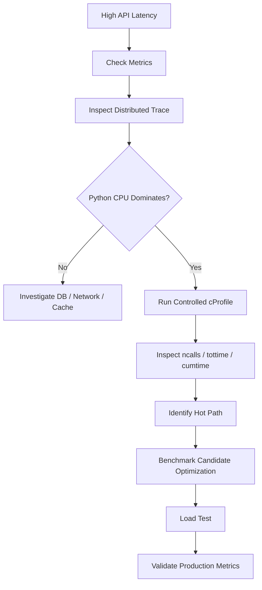

# 14- cProfile

## Overview

`cProfile` is Python's built-in deterministic CPU profiler for understanding where a program spends execution time and how frequently functions are called.

It is particularly useful when a performance problem has already been identified but the expensive Python execution path is unclear.

Typical questions include:

- Which functions consume the most CPU time?
- Which functions are called unexpectedly often?
- Which caller is responsible for an expensive operation?
- Is time spent in a function itself or in functions it calls?
- Did a refactoring introduce excessive function-call overhead?
- Which Python code path should be optimized first?

A typical performance investigation looks like:

```text
Production symptom
       ↓
Metrics / tracing
       ↓
Identify slow component
       ↓
cProfile / sampling profiler
       ↓
Identify Python hot path
       ↓
Optimize
       ↓
Benchmark
       ↓
Load test
       ↓
Production validation
```

`cProfile` is therefore a **diagnostic tool**, not a replacement for distributed tracing, database profiling, or load testing.

---

## Why cProfile Matters

Python applications can contain large call graphs.

For example:

```text
API handler
   ↓
service
   ↓
repository
   ↓
serializer
   ↓
validation
```

A slow request does not necessarily mean the top-level handler is inefficient.

The actual cost may be hidden several levels below it.

`cProfile` records function calls and timing information so that the call graph can be inspected quantitatively.

---

## What cProfile Measures

`cProfile` provides deterministic profiling information for Python function execution.

Important measurements include:

| Metric | Meaning |
|---|---|
| `ncalls` | Number of calls |
| `tottime` | Time spent directly inside the function |
| `cumtime` | Time spent in the function and its descendants |
| `percall` | Average time per call |
| `filename:lineno` | Source location |
| `function` | Function being profiled |

The most important distinction is:

```text
tottime
vs
cumtime
```

---

## `tottime`

`tottime` measures time spent directly inside the function body, excluding time spent in functions it calls.

Consider:

```python
def process_order(order):
    validate_order(order)
    save_order(order)
```

If `save_order()` consumes most of the CPU time, `process_order()` may have:

```text
low tottime
high cumtime
```

This means the function itself is inexpensive, but its descendants are expensive.

---

## `cumtime`

`cumtime` represents cumulative time spent in a function and the functions it calls.

For identifying important call paths, cumulative time is often the most useful initial sorting criterion.

Example:

```text
process_request
    ↓
process_order
    ↓
validate_order
    ↓
normalize_payload
```

If `normalize_payload()` dominates execution, its cost contributes to the cumulative time of every caller above it.

---

## Basic Profiling

The simplest programmatic usage is:

```python
import cProfile


def process_batch() -> None:
    ...


if __name__ == "__main__":
    profiler = cProfile.Profile()
    profiler.enable()

    process_batch()

    profiler.disable()
```

This collects profiling data but does not yet display it.

Use `pstats` to inspect the results.

---

## Using pstats

```python
import cProfile
import pstats


def process_batch() -> None:
    ...


if __name__ == "__main__":
    profiler = cProfile.Profile()
    profiler.enable()

    process_batch()

    profiler.disable()

    stats = pstats.Stats(profiler)
    stats.sort_stats("cumulative")
    stats.print_stats(30)
```

The final number:

```python
print_stats(30)
```

limits output to the most relevant entries.

This is usually easier to interpret than printing the entire profile.

---

## Command-Line Profiling

For a Python module:

```bash
python -m cProfile -s cumulative -m myapp.worker
```

For a script:

```bash
python -m cProfile -s cumulative app.py
```

The `-s` option controls result sorting.

Useful values include:

```text
cumulative
time
calls
```

For most investigations, start with:

```bash
-s cumulative
```

---

## Saving a Profile

For larger investigations, save the profile to a file:

```bash
python -m cProfile -o profile.prof -m myapp.worker
```

This allows the profiling run and analysis to be separated.

The workflow becomes:

```text
Run workload
     ↓
Generate profile.prof
     ↓
Analyze profile
     ↓
Identify hot path
```

This is useful for CI, reproducible investigations, and offline analysis.

---

## Analyzing a Saved Profile

Use Python's `pstats` module:

```python
import pstats

stats = pstats.Stats("profile.prof")
stats.sort_stats("cumulative")
stats.print_stats(30)
```

You can also inspect callers:

```python
stats.print_callers()
```

and callees:

```python
stats.print_callees()
```

These are useful when understanding how an expensive function is reached.

---

## Reading a cProfile Table

A typical profile may look conceptually like:

```text
ncalls  tottime  percall  cumtime  percall filename:lineno(function)
100000    0.120    0.000    1.850    0.000 service.py:10(process)
100000    0.900    0.000    0.900    0.000 validation.py:20(validate)
     1    0.010    0.010    0.700    0.700 repository.py:30(fetch)
```

Interpretation:

- `validate()` directly consumes substantial CPU;
- `process()` has low direct cost but high cumulative cost;
- `fetch()` may be expensive from the profiler's perspective;
- call counts can reveal unexpected amplification.

Do not optimize based on one column alone.

---

## High Call Count as a Bottleneck

A function does not need to be individually expensive to dominate runtime.

Suppose:

```text
function A:
    10 calls
    1 ms/call

function B:
    1,000,000 calls
    5 µs/call
```

Function B can contribute approximately:

```text
5 seconds
```

of cumulative execution time.

This is why `ncalls` and `cumtime` should be examined together.

Often the best optimization is:

```text
reduce number of calls
```

rather than:

```text
make one call slightly faster
```

---

## `tottime` vs `cumtime` Example

Consider:

```python
def handler() -> None:
    service()


def service() -> None:
    repository()


def repository() -> None:
    expensive_operation()
```

Conceptually:

```text
handler
  └── service
        └── repository
              └── expensive_operation
```

If `expensive_operation()` consumes 500 ms:

```text
handler cumtime      ≈ 500 ms
service cumtime      ≈ 500 ms
repository cumtime   ≈ 500 ms
expensive_operation
    tottime           ≈ 500 ms
```

The high cumulative time of the parent functions does not mean all of them independently cost 500 ms.

The cost is propagated upward through the call hierarchy.

---

## Recursive Calls

Recursive functions can produce multiple call counts.

For example:

```python
def walk(node):
    if node is None:
        return

    walk(node.left)
    walk(node.right)
```

The profiler may display call counts in a form such as:

```text
1000/500
```

representing primitive and total call counts for recursive execution.

When analyzing recursion, consider:

- total invocations;
- cumulative time;
- recursion depth;
- input size;
- repeated work.

---

## Profiling a Realistic Workload

The profile is only useful if the workload represents the problem.

For example, profiling:

```python
process_batch(records[:10])
```

may hide behavior that occurs with:

```text
100,000 records
```

A realistic workload should include:

- representative input sizes;
- representative data distributions;
- relevant cache state;
- realistic database results;
- realistic serialization;
- expected control flow.

---

## Profile the Critical Path

Do not profile everything indiscriminately.

If tracing shows:

```text
POST /orders
    650 ms
```

and:

```text
PostgreSQL = 500 ms
Python = 100 ms
network = 50 ms
```

there may be little value in deeply optimizing Python until the database path is understood.

If Python accounts for 80% of the latency, `cProfile` becomes much more relevant.

---

## cProfile and Web Applications

Profiling a FastAPI or Django service can be done by profiling a controlled application process or an isolated request workload.

Avoid indiscriminately enabling deterministic profiling across all production requests.

A safer architecture is:

```text
Representative request
       ↓
Controlled profiling environment
       ↓
cProfile
       ↓
Profile output
       ↓
Analysis
```

For production-like services, sampling profilers are generally more appropriate when continuous or low-overhead profiling is required.

---

## Profiling a Specific Function

Programmatic profiling can isolate a specific workload:

```python
import cProfile
import pstats


def profile_workload() -> None:
    process_orders()


profiler = cProfile.Profile()
profiler.enable()

profile_workload()

profiler.disable()

stats = pstats.Stats(profiler)
stats.sort_stats("cumulative")
stats.print_stats(25)
```

The key is to keep the profiled workload focused enough that the resulting profile is interpretable.

---

## Context Managers for Profiling

A reusable context manager can make targeted profiling easier:

```python
import cProfile
import pstats
from contextlib import contextmanager
from collections.abc import Iterator


@contextmanager
def profile_block(limit: int = 30) -> Iterator[None]:
    profiler = cProfile.Profile()
    profiler.enable()

    try:
        yield
    finally:
        profiler.disable()

        stats = pstats.Stats(profiler)
        stats.sort_stats("cumulative")
        stats.print_stats(limit)
```

Usage:

```python
with profile_block():
    process_batch()
```

This is useful for development and targeted diagnostics.

Avoid leaving such instrumentation enabled in normal production execution paths without an explicit operational reason.

---

## Profiling Async Code

`cProfile` can profile Python execution in asynchronous applications, but interpretation requires care.

Consider:

```python
async def handler():
    result = await fetch_data()
    return transform(result)
```

The request may spend most of its wall-clock time waiting for:

```text
PostgreSQL
HTTP
Redis
gRPC
```

CPU profiling does not provide a complete picture of asynchronous waiting.

For asyncio services, combine:

- `cProfile` or sampling profiling;
- event-loop monitoring;
- distributed tracing;
- external-service latency metrics;
- task metrics.

---

## Event Loop Blocking

A useful async profiling target is CPU-bound synchronous work executed inside the event loop.

Example:

```python
async def handler():
    result = expensive_cpu_operation()
    return result
```

If the function consumes substantial CPU, it can prevent other coroutines from progressing on that event loop.

Profiling can identify the expensive call.

Potential solutions include:

- optimizing the function;
- reducing the workload;
- moving CPU-heavy work to a process-based execution model;
- using an appropriate background worker.

---

## cProfile and Database Calls

Database calls require careful interpretation.

A profile may show:

```text
repository.fetch_users
    cumtime = 2.0 seconds
```

This does not necessarily mean Python spent two seconds executing CPU instructions.

The function may be waiting for PostgreSQL.

Use PostgreSQL-specific analysis:

```sql
EXPLAIN (ANALYZE, BUFFERS)
SELECT id, email
FROM users
WHERE email = $1;
```

Use cProfile to understand Python-side overhead and database tooling to understand SQL execution.

---

## cProfile and N+1 Queries

Consider:

```python
for order in orders:
    customer = get_customer(order.customer_id)
    process(order, customer)
```

A profile may reveal:

```text
get_customer
    ncalls = 10,000
```

This is a strong signal that repeated work may exist.

The correct optimization may be:

```text
10,000 database queries
        ↓
batch query / join / eager loading
```

rather than optimizing `get_customer()` itself.

Profiling can reveal the symptom; architecture and database analysis determine the correct fix.

---

## cProfile and Serialization

Serialization can become a significant CPU hotspot.

For example:

```python
import json


def serialize_response(records):
    return json.dumps(records)
```

If profiling shows:

```text
json.dumps
    significant cumulative time
```

investigate:

- payload size;
- nested object depth;
- serialization frequency;
- repeated serialization;
- response shape;
- compression;
- alternative formats where justified.

For REST APIs, reducing unnecessary response fields can sometimes provide larger gains than optimizing serialization code.

---

## cProfile and Validation

Request validation can become expensive when:

- payloads are large;
- schemas are deeply nested;
- validation is repeated;
- conversions are performed repeatedly.

If a validator appears high in cumulative CPU time, investigate:

```text
input size
call count
schema complexity
duplicate validation
```

Do not remove validation merely to improve performance.

Correctness and security remain primary constraints.

---

## cProfile and Regular Expressions

Regex-heavy processing can appear prominently in profiles.

Example:

```python
import re

EMAIL_PATTERN = re.compile(
    r"^[^@\s]+@[^@\s]+\.[^@\s]+$"
)


def validate_email(value: str) -> bool:
    return EMAIL_PATTERN.fullmatch(value) is not None
```

If profiling shows regex processing as a hotspot:

- check whether validation is repeated unnecessarily;
- precompile reusable patterns;
- bound input sizes;
- review pattern complexity.

For externally controlled input, avoid patterns susceptible to pathological backtracking.

---

## cProfile and Object Creation

Python can spend significant CPU time constructing objects.

Potential sources include:

- dictionaries;
- dataclasses;
- Pydantic models;
- ORM objects;
- intermediate lists;
- serialization structures.

A profile may show constructors or helper functions with high call counts.

Optimization opportunities can include:

- avoiding unnecessary intermediate representations;
- processing only required fields;
- reducing repeated conversions;
- streaming instead of materializing.

---

## cProfile and Comprehensions

A comprehension is not inherently faster or slower in every context.

Example:

```python
result = [
    transform(item)
    for item in items
]
```

If `transform()` dominates execution, replacing the comprehension with a loop will likely provide little benefit.

Profile the actual work.

Do not optimize syntax before understanding the expensive operation.

---

## cProfile and Function Call Overhead

Python function calls have overhead.

A very small function called millions of times can become measurable:

```python
def normalize(value):
    return value.strip().lower()
```

If profiling shows millions of calls, possible optimizations include:

- reducing calls;
- moving work into a larger operation;
- avoiding redundant normalization;
- changing data flow.

Do not inline functions purely because they appear in a profile. Maintainability and correctness still matter.

---

## Profiling Generators

Generators can shift where work appears in the profile.

Creating:

```python
events = (
    transform(event)
    for event in source
)
```

may be cheap.

Consuming:

```python
for event in events:
    process(event)
```

executes the deferred work.

Therefore, profile the complete consumption path rather than assuming generator creation represents the workload.

---

## Profiling C Extensions

Some Python operations delegate work to native C implementations.

Examples include parts of:

- standard-library containers;
- JSON processing;
- compression;
- numerical libraries;
- cryptographic libraries.

A Python profiler may show a high-level Python call without exposing all internal native execution details.

If native execution dominates:

- inspect library-specific profiling tools;
- benchmark the operation;
- measure CPU utilization;
- consider native-library behavior separately.

---

## Deterministic Profiling Overhead

`cProfile` instruments function calls.

Instrumentation adds overhead and can change execution characteristics.

Therefore:

```text
profiled runtime
≠
normal runtime
```

The profile is most useful for identifying relative hotspots and call relationships rather than treating every timing value as an exact production measurement.

---

## cProfile vs Statistical Profilers

| Characteristic | `cProfile` | Sampling profiler |
|---|---|---|
| Method | Deterministic instrumentation | Periodic stack sampling |
| Call counts | Detailed | Approximate/inferred |
| Call graph | Detailed | Stack-based |
| Overhead | Higher | Usually lower |
| Production suitability | Limited | Better |
| Short functions | More likely captured | May be missed |
| Focused debugging | Excellent | Excellent |
| Long-running service | Less suitable | Better |

Use `cProfile` for controlled diagnosis and sampling profilers for low-overhead continuous investigation.

---

## cProfile vs timeit

These tools answer different questions.

| Tool | Question |
|---|---|
| `timeit` | How fast is this isolated operation? |
| `cProfile` | Where does this workload spend CPU execution time? |

A useful workflow is:

```text
cProfile
   ↓
identify hot function
   ↓
isolate operation
   ↓
timeit
   ↓
compare implementations
```

This prevents premature micro-optimization.

---

## cProfile vs Distributed Tracing

Distributed tracing provides request-level timing:

```text
API
 ↓
service
 ↓
PostgreSQL
 ↓
Redis
 ↓
external API
```

cProfile provides Python-level function timing.

Use tracing to answer:

```text
Which service or dependency is slow?
```

Use cProfile to answer:

```text
Which Python functions are consuming CPU?
```

They complement each other.

---

## cProfile vs Memory Profiling

`cProfile` measures CPU execution.

It is not a memory profiler.

For memory investigations use:

```text
tracemalloc
RSS metrics
memory profilers
heap/object inspection
```

A function can be:

```text
CPU-efficient
but
memory-intensive
```

or:

```text
CPU-intensive
but
memory-efficient
```

Both dimensions need independent analysis.

---

## Profiling Workflow for Backend Services

A practical investigation:



This keeps profiling targeted.

---

## Production Profiling Strategy

For a production service:

1. Detect a measurable performance problem.
2. Determine whether Python CPU is a significant contributor.
3. Reproduce the workload outside production when possible.
4. Run `cProfile` against the representative workload.
5. Identify the dominant Python call paths.
6. Benchmark candidate changes.
7. Load-test the optimized implementation.
8. Validate production telemetry.

If reproduction is impossible, use low-overhead statistical profiling and distributed tracing instead of applying heavy deterministic profiling to the live service.

---

## Profiling Docker Containers

A containerized service should be profiled under representative resource constraints.

For example:

```bash
docker stats
```

can provide container-level resource information.

Then profile the relevant Python process in a controlled environment.

The key is to correlate:

```text
cProfile CPU behavior
+
container CPU allocation
+
container memory
+
request throughput
```

---

## Profiling Kubernetes Workloads

Kubernetes introduces additional variables:

- CPU limits;
- CPU throttling;
- memory limits;
- multiple worker processes;
- replica count;
- node contention.

A cProfile result from an unrestricted developer machine may not represent production behavior.

For meaningful diagnosis, reproduce relevant deployment characteristics where practical.

---

## Worker Processes

Suppose a Python service uses:

```text
4 worker processes
```

A profile generated from one worker does not automatically describe the aggregate service.

Each process may have different:

- request distribution;
- cache state;
- CPU utilization;
- workload;
- memory footprint.

Aggregate system metrics should therefore accompany application profiles.

---

## Celery Profiling

For a CPU-heavy Celery task:

```text
queue
  ↓
worker
  ↓
task
  ↓
Python processing
```

cProfile can be useful for profiling the task function in isolation.

For production worker diagnosis, also inspect:

- task duration;
- queue depth;
- worker concurrency;
- retries;
- CPU utilization;
- memory growth.

A slow task may be caused by downstream I/O rather than Python CPU.

---

## Profiling Kafka Processing

For Kafka consumers, isolate the Python processing stage:

```text
Kafka record
   ↓
deserialize
   ↓
validate
   ↓
transform
   ↓
persist
```

cProfile can identify CPU-heavy Python stages.

Consumer lag and throughput metrics determine whether that CPU cost actually limits system capacity.

---

## Profiling Results and Optimization Priority

Prioritize optimization using:

```text
impact
×
frequency
×
critical-path relevance
```

A function consuming:

```text
30% of CPU
```

in an endpoint responsible for:

```text
80% of traffic
```

is generally a higher-value target than a function consuming:

```text
5% of CPU
```

in an administrative endpoint.

Profiling provides the evidence; workload metrics determine business and operational priority.

---

## Common Mistakes

### Profiling Without a Baseline

Without a known performance problem, profile data can become noise.

### Sorting Only by `tottime`

This can miss expensive work hidden in child functions.

### Sorting Only by `cumtime`

High cumulative time in parent functions does not mean every parent is independently expensive.

### Ignoring Call Counts

Millions of cheap calls can dominate total runtime.

### Profiling Unrealistic Data

A profile based on tiny inputs can hide production-scale behavior.

### Treating Profile Time as Exact

Instrumentation affects runtime.

### Optimizing the First Hot Function

The apparent hotspot may be a wrapper around the real expensive operation.

### Ignoring External Dependencies

A function waiting on PostgreSQL may appear expensive without being CPU-bound.

---

## Production Pitfalls

### Profiling All Requests

Enabling deterministic profiling globally can add substantial overhead.

Use targeted profiling instead.

### Profiling During Peak Traffic

Heavy instrumentation during an incident can make the incident worse.

Prefer controlled samples or staging reproduction.

### Profiling Only One Worker

Multi-process deployments can distribute workload unevenly.

### Ignoring CPU Limits

CPU throttling can distort application latency independently of code efficiency.

### Ignoring Memory

A CPU optimization may increase allocations and memory pressure.

### Optimizing Before Confirming the Critical Path

A faster function is irrelevant if it is not materially contributing to end-to-end latency.

---

## Security Considerations

Profile output can reveal internal application information, including:

- module paths;
- function names;
- database-related code;
- internal service names;
- filesystem paths;
- execution structure.

Protect profile files and analysis systems using:

- restricted access;
- secure storage;
- appropriate retention;
- controlled transfer;
- redaction where necessary.

Do not expose profiling endpoints or raw profile artifacts publicly.

---

## Reliability Considerations

Profiling should be operationally safe.

Use:

- controlled profiling duration;
- representative workloads;
- limited scope;
- low-risk environments;
- rollback procedures;
- sampling profilers for low-overhead production observation.

During incidents, prioritize restoring service health over obtaining perfect profiling data.

---

## Cost Considerations

Profiling can reduce infrastructure cost by identifying CPU-heavy workloads.

For example:

```text
Before:
8 × 2-vCPU workers

After:
4 × 2-vCPU workers
```

may be possible if profiling identifies unnecessary CPU consumption and load testing confirms the change.

However, optimization should account for:

```text
engineering effort
+
complexity
+
correctness risk
+
operational risk
+
infrastructure savings
```

---

## CI/CD Performance Regression Detection

A saved cProfile output can support controlled regression analysis.

Conceptually:

```text
Commit
  ↓
Tests
  ↓
Representative workload
  ↓
cProfile
  ↓
Compare profile
  ↓
Investigate significant regression
```

For routine CI performance tests, dedicated benchmark suites are often easier to maintain.

cProfile is especially useful when a regression requires understanding **which call path changed**.

---

## Profiling and Code Review

Profile results can inform code review.

For example:

```text
Before:
normalize_user() → 1,000,000 calls

After:
normalize_user() → 100,000 calls
```

Even if the implementation remains readable, reducing unnecessary work can provide a substantial improvement.

Code review should still evaluate:

- correctness;
- maintainability;
- readability;
- concurrency behavior;
- memory usage;
- operational impact.

Performance is one dimension of engineering quality.

---

## Best Practices

- Profile only after defining a measurable performance problem.
- Use realistic workloads and production-like input sizes.
- Start with `cumtime` to identify important call paths.
- Inspect `tottime` to identify functions performing expensive work directly.
- Inspect `ncalls` to identify repeated or amplified operations.
- Use `print_callers()` and `print_callees()` to understand call relationships.
- Save large profiles to files for offline analysis.
- Use `cProfile` for focused deterministic analysis rather than continuous production profiling.
- Use sampling profilers when low-overhead production profiling is required.
- Correlate Python profiles with distributed tracing and database metrics.
- Use `timeit` after isolating a candidate operation.
- Validate optimizations with realistic benchmarks and load tests.
- Measure p50, p95, and p99 latency at the service level.
- Consider CPU, memory, database, network, and concurrency behavior together.
- Protect profile artifacts because they may reveal sensitive internal implementation details.

---

## Production Checklist

Before acting on a cProfile result:

- [ ] The performance problem has been quantified.
- [ ] A representative workload exists.
- [ ] The profile is scoped to the relevant Python execution path.
- [ ] `ncalls` has been inspected.
- [ ] `tottime` has been inspected.
- [ ] `cumtime` has been inspected.
- [ ] Callers and callees have been considered where necessary.
- [ ] External I/O has been distinguished from CPU work.
- [ ] Database performance has been checked separately where relevant.
- [ ] Memory behavior has been evaluated separately where relevant.
- [ ] The candidate optimization has been benchmarked.
- [ ] Correctness has been verified.
- [ ] Load testing has been performed.
- [ ] Container and Kubernetes resource constraints have been considered.
- [ ] Production latency and throughput have been re-measured.
- [ ] Profile artifacts are protected appropriately.

## Interview Traps

### "`cProfile` Measures End-to-End API Latency"

It profiles Python execution and function calls. It does not provide a complete distributed latency breakdown.

### "`cumtime` Is the Time Spent Executing Only That Function"

No. `cumtime` includes time spent in descendant calls.

### "`tottime` Is Always the Most Important Metric"

No. A function can have low direct CPU time but high cumulative impact because it invokes expensive functions.

### "The Most Expensive Function Is Always the Best Optimization Target"

Not necessarily. Consider call frequency, traffic volume, critical-path relevance, and whether the cost is actually CPU-bound.

### "cProfile Has No Production Overhead"

Deterministic instrumentation introduces overhead and can alter execution behavior.

### "A Slow Database Call Means Python Is Slow"

A Python function may spend time waiting for PostgreSQL. Database execution should be analyzed independently.

### "`cProfile` Replaces Distributed Tracing"

No. Tracing explains service-to-service and dependency latency; cProfile explains Python-level execution.

### "One Profile Represents the Entire Kubernetes Deployment"

Not necessarily. Multiple workers, replicas, CPU limits, and workload distribution can produce different behavior.

## Key Takeaways

- **`cProfile` is a deterministic Python CPU profiler:** use it to understand function call counts, direct execution time, cumulative execution time, and call relationships.
- **`tottime`, `cumtime`, and `ncalls` answer different questions:** inspect them together to distinguish expensive functions, expensive call chains, and excessive invocation frequency.
- **Profile the right workload and layer:** use cProfile for Python CPU work, PostgreSQL tooling for SQL, distributed tracing for cross-service latency, and memory profilers for allocation and retention problems.
- **Treat cProfile as a diagnostic tool, not a production latency measurement:** deterministic instrumentation adds overhead, so use controlled workloads or lower-overhead sampling profilers for live services.
- **Validate every optimization end to end:** benchmark the isolated change, load-test realistic traffic, and confirm improvements in latency, throughput, CPU, memory, and downstream resource usage.