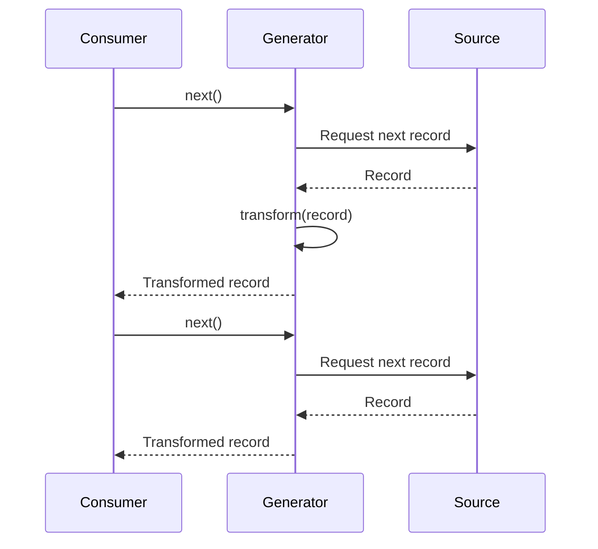
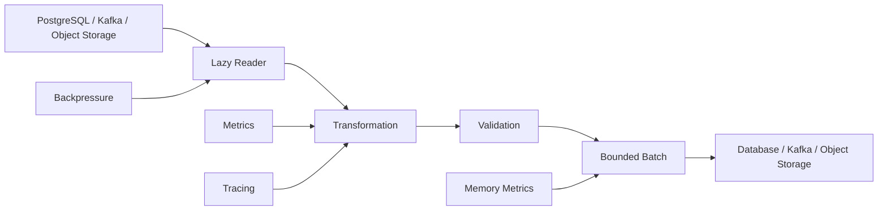

# 16- Lazy Evaluation

## Overview

Lazy evaluation is a programming strategy where an operation is deferred until its result is actually needed.

In Python, laziness commonly appears through:

- generators;
- generator expressions;
- iterators;
- `map()` and `filter()`;
- lazy file and stream processing;
- database cursors;
- asynchronous iterators;
- application pipelines that process data incrementally.

The central distinction is:

```text
Eager evaluation
    ↓
Compute everything now
    ↓
Store results

Lazy evaluation
    ↓
Describe how to compute
    ↓
Compute only when consumed
```

Lazy evaluation is particularly valuable in backend systems because it can reduce peak memory usage, avoid unnecessary work, improve streaming behavior, and provide natural backpressure boundaries.

However, laziness is not automatically faster. It can introduce additional iteration overhead, defer failures, complicate debugging, and become ineffective if the consumer eventually materializes the entire result.

---

## Why Lazy Evaluation Matters

Consider processing one million records.

An eager implementation might do:

```python
records = [transform(record) for record in source]
```

This requires the transformed results to exist simultaneously.

A lazy implementation can use:

```python
records = (transform(record) for record in source)
```

The transformation occurs as the iterator is consumed.

Conceptually:

```text
Eager

Source
  ↓
Read all
  ↓
Transform all
  ↓
Store all
  ↓
Consume


Lazy

Source
  ↓
Read one
  ↓
Transform one
  ↓
Consume one
  ↓
Read next
```

For large datasets, this difference can determine whether a service remains within its memory budget.

---

## Eager vs Lazy Evaluation

| Characteristic | Eager | Lazy |
|---|---|---|
| Computation | Immediate | Deferred |
| Memory | Often higher | Often lower |
| First result | Usually later | Can arrive earlier |
| Full traversal | Computed immediately | Computed on demand |
| Error timing | Often immediate | May be delayed |
| Reusability | Materialized result can often be reused | Iterator may be exhausted |
| Debugging | Usually simpler | Can be less obvious |
| Streaming | Less natural | Natural |
| Repeated iteration | Usually straightforward | Depends on iterable |
| CPU work | May perform unnecessary work | Can avoid unused work |

---

## Iterable vs Iterator

Lazy evaluation in Python is closely related to the distinction between iterables and iterators.

An **iterable** provides a way to obtain an iterator:

```python
items = [1, 2, 3]

iterator = iter(items)
```

An **iterator** produces values incrementally:

```python
next(iterator)
next(iterator)
next(iterator)
```

A generator is both an iterable and an iterator.

```python
def numbers():
    yield 1
    yield 2
    yield 3
```

Calling:

```python
result = numbers()
```

does not execute the entire function body.

Execution begins when the generator is consumed:

```python
next(result)
```

---

## Generator Execution Model

Generators suspend execution at each `yield`.

```python
def process(records):
    for record in records:
        transformed = transform(record)
        yield transformed
```

The lifecycle is:



The generator retains its execution state between `next()` calls.

---

## Generator Expressions

Generator expressions provide concise lazy pipelines.

Eager:

```python
records = [
    transform(record)
    for record in source
]
```

Lazy:

```python
records = (
    transform(record)
    for record in source
)
```

The second expression does not execute `transform()` for every source item immediately.

It executes the transformation as the generator is consumed.

---

## Consumption Triggers Evaluation

Lazy objects require a consumer.

For example:

```python
values = (expensive_transform(x) for x in source)
```

At this point:

```text
expensive_transform()
```

has not necessarily been called for every item.

Consumption triggers the work:

```python
for value in values:
    process(value)
```

Other consumers include:

```python
list(values)
tuple(values)
sum(values)
max(values)
next(values)
```

and many library operations that iterate over the object.

---

## Materialization Removes the Main Memory Benefit

This pattern looks lazy:

```python
values = (transform(x) for x in source)
```

but immediately materializes the entire result:

```python
values = list(values)
```

At that point, the primary memory advantage has disappeared.

The complete data flow becomes:

```text
Lazy producer
     ↓
Generator
     ↓
list()
     ↓
Full materialization
```

Lazy evaluation is effective only when laziness is preserved through the downstream pipeline.

---

## Partial Consumption

One major advantage of laziness is that unused work can be avoided.

Consider:

```python
def expensive_values():
    for item in source:
        yield expensive_transform(item)
```

If the consumer only needs the first result:

```python
first = next(expensive_values())
```

the remaining items are never transformed.

This is useful for:

- finding the first matching record;
- short-circuiting validation;
- bounded searches;
- pagination;
- threshold detection;
- early termination.

---

## Short-Circuiting

Several Python operations naturally benefit from lazy iteration.

For example:

```python
if any(is_valid(item) for item in records):
    handle_match()
```

`any()` stops once a truthy result is found.

Similarly:

```python
if all(is_valid(item) for item in records):
    accept()
```

stops at the first false result.

This can avoid processing the remainder of a large dataset.

---

## `map()` and `filter()`

In modern Python, `map()` and `filter()` return lazy iterators.

```python
mapped = map(transform, records)
filtered = filter(is_valid, mapped)
```

The operations are deferred until consumption.

For example:

```python
result = next(filtered)
```

causes only enough work to produce the next result.

This allows pipelines without allocating intermediate lists.

---

## Lazy Pipelines

A backend data-processing pipeline can be expressed as:

```python
records = (
    parse(message)
    for message in messages
)

valid_records = (
    record
    for record in records
    if is_valid(record)
)

transformed = (
    transform(record)
    for record in valid_records
)

for record in transformed:
    persist(record)
```

Conceptually:

```text
Input
  ↓
Parse
  ↓
Validate
  ↓
Transform
  ↓
Persist
```

Each stage can process one item at a time.

This is particularly useful for large streams.

---

## Memory Complexity

Suppose there are `n` records and each transformed record requires `m` bytes.

An eager pipeline can require approximately:

```text
O(n × m)
```

additional storage for the materialized results.

A streaming generator pipeline can often maintain:

```text
O(1)
```

or bounded auxiliary memory relative to the number of records.

The exact memory usage still depends on:

- source buffering;
- downstream buffering;
- object size;
- batching;
- framework behavior;
- database drivers;
- network buffers.

Lazy evaluation does not guarantee constant memory by itself.

---

## Time Complexity

Lazy evaluation does not inherently reduce algorithmic complexity.

For example:

```python
sum(x * 2 for x in values)
```

still processes all `n` values:

```text
O(n)
```

The main benefit is that intermediate results do not need to be materialized.

Lazy evaluation can reduce actual work when combined with short-circuiting:

```python
next(x for x in values if expensive_condition(x))
```

may stop before processing all `n` values.

Therefore:

```text
Laziness
    ≠
Automatically faster

Laziness + early termination
    → potentially less work
```

---

## Peak Memory vs Total Work

Consider:

```python
result = [
    transform(item)
    for item in items
]
```

versus:

```python
result = (
    transform(item)
    for item in items
)
```

The lazy version may reduce peak memory substantially.

However, if the application eventually consumes every item, the total transformation work remains approximately the same.

The primary improvement is often:

```text
lower peak memory
```

rather than:

```text
lower total CPU
```

---

## Lazy Evaluation and `tracemalloc`

`tracemalloc` can help verify the memory impact of lazy versus eager processing.

For example:

```python
import tracemalloc


def process_lazy(items):
    return (transform(item) for item in items)


tracemalloc.start()

generator = process_lazy(items)

current, peak = tracemalloc.get_traced_memory()

print(f"Current: {current / 1024**2:.2f} MiB")
print(f"Peak:    {peak / 1024**2:.2f} MiB")
```

Be careful: creating the generator does not represent the cost of consuming it.

Measure the complete workload:

```python
for item in generator:
    process(item)
```

when that represents actual application behavior.

---

## Streaming Large Files

Lazy iteration is built into normal file iteration.

```python
from pathlib import Path


with Path("events.log").open() as file:
    for line in file:
        process_line(line)
```

This does not require loading the entire file into memory.

Avoid:

```python
lines = Path("events.log").read_text().splitlines()
```

for arbitrarily large files when incremental processing is sufficient.

---

## Large JSON Files

A naive approach:

```python
import json

with open("events.json") as file:
    events = json.load(file)
```

materializes the entire JSON structure.

For large JSON datasets, a streaming-compatible format or parser may be more appropriate.

For example, newline-delimited JSON can naturally support incremental processing:

```python
import json


def read_events(path: str):
    with open(path, encoding="utf-8") as file:
        for line in file:
            if line.strip():
                yield json.loads(line)
```

This allows:

```python
for event in read_events("events.ndjson"):
    process(event)
```

The file format itself matters: standard JSON often represents one complete document, while NDJSON naturally supports record-oriented streaming.

---

## Database Streaming

Database access is a major backend use case for lazy processing.

A naive pattern is:

```python
rows = cursor.fetchall()

for row in rows:
    process(row)
```

This materializes the entire result set.

A cursor or driver mechanism that supports incremental fetching can instead provide:

```text
PostgreSQL
    ↓
fetch batch
    ↓
Python
    ↓
process
    ↓
fetch next batch
```

The exact API depends on the PostgreSQL driver and framework.

The important design principle is to avoid unnecessary full materialization.

---

## Django QuerySets

Django QuerySets are an important example of deferred database execution.

Consider:

```python
queryset = User.objects.filter(active=True)
```

Constructing the QuerySet does not generally execute the database query immediately.

Evaluation can occur when the QuerySet is consumed:

```python
for user in queryset:
    process(user)
```

Other operations can also trigger evaluation.

This distinction is important because developers can unintentionally force materialization.

For large QuerySets, Django provides patterns such as:

```python
for user in User.objects.filter(active=True).iterator():
    process(user)
```

The exact memory behavior depends on Django and database-driver configuration, but `iterator()` is specifically useful when processing large query results without retaining the normal QuerySet result cache.

---

## QuerySet Evaluation Pitfalls

Consider:

```python
users = User.objects.filter(active=True)

if users:
    ...
```

Truth-value testing can evaluate the QuerySet.

Similarly:

```python
users = list(User.objects.filter(active=True))
```

forces complete materialization.

Repeated evaluation and accidental conversions can create:

- additional database queries;
- increased memory usage;
- unnecessary latency.

Understand the evaluation semantics of the framework rather than assuming every query object is a cheap in-memory collection.

---

## FastAPI Streaming

FastAPI applications can use lazy or streaming producers for large responses.

Conceptually:

```python
from collections.abc import AsyncIterator


async def generate_rows() -> AsyncIterator[str]:
    async for row in repository.stream_rows():
        yield serialize_row(row)
```

The HTTP layer can consume the producer incrementally when using an appropriate streaming response.

The architecture becomes:

```text
PostgreSQL
    ↓
Database cursor / stream
    ↓
Async generator
    ↓
Serialization
    ↓
HTTP response
    ↓
Client
```

This avoids requiring the entire response body to exist in application memory.

---

## Streaming Does Not Mean Unlimited Throughput

A streaming response still has buffering at multiple layers:

```text
Database
    ↓
Application
    ↓
HTTP server
    ↓
Nginx / proxy
    ↓
Network
    ↓
Client
```

Buffers may exist at every stage.

Production streaming must therefore consider:

- socket buffers;
- proxy buffering;
- response chunk size;
- client read rate;
- connection limits;
- timeouts;
- cancellation.

Lazy production is only useful when the complete pipeline preserves incremental behavior.

---

## Backpressure

Lazy iteration can naturally cooperate with backpressure.

Consider:

```text
Producer
   ↓
Generator
   ↓
Consumer
```

If the consumer requests one item at a time, the producer does not need to produce the entire dataset.

For streaming systems:

```text
Kafka
  ↓
Consumer
  ↓
Transform
  ↓
Database
```

bounded processing can prevent downstream slowness from causing unlimited in-memory accumulation.

However, Python generators alone do not provide complete backpressure guarantees. Queues, buffers, network layers, and concurrency settings must also be bounded.

---

## Async Generators

Async generators provide lazy asynchronous production.

```python
from collections.abc import AsyncIterator


async def stream_events(source) -> AsyncIterator[dict]:
    async for event in source:
        yield transform(event)
```

Consumption:

```python
async for event in stream_events(source):
    await persist(event)
```

This is useful when both production and consumption involve asynchronous I/O.

---

## Async Generator Lifecycle

The flow is:

```text
async for
   ↓
request next item
   ↓
await upstream operation
   ↓
produce item
   ↓
consumer processes item
   ↓
request next item
```

This allows I/O-bound pipelines to remain incremental without materializing the entire dataset.

---

## Cancellation

Async lazy pipelines must handle cancellation correctly.

For example:

```python
async def stream():
    try:
        async for item in source:
            yield transform(item)
    finally:
        await close_source()
```

When a request is cancelled or the consumer disconnects, resources should be released appropriately.

Use context managers and explicit lifecycle management for:

- database cursors;
- network connections;
- files;
- temporary resources.

Do not assume that generator exhaustion is the only cleanup path.

---

## Generator Exhaustion

Iterators are generally stateful.

```python
items = (x for x in range(3))

list(items)
list(items)
```

The second call produces:

```python
[]
```

because the iterator has been exhausted.

This is a common source of bugs when developers expect a lazy iterator to behave like a reusable list.

If repeated traversal is required, either recreate the iterator or retain a materialized representation when the memory cost is acceptable.

---

## Iterable vs Iterator in APIs

An API returning:

```python
def get_records() -> list[Record]:
    ...
```

communicates a materialized collection.

An API returning:

```python
from collections.abc import Iterator


def get_records() -> Iterator[Record]:
    ...
```

communicates incremental consumption.

This distinction is valuable at architectural boundaries because it makes memory and lifecycle semantics explicit.

---

## Lazy Evaluation and Resource Lifetime

A lazy iterator may keep resources alive.

Example:

```python
def read_file(path):
    file = open(path, encoding="utf-8")

    for line in file:
        yield line
```

The file remains associated with the generator while iteration continues.

A safer pattern is:

```python
from collections.abc import Iterator


def read_file(path: str) -> Iterator[str]:
    with open(path, encoding="utf-8") as file:
        yield from file
```

Now the file lifecycle is tied to generator execution and cleanup.

Consumers should still ensure that iteration is properly closed when a generator owns external resources.

---

## Lazy Evaluation and Context Managers

Combining laziness with resource management requires careful ownership.

For example:

```python
def rows(connection):
    with connection.cursor() as cursor:
        cursor.execute("SELECT id, email FROM users")

        for row in cursor:
            yield row
```

The cursor remains open while the generator is consumed.

This is useful for streaming but means:

```text
generator lifetime
    =
database resource lifetime
```

That relationship should be documented and controlled.

---

## Lazy Evaluation and Transactions

Lazy database iteration can interact with transactions.

A cursor may remain active while the application processes records.

For example:

```text
BEGIN
  ↓
Open cursor
  ↓
Process rows
  ↓
Commit
  ↓
Close cursor
```

If processing takes a long time, the transaction may remain open longer than intended.

Potential consequences include:

- long-lived snapshots;
- blocked cleanup;
- connection pool exhaustion;
- increased database resource usage.

For large jobs, carefully design transaction boundaries and batch commits rather than blindly keeping one transaction open for the entire stream.

---

## Batch Processing vs Pure Streaming

Pure one-record-at-a-time processing is not always optimal.

A bounded batch can provide better throughput:

```python
BATCH_SIZE = 500


def batches(items, size):
    batch = []

    for item in items:
        batch.append(item)

        if len(batch) == size:
            yield batch
            batch = []

    if batch:
        yield batch
```

Usage:

```python
for batch in batches(records, BATCH_SIZE):
    process_batch(batch)
```

This provides:

```text
bounded memory
+
batch efficiency
```

and is often a better production compromise than either complete materialization or strictly single-item processing.

---

## Lazy Evaluation and Network APIs

For large REST or gRPC workflows, consider whether the protocol supports incremental delivery.

REST commonly uses:

- pagination;
- chunked/streaming responses;
- NDJSON;
- asynchronous job APIs.

gRPC can support streaming RPCs.

The Python application can use generators or async generators to produce records incrementally.

The architecture should preserve streaming semantics across the entire stack.

---

## Pagination vs Lazy Evaluation

Pagination and lazy evaluation solve related but different problems.

| Technique | Primary purpose |
|---|---|
| Lazy iterator | Defer and incrementally compute values |
| Pagination | Bound API result size |
| Streaming | Incrementally transmit data |
| Batching | Process bounded groups efficiently |
| Caching | Avoid repeated computation |

A production API should not rely on a Python generator alone to solve client-side scalability.

For external APIs, pagination often provides a stronger explicit contract.

---

## Kafka and Lazy Processing

Kafka consumers naturally process messages incrementally.

A Python consumer can structure its pipeline as:

```text
Kafka record
    ↓
Deserialize
    ↓
Validate
    ↓
Transform
    ↓
Persist
    ↓
Commit offset
```

Avoid patterns that accumulate an unbounded number of records:

```python
messages = []

for message in consumer:
    messages.append(transform(message))
```

Prefer bounded batching:

```text
consume
  ↓
batch
  ↓
process
  ↓
commit
  ↓
clear
```

This improves memory predictability.

---

## Celery and Lazy Evaluation

Celery tasks can process large datasets incrementally rather than loading everything into one task.

Instead of:

```python
def process_all():
    records = load_everything()
    process(records)
```

consider partitioning work:

```text
job
 ↓
bounded chunks
 ↓
Celery tasks
 ↓
process chunk
```

This provides better:

- memory isolation;
- retry boundaries;
- horizontal scalability;
- observability.

Lazy iteration is useful inside a task, while task partitioning controls distributed workload size.

---

## Redis and Lazy Evaluation

Redis commands may return large collections or datasets.

Avoid retrieving significantly more data than the application needs.

For large Redis scans, cursor-based APIs such as `SCAN` provide incremental traversal semantics:

```text
Redis
  ↓
cursor
  ↓
batch
  ↓
process
  ↓
next cursor
```

This is conceptually aligned with lazy processing.

However, Redis cursor scans have their own consistency and performance semantics and should not be treated as an exact snapshot of the keyspace.

---

## Memory Ownership

Lazy pipelines can make ownership less obvious.

Consider:

```python
records = (
    transform(item)
    for item in source
)
```

The generator may retain references to:

- `source`;
- iterator state;
- closures;
- local variables;
- upstream resources.

A lazy pipeline therefore has memory overhead even if it does not materialize all results.

For long-lived pipelines, inspect object lifetimes rather than assuming generators are free.

---

## Lazy Evaluation and Closures

Closures can retain objects.

```python
def create_pipeline(large_config):
    def transform(item):
        return apply_config(item, large_config)

    return (transform(item) for item in source)
```

The generator can keep references to the closure and therefore to `large_config`.

This can matter in:

- background workers;
- long-lived queues;
- asynchronous tasks;
- cached generators.

Avoid capturing unnecessarily large objects in long-lived lazy pipelines.

---

## Lazy Evaluation and Concurrency

Lazy iterators are not automatically thread-safe.

Sharing one iterator between threads can introduce coordination problems.

Similarly, async generators can have lifecycle constraints and should generally have clear ownership.

Prefer:

```text
one producer
one owner
bounded queue
explicit synchronization
```

rather than sharing mutable iterator state across unrelated concurrent tasks.

---

## Lazy Evaluation and Multiprocessing

Generators are process-local execution state.

A generator cannot simply be treated as a distributed data stream across worker processes.

For multiprocessing:

```text
Parent
  ↓
partition work
  ↓
worker process
  ↓
local iterator
```

Data crossing process boundaries generally requires serialization or another IPC mechanism.

For distributed systems, Kafka, queues, databases, or object storage are appropriate ownership boundaries rather than Python generator objects.

---

## Error Timing

Lazy evaluation changes when errors occur.

Eager:

```python
values = [transform(x) for x in items]
```

An exception from `transform()` occurs while constructing `values`.

Lazy:

```python
values = (transform(x) for x in items)
```

The exception may occur later:

```python
for value in values:
    ...
```

This affects:

- transaction boundaries;
- error handling;
- retries;
- logging;
- observability;
- resource lifetime.

Production code should make these execution boundaries explicit.

---

## Retry Semantics

Lazy pipelines can complicate retries.

Suppose:

```python
for record in stream:
    process(record)
```

If processing fails after 10,000 records, restarting the iterator may:

- repeat previous records;
- resume from a checkpoint;
- reopen a database cursor;
- consume a new stream position.

For reliable processing, define:

- checkpoint boundaries;
- idempotency;
- transaction scope;
- offset management;
- retry behavior.

Laziness does not provide delivery guarantees.

---

## Testing Lazy Code

Lazy functions require tests that actually consume the result.

This test may be insufficient:

```python
result = transform_records(records)

assert result is not None
```

Instead:

```python
assert list(transform_records(records)) == expected
```

For large datasets, avoid unnecessary materialization in production tests by consuming incrementally where appropriate.

Also test:

- empty input;
- partial consumption;
- exhaustion;
- repeated iteration expectations;
- exceptions;
- cleanup;
- cancellation for async generators.

---

## Testing Resource Cleanup

If a lazy iterator owns a resource, test that lifecycle explicitly.

For example:

```python
def test_stream_closes_resource():
    stream = read_records(...)
    
    try:
        next(stream)
    finally:
        stream.close()
```

The exact test depends on the resource abstraction.

The important principle is:

```text
lazy execution
+
resource ownership
=
explicit cleanup contract
```

---

## Performance Characteristics

Lazy evaluation can improve performance through:

- reduced allocations;
- lower peak memory;
- avoided unused computation;
- earlier first-result availability;
- better streaming behavior.

It can also hurt performance through:

- iterator/generator overhead;
- repeated Python-level function calls;
- poor batching;
- excessive context switching;
- inability to exploit vectorized operations;
- repeated traversal when materialization would be more efficient.

Always measure the workload.

---

## Lazy Evaluation vs Vectorization

For numerical workloads, lazy Python iteration is not automatically the most efficient solution.

For example, repeatedly executing Python code over millions of values can be slower than a vectorized NumPy operation.

The correct choice depends on:

```text
dataset size
+
memory constraints
+
CPU cost
+
library capabilities
+
streaming requirements
```

Use laziness when incremental processing matters; use vectorization when the workload benefits from efficient native operations and can fit the required memory model.

---

## Lazy Evaluation vs Caching

Laziness delays computation.

Caching avoids repeated computation.

They solve different problems.

```text
Lazy:
"When should I compute this?"

Cache:
"Should I compute this again?"
```

They can also be combined:

```text
Lazy source
   ↓
Transform
   ↓
Cache selected results
```

Be careful because a cache introduces intentional memory retention.

---

## Lazy Evaluation and Database N+1

Lazy ORM behavior can sometimes hide database execution.

For example:

```python
for order in orders:
    print(order.customer.email)
```

If accessing `customer` triggers a query, iteration can cause:

```text
1 query for orders
+
N queries for customers
```

Lazy database evaluation is not inherently good.

The correct optimization may be eager loading at the database/ORM relationship level:

```python
orders = Order.objects.select_related("customer")
```

The important distinction is:

```text
lazy computation
≠
optimal data access
```

---

## Production Architecture

A scalable processing architecture often combines:



The goal is not maximum laziness.

The goal is **bounded resource usage with predictable throughput and failure behavior**.

---

## Production Decision Framework

Use lazy evaluation when:

- input can be large;
- not all values may be needed;
- streaming is useful;
- peak memory is a constraint;
- processing can occur incrementally;
- downstream consumers can consume incrementally.

Prefer eager evaluation when:

- the dataset is small;
- repeated traversal is required;
- random access is required;
- materialization simplifies correctness;
- downstream APIs require a concrete collection;
- the memory cost is known and acceptable.

Use bounded batching when:

- per-item processing is too expensive;
- downstream APIs support bulk operations;
- memory must remain bounded;
- throughput matters.

---

## Common Mistakes

### Assuming Lazy Means Faster

Lazy evaluation primarily changes when work and memory are used. It does not automatically reduce CPU time.

### Immediately Calling `list()`

This defeats the main memory benefit.

### Assuming Generators Are Reusable

Generators are stateful iterators and are normally exhausted after consumption.

### Ignoring Resource Lifetime

A generator can hold a database cursor, file, connection, or other resource open while it remains active.

### Forgetting Error Timing

Exceptions can occur during consumption rather than generator creation.

### Using Lazy ORM Access Everywhere

Lazy database access can cause N+1 queries.

### Using Single-Item Processing When Batching Is Better

Per-item overhead can dominate high-throughput workloads.

### Assuming Lazy Means Constant Memory

Upstream buffers, downstream buffers, caches, and retained references can still grow memory.

---

## Production Pitfalls

### Long-Lived Generators

Generators retained by queues, callbacks, or background tasks can keep objects alive longer than expected.

### Unbounded Queues

A lazy producer does not prevent memory growth if a consumer queue is unbounded.

### Streaming Through Proxies

Nginx or other infrastructure may buffer responses depending on configuration, reducing the intended streaming behavior.

### Long-Lived Database Cursors

A lazy database stream can hold connections and transactions longer than intended.

### Retry Ambiguity

Restarting a lazy stream can repeat or skip data depending on the source.

### Hidden Materialization

Frameworks or helper functions may internally convert iterators into lists.

### Excessive Generator Layers

Deeply nested generator pipelines can make debugging and profiling difficult without providing meaningful memory savings.

---

## Security Considerations

Lazy processing can improve security by avoiding unnecessary retention of sensitive data.

For example, processing records incrementally can reduce the amount of sensitive information simultaneously held in memory.

However:

- generators may still retain references;
- logs may accidentally capture streamed objects;
- exceptions can retain local state;
- caches can defeat intended data minimization.

For sensitive workloads, explicitly define data lifetime and avoid unnecessary retention.

---

## Scalability Considerations

Lazy evaluation can improve horizontal scalability by reducing per-worker memory requirements.

For example:

```text
Eager worker
    400 MiB/request workload

Lazy worker
     80 MiB/request workload
```

Lower per-worker memory can allow more concurrent workers within the same node budget.

However, CPU and I/O capacity still determine throughput.

A scalable system balances:

```text
memory
+
CPU
+
I/O
+
concurrency
+
backpressure
```

---

## High Availability

Memory-efficient processing can reduce:

- OOM kills;
- worker restarts;
- request failures;
- queue backlogs.

For high availability:

- keep memory bounded;
- use bounded queues;
- use pagination or streaming for large datasets;
- define cancellation behavior;
- avoid long-lived database transactions;
- monitor worker memory over time.

Lazy evaluation is one mechanism within a broader resource-management strategy.

---

## Monitoring

For production lazy pipelines, monitor:

- RSS;
- traced Python memory where diagnosing allocations;
- CPU utilization;
- throughput;
- queue depth;
- Kafka consumer lag;
- database connection usage;
- transaction duration;
- request latency;
- response streaming duration;
- worker restarts.

Useful derived metrics include:

```text
records processed / second
bytes processed / second
peak memory / batch
CPU time / record
database queries / batch
```

These make it possible to determine whether laziness is producing the intended operational benefit.

---

## Cost Considerations

Reducing peak memory can reduce infrastructure requirements.

For example:

```text
Before:
large materialized batches
→ high memory
→ larger Kubernetes nodes

After:
streaming + bounded batches
→ lower memory
→ smaller nodes
```

But smaller batches can increase:

- database round trips;
- transaction overhead;
- network calls;
- Python loop overhead.

The optimal design usually balances memory against throughput.

---

## Best Practices

- Use generators and iterators for large sequential workloads.
- Preserve laziness throughout the pipeline when memory reduction is the objective.
- Use short-circuiting operations when only part of the dataset may be needed.
- Prefer bounded batching when downstream operations benefit from bulk processing.
- Make iterator ownership and resource lifetime explicit.
- Close files, cursors, and connections reliably.
- Treat async generators as resources with cancellation and cleanup semantics.
- Avoid unbounded queues around lazy producers.
- Understand ORM evaluation behavior to prevent N+1 queries and accidental materialization.
- Use pagination or streaming protocols for external APIs rather than relying solely on Python laziness.
- Profile memory with `tracemalloc` and process-level RSS when investigating real workloads.
- Benchmark CPU trade-offs with `timeit` or representative benchmarks.
- Test partial consumption, exhaustion, exceptions, and cleanup.
- Define retry and checkpoint semantics for stream processing.
- Use lazy processing where it improves resource behavior, not as a stylistic rule.

---

## Production Checklist

- [ ] The input can become large enough for memory usage to matter.
- [ ] Full materialization is unnecessary.
- [ ] The downstream consumer preserves incremental processing.
- [ ] The iterator or generator has clear ownership.
- [ ] External resources are closed correctly.
- [ ] Async generators handle cancellation.
- [ ] Queues and buffers are bounded.
- [ ] Database cursors and transactions have controlled lifetimes.
- [ ] API streaming or pagination semantics are explicit.
- [ ] Retry and checkpoint behavior is defined.
- [ ] N+1 queries have been ruled out.
- [ ] Batch size has been selected based on measured workload characteristics.
- [ ] CPU overhead has been benchmarked where relevant.
- [ ] Peak memory has been measured.
- [ ] Process RSS has been monitored.
- [ ] Load testing has validated the design.
- [ ] The lazy pipeline does not retain unnecessary large objects.
- [ ] Production observability covers memory, throughput, latency, and backpressure.

## Interview Traps

### "Generators Always Use O(1) Memory"

Not necessarily. The generator itself may be small, but referenced objects, upstream buffers, downstream queues, and retained state can still consume substantial memory.

### "Lazy Evaluation Makes Code Faster"

Not inherently. It can avoid unnecessary work and reduce memory pressure, but iterator overhead may also make some workloads slower.

### "A Generator Does Nothing Until It Is Created"

The generator function body is deferred, but expressions used to create the generator object itself may already have been evaluated. The actual generator body begins when consumed.

### "`list(generator)` Is Still Lazy"

No. `list()` consumes the iterator and materializes every result.

### "Lazy ORM Queries Prevent Database Overhead"

No. Deferred execution can hide database work and may cause repeated queries such as N+1 access.

### "Generators Can Be Iterated Multiple Times"

A generator is normally a one-shot iterator. After exhaustion, it does not automatically restart.

### "Streaming Eliminates Backpressure Problems"

No. Buffers and queues can still accumulate data. Production streaming requires explicit capacity and backpressure design.

### "Lazy Database Processing Is Always Better"

Not necessarily. Long-lived cursors and transactions can consume database connections and resources. Bounded batching may be a better design.

## Key Takeaways

- **Lazy evaluation defers computation until consumption:** generators, iterators, and lazy pipelines can avoid unnecessary work and reduce peak memory.
- **Laziness is not automatically a performance optimization:** it mainly changes execution timing and memory behavior; batching, vectorization, caching, or eager evaluation may be faster for specific workloads.
- **Preserve laziness end to end:** `list()`, unbounded queues, framework materialization, and downstream buffering can eliminate the intended memory and streaming benefits.
- **Resource lifetime and failure semantics matter:** lazy database cursors, files, async generators, retries, and transactions require explicit ownership, cleanup, cancellation, and checkpoint behavior.
- **Use bounded streaming architectures:** combine lazy processing with pagination, batching, backpressure, observability, and realistic load testing to achieve predictable production resource usage.