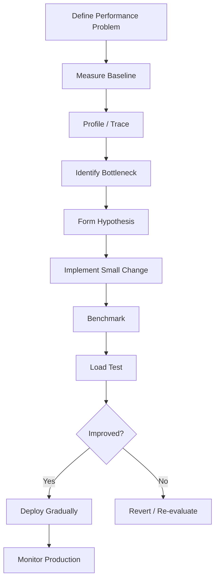

# 17- Performance Optimization

## Overview

Python performance optimization is the disciplined process of reducing the resources required to complete useful work while preserving correctness, maintainability, and operational reliability.

In backend systems, performance is multidimensional:

```text
Latency
Throughput
CPU
Memory
I/O
Database load
Network traffic
Concurrency
Infrastructure cost
```

Optimizing one dimension can negatively affect another. For example:

```text
More caching
    → lower latency
    → higher memory usage

More concurrency
    → higher throughput
    → more connections and memory

Larger batches
    → better throughput
    → higher peak memory

More replicas
    → more capacity
    → higher infrastructure cost
```

Good optimization therefore starts with measurement and a clearly defined bottleneck.

A reliable optimization lifecycle is:



The most important principle is:

> **Measure first, optimize the bottleneck, then measure again.**

---

## What Performance Means in Python

Python performance is influenced by several layers.

| Layer | Typical concern |
|---|---|
| Algorithm | Time and space complexity |
| Python execution | Function calls, loops, object operations |
| Memory | Allocation, retention, garbage collection |
| I/O | Database, network, filesystem |
| Serialization | JSON, protobuf, compression |
| Concurrency | Threads, processes, asyncio |
| Database | Queries, indexes, connection pools |
| Architecture | Caching, batching, service boundaries |
| Infrastructure | CPU limits, replicas, networking |
| Workload | Input size, traffic, data distribution |

A Python function that takes 10 ms in isolation may still produce a 2-second API if it triggers many database calls.

Optimization must therefore consider the complete execution path.

---

## Establish a Baseline

Before changing code, measure the existing system.

Useful baseline metrics include:

- p50 latency;
- p95 latency;
- p99 latency;
- requests per second;
- CPU utilization;
- memory/RSS;
- database latency;
- database query count;
- cache hit rate;
- network throughput;
- queue depth;
- Kafka consumer lag;
- error rate.

For example:

```text
Endpoint:
POST /orders

Baseline:
p50 = 85 ms
p95 = 310 ms
p99 = 780 ms
CPU = 72%
DB time = 180 ms
DB queries = 42/request
```

This is much more actionable than:

```text
"The endpoint feels slow."
```

---

## Define the Performance Objective

Optimization should target a measurable objective.

Examples:

```text
Reduce p95 latency from 300 ms → <200 ms
Reduce CPU per request by 20%
Reduce peak worker memory from 800 MiB → <500 MiB
Increase throughput from 500 → 1,000 requests/second
Reduce PostgreSQL queries from 40 → <10/request
```

A target prevents optimization from becoming an open-ended exercise.

---

## Identify the Bottleneck

A backend request often looks like:

```text
Client
  ↓
Nginx / Load Balancer
  ↓
FastAPI / Django
  ↓
Application logic
  ↓
Redis
  ↓
PostgreSQL
  ↓
External APIs
```

The bottleneck can exist at any layer.

Do not assume Python code is responsible simply because the application is written in Python.

---

## The Optimization Hierarchy

A useful priority order is:

```text
Architecture
    ↓
Algorithm
    ↓
Data access
    ↓
I/O and batching
    ↓
Concurrency
    ↓
Memory behavior
    ↓
Python implementation
    ↓
Micro-optimization
```

The exact order varies by workload, but large structural improvements usually dominate low-level syntax changes.

For example:

```text
N+1 database queries
```

should be fixed before:

```text
replacing a Python loop with a comprehension
```

---

## Algorithmic Complexity

Complexity often dominates runtime as input grows.

For example:

```python
def contains_duplicates(values: list[int]) -> bool:
    for index, value in enumerate(values):
        if value in values[index + 1:]:
            return True

    return False
```

This can perform substantial repeated work.

A set-based implementation is typically:

```python
def contains_duplicates(values: list[int]) -> bool:
    return len(values) != len(set(values))
```

The important improvement is algorithmic rather than syntactic.

For large inputs:

```text
O(n²)
    ↓
O(n)
```

can be dramatically more important than small interpreter-level optimizations.

---

## Choose Appropriate Data Structures

Python data structures have different performance characteristics.

| Operation | List | Set | Dict | Deque |
|---|---:|---:|---:|---:|
| Index lookup | O(1) | — | — | O(n) |
| Membership | O(n) | O(1)* | O(1)* | O(n) |
| Append right | O(1)* | — | O(1)* | O(1) |
| Remove left | O(n) | — | — | O(1) |
| Key lookup | — | — | O(1)* | — |

`*` indicates typical average/amortized behavior rather than an unconditional worst-case guarantee.

If the application repeatedly performs membership checks:

```python
if user_id in user_ids:
    ...
```

using a set may be significantly more appropriate than a list.

---

## Avoid Accidental Quadratic Work

A common backend pattern is:

```python
for order in orders:
    for customer in customers:
        if order.customer_id == customer.id:
            ...
```

If:

```text
orders = n
customers = m
```

the operation is approximately:

```text
O(n × m)
```

Build an index:

```python
customers_by_id = {
    customer.id: customer
    for customer in customers
}

for order in orders:
    customer = customers_by_id.get(order.customer_id)
    if customer is not None:
        ...
```

The data-structure change can reduce the lookup portion to approximately:

```text
O(n + m)
```

---

## Avoid N+1 Queries

One of the most important backend performance problems is query amplification.

Bad pattern:

```python
orders = repository.get_orders()

for order in orders:
    customer = repository.get_customer(order.customer_id)
    process(order, customer)
```

For 1,000 orders:

```text
1 query
+
1,000 customer queries
=
1,001 queries
```

Prefer batching or joining:

```text
1 orders query
+
1 customers query
=
2 queries
```

In Django, relationship loading can use mechanisms such as:

```python
orders = Order.objects.select_related("customer")
```

The appropriate strategy depends on relationship cardinality and query shape.

---

## Database Optimization Often Beats Python Optimization

If an API spends:

```text
500 ms in PostgreSQL
50 ms in Python
```

reducing Python execution from:

```text
50 ms → 40 ms
```

has limited impact on end-to-end latency.

Improving the database operation from:

```text
500 ms → 100 ms
```

is substantially more valuable.

Use PostgreSQL tools such as:

```sql
EXPLAIN (ANALYZE, BUFFERS)
SELECT id, email
FROM users
WHERE email = $1;
```

Investigate:

- indexes;
- query plans;
- row estimates;
- joins;
- sequential scans;
- sort operations;
- lock contention;
- connection pooling.

---

## Reduce Work Before Optimizing Work

One of the strongest optimization strategies is simply doing less work.

Examples:

```text
Fetch 10,000 rows
    ↓
process 10,000
```

versus:

```text
Fetch only required rows
    ↓
process 500
```

Similarly:

```text
Serialize 50 fields
```

may be unnecessary if the API requires only:

```text
8 fields
```

Reducing work often improves:

- CPU;
- memory;
- database load;
- network traffic;
- serialization time;
- latency.

---

## Select Only Required Database Columns

Avoid retrieving large rows when only a few fields are needed.

Conceptually:

```sql
SELECT *
FROM orders;
```

may be significantly more expensive than:

```sql
SELECT id, customer_id, total
FROM orders;
```

The benefit can include:

- less database I/O;
- less network traffic;
- smaller Python objects;
- lower serialization cost;
- lower memory usage.

---

## Pagination

Returning unlimited records from an API is a scalability problem.

Prefer:

```http
GET /orders?limit=100&cursor=...
```

over:

```http
GET /orders
```

for potentially unbounded datasets.

For large tables, keyset pagination can avoid some of the scaling problems associated with large offsets.

Conceptually:

```sql
SELECT id, created_at, total
FROM orders
WHERE created_at < $1
ORDER BY created_at DESC
LIMIT 100;
```

The exact query should use an appropriate indexed ordering key, often with a stable tie-breaker such as a unique identifier.

---

## Lazy Evaluation

Lazy processing can reduce peak memory and unnecessary work.

Eager:

```python
records = [
    transform(record)
    for record in records
]
```

Lazy:

```python
records = (
    transform(record)
    for record in records
)
```

The lazy version computes values during consumption.

This is especially useful for:

- large files;
- database streams;
- Kafka processing;
- ETL pipelines;
- large API responses.

However, calling:

```python
list(records)
```

immediately materializes the result and removes the primary memory advantage.

---

## Streaming and Bounded Processing

For large datasets, prefer bounded processing.

```python
BATCH_SIZE = 500

for batch in batches(records, BATCH_SIZE):
    process_batch(batch)
```

This provides a controlled memory envelope.

The optimal batch size is workload-dependent.

Too small:

```text
high overhead
many network/database calls
```

Too large:

```text
high memory
large transactions
slow retries
```

Benchmark representative workloads.

---

## Avoid Unnecessary Copies

Copies can become expensive for large object graphs.

For example:

```python
from copy import deepcopy

payload_copy = deepcopy(payload)
```

can consume substantial CPU and memory.

Before copying, ask:

- Is mutation actually required?
- Can ownership be clarified?
- Can the object be treated as immutable?
- Can a smaller structure be constructed?
- Can only the changed fields be copied?

Avoid deep copying entire request or response structures when a targeted transformation is sufficient.

---

## Prefer Immutable Data Where Appropriate

Immutable data can reduce defensive copying and shared-state complexity.

For example:

```python
from dataclasses import dataclass


@dataclass(frozen=True, slots=True)
class UserContext:
    user_id: int
    tenant_id: int
```

Immutable value objects can safely be shared across parts of an application without requiring defensive copies.

Immutability is not automatically faster, but it can simplify ownership and reduce unnecessary copying.

---

## `__slots__` and Object Memory

For applications creating very large numbers of small objects, `__slots__` can reduce per-instance memory overhead.

```python
class Point:
    __slots__ = ("x", "y")

    def __init__(self, x: float, y: float) -> None:
        self.x = x
        self.y = y
```

This can matter for:

- large in-memory datasets;
- object-heavy processing;
- high-volume domain objects.

It should not be applied blindly. Framework compatibility, dynamic attributes, inheritance, serialization, and introspection requirements must be considered.

---

## Cache Expensive Work

Caching can avoid repeated computation or I/O.

For example:

```python
from functools import lru_cache


@lru_cache(maxsize=1024)
def get_exchange_rate(currency: str) -> float:
    return load_exchange_rate(currency)
```

Caching is effective when:

```text
computation is expensive
+
inputs repeat
+
results remain valid
```

But caching introduces:

- memory usage;
- invalidation complexity;
- stale-data risk;
- cache stampedes;
- operational complexity.

For distributed systems, Redis may be more appropriate than process-local caching.

---

## Cache Invalidation

A cache should have explicit semantics.

Consider:

```text
Database
   ↓
Cache
   ↓
API
```

Questions include:

- What is the TTL?
- When is the cache invalidated?
- What happens after an update?
- Can stale data be served?
- What happens if Redis is unavailable?
- What is the maximum cache size?

A fast cache with incorrect invalidation is a correctness problem.

---

## Cache Stampede Protection

Suppose a popular cache entry expires simultaneously for many requests.

Without protection:

```text
1,000 requests
     ↓
1,000 database queries
```

Possible mitigation strategies include:

- request coalescing;
- distributed locks;
- jittered TTLs;
- stale-while-revalidate;
- background refresh.

The appropriate strategy depends on consistency requirements and workload.

---

## Function Call Optimization

Python function calls have overhead.

If profiling reveals millions of calls to a tiny helper:

```python
def normalize(value: str) -> str:
    return value.strip().lower()
```

possible optimizations include:

- reduce invocation count;
- remove duplicate work;
- combine operations;
- move computation to a more efficient layer.

Do not remove useful abstraction solely to save a few function calls unless measurement demonstrates that the overhead matters.

---

## Comprehensions

Comprehensions are generally concise and efficient for straightforward transformations.

```python
active_ids = [
    user.id
    for user in users
    if user.active
]
```

They are preferable to manually constructing a list in many simple cases.

However, do not assume:

```text
comprehension
>
loop
```

for every workload.

If a function called inside the comprehension dominates execution, changing the syntax may have negligible impact.

---

## Avoid Repeated Computation

This pattern can be inefficient:

```python
for item in items:
    expensive_config = build_config()
    process(item, expensive_config)
```

If the configuration does not depend on the item:

```python
expensive_config = build_config()

for item in items:
    process(item, expensive_config)
```

The difference can change:

```text
N expensive computations
```

into:

```text
1 expensive computation
```

This is often a higher-value optimization than low-level Python tuning.

---

## Memoization

Memoization caches function results based on inputs.

```python
from functools import cache


@cache
def normalize_country(code: str) -> str:
    return expensive_lookup(code)
```

It works well when:

- inputs repeat;
- results are deterministic;
- the cache can be bounded or naturally limited;
- invalidation is not required.

Avoid caching functions whose results depend on hidden mutable state, time, authorization context, or external state unless the cache semantics explicitly account for those dependencies.

---

## Regex Optimization

Repeatedly compiling the same regex can be unnecessary.

Prefer:

```python
import re

EMAIL_PATTERN = re.compile(
    r"^[^@\s]+@[^@\s]+\.[^@\s]+$"
)
```

and reuse it:

```python
def is_valid_email(value: str) -> bool:
    return EMAIL_PATTERN.fullmatch(value) is not None
```

For user-controlled input, also consider regex complexity and input-size limits to avoid pathological CPU behavior.

---

## Serialization

Serialization can become a significant CPU and memory cost.

For large responses:

```text
Python objects
    ↓
dict conversion
    ↓
JSON encoding
    ↓
compression
    ↓
network
```

Potential optimizations include:

- reducing payload size;
- avoiding unnecessary intermediate structures;
- selecting efficient serialization libraries where justified;
- using binary protocols such as protobuf where appropriate;
- compressing only when the CPU/network trade-off is favorable.

Benchmark the complete workload rather than assuming a different serializer is automatically better.

---

## REST vs gRPC

Protocol selection can affect performance characteristics.

| Concern | REST/JSON | gRPC/Protobuf |
|---|---|---|
| Human readability | High | Lower |
| Payload size | Usually larger | Usually smaller |
| Serialization | JSON | Protobuf |
| Streaming | Supported by designs/frameworks | Strong streaming support |
| Browser compatibility | Excellent | More limited |
| Typical internal service use | Common | Common |

Do not migrate protocols solely for microbenchmark gains.

The dominant cost may still be:

```text
database
network
business logic
```

---

## Concurrency

Concurrency can improve throughput when work is I/O-bound.

For example:

```text
Request
 ├── Redis
 ├── Service A
 └── Service B
```

Sequential:

```text
Redis 50 ms
+
A 100 ms
+
B 100 ms
=
250 ms
```

Concurrent execution can potentially approach:

```text
max(50, 100, 100)
≈ 100 ms
```

plus coordination overhead.

Actual performance depends on dependencies, connection pools, scheduling, and workload.

---

## Asyncio

For I/O-heavy services, asynchronous execution can improve resource utilization.

```python
import asyncio


async def load_dashboard():
    profile, orders = await asyncio.gather(
        load_profile(),
        load_orders(),
    )

    return build_dashboard(profile, orders)
```

This is useful when operations are independent.

Do not use asyncio to make CPU-bound Python code magically parallel.

CPU-heavy work may require:

- algorithmic optimization;
- native libraries;
- process-based parallelism;
- dedicated workers.

---

## Avoid Blocking the Event Loop

This is dangerous in an async service:

```python
async def handler():
    result = cpu_heavy_function()
    return result
```

If it takes 500 ms of CPU time, other tasks sharing that event loop may be delayed.

For blocking operations, use an appropriate execution strategy rather than placing them directly in the event loop.

---

## Threading vs Multiprocessing

| Workload | Typical approach |
|---|---|
| I/O-bound blocking work | Threads |
| Async-compatible I/O | `asyncio` |
| CPU-bound Python work | Processes |
| CPU-heavy native library | Depends on library |
| Distributed background work | Celery / queue |
| Independent large jobs | Process workers |

The exact choice depends on Python runtime behavior, library characteristics, workload size, and deployment architecture.

---

## The GIL and Optimization

In traditional CPython execution, the Global Interpreter Lock limits simultaneous execution of Python bytecode by multiple threads within one interpreter.

Therefore, adding threads does not automatically improve CPU-bound Python execution.

For CPU-heavy workloads, consider:

```text
better algorithm
↓
native implementation
↓
process parallelism
↓
distributed workers
```

The exact behavior can differ with newer CPython execution modes and native extensions, so performance should be measured on the actual runtime being deployed.

---

## Multiprocessing Trade-Offs

Processes provide separate memory spaces.

Advantages:

- CPU parallelism;
- isolation;
- independent failure boundaries.

Costs:

- process memory;
- startup overhead;
- serialization;
- IPC;
- duplicated caches;
- increased operational complexity.

For example:

```text
8 worker processes
×
300 MiB each
=
~2.4 GiB
```

before accounting for additional process and shared-system overhead.

---

## Memory Optimization

Memory optimization is often about reducing:

```text
object count
+
object size
+
simultaneous live objects
+
duplicate representations
```

Useful techniques include:

- generators;
- streaming;
- batching;
- `__slots__`;
- compact data structures;
- avoiding unnecessary copies;
- selecting only required fields;
- bounded caches.

---

## Allocation Pressure

Even when memory is eventually released, excessive allocation can increase:

- CPU usage;
- garbage collection activity;
- allocator overhead;
- latency;
- memory fragmentation.

`tracemalloc` can help identify allocation-heavy source lines.

For example:

```python
import tracemalloc


tracemalloc.start()

process_batch()

current, peak = tracemalloc.get_traced_memory()

print(f"Current: {current / 1024**2:.1f} MiB")
print(f"Peak: {peak / 1024**2:.1f} MiB")
```

Correlate traced memory with process RSS because they measure different layers.

---

## Lazy Processing

For large inputs:

```python
def transform_records(records):
    for record in records:
        yield transform(record)
```

This avoids creating all transformed records simultaneously.

It is useful for:

- ETL;
- file processing;
- Kafka consumers;
- database exports;
- large API responses.

But lazy pipelines can retain resources and can be defeated by downstream materialization.

---

## Database Connection Pools

Performance can degrade if the database connection pool is poorly sized.

Too small:

```text
many requests
    ↓
waiting for connection
    ↓
higher latency
```

Too large:

```text
many connections
    ↓
PostgreSQL resource pressure
    ↓
context switching / contention
```

Pool sizing should consider:

- worker processes;
- threads;
- async concurrency;
- database capacity;
- query latency;
- replica count.

---

## Concurrency Amplification

Suppose:

```text
10 Kubernetes pods
×
4 worker processes
×
20 database connections
```

Potentially:

```text
800 database connections
```

may be configured across the deployment.

This is why local configuration does not describe system-level capacity.

Performance tuning must account for multiplication across:

```text
replicas
× workers
× threads/tasks
× connections
```

---

## Network Optimization

Network latency can dominate distributed applications.

Potential strategies include:

- connection reuse;
- keep-alive;
- batching;
- compression when appropriate;
- reducing payload size;
- colocating services where justified;
- avoiding unnecessary service-to-service calls.

For example:

```text
API
 ↓
Service A
 ↓
Service B
 ↓
Service C
```

may be slower and less reliable than consolidating work when those boundaries provide little architectural value.

Do not optimize away service boundaries without considering ownership and system design.

---

## Batching

Batching reduces per-operation overhead.

Instead of:

```text
1,000 INSERT operations
```

use an appropriate bulk operation:

```text
1 bulk insert
```

Similarly:

```text
1,000 Redis requests
```

may become:

```text
pipeline / batch
```

Batching improves throughput but can increase:

- memory;
- latency before the batch completes;
- retry scope;
- transaction size.

Choose batch sizes experimentally.

---

## Caching and Locality

Performance often improves when frequently accessed data is kept close to the consumer.

Examples:

```text
CPU cache
process memory
Redis
database buffer cache
```

At the application level:

```text
Database
   ↓
Redis
   ↓
Application
```

can reduce database latency and load.

But every cache adds consistency and invalidation considerations.

---

## Python Built-ins

Built-in operations are often implemented efficiently in CPython.

Prefer clear built-ins where appropriate:

```python
total = sum(values)
```

rather than manually implementing equivalent logic:

```python
total = 0

for value in values:
    total += value
```

This is not a rule to replace every loop. It is a reminder to use standard-library primitives when they express the operation clearly and efficiently.

---

## Avoid Premature Micro-Optimization

Examples of low-value optimization include:

- changing variable names for speed;
- replacing readable code with obscure expressions;
- manually inlining everything;
- avoiding useful abstractions without measurement;
- optimizing code that consumes negligible CPU.

A good optimization should have:

```text
measurable bottleneck
+
credible hypothesis
+
measurable improvement
```

---

## Profiling

Use the appropriate profiling tool.

| Question | Tool |
|---|---|
| Where is Python CPU time spent? | `cProfile` |
| Where is memory allocated? | `tracemalloc` |
| How fast is an isolated operation? | `timeit` |
| Which service is slow? | Distributed tracing |
| Why is PostgreSQL slow? | `EXPLAIN ANALYZE` |
| Is the event loop blocked? | Async monitoring/profiling |
| Is production CPU hot? | Sampling profiler |
| Is container memory growing? | Container/OS metrics |

A common workflow is:

```text
Metrics
  ↓
Tracing
  ↓
Profiler
  ↓
Benchmark
  ↓
Load test
```

---

## Benchmarking

A benchmark should isolate the behavior being optimized.

Example:

```python
from timeit import timeit


def implementation_a(values: list[int]) -> int:
    return sum(values)


def implementation_b(values: list[int]) -> int:
    total = 0
    for value in values:
        total += value
    return total


values = list(range(100_000))

print(
    "A:",
    timeit(lambda: implementation_a(values), number=100),
)

print(
    "B:",
    timeit(lambda: implementation_b(values), number=100),
)
```

Benchmark:

- representative input sizes;
- realistic data distributions;
- multiple runs;
- the actual Python version;
- the target environment where practical.

---

## Load Testing

Microbenchmarks cannot prove service-level improvements.

After optimizing an API, load-test it with representative traffic.

Measure:

```text
throughput
p50
p95
p99
CPU
memory
database load
error rate
connection usage
```

An optimization that improves a microbenchmark but worsens p99 latency under concurrency is not a successful production optimization.

---

## Performance Regression Testing

Performance should be treated as a CI/CD concern when it materially affects the system.

A regression pipeline can be:

```text
Pull Request
     ↓
Unit tests
     ↓
Integration tests
     ↓
Benchmark suite
     ↓
Performance thresholds
     ↓
Deploy
```

Avoid brittle tests based on exact runtime values because CI environments vary.

Prefer detecting meaningful regressions.

---

## Cold vs Warm Performance

Measure both when relevant.

Cold path:

```text
process startup
imports
empty caches
cold database state
```

Warm path:

```text
loaded process
warm caches
established connections
repeated workload
```

A backend service may have excellent warm latency but poor cold-start behavior.

This matters for:

- AWS Lambda;
- autoscaling;
- Kubernetes deployments;
- rolling releases;
- worker recycling.

---

## Import Performance

Large Python applications can spend meaningful time importing modules during startup.

A useful diagnostic command is:

```bash
python -X importtime -c "import myapp"
```

Investigate:

- unnecessary imports;
- expensive module initialization;
- circular dependencies;
- large dependency trees;
- work executed at import time.

Do not optimize imports unless startup latency is actually important.

---

## Startup Optimization

Avoid expensive work during module import:

```python
# Avoid expensive initialization at import time when unnecessary.
model = load_large_model()
```

Prefer controlled initialization when appropriate:

```python
model = None


def get_model():
    global model

    if model is None:
        model = load_large_model()

    return model
```

For concurrent applications, lazy initialization needs appropriate synchronization if multiple workers/tasks can initialize the resource simultaneously.

---

## Background Work

Do not make synchronous HTTP requests perform expensive background work unnecessarily.

Instead of:

```text
HTTP request
    ↓
large report generation
    ↓
email
    ↓
response
```

consider:

```text
HTTP request
    ↓
enqueue job
    ↓
return job ID

Worker
    ↓
generate report
    ↓
store result
    ↓
notify user
```

Celery, Kafka, or another queue-based architecture can isolate expensive workloads.

---

## Performance and Reliability

Aggressive optimization can reduce reliability.

Examples:

```text
larger batch
    → fewer queries
    → larger transaction
    → larger rollback

higher concurrency
    → higher throughput
    → more dependency pressure

aggressive caching
    → lower latency
    → stale data risk
```

Performance engineering must therefore consider:

- retries;
- timeouts;
- idempotency;
- transaction boundaries;
- overload behavior;
- failure isolation.

---

## Performance and Security

Performance optimizations can create security vulnerabilities.

Examples include:

- removing input validation;
- disabling authorization checks;
- unsafe caching of tenant-specific data;
- exposing expensive endpoints without rate limits;
- accepting unlimited payload sizes;
- using unbounded concurrency.

A secure optimization preserves:

```text
authentication
authorization
validation
tenant isolation
rate limiting
resource limits
```

---

## Denial-of-Service Considerations

Unbounded resource consumption is both a performance and security problem.

Attackers can exploit:

```text
large payloads
deeply nested JSON
expensive regex
large pagination limits
expensive search queries
high concurrency
```

Use:

- request size limits;
- pagination limits;
- timeouts;
- rate limiting;
- bounded queues;
- query constraints;
- regex/input limits;
- circuit breakers where appropriate.

Performance engineering should include adversarial workloads, not only happy-path benchmarks.

---

## Kubernetes Performance

Kubernetes resource configuration affects Python behavior.

Example:

```yaml
resources:
  requests:
    cpu: "500m"
    memory: "512Mi"
  limits:
    cpu: "1"
    memory: "1Gi"
```

CPU limits can introduce throttling under sustained load.

Memory limits can cause OOM termination.

When profiling production-like behavior, correlate:

```text
application metrics
+
Python profiling
+
container CPU
+
container memory
+
CPU throttling
+
restart events
```

---

## Horizontal Scaling

If one worker can process:

```text
100 requests/second
```

and the system requires:

```text
800 requests/second
```

adding replicas can increase capacity.

But horizontal scaling is not a substitute for fixing a shared bottleneck.

For example:

```text
8 application replicas
        ↓
PostgreSQL overloaded
```

may produce worse system performance.

Always identify the bottleneck across the complete architecture.

---

## High Availability

Performance optimizations should preserve capacity during failures.

Suppose:

```text
6 replicas
```

normally handle traffic.

If one replica fails, the remaining five should have enough headroom to continue serving traffic without immediate saturation.

Therefore:

```text
normal utilization
+
failure headroom
```

must be considered when choosing worker counts and resource limits.

---

## Cost Optimization

Performance and cost are closely related.

Reducing CPU per request can reduce:

- required instance size;
- Kubernetes node count;
- autoscaling pressure;
- AWS compute cost.

Reducing database load can allow:

- smaller database instances;
- fewer replicas;
- lower storage I/O;
- lower connection requirements.

But never optimize cost by blindly reducing capacity margins.

---

## AWS Considerations

Performance behavior varies across AWS architectures.

Examples:

```text
EC2
ECS
EKS
Lambda
RDS PostgreSQL
ElastiCache Redis
MSK Kafka
S3
```

Important considerations include:

- network latency between services;
- connection limits;
- cold starts;
- autoscaling behavior;
- instance CPU/memory characteristics;
- storage throughput;
- managed-service quotas.

Optimize the actual deployed architecture rather than assuming local benchmarks represent AWS behavior.

---

## Performance Budgets

A useful engineering practice is to define budgets.

Example:

```text
API p95 latency       < 250 ms
Database contribution < 120 ms
Python CPU            < 50 ms
Payload size          < 200 KB
Memory per worker     < 512 MiB
```

Budgets make performance measurable during development and operation.

---

## Performance Review

When reviewing an optimization, ask:

| Question | Why it matters |
|---|---|
| What bottleneck was measured? | Prevents speculative optimization |
| What changed? | Establishes causal hypothesis |
| How was it benchmarked? | Validates local effect |
| Was realistic traffic tested? | Validates system behavior |
| Did memory change? | Finds resource trade-offs |
| Did database load change? | Finds downstream effects |
| Did p99 change? | Detects tail-latency impact |
| Did complexity increase? | Protects maintainability |
| Can it fail differently? | Protects reliability |

---

## Optimization Trade-Offs

| Optimization | Potential benefit | Potential cost |
|---|---|---|
| Caching | Lower latency | Memory/staleness |
| Batching | Higher throughput | Larger memory/transactions |
| Async I/O | Higher concurrency | Complexity |
| Multiprocessing | CPU parallelism | Memory/IPC |
| Lazy evaluation | Lower peak memory | Deferred errors/overhead |
| `__slots__` | Lower object memory | Less dynamic behavior |
| Serialization optimization | Lower CPU/network | Complexity |
| More replicas | More capacity | Higher infrastructure cost |
| Larger connection pool | Less waiting | DB pressure |
| Compression | Lower network traffic | CPU cost |

Senior-level optimization means evaluating these trade-offs rather than maximizing one metric.

---

## Production Investigation Example

Suppose an API has:

```text
p95 = 900 ms
```

Tracing shows:

```text
PostgreSQL = 650 ms
Python = 180 ms
Network = 70 ms
```

The Python profile shows:

```text
serialization = 80 ms
validation = 50 ms
business logic = 30 ms
```

The correct priority is not necessarily to optimize serialization first.

First investigate:

```text
PostgreSQL
    ↓
query plan
    ↓
indexes
    ↓
N+1 queries
    ↓
connection waits
```

After reducing database time:

```text
650 ms → 180 ms
```

Python may become the next bottleneck.

Optimization priorities change as the system changes.

---

## Performance Optimization Workflow

A disciplined workflow:

1. Define the performance target.
2. Capture a baseline.
3. Reproduce the workload.
4. Determine the dominant resource.
5. Profile the relevant layer.
6. Identify the highest-impact bottleneck.
7. Form a specific optimization hypothesis.
8. Implement the smallest appropriate change.
9. Benchmark the change.
10. Run realistic integration/load tests.
11. Compare latency, throughput, CPU, memory, and dependency load.
12. Review reliability and security implications.
13. Deploy gradually.
14. Monitor production behavior.
15. Keep the change only if the measured improvement justifies its complexity.

---

## Common Mistakes and Pitfalls

### Optimizing Without Measuring

Without a baseline, it is impossible to know whether the change helped.

### Optimizing the Wrong Layer

A Python hotspot may be insignificant compared with PostgreSQL or network latency.

### Focusing on Average Latency

p95 and p99 often expose production problems hidden by averages.

### Ignoring Call Counts

A tiny function called millions of times can become expensive.

### Ignoring Memory

Reducing CPU can increase allocations and memory pressure.

### Overusing Caching

Caches can introduce stale data, invalidation bugs, and memory pressure.

### Increasing Concurrency Indefinitely

More concurrency can overload databases and downstream services.

### Using `asyncio` for CPU-Bound Work

Async I/O does not make CPU-heavy Python execution parallel.

### Overusing Micro-Optimizations

Small syntax changes rarely compensate for poor algorithms or excessive I/O.

### Ignoring Input Size

An algorithm that is fast for 100 records may fail at one million.

### Benchmarking Only Locally

Local hardware and resource limits may differ substantially from production.

### Trusting a Single Benchmark

CPU frequency, scheduling, cache state, runtime behavior, and background activity can affect measurements.

---

## Production Best Practices

- Define measurable latency, throughput, CPU, and memory targets.
- Profile before optimizing.
- Fix algorithmic and architectural problems before micro-optimizing.
- Reduce unnecessary work before trying to make necessary work faster.
- Minimize database round trips and eliminate N+1 patterns.
- Select only the data required by the workload.
- Use pagination, streaming, and bounded batches for large datasets.
- Avoid unnecessary object creation and copying.
- Use caching where access patterns and consistency requirements justify it.
- Choose concurrency models based on workload characteristics.
- Keep queues, connection pools, and caches bounded.
- Correlate application metrics with infrastructure metrics.
- Validate optimizations with realistic workloads.
- Measure p50, p95, and p99 rather than relying only on averages.
- Treat memory, CPU, database, and network usage as coupled resources.
- Preserve security, correctness, and failure-handling behavior.
- Deploy significant performance changes gradually.
- Document non-obvious performance decisions and their measured justification.

---

## Production Checklist

- [ ] A measurable performance problem has been identified.
- [ ] Baseline latency and throughput are recorded.
- [ ] p50, p95, and p99 are available where relevant.
- [ ] CPU and memory usage are understood.
- [ ] The dominant dependency or resource has been identified.
- [ ] Profiling has been performed at the appropriate layer.
- [ ] Database queries and query counts have been checked.
- [ ] N+1 behavior has been ruled out.
- [ ] Algorithmic complexity has been reviewed.
- [ ] Unnecessary work and materialization have been removed where appropriate.
- [ ] Memory allocation and retention have been considered.
- [ ] Concurrency and connection-pool limits have been evaluated.
- [ ] Caches have explicit TTL/invalidation semantics.
- [ ] Input and resource limits protect against abuse.
- [ ] The optimization has been benchmarked.
- [ ] Realistic load testing has been performed.
- [ ] Failure and retry behavior has been tested.
- [ ] Kubernetes/container resource constraints have been considered.
- [ ] Production rollout has an observability and rollback strategy.
- [ ] The measured improvement justifies the added complexity.

## Interview Traps

### "Python Is Slow, So Rewrite the Code in C"

Not necessarily. The bottleneck may be PostgreSQL, network I/O, excessive calls, poor algorithms, or serialization.

### "Use Asyncio to Make Python CPU-Bound Code Faster"

Asyncio primarily improves concurrency for cooperative I/O-bound workloads. It does not make CPU-bound Python execution parallel.

### "More Threads Always Increase Throughput"

Threads can help I/O-bound workloads but can add contention, scheduling overhead, and downstream pressure.

### "More Kubernetes Replicas Always Improve Performance"

Replicas help only when the application tier is the bottleneck and downstream systems have sufficient capacity.

### "Caching Always Improves Performance"

Caching can reduce latency but introduces memory usage, stale-data risk, invalidation complexity, and possible stampedes.

### "The Fastest Microbenchmark Is the Best Implementation"

Not necessarily. Production performance includes concurrency, I/O, memory, failure behavior, and maintainability.

### "Optimize Average Latency"

Tail latency often matters more for user experience and capacity planning. p95 and p99 should be considered.

### "Reducing CPU Time Always Reduces Cost"

Only if the CPU reduction changes resource requirements or utilization enough to affect infrastructure capacity.

### "Generators Always Improve Performance"

Generators can reduce peak memory and avoid unnecessary work, but they can also add iteration overhead and do not help if the consumer materializes everything.

### "A Function With High `cumtime` Is Definitely the Bottleneck"

`cumtime` includes descendant calls. The expensive work may belong to a child function or external dependency.

## Key Takeaways

- **Measure before optimizing:** establish a baseline and identify the actual bottleneck using metrics, tracing, profiling, and workload analysis.
- **Prefer high-leverage changes:** fix algorithms, excessive I/O, N+1 queries, unnecessary work, data movement, and architecture before pursuing micro-optimizations.
- **Treat performance as a system property:** CPU, memory, database, network, concurrency, caches, and infrastructure capacity interact and must be evaluated together.
- **Validate under realistic conditions:** microbenchmarks are useful for isolated changes, but load tests and production telemetry determine whether an optimization actually improves the service.
- **Preserve correctness and operability:** every optimization must account for security, failure handling, consistency, scalability, observability, infrastructure cost, and maintainability.