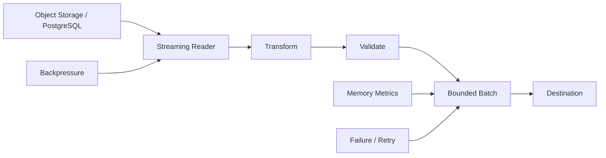
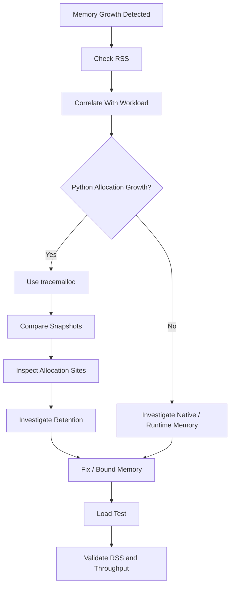

# 18- Memory Efficient Processing

## Overview

Memory-efficient processing is the practice of designing Python workloads so that useful work is performed with predictable and bounded memory consumption.

For backend systems, memory efficiency is not simply about making objects smaller. It is primarily about controlling:

- how much data is loaded at once;
- how many objects exist simultaneously;
- how many copies of the same data are created;
- how long objects remain reachable;
- how much buffering occurs between pipeline stages;
- how concurrency multiplies memory usage.

A common failure pattern is:

```text
Large input
    ↓
Read everything
    ↓
Create transformed copy
    ↓
Create serialized copy
    ↓
Queue everything
    ↓
Process everything
```

A memory-efficient design instead aims for:

```text
Large input
    ↓
Read bounded chunk
    ↓
Transform
    ↓
Process / persist
    ↓
Release
    ↓
Read next chunk
```

The objective is not to minimize memory at any cost. The objective is to achieve **predictable memory usage while maintaining acceptable latency, throughput, correctness, and operational reliability**.

---

## Why Memory Efficiency Matters

Memory consumption directly affects backend capacity.

Suppose a worker processes requests using:

```text
300 MiB baseline
+
200 MiB request workload
=
500 MiB
```

If concurrency increases to four simultaneous large workloads:

```text
300 MiB
+
4 × 200 MiB
=
1.1 GiB
```

A service that appears healthy at low traffic can therefore fail under concurrency.

Memory pressure can cause:

- garbage-collection overhead;
- allocation overhead;
- CPU contention;
- latency spikes;
- Kubernetes OOM termination;
- worker restarts;
- queue backlogs;
- reduced replica density;
- higher infrastructure cost.

Memory efficiency is therefore a scalability and reliability concern, not just an optimization detail.

---

## Memory Usage Model

A useful approximation is:

```text
Process Memory
    =
Baseline Runtime
+
Application Objects
+
Request State
+
Caches
+
Buffers
+
Concurrency
+
Native Memory
+
Allocator / Runtime Overhead
```

The exact memory model depends on the Python implementation, libraries, operating system, and deployment.

For backend capacity planning, think in terms of **peak live memory**, not just the size of the primary input.

---

## Peak Memory vs Dataset Size

Suppose an application processes:

```text
1,000,000 records
```

An eager implementation may require memory proportional to the complete dataset:

```text
O(n)
```

A streaming implementation may process one record or a bounded batch at a time:

```text
O(1)
```

or:

```text
O(batch_size)
```

The actual memory usage still includes:

- Python object overhead;
- input buffers;
- output buffers;
- database-driver buffering;
- network buffers;
- caches;
- concurrent tasks.

The important architectural property is **bounded simultaneous work**.

---

## Avoid Full Materialization

A common memory-heavy pattern is:

```python
records = load_all_records()

transformed = [
    transform(record)
    for record in records
]

save_all(transformed)
```

At one point, the process may simultaneously hold:

```text
records
+
transformed
+
temporary objects
```

Prefer incremental processing:

```python
for record in stream_records():
    transformed = transform(record)
    save(transformed)
```

This can substantially reduce peak memory.

---

## Generators

Generators are a fundamental Python mechanism for incremental processing.

```python
from collections.abc import Iterator


def transform_records(records) -> Iterator[dict]:
    for record in records:
        yield transform(record)
```

The generator does not create every transformed result at once.

Consumption controls execution:

```python
for record in transform_records(records):
    persist(record)
```

This is especially useful for:

- large files;
- database exports;
- Kafka consumers;
- ETL jobs;
- API streaming;
- large object-store datasets.

---

## Generator Expressions

For simple transformations:

```python
transformed = (
    transform(record)
    for record in records
)
```

This avoids immediate materialization.

However:

```python
transformed = list(
    transform(record)
    for record in records
)
```

immediately consumes the generator and recreates the memory pressure.

Lazy processing only provides its main memory benefit when downstream operations remain incremental.

---

## Streaming Files

Python file objects support incremental iteration.

```python
from pathlib import Path


def process_log(path: Path) -> None:
    with path.open(encoding="utf-8") as file:
        for line in file:
            process_line(line)
```

Avoid:

```python
lines = path.read_text(encoding="utf-8").splitlines()
```

for arbitrarily large files when the application only needs sequential processing.

The difference is:

```text
read_text()
    ↓
entire file in memory

file iteration
    ↓
bounded incremental reads
```

---

## Streaming Binary Files

The same principle applies to binary data.

```python
from pathlib import Path


CHUNK_SIZE = 1024 * 1024


def process_file(path: Path) -> None:
    with path.open("rb") as file:
        while chunk := file.read(CHUNK_SIZE):
            process_chunk(chunk)
```

The chunk size should be selected based on:

- workload;
- storage throughput;
- CPU processing cost;
- network behavior;
- available memory.

Larger chunks can improve throughput but increase peak memory.

---

## Chunk Size Trade-Off

| Chunk size | Potential benefit | Potential cost |
|---|---|---|
| Small | Low memory | More function/I/O overhead |
| Medium | Balanced | Requires tuning |
| Large | Higher throughput | Higher memory |
| Very large | Fewer operations | Memory spikes and slower retries |

There is no universally optimal chunk size.

Benchmark realistic workloads.

---

## CSV Processing

Avoid loading an entire CSV file when the file can become large.

Prefer:

```python
import csv
from pathlib import Path


def process_csv(path: Path) -> None:
    with path.open(newline="", encoding="utf-8") as file:
        reader = csv.DictReader(file)

        for row in reader:
            process_row(row)
```

This keeps processing incremental.

For very large datasets, consider whether CSV itself is the appropriate interchange format. Columnar formats such as Parquet can provide better storage and processing characteristics for analytical workloads.

---

## JSON and NDJSON

Standard JSON often represents one complete document:

```python
import json

with open("events.json", encoding="utf-8") as file:
    events = json.load(file)
```

This can require the complete structure in memory.

For record-oriented pipelines, NDJSON can support incremental processing:

```python
import json


def read_events(path: str):
    with open(path, encoding="utf-8") as file:
        for line in file:
            if line.strip():
                yield json.loads(line)
```

Usage:

```python
for event in read_events("events.ndjson"):
    process_event(event)
```

The data format should therefore be chosen with processing requirements in mind.

---

## Database Processing

Database result materialization is a common source of memory pressure.

Potentially expensive:

```python
rows = cursor.fetchall()

for row in rows:
    process(row)
```

A streaming or server-side cursor mechanism can instead provide incremental results:

```text
PostgreSQL
    ↓
bounded fetch
    ↓
Python
    ↓
process
    ↓
next fetch
```

The exact behavior depends on the PostgreSQL driver and cursor configuration.

Do not assume that a database cursor automatically means zero buffering.

---

## Selecting Only Required Columns

Memory efficiency starts at the data source.

Avoid:

```sql
SELECT *
FROM orders;
```

when the workload requires only:

```sql
SELECT id, customer_id, total
FROM orders;
```

Selecting fewer columns can reduce:

- database I/O;
- network traffic;
- Python object size;
- serialization cost;
- memory consumption.

The most memory-efficient object is often the object you never create.

---

## Database Pagination

For APIs and batch jobs, pagination can bound the number of records held at once.

Example:

```text
Page 1
100 records
    ↓
process
    ↓
release

Page 2
100 records
    ↓
process
    ↓
release
```

For large PostgreSQL tables, keyset pagination is often preferable to increasingly expensive large offsets.

Conceptually:

```sql
SELECT id, created_at, total
FROM orders
WHERE (created_at, id) < ($1, $2)
ORDER BY created_at DESC, id DESC
LIMIT 500;
```

The ordering columns should be appropriately indexed.

---

## Django QuerySets

Django QuerySets use deferred database evaluation, but application code can accidentally materialize them.

Avoid unnecessary:

```python
users = list(
    User.objects.filter(active=True)
)
```

for large result sets.

For incremental processing:

```python
for user in User.objects.filter(active=True).iterator():
    process_user(user)
```

`iterator()` is useful when you do not need Django's normal QuerySet result caching.

Be aware that related-object access can still cause additional queries, so memory optimization must not introduce N+1 database behavior.

---

## FastAPI and Large Responses

A FastAPI endpoint that constructs an entire response can create multiple in-memory representations:

```text
Database rows
    ↓
Python objects
    ↓
Pydantic models
    ↓
dict structures
    ↓
JSON encoding
    ↓
response bytes
```

For large result sets, consider:

- pagination;
- streaming;
- smaller response payloads;
- incremental serialization;
- database-side filtering.

Streaming should be used only when the client and infrastructure can consume the data incrementally.

---

## HTTP Request Bodies

Large incoming requests can also create memory pressure.

Potential lifecycle:

```text
Network
  ↓
HTTP server buffer
  ↓
request body
  ↓
JSON parser
  ↓
Python object graph
  ↓
validation
```

A large JSON payload can therefore require substantially more memory than its raw network size.

Production APIs should enforce:

- request body limits;
- reasonable nesting limits;
- field-size constraints;
- timeouts;
- authentication and authorization before expensive processing where possible.

---

## Multipart Uploads

Large file uploads should generally be handled using streaming or bounded temporary storage rather than loading the entire file into memory.

Conceptually:

```text
Client
  ↓
HTTP stream
  ↓
bounded buffer / temporary file
  ↓
object storage
```

For large AWS workloads, uploading directly or through controlled streaming to S3 can reduce application memory pressure.

---

## Object Storage

For large datasets, object storage can provide a better memory architecture than loading complete files into application memory.

Example:

```text
S3
 ↓
stream / ranged read
 ↓
bounded Python buffer
 ↓
transform
 ↓
S3 / PostgreSQL / Kafka
```

This separates durable storage from application memory.

---

## Avoid Duplicate Representations

A common memory amplification pattern is:

```python
rows = fetch_rows()

records = [dict(row) for row in rows]

payload = json.dumps(records)
```

At different points, the process may contain:

```text
database rows
+
dict objects
+
JSON string
```

Instead, design the pipeline to minimize simultaneous representations.

Possible approaches include:

- selecting fewer columns;
- streaming;
- transforming one record at a time;
- batching;
- direct serialization;
- eliminating unnecessary intermediate objects.

---

## Shallow vs Deep Copy

Copies can create substantial memory overhead.

Avoid unnecessary:

```python
from copy import deepcopy

payload_copy = deepcopy(payload)
```

For large structures, prefer targeted transformations where possible.

For example:

```python
updated = {
    **payload,
    "status": "processed",
}
```

This still creates a new outer dictionary, but avoids recursively duplicating every nested object.

The appropriate strategy depends on ownership and mutability requirements.

---

## Dataclasses and Slots

When applications create millions of small objects, per-instance overhead matters.

Slotted dataclasses can reduce instance overhead:

```python
from dataclasses import dataclass


@dataclass(slots=True)
class Event:
    event_id: int
    timestamp: int
    event_type: str
```

This can be useful for:

- large in-memory datasets;
- ETL transformations;
- high-volume object creation.

Do not use slots solely for theoretical optimization. Measure memory usage and verify framework compatibility.

---

## Dictionaries and Sets

Dictionaries and sets provide efficient lookup but can have substantial memory overhead.

For example:

```python
users_by_id = {
    user.id: user
    for user in users
}
```

can dramatically improve lookup complexity while increasing memory.

This is a classic time-space trade-off:

```text
List scan
    O(n) lookup
    lower auxiliary memory

Dictionary index
    O(1) average lookup
    higher memory
```

Use the structure that matches the workload.

---

## Avoid Redundant Indexes

Creating several in-memory indexes over the same dataset can amplify memory.

For example:

```text
users
users_by_id
users_by_email
users_by_region
users_by_status
```

may be useful, but every index retains references and consumes additional memory.

Before creating an index, verify:

- lookup frequency;
- latency requirement;
- dataset size;
- rebuild cost;
- memory budget.

---

## Bounded Caches

Unbounded application caches are a common source of memory growth.

Avoid:

```python
cache[key] = value
```

without a lifecycle policy.

Prefer bounded or expiring caches when appropriate:

```text
maximum size
+
TTL
+
eviction policy
```

For distributed applications, Redis may provide a more appropriate cache boundary than per-process Python memory.

---

## Cache Memory Budget

A cache should have an explicit capacity model.

Consider:

```text
Average cached value = 50 KB
Maximum entries = 10,000

Approximate payload memory:
50 KB × 10,000
≈ 500 MB
```

Actual memory will be higher because of object and cache-structure overhead.

This calculation should be part of capacity planning.

---

## Queues and Backpressure

An unbounded queue can turn a temporary downstream slowdown into an application-wide memory failure.

Bad architecture:

```text
Producer
   ↓
Unbounded queue
   ↓
Slow consumer
```

The queue grows indefinitely.

Prefer:

```text
Producer
   ↓
Bounded queue
   ↓
Consumer
```

When the queue is full, the system should apply a defined strategy:

- block;
- reject;
- slow producers;
- persist elsewhere;
- shed load.

This is backpressure.

---

## Kafka Consumer Memory

Kafka consumers should avoid accumulating arbitrary numbers of messages in Python memory.

Prefer bounded batches:

```python
BATCH_SIZE = 500

batch = []

for message in consumer:
    batch.append(message)

    if len(batch) >= BATCH_SIZE:
        process_batch(batch)
        batch.clear()
```

The actual consumer implementation must also account for:

- poll configuration;
- fetch sizes;
- partition count;
- offset commits;
- retries;
- processing time;
- rebalance behavior.

Memory management cannot be separated from Kafka delivery semantics.

---

## Celery Task Design

Avoid passing enormous datasets as Celery task arguments.

Instead of:

```text
Celery task
    ↓
10 GB dataset embedded in task payload
```

prefer:

```text
Object storage / database
    ↓
Task contains dataset identifier
    ↓
Worker streams bounded chunks
```

This reduces:

- broker memory;
- serialization overhead;
- task payload size;
- worker memory.

It also creates a cleaner retry boundary.

---

## Concurrency and Memory

Memory usage often scales with concurrency.

A rough model is:

```text
Total memory
≈
baseline
+
(concurrent operations × memory per operation)
```

If:

```text
baseline = 300 MiB
memory/request = 20 MiB
concurrency = 20
```

then:

```text
≈ 700 MiB
```

before additional runtime and native memory.

This is why increasing concurrency can cause memory failures even when each individual request is acceptable.

---

## Asyncio Tasks

Each active asyncio task retains execution state and references to objects needed by its coroutine.

Creating thousands of tasks that each retain large payloads can consume substantial memory:

```python
tasks = [
    asyncio.create_task(process(payload))
    for payload in payloads
]
```

A bounded concurrency model is often safer:

```text
input
  ↓
bounded queue
  ↓
N workers
  ↓
process
```

Do not create an unbounded number of concurrent tasks merely because the operations are asynchronous.

---

## Semaphore-Based Concurrency Limits

For asynchronous workloads:

```python
import asyncio


async def process_all(items, limit: int = 100) -> None:
    semaphore = asyncio.Semaphore(limit)

    async def process_one(item) -> None:
        async with semaphore:
            await process(item)

    await asyncio.gather(
        *(process_one(item) for item in items)
    )
```

This limits active processing but does not necessarily bound memory if all tasks are created eagerly.

For very large inputs, combine concurrency limits with incremental task production rather than creating millions of task objects.

---

## Worker Processes

Multiple Python worker processes multiply memory usage.

For example:

```text
1 worker = 300 MiB

4 workers ≈ 1.2 GiB
```

plus process-specific and native overhead.

This is especially important in:

- Gunicorn deployments;
- Kubernetes;
- Celery workers;
- multiprocessing workloads.

Worker count should be based on both CPU and memory capacity.

---

## Copy-on-Write

Process models that use fork can initially share memory pages through copy-on-write.

Conceptually:

```text
Parent process
    ↓ fork
Worker A ─┐
Worker B ─┼─ shared pages
Worker C ─┘
```

When a worker modifies a shared page:

```text
shared page
    ↓ write
private copy
```

Memory can therefore increase as workers mutate inherited structures.

Large preloaded application state can make fork-based deployments memory-efficient initially, but write-heavy behavior can reduce those savings.

---

## Garbage Collection

Python's garbage collection can reclaim objects that are no longer reachable, including cyclic garbage handled by the cyclic collector.

However:

```python
gc.collect()
```

is not a generic memory optimization technique.

It does not fix:

```text
global references
cache entries
queue contents
live tasks
long-lived closures
```

If objects remain reachable, they remain memory-resident.

---

## Object Lifetime

Memory efficiency depends heavily on object lifetime.

A useful question is:

> How long must this object remain reachable?

Prefer:

```text
request-local object
    ↓
process
    ↓
release
```

over:

```text
request
    ↓
global cache
    ↓
retained indefinitely
```

Shorter lifetimes generally reduce peak live memory.

---

## Exception References

Exceptions can temporarily retain references to objects involved in the failure path.

Long-lived storage of exception objects or tracebacks can therefore retain more memory than expected.

Avoid keeping exceptions or traceback-heavy structures in persistent application state unless there is a deliberate bounded retention strategy.

---

## Closures and Memory Retention

Closures can retain captured objects.

```python
def create_handler(large_payload):
    def handler():
        return large_payload

    return handler
```

As long as the handler remains reachable, `large_payload` can remain reachable.

Be cautious with:

- callback registries;
- event handlers;
- background tasks;
- caches;
- long-lived services.

---

## Weak References

Weak references can be useful when auxiliary structures should not control object lifetime.

For example:

```python
import weakref


class Resource:
    pass


resource = Resource()
registry = weakref.WeakSet([resource])
```

A weak reference does not keep the target alive.

This is useful for:

- observer registries;
- metadata associations;
- opportunistic caches.

Do not use weak references as a replacement for explicit cache sizing or ownership design.

---

## Streaming vs Batching

Pure streaming:

```text
read one
process one
write one
```

can minimize memory but may have higher per-item overhead.

Batching:

```text
read 500
process 500
write 500
```

often improves throughput while keeping memory bounded.

A practical production design frequently uses bounded batches.

---

## Batch Size Selection

Batch size should be evaluated against:

```text
memory
CPU
database throughput
network efficiency
transaction size
retry cost
latency
```

For example:

```text
50 records
    → low memory
    → many DB calls

500 records
    → balanced

5,000 records
    → fewer calls
    → higher memory
    → larger retry scope
```

Measure rather than selecting a large batch simply because it reduces round trips.

---

## Memory-Efficient ETL

A scalable ETL pipeline can be structured as:



The design keeps the amount of simultaneously live data bounded.

---

## Memory-Efficient API Architecture

For large API workloads:

```text
Client
  ↓
Nginx / Load Balancer
  ↓
FastAPI / Django
  ↓
Paginated query
  ↓
Bounded processing
  ↓
Streaming / paginated response
```

Avoid:

```text
Client
  ↓
API
  ↓
SELECT millions of rows
  ↓
load all objects
  ↓
serialize all objects
  ↓
return giant response
```

API contracts should explicitly limit result sizes.

---

## Memory-Efficient Export Job

A production export can use:

```text
PostgreSQL
    ↓
Keyset pagination
    ↓
500-row batch
    ↓
Transform
    ↓
CSV/Parquet writer
    ↓
S3
```

The worker does not need to hold the complete export in memory.

This design also provides natural retry and checkpoint boundaries.

---

## Memory and Serialization

Serialization can create temporary memory spikes.

For example:

```python
payload = build_large_payload()
encoded = json.dumps(payload)
```

At this point:

```text
Python object graph
+
serialized string
```

may coexist.

For large outputs, consider incremental serialization or streaming-compatible formats where supported.

The serialization format should be chosen based on:

- payload size;
- CPU cost;
- client compatibility;
- streaming requirements;
- schema evolution.

---

## Compression Trade-Off

Compression can reduce network and storage usage:

```text
larger object
    ↓
compress
    ↓
smaller payload
```

But compression requires CPU and may require temporary buffers.

For high-throughput services:

```text
memory
+
CPU
+
network
```

must be considered together.

---

## Memory-Mapped Files

For suitable workloads, memory mapping can provide access to large files without explicitly reading the entire file into Python-managed memory.

The operating system manages mapped pages.

This can be useful for:

- large local files;
- random-access workloads;
- specialized data processing.

It does not mean the workload consumes no memory. The OS page cache and process address space still matter.

---

## NumPy Considerations

For numerical workloads, Python object overhead can dominate memory.

A Python list:

```python
values = [1, 2, 3, 4]
```

stores references to Python objects.

NumPy arrays can store homogeneous values in compact contiguous memory:

```python
import numpy as np

values = np.array(
    [1, 2, 3, 4],
    dtype=np.int64,
)
```

For large numerical datasets, choosing an appropriate dtype and avoiding unnecessary copies can have a substantial memory impact.

---

## Pandas Considerations

Pandas DataFrames can consume substantial memory because of:

- object/string columns;
- duplicated data;
- temporary intermediate DataFrames;
- joins;
- copies;
- type choices.

For large processing jobs:

- select only required columns;
- use appropriate dtypes;
- process in chunks;
- avoid unnecessary copies;
- prefer Parquet for suitable analytical workloads.

Memory efficiency should be measured against actual datasets.

---

## Memory-Efficient Pandas Processing

For a large CSV:

```python
import pandas as pd


for chunk in pd.read_csv(
    "events.csv",
    chunksize=50_000,
):
    process_chunk(chunk)
```

This bounds the DataFrame size relative to the full file.

The optimal `chunksize` depends on:

- row width;
- transformations;
- available memory;
- CPU;
- downstream batch size.

---

## Detecting Memory Problems

Use multiple measurements.

### Process-Level Metrics

Monitor:

- RSS;
- container memory;
- memory limit utilization;
- OOM kills;
- worker restarts.

### Python-Level Diagnostics

Use:

- `tracemalloc`;
- object inspection;
- garbage-collection diagnostics.

### Workload Metrics

Track:

- concurrency;
- queue depth;
- batch size;
- record count;
- payload size.

A useful correlation is:

```text
memory
vs
concurrency
vs
input size
vs
worker age
```

---

## Using tracemalloc

A controlled investigation:

```python
import tracemalloc


tracemalloc.start()

before = tracemalloc.take_snapshot()

run_workload()

after = tracemalloc.take_snapshot()

for stat in after.compare_to(before, "lineno")[:20]:
    print(stat)
```

This helps identify Python allocation growth.

If RSS grows significantly while `tracemalloc` does not show corresponding growth, investigate native allocations and allocator behavior.

---

## Measuring Peak Memory

Use:

```python
import tracemalloc


tracemalloc.start()

run_workload()

current, peak = tracemalloc.get_traced_memory()

print(f"Current: {current / 1024**2:.1f} MiB")
print(f"Peak:    {peak / 1024**2:.1f} MiB")
```

This measures traced Python memory, not complete process RSS.

For production capacity planning, both measurements can be relevant.

---

## Avoid `sys.getsizeof()` Misinterpretation

`sys.getsizeof()` measures the size of an object itself according to the Python implementation.

For example:

```python
import sys

values = [1, 2, 3]

print(sys.getsizeof(values))
```

This does not recursively include the memory consumed by the referenced integer objects.

Therefore, do not use one `getsizeof()` call as a complete memory model for a nested object graph.

---

## Memory Profiling Workflow

A disciplined workflow:



This avoids assuming that every memory problem is a Python object leak.

---

## Memory Budgeting

Each service should have a realistic memory budget.

For example:

```text
Container limit          1,024 MiB
Runtime baseline           250 MiB
Expected request state     250 MiB
Cache budget               200 MiB
Concurrency headroom       150 MiB
Safety margin              174 MiB
```

The numbers are illustrative, but the principle is important:

```text
memory limit
-
expected peak usage
=
operational headroom
```

Do not size a container so close to its limit that normal workload variation causes OOM termination.

---

## Kubernetes Memory Limits

Example:

```yaml
resources:
  requests:
    memory: "512Mi"
  limits:
    memory: "1Gi"
```

The container can be terminated when it exceeds its memory limit.

Memory-efficient processing should therefore be evaluated under realistic Kubernetes limits rather than only on a developer workstation with abundant memory.

---

## Horizontal Scaling and Memory

Adding replicas can increase total capacity but also multiplies baseline memory.

For example:

```text
1 replica × 500 MiB = 500 MiB

8 replicas × 500 MiB = 4 GiB
```

If each replica also has a large local cache:

```text
8 × cache memory
```

can become significant.

Distributed caches such as Redis can sometimes reduce duplicated per-process state.

---

## High Availability

Memory headroom is part of high availability.

If all replicas normally operate at:

```text
95% memory utilization
```

losing one replica can cause remaining replicas to exceed their limits.

Prefer enough headroom to tolerate:

- traffic spikes;
- replica loss;
- rolling deployments;
- uneven workload distribution;
- temporary downstream slowdowns.

---

## Reliability and Backpressure

Memory-efficient systems should degrade predictably under overload.

Preferred behavior:

```text
Load increases
    ↓
Queue reaches bound
    ↓
Backpressure / rejection
    ↓
System remains healthy
```

Dangerous behavior:

```text
Load increases
    ↓
Unbounded queue
    ↓
Memory increases
    ↓
OOM
    ↓
Worker restart
    ↓
Backlog increases
```

Bounded resources are therefore a reliability mechanism.

---

## Disaster Recovery

Memory-efficient processing can improve recovery behavior for batch and queue workloads.

For example:

```text
bounded batch
    ↓
transaction
    ↓
checkpoint
    ↓
next batch
```

If a worker fails, the recovery scope is bounded.

Large monolithic jobs may have:

- larger retry costs;
- longer recovery times;
- more duplicate processing;
- larger memory requirements.

Partitioning workloads improves both memory predictability and operational recovery.

---

## Cost Considerations

Memory efficiency can directly reduce infrastructure cost.

For example:

```text
Before:
8 × 2 GiB workers

After:
8 × 1 GiB workers
```

may reduce node or container resource requirements if CPU and throughput remain sufficient.

However, memory reduction should not come at the expense of excessive CPU, network, or database usage.

Measure total resource cost:

```text
CPU
+
memory
+
database
+
network
+
storage
```

---

## Security Considerations

Memory efficiency also supports resource isolation.

Protect services against memory exhaustion through:

- request-size limits;
- pagination limits;
- bounded queues;
- concurrency limits;
- upload limits;
- timeouts;
- expensive-operation limits;
- controlled cache sizes.

Large attacker-controlled inputs can turn memory amplification into denial of service.

For example:

```text
1 MB request
    ↓
large parsed object graph
    ↓
multiple copies
    ↓
100 MB process allocation
```

Input size alone is therefore not a sufficient memory-risk metric.

---

## Production Best Practices

- Prefer streaming and bounded batching for large datasets.
- Select only the data required by the workload.
- Avoid unnecessary materialization.
- Avoid unnecessary copies and intermediate representations.
- Keep queues bounded.
- Keep caches bounded and define TTL/invalidation semantics.
- Limit concurrency based on memory as well as CPU.
- Avoid creating unbounded asyncio task sets.
- Keep database cursors and transactions within controlled lifetimes.
- Use pagination for externally exposed APIs.
- Use object storage for large intermediate datasets where appropriate.
- Pass dataset identifiers to background jobs instead of embedding huge payloads.
- Measure both peak memory and long-term retention.
- Correlate `tracemalloc` with RSS.
- Investigate native memory when RSS growth is not explained by Python allocations.
- Use `__slots__` and compact representations only when measurements justify them.
- Choose appropriate dtypes for numerical/data-processing workloads.
- Test memory behavior under realistic concurrency and input sizes.
- Maintain memory headroom in Kubernetes deployments.
- Treat backpressure as a memory-protection mechanism.
- Document memory budgets for high-volume services.

---

## Common Mistakes

### Loading the Entire Dataset

```python
records = list(source)
```

This defeats incremental processing.

### Materializing a Generator

```python
records = list(
    transform(record)
    for record in source
)
```

The generator is lazy, but the final result is not.

### Using Unbounded Queues

A slow consumer can cause unlimited memory growth.

### Creating Unlimited Async Tasks

Task objects and captured state consume memory even when the underlying operation is asynchronous.

### Keeping Large Global Caches

Global state survives across requests and can grow throughout worker lifetime.

### Copying Large Object Graphs

`deepcopy()` can create substantial allocation and CPU overhead.

### Fetching Unnecessary Columns

`SELECT *` can increase both database and application memory.

### Ignoring Database Driver Buffering

A streaming-looking database API may still buffer substantial data depending on configuration.

### Assuming Garbage Collection Solves Memory Growth

GC cannot reclaim reachable objects.

### Measuring Only Object Size

`sys.getsizeof()` does not recursively describe an entire object graph.

---

## Production Pitfalls

### Memory Amplification

A small input can become a much larger in-memory representation after parsing, validation, transformation, and serialization.

### Concurrency Multiplication

Per-request memory that looks safe individually can exceed limits when multiplied by concurrent requests.

### Cache Duplication

Every Kubernetes replica may maintain its own copy of a large process-local cache.

### Long-Lived Transactions

Streaming database processing can accidentally hold connections or transactions open for too long.

### Proxy Buffering

Streaming HTTP responses can still be buffered by Nginx, load balancers, clients, or other infrastructure.

### Native Memory

Python allocation tracing may not explain memory used by native extensions or libraries.

### Worker Lifetime

Memory growth that appears only after hours of processing may indicate retention or allocator behavior that short tests fail to expose.

### Overly Aggressive Memory Limits

A low Kubernetes memory limit can cause OOM kills even when application behavior is otherwise correct.

---

## Performance Optimization Strategy

Memory efficiency should be optimized in this order:

```text
Reduce data volume
      ↓
Reduce simultaneous data
      ↓
Reduce duplicate representations
      ↓
Bound concurrency and buffering
      ↓
Optimize object representation
      ↓
Optimize allocation behavior
```

Examples:

```text
SELECT required columns
        ↓
paginate results
        ↓
stream records
        ↓
batch processing
        ↓
avoid unnecessary copies
        ↓
use compact structures where justified
```

This usually provides more value than optimizing individual Python statements.

---

## Memory Efficiency Decision Framework

Use **streaming** when:

- data is large;
- sequential processing is sufficient;
- results do not need random access;
- early processing is valuable.

Use **pagination** when:

- exposing data through APIs;
- clients need bounded result sets;
- stable continuation semantics are required.

Use **batching** when:

- downstream operations support bulk processing;
- per-item overhead is high;
- memory must remain bounded.

Use **materialization** when:

- the dataset is known to be small;
- repeated access is required;
- random access is required;
- memory usage is explicitly acceptable.

Use **distributed storage** when:

- datasets exceed practical process memory;
- data must survive worker restarts;
- multiple workers need shared access.

---

## Memory-Efficient System Design Principles

A mature design treats memory as a bounded resource.

```text
                    ┌──────────────────┐
                    │ Input            │
                    └────────┬─────────┘
                             ↓
                    ┌──────────────────┐
                    │ Bounded Reader   │
                    └────────┬─────────┘
                             ↓
                    ┌──────────────────┐
                    │ Transform        │
                    └────────┬─────────┘
                             ↓
                    ┌──────────────────┐
                    │ Bounded Buffer   │
                    └────────┬─────────┘
                             ↓
                    ┌──────────────────┐
                    │ Batch Processor  │
                    └────────┬─────────┘
                             ↓
                    ┌──────────────────┐
                    │ Durable Output   │
                    └──────────────────┘
```

Each stage should have a defined capacity rather than allowing memory usage to grow without a bound.

---

## Production Checklist

- [ ] Peak memory usage has been measured.
- [ ] Process RSS has been measured separately from Python traced memory.
- [ ] Input size and concurrency are representative of production.
- [ ] Large datasets are not unnecessarily fully materialized.
- [ ] Streaming or pagination is used where appropriate.
- [ ] Batch sizes are bounded.
- [ ] Queues are bounded.
- [ ] Async concurrency is bounded.
- [ ] Database queries select only required columns.
- [ ] N+1 queries have been ruled out.
- [ ] Database cursor and transaction lifetimes are controlled.
- [ ] Large task payloads are stored externally when appropriate.
- [ ] Application caches have explicit size or TTL limits.
- [ ] Duplicate object representations have been reviewed.
- [ ] Deep copies have been justified.
- [ ] Large closures and global references have been reviewed.
- [ ] Memory growth has been tested across long-running workloads.
- [ ] `tracemalloc` has been used when Python allocation growth is suspected.
- [ ] Native-memory behavior has been considered.
- [ ] Kubernetes memory requests and limits provide sufficient headroom.
- [ ] OOM and worker-restart behavior has been tested.
- [ ] Backpressure behavior has been defined.
- [ ] Security limits exist for large or adversarial inputs.
- [ ] Memory optimizations have been validated under load.
- [ ] CPU, database, network, and memory trade-offs have been evaluated.

## Interview Traps

### "Memory Efficiency Means Using Less RAM at Any Cost"

No. The objective is predictable resource usage while maintaining acceptable throughput, latency, correctness, and reliability.

### "Generators Guarantee Constant Memory"

No. Generators avoid materializing their output, but referenced objects, queues, buffers, and downstream consumers can still consume substantial memory.

### "`list(generator)` Is Memory Efficient Because the Generator Is Lazy"

No. `list()` consumes and materializes the entire generator.

### "Garbage Collection Fixes Memory Leaks"

Only collectible objects can be reclaimed. Objects retained by live references cannot be collected.

### "A 10 MB Request Requires About 10 MB of Memory"

Not necessarily. Parsing, object graphs, validation, transformation, copying, serialization, and concurrency can amplify memory significantly.

### "More Concurrency Improves Performance Without Affecting Memory"

Concurrency generally increases simultaneous state and therefore can increase memory consumption.

### "Streaming Means No Buffering"

No. Database drivers, HTTP servers, proxies, operating-system buffers, and clients may all buffer data.

### "A Dictionary Always Saves Memory Because Lookup Is Faster"

A dictionary can reduce CPU time through faster lookup but generally consumes more memory than a simple list of references.

### "`sys.getsizeof()` Tells You How Much Memory an Object Uses"

It reports the object's own size and does not recursively account for all referenced objects.

### "More Kubernetes Replicas Reduce Memory Usage"

Each replica has its own process state, caches, and runtime overhead. Total memory consumption generally increases with replica count.

### "Asyncio Automatically Makes Memory Usage Efficient"

No. Thousands of asynchronous tasks can retain significant state. Async concurrency must still be bounded.

### "The Largest Allocation Is Always the Memory Leak"

A large allocation may be legitimate and temporary. Leak analysis requires examining growth and object retention.

## Key Takeaways

- **Bound simultaneous work:** streaming, pagination, and bounded batching are the primary tools for keeping memory predictable as data volume grows.
- **Minimize memory amplification:** avoid unnecessary materialization, copies, intermediate representations, oversized queries, and redundant indexes or caches.
- **Concurrency is a memory multiplier:** requests, asyncio tasks, worker processes, queues, and connection pools can multiply per-operation memory across the deployment.
- **Measure the right layer:** combine process RSS with `tracemalloc`, workload metrics, and object/reference analysis because Python tracing does not represent all process memory.
- **Design for controlled failure:** bounded queues, input limits, concurrency limits, memory headroom, checkpointed batches, and explicit resource lifetimes improve scalability, reliability, security, and recovery.