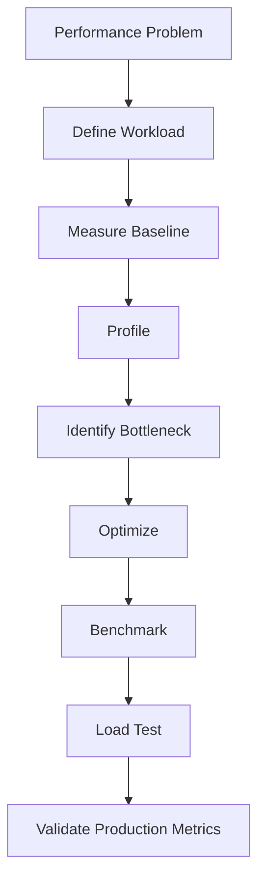
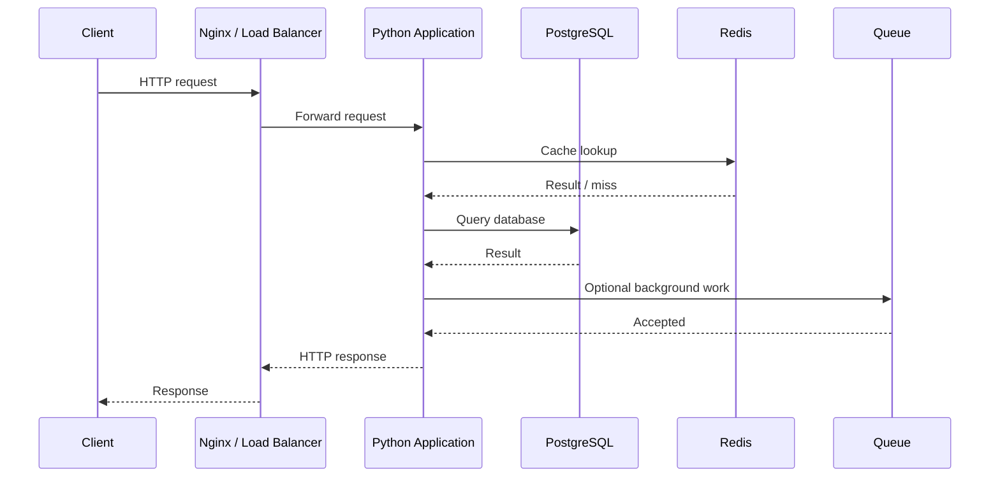
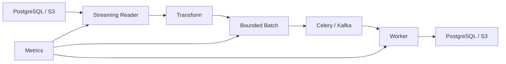

# README

## Overview

The **Memory and Performance** section focuses on understanding how Python applications use CPU time and memory, how to measure that behavior, and how to optimize workloads without sacrificing correctness or reliability.

The goal is to move beyond writing code that merely works toward designing Python systems with predictable:

- execution time;
- memory consumption;
- allocation behavior;
- concurrency characteristics;
- throughput;
- latency;
- resource utilization.

For backend engineering, performance is a system property. Python code interacts with databases, networks, operating systems, serializers, caches, queues, web servers, and container limits. Optimizing an isolated function without understanding those boundaries often produces little real-world benefit.

The section therefore progresses from Python's runtime and memory model through algorithmic complexity, profiling, benchmarking, lazy evaluation, and memory-efficient processing.

---

## Section Structure

```text
09- Memory and Performance/
│
├── 01- Memory Model.md
├── 02- Object References.md
├── 03- Identity Equality Hashing.md
├── 04- Mutable vs Immutable.md
├── 05- Shallow vs Deep Copy.md
├── 06- Reference Counting.md
├── 07- Garbage Collection.md
├── 08- Weak References.md
├── 09- Slots.md
├── 10- Time Complexity.md
├── 11- Space Complexity.md
├── 12- Profiling.md
├── 13- Timeit.md
├── 14- cProfile.md
├── 15- Tracemalloc.md
├── 16- Lazy Evaluation.md
├── 17- Performance Optimization.md
├── 18- Memory Efficient Processing.md
└── README.md
```

---

## Navigation

| # | File | Topic |
|---|---|---|
| 01 | [Python Memory Model](01-%20Python%20Memory%20Model.md) | Names, object references, allocation, namespaces, and CPython memory behavior |
| 02 | [Object References](02-%20Object%20References.md) | Aliasing, rebinding, identity, shared state, closures, and reference lifetime |
| 03 | [Identity, Equality, and Hashing](03-%20Identity%20Equality%20Hashing.md) | `is`, `==`, `__eq__`, `__hash__`, dicts, sets, and caching correctness |
| 04 | [Mutable vs Immutable](04-%20Mutable%20vs%20Immutable.md) | Mutability effects on aliasing, concurrency, hashing, and API design |
| 05 | [Shallow vs Deep Copy](05-%20Shallow%20vs%20Deep%20Copy.md) | Assignment, shallow copy, deep copy, and avoiding unnecessary duplication |
| 06 | [Reference Counting](06-%20Reference%20Counting.md) | CPython reference counting, cyclic references, and object lifetime |
| 07 | [Garbage Collection](07-%20Garbage%20Collection.md) | Cyclic GC, `gc` module, finalization, and managing object reachability |
| 08 | [Weak References](08-%20Weak%20References.md) | `weakref`, observer registries, identity maps, and opportunistic caches |
| 09 | [Slots](09-%20Slots.md) | `__slots__`, per-instance memory, inheritance, and dataclass compatibility |
| 10 | [Time Complexity](10-%20Time%20Complexity.md) | Big-O analysis, Python built-in complexity, and algorithmic cost modeling |
| 11 | [Space Complexity](11-%20Space%20Complexity.md) | Memory growth patterns, peak live memory, and streaming vs loading strategies |
| 12 | [Profiling](12-%20Profiling.md) | CPU, memory, and allocation profiling; production profiling workflow |
| 13 | [Timeit](13-%20Timeit.md) | Controlled microbenchmarks for isolated function comparison |
| 14 | [cProfile](14-%20cProfile.md) | Deterministic function-level CPU profiling with `ncalls`, `tottime`, `cumtime` |
| 15 | [Tracemalloc](15-%20Tracemalloc.md) | Python-level allocation tracing, snapshot comparison, and memory growth diagnosis |
| 16 | [Lazy Evaluation](16-%20Lazy%20Evaluation.md) | Generators, iterators, and deferred computation for memory-efficient processing |
| 17 | [Performance Optimization](17-%20Performance%20Optimization.md) | Profiling-driven optimization, algorithmic improvements, and systems-level thinking |
| 18 | [Memory Efficient Processing](18-%20Memory%20Efficient%20Processing.md) | Bounded-memory pipelines, chunking, streaming, and large-dataset patterns |

---

## What This Section Covers

### Memory Model

Understand how Python represents objects and manages references.

Key topics include:

- names and object references;
- object identity;
- object lifetime;
- namespaces;
- reference sharing;
- mutable and immutable objects;
- memory allocation;
- CPython implementation behavior;
- garbage collection;
- object retention.

These concepts explain why apparently small Python operations can have significant memory consequences.

---

### Object References

Python variables are bindings to objects rather than independent storage locations.

This section explains:

- aliasing;
- rebinding;
- identity;
- equality;
- function argument semantics;
- mutable shared state;
- closures;
- global references;
- reference lifetime.

Understanding references is essential before reasoning about copying, mutation, caching, and memory retention.

---

### Identity, Equality, and Hashing

Learn how Python determines whether objects are:

- the same object;
- equal in value;
- valid dictionary or set keys.

Important concepts include:

```text
is
==
__eq__
__hash__
dict
set
```

These mechanisms directly affect correctness and performance in caches, indexes, deduplication, and data structures.

---

### Mutability and Immutability

Understand how object mutability affects:

- aliasing;
- concurrency;
- hashing;
- caching;
- defensive copying;
- API design;
- shared application state.

Immutability is particularly valuable when designing data that crosses request, task, or concurrency boundaries.

---

### Copying

Understand the difference between:

```text
assignment
shallow copy
deep copy
serialization
```

The key production concern is avoiding unnecessary object duplication.

For large object graphs, copying can increase:

- CPU usage;
- allocation rate;
- peak memory;
- garbage-collection pressure;
- request latency.

---

### Reference Counting and Garbage Collection

Understand CPython's memory-management mechanisms without treating implementation details as universal Python language guarantees.

Important concepts include:

- reference counting;
- cyclic references;
- cyclic garbage collection;
- object reachability;
- object lifetime;
- `gc`;
- finalization;
- weak references.

The focus is on understanding real application behavior rather than manually managing memory like a systems language.

---

### Weak References

Weak references are useful when an auxiliary structure should not keep an object alive.

Relevant applications include:

- observer registries;
- identity maps;
- metadata associations;
- opportunistic caches.

The section also distinguishes weak references from normal caching and explicit lifecycle management.

---

### Slots

`__slots__` can reduce per-instance memory overhead by avoiding the normal instance dictionary.

Important considerations include:

- slot descriptors;
- inheritance;
- `__dict__`;
- `__weakref__`;
- dataclasses;
- serialization;
- introspection;
- framework compatibility.

Slots are an optimization technique, not a substitute for good data modeling.

---

## Complexity Analysis

### Time Complexity

Time complexity provides a model for how execution cost grows with input size.

Common classes include:

| Complexity | Typical example |
|---|---|
| `O(1)` | Dictionary lookup on average |
| `O(log n)` | Binary search |
| `O(n)` | List traversal |
| `O(n log n)` | Comparison-based sorting |
| `O(n²)` | Nested pairwise processing |
| `O(2ⁿ)` | Some brute-force recursive algorithms |
| `O(n!)` | Some permutation-based searches |

Complexity analysis helps identify architectural problems before micro-optimization begins.

For backend systems, complexity must also account for operations outside Python:

```text
Python algorithm
    +
database queries
    +
network calls
    +
serialization
    +
queue operations
```

A Python loop with `O(n)` complexity can still be dominated by `n` database queries.

---

### Space Complexity

Space complexity describes how memory requirements grow with input size.

Important patterns include:

```text
load everything      → O(n)
stream one item      → O(1) auxiliary space
process batches      → O(batch_size)
build indexes        → additional memory
copy data            → additional memory
```

The practical objective is often to control **peak live memory**, not merely asymptotic space complexity.

---

## Profiling

Profiling identifies where an application actually spends resources.

The section covers:

- CPU profiling;
- memory profiling;
- allocation profiling;
- call-level profiling;
- production profiling;
- database profiling;
- asynchronous workloads;
- distributed tracing;
- lock contention;
- I/O bottlenecks.

A typical investigation follows:



Profiling should precede speculative optimization.

---

## cProfile

`cProfile` provides deterministic function-level CPU profiling.

Useful metrics include:

- `ncalls`;
- `tottime`;
- `cumtime`;
- `percall`.

It is particularly useful for finding:

- expensive Python functions;
- excessive call counts;
- expensive serialization;
- inefficient transformations;
- unexpected application-level CPU work.

It is less useful for understanding distributed latency by itself because database and network behavior require additional instrumentation.

---

## Timeit

`timeit` is intended for controlled microbenchmarks.

Typical use cases include comparing:

```python
value in values
```

against an alternative implementation, or measuring a small isolated function.

It should not be used as the primary tool for:

- end-to-end API benchmarks;
- database performance;
- distributed-system performance;
- production load testing.

The correct hierarchy is generally:

```text
Complexity analysis
        ↓
Profiling
        ↓
Microbenchmark
        ↓
Load testing
        ↓
Production validation
```

---

## Tracemalloc

`tracemalloc` traces Python memory allocations.

It is useful for:

- comparing snapshots;
- identifying allocation-heavy code;
- investigating Python-level memory growth;
- locating allocation sites.

However, `tracemalloc` is not a complete process-memory profiler.

Production memory analysis should distinguish:

```text
Python allocations
+
native allocations
+
allocator behavior
+
RSS
+
OS/container memory
```

A growing RSS does not automatically mean that Python objects are leaking.

---

## Lazy Evaluation

Lazy evaluation delays computation until its result is consumed.

Python mechanisms include:

- generators;
- generator expressions;
- `map`;
- `filter`;
- lazy Django QuerySets;
- iterators;
- asynchronous generators.

A lazy pipeline can reduce peak memory:

```text
source
  ↓
transform
  ↓
filter
  ↓
batch
  ↓
persist
```

rather than:

```text
source
  ↓
materialize
  ↓
transform everything
  ↓
materialize again
  ↓
persist
```

Lazy evaluation is not automatically faster. Its primary benefit is often reduced memory usage and avoidance of unnecessary work.

---

## Memory-Efficient Processing

Large workloads should generally avoid unnecessary full materialization.

Prefer:

```text
stream
  ↓
transform
  ↓
batch
  ↓
persist
```

over:

```text
load everything
  ↓
copy everything
  ↓
transform everything
  ↓
persist everything
```

Important techniques include:

- streaming files;
- database cursors;
- pagination;
- keyset pagination;
- bounded batches;
- bounded queues;
- controlled concurrency;
- compact object representations;
- selective column retrieval;
- externalized large datasets.

This is particularly important for:

- ETL;
- data exports;
- Kafka consumers;
- Celery jobs;
- FastAPI endpoints;
- Django management commands;
- AWS object-storage workflows.

---

## Performance Optimization

Performance optimization combines the concepts from the entire section.

A practical optimization hierarchy is:

```text
1. Reduce unnecessary work
2. Improve algorithmic complexity
3. Optimize database access
4. Reduce network and serialization overhead
5. Bound memory and allocations
6. Improve concurrency
7. Optimize hot Python code
8. Apply micro-optimizations
```

This prevents spending significant engineering effort optimizing code that is not actually responsible for system latency.

---

## Backend Performance Model

A backend request can be viewed as:



Performance analysis must identify which stage dominates:

```text
request parsing
application CPU
database
cache
network
serialization
queueing
downstream services
```

Optimizing Python code is ineffective if PostgreSQL or a downstream API dominates the request.

---

## Memory and Performance Relationship

Memory and CPU are often coupled.

Examples:

```text
Deep copy
    ↓
more allocations
    ↓
more CPU
    ↓
more memory
```

or:

```text
large cache
    ↓
higher hit rate
    ↓
less database work
    ↓
more memory consumption
```

or:

```text
larger batch
    ↓
fewer database calls
    ↓
higher throughput
    ↓
higher peak memory
```

Optimization therefore requires explicit trade-off analysis.

---

## Concurrency and Resource Usage

Concurrency can improve throughput, especially for I/O-bound workloads, but it also increases simultaneous resource consumption.

A simplified model is:

```text
Total memory
≈
baseline memory
+
concurrency × per-operation memory
```

This applies to:

- FastAPI requests;
- Django workers;
- asyncio tasks;
- thread pools;
- Celery workers;
- multiprocessing;
- database connections.

Concurrency limits should therefore be derived from resource capacity, not chosen independently of memory and downstream limits.

---

## Database Performance

Database performance frequently dominates backend workloads.

Important topics include:

- indexes;
- query plans;
- `EXPLAIN ANALYZE`;
- N+1 queries;
- pagination;
- keyset pagination;
- connection pooling;
- batching;
- selecting required columns;
- transaction scope.

A common anti-pattern is:

```python
for user in users:
    user.orders.all()
```

which can produce an N+1 query pattern.

The correct optimization may be database-side eager loading rather than Python-level optimization.

---

## Caching

Caching trades memory and infrastructure cost for reduced computation or I/O.

Potential cache layers include:

```text
Browser
  ↓
CDN
  ↓
Nginx / proxy
  ↓
Redis
  ↓
Application
  ↓
PostgreSQL
```

Each cache requires explicit consideration of:

- TTL;
- invalidation;
- maximum size;
- consistency;
- eviction;
- memory budget;
- failure behavior.

Caching should not hide an inefficient underlying query indefinitely.

---

## Network and Serialization

Serialization can become a major source of latency and memory usage.

A large API response may require:

```text
database rows
    ↓
Python objects
    ↓
schema models
    ↓
serialized structure
    ↓
JSON bytes
    ↓
network buffers
```

Reducing payload size can improve:

- CPU;
- memory;
- network utilization;
- latency;
- cloud cost.

REST and gRPC should be evaluated according to actual workload requirements rather than treated as universally faster or slower.

---

## Memory-Aware Background Processing

Background workloads should use explicit resource bounds.

A robust architecture might look like:



The system should define limits for:

- batch size;
- worker concurrency;
- queue depth;
- retry count;
- task payload size;
- memory usage.

---

## Kubernetes Considerations

Containerized Python applications must be designed around resource limits.

Example:

```yaml
resources:
  requests:
    cpu: "500m"
    memory: "512Mi"
  limits:
    cpu: "1"
    memory: "1Gi"
```

Memory optimization should be evaluated against:

- container RSS;
- memory requests;
- memory limits;
- worker count;
- replica count;
- autoscaling;
- OOM events.

Increasing Gunicorn or Celery worker count can multiply process memory.

---

## High Availability

Performance optimization should not compromise availability.

Maintain sufficient resource headroom for:

- traffic spikes;
- rolling deployments;
- replica loss;
- retry storms;
- cache misses;
- downstream failures.

A service running permanently near its CPU or memory limit has little capacity to absorb failures.

---

## Monitoring

Production performance should be observable through metrics such as:

### Latency

- p50;
- p95;
- p99;
- p99.9 where appropriate.

### CPU

- process CPU;
- container CPU;
- CPU throttling.

### Memory

- RSS;
- heap/allocation indicators;
- container memory;
- OOM kills;
- worker restarts.

### Application

- request rate;
- error rate;
- queue depth;
- batch size;
- concurrency;
- cache hit rate.

### Database

- query latency;
- connection pool utilization;
- slow queries;
- lock contention.

Performance changes should be validated against these metrics rather than a single benchmark number.

---

## Cost Optimization

Performance and cost are closely related.

Potential improvements include:

- reducing unnecessary CPU work;
- reducing memory requirements;
- reducing database queries;
- reducing network traffic;
- reducing storage;
- improving cache effectiveness;
- increasing useful work per worker.

However, optimization should consider total system cost:

```text
CPU
+
Memory
+
Database
+
Network
+
Storage
+
Engineering complexity
```

A faster implementation that requires substantially more infrastructure may not be the better design.

---

## Testing Performance

Performance-sensitive systems should be tested under realistic conditions.

Test:

- representative input sizes;
- realistic data distributions;
- realistic concurrency;
- cold and warm caches;
- expected database sizes;
- production-like resource limits.

For memory-sensitive workloads, test long enough to expose:

- gradual retention;
- cache growth;
- queue buildup;
- worker memory growth;
- allocator behavior.

Short unit tests rarely reveal these problems.

---

## CI/CD Performance Regression Testing

Performance regressions can be introduced by seemingly harmless changes.

Examples:

```text
new database query
new serialization step
new copy
new intermediate list
larger cache
higher concurrency
```

For important hot paths, maintain targeted benchmarks and compare them over time.

Microbenchmarks should be treated as signals rather than absolute production guarantees because CI environments have variable hardware and scheduling behavior.

---

## Common Optimization Mistakes

### Optimizing Before Measuring

Why it fails:

- the wrong component is optimized;
- complexity remains unchanged;
- real bottlenecks are elsewhere.

Prefer profiling and measurement first.

### Micro-Optimizing Python While Ignoring PostgreSQL

A 30% improvement in Python CPU may have negligible effect if the request spends most of its time waiting for the database.

### Loading Everything Into Memory

This often works during development and fails when production data grows.

Prefer streaming, pagination, or bounded batches.

### Using Unbounded Concurrency

More concurrent tasks can increase:

- memory;
- database connections;
- downstream load;
- queue pressure.

### Using Unbounded Caches

A cache without an explicit lifecycle can become a memory leak from an operational perspective.

### Treating `gc.collect()` as a Performance Fix

Forced garbage collection can itself introduce latency and does not reclaim reachable objects.

### Benchmarking Unrealistic Inputs

A benchmark using 100 records says little about behavior with 10 million records.

### Optimizing Without Preserving Semantics

Performance changes must preserve:

- correctness;
- transactional behavior;
- ordering;
- retry semantics;
- consistency;
- security guarantees.

---

## Interview Traps

| Question | Correct engineering perspective |
|---|---|
| Are generators always faster? | No. They primarily defer work and reduce materialization. |
| Does lower memory always mean better performance? | No. Less memory can increase CPU or I/O. |
| Is dictionary lookup always `O(1)`? | Average-case lookup is `O(1)` under normal assumptions; pathological behavior and resizing still matter. |
| Does `gc.collect()` solve memory leaks? | No. Reachable objects cannot be collected. |
| Is `tracemalloc` the same as RSS? | No. It traces Python allocations, not all process memory. |
| Does async automatically reduce memory? | No. Excessive task concurrency can increase memory substantially. |
| Does caching always improve performance? | No. Cache overhead, invalidation, misses, serialization, and memory cost matter. |
| Is `timeit` suitable for API load testing? | No. Use load testing and production-style observability. |
| Does `__slots__` make objects immutable? | No. It primarily changes instance attribute storage. |
| Does optimizing Big O guarantee faster production code? | No. Constants, I/O, data sizes, runtime behavior, and architecture still matter. |

---

## Recommended Engineering Workflow

Use the following workflow for performance or memory problems:

1. **Define the problem**
   - What metric is failing?
   - Latency, throughput, CPU, memory, or cost?

2. **Define the workload**
   - Input size?
   - Concurrency?
   - Data distribution?
   - Cache state?

3. **Measure a baseline**
   - p50/p95/p99;
   - CPU;
   - RSS;
   - allocations;
   - database latency.

4. **Analyze complexity**
   - Look for algorithmic growth.
   - Look for N+1 and repeated work.

5. **Profile**
   - CPU with `cProfile` or sampling profilers.
   - Python memory with `tracemalloc`.
   - Database with query plans.
   - Distributed latency with tracing.

6. **Optimize the largest bottleneck**
   - Reduce work before optimizing syntax.

7. **Benchmark isolated changes**
   - Use `timeit` for small CPU-level comparisons.

8. **Load test**
   - Validate concurrency, memory, latency, and throughput together.

9. **Validate production behavior**
   - Confirm that the optimization improves real service metrics.

10. **Document the trade-off**
    - Record why the optimization exists and what assumptions it depends on.

---

## Tool Selection

| Problem | Primary tool | Purpose |
|---|---|---|
| Algorithm growth | Complexity analysis | Understand scaling |
| CPU hotspot | `cProfile` | Function-level CPU analysis |
| Isolated Python operation | `timeit` | Microbenchmark |
| Python allocation growth | `tracemalloc` | Allocation investigation |
| Process memory | OS/container metrics | RSS and total process memory |
| Database bottleneck | `EXPLAIN ANALYZE` | Query execution analysis |
| Distributed latency | Tracing | Cross-service request analysis |
| Concurrency behavior | Load testing | Validate throughput and contention |
| Memory retention | `tracemalloc` + object inspection | Investigate growth |
| Production capacity | Metrics + load tests | Capacity planning |

No single tool provides a complete performance model.

---

## Senior-Level Mental Model

A senior engineer should reason about performance across layers:

```text
Algorithm
    ↓
Python runtime
    ↓
Object allocation
    ↓
Memory / CPU
    ↓
Concurrency
    ↓
Database / Cache
    ↓
Network
    ↓
Service dependencies
    ↓
Container / Kubernetes
    ↓
Cloud infrastructure
    ↓
Cost and reliability
```

An optimization is valuable when it improves the relevant system-level objective without creating a worse bottleneck elsewhere.

---

## Practical Design Principles

- **Measure before optimizing.**
- **Reduce work before optimizing individual operations.**
- **Use complexity analysis to identify scaling problems.**
- **Keep large datasets out of process memory when possible.**
- **Prefer streaming and bounded batching for large workloads.**
- **Treat concurrency as both a performance and memory decision.**
- **Avoid unnecessary copies and intermediate representations.**
- **Optimize database access before optimizing Python syntax when the database dominates latency.**
- **Use caches deliberately with explicit memory and invalidation policies.**
- **Validate optimizations with realistic workloads.**
- **Track p95/p99 latency rather than relying only on averages.**
- **Monitor RSS separately from Python allocation metrics.**
- **Maintain CPU and memory headroom for failures and traffic spikes.**
- **Consider total infrastructure cost when evaluating optimizations.**
- **Prefer simple optimizations that remain understandable and maintainable.**

## Key Takeaways

- **Performance is a system property:** Python execution, algorithms, databases, networks, serialization, concurrency, and infrastructure must be analyzed together.
- **Measure before optimizing:** use complexity analysis, profiling, `timeit`, `tracemalloc`, database plans, load tests, and production metrics for their appropriate purposes.
- **Control memory explicitly:** avoid unnecessary materialization and copies, use streaming and bounded batches, and limit concurrency, queues, and caches.
- **Optimize the dominant bottleneck:** reducing database calls, algorithmic complexity, payload size, or redundant work usually matters more than Python-level micro-optimizations.
- **Optimize for production behavior:** validate latency, throughput, memory, reliability, scalability, and cost under realistic workloads and resource limits.