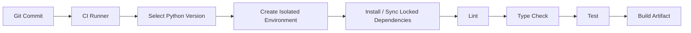
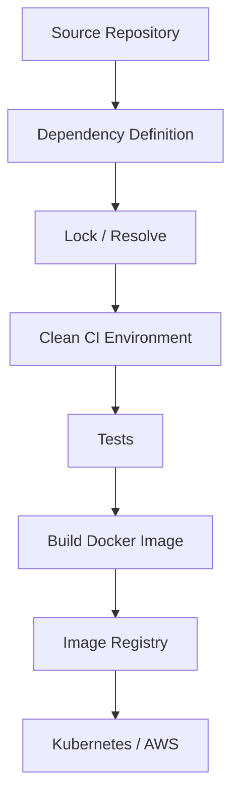

# 02- Virtual Environments

## Overview

A Python virtual environment isolates a project's Python interpreter and installed packages from the system Python installation and from other projects.

The primary problem it solves is dependency isolation:

```text
System Python
├── Project A → Django 5.x
├── Project B → Django 4.x
└── Project C → FastAPI + different dependencies
```

Without isolation, installing or upgrading one project's dependencies can affect another project.

A virtual environment changes the dependency boundary:

```text
Project A
└── .venv/
    ├── Python environment
    └── Project A dependencies

Project B
└── .venv/
    ├── Python environment
    └── Project B dependencies
```

Virtual environments are an important part of reproducible Python development, but they are **not dependency lockfiles, containers, or complete deployment environments**. They isolate Python packages; reproducibility also requires controlled dependency versions, configuration, operating-system dependencies, and deployment artifacts.

---

## Why Virtual Environments Exist

Python packages are installed into an environment associated with a Python interpreter.

Without isolation:

```text
/usr/bin/python
    ↓
global site-packages
    ├── Django
    ├── FastAPI
    ├── NumPy
    └── internal packages
```

Multiple projects can then compete for incompatible versions.

For example:

```text
Project A requires:
Django >= 4.2,<5

Project B requires:
Django >= 5.0
```

A single global environment cannot safely satisfy both requirements.

Virtual environments create separate package-installation locations:

```text
Project A/.venv/
    └── Django 4.x

Project B/.venv/
    └── Django 5.x
```

---

## What a Virtual Environment Is

A virtual environment is an isolated Python environment created from a base Python installation.

The standard-library `venv` module creates one:

```bash
python -m venv .venv
```

The resulting environment contains environment-specific executable and package locations.

A typical structure resembles:

```text
.venv/
├── bin/                 # Linux/macOS
│   ├── python
│   └── pip
├── include/
├── lib/
│   └── python3.x/
│       └── site-packages/
└── pyvenv.cfg
```

On Windows, the executable directory is typically:

```text
.venv/
└── Scripts/
    ├── python.exe
    └── pip.exe
```

Exact implementation details vary by platform and Python version.

---

## What a Virtual Environment Does Not Isolate

A virtual environment primarily isolates Python package installation and environment metadata.

It does **not** provide complete system isolation.

It does not isolate:

- the operating system;
- system libraries;
- kernel resources;
- network interfaces;
- filesystem permissions;
- environment variables;
- Docker/container boundaries;
- PostgreSQL;
- Redis;
- Kafka;
- external services.

For example:

```text
Virtual environment
        │
        ├── Python packages
        ├── Python executable/environment metadata
        │
        └── still uses
             ├── OS
             ├── kernel
             ├── filesystem
             └── network
```

Use containers or virtual machines when stronger isolation is required.

---

## Creating a Virtual Environment

Create an environment from the current Python interpreter:

```bash
python -m venv .venv
```

On systems where `python` does not refer to the desired interpreter:

```bash
python3 -m venv .venv
```

Windows commonly uses:

```powershell
py -m venv .venv
```

The selected interpreter matters because the environment is created from it.

Verify:

```bash
python --version
```

and:

```bash
python -c "import sys; print(sys.executable)"
```

---

## Activating a Virtual Environment

### Linux and macOS

```bash
source .venv/bin/activate
```

### Windows PowerShell

```powershell
.venv\Scripts\Activate.ps1
```

### Windows Command Prompt

```cmd
.venv\Scripts\activate.bat
```

After activation, shell commands such as:

```bash
python
pip
```

resolve to the virtual environment's executables.

---

## Activation Is a Convenience

Activation does not create the isolation itself.

The important distinction is:

```text
Activation
    ↓
changes shell PATH
```

while:

```text
Virtual environment
    ↓
provides an environment-specific interpreter/package location
```

You can invoke the environment directly without activation:

```bash
.venv/bin/python -m pip install fastapi
```

On Windows:

```powershell
.venv\Scripts\python.exe -m pip install fastapi
```

This is useful in:

- CI/CD;
- shell scripts;
- automation;
- IDE configuration;
- production startup commands.

---

## Deactivating

When activation is used:

```bash
deactivate
```

This restores the shell's previous executable resolution.

Deactivation does not delete the environment.

---

## Verifying the Active Environment

Do not rely only on the shell prompt.

Use:

```bash
python -c "import sys; print(sys.executable)"
```

Also inspect:

```bash
python -m pip --version
```

This helps detect situations where:

```text
python → .venv/bin/python
pip    → /usr/bin/pip
```

which can result in packages being installed into a different environment than the application uses.

---

## Prefer `python -m pip`

Prefer:

```bash
python -m pip install fastapi
```

over:

```bash
pip install fastapi
```

The first form explicitly associates `pip` with the selected Python interpreter.

This reduces ambiguity when multiple Python installations exist.

A useful diagnostic pair is:

```bash
python -c "import sys; print(sys.executable)"
python -m pip --version
```

---

## Installing Dependencies

Example:

```bash
python -m pip install fastapi uvicorn
```

Verify:

```bash
python -m pip show fastapi
```

List installed packages:

```bash
python -m pip list
```

Export the environment:

```bash
python -m pip freeze
```

`pip freeze` reports installed distributions. It is not by itself a dependency-management strategy.

---

## Dependency Specification vs Environment Snapshot

These concepts should be distinguished.

| Mechanism | Purpose |
|---|---|
| `pyproject.toml` | Declares project metadata and dependencies |
| Lock file | Pins a reproducible dependency graph |
| `pip freeze` | Reports installed distributions |
| `.venv` | Isolates an environment |
| Docker image | Packages application and runtime environment |
| OS package manager | Manages system dependencies |

A mature project usually needs several of these mechanisms rather than treating `.venv` as the complete environment definition.

---

## `pyproject.toml`

Modern Python projects should generally declare dependencies in `pyproject.toml`.

Example:

```toml
[project]
name = "order-service"
version = "0.1.0"
requires-python = ">=3.12"
dependencies = [
    "fastapi>=0.100,<1",
    "uvicorn>=0.30,<1",
]
```

This defines what the project requires rather than recording every package currently installed in one developer's environment.

---

## Locking Dependencies

A dependency specification such as:

```text
fastapi>=0.100,<1
```

does not uniquely define the complete dependency graph.

A production system often needs a lock mechanism so that:

```text
application
    ↓
direct dependencies
    ↓
transitive dependencies
    ↓
exact versions
```

are reproducible.

Tools such as `uv`, Poetry, PDM, and other dependency-management workflows can maintain lock information.

The important principle is:

> Reproducible builds require a reproducible dependency graph, not merely a virtual environment.

---

## Virtual Environment Lifecycle

Virtual environments are disposable.

A common workflow is:

```text
Clone repository
      ↓
Create .venv
      ↓
Install/sync dependencies
      ↓
Develop
      ↓
Run tests
      ↓
Delete/recreate when necessary
```

If an environment becomes corrupted:

```bash
rm -rf .venv
python -m venv .venv
```

then reinstall dependencies using the project's dependency-management workflow.

On Windows:

```powershell
Remove-Item -Recurse -Force .venv
py -m venv .venv
```

Recreating an environment is often safer than manually repairing package conflicts.

---

## Why `.venv` Should Not Be Committed

A virtual environment contains:

- platform-specific binaries;
- installed packages;
- interpreter references;
- generated files;
- potentially large artifacts.

It is not a portable source artifact.

Add it to `.gitignore`:

```gitignore
.venv/
```

Commit the dependency definition and lock information instead.

---

## Recommended Repository Layout

```text
my-service/
├── .venv/                 # local, ignored
├── src/
│   └── my_service/
├── tests/
├── pyproject.toml
├── uv.lock                # if using uv
├── .gitignore
├── .env.example
└── README.md
```

The repository defines the environment declaratively; `.venv` is a local realization of that definition.

---

## Multiple Python Versions

A project can require a specific Python version:

```toml
[project]
requires-python = ">=3.12,<3.14"
```

Creating a virtual environment with the wrong interpreter does not automatically switch Python versions.

Verify:

```bash
python --version
```

If multiple interpreters exist, select the intended one explicitly.

For example:

```bash
python3.12 -m venv .venv
```

The environment's interpreter version is therefore part of the project's compatibility requirements.

---

## Python Version Managers

For projects requiring multiple Python versions, developers may use tools such as:

- `pyenv`;
- `uv`;
- OS-specific Python launchers;
- managed development environments.

The conceptual workflow is:

```text
Python version manager
        ↓
select Python 3.12
        ↓
create .venv
        ↓
install project dependencies
```

The virtual environment and Python-version management solve different problems.

---

## Virtual Environment vs Python Version Manager

| Concern | Virtual environment | Version manager |
|---|---|---|
| Isolate packages | Yes | No |
| Select Python versions | Limited to environment creation | Yes |
| Manage multiple interpreters | No | Yes |
| Reproduce dependencies | Not alone | Not alone |
| Replace Docker | No | No |

They are complementary.

---

## Virtual Environment vs Container

A virtual environment:

```text
Application
    ↓
Python environment
    ↓
Host OS
```

A container:

```text
Application
    ↓
Python environment
    ↓
Container filesystem/process boundary
    ↓
Host kernel
```

A Docker image can contain its own Python environment, although many production images can instead install dependencies directly into the image's Python environment without creating a traditional `.venv`.

Do not create a virtual environment inside Docker automatically without a reason.

---

## Local Development vs Production

A common local-development workflow is:

```text
Git repository
    ↓
.venv
    ↓
Python application
```

A production workflow is often:

```text
Git commit
    ↓
CI
    ↓
locked dependencies
    ↓
Docker build
    ↓
container image
    ↓
Kubernetes / ECS / VM
```

The production artifact is normally the built image rather than a developer's `.venv`.

---

## Docker and Virtual Environments

A simple production Dockerfile can install dependencies directly:

```dockerfile
FROM python:3.12-slim

WORKDIR /app

COPY pyproject.toml .
COPY src ./src

RUN pip install --no-cache-dir .

CMD ["uvicorn", "my_service.main:app", "--host", "0.0.0.0", "--port", "8000"]
```

Here, the container itself provides the deployment boundary.

A `.venv` from a developer workstation should not be copied into the image.

---

## When a Virtual Environment Inside Docker Is Useful

A container-local virtual environment can be useful when:

- the build workflow explicitly requires it;
- multiple Python installations exist in the image;
- dependency isolation within the image is valuable;
- organizational tooling standardizes on it.

For example:

```text
Docker image
├── system Python
└── /opt/venv/
    └── application dependencies
```

This is valid, but it adds another environment layer.

Use it deliberately rather than treating it as mandatory.

---

## CI/CD

CI systems should create a clean environment for each build.

Conceptually:



The exact implementation may use:

- a virtual environment;
- a container;
- a CI-managed Python environment.

The important property is isolation and reproducibility.

---

## CI Example

A simple GitHub Actions workflow can use the Python environment provided by the runner:

```yaml
name: Test

on:
  push:
  pull_request:

jobs:
  test:
    runs-on: ubuntu-latest

    steps:
      - uses: actions/checkout@v4

      - uses: actions/setup-python@v5
        with:
          python-version: "3.12"

      - name: Install dependencies
        run: python -m pip install -e ".[dev]"

      - name: Run tests
        run: python -m pytest
```

A project using a lockfile-aware tool should use that tool's synchronization command instead.

---

## IDE Integration

IDEs should use the project's virtual environment.

For example:

```text
project/
└── .venv/
    └── Python interpreter
```

Configure the IDE to use:

```text
.venv/bin/python
```

or on Windows:

```text
.venv\Scripts\python.exe
```

This ensures:

- imports resolve correctly;
- type checkers see installed packages;
- tests run against the expected interpreter;
- debugging uses the correct environment.

---

## Shell Prompt

Activated environments often modify the shell prompt:

```text
(.venv) user@host:~/order-service$
```

This is useful but should not be treated as authoritative.

Always verify the interpreter when debugging environment problems.

---

## Environment Variables

Virtual environments do not isolate environment variables.

For example:

```bash
export DATABASE_URL=...
```

remains a process/shell environment concern.

Application configuration should be managed separately from Python package isolation.

A useful distinction is:

```text
.venv
    → Python runtime/package environment

.env / secret manager
    → application configuration/secrets

Docker/Kubernetes
    → deployment/runtime isolation
```

---

## Native Dependencies

Some Python packages depend on native libraries.

Examples include packages involving:

- PostgreSQL clients;
- cryptography;
- image processing;
- scientific computing;
- compression.

A virtual environment can isolate Python packages but cannot necessarily provide the required OS-level library.

For example:

```text
Python package
    ↓
native extension
    ↓
system library
```

Deployment documentation must therefore account for both Python and operating-system dependencies.

---

## Reproducibility

A reproducible Python environment requires controlling several dimensions:

```text
Python version
+
direct dependencies
+
transitive dependencies
+
OS/native dependencies
+
configuration
+
build process
```

A virtual environment addresses only part of this.

For production, reproducibility should be tested through clean builds rather than assumed from a developer environment.

---

## Dependency Drift

Dependency drift occurs when environments gradually diverge.

Example:

```text
Developer A
    FastAPI 0.x
    Pydantic 2.x

Developer B
    FastAPI newer version
    Pydantic newer version

CI
    Different dependency graph
```

This produces:

- inconsistent tests;
- "works on my machine" failures;
- deployment surprises.

Use declarative dependency definitions and lock/synchronization workflows to reduce drift.

---

## Upgrading Dependencies

Do not treat a virtual environment upgrade as the dependency-management strategy.

A controlled workflow is:

```text
Change dependency specification
        ↓
Resolve dependency graph
        ↓
Update lock information
        ↓
Create clean environment
        ↓
Run tests
        ↓
Build artifact
        ↓
Deploy
```

This makes upgrades reviewable and reproducible.

---

## Recreating After Dependency Changes

If dependencies become inconsistent, recreate the environment rather than repeatedly installing and uninstalling packages.

Example:

```bash
rm -rf .venv
python -m venv .venv
python -m pip install -e ".[dev]"
```

With a lock-aware dependency manager, use its synchronization command.

A clean environment is an important diagnostic tool.

---

## Editable Installs

During library or application development, an editable installation can be useful:

```bash
python -m pip install -e .
```

The package is installed in a way that points to the working source tree, allowing source changes to be reflected without reinstalling the package after every edit.

This is useful for:

- reusable libraries;
- monorepos;
- local application development.

Do not confuse editable installation with production packaging.

---

## `pip install -e ".[dev]"`

A project can define development dependencies:

```toml
[project.optional-dependencies]
dev = [
    "pytest",
    "ruff",
    "mypy",
]
```

Then:

```bash
python -m pip install -e ".[dev]"
```

installs the project in editable mode with development dependencies.

This creates a clear distinction between:

```text
runtime dependencies
development dependencies
```

---

## Inspecting the Environment

Useful commands include:

```bash
python --version
python -c "import sys; print(sys.executable)"
python -m pip --version
python -m pip list
python -m pip show fastapi
python -m pip check
```

`pip check` verifies whether installed packages have compatible declared dependencies.

It does not prove that the application is functionally correct.

---

## Detecting Dependency Conflicts

Example:

```bash
python -m pip check
```

Potential output:

```text
package-a requires package-b<3, but you have package-b 3.x
```

This indicates an installed dependency conflict.

The correct fix is usually to resolve the dependency graph rather than randomly installing another version.

---

## Import Diagnostics

When an import behaves unexpectedly:

```bash
python -c "import fastapi; print(fastapi.__file__)"
```

and:

```bash
python -c "import sys; print('\n'.join(sys.path))"
```

can reveal:

- which package is being imported;
- which paths Python searches;
- whether the expected environment is active.

This is often more useful than reinstalling packages blindly.

---

## `sys.prefix` and Environment Detection

Python exposes environment information through `sys`.

For example:

```bash
python -c "import sys; print(sys.prefix); print(sys.base_prefix)"
```

A typical virtual environment has different values for:

```text
sys.prefix
sys.base_prefix
```

This can help diagnose interpreter/environment selection.

---

## Security Considerations

Virtual environments provide dependency isolation, not a security sandbox.

A malicious package installed into `.venv` can still execute with the user's permissions.

Use:

- trusted package sources;
- dependency review;
- lockfiles;
- dependency scanning;
- artifact integrity controls;
- minimal production dependencies;
- non-root containers where practical.

Do not assume `.venv` prevents malicious Python code from accessing the host.

---

## Supply Chain Security

Python dependency management is a software supply-chain concern.

Production systems should consider:

```text
package source
    ↓
dependency resolution
    ↓
lock information
    ↓
CI validation
    ↓
artifact build
    ↓
deployment
```

Useful controls include:

- dependency vulnerability scanning;
- pinned or locked versions;
- trusted package indexes;
- controlled build environments;
- artifact scanning;
- reproducible builds where practical.

---

## Performance Considerations

Virtual environments have minimal impact on normal Python application performance.

They primarily affect:

- package discovery;
- executable selection;
- installation location.

Performance bottlenecks should generally be investigated in:

- application code;
- algorithms;
- database queries;
- network calls;
- serialization;
- concurrency;
- memory behavior.

Do not expect moving from one virtual environment to another to materially optimize a backend application.

---

## Disk Usage

Virtual environments can consume significant disk space because multiple projects may install overlapping dependencies.

For example:

```text
Project A/.venv → Django, FastAPI, NumPy
Project B/.venv → Django, FastAPI, Pandas
Project C/.venv → Django, Celery
```

The environments are intentionally independent.

This is generally an acceptable trade-off for isolation.

Modern package managers may provide caching mechanisms that reduce repeated download/build work without sharing installed environments.

---

## Cache vs Environment

Package download caches and virtual environments serve different purposes.

```text
Package cache
    → avoids downloading/building the same artifact repeatedly

Virtual environment
    → provides project-specific installed packages
```

Sharing installed site-packages between unrelated projects weakens isolation.

---

## Environment Variables and `.venv`

Do not store secrets inside a virtual environment merely because it is local.

Keep secrets outside source control and use appropriate configuration mechanisms.

For local development:

```text
.env
```

may be used with suitable tooling.

For production:

```text
AWS Secrets Manager
Kubernetes Secrets
environment-specific secret manager
```

should be considered.

---

## Multi-Project Development

When working on multiple Python repositories:

```text
~/projects/
├── service-a/
│   └── .venv/
├── service-b/
│   └── .venv/
└── data-tool/
    └── .venv/
```

Each project owns its dependency environment.

This prevents one project's package upgrade from silently changing another project's runtime.

---

## Monorepos

A monorepo may contain multiple Python packages:

```text
repository/
├── services/
│   ├── orders/
│   └── payments/
├── libraries/
│   └── common/
└── pyproject.toml
```

The environment strategy should be explicit.

Possible approaches include:

- one environment for the repository;
- one environment per application;
- tool-managed workspaces;
- containerized development environments.

Choose based on dependency boundaries and CI/build requirements.

---

## Virtual Environments and Microservices

Microservices often have independent dependency requirements:

```text
orders-service
    └── FastAPI  + SQLAlchemy version A

payments-service
    └── FastAPI  + different dependencies

notification-service
    └── Celery + messaging dependencies
```

Each service should have independently reproducible dependencies.

A service should not rely on another service's Python environment.

---

## Production Deployment Model

A mature deployment pipeline generally looks like:



The virtual environment is primarily a development and CI implementation detail.

The deployable artifact should be reproducible independently of a developer's machine.

---

## Recommended Development Workflow

```bash
git clone <repository>
cd <repository>

python -m venv .venv
source .venv/bin/activate

python -m pip install --upgrade pip
python -m pip install -e ".[dev]"

python -m pytest
```

On Windows PowerShell:

```powershell
py -m venv .venv
.venv\Scripts\Activate.ps1

python -m pip install --upgrade pip
python -m pip install -e ".[dev]"

python -m pytest
```

If the project uses a dependency manager with a lockfile, prefer its documented environment synchronization workflow.

---

## Recommended Project Configuration

A production Python repository should make environment setup discoverable.

For example:

```text
README.md
    ↓
Python version
    ↓
dependency installation command
    ↓
test command
    ↓
development commands
```

A new engineer should not need undocumented shell history to reproduce the development environment.

---

## Environment Setup Script

For teams that benefit from automation, setup can be documented or scripted.

Example:

```bash
python -m venv .venv
.venv/bin/python -m pip install -e ".[dev]"
```

The script should be deterministic and avoid assumptions about a developer's global packages.

---

## Common Mistakes

### Installing With the Wrong `pip`

Problem:

```bash
pip install package
```

while the application runs under another interpreter.

Prefer:

```bash
python -m pip install package
```

### Committing `.venv`

Virtual environments are generated artifacts and are usually platform-specific.

Ignore them in Git.

### Treating `.venv` as a Lockfile

A virtual environment records an installed state but does not replace a reproducible dependency specification.

### Sharing One Environment Across Projects

This defeats dependency isolation and makes upgrades risky.

### Using `sudo pip install`

This can modify system Python packages and create difficult-to-debug environment conflicts.

Use a virtual environment or managed environment instead.

### Assuming Activation Is Required

Activation is convenient, not fundamental. Scripts and CI can invoke the environment's interpreter directly.

### Installing Everything Globally First

Global package installations can hide undeclared project dependencies.

A clean environment should be able to reproduce the project from its declared dependencies.

---

## Production Pitfalls

### Copying a Local `.venv` Into Docker

The environment may contain:

- host-specific binaries;
- incorrect interpreter paths;
- unnecessary packages;
- incompatible native extensions.

Build the production environment inside the target image.

### Different Python Versions in CI and Production

Dependency compatibility can change with the interpreter version.

Keep the Python version consistent across:

```text
development
CI
build
production
```

where practical.

### Unlocked Dependency Graphs

Allowing transitive dependencies to change unexpectedly can create non-reproducible builds.

### Mixing Package Managers

Repeatedly using:

```text
pip
Poetry
uv
conda
system packages
```

without a defined ownership model can create confusing environments.

Choose a clear dependency-management workflow.

### Mutable Production Environments

Installing packages directly into running production hosts makes deployments difficult to reproduce.

Prefer immutable artifacts such as versioned container images.

---

## High Availability and Reliability

Virtual environments contribute indirectly to reliability by making application dependencies explicit and isolated.

For production reliability:

```text
source
  ↓
reproducible dependency graph
  ↓
immutable build
  ↓
versioned artifact
  ↓
multiple replicas
```

Do not modify the Python environment independently on individual production instances.

All replicas should run the same application artifact.

---

## Disaster Recovery

A virtual environment itself is not a disaster-recovery artifact.

If a machine is lost, recreate the environment from:

- source code;
- Python version requirements;
- dependency definitions;
- lock information;
- container/build configuration.

The ability to recreate the environment is more important than preserving the environment directory.

---

## Operational Best Practices

- Use one isolated environment per project or clearly defined workspace.
- Prefer `.venv` inside the project directory for local development.
- Add `.venv/` to `.gitignore`.
- Use `python -m pip` to associate package installation with the intended interpreter.
- Declare dependencies in `pyproject.toml`.
- Use a lock/synchronization workflow when reproducibility matters.
- Pin or constrain Python versions appropriately.
- Recreate environments instead of manually repairing heavily corrupted environments.
- Keep development and production dependency sets separate.
- Build production environments from clean, reproducible inputs.
- Do not copy local virtual environments into Docker images.
- Keep production deployments immutable.
- Scan and review dependencies for supply-chain risk.
- Document environment setup in the repository README.
- Keep CI and production Python versions aligned.
- Treat native OS dependencies separately from Python dependencies.

## Environment Checklist

### Local Development

- [ ] Project has a documented Python version.
- [ ] `.venv/` is ignored by Git.
- [ ] Virtual environment is created from the intended interpreter.
- [ ] `python` and `python -m pip` resolve to the same environment.
- [ ] Dependencies install from project configuration.
- [ ] Development dependencies are explicitly defined.
- [ ] Tests run successfully from a clean environment.

### Dependency Management

- [ ] Runtime dependencies are declared.
- [ ] Development dependencies are separated.
- [ ] Dependency versions are appropriately constrained.
- [ ] Lock information is committed when the chosen workflow requires it.
- [ ] Dependency updates are reproducible.
- [ ] Dependency conflicts are checked.
- [ ] Dependency security is reviewed.

### CI/CD

- [ ] CI uses a controlled Python version.
- [ ] CI builds from a clean environment.
- [ ] CI does not depend on developer-global packages.
- [ ] Tests execute against declared dependencies.
- [ ] Production artifacts are built reproducibly.
- [ ] Production environments are not modified manually after deployment.

### Production

- [ ] Production Python version is explicitly defined.
- [ ] Dependencies are reproducible.
- [ ] Application artifacts are versioned.
- [ ] Containers do not depend on local `.venv` directories.
- [ ] Native system dependencies are explicitly managed.
- [ ] Secrets are managed separately from the Python environment.
- [ ] All replicas use the same build artifact.

## Key Takeaways

- **Virtual environments isolate Python dependencies:** they prevent projects from competing over shared installed package versions.
- **`.venv` is not reproducibility by itself:** reproducible systems also require controlled Python versions, declared dependencies, lock information where appropriate, and reproducible builds.
- **Use the interpreter explicitly:** `python -m pip` avoids ambiguity between multiple Python installations and package locations.
- **Treat environments as disposable:** recreate `.venv` from project configuration rather than committing or repairing environment directories manually.
- **Production should use immutable artifacts:** local virtual environments are primarily for development and CI; production deployments should be built reproducibly, commonly as versioned container images.