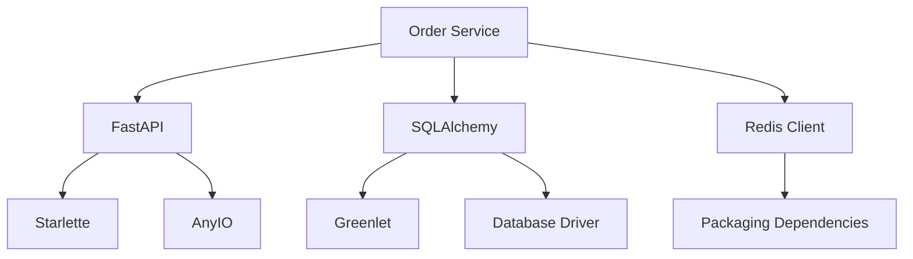
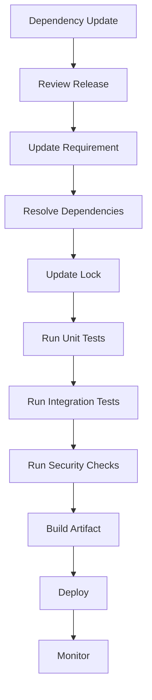

# 03- Dependency Management

## Overview

Python dependency management is the discipline of declaring, resolving, installing, updating, auditing, and reproducing the external packages required by an application.

For a production backend, dependencies are part of the application itself:

```text
Application
    ↓
Direct dependencies
    ↓
Transitive dependencies
    ↓
Python runtime
    ↓
OS / native libraries
```

A dependency-management strategy should make it possible to answer:

- Which packages does this application require?
- Which versions are allowed?
- Which exact versions are deployed?
- Why is a dependency present?
- Which transitive dependencies are installed?
- Can another engineer reproduce the environment?
- Can CI build the same artifact as production?
- How are security vulnerabilities handled?
- How are upgrades reviewed and rolled back?

A virtual environment isolates installed packages, but **dependency management defines what should be installed**. These are related but different concerns.

---

## Dependency Management vs Virtual Environments

| Concern | Virtual environment | Dependency management |
|---|---|---|
| Isolate installed packages | Yes | No |
| Declare dependencies | No | Yes |
| Resolve dependency graph | No | Yes |
| Pin exact versions | No | Usually |
| Reproduce installations | Partially | Yes, with lock/sync workflow |
| Manage Python version | No | Can declare requirement |
| Security auditing | No | Yes |
| Build production artifacts | No | Supports the process |

A useful mental model is:

```text
pyproject.toml
    ↓
Dependency requirements
    ↓
Resolver
    ↓
Lock information
    ↓
Virtual environment / container
    ↓
Installed packages
```

---

## Why Dependency Management Matters

A Python application rarely depends on only the packages explicitly imported by its source code.

For example:

```text
FastAPI
  ↓
Starlette
  ↓
AnyIO
  ↓
sniffio
```

The application therefore has a **dependency graph**, not just a list of packages.

Without controlled resolution, two installations can produce different graphs:

```text
Developer
    → package A 1.x
    → package B 2.x

CI
    → package A 1.x
    → package B 3.x

Production
    → package A 2.x
    → package B 3.x
```

This can produce:

- inconsistent behavior;
- failed deployments;
- incompatible APIs;
- security surprises;
- difficult debugging;
- irreproducible builds.

---

## Direct and Transitive Dependencies

### Direct Dependency

A package explicitly required by your project.

Example:

```toml
dependencies = [
    "fastapi",
    "asyncpg",
]
```

### Transitive Dependency

A package required by one of your dependencies.

For example:

```text
Your service
    ↓
FastAPI
    ↓
Starlette
    ↓
AnyIO
```

You generally should not manually add every transitive dependency to your project's direct dependency list unless your application directly relies on it as a contractual dependency.

---

## Dependency Graph

A useful representation is:



The resolver must find a set of package versions satisfying all declared constraints.

---

## `pyproject.toml`

Modern Python projects should generally use `pyproject.toml` for project metadata and dependency declarations.

Example:

```toml
[project]
name = "order-service"
version = "0.1.0"
description = "Backend service for order processing"
requires-python = ">=3.12,<3.14"

dependencies = [
    "fastapi>=0.115,<1",
    "pydantic>=2.0,<3",
    "sqlalchemy>=2.0,<3",
    "asyncpg>=0.29,<1",
]
```

This provides a declarative source of truth for the project's direct runtime dependencies.

---

## Version Specifiers

Python dependency specifications support different version constraints.

Common examples:

| Constraint | Meaning |
|---|---|
| `==2.1.0` | Exactly version 2.1.0 |
| `>=2.1` | 2.1 or newer |
| `<3` | Any version below 3 |
| `>=2.1,<3` | Compatible range defined explicitly |
| `~=2.1` | Compatible release range according to Python packaging semantics |

For applications, ranges can provide flexibility while a lockfile records the actual resolved versions.

For example:

```toml
dependencies = [
    "httpx>=0.27,<1",
]
```

The lock information can then resolve this to a specific version for reproducible builds.

---

## Version Constraints vs Exact Versions

These serve different purposes.

### Constraint

```text
httpx>=0.27,<1
```

Expresses what versions the project considers compatible.

### Locked Version

```text
httpx 0.28.x
```

Represents what a particular environment/build resolves to.

A mature dependency workflow often uses both:

```text
project requirement
        +
lockfile
        ↓
reproducible installation
```

---

## Lock Files

A lock file records the resolved dependency graph.

Conceptually:

```text
pyproject.toml
    ↓
constraints
    ↓
resolver
    ↓
lock file
    ├── package A exact version
    ├── package B exact version
    ├── package C exact version
    └── hashes / metadata where supported
```

Lock files are particularly valuable for applications where reproducible deployments matter.

Whether a lock file should be committed depends on the project's dependency-management tool and packaging model, but production applications generally benefit from a reproducible resolution strategy.

---

## Dependency Resolution

Dependency resolution is a constraint-solving problem.

Suppose:

```text
Application requires:
A >= 2,<3

A requires:
B >= 1,<2

C requires:
B >= 2
```

The requirements are incompatible:

```text
B < 2
B >= 2
```

A resolver should report the conflict rather than silently installing an arbitrary version.

This is why dependency installation can fail even when each individual package appears valid.

---

## Dependency Conflicts

A conflict can originate from:

- incompatible version constraints;
- Python version requirements;
- platform markers;
- optional dependencies;
- native library requirements;
- incompatible transitive dependencies.

Do not resolve conflicts by randomly forcing package versions.

Instead:

1. inspect the dependency graph;
2. identify the conflicting requirements;
3. determine whether an upgrade or downgrade resolves the conflict;
4. test the resulting application;
5. update the lock information.

---

## `pip`

`pip` is Python's standard package installer and remains an important foundation of the Python packaging ecosystem.

Basic installation:

```bash
python -m pip install fastapi
```

Inspect packages:

```bash
python -m pip list
```

Show package metadata:

```bash
python -m pip show fastapi
```

Validate installed dependencies:

```bash
python -m pip check
```

`pip` installs packages, but dependency resolution, locking, project workflows, and reproducible builds may require additional tooling.

---

## Why `python -m pip` Is Preferred

Prefer:

```bash
python -m pip install package
```

instead of:

```bash
pip install package
```

because the command explicitly associates `pip` with the selected Python interpreter.

This avoids ambiguity when multiple interpreters exist:

```text
python → .venv/bin/python
pip    → /usr/bin/pip
```

Using the wrong `pip` can make a package appear installed while the application still cannot import it.

---

## `requirements.txt`

A traditional application may use:

```text
requirements.txt
```

Example:

```text
fastapi>=0.115,<1
sqlalchemy>=2.0,<3
asyncpg>=0.29,<1
```

It can also contain fully pinned versions:

```text
fastapi==0.115.6
sqlalchemy==2.0.36
asyncpg==0.30.0
```

The exact format depends on the project's workflow.

For modern projects, `pyproject.toml` is generally preferable as the primary project metadata and dependency declaration mechanism.

---

## `pip freeze`

You can inspect the current environment:

```bash
python -m pip freeze
```

This produces installed distributions such as:

```text
anyio==4.x
fastapi==0.115.x
pydantic==2.x
starlette==0.4x
```

`pip freeze` is useful for diagnostics and environment inspection.

However, it should not automatically be treated as the canonical dependency-management strategy because it describes the current installed environment rather than the intended project dependency model.

---

## Dependency Groups

Applications commonly have different dependency categories:

```text
Runtime
Development
Testing
Documentation
Optional features
```

Example:

```toml
[project.optional-dependencies]
dev = [
    "pytest",
    "ruff",
    "mypy",
]

docs = [
    "mkdocs",
]
```

This prevents production deployments from unnecessarily installing development tooling.

---

## Runtime vs Development Dependencies

| Dependency | Runtime? | Example |
|---|---:|---|
| FastAPI | Yes | API framework |
| PostgreSQL driver | Yes | Database connectivity |
| Redis client | Yes | Cache access |
| pytest | No | Testing |
| Ruff | No | Linting |
| mypy | No | Static analysis |
| MkDocs | No | Documentation |

Keep production images as small as practical by installing only required runtime dependencies.

---

## Optional Dependencies

Some libraries expose optional features.

For example:

```toml
[project.optional-dependencies]
postgres = [
    "asyncpg>=0.29,<1",
]
```

Consumers can install:

```bash
python -m pip install "my-package[postgres]"
```

Optional dependencies are useful for libraries supporting multiple integration paths.

For applications, unnecessary optional dependencies should generally not be installed into production environments.

---

## Dependency Groups vs Optional Extras

These concepts can overlap but have different purposes.

- **Optional extras** are part of a package's published dependency interface.
- **Dependency groups** are often used for development or internal workflows.

The exact syntax and support depends on the packaging tool and project configuration.

Use a structure that clearly communicates which dependencies belong in production.

---

## Development Environment

A common workflow is:

```text
Repository
    ↓
Python version
    ↓
Virtual environment
    ↓
Dependency synchronization
    ↓
Application
```

Example:

```bash
python -m venv .venv
source .venv/bin/activate
python -m pip install -e ".[dev]"
```

For lock-aware tooling, use the project's synchronization command so the environment matches the lock information.

---

## `uv`

`uv` is a modern Python package and project management tool that can manage environments, dependencies, and lock information.

A project can define dependencies in:

```text
pyproject.toml
```

and maintain:

```text
uv.lock
```

A typical workflow can be:

```bash
uv init
uv add fastapi
uv add --dev pytest ruff mypy
uv sync
```

Run the application through the managed environment:

```bash
uv run python -m my_service
```

The exact commands depend on the project's chosen workflow and configuration.

---

## Poetry

Poetry provides project metadata, dependency management, resolution, and lockfile support.

A project can define:

```text
pyproject.toml
poetry.lock
```

The conceptual workflow is:

```text
Declare dependencies
        ↓
Resolve
        ↓
Lock
        ↓
Install
        ↓
Test
        ↓
Build
```

Poetry is one valid approach, but teams should avoid mixing multiple dependency managers without a clear reason.

---

## PDM and Hatch

Other modern Python project tools include:

- PDM;
- Hatch.

They provide different approaches to:

- dependency management;
- packaging;
- environments;
- builds;
- project automation.

The important engineering requirement is not choosing the most fashionable tool. It is establishing a workflow that is:

- reproducible;
- documented;
- automated;
- understood by the team;
- compatible with CI/CD.

---

## Choosing a Dependency Manager

| Approach | Strength | Consideration |
|---|---|---|
| `pip` + `pyproject.toml` | Simple, standard foundation | Locking workflow needs deliberate design |
| `uv` | Fast integrated workflow | Team must adopt its conventions |
| Poetry | Integrated project/dependency workflow | Adds tool-specific conventions |
| PDM | Modern packaging workflow | Requires team familiarity |
| Hatch | Strong project/build automation | May be more than small projects need |

Pick one primary workflow per repository.

---

## Avoid Mixing Dependency Managers

A repository should not casually use:

```text
pip
Poetry
uv
conda
manual package installs
```

without defining which tool owns the environment.

Otherwise:

```text
pyproject.toml
    ↓
tool A

lockfile
    ↓
tool B

environment
    ↓
tool C
```

can become inconsistent.

---

## Dependency Update Workflow

A controlled upgrade should look like:



Do not update packages directly in production and then attempt to reproduce the resulting environment afterward.

---

## Patch, Minor, and Major Updates

Updates should be evaluated based on semantic compatibility, not only version numbers.

| Update | Typical expectation | Risk |
|---|---|---|
| Patch | Bug/security fixes | Lower |
| Minor | Backward-compatible features | Moderate |
| Major | Potential breaking changes | Higher |

Semantic versioning is a convention, not a guarantee. Always review release notes and test the application.

---

## Security Updates

Dependency management is part of application security.

A vulnerable transitive dependency can affect the application even if the application never directly imports it.

Example:

```text
Application
    ↓
Framework
    ↓
Library
    ↓
Vulnerable dependency
```

Therefore security scanning should inspect the complete dependency graph.

---

## Dependency Vulnerability Management

A production workflow should support:

```text
Dependency inventory
        ↓
Vulnerability detection
        ↓
Severity assessment
        ↓
Upgrade / mitigation
        ↓
Testing
        ↓
Deployment
```

Evaluate vulnerabilities based on:

- affected versions;
- exploitability;
- application exposure;
- reachable code paths;
- available fixes;
- operational risk.

Not every scanner finding requires an immediate production upgrade, but every relevant finding should have an explicit disposition.

---

## Supply Chain Security

Third-party packages execute code inside your application process.

Installing a package therefore means trusting:

```text
package publisher
+
package distribution
+
dependencies
+
build artifacts
```

Controls can include:

- trusted package indexes;
- dependency review;
- lockfiles;
- package vulnerability scanning;
- artifact verification;
- restricted build environments;
- minimal production dependencies.

---

## Dependency Pinning

Pinning can mean different things.

### Application Requirements

```text
fastapi>=0.115,<1
```

Defines an acceptable compatibility range.

### Fully Pinned Environment

```text
fastapi==0.115.6
```

Defines one exact version.

### Lock File

Records a complete resolved graph.

For applications, a lock-based installation workflow often provides the best balance:

```text
flexible project requirements
+
reproducible resolved graph
```

---

## Hashes and Artifact Integrity

Dependency installation can optionally enforce hashes for known artifacts.

Conceptually:

```text
Expected package artifact
        ↓
hash verification
        ↓
install only matching artifact
```

This provides stronger integrity guarantees than relying only on package version names.

The exact mechanism depends on the package-management workflow.

---

## Private Package Indexes

Organizations may host internal packages:

```text
Internal package index
    ├── company-auth
    ├── company-logging
    └── company-events
```

Projects can then depend on:

```text
company-auth
```

while the package source is controlled internally.

Production considerations include:

- authentication;
- availability;
- package provenance;
- access control;
- build reproducibility;
- disaster recovery.

---

## Internal Packages

Internal libraries should have clear ownership and versioning.

Avoid creating a single package such as:

```text
company-common
```

containing unrelated functionality.

Large shared packages can create dependency coupling:

```text
Service A ─┐
Service B ─┼──> common package
Service C ─┘
```

A small change can then force coordinated upgrades across many services.

Prefer cohesive packages with explicit ownership.

---

## Dependency Inversion and Package Boundaries

Dependency management is not only about third-party packages.

Internal dependencies matter too:

```text
orders
    ↓
payments
    ↓
shared
```

If every module imports every other module, the application develops a tightly coupled dependency graph.

Clear package boundaries reduce:

- circular imports;
- deployment coupling;
- test complexity;
- upgrade risk.

---

## Framework Dependencies

Frameworks such as Django and FastAPI often sit near the center of an application's dependency graph.

For example:

```text
Application
    ↓
FastAPI
    ├── Starlette
    └── Pydantic
```

Avoid allowing framework dependencies to spread unnecessarily into domain logic.

This makes framework upgrades easier because the framework-specific surface area is controlled.

---

## Database Dependencies

Database packages are especially important because they often include native components.

Examples include:

```text
PostgreSQL
    ↓
Python driver
    ↓
native libraries where applicable
```

Production builds must account for:

- Python package version;
- Python interpreter compatibility;
- OS libraries;
- architecture;
- container base image.

A dependency may install successfully on macOS and fail in a Linux production image.

---

## Platform Markers

Some dependencies differ by operating system or Python version.

Packaging metadata can express conditional dependencies.

Conceptually:

```text
Linux → dependency A
Windows → dependency B
Python >= 3.12 → dependency C
```

This matters when building across:

- Windows development machines;
- Linux CI;
- Linux production containers;
- multiple Python versions.

Always test the environments that production actually uses.

---

## Dependency Groups in CI

CI should install only what is necessary for the job.

For example:

```text
Lint job
    → Ruff

Type-check job
    → mypy

Unit-test job
    → pytest + runtime dependencies

Production image
    → runtime dependencies only
```

This reduces:

- build time;
- image size;
- attack surface;
- unnecessary dependency failures.

---

## Docker Dependency Installation

A Docker build should install dependencies from project configuration or a lock-aware workflow.

Example:

```dockerfile
FROM python:3.12-slim

WORKDIR /app

COPY pyproject.toml ./
COPY src ./src

RUN python -m pip install --no-cache-dir .

CMD ["uvicorn", "my_service.main:app", "--host", "0.0.0.0", "--port", "8000"]
```

For a lockfile-based workflow, the image build should use the corresponding deterministic synchronization mechanism.

Do not copy a developer's `.venv` into the image.

---

## Docker Layer Caching

Dependency installation can be separated from frequently changing application code.

Conceptually:

```dockerfile
COPY pyproject.toml .
COPY lockfile .

RUN install dependencies

COPY src ./src
```

This allows Docker to reuse the dependency layer when application source changes without dependency changes.

The exact Dockerfile depends on the package manager and build strategy.

---

## Production Images

Production containers should generally contain:

```text
Application
+
runtime dependencies
+
required OS libraries
```

rather than:

```text
Application
+
test dependencies
+
linters
+
documentation tools
+
local development files
```

This improves:

- startup and build efficiency;
- security posture;
- image size;
- operational simplicity.

---

## CI/CD Reproducibility

A robust pipeline should build from a clean environment:

```text
Git commit
    ↓
Clean CI runner
    ↓
Python version
    ↓
Lock-aware dependency installation
    ↓
Tests
    ↓
Security scan
    ↓
Docker build
    ↓
Artifact
```

Production should deploy the resulting artifact rather than reinstalling dependencies independently on each host.

---

## Dependency Drift

Dependency drift occurs when environments no longer use the same dependency graph.

Example:

```text
Developer → graph A
CI        → graph B
Production → graph C
```

This can happen through:

- manual package installation;
- stale lockfiles;
- different Python versions;
- different package indexes;
- unpinned dependencies;
- mutable production hosts.

The solution is reproducible builds, not manually synchronizing machines.

---

## Dependency Constraints

Constraints files can be useful when an organization needs to control versions without changing the direct dependency declaration.

Conceptually:

```text
Project requirements
        +
organization constraints
        ↓
resolved environment
```

This is particularly useful for managing compatibility or security requirements across multiple applications.

Use constraints deliberately; excessive centralized pinning can make independent services difficult to upgrade.

---

## Dependency Overrides

Forcing a transitive dependency to a particular version can sometimes be necessary for:

- security fixes;
- compatibility;
- platform support.

However, overrides can hide an upstream incompatibility.

When overriding:

1. document why;
2. verify compatibility;
3. test the affected functionality;
4. track the upstream issue;
5. remove the override when no longer required.

---

## Dependency Removal

Removing unused dependencies is also dependency management.

A dependency increases:

- attack surface;
- installation time;
- image size;
- upgrade work;
- potential vulnerability exposure.

Periodically review:

```text
direct dependencies
transitive dependencies
unused imports
optional dependencies
development-only packages
```

Do not remove a package solely because it appears unused by static import analysis if it provides runtime registration, plugin discovery, or other intentional side effects.

---

## Dependency Auditing

Useful questions include:

- Why is this dependency installed?
- Is it directly required?
- Is it still maintained?
- Is it compatible with our Python version?
- Does it contain native components?
- Does it introduce known vulnerabilities?
- Is there a smaller alternative?
- Is it worth the operational cost?

Dependency count should be treated as an architectural decision, not simply an installation detail.

---

## Monitoring Dependency Health

Track:

- vulnerability findings;
- outdated packages;
- failed dependency updates;
- build failures;
- dependency-related incidents;
- package deprecations.

Automated dependency update systems can create pull requests, but automated merging should depend on the project's testing and risk model.

---

## Dependabot-Style Automation

Automated updates can follow:

```text
New package release
    ↓
Dependency update PR
    ↓
CI
    ├── tests
    ├── lint
    ├── type checking
    └── security checks
    ↓
Review
    ↓
Merge
```

Automation is most useful when the project has strong test coverage and a reproducible build.

---

## High Availability

Dependency management contributes to availability by making deployments reproducible.

Avoid:

```text
Replica A → manually installed package set
Replica B → different package set
Replica C → older image
```

Prefer:

```text
Build once
    ↓
Versioned artifact
    ↓
Deploy same artifact
    ↓
All replicas
```

This prevents dependency differences from becoming replica-specific failures.

---

## Disaster Recovery

Dependency recovery should not depend on a developer's workstation.

A service should be rebuildable from:

```text
Source
+
Python version
+
dependency declarations
+
lock information
+
Docker/build configuration
+
private package access
```

Private package indexes and artifact registries should themselves have appropriate availability and recovery plans.

---

## Cost Considerations

Poor dependency management can increase cost through:

- larger Docker images;
- slower CI builds;
- longer deployments;
- unnecessary package downloads;
- excessive vulnerability remediation;
- dependency-related incidents.

Reducing unnecessary dependencies can improve both security and operational efficiency.

---

## Common Mistakes

### Treating `requirements.txt` as the Entire Dependency Strategy

A requirements file can describe dependencies, but it does not by itself establish project metadata, environment ownership, or a complete reproducible build process.

### Using `pip freeze` as the Source of Truth

`pip freeze` describes an installed environment. It may contain packages installed indirectly or temporarily.

### Installing Packages Globally

This creates cross-project coupling and makes environments difficult to reproduce.

### Manually Editing a Lock File

Lock files are generated artifacts of dependency resolution. Modify the dependency declaration and regenerate the lock information instead.

### Ignoring Transitive Dependencies

Security and compatibility problems can originate several levels below your direct dependencies.

### Blindly Pinning Everything

Exact pins can improve reproducibility but may make security and maintenance updates unnecessarily difficult if no controlled update workflow exists.

### Never Updating Dependencies

An unchanged dependency graph can accumulate:

- security vulnerabilities;
- unsupported packages;
- compatibility problems;
- technical debt.

### Updating Everything at Once

Large dependency upgrades are difficult to diagnose and roll back.

Prefer smaller, reviewable update batches where practical.

---

## Production Pitfalls

### Different Dependency Graphs Across Environments

A successful local installation does not guarantee CI or production will resolve the same packages.

### Different Python Versions

A package may support Python 3.12 but not Python 3.13, or vice versa.

Keep runtime versions aligned across environments.

### Native Dependency Failures

A package that works on a developer machine may fail in a minimal Linux container because an OS-level dependency is missing.

### Private Registry Outages

If builds depend on an internal package index, the registry becomes part of the build infrastructure.

Use appropriate caching and availability strategies.

### Vulnerable Transitive Dependencies

Scanning only direct dependencies can miss important vulnerabilities.

### Dependency Update During Deployment

Installing latest packages during deployment makes the deployment artifact mutable and difficult to reproduce.

Build once and deploy the resulting artifact.

---

## Security Best Practices

- Use trusted package sources.
- Maintain a complete dependency inventory.
- Review direct and transitive dependencies.
- Use lock information for reproducible application builds.
- Scan dependencies for known vulnerabilities.
- Remove unnecessary dependencies.
- Keep production images minimal.
- Review high-risk package changes.
- Protect private package registries.
- Avoid embedding credentials in dependency configuration.
- Verify package provenance and artifact integrity where required.
- Test security updates before production rollout.
- Track temporary dependency overrides and remove them when obsolete.

---

## Recommended Dependency Workflow

For a production backend:

```text
Declare
    ↓
Resolve
    ↓
Lock
    ↓
Sync clean environment
    ↓
Test
    ↓
Security scan
    ↓
Build immutable artifact
    ↓
Deploy
    ↓
Monitor
```

Dependency changes should pass through the same engineering controls as source-code changes.

---

## Dependency Management Checklist

### Project Configuration

- [ ] `pyproject.toml` defines project metadata.
- [ ] Runtime dependencies are declared explicitly.
- [ ] Development dependencies are separated.
- [ ] Python version requirements are explicit.
- [ ] Optional dependencies are intentional.

### Reproducibility

- [ ] A defined lock/synchronization strategy exists.
- [ ] CI uses clean environments.
- [ ] Production builds are reproducible.
- [ ] Python versions are aligned across environments.
- [ ] Docker builds do not depend on developer environments.

### Security

- [ ] Direct dependencies are reviewed.
- [ ] Transitive dependencies are included in security scans.
- [ ] Vulnerability findings have an explicit remediation process.
- [ ] Private package sources are secured.
- [ ] Production images contain only required dependencies.

### Maintenance

- [ ] Dependency updates are performed regularly.
- [ ] Major upgrades receive explicit testing.
- [ ] Unused dependencies are periodically removed.
- [ ] Temporary overrides are documented.
- [ ] Dependency ownership is clear.

### CI/CD

- [ ] Dependency installation is automated.
- [ ] Tests run against clean environments.
- [ ] Security checks run in CI.
- [ ] Production artifacts are immutable.
- [ ] The same artifact is deployed to all replicas.

## Key Takeaways

- **Dependency management defines the application's software supply chain:** distinguish direct dependencies, transitive dependencies, version constraints, lock information, and installed environments.
- **Use declarative and reproducible workflows:** `pyproject.toml` should express project requirements, while a lock/synchronization strategy should make application builds reproducible.
- **Treat dependencies as production code:** review upgrades, test compatibility, scan vulnerabilities, control private package sources, and remove unnecessary packages.
- **Build once and deploy consistently:** CI should resolve dependencies in a clean environment and produce an immutable artifact that is deployed consistently across environments and replicas.
- **Prefer controlled evolution over dependency stagnation:** update dependencies regularly in small, reviewable changes while explicitly managing compatibility, security, and operational risk.