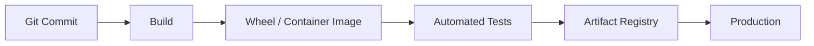
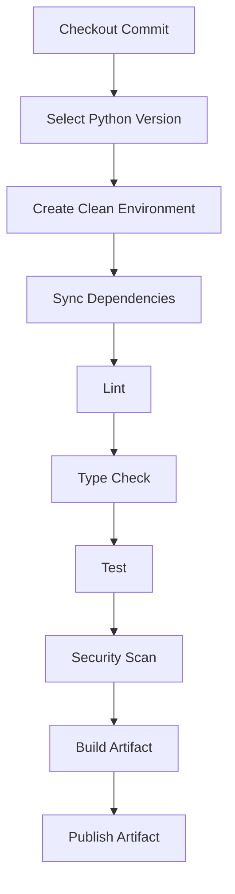
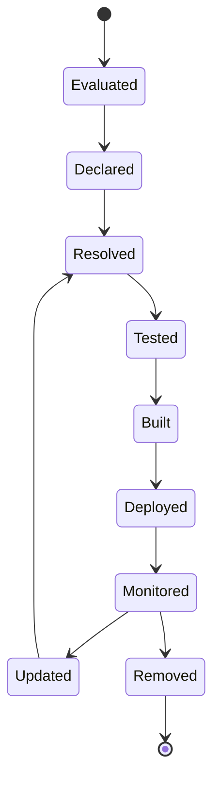

# 05- Package Management

## Overview

Python package management is the process of obtaining, installing, upgrading, removing, inspecting, and distributing Python packages.

For backend systems, package management sits between project configuration and the runtime environment:

```text
                 Python Project
                      │
                      ↓
              pyproject.toml
                      │
                      ↓
             Package Manager
                      │
          ┌───────────┴───────────┐
          ↓                       ↓
     Dependency               Environment
      Resolver                Synchronization
          │                       │
          └───────────┬───────────┘
                      ↓
              Installed Packages
                      │
                      ↓
             Application Runtime
```

Package management is closely related to dependency management but is not identical:

- **Dependency management** defines what packages and versions a project requires.
- **Package management** provides the mechanisms and tooling used to resolve, install, update, build, inspect, and distribute those packages.
- **Virtual environments** isolate the resulting installation.
- **Lock files** record a reproducible resolved dependency graph.

A production backend should have one clearly defined package-management workflow that works consistently across local development, CI/CD, Docker, and production.

---

## Python Package Ecosystem

The Python package ecosystem has several distinct layers:

```text
Package source code
        ↓
Build backend
        ↓
Wheel / source distribution
        ↓
Package index
        ↓
Package manager
        ↓
Virtual environment / container
        ↓
Python application
```

Important components include:

| Component | Responsibility |
|---|---|
| Package | Distributable Python software |
| Distribution | Installable artifact published under a distribution name |
| Wheel | Built binary/package distribution format |
| Source distribution | Source-based distribution artifact |
| Package index | Repository serving Python distributions |
| `pip` | Standard Python package installer |
| `pyproject.toml` | Project metadata/build/dependency configuration |
| Lock file | Resolved dependency graph |
| Virtual environment | Isolated package installation |
| Build backend | Produces package artifacts |

---

## What Is a Python Package?

A Python package is importable Python code organized for reuse.

Example:

```text
order_service/
├── __init__.py
├── api/
│   ├── __init__.py
│   └── orders.py
├── domain/
│   ├── __init__.py
│   └── models.py
└── infrastructure/
    ├── __init__.py
    └── database.py
```

A package can be:

- part of the current application;
- an internal organization library;
- an open-source library;
- a third-party runtime dependency.

The packaging system distributes the code so it can be installed into another environment.

---

## Distribution vs Import Package

A common source of confusion is the difference between a **distribution package** and a **Python import package**.

For example:

```text
Distribution name:
psycopg

Import name:
psycopg
```

But names do not always match:

```text
Distribution:
beautifulsoup4

Import:
bs4
```

Package managers operate primarily on **distribution names**, while Python's import system operates on **module/package names**.

This distinction matters when debugging:

```bash
python -m pip show beautifulsoup4
```

versus:

```python
import bs4
```

---

## `pip`

`pip` is the standard package installer interface for Python environments.

Install a package:

```bash
python -m pip install httpx
```

Install a specific version:

```bash
python -m pip install "httpx==0.28.1"
```

Install a compatible range:

```bash
python -m pip install "httpx>=0.27,<1"
```

Upgrade:

```bash
python -m pip install --upgrade httpx
```

Uninstall:

```bash
python -m pip uninstall httpx
```

List installed packages:

```bash
python -m pip list
```

Inspect metadata:

```bash
python -m pip show httpx
```

Check dependency consistency:

```bash
python -m pip check
```

---

## Why Use `python -m pip`

Prefer:

```bash
python -m pip install package
```

over:

```bash
pip install package
```

because the former explicitly invokes `pip` associated with the selected Python interpreter.

This matters when multiple Python installations exist:

```text
/usr/bin/python
/usr/bin/pip

.venv/bin/python
.venv/bin/pip
```

Using the wrong executable can result in:

```text
pip says package is installed
        ↓
application uses a different Python
        ↓
ModuleNotFoundError
```

---

## Installing From a Project

For a project containing `pyproject.toml`:

```bash
python -m pip install .
```

This installs the project into the current environment.

For development:

```bash
python -m pip install -e .
```

An editable installation allows changes in the source tree to be reflected without rebuilding and reinstalling the project after every source change.

---

## Editable Installs

Editable installation:

```bash
python -m pip install -e .
```

is useful during development because the installed distribution references the working source tree.

Conceptually:

```text
Normal installation:

package artifact
      ↓
site-packages
      ↓
Python runtime


Editable installation:

source tree
      ↓
editable installation metadata
      ↓
Python runtime
```

Use editable installs primarily for development.

Production deployments should generally install a built artifact or install the application into the image using a controlled build process.

---

## Package Installation Location

Packages installed into a virtual environment generally end up under its environment-specific `site-packages` directory.

For example:

```text
.venv/
├── bin/
│   ├── python
│   └── pip
└── lib/
    └── python3.x/
        └── site-packages/
            ├── fastapi/
            ├── pydantic/
            └── ...
```

The exact layout varies by operating system and Python implementation.

Python discovers installed packages through its import path.

Inspect it with:

```bash
python -c "import sys; print('\n'.join(sys.path))"
```

---

## `site-packages`

`site-packages` is a conventional location where third-party Python distributions are installed.

When the application executes:

```python
import fastapi
```

Python searches its configured import paths for the corresponding module/package.

Package installation and import resolution are therefore related but separate operations:

```text
Package manager
    ↓
installs distribution
    ↓
site-packages
    ↓
Python import system
    ↓
module loaded
```

---

## Package Indexes

A package manager needs a source from which distributions can be downloaded.

The public Python Package Index is commonly used for open-source packages.

Organizations may also use private package indexes:

```text
Public packages
      ↓
Public index

Internal packages
      ↓
Private index
```

A company might host:

```text
company-auth
company-events
company-observability
```

in a private registry.

---

## Public vs Private Package Sources

| Source | Typical use |
|---|---|
| Public package index | Open-source dependencies |
| Private package index | Internal libraries |
| Artifact repository | Controlled enterprise distribution |
| Local wheelhouse | Offline/restricted builds |
| Git repository | Specialized source-based dependency |

Production environments should explicitly define which package sources are trusted.

---

## Package Installation From a Wheel

A wheel is a built distribution artifact.

Example:

```bash
python -m pip install ./dist/order_service-1.0.0-py3-none-any.whl
```

Wheels are generally preferable to source distributions when an appropriate wheel exists because installation can avoid rebuilding the package.

For native extensions, the wheel may contain platform-specific compiled code.

---

## Source Distributions

A source distribution commonly uses:

```text
.tar.gz
```

The package manager may need to build the project locally.

Conceptually:

```text
Source distribution
        ↓
Build environment
        ↓
Build backend
        ↓
Wheel
        ↓
Installation
```

This can require:

- a compiler;
- system libraries;
- Python development headers;
- build tools.

This is one reason a package may install successfully on one machine but fail inside a minimal Docker image.

---

## Binary Wheels and Native Dependencies

Some Python packages contain native code.

Examples include packages related to:

- numerical computing;
- database drivers;
- cryptography;
- image processing.

The dependency may therefore have two layers:

```text
Python package
      ↓
compiled extension
      ↓
OS / system libraries
```

Container images must provide the required platform dependencies.

---

## Package Manager vs Build Backend

These responsibilities are different.

```text
Build backend
    ↓
creates distribution artifact

Package manager
    ↓
resolves and installs distributions
```

For example:

```toml
[build-system]
requires = ["setuptools>=75"]
build-backend = "setuptools.build_meta"
```

The build backend determines how the project is built.

A package manager or build frontend invokes that backend as part of the packaging workflow.

---

## Building a Package

A project can be built into distribution artifacts:

```bash
python -m build
```

The result might be:

```text
dist/
├── order_service-1.0.0-py3-none-any.whl
└── order_service-1.0.0.tar.gz
```

The wheel can then be installed:

```bash
python -m pip install dist/order_service-1.0.0-py3-none-any.whl
```

This is useful for validating that the project can actually be packaged independently of the source tree.

---

## Why Build Before Production

A production deployment should ideally operate on an artifact produced by CI.



This is preferable to having production servers independently resolve and download packages.

Benefits include:

- reproducibility;
- immutable deployments;
- easier rollback;
- reduced deployment variability;
- clearer supply-chain controls.

---

## Package Management and `pyproject.toml`

`pyproject.toml` defines project metadata and dependency requirements.

Example:

```toml
[project]
name = "order-service"
version = "1.0.0"
requires-python = ">=3.12,<3.14"

dependencies = [
    "fastapi>=0.115,<1",
    "sqlalchemy>=2.0,<3",
    "asyncpg>=0.30,<1",
]
```

The package manager consumes this metadata to determine what the project requires.

The exact commands depend on the selected package-management workflow.

---

## Package Management and Lock Files

The relationship is:

```text
pyproject.toml
    ↓
Declared requirements
    ↓
Dependency resolver
    ↓
Lock file
    ↓
Environment synchronization
    ↓
Installed packages
```

For example:

```text
pyproject.toml
uv.lock
```

A lock file can record the resolved versions and dependency graph used by the project.

This is especially important for backend applications where reproducibility is more important than allowing every environment to independently resolve the latest compatible versions.

---

## Package Managers Beyond `pip`

Modern Python projects may use tools such as:

- `uv`;
- Poetry;
- PDM;
- Hatch-based workflows.

The choice should be based on project requirements and team conventions.

| Tool/workflow | Typical role |
|---|---|
| `pip` | Package installation |
| `uv` | Fast package/project/environment workflow |
| Poetry | Integrated dependency/project workflow |
| PDM | Project and dependency management |
| Hatch | Project/build/environment automation |

Avoid mixing multiple tools without clearly defining which one owns dependency resolution and environment synchronization.

---

## `uv`

A modern project can use `uv` to manage dependencies and environments.

For example:

```bash
uv add fastapi
uv add sqlalchemy asyncpg
uv add --dev pytest ruff mypy
uv sync
```

Run a command in the managed environment:

```bash
uv run pytest
```

The project configuration remains in:

```text
pyproject.toml
```

and the resolved dependency graph can be represented by:

```text
uv.lock
```

The important engineering property is deterministic synchronization rather than the specific tool itself.

---

## Poetry

A Poetry-managed project commonly contains:

```text
pyproject.toml
poetry.lock
```

The workflow conceptually becomes:

```text
Declare dependencies
        ↓
Resolve
        ↓
Lock
        ↓
Install
        ↓
Test
        ↓
Build
```

Poetry can also manage packaging metadata and build configuration.

A repository should establish whether Poetry owns dependency resolution rather than combining it casually with another dependency manager.

---

## PDM and Hatch

PDM and Hatch provide additional modern Python project workflows.

Their responsibilities can include:

- project metadata;
- dependency management;
- environment management;
- build configuration;
- publishing;
- development automation.

The correct choice is less important than maintaining a predictable repository-wide workflow.

---

## Dependency Installation Strategies

Common approaches include:

| Strategy | Use case |
|---|---|
| Install individual package | Local experimentation |
| Install from `pyproject.toml` | Application/project installation |
| Install from lock information | Reproducible environments |
| Install built wheel | Production/library deployment |
| Install in Docker build | Containerized deployment |
| Install from private index | Internal enterprise packages |

For production, prefer a deterministic process rather than ad-hoc package installation.

---

## Package Upgrades

Upgrade a package through the project's dependency workflow.

For direct `pip` usage:

```bash
python -m pip install --upgrade httpx
```

For lock-aware projects, update the dependency declaration and regenerate the lock information using the project's package manager.

Then run:

```text
dependency update
    ↓
resolution
    ↓
tests
    ↓
security checks
    ↓
build
    ↓
deployment
```

Avoid upgrading production packages manually on running servers.

---

## Safe Upgrade Strategy

A dependency upgrade should be treated like a code change.

Review:

- release notes;
- breaking changes;
- supported Python versions;
- dependency graph changes;
- security implications;
- performance changes;
- migration requirements.

Then run:

```text
Unit tests
    ↓
Integration tests
    ↓
API tests
    ↓
Performance checks where relevant
    ↓
Security checks
    ↓
Build
```

For critical services, deploy progressively and monitor after release.

---

## Removing Packages

Remove unused dependencies through the project's dependency-management workflow.

The goal is not simply to make the dependency list shorter.

Removing unnecessary packages can reduce:

- attack surface;
- image size;
- installation time;
- CI duration;
- dependency conflicts;
- maintenance burden.

Before removal, verify that the package is not used for:

- plugin discovery;
- runtime registration;
- entry points;
- dynamic imports;
- generated code;
- build-time behavior.

---

## Package Inspection

Useful commands include:

```bash
python -m pip list
```

```bash
python -m pip show fastapi
```

```bash
python -m pip check
```

```bash
python -m pip freeze
```

For troubleshooting import behavior:

```bash
python -c "import fastapi; print(fastapi.__file__)"
```

For Python version verification:

```bash
python --version
```

For interpreter location:

```bash
python -c "import sys; print(sys.executable)"
```

These commands are valuable when debugging environment inconsistencies.

---

## Diagnosing "Installed but Cannot Import"

A common production-development problem is:

```text
pip install succeeds
        ↓
import fails
```

Check:

```bash
python -c "import sys; print(sys.executable)"
python -m pip --version
python -m pip show <package>
```

The output should point to the same environment.

For example:

```text
Python:
.../.venv/bin/python

pip:
.../.venv/lib/python.../site-packages/pip
```

If they refer to different installations, the wrong environment is being used.

---

## `pip check`

`pip check` verifies whether installed distributions have compatible declared dependencies.

Run:

```bash
python -m pip check
```

A clean environment should report no broken requirements.

This is useful in CI and troubleshooting, although it does not replace application tests.

---

## `pip freeze` and Environment Snapshots

`pip freeze` reports installed distributions:

```bash
python -m pip freeze
```

It is useful for:

- debugging;
- investigating a deployed environment;
- comparing environments;
- temporary environment snapshots.

It should not automatically become the project's source of truth.

A project's dependency declarations should represent intentional dependencies rather than merely whatever happens to be installed.

---

## Package Caching

Package managers cache downloaded artifacts.

Caching can reduce:

- network traffic;
- CI build time;
- repeated downloads.

In CI:

```text
Dependency cache
      ↓
Install
      ↓
Build
```

However, caches should not be treated as the source of truth.

A build should remain reproducible even when the cache is empty.

---

## CI/CD Package Management

A robust CI pipeline can use:



This ensures package installation is part of the tested build process.

---

## Docker Package Management

For Dockerized backends, dependencies should be installed during image construction.

Conceptually:

```text
Docker build
    ↓
Python base image
    ↓
Dependency installation
    ↓
Application installation
    ↓
Runtime image
```

Example:

```dockerfile
FROM python:3.12-slim

WORKDIR /app

COPY pyproject.toml README.md ./
COPY src ./src

RUN python -m pip install --no-cache-dir .

CMD ["uvicorn", "order_service.main:app", "--host", "0.0.0.0", "--port", "8000"]
```

A lock-aware workflow should use the corresponding synchronization command rather than resolving arbitrary versions during the build.

---

## Multi-Stage Docker Builds

When native build dependencies are required, a multi-stage build can keep the runtime image smaller.

Conceptually:

```text
Builder image
    ├── compiler
    ├── build tools
    └── Python dependencies
             ↓
        built artifact
             ↓
Runtime image
    ├── Python
    ├── runtime libraries
    └── application
```

This prevents unnecessary compilers and build tools from remaining in the production image.

---

## Kubernetes

Kubernetes should generally deploy an already-built container image:

```text
Git commit
    ↓
CI
    ↓
Dependency installation
    ↓
Tests
    ↓
Docker image
    ↓
Container registry
    ↓
Kubernetes Deployment
```

Pods should not dynamically install Python packages during startup.

Doing so causes:

- slower startup;
- network dependency during boot;
- non-deterministic deployments;
- inconsistent replicas.

---

## AWS Deployment

The same principle applies to AWS services such as:

- ECS;
- EKS;
- Lambda;
- EC2.

For containerized workloads:

```text
CI
 ↓
Build image
 ↓
Push to ECR
 ↓
Deploy immutable image
```

For Lambda-style deployments, dependencies should be included in the deployment artifact, layer, or managed packaging mechanism rather than installed unpredictably during invocation.

---

## Package Management and Lambda

Serverless environments make package size and startup time more important.

Dependency choices affect:

- deployment package size;
- cold-start latency;
- initialization time;
- memory usage.

Avoid adding large packages for functionality that can be implemented using already available runtime capabilities or smaller dependencies when that trade-off is justified.

Measure cold-start behavior for latency-sensitive functions.

---

## Private Package Registries

Enterprise environments may use:

```text
Private package registry
        ↓
CI
        ↓
Application build
```

Authentication should use secure mechanisms such as:

- CI-managed credentials;
- short-lived tokens;
- workload identity where supported;
- secret managers.

Never commit registry passwords or access tokens into:

```text
pyproject.toml
requirements files
Dockerfiles
Git history
```

---

## Dependency Confusion

Dependency confusion attacks exploit ambiguous package names where a malicious public package can be selected instead of an intended internal package.

For organizations using private packages:

```text
Internal:
company-auth

Public:
company-auth
```

can create a dangerous ambiguity.

Mitigations include:

- controlled package indexes;
- explicit source configuration;
- namespace conventions;
- trusted registries;
- package provenance controls;
- dependency review.

---

## Package Security

Every installed package becomes part of the application's trusted computing base.

Security practices should include:

- vulnerability scanning;
- dependency review;
- controlled package sources;
- lock/synchronization workflows;
- minimal production dependencies;
- timely security upgrades;
- artifact integrity controls.

A transitive package can be security-relevant even if the application never imports it directly.

---

## Package Provenance

For security-sensitive environments, consider where every package originated.

A useful chain is:

```text
Source
  ↓
Build
  ↓
Artifact
  ↓
Registry
  ↓
Application
```

The goal is to make the artifact's provenance auditable.

This becomes increasingly important in regulated environments and large organizations.

---

## Reproducibility

A reproducible Python environment should be derivable from repository-controlled inputs:

```text
Source commit
+
Python version
+
pyproject.toml
+
lock information
+
package sources
+
build configuration
```

Then:

```text
Clean environment
       ↓
Deterministic dependency synchronization
       ↓
Tests
       ↓
Artifact
```

A developer's local machine should not be an implicit build dependency.

---

## High Availability

Package management contributes indirectly to availability.

Consider:

```text
Replica A → package set A
Replica B → package set B
Replica C → package set C
```

The same service may behave differently across replicas.

Prefer:

```text
One tested artifact
       ↓
Replica A
Replica B
Replica C
```

This ensures dependency versions are part of the deployed artifact.

---

## Disaster Recovery

A service should be rebuildable after infrastructure loss.

Required recovery inputs may include:

```text
Source repository
pyproject.toml
Lock file
Python runtime version
Dockerfile
Package registry access
Container registry
```

If a private package registry is required to rebuild production, its availability and disaster-recovery strategy become part of the service's operational dependencies.

---

## Performance and Cost

Package management affects operational cost through:

- CI installation time;
- dependency download volume;
- Docker image size;
- container startup time;
- Lambda cold starts;
- storage usage;
- security remediation work.

Useful optimizations include:

- dependency caching in CI;
- wheels instead of source builds where appropriate;
- minimal runtime dependencies;
- multi-stage Docker builds;
- reproducible dependency synchronization;
- removing unused packages.

Do not sacrifice reproducibility merely to optimize installation speed.

---

## Dependency Graph Size

A package can introduce many transitive dependencies:

```text
Application
   ↓
Framework
   ├── A
   │   ├── B
   │   └── C
   └── D
       ├── E
       └── F
```

Large graphs increase:

- upgrade surface;
- vulnerability exposure;
- resolver complexity;
- build time;
- potential incompatibilities.

Dependency minimization should be deliberate rather than ideological.

---

## Backend Example

A FastAPI service might have:

```toml
[project]
name = "payment-service"
version = "1.0.0"
requires-python = ">=3.12,<3.14"

dependencies = [
    "fastapi>=0.115,<1",
    "uvicorn[standard]>=0.34,<1",
    "pydantic>=2.10,<3",
    "sqlalchemy>=2.0,<3",
    "asyncpg>=0.30,<1",
    "redis>=6,<7",
]

[project.optional-dependencies]
dev = [
    "pytest>=8,<9",
    "pytest-asyncio>=0.25,<1",
    "ruff>=0.12,<1",
    "mypy>=1.17,<2",
]
```

A development environment can include:

```text
FastAPI
SQLAlchemy
PostgreSQL driver
Redis client
pytest
Ruff
mypy
```

while the production environment installs only runtime requirements.

---

## Dependency Lifecycle

A mature package lifecycle is:



Every dependency should have a reason to exist and an upgrade/removal path.

---

## Common Mistakes

### Using Global Package Installation

```bash
pip install package
```

outside a controlled environment can create cross-project contamination.

Use a virtual environment or managed project environment.

### Using the Wrong `pip`

Running:

```bash
pip install package
```

while the application uses another interpreter can create confusing import failures.

Prefer:

```bash
python -m pip install package
```

### Using `pip freeze` as the Project Definition

It captures the installed environment rather than expressing intentional dependency requirements.

### Installing Packages Directly on Production Hosts

This makes production state mutable and difficult to reproduce.

Build an artifact instead.

### Mixing Package Managers

Using `pip`, Poetry, `uv`, and manual installations simultaneously without clear ownership creates inconsistent environments.

### Installing Development Tools in Production

Linters, test frameworks, and documentation generators increase image size and attack surface.

### Ignoring Native Dependencies

Python package installation can require OS-level build or runtime libraries.

### Trusting Arbitrary Package Sources

Packages execute code in your application's trust boundary.

Use controlled sources.

---

## Production Pitfalls

### Dependency Installation During Container Startup

This creates runtime dependence on package indexes and makes startup non-deterministic.

Install dependencies during image build.

### Mutable Production Environments

If engineers can manually install packages on running servers, two instances can diverge.

Use immutable artifacts.

### Stale Package Caches

Caches improve speed but must not determine correctness.

Builds should succeed from an empty cache.

### Uncontrolled Major Upgrades

A resolver may successfully install a new version while application behavior changes.

Use controlled upgrade PRs and automated tests.

### Private Registry Availability

If every CI build depends on a private package index, registry outages can block deployments.

Use appropriate availability and caching strategies.

### Missing Build Toolchain

A source distribution may require a compiler or OS library unavailable in a minimal image.

Prefer compatible wheels or explicitly provision build dependencies.

---

## Package Management Best Practices

- Use a project-controlled Python environment.
- Prefer `python -m pip` when using `pip`.
- Keep dependency declarations in `pyproject.toml`.
- Use a lock/synchronization strategy for reproducible application environments.
- Use one primary dependency-management workflow per repository.
- Separate runtime and development dependencies.
- Build packages and application artifacts in clean CI environments.
- Deploy immutable artifacts.
- Keep production images minimal.
- Use private package registries for internal packages where appropriate.
- Never commit package registry credentials.
- Scan direct and transitive dependencies.
- Review dependency upgrades.
- Remove unused dependencies.
- Test package installation as part of CI.
- Validate packaging by building actual distribution artifacts.
- Keep Python versions aligned across local, CI, and production environments.

---

## Package Management Checklist

### Local Development

- [ ] A virtual environment or managed environment is used.
- [ ] The correct Python interpreter is selected.
- [ ] The project dependency workflow is documented.
- [ ] Developers do not rely on globally installed packages.

### Project

- [ ] `pyproject.toml` declares runtime dependencies.
- [ ] Development dependencies are separated.
- [ ] Supported Python versions are explicit.
- [ ] The build backend is defined.
- [ ] Package discovery is tested.

### Reproducibility

- [ ] A lock/synchronization strategy exists.
- [ ] CI creates clean environments.
- [ ] Dependency versions are reproducible.
- [ ] Production artifacts are immutable.
- [ ] Python versions are aligned across environments.

### Security

- [ ] Package sources are trusted.
- [ ] Vulnerabilities are scanned.
- [ ] Transitive dependencies are included in analysis.
- [ ] Private registry credentials are protected.
- [ ] Package provenance is considered for sensitive systems.

### Deployment

- [ ] Dependencies are installed during the build.
- [ ] Containers do not install packages at startup.
- [ ] Production images exclude unnecessary development tools.
- [ ] Build artifacts are stored in an appropriate registry.
- [ ] Rollback can restore the previous artifact.

---

## Interview Traps

### Is `pip` the Same as Package Management?

No.

`pip` is a package installer. Modern package management can also include dependency resolution, locking, environment synchronization, building, publishing, and security controls.

### Is `pyproject.toml` a Package Manager?

No.

It is a standardized project configuration and metadata file consumed by packaging and development tools.

### Is a Wheel a Python Package?

A wheel is a distribution artifact used to install a Python project. The terms "package" and "distribution" are often used loosely, but technically they represent different concepts.

### Does Installing a Package Guarantee It Can Be Imported?

No.

The package may have been installed into a different Python environment, or the import name may differ from the distribution name.

### Why Prefer `python -m pip`?

It explicitly associates `pip` with the selected Python interpreter and reduces ambiguity between multiple installations.

### Should Production Run `pip install`?

It can, but the preferred architecture is to install dependencies while building a tested immutable artifact and deploy that artifact.

### Why Is a Lock File Useful?

It records a resolved dependency graph so environments can be reproduced instead of independently resolving potentially different package versions.

### Does Removing a Dependency Always Reduce Runtime Cost?

Not necessarily.

It can reduce installation and attack-surface costs, but runtime impact depends on whether the package was actually imported and how it affected application behavior.

## Key Takeaways

- **Package management is broader than installation:** it covers resolving, installing, upgrading, removing, building, inspecting, securing, and distributing Python packages.
- **Keep responsibilities separate:** `pyproject.toml` declares project requirements, lock information provides reproducibility, virtual environments isolate installations, and build systems create artifacts.
- **Use deterministic production workflows:** resolve and test dependencies in CI, build immutable artifacts, and deploy the same artifact across environments and replicas.
- **Treat third-party packages as part of the security boundary:** control package sources, scan transitive dependencies, protect private registries, and review dependency upgrades.
- **Prefer one clear toolchain:** whether the repository uses `pip`, `uv`, Poetry, PDM, or another workflow, dependency ownership and environment synchronization should be explicit and reproducible.