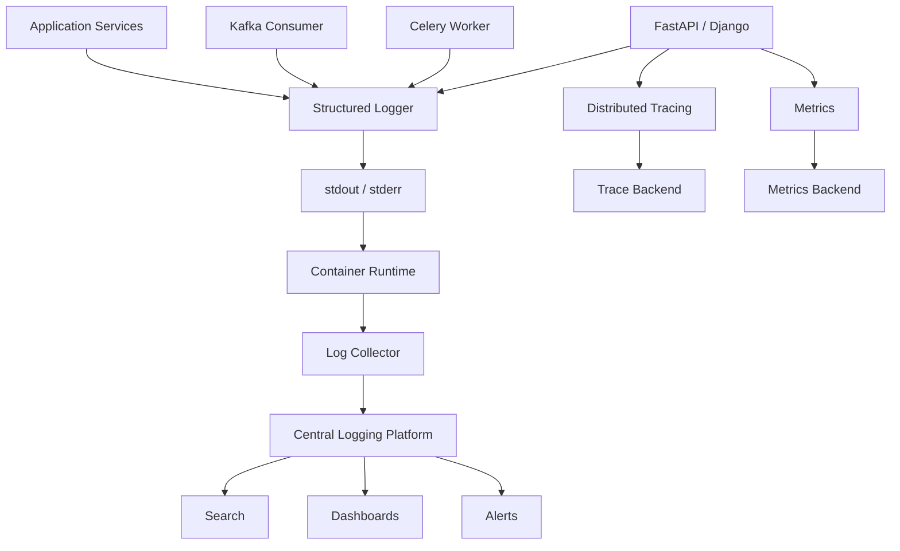

# 09- Structured Logging

## Overview

Structured logging records application events as machine-readable fields rather than relying primarily on free-form text messages.

Traditional logging produces:

```text
2026-09-06 20:30:12 INFO Order 123 created for customer 456
```

Structured logging produces an event such as:

```json
{
  "timestamp": "2026-09-06T15:00:12.421Z",
  "level": "INFO",
  "service": "order-service",
  "event": "order_created",
  "order_id": "ord_123",
  "customer_id": "cus_456",
  "request_id": "req_789"
}
```

The second representation is easier for logging platforms to index, filter, aggregate, correlate, and analyze.

Structured logging is particularly valuable in backend systems because production applications generate events across:

- multiple processes;
- multiple containers;
- multiple hosts;
- multiple services;
- asynchronous workers;
- databases;
- message brokers;
- external APIs.

A useful production observability model is:

```text
                         Backend System
                              │
             ┌────────────────┼────────────────┐
             ↓                ↓                ↓
       Structured Logs      Metrics           Traces
             │                │                │
             └────────────────┼────────────────┘
                              ↓
                    Observability Platform
                              ↓
                 Search / Alert / Investigate
```

Structured logging does not replace metrics or distributed tracing. It complements them.

---

## Why Structured Logging Matters

Free-form logs are optimized primarily for human reading:

```text
Payment request failed for order 123 after 3000ms
```

Machines must parse the message to extract:

```text
operation = payment request
order_id = 123
duration_ms = 3000
```

Structured logs encode those fields directly:

```json
{
  "event": "payment_request_failed",
  "order_id": "123",
  "duration_ms": 3000
}
```

This enables queries such as:

```text
duration_ms > 2000
```

or:

```text
event = "payment_request_failed"
```

without depending on fragile string parsing.

---

## Structured Logging vs Traditional Logging

| Aspect | Traditional text logs | Structured logs |
|---|---|---|
| Human readability | Good | Good |
| Machine parsing | Weak | Strong |
| Field filtering | Difficult | Easy |
| Aggregation | Harder | Easy |
| Schema consistency | Weak | Strong |
| Distributed correlation | Manual | Natural |
| Searchability | Moderate | High |
| Production recommendation | Limited | Preferred |

Text logs remain useful for local development and simple applications, but structured logs are generally preferable for production backend systems.

---

## Event-Oriented Logging

Structured logging should represent meaningful events.

Prefer:

```json
{
  "event": "order_created",
  "order_id": "ord_123"
}
```

over:

```json
{
  "message": "Something happened with order ord_123"
}
```

A good event should answer:

- What happened?
- To which resource?
- Where?
- When?
- Under which request or job?
- With what result?
- Why did it fail, if applicable?

---

## Log Event Schema

A production log event commonly contains several categories of fields.

| Category | Example |
|---|---|
| Timestamp | `2026-09-06T15:00:12.421Z` |
| Severity | `INFO` |
| Service | `order-service` |
| Environment | `production` |
| Event | `order_created` |
| Logger | `order_service.api.orders` |
| Trace | `trace_id` |
| Span | `span_id` |
| Request | `request_id` |
| Operation | `create_order` |
| Resource | `order_id` |
| Result | `success` |
| Duration | `duration_ms` |
| Error | `error_type` |

Do not add every possible field to every event. Log schemas should be useful without becoming unnecessarily large.

---

## Stable Field Names

Consistency is critical.

Choose:

```text
request_id
trace_id
duration_ms
status_code
order_id
```

and use those names consistently.

Avoid:

```text
requestId
request-id
req_id
request_identifier
```

for the same concept across different services.

Stable schemas make centralized search and dashboards significantly easier to maintain.

---

## Event Names

Use stable, semantic event names:

```text
order_created
order_creation_failed
payment_authorized
payment_authorization_failed
database_connection_failed
job_started
job_completed
job_failed
```

Avoid event names that encode unstable text:

```text
"Order 123 created"
"Order 456 created"
```

The resource identifier belongs in a field:

```json
{
  "event": "order_created",
  "order_id": "ord_123"
}
```

---

## Python Logging Model

Python's standard `logging` package is not inherently a JSON logging system, but it provides the core primitives needed to build one.

The conceptual flow is:

```text
logger.info(...)
      ↓
LogRecord
      ↓
Filter / Context
      ↓
Handler
      ↓
Formatter
      ↓
JSON output
      ↓
stdout
      ↓
collector
```

A `LogRecord` contains information such as:

- logger name;
- severity;
- timestamp;
- message;
- exception information;
- source location;
- additional attributes.

Structured logging can enrich this record with application-specific fields.

---

## Basic Python Logger

Create module-level loggers with:

```python
import logging

logger = logging.getLogger(__name__)
```

This produces a natural hierarchy:

```text
order_service
├── api
├── services
├── repositories
└── workers
```

The hierarchy is useful for selective log-level configuration.

---

## `extra` Fields

Python's standard logger supports additional record attributes through `extra`.

```python
logger.info(
    "Order created",
    extra={
        "event": "order_created",
        "order_id": order.id,
        "customer_id": order.customer_id,
    },
)
```

A custom formatter can serialize these attributes into JSON.

`extra` is useful but has limitations:

- fields must be compatible with the `LogRecord`;
- naming must be controlled;
- every caller must follow the same conventions;
- nested structured data can become cumbersome.

For larger systems, a dedicated structured logging library often provides a cleaner API.

---

## JSON Formatter

A small custom formatter can demonstrate the mechanism:

```python
import json
import logging
from datetime import datetime, timezone


class JsonFormatter(logging.Formatter):
    def format(self, record: logging.LogRecord) -> str:
        payload = {
            "timestamp": datetime.now(timezone.utc).isoformat(),
            "level": record.levelname,
            "logger": record.name,
            "message": record.getMessage(),
        }

        if hasattr(record, "event"):
            payload["event"] = record.event

        if hasattr(record, "request_id"):
            payload["request_id"] = record.request_id

        if record.exc_info:
            payload["exception"] = self.formatException(record.exc_info)

        return json.dumps(payload, default=str)
```

For production applications, use a mature structured logging implementation where appropriate rather than growing an ad-hoc formatter into a logging framework.

---

## Structured Logging Libraries

Common approaches in Python include:

| Approach | Strength | Typical use |
|---|---|---|
| `logging` | Standard library | Small/simple applications |
| `structlog` | Rich structured logging | Production Python services |
| `python-json-logger` | JSON formatting | Existing `logging` applications |
| OpenTelemetry logging integrations | Correlation/telemetry ecosystem | Distributed observability |

The important decision is not the library name but the logging contract:

```text
stable schema
+
context propagation
+
safe serialization
+
centralized collection
```

Avoid adopting multiple competing logging abstractions in one application without a clear boundary.

---

## Message vs Structured Fields

A message can still be useful:

```python
logger.info(
    "Order created",
    extra={
        "event": "order_created",
        "order_id": order.id,
    },
)
```

The message provides human-readable context while fields provide machine-readable structure.

Avoid putting all meaningful information into the message:

```python
logger.info(
    f"Order {order.id} created for customer {order.customer_id}"
)
```

when those values are useful for searching and aggregation.

---

## Structured Exception Logging

Structured logging should preserve exception context.

```python
try:
    payment_client.charge(order)
except PaymentError:
    logger.exception(
        "Payment failed",
        extra={
            "event": "payment_failed",
            "order_id": order.id,
        },
    )
    raise
```

The resulting event should contain:

```text
event
order_id
exception type
exception message
stack trace
```

while avoiding sensitive exception content.

---

## Exception Fields

A useful structured error event may contain:

```json
{
  "level": "ERROR",
  "event": "payment_failed",
  "error_type": "PaymentTimeout",
  "error_message": "Payment provider timed out",
  "order_id": "ord_123",
  "attempt": 2
}
```

Do not automatically expose arbitrary exception strings. Third-party exceptions can contain:

- credentials;
- URLs with secrets;
- request headers;
- customer data;
- SQL statements.

---

## Error Classification

Structured logging makes error classification easier.

For example:

```json
{
  "event": "payment_failed",
  "error_type": "PaymentTimeout",
  "retryable": true
}
```

This can distinguish:

```text
retryable timeout
non-retryable validation failure
authorization failure
dependency outage
programming error
```

However, logging metadata should reflect actual application semantics rather than duplicating information that belongs in a metrics or tracing system.

---

## Request Correlation

Distributed systems need correlation identifiers.

Example:

```text
Client
  ↓
Nginx
  ↓
order-service
  ↓
payment-service
  ↓
Kafka
  ↓
notification-worker
```

The same trace or correlation context can connect events:

```text
trace_id=abc123
```

across services.

Example:

```json
{
  "service": "order-service",
  "event": "order_created",
  "trace_id": "abc123"
}
```

and:

```json
{
  "service": "payment-service",
  "event": "payment_authorized",
  "trace_id": "abc123"
}
```

This allows an engineer to reconstruct a distributed request.

---

## Request ID

A request ID identifies one application request.

Example:

```text
request_id=req_8f91
```

It is useful even when distributed tracing is unavailable.

A service should generally accept or generate a request identifier at the request boundary according to a defined trust policy.

Do not blindly trust arbitrary client-provided identifiers for security-sensitive purposes.

---

## Trace ID

A trace ID represents a distributed operation.

For example:

```text
trace_id=4bf92f3577b34da6a3ce929d0e0e4736
```

One trace can contain multiple spans:

```text
Trace
├── HTTP request
├── authentication
├── PostgreSQL query
├── Redis lookup
├── payment API
└── Kafka publish
```

Structured logs can include `trace_id` and `span_id` so engineers can move between logs and traces.

---

## Context Propagation

Request context should flow through application boundaries:

```text
HTTP
 ↓
FastAPI
 ↓
Service
 ↓
Database
 ↓
External API
 ↓
Kafka
 ↓
Celery worker
```

Not all contexts naturally cross asynchronous boundaries.

For example:

```text
HTTP request
    ↓
Kafka message
```

requires an explicit propagation mechanism if the downstream consumer should retain correlation.

---

## `contextvars`

Python's `contextvars` can hold request-local context safely across asynchronous execution.

```python
from contextvars import ContextVar

request_id: ContextVar[str | None] = ContextVar(
    "request_id",
    default=None,
)
```

Middleware can establish the value:

```python
token = request_id.set("req_123")

try:
    await process_request()
finally:
    request_id.reset(token)
```

This is preferable to storing request-specific data in mutable module globals.

---

## Context Enrichment

A mature structured logging system may automatically add:

```text
service
environment
request_id
trace_id
span_id
user_id
tenant_id
```

to every relevant event.

Conceptually:

```text
Base Context
    ↓
Request Context
    ↓
Operation Context
    ↓
Log Event
```

Example:

```json
{
  "service": "order-service",
  "environment": "production",
  "request_id": "req_123",
  "trace_id": "trace_456",
  "event": "order_created",
  "order_id": "ord_789"
}
```

---

## User and Tenant Context

User or tenant identifiers can be valuable for investigation:

```json
{
  "event": "authorization_denied",
  "tenant_id": "tenant_123",
  "user_id": "user_456"
}
```

But these fields may be sensitive.

Use stable internal identifiers where possible and follow privacy policies.

Do not log authentication credentials or full personal profiles merely for convenience.

---

## HTTP Request Logging

A structured request-completion event might contain:

```json
{
  "event": "http_request_completed",
  "method": "POST",
  "route": "/orders",
  "status_code": 201,
  "duration_ms": 42,
  "request_id": "req_123",
  "trace_id": "trace_456"
}
```

This is substantially more useful than:

```text
POST /orders returned 201
```

because fields can be queried independently.

---

## FastAPI Middleware

A request logging middleware can establish correlation and emit a structured completion event:

```python
import logging
import time
from uuid import uuid4

from fastapi import FastAPI, Request

app = FastAPI()
logger = logging.getLogger(__name__)


@app.middleware("http")
async def request_logging_middleware(
    request: Request,
    call_next,
):
    request_id = request.headers.get("X-Request-ID") or str(uuid4())
    started = time.perf_counter()

    try:
        response = await call_next(request)
    except Exception:
        logger.exception(
            "Unhandled request failure",
            extra={
                "event": "http_request_failed",
                "request_id": request_id,
                "method": request.method,
                "route": request.url.path,
            },
        )
        raise

    duration_ms = (time.perf_counter() - started) * 1000

    response.headers["X-Request-ID"] = request_id

    logger.info(
        "HTTP request completed",
        extra={
            "event": "http_request_completed",
            "request_id": request_id,
            "method": request.method,
            "route": request.url.path,
            "status_code": response.status_code,
            "duration_ms": round(duration_ms, 2),
        },
    )

    return response
```

In a production system, tracing middleware and a structured logging framework may already provide much of this functionality.

---

## Route vs URL

Prefer logging the route template:

```text
/orders/{order_id}
```

rather than the raw URL:

```text
/orders/0192837465
```

Route templates reduce cardinality and make aggregation more useful.

Avoid logging query strings by default because they can contain:

- tokens;
- PII;
- large values;
- sensitive search parameters.

---

## Logging Database Operations

Structured logs can record database operation metadata:

```json
{
  "event": "database_query",
  "operation": "order_lookup",
  "duration_ms": 8,
  "rows": 1
}
```

Avoid logging:

```json
{
  "sql": "SELECT ...",
  "parameters": ["customer@example.com", "..."]
}
```

for every query in production.

Database-level logging and query analysis tools are better suited for systematic SQL diagnostics.

---

## Database Slow-Query Events

A useful pattern is to log unusually slow operations:

```json
{
  "event": "database_query_slow",
  "operation": "order_lookup",
  "duration_ms": 1200,
  "threshold_ms": 500
}
```

This can help identify regressions without generating logs for every normal query.

---

## Redis Logging

Useful Redis metadata includes:

```json
{
  "event": "cache_operation",
  "operation": "get",
  "namespace": "orders",
  "result": "miss",
  "duration_ms": 2
}
```

Avoid logging full cache values.

Cache keys can also contain sensitive identifiers, so namespaces and key contents should be reviewed before logging them.

---

## Kafka Logging

Kafka consumers and producers benefit from structured operational metadata:

```json
{
  "event": "kafka_message_processed",
  "topic": "order-events",
  "partition": 4,
  "offset": 18291,
  "consumer_group": "notifications",
  "event_id": "evt_123",
  "duration_ms": 14
}
```

Avoid logging complete event payloads by default.

For large events, payload logging can dominate log volume.

---

## Celery Logging

Background tasks need task-level correlation:

```json
{
  "event": "task_completed",
  "task_name": "orders.send_confirmation",
  "task_id": "task_123",
  "attempt": 2,
  "duration_ms": 1250
}
```

Useful fields include:

- task name;
- task ID;
- queue;
- attempt;
- status;
- duration;
- correlation ID.

---

## Retry Logging

Retries should expose operationally relevant fields:

```json
{
  "event": "dependency_retry",
  "dependency": "payment-api",
  "operation": "charge",
  "attempt": 2,
  "max_attempts": 3,
  "reason": "timeout",
  "backoff_ms": 500
}
```

Do not emit a full exception stack trace for every expected transient retry unless required for diagnosis.

Log the final failure appropriately.

---

## Background Job Correlation

An HTTP request may enqueue a job:

```text
HTTP request
    ↓
task_id=task_123
    ↓
Celery
    ↓
worker
```

The worker should preserve relevant correlation context:

```json
{
  "event": "task_started",
  "task_id": "task_123",
  "trace_id": "trace_456"
}
```

This connects asynchronous work back to the originating request when the architecture supports it.

---

## Security Events

Structured logging is particularly useful for security events.

Examples:

```text
authentication_failed
authorization_denied
session_revoked
admin_action
api_key_rotated
```

Example:

```json
{
  "event": "authorization_denied",
  "user_id": "user_123",
  "resource": "order",
  "action": "refund",
  "reason": "insufficient_permissions"
}
```

Avoid logging credentials or sensitive authentication material.

---

## Sensitive Data

Structured logging does not automatically make sensitive data safe.

Potentially sensitive fields include:

```text
password
access_token
refresh_token
api_key
authorization
cookie
credit_card_number
private_key
request_body
```

A production logging schema should explicitly define which fields are allowed.

Prefer allowlisting safe fields rather than attempting to redact every possible secret after it has entered the logging pipeline.

---

## Redaction

When sensitive values can legitimately appear in an event, redact them:

```json
{
  "authorization": "[REDACTED]"
}
```

However:

```text
Don't log it
```

is generally safer than:

```text
Log it and redact it later
```

Redaction systems can fail because of nested objects, alternate field names, serialization differences, or unexpected exception messages.

---

## PII

Logs often contain more personal information than engineers realize.

Examples:

```text
email
phone
IP address
name
address
customer identifiers
request payloads
```

Use data minimization:

```text
Need for diagnosis
      ↓
Smallest useful field
      ↓
Safe representation
```

For example, an internal customer ID may be more appropriate than logging a customer's full profile.

---

## Log Injection

Untrusted input can contain characters that interfere with log parsing.

For example:

```text
user_input = "normal\nERROR fake event"
```

Structured JSON serialization handles escaping correctly when values are encoded through a proper serializer.

Never construct JSON logs through manual string concatenation.

---

## Cardinality

Cardinality describes how many distinct values a field can have.

Low-cardinality fields:

```text
environment
service
region
status_code
```

High-cardinality fields:

```text
request_id
trace_id
user_id
order_id
```

High-cardinality fields are often extremely useful in logs, but can become expensive or inefficient in metrics systems.

Do not blindly copy logging fields into metric labels.

---

## Logs vs Metrics Cardinality

A field such as:

```text
order_id
```

is reasonable in a log.

It is usually inappropriate as a Prometheus metric label:

```text
orders_total{order_id="ord_123"}
```

because millions of unique orders create enormous metric cardinality.

Structured logging is often the appropriate place for high-cardinality diagnostic identifiers.

---

## Event Size

Structured logs should remain reasonably small.

Avoid:

```json
{
  "event": "request_completed",
  "request_body": "<10 MB>",
  "response_body": "<20 MB>"
}
```

Large payloads increase:

- serialization CPU;
- memory usage;
- network traffic;
- ingestion cost;
- storage requirements;
- query latency.

Log selected metadata instead.

---

## Logging Performance

Logging has real runtime cost:

```text
Application
    ↓
Create fields
    ↓
Serialize JSON
    ↓
Write output
    ↓
Transport
    ↓
Storage
```

The cost increases with:

```text
event rate
×
event size
×
serialization complexity
```

High-throughput services should treat logging as part of the performance budget.

---

## Lazy Formatting

With standard Python logging, prefer:

```python
logger.debug("Processing order %s", order_id)
```

over:

```python
logger.debug(f"Processing order {order_id}")
```

The logging framework can avoid interpolation when the level is disabled.

For expensive structured values:

```python
if logger.isEnabledFor(logging.DEBUG):
    logger.debug(
        "Debug payload",
        extra={"payload": build_expensive_debug_payload()},
    )
```

Do not perform expensive work solely to construct a log event that will be discarded.

---

## Logging in Hot Paths

Avoid:

```python
for record in records:
    logger.info(
        "Record processed",
        extra={"record_id": record.id},
    )
```

for millions of records.

Prefer aggregation:

```python
logger.info(
    "Batch processed",
    extra={
        "event": "batch_processed",
        "records_processed": len(records),
        "duration_ms": duration_ms,
    },
)
```

This preserves operational information while controlling event volume.

---

## Async Logging

Async applications require special attention because blocking logging can block the event loop.

Potentially dangerous:

```text
async request
   ↓
synchronous network logging handler
   ↓
event loop blocked
   ↓
other requests delayed
```

For high-volume asynchronous services:

- write to stdout/stderr;
- use non-blocking collection infrastructure;
- consider queue-based handlers where justified;
- avoid synchronous remote logging calls from request handlers.

---

## Queue-Based Logging

Python provides:

```text
QueueHandler
QueueListener
```

for decoupling log creation from log output.

Conceptually:

```text
Application Thread
       ↓
QueueHandler
       ↓
In-memory Queue
       ↓
QueueListener
       ↓
Output Handler
```

Advantages:

- reduces blocking from output handlers;
- separates application execution from log delivery.

Limitations:

- additional memory;
- queue saturation;
- shutdown complexity;
- possible log loss.

Do not use an unbounded in-memory queue as an excuse to ignore log volume.

---

## Multiprocessing

Python services often run multiple worker processes:

```text
Gunicorn
├── worker 1
├── worker 2
├── worker 3
└── worker 4
```

Each process has independent memory and logging state.

Application logs should be emitted through a deployment-compatible output path:

```text
worker
  ↓
stdout/stderr
  ↓
container runtime
  ↓
collector
```

Avoid depending on process-local logging state for cross-worker coordination.

---

## Containers

For Docker and Kubernetes deployments, prefer:

```text
stdout
stderr
```

as the application's primary log destination.

The platform can then handle:

```text
collection
transport
buffering
retention
search
archival
```

This is generally more reliable than maintaining independent application log files inside ephemeral containers.

---

## Kubernetes Logging

A typical production pipeline is:


Kubernetes metadata can enrich events with:

```text
namespace
pod
container
node
deployment
```

Application code should not duplicate infrastructure metadata unnecessarily if the collector can provide it.

---

## AWS Logging

AWS deployments may use:

```text
CloudWatch Logs
OpenSearch-compatible platforms
S3 archival
OpenTelemetry-compatible pipelines
```

A common flow is:

```text
Python application
      ↓
stdout
      ↓
collector
      ↓
CloudWatch / centralized platform
      ↓
search + alerting + retention
```

Choose the destination based on:

- query requirements;
- retention;
- compliance;
- ingestion volume;
- cost;
- operational tooling.

---

## Logging and Distributed Tracing

Logs should integrate with tracing.

A useful event:

```json
{
  "event": "payment_request_failed",
  "trace_id": "abc123",
  "span_id": "def456",
  "duration_ms": 3000
}
```

An engineer can then:

```text
Trace
 ↓
Slow payment span
 ↓
Related log
 ↓
Exception details
```

This dramatically improves incident investigation.

---

## Logging and Metrics

Use logs for individual events:

```text
payment_failed
```

Use metrics for aggregate behavior:

```text
payment_failures_total
payment_latency_seconds
```

Do not create millions of logs solely so they can later be counted.

Metrics systems are optimized for aggregation.

---

## Logging and Alerting

Avoid alerts based solely on arbitrary message text:

```text
message contains "error"
```

Prefer metrics or explicitly defined event signals:

```text
HTTP 5xx rate > threshold
payment_failure_rate > threshold
database_connection_errors > threshold
```

Logs then provide the diagnostic context behind the alert.

---

## Audit Logging

Audit logging should be distinguished from ordinary application logging.

Application log:

```json
{
  "event": "order_updated",
  "order_id": "ord_123"
}
```

Audit event:

```json
{
  "event": "admin_order_refunded",
  "actor_id": "user_456",
  "resource_id": "ord_123",
  "action": "refund",
  "timestamp": "..."
}
```

Audit records may require:

- stronger integrity;
- stricter access controls;
- longer retention;
- dedicated storage;
- compliance controls.

Do not assume ordinary stdout logs provide audit-grade durability.

---

## Log Retention

Retention should reflect the purpose of the log.

| Log type | Typical strategy |
|---|---|
| Debug diagnostics | Short retention |
| Application operational logs | Moderate retention |
| Security events | Policy-driven retention |
| Audit records | Compliance-driven retention |
| Archived incident data | Case-specific retention |

Long retention increases:

```text
storage cost
+
query cost
+
privacy exposure
```

---

## Log Sampling

High-volume success logs can sometimes be sampled.

For example:

```text
1,000,000 successful requests
        ↓
1% detailed request-log sampling
```

However, sampling should not blindly apply to:

- security events;
- critical failures;
- audit events;
- compliance-required records.

Define sampling policy per event category.

---

## Log Schema Evolution

Log schemas should be stable enough for downstream consumers.

Example:

```json
{
  "schema_version": 2,
  "event": "order_created"
}
```

Schema versioning can be useful when logs are consumed by long-lived downstream systems.

Do not add a version field solely because it sounds architecturally sophisticated.

If logs are only consumed interactively, backward-compatible field evolution may be sufficient.

---

## Logging Configuration

Logging configuration should be centralized.

Example:

```python
import logging.config


LOGGING = {
    "version": 1,
    "disable_existing_loggers": False,
    "handlers": {
        "console": {
            "class": "logging.StreamHandler",
        },
    },
    "root": {
        "handlers": ["console"],
        "level": "INFO",
    },
}

logging.config.dictConfig(LOGGING)
```

Production applications can layer a JSON formatter or structured logging framework on top of this foundation.

---

## Environment-Based Log Levels

Configuration may control the minimum log level:

```dotenv
APP_LOG_LEVEL=INFO
```

Typical policy:

| Environment | Level |
|---|---|
| Development | `DEBUG` |
| CI | `INFO` |
| Staging | `INFO` |
| Production | `INFO` / `WARNING` |
| Incident investigation | Temporary controlled verbosity |

Avoid leaving verbose debugging permanently enabled in production.

---

## Django Structured Logging

Django uses Python's standard logging system.

A mature Django application can structure logs around:

```text
django.request
django.server
application.api
application.services
application.tasks
application.database
```

Structured output can then be routed to the same centralized platform as other services.

Avoid mixing multiple incompatible logging configurations across Django, Gunicorn, and application modules without understanding handler propagation.

---

## Gunicorn and Application Logging

In production Django/FastAPI deployments, Gunicorn may manage:

```text
access logs
error logs
worker lifecycle
```

while the application produces application logs.

Define clear ownership:

```text
HTTP server
 → access/lifecycle events

Application
 → business/application events

Infrastructure
 → container/platform events
```

Avoid generating duplicate access logs at multiple layers.

---

## Nginx and Application Logs

Nginx may record:

```text
client connection
request method
path
status
upstream latency
```

The Python service may record:

```text
business operation
request correlation
application outcome
```

Correlation identifiers should allow these layers to be related without duplicating every field everywhere.

---

## Configuration and Log Schema

Useful configuration:

```dotenv
APP_LOG_LEVEL=INFO
APP_LOG_FORMAT=json
APP_LOG_INCLUDE_STACKTRACE=true
```

Be cautious with configuration that enables sensitive logging.

For example:

```dotenv
APP_LOG_REQUEST_BODY=true
```

should not be treated as a harmless debugging switch in production.

Sensitive logging configuration should be controlled and auditable.

---

## Logging Business Events

Logging a business event does not make it durable.

This:

```python
logger.info(
    "Order created",
    extra={"event": "order_created", "order_id": order.id},
)
```

does not replace:

```text
Database transaction
+
Outbox
+
Kafka
```

when another service depends on the event.

Logs are observability records, not transactional messaging infrastructure.

---

## Transaction Boundaries

Log successful business outcomes after the relevant transaction succeeds.

Avoid:

```text
BEGIN
 ↓
logger.info("Order created")
 ↓
ROLLBACK
```

because the logs now describe an event that never committed.

Prefer:

```text
BEGIN
 ↓
Update order
 ↓
COMMIT
 ↓
log successful outcome
```

For asynchronous event publication, use an appropriate transactional/outbox design when delivery guarantees matter.

---

## Configuration and Deployment Version

Include safe deployment metadata where useful:

```json
{
  "service": "order-service",
  "version": "2026.09.06",
  "git_sha": "abc123",
  "environment": "production",
  "event": "application_started"
}
```

This helps correlate incidents with deployments.

Do not expose unnecessary internal build metadata to untrusted clients.

---

## Startup Logging

Useful startup events include:

```text
application_starting
configuration_validated
database_initialized
worker_started
application_ready
```

For example:

```json
{
  "event": "application_ready",
  "service": "order-service",
  "version": "2026.09.06"
}
```

Never log secret values while reporting configuration readiness.

---

## Shutdown Logging

Graceful shutdown can produce:

```text
shutdown_requested
stop_accepting_requests
draining_requests
stopping_workers
closing_connections
shutdown_complete
```

This is especially useful during Kubernetes rolling deployments and incident investigation.

---

## Health Check Logging

Avoid logging every health probe at `INFO`.

If Kubernetes probes:

```text
GET /healthz
GET /readyz
```

every few seconds across many replicas, these events can generate unnecessary volume.

Prefer metrics and lower-severity logging where appropriate.

---

## Log Loss

Ordinary application logs are not guaranteed durable records.

Logs can be lost because of:

- process crashes;
- container termination;
- buffer overflow;
- collector failure;
- node failure;
- network failure;
- disk pressure.

For business-critical data, use durable storage or messaging mechanisms instead.

---

## High Availability

The logging pipeline should not become a single point of failure for the application.

Prefer:

```text
Application
   ↓
local stdout
   ↓
collector
   ↓
central platform
```

rather than:

```text
Application
   ↓
synchronous remote logger
   ↓
application request
```

The latter couples request availability to logging infrastructure availability.

---

## Reliability Trade-offs

There is an inherent trade-off:

```text
More durable logging
    ↓
More buffering / network dependency / latency

Less blocking
    ↓
Potentially more log loss
```

Ordinary diagnostic logs usually prioritize application availability.

Security audit records may require a different durability model.

The policy should be explicit.

---

## Disaster Recovery

A logging platform should have defined recovery expectations.

Consider:

- retention;
- archival;
- access controls;
- regional failure;
- storage durability;
- export to object storage;
- compliance requirements.

Logs are often critical during disaster investigation even though they are not application state.

---

## Cost Optimization

Structured logs can become expensive at scale.

For example:

```text
10,000 requests/sec
×
3 logs/request
×
1 KB/log
```

produces approximately:

```text
30 MB/sec
```

before compression and infrastructure-specific overhead.

That is substantial log volume.

Control cost through:

- appropriate log levels;
- aggregation;
- event sampling;
- payload minimization;
- retention policies;
- compression;
- avoiding duplicate events;
- separating audit from operational logs.

---

## Observability Metadata

Useful standard fields include:

```text
service
environment
region
instance
version
timestamp
level
event
logger
trace_id
span_id
request_id
```

Infrastructure can often add:

```text
pod
namespace
container
node
availability_zone
```

Do not make application code responsible for metadata that the platform can reliably inject.

---

## Logging Standards

A service-wide standard might define:

```text
Field              Requirement
-----------------------------------------------
timestamp          Required
level              Required
service            Required
environment        Required
event              Required
trace_id           When tracing exists
request_id         HTTP/request workflows
span_id            When tracing exists
error_type         Error events
duration_ms        Latency-sensitive events
resource IDs       When useful
```

The exact schema should be standardized at the platform or organization level where multiple services depend on it.

---

## Example Production Event

A successful order request might produce:

```json
{
  "timestamp": "2026-09-06T15:12:30.421Z",
  "level": "INFO",
  "service": "order-service",
  "environment": "production",
  "event": "order_created",
  "logger": "order_service.api.orders",
  "trace_id": "4bf92f3577b34da6a3ce929d0e0e4736",
  "span_id": "00f067aa0ba902b7",
  "request_id": "req_123",
  "route": "/orders",
  "method": "POST",
  "status_code": 201,
  "duration_ms": 42,
  "order_id": "ord_123",
  "tenant_id": "tenant_456"
}
```

This event is compact enough to be operationally practical while carrying enough context for investigation.

---

## Example Production Error

```json
{
  "timestamp": "2026-09-06T15:13:10.021Z",
  "level": "ERROR",
  "service": "payment-service",
  "environment": "production",
  "event": "payment_failed",
  "trace_id": "4bf92f3577b34da6a3ce929d0e0e4736",
  "span_id": "00f067aa0ba902b7",
  "request_id": "req_123",
  "order_id": "ord_123",
  "error_type": "PaymentTimeout",
  "retryable": true,
  "attempt": 3,
  "duration_ms": 3000
}
```

The event provides useful investigation context without exposing payment credentials or raw request payloads.

---

## Production Logging Architecture

A mature Python backend can follow:



The important separation is:

```text
Application
 → produce structured telemetry

Platform
 → collect, transport, store, query
```

---

## Common Mistakes

### Using Free-Form Messages for Everything

Free-form messages are difficult to aggregate and query reliably.

Use stable event names and fields.

### Logging Sensitive Data

Structured logging makes data easier to search, but that also makes leaked secrets easier to discover.

Do not log secrets in the first place.

### Logging Full Request and Response Bodies

This creates security, privacy, performance, and cost problems.

Log selected metadata instead.

### Using High-Cardinality Fields in Metrics

`request_id`, `user_id`, and `order_id` are useful in logs but usually inappropriate as metric labels.

### Creating Inconsistent Field Names

Different names for the same concept fragment observability queries.

### Logging at Every Layer

A single failure can produce several duplicate error events.

Log at meaningful boundaries.

### Treating Logs as Durable Events

Logs should not replace Kafka, an outbox, or durable database state.

### Logging Every Successful Operation

High-volume success events can overwhelm the logging system.

Use sampling or aggregation where appropriate.

---

## Production Pitfalls

### Duplicate Events

Misconfigured logger propagation and handlers can produce multiple copies of the same event.

### Missing Correlation

Logs without `request_id` or `trace_id` are much harder to use in distributed incidents.

### Excessive Event Size

Large serialized payloads can dominate CPU, memory, network, and storage usage.

### Blocking Handlers

Synchronous file or network handlers can increase application latency, especially in asyncio services.

### Unbounded Logging Queues

An in-memory queue can turn logging pressure into application memory pressure.

### Unstable Schemas

Changing field names without coordination breaks dashboards, searches, and downstream consumers.

### Trusting Client Correlation IDs

Client-supplied identifiers can be useful for correlation but should not automatically be treated as trusted security identity.

### Logging Secrets Through Exceptions

Third-party exceptions can expose credentials embedded in URLs, headers, or configuration.

---

## Best Practices

- Use structured fields for operationally important data.
- Use stable event names.
- Standardize field names across services.
- Include timestamps in UTC.
- Include service and environment metadata.
- Propagate request and trace correlation.
- Use `contextvars` or framework-supported context propagation for request-local data.
- Emit JSON or another machine-readable format in production.
- Log to stdout/stderr in containers.
- Avoid secrets and unnecessary PII.
- Avoid full request/response payload logging.
- Keep events small.
- Control high-volume log sources.
- Use metrics for aggregate behavior.
- Use tracing for distributed request flow.
- Keep audit logging separate where stronger guarantees are required.
- Monitor log volume, ingestion failures, and storage cost.
- Test redaction and important event schemas.
- Treat logging configuration as production configuration.
- Make log behavior compatible with graceful shutdown and rolling deployments.

---

## Operational Checklist

### Schema

- [ ] Events have stable names.
- [ ] Field names are standardized.
- [ ] Timestamps use UTC.
- [ ] Service and environment are included.
- [ ] Request/trace identifiers are propagated.
- [ ] Error events include useful classification.
- [ ] Event sizes are bounded.

### Security

- [ ] Passwords are never logged.
- [ ] Tokens and API keys are never logged.
- [ ] Authorization headers are protected.
- [ ] Request bodies are not logged by default.
- [ ] PII logging follows policy.
- [ ] Audit logs have appropriate retention and access controls.

### Performance

- [ ] High-volume paths have controlled logging.
- [ ] Expensive debug payload construction is avoided.
- [ ] Async request handlers are not blocked by remote logging.
- [ ] Logging queues have bounded capacity.
- [ ] Log volume is measured.

### Distributed Systems

- [ ] HTTP requests have correlation identifiers.
- [ ] Traces correlate with logs.
- [ ] Background tasks have task IDs.
- [ ] Kafka events preserve required correlation metadata.
- [ ] Multiple replicas produce compatible schemas.
- [ ] Deployment versions can be correlated with events.

### Infrastructure

- [ ] Containers emit logs to stdout/stderr.
- [ ] Kubernetes log collection is configured.
- [ ] Log retention is defined.
- [ ] Centralized search is available.
- [ ] Logging infrastructure failures are observable.
- [ ] Storage and ingestion costs are monitored.

---

## Interview Traps

### What Is the Main Benefit of Structured Logging?

It represents log data as machine-readable fields, making filtering, aggregation, correlation, and automated analysis much more reliable than parsing arbitrary strings.

### Is JSON Required for Structured Logging?

No.

JSON is a common transport representation, but structured logging means that event data is represented as fields with defined semantics. Other structured formats are possible.

### Why Are `trace_id` and `request_id` Useful?

They allow engineers to correlate events belonging to the same request or distributed operation across services and infrastructure.

### Should `user_id` Be a Metric Label?

Usually not for high-cardinality systems. It is often appropriate in logs, while metrics should use bounded-cardinality dimensions.

### Why Not Log Every Request Body?

Bodies can contain secrets, PII, and large payloads. They also create substantial CPU, network, storage, and privacy costs.

### Why Use `contextvars`?

They provide request-local context that works well with asynchronous execution, avoiding unsafe mutable global state for values such as correlation IDs.

### Should Every Exception Be Logged?

No. Log exceptions at meaningful boundaries and avoid producing duplicate stack traces at every layer.

### Can Structured Logs Replace Distributed Tracing?

No. Logs provide event details; traces represent distributed operation structure and timing.

### Can Logs Be Used as Business Events?

Not when durable delivery or transactional semantics are required. Use database transactions, outbox patterns, Kafka, or another appropriate durable mechanism.

### Why Can Logging Affect Application Availability?

Serialization, I/O, queueing, network transport, and storage can consume CPU, memory, and latency budgets. Poorly designed logging can become a production bottleneck.

## Key Takeaways

- **Structured logging turns logs into queryable event data:** use stable event names and machine-readable fields instead of encoding important context only inside free-form messages.
- **Correlation is essential for distributed backends:** propagate `request_id`, `trace_id`, `span_id`, and background-job identifiers so logs can be connected across FastAPI/Django, workers, Kafka, databases, and microservices.
- **Logging must be secure and bounded:** never log secrets, minimize PII, avoid large payloads, control high-volume events, and account for serialization and I/O overhead.
- **Use each observability signal for its intended purpose:** logs explain individual events, metrics expose aggregate behavior, and traces reconstruct distributed request flow.
- **Treat the logging pipeline as production infrastructure:** standardize schemas, emit logs through container-friendly outputs, monitor ingestion and cost, define retention, and design explicit behavior for failures and log loss.