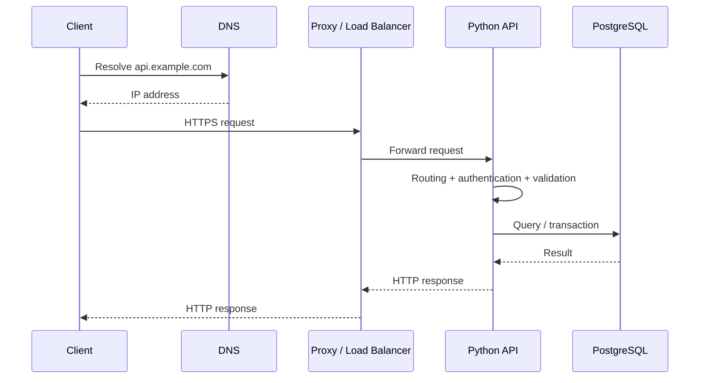
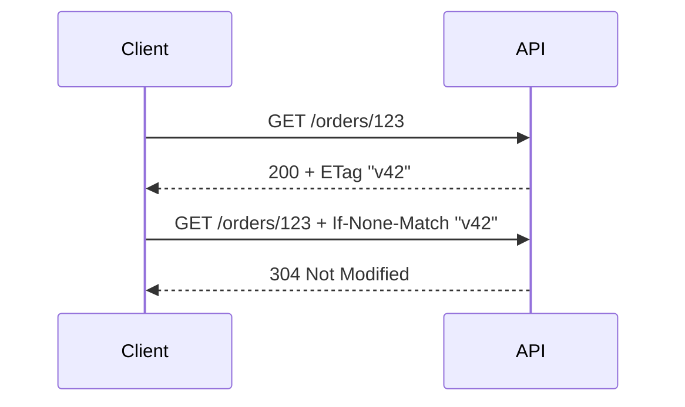

# 10- HTTP Fundamentals

## Overview

HTTP (Hypertext Transfer Protocol) is the application-layer protocol that enables communication between clients and servers across the web and many internal backend systems.

For Python backend engineering, HTTP is the foundation for:

- REST APIs;
- web applications;
- service-to-service communication;
- webhooks;
- authentication flows;
- API gateways;
- reverse proxies;
- health checks;
- external integrations.

A typical request path is:

```text
Client
  ↓
DNS
  ↓
Load Balancer / Nginx
  ↓
API Gateway
  ↓
FastAPI / Django
  ↓
Application Services
  ↓
PostgreSQL / Redis / Kafka / External APIs
  ↓
HTTP Response
```

Understanding HTTP at the protocol level is important because frameworks such as FastAPI and Django abstract many details, but production failures often occur at those underlying boundaries.

---

## HTTP Architecture

HTTP is an application-layer protocol.

A simplified networking stack is:

```text
Application
    HTTP
     ↓
   TLS
     ↓
   TCP
     ↓
    IP
     ↓
 Ethernet / Wi-Fi
```

With HTTP/3, the transport layer differs:

```text
Application
    HTTP/3
      ↓
     QUIC
      ↓
      UDP
      ↓
      IP
```

The HTTP specification defines semantics such as:

- methods;
- status codes;
- headers;
- request and response messages;
- caching;
- content negotiation;
- authentication mechanisms;
- connection behavior.

It does not itself define application business logic.

---

## HTTP Versions

The major versions encountered in modern backend systems are:

| Version | Transport | Important characteristics |
|---|---|---|
| HTTP/1.0 | TCP | Basic request/response |
| HTTP/1.1 | TCP | Persistent connections, chunked transfer, standard modern baseline |
| HTTP/2 | TCP + TLS commonly | Multiplexed streams, binary framing, header compression |
| HTTP/3 | QUIC over UDP | Stream multiplexing without TCP head-of-line blocking |

HTTP semantics remain largely consistent across versions while the wire-level transport and framing mechanisms differ.

---

## HTTP Request

A conceptual HTTP request contains:

```text
Request Line
Headers
Blank Line
Optional Body
```

Example:

```http
POST /api/v1/orders HTTP/1.1
Host: api.example.com
Content-Type: application/json
Authorization: Bearer <token>
Accept: application/json

{
  "product_id": "prod_123",
  "quantity": 2
}
```

The request contains:

| Component | Example | Purpose |
|---|---|---|
| Method | `POST` | Requested operation |
| Target | `/api/v1/orders` | Resource/endpoint |
| HTTP version | `HTTP/1.1` | Protocol version |
| Headers | `Content-Type` | Metadata |
| Body | JSON | Request payload |

---

## HTTP Response

A response contains:

```text
Status Line
Headers
Blank Line
Optional Body
```

Example:

```http
HTTP/1.1 201 Created
Content-Type: application/json
Location: /api/v1/orders/ord_123

{
  "id": "ord_123",
  "status": "created"
}
```

The response communicates:

- whether the operation succeeded;
- the result;
- metadata;
- caching behavior;
- content type;
- authentication challenges;
- connection behavior.

---

## Request-Response Lifecycle

A simplified production request flow is:



Each boundary can introduce:

- latency;
- timeouts;
- retries;
- connection failures;
- security controls;
- buffering.

---

## HTTP Methods

HTTP methods describe the intended operation.

| Method | Typical meaning | Safe | Idempotent |
|---|---|---:|---:|
| `GET` | Retrieve resource | Yes | Yes |
| `HEAD` | Retrieve headers only | Yes | Yes |
| `POST` | Create/process operation | No | No* |
| `PUT` | Replace resource | No | Yes |
| `PATCH` | Partially modify resource | No | Not inherently |
| `DELETE` | Remove resource | No | Yes |
| `OPTIONS` | Discover supported operations | Yes | Yes |

`POST` can be made effectively idempotent for a specific API operation using an idempotency key, but the method itself is not inherently idempotent.

---

## Safe Methods

A method is considered safe when the request is intended to be read-only from the client's perspective.

Examples:

```http
GET /orders/123
```

and:

```http
HEAD /orders/123
```

A safe method can still cause server-side effects such as logging, metrics, cache activity, or audit instrumentation.

"Safe" does not mean "has absolutely no side effects."

---

## Idempotency

An operation is idempotent when repeating the same request has the same intended effect as executing it once.

For example:

```http
PUT /users/123
```

with:

```json
{
  "name": "Alice"
}
```

can be idempotent because repeating it leaves the resource in the same state.

This matters for retries.

```text
Client
  ↓
POST /payments
  ↓
Network timeout
  ↓
Did server process it?
  ↓
Retry?
```

Without idempotency protection, a payment could potentially be processed twice.

---

## Idempotency Keys

For operations that must tolerate retries, an API can accept an idempotency key:

```http
POST /payments
Idempotency-Key: 7b3f...
```

The server can associate:

```text
idempotency_key
        ↓
operation result
```

with a durable store such as PostgreSQL or Redis, depending on correctness and consistency requirements.

A robust implementation must define:

- key scope;
- expiration;
- request fingerprinting;
- concurrent duplicate requests;
- result reuse;
- failure semantics.

---

## HTTP Status Codes

Status codes communicate the outcome of a request.

| Class | Range | Meaning |
|---|---:|---|
| `1xx` | 100–199 | Informational |
| `2xx` | 200–299 | Success |
| `3xx` | 300–399 | Redirection |
| `4xx` | 400–499 | Client/request error |
| `5xx` | 500–599 | Server-side failure |

Common backend codes:

| Code | Meaning | Typical usage |
|---|---|---|
| `200` | OK | Successful retrieval/update |
| `201` | Created | Resource created |
| `202` | Accepted | Work accepted for asynchronous processing |
| `204` | No Content | Successful operation with no response body |
| `301` | Permanent Redirect | Resource permanently moved |
| `304` | Not Modified | Conditional request cache validation |
| `400` | Bad Request | Invalid request syntax/input |
| `401` | Unauthorized | Authentication required/failed |
| `403` | Forbidden | Authenticated but not permitted |
| `404` | Not Found | Resource unavailable |
| `409` | Conflict | State conflict |
| `422` | Unprocessable Content | Semantically invalid input |
| `429` | Too Many Requests | Rate limiting |
| `500` | Internal Server Error | Unexpected server failure |
| `502` | Bad Gateway | Proxy received invalid upstream response |
| `503` | Service Unavailable | Temporary service unavailability |
| `504` | Gateway Timeout | Upstream timeout |

Status code selection should reflect API semantics rather than simply mapping every failure to `400` or `500`.

---

## `401` vs `403`

A common distinction is:

```text
401 → authentication is missing or invalid
403 → authentication exists, but authorization fails
```

For example:

```text
No valid access token
    → 401

Valid token, insufficient permissions
    → 403
```

Authentication and authorization should remain separate concepts.

---

## `404` vs `403`

Whether to return `404` instead of `403` can depend on security requirements.

For sensitive resources, returning:

```http
404 Not Found
```

can avoid revealing that a resource exists.

This should be a deliberate API security decision rather than an accidental implementation detail.

---

## Request Headers

Headers carry metadata.

Common request headers include:

```text
Host
Authorization
Accept
Content-Type
User-Agent
Cache-Control
If-None-Match
If-Modified-Since
Accept-Encoding
Origin
```

Example:

```http
Accept: application/json
Content-Type: application/json
Authorization: Bearer <token>
```

Headers should carry metadata rather than application payloads that belong in the request body.

---

## Response Headers

Common response headers include:

```text
Content-Type
Content-Length
Cache-Control
ETag
Location
Retry-After
Set-Cookie
Vary
Content-Encoding
```

Example:

```http
HTTP/1.1 429 Too Many Requests
Retry-After: 10
Content-Type: application/json
```

The header tells the client how to interpret the response and what it should do next.

---

## Content-Type

`Content-Type` describes the representation being sent.

Example:

```http
Content-Type: application/json
```

Other examples:

```text
text/plain
text/html
application/octet-stream
application/problem+json
multipart/form-data
application/x-www-form-urlencoded
```

The server should validate and process request bodies according to the declared and supported content type.

---

## Accept

`Accept` communicates which response representations the client can handle.

Example:

```http
Accept: application/json
```

This differs from:

```http
Content-Type: application/json
```

because:

```text
Content-Type → representation being sent
Accept       → representation the client wants
```

---

## Content Negotiation

A client can request a preferred representation:

```http
GET /orders/123
Accept: application/json
```

The server chooses an appropriate representation.

Other negotiation headers include:

```text
Accept-Encoding
Accept-Language
Accept
```

Compression negotiation is particularly important for API performance.

---

## JSON APIs

Modern Python APIs commonly use JSON.

Request:

```http
POST /orders
Content-Type: application/json

{
  "product_id": "prod_123",
  "quantity": 2
}
```

Response:

```http
HTTP/1.1 201 Created
Content-Type: application/json

{
  "id": "ord_123",
  "status": "created"
}
```

JSON is convenient but has serialization and parsing costs.

Large payloads should be avoided when a smaller representation is sufficient.

---

## Request Body

HTTP does not require every request to have a body.

Examples:

```text
GET     → usually no body
DELETE  → commonly no body
POST    → commonly has body
PUT     → commonly has body
PATCH   → commonly has body
```

Whether a body is meaningful depends on the method and application protocol.

Do not rely on unusual method/body combinations without verifying client, proxy, and framework behavior.

---

## URL Structure

A URL commonly contains:

```text
scheme://host:port/path?query#fragment
```

Example:

```text
https://api.example.com:443/orders/123?expand=items
```

Components:

| Component | Example |
|---|---|
| Scheme | `https` |
| Host | `api.example.com` |
| Port | `443` |
| Path | `/orders/123` |
| Query | `expand=items` |
| Fragment | `#section` |

Fragments are client-side and are generally not sent to the HTTP server.

---

## Paths and Resources

REST-style APIs commonly model resources:

```text
GET    /orders
GET    /orders/{order_id}
POST   /orders
PUT    /orders/{order_id}
PATCH  /orders/{order_id}
DELETE /orders/{order_id}
```

Avoid unnecessarily action-oriented paths:

```text
POST /createOrder
POST /deleteOrder
```

when resource semantics are sufficient.

Action endpoints can still be appropriate for operations that are not naturally represented as CRUD.

---

## Query Parameters

Query parameters commonly control:

- filtering;
- sorting;
- pagination;
- field selection;
- search.

Example:

```http
GET /orders?status=paid&limit=50&cursor=abc123
```

Do not use query parameters for sensitive secrets.

URLs can be stored in:

- browser history;
- reverse-proxy logs;
- access logs;
- analytics systems;
- tracing systems.

---

## URL Encoding

Reserved characters must be encoded correctly.

For example:

```text
hello world
```

may be represented as:

```text
hello%20world
```

Python provides standard URL utilities:

```python
from urllib.parse import urlencode

query = urlencode({
    "search": "order status",
    "limit": 20,
})

print(query)
```

Do not manually concatenate arbitrary user input into URLs.

---

## HTTP Cookies

Cookies allow servers to associate browser requests with state.

Example:

```http
Set-Cookie: session_id=abc123; Secure; HttpOnly; SameSite=Lax
```

Important attributes include:

| Attribute | Purpose |
|---|---|
| `Secure` | Send over secure transport |
| `HttpOnly` | Prevent JavaScript access |
| `SameSite` | Controls cross-site sending |
| `Domain` | Cookie scope |
| `Path` | Request path scope |
| `Max-Age` | Lifetime |

Cookie-based authentication requires careful CSRF and session security design.

---

## Authentication

HTTP itself provides mechanisms that applications can use for authentication, but most modern APIs implement authentication at the application layer.

Common patterns include:

```text
Session cookies
Bearer tokens
OAuth 2.0
OpenID Connect
API keys
Mutual TLS
```

Example:

```http
Authorization: Bearer <access-token>
```

Never log the complete authorization header.

---

## Authorization

Authentication answers:

```text
Who are you?
```

Authorization answers:

```text
What are you allowed to do?
```

Example:

```text
Authenticated user
      ↓
Authorization check
      ↓
Can user refund order?
```

HTTP status `403` commonly represents an authorization failure.

---

## HTTPS

HTTPS is HTTP carried over TLS.

Conceptually:

```text
Client
  ↓
TLS handshake
  ↓
Encrypted HTTP
  ↓
Server
```

TLS provides:

- confidentiality;
- integrity;
- server authentication through certificates.

Production APIs should use HTTPS.

---

## TLS Termination

TLS may terminate at a reverse proxy or load balancer:

```text
Client
  │ HTTPS
  ↓
Load Balancer / Nginx
  │ HTTP or HTTPS
  ↓
Python Application
```

If traffic between the proxy and application crosses an untrusted network, internal TLS may still be required.

The architecture should explicitly define trusted network boundaries.

---

## HTTP Keep-Alive

Creating a new TCP/TLS connection for every request is expensive.

Persistent connections allow:

```text
TCP connection
    ↓
Request 1
    ↓
Response 1
    ↓
Request 2
    ↓
Response 2
```

rather than reconnecting each time.

Connection reuse reduces:

- handshake overhead;
- latency;
- CPU;
- connection churn.

HTTP/1.1 generally supports persistent connections by default unless connection semantics indicate otherwise.

---

## HTTP/1.1 Head-of-Line Effects

HTTP/1.1 can reuse connections, but request concurrency has limitations.

Pipelining is not widely used in modern browsers and many clients instead use multiple connections.

HTTP/2 improves this with multiplexed streams:

```text
One TCP connection
 ├── Request A
 ├── Request B
 ├── Request C
 └── Request D
```

However, HTTP/2 still operates over TCP, so packet loss can affect multiple streams.

---

## HTTP/2

HTTP/2 introduces binary framing and multiplexing.

Conceptually:

```text
One TCP connection
       │
       ├── Stream 1
       ├── Stream 3
       ├── Stream 5
       └── Stream 7
```

Advantages include:

- multiplexing;
- header compression;
- fewer connections;
- efficient concurrent requests.

The application semantics remain HTTP.

---

## HTTP/3

HTTP/3 uses QUIC:

```text
HTTP/3
  ↓
QUIC
  ↓
UDP
```

QUIC provides stream multiplexing without TCP's connection-level head-of-line blocking.

HTTP/3 can be useful for environments with:

- variable networks;
- mobile clients;
- high connection churn;
- packet loss.

The backend application typically does not need to change its HTTP semantics.

---

## Timeouts

Every network operation should have explicit timeouts.

Important timeout categories include:

```text
DNS timeout
TCP connect timeout
TLS handshake timeout
Request/write timeout
Response/read timeout
Overall deadline
```

Avoid:

```python
timeout = None
```

for production external calls unless there is a carefully designed reason.

An indefinitely blocked request can consume:

- worker capacity;
- connections;
- memory;
- queue slots.

---

## Client Timeout Example

Using `httpx`:

```python
import httpx


timeout = httpx.Timeout(
    connect=2.0,
    read=5.0,
    write=5.0,
    pool=2.0,
)

with httpx.Client(timeout=timeout) as client:
    response = client.get(
        "https://api.example.com/orders/123",
    )
    response.raise_for_status()
```

Timeout values should reflect the actual dependency and end-to-end latency budget.

---

## Deadlines

A distributed request often has an overall latency budget.

Example:

```text
Client deadline = 2 seconds

API
 ├── authentication = 100 ms
 ├── PostgreSQL = 300 ms
 └── payment API = 800 ms
```

If every downstream service independently allows 5 seconds, the overall system can exceed the client's expected deadline.

Propagate deadlines where supported and design timeout budgets across service boundaries.

---

## Retries

Retries can improve resilience against transient failures.

But retries can also amplify load:

```text
Dependency slows
    ↓
Requests timeout
    ↓
Clients retry
    ↓
More traffic
    ↓
Dependency slows further
```

Use:

- bounded retries;
- exponential backoff;
- jitter;
- idempotency;
- retryable-error classification.

Do not blindly retry every HTTP status.

---

## Common Retry Semantics

A rough classification:

| Response | Often retryable? |
|---|---|
| `400` | No |
| `401` | Usually no |
| `403` | Usually no |
| `404` | Usually no |
| `409` | Depends |
| `429` | Often, respecting `Retry-After` |
| `500` | Sometimes |
| `502` | Often |
| `503` | Often |
| `504` | Often |

Actual behavior depends on the operation and dependency contract.

---

## `Retry-After`

A server can tell clients when to retry:

```http
HTTP/1.1 429 Too Many Requests
Retry-After: 10
```

Clients should respect the server's retry guidance where appropriate.

---

## Rate Limiting

Rate limiting protects services from excessive traffic.

Common strategies include:

```text
Token bucket
Leaky bucket
Fixed window
Sliding window
Concurrency limits
```

A rate-limited response commonly uses:

```http
429 Too Many Requests
```

A production API should define whether limits apply per:

- IP;
- user;
- API key;
- tenant;
- endpoint;
- service identity.

---

## Request Size Limits

HTTP requests can contain arbitrarily large bodies unless constrained by the server or infrastructure.

Set reasonable limits for:

```text
JSON payloads
multipart uploads
headers
URLs
file uploads
```

Large unbounded requests can become a denial-of-service vector.

Nginx, load balancers, API gateways, and application frameworks may all have relevant limits.

---

## Response Size

The same principle applies to responses.

Avoid returning:

```text
10 million database rows
```

through one HTTP response.

Prefer:

```text
pagination
streaming
asynchronous export
object storage
```

depending on the use case.

---

## Pagination

Offset pagination:

```http
GET /orders?limit=50&offset=1000
```

is simple but can become expensive for large changing datasets.

Keyset/cursor pagination:

```http
GET /orders?limit=50&cursor=eyJpZCI6...
```

can provide more stable performance for large datasets.

HTTP itself does not mandate a pagination strategy; the API defines the contract.

---

## Caching

HTTP provides cache semantics through headers.

Example:

```http
Cache-Control: max-age=60
ETag: "abc123"
```

The client can make a conditional request:

```http
If-None-Match: "abc123"
```

The server may return:

```http
304 Not Modified
```

without retransmitting the representation.

---

## Cache-Control

Examples:

```http
Cache-Control: no-store
```

for sensitive non-cacheable responses.

Or:

```http
Cache-Control: public, max-age=300
```

for content that can be cached for five minutes.

Caching policy must account for:

- freshness;
- privacy;
- invalidation;
- authorization;
- shared vs private caches.

---

## ETag

An ETag identifies a representation version.

Example:

```http
ETag: "order-v42"
```

A client can send:

```http
If-None-Match: "order-v42"
```

If unchanged:

```http
304 Not Modified
```

ETags can reduce bandwidth and response generation costs.

---

## Conditional Requests

A common flow is:



The client can reuse its cached representation.

---

## HTTP Caching vs Redis

These are different layers.

```text
Browser / CDN / HTTP cache
        ↓
HTTP representation

Redis
        ↓
Application data/cache
```

HTTP caching can prevent requests from reaching the application at all.

Redis caching occurs inside or around the application.

Use the appropriate layer for the problem.

---

## Content Compression

HTTP supports response compression.

Common algorithms include:

```text
gzip
br (Brotli)
zstd
```

Clients can advertise support:

```http
Accept-Encoding: gzip, br
```

The server may respond:

```http
Content-Encoding: br
```

Compression can reduce network bandwidth but consumes CPU.

Do not compress data blindly when payloads are already compressed.

---

## Chunked Transfer

HTTP/1.1 can stream a response using chunked transfer encoding when the final size is not known in advance.

This can support:

```text
Generate data
    ↓
Send chunk
    ↓
Generate next chunk
    ↓
Send chunk
```

This is useful for streaming responses, but proxies may buffer responses and reduce the practical benefit.

---

## Streaming APIs

FastAPI can stream responses:

```python
from collections.abc import AsyncIterator

from fastapi.responses import StreamingResponse


async def generate_events() -> AsyncIterator[str]:
    for event in events():
        yield f"{event}\n"


@app.get("/events")
async def events_endpoint() -> StreamingResponse:
    return StreamingResponse(
        generate_events(),
        media_type="text/event-stream",
    )
```

Streaming is useful for:

- large exports;
- server-sent events;
- incremental results.

It requires end-to-end consideration of buffering, timeouts, cancellation, and resource lifetime.

---

## Server-Sent Events

SSE uses HTTP for one-way server-to-client event streams.

Conceptually:

```text
Client
  │
  │ GET /events
  ↓
Server
  │
  ├── event 1
  ├── event 2
  ├── event 3
  └── event 4
```

The response commonly uses:

```http
Content-Type: text/event-stream
```

SSE is appropriate when clients need server-to-browser event delivery without bidirectional communication.

---

## WebSockets vs HTTP

WebSockets provide a persistent bidirectional channel.

| Technology | Communication | Typical use |
|---|---|---|
| HTTP request/response | Request-response | REST APIs |
| SSE | Server → client | Live updates |
| WebSocket | Bidirectional | Chat, collaborative systems |
| gRPC streaming | Bidirectional/streaming | Service-to-service communication |

Choose based on communication requirements rather than popularity.

---

## HTTP Redirects

Common redirect codes include:

```text
301
302
303
307
308
```

`307` and `308` preserve the request method and body semantics during redirect, while historical `301`/`302` behavior has compatibility nuances across clients.

Use redirects deliberately, especially for non-GET requests.

---

## HTTP Cookies and CSRF

Cookie-based authentication introduces CSRF considerations because browsers automatically attach cookies to matching requests.

Typical defenses include:

```text
SameSite cookies
CSRF tokens
Origin validation
appropriate CORS policy
```

Bearer tokens stored and transmitted differently have different threat models.

Do not treat "using HTTPS" as a complete CSRF defense.

---

## CORS

Cross-Origin Resource Sharing controls which browser origins may access a resource through browser-enforced cross-origin rules.

Example:

```http
Origin: https://app.example.com
```

The server may respond:

```http
Access-Control-Allow-Origin: https://app.example.com
```

CORS is primarily a browser security mechanism.

It does not prevent arbitrary non-browser clients from sending HTTP requests to the server.

---

## CORS and Credentials

Credentialed browser requests require careful configuration.

Avoid broad combinations such as:

```text
allow all origins
+
allow credentials
```

unless the exact behavior is supported and intentionally configured.

Prefer explicit trusted origins.

---

## HTTP Security Headers

Depending on the application, useful response headers include:

```text
Strict-Transport-Security
Content-Security-Policy
X-Content-Type-Options
Referrer-Policy
Permissions-Policy
```

The appropriate set depends on whether the service serves browsers, APIs, or both.

---

## HTTP Authentication Header

The standard authorization header is:

```http
Authorization: Bearer <token>
```

Do not:

- log it;
- include it in URLs;
- expose it in error responses;
- store it unnecessarily.

Access tokens should have appropriate expiration and scope.

---

## HTTP and Proxies

Production traffic frequently crosses proxies:

```text
Client
  ↓
CDN
  ↓
Load Balancer
  ↓
Nginx
  ↓
Application
```

Each proxy can affect:

- headers;
- client IP information;
- TLS termination;
- timeouts;
- body limits;
- buffering;
- compression;
- connection reuse.

Application code must not blindly trust forwarding headers from untrusted clients.

---

## Forwarded Headers

Common headers include:

```text
X-Forwarded-For
X-Forwarded-Proto
X-Forwarded-Host
Forwarded
```

They can communicate original request information through trusted proxies.

Example:

```text
Client HTTPS
    ↓
Load Balancer
    ↓
HTTP internal connection
    ↓
Python
```

The application may need trusted proxy configuration to correctly understand the original scheme.

---

## Client IP Addresses

A naive implementation:

```python
request.client.host
```

may identify the immediate proxy rather than the original client.

Forwarded client IP information should only be trusted when it comes from a known, trusted proxy path.

Never trust arbitrary `X-Forwarded-For` values from public clients for security decisions.

---

## Host Header

HTTP requests contain a host target:

```http
Host: api.example.com
```

Host validation matters because applications may use host information to:

- generate URLs;
- select tenants;
- construct redirects;
- determine security policy.

Do not blindly use arbitrary Host headers in security-sensitive URL generation.

---

## HTTP Request Smuggling

Request smuggling can occur when different HTTP components disagree about request framing.

For example:

```text
Client
  ↓
Proxy interprets request one way
  ↓
Backend interprets request differently
```

This can create security vulnerabilities.

Keep Nginx, load balancers, frameworks, and HTTP libraries patched and configured consistently.

Avoid unusual transfer-encoding combinations and rely on well-tested infrastructure components.

---

## HTTP Parsing

HTTP parsing is normally handled by:

```text
Browser/client
   ↓
Nginx/load balancer
   ↓
ASGI/WSGI server
   ↓
FastAPI/Django
```

Application developers should avoid implementing HTTP parsing manually unless building specialized infrastructure.

---

## ASGI and WSGI

Python web frameworks interact with HTTP through server interfaces.

### WSGI

Traditional synchronous Python web interface:

```text
HTTP Server
    ↓
WSGI
    ↓
Django / Flask
```

### ASGI

Modern interface supporting asynchronous workloads:

```text
HTTP Server
    ↓
ASGI
    ↓
FastAPI / Django
```

ASGI can support:

- async request handlers;
- WebSockets;
- long-lived connections;
- asynchronous middleware.

---

## FastAPI Request Processing

A simplified flow:

```text
HTTP request
    ↓
ASGI server
    ↓
FastAPI middleware
    ↓
Routing
    ↓
Dependency injection
    ↓
Request validation
    ↓
Endpoint
    ↓
Response serialization
    ↓
ASGI response
```

Understanding this lifecycle helps identify where to implement:

- authentication;
- correlation IDs;
- validation;
- metrics;
- exception handling;
- request logging.

---

## Django Request Processing

A simplified flow:

```text
HTTP request
    ↓
Web server
    ↓
WSGI/ASGI
    ↓
Django middleware
    ↓
URL routing
    ↓
View
    ↓
ORM / services
    ↓
Response
    ↓
Middleware
    ↓
HTTP response
```

Middleware is useful for cross-cutting concerns such as:

- authentication;
- security headers;
- logging;
- request IDs;
- metrics.

---

## HTTP and PostgreSQL

An HTTP request often maps to database work:

```text
POST /orders
    ↓
FastAPI
    ↓
Validate request
    ↓
PostgreSQL transaction
    ↓
Commit
    ↓
201 Created
```

The database operation should not be assumed to have succeeded merely because the HTTP request was received.

Correct error handling must distinguish:

```text
request accepted
database committed
response delivered
```

These are separate events.

---

## HTTP and Redis

Redis may support:

```text
rate limiting
session storage
caching
distributed locks
idempotency records
```

For example:

```text
HTTP request
    ↓
Rate-limit check in Redis
    ↓
Application
    ↓
Response
```

Redis should not be treated as a substitute for durable database state unless the specific data model and durability requirements justify it.

---

## HTTP and Kafka

HTTP and Kafka often interact asynchronously:

```text
Client
  ↓
POST /orders
  ↓
API
  ↓
PostgreSQL
  ↓
Outbox
  ↓
Kafka
  ↓
Consumers
```

A `202 Accepted` response may be appropriate when an API accepts work for asynchronous processing.

Do not return `202` simply because the implementation is slow; the API contract should explicitly define asynchronous semantics.

---

## HTTP and Celery

Long-running operations can be moved out of the request path:

```text
HTTP request
    ↓
Validate
    ↓
Create job
    ↓
Celery
    ↓
Background processing
```

The API might return:

```http
202 Accepted
```

with a job identifier:

```json
{
  "job_id": "job_123",
  "status": "pending"
}
```

Clients can then query job state.

---

## HTTP Connection Pools

HTTP clients should reuse connections.

For example:

```python
import httpx

with httpx.Client(
    base_url="https://payment.example.com",
    timeout=5.0,
) as client:
    response = client.get("/health")
```

Creating a new client for every request can prevent effective connection reuse.

For long-lived applications, create clients with an appropriate lifecycle and close them during shutdown.

---

## Async HTTP Clients

For asyncio services:

```python
import httpx


async with httpx.AsyncClient(
    timeout=5.0,
) as client:
    response = await client.get(
        "https://payment.example.com/health",
    )
```

Do not use blocking HTTP clients inside async request handlers.

Blocking network calls can stall the event loop.

---

## HTTP Connection Pool Sizing

Connection pools should account for:

```text
concurrent requests
+
downstream latency
+
number of worker processes
+
number of replicas
```

Too small:

```text
requests wait for connections
```

Too large:

```text
too many downstream connections
```

Pool size is a capacity-planning decision, not merely a client-library setting.

---

## HTTP Backpressure

Backpressure prevents the application from accepting more work than it can process.

Example:

```text
Traffic spike
    ↓
Concurrency limit
    ↓
Queue / reject
    ↓
System remains stable
```

Without backpressure:

```text
More requests
    ↓
More concurrent downstream calls
    ↓
More memory
    ↓
More connections
    ↓
Timeouts
    ↓
Retries
    ↓
Cascading failure
```

---

## Graceful HTTP Shutdown

During deployment:

```text
Kubernetes sends termination signal
        ↓
Stop accepting new work
        ↓
Mark readiness false
        ↓
Drain active requests
        ↓
Close HTTP clients / DB pools
        ↓
Exit
```

Graceful shutdown prevents requests from being terminated unnecessarily during rolling deployments.

---

## HTTP Observability

At minimum, monitor:

```text
request rate
error rate
latency
status-code distribution
request size
response size
timeouts
connection failures
```

A common metric model is:

```text
RED
R = Rate
E = Errors
D = Duration
```

For example:

```text
http_requests_total
http_request_duration_seconds
http_requests_failed_total
```

Logs and traces provide deeper context.

---

## HTTP Logging

Useful structured fields include:

```text
method
route
status_code
duration_ms
request_id
trace_id
response_size
```

Avoid logging:

```text
Authorization header
cookies
full request body
full response body
```

unless there is an explicit and secure diagnostic requirement.

---

## HTTP Error Handling

APIs should provide consistent error representations.

For example:

```json
{
  "type": "https://api.example.com/problems/validation-error",
  "title": "Validation failed",
  "status": 422,
  "detail": "One or more fields are invalid",
  "instance": "/orders"
}
```

A standardized problem representation can make clients easier to implement.

Do not expose internal stack traces or database errors to clients.

---

## Error Correlation

A production error response can include:

```json
{
  "error": "internal_server_error",
  "request_id": "req_123"
}
```

The client receives a safe identifier.

Engineers can search:

```text
request_id=req_123
```

in centralized logs and traces.

---

## HTTP and Retries Across Layers

Beware of retry multiplication.

For example:

```text
Client retries 3 times
    ×
API retries 3 times
    ×
HTTP client retries 3 times
```

Potentially:

```text
3 × 3 × 3 = 27 downstream attempts
```

Define retry ownership explicitly.

---

## HTTP and Load Balancing

A load balancer distributes HTTP requests:

```text
                 Load Balancer
                /      |      \
               ↓       ↓       ↓
             Pod A   Pod B   Pod C
```

For stateless services, any replica should generally be able to process a request.

If sessions are stored only in process memory:

```text
Request 1 → Pod A
Request 2 → Pod B
```

state may be lost unless sticky sessions or shared storage is used.

Prefer shared state such as Redis or database-backed sessions when appropriate.

---

## HTTP and Stateless Services

A stateless API does not depend on a particular application instance retaining request state between requests.

This enables:

- horizontal scaling;
- simpler failover;
- rolling deployments;
- easier Kubernetes scheduling.

Stateless does not mean the system has no state. State should be stored in appropriate shared systems.

---

## HTTP Caching and CDNs

A CDN can terminate or cache HTTP traffic before it reaches the origin:

```text
Client
  ↓
CDN
  ├── cache hit → response
  │
  └── cache miss
          ↓
       Origin
          ↓
      Python API
```

This can reduce:

- origin traffic;
- latency;
- bandwidth;
- application compute.

Caching must be designed carefully for personalized or authorization-sensitive content.

---

## HTTP Security Checklist

- [ ] Use HTTPS.
- [ ] Validate request bodies.
- [ ] Enforce request size limits.
- [ ] Set explicit timeouts.
- [ ] Validate authentication.
- [ ] Perform authorization checks.
- [ ] Protect cookie-based authentication against CSRF.
- [ ] Configure CORS explicitly.
- [ ] Avoid secrets in URLs.
- [ ] Do not trust arbitrary forwarding headers.
- [ ] Avoid leaking internal exceptions.
- [ ] Apply rate limits where appropriate.
- [ ] Keep HTTP infrastructure patched.
- [ ] Protect against request smuggling through consistent proxy/server configuration.

---

## Performance Considerations

HTTP performance is influenced by:

```text
DNS
+
TCP/TLS handshake
+
connection reuse
+
request serialization
+
server processing
+
database latency
+
downstream services
+
response serialization
+
network transfer
```

Optimization should therefore consider the entire request path.

Useful measurements include:

```text
p50 latency
p95 latency
p99 latency
requests/sec
connection pool utilization
timeout rate
response size
```

---

## Latency Budget

For a 500 ms target:

```text
API total budget = 500 ms

Authentication     50 ms
PostgreSQL        100 ms
Redis              20 ms
External API      150 ms
Serialization      30 ms
Network / margin  150 ms
```

The exact allocation depends on the system.

The important principle is that downstream calls consume the same end-to-end latency budget.

---

## Availability and HTTP

Availability depends on more than application process uptime.

Consider:

```text
DNS
 ↓
CDN / Load Balancer
 ↓
Nginx
 ↓
Python service
 ↓
PostgreSQL
 ↓
Redis
 ↓
External dependencies
```

A highly available API requires appropriate redundancy and failure handling across the entire request path.

---

## Disaster Recovery

HTTP services should define behavior during dependency outages.

For example:

```text
PostgreSQL unavailable
        ↓
API cannot create orders
        ↓
503 Service Unavailable
```

rather than:

```text
Database unavailable
        ↓
5-minute request timeout
        ↓
500 response
```

Timeouts and failure status codes should communicate temporary service unavailability appropriately.

---

## Common Mistakes

### Using `GET` for State-Changing Operations

Avoid:

```http
GET /delete-order?id=123
```

because safe methods can be triggered unexpectedly by crawlers, caches, or prefetching systems.

### Confusing `401` and `403`

Authentication and authorization are different concerns.

### No Request Timeout

An indefinitely waiting request can consume scarce worker and connection resources.

### Retrying Every Failure

Some failures are permanent and retries can amplify load.

### Logging Authorization Headers

Tokens are credentials and should never be logged.

### Trusting `X-Forwarded-For`

Forwarding headers are only trustworthy when inserted by trusted infrastructure.

### Returning Huge Responses

Large responses increase memory, serialization, bandwidth, and latency costs.

### Creating an HTTP Client Per Request

This can prevent connection pooling and increase connection overhead.

### Blocking the Async Event Loop

Using synchronous network clients inside async handlers can stall unrelated requests.

---

## Production Pitfalls

### Retry Storms

A dependency outage can become significantly worse when clients and services retry simultaneously.

Use bounded retries, backoff, jitter, and clear ownership.

### Timeout Mismatch

If an API gateway times out after 10 seconds but the backend waits 60 seconds, backend workers can remain occupied long after clients have disconnected.

### Proxy Buffering

Streaming APIs may not actually stream to clients if an intermediate proxy buffers the response.

### Incorrect CORS Configuration

Overly permissive CORS can expose browser-accessible APIs to unintended origins.

### Unbounded Request Bodies

Attackers can consume memory and bandwidth using oversized payloads.

### Connection Pool Explosion

Across:

```text
replicas × workers × pool_size
```

connection counts can become much larger than expected.

### Inconsistent Proxy Configuration

Different interpretations of HTTP framing can create security vulnerabilities.

---

## Practical FastAPI Example

A production-oriented endpoint should separate:

```text
HTTP layer
    ↓
Validation
    ↓
Application service
    ↓
Infrastructure
```

Example:

```python
from fastapi import FastAPI, HTTPException, status
from pydantic import BaseModel

app = FastAPI()


class CreateOrderRequest(BaseModel):
    product_id: str
    quantity: int


class OrderResponse(BaseModel):
    id: str
    status: str


@app.post(
    "/orders",
    response_model=OrderResponse,
    status_code=status.HTTP_201_CREATED,
)
async def create_order(
    request: CreateOrderRequest,
) -> OrderResponse:
    order = await create_order_service(
        product_id=request.product_id,
        quantity=request.quantity,
    )

    if order is None:
        raise HTTPException(
            status_code=status.HTTP_409_CONFLICT,
            detail="Order could not be created",
        )

    return OrderResponse(
        id=order.id,
        status="created",
    )
```

The HTTP layer handles protocol concerns while the service layer owns business behavior.

---

## HTTP Client Decision Table

| Requirement | Appropriate approach |
|---|---|
| Simple synchronous API call | `httpx.Client` |
| Async API call | `httpx.AsyncClient` |
| Browser API | REST/HTTP |
| Service-to-service typed RPC | gRPC |
| Large response | Streaming/pagination |
| Long-running operation | Async job + `202` |
| Live browser updates | SSE/WebSocket |
| High-volume static content | CDN |
| Internal cache | Redis |
| Durable asynchronous event | Kafka |
| Authentication | OAuth/OIDC/session/token depending on system |

---

## HTTP Testing

Test HTTP behavior at multiple levels.

### Unit Tests

Test application behavior without real networking.

### API Tests

Verify:

```text
method
path
headers
status
response schema
authentication
authorization
```

### Integration Tests

Exercise:

```text
HTTP
+
database
+
Redis
+
external dependency stubs
```

### Load Tests

Measure:

```text
requests/sec
latency
error rate
connection usage
resource consumption
```

### Failure Tests

Test:

```text
timeouts
503 responses
dependency failures
slow downstream services
connection exhaustion
large payloads
client disconnects
```

---

## HTTP Testing Example

With FastAPI and pytest:

```python
from fastapi.testclient import TestClient

from app.main import app


client = TestClient(app)


def test_create_order() -> None:
    response = client.post(
        "/orders",
        json={
            "product_id": "prod_123",
            "quantity": 2,
        },
    )

    assert response.status_code == 201

    body = response.json()

    assert body["status"] == "created"
    assert "id" in body
```

Integration tests should additionally verify database and external dependency behavior where required.

---

## HTTP Operational Checklist

### Protocol

- [ ] HTTP methods are semantically appropriate.
- [ ] Status codes represent actual outcomes.
- [ ] Content types are validated.
- [ ] Request and response schemas are explicit.
- [ ] Idempotency requirements are defined.

### Reliability

- [ ] Client and server timeouts are configured.
- [ ] Retry policies are bounded.
- [ ] Retryable errors are explicitly classified.
- [ ] Idempotency is used for retry-sensitive operations.
- [ ] Backpressure is considered.
- [ ] Graceful shutdown is implemented.

### Performance

- [ ] HTTP connections are reused.
- [ ] Connection pools are sized for deployment scale.
- [ ] Response sizes are controlled.
- [ ] Compression is used where appropriate.
- [ ] Pagination or streaming is used for large datasets.
- [ ] p50/p95/p99 latency is monitored.

### Security

- [ ] HTTPS is enforced.
- [ ] Authentication and authorization are separated.
- [ ] Secrets are not placed in URLs or logs.
- [ ] Request sizes are limited.
- [ ] CORS is explicitly configured.
- [ ] Forwarded headers are trusted only from known proxies.
- [ ] Security headers are configured where applicable.

### Operations

- [ ] Request IDs or trace IDs are available.
- [ ] Structured logs are emitted.
- [ ] Metrics capture rate, errors, and duration.
- [ ] Distributed tracing is available where useful.
- [ ] Dependency failures have explicit HTTP behavior.
- [ ] Deployment and shutdown behavior is observable.

## Interview Traps

### Is HTTP Stateful or Stateless?

HTTP itself defines a request/response protocol and does not require server-side session state. Applications can maintain state using cookies, sessions, databases, tokens, or other mechanisms.

### What Is the Difference Between `PUT` and `PATCH`?

`PUT` generally represents replacement of a resource representation, while `PATCH` represents partial modification. `PUT` is defined as idempotent; `PATCH` is not inherently idempotent.

### What Is the Difference Between `401` and `403`?

`401` indicates missing or invalid authentication credentials, while `403` indicates that the request is understood but the authenticated principal is not permitted to perform the operation.

### Why Are Timeouts Necessary?

Without timeouts, blocked network operations can consume workers, connections, memory, and queues indefinitely, eventually causing cascading failures.

### Why Is `POST` Not Idempotent?

Repeated `POST` requests can create repeated effects. APIs can introduce application-level idempotency keys when an operation must safely tolerate retries.

### What Is the Difference Between `Content-Type` and `Accept`?

`Content-Type` describes the representation being sent. `Accept` describes representations the client is willing to receive.

### Why Use `429`?

`429 Too Many Requests` communicates that the client has exceeded a defined request rate or concurrency limit.

### Why Is `202 Accepted` Different From `200 OK`?

`202` can indicate that the server accepted work for processing but has not completed the requested operation. It is appropriate for explicitly asynchronous workflows.

### Why Can Retries Make an Outage Worse?

Retries add traffic precisely when a dependency is already unhealthy. Without bounded attempts, backoff, jitter, and idempotency, retries can create a feedback loop and cascading failure.

### Why Is Connection Pooling Important?

TCP and TLS connection establishment has cost. Reusing connections reduces handshake overhead and latency, but pool sizes must be bounded against total replicas, workers, and downstream capacity.

### Does CORS Protect an API From Non-Browser Clients?

No. CORS is primarily enforced by browsers. API security must rely on authentication, authorization, network controls, and application-level validation.

### Why Should `X-Forwarded-For` Not Be Trusted Blindly?

Clients can forge forwarding headers unless the application knows that the value was inserted by a trusted proxy. Trust boundaries must be explicitly configured.

### What Is the Difference Between HTTP/2 and HTTP/3?

HTTP/2 uses TCP and introduces multiplexed streams and binary framing. HTTP/3 uses QUIC over UDP and provides stream multiplexing without TCP's connection-level head-of-line blocking.

## Key Takeaways

- **HTTP is more than request/response syntax:** methods, status codes, headers, caching, idempotency, connection management, timeouts, and failure semantics directly affect backend correctness.
- **Design HTTP APIs for distributed failure:** use explicit timeouts, bounded retries, backoff, idempotency, rate limiting, pagination, and backpressure to prevent cascading failures.
- **Treat HTTP as an end-to-end system:** DNS, TLS, load balancers, Nginx, FastAPI/Django, databases, Redis, Kafka, external services, and connection pools all participate in request behavior.
- **Security belongs at every HTTP boundary:** enforce HTTPS, validate authentication and authorization, control CORS and forwarded headers, limit request sizes, and never expose credentials through URLs, logs, or errors.
- **Operate HTTP with observability:** correlate requests with logs and traces, measure rate/errors/latency, monitor connection and timeout behavior, and design graceful startup and shutdown for scalable deployments.