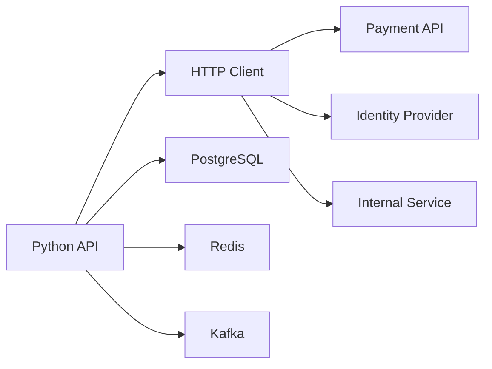

# 11- HTTP Clients

## Overview

An HTTP client is the component responsible for initiating HTTP requests to another HTTP server. In backend systems, HTTP clients are used for:

- service-to-service communication;
- third-party API integrations;
- authentication providers;
- payment providers;
- internal microservices;
- webhooks;
- metadata services;
- health and control-plane APIs.

In Python, common HTTP client choices include:

- `httpx`;
- `requests`;
- framework-specific clients built on top of these libraries.

For modern asynchronous Python services, `httpx.AsyncClient` is a strong general-purpose choice.

A production HTTP client is more than:

```python
response = client.get(url)
```

It must account for:

```text
Connection management
      ↓
DNS / TCP / TLS
      ↓
Timeouts
      ↓
Request
      ↓
Response
      ↓
Status handling
      ↓
Retries
      ↓
Parsing
      ↓
Observability
      ↓
Resource cleanup
```

Poorly designed HTTP clients can become a major source of latency, connection exhaustion, cascading failures, and security problems.

---

## HTTP Client Architecture

A typical backend service may communicate with several dependencies:



Each HTTP dependency introduces an independent failure domain.

A service should therefore treat external HTTP calls as unreliable operations rather than assuming:

```text
request → immediate successful response
```

---

## HTTP Client Responsibilities

A production HTTP client typically handles:

| Responsibility | Purpose |
|---|---|
| URL construction | Build valid request targets |
| Headers | Authentication and metadata |
| Serialization | Convert Python data to wire representation |
| Connection pooling | Reuse TCP/TLS connections |
| Timeouts | Bound resource consumption |
| TLS verification | Secure transport |
| Status handling | Interpret HTTP outcomes |
| Retries | Recover from transient failures |
| Backoff | Avoid retry storms |
| Response parsing | Convert response data |
| Error mapping | Expose domain-level failures |
| Observability | Logs, metrics, traces |
| Resource cleanup | Close connections |

The HTTP library should handle protocol mechanics while application code owns business semantics.

---

## Choosing a Python HTTP Client

| Client | Primary model | Typical use |
|---|---|---|
| `httpx` | Sync + async | Modern backend applications |
| `requests` | Synchronous | Mature synchronous applications |
| `urllib.request` | Standard library | Minimal dependencies / specialized cases |
| `aiohttp` | Async | Async applications requiring its ecosystem |

For an asyncio-based FastAPI service, avoid using synchronous network I/O inside request handlers.

---

## `httpx`

A basic synchronous client:

```python
import httpx

with httpx.Client(timeout=5.0) as client:
    response = client.get(
        "https://api.example.com/orders/123"
    )
    response.raise_for_status()
```

An asynchronous client:

```python
import httpx

async with httpx.AsyncClient(timeout=5.0) as client:
    response = await client.get(
        "https://api.example.com/orders/123"
    )
    response.raise_for_status()
```

The asynchronous version integrates naturally with an asyncio application.

---

## Why Connection Pooling Matters

Without connection reuse:

```text
Request
  ↓
TCP connection
  ↓
TLS handshake
  ↓
HTTP request
  ↓
HTTP response
  ↓
Connection closed
```

With pooling:

```text
Persistent connection
  ├── Request 1
  ├── Request 2
  ├── Request 3
  └── Request 4
```

Connection reuse reduces:

- TCP handshake overhead;
- TLS handshake overhead;
- latency;
- CPU usage;
- connection churn.

A long-lived HTTP client is therefore generally preferable to constructing a new client for every request.

---

## Client Lifecycle

A long-lived service should create HTTP clients during application startup and close them during shutdown.

Conceptually:

```text
Application startup
       ↓
Create HTTP client
       ↓
Handle requests
       ↓
Reuse connection pool
       ↓
Application shutdown
       ↓
Close HTTP client
```

FastAPI example:

```python
from contextlib import asynccontextmanager

import httpx
from fastapi import FastAPI


@asynccontextmanager
async def lifespan(app: FastAPI):
    app.state.http_client = httpx.AsyncClient(
        timeout=5.0,
    )

    yield

    await app.state.http_client.aclose()


app = FastAPI(lifespan=lifespan)
```

The exact dependency-injection pattern can vary, but the lifecycle principle remains important.

---

## Client Per Request vs Shared Client

Avoid:

```python
async def get_order(order_id: str):
    async with httpx.AsyncClient() as client:
        return await client.get(
            f"https://orders.example.com/{order_id}"
        )
```

This repeatedly creates and destroys the client and its connection pool.

Prefer a service-scoped client:

```text
Application
    ↓
HTTP Client
    ↓
Connection Pool
    ↓
Remote Service
```

The pool should still have explicit limits.

---

## Connection Pool Limits

A pool should be bounded.

Example:

```python
import httpx

limits = httpx.Limits(
    max_connections=100,
    max_keepalive_connections=20,
)

client = httpx.AsyncClient(
    limits=limits,
    timeout=5.0,
)
```

The correct values depend on:

```text
request concurrency
×
worker processes
×
application replicas
```

For example:

```text
10 replicas
×
4 workers
×
100 connections
=
4,000 potential connections
```

That may be unacceptable for a downstream service.

---

## Pool Capacity Planning

Pool size must account for downstream capacity.

Suppose:

```text
20 Kubernetes pods
10 workers/pod
50 connections/worker
```

The theoretical maximum is:

```text
20 × 10 × 50 = 10,000 connections
```

Even if every worker rarely uses its full pool, the configuration can create significant pressure.

Connection pools are therefore part of system capacity planning.

---

## Timeouts

Every production HTTP client should use explicit timeouts.

A timeout protects the application from indefinitely blocked network operations.

Useful categories include:

```text
connect timeout
read timeout
write timeout
pool acquisition timeout
overall request deadline
```

With `httpx`:

```python
import httpx

timeout = httpx.Timeout(
    connect=2.0,
    read=5.0,
    write=5.0,
    pool=2.0,
)

client = httpx.AsyncClient(
    timeout=timeout,
)
```

Exact values should be derived from the dependency's expected latency and the application's end-to-end latency budget.

---

## Why Pool Timeout Matters

Consider:

```text
100 concurrent requests
        ↓
HTTP pool allows 20 connections
        ↓
80 requests wait
```

Without a bounded pool acquisition timeout, waiting requests can consume application resources for too long.

A pool timeout provides backpressure instead of allowing indefinite waiting.

---

## Connect Timeout

The connect timeout limits how long the client waits while establishing the connection.

Possible causes of a long connection attempt include:

- DNS problems;
- routing failures;
- unreachable hosts;
- overloaded network infrastructure;
- TCP connection issues.

A connect timeout should generally be much shorter than the overall request deadline.

---

## Read Timeout

The read timeout limits how long the client waits for response data.

This matters for:

```text
slow upstream
stalled response
network problems
server overload
```

Streaming APIs may intentionally require different read-timeout behavior.

Do not apply a short fixed read timeout to a deliberately long-lived stream without understanding the protocol.

---

## Write Timeout

The write timeout controls how long the client waits while sending request data.

This matters for:

- large uploads;
- slow receivers;
- congested networks.

Large uploads may need different timeout settings from normal API calls.

---

## Timeout Budget

Suppose:

```text
Client request deadline = 2 seconds
```

and the API calls:

```text
authentication service
payment service
inventory service
```

A poor design might allow:

```text
auth       5s
payment    5s
inventory  5s
```

The total potential wait far exceeds the client deadline.

Instead, define a coordinated latency budget.

```text
Overall deadline
      ↓
Per-dependency timeout
      ↓
Retries consume remaining budget
```

---

## Retries

Retries are useful for transient failures.

Typical transient conditions include:

```text
connection reset
timeout
502
503
504
429
```

But retries are dangerous when uncontrolled.

```text
Dependency fails
    ↓
Requests timeout
    ↓
Clients retry
    ↓
Traffic increases
    ↓
Dependency becomes even less healthy
```

This is a retry storm.

---

## Retry Safety

Before retrying, answer:

1. Is the failure likely transient?
2. Is the operation idempotent?
3. Could the server have processed the request before the client timed out?
4. Is there enough deadline remaining?
5. Will the retry increase downstream overload?

A timeout does not necessarily mean the server did not process the request.

---

## Idempotency and Retries

This is particularly important for:

```text
POST /payments
POST /orders
POST /refunds
```

A client may send:

```http
Idempotency-Key: 123abc
```

The server can then safely deduplicate repeated attempts according to its API contract.

Retries without idempotency can create duplicate business operations.

---

## Exponential Backoff

A typical retry schedule is:

```text
attempt 1 → immediate
attempt 2 → 100 ms
attempt 3 → 200 ms
attempt 4 → 400 ms
```

Production systems should add jitter:

```text
delay = exponential_backoff + random_jitter
```

Jitter prevents many clients from retrying simultaneously.

---

## Retry Policy

A useful policy might be:

```text
max attempts = 3
backoff = exponential
jitter = enabled
retry only transient failures
stop when deadline is exhausted
```

Do not blindly retry every exception.

---

## HTTP Status Handling

Avoid:

```python
response = await client.get(url)
return response.json()
```

without checking status semantics.

Prefer:

```python
response = await client.get(url)
response.raise_for_status()

data = response.json()
```

However, application-specific handling is often needed:

```python
if response.status_code == 404:
    return None

response.raise_for_status()
```

HTTP errors should be mapped into appropriate application exceptions.

---

## Domain Error Mapping

An HTTP client wrapper can translate transport details:

```python
class PaymentServiceError(Exception):
    pass


class PaymentNotFound(PaymentServiceError):
    pass
```

Then:

```python
async def get_payment(payment_id: str) -> dict:
    response = await client.get(
        f"/payments/{payment_id}",
    )

    if response.status_code == 404:
        raise PaymentNotFound(payment_id)

    response.raise_for_status()

    return response.json()
```

The application layer should not need to understand every HTTP library exception.

---

## HTTP Client Abstraction

A useful architecture is:

```text
FastAPI endpoint
      ↓
Application service
      ↓
PaymentServiceClient
      ↓
httpx
      ↓
Payment API
```

The wrapper can own:

- URL construction;
- authentication;
- timeout configuration;
- retries;
- response validation;
- error translation;
- observability.

This keeps transport concerns out of business logic.

---

## Typed Client Example

Using Pydantic for response validation:

```python
import httpx
from pydantic import BaseModel


class Payment(BaseModel):
    id: str
    status: str
    amount: int


class PaymentClient:
    def __init__(self, client: httpx.AsyncClient):
        self._client = client

    async def get_payment(
        self,
        payment_id: str,
    ) -> Payment:
        response = await self._client.get(
            f"/payments/{payment_id}",
        )

        response.raise_for_status()

        return Payment.model_validate(response.json())
```

This prevents loosely typed external data from spreading through the application.

---

## Request Serialization

JSON requests can be sent using:

```python
response = await client.post(
    "/orders",
    json={
        "product_id": "prod_123",
        "quantity": 2,
    },
)
```

Using the client's JSON support is preferable to manually serializing:

```python
import json

response = await client.post(
    "/orders",
    content=json.dumps(payload),
)
```

unless there is a specific reason to control serialization.

---

## Response Serialization

JSON responses should be validated when the response contract matters.

For example:

```python
payload = response.json()
order = OrderResponse.model_validate(payload)
```

This provides a clear boundary:

```text
Untrusted external data
        ↓
Validation
        ↓
Typed application model
```

Never assume a third-party API will always return the documented schema.

---

## Content-Type Validation

A client may expect:

```http
Content-Type: application/json
```

but receive:

```text
text/html
```

because an upstream proxy returned an error page.

Blindly calling:

```python
response.json()
```

can then produce a parsing error that hides the actual upstream failure.

Handle status and content type deliberately when interacting with unreliable dependencies.

---

## Authentication

Common HTTP client authentication mechanisms include:

```text
Bearer token
API key
Basic authentication
OAuth 2.0
mTLS
signed requests
```

Example:

```python
headers = {
    "Authorization": f"Bearer {access_token}",
}

response = await client.get(
    "/orders",
    headers=headers,
)
```

Secrets should come from secure configuration or secret-management systems rather than source code.

---

## Authentication Token Lifecycle

For OAuth-style services:

```text
Application
    ↓
Access token
    ↓
HTTP request
    ↓
401
    ↓
Refresh token
    ↓
Retry safely
```

Token refresh requires concurrency control.

If 100 requests simultaneously discover an expired token, they should not necessarily all refresh independently.

A shared token cache and synchronization strategy may be required.

---

## API Keys

API keys should normally be sent through headers:

```http
Authorization: Bearer <token>
```

or a provider-specific header:

```http
X-API-Key: <key>
```

Avoid:

```text
https://api.example.com/data?api_key=secret
```

because URLs can appear in logs, traces, proxies, browser history, and monitoring systems.

---

## TLS Verification

Do not disable TLS verification in production:

```python
httpx.AsyncClient(
    verify=False,
)
```

This weakens server authentication and enables man-in-the-middle attacks.

If private certificate authorities are required, configure trusted CA material correctly rather than disabling verification.

---

## Mutual TLS

Some internal or regulated systems use mutual TLS:

```text
Client certificate
       ↕
TLS handshake
       ↕
Server certificate
```

Both sides authenticate each other.

mTLS can be useful for:

- service identity;
- high-trust internal APIs;
- financial integrations;
- regulated environments.

Certificate lifecycle management becomes an operational responsibility.

---

## Headers

Common client headers include:

```text
Authorization
Accept
Content-Type
User-Agent
Idempotency-Key
Traceparent
X-Request-ID
```

Avoid manually setting protocol headers that the client library manages correctly unless required.

For example, `Content-Length` should generally be managed by the HTTP client.

---

## User-Agent

A service should identify itself where practical:

```http
User-Agent: order-service/2026.09
```

This helps external providers identify traffic sources and troubleshoot client behavior.

Avoid exposing unnecessary internal information.

---

## Correlation Headers

Service-to-service requests may propagate:

```text
traceparent
X-Request-ID
```

Example:

```python
headers = {
    "X-Request-ID": request_id,
}
```

Distributed tracing systems can provide standardized propagation automatically.

Do not create competing correlation mechanisms without a clear reason.

---

## Distributed Tracing

The ideal flow is:

```text
Incoming request
      ↓
Trace span
      ↓
HTTP client span
      ↓
Remote service
      ↓
Remote service span
```

This allows engineers to determine whether latency comes from:

```text
Python application
database
network
remote service
```

rather than guessing from application logs.

---

## Logging HTTP Requests

Useful structured metadata includes:

```json
{
  "event": "http_client_request",
  "service": "payment-api",
  "method": "POST",
  "route": "/payments",
  "status_code": 201,
  "duration_ms": 84,
  "trace_id": "abc123"
}
```

Do not log:

```text
Authorization
cookies
access tokens
full request body
full response body
```

unless explicitly required and securely controlled.

---

## Logging URLs Safely

Avoid logging full URLs when query parameters can contain sensitive information.

Instead:

```json
{
  "host": "api.example.com",
  "route": "/payments/{payment_id}"
}
```

This also reduces high-cardinality logging.

---

## Metrics

Useful client metrics include:

```text
http_client_requests_total
http_client_request_duration_seconds
http_client_errors_total
http_client_timeouts_total
http_client_retries_total
http_client_connections
```

Useful dimensions include:

```text
service
dependency
route
method
status_class
```

Avoid unbounded labels such as:

```text
user_id
request_id
order_id
```

---

## Dependency-Level Metrics

A production service should be able to answer:

```text
Which dependency is slow?
Which dependency is failing?
Which endpoint is failing?
How often are retries occurring?
Are connection pools exhausted?
```

For example:

```text
payment-api:
  p95 = 420 ms
  5xx = 1.2%
  timeout = 0.3%

inventory-api:
  p95 = 90 ms
  5xx = 0.01%
  timeout = 0.00%
```

This is more useful than one aggregate HTTP-client latency metric.

---

## Circuit Breakers

Repeatedly calling an unhealthy dependency can waste resources.

A circuit breaker conceptually moves through:

```text
             failures
 CLOSED ----------------> OPEN
   ↑                       |
   |                       | cooldown
   |                       ↓
   +------ success ---- HALF-OPEN
```

When open, requests fail fast instead of continuing to overload the dependency.

Circuit breakers should be used carefully because they add state and failure-mode complexity.

---

## Bulkheads

Bulkheads isolate resource consumption between dependencies.

For example:

```text
Application
├── Payment connection pool
├── Inventory connection pool
└── Analytics connection pool
```

If analytics becomes slow, it should not consume all resources needed by payment traffic.

Separate pools, concurrency limits, or worker pools can provide this isolation.

---

## Concurrency Limits

Suppose an API receives:

```text
10,000 requests/sec
```

and every request calls the same downstream service.

Allowing unlimited concurrent outbound calls can overwhelm the dependency.

Use bounded concurrency:

```text
Incoming requests
       ↓
Concurrency limiter
       ↓
HTTP connection pool
       ↓
Dependency
```

This is a form of backpressure.

---

## Async HTTP Clients

In asyncio applications:

```python
response = await client.get(url)
```

allows the event loop to perform other work while waiting for network I/O.

This is useful for I/O-bound workloads.

Do not confuse async concurrency with unlimited concurrency.

You still need:

```text
timeouts
connection limits
semaphores
rate limits
deadlines
```

---

## Semaphore-Based Concurrency Control

A service can limit concurrent outbound operations:

```python
import asyncio


semaphore = asyncio.Semaphore(50)


async def fetch_order(order_id: str) -> dict:
    async with semaphore:
        response = await client.get(
            f"/orders/{order_id}",
        )
        response.raise_for_status()
        return response.json()
```

This can protect both the application and the dependency.

For production systems, prefer centralized or dependency-specific limits rather than one arbitrary global limit.

---

## Sync HTTP Clients

Synchronous clients are appropriate for synchronous applications:

```python
import httpx

with httpx.Client(timeout=5.0) as client:
    response = client.get("/orders")
```

They can be appropriate for:

- management commands;
- scripts;
- synchronous Django code;
- CLI applications;
- worker processes.

Do not use them directly in an async event loop when the operation can block.

---

## Async vs Sync

| Requirement | Choice |
|---|---|
| FastAPI async endpoint | Async client |
| Async background worker | Async client if worker architecture is async |
| Synchronous Django view | Sync client |
| CLI script | Sync client often sufficient |
| High I/O concurrency | Async client |
| CPU-bound work | HTTP client choice is secondary |

The important distinction is the execution model of the calling code.

---

## Streaming Responses

Do not materialize large responses unnecessarily.

Instead of:

```python
response = await client.get(url)
data = response.content
```

a streaming API can process data incrementally.

Conceptually:

```text
Remote service
      ↓
HTTP stream
      ↓
Python
      ↓
process chunk
      ↓
process chunk
      ↓
store/output
```

This reduces peak memory usage.

---

## Streaming Requests

Large uploads may also need streaming:

```text
File
 ↓
HTTP client
 ↓
Network
 ↓
Remote service
```

Avoid loading multi-gigabyte files entirely into memory before transmission.

Streaming APIs require careful handling of:

- timeouts;
- retries;
- cancellation;
- partial uploads;
- resource cleanup.

---

## Large Responses

For large exports:

```text
HTTP request
      ↓
streaming response
      ↓
process chunks
      ↓
object storage / file
```

Do not automatically convert the entire response into:

```python
response.json()
```

when the payload is large.

---

## Compression

Clients can request compressed responses:

```http
Accept-Encoding: gzip, br
```

Compression reduces network transfer size but adds CPU overhead.

HTTP libraries may handle compression automatically.

Avoid manually decompressing data unless required.

---

## Redirects

HTTP clients may follow redirects automatically.

Redirect behavior should be understood for:

- authentication;
- sensitive headers;
- POST requests;
- external domains.

A redirect to an unexpected host can create security issues if credentials are propagated incorrectly.

For security-sensitive integrations, restrict or validate redirect behavior.

---

## SSRF

Server-Side Request Forgery occurs when an attacker can influence a backend into making HTTP requests to unintended destinations.

Dangerous pattern:

```python
url = user_supplied_url

await client.get(url)
```

An attacker might target:

```text
localhost
private network
cloud metadata endpoint
internal admin service
```

For user-controlled URLs:

- validate allowed schemes;
- restrict hosts;
- block private/internal address ranges where appropriate;
- resolve and validate addresses carefully;
- control redirects;
- use network egress restrictions.

---

## AWS Metadata Protection

Cloud environments can expose sensitive metadata services.

An SSRF vulnerability may allow access to internal metadata endpoints.

Production applications should combine:

```text
application URL validation
+
restricted network egress
+
cloud metadata protections
+
least-privilege IAM
```

Do not rely on one defense.

---

## DNS Rebinding

SSRF defenses that validate a hostname only once can be bypassed by DNS changes in some architectures.

A robust SSRF defense should consider:

```text
hostname resolution
+
resolved IP validation
+
redirect targets
+
connection behavior
```

Network-level egress restrictions provide an additional defense layer.

---

## Proxy Configuration

HTTP clients may use proxies:

```text
Python application
      ↓
HTTP proxy
      ↓
Internet
```

Proxy configuration can affect:

- security;
- routing;
- observability;
- performance;
- source IP;
- availability.

Be careful when environment variables such as proxy settings automatically influence HTTP client behavior.

---

## Environment Proxy Variables

Common environment variables include:

```text
HTTP_PROXY
HTTPS_PROXY
NO_PROXY
```

Production deployments should explicitly understand whether these variables are used.

Unexpected proxy configuration can cause:

```text
internal service → external proxy
```

or:

```text
external service → inaccessible route
```

---

## DNS and HTTP Clients

DNS resolution is part of connection establishment.

Failures can include:

```text
NXDOMAIN
timeout
temporary resolver failure
stale records
service discovery issues
```

Do not assume DNS failures are application failures.

Infrastructure and client metrics should make this distinction observable.

---

## Service Discovery

Microservices may use:

```text
DNS
service mesh
Kubernetes Services
AWS service discovery
API gateway
```

For example:

```text
order-service
    ↓
http://payment-service
    ↓
Kubernetes Service
    ↓
payment pods
```

The HTTP client should generally target the stable service endpoint rather than individual pod addresses.

---

## Kubernetes Networking

A common flow is:

```text
Python Pod
   ↓
Kubernetes Service
   ↓
Cluster networking
   ↓
Destination Pod
```

Connection pools can keep connections open across pod changes.

Applications should therefore tolerate:

- connection resets;
- endpoint changes;
- rolling deployments;
- DNS changes.

---

## HTTP Client and Load Balancing

Load balancing can occur at several layers:

```text
Client
 ↓
DNS
 ↓
Load Balancer
 ↓
Service
 ↓
Pod
```

Client-side connection reuse can influence how traffic is distributed depending on the protocol and load-balancing architecture.

Do not assume every request is independently load-balanced.

---

## Failure Taxonomy

A useful client should distinguish:

```text
DNS failure
connection failure
TLS failure
timeout
HTTP 4xx
HTTP 5xx
invalid response
authentication failure
rate limiting
application-level error
```

For example:

```python
try:
    response = await client.get("/orders")
except httpx.ConnectTimeout as exc:
    raise DependencyUnavailableError(
        "Order service connection timed out"
    ) from exc
except httpx.ReadTimeout as exc:
    raise DependencyUnavailableError(
        "Order service response timed out"
    ) from exc
```

Precise classification improves retry and alerting decisions.

---

## External API Failure Handling

A robust service should not expose raw HTTP client exceptions directly to its API consumers.

Instead:

```text
External API failure
       ↓
HTTP client exception
       ↓
Dependency exception
       ↓
Application policy
       ↓
Safe API response
```

For example:

```text
Payment provider timeout
       ↓
PaymentDependencyUnavailable
       ↓
503 Service Unavailable
```

The client-facing response should not reveal internal dependency details.

---

## Dependency Isolation

Avoid spreading raw `httpx` calls throughout business code:

```text
service_a.py → httpx
service_b.py → httpx
service_c.py → httpx
```

Prefer:

```text
PaymentClient
InventoryClient
IdentityClient
```

with consistent infrastructure configuration.

This makes:

- testing easier;
- policies centralized;
- observability consistent;
- dependency changes safer.

---

## Configuration

HTTP client settings should generally be configurable:

```dotenv
PAYMENT_API_BASE_URL=https://payments.example.com
PAYMENT_API_TIMEOUT_SECONDS=3
PAYMENT_API_MAX_CONNECTIONS=50
PAYMENT_API_MAX_RETRIES=2
```

Avoid making production-critical network behavior hard-coded.

Secrets should be supplied through secure secret-management mechanisms.

---

## Per-Dependency Configuration

Different dependencies have different characteristics.

Example:

```text
Payment API
  timeout = 2s
  retries = 2
  concurrency = 50

Analytics API
  timeout = 10s
  retries = 1
  concurrency = 10
```

A single global HTTP policy is often too coarse.

---

## HTTP Client Configuration Model

A useful typed configuration might look like:

```python
from pydantic_settings import BaseSettings


class PaymentSettings(BaseSettings):
    base_url: str
    timeout_seconds: float = 3.0
    max_connections: int = 50
    max_retries: int = 2
```

Keep configuration validation separate from client implementation.

---

## Health Checks

Do not make application readiness depend on every external dependency unless the service genuinely cannot operate without it.

Avoid:

```text
readiness
  ↓
check 10 external services
  ↓
one temporary failure
  ↓
pod removed from traffic
```

This can create cascading availability problems.

Instead, distinguish:

```text
application readiness
dependency health
business capability availability
```

---

## Graceful Shutdown

During shutdown:

```text
Stop accepting traffic
       ↓
Drain requests
       ↓
Stop new outbound calls
       ↓
Complete allowed work
       ↓
Close HTTP clients
       ↓
Close DB/Redis connections
       ↓
Exit
```

Long-lived clients should be explicitly closed.

---

## Testing HTTP Clients

HTTP clients should be tested without depending on real external services.

Test:

- successful responses;
- HTTP errors;
- timeouts;
- connection failures;
- malformed responses;
- authentication failures;
- retries;
- rate limiting;
- idempotency;
- response validation.

Use mocking or HTTP-level test transports where appropriate.

---

## Unit Testing a Client

A client wrapper can be tested against a controlled transport rather than the public internet.

The test should verify:

```text
correct URL
correct method
correct headers
correct body
status handling
response parsing
exception mapping
```

This keeps tests deterministic and fast.

---

## Integration Testing

Integration tests can use:

```text
real HTTP server
test dependency
Docker Compose
testcontainers
sandbox API
```

They are valuable for validating:

- TLS;
- serialization;
- headers;
- authentication;
- proxy behavior;
- actual connection handling.

Do not make every unit test an integration test.

---

## Contract Testing

For important service dependencies, contract tests can verify:

```text
request schema
response schema
status codes
headers
error behavior
```

This helps detect incompatible API changes before deployment.

---

## Load Testing

HTTP client performance should be evaluated under realistic concurrency.

Measure:

```text
requests/sec
p50
p95
p99
connection utilization
timeouts
retries
CPU
memory
```

A client that performs well at 10 concurrent requests may behave very differently at 10,000.

---

## Common Mistakes

### Creating a Client Per Request

This destroys connection-pooling benefits and increases connection overhead.

### No Timeout

A blocked dependency can consume workers and connections indefinitely.

### Retrying Non-Idempotent Operations

A timeout does not prove that the remote operation failed.

### Unlimited Concurrency

Unbounded outbound calls can overwhelm both the application and dependency.

### Blocking Async Code

Using synchronous network I/O in an async endpoint can block the event loop.

### Disabling TLS Verification

`verify=False` should not be used as a production workaround.

### Logging Credentials

Authorization headers and API keys are secrets.

### Parsing Before Checking Status

An HTML proxy error page may be parsed as JSON and hide the real failure.

---

## Production Pitfalls

### Connection Pool Explosion

The total connection count can multiply across:

```text
replicas × workers × pool size
```

### Retry Amplification

Retries at the client, service, gateway, and upstream can multiply unexpectedly.

### Timeout Mismatch

Downstream timeout values must fit within the caller's deadline.

### DNS and Connection Reuse

Long-lived connections can outlive endpoint changes or infrastructure events. Clients must tolerate connection resets and reconnect.

### Streaming Through Proxies

Reverse proxies may buffer streaming responses, changing the application's expected behavior.

### Hidden Proxy Configuration

Environment proxy variables can silently alter outbound routing.

### Excessive Logging

Full request and response payloads can create severe security and cost problems.

### Global Client State Without Lifecycle Management

Unclosed clients can leak connections and produce resource warnings.

---

## Performance Considerations

HTTP client performance is dominated by:

```text
connection establishment
network latency
server latency
serialization
connection pool contention
retries
response processing
```

Connection reuse is often one of the highest-value optimizations.

But never optimize pooling independently of downstream capacity.

---

## Memory Considerations

Avoid materializing large responses:

```python
payload = response.json()
```

when the response is extremely large and can be streamed.

Likewise, avoid:

```python
content = await response.aread()
```

for large bodies unless the entire body is intentionally needed.

Peak memory matters under high concurrency:

```text
response_size × concurrent_responses
```

can become significant.

---

## Concurrency and Memory

Suppose:

```text
response = 5 MB
concurrency = 1,000
```

Worst-case buffered response memory could approach:

```text
5 MB × 1,000 = 5 GB
```

before accounting for Python objects and other application memory.

Concurrency limits are therefore also memory controls.

---

## Cost Considerations

Outbound HTTP calls consume:

- compute;
- network bandwidth;
- connection capacity;
- dependency quotas;
- third-party API billing;
- logging and tracing volume.

Reducing unnecessary calls can improve both latency and cost.

Use:

```text
batching
caching
connection reuse
request coalescing
appropriate pagination
```

when justified.

---

## Caching HTTP Responses

If a dependency's data is safe to cache:

```text
Application
    ↓
Redis
    ↓ cache miss
External API
```

Caching can reduce:

- latency;
- dependency load;
- API cost;
- timeout exposure.

Cache invalidation and staleness must be part of the design.

---

## Request Coalescing

If many concurrent requests ask for the same resource:

```text
Request A ─┐
Request B ─┼──> same dependency
Request C ─┘
```

a request-coalescing mechanism can sometimes reduce duplicate outbound calls.

This is an advanced optimization and should only be introduced when measurement demonstrates the need.

---

## Bulkhead Example

A service might define:

```text
Payment API
  max concurrency = 50

Inventory API
  max concurrency = 100

Analytics API
  max concurrency = 10
```

This prevents a slow analytics dependency from consuming all outbound capacity.

---

## High Availability

For critical dependencies:

- use multiple application replicas;
- use resilient DNS/service discovery;
- configure bounded connection pools;
- implement appropriate retries;
- use timeouts;
- consider circuit breakers;
- avoid single-instance local dependencies;
- monitor dependency health.

Do not attempt to make every dependency infinitely retryable.

---

## Disaster Recovery

If an external dependency is unavailable during a regional incident, determine whether the application can:

```text
degrade gracefully
queue work
serve cached data
fail fast
route to another region/provider
```

The HTTP client should support the broader resilience architecture rather than becoming the place where all disaster-recovery logic is hidden.

---

## Security Checklist

- [ ] TLS certificate verification is enabled.
- [ ] Authentication secrets come from secure configuration.
- [ ] Credentials are not placed in URLs.
- [ ] Authorization headers are not logged.
- [ ] User-controlled URLs are validated.
- [ ] SSRF protections exist where URLs are user-controlled.
- [ ] Redirect behavior is understood.
- [ ] Request and response sizes are bounded.
- [ ] Proxy configuration is controlled.
- [ ] Sensitive response data is minimized.
- [ ] Dependency access follows least privilege.

---

## Production HTTP Client Checklist

### Reliability

- [ ] Explicit connect/read/write/pool timeouts.
- [ ] Bounded retries.
- [ ] Exponential backoff and jitter.
- [ ] Idempotency for retry-sensitive operations.
- [ ] Dependency-specific concurrency limits.
- [ ] Graceful client shutdown.
- [ ] Failure classification.

### Performance

- [ ] Long-lived clients.
- [ ] Connection pooling.
- [ ] Appropriate pool limits.
- [ ] Response streaming for large payloads.
- [ ] Compression where appropriate.
- [ ] Minimal unnecessary serialization.
- [ ] Dependency latency measured.

### Observability

- [ ] Dependency name is available.
- [ ] Route and method are tracked.
- [ ] Status class is measured.
- [ ] Latency is measured.
- [ ] Timeout and retry rates are measured.
- [ ] Trace context is propagated.
- [ ] Sensitive data is excluded from logs.

### Security

- [ ] TLS verification enabled.
- [ ] Secrets managed securely.
- [ ] SSRF protections where required.
- [ ] Redirects controlled.
- [ ] Request size limits enforced.
- [ ] Proxy behavior understood.

### Operations

- [ ] Clients are created and closed through a clear lifecycle.
- [ ] Pool sizing accounts for all workers and replicas.
- [ ] Dependency quotas are understood.
- [ ] Failure behavior is documented.
- [ ] Integration tests cover important dependency behavior.

## HTTP Client Decision Framework

Before introducing or modifying an HTTP client, evaluate:

```text
1. Is the caller sync or async?
2. Is connection reuse required?
3. What is the dependency latency budget?
4. What operations are safe to retry?
5. What is the maximum retry budget?
6. What concurrency can the dependency tolerate?
7. What happens during dependency failure?
8. Is idempotency required?
9. What data can be logged safely?
10. How will the dependency be monitored?
```

This shifts HTTP client design from library selection toward system reliability.

---

## Reference Architecture

A production Python service can use the following structure:

```text
FastAPI / Django
       │
       ↓
Application Service
       │
       ↓
Typed Dependency Client
       │
       ├── Authentication
       ├── Timeout Policy
       ├── Retry Policy
       ├── Connection Pool
       ├── Concurrency Limit
       ├── Error Mapping
       └── Observability
       │
       ↓
HTTP Client Library
       │
       ↓
Load Balancer / Service Discovery
       │
       ↓
External / Internal HTTP Service
```

This keeps transport concerns localized while preserving explicit application-level failure semantics.

---

## Best Practices

- Use a mature HTTP client rather than implementing HTTP manually.
- Use `httpx.AsyncClient` for asyncio-based applications when appropriate.
- Reuse long-lived clients and connection pools.
- Bound connection pools.
- Configure explicit timeouts.
- Design retries around idempotency and dependency behavior.
- Use exponential backoff with jitter.
- Propagate tracing and correlation context.
- Validate external responses at the application boundary.
- Translate transport exceptions into meaningful application exceptions.
- Limit outbound concurrency.
- Stream large requests and responses where appropriate.
- Never disable TLS verification to bypass certificate problems.
- Never log credentials or unnecessary payloads.
- Protect user-controlled outbound URLs against SSRF.
- Monitor dependency-specific rate, errors, latency, retries, and timeouts.
- Close clients during graceful application shutdown.
- Treat downstream capacity as part of your own capacity planning.
- Test failures, not only successful responses.
- Keep business logic independent of the HTTP library.

## Interview Traps

### Why Should an HTTP Client Be Reused?

Reusing a client enables connection pooling, reducing TCP/TLS handshake overhead, latency, CPU consumption, and connection churn.

### Why Are Timeouts Necessary?

Without explicit timeouts, a slow or unreachable dependency can consume workers, connections, memory, and queues indefinitely.

### Why Is Retrying a `POST` Dangerous?

The remote server may have processed the request even if the client timed out. Retrying can therefore create duplicate side effects unless the operation has appropriate idempotency semantics.

### Why Use Exponential Backoff and Jitter?

Backoff reduces pressure on an unhealthy dependency, while jitter prevents many clients from retrying at exactly the same time.

### Why Can Connection Pools Become Dangerous?

Pool sizes multiply across workers and replicas. A configuration that appears small per process can produce thousands of connections at deployment scale.

### Why Is an Async HTTP Client Important in FastAPI?

A synchronous HTTP operation can block the asyncio event loop, delaying unrelated requests. Async clients allow the event loop to perform other work while network I/O is pending.

### Should Every HTTP Error Be Retried?

No. Client errors such as `400`, `401`, `403`, and many `404` responses are usually not transient. Retry policies should be based on operation semantics and dependency behavior.

### What Is the Difference Between a Timeout and an HTTP `504`?

A client-side timeout occurs when the client gives up waiting according to its configured policy. A `504 Gateway Timeout` is an HTTP response generated by a server or intermediary indicating that an upstream operation timed out.

### Why Should External API Responses Be Validated?

External services can return malformed, unexpected, or changed data. Validation prevents untrusted external representations from silently contaminating internal application state.

### What Is SSRF?

Server-Side Request Forgery occurs when an attacker can influence a server into making requests to unintended destinations, potentially reaching internal services or cloud metadata endpoints.

### Why Are Logs Important for HTTP Clients?

They provide request-level diagnostic context, while metrics reveal aggregate dependency behavior and traces show where distributed latency is spent.

### Why Should HTTP Clients Have Dependency-Specific Policies?

Payment, inventory, analytics, and identity services can have different latency, availability, rate-limit, and retry characteristics. One global timeout or retry policy is often inappropriate.

## Key Takeaways

- **Reuse bounded, long-lived HTTP clients:** connection pooling reduces latency and connection overhead, but pool capacity must be calculated across workers and replicas.
- **Design around failure:** explicit timeouts, bounded retries, exponential backoff, jitter, idempotency, and concurrency limits prevent downstream failures from becoming cascading failures.
- **Keep transport concerns at the boundary:** typed client wrappers should own HTTP mechanics, response validation, error mapping, authentication, and observability while application services own business logic.
- **Treat outbound HTTP as a security boundary:** verify TLS, protect credentials, validate user-controlled destinations against SSRF, control redirects, and avoid sensitive data in logs and URLs.
- **Operate dependencies explicitly:** measure per-dependency rate, latency, errors, retries, timeouts, and connection usage, and design graceful degradation for dependency outages.