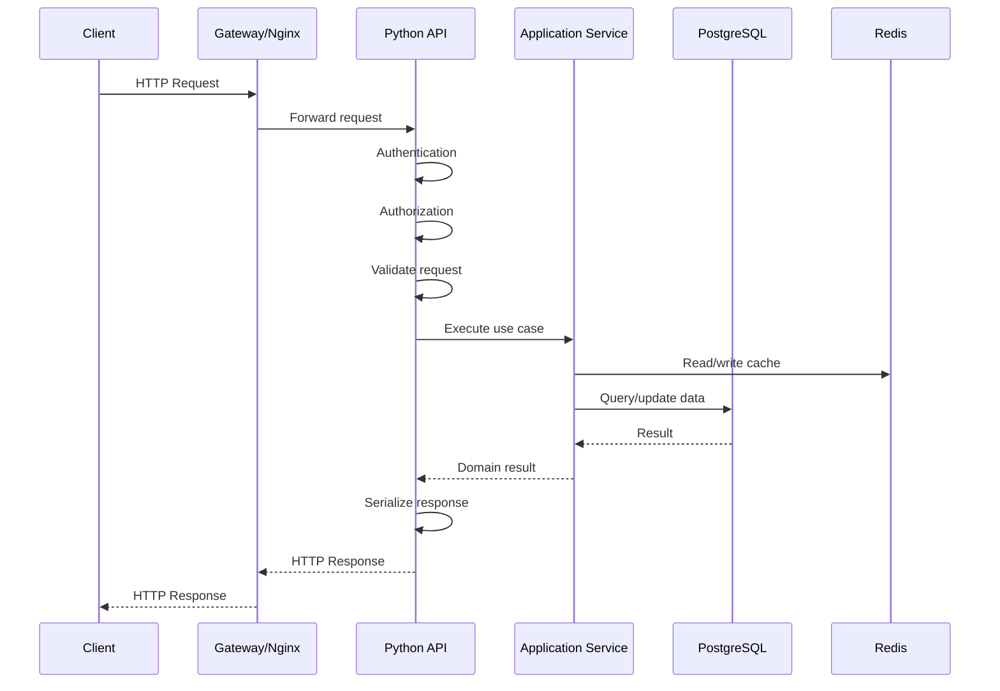
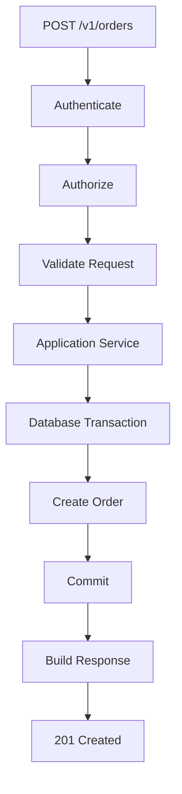

# 12- REST API Design

## Overview

REST API design is the discipline of exposing application capabilities over HTTP using predictable resources, representations, methods, status codes, and contracts.

A well-designed REST API should be:

- predictable for clients;
- explicit about resource semantics;
- safe under retries;
- versionable;
- observable;
- secure;
- scalable;
- compatible with independent service deployment.

For Python backends, REST APIs are commonly implemented with frameworks such as FastAPI and Django REST Framework.

A production REST API is not just a collection of endpoints. It is a contract between independently evolving systems:

```text
Client
  ↓
HTTP
  ↓
API Gateway / Nginx / Load Balancer
  ↓
Python Application
  ↓
Application Services
  ↓
Domain Logic
  ↓
Database / Redis / Kafka / External Services
```

The API contract must remain stable even when the implementation behind it changes.

---

## REST Constraints

REST, as originally described, is based on architectural constraints rather than a specific framework.

Important constraints include:

| Constraint | Meaning |
|---|---|
| Client-server | Client and server evolve independently |
| Stateless | Each request contains the information required to process it |
| Cacheable | Responses may define caching semantics |
| Uniform interface | Resources and operations follow consistent conventions |
| Layered system | Clients need not know all intermediary layers |
| Code-on-demand | Optional constraint allowing executable code from server |

Most practical backend APIs primarily rely on:

- client-server separation;
- statelessness;
- cacheability;
- uniform resource interfaces;
- layered architecture.

REST does not require JSON, but JSON is the dominant representation for modern business APIs.

---

## Resource-Oriented Design

REST APIs should generally model business entities as resources.

For an order system:

```text
/orders
/orders/{order_id}
/orders/{order_id}/items
/orders/{order_id}/payments
```

Prefer:

```http
GET /orders/123
```

over RPC-style designs such as:

```http
GET /getOrder?id=123
```

Resource-oriented URLs make the API easier to understand and compose.

---

## Resources vs Actions

HTTP methods represent common operations on resources.

Prefer:

```http
POST   /orders
GET    /orders/123
PATCH  /orders/123
DELETE /orders/123
```

instead of:

```http
POST /createOrder
POST /getOrder
POST /updateOrder
POST /deleteOrder
```

However, not every business operation maps naturally to CRUD.

An explicit action can be appropriate when the operation is a domain command:

```http
POST /orders/123/cancel
POST /payments/123/refund
POST /users/123/verify
```

The goal is semantic clarity, not blindly eliminating verbs from URLs.

---

## Resource Naming

Use consistent nouns:

```text
/users
/orders
/products
/payments
```

Prefer plural collection resources for consistency.

```http
GET /orders
GET /orders/123
```

Avoid inconsistent forms such as:

```text
/order
/orders
/getOrders
/orderList
```

Consistency matters more than whether singular or plural naming is theoretically superior.

---

## Nested Resources

Nested resources can express relationships:

```http
GET /orders/123/items
```

This can be useful when the child resource has meaning within the parent context.

Avoid excessive nesting:

```http
/users/1/orders/2/items/3/payments/4
```

Deep URLs become difficult to maintain and can encode too much traversal logic.

A practical rule is to keep nesting shallow and use direct resource endpoints when an entity has an independent identity.

---

## Resource Identity

A resource should have a stable identifier.

Example:

```json
{
  "id": "ord_01J8XYZ",
  "status": "confirmed"
}
```

Avoid exposing database implementation details unnecessarily.

For externally visible identifiers, consider:

- UUIDs;
- ULIDs;
- opaque IDs;
- domain-specific identifiers.

The choice should account for indexing, ordering, security, interoperability, and operational requirements.

---

## HTTP Methods

Common REST methods:

| Method | Typical use | Safe | Idempotent |
|---|---|---:|---:|
| `GET` | Retrieve resource | Yes | Yes |
| `HEAD` | Retrieve headers | Yes | Yes |
| `POST` | Create/command | No | No by default |
| `PUT` | Replace resource | No | Yes |
| `PATCH` | Partial update | No | Not inherently |
| `DELETE` | Delete resource | No | Yes |

Idempotent does not mean "has no side effects."

For example:

```http
DELETE /users/123
```

may have a side effect the first time, but repeating it should result in the same intended resource state.

---

## GET

Use `GET` for retrieval.

```http
GET /orders/123
```

A GET request should not perform business mutations.

Avoid:

```http
GET /orders/123/cancel
```

because caches, crawlers, prefetchers, and clients may issue GET requests automatically.

---

## POST

`POST` is commonly used for:

- creating resources;
- commands;
- operations where the server determines the resulting resource identity.

Example:

```http
POST /orders
Content-Type: application/json
```

```json
{
  "customer_id": "cus_123",
  "items": [
    {
      "product_id": "prod_123",
      "quantity": 2
    }
  ]
}
```

A successful creation commonly returns:

```http
201 Created
Location: /orders/ord_123
```

---

## PUT

`PUT` generally represents replacement of a resource at a known URI.

```http
PUT /users/123
```

```json
{
  "name": "Aranya",
  "email": "aranya@example.com",
  "status": "active"
}
```

The client should understand whether omitted fields are replaced, rejected, or given defaults according to the API contract.

Do not use PUT as an informal synonym for "update something."

---

## PATCH

`PATCH` represents partial modification.

```http
PATCH /users/123
```

```json
{
  "status": "suspended"
}
```

PATCH semantics depend on the chosen patch format and API contract.

Do not assume PATCH is automatically idempotent.

---

## DELETE

DELETE requests a resource deletion:

```http
DELETE /orders/123
```

The operation is defined as idempotent, but the API must still define what happens when the resource is already absent.

Possible responses include:

```http
204 No Content
```

or:

```http
404 Not Found
```

Choose a consistent contract based on the API's semantics.

---

## HTTP Status Codes

Use status codes consistently.

| Status | Typical meaning |
|---|---|
| `200 OK` | Successful request with representation |
| `201 Created` | Resource created |
| `202 Accepted` | Request accepted for asynchronous processing |
| `204 No Content` | Successful operation without response body |
| `400 Bad Request` | Invalid request syntax or semantics |
| `401 Unauthorized` | Missing or invalid authentication |
| `403 Forbidden` | Authenticated but not authorized |
| `404 Not Found` | Resource does not exist or is intentionally hidden |
| `409 Conflict` | Request conflicts with current resource state |
| `412 Precondition Failed` | Conditional request failed |
| `422 Unprocessable Content` | Semantically invalid request representation |
| `429 Too Many Requests` | Rate limit exceeded |
| `500 Internal Server Error` | Unexpected server failure |
| `502 Bad Gateway` | Invalid response from upstream |
| `503 Service Unavailable` | Service temporarily unavailable |
| `504 Gateway Timeout` | Upstream operation timed out |

The exact status-code policy should be documented and applied consistently.

---

## 401 vs 403

A common interview and production distinction:

```text
401
→ Authentication is missing or invalid.

403
→ Authentication succeeded, but authorization failed.
```

For example:

```http
GET /admin/reports
Authorization: Bearer valid-token
```

If the authenticated user lacks permission:

```http
403 Forbidden
```

Do not use `401` as a generic "you cannot access this resource" response.

---

## 404 and Resource Enumeration

Security-sensitive systems may intentionally return `404` instead of `403`.

For example:

```text
GET /users/private-account
```

Returning:

```http
403
```

may reveal that the resource exists.

Returning:

```http
404
```

can hide its existence.

The correct choice depends on the resource and threat model.

---

## 409 Conflict

Use `409` when the request conflicts with current server state.

Examples:

```text
duplicate username
state transition conflict
version conflict
resource already exists
```

Example:

```http
POST /users
```

when the requested unique username already exists.

---

## 422

`422` is useful when the request is syntactically valid but fails semantic validation.

Example:

```json
{
  "start_date": "2026-09-10",
  "end_date": "2026-09-01"
}
```

The JSON is valid, but the business input is invalid.

Framework conventions vary, so clients should depend on the documented API contract rather than assuming one framework's default behavior.

---

## Error Responses

Errors should use a stable structure.

Example:

```json
{
  "type": "https://api.example.com/problems/invalid-request",
  "title": "Invalid request",
  "status": 422,
  "detail": "The end date must be after the start date.",
  "instance": "/reservations/res_123"
}
```

A problem-details-style representation provides machine-readable and human-readable information.

Avoid exposing:

```text
Python tracebacks
SQL queries
internal hostnames
stack frames
credentials
database details
```

---

## Validation Errors

A useful validation response may identify individual fields:

```json
{
  "type": "https://api.example.com/problems/validation-error",
  "title": "Validation failed",
  "status": 422,
  "errors": [
    {
      "field": "email",
      "code": "invalid_format",
      "message": "A valid email address is required."
    }
  ]
}
```

Clients should be able to programmatically consume the error code.

Do not require clients to parse human-readable messages to determine behavior.

---

## Request Validation

FastAPI can use Pydantic models at the API boundary:

```python
from pydantic import BaseModel, Field


class CreateOrderRequest(BaseModel):
    customer_id: str
    quantity: int = Field(gt=0)
```

The endpoint:

```python
from fastapi import FastAPI

app = FastAPI()


@app.post("/orders", status_code=201)
async def create_order(
    request: CreateOrderRequest,
) -> dict:
    return {
        "customer_id": request.customer_id,
        "quantity": request.quantity,
    }
```

Request validation should happen at the boundary before domain operations execute.

---

## API Schemas vs Domain Models

Do not automatically expose database models directly.

Prefer:

```text
HTTP Request
    ↓
API Schema
    ↓
Application Service
    ↓
Domain Model
    ↓
Repository
    ↓
Database
```

This prevents external API contracts from becoming tightly coupled to persistence implementation.

---

## Response Models

FastAPI can enforce response schemas:

```python
from pydantic import BaseModel


class OrderResponse(BaseModel):
    id: str
    status: str
    total_cents: int


@app.get(
    "/orders/{order_id}",
    response_model=OrderResponse,
)
async def get_order(order_id: str) -> OrderResponse:
    order = await order_service.get(order_id)

    return OrderResponse(
        id=order.id,
        status=order.status,
        total_cents=order.total_cents,
    )
```

Response models provide:

- explicit contracts;
- serialization control;
- validation;
- documentation;
- protection against accidental field exposure.

---

## Pagination

Collection endpoints should not return unbounded datasets.

Avoid:

```http
GET /orders
```

returning millions of rows.

Use pagination:

```http
GET /orders?limit=50&cursor=eyJpZCI6...
```

A response may contain:

```json
{
  "items": [],
  "next_cursor": "eyJpZCI6..."
}
```

---

## Offset Pagination

Offset pagination:

```http
GET /orders?limit=50&offset=100
```

is simple and useful for relatively stable datasets.

Its disadvantages become significant for large or frequently changing datasets because deep offsets can require the database to scan and discard many rows, and concurrent inserts/deletes can shift page boundaries.

---

## Cursor Pagination

Cursor pagination uses a position in the ordered dataset:

```http
GET /orders?limit=50&cursor=abc123
```

A database query might use:

```sql
SELECT id, created_at, status
FROM orders
WHERE (created_at, id) < (:created_at, :id)
ORDER BY created_at DESC, id DESC
LIMIT 50;
```

A supporting index can make this efficient at large offsets.

Use a stable ordering and include a tie-breaker such as a unique ID.

---

## Pagination Trade-offs

| Approach | Advantages | Limitations |
|---|---|---|
| Offset | Simple | Poor deep-page performance |
| Cursor | Efficient at scale | More complex |
| Keyset | Strong database performance | Requires stable ordering |
| Page number | User-friendly | Can become expensive/inconsistent |

For high-volume APIs, cursor/keyset pagination is usually preferable.

---

## Filtering

Use query parameters for collection filtering:

```http
GET /orders?status=paid
```

Multiple filters:

```http
GET /orders?status=paid&customer_id=cus_123
```

Keep filtering semantics consistent across resources.

Avoid encoding arbitrary SQL-like expressions directly into public query parameters.

---

## Sorting

Example:

```http
GET /orders?sort=-created_at
```

The API should define which fields are sortable.

Never allow unrestricted client-controlled SQL fragments.

Prefer an allowlist:

```python
ALLOWED_SORT_FIELDS = {
    "created_at",
    "total_cents",
    "status",
}
```

---

## Searching

For simple search:

```http
GET /products?q=wireless+keyboard
```

For complex search, consider whether a dedicated search system such as Elasticsearch/OpenSearch is more appropriate than forcing PostgreSQL to handle arbitrary search workloads.

The API should hide the implementation choice:

```text
GET /products?q=keyboard
       ↓
Search service
       ↓
PostgreSQL / OpenSearch
```

---

## Partial Responses

For expensive resources, clients may need only selected fields.

An API may support:

```http
GET /users/123?fields=id,name,email
```

This can reduce:

- serialization;
- network traffic;
- client parsing;
- response size.

Do not add field selection merely for theoretical optimization. It increases API complexity and should be justified by real payload or performance requirements.

---

## Filtering vs Authorization

Filtering does not replace authorization.

For example:

```http
GET /orders?customer_id=123
```

must still verify that the caller can access customer `123`.

Never assume that because a user can provide an identifier, they are authorized to retrieve it.

---

## Authentication

Common REST API authentication mechanisms include:

```text
OAuth 2.0 / OpenID Connect
Bearer tokens
API keys
mTLS
session cookies
```

The authentication mechanism should match the client type and security requirements.

Browser applications and machine-to-machine APIs often require different authentication flows.

---

## Authorization

Authentication answers:

```text
Who are you?
```

Authorization answers:

```text
What are you allowed to do?
```

Authorization can be:

- role-based;
- attribute-based;
- resource-based;
- policy-based.

Example:

```text
GET /orders/123
       ↓
Authenticated user
       ↓
Does user own order 123?
       ↓
Allow / deny
```

Authorization should be enforced server-side.

---

## Object-Level Authorization

A common vulnerability is:

```http
GET /users/123
```

where the server checks authentication but not whether the caller can access user `123`.

This can lead to insecure direct object reference behavior.

Always authorize access to the specific resource.

---

## Stateless APIs

A stateless API does not require server-side session state from a previous request to interpret the current request.

For example:

```http
Authorization: Bearer <token>
```

allows a request to carry its authentication context.

Statelessness makes horizontal scaling easier:

```text
Load Balancer
 ├── Pod A
 ├── Pod B
 └── Pod C
```

Any healthy pod can process the request.

Statelessness does not mean the system has no state. State can live in PostgreSQL, Redis, object storage, Kafka, or other shared systems.

---

## Cookies and Sessions

Cookie-based sessions can also be used with REST-style APIs, particularly for browser applications.

Session state may be stored:

```text
Browser cookie
      ↓
Session identifier
      ↓
Redis / database
```

If session state is stored centrally, multiple application instances can still serve the user.

Security considerations include:

- `Secure`;
- `HttpOnly`;
- `SameSite`;
- CSRF protection;
- session expiration;
- session revocation.

---

## Idempotency Keys

For retry-sensitive operations, clients can provide:

```http
Idempotency-Key: 8d7c...
```

Example:

```http
POST /payments
Idempotency-Key: pay-attempt-123
```

The server stores the result associated with the key:

```text
Request
  ↓
Idempotency key
  ↓
Redis / PostgreSQL
  ↓
Already processed?
 ├── Yes → return previous result
 └── No  → execute operation
```

The storage mechanism must provide appropriate uniqueness and atomicity.

---

## Idempotency Implementation

A database-backed approach can use a unique constraint:

```sql
CREATE UNIQUE INDEX payments_idempotency_key_idx
ON payment_requests (idempotency_key);
```

The application should atomically associate the key with the operation result.

Avoid implementing idempotency using an in-memory Python dictionary in a multi-worker or multi-pod deployment.

---

## Optimistic Concurrency

APIs that update frequently changing resources may need optimistic concurrency control.

For example:

```http
If-Match: "version-42"
```

The server only applies the update if the resource still matches the client's version.

Flow:

```text
Client reads version 42
        ↓
Another client updates → version 43
        ↓
First client sends If-Match: 42
        ↓
412 Precondition Failed
```

This prevents silent lost updates.

---

## ETags

An API can expose:

```http
ETag: "abc123"
```

Clients can then use:

```http
If-None-Match: "abc123"
```

for conditional retrieval.

If unchanged:

```http
304 Not Modified
```

This can reduce response transfer and server work.

---

## Cache-Control

HTTP caching should be explicit.

Example:

```http
Cache-Control: private, max-age=60
```

For public immutable content:

```http
Cache-Control: public, max-age=31536000, immutable
```

Do not cache sensitive responses accidentally.

---

## API Versioning

APIs evolve.

Common strategies include:

```text
/v1/orders
/v2/orders
```

or content negotiation:

```http
Accept: application/vnd.example.orders.v2+json
```

URL versioning is operationally simple and widely understood.

Version only when there is a meaningful contract incompatibility.

Do not create a new major version for every additive field.

---

## Backward Compatibility

Prefer additive changes:

```json
{
  "id": "123",
  "status": "paid",
  "created_at": "...",
  "customer_note": "..."
}
```

Adding a field is often backward-compatible.

Potentially breaking changes include:

- removing fields;
- changing field types;
- changing enum meanings;
- changing required request fields;
- changing status-code semantics;
- changing pagination behavior;
- changing authentication requirements.

---

## API Evolution

A safe evolution process is:

```text
Introduce new behavior
        ↓
Support old + new clients
        ↓
Migrate clients
        ↓
Measure remaining old usage
        ↓
Deprecate
        ↓
Remove after agreed lifecycle
```

Do not remove an API simply because the server implementation has changed.

---

## OpenAPI

OpenAPI provides a machine-readable API contract.

FastAPI can generate OpenAPI documentation from Python type and schema definitions.

The contract can support:

- client generation;
- documentation;
- contract testing;
- validation;
- API governance.

OpenAPI should describe the actual public contract rather than becoming an abandoned manually maintained document.

---

## REST API Request Lifecycle



The important boundary is:

```text
HTTP concerns
      ↓
Application concerns
      ↓
Domain concerns
      ↓
Persistence concerns
```

Do not collapse all four into a route handler.

---

## FastAPI Architecture

A production FastAPI application can use:

```text
app/
├── api/
│   ├── routes/
│   └── dependencies.py
├── application/
│   └── services/
├── domain/
│   └── models/
├── infrastructure/
│   ├── database/
│   └── clients/
└── main.py
```

A route should remain relatively thin:

```python
@router.post(
    "/orders",
    response_model=OrderResponse,
    status_code=201,
)
async def create_order(
    request: CreateOrderRequest,
    service: OrderService = Depends(get_order_service),
) -> OrderResponse:
    order = await service.create_order(request)
    return OrderResponse.from_domain(order)
```

Business logic belongs in application/domain layers rather than the HTTP handler.

---

## Django REST Architecture

Django applications often separate:

```text
URL routing
    ↓
View / ViewSet
    ↓
Serializer
    ↓
Service / domain logic
    ↓
ORM
    ↓
PostgreSQL
```

Django REST Framework can provide:

- serializers;
- authentication;
- permissions;
- pagination;
- filtering;
- viewsets;
- routers.

Framework abstractions should support the API architecture rather than dictate domain design.

---

## Database Interaction

Avoid performing inefficient queries inside API loops.

Bad pattern:

```python
for order in orders:
    customer = Customer.objects.get(
        id=order.customer_id
    )
```

This can create an N+1 query problem.

Prefer appropriate eager loading:

```python
orders = (
    Order.objects
    .select_related("customer")
    .all()
)
```

For SQLAlchemy-style systems, use appropriate eager-loading strategies such as `selectinload` or `joinedload` based on the relationship and query shape.

---

## Transactions and API Boundaries

An HTTP request is not automatically a database transaction.

For operations involving multiple writes:

```text
HTTP request
     ↓
Application service
     ↓
DB transaction
 ├── update order
 ├── insert payment
 └── insert audit event
     ↓
commit
```

The transaction should correspond to the business consistency boundary.

Do not assume a transaction can atomically include:

```text
PostgreSQL + Redis + Kafka + external HTTP service
```

without additional distributed-systems mechanisms.

---

## Database and External API Coordination

This is unsafe as a naive assumption:

```text
DB commit
   ↓
HTTP call
```

If the HTTP call fails after the DB commit, the system may become inconsistent.

For event-driven workflows, consider patterns such as:

```text
PostgreSQL transaction
    ↓
Outbox event
    ↓
Kafka
    ↓
Worker
    ↓
External service
```

The REST API can return:

```http
202 Accepted
```

when processing is intentionally asynchronous.

---

## Synchronous vs Asynchronous APIs

Use synchronous processing when the operation can complete within a predictable latency budget:

```http
POST /orders
→ 201 Created
```

Use asynchronous processing when the operation is long-running:

```http
POST /reports
→ 202 Accepted
```

Response:

```json
{
  "job_id": "job_123",
  "status": "pending"
}
```

The client can then poll:

```http
GET /reports/jobs/job_123
```

or receive completion through another mechanism.

---

## 202 Accepted

`202 Accepted` means the request has been accepted for processing.

It does not mean:

```text
operation completed successfully
```

A useful asynchronous flow is:

```text
POST /exports
       ↓
202 Accepted
       ↓
Celery / Kafka
       ↓
Background processing
       ↓
Object storage
       ↓
GET /exports/{id}
```

This avoids holding HTTP requests open for long-running jobs.

---

## Rate Limiting

Rate limiting protects API capacity.

Common algorithms include:

- token bucket;
- leaky bucket;
- fixed window;
- sliding window.

A response may include:

```http
429 Too Many Requests
Retry-After: 10
```

Rate limits can be enforced at:

```text
Nginx
API gateway
application
Redis
service mesh
```

Choose the layer based on whether the limit is infrastructure-wide, service-wide, tenant-specific, or business-specific.

---

## Tenant-Aware Rate Limits

Multi-tenant systems often require limits such as:

```text
tenant A → 1,000 requests/min
tenant B → 100 requests/min
```

A Redis-backed distributed limiter can coordinate limits across:

```text
multiple pods
multiple workers
multiple availability zones
```

Do not implement tenant rate limiting with only local Python memory when requests can reach multiple instances.

---

## Request Size Limits

Large request bodies can exhaust memory or CPU.

Configure limits for:

```text
JSON body
multipart uploads
headers
query strings
response sizes
```

Large file uploads should generally use object storage patterns:

```text
Client
  ↓
Pre-signed S3 URL
  ↓
S3
  ↓
Application receives metadata
```

rather than forcing multi-gigabyte payloads through application workers.

---

## Timeouts and Deadlines

API endpoints should have explicit operational budgets.

Example:

```text
Client deadline: 3 seconds
      ↓
API processing: 2.5 seconds
      ↓
Database: 1 second
      ↓
External HTTP: 800 ms
```

Nested dependencies must not each independently consume the entire outer timeout.

---

## Retries

Retries should not be implemented blindly at every layer.

Potential layers include:

```text
Client
 ↓
API Gateway
 ↓
Service A
 ↓
Service B
 ↓
Database
```

If each layer retries three times, a single failure can generate many downstream attempts.

Define retry ownership explicitly.

---

## API Gateway

An API gateway can provide:

- TLS termination;
- routing;
- authentication integration;
- rate limiting;
- request size limits;
- observability;
- load balancing.

Example:

```text
Internet
   ↓
AWS ALB / API Gateway
   ↓
Nginx / Ingress
   ↓
FastAPI pods
```

Do not duplicate the same policy at every layer without understanding precedence.

---

## CORS

CORS controls whether browser JavaScript can make cross-origin requests.

It is not an authentication mechanism.

For example:

```text
https://frontend.example.com
        ↓
https://api.example.com
```

The API may explicitly allow the frontend origin.

Avoid:

```text
Access-Control-Allow-Origin: *
```

when credentials or sensitive browser interactions are involved.

---

## CSRF

CSRF is primarily relevant when authentication is automatically attached by the browser, such as cookie-based sessions.

Bearer tokens manually supplied by JavaScript have different CSRF characteristics, though they introduce other security considerations.

Cookie-based browser APIs should use appropriate:

- `SameSite`;
- CSRF tokens;
- origin checks;
- secure cookie settings.

---

## Security Headers

Depending on deployment architecture, security-related headers may include:

```text
Strict-Transport-Security
Content-Security-Policy
X-Content-Type-Options
Referrer-Policy
```

The exact set depends on whether the API serves browser content directly or is exclusively machine-to-machine.

---

## Secrets

Never expose:

```text
database passwords
API keys
OAuth client secrets
private certificates
JWT signing keys
```

through API responses or logs.

Configuration should come from:

```text
environment configuration
Kubernetes Secrets
AWS Secrets Manager
AWS Systems Manager Parameter Store
```

with appropriate access control.

---

## Mass Assignment

Do not blindly apply arbitrary request fields to domain or ORM objects.

Dangerous conceptual pattern:

```python
user.__dict__.update(request_data)
```

A client should not be able to modify protected fields such as:

```text
role
is_admin
account_status
internal_balance
```

Use explicit request schemas and controlled field mapping.

---

## Sensitive Data Exposure

API responses should contain only what the client needs.

Avoid accidentally returning:

```json
{
  "password_hash": "...",
  "internal_notes": "...",
  "database_id": 123,
  "oauth_refresh_token": "..."
}
```

Use explicit response models rather than serializing entire ORM objects.

---

## Audit Logging

Security-sensitive mutations may require durable audit events:

```text
actor
action
resource
timestamp
result
request correlation ID
```

Audit records should be treated differently from ordinary operational logs when stronger retention or integrity requirements exist.

Do not treat application logs as the only durable source of business or audit history.

---

## API Observability

Monitor at least:

```text
request rate
latency
error rate
status-code distribution
saturation
dependency latency
database latency
rate-limit rejections
```

Track:

```text
p50
p95
p99
```

rather than only averages.

---

## Route Cardinality

Metrics should prefer route templates:

```text
GET /orders/{order_id}
```

rather than raw URLs:

```text
GET /orders/ord_123
GET /orders/ord_456
GET /orders/ord_789
```

Raw identifiers can create enormous metric cardinality.

---

## Distributed Tracing

A REST request may cross:

```text
API Gateway
 ↓
FastAPI
 ↓
PostgreSQL
 ↓
Redis
 ↓
Payment API
```

Distributed tracing connects these operations into one trace.

Useful attributes include:

```text
HTTP method
route
status code
dependency
duration
trace ID
```

Avoid putting sensitive payloads into spans.

---

## Health and Readiness Endpoints

Common endpoints:

```http
GET /health/live
GET /health/ready
```

Liveness answers:

```text
Is this process alive?
```

Readiness answers:

```text
Should this instance receive traffic?
```

Do not make liveness depend on PostgreSQL or every external dependency.

Otherwise a temporary dependency outage can cause Kubernetes to restart otherwise healthy application processes.

---

## API Documentation

Public APIs should document:

- endpoints;
- authentication;
- request schemas;
- response schemas;
- status codes;
- error formats;
- pagination;
- rate limits;
- idempotency;
- versioning;
- deprecation policy.

OpenAPI can provide the machine-readable contract.

---

## Testing Strategy

A production REST API should be tested at multiple levels.

| Test | Purpose |
|---|---|
| Unit | Business and transformation logic |
| Route/API | HTTP contract |
| Integration | Database/cache/external boundaries |
| Contract | Compatibility between services |
| Security | Authentication/authorization |
| Load | Capacity and latency |
| End-to-end | Critical workflows |

Do not rely exclusively on endpoint tests.

---

## API Contract Tests

Contract tests should verify:

```text
HTTP method
URL
request schema
required headers
status codes
response schema
error representation
pagination semantics
```

This is particularly valuable for microservices where teams deploy independently.

---

## Example API

A clean order API might look like:

```text
POST   /v1/orders
GET    /v1/orders
GET    /v1/orders/{order_id}
PATCH  /v1/orders/{order_id}
DELETE /v1/orders/{order_id}

GET    /v1/orders/{order_id}/items

POST   /v1/orders/{order_id}/cancel
POST   /v1/orders/{order_id}/payments
```

The API communicates resources and domain commands without exposing internal database structure.

---

## Example Create Flow



If asynchronous processing is required:

```text
POST /v1/orders
      ↓
Validate
      ↓
Persist command
      ↓
Publish / enqueue
      ↓
202 Accepted
      ↓
Celery / Kafka
      ↓
Worker
```

---

## Performance Design

API performance depends on more than Python execution time.

A useful model is:

```text
Total latency
=
network
+
queueing
+
application CPU
+
database
+
cache
+
external services
+
serialization
```

Optimize the dominant component.

Common high-impact optimizations include:

- efficient SQL;
- correct indexes;
- eliminating N+1 queries;
- Redis caching;
- connection pooling;
- pagination;
- response-size reduction;
- batching;
- asynchronous processing.

---

## Serialization Costs

Large JSON payloads consume:

- CPU;
- memory;
- network bandwidth;
- client processing time.

Avoid returning unnecessary nested data.

For high-volume APIs, consider whether:

```text
JSON
vs
binary protocols
vs
gRPC
```

better fits the use case.

REST/JSON remains appropriate for many public and browser-facing APIs.

---

## REST vs gRPC

| Characteristic | REST | gRPC |
|---|---|---|
| Primary protocol | HTTP | HTTP/2 |
| Typical format | JSON | Protobuf |
| Browser support | Excellent | More constrained |
| Human readability | High | Lower |
| Schema | OpenAPI/common | Protobuf |
| Streaming | Supported | Strong |
| Internal microservices | Common | Often strong fit |
| Public APIs | Common | Less universal |

Do not choose gRPC merely because it is faster in benchmarks. API consumers, interoperability, tooling, and operational requirements matter.

---

## Caching Strategy

Potential caching layers:

```text
Client
  ↓
CDN
  ↓
API Gateway
  ↓
Application
  ↓
Redis
  ↓
PostgreSQL
```

Each layer has different semantics.

Caching should explicitly consider:

- freshness;
- invalidation;
- authorization;
- tenant isolation;
- cache key design;
- stampedes;
- stale data tolerance.

Never cache private data under a shared public cache key.

---

## Cache Stampede

If a popular cache entry expires:

```text
1,000 requests
      ↓
cache miss
      ↓
1,000 database queries
```

This can overload the database.

Mitigations include:

- TTL jitter;
- request coalescing;
- locking;
- stale-while-revalidate;
- background refresh.

---

## High Availability

For production REST APIs:

```text
Internet
   ↓
Load Balancer
   ↓
Multiple application instances
   ↓
Shared PostgreSQL / Redis
```

Application instances should generally be stateless.

Use:

- multiple replicas;
- health checks;
- graceful shutdown;
- bounded resource pools;
- connection draining;
- autoscaling;
- multi-AZ deployment where appropriate.

---

## Kubernetes Considerations

API pods should have:

```text
CPU requests/limits
memory requests/limits
readiness probe
liveness probe
startup probe when needed
graceful termination
```

Autoscaling should consider meaningful signals such as:

```text
CPU
request rate
latency
queue depth
custom saturation metrics
```

Do not scale solely on CPU if the primary bottleneck is database or downstream capacity.

---

## AWS Considerations

A typical deployment might use:

```text
Route 53
   ↓
CloudFront / API Gateway / ALB
   ↓
EKS / ECS
   ↓
FastAPI / Django
   ↓
RDS PostgreSQL
   ↓
ElastiCache Redis
   ↓
SQS / MSK / Kafka
```

The correct architecture depends on traffic, operational maturity, latency requirements, and failure boundaries.

---

## Disaster Recovery

REST APIs should define behavior during dependency outages.

For example:

```text
PostgreSQL unavailable
      ↓
Can the API serve cached reads?
      ↓
Can writes be queued?
      ↓
Should requests fail fast?
```

Critical systems should have documented:

- backup strategy;
- recovery point objective;
- recovery time objective;
- failover strategy;
- dependency recovery procedures.

An API cannot be highly available if its database or critical dependency has no recovery strategy.

---

## Cost Considerations

API costs can increase through:

```text
excessive payload sizes
unnecessary downstream calls
high log volume
high trace volume
database over-querying
over-provisioned pods
unbounded retries
cache inefficiency
```

Performance and cost should be considered together.

A 20% latency improvement that requires 5× infrastructure cost may not be a good engineering trade-off.

---

## Common Mistakes

### Treating REST as CRUD Only

Not every domain operation is CRUD.

Use explicit resource-oriented commands when business semantics require them.

### Putting Verbs Everywhere

Avoid:

```text
/createUser
/updateUser
/deleteUser
```

when standard HTTP methods communicate the operation clearly.

### Returning Database Models Directly

This tightly couples the API contract to persistence and can expose internal fields.

### No Pagination

Unbounded collections eventually become performance and availability problems.

### Ignoring Idempotency

Network retries can duplicate business operations.

### Inconsistent Error Formats

Clients become forced to implement endpoint-specific error parsing.

### Using 200 for Everything

Status codes carry useful protocol semantics. Use them consistently.

---

## Production Pitfalls

### N+1 Queries

An endpoint may look fast with ten records and collapse under production-sized collections.

### Deep Resource Nesting

Deep URL structures become difficult to maintain and often indicate overly coupled resource traversal.

### Breaking Response Changes

Removing or renaming a response field can break independently deployed clients.

### Unbounded Request Bodies

Large bodies can cause memory exhaustion and denial-of-service conditions.

### Excessive Synchronous Work

Long-running work inside an HTTP request increases timeout and worker utilization risk.

### Distributed Retry Multiplication

Retries at several layers can amplify traffic dramatically.

### Authorization Only at the Route Level

Checking that a user is authenticated is not enough. Resource-level authorization is often required.

### Shared Cache Leakage

Caching without incorporating authorization or tenant boundaries can expose one user's data to another.

### Health Check Cascades

Making readiness depend on every downstream dependency can cause healthy application instances to disappear during a dependency outage.

---

## API Design Checklist

### Resource Design

- [ ] Resources have stable identifiers.
- [ ] URLs use consistent naming.
- [ ] Resource nesting is shallow.
- [ ] Domain commands are explicit where required.
- [ ] Database structure is not unnecessarily exposed.

### HTTP Semantics

- [ ] Methods follow their intended semantics.
- [ ] Status codes are consistent.
- [ ] `401` and `403` are distinguished.
- [ ] `202` is used for genuinely asynchronous processing.
- [ ] Idempotency is defined for retry-sensitive operations.

### Contracts

- [ ] Request schemas are explicit.
- [ ] Response schemas are explicit.
- [ ] Error responses are structured.
- [ ] Pagination is defined.
- [ ] Versioning and deprecation policies exist.
- [ ] OpenAPI is maintained.

### Security

- [ ] Authentication is enforced.
- [ ] Resource-level authorization is enforced.
- [ ] Request sizes are bounded.
- [ ] Sensitive fields are excluded.
- [ ] SSRF protections exist where outbound URLs are user-controlled.
- [ ] CORS and CSRF are configured according to the client model.
- [ ] Secrets are never returned or logged.

### Performance

- [ ] Database queries are measured.
- [ ] N+1 queries are avoided.
- [ ] Collection endpoints are paginated.
- [ ] Large responses are controlled.
- [ ] Caching is used where justified.
- [ ] Long-running work is asynchronous where appropriate.

### Operations

- [ ] Request rate is monitored.
- [ ] p95/p99 latency is monitored.
- [ ] Error rates are monitored.
- [ ] Dependency latency is visible.
- [ ] Traces and correlation IDs are available.
- [ ] Graceful shutdown is implemented.
- [ ] Readiness and liveness are separated.

---

## API Design Principles

A strong REST API generally follows these principles:

```text
Stable resource semantics
        +
Correct HTTP semantics
        +
Explicit contracts
        +
Strong validation
        +
Authorization at resource boundaries
        +
Idempotent retry strategy
        +
Bounded resource consumption
        +
Observable dependencies
        +
Backward-compatible evolution
```

The most important design decision is not the URL syntax. It is defining a stable contract that remains correct under failure, concurrency, retries, scale, and independent deployment.

## Key Takeaways

- **Design APIs as stable resource contracts:** use consistent resources, HTTP methods, status codes, schemas, pagination, and explicit domain commands where CRUD semantics are insufficient.
- **Treat failure and retries as first-class concerns:** define idempotency, timeouts, concurrency limits, asynchronous processing, and retry behavior before production traffic exposes the failure modes.
- **Separate HTTP from application and persistence logic:** validate at the API boundary, use explicit request/response models, keep business logic in application/domain services, and avoid exposing ORM models directly.
- **Secure every resource operation:** authentication is not authorization; enforce object-level permissions, bound request sizes, protect against sensitive-data exposure and SSRF, and design caching with tenant and authorization boundaries.
- **Design for evolution and operations:** maintain backward-compatible contracts, version deliberately, expose OpenAPI documentation, monitor latency/errors/dependencies, and deploy stateless instances with appropriate HA and graceful-shutdown behavior.