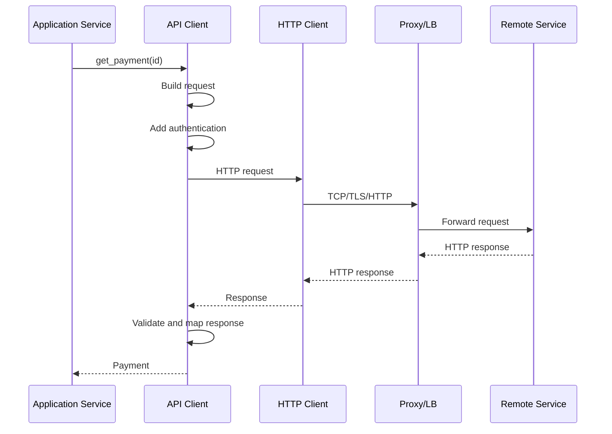

# 13- API Clients

## Overview

An API client is an application component that encapsulates communication with another service's API. While an HTTP client handles transport mechanics, an API client represents a specific remote service and its contract.

The distinction is important:

```text
HTTP Client
    ↓
Generic HTTP transport
    ↓
API Client
    ↓
Service-specific contract
    ↓
Application Service
```

For example:

```python
await payment_client.get_payment(payment_id)
```

is preferable to scattering:

```python
await http_client.get(
    f"{payment_base_url}/payments/{payment_id}"
)
```

throughout application code.

A production API client should provide a stable, typed, observable boundary around an external dependency. It should own transport details such as URLs, headers, serialization, timeouts, retries, authentication, and response parsing while exposing business-relevant operations to the application.

Typical API clients include:

- `PaymentClient`;
- `IdentityClient`;
- `InventoryClient`;
- `ShippingClient`;
- `GitHubClient`;
- `StripeClient`;
- internal microservice clients.

API clients are especially valuable in microservice architectures because they isolate independently deployed services behind explicit contracts.

---

## HTTP Client vs API Client

These concepts are related but not identical.

| Component | Responsibility | Example |
|---|---|---|
| HTTP client | HTTP transport | `httpx.AsyncClient` |
| API client | Remote service contract | `PaymentClient` |
| Application service | Business workflow | `CheckoutService` |
| Domain model | Business representation | `Payment` |

A useful architecture is:

```text
FastAPI / Django
       ↓
Application Service
       ↓
PaymentClient
       ↓
httpx.AsyncClient
       ↓
Payment API
```

The API client should not become another application-service layer. Its purpose is to isolate the remote API boundary.

---

## Why API Clients Exist

Without an API client abstraction:

```text
OrderService
 ├── HTTP calls
 ├── URL construction
 ├── auth headers
 ├── JSON parsing
 ├── retry logic
 └── error handling

RefundService
 ├── HTTP calls
 ├── URL construction
 ├── auth headers
 ├── JSON parsing
 ├── retry logic
 └── error handling
```

The same dependency logic becomes duplicated and inconsistent.

With a client:

```text
OrderService ───────┐
                    ↓
              PaymentClient
                    ↓
              HTTP transport
                    ↓
              Payment API
                    ↑
RefundService ──────┘
```

This centralizes the remote contract.

---

## Responsibilities of an API Client

A well-designed API client commonly owns:

- base URL handling;
- HTTP methods and paths;
- authentication headers;
- request serialization;
- response deserialization;
- schema validation;
- timeout configuration;
- retry policy;
- idempotency behavior;
- error mapping;
- correlation and tracing metadata;
- dependency-specific metrics;
- pagination mechanics;
- resource-specific API semantics.

The client should generally not own:

- business workflows spanning multiple services;
- database transactions;
- user authorization decisions;
- unrelated domain logic;
- HTTP responses returned directly to the application's clients.

---

## API Client Boundary

A useful boundary is:

```text
External API Representation
           ↓
       API Client
           ↓
   Typed Application Model
           ↓
    Application Service
           ↓
       Domain Logic
```

This prevents external schemas from leaking throughout the application.

For example, if a payment provider changes:

```json
{
  "payment_status": "succeeded"
}
```

to:

```json
{
  "status": "succeeded"
}
```

the API client can absorb the change instead of forcing every caller to change.

---

## Typed API Clients

Typed interfaces make remote dependencies easier to reason about.

```python
from dataclasses import dataclass


@dataclass(frozen=True, slots=True)
class Payment:
    id: str
    status: str
    amount_cents: int


class PaymentClient:
    async def get_payment(self, payment_id: str) -> Payment:
        ...
```

The application sees:

```python
payment = await payment_client.get_payment(payment_id)

if payment.status == "succeeded":
    ...
```

rather than dealing directly with raw JSON.

---

## Request and Response Models

Pydantic is useful for validating external API data.

```python
from pydantic import BaseModel


class PaymentResponse(BaseModel):
    id: str
    status: str
    amount_cents: int


class PaymentClient:
    def __init__(self, client):
        self._client = client

    async def get_payment(
        self,
        payment_id: str,
    ) -> PaymentResponse:
        response = await self._client.get(
            f"/payments/{payment_id}",
        )
        response.raise_for_status()

        return PaymentResponse.model_validate(
            response.json()
        )
```

The validation boundary is:

```text
Untrusted remote response
        ↓
Pydantic validation
        ↓
Typed object
        ↓
Application code
```

This is especially important for third-party APIs whose behavior is outside your deployment control.

---

## External Schemas vs Internal Models

A mature application may use separate models:

```text
PaymentProviderResponse
        ↓
PaymentClient
        ↓
Payment
        ↓
CheckoutService
```

This is useful when the external representation does not match domain semantics.

For example:

```python
class ProviderPayment(BaseModel):
    payment_status: str
    amount: int


@dataclass(frozen=True)
class Payment:
    id: str
    status: str
    amount_cents: int
```

The client translates:

```text
provider-specific representation
            ↓
       domain representation
```

This reduces vendor coupling.

---

## When to Use a Separate Domain Model

Do not introduce multiple models automatically.

A direct API response model can be sufficient when:

- the external schema is simple;
- the service has limited business logic;
- the external representation is already appropriate;
- there is little risk of provider replacement.

Introduce a domain model when:

- external and internal semantics differ;
- multiple providers are supported;
- provider-specific fields should not leak;
- the domain needs stronger invariants;
- provider changes are frequent.

The goal is controlled coupling, not maximum abstraction.

---

## API Client Interface

An interface can decouple application logic from the concrete client.

Using a protocol:

```python
from typing import Protocol


class PaymentGateway(Protocol):
    async def get_payment(
        self,
        payment_id: str,
    ) -> Payment:
        ...

    async def charge(
        self,
        amount_cents: int,
        idempotency_key: str,
    ) -> Payment:
        ...
```

Production code can use:

```text
PaymentGateway
      ↓
RealPaymentClient
```

Tests can use:

```text
PaymentGateway
      ↓
FakePaymentGateway
```

This is often cleaner than mocking every HTTP call.

---

## Dependency Injection

FastAPI can inject the client into application services.

```python
from fastapi import Depends


def get_payment_client() -> PaymentClient:
    return payment_client


@router.get("/payments/{payment_id}")
async def get_payment(
    payment_id: str,
    client: PaymentClient = Depends(get_payment_client),
):
    return await client.get_payment(payment_id)
```

For larger systems, dependency construction should usually happen at application composition/startup rather than constructing clients per request.

---

## Client Lifecycle

API clients should generally reuse an underlying HTTP client.

```text
Application startup
       ↓
Create AsyncClient
       ↓
Create API clients
       ↓
Serve requests
       ↓
Reuse connection pools
       ↓
Application shutdown
       ↓
Close AsyncClient
```

Example:

```python
import httpx


class PaymentClient:
    def __init__(
        self,
        http_client: httpx.AsyncClient,
    ) -> None:
        self._http = http_client
```

Then:

```python
http_client = httpx.AsyncClient(
    base_url="https://payments.example.com",
    timeout=5.0,
)

payment_client = PaymentClient(http_client)
```

Do not create a new HTTP connection pool for every API operation.

---

## API Client Factory

For multiple dependencies, a factory or composition layer can centralize construction:

```text
Application
├── PaymentClient
├── InventoryClient
├── IdentityClient
└── ShippingClient
       ↓
Shared HTTP infrastructure
```

However, each dependency may still need independent:

- base URLs;
- authentication;
- timeout budgets;
- retry policies;
- connection limits;
- concurrency limits.

Do not force every API client into identical behavior when dependency characteristics differ.

---

## Base URL Handling

Use a configured base URL:

```python
client = httpx.AsyncClient(
    base_url="https://payments.example.com/api/v1",
)
```

Then:

```python
await client.get("/payments/123")
```

The API client owns the resource path:

```python
class PaymentClient:
    async def get_payment(
        self,
        payment_id: str,
    ) -> Payment:
        response = await self._http.get(
            f"/payments/{payment_id}"
        )
```

Avoid concatenating URLs throughout business logic.

---

## URL Construction

Never build URLs from uncontrolled user input without validation.

For resource identifiers:

```python
from urllib.parse import quote


path = f"/payments/{quote(payment_id, safe='')}"
```

More commonly, a typed client should validate identifiers before constructing paths.

Query parameters should be passed structurally:

```python
response = await self._http.get(
    "/payments",
    params={
        "status": "succeeded",
        "limit": 50,
    },
)
```

This avoids incorrect manual URL encoding.

---

## Authentication

An API client should encapsulate dependency authentication.

For bearer tokens:

```python
headers = {
    "Authorization": f"Bearer {access_token}",
}
```

The application should ideally not need to construct these headers for every request.

A client can centralize authentication:

```python
class PaymentClient:
    def __init__(
        self,
        http_client: httpx.AsyncClient,
        token: str,
    ) -> None:
        self._http = http_client
        self._token = token

    async def get_payment(
        self,
        payment_id: str,
    ) -> Payment:
        response = await self._http.get(
            f"/payments/{payment_id}",
            headers={
                "Authorization": f"Bearer {self._token}",
            },
        )
        ...
```

For expiring credentials, use a dedicated token provider rather than embedding token-refresh logic into every API method.

---

## Authentication Token Refresh

OAuth-style clients may need:

```text
API request
    ↓
Access token
    ↓
401
    ↓
Refresh token
    ↓
Retry
```

Concurrent refreshes require care.

Without synchronization:

```text
100 requests
    ↓
token expired
    ↓
100 refresh operations
```

This can overload the identity provider.

A token manager can coordinate refreshes:

```text
API clients
    ↓
Token Provider
    ↓
Cached access token
    ↓
Identity Provider
```

---

## API Keys

API keys should be managed centrally:

```python
headers = {
    "X-API-Key": api_key,
}
```

Do not:

```python
url = f"https://example.com?api_key={api_key}"
```

Credentials in URLs can leak through:

- logs;
- traces;
- proxies;
- monitoring;
- browser history;
- error messages.

---

## TLS

API clients should verify TLS certificates.

Do not use:

```python
httpx.AsyncClient(verify=False)
```

in production.

For private CAs, configure the trusted certificate authority explicitly.

TLS verification protects against connecting to an attacker-controlled endpoint pretending to be the intended service.

---

## Timeouts

Every API client should have explicit timeout behavior.

Example:

```python
timeout = httpx.Timeout(
    connect=2.0,
    read=5.0,
    write=5.0,
    pool=2.0,
)
```

Different dependencies may require different policies.

For example:

```text
Identity API
  connect = 1s
  read = 2s

Analytics API
  connect = 2s
  read = 10s
```

Timeouts should fit within the caller's overall request deadline.

---

## Retry Policy

Retries belong close to the dependency boundary because the API client understands:

- which operations are safe to retry;
- which errors are transient;
- provider-specific rate limits;
- idempotency requirements.

A reasonable retry policy may include:

```text
maximum attempts
exponential backoff
jitter
retryable status codes
retryable transport exceptions
overall deadline
```

Avoid generic "retry everything" decorators.

---

## Retryable vs Non-Retryable Errors

| Failure | Usually retry? | Reason |
|---|---:|---|
| Connection timeout | Yes, conditionally | Potential transient network issue |
| Read timeout | Yes, conditionally | Server may be slow or overloaded |
| `429` | Usually | Respect provider guidance |
| `500` | Often | Potential transient server error |
| `502` | Often | Upstream/gateway issue |
| `503` | Often | Temporary unavailability |
| `504` | Often | Upstream timeout |
| `400` | No | Invalid request |
| `401` | Usually no | Refresh/authentication policy needed |
| `403` | No | Authorization issue |
| `404` | Usually no | Resource likely absent |
| `422` | No | Validation failure |

This is a policy table, not a universal rule. Dependency contracts can override generic HTTP assumptions.

---

## Idempotency

API clients that perform mutations should understand whether operations are retry-safe.

For example:

```http
POST /payments
Idempotency-Key: 7c6e...
```

The client can generate or accept an idempotency key:

```python
await payment_client.charge(
    amount_cents=5000,
    idempotency_key="checkout-123-attempt-1",
)
```

The remote API must define how idempotency works. A client-generated header alone does not make an operation idempotent.

---

## Error Mapping

Do not expose raw HTTP-library exceptions throughout the application.

Define dependency-specific errors:

```python
class PaymentError(Exception):
    pass


class PaymentNotFound(PaymentError):
    pass


class PaymentUnavailable(PaymentError):
    pass


class PaymentRejected(PaymentError):
    pass
```

Then:

```python
if response.status_code == 404:
    raise PaymentNotFound(payment_id)

if response.status_code == 503:
    raise PaymentUnavailable()

response.raise_for_status()
```

The application can then handle:

```python
try:
    payment = await payment_client.get_payment(payment_id)
except PaymentNotFound:
    ...
except PaymentUnavailable:
    ...
```

This keeps HTTP transport details at the boundary.

---

## Exception Chaining

Preserve the original failure when translating exceptions:

```python
try:
    response = await self._http.get(path)
except httpx.TimeoutException as exc:
    raise PaymentUnavailable(
        "Payment API timed out"
    ) from exc
```

Exception chaining preserves diagnostic information without forcing callers to depend on `httpx`.

---

## Response Validation

Never assume a successful status means the response body is valid.

```text
HTTP 200
   ↓
Expected JSON?
   ↓
Expected fields?
   ↓
Expected types?
   ↓
Valid domain representation?
```

A provider can return:

```http
200 OK
Content-Type: application/json
```

with an unexpected schema because of:

- provider bugs;
- partial deployments;
- incompatible API changes;
- misconfiguration.

Validate important contracts.

---

## Content-Type Handling

A successful status does not guarantee JSON.

For example:

```text
200 OK
Content-Type: text/html
```

could indicate a proxy or upstream misconfiguration.

When the contract requires JSON, handle unexpected representations explicitly.

---

## Pagination in API Clients

The API client can hide pagination mechanics.

Instead of exposing raw cursors:

```python
async def list_payments(
    self,
    customer_id: str,
) -> AsyncIterator[Payment]:
    ...
```

callers can consume:

```python
async for payment in client.list_payments(customer_id):
    process(payment)
```

This is useful for large collections because the client can preserve bounded memory.

---

## Pagination Implementation

A cursor-based client may conceptually perform:

```text
Request page 1
     ↓
yield items
     ↓
read next_cursor
     ↓
Request page 2
     ↓
yield items
     ↓
...
```

Avoid:

```python
return all_pages_as_one_huge_list
```

unless the dataset is intentionally bounded.

---

## Streaming API Responses

For large downloads:

```text
API Client
   ↓
HTTP stream
   ↓
chunk
   ↓
process
   ↓
next chunk
```

This avoids unnecessary full-response buffering.

Streaming clients need explicit consideration for:

- timeout semantics;
- cancellation;
- retries;
- partial results;
- resource cleanup.

A partially consumed stream is not equivalent to a successful complete response.

---

## API Client and Async Generators

An async generator can provide a clean interface:

```python
from collections.abc import AsyncIterator


async def iter_events() -> AsyncIterator[dict]:
    async with self._http.stream(
        "GET",
        "/events",
    ) as response:
        response.raise_for_status()

        async for line in response.aiter_lines():
            if line:
                yield parse_event(line)
```

The caller can process events incrementally.

---

## API Client and Caching

Caching may belong above the low-level transport client.

For example:

```text
Application Service
       ↓
CachedPaymentReader
       ↓
PaymentClient
       ↓
Payment API
```

This separation is useful because caching is often an application policy rather than an HTTP transport concern.

However, provider-specific caching headers such as ETags may appropriately be handled within the API client.

---

## ETags and Conditional Requests

An API client may support:

```http
If-None-Match: "abc123"
```

and process:

```http
304 Not Modified
```

This reduces unnecessary data transfer.

For application-level caching, coordinate:

```text
ETag
+
cache TTL
+
invalidation
+
authorization
```

Do not blindly cache responses containing user-specific data.

---

## Rate Limiting

Third-party APIs often impose quotas.

A client may receive:

```http
429 Too Many Requests
Retry-After: 10
```

The client should respect provider-specific rate-limit headers where appropriate.

For distributed applications:

```text
Pod A ─┐
Pod B ─┼──> External API
Pod C ─┘
```

a local in-memory rate limiter may not be sufficient.

Redis or another distributed coordination mechanism may be required.

---

## Client-Side Concurrency Limits

An API client can protect a dependency using a semaphore:

```python
import asyncio


class InventoryClient:
    def __init__(self, http_client):
        self._http = http_client
        self._semaphore = asyncio.Semaphore(50)

    async def get_inventory(
        self,
        product_id: str,
    ):
        async with self._semaphore:
            response = await self._http.get(
                f"/inventory/{product_id}",
            )
            response.raise_for_status()
            return response.json()
```

The correct concurrency value should be based on:

- dependency capacity;
- rate limits;
- application traffic;
- connection pool size;
- latency;
- resource budgets.

---

## Bulkheads

Different dependencies should not necessarily share unlimited outbound capacity.

For example:

```text
Application
├── PaymentClient → 50 concurrent requests
├── InventoryClient → 100
└── AnalyticsClient → 10
```

If analytics becomes slow, it should not consume all outbound capacity.

This is a bulkhead pattern.

---

## Connection Pooling

API clients should normally reuse the same underlying HTTP client:

```text
PaymentClient
      ↓
httpx.AsyncClient
      ↓
Connection Pool
```

The pool may reuse:

```text
TCP connection
TLS session
HTTP/2 connection
```

depending on protocol and implementation.

This reduces connection setup overhead.

---

## Per-Dependency Connection Limits

Configure limits based on downstream capacity:

```python
limits = httpx.Limits(
    max_connections=50,
    max_keepalive_connections=20,
)

http_client = httpx.AsyncClient(
    limits=limits,
)
```

Remember that deployment multiplies these limits:

```text
replicas × workers × max_connections
```

This is a critical production capacity calculation.

---

## HTTP/2

HTTP/2 can allow multiple streams over a connection.

This can reduce connection overhead and improve multiplexing for suitable services.

Whether to enable it depends on:

- server support;
- proxy behavior;
- infrastructure;
- client implementation;
- workload.

Do not assume HTTP/2 automatically makes every API faster.

---

## REST API Client vs gRPC Client

API clients are not limited to REST.

A service may expose:

```text
REST
 ↓
PaymentRestClient
```

or:

```text
gRPC
 ↓
PaymentGrpcClient
```

The application can depend on an interface:

```text
PaymentGateway
    ├── PaymentRestClient
    └── PaymentGrpcClient
```

This is useful when transport choice should remain an infrastructure concern.

---

## Microservice API Clients

In a microservice system:

```text
Order Service
      ↓
InventoryClient
      ↓
Inventory Service

Order Service
      ↓
PaymentClient
      ↓
Payment Service
```

Each client represents a service contract.

This is generally preferable to allowing every application component to construct arbitrary HTTP requests.

---

## Service-to-Service API Contract

A useful contract includes:

```text
endpoint
method
authentication
request schema
response schema
status codes
error schema
timeouts
retry semantics
idempotency
rate limits
versioning
deprecation policy
```

An OpenAPI specification can document REST contracts.

For internal services, contract testing can help ensure compatibility across independently deployed applications.

---

## Generated Clients

OpenAPI or other interface definitions can generate API client code.

Generated clients are useful when:

- the API contract is large;
- many consumers exist;
- schema consistency matters;
- manual client maintenance is expensive.

Generated code does not eliminate the need for an application-specific boundary.

A useful architecture is:

```text
OpenAPI-generated transport client
              ↓
Application API client wrapper
              ↓
Domain/application model
```

The wrapper can normalize exceptions, configuration, observability, and business-relevant semantics.

---

## API Client Versioning

If a provider exposes:

```text
/v1
/v2
```

the client should explicitly target the intended contract.

Avoid silently switching versions during deployment.

Version changes should be:

- tested;
- observable;
- backwards-compatible where possible;
- independently deployable.

---

## Backward Compatibility

API clients should tolerate compatible additive changes.

For example, a provider adds:

```json
{
  "id": "123",
  "status": "paid",
  "risk_score": 42
}
```

A client expecting only `id` and `status` should generally continue working.

Avoid strict parsing that fails on every harmless additional field unless the contract requires it.

---

## Breaking Changes

Potentially breaking provider changes include:

- removing fields;
- renaming fields;
- changing types;
- changing authentication;
- changing pagination;
- changing status-code semantics;
- changing required request fields.

Monitor provider release notes and contract tests where possible.

---

## Request Lifecycle

A production API client request typically follows:



The API client is the translation boundary between the application and the remote service.

---

## Observability

API clients should expose dependency-specific telemetry.

Useful metrics include:

```text
api_client_requests_total
api_client_request_duration_seconds
api_client_errors_total
api_client_timeouts_total
api_client_retries_total
api_client_rate_limit_total
```

Useful dimensions:

```text
dependency
operation
method
status_class
```

Avoid high-cardinality labels such as:

```text
user_id
order_id
request_id
```

---

## Structured Logging

A client can emit structured events:

```json
{
  "event": "api_client_request",
  "dependency": "payment-api",
  "operation": "get_payment",
  "method": "GET",
  "status_code": 200,
  "duration_ms": 82,
  "retry_count": 0,
  "trace_id": "abc123"
}
```

Do not log:

```text
Authorization headers
access tokens
cookies
payment credentials
full sensitive request bodies
full sensitive responses
```

---

## Distributed Tracing

An API client should propagate trace context when using distributed tracing.

The resulting trace can look like:

```text
API Request
   ├── PostgreSQL query
   ├── Redis lookup
   └── PaymentClient
          └── Payment API
```

This allows engineers to determine whether latency originates in:

- application code;
- database;
- cache;
- network;
- remote service.

---

## Dependency Health

API clients should provide enough telemetry to answer:

```text
Is Payment API failing?
Is it timing out?
Is it rate limiting us?
Are retries increasing?
Is the connection pool exhausted?
Is latency increasing?
```

A single aggregate application error rate is not sufficient.

---

## Security

API clients sit directly on a trust boundary.

Important controls include:

- TLS verification;
- secure credential storage;
- least-privilege credentials;
- request validation;
- response validation;
- SSRF protection where destinations are user-controlled;
- safe redirect behavior;
- sensitive-data redaction;
- bounded request/response sizes.

---

## SSRF and API Clients

A fixed provider URL is generally safer:

```python
PAYMENT_API_BASE_URL = "https://payments.example.com"
```

than:

```python
await client.get(user_supplied_url)
```

If the client intentionally supports arbitrary destinations, SSRF defenses must be part of its design.

Validate:

```text
scheme
hostname
resolved IP
redirect targets
network destination
```

and apply network-level egress restrictions where appropriate.

---

## Redirects

Automatic redirects can create unexpected security behavior.

Consider:

```text
https://trusted.example
       ↓ 302
http://attacker.example
```

A client must not blindly propagate sensitive credentials to an unexpected destination.

Security-sensitive clients should explicitly control redirect behavior.

---

## Request and Response Size Limits

External APIs can return unexpectedly large payloads.

Bound:

```text
request body
response body
pagination size
concurrency
```

This reduces memory-exhaustion risk.

For large files, use streaming rather than unrestricted buffering.

---

## API Client Testing

A client should be tested independently from the remote service.

Important cases include:

```text
success
validation error
authentication failure
authorization failure
not found
rate limit
server error
timeout
connection error
malformed response
retry behavior
pagination
idempotency
```

Tests should verify both transport behavior and the client abstraction exposed to the application.

---

## Mocking HTTP

Mocking the entire HTTP library can become brittle:

```text
test → mock internal httpx implementation details
```

Prefer testing the client against a controlled HTTP transport or mock server where practical.

The test should verify the externally observable HTTP contract:

```text
method
path
query parameters
headers
body
response mapping
exception mapping
```

---

## Fake API Clients

Application-service tests can avoid HTTP entirely:

```python
class FakePaymentClient:
    async def get_payment(
        self,
        payment_id: str,
    ) -> Payment:
        return Payment(
            id=payment_id,
            status="succeeded",
            amount_cents=5000,
        )
```

This tests business behavior without coupling it to transport details.

Use HTTP integration tests separately to verify the real client.

---

## Contract Testing

For important internal APIs:

```text
Provider
   ↓
API contract
   ↓
Consumer tests
```

Contract testing helps catch:

- removed fields;
- changed types;
- changed status codes;
- incompatible authentication;
- pagination changes.

This is particularly valuable in independently deployed microservices.

---

## Integration Testing

Use real or containerized services when validating:

- TLS;
- authentication;
- network routing;
- serialization;
- connection pooling;
- proxy behavior;
- provider-specific behavior.

A common strategy is:

```text
Unit tests
   +
Client HTTP tests
   +
Contract tests
   +
Selected integration tests
```

No single test layer provides complete coverage.

---

## Failure Testing

Production reliability requires testing failures deliberately.

Test scenarios such as:

```text
dependency timeout
connection reset
DNS failure
HTTP 500
HTTP 429
slow response
malformed JSON
missing field
expired credential
provider unavailable
```

The application should have a predictable response for each relevant failure mode.

---

## API Client and Celery

Background jobs may use API clients:

```text
HTTP request
    ↓
Celery task
    ↓
PaymentClient
    ↓
Payment API
```

The retry semantics must account for the task system's own retry mechanism.

Avoid:

```text
Celery retries × HTTP client retries
```

without calculating the resulting attempt multiplication.

---

## API Client and Kafka

An event-driven workflow might use:

```text
REST API
   ↓
PostgreSQL
   ↓
Outbox
   ↓
Kafka
   ↓
Consumer
   ↓
API Client
   ↓
External Provider
```

The consumer must be designed for at-least-once delivery.

This means the API client operation may need idempotency to safely tolerate repeated processing.

---

## API Client and Redis

Redis can support:

- token caching;
- distributed rate limiting;
- idempotency state;
- response caching;
- request coalescing;
- distributed locks where justified.

Do not use Redis as a substitute for durable business state unless the durability requirements are explicitly satisfied.

---

## API Client and PostgreSQL

PostgreSQL may store:

- idempotency records;
- provider request state;
- external resource identifiers;
- synchronization checkpoints;
- durable workflow state.

For critical operations, durable database state is often preferable to process-local memory.

---

## Long-Running Operations

An API client should not keep an HTTP connection open unnecessarily for long-running work.

Prefer:

```text
POST /exports
     ↓
202 Accepted
     ↓
job_id
     ↓
Celery / Kafka
     ↓
External API
```

rather than:

```text
HTTP request
     ↓
wait 10 minutes
     ↓
response
```

Long-running workflows need explicit job state and retry semantics.

---

## Circuit Breakers

An API client may participate in a circuit-breaker architecture:

```text
Healthy
   ↓ failures
Open
   ↓ cooldown
Half-open
   ↓ success
Healthy
```

When open, requests fail fast.

Circuit breakers are useful for severe dependency instability, but they add state and operational complexity. Timeouts, bounded concurrency, and retries should be correct before introducing a circuit breaker.

---

## Graceful Degradation

Not every dependency failure should make the entire API unavailable.

Example:

```text
Product request
   ├── PostgreSQL → required
   ├── Inventory API → required
   └── Recommendation API → optional
```

If recommendations fail:

```text
Return product without recommendations
```

The application service should define degradation policy rather than the API client arbitrarily deciding business behavior.

---

## API Client Architecture

A mature backend might use:

```text
                    ┌─────────────────────┐
                    │   FastAPI / Django  │
                    └──────────┬──────────┘
                               ↓
                    ┌─────────────────────┐
                    │ Application Service  │
                    └──────────┬──────────┘
                               ↓
             ┌─────────────────┼─────────────────┐
             ↓                 ↓                 ↓
      PaymentClient     InventoryClient    IdentityClient
             ↓                 ↓                 ↓
             └──────────────┬──┴─────────────────┘
                            ↓
                     HTTP Transport
                            ↓
                  Connection Pool / TLS
                            ↓
                 Gateway / Service Mesh
                            ↓
                    Remote Services
```

Each API client owns one external contract while the application service owns the business workflow.

---

## API Client vs Service Layer

Do not put business orchestration into the API client.

Bad:

```python
class PaymentClient:
    async def checkout(self, order_id: str):
        payment = await self.charge(...)
        await self.update_order(...)
        await self.send_notification(...)
```

This client now knows about:

- orders;
- payments;
- notifications;
- application workflows.

Prefer:

```text
CheckoutService
 ├── PaymentClient
 ├── OrderRepository
 └── NotificationPublisher
```

The application service coordinates the workflow.

---

## Dependency Inversion

The application should depend on a capability rather than transport details:

```text
Application
     ↓
PaymentGateway
     ↓
PaymentClient
     ↓
httpx
```

This makes it possible to replace:

```text
REST → gRPC
Provider A → Provider B
Real client → Fake client
```

without rewriting application workflows.

---

## Multiple Providers

A payment system may support:

```text
PaymentGateway
   ├── StripePaymentClient
   ├── AdyenPaymentClient
   └── InternalPaymentClient
```

The application depends on:

```python
class PaymentGateway(Protocol):
    async def charge(
        self,
        amount_cents: int,
        idempotency_key: str,
    ) -> Payment:
        ...
```

Provider-specific differences remain inside the infrastructure implementations.

---

## API Client Selection

Use a dedicated API client when:

| Situation | Recommendation |
|---|---|
| One-off internal script | Direct HTTP call may be sufficient |
| One external dependency used in many places | API client |
| Complex third-party API | API client |
| Multiple providers | Interface + implementations |
| Shared authentication | API client |
| Complex retries/errors | API client |
| Public SDK | Dedicated client library |
| Simple health check | Direct HTTP may be acceptable |

The abstraction should pay for itself in consistency and maintainability.

---

## Performance Considerations

API client performance depends on:

```text
DNS
+
TCP/TLS
+
connection reuse
+
network latency
+
remote service latency
+
serialization
+
validation
+
retries
+
pool contention
```

Avoid premature optimization.

Measure:

```text
p50
p95
p99
throughput
timeouts
retry rate
connection utilization
CPU
memory
```

before making major changes.

---

## Serialization Performance

For large payloads:

```text
JSON encoding
    ↓
network transfer
    ↓
JSON decoding
    ↓
schema validation
```

can become significant.

Reduce unnecessary data through:

- field selection;
- pagination;
- compression;
- batching;
- streaming;
- appropriate endpoint design.

---

## Memory and Concurrency

Suppose:

```text
response size = 2 MB
concurrent calls = 500
```

Potential buffered response memory alone could approach:

```text
2 MB × 500 = 1 GB
```

before accounting for Python objects, validation structures, application state, and allocator overhead.

Concurrency limits and streaming are therefore memory-management tools as well as networking tools.

---

## Connection Pool Capacity

Suppose:

```text
8 pods
×
4 workers
×
50 max connections
=
1,600 connections
```

If the downstream service only supports 500 connections comfortably, the application is over-provisioned.

Connection pool configuration must be reviewed at deployment scale.

---

## Cost Considerations

Outbound API calls consume:

- network bandwidth;
- CPU;
- application worker capacity;
- provider quota;
- third-party API billing;
- logs;
- traces.

Reducing unnecessary calls can lower both latency and cost.

Common strategies include:

```text
caching
batching
pagination
request coalescing
event-driven workflows
```

---

## High Availability

For critical dependencies:

- use multiple application replicas;
- use bounded connection pools;
- configure explicit timeouts;
- implement appropriate retries;
- use dependency-specific concurrency limits;
- support graceful shutdown;
- monitor dependency health;
- define degradation behavior.

Do not make every dependency a mandatory synchronous dependency if the business operation can tolerate partial availability.

---

## Kubernetes Deployment

API client resource usage scales with:

```text
pods
×
workers
×
concurrency
×
connection pool size
```

Kubernetes resource limits should account for:

- HTTP response buffering;
- connection pools;
- request concurrency;
- retry amplification;
- background tasks.

A pod that is safe under normal traffic can still exceed memory limits during a dependency slowdown because requests remain in flight longer.

---

## AWS Considerations

API clients may call:

```text
AWS APIs
internal services
external SaaS APIs
payment providers
identity providers
```

In AWS environments, consider:

- NAT gateway capacity and cost;
- DNS behavior;
- security groups;
- VPC endpoints where appropriate;
- egress controls;
- IAM roles;
- Secrets Manager;
- CloudWatch metrics/logging;
- load balancers.

For private service communication, avoid unnecessarily routing traffic through public internet paths.

---

## Disaster Recovery

For critical external dependencies, define:

```text
dependency unavailable
        ↓
fail fast?
retry?
queue?
fallback?
cached response?
alternate provider?
```

For asynchronous workflows:

```text
API request
    ↓
durable command/event
    ↓
Kafka / SQS / Celery
    ↓
API client
    ↓
provider
```

durable work can survive application restarts better than process-local state.

---

## Common Mistakes

### Creating Clients Per Request

This prevents effective connection reuse and creates unnecessary resource churn.

### Exposing Raw JSON Everywhere

It spreads external schemas throughout application code.

### Coupling Business Logic to `httpx`

Application services should not need to know which HTTP library performs transport.

### Retrying Without Idempotency

Repeated mutation requests can create duplicate side effects.

### Retrying at Every Layer

Client retries, Celery retries, gateway retries, and provider retries can multiply traffic.

### No Explicit Timeout

A remote dependency can consume resources indefinitely.

### Ignoring Connection Limits

Pool configuration must account for all workers and replicas.

### Logging Full Payloads

Payloads may contain credentials, personal data, or financial information.

---

## Production Pitfalls

### Provider Schema Drift

A provider can change behavior without your deployment changing. Contract tests and response validation reduce the impact.

### Authentication Storms

Concurrent token refreshes can overload an identity provider.

### Rate-Limit Amplification

Multiple pods using independent local limiters can collectively exceed a provider quota.

### Dependency Cascades

A slow dependency increases in-flight requests, consuming connections and memory and eventually degrading the entire service.

### Hidden Retry Multiplication

A single user operation can generate many downstream attempts if retries exist at several layers.

### Unbounded Pagination

Fetching every remote page into one Python list can cause large memory growth.

### Shared Client Misconfiguration

One global connection pool may allow a low-priority dependency to consume resources needed by critical dependencies.

### Inappropriate Caching

Caching authorization-sensitive responses without correct cache keys can expose data across users or tenants.

---

## Best Practices

- Create one clear API client boundary per significant external dependency.
- Reuse long-lived HTTP clients and connection pools.
- Keep API clients focused on transport and remote-service semantics.
- Use typed request and response models where contracts matter.
- Validate external responses before allowing them into domain logic.
- Translate transport exceptions into dependency-specific exceptions.
- Configure explicit timeouts.
- Use bounded retries with exponential backoff and jitter.
- Retry only when operation semantics make it safe.
- Use idempotency for retry-sensitive mutations.
- Apply dependency-specific connection and concurrency limits.
- Keep business orchestration in application services.
- Propagate tracing and correlation context.
- Avoid logging credentials and sensitive payloads.
- Test HTTP behavior independently from business logic.
- Use contract and integration tests for important dependencies.
- Support streaming for large payloads.
- Treat API clients as security and reliability boundaries.
- Account for all workers and replicas when calculating resource capacity.
- Document dependency failure and degradation behavior.

## API Client Review Checklist

### Design

- [ ] Does the client represent one coherent external contract?
- [ ] Are transport details hidden from application code?
- [ ] Are business workflows kept outside the client?
- [ ] Are request and response models explicit?
- [ ] Is provider-specific behavior isolated?

### Reliability

- [ ] Are timeouts explicit?
- [ ] Are retries bounded?
- [ ] Is retryability based on operation semantics?
- [ ] Is idempotency defined?
- [ ] Are concurrency limits configured?
- [ ] Are connection pools bounded?
- [ ] Is graceful shutdown implemented?

### Security

- [ ] Is TLS verification enabled?
- [ ] Are credentials securely managed?
- [ ] Are credentials excluded from logs?
- [ ] Are redirects controlled where necessary?
- [ ] Is SSRF protection implemented for user-controlled destinations?
- [ ] Are request and response sizes bounded?

### Observability

- [ ] Is dependency name recorded?
- [ ] Is operation name recorded?
- [ ] Are latency percentiles measured?
- [ ] Are status codes and failures measured?
- [ ] Are retries and timeouts measured?
- [ ] Is trace context propagated?
- [ ] Is connection-pool saturation observable?

### Testing

- [ ] Are successful responses tested?
- [ ] Are failure responses tested?
- [ ] Are timeouts tested?
- [ ] Are malformed responses tested?
- [ ] Are retry semantics tested?
- [ ] Are authentication failures tested?
- [ ] Are pagination and streaming tested where applicable?
- [ ] Are important contracts tested?

## Interview Traps

### What Is the Difference Between an HTTP Client and an API Client?

An HTTP client provides generic transport capabilities such as HTTP requests, connection pooling, and TLS. An API client encapsulates a specific remote service's contract, including endpoints, schemas, authentication, error mapping, and dependency-specific policies.

### Why Reuse an HTTP Client?

Connection reuse avoids repeated TCP/TLS setup and reduces latency, CPU usage, and connection churn.

### Where Should Business Logic Live?

Business workflows should generally live in application/domain services. The API client should translate between application operations and the remote API.

### Should Every API Client Have the Same Timeout?

No. Different dependencies have different latency and reliability characteristics. Timeout budgets should be dependency-specific while remaining within the caller's overall deadline.

### Should Every API Error Be Retried?

No. Retry decisions depend on whether the failure is transient and whether repeating the operation is safe.

### Why Is a Timeout Dangerous for a Payment Request?

The server may have processed the payment even though the client stopped waiting. Retrying without idempotency can create duplicate charges.

### Why Use a Protocol for an API Client?

A protocol defines the capability required by application code without coupling it to a concrete transport implementation. It also makes fakes and alternative implementations easier to provide.

### Why Validate External API Responses?

External responses are untrusted input from another system. Validation prevents malformed or incompatible data from propagating into application and domain logic.

### Why Can a Slow Dependency Cause Memory Problems?

Slow responses remain in flight longer. If concurrency is not bounded, more requests accumulate, increasing connection usage, buffers, tasks, and application memory.

### Why Are API Clients Useful in Microservices?

They provide explicit service boundaries, centralize dependency policies, reduce duplicated transport code, and make independently evolving service contracts easier to manage.

### Should Caching Always Be Implemented Inside the API Client?

No. HTTP-level caching behavior such as ETags can belong in the client, while business-level caching is often better placed above it so that cache policy remains an application concern.

## Key Takeaways

- **An API client is a service-specific boundary, not just an HTTP wrapper:** it should encapsulate endpoints, authentication, serialization, validation, errors, retries, and observability while hiding transport details from application logic.
- **Keep business orchestration outside the client:** application services should coordinate databases, API clients, Redis, Kafka, and other components; the client should represent one remote dependency coherently.
- **Design clients for failure and scale:** explicit timeouts, bounded retries, idempotency, concurrency limits, connection pooling, and dependency-specific policies prevent downstream failures from becoming system-wide failures.
- **Treat external APIs as untrusted contracts:** validate responses, protect credentials, control redirects, defend against SSRF where necessary, and use contract/integration tests to detect incompatible provider changes.
- **Make dependency behavior observable:** measure per-dependency latency, errors, retries, timeouts, rate limits, and connection usage, and account for worker and replica multiplication when sizing resources.