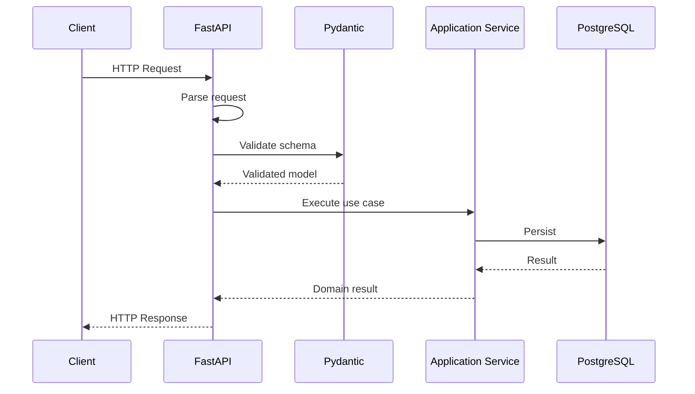
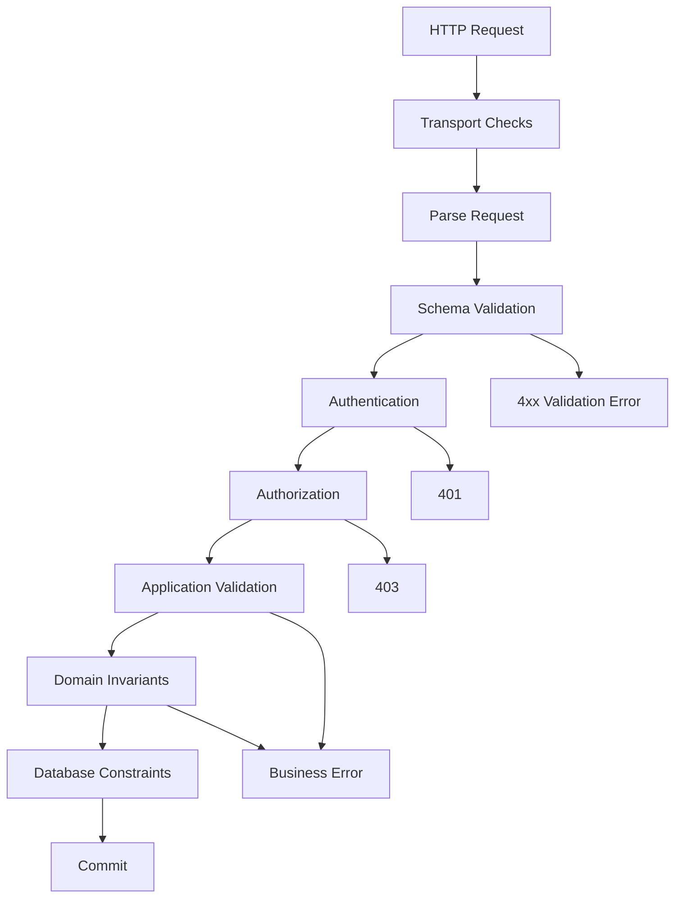

# 14- Request Validation

## Overview

Request validation is the process of verifying that incoming API data is structurally valid, semantically valid, within allowed limits, and safe to pass into application logic.

In a backend service, request data is untrusted input:

```text
Client
  ↓
HTTP Request
  ↓
Parsing
  ↓
Request Validation
  ↓
Authentication
  ↓
Authorization
  ↓
Application Logic
  ↓
Database / External Services
```

Validation provides a controlled boundary between external representations and internal application models.

A production validation strategy should answer:

- Is the request syntactically valid?
- Are required fields present?
- Are field types correct?
- Are values within acceptable ranges?
- Are cross-field relationships valid?
- Is the requested operation allowed?
- Does the input satisfy business invariants?
- Is the payload small enough to process safely?
- Can the validated data be safely persisted or passed downstream?

Validation is necessary for correctness and reliability, but it is also a security boundary. It must not be treated as a substitute for authentication, authorization, database constraints, or output encoding.

---

## Validation Layers

Request validation should occur at multiple boundaries.

```text
HTTP Request
     ↓
Transport Validation
     ↓
Schema Validation
     ↓
Application Validation
     ↓
Domain Validation
     ↓
Database Constraints
```

Each layer has a different responsibility.

| Layer | Responsibility | Example |
|---|---|---|
| HTTP | Protocol and request limits | Content-Type, body size |
| Schema | Shape and basic types | `quantity > 0` |
| Application | Use-case rules | Customer can place order |
| Domain | Business invariants | Order cannot transition from shipped to pending |
| Database | Persistence invariants | Unique email |
| Authorization | Access control | User owns order |

Do not attempt to put every validation rule into the request schema.

---

## Syntax vs Semantics

Validation has at least two distinct dimensions.

### Structural Validation

Checks whether the request has the expected shape:

```json
{
  "customer_id": "cus_123",
  "quantity": 2
}
```

Examples:

- field exists;
- field has the correct type;
- string has an allowed format;
- integer is within a range.

### Semantic Validation

Checks whether the request makes sense in context:

```text
start_date < end_date
```

or:

```text
requested_quantity <= available_quantity
```

Semantic validation often belongs in application or domain logic because it may require database state or other dependencies.

---

## Validation vs Authentication

Validation answers:

```text
Is this request well-formed and acceptable as input?
```

Authentication answers:

```text
Who is making this request?
```

For example:

```http
POST /orders
Authorization: Bearer token
```

The request can be structurally valid while the token is invalid.

These concerns should remain separate.

---

## Validation vs Authorization

A valid request does not imply permission.

```text
PATCH /users/123
{
  "role": "admin"
}
```

The JSON may be perfectly valid.

The operation may still be forbidden because the caller cannot modify roles.

The request pipeline should therefore distinguish:

```text
Validation
    ↓
Authorization
    ↓
Business rules
```

---

## Validation vs Database Constraints

Application validation improves user-facing errors:

```python
if quantity <= 0:
    raise ValidationError("quantity must be positive")
```

Database constraints provide final consistency guarantees:

```sql
CHECK (quantity > 0)
```

Use both when appropriate.

Application validation provides fast and meaningful feedback, while database constraints protect integrity against:

- race conditions;
- multiple application versions;
- administrative scripts;
- background workers;
- direct database access.

---

## Request Validation in FastAPI

FastAPI integrates naturally with Pydantic models.

```python
from pydantic import BaseModel, Field


class CreateOrderRequest(BaseModel):
    customer_id: str
    quantity: int = Field(gt=0)
```

The endpoint can then receive validated data:

```python
from fastapi import FastAPI

app = FastAPI()


@app.post("/orders", status_code=201)
async def create_order(
    request: CreateOrderRequest,
) -> dict:
    return {
        "customer_id": request.customer_id,
        "quantity": request.quantity,
    }
```

The framework parses the request and validates it before the endpoint executes.

---

## Validation Flow in FastAPI

Conceptually:



If schema validation fails:

```text
Client
  ↓
FastAPI
  ↓
Pydantic
  ↓
Validation failure
  ↓
4xx response
```

Application logic should not run for structurally invalid input.

---

## Pydantic Models

Pydantic models provide:

- type validation;
- constraints;
- nested models;
- custom validation;
- serialization;
- schema generation.

Example:

```python
from pydantic import BaseModel, Field


class CreateProductRequest(BaseModel):
    name: str = Field(min_length=1, max_length=200)
    price_cents: int = Field(ge=0)
    quantity: int = Field(gt=0)
```

This establishes explicit input constraints.

---

## String Validation

Strings should usually have explicit boundaries.

```python
from pydantic import BaseModel, Field


class UserRequest(BaseModel):
    username: str = Field(
        min_length=3,
        max_length=50,
    )
```

Without limits, an attacker or accidental client can send unexpectedly large values.

Do not rely solely on frontend validation.

---

## Email Validation

Use a dedicated email type when the API contract requires email syntax.

```python
from pydantic import BaseModel
from pydantic.networks import EmailStr


class CreateUserRequest(BaseModel):
    email: EmailStr
```

Syntax validation does not prove that:

```text
the mailbox exists
the user owns the mailbox
the address can receive email
```

Those require separate workflows.

---

## URL Validation

URLs should be validated according to the intended use.

```python
from pydantic import BaseModel, HttpUrl


class WebhookRequest(BaseModel):
    callback_url: HttpUrl
```

However, syntactically valid URLs are not automatically safe to fetch.

If the server makes outbound requests to the supplied URL, SSRF protection is also required.

---

## Numeric Validation

Use explicit boundaries:

```python
from pydantic import BaseModel, Field


class TransferRequest(BaseModel):
    amount_cents: int = Field(
        gt=0,
        le=10_000_000,
    )
```

This prevents values that are:

- zero;
- negative;
- unexpectedly large.

Business-specific limits may still require application-level checks.

---

## Enum Validation

For finite sets of values:

```python
from enum import StrEnum

from pydantic import BaseModel


class OrderStatus(StrEnum):
    PENDING = "pending"
    CONFIRMED = "confirmed"
    CANCELLED = "cancelled"


class UpdateOrderRequest(BaseModel):
    status: OrderStatus
```

Enums provide a controlled contract.

Avoid accepting arbitrary strings and validating them later throughout the codebase.

---

## Boolean Validation

Boolean inputs deserve attention because some clients may send strings:

```text
true
false
"true"
"false"
"1"
"0"
```

Define the API representation clearly and test framework coercion behavior.

Do not allow ambiguous input formats simply because the validation library happens to coerce them.

For security-sensitive fields, strict types may be preferable.

---

## Strict Validation

Coercion can be convenient:

```text
"42" → 42
```

but can also hide client errors.

Strict validation can require:

```text
42 → valid
"42" → invalid
```

Use strictness where implicit conversion could change semantics or hide malformed integrations.

The correct choice depends on the API contract.

---

## Optional vs Required Fields

These are different concepts:

```python
class UserRequest(BaseModel):
    nickname: str | None = None
```

means the field may be absent or `null`.

For update APIs, distinguish:

```text
field omitted
```

from:

```json
{
  "nickname": null
}
```

The difference can matter:

```text
omitted → leave unchanged
null    → explicitly clear
```

PATCH semantics should define this behavior explicitly.

---

## Defaults

Defaults should represent intentional API semantics.

```python
class SearchRequest(BaseModel):
    limit: int = 50
```

A default should not silently create unsafe resource usage.

For example:

```python
limit: int = 10_000
```

could create expensive database queries.

Use bounded defaults:

```python
limit: int = Field(default=50, le=100)
```

---

## Nested Validation

Complex APIs often contain nested structures.

```python
from pydantic import BaseModel, Field


class OrderItem(BaseModel):
    product_id: str
    quantity: int = Field(gt=0)


class CreateOrderRequest(BaseModel):
    customer_id: str
    items: list[OrderItem] = Field(
        min_length=1,
        max_length=100,
    )
```

Validation should apply at every relevant level.

---

## Collection Limits

Never validate only the item type while ignoring collection size.

This:

```python
items: list[OrderItem]
```

may accept arbitrarily large collections depending on the framework and request limits.

Prefer:

```python
items: list[OrderItem] = Field(
    min_length=1,
    max_length=100,
)
```

This protects:

- CPU;
- memory;
- database work;
- downstream calls.

---

## Request Size Limits

Schema validation happens after some amount of request processing.

Infrastructure should also enforce body-size limits.

```text
Client
  ↓
Nginx / Load Balancer
  ↓
Request size limit
  ↓
FastAPI
  ↓
Schema validation
```

For example, an API may intentionally reject oversized JSON payloads before Python spends resources parsing them.

Large file uploads should generally use object storage or dedicated upload paths rather than unrestricted application memory.

---

## Content-Type Validation

An endpoint expecting JSON should define that contract:

```http
Content-Type: application/json
```

Do not assume the body is JSON merely because the endpoint expects it.

Content negotiation and request parsing should be explicit.

---

## Query Parameter Validation

Query parameters should also be validated.

```python
from fastapi import Query


@app.get("/orders")
async def list_orders(
    limit: int = Query(default=50, ge=1, le=100),
    offset: int = Query(default=0, ge=0),
):
    ...
```

This prevents:

```text
limit = -1
limit = 999999999
offset = -100
```

from reaching database logic.

---

## Path Parameter Validation

Path identifiers can have constraints.

For example:

```python
from uuid import UUID


@app.get("/orders/{order_id}")
async def get_order(order_id: UUID):
    ...
```

The framework can reject malformed UUIDs before application logic runs.

For opaque identifiers:

```text
ord_123
```

use an appropriate schema or explicit validation rule.

---

## Header Validation

Headers can also be part of the API contract.

Examples:

```text
Authorization
Idempotency-Key
If-Match
Content-Type
Accept
```

An idempotency key might require:

```text
non-empty
bounded length
safe character set
```

Do not accept arbitrarily large custom headers.

---

## Validation of Pagination

Pagination parameters should be bounded.

```python
limit: int = Query(
    default=50,
    ge=1,
    le=100,
)
```

For cursor-based pagination:

```python
cursor: str | None = None
```

The cursor should be treated as opaque.

Do not let clients submit arbitrary SQL expressions as pagination state.

---

## Cross-Field Validation

Some constraints depend on multiple fields.

Example:

```text
start_date < end_date
```

A Pydantic model can validate the relationship:

```python
from datetime import date

from pydantic import BaseModel, model_validator


class ReservationRequest(BaseModel):
    start_date: date
    end_date: date

    @model_validator(mode="after")
    def validate_dates(self):
        if self.end_date <= self.start_date:
            raise ValueError(
                "end_date must be after start_date"
            )
        return self
```

This is appropriate for schema-level relationships.

---

## Cross-Field vs Business Validation

Consider:

```text
quantity <= inventory_available
```

This is not purely request validation because inventory is external state.

The flow should be:

```text
Schema validation
    ↓
Application service
    ↓
Read current inventory
    ↓
Business decision
```

Do not place database-dependent business rules into a Pydantic model merely because it is technically possible.

---

## Domain Validation

Domain invariants belong close to domain behavior.

For example:

```python
class Order:
    def cancel(self) -> None:
        if self.status in {"shipped", "delivered"}:
            raise InvalidOrderTransition(
                "Shipped orders cannot be cancelled."
            )

        self.status = "cancelled"
```

This rule remains true regardless of whether the operation came from:

```text
REST API
gRPC
Celery
CLI
Kafka consumer
```

That is why domain validation should not be implemented exclusively at the HTTP boundary.

---

## Application-Level Validation

Application validation often requires external state.

Examples:

```text
Does customer exist?
Does user own resource?
Is inventory available?
Is account active?
Has operation already been performed?
```

These belong in application services or domain services.

Example:

```python
async def create_order(
    request: CreateOrderRequest,
) -> Order:
    customer = await customer_repo.get(request.customer_id)

    if customer is None:
        raise CustomerNotFound(request.customer_id)

    return await order_repo.create(
        customer=customer,
        items=request.items,
    )
```

---

## Database Validation

Database constraints are the final consistency layer.

Examples:

```sql
CREATE TABLE users (
    id UUID PRIMARY KEY,
    email TEXT NOT NULL UNIQUE,
    age INTEGER CHECK (age >= 18)
);
```

Application validation can provide a friendly error, but only the database can enforce uniqueness atomically across concurrent requests.

---

## Race Conditions

This pattern is unsafe:

```text
Request A → check username available
Request B → check username available
Request A → insert
Request B → insert
```

Application validation alone cannot guarantee uniqueness.

Use:

```text
Application validation
        +
Database UNIQUE constraint
```

and handle the resulting constraint violation correctly.

---

## Validation and Transactions

Validation that depends on mutable database state can become stale.

Example:

```text
Check inventory = 1
        ↓
Another transaction buys inventory
        ↓
Your transaction attempts purchase
```

The validation check alone is insufficient.

Use appropriate database transactions, locking, optimistic concurrency, or atomic updates.

Validation determines whether input is acceptable; concurrency control determines whether the operation remains correct under concurrent changes.

---

## Validation Error Design

Clients need stable machine-readable errors.

Example:

```json
{
  "type": "https://api.example.com/problems/validation-error",
  "title": "Validation failed",
  "status": 422,
  "errors": [
    {
      "field": "quantity",
      "code": "greater_than",
      "message": "Quantity must be greater than zero."
    }
  ]
}
```

Prefer stable error codes over requiring clients to parse human-readable messages.

---

## Field-Level Errors

For forms and APIs, field-level errors are useful:

```json
{
  "errors": [
    {
      "field": "email",
      "code": "invalid_format"
    },
    {
      "field": "password",
      "code": "too_short"
    }
  ]
}
```

Keep the schema stable.

Do not expose internal validation-library exception structures as the long-term public API contract.

---

## Error Information Disclosure

Validation errors should be useful without revealing sensitive implementation details.

Avoid:

```text
SQL syntax error at line 42
PostgreSQL constraint users_email_key failed
/home/app/services/user.py:73
```

Instead:

```json
{
  "code": "email_already_exists",
  "message": "An account with this email already exists."
}
```

Internal details belong in secure server-side logs.

---

## Validation and SQL Injection

Parameterized queries remain mandatory.

Validation does not replace parameterization.

Bad:

```python
query = f"""
    SELECT *
    FROM users
    WHERE name = '{name}'
"""
```

Prefer parameterized database APIs.

Even if:

```text
name
```

is validated as a string with a restricted format, SQL construction should still use parameters.

---

## Validation and XSS

Input validation does not eliminate the need for output encoding.

A string can be valid:

```text
<script>...</script>
```

while still being dangerous in an HTML rendering context.

Use context-appropriate output encoding and framework protections.

Validation and output security solve different problems.

---

## Allowlist vs Blocklist

Prefer allowlists.

For example:

```python
ALLOWED_SORT_FIELDS = {
    "created_at",
    "status",
    "total_cents",
}
```

rather than trying to block every dangerous string.

Blocklists are difficult to make complete because attackers can use alternative encodings and representations.

---

## Sort and Filter Validation

Never pass arbitrary client input into SQL syntax.

Bad:

```text
GET /orders?sort=DROP TABLE orders
```

Even if the database library protects values, dynamically constructing SQL identifiers requires separate handling.

Map API fields explicitly:

```python
SORT_COLUMNS = {
    "created_at": Order.created_at,
    "total": Order.total_cents,
}
```

Then reject unknown fields.

---

## Regex Validation

Regular expressions can validate structured input:

```python
from pydantic import BaseModel, Field


class CustomerRequest(BaseModel):
    customer_code: str = Field(
        pattern=r"^cus_[A-Za-z0-9]+$"
    )
```

Be careful with complex regular expressions.

Poorly designed patterns can cause excessive CPU consumption through catastrophic backtracking.

Prefer simple patterns or dedicated parsers for complex formats.

---

## Validation of Dates and Times

Use typed date/time values rather than arbitrary strings where possible.

```python
from datetime import datetime

from pydantic import BaseModel


class EventRequest(BaseModel):
    starts_at: datetime
```

Define timezone semantics explicitly.

For distributed systems, UTC-based timestamps are generally easier to reason about.

Do not assume that a client-provided timestamp has meaningful timezone information unless the contract requires it.

---

## Monetary Values

Avoid floating-point request fields for exact monetary values.

Prefer:

```python
class PaymentRequest(BaseModel):
    amount_cents: int
```

or a decimal representation when appropriate.

Example:

```python
from decimal import Decimal

from pydantic import BaseModel


class PaymentRequest(BaseModel):
    amount: Decimal
```

The representation should match the domain and persistence model.

---

## File Upload Validation

File uploads require more than validating a filename.

Validate:

```text
content length
declared content type
actual file signature where required
extension
filename length
storage path
processing limits
```

Do not trust:

```http
Content-Type: image/png
```

as proof that the uploaded bytes are actually a PNG.

For large files, stream to object storage rather than buffering the entire file in Python memory.

---

## JSON Depth and Complexity

Highly nested JSON can consume significant CPU and memory.

A request may be syntactically valid but operationally abusive.

Consider limits for:

```text
body size
array length
string length
nesting depth
number of fields
```

These limits protect against resource-exhaustion attacks.

---

## Recursive and Nested Input

Be careful with recursive schemas.

For example:

```text
folder
 └── folder
      └── folder
           └── ...
```

The validation library may successfully parse the structure while consuming substantial resources.

Define explicit depth limits when the domain permits arbitrary nesting.

---

## Validation Cost

Validation itself consumes CPU and memory.

For small API payloads this is usually negligible.

For large payloads or high request rates:

```text
10,000 requests/sec
×
large schema validation
```

can become significant.

Measure:

- request latency;
- CPU usage;
- allocation rate;
- validation duration;
- payload sizes.

Do not remove validation merely because it consumes CPU. Optimize only after identifying a real bottleneck.

---

## Validation and Async Code

Validation should normally remain CPU-bounded and fast.

Avoid performing slow I/O inside schema validators:

```text
Pydantic validator
    ↓
HTTP request
```

This creates surprising latency and complicates concurrency.

Use application services for I/O-dependent checks.

---

## Validation and Event Loops

In async services, expensive synchronous validation can still block the event loop.

Potentially expensive operations include:

- huge payload parsing;
- pathological regex;
- massive nested structures;
- expensive custom validators.

Set request limits and keep validators computationally bounded.

---

## Validation in Django

Django provides several validation mechanisms:

```text
Forms
Model validation
Serializers in Django REST Framework
Custom application validation
Database constraints
```

For APIs using Django REST Framework, serializers commonly define request validation:

```python
from rest_framework import serializers


class CreateOrderSerializer(serializers.Serializer):
    customer_id = serializers.UUIDField()
    quantity = serializers.IntegerField(
        min_value=1,
        max_value=100,
    )
```

Serializer validation should remain focused on the API boundary.

Business rules that require application state should be handled in the appropriate service/domain layer.

---

## Validation in Django Models

Django model validation and database constraints are not identical.

For example:

```python
class User(models.Model):
    email = models.EmailField(unique=True)
```

The `unique=True` constraint is important for database integrity.

Do not assume serializer validation alone guarantees uniqueness under concurrent requests.

The database remains authoritative.

---

## Validation in gRPC

gRPC uses strongly defined protobuf schemas:

```text
Client
  ↓
Protobuf encoding
  ↓
gRPC
  ↓
Server
```

Schema typing provides structural validation, but application-level validation is still required.

For example:

```text
quantity > 0
```

is a business rule, not merely a protobuf type rule.

The same layered validation principles apply across REST and gRPC.

---

## Validation Across Microservices

Do not assume validation only happens once.

```text
Client
  ↓
API Gateway
  ↓
Service A
  ↓
Service B
```

Each service owns the validity of the data it receives.

A service should not blindly trust another service merely because it is internal.

Internal APIs can fail due to:

- bugs;
- version mismatches;
- partial deployments;
- compromised credentials;
- malformed messages.

---

## Validation and Kafka

Event consumers should validate incoming messages.

```text
Kafka
  ↓
Consumer
  ↓
Schema validation
  ↓
Application logic
```

Invalid messages should have an explicit handling policy:

```text
reject
retry
dead-letter
quarantine
```

Do not allow malformed events to repeatedly crash consumers indefinitely.

---

## Validation and Celery

Background tasks should not assume that task arguments are valid merely because the task was created internally.

For important workflows:

```text
Celery task
   ↓
Validate task payload
   ↓
Load current state
   ↓
Apply domain rules
```

Task execution may occur much later than request creation, so request-time validation may be stale.

---

## Validation and Redis

Redis-backed validation can support:

- rate limiting;
- idempotency;
- distributed coordination.

But Redis state should not replace authoritative database constraints for durable business invariants unless its consistency guarantees are appropriate.

---

## Validation and API Clients

Outbound API clients should validate important remote responses as well.

The same boundary principle applies:

```text
Remote service
     ↓
API client validation
     ↓
Application model
```

Inbound request validation protects your service from clients.

Outbound response validation protects your service from dependencies.

---

## Validation Pipeline

A production API can use:



The exact ordering can vary by framework and security architecture, but the separation of responsibilities should remain clear.

---

## Validation Ordering

A practical sequence is:

1. Enforce transport-level limits.
2. Parse the request.
3. Validate schema and basic constraints.
4. Authenticate the caller.
5. Authorize the requested resource/action.
6. Perform application-level validation requiring current state.
7. Execute domain logic.
8. Persist using database constraints and transactions.
9. Return a stable response.

Some systems authenticate earlier, particularly when authentication context is required before parsing or routing decisions. The important point is that authentication and authorization are not substitutes for input validation.

---

## Fail Fast

Reject invalid input as early as practical:

```text
Invalid body
    ↓
Reject
```

rather than:

```text
Invalid body
    ↓
Database query
    ↓
Redis lookup
    ↓
External API
    ↓
Finally reject
```

Early validation reduces unnecessary resource consumption.

---

## Validation and Rate Limiting

Rate limiting should usually occur early enough to protect expensive application work.

A useful flow is:

```text
Request
  ↓
Gateway rate limit
  ↓
Body/request limits
  ↓
Schema validation
  ↓
Authentication
  ↓
Application
```

The exact ordering depends on whether the rate limit is:

- IP-based;
- user-based;
- tenant-based;
- API-key-based.

Some limits require authenticated identity and therefore must occur after authentication.

---

## Validation and Caching

Do not cache validation decisions that depend on mutable state without considering staleness.

For example:

```text
"User can access resource X"
```

can become invalid after:

```text
role change
account suspension
resource ownership change
```

Authorization and state-dependent validation require current policy semantics.

---

## Validation and Idempotency

Idempotency keys themselves require validation.

Example:

```python
from pydantic import BaseModel, Field


class IdempotencyRequest(BaseModel):
    key: str = Field(
        min_length=16,
        max_length=128,
    )
```

The server should also define:

- key scope;
- expiration;
- request fingerprinting;
- conflict behavior;
- storage semantics.

An idempotency key should not allow two different operations to accidentally share the same stored result.

---

## Validation and Request Replay

Clients may retry requests.

A validated request can still be replayed later.

Therefore:

```text
validation
≠
idempotency
```

For mutation endpoints, design:

```text
validation
+
authorization
+
idempotency
+
transaction/concurrency control
```

as separate concerns.

---

## Validation and Security Boundaries

Treat every external input source as untrusted:

```text
HTTP
WebSocket
gRPC
Kafka
Celery
CLI
file upload
webhook
```

The validation strategy should follow the trust boundary rather than assuming that internal sources are automatically safe.

---

## Webhook Validation

Webhook requests often require:

```text
schema validation
+
signature verification
+
timestamp validation
+
replay protection
```

For example:

```text
Provider
  ↓
Webhook
  ↓
Validate signature
  ↓
Validate timestamp
  ↓
Validate schema
  ↓
Process event
```

Do not process webhook payloads merely because they have the expected JSON structure.

---

## Validation and Unicode

User input may contain Unicode normalization differences.

For identifiers or security-sensitive comparisons, consider whether normalization is required.

Do not casually normalize every string because normalization can change semantics.

Define canonicalization rules for fields where exact identity matters.

---

## Canonicalization

Validation often needs canonicalization before comparison.

Examples:

```text
email casing policy
phone number normalization
URL normalization
Unicode normalization
identifier formatting
```

Be careful about canonicalization order:

```text
parse
  ↓
normalize
  ↓
validate
  ↓
store
```

or, where appropriate:

```text
parse
  ↓
validate raw constraints
  ↓
normalize
  ↓
validate canonical form
```

The contract should define the behavior.

---

## Validation and Logging

Do not log invalid request bodies indiscriminately.

Invalid input may contain:

```text
passwords
tokens
personal data
payment information
malicious payloads
```

Prefer structured validation errors:

```json
{
  "event": "request_validation_failed",
  "route": "/v1/orders",
  "field": "quantity",
  "code": "greater_than"
}
```

Log enough information for diagnosis without retaining sensitive input.

---

## Monitoring Validation Failures

Useful metrics include:

```text
api_validation_errors_total
api_requests_rejected_total
api_payload_bytes
api_validation_duration_seconds
```

Track by bounded dimensions such as:

```text
route
method
error_code
```

Avoid high-cardinality labels such as:

```text
user_id
email
request_id
```

---

## Validation as an Abuse Signal

A sudden increase in validation failures can indicate:

- client deployment bugs;
- API contract mismatch;
- bot activity;
- fuzzing;
- attack attempts;
- malformed integrations.

For example:

```text
normal:
validation failure = 0.2%

sudden:
validation failure = 40%
```

should trigger investigation rather than simply being treated as harmless client errors.

---

## Observability

A production API should make validation failures distinguishable from server failures.

For example:

```text
4xx validation errors
      ≠
5xx application failures
```

Monitor:

```text
4xx rate
5xx rate
validation error codes
payload sizes
endpoint-specific rejection rates
```

A high validation failure rate may indicate a client integration problem rather than an infrastructure problem.

---

## Testing Request Validation

Validation tests should cover:

- valid requests;
- missing fields;
- wrong types;
- boundary values;
- null values;
- malformed strings;
- oversized strings;
- oversized collections;
- invalid combinations;
- unknown fields;
- authorization-sensitive fields;
- malformed nested objects.

---

## Boundary Testing

For:

```python
quantity: int = Field(gt=0, le=100)
```

test:

```text
0       → invalid
1       → valid
100     → valid
101     → invalid
```

Boundary tests catch many validation bugs.

---

## Property-Based Testing

For complex validators, property-based testing can explore a broader input space.

Useful properties include:

```text
invalid values are always rejected
valid canonical values remain stable
normalization does not produce invalid states
```

Hypothesis can be useful for such testing.

Do not replace explicit business-case tests with property-based testing; use both where appropriate.

---

## Fuzz Testing

Security-sensitive parsers and complex validation logic can benefit from fuzz testing.

Useful targets include:

- JSON parsing;
- custom parsers;
- regex-heavy validation;
- file processing;
- protocol decoders.

The goal is to discover unexpected resource consumption, crashes, or incorrect acceptance.

---

## Contract Testing

API consumers and providers should agree on:

```text
required fields
field types
constraints
error codes
status codes
nullability
pagination
versioning
```

OpenAPI can describe structural contracts, while consumer-driven contract tests can verify compatibility across services.

---

## Validation and API Versioning

Validation rules are part of the API contract.

Changing:

```text
max_length = 255
```

to:

```text
max_length = 50
```

can break existing clients.

Likewise, changing:

```text
field optional → required
```

is potentially breaking.

Treat validation constraints as versioned contract behavior.

---

## Backward-Compatible Validation Changes

Usually safer:

```text
allow an additional optional field
accept a previously valid value
add a response field
```

Potentially breaking:

```text
remove accepted value
tighten numeric range
make optional field required
change nullability
change accepted format
```

Coordinate strictness changes with API consumers.

---

## Production Validation Architecture

A mature Python backend may use:

```text
                     HTTP Request
                          ↓
                ┌──────────────────┐
                │ Gateway / Nginx  │
                │ size/rate limits │
                └────────┬─────────┘
                         ↓
                ┌──────────────────┐
                │ FastAPI / Django │
                │ schema validation│
                └────────┬─────────┘
                         ↓
                ┌──────────────────┐
                │ Authentication   │
                └────────┬─────────┘
                         ↓
                ┌──────────────────┐
                │ Authorization    │
                └────────┬─────────┘
                         ↓
                ┌──────────────────┐
                │ Application      │
                │ validation       │
                └────────┬─────────┘
                         ↓
                ┌──────────────────┐
                │ Domain invariants│
                └────────┬─────────┘
                         ↓
                ┌──────────────────┐
                │ PostgreSQL       │
                │ constraints      │
                └──────────────────┘
```

Each layer protects a different invariant.

---

## Best Practices

- Treat all external input as untrusted.
- Validate at the system boundary.
- Use explicit request schemas.
- Bound string lengths, collection sizes, and numeric ranges.
- Prefer allowlists for finite choices and dynamic identifiers.
- Distinguish omitted fields from explicit `null` where PATCH semantics require it.
- Keep I/O-dependent business validation out of schema validators.
- Keep domain invariants in domain/application logic.
- Back important application checks with database constraints.
- Use transactions and concurrency controls for state-dependent operations.
- Return stable machine-readable validation errors.
- Do not expose internal validation-library structures as a public contract.
- Validate request headers, query parameters, path parameters, and bodies.
- Enforce request-size limits before expensive application processing.
- Use strict validation where implicit coercion could be dangerous.
- Treat internal service, Kafka, Celery, and webhook inputs as untrusted at their respective boundaries.
- Avoid expensive validators that block asyncio event loops.
- Monitor validation failures as both reliability and security signals.
- Test boundary values and malformed input.
- Treat validation rules as part of API compatibility.

## Common Mistakes

### Validating Only on the Frontend

Frontend validation improves user experience but cannot protect the backend.

### Trusting Internal Services

Internal traffic can still contain malformed data because of bugs, version mismatches, compromised systems, or incorrect producers.

### Putting Business Logic in Pydantic Validators

A validator that queries PostgreSQL or calls another API introduces hidden I/O into schema construction.

### Treating Validation as Authorization

A valid `user_id` does not mean the caller can access that user.

### Relying Only on Application Validation for Uniqueness

Concurrent requests can bypass a check-then-insert pattern. Use a database uniqueness constraint.

### Accepting Unbounded Collections

A valid list containing millions of items can still exhaust CPU and memory.

### Using Blocklists for Security

Trying to enumerate every dangerous input is less reliable than defining what the application actually accepts.

### Returning Raw Validation Exceptions

Framework-specific validation structures can become accidental public contracts.

### Logging Complete Invalid Payloads

Malformed requests can contain secrets and sensitive information.

### Assuming 422 Means Every Validation Failure

HTTP status-code conventions vary across frameworks and API contracts. Define and document your own consistent error semantics.

---

## Production Pitfalls

### Validation Drift

The API schema, application logic, database constraints, and documentation can evolve independently.

Keep important constraints aligned.

### Over-Validation

Rejecting harmless future-compatible values can make APIs unnecessarily brittle.

### Under-Validation

Accepting arbitrary input pushes failures deeper into the system where they are more expensive and harder to diagnose.

### Coercion Surprises

Implicit type conversion can cause clients to believe they sent one value while the application processes another.

### Expensive Custom Validators

Complex regex, deep recursion, and large payload processing can consume substantial CPU.

### State-Dependent Validation Races

A validation check against current database state can become stale before the write.

### Validation Error Cardinality

Using raw field names or arbitrary user input as metric labels can create high-cardinality observability data.

### Duplicate Validation Logic

If the same rule is implemented independently in:

```text
FastAPI schema
application service
domain model
database
```

the implementations can eventually disagree.

Centralize each rule at the layer that owns its invariant.

---

## Request Validation Checklist

### Transport

- [ ] Request body size is bounded.
- [ ] Content type is validated.
- [ ] Header sizes are bounded.
- [ ] Rate limits are applied appropriately.
- [ ] Upload size and processing limits exist.

### Schema

- [ ] Required fields are explicit.
- [ ] Types are explicit.
- [ ] Strings have sensible limits.
- [ ] Collections have size limits.
- [ ] Numeric ranges are bounded.
- [ ] Enums use allowlists.
- [ ] Nested structures are constrained.
- [ ] Cross-field relationships are validated.

### Security

- [ ] Authentication is separate from validation.
- [ ] Authorization is enforced separately.
- [ ] Dynamic SQL identifiers use allowlists.
- [ ] SQL values are parameterized.
- [ ] User-controlled URLs receive SSRF protections where needed.
- [ ] File uploads are validated beyond filename/Content-Type.
- [ ] Sensitive payloads are not logged.

### Application and Domain

- [ ] State-dependent rules execute in the appropriate service/domain layer.
- [ ] Domain invariants are not dependent solely on HTTP.
- [ ] Database constraints protect critical invariants.
- [ ] Transactions handle concurrent state changes.
- [ ] Idempotency is designed separately from validation.

### Operations

- [ ] Validation failures are measurable.
- [ ] Validation latency is understood for large payloads.
- [ ] Error codes are stable.
- [ ] Client-impacting validation changes are versioned appropriately.
- [ ] Malformed-input spikes can be investigated.

---

## Interview Traps

### Is Request Validation Enough to Protect a Database?

No. Validation improves input correctness, but database constraints, parameterized queries, authorization, and transactions are still required.

### Where Should Business Validation Live?

Rules that depend only on request structure can live in request schemas. Rules requiring current application state belong in application/domain logic, and durable invariants should also be enforced by the database where appropriate.

### Why Validate Collection Size?

A structurally valid collection can still contain enough elements to exhaust CPU, memory, database connections, or downstream capacity.

### Why Is Frontend Validation Not a Security Control?

Clients are untrusted and can be bypassed entirely. The backend must independently validate every request.

### Why Can Application-Level Uniqueness Checks Fail?

Two concurrent requests can both observe the value as available before either inserts it. A database unique constraint provides atomic enforcement.

### Should Pydantic Validators Call the Database?

Generally no. Schema validation should remain predictable and computationally bounded. Database-dependent checks belong in application services or domain logic.

### Does Validation Prevent SQL Injection?

No. SQL parameterization is still required. Validation may reduce accepted input but should never be considered a substitute for safe query construction.

### Does Validation Prevent XSS?

No. XSS prevention depends on context-appropriate output encoding and browser/application security controls.

### Why Are Validation Rules Part of API Compatibility?

Changing a constraint such as maximum length, allowed enum values, nullability, or required fields can break existing clients even when endpoint URLs remain unchanged.

### Why Are Database Constraints Still Needed?

They enforce invariants atomically at the authoritative persistence boundary and protect against concurrency races and writes originating outside the normal HTTP path.

### What Is the Difference Between Schema Validation and Domain Validation?

Schema validation determines whether an external representation has an acceptable structure. Domain validation determines whether the resulting operation is valid according to business rules and current domain state.

### Why Can Validation Become a Performance Problem?

Parsing and validating large or deeply nested inputs consumes CPU and memory. At high request rates, expensive validation can become an event-loop or worker bottleneck.

## Key Takeaways

- **Validate at every trust boundary:** schema validation protects the HTTP boundary, while application/domain validation and database constraints protect business invariants and persistence integrity.
- **Keep validation responsibilities separate:** request schemas should handle structure and bounded input; application services handle state-dependent rules; domain models enforce business invariants; databases enforce durable constraints.
- **Bound resource consumption:** validate body sizes, string lengths, collection sizes, nesting, numeric ranges, and upload limits to protect CPU, memory, databases, and downstream services.
- **Validation is not security by itself:** authentication, authorization, parameterized queries, output encoding, SSRF defenses, file-upload controls, and secret handling remain separate security requirements.
- **Treat validation as part of the API contract:** stable error codes, explicit constraints, boundary tests, observability, and compatibility management prevent validation changes from becoming unexpected client or production failures.