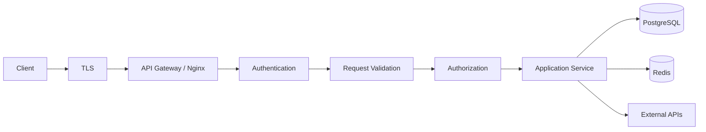
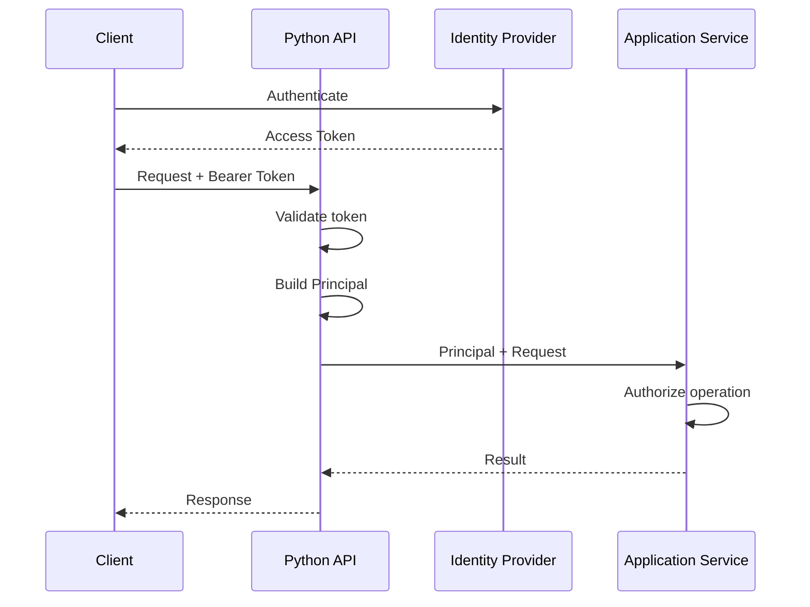

# 15- Authentication and Authorization

## Overview

Authentication and authorization are the security controls that determine **who a caller is** and **what that caller is allowed to do**.

They are related but fundamentally different:

```text
Authentication
    ↓
Who are you?
    ↓
Identity

Authorization
    ↓
What are you allowed to do?
    ↓
Permissions
```

A production backend commonly processes a request through:

```text
Client
  ↓
TLS
  ↓
Authentication
  ↓
Request Validation
  ↓
Authorization
  ↓
Application Logic
  ↓
Database / External Services
```

Authentication establishes an identity. Authorization evaluates that identity against a policy and the resource being accessed.

Typical authentication mechanisms include:

- username/password;
- session cookies;
- API keys;
- OAuth 2.0;
- OpenID Connect;
- access tokens;
- mutual TLS;
- service identities;
- cloud workload identities.

Typical authorization models include:

- role-based access control;
- permission-based access control;
- resource ownership;
- attribute-based access control;
- policy-based access control.

A secure Python backend should treat authentication and authorization as explicit architectural boundaries rather than scattered conditional checks.

---

## Authentication vs Authorization

| Concern | Authentication | Authorization |
|---|---|---|
| Question | Who are you? | What can you do? |
| Input | Credentials/token/session | Identity + resource + action + context |
| Output | Authenticated identity | Allow/deny decision |
| Typical mechanism | OAuth/OIDC/session/password | RBAC/ABAC/policy/ownership |
| Failure | `401 Unauthorized` | `403 Forbidden` |
| Example | Validate access token | Check user can edit order |
| Frequency | Often every request | Usually every protected operation |

A request can be authenticated but unauthorized:

```text
User = alice
Action = delete_user
Target = bob
Result = forbidden
```

---

## Security Architecture

A typical production architecture looks like:



Authentication and authorization should remain explicit even when implemented through framework middleware or dependencies.

---

## Identity

An authenticated identity should have a stable representation.

For example:

```python
from dataclasses import dataclass


@dataclass(frozen=True, slots=True)
class Principal:
    subject: str
    tenant_id: str | None
    roles: frozenset[str]
```

The application can then reason about:

```python
principal.subject
principal.tenant_id
principal.roles
```

rather than repeatedly decoding raw HTTP headers or JWT payloads.

---

## Principal

A **principal** is the identity acting on a request.

It can represent:

- a human user;
- a service;
- an API client;
- a machine identity;
- a scheduled job.

For example:

```text
Principal
├── subject
├── tenant
├── roles
├── permissions
└── authentication context
```

The principal should contain only information that is trusted according to the authentication mechanism.

---

## Authentication Flow

A token-based request commonly follows:



The application does not need to authenticate the user from scratch on every request when using an externally issued access token. It must, however, validate the token according to the contract of the issuing authority.

---

## Authentication Mechanisms

| Mechanism | Common use | Main concern |
|---|---|---|
| Session cookie | Browser applications | Session storage and CSRF |
| Access token | APIs | Token validation and lifecycle |
| OAuth 2.0 | Delegated API access | Correct grant and scope design |
| OpenID Connect | User identity | Identity and token validation |
| API key | Machine/API access | Secret management and rotation |
| mTLS | Service-to-service | Certificate lifecycle |
| Cloud identity | AWS/service workloads | IAM and workload configuration |
| Basic authentication | Limited legacy/internal use | Credential exposure and rotation |

No authentication mechanism is inherently secure without correct implementation and operational controls.

---

## Password Authentication

Passwords should never be stored directly.

Store a password-derived hash using a password hashing algorithm designed for this purpose, such as:

- Argon2id;
- bcrypt;
- another appropriately configured password hashing scheme supported by the platform.

Conceptually:

```text
Password
   ↓
Password hashing function
   ↓
Salt + computationally expensive hash
   ↓
Database
```

During authentication:

```text
Submitted password
       ↓
Password verifier
       ↓
Stored password hash
       ↓
Match / reject
```

Do not use general-purpose cryptographic hashes such as SHA-256 directly for password storage.

---

## Password Hashing

Password hashing should be:

- salted;
- computationally expensive;
- resistant to GPU/ASIC attacks where practical;
- configurable for increasing hardware capability.

Never implement password hashing manually.

Use a well-maintained security library and its recommended configuration.

---

## Password Authentication Flow

```text
POST /login
    ↓
Validate credentials format
    ↓
Lookup account
    ↓
Verify password hash
    ↓
Establish authenticated session/token
    ↓
Return authentication result
```

Authentication failure should not reveal whether a username or email exists.

Prefer:

```text
Invalid credentials
```

over:

```text
User does not exist
```

---

## Account Security

Authentication systems commonly need:

- rate limiting;
- login attempt controls;
- credential rotation;
- password reset;
- account recovery;
- MFA;
- session invalidation;
- suspicious-login detection;
- audit logging.

Do not rely solely on password complexity rules as the primary security control.

---

## Multi-Factor Authentication

MFA adds an additional authentication factor.

Typical factors include:

```text
Something you know
    ↓
Password

Something you have
    ↓
Security key / authenticator device

Something you are
    ↓
Biometric
```

For high-risk operations, step-up authentication may be appropriate:

```text
Authenticated session
       ↓
Sensitive operation
       ↓
Additional authentication
       ↓
Authorize operation
```

---

## Session-Based Authentication

A session-based system commonly uses:

```text
Browser
  ↓
Session cookie
  ↓
Backend
  ↓
Session store
```

The cookie contains a session identifier rather than the full user state.

Example:

```http
Set-Cookie: session_id=...; Secure; HttpOnly; SameSite=Lax
```

The server maps the identifier to authenticated state.

---

## Session Cookie Security

Important cookie attributes include:

| Attribute | Purpose |
|---|---|
| `Secure` | Send only over HTTPS |
| `HttpOnly` | Prevent JavaScript access |
| `SameSite` | Restrict cross-site cookie sending |
| `Path` | Restrict applicable paths |
| `Domain` | Control cookie scope |
| `Max-Age` / `Expires` | Control lifetime |

Cookie configuration should match the application's browser and cross-origin requirements.

---

## Session Storage

Sessions can be stored in:

- application memory;
- Redis;
- a relational database;
- another distributed session store.

For multiple application replicas:

```text
Pod A ─┐
Pod B ─┼──> Redis Session Store
Pod C ─┘
```

Process-local sessions require sticky routing or another architecture and generally complicate horizontal scaling.

---

## Stateless Access Tokens

A JWT access token commonly contains claims such as:

```json
{
  "iss": "https://identity.example.com",
  "sub": "user-123",
  "aud": "orders-api",
  "exp": 1799000000,
  "scope": "orders:read orders:write"
}
```

The API validates:

- signature;
- issuer;
- audience;
- expiration;
- relevant claims.

A valid signature alone is not sufficient.

---

## JWT

JWT is a token format, not an authentication architecture.

A JWT can be:

```text
Header
+
Payload
+
Signature
```

The payload is encoded, not inherently encrypted.

Therefore:

```text
JWT payload ≠ secret storage
```

Do not put sensitive information into a JWT merely because it is signed.

---

## JWT Validation

A resource server should validate the claims required by its security contract.

Typical checks:

```text
signature
issuer
audience
expiration
not-before
algorithm policy
required scopes/claims
```

Example conceptual flow:

```text
Authorization header
        ↓
Extract bearer token
        ↓
Decode/parse token
        ↓
Verify signature
        ↓
Validate issuer
        ↓
Validate audience
        ↓
Validate expiration
        ↓
Build Principal
```

Use a maintained JWT/OIDC library rather than implementing cryptographic verification yourself.

---

## JWT Key Rotation

Identity providers may rotate signing keys.

A production service should support key rotation without requiring an emergency deployment.

A common pattern is:

```text
API
 ↓
JWKS cache
 ↓
Identity provider
 ↓
Current public keys
```

The API validates the token using the appropriate public key identified by the token metadata and trusted issuer configuration.

Cache keys with controlled refresh behavior.

---

## Token Expiration

Access tokens should generally have bounded lifetimes appropriate to the application's threat model.

Short-lived access tokens reduce the window of exposure if stolen.

Longer-lived sessions can be supported through refresh mechanisms.

The design must balance:

```text
security
vs
user experience
vs
operational complexity
```

---

## Refresh Tokens

Refresh tokens allow a client to obtain new access tokens without requiring the user to authenticate again.

Conceptually:

```text
Refresh Token
      ↓
Identity Provider
      ↓
New Access Token
```

Refresh tokens require strong protection because they often have greater lifecycle value than short-lived access tokens.

For browser applications, follow the security model recommended by the identity provider rather than designing token storage casually.

---

## OAuth 2.0

OAuth 2.0 is primarily an authorization framework for delegated access.

It answers:

```text
Can application A access resource B on behalf of identity C?
```

OAuth flows should be selected according to the client type and threat model.

For modern browser-based user authentication, OAuth 2.0 is commonly combined with OpenID Connect.

---

## OpenID Connect

OpenID Connect adds an identity layer on top of OAuth 2.0.

Conceptually:

```text
OAuth 2.0
    +
Identity claims
    ↓
OpenID Connect
```

Use OIDC when the application needs authenticated user identity from an identity provider.

---

## OAuth Scopes

Scopes represent delegated permissions.

Example:

```text
orders:read
orders:write
payments:read
```

A resource server should verify that the token has the required scope for the operation.

Do not treat the presence of a token as permission to perform every operation.

---

## Roles

Role-based authorization groups permissions:

```text
admin
manager
support
customer
```

Example:

```python
if "admin" not in principal.roles:
    raise Forbidden()
```

Roles are simple and useful, but they can become difficult to manage when permissions depend heavily on resources and context.

---

## Permissions

Permission-based authorization expresses capabilities directly:

```text
orders:read
orders:create
orders:update
orders:cancel
```

This is often more precise than large role hierarchies.

A role can then map to permissions:

```text
admin
 ├── orders:read
 ├── orders:create
 ├── orders:update
 └── orders:delete
```

---

## RBAC

Role-Based Access Control:

```text
User
 ↓
Role
 ↓
Permissions
 ↓
Action
```

Example:

```text
alice
  ↓
support_agent
  ↓
tickets:read
tickets:update
```

RBAC works well when authorization rules are relatively stable and organizational roles map cleanly to capabilities.

---

## Resource Ownership

Many APIs need ownership checks:

```text
User A
  ↓
GET /orders/order-123
  ↓
Does order-123 belong to User A?
```

Authorization must evaluate the resource itself.

A check such as:

```python
if principal.subject:
    ...
```

is not sufficient.

---

## Object-Level Authorization

Object-level authorization asks:

```text
Can this principal perform this action
on this specific resource?
```

Example:

```python
if order.customer_id != principal.subject:
    raise Forbidden()
```

This is different from:

```text
Does the user have the "orders:read" permission?
```

A secure system often needs both.

---

## RBAC + Ownership

A common policy is:

```text
Permission check
      +
Resource ownership
```

Example:

```text
Customer:
    orders:read
    only own orders

Support:
    orders:read
    any customer order
```

This is more expressive than roles alone.

---

## Attribute-Based Access Control

ABAC evaluates attributes such as:

```text
user.department
resource.owner_id
resource.region
request.ip
request.time
resource.classification
```

Conceptually:

```text
Principal attributes
+
Resource attributes
+
Action
+
Environment
        ↓
Policy decision
```

ABAC is powerful but introduces policy complexity.

---

## Policy-Based Authorization

For larger systems, centralizing authorization policy can be useful:

```text
Application
    ↓
Authorization Service / Policy Engine
    ↓
Allow / Deny
```

Examples include dedicated policy engines or a shared authorization service.

The policy system should be introduced when authorization complexity justifies the additional infrastructure.

---

## Authorization Function

A simple authorization boundary might be:

```python
def require_permission(
    principal: Principal,
    permission: str,
) -> None:
    if permission not in principal.permissions:
        raise Forbidden()
```

Resource checks can remain explicit:

```python
def require_order_access(
    principal: Principal,
    order: Order,
) -> None:
    if (
        "orders:read:any" not in principal.permissions
        and order.customer_id != principal.subject
    ):
        raise Forbidden()
```

Centralization reduces duplicated authorization logic while preserving business context.

---

## FastAPI Authentication

FastAPI can use dependencies for authentication.

Conceptually:

```python
from fastapi import Depends


async def get_current_principal() -> Principal:
    token = ...
    return validate_access_token(token)


@app.get("/orders/{order_id}")
async def get_order(
    order_id: str,
    principal: Principal = Depends(get_current_principal),
):
    ...
```

The dependency establishes identity.

Authorization should still be explicit for the operation.

---

## FastAPI Authorization

A permission dependency can build on authentication:

```python
from fastapi import Depends


def require_permission(permission: str):
    async def dependency(
        principal: Principal = Depends(get_current_principal),
    ) -> Principal:
        if permission not in principal.permissions:
            raise Forbidden()
        return principal

    return dependency
```

Then:

```python
@app.post("/orders")
async def create_order(
    principal: Principal = Depends(
        require_permission("orders:create")
    ),
):
    ...
```

Resource-specific checks still belong in application logic where resource state is available.

---

## Django Authentication

Django provides established authentication primitives including:

- users;
- sessions;
- authentication middleware;
- permissions;
- groups.

Django REST Framework adds API-oriented authentication and permission mechanisms.

The same conceptual separation applies:

```text
Authentication
    ↓
Principal
    ↓
Permission
    ↓
Object-level authorization
```

---

## Service-to-Service Authentication

Internal services should authenticate each other.

Common approaches include:

- OAuth 2.0 client credentials;
- mTLS;
- cloud workload identities;
- signed service tokens.

Do not rely solely on:

```text
"request came from internal network"
```

Network location is not sufficient identity.

---

## Service-to-Service Authorization

Authentication answers:

```text
Which service is calling?
```

Authorization answers:

```text
Is this service allowed to perform this operation?
```

Example:

```text
Order Service
     ↓
Identity: order-service
     ↓
Permission: inventory:reserve
     ↓
Inventory Service
```

Service identity should be tied to explicit permissions.

---

## API Keys

API keys are useful for relatively simple machine-to-machine integrations.

A production API-key system should support:

- hashing or secure storage where appropriate;
- key identifiers;
- rotation;
- expiration;
- revocation;
- scopes;
- usage auditing.

Do not store API keys in source code.

---

## API Key Rotation

A safe rotation process supports overlap:

```text
Old key ────────────────┐
                        │
New key ────────┐       │
                ↓       ↓
            transition
                ↓
             old revoked
```

This avoids requiring all consumers to update simultaneously.

---

## Authorization and Multi-Tenancy

Multi-tenant systems require tenant isolation.

A principal may contain:

```python
@dataclass(frozen=True, slots=True)
class Principal:
    subject: str
    tenant_id: str
    permissions: frozenset[str]
```

Every tenant-scoped query must enforce the tenant boundary.

For example:

```python
orders = await repo.list_orders(
    tenant_id=principal.tenant_id,
)
```

Do not rely on frontend-supplied tenant identifiers.

---

## Tenant Isolation

A dangerous pattern is:

```http
GET /orders?tenant_id=tenant-b
```

with the server trusting the supplied tenant.

The server should derive tenant context from the authenticated identity or an independently authorized relationship.

```text
Token
  ↓
Principal
  ↓
Authorized tenant
  ↓
Database query
```

---

## Database-Level Tenant Isolation

For high-assurance multi-tenant systems, PostgreSQL Row-Level Security can provide another enforcement layer.

Conceptually:

```text
Application authorization
        +
PostgreSQL RLS
        ↓
Tenant isolation
```

Defense in depth is valuable for sensitive systems.

---

## Authorization and SQL Queries

Prefer enforcing authorization in the query where possible.

For example:

```python
order = await repo.get_order_for_customer(
    order_id=order_id,
    customer_id=principal.subject,
)
```

rather than:

```python
order = await repo.get_order(order_id)

if order.customer_id != principal.subject:
    raise Forbidden()
```

Both can be valid, but query-level scoping can reduce accidental exposure and unnecessary data retrieval.

The database query must still be parameterized.

---

## IDOR

Insecure Direct Object Reference occurs when an API exposes an identifier but fails to authorize access to the referenced resource.

Dangerous:

```http
GET /users/1001/orders/9001
```

if the server only checks:

```text
order_id = 9001
```

and not whether the caller may access it.

Identifiers are not authorization.

---

## Horizontal Privilege Escalation

A normal user accesses another user's resource:

```text
User A
  ↓
GET /orders/B-123
  ↓
Order belongs to User B
```

This is horizontal privilege escalation.

Object-level authorization prevents it.

---

## Vertical Privilege Escalation

A lower-privileged user performs a higher-privileged operation:

```text
customer
  ↓
POST /admin/users
```

Role/permission checks prevent this.

---

## Mass Assignment

Do not blindly deserialize client fields into privileged models.

Dangerous request:

```json
{
  "name": "Alice",
  "is_admin": true
}
```

If the backend accepts every model field, clients may modify security-sensitive attributes.

Define explicit request schemas:

```python
class UpdateProfileRequest(BaseModel):
    name: str
```

Only authorized administrative APIs should expose administrative fields.

---

## Privilege Boundaries

Separate sensitive operations:

```text
Profile update
     ≠
Role update
     ≠
Permission update
```

Do not combine unrelated security-sensitive fields into generic update endpoints.

---

## Authentication and Request Validation

A request can fail for different reasons:

```text
Malformed request → validation error
Missing credentials → 401
Invalid credentials → 401
Insufficient permission → 403
```

Keep these semantics consistent.

---

## 401 vs 403

A practical distinction:

| Status | Meaning |
|---|---|
| `401 Unauthorized` | Authentication is missing or invalid |
| `403 Forbidden` | Authentication succeeded but access is denied |

Avoid returning `403` for every security failure.

The exact behavior can vary for security reasons, but the API contract should be consistent.

---

## Avoid User Enumeration

Authentication and password-reset endpoints can leak account existence.

Bad:

```text
Email does not exist
```

versus:

```text
Incorrect password
```

Prefer a consistent external response when account enumeration is a concern.

Internal telemetry can retain more detailed classification.

---

## CSRF

CSRF is primarily relevant when browsers automatically attach authentication credentials, especially cookies.

A malicious site may attempt:

```text
Attacker site
    ↓
Browser automatically sends session cookie
    ↓
Victim's API
```

Defenses include:

- SameSite cookies;
- CSRF tokens;
- origin checks;
- appropriate authentication architecture.

Bearer tokens sent explicitly in an `Authorization` header have different browser threat characteristics, but XSS and token-storage risks remain important.

---

## CORS

CORS controls browser cross-origin behavior.

It does not replace authentication or authorization.

```text
CORS
  ≠
Authentication
  ≠
Authorization
```

A server should not treat:

```http
Origin: https://trusted.example.com
```

as proof that the caller is trusted.

---

## Token Storage

Token storage depends on client type.

Avoid making blanket claims such as:

```text
"Always store tokens in localStorage"
```

or:

```text
"Never use cookies"
```

The correct design depends on:

- browser architecture;
- XSS exposure;
- CSRF model;
- same-site deployment;
- backend-for-frontend architecture;
- identity provider.

For browser applications, follow established OAuth/OIDC browser security guidance.

---

## HTTPS

Authentication credentials and tokens must be transmitted over TLS.

Without TLS:

```text
Credentials
    ↓
Network
    ↓
Potential interception
```

TLS provides confidentiality and integrity in transit and authenticates the server when certificate validation succeeds.

---

## Reverse Proxies

Nginx, load balancers, API gateways, and service meshes can terminate TLS.

The architecture may be:

```text
Client
  ↓ HTTPS
Nginx / Load Balancer
  ↓ trusted internal connection
FastAPI
```

The backend must correctly understand which proxy headers it trusts.

Do not blindly trust client-supplied forwarded headers.

---

## Authentication Middleware

Middleware can perform shared authentication concerns:

```text
Request
  ↓
Authentication middleware
  ↓
Principal
  ↓
Endpoint
```

However, middleware should not attempt to make every authorization decision because resource-specific authorization often requires application state.

---

## Authorization Middleware

Global middleware is appropriate for coarse policies:

```text
all requests require authentication
```

Resource-specific rules belong closer to the operation:

```text
user may edit this order
```

A useful division is:

```text
Middleware
    → establish identity

Endpoint/service
    → authorize operation/resource
```

---

## Authorization in the Service Layer

Authorization should not exist only in HTTP handlers.

Consider:

```text
REST API
   ↓
Application Service
   ↓
Domain operation
```

If the same application service can be called by:

```text
REST
gRPC
Celery
Kafka consumer
CLI
```

security rules should remain enforced regardless of transport.

---

## Defense in Depth

Sensitive systems should use multiple controls:

```text
TLS
 ↓
Authentication
 ↓
Authorization
 ↓
Input validation
 ↓
Tenant isolation
 ↓
Database constraints / RLS
 ↓
Audit logging
```

No single security layer should be expected to prevent every class of failure.

---

## Audit Logging

Security-sensitive actions should produce auditable events.

Examples:

```text
user.login
user.logout
permission.changed
role.changed
payment.initiated
api_key.created
api_key.revoked
```

An audit event might contain:

```json
{
  "event": "permission_changed",
  "actor_id": "user-123",
  "target_id": "user-456",
  "permission": "orders:write",
  "timestamp": "2026-09-06T16:30:00Z",
  "trace_id": "abc123"
}
```

Do not log secrets or credentials.

---

## Authentication and Observability

Useful metrics include:

```text
authentication_failures_total
authorization_denials_total
token_validation_failures_total
session_creation_total
session_revocations_total
```

Track bounded dimensions such as:

```text
route
authentication_method
failure_reason
service
```

Avoid high-cardinality metric labels such as raw user IDs.

---

## Security Logging

Security events should be distinguishable from ordinary application logs.

Useful fields include:

```text
event
actor
target
action
result
authentication_method
source
timestamp
trace_id
```

Use structured logging and protect sensitive fields.

---

## Rate Limiting

Authentication endpoints should usually have aggressive abuse controls.

Examples:

```text
/login
/password-reset
/token
/verify-code
```

Rate limits can be based on:

- IP;
- account identifier;
- API key;
- device/session;
- tenant.

Avoid relying on a single dimension because attackers can rotate identifiers.

---

## Brute-Force Protection

Password authentication should consider:

```text
rate limiting
progressive delays
account protections
MFA
credential monitoring
```

Avoid permanent account lockouts that can be abused for denial-of-service unless carefully designed.

---

## Token Revocation

Stateless access tokens are convenient but introduce revocation complexity.

Possible strategies include:

```text
short token lifetime
refresh-token revocation
token versioning
denylist for exceptional cases
introspection
session state
```

The correct approach depends on the security requirements.

---

## Stateless vs Stateful Authentication

| Characteristic | Stateless token | Stateful session |
|---|---|---|
| Server-side session state | Minimal | Required |
| Horizontal scaling | Easy | Requires shared state |
| Immediate revocation | Harder | Easier |
| Token validation | Per request | Session lookup |
| Operational complexity | Token lifecycle | Session infrastructure |
| Typical use | Service APIs | Browser applications |

Neither is universally superior.

---

## Performance

Authentication has a cost:

```text
request
 ↓
token parsing
 ↓
signature verification
 ↓
claim validation
 ↓
authorization
```

For high-throughput APIs, optimize carefully:

- reuse cryptographic key material;
- cache identity-provider metadata appropriately;
- avoid unnecessary remote introspection calls;
- avoid repeated database permission queries;
- use bounded authorization caches where safe.

Security checks should not be removed merely for performance.

---

## Authorization Caching

Permission data can sometimes be cached:

```text
Principal
   ↓
Redis
   ↓
Permissions
```

But permission changes create invalidation requirements.

For security-sensitive authorization:

```text
cache TTL
+
revocation strategy
+
consistency model
```

must be explicit.

Do not cache authorization decisions indefinitely.

---

## Distributed Systems

In microservices:

```text
API Gateway
   ↓
Service A
   ↓
Service B
```

Service B should not automatically trust that Service A performed authorization correctly.

Service B should authenticate the caller/service identity and enforce authorization appropriate to its own resources.

Defense in depth is especially important across independent service boundaries.

---

## Authentication Across Kafka

Kafka consumers do not have an HTTP request context.

Events should carry enough trusted identity/context for downstream processing when required.

For example:

```json
{
  "event_type": "order.created",
  "actor_id": "user-123",
  "tenant_id": "tenant-7",
  "order_id": "order-456"
}
```

The consumer should still enforce its own authorization assumptions.

Do not treat event fields such as `actor_id` as trustworthy merely because they came from Kafka.

Trust depends on producer authentication, topic permissions, message integrity, and the application's threat model.

---

## Authentication Across Celery

Celery tasks may execute later and on different workers.

Do not depend on process-local authentication state.

Persist required identity/context explicitly when appropriate:

```text
Request
  ↓
Validated principal
  ↓
Durable task payload
  ↓
Worker
```

Sensitive credentials should not be placed into task payloads unnecessarily.

---

## Background Job Authorization

A background job often acts as a service identity rather than a human user.

Define:

```text
Who initiated the operation?
Who executes the job?
What permissions does the worker have?
```

These are separate concepts.

For auditability, retain the initiating principal where appropriate without granting the worker arbitrary permissions.

---

## Webhooks

Webhook authentication commonly uses:

```text
signature
+
timestamp
+
replay protection
```

The service should verify the signature over the exact documented payload representation.

Do not trust:

```text
X-User-Id
X-Role
```

headers supplied by arbitrary clients unless they are generated and authenticated by a trusted intermediary.

---

## Secret Management

Never hard-code:

```python
API_KEY = "production-secret"
```

Use:

- AWS Secrets Manager;
- AWS Systems Manager Parameter Store;
- Kubernetes Secrets with appropriate encryption/access controls;
- a dedicated secret-management system.

Environment variables can be useful for configuration delivery, but they are not inherently secure secret storage.

---

## Least Privilege

Every identity should have only the permissions required for its role.

Example:

```text
Order Service
 ├── orders:read
 ├── orders:write
 └── inventory:reserve

No:
 ├── users:delete
 └── billing:admin
```

Least privilege limits blast radius after credential compromise.

---

## Privilege Separation

Separate high-risk operations:

```text
Normal application identity
        ↓
Read/write operational data

Administrative identity
        ↓
Security configuration
Role changes
Key management
```

Avoid giving every service or user administrator privileges for convenience.

---

## Token Claims and Trust

Do not blindly trust claims merely because they exist in a token.

For example:

```json
{
  "role": "admin"
}
```

is meaningful only if:

- the token was issued by a trusted authority;
- the signature was validated;
- issuer and audience are correct;
- the application trusts that issuer's role semantics.

A client-provided JSON field called `role` has no authority by itself.

---

## Authorization Policy Ownership

Authorization rules should have clear ownership.

For example:

```text
Identity Provider
    → authentication identity

Application
    → resource permissions

Domain
    → business invariants

Database
    → persistence integrity
```

Avoid scattering the same security rule across unrelated layers.

---

## Testing Authentication

Authentication tests should cover:

- missing credentials;
- malformed credentials;
- invalid signatures;
- expired tokens;
- wrong issuer;
- wrong audience;
- invalid algorithm;
- revoked sessions;
- invalid passwords;
- rate limits;
- key rotation.

---

## Testing Authorization

Authorization tests should cover:

```text
allowed user
denied user
wrong tenant
wrong resource owner
insufficient role
missing permission
administrative role
service identity
```

For every protected resource, test both:

```text
authenticated + authorized
authenticated + unauthorized
```

---

## Negative Security Tests

Security testing should emphasize denial cases.

Examples:

```text
User A → User B resource
Customer → admin endpoint
Tenant A → Tenant B resource
Expired token → protected endpoint
No token → protected endpoint
Read permission → write operation
```

Authorization bugs frequently occur in missing negative checks rather than successful paths.

---

## Integration Testing

Integration tests should verify:

```text
identity provider
 ↓
token
 ↓
API
 ↓
authorization
 ↓
database
```

For critical security paths, test the actual authentication integration rather than mocking every layer.

---

## Security Regression Testing

Security fixes should become permanent tests.

For example, after fixing an IDOR:

```text
User A cannot access User B's order
```

should remain a regression test.

Authorization bugs are especially suitable for regression suites because a future refactor can accidentally remove a check.

---

## Production Failure Modes

### Identity Provider Outage

If the API requires remote token introspection for every request, an identity-provider outage can become an application outage.

Prefer locally verifiable short-lived tokens where appropriate.

### Key Rotation Failure

Incorrect JWKS caching or refresh logic can cause valid tokens to fail after signing-key rotation.

### Permission Cache Staleness

A revoked permission may remain effective until cache expiration.

### Session Store Failure

A Redis outage can invalidate or disrupt stateful sessions unless availability and fallback behavior are designed.

### Clock Skew

Token expiration depends on time. Excessive clock skew can cause valid tokens to be rejected or expired tokens to be accepted within unintended tolerance windows.

Use synchronized system clocks and carefully configured validation leeway.

---

## High Availability

Authentication infrastructure is part of the application's availability path.

For production systems:

- deploy identity dependencies redundantly;
- avoid unnecessary per-request calls to remote identity providers;
- replicate session stores where required;
- monitor authentication latency;
- design key rotation for failure;
- maintain emergency credential-rotation procedures;
- avoid single-node authorization infrastructure for critical paths.

Security infrastructure should be designed with the same availability discipline as other critical dependencies.

---

## Disaster Recovery

Document recovery procedures for:

```text
identity provider outage
signing-key compromise
credential compromise
session-store loss
authorization policy corruption
API-key leakage
certificate expiration
```

Recovery should include:

- credential rotation;
- key rotation;
- token invalidation strategy;
- restoring policy state;
- restoring audit data;
- emergency access procedures.

---

## Kubernetes Considerations

Kubernetes deployments should avoid embedding long-lived credentials directly into images.

Prefer workload identities and managed secret systems where supported.

Authentication-related configuration may include:

```text
OIDC issuer
audience
JWKS endpoint
client ID
secret reference
session configuration
```

Do not expose secrets through container logs or debug endpoints.

---

## AWS Considerations

AWS workloads should prefer IAM roles and workload identities over static access keys where applicable.

Examples include:

```text
EC2 instance role
ECS task role
EKS workload identity
Lambda execution role
```

This follows least privilege and simplifies credential rotation.

For application-level user authentication, an external or AWS-managed identity provider may issue tokens consumed by FastAPI or Django services.

---

## Nginx and API Gateway

A gateway can provide coarse security controls:

```text
TLS termination
rate limiting
request size limits
IP controls
WAF integration
```

Application services should still enforce authentication and authorization for their own resources.

Do not treat a gateway's existence as permission to remove service-level authorization.

---

## Security Headers

Authentication architecture should also consider browser security headers where applicable:

```text
Strict-Transport-Security
Content-Security-Policy
X-Content-Type-Options
Referrer-Policy
```

Exact headers depend on application behavior.

These controls complement authentication rather than replacing it.

---

## Common Mistakes

### Confusing Authentication and Authorization

Knowing who the caller is does not establish what they can access.

### Trusting User-Supplied Roles

A request field such as:

```json
{"role": "admin"}
```

must never determine authorization.

### Checking Only Authentication

This creates IDOR and privilege-escalation vulnerabilities.

### Storing Passwords as Plaintext

A database compromise then immediately exposes credentials.

### Using SHA-256 Directly for Passwords

General-purpose hashes are too fast for password storage.

### Hard-Coding Secrets

Secrets become exposed through source control, images, logs, or build artifacts.

### Long-Lived Access Tokens

A stolen token remains useful for too long.

### No Token Audience Validation

A token issued for one service may incorrectly be accepted by another service.

### Trusting JWT Payloads Without Signature Verification

JWT payloads are not trustworthy merely because they decode successfully.

### Treating CORS as Authentication

CORS controls browser behavior; it does not establish identity.

### Authorizing Only by Resource ID

Knowing an object identifier does not imply access to that object.

### Mass Assignment

Binding arbitrary request fields to privileged model attributes can allow privilege escalation.

---

## Production Pitfalls

### Authorization in Only One Endpoint

If the same business operation is reachable through another endpoint, worker, or service path, the missing authorization check becomes a security vulnerability.

### Stale Permission Caches

Permission revocations may not take effect immediately.

### Inconsistent Tenant Filtering

One missing tenant condition can expose another tenant's data.

### Overly Broad Service Accounts

A compromised microservice can access every system it has credentials for.

### Token Validation Inconsistency

Different services may interpret issuer, audience, scopes, or algorithms differently.

### Remote Introspection on Every Request

This introduces identity-provider latency and availability into every API call.

### Logging Tokens

Access tokens, refresh tokens, cookies, and API keys must never appear in normal application logs.

### Relying on Internal Networks

Private networking reduces exposure but does not establish application identity or authorization.

---

## Best Practices

- Separate authentication from authorization.
- Establish a trusted principal at the authentication boundary.
- Validate token signature, issuer, audience, expiration, and required claims.
- Use well-maintained security libraries rather than custom cryptography.
- Hash passwords using an appropriate password hashing algorithm.
- Use short-lived access tokens when appropriate.
- Protect refresh tokens and session credentials carefully.
- Use explicit roles and permissions rather than implicit access rules.
- Perform object-level authorization for resource access.
- Enforce tenant boundaries from trusted identity context.
- Protect critical invariants with database constraints and, where appropriate, PostgreSQL RLS.
- Use least-privilege service identities.
- Treat internal services and asynchronous consumers as security boundaries.
- Use secure secret-management systems and rotate credentials.
- Rate-limit authentication and credential-sensitive endpoints.
- Avoid user enumeration where the threat model requires it.
- Never log credentials, tokens, or sensitive authentication payloads.
- Keep authorization logic close to the application/domain operation that owns the resource.
- Test negative authorization paths aggressively.
- Make security-sensitive fixes permanent regression tests.
- Monitor authentication failures and authorization denials.
- Design authentication infrastructure for high availability and key rotation.
- Document credential compromise and emergency-revocation procedures.

## Authentication and Authorization Checklist

### Authentication

- [ ] Credentials are transmitted only over TLS.
- [ ] Passwords use an appropriate password hashing algorithm.
- [ ] Access tokens have bounded lifetimes.
- [ ] JWT signatures are validated.
- [ ] Issuer is validated.
- [ ] Audience is validated.
- [ ] Expiration is validated.
- [ ] Algorithm policy is explicit.
- [ ] Signing-key rotation is supported.
- [ ] Session credentials are protected.
- [ ] Authentication endpoints are rate limited.

### Authorization

- [ ] Authentication is not treated as authorization.
- [ ] Permissions are explicit.
- [ ] Resource-level access is checked.
- [ ] Tenant isolation is enforced.
- [ ] Privileged fields cannot be mass-assigned.
- [ ] Service identities use least privilege.
- [ ] Sensitive operations require appropriate permissions.
- [ ] Authorization is enforced across all access paths.
- [ ] Revocation behavior is defined.

### Security

- [ ] Secrets are not hard-coded.
- [ ] Tokens are not logged.
- [ ] CORS is not used as an authentication mechanism.
- [ ] CSRF protections match the browser authentication model.
- [ ] SSRF and other application-specific threats are handled separately.
- [ ] Internal traffic is not implicitly trusted.
- [ ] Security-sensitive events are audited.

### Reliability

- [ ] Identity-provider dependencies are monitored.
- [ ] Session storage is highly available when required.
- [ ] JWKS/key rotation failure modes are tested.
- [ ] Clock synchronization is maintained.
- [ ] Authorization cache staleness is understood.
- [ ] Emergency credential rotation is documented.

### Testing

- [ ] Missing credentials are tested.
- [ ] Invalid credentials are tested.
- [ ] Expired tokens are tested.
- [ ] Invalid issuer/audience are tested.
- [ ] Unauthorized resource access is tested.
- [ ] Cross-tenant access is tested.
- [ ] Privilege escalation is tested.
- [ ] Mass assignment is tested.
- [ ] Security regressions are automated.

## Interview Traps

### What Is the Difference Between Authentication and Authorization?

Authentication establishes identity. Authorization determines whether that identity can perform a particular action against a particular resource under the current policy.

### Is a Valid JWT Automatically Authorized?

No. A valid token establishes trusted claims from the issuer. The application must still evaluate scopes, roles, resource ownership, tenant boundaries, and other authorization rules.

### Why Validate JWT Audience?

A token can be legitimately issued by a trusted identity provider for one service but not intended for another. Audience validation prevents a token issued for the wrong resource server from being accepted.

### Is JWT Encrypted?

Not by default. Standard JWTs are commonly signed and encoded, not encrypted. Their payload should therefore not be treated as secret.

### Why Are Object-Level Authorization Checks Necessary?

A permission such as `orders:read` may establish that a user can read orders generally, but it does not necessarily establish that the user can read every order.

### Why Can't a Database Lookup Alone Prevent IDOR?

Fetching an object by ID without applying an authorization constraint can return another user's resource. The query or subsequent authorization check must establish ownership or permission.

### Why Are Database Constraints Relevant to Authorization?

Database constraints do not replace authorization, but database-level isolation mechanisms such as PostgreSQL Row-Level Security can provide defense in depth against application authorization mistakes.

### Why Is CORS Not Authentication?

CORS controls whether browsers allow cross-origin frontend code to access responses. Non-browser clients can ignore CORS entirely.

### Why Are Short-Lived Access Tokens Useful?

They reduce the useful lifetime of a stolen token, limiting the exposure window.

### What Is the Trade-Off of Stateless JWT Authentication?

It scales well because services can validate tokens locally, but immediate revocation is harder and key/token lifecycle management becomes more important.

### Why Can Permission Caching Be Dangerous?

A revoked permission may remain effective until the cache expires or is invalidated. The acceptable staleness window must therefore be an explicit security decision.

### Should Every Microservice Trust the API Gateway?

No. The gateway can provide useful perimeter controls, but services should authenticate and authorize requests according to their own resource boundaries.

### Why Is Least Privilege Important for Service Accounts?

A compromised service can only access the resources granted to its identity, reducing blast radius.

### Why Should Authorization Not Live Only in HTTP Routes?

The same operation may be reachable through REST, gRPC, Celery, Kafka, CLI tools, or internal service calls. Security rules must survive transport changes.

### What Happens If the Identity Provider Goes Down?

The answer depends on the architecture. Locally verifiable short-lived tokens can allow existing authenticated requests to continue while new authentication may fail. Remote introspection on every request creates a stronger availability dependency.

## Key Takeaways

- **Authentication establishes identity; authorization decides access:** every protected operation should evaluate both the caller's trusted identity and the requested action/resource.
- **Authorization must be resource-aware:** roles and permissions are insufficient by themselves when users can access specific objects or tenants; enforce ownership, tenant isolation, and object-level policies.
- **Treat tokens, sessions, and credentials as security-critical state:** validate JWT signatures and claims correctly, protect session/refresh credentials, use secure secret management, and design rotation and revocation explicitly.
- **Security must survive architecture boundaries:** REST, gRPC, Kafka, Celery, microservices, and background workers should not bypass authentication or authorization simply because they are internal.
- **Design for both security and operations:** least privilege, rate limiting, audit logging, negative security tests, observability, high availability, key rotation, and emergency credential-recovery procedures are part of production authentication architecture.