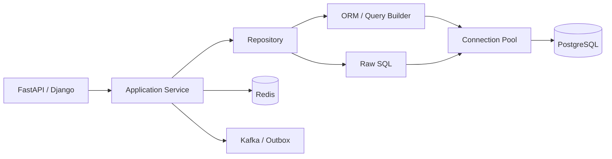

# 17- SQL Integration

## Overview

SQL integration is the application-layer boundary through which Python services query, modify, and transact against relational databases such as PostgreSQL.

Database connectivity answers **how Python connects to a database**. SQL integration goes further and addresses **how application code safely and efficiently expresses database operations**.

A production request commonly flows through:

```text
HTTP Request
    ↓
Authentication
    ↓
Request Validation
    ↓
Application Service
    ↓
Repository / Data Access Layer
    ↓
SQL / ORM
    ↓
Connection Pool
    ↓
PostgreSQL
    ↓
Rows / Command Result
    ↓
Domain / DTO Mapping
    ↓
HTTP Response
```

Good SQL integration should provide:

- parameterized queries;
- explicit transaction boundaries;
- predictable connection and session lifecycles;
- efficient query patterns;
- clear mapping between database and application models;
- correct concurrency behavior;
- bounded memory usage;
- observability;
- testability;
- secure database access.

The goal is not to hide SQL completely. Senior backend engineers should understand the SQL generated or executed by the application and how PostgreSQL will execute it.

---

## SQL Integration Layers

A mature Python backend typically separates concerns:

```text
Application Service
       ↓
Repository / Data Access
       ↓
ORM / Query Builder / Raw SQL
       ↓
Database Driver
       ↓
Connection Pool
       ↓
PostgreSQL
```

| Layer | Responsibility |
|---|---|
| Application service | Business behavior and orchestration |
| Repository | Persistence operations |
| ORM | Object/query mapping and query construction |
| Query builder | Programmatic SQL construction |
| Raw SQL | Precise database operations |
| Driver | PostgreSQL protocol communication |
| Pool | Connection reuse and lifecycle |
| PostgreSQL | Query execution and durable state |

The exact number of layers should match application complexity. Do not introduce abstractions merely to create more files.

---

## SQL vs ORM

Python applications commonly use three approaches:

| Approach | Strength | Limitation |
|---|---|---|
| Raw SQL | Maximum SQL control | More manual mapping |
| Query builder | Structured SQL composition | Still requires SQL knowledge |
| ORM | Productivity and object mapping | Can hide inefficient queries |

Typical technologies include:

- `psycopg`;
- SQLAlchemy;
- Django ORM;
- SQLModel;
- database-specific libraries.

An ORM does not eliminate SQL. It changes how SQL is constructed and mapped.

---

## Raw SQL

Raw SQL is appropriate when database behavior matters more than ORM abstraction.

Example:

```python
from typing import Any

import psycopg


def get_order(
    connection: psycopg.Connection[Any],
    order_id: str,
) -> tuple[Any, ...] | None:
    with connection.cursor() as cursor:
        cursor.execute(
            """
            SELECT id, customer_id, status, total_amount
            FROM orders
            WHERE id = %s
            """,
            (order_id,),
        )
        return cursor.fetchone()
```

Raw SQL is especially useful for:

- complex joins;
- PostgreSQL-specific features;
- reporting queries;
- bulk operations;
- performance-critical queries;
- recursive CTEs;
- window functions;
- carefully optimized data access.

The trade-off is that mapping, validation, and portability become application responsibilities.

---

## Parameterized SQL

Never concatenate untrusted values into SQL.

Unsafe:

```python
query = f"""
SELECT id
FROM users
WHERE email = '{email}'
"""
```

Safe:

```python
cursor.execute(
    """
    SELECT id
    FROM users
    WHERE email = %s
    """,
    (email,),
)
```

Parameterized queries separate SQL syntax from values.

This protects against SQL injection and also lets the driver handle appropriate parameter encoding.

---

## SQL Injection

SQL injection occurs when untrusted input changes SQL syntax.

```text
Untrusted input
      ↓
String concatenation
      ↓
SQL syntax changes
      ↓
Unexpected query execution
```

Parameterization changes the boundary:

```text
SQL template
    +
parameter values
    ↓
Database driver
    ↓
PostgreSQL
```

ORMs generally parameterize ordinary values automatically, but unsafe raw SQL and dynamic SQL can still introduce injection vulnerabilities.

---

## Dynamic SQL

SQL parameters normally represent values, not arbitrary identifiers.

Suppose an API allows sorting:

```http
GET /orders?sort=created
```

Do not insert arbitrary client input into `ORDER BY`.

Use an allowlist:

```python
SORT_COLUMNS = {
    "created": "created_at",
    "amount": "total_amount",
    "status": "status",
}

column = SORT_COLUMNS.get(sort)
if column is None:
    raise ValueError("Unsupported sort field")

query = f"""
SELECT id, status, total_amount
FROM orders
ORDER BY {column}
"""
```

The SQL fragment is safe because it comes from trusted application configuration rather than directly from the request.

---

## SQLAlchemy Core

SQLAlchemy Core provides SQL-oriented abstractions without requiring ORM entities.

Example:

```python
from sqlalchemy import select

statement = (
    select(orders.c.id, orders.c.status)
    .where(orders.c.customer_id == customer_id)
    .order_by(orders.c.created_at.desc())
)
```

This can be useful when the application wants:

- explicit SQL semantics;
- composable queries;
- type-aware query construction;
- less ORM state management.

---

## SQLAlchemy ORM

SQLAlchemy ORM maps database rows to Python objects.

Conceptually:

```text
PostgreSQL row
      ↓
ORM mapping
      ↓
Python object
```

Example:

```python
result = await session.execute(
    select(Order)
    .where(Order.customer_id == customer_id)
)

orders = result.scalars().all()
```

ORM entities are useful when application behavior naturally operates on domain-oriented objects.

However, loading large object graphs can create significant memory and query overhead.

---

## Django ORM

Django provides an integrated ORM.

Example:

```python
orders = (
    Order.objects
    .filter(customer_id=customer_id)
    .order_by("-created_at")
)
```

Django QuerySets are lazily evaluated.

The query may not execute until the QuerySet is consumed.

```python
orders = Order.objects.filter(status="pending")

# Database access occurs here.
for order in orders:
    process(order)
```

This behavior is useful but can also hide database access inside ordinary-looking Python code.

---

## Lazy Query Evaluation

ORM query construction and query execution are often separate operations.

```text
Query construction
      ↓
Query object
      ↓
Evaluation
      ↓
SQL execution
      ↓
Rows
```

Understanding evaluation boundaries helps prevent:

- accidental repeated queries;
- unexpected database access;
- N+1 patterns;
- excessive result materialization.

---

## N+1 Queries

N+1 occurs when one query loads a collection and additional queries are executed for each item.

```text
Query 1
  ↓
100 users

Query 2 → user 1 orders
Query 3 → user 2 orders
...
Query 101 → user 100 orders
```

The Python code may look harmless:

```python
for user in users:
    print(user.orders)
```

but can generate many database round trips.

The solution depends on the ORM and access pattern:

- joins;
- eager loading;
- prefetching;
- batch queries;
- explicit repository methods.

---

## Django Query Optimization

Django provides tools such as:

```python
Order.objects.select_related("customer")
```

for suitable foreign-key or one-to-one relationships.

For collections:

```python
Customer.objects.prefetch_related("orders")
```

The correct choice depends on relationship cardinality and query requirements.

Do not blindly add eager loading everywhere because unnecessary joins or large result sets can also hurt performance.

---

## SQLAlchemy Eager Loading

SQLAlchemy provides loading strategies such as:

```python
from sqlalchemy import select
from sqlalchemy.orm import selectinload

statement = (
    select(Customer)
    .options(selectinload(Customer.orders))
)
```

The appropriate strategy depends on:

- relationship cardinality;
- result size;
- query shape;
- latency;
- memory.

Always inspect the resulting SQL and query count.

---

## Repository Pattern

A repository provides a persistence-oriented interface to application code.

Example:

```python
class OrderRepository:
    async def get_for_customer(
        self,
        order_id: str,
        customer_id: str,
    ) -> Order | None:
        ...
```

This can prevent application services from depending directly on SQL implementation details.

However, a repository should not become a generic wrapper around every possible SQL operation.

---

## Application Service vs Repository

A useful separation is:

```text
Application Service
    ↓
Business rules
    ↓
Repository
    ↓
Persistence operations
```

For example:

```python
async def cancel_order(
    order_id: str,
    customer_id: str,
) -> None:
    order = await repository.get_for_customer(
        order_id,
        customer_id,
    )

    if order is None:
        raise OrderNotFound()

    if order.status != "pending":
        raise InvalidOrderState()

    await repository.mark_cancelled(order_id)
```

The service decides **whether** the operation is valid. The repository decides **how** data is retrieved or persisted.

---

## SQL and Domain Models

Database models and domain models do not always need to be identical.

```text
PostgreSQL row
      ↓
Persistence model
      ↓
Mapping
      ↓
Domain model
      ↓
API response model
```

This separation can prevent database schema decisions from becoming accidental API contracts.

For simpler applications, combining models may be reasonable. The important consideration is coupling, not architectural purity.

---

## DTOs and SQL Results

For read-heavy endpoints, mapping directly into a small DTO can avoid unnecessary ORM object creation.

Conceptually:

```python
from dataclasses import dataclass


@dataclass(frozen=True, slots=True)
class OrderSummary:
    id: str
    status: str
    total_amount: int
```

Then select only required columns:

```sql
SELECT id, status, total_amount
FROM orders
WHERE customer_id = %s;
```

This reduces:

- network transfer;
- database work;
- Python allocations;
- serialization cost;
- memory usage.

---

## Selecting Required Columns

Avoid:

```sql
SELECT *
FROM orders;
```

when only a few fields are required.

Prefer:

```sql
SELECT id, status, total_amount
FROM orders
WHERE customer_id = %s;
```

Benefits include:

- less network traffic;
- less database I/O;
- lower Python memory usage;
- smaller serialization payloads;
- clearer contracts.

`SELECT *` can also become fragile as schemas evolve.

---

## Joins

Relational databases are optimized for set-based operations.

Instead of:

```text
Load customers
    ↓
Loop in Python
    ↓
Query orders for each customer
```

prefer a suitable SQL join:

```sql
SELECT
    c.id,
    c.name,
    o.id AS order_id,
    o.total_amount
FROM customers AS c
JOIN orders AS o
    ON o.customer_id = c.id
WHERE c.id = %s;
```

The correct query depends on cardinality, indexes, and required result shape.

---

## Aggregation

Push appropriate aggregation into PostgreSQL.

Instead of loading every order into Python:

```python
orders = repository.get_all_orders(customer_id)
total = sum(order.total_amount for order in orders)
```

the database may efficiently compute:

```sql
SELECT COALESCE(SUM(total_amount), 0)
FROM orders
WHERE customer_id = %s;
```

This reduces data transfer and Python-side processing.

---

## Grouping

Database aggregation is useful for reporting and analytics:

```sql
SELECT
    status,
    COUNT(*) AS order_count,
    SUM(total_amount) AS total_amount
FROM orders
GROUP BY status;
```

PostgreSQL can often perform this more efficiently than transferring all rows to Python.

---

## Window Functions

Window functions allow calculations across related rows without collapsing them.

Example:

```sql
SELECT
    id,
    customer_id,
    total_amount,
    ROW_NUMBER() OVER (
        PARTITION BY customer_id
        ORDER BY created_at DESC
    ) AS customer_order_number
FROM orders;
```

Window functions are often preferable to complicated application-side loops for ranking, running totals, and partitioned calculations.

---

## Common Table Expressions

CTEs can improve readability and express multi-stage SQL logic.

Example:

```sql
WITH recent_orders AS (
    SELECT id, customer_id, total_amount
    FROM orders
    WHERE created_at >= CURRENT_DATE - INTERVAL '30 days'
)
SELECT
    customer_id,
    SUM(total_amount) AS revenue
FROM recent_orders
GROUP BY customer_id;
```

CTEs are a query-organization tool, not automatically a performance optimization. PostgreSQL's planner behavior and query shape determine actual performance.

---

## Transactions in SQL Integration

A transaction should encompass all database changes that must remain atomic.

```text
BEGIN
  ↓
Read state
  ↓
Validate invariant
  ↓
Write changes
  ↓
COMMIT
```

Example:

```python
with connection.transaction():
    reserve_inventory(connection, product_id, quantity)
    create_order(connection, order)
```

If either operation fails, the transaction is rolled back.

---

## Transaction Boundaries

Transaction boundaries should usually align with a business unit of work.

Good:

```text
HTTP request
  ↓
Application service
  ↓
BEGIN
  ↓
database operations
  ↓
COMMIT
```

Avoid extending a transaction across:

- external HTTP calls;
- Kafka publication without a deliberate pattern;
- user interaction;
- long-running computation.

Long transactions increase lock duration and resource retention.

---

## Atomic SQL

Some invariants are best represented as a single SQL operation.

Instead of:

```text
SELECT stock
↓
Python checks stock
↓
UPDATE stock
```

use an atomic update:

```sql
UPDATE inventory
SET available = available - %s
WHERE product_id = %s
  AND available >= %s;
```

Then inspect the affected row count.

This reduces race windows and lets PostgreSQL enforce the condition atomically.

---

## Row-Level Locking

When an operation requires locking a row:

```sql
SELECT id, available
FROM inventory
WHERE product_id = %s
FOR UPDATE;
```

The transaction locks the selected row until commit or rollback.

Use row locks deliberately because they can create contention.

---

## Optimistic Concurrency

Optimistic concurrency can use a version column:

```text
id
version
state
```

An update can require the expected version:

```sql
UPDATE orders
SET status = %s,
    version = version + 1
WHERE id = %s
  AND version = %s;
```

If zero rows are updated, another transaction modified the record.

This can avoid holding locks during longer workflows.

---

## Unique Constraints

Database constraints are part of SQL integration.

For example:

```sql
CREATE UNIQUE INDEX users_email_unique
ON users (lower(email));
```

Application-level checks are useful for user experience, but the database constraint is the final concurrency-safe enforcement mechanism.

---

## Foreign Keys

Foreign keys protect referential integrity:

```sql
CREATE TABLE orders (
    id UUID PRIMARY KEY,
    customer_id UUID NOT NULL
        REFERENCES customers(id)
);
```

They prevent invalid references from entering the database when configured appropriately.

Do not remove constraints simply because application code "already validates" the relationship.

---

## Check Constraints

Database-level invariants can also use `CHECK`.

```sql
CREATE TABLE payments (
    id UUID PRIMARY KEY,
    amount_cents BIGINT NOT NULL
        CHECK (amount_cents > 0)
);
```

This protects the invariant regardless of whether the write originated from:

- REST;
- gRPC;
- Celery;
- scripts;
- migrations;
- administrative tools.

---

## SQL NULL Semantics

SQL `NULL` represents an unknown or absent value and does not behave exactly like Python `None`.

For example:

```sql
WHERE deleted_at = NULL
```

does not correctly find null values.

Use:

```sql
WHERE deleted_at IS NULL
```

Understanding SQL's three-valued logic is important when translating Python conditions into SQL.

---

## NULL and Python

Database adapters map SQL `NULL` to Python `None`.

Example:

```python
cursor.execute(
    """
    SELECT deleted_at
    FROM users
    WHERE id = %s
    """,
    (user_id,),
)

deleted_at = cursor.fetchone()[0]

if deleted_at is None:
    ...
```

Do not assume SQL `NULL` behaves like an ordinary value.

---

## Date and Time Handling

Prefer timezone-aware application timestamps when the domain requires global time semantics.

PostgreSQL timestamp behavior should be understood explicitly, particularly the distinction between:

- `timestamp without time zone`;
- `timestamp with time zone`.

Applications should define whether a stored timestamp represents:

```text
an absolute instant
or
a local wall-clock time
```

rather than relying on implicit conversions.

---

## Money and Numeric Data

Do not represent monetary values with binary floating-point values when exact decimal semantics are required.

A common PostgreSQL representation is:

```sql
amount NUMERIC(18, 2)
```

The Python representation should match the application's precision requirements, often using `Decimal`.

For systems that use integer minor units:

```text
₹125.50
    ↓
12550 paise
```

an integer representation can also be appropriate.

---

## Pagination

Do not allow an API to retrieve an unbounded number of rows.

Offset pagination:

```sql
SELECT id, created_at
FROM orders
ORDER BY created_at DESC
LIMIT 100
OFFSET 10000;
```

can become expensive for large offsets.

Keyset pagination can use a stable cursor:

```sql
SELECT id, created_at
FROM orders
WHERE (created_at, id) < (%s, %s)
ORDER BY created_at DESC, id DESC
LIMIT 100;
```

The ordering columns should have an appropriate index.

---

## Index-Aware SQL

SQL performance depends heavily on indexes.

For:

```sql
SELECT id, status
FROM orders
WHERE customer_id = %s
ORDER BY created_at DESC
LIMIT 50;
```

an index such as:

```sql
CREATE INDEX orders_customer_created_idx
ON orders (customer_id, created_at DESC);
```

may be appropriate.

Indexes improve some reads but add:

- storage;
- write overhead;
- maintenance;
- vacuum workload.

Do not index every column.

---

## Composite Indexes

Column order matters.

For:

```sql
WHERE tenant_id = %s
  AND status = %s
ORDER BY created_at DESC
```

an index such as:

```sql
CREATE INDEX orders_tenant_status_created_idx
ON orders (tenant_id, status, created_at DESC);
```

may be useful.

Index design should follow actual query patterns and cardinality rather than naming conventions alone.

---

## Partial Indexes

PostgreSQL supports partial indexes.

Example:

```sql
CREATE INDEX orders_pending_idx
ON orders (created_at DESC)
WHERE status = 'pending';
```

This can be useful when only a subset of rows is frequently queried.

Partial indexes can reduce index size and write overhead compared with indexing every row.

---

## Query Plans

Use PostgreSQL's query planner to investigate performance:

```sql
EXPLAIN (ANALYZE, BUFFERS)
SELECT id, status
FROM orders
WHERE customer_id = 'customer-123';
```

Important signals include:

- sequential scans;
- index scans;
- nested loops;
- hash joins;
- sort operations;
- estimated vs actual rows;
- execution time;
- buffer activity.

Do not assume an index is being used merely because it exists.

---

## Estimated vs Actual Rows

A query planner makes decisions using statistics.

If estimates are significantly different from actual rows:

```text
Estimated: 10
Actual:    1,000,000
```

the planner may choose a poor execution strategy.

Potential causes include:

- stale statistics;
- skewed data;
- correlated columns;
- inadequate statistics configuration;
- unusual predicates.

Database statistics and query plans are important production diagnostics.

---

## Query Complexity

Database operations can dominate application complexity.

This Python loop:

```python
for order in orders:
    repository.get_customer(order.customer_id)
```

might be `O(n)` Python work but produce `n` database round trips.

A more accurate system-level model is:

```text
Python CPU
+
database execution
+
network round trips
+
connection wait
+
serialization
```

Senior performance analysis considers the complete request path.

---

## Batch Queries

Instead of:

```text
SELECT ... WHERE id = A
SELECT ... WHERE id = B
SELECT ... WHERE id = C
...
```

use a set-oriented query where appropriate:

```sql
SELECT id, status
FROM orders
WHERE id = ANY(%s);
```

The exact SQL form depends on the driver and data types.

Batching reduces network round trips but should remain bounded for large inputs.

---

## Bulk Inserts

For high-volume ingestion, individual inserts may be inefficient.

Possible strategies include:

- multi-row `INSERT`;
- driver bulk operations;
- PostgreSQL `COPY`;
- staged loading.

For example:

```sql
INSERT INTO events (id, event_type, payload)
VALUES
    (%s, %s, %s),
    (%s, %s, %s);
```

For very large ingestion workloads, PostgreSQL `COPY` can provide significantly better throughput than individual statements.

---

## Bulk Updates

Prefer set-based updates where the same operation applies to many rows.

Instead of:

```python
for order_id in order_ids:
    update_order(order_id)
```

consider:

```sql
UPDATE orders
SET status = 'archived'
WHERE id = ANY(%s);
```

But ensure the operation's transaction size and lock impact are acceptable.

---

## Streaming Large Results

Avoid materializing millions of rows in Python.

Prefer:

```text
PostgreSQL
    ↓
cursor / streaming
    ↓
bounded batch
    ↓
processing
    ↓
next batch
```

This is important for:

- exports;
- ETL;
- reconciliation;
- data migrations;
- analytics jobs.

Streaming does not eliminate database or network memory usage; it bounds application-side materialization.

---

## Server-Side Cursors

For very large result sets, server-side cursors can allow incremental retrieval.

Conceptually:

```text
Database
  ↓
server-side cursor
  ↓
small batch
  ↓
Python
  ↓
next batch
```

Be careful with transaction lifetime because some cursor strategies depend on an active transaction.

---

## SQL and Memory

A query can be fast but still problematic if it returns too much data.

```text
10 million rows
    ↓
database
    ↓
network
    ↓
Python objects
    ↓
large RSS increase
```

Optimize both:

```text
query execution
+
result cardinality
+
result representation
```

Select only required columns and use bounded processing.

---

## Transactions and Connection Pools

A connection is often occupied while its transaction is active.

Therefore:

```text
long transaction
    ↓
connection held longer
    ↓
pool capacity reduced
    ↓
other requests wait
```

This creates an important interaction between database correctness and application scalability.

---

## Read Replicas

Read-heavy applications can use PostgreSQL replicas:

```text
             ┌── Primary
             │
Application ─┤
             │
             └── Read Replica
```

Reads from replicas can reduce primary load.

However:

```text
write → primary
read  → replica
```

may observe stale data due to replication lag.

Use primary reads when read-after-write consistency is required.

---

## SQL Transactions and External Systems

A database transaction cannot automatically make Kafka, Redis, or an HTTP API transactional with PostgreSQL.

This is dangerous:

```text
BEGIN
 ↓
INSERT order
 ↓
HTTP call
 ↓
Kafka publish
 ↓
COMMIT
```

Failures can create inconsistent states.

For PostgreSQL + Kafka, the transactional outbox pattern is often preferable:

```text
BEGIN
  ↓
Write business data
  ↓
Write outbox event
  ↓
COMMIT
  ↓
Outbox publisher
  ↓
Kafka
```

This keeps database state and event intent within one database transaction.

---

## Redis and SQL Integration

Redis is often used alongside PostgreSQL for:

- caching;
- sessions;
- rate limiting;
- short-lived state.

A common flow is:

```text
Request
  ↓
Redis cache
  ├── hit → response
  │
  └── miss
       ↓
   PostgreSQL
       ↓
   Redis
       ↓
   response
```

The database remains the authoritative source unless the architecture explicitly defines otherwise.

---

## Cache Invalidation

Database updates combined with caching require an explicit consistency strategy.

For example:

```text
UPDATE PostgreSQL
      ↓
Invalidate Redis
```

or:

```text
Write PostgreSQL
      ↓
Publish event
      ↓
Invalidate/update cache
```

Caching without an invalidation strategy creates stale-data behavior that can be difficult to debug.

---

## SQL in FastAPI

A typical FastAPI architecture is:

```text
FastAPI endpoint
      ↓
Application service
      ↓
Repository
      ↓
SQLAlchemy / psycopg
      ↓
PostgreSQL
```

Database sessions can be provided through dependency injection.

The important lifecycle is:

```text
request
 ↓
acquire session
 ↓
execute
 ↓
commit / rollback
 ↓
release
```

Do not make a session a global application singleton.

---

## SQL in Django

Django commonly places persistence behavior close to models and application services.

For example:

```python
orders = (
    Order.objects
    .filter(
        customer_id=customer_id,
        status=OrderStatus.PENDING,
    )
    .select_related("customer")
)
```

Django provides transaction support:

```python
from django.db import transaction


with transaction.atomic():
    order.status = "cancelled"
    order.save(update_fields=["status"])
```

The transaction should cover the required atomic unit without unnecessarily including unrelated work.

---

## SQL and gRPC

gRPC does not change database principles.

```text
gRPC Request
    ↓
Service Method
    ↓
Application Service
    ↓
Repository
    ↓
PostgreSQL
```

Do not place SQL directly into generated gRPC transport code.

Transport-independent application services make it easier to expose the same business operation through REST and gRPC.

---

## SQL and Background Workers

Celery workers often perform database operations outside HTTP requests:

```text
Celery Task
    ↓
Application Service
    ↓
Repository
    ↓
PostgreSQL
```

Worker tasks should:

- have bounded transactions;
- manage database connection lifecycle;
- avoid stale connections;
- be idempotent where retries are possible;
- avoid loading huge datasets into memory.

---

## Idempotency

Retries can cause duplicate database operations.

For example:

```text
Client
  ↓
POST /payments
  ↓
database write succeeds
  ↓
network failure
  ↓
client retries
```

Without an idempotency strategy, the operation may execute twice.

Database-backed idempotency can use a unique key:

```sql
CREATE UNIQUE INDEX payments_idempotency_key_idx
ON payments (idempotency_key);
```

The exact transaction design should ensure the idempotency record and business operation are consistent.

---

## Upserts

PostgreSQL supports `INSERT ... ON CONFLICT`.

Example:

```sql
INSERT INTO user_preferences (
    user_id,
    timezone
)
VALUES (%s, %s)
ON CONFLICT (user_id)
DO UPDATE SET timezone = EXCLUDED.timezone;
```

Upserts are useful for atomic insert-or-update behavior.

They are often safer than:

```text
SELECT
IF exists:
    UPDATE
ELSE:
    INSERT
```

because the latter has a concurrency race unless protected appropriately.

---

## SQL Error Mapping

Do not expose raw database errors directly through an API.

Instead:

```text
PostgreSQL error
      ↓
Repository / application error
      ↓
HTTP / gRPC error
```

For example:

```text
UNIQUE violation
    ↓
DuplicateResourceError
    ↓
HTTP 409 Conflict
```

The API contract should not depend directly on PostgreSQL exception strings.

---

## SQL Exceptions

Handle database exceptions at an appropriate boundary.

Example:

```python
try:
    with connection.transaction():
        create_payment(connection, payment)
except UniqueViolation:
    raise DuplicatePaymentError from None
```

Avoid catching `Exception` indiscriminately because it can hide programming errors and make operational diagnosis difficult.

---

## Transaction Rollback After Errors

Depending on the driver and transaction state, an error inside a transaction may leave the transaction unusable until rollback.

The safe pattern is:

```text
execute
  ↓
error
  ↓
rollback
  ↓
release connection
```

Context managers provided by modern database libraries can simplify this lifecycle.

---

## Timeouts

Use multiple layers of protection:

```text
HTTP deadline
    ↓
application timeout
    ↓
pool acquisition timeout
    ↓
database connection timeout
    ↓
statement timeout
```

The database should not continue executing expensive work long after the client request has already timed out unless that behavior is intentional.

---

## Cancellation

Async applications introduce cancellation.

A request may disappear while database work is running.

The application should ensure that cancellation does not leave:

- open transactions;
- unreleased connections;
- partially managed application state.

Frameworks and database libraries should be used according to their documented cancellation behavior.

---

## SQL Security

Database security includes more than SQL injection.

Important controls include:

- parameterized queries;
- least-privilege database roles;
- TLS;
- secret management;
- network isolation;
- database auditing where required;
- restricted administrative access;
- safe migration privileges.

Application runtime credentials should not normally be database superusers.

---

## Database Roles

Separate runtime and administrative permissions.

Example:

```text
application_role
 ├── SELECT
 ├── INSERT
 ├── UPDATE
 └── DELETE

migration_role
 ├── schema changes
 └── migrations

admin_role
 └── operational administration
```

The application should not need `CREATE DATABASE`, unrestricted schema ownership, or superuser privileges to serve requests.

---

## SQL Logging

SQL logging can help diagnose:

- slow queries;
- incorrect SQL;
- unexpected query counts;
- transaction behavior.

But production logging can expose sensitive data.

Avoid logging:

- passwords;
- tokens;
- payment data;
- personal data;
- complete query parameters without an explicit need.

Prefer structured metadata and controlled query sampling.

---

## Observability

A production SQL integration should expose:

```text
query duration
query errors
connection acquisition time
transaction duration
pool utilization
database connection failures
```

Useful dimensions include:

```text
service
operation
repository method
query class
database cluster
```

Avoid putting raw SQL strings or unbounded user identifiers into metric labels.

---

## Distributed Tracing

Tracing should expose the database portion of a request:

```text
HTTP
  ↓
Application Service
  ↓
Repository
  ↓
SQL
  ↓
PostgreSQL
```

This helps distinguish:

```text
application CPU
database latency
pool wait
network latency
lock wait
```

from one another.

---

## Query Fingerprinting

A useful observability technique is grouping queries by normalized shape.

For example:

```text
SELECT ... WHERE id = $1
SELECT ... WHERE id = $2
```

can be treated as the same query pattern.

This makes it easier to identify:

- slow query classes;
- high-frequency queries;
- regression patterns.

Do not use raw user-generated SQL or identifiers as metric dimensions.

---

## Slow Query Investigation

A practical investigation workflow is:

```text
High API latency
      ↓
Check tracing
      ↓
Check pool wait
      ↓
Check SQL duration
      ↓
Identify query shape
      ↓
EXPLAIN ANALYZE
      ↓
Inspect indexes / cardinality / locks
      ↓
Change query or schema
      ↓
Benchmark
      ↓
Load test
```

This prevents optimizing Python code when PostgreSQL is the actual bottleneck.

---

## Lock Monitoring

When requests are slow despite fast query plans, lock contention may be responsible.

Investigate:

- long-running transactions;
- blocked queries;
- lock waits;
- deadlocks;
- schema migrations holding locks.

Database wait time should be distinguished from query CPU time.

---

## Long-Running Transactions

Long transactions can cause:

- lock contention;
- connection pool exhaustion;
- delayed vacuum cleanup;
- increased storage pressure;
- replication impact.

Monitor transaction duration and investigate unexpected long-lived sessions.

---

## Database Migrations

SQL integration includes schema lifecycle management.

A typical CI/CD process is:

```text
Migration
   ↓
Review
   ↓
Test against PostgreSQL
   ↓
Deploy migration
   ↓
Deploy compatible application
```

For production systems, schema changes should consider backward compatibility.

---

## Expand and Contract

A safer deployment strategy for breaking schema changes is:

```text
Expand
  ↓
Deploy compatible application
  ↓
Backfill
  ↓
Switch reads/writes
  ↓
Contract
```

For example:

```text
old_column
new_column
```

can temporarily coexist while application versions are rolled out.

This is especially important with rolling Kubernetes deployments.

---

## Backfills

Large database backfills should generally be bounded.

Avoid:

```text
UPDATE 500 million rows
in one transaction
```

Prefer controlled batches:

```text
batch
 ↓
commit
 ↓
monitor
 ↓
next batch
```

Consider:

- lock duration;
- replication lag;
- WAL generation;
- CPU;
- I/O;
- application traffic.

---

## Zero-Downtime Schema Changes

Production migrations should avoid requiring all application instances to upgrade simultaneously.

A compatibility strategy may be:

```text
Old application
      ↓
Old + new schema supported
      ↓
New application
      ↓
Old schema removed later
```

This is particularly important for Kubernetes rolling deployments and multi-service systems.

---

## Testing SQL Integration

SQL integration tests should verify actual database behavior.

Important areas include:

- queries;
- joins;
- constraints;
- transactions;
- unique conflicts;
- isolation;
- migrations;
- pagination;
- authorization filters;
- serialization;
- error mapping.

Mocks alone cannot verify PostgreSQL semantics.

---

## PostgreSQL Integration Tests

For meaningful integration testing, use a real PostgreSQL environment rather than relying exclusively on SQLite when production uses PostgreSQL.

SQLite differs in important areas such as:

- SQL behavior;
- concurrency;
- locking;
- data types;
- PostgreSQL-specific features;
- query planning.

A PostgreSQL container is often practical for CI.

---

## Testing Transactions

Test both success and failure:

```text
Operation A succeeds
Operation B succeeds
→ COMMIT

Operation A succeeds
Operation B fails
→ ROLLBACK
```

Verify that the database state is correct after failure.

---

## Testing Authorization at the SQL Boundary

For tenant-scoped data, test:

```text
Tenant A
  ↓
query
  ↓
only Tenant A rows
```

and:

```text
Tenant A
  ↓
attempt Tenant B resource
  ↓
denied / not found
```

This protects against regressions where a repository query accidentally drops a tenant filter.

---

## Testing N+1 Regressions

Performance-sensitive endpoints can assert query counts.

For example:

```text
Expected:
1–3 queries

Regression:
101 queries
```

The exact acceptable number depends on the endpoint.

Query-count tests can catch ORM regressions that functional tests would miss.

---

## Common Mistakes

### Treating ORM Code as "Not SQL"

ORM code still generates SQL.

Understand and inspect the generated queries.

### Using `SELECT *`

This unnecessarily transfers and materializes columns.

Select the data the operation actually needs.

### Building SQL with f-Strings

This can introduce SQL injection.

Use parameterized queries.

### Fetching Everything

Large result sets can exhaust application memory.

Use pagination, streaming, or bounded batches.

### N+1 Queries

Loops over ORM relationships can generate many database calls.

Use joins, prefetching, or batch queries where appropriate.

### Checking Uniqueness Only in Python

Concurrent requests can race.

Use a database unique constraint as the final enforcement mechanism.

### One Transaction Per Tiny Operation

Excessive transaction boundaries can increase overhead and reduce throughput.

Group operations according to business atomicity.

### One Huge Transaction

Large transactions can create lock, memory, WAL, replication, and recovery problems.

Use bounded batches where atomicity permits.

---

## Production Pitfalls

### Pool Size Is Per Process

A pool of 10 connections does not mean the whole Kubernetes service has 10 connections.

Aggregate:

```text
workers × replicas × pool size
```

### Slow Query vs Pool Wait

An API can be slow because requests are waiting for a connection even when SQL execution is fast.

Measure both.

### Replica Staleness

A successful write followed by a replica read can return stale data.

### Hidden Lazy Evaluation

ORM queries can execute during serialization, iteration, template rendering, or property access.

Know where evaluation occurs.

### Long Transactions

Transactions that remain open during external operations can hold resources unnecessarily.

### Database as an Unbounded Queue

Using PostgreSQL for high-throughput background messaging can create contention and operational problems when a dedicated queue or Kafka is more appropriate.

### Ignoring Query Plans

Adding indexes without checking execution plans can create unnecessary write overhead without improving the target query.

### Generic Repository Abstractions

An abstraction such as:

```python
repository.find(...)
repository.save(...)
repository.delete(...)
```

can hide important SQL semantics and encourage inefficient generic operations.

---

## Performance Checklist

When a SQL-backed endpoint is slow, investigate in this order:

- [ ] HTTP and application latency
- [ ] Database connection acquisition time
- [ ] Number of SQL queries
- [ ] Query duration
- [ ] Query result size
- [ ] Lock wait
- [ ] Execution plan
- [ ] Index usage
- [ ] Rows estimated vs actual
- [ ] Network transfer
- [ ] Python object creation
- [ ] Serialization cost
- [ ] Cache effectiveness
- [ ] Database CPU and I/O
- [ ] Replication lag

Avoid optimizing based on a single metric.

---

## Database Integration Decision Matrix

| Requirement | Recommended approach |
|---|---|
| Simple PostgreSQL query | `psycopg` |
| Complex SQL | Raw SQL / SQLAlchemy Core |
| Domain-heavy CRUD | SQLAlchemy ORM / Django ORM |
| Django application | Django ORM |
| FastAPI application | SQLAlchemy + PostgreSQL driver |
| Large export | Streaming / server-side cursor |
| High-volume inserts | Bulk insert / `COPY` |
| High read volume | Read replicas + appropriate routing |
| Object-level access | SQL filtering + application authorization |
| Multi-tenancy | Tenant-scoped queries + optional PostgreSQL RLS |
| Event consistency | Transactional outbox |
| Cache | Redis + explicit invalidation strategy |
| Query optimization | `EXPLAIN (ANALYZE, BUFFERS)` |
| Schema evolution | Expand-and-contract migrations |
| Production testing | Real PostgreSQL integration tests |

---

## Recommended Architecture

A production Python service can use:



The architecture should preserve clear ownership:

```text
API layer
    → transport

Application service
    → business orchestration

Repository
    → persistence

PostgreSQL
    → durable relational state
```

---

## Production SQL Workflow

A practical development workflow is:

1. Define the business operation.
2. Determine the required consistency guarantees.
3. Design the SQL query and transaction boundary.
4. Add appropriate constraints and indexes.
5. Implement using ORM, query builder, or raw SQL.
6. Parameterize all external values.
7. Map database results into appropriate application models.
8. Test with real PostgreSQL.
9. Inspect generated SQL.
10. Run `EXPLAIN ANALYZE` for important queries.
11. Measure application and database latency.
12. Load-test realistic workloads.
13. Monitor query behavior after deployment.

---

## Best Practices

- Treat SQL as a first-class part of backend engineering.
- Understand the SQL generated by your ORM.
- Use parameterized queries for all external values.
- Use allowlists for dynamic SQL identifiers.
- Keep transaction boundaries explicit.
- Keep transactions short.
- Use atomic SQL operations for concurrency-sensitive invariants.
- Enforce durable invariants with PostgreSQL constraints.
- Select only required columns.
- Prefer set-based database operations over Python loops that issue queries.
- Detect and eliminate N+1 query patterns.
- Use appropriate indexes based on real query patterns.
- Use `EXPLAIN (ANALYZE, BUFFERS)` to investigate query performance.
- Bound result sizes with pagination or streaming.
- Use bulk operations for high-volume writes.
- Keep connection and transaction lifecycles explicit.
- Size connection pools across all workers and replicas.
- Handle database timeouts, deadlocks, serialization failures, and stale connections.
- Retry only operations whose transaction semantics make replay safe.
- Use read replicas only when the application's consistency requirements permit them.
- Treat PostgreSQL as the authoritative source for relational invariants.
- Use Redis as a complementary cache or ephemeral store rather than an automatic database replacement.
- Use transactional outbox patterns when database state and event publication must remain consistent.
- Test SQL behavior against real PostgreSQL.
- Test negative authorization and tenant-isolation cases at the data-access boundary.
- Monitor query latency, pool wait, transaction duration, locks, and database saturation.
- Design migrations for rolling deployments and backward compatibility.
- Use least-privilege database credentials.
- Keep credentials and sensitive query parameters out of logs.
- Validate backup, restore, failover, and migration procedures operationally.

## Key Takeaways

- **SQL is part of application design:** ORM abstractions do not remove the need to understand queries, indexes, transactions, locking, execution plans, and database behavior.
- **Keep data access safe and bounded:** parameterize values, allowlist dynamic SQL, select only required data, and use pagination, streaming, and batching for large workloads.
- **Use PostgreSQL to enforce correctness:** transactions, constraints, atomic updates, locking, and appropriate isolation provide concurrency guarantees that application-level checks alone cannot reliably provide.
- **Optimize the complete path:** query execution, connection-pool wait, network transfer, Python object creation, serialization, and replication behavior all contribute to backend latency and resource usage.
- **Design for production failure:** connection limits, retries, deadlocks, failover, migrations, observability, security, and real PostgreSQL integration testing are fundamental parts of SQL integration.