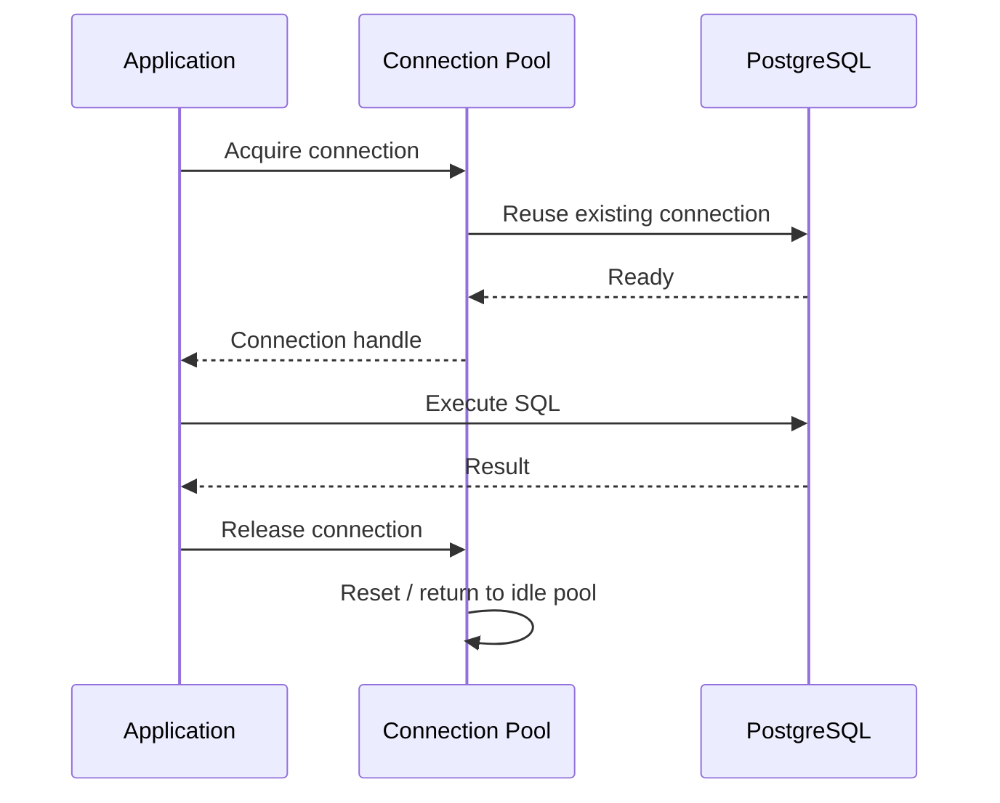
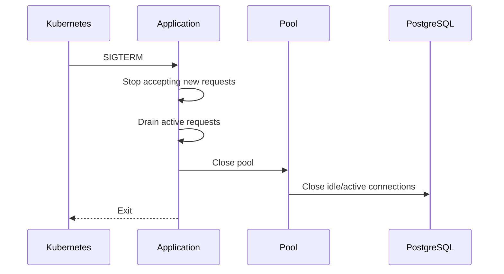

# 18- Connection Pooling

## Overview

Connection pooling is the practice of maintaining a bounded set of reusable database connections instead of creating a new database connection for every operation.

In a production Python backend, database connections are expensive and finite resources. Pooling reduces connection-establishment overhead while controlling how much concurrent database work an application can generate.

A typical architecture is:

```text
                 ┌── Connection 1 ──┐
                 ├── Connection 2 ──┤
Application ───→ Connection Pool ───┼──→ PostgreSQL
                 ├── Connection 3 ──┤
                 └── Connection N ──┘
```

A request generally follows:

```text
Request
  ↓
Acquire connection
  ↓
Execute SQL
  ↓
Commit / Rollback
  ↓
Release connection
  ↓
Connection remains available for reuse
```

The important distinction is:

> Releasing a connection to the pool is not the same as closing the underlying database connection.

Pooling improves performance and resource control, but it also introduces capacity planning, timeout, lifecycle, stale-connection, concurrency, and failure-recovery concerns.

---

## Why Connection Pooling Exists

Creating a database connection can involve:

```text
TCP connection
    ↓
TLS negotiation
    ↓
Database authentication
    ↓
Session initialization
    ↓
Ready for SQL
```

Repeating this for every request wastes time and resources.

Without pooling:

```text
Request A → create connection → query → close
Request B → create connection → query → close
Request C → create connection → query → close
```

With pooling:

```text
Application startup
      ↓
Create bounded pool
      ↓
Connection A ──┐
Connection B ──┼── reusable
Connection C ──┘

Request A → acquire A → query → release
Request B → acquire B → query → release
Request C → acquire A → query → release
```

The second model avoids repeated connection establishment.

---

## Pooling Goals

A connection pool primarily provides:

- connection reuse;
- bounded database concurrency;
- connection lifecycle management;
- connection health handling;
- acquisition timeouts;
- connection recycling;
- centralized configuration.

It does **not** automatically solve:

- slow SQL;
- lock contention;
- transaction design;
- N+1 queries;
- database capacity planning;
- application authorization;
- caching.

---

## Connection Pool Lifecycle

A typical pool lifecycle is:



The connection remains owned by the pool after release.

---

## Pool Components

A pool commonly maintains:

```text
Pool
├── Idle connections
├── In-use connections
├── Waiting requests
├── Maximum capacity
├── Acquisition timeout
├── Lifetime policy
└── Health/recycling policy
```

For example:

```text
max connections = 10

Idle:
  C1 C2 C3

In use:
  C4 C5 C6 C7

Waiting:
  Request 8
  Request 9
```

If all ten connections are occupied, another request must wait or fail according to the pool's configuration.

---

## Pool Size

Pool size determines how many database operations can concurrently hold connections from one pool.

For example:

```text
pool_size = 10
```

does not mean:

```text
10 queries per second
```

It means approximately:

```text
up to 10 simultaneously checked-out connections
```

Actual throughput depends on:

- query duration;
- database CPU;
- locks;
- I/O;
- network latency;
- transaction duration.

---

## Pool Size Is Not Throughput

Suppose a query takes 100 ms.

With sufficient database capacity:

```text
10 connections
≈ up to 100 concurrent queries per second
```

as a rough theoretical upper bound for continuously saturated connections.

But this is not a performance guarantee.

If the database becomes CPU-bound, increasing the pool can make throughput worse.

The relationship is:

```text
more connections
    ↓
more concurrent database work
    ↓
database contention
    ↓
potentially higher latency
```

---

## Aggregate Connection Capacity

Pool size must be calculated across processes and replicas.

For example:

```text
8 Kubernetes pods
×
4 worker processes
×
10 connections
=
320 potential database connections
```

The PostgreSQL server sees up to 320 connections, not 10.

A useful capacity equation is:

```text
Total potential connections
=
replicas
×
processes per replica
×
pool size
```

For some deployment models, connection behavior is not exactly this simple, but this is the correct starting point for capacity planning.

---

## PostgreSQL Connection Budget

PostgreSQL has finite connection capacity.

A simplified budget is:

```text
PostgreSQL connection capacity
├── Application service A
├── Application service B
├── Background workers
├── Admin connections
├── Monitoring
└── Operational headroom
```

Do not allocate all available connections to application pools.

Reserve capacity for:

- migrations;
- incident response;
- administrative access;
- monitoring;
- failover;
- unexpected traffic.

---

## Pool Size and Database Capacity

A useful design principle is:

```text
Application concurrency
        ↓
Connection pool
        ↓
Database concurrency
        ↓
Database CPU / I/O / locks
```

The database is usually the bottleneck you are trying to protect.

A pool should therefore act as a **backpressure mechanism**, not merely a way to maximize connections.

---

## Pool Acquisition

When application code needs database access:

```text
Request
  ↓
Acquire
  ├── connection available → continue
  └── pool full → wait
                    ↓
                 timeout
```

A bounded acquisition timeout prevents requests from waiting indefinitely.

For example:

```text
pool timeout = 2 seconds
```

means an application request should not wait forever simply because every connection is occupied.

---

## Pool Timeout

Pool acquisition timeout controls how long a caller waits for an available connection.

It is different from query timeout.

| Timeout | Controls |
|---|---|
| Pool timeout | Waiting for a pooled connection |
| Connection timeout | Establishing a new database connection |
| Statement timeout | Executing a database statement |
| HTTP timeout | End-to-end HTTP operation |
| Transaction timeout | Overall transaction duration |

These should be designed as a coherent timeout budget.

---

## Connection Timeout

A connection timeout protects against unreachable database infrastructure.

For example:

```text
Application
    ↓
Network
    ↓
PostgreSQL unavailable
```

Without a connection timeout, a request or worker can potentially remain blocked far longer than intended.

---

## Query Timeout

A connection pool does not limit query execution time.

A checked-out connection can remain occupied by:

```text
slow SQL
```

for a long time.

For PostgreSQL, server-side mechanisms such as `statement_timeout` can provide protection:

```sql
SET statement_timeout = '2s';
```

The appropriate value depends on the workload.

---

## Pool Acquisition vs Query Execution

Consider:

```text
Pool size = 10

10 requests
    ↓
all acquire connections
    ↓
queries take 5 seconds

11th request
    ↓
waits for connection
```

The 11th request's latency may be caused by:

```text
pool wait
```

rather than:

```text
query execution
```

This distinction is important when diagnosing performance.

---

## Connection Checkout Duration

A connection should normally be held for only as long as required.

Good:

```text
Acquire
 ↓
Query
 ↓
Commit
 ↓
Release
```

Bad:

```text
Acquire
 ↓
Query
 ↓
HTTP request
 ↓
Business processing
 ↓
Sleep
 ↓
Another HTTP request
 ↓
Commit
 ↓
Release
```

Long checkout durations reduce pool capacity and increase contention.

---

## Transactions and Pooling

A connection with an open transaction cannot simply be treated as idle.

For example:

```text
Acquire connection
      ↓
BEGIN
      ↓
UPDATE
      ↓
connection held
      ↓
COMMIT
      ↓
release
```

The connection remains occupied during the transaction.

Long transactions therefore reduce effective pool capacity.

---

## Transaction Reset

When a connection is returned to a pool, its session state must be safe for the next borrower.

Potential state includes:

- open transactions;
- session variables;
- temporary objects;
- prepared statements;
- role changes;
- isolation settings;
- advisory locks.

Pool implementations typically provide reset mechanisms, but application code must follow the driver's and pool's lifecycle contract.

---

## Why Session State Matters

Consider:

```text
Request A
  ↓
SET some session setting
  ↓
release connection

Request B
  ↓
acquires same connection
```

If session state was not reset appropriately, Request B may inherit state created by Request A.

This is one reason connection pooling requires disciplined connection lifecycle management.

---

## Connection Leakage

A connection leak occurs when application code checks out a connection and fails to return it.

Example:

```text
Acquire C1
Acquire C2
Acquire C3
...
never release
```

Eventually:

```text
pool exhausted
    ↓
new requests wait
    ↓
pool timeout
```

Use context managers or framework-managed lifecycle mechanisms.

---

## Python Context Managers

A low-level pattern is:

```python
with pool.connection() as connection:
    with connection.cursor() as cursor:
        cursor.execute(
            """
            SELECT id, status
            FROM orders
            WHERE id = %s
            """,
            (order_id,),
        )
        row = cursor.fetchone()
```

The context manager provides a bounded ownership scope.

The exact API depends on the pooling library.

---

## SQLAlchemy Pooling

SQLAlchemy's engine manages a connection pool.

Example:

```python
from sqlalchemy import create_engine

engine = create_engine(
    "postgresql+psycopg://app_user:password@db/orders",
    pool_size=10,
    max_overflow=5,
    pool_timeout=5,
    pool_pre_ping=True,
)
```

The engine should normally be created once per application process and reused.

Do not create an engine for every request.

---

## SQLAlchemy Pool Parameters

Common SQLAlchemy parameters include:

| Parameter | Purpose |
|---|---|
| `pool_size` | Number of persistent pooled connections |
| `max_overflow` | Temporary connections beyond pool size |
| `pool_timeout` | Wait time for an available connection |
| `pool_recycle` | Recycle connections after a lifetime |
| `pool_pre_ping` | Test connection liveness before checkout |

Configuration must be matched to the deployment and database capacity.

---

## `max_overflow`

SQLAlchemy can optionally create temporary connections beyond `pool_size`.

For example:

```python
create_engine(
    url,
    pool_size=10,
    max_overflow=5,
)
```

This allows up to approximately:

```text
10 pooled connections
+
5 overflow connections
=
15 concurrent connections
```

The database must be sized for the resulting maximum.

Overflow is not free capacity.

---

## Pool Pre-Ping

A pooled connection can become stale because of:

- database restart;
- failover;
- network interruption;
- infrastructure idle timeouts.

SQLAlchemy supports:

```python
pool_pre_ping=True
```

which checks whether a connection is usable before returning it.

This improves resilience but adds a database round trip or equivalent validation overhead on relevant checkouts.

---

## Connection Recycling

Connections can be recycled after a configured lifetime.

This can help with infrastructure that terminates long-lived connections.

Conceptually:

```text
Connection created
       ↓
used repeatedly
       ↓
maximum lifetime reached
       ↓
closed/replaced
```

Recycling should be coordinated with database and network infrastructure rather than chosen arbitrarily.

---

## Stale Connections

A pool cannot guarantee that every connection remains valid forever.

For example:

```text
Pool
 └── Connection C1
          ↓
PostgreSQL restarts
          ↓
C1 becomes invalid
```

The application must detect and replace invalid connections.

Robust pools and drivers provide mechanisms for this.

---

## Connection Validation

Validation may occur:

- when a connection is acquired;
- when it is returned;
- when an operation fails;
- periodically;
- through lifetime-based recycling.

The correct strategy balances:

```text
reliability
vs
validation overhead
```

Do not assume validation is either always necessary or always unnecessary.

---

## Connection Storms

A major production failure mode occurs when many application processes reconnect simultaneously.

```text
PostgreSQL recovers
       ↓
100 application pods
       ↓
each opens many connections
       ↓
connection storm
       ↓
database overload
       ↓
new connections fail
```

Mitigations include:

- bounded pools;
- controlled startup;
- exponential backoff;
- jitter;
- connection recycling;
- database-side poolers;
- sensible deployment scaling.

---

## PgBouncer

PgBouncer is a PostgreSQL connection pooler that sits between applications and PostgreSQL.

```text
Application Pods
      ↓
PgBouncer
      ↓
PostgreSQL
```

It can reduce the number of backend PostgreSQL connections when application process counts are high.

---

## Pooling Layers

A system may accidentally have multiple pools:

```text
Application pool
      ↓
PgBouncer
      ↓
PostgreSQL
```

This can be valid, but capacity planning becomes more complex.

You need to understand:

```text
application pool capacity
vs
PgBouncer capacity
vs
PostgreSQL connection capacity
```

Multiple layers should have a clear reason to exist.

---

## PgBouncer Pooling Modes

PgBouncer supports different pooling modes, including:

- session pooling;
- transaction pooling;
- statement pooling.

They have different semantics for session-level state.

For example, transaction pooling can make assumptions about session affinity unsafe.

Applications using:

- temporary tables;
- session variables;
- session-level prepared statements;
- other connection-local state;

must be compatible with the selected pooling mode.

---

## Session State and External Poolers

Application code should minimize unnecessary connection-local state.

Prefer:

```text
explicit query parameters
explicit transaction state
application-level configuration
```

over relying heavily on:

```text
hidden connection session state
```

This makes pooling and horizontal scaling easier.

---

## Pooling and FastAPI

A FastAPI service commonly uses a process-local database engine/pool:

```text
FastAPI process
      ↓
SQLAlchemy Engine
      ↓
Connection Pool
      ↓
PostgreSQL
```

Each process has its own pool.

Therefore:

```text
4 workers
×
10 connections
=
up to 40 connections
```

per pod, before considering overflow.

---

## FastAPI Session Lifecycle

A request-scoped session can conceptually follow:

```text
Request
  ↓
Create/acquire session
  ↓
Execute application operation
  ↓
Commit or rollback
  ↓
Close session
  ↓
Connection returned to pool
```

The session should not be stored as global mutable state.

---

## Async Pooling

Async Python applications should use database access compatible with the async execution model.

Conceptually:

```text
Async FastAPI
      ↓
Async SQLAlchemy
      ↓
Async Connection Pool
      ↓
PostgreSQL
```

The pool itself must be managed asynchronously according to the library's API.

---

## Async Pool Exhaustion

Async applications can create very high concurrency.

For example:

```text
1,000 concurrent HTTP requests
       ↓
10 DB connections
       ↓
990 requests waiting
```

This is not necessarily a bug.

A bounded pool can protect PostgreSQL from excessive concurrency.

However, if application concurrency is much higher than database capacity, the service needs appropriate backpressure and timeout behavior.

---

## Asyncio and Connection Holding

A task can hold a database connection while awaiting unrelated work.

Avoid:

```python
async with session:
    result = await query()

    # Avoid holding the DB session while doing unrelated I/O.
    await external_api_call()
```

Prefer, where transaction semantics permit:

```python
result = await query()

external_result = await external_api_call()
```

The exact structure depends on whether the operations must be part of one transaction.

---

## Django Connection Management

Django manages database connections as part of its database infrastructure.

A simplified lifecycle is:

```text
Request
  ↓
Django ORM
  ↓
Database connection
  ↓
Query
  ↓
Request completion
```

Django's persistent connection configuration, including `CONN_MAX_AGE`, affects how long connections can remain reusable.

---

## Django `CONN_MAX_AGE`

For example:

```python
DATABASES = {
    "default": {
        "ENGINE": "django.db.backends.postgresql",
        "NAME": "orders",
        "USER": "app_user",
        "PASSWORD": "...",
        "HOST": "db",
        "PORT": "5432",
        "CONN_MAX_AGE": 60,
    }
}
```

Longer connection persistence can reduce connection establishment overhead but can increase the number of connections held by worker processes.

It is not equivalent to a generic application-level pool size setting.

---

## Pooling and Multiprocessing

Process-based Python servers create an important lifecycle boundary.

```text
Master
  ↓ fork
Worker A → own pool
Worker B → own pool
Worker C → own pool
```

Database connections should not be shared across forked workers unless the library explicitly supports that lifecycle.

Initialize connection pools in the correct process lifecycle.

---

## Gunicorn and Workers

Suppose:

```text
4 Gunicorn workers
pool_size = 10
```

The potential connection count can be roughly:

```text
4 × 10 = 40
```

If Kubernetes runs:

```text
8 pods
```

then:

```text
8 × 4 × 10 = 320
```

Potential connections exist.

This is one of the most common database-capacity mistakes in Python deployments.

---

## Celery and Connection Pools

Celery workers have a different lifecycle from HTTP workers.

```text
HTTP Pod
    ↓
HTTP pool

Celery Worker
    ↓
Worker database lifecycle
```

Do not assume the HTTP application's connection pool is shared with Celery.

Worker concurrency also affects database connection requirements.

---

## Background Worker Concurrency

Suppose:

```text
Celery concurrency = 20
```

and every task performs database operations.

A theoretical concurrency model can approach:

```text
20 concurrent tasks
    ↓
database demand
```

The application must avoid configuring a pool that allows uncontrolled database saturation.

Worker concurrency and database pool capacity should be designed together.

---

## Connection Pooling and Kafka Consumers

Kafka consumers may run continuously and periodically access PostgreSQL.

Avoid holding database connections while waiting for Kafka messages.

Prefer:

```text
consume message
    ↓
acquire DB connection
    ↓
process transaction
    ↓
commit
    ↓
release
    ↓
poll next message
```

rather than:

```text
consumer starts
    ↓
holds DB connection indefinitely
    ↓
waits for messages
```

---

## Connection Pooling and Transactions

A common pattern is:

```python
async with session.begin():
    order = await repository.get_order(order_id)
    await repository.update_order(order)
```

The transaction should be scoped to the database work requiring atomicity.

Do not let a connection remain checked out while the application performs unrelated computation.

---

## Pool Backpressure

Connection pools provide a natural concurrency boundary:

```text
10 DB connections
        ↓
Only bounded DB concurrency
        ↓
Excess requests wait or fail
```

This can protect PostgreSQL.

But queueing is not free.

If waiting requests accumulate:

```text
queue grows
  ↓
latency grows
  ↓
timeouts
  ↓
retries
  ↓
more load
```

Pool timeout should therefore be aligned with the service's overall latency budget.

---

## Queueing Effects

A saturated pool can produce a cascading failure:

```text
Database slows
     ↓
connections held longer
     ↓
pool fills
     ↓
requests wait
     ↓
request timeout
     ↓
client retry
     ↓
more requests
     ↓
higher database pressure
```

This is why timeout and retry policies must be designed together.

---

## Retries and Connection Pools

Retries can amplify database pressure.

For example:

```text
100 requests
   ↓
database temporarily slow
   ↓
100 timeouts
   ↓
each retries twice
   ↓
300 total attempts
```

Use:

- bounded attempts;
- exponential backoff;
- jitter;
- request deadlines;
- idempotency where required.

Do not automatically retry every database exception.

---

## Pool Size and Latency

Increasing pool size can improve throughput when:

```text
database has spare capacity
and
requests are waiting unnecessarily
```

It can hurt when:

```text
database is already saturated
```

A useful diagnostic table:

| Observation | Likely action |
|---|---|
| High pool wait, low DB CPU | Consider increasing pool carefully |
| High pool wait, high DB CPU | Fix DB/query capacity first |
| Long query duration | Optimize SQL |
| Long transaction duration | Reduce transaction scope |
| Many idle connections | Reduce pool/persistence |
| Frequent stale connections | Review recycling/health checks |
| Connection failures during failover | Improve reconnect handling |

---

## Pool Utilization

Useful metrics include:

```text
pool_size
active_connections
idle_connections
waiting_requests
pool_wait_duration
connection_creation_duration
connection_errors
connection_reuse
```

A useful derived signal is:

```text
pool utilization
=
active connections / pool capacity
```

Persistent high utilization may indicate insufficient capacity or excessive query duration.

---

## Database Metrics

Application pool metrics should be correlated with PostgreSQL metrics:

```text
active connections
CPU
I/O
locks
transaction duration
query latency
replication lag
WAL generation
```

A pool saturation problem cannot be diagnosed correctly from application metrics alone.

---

## Monitoring Query Duration

A connection can be occupied because a query is slow.

Track:

```text
p50 query duration
p95 query duration
p99 query duration
```

Also track:

```text
transaction duration
pool acquisition duration
```

This distinguishes:

```text
waiting for database capacity
```

from:

```text
database executing expensive work
```

---

## Connection Pool Instrumentation

A production dashboard might contain:

```text
Database Pool
├── Active: 8 / 10
├── Idle: 2
├── Waiting: 14
├── p95 acquisition: 180 ms
└── connection errors: 0.2%
```

Correlate this with:

```text
PostgreSQL
├── CPU: 85%
├── active sessions: 150
├── p95 query: 120 ms
└── lock waits: elevated
```

This provides much more actionable information than a single API latency metric.

---

## Health Checks

A database health check should be lightweight and bounded.

For example:

```sql
SELECT 1;
```

can verify basic connectivity.

However, avoid making every health probe perform expensive application queries.

Distinguish:

```text
process is alive
```

from:

```text
database dependency is ready
```

and configure Kubernetes probes accordingly.

---

## Readiness and Pool Health

A service might be considered not ready when:

- it cannot establish required database connectivity;
- its pool cannot acquire connections within an acceptable bound;
- required initialization has failed.

But transient database issues should not automatically trigger endless pod restarts.

A healthy process can remain alive while readiness prevents new traffic.

---

## Graceful Shutdown

A service should stop accepting new work before destroying its database pool.



Shutdown should have a bounded deadline.

---

## Kubernetes Deployment

A production deployment might look like:

```text
Kubernetes
├── Pod 1
│   ├── Worker 1
│   └── DB Pool
├── Pod 2
│   ├── Worker 1
│   └── DB Pool
└── Pod N
    ├── Worker 1
    └── DB Pool
```

Pool sizing must account for autoscaling.

If HPA increases replicas from:

```text
5 → 20
```

database connection demand can increase by approximately:

```text
4×
```

without any code change.

---

## Autoscaling and Database Protection

Application autoscaling can unintentionally overload PostgreSQL.

Example:

```text
5 pods × 10 connections = 50
20 pods × 10 connections = 200
```

If PostgreSQL cannot support 200 application connections effectively, HPA can worsen the outage.

Database capacity must therefore be part of autoscaling design.

---

## Admission and Concurrency Control

For database-heavy services, consider limiting application concurrency independently of HTTP request concurrency.

For example:

```text
10 DB connections
1000 HTTP requests
       ↓
bounded DB work
```

A semaphore or application-level concurrency limit can prevent excessive database pressure when the pool alone does not provide the desired behavior.

---

## Connection Pooling and Caches

Redis caching can reduce database demand:

```text
Request
  ↓
Redis
 ├── hit → response
 └── miss
      ↓
   PostgreSQL
```

Caching can reduce connection demand, but cache invalidation and consistency must be explicitly designed.

Do not increase the database pool simply because database traffic is high if the workload is better addressed through caching or query optimization.

---

## Connection Pooling and Read Replicas

Read replicas can distribute read traffic:

```text
                 ┌── Primary
Application ─────┤
                 └── Replica
```

Each database target may have separate connection pools.

Capacity planning should account for:

```text
primary pool
+
replica pool
```

and any routing behavior.

---

## Connection Pooling with PgBouncer

A more complex architecture can be:

```text
Kubernetes Pods
      ↓
Application Pools
      ↓
PgBouncer
      ↓
PostgreSQL
```

This can be useful when many short-lived application processes create too many PostgreSQL backend connections.

But if both layers are poorly sized, the pooler can hide saturation rather than solve it.

---

## Security Considerations

Connection pools can retain authenticated database sessions.

Therefore:

- use least-privilege database users;
- use TLS where required;
- protect database credentials;
- avoid logging connection URLs;
- rotate credentials safely;
- restrict database network access;
- separate runtime and migration privileges.

A pooled connection remains a privileged database resource even while idle.

---

## Credential Rotation

Credential rotation can interact with pooling.

Consider:

```text
Old credential
   ↓
existing connections
   ↓
New credential configured
   ↓
new connections use new credential
```

Existing sessions may continue to work depending on the database's authentication/session behavior.

A robust rotation plan should define:

- how new credentials are delivered;
- when connections are recycled;
- how old credentials are revoked;
- how failures are detected.

---

## TLS and Pooling

TLS is generally established when the database connection is created.

Pooling allows the application to reuse the established secure connection.

This means pooling can reduce repeated TLS handshake overhead.

However, TLS does not eliminate the need to validate database certificates or protect credentials.

---

## High Availability

A production pool should tolerate database topology changes where supported.

Important scenarios include:

```text
primary restart
primary failover
network interruption
maintenance
connection termination
```

The application should:

- detect broken connections;
- discard invalid connections;
- reconnect;
- avoid connection storms;
- respect service deadlines.

---

## Failover

A typical failover sequence is:

```text
Application
   ↓
Primary connection
   ↓
Primary fails
   ↓
Connection becomes invalid
   ↓
Pool discards connection
   ↓
DNS / endpoint points to new primary
   ↓
New connection
   ↓
Application resumes
```

The exact behavior depends on the PostgreSQL deployment and networking layer.

---

## AWS RDS Considerations

With Amazon RDS or Aurora PostgreSQL, failover can change which instance serves as primary.

Applications should generally use the appropriate managed endpoint rather than hard-coding an instance IP.

After failover:

```text
existing connection → may fail
new connection      → new primary
```

Connection validation and retry behavior therefore matter.

---

## Disaster Recovery

Connection pooling is part of application recovery behavior.

After a database outage:

```text
Database unavailable
      ↓
connections fail
      ↓
application backs off
      ↓
database recovers
      ↓
controlled reconnection
      ↓
traffic resumes
```

Recovery procedures should prevent thousands of workers from reconnecting simultaneously.

---

## Cost Considerations

Each PostgreSQL connection consumes database resources.

More connections can increase:

- backend process/session memory;
- context switching;
- lock contention;
- CPU usage;
- operational complexity.

Connection pooling should therefore optimize both:

```text
application performance
```

and:

```text
database resource efficiency
```

The objective is not maximum connection count.

---

## Common Mistakes

### Creating a Pool Per Request

A pool should normally be application-scoped.

Creating pools per request defeats pooling and can create connection storms.

### Setting Pool Size Arbitrarily High

More connections do not guarantee higher throughput.

Database capacity is finite.

### Ignoring Worker Multiplication

A pool configured for 20 connections may become hundreds of connections across workers and pods.

### Holding Connections During External Calls

This unnecessarily consumes scarce database connections.

### Forgetting Transaction Cleanup

An open transaction returned to a pool can contaminate the next request if the pool does not correctly reset it.

### Sharing Connections Across Processes

Forked processes should not blindly share inherited database connections.

### Ignoring Pool Wait Time

High API latency may come from waiting for a connection rather than executing SQL.

### Treating `max_overflow` as Free Capacity

Overflow connections still consume database resources.

### No Acquisition Timeout

Requests can wait indefinitely when the pool is exhausted.

### Retrying Every Database Error

Retries can amplify database overload and may duplicate operations.

---

## Production Pitfalls

### Connection Pool Multiplication

The most common sizing mistake is configuring a pool locally without considering:

```text
replicas
×
workers
×
pool size
×
overflow
```

### Database Outage Recovery Storm

Every application instance reconnecting immediately can overload a recovering database.

### Long Transactions

A transaction that holds a connection for several seconds can drastically reduce effective pool capacity.

### Pool Saturation Hidden by Large Pools

Increasing the pool can make the database itself the bottleneck.

### Stale Connections

Long-lived connections may become invalid after database restarts, failover, or network infrastructure changes.

### Multiple Pooling Layers

Application pools plus PgBouncer plus database connection limits can create confusing capacity behavior if not modeled explicitly.

### Autoscaling

Increasing pod count can increase database connections faster than database capacity.

### Background Workers

Celery and Kafka consumers can consume database capacity independently of HTTP traffic.

---

## Pool Sizing Methodology

Do not start with a universal number such as:

```text
pool_size = 50
```

Instead:

1. Determine database CPU and I/O capacity.
2. Measure query latency.
3. Measure transaction duration.
4. Determine acceptable API latency.
5. Determine expected concurrency.
6. Calculate aggregate connections across workers and replicas.
7. Reserve database headroom.
8. Load-test with realistic traffic.
9. Observe pool wait and database saturation.
10. Adjust pool size based on evidence.

A useful mental model is:

```text
Pool size
    ↓
Database concurrency
    ↓
Database saturation
    ↓
Throughput / latency
```

---

## Pool Sizing Example

Suppose:

```text
PostgreSQL practical connection budget = 120

HTTP service:
  6 pods
  2 workers per pod
```

A starting maximum per worker could be constrained by:

```text
120 / (6 × 2)
=
10 connections
```

But this does not mean 10 is automatically optimal.

Reserve capacity for:

```text
admin
migrations
background jobs
monitoring
other services
failover
```

For example, if only 80 connections are allocated to this service:

```text
80 / (6 × 2)
≈ 6 connections per worker
```

Then load testing determines whether that capacity is sufficient.

---

## Pool Sizing and Query Duration

Suppose:

```text
pool = 10
average transaction = 500 ms
```

A fully utilized pool can perform roughly:

```text
10 / 0.5
≈ 20 transactions/second
```

as a rough concurrency-based estimate.

If transactions increase to:

```text
2 seconds
```

the same pool can sustain roughly:

```text
10 / 2
≈ 5 transactions/second
```

before queueing grows.

This illustrates why reducing transaction duration can be more valuable than simply increasing pool size.

---

## Pool Saturation Investigation

When pool wait rises:

```text
High pool wait
      ↓
Are queries slow?
   ├── Yes → optimize SQL / DB capacity
   └── No
        ↓
Are transactions long?
   ├── Yes → reduce transaction scope
   └── No
        ↓
Is pool undersized?
   ├── Yes → increase carefully
   └── No
        ↓
Is there a connection leak?
```

This avoids blindly changing pool size.

---

## Testing Connection Pooling

Test:

- connection acquisition;
- connection release;
- pool exhaustion;
- acquisition timeout;
- connection failures;
- database restart;
- stale connections;
- transaction rollback;
- concurrent requests;
- graceful shutdown.

Integration tests should use a real PostgreSQL environment where practical.

---

## Pool Exhaustion Test

A useful integration test can intentionally constrain the pool:

```text
pool size = 2

Request A → connection 1
Request B → connection 2
Request C → waits
Request C → timeout
```

Verify that:

- the timeout is bounded;
- connections are eventually released;
- subsequent requests recover;
- no connection is leaked.

---

## Failure Testing

Important scenarios include:

```text
PostgreSQL restart
connection reset
network interruption
query timeout
deadlock
serialization failure
pool exhaustion
database failover
```

The purpose is to validate actual recovery behavior rather than merely confirming that exceptions are raised.

---

## Performance Testing

Measure:

```text
pool acquisition latency
query latency
transaction duration
connection creation latency
throughput
error rate
database CPU
database connections
```

Test realistic concurrency rather than a single request.

---

## Observability Checklist

Monitor at minimum:

- active pooled connections;
- idle pooled connections;
- pool utilization;
- pool acquisition latency;
- pool timeout count;
- connection creation failures;
- stale connection failures;
- query latency;
- transaction duration;
- database active connections;
- database CPU;
- lock waits;
- replication lag where applicable.

Alert on sustained saturation rather than brief spikes.

---

## Operational Checklist

### Application

- [ ] Pool is created once per process.
- [ ] Pool size is explicitly configured.
- [ ] Pool acquisition has a timeout.
- [ ] Connection timeout is configured.
- [ ] Query/statement timeout is configured appropriately.
- [ ] Connections are always released.
- [ ] Transactions are explicitly bounded.
- [ ] Sessions are not shared unsafely across concurrent tasks.
- [ ] Pools close during graceful shutdown.

### Database

- [ ] Aggregate connection capacity is known.
- [ ] PostgreSQL has operational headroom.
- [ ] Database CPU and memory are monitored.
- [ ] Slow queries are monitored.
- [ ] Lock contention is observable.
- [ ] Failover behavior is tested.

### Deployment

- [ ] Worker count is included in connection calculations.
- [ ] Kubernetes replica scaling is included.
- [ ] Celery/database concurrency is included.
- [ ] Overflow connections are included.
- [ ] Autoscaling cannot blindly exhaust database capacity.
- [ ] Connection storms are mitigated.

### Security

- [ ] Database credentials are stored securely.
- [ ] TLS is configured where required.
- [ ] Database roles follow least privilege.
- [ ] Connection strings are not logged.
- [ ] Credential rotation is tested.

---

## Interview Traps

### Is a Connection Pool the Same as a Database?

No. A pool is an application-side resource manager that maintains reusable database connections.

### Does a Pool Size of 10 Mean 10 Queries Per Second?

No. It means approximately 10 connections can be checked out concurrently. Throughput depends on query and transaction duration and database capacity.

### Should You Maximize Pool Size?

No. Excessive connections can increase contention and database resource usage.

### Is a Connection Returned to the Pool Closed?

Usually no. It becomes available for reuse. The pool may later recycle or close it.

### Why Can a Pool Be Exhausted Even When PostgreSQL Is Healthy?

Long-running queries, long transactions, connection leaks, or excessive application concurrency can keep all connections checked out.

### Why Does Pool Size Multiply in Kubernetes?

Each process typically owns its own pool. Multiple workers and replicas therefore create multiple independent pools.

### Why Can Increasing Pool Size Make Performance Worse?

More concurrent queries can saturate PostgreSQL CPU, I/O, memory, or locks, increasing latency for all queries.

### What Is the Difference Between Pool Timeout and Query Timeout?

Pool timeout limits waiting for a connection. Query timeout limits database statement execution.

### Why Are Stale Connections a Problem?

A pooled connection can outlive the database session or network path that created it. After restart or failover, the application may receive a broken connection.

### Why Is Holding a Connection During an HTTP Call Bad?

The connection remains unavailable to other requests even though no database work is occurring.

### Why Are Transactions Relevant to Pool Sizing?

Connections are typically occupied while transactions are active. Long transactions reduce effective pool capacity.

### Why Can Retries Make Pool Saturation Worse?

Retries create additional database work while the original workload may already be consuming all connections.

### Why Might PgBouncer Be Useful?

It can reduce the number of PostgreSQL backend connections required by many application processes, particularly in high-process or highly dynamic environments.

### Can You Use Application Pooling and PgBouncer Together?

Yes, but capacity and session semantics must be understood across both layers.

### Why Should Database Connections Not Be Shared Across Forked Workers?

Database connections contain process-related network/socket state and are generally not safe to share across independently executing child processes unless the library explicitly supports that lifecycle.

## Key Takeaways

- **Connection pooling is both reuse and backpressure:** it reduces connection-establishment overhead while bounding how much concurrent database work an application can generate.
- **Pool capacity is aggregate:** calculate connections across workers, Kubernetes replicas, background consumers, overflow settings, and other services rather than looking at one process in isolation.
- **Pool size should follow database capacity:** increasing connections can improve throughput when the database has spare capacity, but can worsen latency when PostgreSQL is already saturated.
- **Connection lifetime matters:** release connections quickly, keep transactions short, handle stale connections, configure acquisition/query timeouts, and close pools during graceful shutdown.
- **Production pooling requires observability and failure design:** monitor pool wait, utilization, query and transaction duration, connection errors, database saturation, and recovery behavior under failover and connection storms.