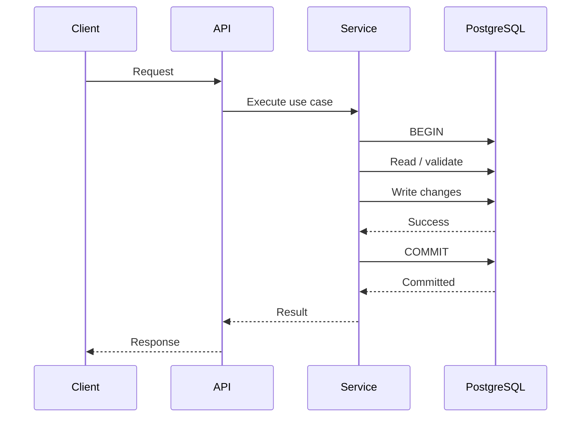
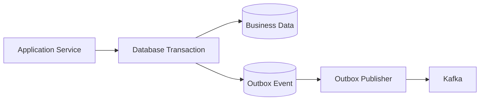

# 19- Transactions

## Overview

A database transaction groups multiple database operations into a single logical unit of work with defined atomicity, consistency, isolation, and durability guarantees.

In a Python backend, transactions are the boundary between application behavior and durable database state:

```text
HTTP / gRPC Request
        ↓
Application Service
        ↓
Transaction Boundary
        ↓
┌─────────────────────────────┐
│ Read state                  │
│ Validate invariants         │
│ Write changes               │
│ Commit                      │
└─────────────────────────────┘
        ↓
Response / Event
```

Transactions are necessary whenever several database changes must behave as one operation.

Typical examples include:

- creating an order and reserving inventory;
- transferring money between accounts;
- updating a record and its audit entry;
- creating a payment and its idempotency record;
- modifying multiple related tables;
- enforcing concurrency-sensitive business invariants.

A transaction does not make arbitrary external operations atomic. PostgreSQL can atomically coordinate operations within its own transactional boundary, but an HTTP call, Redis write, Kafka message, or email generally requires an explicit distributed-consistency pattern.

---

## Why Transactions Exist

Without transactions, a multi-step operation can leave partially applied state.

Consider:

```text
Create Order
    ↓
Reserve Inventory
    ↓
Create Payment
```

If payment creation fails after the first two operations succeed:

```text
Order      → created
Inventory  → reserved
Payment    → missing
```

The database is now in an undesirable intermediate state.

With a transaction:

```text
BEGIN
  ↓
Create Order
  ↓
Reserve Inventory
  ↓
Create Payment
  ↓
COMMIT
```

If any operation fails:

```text
ROLLBACK
```

and the transaction's changes are discarded.

---

## ACID

Transactions are commonly described through ACID:

| Property | Meaning |
|---|---|
| Atomicity | The transaction's database changes succeed together or are rolled back |
| Consistency | Database invariants remain satisfied across committed states |
| Isolation | Concurrent transactions have controlled visibility/interference |
| Durability | Committed changes survive according to the database's durability guarantees |

These properties are provided by the database engine and its configuration, not by Python itself.

---

## Atomicity

Atomicity answers:

> What happens if one operation in the transaction fails?

Example:

```text
BEGIN
  ↓
Debit Account A
  ↓
Credit Account B
  ↓
COMMIT
```

If crediting Account B fails:

```text
ROLLBACK
```

The debit should not remain committed independently.

Atomicity is useful when partial completion would violate a business invariant.

---

## Consistency

Consistency means each committed transaction must preserve the database's defined invariants.

Examples include:

```text
balance >= 0
foreign key exists
email is unique
order total >= 0
payment references an existing order
```

PostgreSQL enforces many invariants through:

- primary keys;
- foreign keys;
- unique constraints;
- check constraints;
- exclusion constraints;
- triggers where appropriate.

Application validation complements database constraints but does not replace them for concurrency-sensitive invariants.

---

## Isolation

Isolation controls how concurrent transactions interact.

Suppose two requests attempt to modify the same inventory:

```text
Transaction A ──┐
                ├── PostgreSQL
Transaction B ──┘
```

Isolation determines what each transaction can observe and which concurrent changes can interfere.

This is where concepts such as:

- dirty reads;
- non-repeatable reads;
- phantom reads;
- serialization failures;
- locking;

become relevant.

---

## Durability

Once a transaction commits successfully, PostgreSQL provides durability according to its configuration and deployment guarantees.

Durability depends on more than Python code:

```text
Application
    ↓
PostgreSQL
    ↓
WAL
    ↓
Storage
    ↓
Replication / Backup
```

A transaction commit is not a substitute for a complete disaster-recovery strategy.

---

## Transaction Lifecycle

A typical transaction has:

```text
BEGIN
  ↓
Statements
  ↓
Validation / locking / writes
  ↓
COMMIT
```

or:

```text
BEGIN
  ↓
Statements
  ↓
Error
  ↓
ROLLBACK
```

The connection remains associated with the transaction until commit or rollback.

---

## Request Lifecycle

A transaction-aware API request often follows:



The transaction should normally cover the database work required for the use case, not unrelated network or application activity.

---

## Explicit Transaction Boundaries

Transaction ownership should be clear.

A useful pattern is:

```text
API
 ↓
Application Service
 ↓
Transaction
 ├── Repository A
 ├── Repository B
 └── Repository C
 ↓
Commit
```

This prevents individual repositories from accidentally committing independently when several repositories participate in one business operation.

---

## Application Service Transaction Boundary

Example:

```python
from sqlalchemy.orm import Session


def create_order(
    session: Session,
    customer_id: str,
    product_id: str,
    quantity: int,
) -> Order:
    with session.begin():
        inventory = repository.get_inventory_for_update(
            session,
            product_id,
        )

        if inventory.available < quantity:
            raise InsufficientInventory()

        order = repository.create_order(
            session,
            customer_id=customer_id,
            product_id=product_id,
            quantity=quantity,
        )

        repository.decrement_inventory(
            session,
            product_id=product_id,
            quantity=quantity,
        )

        return order
```

The transaction boundary belongs to the business operation.

---

## Python Transaction Context Managers

Modern database libraries commonly expose transaction context managers.

For example, with `psycopg`:

```python
with connection.transaction():
    create_order(connection, order)
    reserve_inventory(connection, order)
```

If the block completes successfully, it commits.

If an exception escapes, it rolls back according to the context manager's transaction semantics.

The exact behavior should always follow the selected driver or ORM's documented transaction lifecycle.

---

## SQLAlchemy Transactions

SQLAlchemy provides transaction management through `Session`.

```python
with session.begin():
    order = create_order(session)
    reserve_inventory(session, order)
```

If an exception escapes the block:

```text
rollback
```

If it completes successfully:

```text
commit
```

Using structured transaction scopes makes ownership explicit.

---

## Django Transactions

Django provides `transaction.atomic()`:

```python
from django.db import transaction


@transaction.atomic
def create_order(customer_id: str, product_id: str) -> Order:
    order = Order.objects.create(
        customer_id=customer_id,
        product_id=product_id,
    )

    reserve_inventory(product_id)

    return order
```

For smaller scopes:

```python
with transaction.atomic():
    ...
```

Nested `atomic()` blocks use savepoints rather than automatically creating independent top-level transactions.

---

## Autocommit

Many Python database integrations operate in autocommit mode by default or provide configuration around it.

In autocommit mode:

```text
statement
   ↓
commit
```

For multi-statement business operations, an explicit transaction is required.

Do not assume several separate SQL statements are automatically atomic.

---

## Transaction Scope

The transaction should generally include:

```text
database reads required for consistency
+
database writes
+
database constraints/invariant checks
```

Avoid including:

```text
external HTTP request
long CPU computation
user interaction
sleep
unbounded batch processing
```

unless the business requirement genuinely requires that operation to remain inside the transaction.

---

## Long Transactions

Long transactions can cause:

- lock contention;
- connection pool exhaustion;
- stale snapshots;
- delayed cleanup;
- replication impact;
- increased WAL pressure;
- poor concurrency.

Bad:

```text
BEGIN
 ↓
database query
 ↓
HTTP API call
 ↓
wait 5 seconds
 ↓
database update
 ↓
COMMIT
```

Prefer:

```text
HTTP call
 ↓
prepare required data
 ↓
BEGIN
 ↓
database operations
 ↓
COMMIT
```

when the business semantics allow it.

---

## Transactions and Connection Pools

A transaction normally occupies a database connection.

Therefore:

```text
Long transaction
      ↓
Connection held
      ↓
Pool capacity reduced
      ↓
Requests wait
```

Transaction duration should be monitored alongside pool utilization.

---

## Rollback

Rollback restores the transaction to its pre-transaction state for the transaction's database changes.

```python
try:
    with connection.transaction():
        update_order(connection)
        update_inventory(connection)
except Exception:
    handle_failure()
```

The database transaction should own the rollback rather than application code attempting to manually undo every individual SQL operation.

---

## Rollback Is Not Undoing External Side Effects

Consider:

```text
BEGIN
 ↓
INSERT payment
 ↓
Send email
 ↓
ROLLBACK
```

The email has already been sent.

Rollback only affects the transactional database work.

This distinction is critical in distributed systems.

---

## Savepoints

A savepoint creates an intermediate rollback point inside a transaction.

Conceptually:

```sql
BEGIN;

UPDATE orders
SET status = 'processing'
WHERE id = $1;

SAVEPOINT optional_step;

UPDATE order_metadata
SET value = $2
WHERE order_id = $1;

ROLLBACK TO SAVEPOINT optional_step;

COMMIT;
```

Savepoints are useful when a portion of a larger transaction can be independently abandoned while the outer transaction continues.

---

## Savepoints in Python

ORMs may expose savepoints through nested transaction contexts.

For example, Django's nested `atomic()` blocks can establish savepoints:

```python
from django.db import transaction


with transaction.atomic():
    update_order()

    try:
        with transaction.atomic():
            update_optional_metadata()
    except MetadataError:
        pass

    finalize_order()
```

The inner failure can roll back to the savepoint while the outer transaction remains active, assuming the surrounding transaction remains valid.

---

## Isolation Levels

PostgreSQL supports transaction isolation levels including:

- Read Committed;
- Repeatable Read;
- Serializable.

| Isolation level | Typical use |
|---|---|
| Read Committed | General OLTP workloads |
| Repeatable Read | Operations requiring a stable transaction snapshot |
| Serializable | Strongest transaction isolation, when serialization is worth the cost |

Higher isolation does not automatically mean "better." It can increase contention or produce serialization failures that the application must handle.

---

## Read Committed

Read Committed is PostgreSQL's default isolation level.

A statement generally sees data committed before that statement began.

This means two statements in one transaction can observe different committed states if another transaction commits between them.

Example:

```text
Transaction A
  SELECT balance
       ↓
Transaction B updates balance
       ↓
Transaction B commits
       ↓
Transaction A executes another SELECT
```

The second statement may observe the newer committed value.

---

## Repeatable Read

Repeatable Read provides a stable transaction snapshot.

This can be useful when several queries must operate against a consistent view of data.

However, concurrent updates can still cause transaction failures that the application must handle appropriately.

---

## Serializable

Serializable isolation provides the strongest standard isolation level.

The database ensures that successful concurrent transactions behave as though they were executed serially.

This may result in:

```text
Transaction A
Transaction B
     ↓
serialization conflict
     ↓
one transaction fails
```

The application must be prepared to retry safe transactions.

Serializable is a correctness tool, not a default performance optimization.

---

## Serialization Failures

A serialization failure is often a normal concurrency outcome under Serializable isolation.

The application should generally:

```text
retry transaction
    ↓
with bounded attempts
    ↓
using backoff / jitter where appropriate
```

The entire transaction should be retried, not merely the statement that happened to fail.

---

## Deadlocks

A deadlock occurs when transactions wait for locks held by one another.

Example:

```text
Transaction A:
locks row 1
waits for row 2

Transaction B:
locks row 2
waits for row 1
```

```text
A → row 1 → waits for row 2
B → row 2 → waits for row 1
```

PostgreSQL detects deadlocks and aborts one transaction.

---

## Preventing Deadlocks

Useful strategies include:

- acquire locks in a consistent order;
- keep transactions short;
- avoid unnecessary locks;
- avoid external calls inside transactions;
- minimize touched rows;
- use appropriate indexes;
- retry deadlock victims when the operation is safe to replay.

For example, always locking accounts by ascending ID can reduce cyclic lock acquisition patterns.

---

## Locking

Transactions often rely on database locks to coordinate concurrent writes.

Common mechanisms include:

```sql
SELECT ...
FOR UPDATE;
```

and:

```sql
UPDATE ...
```

which can acquire row-level locks as required.

The correct locking strategy depends on the invariant being protected.

---

## `SELECT FOR UPDATE`

Consider inventory:

```python
with session.begin():
    inventory = (
        session.query(Inventory)
        .filter_by(product_id=product_id)
        .with_for_update()
        .one()
    )

    if inventory.available < quantity:
        raise InsufficientInventory()

    inventory.available -= quantity
```

The lock prevents another compatible transaction from modifying the same row concurrently in a way that violates the intended workflow.

---

## Lock Duration

Locks are generally held until transaction completion.

Therefore:

```text
BEGIN
 ↓
SELECT FOR UPDATE
 ↓
long processing
 ↓
COMMIT
```

can block other transactions for the entire duration.

Keep locked sections as small as practical.

---

## Optimistic Concurrency

Not every concurrency problem requires explicit locks.

A version column can implement optimistic concurrency:

```sql
UPDATE orders
SET status = $1,
    version = version + 1
WHERE id = $2
  AND version = $3;
```

If:

```text
affected rows = 1
```

the update succeeded.

If:

```text
affected rows = 0
```

another transaction may have modified the row.

---

## Pessimistic vs Optimistic Concurrency

| Strategy | Mechanism | Best suited for |
|---|---|---|
| Pessimistic | Lock before modifying | High-contention critical state |
| Optimistic | Detect conflicting updates | Lower contention and retryable workflows |
| Atomic SQL | Encode invariant in one statement | Simple conditional updates |

Choose based on contention and correctness requirements rather than preference.

---

## Atomic SQL Without Explicit Locking

Some operations can safely encode their invariant directly:

```sql
UPDATE inventory
SET available = available - $1
WHERE product_id = $2
  AND available >= $1;
```

Then:

```python
if cursor.rowcount != 1:
    raise InsufficientInventory()
```

This can be simpler and more scalable than:

```text
SELECT
 ↓
Python check
 ↓
UPDATE
```

because the condition and modification are evaluated atomically by PostgreSQL.

---

## Database Constraints and Transactions

Application checks and transactions are not substitutes for constraints.

Consider:

```text
Request A → check email available
Request B → check email available
Request A → insert
Request B → insert
```

Both may pass the application check.

A unique constraint closes the race:

```sql
CREATE UNIQUE INDEX users_email_unique
ON users (lower(email));
```

The database becomes the final authority.

---

## Transactions and Unique Constraints

A uniqueness conflict can be handled inside the transaction:

```text
BEGIN
 ↓
INSERT
 ↓
unique violation
 ↓
ROLLBACK
```

or using an appropriate upsert:

```sql
INSERT INTO users (email)
VALUES ($1)
ON CONFLICT (email)
DO NOTHING;
```

The choice depends on the business semantics.

---

## Transaction Boundaries and Validation

Validation can happen at multiple levels:

```text
Request validation
      ↓
Application validation
      ↓
Transaction
      ↓
Database constraints
```

State-dependent validation often belongs inside the transaction.

For example:

```text
Check inventory
+
decrement inventory
```

must be coordinated atomically.

Checking inventory before entering the transaction can create a race.

---

## Transactional Outbox

A database transaction cannot atomically commit both PostgreSQL state and Kafka publication.

Instead:



The transaction writes:

```text
business data
+
event record
```

atomically.

A separate publisher then delivers the event to Kafka.

---

## Outbox Example

```sql
BEGIN;

INSERT INTO orders (
    id,
    customer_id,
    status
)
VALUES ($1, $2, 'created');

INSERT INTO outbox_events (
    id,
    aggregate_id,
    event_type,
    payload
)
VALUES ($3, $1, 'OrderCreated', $4);

COMMIT;
```

If the transaction commits, both records exist.

The publisher can safely retry the outbox event later.

---

## Transactional Messaging

The outbox pattern does not make Kafka and PostgreSQL one distributed transaction.

Instead, it provides a durable bridge:

```text
PostgreSQL transaction
       ↓
durable outbox event
       ↓
publisher
       ↓
Kafka
```

Consumers should still be designed for duplicate delivery and idempotent processing.

---

## Transactions and Redis

Redis operations are not automatically part of a PostgreSQL transaction.

Avoid assuming:

```text
PostgreSQL COMMIT
+
Redis UPDATE
```

is atomic.

For cache updates, common strategies include:

```text
commit database
    ↓
invalidate cache
```

or event-driven invalidation.

The database should generally remain the source of truth for durable relational state.

---

## Transactions and HTTP APIs

Never assume a remote HTTP service participates in your PostgreSQL transaction.

Bad:

```text
BEGIN
 ↓
UPDATE database
 ↓
HTTP payment service
 ↓
HTTP waits
 ↓
COMMIT
```

This holds a database connection and locks while waiting on an unrelated system.

Prefer architectures that separate durable local state from external side effects, often using:

- state machines;
- outbox events;
- idempotency keys;
- asynchronous workers;
- compensating actions where appropriate.

---

## Transactions and Celery

A common pattern is:

```text
HTTP request
    ↓
PostgreSQL transaction
    ↓
commit
    ↓
enqueue background work
```

If the queue operation must be guaranteed to correspond to the database commit, a transactional outbox is often safer than independently performing:

```text
DB commit
+
Celery enqueue
```

because either operation can fail independently.

---

## Transactions and Kafka

For PostgreSQL-to-Kafka integration:

```text
BEGIN
  ↓
business state
  +
outbox event
  ↓
COMMIT
  ↓
publisher
  ↓
Kafka
```

This avoids the classic dual-write problem:

```text
DB succeeds
Kafka fails
```

or:

```text
Kafka succeeds
DB fails
```

---

## Transactional DDL

PostgreSQL supports transactional behavior for many DDL operations, but not every schema operation or database feature should be assumed to behave identically.

Migration tooling should understand the database's transactional DDL semantics.

Production migrations should also consider:

- lock duration;
- table size;
- replication;
- deployment compatibility;
- rollback strategy.

---

## Transactions and Migrations

Schema migrations can themselves require transactions.

For example:

```text
Migration
  ↓
ALTER TABLE
  ↓
CREATE INDEX
  ↓
COMMIT
```

But large or specialized operations may require different migration strategies.

For high-traffic systems, migration design must consider operational locking and deployment compatibility, not just whether the migration succeeds on a development database.

---

## Large Transactions

Large transactions can consume significant resources.

Potential effects include:

- increased WAL;
- long lock duration;
- replication lag;
- transaction ID pressure;
- memory pressure in application code;
- difficult rollback/recovery;
- longer failover recovery.

For large data modifications, use bounded batches where the business operation does not require one global atomic transaction.

---

## Batch Transactions

Instead of:

```text
BEGIN
  update 10 million rows
COMMIT
```

consider:

```text
BEGIN
  update 10,000 rows
COMMIT

BEGIN
  update 10,000 rows
COMMIT

...
```

Batch size should be determined from:

- execution time;
- lock duration;
- WAL volume;
- replication;
- database load;
- recovery requirements.

---

## Transactions and Pagination

Large transactional reads can hold snapshots and resources for extended periods.

For long-running jobs, consider:

- keyset pagination;
- bounded batches;
- short transactions;
- checkpointing;
- resumability.

Do not keep one transaction open for hours simply to process a large dataset.

---

## Read-Only Transactions

Some database operations can use read-only transactions:

```sql
BEGIN READ ONLY;

SELECT ...;

COMMIT;
```

This can make transaction intent explicit and prevent accidental writes in workflows where only a consistent read is required.

The exact benefit depends on the workload and database behavior.

---

## Isolation vs Performance

Stronger isolation can improve correctness for certain workloads but may increase:

- lock contention;
- serialization failures;
- retries;
- latency.

The correct question is not:

> What is the strongest isolation level?

It is:

> What isolation guarantee does this business operation require?

---

## Retryable Transactions

Some transaction failures are transient.

Examples can include:

- deadlock detection;
- serialization failures;
- transient connection failures.

A retry wrapper can be useful:

```python
import random
import time
from collections.abc import Callable


def retry_transaction(
    operation: Callable[[], None],
    attempts: int = 3,
) -> None:
    for attempt in range(attempts):
        try:
            operation()
            return
        except RetryableTransactionError:
            if attempt == attempts - 1:
                raise

            delay = 0.05 * (2**attempt)
            time.sleep(delay + random.uniform(0, 0.025))
```

Production retry logic should classify errors precisely and respect the overall request deadline.

---

## Retry the Whole Transaction

Incorrect:

```text
BEGIN
 ↓
operation A
 ↓
operation B fails
 ↓
retry operation B only
```

Correct for transaction-level conflicts:

```text
BEGIN
 ↓
operation A
 ↓
operation B
 ↓
serialization failure
 ↓
ROLLBACK
 ↓
BEGIN
 ↓
operation A
 ↓
operation B
 ↓
COMMIT
```

The transaction must be retried as a unit because its reads may have become invalid under the new concurrency state.

---

## Idempotency

Retries require careful handling of business operations.

For example:

```text
POST /payments
```

must not create duplicate payments simply because the client retried after a timeout.

A transaction can persist an idempotency key alongside the operation:

```text
idempotency_key
       ↓
unique constraint
       ↓
business transaction
```

This makes retry behavior deterministic.

---

## Transaction Timeout

A transaction should have a bounded lifetime.

Possible layers include:

```text
HTTP deadline
    ↓
application timeout
    ↓
transaction scope
    ↓
statement timeout
```

The database should not keep executing work indefinitely after the application has already abandoned the request.

---

## Lock Timeout

PostgreSQL can limit how long a transaction waits for a lock.

For example:

```sql
SET lock_timeout = '1s';
```

This can prevent requests from becoming stuck behind unexpectedly long lock holders.

Values should be selected based on the application's latency and correctness requirements.

---

## Statement Timeout

PostgreSQL can also limit statement execution:

```sql
SET statement_timeout = '2s';
```

This is useful as a defensive control against unexpectedly expensive SQL.

However, setting it too aggressively can terminate legitimate long-running operations.

Different workloads may need different timeout policies.

---

## Connection Pool Interaction

Consider:

```text
Pool = 20

20 connections
  ↓
long transactions
  ↓
all connections occupied
  ↓
new request waits
  ↓
pool timeout
```

The root cause may be transaction duration rather than insufficient pool size.

This is why:

```text
pool wait
+
transaction duration
+
query duration
```

should be monitored together.

---

## Transactions and Async Python

In asyncio applications, an active transaction should not remain open while awaiting unrelated work.

Avoid:

```python
async with session.begin():
    await update_database()
    await external_http_call()
    await another_database_operation()
```

unless the business operation truly requires the database transaction to remain open across the HTTP call.

Prefer separating external work from the database transaction when possible.

---

## Async Cancellation

Async requests can be cancelled while a transaction is active.

The application and database library must ensure:

```text
task cancellation
    ↓
transaction cleanup
    ↓
rollback if required
    ↓
connection returned safely
```

Failure to clean up can lead to connection pool exhaustion or invalid transaction state.

---

## Transactions and Threads

Multiple Python threads can independently use database connections from a pool.

They should not blindly share a connection or transaction between unrelated threads.

A useful model is:

```text
Thread A → connection A → transaction A
Thread B → connection B → transaction B
```

The driver and ORM's thread-safety guarantees should always be followed.

---

## Transactions and Processes

With multiprocessing:

```text
Worker A → own database connection/pool
Worker B → own database connection/pool
```

Connections should be established according to the database library's process lifecycle requirements.

Do not treat database connections as safely shareable process memory.

---

## Multi-Tenant Transactions

For multi-tenant systems, every transaction should preserve tenant isolation.

For example:

```sql
UPDATE orders
SET status = $1
WHERE id = $2
  AND tenant_id = $3;
```

Tenant scoping should be enforced consistently.

For stronger isolation requirements, PostgreSQL Row-Level Security can provide an additional database-side boundary.

---

## Authorization and Transactions

Authorization decisions that depend on database state may need to occur inside the transaction.

For example:

```text
BEGIN
 ↓
load resource with tenant/user constraints
 ↓
verify allowed state
 ↓
modify resource
 ↓
COMMIT
```

This reduces the time-of-check/time-of-use race between authorization and modification.

---

## Transaction Observability

Monitor:

- transaction duration;
- commit rate;
- rollback rate;
- deadlocks;
- serialization failures;
- lock wait duration;
- long-running transactions;
- statement duration;
- connection pool wait;
- database errors.

A useful production dashboard correlates:

```text
API latency
    ↓
pool acquisition
    ↓
transaction duration
    ↓
query duration
    ↓
lock wait
```

---

## Long Transaction Monitoring

Long-running transactions should be visible.

Useful signals include:

```text
transaction age
transaction duration
idle-in-transaction duration
```

An `idle in transaction` session can be particularly problematic because it may hold transaction-related resources while the application is not actively executing SQL.

---

## Logging

Structured transaction logs can include:

```json
{
  "event": "database_transaction",
  "operation": "create_order",
  "duration_ms": 42,
  "status": "committed"
}
```

Do not log sensitive SQL parameters or credentials.

For high-throughput systems, avoid generating excessive transaction-level logs on every successful operation unless operationally necessary.

---

## Metrics

Useful metrics include:

```text
db_transaction_duration_seconds
db_transaction_rollbacks_total
db_transaction_deadlocks_total
db_transaction_serialization_failures_total
db_transaction_lock_wait_seconds
db_pool_wait_seconds
```

Prefer bounded labels such as:

```text
service
operation
database
```

Avoid unbounded labels such as:

```text
user_id
order_id
raw_sql
```

---

## Tracing

A distributed trace can show:

```text
HTTP request
  ├── authentication
  ├── application logic
  └── database transaction
       ├── query A
       ├── query B
       └── commit
```

This makes it easier to determine whether latency comes from:

- application work;
- pool acquisition;
- query execution;
- lock waiting;
- transaction scope.

---

## High Availability

Transactions must be designed with database failover in mind.

A failure can occur during:

```text
transaction
    ↓
database connection lost
```

The application should assume the transaction outcome may be uncertain when a connection fails during commit or network communication.

This is why retryable operations should have explicit idempotency semantics.

---

## Commit Ambiguity

A particularly difficult failure is:

```text
Application → COMMIT
PostgreSQL  → commits
Network     → connection lost
Application → receives error
```

The application may not know whether the transaction committed.

Blindly retrying a non-idempotent operation can create duplicates.

Use:

- idempotency keys;
- unique constraints;
- durable operation identifiers;
- explicit status reconciliation.

---

## Disaster Recovery

Transactions provide database atomicity, but disaster recovery requires:

- backups;
- WAL retention;
- replication;
- tested restores;
- failover procedures;
- recovery objectives.

Important operational concepts include:

```text
RPO
→ how much committed data may be lost

RTO
→ how quickly service must recover
```

Transaction design should be consistent with the system's recovery requirements.

---

## Cost Considerations

Long or excessive transactions can increase:

- database resource usage;
- connection utilization;
- WAL generation;
- replica lag;
- storage consumption;
- recovery time.

Efficient transaction design can therefore reduce both latency and infrastructure cost.

---

## Production Transaction Pattern

A robust order workflow might be:

```text
HTTP Request
     ↓
Validate request
     ↓
Authenticate / authorize
     ↓
BEGIN
     ↓
Load required state
     ↓
Acquire necessary locks
     ↓
Validate state-dependent invariants
     ↓
Write order
     ↓
Update inventory
     ↓
Write outbox event
     ↓
COMMIT
     ↓
Return response
     ↓
Outbox publisher → Kafka
```

The transaction is intentionally limited to PostgreSQL work that must be atomic.

---

## Transaction Design Checklist

Before introducing a transaction, ask:

1. Which operations must succeed or fail together?
2. Which invariants must hold at commit?
3. Which reads must observe a consistent state?
4. Which rows require locking?
5. What isolation level is required?
6. How long will the transaction hold a connection?
7. Can any external operation occur outside the transaction?
8. Can the operation be safely retried?
9. What happens if the connection fails during commit?
10. What constraints should the database enforce?

These questions are more important than simply adding `BEGIN` and `COMMIT`.

---

## Common Mistakes

### No Explicit Transaction for Multi-Step Writes

Several SQL statements are not automatically atomic.

Use an explicit transaction when the operations form one business unit.

### Transactions Around HTTP Calls

This holds connections and locks while waiting on external systems.

Move external operations outside the transaction where possible.

### Application-Only Invariants

Python checks can race under concurrency.

Use database constraints and atomic SQL for durable invariants.

### Locking Without a Reason

Locks reduce concurrency.

Lock only the state required to preserve correctness.

### Holding Locks Too Long

Long application work inside a transaction increases contention.

Keep the critical section small.

### Retrying One Statement

After a serialization failure, the transaction's snapshot may no longer be valid.

Retry the complete transaction.

### Retrying Unknown Commit Failures

A network failure during commit does not necessarily mean the transaction failed.

Use idempotency and reconciliation rather than blindly replaying non-idempotent operations.

### Huge Transactions

Millions of changes in one transaction can create operational problems.

Use bounded batches when global atomicity is not required.

### Ignoring Nested Transaction Semantics

ORM nested transaction APIs may create savepoints rather than independent transactions.

Understand what the framework actually does.

---

## Production Pitfalls

### Pool Exhaustion

Long transactions can make a healthy database appear unavailable because application connections are all occupied.

### Deadlocks

Different code paths acquiring locks in different orders can create cyclic dependencies.

### Replica Reads

A transaction that writes to the primary and then reads from a lagging replica may observe stale data.

### Serialization Failures

Higher isolation can intentionally reject conflicting transactions.

The application must handle this.

### Idle Transactions

An application can accidentally leave a transaction open while doing unrelated work.

Monitor `idle in transaction`.

### Dual Writes

Updating PostgreSQL and publishing Kafka independently can create inconsistent states.

Use an outbox or another deliberate consistency strategy.

### Migration Locks

Schema changes can interact with application transactions and block production traffic.

### Hidden ORM Queries

Lazy ORM evaluation can unexpectedly execute SQL while a transaction is active.

### Excessive Retries

Retrying database operations without a global deadline can amplify load and increase transaction contention.

---

## Transaction Strategy Comparison

| Strategy | Correctness | Concurrency | Complexity | Typical use |
|---|---|---|---|---|
| Read Committed | Good for common OLTP | High | Low | General application transactions |
| Repeatable Read | Stable transaction snapshot | Lower in some workloads | Medium | Consistent multi-query reads |
| Serializable | Strongest isolation | Potentially lower | Higher | Critical concurrency invariants |
| Row locking | Explicit coordination | Depends on contention | Medium | Inventory, resource allocation |
| Optimistic concurrency | Detects conflicts | Good under low contention | Medium | User edits, lower-contention updates |
| Atomic SQL | Database-level conditional update | Often efficient | Low–Medium | Simple state transitions |

---

## Recommended Practices

- Define transaction boundaries at the business-operation level.
- Keep transactions as short as correctness allows.
- Do not hold database connections while waiting on unrelated external systems.
- Use database constraints for durable invariants.
- Use atomic SQL for simple concurrency-sensitive state transitions.
- Use explicit row locks when the workflow genuinely requires pessimistic coordination.
- Acquire locks in a consistent order.
- Choose isolation based on required correctness, not habit.
- Retry deadlocks and serialization failures only when the operation is safe to replay.
- Retry the complete transaction rather than an individual statement after transaction-level conflicts.
- Use idempotency keys for externally retryable operations.
- Treat commit failures carefully because transaction outcome may be ambiguous.
- Use transactional outbox patterns for reliable database-to-Kafka/event integration.
- Keep large data-processing transactions bounded when global atomicity is unnecessary.
- Monitor transaction duration, lock waits, rollbacks, deadlocks, and serialization failures.
- Monitor pool acquisition alongside transaction duration.
- Test concurrent behavior, not only sequential correctness.
- Use real PostgreSQL integration tests for transaction semantics.
- Test database failover and connection-loss scenarios for critical operations.
- Design schema migrations around lock duration and rolling deployments.
- Ensure graceful shutdown rolls back or cleans up active transactions.
- Use least-privilege database credentials.
- Include transaction behavior in disaster-recovery and operational runbooks.

## Testing Transactions

Transaction tests should verify both success and failure paths.

Important scenarios include:

```text
Successful transaction
        ↓
COMMIT
```

```text
Mid-transaction failure
        ↓
ROLLBACK
```

```text
Concurrent modification
        ↓
lock / conflict
        ↓
correct result
```

```text
Serialization failure
        ↓
retry
        ↓
successful commit
```

Also test:

- unique constraint conflicts;
- deadlocks where practical;
- idempotent retries;
- transaction cancellation;
- connection loss;
- tenant isolation;
- migration compatibility.

---

## Interview Traps

### Does ACID Come From Python?

No. Database engines such as PostgreSQL provide transaction semantics. Python libraries expose those capabilities.

### Does a Transaction Make HTTP Calls Atomic?

No. A PostgreSQL transaction only directly controls transactional database state.

### Does Rollback Undo an Email?

No. External side effects are outside the database transaction.

### Does Higher Isolation Always Mean Better?

No. Stronger isolation can increase contention and serialization failures.

### Why Can a Transaction Exhaust a Connection Pool?

A checked-out database connection is generally occupied while its transaction remains active.

### Why Retry the Entire Transaction?

A serialization failure means the transaction's assumptions may no longer hold. The complete unit of work should be executed again.

### What Is a Deadlock?

Two or more transactions wait on resources held by each other, creating a cycle. PostgreSQL detects the cycle and aborts one transaction.

### Why Use Database Constraints If Python Validates Input?

Application validation improves correctness and user experience, but concurrent requests can race. Database constraints provide final enforcement.

### What Is the Difference Between a Lock and Serializable Isolation?

A lock explicitly coordinates access to selected resources. Serializable isolation provides a broader guarantee that concurrent successful transactions behave as though serialized, potentially through conflict detection and transaction aborts.

### Why Is `SELECT` Followed by `UPDATE` Sometimes Unsafe?

Another transaction can modify the row between those operations. The correct solution may require an atomic update, row lock, appropriate isolation, or optimistic concurrency control.

### What Is the Outbox Pattern Solving?

It addresses the dual-write problem where database state and event publication must remain reliably correlated.

### Why Is a Network Error During `COMMIT` Difficult?

The database may have committed successfully even though the client did not receive the acknowledgment. The operation's outcome can therefore be ambiguous.

### Why Are Long Transactions Dangerous?

They can hold connections, locks, and snapshots for too long, causing pool exhaustion, contention, replication impact, and degraded system performance.

## Key Takeaways

- **Transactions define atomic business state changes:** use explicit boundaries for operations whose database changes must succeed or fail together.
- **Concurrency requires database-level reasoning:** isolation, locks, atomic SQL, constraints, optimistic concurrency, deadlocks, and serialization failures determine whether concurrent operations remain correct.
- **Keep transactions short and bounded:** long transactions consume connection-pool capacity, hold locks, increase contention, and can harm replication and recovery.
- **Database transactions do not span external systems automatically:** use idempotency, transactional outbox patterns, asynchronous workflows, and reconciliation for PostgreSQL + Kafka, Redis, HTTP, and other side effects.
- **Production transaction design includes failure handling:** retry safe transaction-level conflicts, handle ambiguous commit outcomes, monitor transaction and lock behavior, and test concurrency and database failure scenarios.