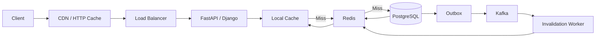

# 20- Caching

## Overview

Caching stores reusable data closer to the code that needs it so repeated operations can avoid expensive computation, database queries, network calls, or serialization.

In backend systems, caching is primarily a **performance and load-management technique**, not a source of truth.

A typical request path without caching is:

```text
Client
  ↓
API
  ↓
Application
  ↓
PostgreSQL
  ↓
Result
```

With caching:

```text
Client
  ↓
API
  ↓
Application
  ↓
Cache ── HIT ──→ Result
  │
  └── MISS
       ↓
   PostgreSQL
       ↓
     Cache
       ↓
     Result
```

Caching can significantly reduce:

- database load;
- response latency;
- external API traffic;
- CPU-intensive computation;
- serialization overhead;
- infrastructure cost.

It also introduces new correctness problems:

- stale data;
- invalidation;
- cache stampedes;
- inconsistent replicas;
- memory pressure;
- key collisions;
- eviction;
- availability dependencies.

A senior backend engineer therefore treats caching as a consistency, capacity, and failure-mode decision rather than simply adding Redis around a slow query.

---

## Why Caching Exists

The primary reason to cache is to avoid repeating expensive work.

Suppose an API executes:

```text
Request
  ↓
PostgreSQL query: 40 ms
  ↓
serialization: 5 ms
  ↓
response
```

If the same data is requested thousands of times, caching can change the path to:

```text
Request
  ↓
Redis: ~1–few ms
  ↓
response
```

The actual latency depends on deployment topology, network distance, payload size, serialization, and contention.

Caching is particularly effective when:

- reads greatly outnumber writes;
- data changes relatively infrequently;
- the same data is requested repeatedly;
- computation is expensive;
- downstream systems have limited capacity;
- stale data is acceptable for a bounded period.

---

## Cache as a Performance Layer

A useful mental model is:

```text
Source of Truth
      ↓
PostgreSQL / Service / Object Storage
      ↓
Cache
      ↓
Application
```

The cache contains a derived or temporary representation of authoritative state.

This leads to an important rule:

> Design the application so that losing the cache does not destroy the authoritative data.

If deleting Redis causes permanent business-data loss, Redis is no longer merely a cache and should be treated as a data store with stronger durability requirements.

---

## Cache Terminology

| Term | Meaning |
|---|---|
| Cache hit | Requested key exists and usable data is returned |
| Cache miss | Key does not exist or is unusable |
| TTL | Time-to-live before an entry expires |
| Eviction | Removing entries to satisfy memory or policy constraints |
| Invalidation | Explicitly removing or marking cached data stale |
| Cache stampede | Many requests simultaneously recompute the same missing value |
| Hit rate | Percentage of cache lookups served by the cache |
| Warm cache | Cache contains commonly requested entries |
| Cold cache | Cache contains few or none of the needed entries |
| Negative cache | Cache stores the absence of a result |
| Write-through | Write updates the cache and source as part of the write strategy |
| Write-back | Cache accepts writes and source persistence happens later |
| Cache-aside | Application explicitly reads/writes the cache around the source |

---

## Cache Layers

Caching can exist at multiple levels.

```text
Client
  ↓
Browser / Client Cache
  ↓
CDN / Edge Cache
  ↓
Nginx / Reverse Proxy
  ↓
Application Cache
  ↓
Redis / Memcached
  ↓
Database Buffer / Query Cache
  ↓
PostgreSQL Storage
```

Common backend layers include:

- HTTP caching;
- CDN caching;
- reverse-proxy caching;
- application in-memory caching;
- distributed caches such as Redis;
- ORM/query-level caching;
- database internal caches.

Each layer has different consistency, scope, and invalidation behavior.

---

## Local In-Memory Cache

Python can cache data inside a process.

For example:

```python
from functools import lru_cache


@lru_cache(maxsize=1024)
def get_country_name(country_code: str) -> str:
    return load_country_name(country_code)
```

This is useful for:

- immutable reference data;
- expensive deterministic computation;
- configuration-derived values;
- small process-local datasets.

However, each process has its own cache:

```text
Kubernetes Pod A
└── Python Process
    └── Local Cache

Kubernetes Pod B
└── Python Process
    └── Different Local Cache
```

Therefore, local caching is not appropriate when all application instances must share one cache state.

---

## `functools.cache` and `lru_cache`

Python provides:

```python
from functools import cache, lru_cache


@cache
def calculate(value: str) -> str:
    return expensive_operation(value)


@lru_cache(maxsize=1024)
def calculate_bounded(value: str) -> str:
    return expensive_operation(value)
```

`cache` provides an unbounded memoization cache, while `lru_cache` supports a maximum size.

These caches are:

- process-local;
- memory-resident;
- synchronous;
- unsuitable for distributed coordination.

Do not use an unbounded process cache for high-cardinality user-controlled keys.

---

## Distributed Caching

Redis is commonly used when multiple backend instances need shared cached state.

```text
                 ┌─────────────┐
Request ────────→│ Load Balancer│
                 └──────┬──────┘
                        │
             ┌──────────┴──────────┐
             ↓                     ↓
        FastAPI Pod A         FastAPI Pod B
             │                     │
             └──────────┬──────────┘
                        ↓
                      Redis
                        ↓
                   PostgreSQL
```

Redis provides shared cache state across application processes and hosts.

It introduces network latency and another infrastructure dependency, so local caching may still be preferable for small immutable data.

---

## Cache-Aside

Cache-aside is one of the most common backend caching patterns.

The application controls both reads and writes:

```text
Read
 ↓
Check Cache
 ├── HIT → return
 │
 └── MISS
       ↓
    Database
       ↓
    Set Cache
       ↓
     Return
```

Example:

```python
import json

CACHE_TTL_SECONDS = 300


def get_product(redis, db, product_id: int) -> dict:
    key = f"product:{product_id}"

    cached = redis.get(key)
    if cached is not None:
        return json.loads(cached)

    product = db.fetch_product(product_id)

    redis.set(
        key,
        json.dumps(product),
        ex=CACHE_TTL_SECONDS,
    )

    return product
```

Cache-aside is popular because the application retains control over:

- what gets cached;
- cache key design;
- serialization;
- invalidation;
- fallback behavior.

---

## Cache-Aside Write Path

For mutable data, a common strategy is:

```text
Write Request
    ↓
BEGIN
    ↓
Update PostgreSQL
    ↓
COMMIT
    ↓
Invalidate Cache
```

Example:

```python
def update_product(redis, db, product_id: int, name: str) -> None:
    db.update_product(product_id, name)
    redis.delete(f"product:{product_id}")
```

The important ordering is that the authoritative database write succeeds before the cache is invalidated.

However, this still has failure windows and race conditions that need to be considered.

---

## Cache Invalidation Race

Consider:

```text
Request A                  Request B

DB UPDATE
    ↓
                         Cache MISS
                             ↓
                         Read old DB state
                             ↓
                         SET old value
    ↓
DELETE CACHE
```

Depending on timing, the cache can end up containing stale data.

A robust caching strategy must reason about concurrent readers and writers rather than assuming:

```text
DB write → delete cache
```

is universally race-free.

Possible solutions include:

- versioned keys;
- write-through approaches;
- delayed double deletion in specific workloads;
- event-driven invalidation;
- cache invalidation inside a carefully designed consistency protocol;
- accepting bounded staleness.

---

## TTL

TTL automatically expires cached entries.

```python
redis.set(
    "product:123",
    payload,
    ex=300,
)
```

After approximately five minutes, the entry becomes unavailable according to Redis expiration semantics.

TTL is useful because it provides a safety boundary:

```text
Cache Entry
    ↓
Fresh
    ↓
TTL expires
    ↓
Cache Miss
    ↓
Refresh from source
```

TTL does not guarantee that cached data is always fresh before expiration.

---

## TTL Selection

TTL should reflect business tolerance for staleness.

| Data | Typical strategy |
|---|---|
| Static reference data | Long TTL |
| Product catalog | Minutes to hours, depending on requirements |
| User profile | Short TTL or explicit invalidation |
| Feature configuration | Short TTL + invalidation |
| Exchange rates | Domain-specific freshness |
| Authorization data | Very careful; often explicit invalidation |
| Session data | Explicit lifecycle + expiration |
| One-time tokens | Short TTL and strict semantics |

There is no universal "correct" TTL.

---

## TTL Is Not Invalidation

These are different mechanisms.

```text
Invalidation
→ remove cache because source changed

TTL
→ remove cache after a time limit
```

A five-minute TTL does not satisfy a requirement such as:

> Changes must become visible within 100 ms.

For such requirements, explicit invalidation or a stronger consistency mechanism may be necessary.

---

## Cache Stampede

A cache stampede occurs when many requests encounter the same expired key simultaneously.

```text
             Cache Miss
                 ↓
       ┌─────────┼─────────┐
       ↓         ↓         ↓
    Request A Request B Request C
       ↓         ↓         ↓
       └────── PostgreSQL ──────┘
```

Instead of one database query, thousands may execute simultaneously.

This can overload the database exactly when the cache is least effective.

---

## Preventing Cache Stampedes

Common techniques include:

- request coalescing;
- distributed locks;
- probabilistic early refresh;
- stale-while-revalidate;
- background refresh;
- TTL jitter;
- bounded concurrency.

TTL jitter avoids many keys expiring at exactly the same moment:

```python
import random

ttl = 300 + random.randint(0, 30)
```

The exact strategy depends on workload and correctness requirements.

---

## Request Coalescing

The goal is:

```text
100 requests
     ↓
1 database refresh
     ↓
100 responses
```

rather than:

```text
100 requests
     ↓
100 database queries
```

This can be implemented using:

- per-key locks;
- single-flight mechanisms;
- distributed locks;
- background refresh workers.

Locking introduces its own failure modes and should not be used casually.

---

## Stale-While-Revalidate

A cache can serve slightly stale data while refreshing it asynchronously.

```text
Request
  ↓
Cache has stale-but-acceptable value
  ↓
Return value
  │
  └──→ Background refresh
```

This reduces request latency and protects the database from synchronized refreshes.

It is useful when:

- bounded staleness is acceptable;
- availability is more important than immediate freshness;
- refresh operations are expensive.

---

## Negative Caching

Negative caching stores "not found" results.

```text
GET user:123
    ↓
Cache miss
    ↓
Database → not found
    ↓
Cache "not found"
```

This prevents repeated requests for nonexistent resources from repeatedly hitting the database.

Negative caching requires a carefully chosen TTL because an object that does not exist now may be created later.

---

## Cache Key Design

A cache key should uniquely identify the cached representation.

Good:

```text
product:v2:123
user-profile:v1:456
search:v3:tenant-42:query-hash
```

Poor:

```text
123
```

Namespacing helps prevent collisions between unrelated objects.

A useful key structure is:

```text
<domain>:<version>:<scope>:<identifier>
```

---

## Cache Key Versioning

Versioning allows structural changes without requiring immediate deletion of every old key.

For example:

```text
product:v1:123
product:v2:123
```

A deployment can begin reading and writing `v2` while old `v1` entries naturally expire.

This is particularly useful when serialization formats or cached representations change.

---

## Key Cardinality

Cache size is affected by:

```text
number of keys
×
average value size
+
Redis overhead
```

A user-controlled query parameter can create unbounded keys:

```text
/search?q=<arbitrary-user-input>
```

Without limits, an attacker or accidental workload can fill the cache.

Control cardinality through:

- normalization;
- bounded query lengths;
- allowlisted dimensions;
- pagination limits;
- maximum cache size;
- TTLs;
- eviction policies.

---

## Serialization

Redis values commonly require serialization.

For JSON:

```python
import json

payload = json.dumps(product)
redis.set("product:123", payload, ex=300)

value = redis.get("product:123")
product = json.loads(value)
```

Serialization adds:

- CPU cost;
- memory overhead;
- latency;
- compatibility considerations.

For internal data, other serialization formats may provide better performance or compactness, but the format should be selected deliberately.

---

## Cache Serialization Compatibility

A rolling deployment can create:

```text
Old application → writes format V1
New application → expects format V2
```

If both versions run simultaneously, the cache format must remain compatible.

Strategies include:

- versioned keys;
- backward-compatible payloads;
- explicit schema versions;
- deployment-time cache invalidation.

Versioned keys are often the simplest approach.

---

## What Should Be Cached?

Good candidates typically have:

- high read frequency;
- expensive source computation;
- stable results;
- acceptable staleness;
- predictable size.

Examples:

```text
product catalog metadata
configuration
permissions metadata
expensive aggregations
reference data
popular API responses
computed feature data
```

Poor candidates include:

- highly volatile data;
- huge low-reuse objects;
- secrets with unclear lifecycle;
- data requiring strict immediate consistency;
- values that are more expensive to serialize than to compute.

---

## Cacheability Decision

Ask:

```text
Is the source expensive?
        ↓ yes
Is the result reused?
        ↓ yes
Can stale data be tolerated?
        ↓ yes
Can invalidation be designed?
        ↓ yes
Is cache failure survivable?
        ↓ yes
      Cache
```

If any answer is no, caching may still be possible, but the design needs additional safeguards.

---

## HTTP Caching

HTTP provides standardized caching semantics.

Common headers include:

```http
Cache-Control: max-age=300
ETag: "abc123"
Last-Modified: ...
```

A client or CDN can reuse a response without contacting the origin.

For example:

```http
GET /products/123
If-None-Match: "abc123"
```

The server can return:

```http
304 Not Modified
```

when the representation has not changed.

---

## Cache-Control

Examples:

```http
Cache-Control: public, max-age=300
```

or:

```http
Cache-Control: private, max-age=60
```

or:

```http
Cache-Control: no-store
```

`no-store` is particularly important for responses containing sensitive information that should not be cached.

HTTP caching should be designed separately from internal Redis caching.

---

## CDN Caching

For public, cacheable content:

```text
Client
  ↓
CDN
 ├── HIT → response
 │
 └── MISS
       ↓
     Nginx
       ↓
     API
       ↓
  PostgreSQL
```

CDNs can dramatically reduce origin traffic.

However, caching personalized responses at shared infrastructure requires careful cache-key and authorization design.

---

## Personalized Response Caching

Never assume a response is safe to cache merely because it is a GET request.

For example:

```http
GET /account/profile
Authorization: Bearer ...
```

The response is user-specific.

A shared cache must not accidentally serve:

```text
User A's response → User B
```

Use appropriate `Cache-Control`, private caching, or explicit cache keys and isolation.

---

## Authorization and Caching

Authorization-sensitive data deserves special treatment.

Suppose:

```text
User A has permission
User B does not
```

Caching a shared representation without incorporating authorization context can become a security vulnerability.

Safer strategies include:

- cache public representations only;
- include the correct tenant/user scope;
- invalidate authorization caches immediately when required;
- use short TTLs when bounded staleness is acceptable;
- keep authorization decisions close to authoritative state.

---

## Cache-Aside with FastAPI

A service layer can encapsulate cache behavior:

```python
import json

from fastapi import FastAPI

app = FastAPI()


async def get_product(product_id: int, db, redis) -> dict:
    key = f"product:v1:{product_id}"

    cached = await redis.get(key)
    if cached is not None:
        return json.loads(cached)

    product = await db.fetch_product(product_id)

    await redis.set(
        key,
        json.dumps(product),
        ex=300,
    )

    return product
```

The API handler should ideally delegate this behavior to an application/service layer rather than embedding cache policy throughout route handlers.

---

## Django Caching

Django provides a cache abstraction that can use different backends.

Conceptually:

```python
from django.core.cache import cache


def get_product(product_id: int):
    key = f"product:v1:{product_id}"

    product = cache.get(key)
    if product is not None:
        return product

    product = load_product(product_id)
    cache.set(key, product, timeout=300)

    return product
```

Django can also integrate caching at broader levels, including:

- per-view caching;
- template fragment caching;
- low-level cache API.

Use the abstraction where it improves portability, but understand the actual backend's behavior and limits.

---

## Redis as a Cache

Redis is commonly used because it provides:

- low-latency in-memory access;
- TTL/expiration;
- atomic commands;
- data structures;
- replication options;
- clustering;
- Lua/scripts where appropriate.

However, Redis is still another network service.

The architecture becomes:

```text
Application
    ↓
Redis
    ↓
PostgreSQL
```

rather than simply:

```text
Application
    ↓
Python dictionary
```

Connection pooling, network failures, timeouts, and Redis capacity therefore matter.

---

## Redis Data Structures

Different cache requirements can use different structures:

| Redis structure | Example use |
|---|---|
| String | Serialized object, counter |
| Hash | Small structured object |
| Set | Membership / uniqueness |
| Sorted set | Ranking / priority |
| List | Queue-like workloads |
| Stream | Event-like data |

Do not select a Redis data structure solely because it is available. Choose based on access patterns and consistency requirements.

---

## Atomic Cache Operations

When multiple operations need coordination, Redis atomic commands can help.

For example:

```text
INCR
SET ... NX
EXPIRE
```

can support certain counters, locks, and coordination mechanisms.

For multi-command operations, Redis transactions or Lua scripting may be appropriate depending on the consistency requirement.

Redis atomicity does not make Redis and PostgreSQL one transaction.

---

## Distributed Locks

A distributed lock can prevent duplicate cache refreshes:

```text
Request A → acquire lock → refresh
Request B → lock unavailable → wait/fallback
Request C → lock unavailable → wait/fallback
```

Distributed locking is difficult to implement correctly.

Important concerns include:

- lock expiration;
- ownership;
- client failure;
- network partitions;
- clock assumptions;
- stale lock holders;
- retry behavior.

Do not implement a distributed lock with a simple unbounded `SET` and assume the problem is solved.

---

## Cache Failure

The cache can fail.

```text
Application
    ↓
Redis unavailable
    ↓
Fallback
    ↓
PostgreSQL
```

For a non-authoritative cache, the application should usually degrade gracefully.

However, blindly falling back for every request can overload PostgreSQL.

---

## Cache Failure and Load Shedding

Consider:

```text
Redis outage
    ↓
100,000 requests/sec
    ↓
All requests hit PostgreSQL
    ↓
Database overload
    ↓
More latency
    ↓
Request queue growth
```

This is a cache failure cascade.

Mitigations include:

- database connection limits;
- rate limiting;
- request shedding;
- bounded concurrency;
- stale cache fallback;
- circuit breakers;
- local emergency caches;
- degraded responses;
- capacity planning for cache-loss scenarios.

---

## Cache Availability

For a critical cache:

```text
Application
   ↓
Redis HA / Cluster
   ↓
Replication / Failover
```

Redis high availability reduces cache outages but does not remove failure modes.

Applications should still define behavior when Redis is:

- unavailable;
- slow;
- returning errors;
- partially reachable;
- recovering after failover.

---

## Cache Timeout

Never allow a cache request to block indefinitely.

Configure bounded timeouts for Redis clients.

Conceptually:

```text
Application deadline
      ↓
Redis timeout
      ↓
Database fallback
```

The cache timeout should fit within the overall request deadline.

A cache that takes several seconds to fail can be worse than a cache miss.

---

## Cache Connection Pooling

Redis clients commonly maintain connection pools.

A pool that is too small causes application requests to wait.

A pool that is too large can create unnecessary Redis connections.

As with PostgreSQL:

```text
replicas
×
processes
×
pool size
```

can multiply connection demand.

---

## Cache Memory Management

Caches are intentionally memory-bound.

Redis may evict keys according to configured eviction behavior.

Common policy concepts include:

- no eviction;
- all-keys LRU;
- volatile TTL-based policies;
- LFU-oriented policies.

The correct policy depends on whether all keys are disposable cache entries and how access patterns behave.

Never assume an eviction policy is harmless for data that has become operationally important.

---

## Eviction

An evicted key behaves like a cache miss:

```text
GET key
 ↓
evicted
 ↓
MISS
 ↓
source lookup
```

The application must tolerate arbitrary cache misses.

Cache correctness should never depend on a key remaining resident forever.

---

## Cache Memory Sizing

Estimate:

```text
required memory
≈
key count
×
(key size + value size + Redis overhead)
```

Then account for:

- replication;
- fragmentation;
- allocator overhead;
- failover headroom;
- operational reserve;
- traffic growth.

Do not size Redis solely from the serialized payload size.

---

## Cache Hit Rate

A common metric is:

```text
hit rate =
cache hits / total cache lookups
```

For example:

```text
900 hits
100 misses

hit rate = 90%
```

A high hit rate does not automatically mean the cache is useful.

A 99% hit rate for a tiny cheap query may save little, while a 70% hit rate for an expensive computation may save substantial resources.

Measure impact, not only hit rate.

---

## Cache Metrics

Useful metrics include:

```text
cache_hits_total
cache_misses_total
cache_errors_total
cache_get_latency
cache_set_latency
cache_evictions_total
cache_memory_usage
cache_connection_pool_wait
cache_keyspace_size
```

Track metrics by bounded dimensions such as:

```text
service
cache
operation
key namespace
```

Avoid user IDs or raw arbitrary keys as metric labels.

---

## Observability

A useful request trace might show:

```text
GET /products/123
 ├── Redis GET: 1.2 ms → HIT
 └── response: 3.1 ms
```

A miss:

```text
GET /products/123
 ├── Redis GET: 1.1 ms → MISS
 ├── PostgreSQL query: 18 ms
 ├── Redis SET: 1.0 ms
 └── response: 24 ms
```

This makes it possible to determine whether caching actually improves end-to-end performance.

---

## Cache Warming

A cold deployment may produce:

```text
new deployment
    ↓
empty cache
    ↓
high miss rate
    ↓
database traffic spike
```

Cache warming can prepopulate predictable high-value data.

Possible approaches include:

- startup jobs;
- background workers;
- scheduled jobs;
- prefetching popular objects.

Do not make application startup depend on warming a huge cache unless the operational benefit justifies the startup coupling.

---

## Cache Warming vs Lazy Population

| Strategy | Advantages | Limitations |
|---|---|---|
| Lazy population | Simple, naturally adapts to demand | Cold-start misses |
| Eager warming | Predictable hot data availability | Extra startup/load cost |
| Background warming | Avoids blocking startup | More operational complexity |
| Scheduled warming | Useful for predictable traffic | Can waste work |

---

## Cache Invalidation Strategies

| Strategy | Freshness | Complexity | Typical use |
|---|---|---|---|
| TTL only | Bounded stale | Low | Approximate freshness |
| Explicit invalidation | Stronger | Medium | Frequently updated objects |
| Versioned keys | Strong | Low–Medium | Schema changes |
| Write-through | Stronger | Higher | Controlled write paths |
| Event-driven | Near-real-time | Higher | Distributed systems |
| Stale-while-revalidate | Bounded stale | Medium | High-read workloads |

---

## Event-Driven Invalidation

A database change can produce an event:

```text
PostgreSQL
    ↓
Outbox
    ↓
Kafka
    ↓
Cache invalidation consumer
    ↓
Redis DEL
```

This can work well in microservices, but it introduces eventual consistency and operational dependencies.

The invalidation event itself must be durable and retryable.

---

## Cache and Kafka

Kafka should generally not be treated as the cache itself.

Kafka provides durable event streaming semantics, while Redis provides low-latency lookup.

A common architecture is:

```text
PostgreSQL
   ↓
Outbox
   ↓
Kafka
   ├── Service A
   ├── Service B
   └── Cache Invalidation Consumer
             ↓
           Redis
```

Kafka distributes changes; Redis serves hot read paths.

---

## Cache and PostgreSQL

Caching should reduce database pressure, not hide poor SQL indefinitely.

Before caching an expensive query:

1. inspect the SQL;
2. inspect indexes;
3. inspect the query plan;
4. remove unnecessary columns;
5. eliminate N+1 queries;
6. measure actual workload;
7. then evaluate caching.

Caching an inefficient query can reduce average load while leaving the underlying design unnecessarily expensive.

---

## Cache and Transactions

Transaction boundaries and cache updates must be coordinated carefully.

A common safe ordering is:

```text
BEGIN
 ↓
update database
 ↓
COMMIT
 ↓
invalidate cache
```

If cache invalidation happens before commit:

```text
invalidate
 ↓
transaction rolls back
 ↓
cache miss
 ↓
database still contains old value
```

This is not necessarily incorrect, but it creates additional behavior that must be understood.

More importantly, cache invalidation cannot participate in a PostgreSQL transaction automatically.

---

## Cache and Read Replicas

Consider:

```text
Write → Primary
Read  → Replica
```

If the cache is populated from a lagging replica:

```text
DB write
   ↓
primary committed
   ↓
replica lag
   ↓
cache stores stale value
```

For consistency-sensitive cache population, read from the authoritative primary or use a replication-aware strategy.

---

## Cache Consistency Models

Caching commonly provides one of several consistency models:

| Model | Description |
|---|---|
| Strong | Reads observe the latest committed state under defined semantics |
| Eventual | Cached state converges after propagation |
| Bounded stale | Data may be stale for a known maximum interval |
| Session-oriented | A particular client/request path receives stronger consistency |

The model should be explicitly chosen.

Do not promise strong consistency while implementing a five-minute TTL cache.

---

## Cache Correctness

Caching can introduce a new invariant:

```text
Cached representation
must never violate security or business rules
```

Examples:

- user A must never receive user B's cached data;
- revoked access must not remain effective beyond the security requirement;
- tenant-specific configuration must not cross tenant boundaries;
- stale inventory must not authorize an impossible purchase.

Some data should therefore not be cached, or should use stronger invalidation.

---

## Multi-Tenant Caching

Tenant context should be represented in cache keys where the value is tenant-specific.

Good:

```text
tenant:42:product:123
tenant:84:product:123
```

Bad:

```text
product:123
```

when product `123` has tenant-specific semantics.

Cache key design is part of the authorization boundary.

---

## Cache Security

Important security risks include:

- cross-user cache leakage;
- cross-tenant data leakage;
- caching private responses in shared caches;
- storing secrets unnecessarily;
- cache poisoning;
- unbounded attacker-controlled keys;
- sensitive data remaining after authorization changes;
- logging cache contents or sensitive keys.

Treat cached data with the same sensitivity classification as the underlying data.

---

## Cache Poisoning

Cache poisoning occurs when an attacker causes incorrect or malicious data to be stored and served from the cache.

Common defenses include:

- validate cache inputs;
- normalize cache keys;
- avoid trusting user-controlled cache metadata;
- isolate tenant/user-specific values;
- prevent unauthorized writes;
- use authenticated internal cache clients;
- avoid caching error responses indiscriminately.

---

## Cache Stampede vs Cache Penetration

These are different problems.

| Problem | Description |
|---|---|
| Stampede | Many requests refresh the same expired/missing key |
| Penetration | Requests repeatedly query the source for values that do not exist |
| Avalanche | Large numbers of cached entries expire or become unavailable together |

Mitigations differ:

```text
Stampede → locking / coalescing / stale-while-revalidate
Penetration → negative caching / input validation
Avalanche → TTL jitter / staged warming / capacity planning
```

---

## Cache Penetration

An attacker might request:

```text
/user/does-not-exist-1
/user/does-not-exist-2
/user/does-not-exist-3
...
```

If every request reaches PostgreSQL, the cache provides no protection.

Negative caching and request validation can reduce this workload.

---

## Cache Avalanche

Suppose one deployment writes millions of entries with:

```text
TTL = 300 seconds
```

If they are created around the same time, they may expire together.

```text
300 seconds
     ↓
millions of expirations
     ↓
massive cache misses
     ↓
database spike
```

Use TTL jitter and controlled refresh strategies for large synchronized populations.

---

## Performance Considerations

Caching adds work:

```text
key generation
+
network call
+
serialization
+
deserialization
+
memory usage
```

Therefore:

```text
cache lookup cost
<
source lookup cost
```

must generally hold for caching to provide value.

Caching a cheap in-process computation through a remote Redis request can make performance worse.

---

## Memory and Cache Payload Size

Large cache values can create:

- serialization CPU;
- network transfer cost;
- Redis memory pressure;
- Python allocation pressure;
- higher garbage collection activity;
- longer tail latency.

Prefer caching only the fields needed by the consuming operation.

Instead of:

```json
{
  "entire_customer_record": "...",
  "large_history": "...",
  "unused_metadata": "..."
}
```

cache a compact representation when appropriate.

---

## Cache Fragmentation

Caching every possible representation can create excessive key cardinality.

For example:

```text
/search?query=a
/search?query=ab
/search?query=abc
...
```

A high-cardinality cache may have poor reuse.

Caching should prioritize **reuse**, not merely expensive operations.

---

## Local Cache + Redis

A two-level cache can reduce network traffic:

```text
Request
  ↓
L1: Process-local cache
  ├── HIT → response
  │
  └── MISS
       ↓
     L2: Redis
       ├── HIT → response
       │
       └── MISS
            ↓
         PostgreSQL
```

Advantages:

- extremely fast L1 hits;
- lower Redis traffic;
- reduced distributed-cache latency.

Limitations:

- invalidation becomes harder;
- each process can hold stale data;
- memory usage increases across workers;
- cache behavior becomes more complex.

Use this only when the performance benefit justifies the consistency complexity.

---

## Cache and Kubernetes

Kubernetes changes cache capacity calculations.

For local caches:

```text
10 pods
×
4 worker processes
×
100 MB cache
=
potentially 4 GB
```

Each process owns its own memory.

For Redis:

```text
10 application pods
      ↓
shared Redis
```

cache state is centralized, but Redis becomes shared infrastructure.

Autoscaling application replicas can also increase cache traffic substantially.

---

## Cache and Docker

Do not assume a container-local cache survives container replacement.

```text
Container restart
    ↓
local memory lost
    ↓
cache cold
```

This is normally acceptable for a cache.

If the data must survive container replacement, it belongs in an appropriate persistent system rather than an ephemeral application cache.

---

## Cache and AWS

Common AWS architectures include:

```text
CloudFront
   ↓
ALB / Nginx
   ↓
FastAPI / Django
   ↓
ElastiCache Redis
   ↓
RDS PostgreSQL
```

Each cache layer should have an explicit purpose.

For example:

- CloudFront → public HTTP content;
- Redis → application-level hot data;
- PostgreSQL → authoritative relational state.

Avoid adding caching layers without a measurable performance or capacity objective.

---

## Cache and Nginx

Nginx can cache selected HTTP responses:

```text
Client
  ↓
Nginx
 ├── cached response
 │
 └── upstream application
```

This is useful for:

- public GET endpoints;
- static or semi-static responses;
- reducing application request volume.

Do not cache authenticated or personalized responses without carefully designing the cache key and privacy model.

---

## Cache and Celery

Celery workers can use Redis for:

- broker communication;
- result backend;
- application caching.

These are logically different workloads.

Avoid assuming that Redis capacity used for Celery can be treated as unlimited cache memory.

Separate Redis deployments or carefully isolated capacity may be appropriate for production systems with high traffic.

---

## Cache and Background Jobs

Background jobs can precompute expensive values:

```text
Celery
  ↓
compute aggregation
  ↓
Redis
  ↓
API reads cached result
```

This is useful for expensive reports or dashboards.

The cache should still have a clear freshness policy.

---

## Cache Invalidation Through Background Jobs

A worker can process:

```text
OrderUpdated event
      ↓
invalidate:
  order:123
  customer:42:orders
  dashboard:42
```

As the number of dependent cache keys increases, invalidation complexity grows.

This is one reason denormalized cache representations should remain narrowly scoped.

---

## Cache Dependency Graphs

A cached object can depend on many database records:

```text
Product
 ├── Price
 ├── Inventory
 ├── Promotion
 └── Category
```

Caching the complete representation means changes to any dependency may require invalidation.

Prefer cache entries whose dependencies are clear and limited.

---

## Cache Tags and Generational Keys

A namespace version can invalidate a family of keys:

```text
catalog:v7:product:123
catalog:v7:product:456
catalog:v7:product:789
```

Changing:

```text
v7 → v8
```

effectively invalidates the entire logical generation without deleting every old key synchronously.

This is useful for bulk invalidation, although old keys still consume resources until expiration or eviction.

---

## Cache Testing

Tests should cover:

- cache hit;
- cache miss;
- source fallback;
- cache write failure;
- stale values;
- TTL behavior;
- invalidation;
- concurrent refresh;
- serialization compatibility;
- Redis unavailable;
- malformed cached values;
- authorization boundaries.

Example:

```python
def test_cache_miss_loads_database(redis, db):
    redis.get.return_value = None
    db.fetch_product.return_value = {
        "id": 123,
        "name": "Keyboard",
    }

    result = get_product(redis, db, 123)

    assert result["id"] == 123
    db.fetch_product.assert_called_once_with(123)
    redis.set.assert_called_once()
```

Integration tests should exercise the real cache backend where Redis-specific behavior matters.

---

## Failure Testing

Production-like tests should simulate:

```text
Redis unavailable
Redis slow
Redis timeout
Redis restart
Cache empty
Cache full
Mass expiration
Database unavailable
Network partition
```

The key question is:

> Does cache failure degrade performance, or does it break correctness?

For a non-authoritative cache, correctness should normally survive cache failure.

---

## Load Testing

Caching can hide database capacity problems during normal traffic.

Test at least:

```text
cold cache
warm cache
partial cache
cache outage
cache stampede
high-cardinality keys
```

Measure:

- p50 latency;
- p95 latency;
- p99 latency;
- database QPS;
- Redis QPS;
- cache hit rate;
- CPU;
- memory;
- connection utilization.

---

## Cost Considerations

Caching can reduce database and compute cost, but Redis itself costs money.

Evaluate:

```text
database cost saved
+
compute/network cost saved
-
cache infrastructure cost
-
operational complexity
```

A cache is worthwhile when it materially improves the system's latency, capacity, reliability, or cost profile.

---

## Reliability Considerations

A cache should normally improve the system without becoming a single point of failure.

For non-authoritative caching:

```text
Redis failure
    ↓
degraded performance
    ↓
database fallback
```

For critical shared state stored in Redis, stronger availability and durability requirements apply.

Do not call something a "cache" merely to avoid designing it as a stateful dependency.

---

## Disaster Recovery

A pure cache generally does not require restoration from backup because its source of truth can repopulate it.

```text
Redis lost
   ↓
Redis recreated
   ↓
cache warms from PostgreSQL
```

However, if Redis contains:

- sessions;
- distributed coordination state;
- queues;
- rate-limit state;
- business-critical ephemeral state;

then recovery requirements are different.

Classify the data before choosing backup and failover strategies.

---

## Cache Invalidation Checklist

Before deploying a cache, document:

- cache key format;
- value schema;
- TTL;
- invalidation trigger;
- maximum size;
- serialization format;
- stale-data tolerance;
- cache failure behavior;
- fallback behavior;
- stampede mitigation;
- authorization scope;
- monitoring;
- rollout strategy;
- rollback strategy.

If these are unknown, the cache design is incomplete.

---

## Production Architecture

A typical backend caching architecture can look like:



Not every system needs every layer.

Start with the simplest cache that solves a measured bottleneck.

---

## Cache Design Workflow

A production caching workflow should be:

```text
Measure workload
    ↓
Identify expensive/repeated operation
    ↓
Determine freshness requirement
    ↓
Choose cache layer
    ↓
Design key/value schema
    ↓
Define TTL/invalidation
    ↓
Define failure behavior
    ↓
Implement
    ↓
Load test
    ↓
Monitor
    ↓
Tune
```

Caching should be driven by measured workload characteristics rather than intuition.

---

## Best Practices

- Treat caches as derived state unless explicitly designed otherwise.
- Measure the bottleneck before adding caching.
- Keep cache keys deterministic, namespaced, and versioned where useful.
- Keep cached payloads small.
- Use TTLs as safety boundaries, not as a substitute for required invalidation.
- Define acceptable staleness explicitly.
- Design cache failure behavior before production deployment.
- Prevent cache stampedes for high-value or expensive keys.
- Add TTL jitter for large synchronized populations where appropriate.
- Use negative caching carefully for repeated misses.
- Avoid unbounded local caches and attacker-controlled high-cardinality keys.
- Separate personalized data from shared cacheable representations.
- Include tenant scope in keys when data is tenant-specific.
- Keep cache serialization compatible across rolling deployments.
- Invalidate after authoritative database changes where appropriate.
- Use database constraints and transactions for correctness; do not delegate durable invariants to caches.
- Use outbox/event-driven invalidation when distributed services require reliable propagation.
- Monitor hit rate, latency, errors, memory, evictions, and fallback load.
- Test cold-cache and cache-outage behavior.
- Size PostgreSQL capacity assuming the cache may be unavailable.
- Size Redis for traffic, memory overhead, replication, and failover headroom.
- Avoid adding multiple cache layers unless their benefits justify the consistency complexity.

---

## Common Mistakes

### Caching Without Measuring

A cache adds complexity.

If the underlying operation is already fast, Redis can make it slower because of network and serialization overhead.

### Using TTL as a Universal Invalidation Strategy

TTL only bounds staleness by time.

It does not provide immediate freshness.

### Caching User-Specific Data Under a Global Key

This can cause cross-user data leakage.

Keys must reflect the scope of the cached representation.

### Treating Redis as the Database

A cache miss, eviction, or Redis loss should not destroy authoritative business state.

### Ignoring Cache Failure

If every Redis failure causes all traffic to hit PostgreSQL simultaneously, the cache becomes a hidden dependency that can trigger a database outage.

### No TTL

Entries can accumulate indefinitely and exhaust memory.

### Unbounded Local Caches

Process-local dictionaries keyed by user input can grow without bound.

### Caching Huge Objects

Large values increase memory, network, serialization, and tail-latency costs.

### Ignoring Rolling Deployments

Changing a cached payload format without versioning can make old and new application versions incompatible.

### Assuming Cache Invalidation Is Trivial

Concurrent readers and writers can repopulate stale values after invalidation.

### Measuring Only Hit Rate

A high hit rate does not prove the cache is valuable.

Measure latency, database load, cost, and tail behavior.

---

## Production Pitfalls

### Cache Outage Becomes Database Outage

The fallback path must have bounded capacity.

### Cache Stampede

A single expiration can trigger thousands of database refreshes.

### Cache Avalanche

Mass expiration can overload the origin.

### Hot Key

One extremely popular key can overload a single cache shard or create lock contention.

Mitigations include replication, request coalescing, local caching, or workload-specific key distribution.

### Stale Authorization

Caching permission-related state for too long can create a security problem.

### Cross-Tenant Leakage

Missing tenant scope in cache keys can expose one tenant's data to another.

### Replica Staleness

Populating caches from lagging read replicas can preserve stale data longer than expected.

### Cache Memory Exhaustion

Payload growth and high key cardinality can silently consume available memory.

### Silent Serialization Failures

A malformed cached payload should not permanently break requests. Validate and handle deserialization failures.

### Retry Amplification

Retries against an overloaded cache or database can multiply traffic and worsen an incident.

---

## Cache Strategy Comparison

| Requirement | Recommended approach |
|---|---|
| Small immutable Python data | Process-local cache |
| Shared application cache | Redis |
| Public HTTP responses | CDN / HTTP cache |
| Expensive repeated computation | Memoization / Redis |
| Frequently changing database entity | Cache-aside + explicit invalidation |
| Approximate freshness acceptable | TTL-based cache |
| Immediate invalidation required | Explicit invalidation/event-driven design |
| Expensive refresh under high concurrency | Request coalescing / stale-while-revalidate |
| Repeated nonexistent lookups | Negative caching |
| Cross-service cache invalidation | Durable events / outbox + consumers |
| Highly sensitive authorization state | Avoid caching or use tightly controlled invalidation |

## Key Takeaways

- **Caching is derived state, not a replacement for the source of truth:** PostgreSQL or another authoritative system should preserve business correctness.
- **Cache design is fundamentally a consistency problem:** define TTL, invalidation, freshness, key scope, and behavior during concurrent reads and writes.
- **Production caches require failure and capacity planning:** prevent stampedes, handle outages, bound fallback load, size memory and connections, and monitor evictions and latency.
- **Cache keys are part of correctness and security:** namespace and version keys, include tenant/user scope when required, and prevent high-cardinality or cross-user cache leakage.
- **Measure cache impact rather than hit rate alone:** evaluate latency, database load, tail performance, memory, cost, and behavior under cold-cache and cache-failure conditions.