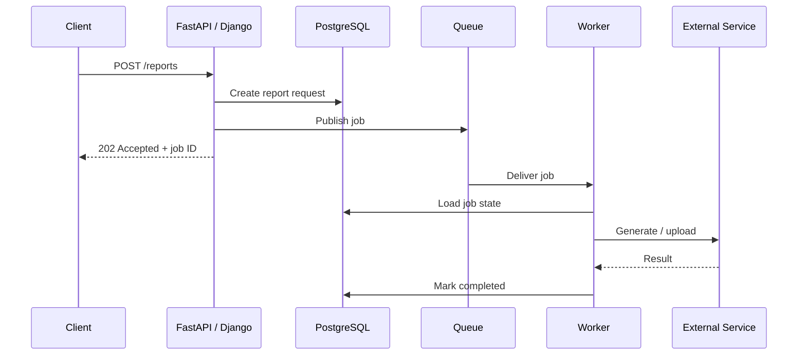
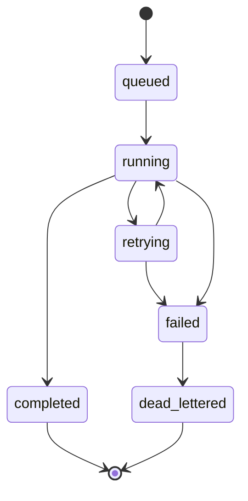
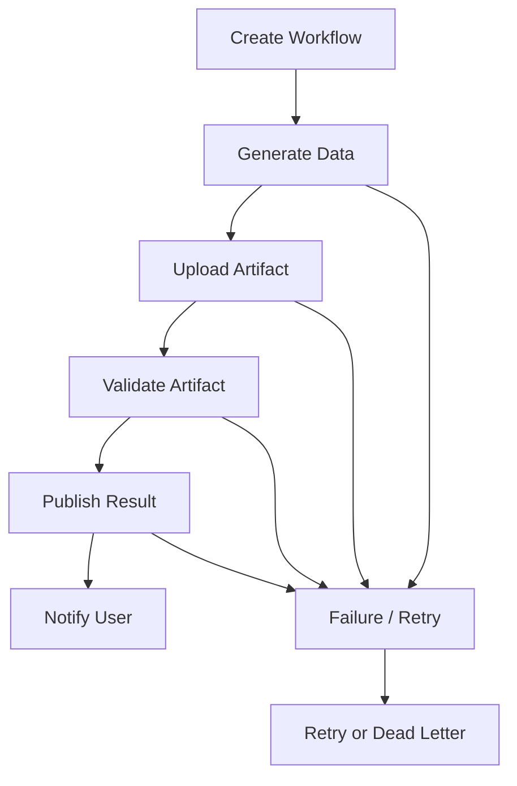
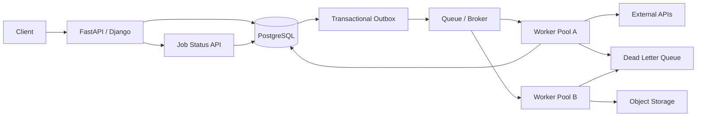

# 22- Background Jobs

## Overview

Background jobs move work out of the synchronous request path so an API can acknowledge a request without waiting for every downstream operation to finish.

A synchronous backend workflow might be:

```text
Client
  ↓
FastAPI / Django
  ↓
Validate
  ↓
Database
  ↓
Generate report
  ↓
Call external API
  ↓
Send email
  ↓
Response
```

A background-job architecture separates immediate request handling from asynchronous work:

```text
Client
  ↓
FastAPI / Django
  ↓
Validate + persist state
  ↓
Enqueue job
  ↓
202 Accepted
```

Later:

```text
Queue
  ↓
Worker
  ↓
Process job
  ├── PostgreSQL
  ├── Redis
  ├── External APIs
  └── Object Storage
```

Background jobs are useful for work that is:

- slow;
- CPU-intensive;
- I/O-heavy;
- retryable;
- independently scalable;
- not required to complete before responding;
- operationally better handled outside request workers.

Typical workloads include:

- email and notifications;
- report generation;
- file processing;
- webhook delivery;
- search indexing;
- data exports;
- payment reconciliation;
- image/video processing;
- scheduled maintenance;
- ETL jobs.

Background jobs are distributed systems. They require explicit handling of retries, duplicate execution, failures, ordering, timeouts, observability, capacity, and graceful shutdown.

---

## Why Background Jobs Exist

The primary reason to use a background job is to separate **request latency** from **work completion latency**.

Suppose:

```text
POST /reports

Validation             5 ms
Database write        20 ms
Report generation   1500 ms
Upload                300 ms
Email                 200 ms
```

A synchronous endpoint might take approximately two seconds or more.

A background-job design can return after the durable request state and job submission are established:

```text
POST /reports
    ↓
Persist report request
    ↓
Enqueue job
    ↓
202 Accepted
```

The worker performs the expensive work independently.

This improves responsiveness but changes the API contract from:

> The operation is complete.

to:

> The operation has been accepted for processing.

---

## When to Use Background Jobs

Use a background job when:

- completion can happen asynchronously;
- work may take longer than the request latency budget;
- failures should be retried independently;
- worker capacity should scale separately from API capacity;
- work can be buffered during traffic spikes;
- processing does not need to block the caller.

Examples:

```text
Generate PDF
Send email
Resize image
Process uploaded CSV
Deliver webhook
Rebuild search index
Generate analytics report
```

---

## When Not to Use a Background Job

Do not introduce asynchronous processing merely because it sounds scalable.

Synchronous processing may be better when:

- the client needs the result immediately;
- the operation is cheap;
- the operation must be strongly consistent with the response;
- asynchronous state management would add unnecessary complexity.

For example:

```text
GET /users/123
```

should generally not enqueue a job simply to retrieve a user record.

---

## Background Job vs Message Queue

A **background job** is the unit of work.

A **message queue** is one mechanism for transporting and buffering that work.

```text
Background Job
     ↓
Message
     ↓
Queue / Broker
     ↓
Worker
```

For example:

```text
Celery task
     ↓
Redis / RabbitMQ
     ↓
Celery worker
```

Other architectures can use:

- Amazon SQS;
- Kafka;
- RabbitMQ;
- cloud-native task queues;
- database-backed job tables.

The job abstraction and transport mechanism should remain conceptually separate.

---

## Request Lifecycle

A typical asynchronous API workflow is:



The API response and job completion are separate lifecycle events.

---

## Job States

A persistent job should usually have explicit state.

For example:

```text
queued
   ↓
running
   ↓
completed
```

Failure can produce:

```text
running
   ↓
failed
   ↓
retrying
   ↓
running
```

Permanent failure:

```text
running
   ↓
failed
   ↓
dead_lettered
```

An explicit state model makes retries, monitoring, reconciliation, and user-facing status easier to implement.

---

## Job State Machine



The exact states depend on the job system.

---

## Job Identifier

Every externally visible job should have a stable identifier.

Example:

```json
{
  "job_id": "job_01JXYZ",
  "status": "queued"
}
```

The ID allows clients and operators to correlate:

```text
HTTP request
    ↓
job ID
    ↓
queue message
    ↓
worker logs
    ↓
database state
    ↓
trace
```

Avoid exposing internal broker-specific identifiers as your application's primary business identifier.

---

## Asynchronous API Pattern

A REST endpoint can return:

```http
HTTP/1.1 202 Accepted
Content-Type: application/json

{
  "job_id": "job_123",
  "status": "queued"
}
```

The client can then poll:

```http
GET /jobs/job_123
```

Example:

```json
{
  "job_id": "job_123",
  "status": "completed",
  "result_url": "/reports/rpt_123"
}
```

For long-running operations, this is usually clearer than keeping the original HTTP request open indefinitely.

---

## `202 Accepted`

`202 Accepted` means the request has been accepted for processing but does not imply completion.

A useful contract is:

```text
202 → accepted
200 → completed status lookup
404 → unknown job
```

The API should clearly document:

- job states;
- expected completion time;
- retry behavior;
- failure representation;
- result retrieval;
- retention of job status.

---

## Background Jobs and Transactions

A common mistake is assuming:

```text
Database transaction
+
queue publication
```

is automatically atomic.

For example:

```text
BEGIN
 ↓
INSERT order
 ↓
COMMIT
 ↓
enqueue job
```

If the process crashes between commit and enqueue:

```text
Order exists
Job does not
```

The reverse ordering has the opposite problem.

---

## Transactional Outbox

For important workflows, use an outbox:

```text
BEGIN
 ├── Business state
 └── Outbox job/event
 ↓
COMMIT
 ↓
Publisher
 ↓
Queue
 ↓
Worker
```

This makes the database transaction authoritative for both:

- business state;
- intent to perform asynchronous work.

A publisher can safely retry delivery.

---

## Job Table

An outbox or job table might contain:

```text
id
type
payload
status
attempts
available_at
created_at
updated_at
last_error
```

For database-backed jobs, PostgreSQL can serve as the durable source of job state, although a dedicated queue may provide better throughput and operational characteristics.

---

## Celery

Celery is a common Python distributed task framework.

Basic structure:

```text
FastAPI / Django
      ↓
Celery task
      ↓
Broker
      ↓
Celery worker
```

Example:

```python
from celery import Celery

celery_app = Celery(
    "backend",
    broker="redis://redis:6379/0",
)


@celery_app.task
def generate_report(report_id: str) -> None:
    generate_report_for_id(report_id)
```

In production, broker credentials and URLs should come from environment configuration or a secret-management system.

---

## Celery Task Design

A Celery task should generally be thin:

```python
@celery_app.task
def generate_report(report_id: str) -> None:
    report_service.generate(report_id)
```

Business logic belongs in application services rather than inside the Celery decorator.

This keeps the business operation testable without requiring a running worker.

---

## Task Arguments

Prefer passing stable identifiers:

```python
generate_report.delay(report_id)
```

rather than large serialized objects:

```python
generate_report.delay(huge_report_object)
```

Advantages of identifiers include:

- smaller messages;
- less serialization;
- fresher state at execution time;
- simpler schema evolution;
- lower broker memory usage.

The worker can retrieve current state from PostgreSQL or object storage.

---

## Passing Current State vs Identifier

Passing a complete object:

```text
API
 ↓
serialize object
 ↓
queue
 ↓
worker
```

can process stale data.

Passing an identifier:

```text
API
 ↓
queue report_id
 ↓
worker
 ↓
load current state
```

usually provides a cleaner boundary.

However, if historical state must be preserved exactly, the job payload may intentionally contain a snapshot.

---

## Idempotency

A background job may execute more than once.

Example:

```text
Worker receives job
    ↓
Charges payment
    ↓
Network failure before acknowledgment
    ↓
Job redelivered
    ↓
Charges payment again
```

This is unacceptable for many operations.

Jobs that produce external side effects should use idempotency mechanisms.

---

## Idempotent Job Example

Use a durable operation identifier:

```text
job_id = job_123
    ↓
external idempotency key
    ↓
payment provider
```

The provider can recognize duplicate requests.

For internal database operations, use unique constraints or processed-operation records.

---

## Job Deduplication

Sometimes the same logical job should not be scheduled repeatedly.

Example:

```text
rebuild_search_index(product_123)
rebuild_search_index(product_123)
rebuild_search_index(product_123)
```

Possible strategies include:

- unique job keys;
- database uniqueness;
- Redis locks;
- queue-specific deduplication;
- coalescing.

Deduplication is different from idempotency.

> Deduplication attempts to prevent duplicate jobs; idempotency makes duplicate execution safe.

---

## Retries

Background jobs should distinguish transient failures from permanent failures.

Transient examples:

- HTTP timeout;
- HTTP 503;
- temporary database connectivity issue;
- rate limiting;
- broker interruption.

Permanent examples:

- invalid payload;
- unsupported schema;
- missing required resource;
- unrecoverable business rule violation.

---

## Retry Policy

A production retry policy should define:

```text
maximum attempts
initial delay
backoff factor
jitter
retryable exceptions
retryable status codes
deadline
dead-letter behavior
```

Example:

```text
Attempt 1 → immediate
Attempt 2 → +5 s
Attempt 3 → +15 s
Attempt 4 → +45 s
Then → DLQ
```

The exact schedule should reflect the downstream service's recovery characteristics.

---

## Exponential Backoff

A common formula is:

```text
delay = base × 2^attempt
```

Add jitter:

```text
delay = exponential_delay + random_jitter
```

Jitter prevents thousands of workers from retrying at exactly the same time.

---

## Retry Storms

Suppose:

```text
1,000 workers
    ↓
external API unavailable
    ↓
1,000 immediate retries
    ↓
external API receives another spike
```

The outage can become self-amplifying.

Use:

- exponential backoff;
- jitter;
- bounded concurrency;
- circuit breakers;
- retry budgets;
- rate limits.

---

## Retry the Right Unit

If a job consists of:

```text
1. create database record
2. upload file
3. send notification
```

retrying the entire sequence blindly may duplicate completed work.

Prefer operations that are independently idempotent or use explicit workflow state:

```text
created
 ↓
uploaded
 ↓
notified
 ↓
completed
```

Then retry the failed transition safely.

---

## Dead-Letter Queues

Jobs that repeatedly fail should eventually leave the normal processing path.

```text
Queue
 ↓
Worker
 ├── success → complete
 ├── transient failure → retry
 └── permanent/repeated failure → DLQ
```

A DLQ allows operators to inspect failures without continuously retrying them.

---

## Poison Jobs

A poison job always fails because the input or code is invalid.

Examples:

```text
unsupported schema
missing resource
invalid file
programming bug
```

Without a DLQ:

```text
job
 ↓
retry
 ↓
retry
 ↓
retry
 ↓
infinite failure
```

This wastes resources and can block useful work.

---

## Job Timeouts

Every background job should have an expected execution limit.

Possible controls include:

- broker visibility timeout;
- worker task timeout;
- HTTP client timeout;
- database statement timeout;
- application deadline.

For example:

```text
Job timeout = 10 min
HTTP timeout = 5 sec
DB statement timeout = 2 sec
```

The individual operation timeouts should fit within the overall job deadline.

---

## Long-Running Jobs

Long-running jobs require additional design.

Examples:

- video processing;
- large data exports;
- ML inference;
- bulk migrations.

Avoid tying up a worker indefinitely.

Use:

- checkpoints;
- resumable processing;
- progress state;
- bounded batches;
- heartbeats;
- cancellation support.

---

## Job Progress

For user-visible long-running jobs:

```json
{
  "job_id": "job_123",
  "status": "running",
  "progress": 63
}
```

Progress should represent a meaningful measurable quantity.

Avoid fake percentages such as:

```text
progress = elapsed_time / estimated_time
```

when execution duration is highly variable.

---

## Cancellation

A queued job can often be cancelled before processing begins.

A running job is more difficult.

```text
queued → cancelled
running → cancellation_requested → cancelled
```

The worker must cooperate with cancellation.

External operations may not be safely cancellable, so cancellation semantics must be explicitly documented.

---

## Worker Concurrency

Worker concurrency determines how many jobs can execute simultaneously.

For example:

```text
5 workers
×
10 concurrent tasks
=
up to 50 active tasks
```

This can overwhelm downstream systems.

Concurrency must account for:

- PostgreSQL connection capacity;
- Redis capacity;
- external API limits;
- CPU;
- memory;
- network bandwidth.

---

## CPU-Bound Jobs

CPU-heavy jobs are different from I/O-heavy jobs.

Examples:

```text
image processing
compression
large transformations
cryptographic computation
```

For CPU-bound work, Python's traditional CPython GIL can limit parallel execution within threads.

Depending on workload, use:

- multiple worker processes;
- multiprocessing;
- native extensions;
- specialized compute services;
- distributed workers.

The exact strategy depends on the Python runtime and workload.

---

## I/O-Bound Jobs

I/O-heavy work includes:

```text
HTTP
database
object storage
SMTP
```

Workers can often benefit from concurrency because they spend substantial time waiting.

However, more concurrency is not automatically better.

The downstream service remains the capacity constraint.

---

## Async Background Jobs

An async Python worker can process I/O concurrently:

```python
async def process_webhook(webhook):
    response = await http_client.post(
        webhook.url,
        json=webhook.payload,
    )
    response.raise_for_status()
```

Avoid blocking calls inside an async worker:

```python
async def bad_worker():
    time.sleep(10)
```

Use appropriate asynchronous libraries or move blocking operations to suitable worker threads/processes.

---

## Celery Concurrency

Celery supports different execution pools and concurrency models.

The correct configuration depends on:

- CPU vs I/O workload;
- task duration;
- memory footprint;
- broker;
- downstream limits.

Do not simply maximize the concurrency number.

A worker with excessive concurrency can create:

```text
worker overload
 ↓
database pool exhaustion
 ↓
request failures
```

---

## Worker Memory

Long-running workers can accumulate memory through:

- large task payloads;
- retained references;
- caches;
- native-library allocations;
- memory fragmentation;
- leaks.

Monitor:

```text
RSS
heap/allocation behavior
task duration
worker restart frequency
```

For workloads with known memory growth characteristics, controlled worker recycling can be an operational mitigation, but it should not replace investigating a leak.

---

## Queue Backpressure

A queue absorbs bursts:

```text
Traffic spike
    ↓
Queue depth grows
    ↓
Workers process backlog
```

But if:

```text
producer rate > sustainable consumer rate
```

the backlog eventually grows without bound.

Monitor:

- queue depth;
- queue age;
- processing rate;
- producer rate.

---

## Queue Age

Queue age is often more useful than queue depth alone.

```text
Message created
     ↓
waiting
     ↓
consumer starts
```

The difference is queue wait time.

For user-facing asynchronous operations, define an SLO such as:

```text
99% of jobs start within 30 seconds
```

and alert when queue age threatens that objective.

---

## Worker Autoscaling

Workers can scale based on:

```text
queue depth
queue age
consumer lag
CPU
memory
processing latency
```

Queue-based autoscaling is often more representative than CPU-only scaling for I/O-heavy workloads.

Kubernetes can integrate with external metrics or event-driven autoscaling mechanisms.

---

## Kubernetes Worker Deployment

A worker can run independently from API pods:

```text
Deployment: api
    replicas: 10

Deployment: worker
    replicas: 5
```

This allows:

```text
API traffic increase
    ↓
scale API

Queue backlog increase
    ↓
scale workers
```

The two capacity dimensions remain independent.

---

## Graceful Shutdown

Workers must handle process termination safely.

A useful lifecycle is:

```text
SIGTERM
  ↓
Stop accepting new work
  ↓
Finish active task if possible
  ↓
Persist state
  ↓
ACK completed work
  ↓
Close connections
  ↓
Exit
```

If a task cannot finish within the shutdown window, it should become safely retryable.

---

## Kubernetes Termination

Kubernetes may terminate a worker after its grace period.

Configure the application and deployment consistently:

```yaml
spec:
  template:
    spec:
      terminationGracePeriodSeconds: 60
```

The appropriate value depends on the maximum expected task duration and shutdown semantics.

A worker should not rely on Kubernetes giving it unlimited time.

---

## Worker Health

Worker health is different from HTTP server health.

Useful signals include:

```text
broker connectivity
database connectivity
active task count
queue lag
task failure rate
```

A worker process can be alive while being functionally unhealthy.

For example:

```text
process = running
broker connection = broken
queue progress = zero
```

Monitoring should detect this condition.

---

## Job Persistence

For critical user-visible jobs, persist job state.

Example:

```sql
CREATE TABLE jobs (
    id UUID PRIMARY KEY,
    type TEXT NOT NULL,
    status TEXT NOT NULL,
    attempts INTEGER NOT NULL DEFAULT 0,
    available_at TIMESTAMPTZ NOT NULL,
    created_at TIMESTAMPTZ NOT NULL,
    updated_at TIMESTAMPTZ NOT NULL
);
```

The schema should be adapted to the application's requirements.

Persisted state allows:

- status APIs;
- operational inspection;
- reconciliation;
- retry tracking;
- auditing.

---

## Database-Backed Jobs

A database table can act as a simple job queue:

```text
PostgreSQL
    ↓
SELECT pending jobs
    ↓
Worker
    ↓
Process
```

PostgreSQL locking patterns such as `FOR UPDATE SKIP LOCKED` can support concurrent workers for suitable workloads.

Example:

```sql
SELECT id
FROM jobs
WHERE status = 'queued'
  AND available_at <= now()
ORDER BY created_at
FOR UPDATE SKIP LOCKED
LIMIT 100;
```

This can be effective for moderate workloads but should not automatically replace a purpose-built broker.

---

## Database Queue Advantages

Advantages:

- fewer infrastructure components;
- transactional integration with business data;
- straightforward operational model;
- easy job inspection with SQL.

Limitations:

- database becomes queue infrastructure;
- polling adds load;
- high-throughput workloads may be inefficient;
- queue retention can compete with business data;
- database availability becomes tightly coupled to job processing.

Use this approach when the workload fits the database's capacity and operational model.

---

## Polling

Database-backed workers often poll:

```text
SELECT pending jobs
     ↓
sleep
     ↓
SELECT again
```

Too-frequent polling creates unnecessary database load.

Too-infrequent polling increases job latency.

A broker with push or efficient delivery semantics may be preferable at higher scale.

---

## Job Leasing

A worker may temporarily claim a job:

```text
queued
  ↓
leased by Worker A
  ↓
processing
```

If Worker A crashes:

```text
lease expires
  ↓
job becomes available
```

Lease duration should be compatible with task execution time.

This is conceptually similar to queue visibility timeouts.

---

## Heartbeats and Lease Extension

For long-running jobs, a worker can periodically renew a lease:

```text
Worker
  ↓
process
  ↓
heartbeat
  ↓
extend lease
  ↓
process
  ↓
complete
```

If heartbeats stop, another worker can eventually recover the job.

This reduces the chance that a long-running job is considered abandoned while still executing.

---

## Job Ownership

A worker should be able to determine:

```text
Who owns this job?
Is the lease still valid?
Has another worker taken over?
```

This is particularly important for long-running database-backed jobs.

Distributed ownership must be designed carefully to avoid two workers simultaneously performing non-idempotent work.

---

## Scheduled Jobs

Scheduled work includes:

- daily reports;
- cleanup;
- synchronization;
- billing;
- data exports;
- periodic reconciliation.

Possible technologies include:

- Celery Beat;
- Kubernetes CronJob;
- AWS EventBridge;
- managed scheduler services.

A scheduler typically creates work; workers execute it.

---

## Scheduled Job Pattern

```text
Scheduler
   ↓
enqueue job
   ↓
Queue
   ↓
Worker
   ↓
Execute
```

Keep scheduling separate from processing where practical.

This allows multiple workers to process scheduled workloads and makes retries independent from scheduling.

---

## Cron vs Background Queue

| Requirement | Cron / Scheduler | Queue + Worker |
|---|---|---|
| Simple periodic command | Excellent | Often unnecessary |
| Long-running processing | Limited | Good |
| Parallel work | Limited | Excellent |
| Retries | Basic/manual | Stronger |
| Backpressure | Limited | Natural |
| Per-item processing | Poor fit | Good |
| Horizontal scaling | Limited | Good |

A scheduled task can enqueue one or many background jobs.

---

## Job Dependencies

Some workflows have dependencies:

```text
extract
  ↓
transform
  ↓
load
```

Do not assume queue ordering alone is enough to enforce dependencies.

Use explicit state:

```text
extract completed
    ↓
transform enabled
    ↓
load enabled
```

Workflow engines may be appropriate for complex dependency graphs.

---

## Long-Running Workflow

A complex process might look like:



Each step should have explicit state and retry semantics.

---

## Background Jobs and External APIs

Workers commonly call external services.

Use:

- explicit connection timeouts;
- read timeouts;
- retry classification;
- rate limits;
- idempotency keys;
- circuit breakers;
- response validation.

Example:

```python
async def deliver_webhook(client, webhook):
    response = await client.post(
        webhook.url,
        json=webhook.payload,
        timeout=5.0,
        headers={
            "Idempotency-Key": webhook.delivery_id,
        },
    )
    response.raise_for_status()
```

Never allow a worker to wait indefinitely for an external service.

---

## Background Jobs and PostgreSQL

Workers frequently perform database operations.

Keep transaction boundaries short:

```text
receive job
    ↓
load state
    ↓
BEGIN
    ↓
update durable state
    ↓
COMMIT
    ↓
ACK
```

Do not hold a transaction open while making unrelated HTTP calls.

---

## Background Jobs and Redis

Redis can support:

- broker communication;
- job metadata;
- distributed coordination;
- rate limiting;
- temporary state.

Do not overload one Redis deployment without considering workload isolation.

For example:

```text
Redis
 ├── Celery broker
 ├── Cache
 └── Rate limits
```

can create unexpected contention during incidents.

Critical workloads may warrant separate Redis resources.

---

## Background Jobs and Kafka

Kafka works well for event-driven asynchronous processing:

```text
Service
  ↓
Kafka topic
  ↓
Consumer group
  ↓
Worker
```

Kafka is particularly useful when:

- replay is important;
- event retention matters;
- multiple consumer groups need the same events;
- high throughput is required.

Traditional task queues may be simpler for one-off background work.

---

## Background Jobs and S3

Large artifacts should usually live in object storage:

```text
API
 ↓
S3 upload
 ↓
job message
 └── object_key
       ↓
worker
       ↓
download/process
```

Avoid placing multi-megabyte or gigabyte files directly inside queue messages.

---

## Background Jobs and Emails

Email is often a good asynchronous workload:

```text
API
 ↓
persist business state
 ↓
enqueue SendEmail
 ↓
response
```

The worker handles:

```text
SMTP / Email Provider
 ↓
retry
 ↓
delivery status
```

Use provider idempotency or durable delivery identifiers where duplicate sends would be problematic.

---

## Background Jobs and Webhooks

Webhook delivery is naturally retryable:

```text
Event
 ↓
Webhook Queue
 ↓
Worker
 ↓
HTTP POST
 ├── 2xx → complete
 ├── 429 → retry later
 ├── 5xx → retry
 └── permanent 4xx → inspect / fail
```

Webhook workers should enforce:

- connection timeout;
- response timeout;
- maximum payload size;
- retry policy;
- signing;
- idempotency;
- delivery records.

---

## Background Jobs and File Processing

A production file-processing pipeline can be:

```text
Client
  ↓
Upload to S3
  ↓
Create database record
  ↓
Enqueue processing job
  ↓
Worker
  ↓
Validate
  ↓
Process in bounded batches
  ↓
Store output
  ↓
Mark completed
```

The API remains responsive while workers handle expensive processing.

---

## Memory-Efficient Jobs

Large jobs should avoid full materialization.

Bad:

```python
records = list(load_millions_of_rows())
process(records)
```

Prefer streaming or bounded batches:

```python
for batch in load_batches(batch_size=1000):
    process_batch(batch)
```

This reduces peak memory usage and makes large jobs easier to operate.

---

## Job Checkpointing

For very large jobs:

```text
Process rows 1–10,000
      ↓
checkpoint
      ↓
Process 10,001–20,000
      ↓
checkpoint
```

If the worker crashes, processing can resume from the latest checkpoint rather than restarting the entire job.

Checkpoint state must itself be durable and concurrency-safe.

---

## Batch Size

Batch size is a trade-off:

| Smaller batches | Larger batches |
|---|---|
| Lower memory | Higher throughput |
| Smaller retry unit | Fewer round trips |
| Shorter transactions | Larger transactions |
| More overhead | Higher failure scope |

Benchmark and load-test realistic workloads rather than choosing an arbitrary batch size.

---

## Job Priorities

Not all jobs have equal urgency.

For example:

```text
High priority
payment reconciliation

Normal
email

Low priority
analytics export
```

Possible approaches include:

- priority queues;
- separate queues;
- dedicated worker pools.

Separate queues can provide clearer capacity isolation.

---

## Fairness

High-priority work can starve low-priority work.

Monitor:

```text
queue depth
queue age
```

for each class.

If low-priority jobs can never run, the scheduling policy is operationally incorrect even if high-priority latency is excellent.

---

## Job Rate Limiting

Workers may need to respect provider limits:

```text
External API
→ 100 requests/sec
```

A worker fleet with 1,000 concurrent tasks can violate that limit immediately.

Use:

- distributed rate limiting;
- bounded worker concurrency;
- provider-specific throttling;
- delayed retries.

---

## Circuit Breakers

If an external dependency is repeatedly failing:

```text
Worker
 ↓
External API
 ↓
many failures
 ↓
Circuit OPEN
 ↓
stop immediate calls
```

This protects both the worker fleet and the failing dependency.

Jobs can be retried later rather than continuously hammering the service.

---

## Failure Isolation

Different workloads should not necessarily share the same worker pool.

For example:

```text
API
 ↓
Queue A → Payment Workers
Queue B → Email Workers
Queue C → Report Workers
```

A huge report backlog should not prevent payment reconciliation from running.

Separate queues provide workload isolation at the cost of more operational complexity.

---

## Noisy Neighbor Problem

Suppose:

```text
1 worker pool
 ├── 95% report jobs
 └── 5% payment jobs
```

A report spike can delay payments.

Separate worker pools can protect latency-sensitive jobs:

```text
Report Workers
Payment Workers
```

This is a capacity-isolation decision.

---

## Multi-Tenant Jobs

For SaaS systems, tenant-aware processing may be necessary.

A message might contain:

```json
{
  "job_id": "job_123",
  "tenant_id": "tenant_42",
  "type": "report.generate"
}
```

The worker must enforce tenant isolation when accessing PostgreSQL, object storage, or external services.

Do not rely on message metadata alone for authorization.

---

## Fair Tenant Scheduling

One tenant can generate enormous job volume:

```text
Tenant A → 1,000,000 jobs
Tenant B → 100 jobs
```

Without controls, Tenant A may consume all worker capacity.

Possible protections include:

- per-tenant quotas;
- rate limits;
- weighted scheduling;
- separate queues;
- concurrency limits.

---

## Job Security

Background jobs are asynchronous inputs and should be treated as untrusted at system boundaries.

Validate:

- message schema;
- payload size;
- identifiers;
- allowed job types;
- tenant context;
- referenced resources.

Do not blindly deserialize arbitrary Python objects.

---

## Secrets

Do not embed secrets directly in job payloads:

```json
{
  "api_key": "secret-value"
}
```

Prefer:

```json
{
  "provider": "payment-service",
  "payment_id": "pay_123"
}
```

The worker retrieves credentials through its configured secret-management mechanism.

---

## Authorization at Execution Time

A job may execute much later than the original request.

```text
Request at 10:00
    ↓
job queued

Execution at 10:15
```

Authorization or resource state may have changed.

For sensitive operations, the worker should validate current state and permissions where appropriate rather than trusting stale request-time assumptions.

---

## Observability

A production job should be traceable across:

```text
request
 ↓
job creation
 ↓
message
 ↓
worker
 ↓
database
 ↓
external service
```

Use:

- job ID;
- message ID;
- correlation ID;
- trace ID;
- tenant ID where appropriate.

These identifiers make asynchronous debugging much easier.

---

## Structured Logging

A worker log might look like:

```json
{
  "event": "job_completed",
  "job_id": "job_123",
  "job_type": "report.generate",
  "attempt": 2,
  "duration_ms": 1840,
  "status": "success"
}
```

Do not log entire job payloads when they may contain sensitive or large data.

---

## Job Metrics

Useful metrics include:

```text
jobs_submitted_total
jobs_started_total
jobs_completed_total
jobs_failed_total
jobs_retried_total
jobs_dead_lettered_total
job_duration_seconds
job_queue_age_seconds
job_attempts
```

Measure these by bounded dimensions such as:

```text
job_type
queue
service
```

Avoid high-cardinality metric labels such as:

```text
job_id
user_id
tenant_id
raw_error_message
```

unless the monitoring system and use case explicitly support that cardinality.

---

## Job Success Rate

Track:

```text
successful jobs
failed jobs
retry rate
permanent failure rate
```

A high success rate can still hide unacceptable latency.

For user-facing jobs, measure:

```text
time submitted → time completed
```

not just worker execution duration.

---

## Queue Latency vs Processing Latency

Separate:

```text
queue latency
+
processing latency
=
total job latency
```

Example:

```text
Queue wait:    40 sec
Processing:     5 sec
Total:         45 sec
```

Optimizing the worker from 5 seconds to 3 seconds does little if queue wait remains 40 seconds.

---

## Distributed Tracing

Tracing should connect the request that created a job with asynchronous execution where the tracing system supports that propagation model.

Conceptually:

```text
HTTP Trace
   ↓
job.enqueue
   ↓
message
   ↓
worker trace
   ↓
database / HTTP spans
```

The job ID remains useful even when trace context expires or cannot be propagated end-to-end.

---

## Monitoring Backlog

Alert on:

- sustained queue growth;
- oldest job age;
- consumer lag;
- retry spikes;
- DLQ growth;
- worker crashes;
- processing latency;
- broker errors;
- downstream saturation.

A queue is healthy when work is continuously progressing, not merely when workers are running.

---

## Operational Dashboard

A useful worker dashboard contains:

| Metric | Why it matters |
|---|---|
| Queue depth | Backlog size |
| Oldest job age | User-visible delay |
| Processing latency | Worker efficiency |
| Success rate | Reliability |
| Retry rate | Dependency/application health |
| DLQ count | Permanent failure |
| Worker count | Capacity |
| CPU | Compute pressure |
| Memory | Resource pressure |
| DB connections | Downstream saturation |
| External API rate | Dependency capacity |

---

## Testing Background Jobs

Test the job at multiple levels.

### Unit Tests

Test:

- business logic;
- retry classification;
- validation;
- idempotency;
- state transitions.

### Integration Tests

Test:

- broker interaction;
- database transactions;
- serialization;
- acknowledgment;
- retries;
- external-client behavior.

### End-to-End Tests

Test:

```text
API
 ↓
Database
 ↓
Queue
 ↓
Worker
 ↓
Database / external service
```

for critical workflows.

---

## Failure Testing

Simulate:

```text
worker crash
broker outage
database timeout
external API timeout
duplicate delivery
message corruption
poison message
network partition
slow dependency
Kubernetes termination
```

The key question is:

> Can the system recover without losing or duplicating critical business effects?

---

## Testing Idempotency

A useful test executes the same job twice:

```text
job execution #1
    ↓
success

job execution #2
    ↓
duplicate
    ↓
same business result
```

This should be a required test for jobs with at-least-once delivery semantics.

---

## Testing Retries

Test both:

```text
transient failure
    ↓
retry
    ↓
success
```

and:

```text
permanent failure
    ↓
retry limit
    ↓
DLQ / failed state
```

Do not test only the successful path.

---

## Deployment

Background workers should normally be deployed independently from API servers.

```text
CI/CD
 ├── API image
 └── Worker image
```

They can share application code but should have distinct process roles.

For example:

```text
CMD ["uvicorn", "app.main:app"]

CMD ["celery", "-A", "app.worker", "worker"]
```

The exact commands depend on the application architecture.

---

## Worker Version Compatibility

Rolling deployments may have:

```text
Worker V1
Worker V2
```

processing the same queue.

Messages must therefore remain compatible across versions.

Use:

- versioned schemas;
- additive changes;
- backward-compatible consumers;
- migration periods.

Avoid deploying a consumer that cannot process messages still produced by older application versions.

---

## Deployment Ordering

For schema-dependent jobs:

```text
1. Deploy backward-compatible schema
2. Deploy consumers capable of old + new formats
3. Deploy producers using new format
4. Retire old format
```

This avoids breaking jobs already sitting in the queue.

---

## Rolling Worker Deployments

A worker deployment should account for:

```text
existing jobs
+
in-flight tasks
+
new workers
```

Workers should stop consuming new work during graceful shutdown while allowing completed tasks to be acknowledged safely.

---

## Disaster Recovery

For critical background processing, define:

- broker durability;
- message retention;
- job-state persistence;
- DLQ retention;
- replay procedures;
- worker recovery;
- database recovery;
- cross-region strategy;
- RPO;
- RTO.

For some workloads, losing a queued message is equivalent to losing a business operation.

For others, the job can simply be regenerated.

---

## Replay

Replay can recover from:

- consumer bugs;
- downstream outages;
- data migration issues;
- rebuilding derived state.

Before replaying:

- verify idempotency;
- validate schema compatibility;
- control replay rate;
- protect downstream systems;
- understand side effects.

Replaying a message that sends an email or charges a payment requires much stronger safeguards than replaying an analytics event.

---

## Job Retention

Job metadata should not grow forever.

Define retention for:

- completed jobs;
- failed jobs;
- DLQ messages;
- execution history;
- logs.

For example:

```text
Completed job metadata → 7 days
Failed jobs → 30 days
DLQ → 30+ days according to operational requirements
```

Retention should be driven by debugging, audit, compliance, and recovery needs.

---

## Cost Considerations

Background processing costs include:

- worker CPU;
- worker memory;
- broker operations;
- message storage;
- database connections;
- external API calls;
- logging;
- tracing;
- retries;
- DLQ storage.

Retries can multiply infrastructure consumption.

Monitor:

```text
jobs processed
+
retry volume
+
average compute per job
```

rather than worker count alone.

---

## Capacity Planning

A simplified model is:

```text
required workers
≈
incoming jobs per second
÷
sustainable jobs per second per worker
```

For example:

```text
Incoming: 500 jobs/sec
Worker capacity: 50 jobs/sec

≈ 10 workers
```

Real capacity planning must account for:

- p95/p99 execution time;
- burst traffic;
- retries;
- downstream limits;
- CPU;
- memory;
- queue latency objectives.

---

## Sizing for Bursts

Queues are particularly valuable when traffic is bursty.

Suppose:

```text
Normal: 100 jobs/sec
Peak:   1,000 jobs/sec
```

If workers can sustainably process:

```text
200 jobs/sec
```

the queue can absorb the temporary difference.

However, if peak traffic persists, backlog will continue growing.

A queue provides buffering, not infinite capacity.

---

## Background Job Architecture

A production architecture may look like:



The important boundaries are:

```text
API
→ accepts work

PostgreSQL
→ authoritative state

Outbox
→ durable intent to enqueue

Broker
→ delivery and buffering

Worker
→ asynchronous execution

DLQ
→ permanent failure isolation
```

---

## Recommended Job Architecture

A maintainable Python project might separate:

```text
app/
├── api/
│   └── routes/
├── application/
│   └── services/
├── domain/
├── infrastructure/
│   ├── database/
│   ├── messaging/
│   └── external_clients/
└── workers/
    ├── tasks/
    └── worker.py
```

The worker adapter should invoke application services rather than becoming a second application architecture with duplicated business logic.

---

## Common Mistakes

### Doing Slow Work in API Workers

Generating large reports inside request handlers increases request latency and ties up web-server capacity.

Move suitable work to background workers.

### Treating a Job as Exactly Once

Workers can crash after performing work but before acknowledgment.

Design for duplicate execution.

### Passing Huge Objects to Jobs

Large payloads increase serialization, broker, network, and memory costs.

Prefer stable identifiers or object-storage references.

### No Timeout

A stuck external API can occupy a worker indefinitely.

Use bounded timeouts.

### Retrying Everything

Permanent failures should not consume worker capacity indefinitely.

Classify errors.

### No DLQ

Poison messages can create infinite retry loops.

### No Idempotency

Retries can duplicate payments, emails, webhooks, or database writes.

### Acknowledging Too Early

ACK before durable work completes can cause message loss.

### Holding Database Transactions During External Calls

This consumes database connections and locks while waiting on unrelated services.

### Scaling Workers Without Downstream Limits

More workers can overload PostgreSQL or external APIs.

### Storing Large Files in the Queue

Use S3 or other object storage and send references.

### Relying on Queue Ordering

Business state can change between message creation and execution.

Validate current state when required.

---

## Production Pitfalls

### Queue Backlog During Dependency Outage

Workers may retry faster than the downstream system can recover.

Use backoff and concurrency limits.

### Duplicate Side Effects

A retry after an uncertain network outcome can repeat an external operation.

Use idempotency keys and durable operation state.

### Worker Memory Growth

Long-lived processes can accumulate memory.

Monitor RSS and investigate persistent growth.

### Hot Tenant

One tenant can consume all worker capacity.

Use quotas or tenant-aware scheduling.

### Poison Job

A malformed or permanently failing job can repeatedly consume capacity.

Use bounded retries and DLQs.

### Schema Incompatibility

Old messages can remain in the queue during deployments.

Maintain backward compatibility.

### Unbounded Queue Growth

A queue can eventually exhaust broker storage or produce unacceptable user-visible latency.

Scale consumers or shed workload before the backlog becomes unrecoverable.

### Retry Amplification

One failure can produce many more requests than the original workload.

Budget retries explicitly.

---

## Background Job Decision Framework

Before introducing a background job, answer:

1. Does the client need the result synchronously?
2. How long can the operation take?
3. What happens if the worker crashes?
4. Can the operation execute twice safely?
5. What failures are retryable?
6. How many retries are allowed?
7. What happens after retries are exhausted?
8. Does the job need durable status?
9. What ordering guarantees are required?
10. What downstream capacity limits exist?
11. How will workers scale?
12. How will queue age be monitored?
13. How will the job be cancelled?
14. How will failed jobs be replayed?
15. What happens during deployment and shutdown?
16. What happens if the broker is unavailable?
17. What happens if the database commits but job publication fails?

If these questions do not have clear answers, the background-job design is incomplete.

---

## Best Practices

- Use background jobs for work that does not need to block the request path.
- Return explicit asynchronous status such as `202 Accepted` when appropriate.
- Give every job a stable identifier.
- Persist job state for critical or user-visible workflows.
- Keep business logic in application services rather than broker-specific task wrappers.
- Prefer identifiers and object-storage references over large message payloads.
- Assume duplicate execution unless stronger guarantees are explicitly established.
- Make side effects idempotent.
- Use transactional outbox patterns for critical database-to-queue handoff.
- Use bounded retries with exponential backoff and jitter.
- Classify transient and permanent failures separately.
- Use DLQs for poison or repeatedly failing jobs.
- Set explicit job, database, and external-service timeouts.
- Keep database transactions short.
- Do not hold database transactions during unrelated external I/O.
- Bound worker concurrency according to downstream capacity.
- Monitor queue depth, queue age, processing latency, retries, failures, and DLQ volume.
- Scale workers based on workload and queue SLOs, not CPU alone.
- Design graceful shutdown for Kubernetes and rolling deployments.
- Maintain backward-compatible message schemas during deployments.
- Store large files in object storage rather than queue payloads.
- Use tenant-aware quotas when workloads are multi-tenant.
- Test duplicate execution, retries, crashes, broker failures, and dependency outages.
- Document replay and recovery procedures before production incidents occur.
- Size infrastructure assuming cache, broker, or dependency degradation can occur.

## Key Takeaways

- **Background jobs separate request latency from work completion:** they are appropriate for slow, retryable, independently scalable, or non-interactive processing.
- **Assume jobs can execute more than once:** idempotent operations, durable operation identifiers, and database constraints are essential for safe retries and crash recovery.
- **Reliable job systems require explicit failure semantics:** use timeouts, bounded retries, exponential backoff with jitter, dead-letter queues, and clear acknowledgment behavior.
- **Database and queue consistency must be deliberate:** use transactional outbox patterns when durable business state and asynchronous work must remain reliably correlated.
- **Operate workers as a capacity system:** monitor queue age and backlog, control concurrency against downstream limits, support graceful shutdown, and test failure, replay, and recovery scenarios.