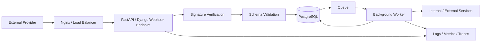
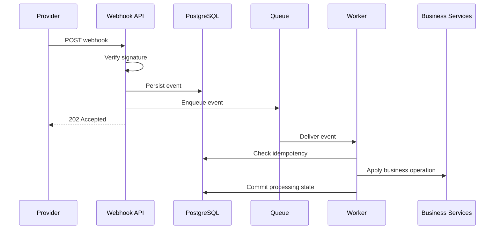

# 23- Webhooks

## Overview

A webhook is an HTTP callback used to deliver an event or notification from one system to another.

Instead of repeatedly asking:

```text
Did the payment complete?
Did the invoice generate?
Did the shipment change?
```

a consumer exposes an HTTP endpoint and the provider sends an HTTP request when something happens:

```text
Payment Provider
      │
      │ POST /webhooks/payment
      ▼
Backend API
      │
      ├── Authenticate request
      ├── Validate payload
      ├── Check replay / idempotency
      ├── Persist event
      └── Enqueue processing
              │
              ▼
           Worker
```

Webhooks are particularly useful for:

- payment providers;
- GitHub-style integrations;
- shipping providers;
- SaaS integrations;
- CI/CD systems;
- identity providers;
- notification platforms;
- internal microservices.

A production webhook endpoint should be treated as an **untrusted, asynchronous, retryable distributed-system boundary**.

The provider may:

- send duplicate events;
- retry after timeouts;
- send events out of order;
- deliver events late;
- change payload schemas;
- send malformed data;
- temporarily stop delivering;
- resend historical events.

Therefore, receiving a webhook successfully is only the first step. Reliable processing requires authentication, validation, persistence, idempotency, asynchronous execution, observability, and recovery procedures.

---

## Webhooks vs Polling

Polling requires the consumer to repeatedly request state:

```text
Consumer → Provider: Has payment changed?
Consumer → Provider: Has payment changed?
Consumer → Provider: Has payment changed?
```

A webhook reverses the communication pattern:

```text
Provider → Consumer: payment.completed
```

| Characteristic | Polling | Webhook |
|---|---|---|
| Communication | Consumer initiates | Provider initiates |
| Latency | Poll interval dependent | Usually near real-time |
| Provider load | Repeated requests | Event-driven |
| Consumer complexity | Polling/scheduling | HTTP endpoint |
| Retry responsibility | Consumer | Usually provider + consumer |
| Duplicate handling | Usually less central | Essential |
| Ordering | Consumer-controlled | Often not guaranteed |
| Availability | Consumer can retry queries | Endpoint must be reachable |

Webhooks reduce unnecessary polling but introduce distributed delivery semantics.

---

## Webhook Architecture

A production webhook architecture commonly looks like:



The critical design principle is:

> The HTTP webhook endpoint should acknowledge delivery quickly and move substantial processing to a background worker.

---

## Webhook Lifecycle

A robust lifecycle is:

```text
Provider
   ↓
HTTPS request
   ↓
Load balancer / Nginx
   ↓
Webhook endpoint
   ↓
Authenticate signature
   ↓
Validate envelope
   ↓
Persist event
   ↓
Enqueue processing
   ↓
Return 2xx
   ↓
Worker processes event
```

This separates:

```text
delivery acceptance
```

from:

```text
business processing
```

That distinction is fundamental to reliable webhook design.

---

## Webhook Endpoint

A FastAPI endpoint might look like:

```python
from fastapi import APIRouter, Header, HTTPException, Request, status

router = APIRouter()


@router.post("/webhooks/payment", status_code=status.HTTP_202_ACCEPTED)
async def payment_webhook(
    request: Request,
    x_signature: str = Header(...),
):
    body = await request.body()

    if not verify_signature(body, x_signature):
        raise HTTPException(
            status_code=status.HTTP_401_UNAUTHORIZED,
            detail="Invalid webhook signature",
        )

    event = parse_webhook(body)

    await persist_and_enqueue(event)

    return {"accepted": True}
```

In production, `persist_and_enqueue()` should have explicit transaction and delivery semantics rather than relying on an informal sequence of operations.

---

## Why Raw Request Bodies Matter

Many webhook providers sign the exact HTTP request body.

Conceptually:

```text
raw bytes
    ↓
HMAC(secret, raw bytes)
    ↓
signature
```

If the application first parses and reserializes JSON:

```text
raw JSON
   ↓
parse
   ↓
Python object
   ↓
serialize differently
```

the resulting bytes may differ.

Therefore, signature verification should generally happen against the original raw body before parsing or normalization.

---

## Signature Verification

A common mechanism is HMAC:

```text
signature = HMAC-SHA256(secret, request_body)
```

The provider sends the resulting signature in a header.

Python example:

```python
import hashlib
import hmac


def verify_signature(
    body: bytes,
    received_signature: str,
    secret: bytes,
) -> bool:
    expected = hmac.new(
        secret,
        body,
        hashlib.sha256,
    ).hexdigest()

    return hmac.compare_digest(
        expected,
        received_signature,
    )
```

`hmac.compare_digest()` is preferred over ordinary string equality for comparing authentication signatures.

The exact algorithm, encoding, and header format must follow the provider's specification.

---

## Signature Verification Is Authentication

Signature verification answers:

> Did this request come from a party possessing the expected signing secret?

It does not necessarily answer:

> Is this event valid for the current business state?

These are separate concerns.

```text
Authentication
    ↓
"Who sent this?"

Validation
    ↓
"Is this payload structurally valid?"

Authorization / business validation
    ↓
"Is this operation allowed and still applicable?"
```

---

## Never Trust Webhook Payloads

Even a validly signed webhook can contain unexpected business state.

Validate:

- event type;
- schema version;
- required fields;
- field types;
- identifiers;
- timestamps;
- payload size;
- supported operations.

Signature verification protects integrity and authenticity; it does not replace application validation.

---

## Schema Validation

Pydantic can validate webhook payloads after authentication:

```python
from pydantic import BaseModel


class PaymentCompleted(BaseModel):
    event_id: str
    event_type: str
    version: int
    payment_id: str
    customer_id: str
    amount_minor: int
    currency: str
```

The application can then validate:

```text
raw body
   ↓
signature verification
   ↓
JSON parsing
   ↓
schema validation
```

Avoid performing database or network I/O inside Pydantic validators.

---

## Envelope vs Event Data

It is useful to distinguish the webhook envelope from business payload.

Example:

```json
{
  "id": "evt_123",
  "type": "payment.completed",
  "version": 1,
  "created_at": "2026-09-06T12:30:00Z",
  "data": {
    "payment_id": "pay_123",
    "amount_minor": 5000
  }
}
```

The envelope provides transport and event metadata.

The `data` object contains business information.

This separation makes schema evolution and observability easier.

---

## Event IDs

Every webhook event should have a stable identifier when the provider supplies one.

Example:

```text
event_id = evt_123
```

Store this identifier.

It is useful for:

- deduplication;
- idempotency;
- debugging;
- support investigations;
- replay;
- audit trails.

If the provider does not provide an event ID, generate an internal identifier, but do not assume it can automatically detect provider-level duplicates unless a stable deduplication key exists.

---

## Duplicate Delivery

Providers commonly retry webhook delivery.

Example:

```text
Provider
   ↓
event_123
   ↓
Consumer
   ↓
processing succeeds
   X
response lost
   ↓
Provider retries
   ↓
event_123 again
```

The consumer may receive the same event more than once.

Therefore:

> Webhook handlers should be idempotent.

---

## Idempotency

A simple pattern is:

```text
event_id
    ↓
processed_events table
    ↓
unique constraint
```

Example:

```sql
CREATE TABLE processed_webhook_events (
    event_id TEXT PRIMARY KEY,
    received_at TIMESTAMPTZ NOT NULL DEFAULT now()
);
```

The database provides durable duplicate detection.

---

## Atomic Idempotency

The strongest pattern is to combine duplicate detection with the business state change in one database transaction.

```text
BEGIN
 ├── Insert event ID
 ├── Apply business state
 └── Commit
 ↓
ACK webhook
```

If the event ID already exists:

```text
duplicate
   ↓
skip business operation
   ↓
ACK
```

This prevents a race where two workers simultaneously determine that an event has not yet been processed.

---

## Why Redis Alone Is Not Always Enough

Redis can implement short-lived deduplication:

```text
SET event_id processed NX EX 3600
```

but the correct choice depends on business requirements.

If the business invariant is durable:

```text
event must never be applied twice
```

a durable database constraint is usually more appropriate.

Redis can still be useful for:

- short replay windows;
- rate limiting;
- hot deduplication;
- distributed coordination.

Do not make an ephemeral cache the sole source of truth for critical financial state.

---

## Webhook Persistence

A robust endpoint can persist the raw event before processing.

Example schema:

```sql
CREATE TABLE webhook_events (
    id UUID PRIMARY KEY,
    provider TEXT NOT NULL,
    external_event_id TEXT NOT NULL,
    event_type TEXT NOT NULL,
    payload JSONB NOT NULL,
    received_at TIMESTAMPTZ NOT NULL,
    processed_at TIMESTAMPTZ,
    status TEXT NOT NULL,
    attempts INTEGER NOT NULL DEFAULT 0,
    last_error TEXT
);

CREATE UNIQUE INDEX webhook_events_provider_event_idx
ON webhook_events (provider, external_event_id);
```

The exact schema should reflect retention, compliance, and payload-size requirements.

---

## Why Persist Before Processing

Consider:

```text
Webhook
   ↓
Parse
   ↓
Process business logic
   ↓
Database
```

If the process crashes during processing, recovery may depend entirely on the provider's retry behavior.

Instead:

```text
Webhook
   ↓
Authenticate
   ↓
Persist durable event
   ↓
Enqueue
   ↓
Respond 2xx
```

Now the system has its own durable copy and can recover independently.

---

## Transactional Outbox for Webhooks

If webhook persistence and internal job creation must be atomic:

```text
BEGIN
 ├── Persist webhook event
 └── Insert outbox/job record
 ↓
COMMIT
 ↓
Publisher
 ↓
Queue
 ↓
Worker
```

This prevents:

```text
event persisted
job missing
```

or:

```text
job published
event not persisted
```

from becoming silent inconsistencies.

---

## Webhook Acknowledgment

The provider generally expects a successful HTTP status to indicate that delivery was accepted.

A good endpoint often performs:

```text
authenticate
validate basic structure
persist
enqueue
respond
```

rather than:

```text
authenticate
perform payment reconciliation
call five APIs
generate PDF
send email
respond
```

The second design increases timeout and retry risk.

---

## Which Status Code?

Typical webhook responses include:

| Status | Typical meaning |
|---|---|
| `2xx` | Event accepted |
| `400` | Invalid request structure |
| `401` | Invalid authentication/signature |
| `403` | Request authenticated but not permitted |
| `404` | Endpoint/resource unavailable |
| `409` | Sometimes used for application-specific conflicts |
| `429` | Rate limited |
| `5xx` | Temporary server-side failure |

Provider retry behavior varies.

Do not assume every non-2xx response has the same retry semantics.

---

## Returning 2xx Too Early

This is dangerous:

```text
receive webhook
 ↓
return 200
 ↓
persist fails
```

The provider believes the event succeeded and may not retry.

If durable acceptance is required, return success only after the event has been durably accepted by your system.

---

## Returning 5xx for Temporary Failure

If the system cannot durably accept the event because of a temporary dependency failure:

```text
Webhook
 ↓
PostgreSQL unavailable
 ↓
cannot persist
 ↓
5xx
```

This may cause the provider to retry.

The exact behavior should follow the provider's documented retry policy.

---

## Asynchronous Processing

Webhook endpoints should generally be thin.

```text
HTTP Handler
    ↓
Security
    ↓
Validation
    ↓
Persistence
    ↓
Queue
    ↓
2xx
```

Worker:

```text
Queue
 ↓
Business logic
 ↓
Database / APIs
 ↓
Retry / DLQ
```

This protects the webhook endpoint from slow downstream operations.

---

## Webhook + Background Jobs

A common architecture is:



This combines webhook delivery reliability with background-job processing.

---

## Retries

There are usually two retry mechanisms:

```text
Provider retries webhook delivery
```

and:

```text
Your worker retries event processing
```

These must be designed together.

Otherwise:

```text
Provider retry
   +
Worker retry
   +
External API retry
```

can multiply traffic dramatically.

---

## Retry Amplification

Suppose:

```text
Provider retries 5 times
Worker retries 5 times
External client retries 3 times
```

One logical failure can result in many downstream attempts.

Define retry ownership clearly.

For example:

```text
Provider
→ retries delivery

Webhook consumer
→ retries internal processing

External client
→ retries transient HTTP failures
```

Each layer should have bounded attempts and deadlines.

---

## Provider Retry Behavior

Providers may retry when:

- connection fails;
- request times out;
- server returns `5xx`;
- endpoint is unavailable.

Some providers retry `4xx` responses, others do not.

Never infer retry semantics from assumptions.

Design against the provider's documented behavior.

---

## Exponential Backoff

If your worker retries a webhook operation:

```text
attempt 1 → immediate
attempt 2 → +5s
attempt 3 → +15s
attempt 4 → +45s
```

Add jitter when many workers may retry simultaneously.

---

## Dead-Letter Queue

After bounded retries:

```text
Webhook Event
    ↓
Worker
    ↓
failure
    ↓
retry
    ↓
retry
    ↓
DLQ
```

A DLQ allows operators to investigate permanent failures without blocking healthy webhook processing.

---

## Webhook Replay

A provider may expose a replay mechanism, or your system may replay persisted webhook events.

Replay is useful when:

- a consumer bug was fixed;
- a downstream service recovered;
- an event was incorrectly classified;
- a new projection needs historical data.

Replay must be safe.

---

## Replay Safety

Before replaying:

- verify idempotency;
- validate schema compatibility;
- understand external side effects;
- rate-limit replay;
- preserve ordering where required;
- prevent duplicate notifications;
- avoid duplicate financial operations.

A replay should not blindly execute every side effect again.

---

## Event Ordering

Webhooks may arrive out of order.

Example:

```text
payment.created
payment.completed
payment.refunded
```

may arrive as:

```text
payment.created
payment.refunded
payment.completed
```

Do not assume network delivery order equals business event order.

---

## Ordering Strategies

Possible strategies include:

- provider sequence numbers;
- event timestamps;
- aggregate versions;
- monotonically increasing versions;
- fetching current resource state;
- partitioning by entity ID.

For example:

```json
{
  "payment_id": "pay_123",
  "version": 7
}
```

A consumer can reject or defer an event if it has already processed a newer version.

---

## Event Timestamps

Timestamps can help diagnose ordering:

```text
occurred_at
received_at
processed_at
```

These represent different concepts.

Do not assume `received_at` represents when the business event actually occurred.

Clock skew and provider delays can also make timestamps imperfect ordering mechanisms.

---

## Current-State Fetch

Sometimes the safest response to a webhook is to retrieve the provider's current resource state.

For example:

```text
payment.updated
    ↓
worker
    ↓
GET /payments/pay_123
    ↓
current authoritative state
```

This can reduce problems caused by:

- out-of-order events;
- partial payloads;
- missed intermediate events.

Trade-off:

- additional network calls;
- dependency on provider availability;
- potential rate limiting.

---

## Webhook Signatures and Timestamps

Some providers sign both:

```text
timestamp + raw body
```

The consumer can reject requests whose timestamp is outside an allowed window.

Conceptually:

```text
current_time - webhook_timestamp
```

must remain below a configured tolerance.

This reduces replay attacks when the same signed payload is captured and resent.

---

## Replay Attack

A valid webhook can still be maliciously replayed if an attacker obtains the signed request.

Example:

```text
valid request
   ↓
captured
   ↓
resent 100 times
```

Mitigate with:

- signed timestamps;
- event IDs;
- idempotency records;
- replay windows;
- provider-specific verification.

Signature validation alone does not necessarily prevent replay.

---

## Constant-Time Signature Comparison

Do not compare signatures with application-level logic that may leak timing information.

Use:

```python
hmac.compare_digest(expected, received)
```

rather than:

```python
expected == received
```

for security-sensitive signature comparisons.

---

## Secret Management

Webhook signing secrets should not be committed to source control.

Use:

- environment configuration;
- AWS Secrets Manager;
- Kubernetes Secrets;
- another managed secret store.

Workers and API processes should receive only the credentials they require.

---

## Secret Rotation

Webhook secrets may need rotation.

A robust system can temporarily support:

```text
current secret
+
previous secret
```

during migration.

After all providers are updated:

```text
remove previous secret
```

The exact rotation process depends on provider capabilities.

---

## Multiple Providers

A backend may consume webhooks from:

```text
Stripe-like payment provider
GitHub
Shipping provider
Identity provider
Internal services
```

Avoid one giant generic handler.

Prefer:

```text
/webhooks/payments
/webhooks/github
/webhooks/shipping
```

or a provider-specific adapter architecture.

---

## Provider Adapter Pattern

A provider adapter can encapsulate:

```text
signature verification
payload parsing
event normalization
provider-specific error handling
```

The application layer can receive a normalized internal event:

```python
@dataclass(frozen=True)
class PaymentEvent:
    event_id: str
    payment_id: str
    event_type: str
    occurred_at: datetime
```

This keeps provider-specific details outside business logic.

---

## Webhook Normalization

External event:

```json
{
  "id": "evt_123",
  "type": "payment_intent.succeeded",
  "data": {
    "object": {
      "id": "pi_123"
    }
  }
}
```

Internal event:

```text
PaymentCompleted(
    event_id="evt_123",
    payment_id="pi_123"
)
```

The internal model should not unnecessarily inherit the provider's entire schema.

---

## Schema Evolution

Webhook payloads can change.

A consumer should tolerate:

- additive fields;
- unknown fields where safe;
- versioned schemas;
- old event formats;
- rolling deployments.

Avoid depending on undocumented provider fields.

---

## Backward Compatibility

During deployment:

```text
Provider
  ↓
old + new events
  ↓
Worker V2
```

The consumer should continue handling events already queued before deployment.

Schema compatibility is especially important because webhook events may be delayed or replayed.

---

## Webhook Endpoint Availability

The endpoint must be reachable from the provider's infrastructure.

Consider:

```text
DNS
 ↓
CDN / WAF
 ↓
Load Balancer
 ↓
Nginx
 ↓
FastAPI / Django
```

Firewall rules must allow the provider's traffic.

If the provider publishes source IP ranges, they can be an additional control, but IP allowlisting should not replace cryptographic signature verification when signatures are available.

---

## Nginx and Webhooks

Nginx can provide:

- TLS termination;
- request-size limits;
- rate limiting;
- connection handling;
- proxying.

Example:

```nginx
location /webhooks/ {
    client_max_body_size 1m;
    proxy_pass http://backend;
}
```

The appropriate limits depend on the provider's payload size and security requirements.

---

## Request Size Limits

Webhook endpoints should enforce reasonable payload limits.

Without limits:

```text
attacker
  ↓
huge HTTP request
  ↓
memory / CPU consumption
```

Use limits at multiple layers where appropriate:

```text
Load balancer
Nginx
ASGI server
application
```

The limits should be consistent with legitimate provider payloads.

---

## Rate Limiting

Webhook endpoints may need rate limiting.

However, blindly applying aggressive rate limits can cause legitimate provider retries to fail.

Prefer provider-aware controls:

```text
expected provider rate
+
burst tolerance
+
authentication
+
request-size limits
```

Rate limits should be designed together with the provider's retry behavior.

---

## IP Allowlisting

If a provider publishes stable source IP ranges, allowlisting can reduce attack surface.

Limitations:

- IP ranges can change;
- infrastructure may use dynamic addresses;
- proxies can obscure source IPs;
- IPs do not authenticate payload contents.

Cryptographic signatures remain the stronger application-level mechanism when supported.

---

## SSRF Considerations

Webhook consumers sometimes use URLs contained in payloads:

```json
{
  "callback_url": "https://example.com/result"
}
```

Do not blindly fetch arbitrary URLs supplied by webhook payloads.

This can create SSRF risks:

```text
attacker-controlled webhook
        ↓
server fetches URL
        ↓
internal service / metadata endpoint
```

Use URL allowlists, network controls, DNS protections, and explicit outbound policies where such functionality is required.

---

## Database Transactions

A webhook worker may perform:

```text
BEGIN
 ↓
mark event processed
 ↓
update payment
 ↓
insert audit record
 ↓
COMMIT
```

Keep the transaction bounded.

Do not hold a PostgreSQL transaction while waiting for an external HTTP request unless there is a compelling transactional reason.

---

## External Side Effects

A common workflow is:

```text
Webhook
 ↓
PostgreSQL
 ↓
External API
```

External APIs cannot generally participate in the same PostgreSQL transaction.

Use:

- durable state;
- idempotency keys;
- explicit workflow states;
- retries;
- reconciliation.

Do not pretend distributed transactions exist when they do not.

---

## Webhook Reconciliation

Webhooks should not always be the only recovery mechanism.

For critical integrations, periodically reconcile:

```text
Provider API
      ↓
compare
      ↓
Local database
```

This can recover from:

- lost webhooks;
- prolonged endpoint downtime;
- provider bugs;
- internal processing failures.

A reconciliation job is particularly valuable for payments and other financial state.

---

## Webhook Delivery vs Reconciliation

| Mechanism | Strength | Limitation |
|---|---|---|
| Webhook | Near-real-time | Delivery can fail |
| Provider API polling | Authoritative state | More requests / latency |
| Reconciliation job | Recovery | Not real-time |
| Local event log | Durable processing history | Depends on initial receipt |

Critical systems often use webhooks for speed and reconciliation for correctness.

---

## Payment Webhook Example

A payment workflow might be:

```text
Payment Provider
      ↓
payment.completed
      ↓
Webhook API
      ↓
Verify signature
      ↓
Persist event
      ↓
202
      ↓
Worker
      ↓
Idempotency check
      ↓
PostgreSQL transaction
      ↓
Mark order paid
      ↓
Emit internal event
```

The worker should not blindly trust:

```text
"payment.completed"
```

It should verify the relevant payment/order state and business invariants.

---

## Webhook + PostgreSQL + Kafka

A larger architecture can be:

```text
Provider
   ↓
Webhook API
   ↓
PostgreSQL
   ↓
Transactional Outbox
   ↓
Kafka
   ↓
Consumer Groups
 ├── Billing
 ├── Notifications
 ├── Analytics
 └── Search
```

This allows one incoming webhook to drive multiple independent downstream workflows.

---

## Webhook + Celery

For task-oriented processing:

```text
Webhook API
    ↓
PostgreSQL
    ↓
Celery / RabbitMQ / Redis
    ↓
Celery Worker
```

Celery is useful when the primary requirement is distributed background task execution.

Kafka is often more appropriate when durable event streaming, retention, multiple consumer groups, and replay are central requirements.

---

## Webhook Delivery to Your Customers

Your system may also **send** webhooks.

For example:

```text
Order Service
     ↓
OrderCreated
     ↓
Webhook Delivery Queue
     ↓
Webhook Worker
     ↓
Customer HTTPS Endpoint
```

This is a different problem from receiving webhooks, but the same reliability principles apply.

---

## Outbound Webhook Delivery

An outbound worker should handle:

- endpoint timeouts;
- retries;
- exponential backoff;
- signing;
- idempotency;
- delivery status;
- response classification;
- rate limits;
- DLQ;
- replay.

Example:

```python
async def deliver_webhook(
    client,
    endpoint: str,
    payload: bytes,
    signature: str,
) -> None:
    response = await client.post(
        endpoint,
        content=payload,
        headers={
            "Content-Type": "application/json",
            "X-Signature": signature,
        },
        timeout=5.0,
    )
    response.raise_for_status()
```

The client should be shared or pooled rather than created for every delivery.

---

## Outbound Webhook Signatures

A typical pattern is:

```text
canonical payload
      ↓
HMAC(secret, payload)
      ↓
X-Signature
```

Customers verify the signature using their copy of the secret.

This prevents recipients from accepting forged requests.

---

## Outbound Webhook Idempotency

A recipient may process an event but return a timeout.

Your worker sees:

```text
timeout
```

but the recipient may have successfully processed the request.

Retrying can therefore produce duplicates.

Send a stable delivery identifier:

```http
Idempotency-Key: delivery_123
```

and document that recipients should make processing idempotent.

---

## Outbound Webhook Retry Classification

Typical classification:

| Response | Typical action |
|---|---|
| `2xx` | Success |
| `408` | Retry |
| `429` | Retry with backoff |
| `500` | Retry |
| `502` | Retry |
| `503` | Retry |
| `504` | Retry |
| `400` | Usually permanent failure |
| `401` | Usually configuration failure |
| `403` | Usually configuration/policy failure |
| `404` | Usually endpoint configuration issue |

Provider/customer-specific contracts can change this behavior.

---

## Webhook Observability

Every webhook should be traceable using:

```text
provider
event_id
event_type
request_id
trace_id
received_at
processed_at
attempt
status
```

Example structured log:

```json
{
  "event": "webhook_received",
  "provider": "payment-provider",
  "event_id": "evt_123",
  "event_type": "payment.completed",
  "status": "accepted"
}
```

Avoid logging secrets or complete sensitive payloads.

---

## Metrics

Useful inbound webhook metrics include:

```text
webhooks_received_total
webhooks_rejected_total
webhooks_authenticated_total
webhooks_duplicate_total
webhooks_processing_failed_total
webhooks_processing_duration_seconds
webhook_queue_age_seconds
webhooks_dead_lettered_total
```

Useful dimensions include:

```text
provider
event_type
endpoint
status
```

Avoid high-cardinality metric labels such as raw event IDs.

---

## Webhook Latency

Measure multiple stages:

```text
provider event time
       ↓
network delivery
       ↓
received
       ↓
queued
       ↓
processing started
       ↓
completed
```

This separates:

- provider delay;
- network delay;
- queue delay;
- processing delay.

---

## Monitoring

Alert on:

- sudden webhook rejection spikes;
- signature verification failures;
- queue age growth;
- processing latency;
- duplicate spikes;
- retry spikes;
- DLQ growth;
- provider-specific error changes;
- sustained delivery gaps;
- database failures.

A provider may stop sending webhooks entirely without producing local HTTP errors, so reconciliation and delivery-gap monitoring can be important.

---

## Auditability

For sensitive operations, retain enough information to answer:

```text
Which event arrived?
When did it arrive?
Was its signature valid?
Which code processed it?
How many attempts occurred?
What business state changed?
Did an external side effect occur?
```

Do not automatically retain unrestricted raw payloads forever.

Retention must consider:

- privacy;
- compliance;
- data minimization;
- storage cost;
- provider contracts.

---

## Privacy and Sensitive Data

Webhook payloads can contain:

- customer information;
- addresses;
- payment metadata;
- identity information;
- internal identifiers.

Avoid putting complete payloads into application logs.

Prefer:

```text
event_id
provider
event_type
resource_id
processing status
```

and store sensitive payloads only where there is a justified operational or audit requirement.

---

## Data Retention

Define retention for:

```text
raw webhook payloads
processed event metadata
failed events
DLQ messages
logs
audit records
```

Long retention improves debugging and replay but increases:

- storage cost;
- privacy exposure;
- compliance obligations.

---

## High Availability

A webhook endpoint should generally run across multiple application instances:

```text
Provider
   ↓
Load Balancer
 ┌───┼───┐
API API API
 └───┼───┘
     ↓
PostgreSQL
     ↓
Queue
```

Avoid storing critical webhook state only in local process memory.

Any API replica should be able to receive any webhook.

---

## Stateless Webhook Handlers

Prefer:

```text
request
 ↓
shared durable state
```

rather than:

```text
request
 ↓
local process memory
```

This allows Kubernetes or AWS infrastructure to scale and replace instances safely.

---

## Availability During Deployments

A webhook endpoint should remain available during rolling deployments.

Use:

- multiple replicas;
- readiness checks;
- graceful shutdown;
- load-balancer draining;
- backward-compatible schemas.

A brief endpoint outage can cause provider retries, which may create a duplicate burst after recovery.

---

## Disaster Recovery

For critical webhook workflows, define:

- event retention;
- database backups;
- queue durability;
- DLQ recovery;
- replay process;
- reconciliation process;
- provider replay capabilities;
- cross-region strategy;
- RPO;
- RTO.

A provider's ability to resend events should be considered a recovery capability, not the sole disaster-recovery plan.

---

## Testing Webhooks

Test at multiple levels.

### Unit Tests

Test:

- signature generation/verification;
- schema validation;
- event normalization;
- retry classification;
- idempotency decisions.

### Integration Tests

Test:

- real PostgreSQL transactions;
- queue publication;
- duplicate delivery;
- worker processing;
- external-client behavior.

### End-to-End Tests

Test:

```text
HTTP webhook
 ↓
authentication
 ↓
database
 ↓
queue
 ↓
worker
 ↓
business state
```

---

## Security Tests

Explicitly test:

- invalid signatures;
- modified payloads;
- missing signatures;
- stale timestamps;
- replayed event IDs;
- oversized payloads;
- malformed JSON;
- unexpected event types;
- unauthorized providers;
- malicious URLs;
- rate-limit behavior.

---

## Failure Injection

Simulate:

```text
database unavailable
queue unavailable
worker crash
provider timeout
duplicate delivery
out-of-order delivery
external API timeout
external API 500
Kubernetes termination
```

The desired behavior should be defined before testing.

---

## Common Mistakes

### Processing the Entire Event Synchronously

Slow business logic makes the provider wait and increases retries.

Persist and enqueue quickly.

### Returning `200` Before Durable Acceptance

The provider stops retrying even though your system has lost the event.

Acknowledge only after durable acceptance.

### Trusting the Payload

A webhook is still external input.

Verify signatures and validate the payload.

### Parsing Before Signature Verification

Some providers sign the exact raw body.

Verify against the original bytes.

### Assuming Exactly Once

Providers can retry and workers can crash.

Design for duplicate delivery.

### Using In-Memory Deduplication

A process restart or second replica loses the state.

Use durable idempotency for critical operations.

### Ignoring Ordering

Events may arrive late or out of order.

Use versions, sequence numbers, or current-state retrieval when necessary.

### Retrying Everything

Permanent validation failures should not be retried indefinitely.

Classify failures.

### No Replay Strategy

Production bugs happen.

Persist enough information to safely recover or replay critical events.

### Logging Entire Payloads

This can leak sensitive information and create expensive logs.

Log metadata and identifiers instead.

---

## Production Pitfalls

### Retry Amplification

Provider retries plus worker retries plus HTTP-client retries can multiply load.

Define bounded retry ownership at each layer.

### Duplicate Financial Effects

A payment or refund operation may be repeated after an ambiguous timeout.

Use provider-supported idempotency keys and durable local state.

### Provider Outage

A provider may deliver a large backlog after recovering.

Ensure the webhook endpoint and worker fleet can handle bursts.

### Worker Backlog

Webhook delivery may be accepted quickly while processing falls behind.

Monitor queue age and processing latency.

### Schema Drift

Provider payloads can evolve independently of your deployment schedule.

Use version-aware parsing and backward-compatible changes.

### Secret Rotation

Changing webhook secrets without coordinating verification can cause widespread `401` responses.

Support controlled rotation.

### Endpoint Downtime

A provider may retry aggressively after downtime, creating a recovery traffic spike.

Capacity-plan for retry storms.

### Duplicate Internal Events

A webhook can be deduplicated correctly while downstream consumers still receive repeated internal events.

Idempotency may be required at multiple boundaries.

---

## Webhook Design Checklist

Before deploying a webhook integration, define:

- provider identity;
- endpoint URL;
- HTTPS configuration;
- signature algorithm;
- secret storage;
- secret rotation;
- raw-body verification;
- timestamp/replay protection;
- schema validation;
- event ID;
- idempotency strategy;
- event persistence;
- transaction boundary;
- queue integration;
- acknowledgment semantics;
- retry behavior;
- DLQ behavior;
- ordering requirements;
- schema versioning;
- payload-size limit;
- rate limiting;
- outbound network policy;
- logging;
- metrics;
- tracing;
- audit requirements;
- retention;
- replay process;
- reconciliation process;
- deployment strategy;
- disaster recovery;
- failure testing.

---

## Recommended Inbound Webhook Flow

A strong default architecture is:

```text
1. Receive HTTPS request
2. Read raw request body
3. Enforce request-size limits
4. Verify provider signature
5. Validate timestamp/replay window if supported
6. Parse and validate event envelope
7. Persist event durably
8. Enqueue processing work
9. Return 2xx
10. Process asynchronously
11. Apply idempotency and business validation
12. Retry transient failures
13. Dead-letter permanent failures
14. Monitor and reconcile
```

The exact order can vary based on infrastructure, but the core principle is to establish durable ownership of the event before acknowledging successful receipt.

---

## Recommended Outbound Webhook Flow

For sending webhooks to customers:

```text
Business Transaction
      ↓
Outbox
      ↓
Webhook Delivery Queue
      ↓
Worker
      ↓
Build canonical payload
      ↓
Sign payload
      ↓
HTTPS POST
      ↓
Classify response
 ┌────┴─────┐
2xx        Retryable
 ↓            ↓
Complete   Backoff
              ↓
           Retry limit
              ↓
             DLQ
```

This avoids coupling business transactions directly to customer endpoint availability.

---

## Inbound vs Outbound Webhooks

| Concern | Inbound | Outbound |
|---|---|---|
| HTTP direction | Provider → You | You → Customer |
| Primary concern | Accept trusted provider events safely | Reliably deliver your events |
| Authentication | Verify provider signature | Sign your payload |
| Duplicate source | Provider retries | Your delivery retries |
| Main failure | Lost/invalid event | Customer unavailable |
| Queue | Usually after receipt | Usually before delivery |
| Idempotency | Critical | Critical |
| DLQ | Failed processing | Failed delivery |
| Replay | Provider replay / local replay | Local delivery replay |
| Reconciliation | Provider API | Delivery status / recipient recovery |

---

## Best Practices

- Treat every webhook as an untrusted external request.
- Use HTTPS and verify provider signatures whenever supported.
- Verify signatures against the exact raw request body when required.
- Use constant-time signature comparison.
- Validate timestamps and replay windows when the provider supports them.
- Persist stable provider event IDs.
- Make webhook processing idempotent.
- Use durable database constraints for critical deduplication.
- Persist events before acknowledging delivery when durable acceptance is required.
- Keep webhook HTTP handlers fast and move substantial work to background workers.
- Use transactional outbox patterns when event persistence and internal job publication must be atomic.
- Use bounded retries with exponential backoff and jitter.
- Distinguish transient failures from permanent failures.
- Use DLQs for repeatedly failing events.
- Do not assume webhook events arrive exactly once or in order.
- Use event versions, sequence numbers, or current-state retrieval when ordering matters.
- Use provider reconciliation for critical integrations.
- Keep business logic independent of provider-specific payload formats.
- Version internal event schemas and maintain backward compatibility during deployments.
- Enforce request-size and rate limits without breaking legitimate provider retries.
- Protect secrets using managed secret storage and controlled rotation.
- Avoid logging complete webhook payloads when they contain sensitive information.
- Propagate job IDs, event IDs, correlation IDs, and trace IDs across asynchronous processing.
- Test duplicate delivery, replay, out-of-order events, dependency failures, worker crashes, and provider outages.
- Design recovery and replay procedures before production deployment.

## Key Takeaways

- **A webhook is a distributed-system boundary, not merely an HTTP endpoint:** authenticate the sender, validate the payload, persist the event, and acknowledge only after durable acceptance when required.
- **Assume duplicate and out-of-order delivery:** stable event IDs, durable idempotency, version checks, and explicit business-state validation prevent repeated or stale events from corrupting state.
- **Keep webhook handlers fast:** persist and enqueue work, return a timely `2xx`, and perform expensive processing in background workers with bounded retries and DLQs.
- **Security extends beyond signatures:** protect raw payloads, secrets, replay windows, request sizes, outbound URL handling, rate limits, and sensitive data throughout the webhook lifecycle.
- **Reliability requires recovery mechanisms:** combine durable event storage, replay procedures, reconciliation jobs, observability, and failure testing so the system can recover from provider outages, deployments, and internal failures.