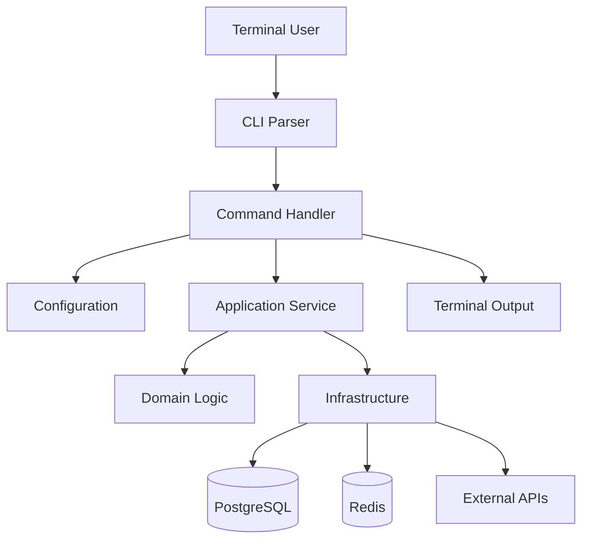

# 24- CLI Applications

## Overview

A command-line interface (CLI) application is a program designed to be executed from a terminal and controlled through commands, arguments, options, environment variables, configuration files, and standard input/output.

Python CLIs are useful for:

- operational administration;
- database and migration tooling;
- data imports and exports;
- maintenance jobs;
- developer tooling;
- deployment utilities;
- local development workflows;
- debugging and diagnostics;
- batch processing;
- internal platform tooling;
- automation executed by CI/CD or schedulers.

A production CLI should be treated as an application boundary rather than a collection of `print()` statements around business logic.

A good architecture separates:

```text
CLI parsing
    ↓
Command orchestration
    ↓
Application/domain logic
    ↓
Infrastructure
```

This makes the same business functionality reusable from:

- REST APIs;
- background workers;
- scheduled jobs;
- CLI commands;
- tests.

---

## CLI Architecture

A maintainable CLI typically follows:



The CLI layer should primarily translate terminal input into application-level commands.

Avoid putting business rules directly inside argument parsing code.

---

## CLI vs Script

A script is often a small executable program:

```python
print("running migration")
```

A CLI usually provides a stable user-facing interface:

```bash
python -m myapp migrate --environment production
```

or:

```bash
myapp migrate --environment production
```

The distinction is architectural rather than absolute.

A small script can evolve into a CLI as requirements grow.

---

## CLI Components

A production CLI commonly has:

| Component | Responsibility |
|---|---|
| Parser | Parse commands and arguments |
| Command | Orchestrate a user operation |
| Configuration | Resolve environment/configuration |
| Application service | Execute business workflow |
| Infrastructure | Database/API/filesystem integration |
| Output layer | Human-readable or machine-readable output |
| Exit handling | Communicate success/failure |
| Logging | Operational diagnostics |
| Telemetry | Metrics/tracing where appropriate |

---

## Standard Library `argparse`

Python includes `argparse` for CLI argument parsing.

Example:

```python
import argparse


def main() -> int:
    parser = argparse.ArgumentParser(
        description="Manage backend application data."
    )

    parser.add_argument(
        "--environment",
        default="development",
        choices=("development", "staging", "production"),
    )

    args = parser.parse_args()

    print(f"Running against {args.environment}")
    return 0


if __name__ == "__main__":
    raise SystemExit(main())
```

`argparse` is appropriate when:

- dependencies should be minimized;
- the CLI is relatively small;
- standard-library functionality is sufficient;
- you need direct control over parsing behavior.

---

## Why `main()` Should Return an Exit Code

Prefer:

```python
def main() -> int:
    ...
    return 0


if __name__ == "__main__":
    raise SystemExit(main())
```

rather than:

```python
def main():
    ...
    exit()
```

Returning an integer makes the command easier to test and clearly separates:

```text
application result
```

from:

```text
process termination
```

---

## Exit Codes

Operating systems and automation tools use process exit codes.

A common convention is:

| Code | Meaning |
|---:|---|
| `0` | Success |
| `1` | Generic failure |
| `2` | Command-line usage error |
| Other non-zero | Application-specific failure |

Avoid inventing many undocumented exit codes.

For automation, stable exit semantics are part of the CLI contract.

---

## CLI Request Lifecycle

A command execution can be modeled as:

```text
Shell
 ↓
Executable
 ↓
Python interpreter
 ↓
Argument parser
 ↓
Configuration resolution
 ↓
Command handler
 ↓
Application service
 ↓
Infrastructure
 ↓
Result
 ↓
stdout / stderr
 ↓
Exit code
```

This is analogous to an HTTP request lifecycle.

The CLI boundary should remain thin just as an HTTP controller should remain thin.

---

## `sys.argv`

At the lowest level, Python exposes command-line arguments through `sys.argv`.

```python
import sys

print(sys.argv)
```

For:

```bash
python app.py migrate --dry-run
```

the list contains values similar to:

```text
[
    "app.py",
    "migrate",
    "--dry-run",
]
```

Directly parsing `sys.argv` is reasonable for extremely small utilities but becomes difficult to maintain as the interface grows.

Prefer `argparse` or a dedicated CLI framework for non-trivial applications.

---

## Commands and Subcommands

Production CLIs commonly group related operations:

```bash
myapp users create
myapp users disable
myapp users list

myapp database migrate
myapp database rollback

myapp cache clear
myapp cache warm
```

This creates a predictable command hierarchy.

Conceptually:

```text
myapp
├── users
│   ├── create
│   ├── disable
│   └── list
├── database
│   ├── migrate
│   └── rollback
└── cache
    ├── clear
    └── warm
```

---

## Argument Types

Arguments should be validated as close to the CLI boundary as practical.

Example:

```python
parser.add_argument(
    "--workers",
    type=int,
    default=4,
)

parser.add_argument(
    "--timeout",
    type=float,
    default=10.0,
)
```

The parser can reject invalid values before application logic runs.

This is preferable to accepting arbitrary strings and converting them deep inside the application.

---

## Positional Arguments

Use positional arguments when the command has an obvious primary resource.

```bash
myapp users get 123
```

Example:

```python
parser.add_argument("user_id", type=int)
```

Named options are usually clearer for optional configuration:

```bash
myapp users get 123 --format json
```

---

## Flags

Boolean behavior can be represented with flags:

```bash
myapp migrate --dry-run
```

Example:

```python
parser.add_argument(
    "--dry-run",
    action="store_true",
)
```

Avoid confusing inverted flags such as:

```bash
--no-not-validate
```

Prefer explicit semantics.

---

## Defaults

Defaults should be safe.

For example:

```python
parser.add_argument(
    "--format",
    choices=("table", "json"),
    default="table",
)
```

Dangerous defaults should require explicit confirmation.

Production operations such as deleting data should not silently default to destructive behavior.

---

## Environment Variables

CLIs often combine command-line arguments with environment configuration:

```bash
DATABASE_URL=postgresql://... myapp database migrate
```

Use environment variables for deployment-specific configuration and secrets.

Do not put secrets directly into shell history when avoidable:

```bash
myapp --password=super-secret
```

Command-line arguments can be visible through process inspection and shell history.

---

## Configuration Precedence

A common precedence model is:

```text
CLI arguments
      ↓
environment variables
      ↓
configuration file
      ↓
safe application defaults
```

Explicit configuration should generally override implicit defaults.

Document the precedence rules because operators depend on predictable behavior.

---

## Configuration Example

A CLI can use the same typed configuration layer as the web application:

```python
from pydantic_settings import BaseSettings


class Settings(BaseSettings):
    database_url: str
    environment: str = "development"
```

The CLI should not create a second, incompatible configuration system unless there is a strong reason.

---

## CLI and Application Services

Prefer:

```text
CLI
 ↓
Application service
 ↓
Repository
 ↓
Database
```

over:

```text
CLI
 ↓
SQL queries
 ↓
business rules
 ↓
API calls
```

For example:

```python
class UserService:
    def __init__(self, repository):
        self.repository = repository

    def disable_user(self, user_id: int) -> None:
        user = self.repository.get(user_id)

        if user is None:
            raise ValueError("User does not exist")

        user.disable()
        self.repository.save(user)
```

The CLI can invoke the service:

```python
def disable_user_command(service: UserService, user_id: int) -> int:
    service.disable_user(user_id)
    print(f"User {user_id} disabled")
    return 0
```

The same service can be called by an API or background job.

---

## Dependency Injection

Avoid hard-coding infrastructure dependencies inside commands.

Prefer:

```python
def run_command(service: UserService, user_id: int) -> int:
    service.disable_user(user_id)
    return 0
```

The composition root can construct:

```text
configuration
    ↓
database engine
    ↓
repository
    ↓
service
    ↓
CLI command
```

This improves:

- testing;
- maintainability;
- reuse;
- environment configuration.

---

## CLI Composition Root

A production CLI often has one composition function:

```python
def build_application(settings: Settings) -> UserService:
    repository = PostgresUserRepository(settings.database_url)
    return UserService(repository)
```

Then:

```python
def main() -> int:
    settings = Settings()
    service = build_application(settings)

    args = parse_args()
    return run_command(service, args)
```

This keeps object construction separate from command behavior.

---

## Output Streams

Unix-style CLIs distinguish:

```text
stdout → normal command output
stderr → errors and diagnostics
```

Example:

```python
import sys

print("Migration failed", file=sys.stderr)
```

This matters for automation:

```bash
myapp export > output.json
```

The command's data should remain in `stdout`, while diagnostics can go to `stderr`.

---

## Machine-Readable Output

Operational CLIs should often support:

```bash
myapp users list --format json
```

Example:

```json
[
  {
    "id": 123,
    "status": "active"
  }
]
```

This makes CLI commands composable with:

```bash
jq
grep
awk
xargs
CI/CD scripts
```

Avoid forcing automation users to parse human-readable tables.

---

## Human vs Machine Output

A useful interface supports:

| Output | Intended consumer |
|---|---|
| Table | Human operator |
| JSON | Automation |
| CSV | Data export |
| Plain text | Simple scripting |
| Error on stderr | Operator/automation diagnostics |

Do not make the default human output the only supported representation when the CLI is expected to be automated.

---

## Logging vs Output

Do not treat logging and command output as the same thing.

Use:

```text
stdout
→ command result

stderr
→ user-facing warnings/errors

logs
→ operational diagnostics
```

For example:

```python
logger.info(
    "migration_completed",
    extra={"migration_count": 12},
)

print("12 migrations applied")
```

The log is for operators and observability systems; the output is part of the CLI interface.

---

## Logging Configuration

CLI tools should avoid unexpectedly configuring the application's global logging system multiple times.

A simple entry point can configure logging once:

```python
import logging


def configure_logging(verbose: bool) -> None:
    level = logging.DEBUG if verbose else logging.INFO

    logging.basicConfig(
        level=level,
        format="%(asctime)s %(levelname)s %(name)s %(message)s",
    )
```

For structured production tooling, JSON logging may be preferable when CLI output is consumed by centralized systems.

---

## Verbose and Quiet Modes

Common options include:

```bash
myapp migrate --verbose
myapp migrate --quiet
```

Be deliberate about semantics.

For example:

```text
normal → important progress
verbose → diagnostics
quiet → errors only
```

Do not make `--verbose` dump secrets or sensitive payloads.

---

## Progress Reporting

Long-running commands may expose progress:

```text
Processing users...
Processed 10,000 / 50,000
```

Avoid printing unbounded output for every record.

Large commands should use:

- periodic progress;
- counters;
- progress bars where appropriate;
- structured logs.

---

## Interactive Prompts

Interactive confirmation can protect destructive operations:

```text
This will delete 125,430 records.
Continue? [y/N]
```

However, interactive prompts break automation.

Support a non-interactive option:

```bash
myapp purge --yes
```

or:

```bash
myapp purge --non-interactive
```

Use explicit semantics and avoid making destructive operations automatically assume confirmation.

---

## TTY Detection

A CLI can determine whether it is connected to a terminal:

```python
import sys

if sys.stdin.isatty():
    ...
```

This is useful for deciding whether to:

- show progress;
- prompt for confirmation;
- emit terminal formatting.

Do not rely solely on TTY detection for safety-critical decisions.

---

## Color and Terminal Formatting

Terminal colors improve human readability but can corrupt machine-readable output.

A robust CLI should:

- disable color when output is redirected;
- provide `--no-color`;
- avoid ANSI sequences in JSON output;
- respect common terminal conventions.

---

## Interactive vs Non-Interactive Mode

| Mode | Characteristics |
|---|---|
| Interactive | Prompts, progress, human-friendly output |
| Non-interactive | Deterministic, scriptable, no prompts |
| CI | Non-interactive, stable exit codes |
| Automation | Machine-readable output, bounded execution |

Production CLIs should support non-interactive execution where operational automation is expected.

---

## Timeouts

External operations should have explicit timeouts.

A CLI that calls an HTTP API should not potentially wait forever:

```python
async with httpx.AsyncClient(timeout=10.0) as client:
    response = await client.get(url)
```

For database operations, configure appropriate connection and statement timeouts.

A command's overall deadline should account for all downstream operations.

---

## Retries

Retries are appropriate for transient failures:

```text
connection reset
temporary 503
rate limit
```

They are generally not appropriate for:

```text
invalid arguments
authentication failure
missing required resource
permission denied
```

Use bounded retries with exponential backoff and jitter.

---

## Idempotent Commands

Operational commands should ideally be safe to retry.

For example:

```bash
myapp users disable 123
```

is easier to automate if running it twice produces the same final state.

Be cautious with commands that create resources:

```bash
myapp user create
```

Use explicit identifiers or idempotency mechanisms when duplicate creation would be harmful.

---

## Dry Run

Destructive or large-scale commands should often support:

```bash
myapp cleanup --dry-run
```

A dry run should execute enough of the workflow to provide useful impact information without performing the final mutation.

Avoid implementing a fake dry run that skips all meaningful validation.

---

## Confirmation and Safety

For high-risk commands:

```text
delete
purge
rotate credentials
rollback
disable account
```

consider requiring:

- explicit target;
- environment selection;
- confirmation;
- `--dry-run`;
- `--yes` for automation;
- safeguards against production misuse.

A particularly dangerous pattern is:

```bash
myapp purge
```

implicitly targeting production.

Prefer explicit environments:

```bash
myapp purge --environment production
```

---

## Environment Safety

The CLI should make environment context visible:

```text
Environment: production
Database: primary
Records affected: 125,430

Continue? [y/N]
```

This reduces operational mistakes.

Never print complete credentials or connection strings merely to identify the target.

---

## Database Commands

CLIs are frequently used for:

- migrations;
- backfills;
- data exports;
- reconciliation;
- maintenance;
- repair operations.

For large datasets, process records incrementally.

Avoid:

```python
users = session.query(User).all()
```

when millions of rows may exist.

Prefer pagination, server-side cursors, streaming, or bounded batches.

---

## Batch Processing

A production data-processing CLI should bound memory:

```python
def process_users(repository, batch_size: int = 1000) -> None:
    while True:
        users = repository.fetch_batch(limit=batch_size)

        if not users:
            break

        for user in users:
            process_user(user)
```

The appropriate batch size depends on:

- row size;
- database capacity;
- processing cost;
- transaction duration;
- memory;
- downstream rate limits.

---

## Transactions in CLI Applications

A batch command should explicitly define transaction boundaries.

Possible strategies:

```text
one transaction for entire command
```

or:

```text
one transaction per batch
```

For large operations, one transaction can create:

- long-running transactions;
- large rollback cost;
- lock contention;
- MVCC bloat;
- excessive transaction log usage.

Batch-level transactions often provide a better operational balance.

---

## CLI and PostgreSQL

A production CLI should reuse the application's database layer where possible.

Consider:

- connection pooling;
- transaction scope;
- statement timeouts;
- lock behavior;
- migrations;
- graceful connection cleanup.

Do not create a new database connection for every processed row.

---

## CLI and Redis

Redis-backed commands may be useful for:

```text
cache warming
cache invalidation
queue inspection
operational diagnostics
```

Avoid destructive cache operations without explicit environment and scope controls.

For example:

```bash
myapp cache clear --namespace user-profile
```

is safer than:

```bash
myapp cache clear
```

when multiple applications share infrastructure.

---

## CLI and Kafka

Kafka-oriented operational CLIs may perform:

- topic inspection;
- consumer lag reporting;
- replay;
- administrative operations;
- data repair.

Replay commands require particular caution.

A replay can reproduce side effects if consumers are not idempotent.

Prefer explicit offsets, partitions, ranges, and dry-run capabilities.

---

## CLI and Celery

A CLI can trigger or inspect background jobs:

```bash
myapp jobs enqueue-reconciliation
myapp jobs status 123
myapp jobs retry 123
```

The CLI should normally enqueue work rather than execute a long-running task synchronously.

For operational recovery, preserve the same idempotency and retry semantics used by normal workers.

---

## Asyncio in CLIs

A CLI can use asynchronous APIs when its workload is I/O-heavy.

Example:

```python
import asyncio


async def run() -> int:
    results = await fetch_data()
    await write_results(results)
    return 0


def main() -> int:
    return asyncio.run(run())


if __name__ == "__main__":
    raise SystemExit(main())
```

Do not introduce asyncio merely because the CLI is written in modern Python.

For CPU-heavy work, multiprocessing or optimized libraries may be more appropriate.

---

## Concurrency in CLI Tools

Concurrent CLI operations can improve throughput for independent I/O.

For example:

```text
CLI
 ↓
100 API requests
```

should not necessarily become:

```text
100 simultaneous requests
```

Use bounded concurrency.

```python
import asyncio


async def bounded_worker(items, worker, limit: int = 20):
    semaphore = asyncio.Semaphore(limit)

    async def run(item):
        async with semaphore:
            return await worker(item)

    return await asyncio.gather(
        *(run(item) for item in items)
    )
```

The concurrency limit should respect downstream capacity.

---

## CLI Concurrency and Rate Limits

If an external API allows:

```text
100 requests/second
```

a CLI should not blindly launch thousands of concurrent requests.

Control:

- concurrency;
- request rate;
- retries;
- backoff;
- batch size;
- total workload.

Otherwise, the CLI can become a denial-of-service mechanism against your own dependencies.

---

## Signal Handling

Long-running CLIs should handle termination signals.

Typical signals include:

```text
SIGINT  → Ctrl+C
SIGTERM → process termination
```

A command should:

- stop accepting new work;
- finish or safely interrupt current work;
- commit/rollback appropriately;
- close connections;
- flush output;
- exit with an appropriate status.

This becomes particularly important in Docker and Kubernetes.

---

## Graceful Shutdown

In Kubernetes:

```text
SIGTERM
  ↓
CLI receives signal
  ↓
stop scheduling new work
  ↓
finish safe operation
  ↓
close resources
  ↓
exit
```

Do not assume a process will always have unlimited time to shut down.

Respect the platform's termination grace period.

---

## Resource Cleanup

Use context managers for resources:

```python
with open(path, "rb") as file:
    process(file)
```

For database or HTTP clients, use their lifecycle APIs.

A CLI that exits quickly may hide resource leaks locally, but long-running operational commands can accumulate:

- file descriptors;
- database connections;
- sockets;
- memory;
- temporary files.

---

## Temporary Files

Use secure temporary-file APIs:

```python
from tempfile import TemporaryDirectory


with TemporaryDirectory() as directory:
    run_export(directory)
```

Avoid predictable temporary paths such as:

```text
/tmp/export.json
```

when concurrent users or untrusted processes may access the same machine.

---

## Filesystem Safety

Validate paths and avoid destructive operations based on unchecked user input.

Dangerous:

```python
shutil.rmtree(user_supplied_path)
```

without verifying the resolved target.

For destructive filesystem operations:

- resolve paths;
- validate allowed directories;
- require explicit scope;
- avoid following unexpected symlinks where relevant.

---

## Packaging a CLI

A CLI should ideally be installed as an executable command.

With `pyproject.toml`:

```toml
[project.scripts]
myapp = "myapp.cli:main"
```

After installation:

```bash
myapp --help
```

The package manager creates the appropriate executable entry point.

This is preferable to requiring operators to know internal Python module paths.

---

## Module Entry Point

A CLI can also be invoked using:

```bash
python -m myapp.cli
```

with:

```python
if __name__ == "__main__":
    raise SystemExit(main())
```

This is useful for development and debugging.

Installed console scripts provide a cleaner user-facing interface.

---

## Recommended Project Structure

A backend project might use:

```text
src/
└── myapp/
    ├── __init__.py
    ├── cli/
    │   ├── __init__.py
    │   ├── main.py
    │   ├── users.py
    │   ├── database.py
    │   └── jobs.py
    ├── application/
    │   ├── services/
    │   └── commands/
    ├── domain/
    ├── infrastructure/
    │   ├── database/
    │   ├── http/
    │   └── messaging/
    └── config.py

tests/
└── cli/
    ├── test_users.py
    ├── test_database.py
    └── test_jobs.py
```

The CLI should depend inward on application services rather than containing the core business implementation.

---

## CLI Frameworks

Several approaches are common in Python.

| Tool | Strengths | Typical use |
|---|---|---|
| `argparse` | Standard library, explicit | Small/medium CLIs |
| Click | Composable command interfaces | Application CLIs |
| Typer | Type-hint-driven interface | Modern Python CLIs |
| Django management commands | Django integration | Django administration |
| Custom parser | Full control | Specialized tooling |

A framework is not automatically better.

Choose based on:

- command complexity;
- dependency policy;
- team familiarity;
- typing requirements;
- testing needs;
- framework ecosystem.

---

## Typer Example

A typed CLI can be concise:

```python
import typer

app = typer.Typer()


@app.command()
def migrate(
    environment: str = typer.Option(
        "development",
        "--environment",
    ),
    dry_run: bool = typer.Option(
        False,
        "--dry-run",
    ),
) -> None:
    typer.echo(
        f"Environment={environment}, dry_run={dry_run}"
    )


if __name__ == "__main__":
    app()
```

Typer builds on Click and integrates naturally with Python type annotations.

For a large existing project, consistency with the project's established CLI stack is often more valuable than switching frameworks.

---

## Django Management Commands

Django provides a native CLI mechanism:

```bash
python manage.py migrate
python manage.py createsuperuser
python manage.py shell
```

Custom commands live under an application:

```text
myapp/
└── management/
    └── commands/
        └── reconcile_orders.py
```

Example:

```python
from django.core.management.base import BaseCommand


class Command(BaseCommand):
    help = "Reconcile order state with the payment provider"

    def add_arguments(self, parser):
        parser.add_argument(
            "--batch-size",
            type=int,
            default=1000,
        )

    def handle(self, *args, **options):
        batch_size = options["batch_size"]
        self.stdout.write(
            f"Reconciling with batch size {batch_size}"
        )
```

Django management commands are appropriate when the CLI is tightly coupled to Django's application lifecycle and ORM.

---

## FastAPI and CLI Applications

FastAPI does not require the CLI to duplicate API business logic.

A shared service can be used by both:

```text
FastAPI endpoint ─┐
                  ├── Application service
CLI command ──────┘
```

This avoids:

```text
API implementation
+
CLI implementation
```

containing duplicated business rules.

---

## REST API vs CLI

A CLI can be a client of the same REST API exposed by the backend.

```text
CLI
 ↓ HTTPS
API Gateway / Nginx
 ↓
FastAPI
 ↓
Application
```

This is useful when:

- the API is the authoritative business interface;
- CLI users should follow the same authorization rules;
- direct database access is undesirable.

A direct database CLI may be appropriate for trusted internal administration, but it creates a more privileged operational boundary.

---

## CLI Authentication

A CLI that calls remote APIs should avoid requiring users to paste long-lived secrets into commands.

Prefer:

- short-lived access tokens;
- device authorization flows;
- OAuth/OIDC;
- credential helpers;
- secure local credential stores;
- environment variables for automation.

Avoid:

```bash
myapp --api-key=long-lived-secret
```

because command-line arguments can be exposed through shell history or process inspection.

---

## CLI Authorization

Authentication identifies the operator.

Authorization determines what they can do.

For administrative CLIs:

```text
operator identity
      ↓
authentication
      ↓
authorization
      ↓
command
```

High-risk commands should enforce authorization server-side when they invoke remote APIs.

Do not rely solely on hiding a command from `--help`.

---

## Local Privilege

A CLI that directly connects to PostgreSQL may bypass API authorization.

Therefore, database credentials used by administrative tools should be:

- least privilege;
- environment-specific;
- short-lived where possible;
- audited;
- protected from accidental exposure.

Do not give every developer production database write access merely because a CLI needs operational functionality.

---

## CLI Security

Consider:

- command-line secret exposure;
- environment variable leakage;
- shell history;
- insecure temporary files;
- path traversal;
- unsafe deserialization;
- untrusted input;
- destructive commands;
- excessive database privileges;
- API authorization;
- dependency supply chain.

Never deserialize untrusted input with `pickle`.

---

## CLI and Secrets

If a command needs a secret interactively, prefer secure input mechanisms.

For example:

```python
from getpass import getpass

token = getpass("API token: ")
```

The token is not echoed to the terminal.

For automated deployments, use a secret manager or CI/CD secret mechanism instead.

---

## CLI and CI/CD

CLIs are commonly executed by:

- GitHub Actions;
- GitLab CI;
- Jenkins;
- AWS CodeBuild;
- deployment pipelines;
- Kubernetes Jobs.

CI-compatible commands should:

- avoid interactive prompts;
- return deterministic exit codes;
- write useful diagnostics to stderr;
- support machine-readable output;
- respect environment configuration;
- have explicit timeouts;
- fail fast on invalid configuration.

Example:

```bash
myapp database migrate --environment production
```

---

## CLI in Docker

A Docker image can expose the CLI as its entry point:

```dockerfile
ENTRYPOINT ["myapp"]
```

Then:

```bash
docker run --rm myapp database migrate
```

Alternatively:

```dockerfile
ENTRYPOINT ["python", "-m", "myapp.cli"]
```

The installed console script is generally cleaner when packaging is already configured.

---

## CLI in Kubernetes

Operational commands can run as Kubernetes Jobs:

```yaml
apiVersion: batch/v1
kind: Job
metadata:
  name: reconcile-orders
spec:
  template:
    spec:
      restartPolicy: Never
      containers:
        - name: cli
          image: example/myapp:2026.09.06
          command:
            - myapp
            - orders
            - reconcile
            - --environment
            - production
```

This provides:

- isolated execution;
- resource limits;
- retry policy;
- service-account identity;
- centralized logs.

Avoid running long administrative operations manually inside application pods when a controlled Job is more appropriate.

---

## AWS Usage

Python CLIs can be used with:

- AWS CLI integrations;
- ECS tasks;
- AWS Batch;
- Lambda deployment tooling;
- CodeBuild;
- EventBridge-triggered jobs.

For AWS workloads, prefer IAM roles and workload identity over embedding AWS access keys in CLI configuration.

---

## Performance Considerations

CLI performance can be dominated by:

- startup/import time;
- database access;
- network latency;
- serialization;
- Python object allocation;
- batch size;
- concurrency.

For short-lived commands, Python startup and imports can become significant.

Avoid importing an enormous application stack when a lightweight command does not need it.

---

## Startup Time

Measure startup time when CLIs are invoked frequently.

Useful tooling includes:

```bash
python -X importtime -m myapp.cli --help
```

Heavy imports can make:

```bash
myapp --help
```

unexpectedly slow.

Lazy imports can sometimes improve startup time, but should not be used indiscriminately because they can complicate dependency behavior and error reporting.

---

## Memory Usage

A CLI processing large data should avoid:

```python
records = list(fetch_all_records())
```

when the dataset is large.

Prefer:

```text
stream
 ↓
bounded batch
 ↓
process
 ↓
release
 ↓
next batch
```

This keeps memory approximately bounded by batch size rather than total dataset size.

---

## CLI Observability

For operational commands, capture:

```text
command
operator/service identity
environment
duration
exit code
records processed
records failed
retry count
```

Do not log sensitive arguments.

For example:

```text
command=orders.reconcile
environment=production
processed=12000
failed=3
duration=184.2s
exit_code=1
```

---

## Correlation IDs

When a CLI calls remote services, propagate a correlation identifier:

```text
CLI
 ↓ request_id=cli-abc123
API
 ↓
worker
 ↓
database / downstream service
```

This allows operators to trace one command execution across distributed systems.

---

## Audit Logging

Administrative commands that change production state should produce durable audit records.

Useful fields include:

```text
actor
command
target
environment
timestamp
result
request_id
```

Do not store secrets or unnecessary sensitive command arguments.

Audit records should be separated from ordinary diagnostic logs when stronger retention or integrity guarantees are required.

---

## Long-Running CLI Jobs

A CLI may run for hours.

At that point, consider whether it should become a background job instead.

A long-running CLI can be fragile because:

- terminals disconnect;
- laptops sleep;
- SSH sessions terminate;
- credentials expire;
- network connections become stale;
- deployments interrupt execution.

For durable production workflows, prefer:

```text
CLI
 ↓
submit job
 ↓
queue
 ↓
worker
```

The CLI can then provide:

```bash
myapp jobs status <job-id>
```

---

## CLI vs Background Job

| Requirement | CLI | Background Job |
|---|---|---|
| Short operation | Excellent | Possible |
| Interactive administration | Excellent | Poor |
| CI/CD command | Excellent | Possible |
| Hours-long processing | Fragile | Better |
| Automatic retries | Manual | Built-in pattern |
| Durable state | Manual | Usually persisted |
| Worker scaling | No | Yes |
| Terminal dependency | Often | No |
| Operational replay | Manual | Better suited |

A CLI can be the control plane for a background job without being the execution engine.

---

## Error Handling

Avoid exposing Python tracebacks as the normal user experience.

Handle expected failures:

```python
def main() -> int:
    try:
        run_command()
    except ConfigurationError as exc:
        print(f"Configuration error: {exc}", file=sys.stderr)
        return 2
    except ExternalServiceError as exc:
        print(f"External service failed: {exc}", file=sys.stderr)
        return 1

    return 0
```

Unexpected exceptions should still be observable through logs or crash reporting.

Do not silently catch:

```python
except Exception:
    return 1
```

without preserving diagnostic information.

---

## Exception Boundaries

A useful architecture is:

```text
Domain exception
      ↓
Application service
      ↓
CLI exception mapping
      ↓
stderr + exit code
```

The domain layer should not need to know that the caller is a CLI.

This keeps transport-specific behavior at the boundary.

---

## Retryable vs Fatal Errors

Classify errors explicitly.

| Error | Retry? |
|---|---|
| Invalid CLI argument | No |
| Missing configuration | No |
| Authentication failure | Usually no |
| Permission denied | Usually no |
| HTTP `429` | Usually yes |
| HTTP `503` | Usually yes |
| Database connection failure | Often yes |
| Constraint violation | Usually no |
| Programmer bug | No |

Retry policy should be bounded and observable.

---

## Testing CLI Applications

Test the CLI at several layers.

### Parser Tests

Verify:

- required arguments;
- defaults;
- choices;
- invalid values;
- help output.

### Command Tests

Verify:

- application service invocation;
- error mapping;
- exit codes;
- output behavior.

### Integration Tests

Verify:

- PostgreSQL;
- Redis;
- HTTP APIs;
- filesystem;
- queue integration.

### End-to-End Tests

Run the actual executable:

```bash
myapp users list --format json
```

and validate:

- exit code;
- stdout;
- stderr;
- side effects.

---

## Testing `main()`

Returning an exit code makes testing straightforward:

```python
def test_main_success():
    assert main() == 0
```

For CLI frameworks, use the framework's test runner where available.

Avoid testing only internal functions while never testing the actual command interface.

---

## Subprocess Testing

For high-confidence CLI tests:

```python
import subprocess
import sys


def test_help():
    result = subprocess.run(
        [sys.executable, "-m", "myapp.cli", "--help"],
        capture_output=True,
        text=True,
        check=False,
    )

    assert result.returncode == 0
    assert "usage" in result.stdout.lower()
```

Subprocess tests verify packaging, imports, argument parsing, and process-level behavior together.

---

## Deterministic Output

Avoid unstable output such as:

```text
Processed at 2026-09-06 14:23:18.193847
```

when exact output is asserted in tests.

Prefer structured or controlled output.

For machine-readable formats, deterministic JSON serialization can make tests and automation easier.

---

## Mocking

Mock external boundaries:

```text
CLI
 ↓
Application service
 ↓
Mock repository/API
```

Do not mock every internal function.

The purpose is to verify command behavior without turning tests into implementation-detail tests.

---

## CLI Contract Testing

Once operators and CI pipelines depend on a CLI, changing its interface is a compatibility event.

Treat these as public contracts:

- command names;
- option names;
- required arguments;
- exit codes;
- output formats;
- error semantics.

Deprecate interfaces rather than silently breaking them.

---

## Versioning CLI Interfaces

For internal tools, a command such as:

```bash
myapp --version
```

helps identify which behavior is running.

For widely distributed CLIs, semantic versioning and documented breaking changes may be appropriate.

Do not assume CLI users can upgrade all scripts simultaneously.

---

## Documentation

A production CLI should provide:

```bash
myapp --help
myapp database --help
myapp database migrate --help
```

Help should clearly explain:

- purpose;
- required arguments;
- options;
- defaults;
- examples;
- destructive behavior;
- environment considerations.

---

## Shell Completion

Large CLIs can provide shell completion for:

```text
bash
zsh
fish
PowerShell
```

Completion improves usability but should not become a substitute for good command naming and help output.

---

## CLI Design Principles

Prefer:

```bash
myapp users disable 123
```

over:

```bash
myapp --action disable --resource user --id 123
```

The first expresses the command hierarchy directly.

Good CLIs have:

- predictable naming;
- consistent options;
- stable output;
- explicit destructive operations;
- composable commands;
- useful errors;
- machine-readable output.

---

## Command Naming

Use consistent verbs:

```text
create
get
list
update
delete
enable
disable
migrate
rollback
export
import
reconcile
retry
```

Avoid inconsistent synonyms:

```text
remove
delete
destroy
erase
purge
```

unless they intentionally represent different levels of behavior.

---

## Production Example

A production reconciliation command might look like:

```bash
myapp payments reconcile \
    --environment production \
    --since 2026-09-01 \
    --batch-size 500 \
    --concurrency 10 \
    --format json
```

The command can execute:

```text
parse arguments
      ↓
validate configuration
      ↓
authenticate
      ↓
load reconciliation service
      ↓
fetch records in batches
      ↓
bounded concurrent provider calls
      ↓
apply idempotent updates
      ↓
emit metrics/logs
      ↓
report results
      ↓
exit with stable status
```

This is substantially different from writing a one-off script containing all business and infrastructure logic.

---

## Recommended CLI Architecture

For a mature backend:

```text
src/myapp/
├── cli/
│   ├── main.py
│   ├── users.py
│   ├── payments.py
│   └── database.py
│
├── application/
│   ├── services/
│   └── commands/
│
├── domain/
│
├── infrastructure/
│   ├── database/
│   ├── http/
│   ├── redis/
│   └── messaging/
│
└── config.py
```

The dependency direction should generally be:

```text
CLI
 ↓
Application
 ↓
Domain

Application
 ↓
Infrastructure abstractions
 ↓
Concrete infrastructure
```

The CLI should not become a second application architecture.

---

## Operational Checklist

Before shipping a production CLI, verify:

- [ ] Commands and options are clearly named.
- [ ] `--help` is useful.
- [ ] Exit codes are documented and stable.
- [ ] stdout and stderr have distinct purposes.
- [ ] Machine-readable output is available where useful.
- [ ] Secrets are not accepted through unsafe command-line arguments.
- [ ] Production operations require explicit environment context.
- [ ] Destructive operations have safety controls.
- [ ] `--dry-run` exists where appropriate.
- [ ] Long-running operations have timeouts or controlled execution.
- [ ] Retries are bounded and classified.
- [ ] Database transactions are intentionally scoped.
- [ ] Large datasets are processed in bounded batches.
- [ ] Concurrency is limited.
- [ ] External APIs respect rate limits.
- [ ] Signals are handled for long-running commands.
- [ ] Resources are cleaned up.
- [ ] Logs and metrics are available.
- [ ] Administrative actions are auditable where required.
- [ ] CI execution is non-interactive.
- [ ] CLI behavior is tested through the actual process boundary.
- [ ] Packaging exposes a stable executable.
- [ ] Kubernetes/Docker execution is deterministic.
- [ ] Recovery and rerun behavior are understood.

---

## Common Mistakes

### Putting Business Logic in the CLI

```text
parser
 ↓
500 lines of business logic
```

This makes reuse and testing difficult.

Keep commands as orchestration layers.

### Calling `sys.exit()` Everywhere

Scattered process termination makes testing harder.

Prefer returning exit codes and handling process termination at the entry point.

### Printing Everything to stdout

Logs and errors mixed with command output break shell pipelines.

Separate stdout, stderr, and logging.

### Exposing Secrets as Arguments

Arguments can appear in shell history and process listings.

Use secure input, environment mechanisms, or secret managers.

### No Non-Interactive Mode

A CI pipeline can hang indefinitely waiting for:

```text
Continue? [y/N]
```

Support deterministic non-interactive execution.

### Unlimited Concurrency

Launching thousands of API requests can overload the dependency.

Use bounded concurrency and rate limiting.

### Loading the Entire Dataset

A command processing millions of records can exhaust memory.

Use streaming or bounded batches.

### One Giant Database Transaction

Long transactions increase lock duration and MVCC pressure.

Use deliberate transaction boundaries.

### No Idempotency

Operators rerun failed commands.

Design commands so retries do not create unintended duplicate effects.

### Ignoring Exit Codes

A command that prints an error but returns `0` can cause CI/CD to report success.

Exit status must represent command outcome.

---

## Production Pitfalls

### CLI Works Locally but Not in CI

The command may rely on:

- interactive prompts;
- local credentials;
- current working directory;
- shell-specific behavior;
- local environment variables.

Use explicit configuration and non-interactive execution.

### CLI Works in a Container but Not in Kubernetes

The process may ignore:

- `SIGTERM`;
- resource limits;
- service-account permissions;
- network policies;
- termination deadlines.

Test the actual deployment environment.

### Database Saturation

A reconciliation CLI can unintentionally execute:

```text
100 workers
×
20 API calls
×
database queries
```

and overwhelm PostgreSQL.

Treat concurrency as a downstream capacity budget.

### Partial Failure

A batch operation may successfully process:

```text
8,000 / 10,000
```

before failing.

Persist enough state to resume safely rather than forcing a full restart.

### Ambiguous Environment

Running:

```bash
myapp cleanup
```

against the wrong database can cause irreversible damage.

Make environment and target scope explicit.

### Long-Lived Credentials

A CLI distributed to developers with static production credentials creates a large security boundary.

Prefer short-lived credentials and centralized authorization.

---

## Interview Traps

### Is a CLI the Same as a Script?

Not necessarily. A CLI is an interface contract; a script can be an implementation of one.

### Why Return Exit Codes?

They allow shells, CI/CD, schedulers, and other automation to determine whether the command succeeded.

### Why Separate stdout and stderr?

It allows command output to be piped or redirected independently from diagnostics.

### Why Should Business Logic Not Live in the CLI?

The same operation may need to be invoked from APIs, workers, scheduled jobs, and tests.

### Why Is Idempotency Important?

Operational commands are frequently retried after ambiguous failures. Idempotency prevents repeated execution from producing unintended side effects.

### Why Is Bounded Concurrency Important?

More concurrency can improve throughput until a downstream dependency becomes saturated. Beyond that point, latency and failure rates increase.

### Why Can a CLI Become a Distributed-System Component?

A CLI may invoke APIs, databases, queues, and background jobs. Once it crosses process or network boundaries, timeouts, retries, partial failure, authentication, and idempotency become relevant.

### When Should a CLI Become a Background Job?

When the operation is long-running, needs durable state, automatic retries, worker scaling, or execution independent of the operator's terminal.

## Key Takeaways

- **Treat a CLI as a stable application boundary:** keep parsing and command orchestration thin, return explicit exit codes, and reuse application/domain services.
- **Design for automation:** separate stdout from stderr, support machine-readable output and non-interactive execution, and treat command names, options, exit codes, and output formats as contracts.
- **Protect production operations:** make environment and destructive scope explicit, avoid command-line secrets, use least privilege, and provide dry-run and confirmation mechanisms where appropriate.
- **Control resource usage:** use bounded batches, transactions, concurrency, retries, timeouts, and graceful shutdown for commands that interact with databases, APIs, queues, or large datasets.
- **Make operational commands recoverable:** design for idempotency, partial failure, observability, auditing, testing, and safe reruns rather than assuming a command executes exactly once.