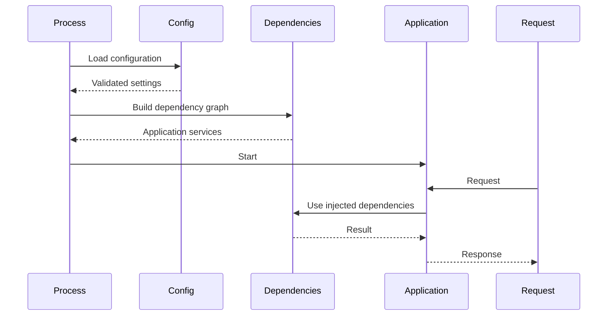

# 25- Dependency Injection

## Overview

Dependency Injection (DI) is a design technique where an object receives the dependencies it needs from outside rather than constructing those dependencies internally.

A dependency is anything a component relies on to perform its work:

- database repositories;
- HTTP clients;
- Redis clients;
- Kafka producers;
- configuration;
- clocks;
- authentication providers;
- message publishers;
- filesystem services;
- feature-flag providers.

Without dependency injection:

```text
OrderService
    ↓
creates PostgreSQL repository
    ↓
creates HTTP client
    ↓
creates Redis client
```

With dependency injection:

```text
Application Composition Root
        ↓
 ┌──────┼────────┐
 ↓      ↓        ↓
Repo   HTTP     Redis
 └──────┼────────┘
        ↓
   OrderService
```

The service depends on abstractions or collaborators, while another part of the application decides which concrete implementations to provide.

DI is particularly valuable in backend systems because applications typically have many infrastructure dependencies whose lifecycle, configuration, testing, and deployment must be controlled independently from business logic.

---

## Why Dependency Injection Matters

Consider:

```python
class OrderService:
    def __init__(self):
        self.repository = PostgresOrderRepository()
        self.payment_client = StripePaymentClient()
```

The class now controls:

- dependency construction;
- database configuration;
- HTTP client configuration;
- credentials;
- lifecycle;
- concrete implementations.

Testing becomes harder:

```text
OrderService
   ↓
PostgreSQL
   ↓
real database
```

With DI:

```python
class OrderService:
    def __init__(self, repository, payment_client):
        self.repository = repository
        self.payment_client = payment_client
```

The caller controls the dependencies:

```text
Production
    ↓
PostgresRepository + PaymentClient
    ↓
OrderService

Tests
    ↓
FakeRepository + FakePaymentClient
    ↓
OrderService
```

The service becomes easier to test, reuse, and evolve.

---

## Dependency Inversion vs Dependency Injection

These concepts are related but different.

**Dependency Inversion Principle** is a design principle:

> High-level policy should not depend directly on low-level implementation details.

**Dependency Injection** is a technique for implementing that separation.

For example:

```text
OrderService
    ↓
OrderRepository
    ↓
PostgresOrderRepository
```

The service depends on the repository abstraction rather than PostgreSQL-specific implementation details.

DI provides the concrete implementation at runtime.

---

## Dependency Direction

A useful backend dependency direction is:

```text
CLI / HTTP / Worker
        ↓
Application Services
        ↓
Domain
        ↓
Abstractions
        ↑
Infrastructure Implementations
```

For example:

```text
FastAPI
   ↓
OrderService
   ↓
OrderRepository
   ↑
PostgresOrderRepository
```

The application service should not need to know how PostgreSQL connections are created.

---

## Composition Root

The **composition root** is the place where an application's object graph is assembled.

For example:

```python
def build_order_service(settings: Settings) -> OrderService:
    repository = PostgresOrderRepository(settings.database_url)
    payment_client = PaymentClient(
        base_url=settings.payment_base_url,
        api_key=settings.payment_api_key,
    )

    return OrderService(
        repository=repository,
        payment_client=payment_client,
    )
```

The composition root answers:

```text
Which implementation?
Which configuration?
Which lifecycle?
Which scope?
```

Business services should generally not answer those questions themselves.

---

## Object Graph

An application can be viewed as an object graph:

```text
Application
    │
    ├── Settings
    │
    ├── Database
    │      └── Connection Pool
    │
    ├── OrderRepository
    │      └── Database
    │
    ├── PaymentClient
    │      └── HTTP Client
    │
    └── OrderService
           ├── OrderRepository
           └── PaymentClient
```

DI is primarily about constructing and connecting this graph cleanly.

---

## Constructor Injection

Constructor injection is the most common and usually the preferred form of DI in Python.

```python
class OrderService:
    def __init__(
        self,
        repository: OrderRepository,
        payment_client: PaymentClient,
    ) -> None:
        self.repository = repository
        self.payment_client = payment_client
```

Usage:

```python
service = OrderService(
    repository=repository,
    payment_client=payment_client,
)
```

### Advantages

- dependencies are explicit;
- objects cannot be created without required dependencies;
- easy to test;
- compatible with static typing;
- easy to reason about;
- avoids hidden runtime lookups.

### Limitations

Large constructors can indicate excessive responsibilities.

If a class requires:

```text
12 dependencies
```

the problem may not be DI itself. The class may be doing too much.

---

## Method Injection

A dependency can be passed only to the method that needs it.

```python
class ReportService:
    def generate(self, repository: ReportRepository) -> Report:
        ...
```

This is useful when:

- the dependency is needed only for one operation;
- the dependency is request-specific;
- the dependency is naturally part of the operation context.

However, repeatedly passing the same dependency through many layers can become noisy.

---

## Parameter Injection

A function can receive its dependency directly:

```python
def calculate_invoice(
    invoice: Invoice,
    tax_service: TaxService,
) -> Money:
    ...
```

This is particularly useful for:

- pure-ish application functions;
- utilities;
- isolated calculations;
- explicit orchestration.

---

## Setter Injection

Dependencies can be assigned after object construction:

```python
service.repository = repository
```

This is generally less desirable for required dependencies because the object can exist in an invalid state.

Prefer constructor injection for mandatory collaborators.

Setter-style configuration can be appropriate for optional or dynamically replaceable dependencies, but it should be deliberate.

---

## Dependency Interfaces

Python does not require traditional interfaces.

A `Protocol` can define the behavior required by an application service:

```python
from typing import Protocol


class OrderRepository(Protocol):
    def get(self, order_id: int) -> "Order | None":
        ...

    def save(self, order: "Order") -> None:
        ...
```

A PostgreSQL implementation can satisfy the protocol structurally:

```python
class PostgresOrderRepository:
    def get(self, order_id: int) -> Order | None:
        ...

    def save(self, order: Order) -> None:
        ...
```

The application service depends on the protocol:

```python
class OrderService:
    def __init__(self, repository: OrderRepository) -> None:
        self.repository = repository
```

This provides a clean boundary without requiring inheritance.

---

## ABC vs Protocol

Python provides both abstract base classes and protocols.

| Approach | Primary use |
|---|---|
| `Protocol` | Structural typing |
| `ABC` | Explicit nominal abstraction |
| Concrete class | Direct implementation |
| Callable | Simple behavior dependency |

Prefer `Protocol` when the main requirement is:

```text
"If it provides these methods, it can be used."
```

Prefer an `ABC` when explicit inheritance and shared behavior or controlled subclassing are valuable.

---

## Dependency Injection with Callables

Not every dependency needs a class.

A function can be injected:

```python
from collections.abc import Callable


class UserService:
    def __init__(
        self,
        password_hasher: Callable[[str], str],
    ) -> None:
        self.password_hasher = password_hasher
```

This is useful for small behavior dependencies such as:

- clocks;
- ID generators;
- hashing functions;
- serializers;
- authorization predicates.

Do not create classes merely to satisfy a theoretical DI pattern.

---

## Injecting a Clock

Time is an implicit dependency.

Instead of:

```python
from datetime import datetime, UTC

created_at = datetime.now(UTC)
```

deep inside business logic, inject a clock abstraction when deterministic time is important:

```python
from datetime import datetime, UTC
from typing import Protocol


class Clock(Protocol):
    def now(self) -> datetime:
        ...


class SystemClock:
    def now(self) -> datetime:
        return datetime.now(UTC)
```

Tests can provide:

```python
class FixedClock:
    def __init__(self, value: datetime) -> None:
        self.value = value

    def now(self) -> datetime:
        return self.value
```

This makes time-dependent behavior deterministic.

---

## Configuration as a Dependency

Configuration should not be scattered through global environment lookups:

```python
import os

timeout = int(os.environ["HTTP_TIMEOUT"])
```

throughout application code.

Prefer typed configuration:

```python
class PaymentClient:
    def __init__(
        self,
        base_url: str,
        timeout: float,
    ) -> None:
        self.base_url = base_url
        self.timeout = timeout
```

The configuration layer resolves environment variables and passes validated values into the object graph.

---

## Dependency Injection and Lifetimes

Dependencies have lifetimes.

Common scopes include:

| Lifetime | Example |
|---|---|
| Application/process | Configuration, immutable clients |
| Worker/process | Database engine, HTTP connection pool |
| Request | Request context, transaction/session |
| Operation | Temporary resource |
| Function call | Stateless helper |

The lifetime must match the resource.

For example:

```text
HTTP connection pool
→ long-lived

Database transaction
→ request/operation scoped

Temporary file
→ operation scoped
```

Creating every dependency per request can be expensive.

Sharing a dependency too broadly can be unsafe.

---

## Singleton vs Application-Scoped Dependency

A singleton-like object is created once and reused.

Example:

```text
Process
 └── HTTP client
      └── connection pool
```

This is useful for expensive reusable resources.

However, "singleton" should not mean:

```text
global mutable object
```

Application-scoped dependency ownership is generally easier to reason about than arbitrary global state.

---

## Database Dependency

A typical architecture separates:

```text
Database engine / pool
        ↓
Request transaction/session
        ↓
Repository
        ↓
Application service
```

The engine/pool can be process-scoped while transactions are request- or operation-scoped.

Do not inject one shared mutable transaction/session into every concurrent request.

---

## FastAPI Dependency Injection

FastAPI provides a dependency system through `Depends`.

Example:

```python
from fastapi import Depends, FastAPI

app = FastAPI()


def get_order_service() -> OrderService:
    return build_order_service()


@app.get("/orders/{order_id}")
async def get_order(
    order_id: int,
    service: OrderService = Depends(get_order_service),
):
    return service.get_order(order_id)
```

FastAPI resolves the dependency before calling the endpoint.

Conceptually:

```text
HTTP Request
     ↓
FastAPI dependency resolution
     ↓
get_order_service()
     ↓
OrderService
     ↓
endpoint
```

---

## FastAPI Dependency Overrides

FastAPI supports dependency overrides, which are useful for tests.

Conceptually:

```python
app.dependency_overrides[get_order_service] = get_test_order_service
```

The endpoint remains unchanged while tests provide different collaborators.

This is one of the practical benefits of framework-level DI.

---

## FastAPI Request-Scoped Dependencies

A dependency can depend on another dependency:

```text
Endpoint
   ↓
OrderService
   ↓
OrderRepository
   ↓
Database Session
```

FastAPI can resolve this dependency graph.

The important production concern is lifecycle management.

Database sessions, transactions, and request-specific resources must be closed or rolled back appropriately.

---

## FastAPI and Database Sessions

A common pattern is:

```python
from collections.abc import Generator


def get_db() -> Generator[Session, None, None]:
    with SessionLocal() as session:
        yield session
```

The exact implementation depends on the database library.

The important principle is:

```text
create scoped session
 ↓
inject
 ↓
use
 ↓
close
```

Do not accidentally create a new connection pool for every request.

---

## Django Dependency Injection

Django does not have a built-in dependency injection system equivalent to FastAPI's `Depends`.

Django applications commonly use:

- constructor injection;
- service objects;
- repository objects;
- explicit composition functions;
- application factories;
- management-command dependency construction.

For example:

```python
class OrderService:
    def __init__(self, repository: OrderRepository):
        self.repository = repository
```

A Django view can receive or construct the service at the appropriate application boundary.

Do not force a third-party DI container into Django merely because the framework does not expose one.

---

## Dependency Injection in CLI Applications

The CLI should compose application services:

```text
CLI
 ↓
Application Service
 ↓
Repository
 ↓
PostgreSQL
```

For example:

```python
def build_services(settings: Settings) -> OrderService:
    repository = PostgresOrderRepository(
        settings.database_url
    )

    return OrderService(repository)
```

This allows the same service to be used from:

```text
FastAPI
Django
CLI
Celery
tests
```

---

## Dependency Injection in Celery

A Celery task should generally be a thin execution boundary.

Prefer:

```python
@app.task
def reconcile_order(order_id: int) -> None:
    service = build_order_service()
    service.reconcile(order_id)
```

rather than embedding the entire business workflow inside the task definition.

For long-lived workers, be careful about dependency lifetime.

Resources such as database engines and HTTP clients may be reused appropriately within a worker process, while request-like transactions should remain scoped to individual task executions.

---

## Dependency Injection in Kafka Consumers

A Kafka consumer can similarly construct application services:

```text
Kafka Consumer
      ↓
Message Decoder
      ↓
Application Service
      ↓
Repository
      ↓
PostgreSQL
```

The consumer should not become the owner of business rules.

DI keeps the message transport separate from application logic.

---

## Dependency Injection and HTTP Clients

Instead of:

```python
class OrderService:
    def __init__(self):
        self.client = httpx.AsyncClient()
```

prefer:

```python
class OrderService:
    def __init__(self, payment_client: PaymentClient):
        self.payment_client = payment_client
```

The application controls:

- timeout;
- authentication;
- connection pooling;
- retry policy;
- base URL;
- observability.

The service only depends on the behavior it requires.

---

## Dependency Injection and Redis

For example:

```python
class RateLimitService:
    def __init__(self, redis: Redis) -> None:
        self.redis = redis
```

The Redis client can be constructed once per process and injected into the services that require it.

This makes testing easier:

```text
Production → Redis
Test       → FakeRedis / controlled adapter
```

---

## Dependency Injection and Kafka Producers

A service should depend on an event publisher rather than directly constructing a Kafka producer:

```python
class EventPublisher(Protocol):
    async def publish(self, topic: str, event: bytes) -> None:
        ...


class OrderService:
    def __init__(self, publisher: EventPublisher):
        self.publisher = publisher
```

The production composition root can provide the Kafka implementation.

Tests can provide a recording publisher.

---

## DI and the Transactional Outbox

DI does not solve transaction consistency by itself.

For:

```text
PostgreSQL transaction
+
Kafka event
```

dependency injection can provide:

```text
Repository
OutboxRepository
```

but correctness still requires an appropriate transactional design such as the outbox pattern.

DI separates responsibilities; it does not magically make external systems atomic.

---

## Dependency Injection and Testing

Testing is one of the strongest practical reasons to use DI.

Without DI:

```text
OrderService
 ↓
PostgreSQL
 ↓
real infrastructure
```

With DI:

```text
OrderService
 ↓
FakeRepository
```

Example:

```python
class InMemoryOrderRepository:
    def __init__(self) -> None:
        self.orders: dict[int, Order] = {}

    def get(self, order_id: int) -> Order | None:
        return self.orders.get(order_id)

    def save(self, order: Order) -> None:
        self.orders[order.id] = order
```

Test:

```python
def test_disable_order():
    repository = InMemoryOrderRepository()
    service = OrderService(repository)

    repository.save(Order(id=1))

    service.disable_order(1)

    assert repository.get(1).status == "disabled"
```

The test focuses on application behavior rather than PostgreSQL setup.

---

## Fake vs Mock

DI makes both possible.

### Fake

A fake provides a working simplified implementation:

```text
OrderRepository
   ↓
InMemoryOrderRepository
```

Fakes are often useful when testing business behavior.

### Mock

A mock verifies interactions:

```python
repository.save.assert_called_once_with(order)
```

Mocks are useful when interaction itself is the contract.

Prefer testing observable behavior over implementation details.

---

## Dependency Injection and Integration Tests

DI does not mean all tests should use mocks.

A healthy test strategy can be:

```text
Unit tests
 → fakes/in-memory dependencies

Integration tests
 → real PostgreSQL / Redis / HTTP test server

End-to-end tests
 → realistic application infrastructure
```

DI allows infrastructure to be replaced when appropriate without preventing real integration tests.

---

## Dependency Injection and Static Typing

Type annotations make injected dependencies explicit:

```python
class OrderService:
    def __init__(
        self,
        repository: OrderRepository,
        publisher: EventPublisher,
    ) -> None:
        self.repository = repository
        self.publisher = publisher
```

Static type checkers can verify that supplied implementations satisfy the required interface.

This is especially valuable when multiple implementations exist.

---

## Dependency Injection and Generics

Generic abstractions can be useful for reusable infrastructure:

```python
from typing import Generic, Protocol, TypeVar

T = TypeVar("T")


class Repository(Protocol, Generic[T]):
    def get(self, identifier: int) -> T | None:
        ...
```

Do not over-generalize repositories solely for theoretical reuse.

An explicit domain-specific interface is often easier to understand:

```python
class OrderRepository(Protocol):
    ...
```

---

## Dependency Injection and Configuration

A good composition flow is:

```text
Environment
    ↓
Configuration parser
    ↓
Validated Settings
    ↓
Dependency construction
    ↓
Application services
    ↓
API / CLI / Worker
```

This prevents business services from repeatedly reading:

```python
os.environ
```

and makes configuration ownership explicit.

---

## Dependency Injection and Secrets

Secrets should be resolved at infrastructure boundaries.

For example:

```text
AWS Secrets Manager
       ↓
Settings
       ↓
PaymentClient
```

Do not inject secrets into every layer unnecessarily.

Prefer passing a configured client:

```python
OrderService(payment_client)
```

rather than:

```python
OrderService(secret_key)
```

when the service has no legitimate need to know the credential.

---

## Dependency Injection and Security

DI can improve security by limiting what each component receives.

For example:

```text
ReportingService
    ↓
ReadOnlyRepository

AdminService
    ↓
AdminRepository
```

Avoid giving every service:

```text
database superuser
Redis admin access
AWS administrator credentials
```

Dependency boundaries should align with least privilege where practical.

---

## Dependency Injection and Service Isolation

A mature application might have:

```text
OrderService
    ├── OrderRepository
    ├── PaymentGateway
    └── EventPublisher

InventoryService
    ├── InventoryRepository
    └── EventPublisher
```

Each service receives only the dependencies it requires.

This limits coupling and makes ownership clearer.

---

## Dependency Injection and Microservices

DI remains useful inside each microservice.

For example:

```text
Order Service
    ↓
OrderApplicationService
    ├── OrderRepository
    ├── PaymentClient
    └── EventPublisher
```

DI does not replace service boundaries.

It helps structure the internals of each service.

---

## Dependency Injection vs Service Locator

A service locator hides dependencies:

```python
service = container.resolve(OrderRepository)
```

inside the business code.

The class appears to have no dependencies:

```python
class OrderService:
    def __init__(self, container):
        self.container = container
```

but actually depends on many hidden services.

This creates:

- hidden coupling;
- difficult testing;
- runtime resolution failures;
- unclear object requirements.

Prefer explicit constructor injection.

---

## Dependency Injection vs Global Variables

Avoid:

```python
repository = PostgresOrderRepository()


class OrderService:
    def create_order(self, order):
        repository.save(order)
```

The global creates implicit coupling and makes test isolation harder.

Prefer:

```python
class OrderService:
    def __init__(self, repository: OrderRepository):
        self.repository = repository
```

---

## Dependency Injection vs Factory Pattern

Factories and DI solve different problems.

A factory answers:

```text
How should an object be constructed?
```

DI answers:

```text
Who provides the object this component needs?
```

They can be combined:

```text
Composition Root
      ↓
Factory
      ↓
Concrete dependency
      ↓
Injected service
```

Factories are useful when construction depends on runtime configuration or implementation selection.

---

## Dependency Injection vs Abstract Factory

Abstract factories are useful when a family of related objects must be created consistently.

For example:

```text
PaymentProviderFactory
    ├── StripePaymentClient
    ├── AdyenPaymentClient
    └── MockPaymentClient
```

Do not introduce abstract factories when a simple constructor injection is sufficient.

---

## Dependency Injection and Runtime Selection

Sometimes the implementation depends on configuration:

```python
def build_payment_gateway(
    settings: Settings,
) -> PaymentGateway:
    if settings.payment_provider == "stripe":
        return StripePaymentGateway(settings)
    if settings.payment_provider == "adyen":
        return AdyenPaymentGateway(settings)

    raise ValueError("Unsupported payment provider")
```

The selection belongs in the composition layer.

The application service remains:

```python
class PaymentService:
    def __init__(self, gateway: PaymentGateway):
        self.gateway = gateway
```

---

## Dependency Injection Containers

A DI container automates dependency graph construction.

Conceptually:

```text
Container
 ├── Settings
 ├── Database
 ├── Repository
 ├── HTTP Client
 └── Service
```

The container can resolve:

```text
OrderService
    ↓
OrderRepository
    ↓
Database
```

Containers can be useful in very large systems, but they introduce another abstraction and often runtime complexity.

---

## When a DI Container Helps

A container can be useful when:

- the object graph is large;
- many dependencies have explicit scopes;
- multiple implementations are selected dynamically;
- lifecycle management is complex;
- construction is repeated across many application boundaries.

It is often unnecessary for smaller Python services.

Explicit construction is frequently easier to understand:

```python
repository = PostgresOrderRepository(db)
service = OrderService(repository)
```

---

## When Not to Use a DI Container

Avoid a container when it mainly turns:

```python
service = OrderService(repository)
```

into:

```python
container.resolve(OrderService)
```

without providing meaningful lifecycle or composition benefits.

Excessive container usage can make dependency graphs invisible.

Senior-level DI is often about **making dependencies obvious**, not maximizing abstraction.

---

## Dependency Scope

Scope should follow ownership.

Example:

```text
Application scope
 ├── Settings
 ├── Database engine
 └── HTTP client

Request scope
 ├── Database transaction
 └── Request context

Operation scope
 └── Temporary resource
```

A dependency with an overly long lifetime may retain:

- connections;
- memory;
- request-specific data;
- credentials;
- stale state.

A dependency with an overly short lifetime may create unnecessary:

- connections;
- sockets;
- object allocations;
- initialization overhead.

---

## Thread Safety

A shared dependency must be safe for its scope.

For example:

```text
shared HTTP client
```

may be appropriate if the client library supports concurrent use.

A mutable request-specific object generally should not be shared across requests.

Ask:

```text
Is it immutable?
Is it thread-safe?
Is it async-safe?
Does it contain request state?
Does it own a connection?
```

before choosing a lifetime.

---

## Async Dependency Injection

Async applications introduce additional lifecycle concerns.

For example:

```python
class PaymentClient:
    async def charge(self, payment_id: str) -> None:
        ...
```

The injected client should generally reuse its connection pool rather than creating a new client per operation.

For FastAPI:

```text
Application
 └── Async HTTP Client
       └── Connection Pool

Request
 └── OrderService
       └── PaymentClient
```

The service receives the reusable client while request-specific state remains local.

---

## Dependency Injection and Connection Pools

A common mistake is:

```python
def get_service():
    client = httpx.AsyncClient()
    repository = PostgresRepository(create_engine())
    return OrderService(repository, client)
```

if this function executes for every request.

That can create:

```text
request
 ↓
new pool
 ↓
new connections
 ↓
new client
```

and quickly exhaust resources.

Pool-owning dependencies should normally have application/process-level lifecycle.

---

## Dependency Injection and Kubernetes

Kubernetes multiplies process-level resources.

Suppose:

```text
10 pods
×
4 workers
×
database pool size 10
```

The theoretical maximum can be roughly:

```text
400 database connections
```

before accounting for overflow or other connection users.

DI does not remove this operational concern.

The composition root should create resources at the correct process scope, and capacity planning must account for replicas and workers.

---

## Dependency Injection and Graceful Shutdown

Injected resources often own connections.

Examples:

- PostgreSQL engine;
- HTTP client;
- Kafka producer;
- Redis client.

The application lifecycle should close them gracefully:

```text
startup
 ↓
construct resources
 ↓
serve requests
 ↓
SIGTERM
 ↓
stop accepting work
 ↓
drain
 ↓
close resources
 ↓
exit
```

Dependency ownership should be explicit enough that shutdown can reliably release resources.

---

## Dependency Injection and Resource Ownership

A useful question is:

> Which component owns this resource?

For example:

```text
Application
    owns
HTTP connection pool

Request
    owns
transaction

Function
    owns
temporary file
```

The owner should generally control creation and cleanup.

This prevents ambiguous lifecycle management.

---

## Circular Dependencies

Poor dependency design can produce:

```text
OrderService
   ↓
PaymentService
   ↓
OrderService
```

or:

```text
A → B → C → A
```

Circular dependencies often indicate a boundary problem.

Possible solutions include:

- extracting shared domain behavior;
- introducing an application service;
- publishing an event;
- reversing dependency direction;
- splitting responsibilities.

Do not solve every cycle with lazy imports or container tricks.

---

## Over-Injection

DI can be abused.

A class like:

```python
class OrderService:
    def __init__(
        self,
        repository,
        payment_client,
        redis,
        kafka,
        email,
        metrics,
        logger,
        clock,
        config,
        feature_flags,
        audit,
        tracer,
    ):
        ...
```

may technically use DI correctly but still have poor design.

The class probably has too many responsibilities.

Use cohesive application services and smaller components.

---

## Injecting the Logger

Logging is often better obtained through standard logging mechanisms:

```python
import logging

logger = logging.getLogger(__name__)
```

rather than injecting a logger into every class.

Logging infrastructure is generally cross-cutting and does not always need to appear as an explicit business dependency.

However, injecting specialized audit/event interfaces can be appropriate when logging behavior itself is part of the business contract.

---

## Injecting Configuration Objects Everywhere

Avoid passing the entire application configuration into every service:

```python
OrderService(settings)
```

if the service only needs:

```text
payment_timeout
```

Prefer narrower dependencies:

```python
OrderService(payment_client)
```

or a focused configuration object:

```python
@dataclass(frozen=True)
class PaymentSettings:
    timeout: float
```

This reduces coupling to global configuration.

---

## Narrow Interfaces

Prefer:

```python
class PaymentGateway(Protocol):
    async def charge(self, payment: Payment) -> ChargeResult:
        ...
```

over injecting an enormous provider client:

```python
class StripeClient:
    # 100 methods
    ...
```

The application should depend on the smallest useful interface.

This reduces:

- coupling;
- test surface;
- accidental capability exposure;
- provider-specific leakage.

---

## Anti-Corruption Boundaries

External SDKs should not necessarily leak into the domain.

Prefer:

```text
External SDK
    ↓
Provider Adapter
    ↓
Application Interface
    ↓
Domain
```

For example:

```python
class PaymentGateway(Protocol):
    async def charge(self, payment: Payment) -> ChargeResult:
        ...
```

The domain does not need to know about provider-specific request objects.

---

## Dependency Injection and Domain Models

Domain objects should generally not depend on infrastructure.

Avoid:

```python
@dataclass
class Order:
    db_session: Session
```

Prefer:

```text
Domain Order
      ↑
Application Service
      ↑
Repository
      ↑
Database
```

This keeps domain models portable and easier to test.

---

## Dependency Injection and ORM Models

ORM models are infrastructure-oriented objects.

A service can depend on a repository:

```python
class OrderService:
    def __init__(self, repository: OrderRepository):
        self.repository = repository
```

rather than coupling every application operation directly to ORM session behavior.

This is particularly useful when business workflows become complex.

---

## Dependency Injection and Caching

A service can receive a cache abstraction:

```python
class Cache(Protocol):
    async def get(self, key: str) -> bytes | None:
        ...

    async def set(self, key: str, value: bytes, ttl: int) -> None:
        ...
```

Production:

```text
RedisCache
```

Tests:

```text
InMemoryCache
```

The service remains independent of Redis-specific APIs.

---

## Dependency Injection and Feature Flags

Feature-flag providers can also be injected:

```python
class FeatureFlags(Protocol):
    def enabled(self, name: str, user_id: int) -> bool:
        ...
```

This allows:

```text
Production → LaunchDarkly / internal flag service
Tests      → deterministic fake
```

Avoid injecting a huge global feature configuration object into every component.

---

## Dependency Injection and External APIs

A service should depend on a focused API interface:

```python
class ShippingClient(Protocol):
    async def create_label(
        self,
        shipment: Shipment,
    ) -> ShippingLabel:
        ...
```

The concrete client handles:

- HTTP;
- authentication;
- retries;
- timeouts;
- serialization;
- provider-specific errors.

The application service handles business behavior.

---

## Dependency Injection and Error Boundaries

Provider-specific exceptions should generally be translated at the infrastructure boundary.

For example:

```text
Provider SDK exception
       ↓
ShippingClient
       ↓
ShippingUnavailable
       ↓
Application service
```

The application should not need to understand every exception type from an external SDK.

DI makes this boundary explicit.

---

## Dependency Injection and Retries

Retry behavior belongs close to the dependency that understands the failure semantics.

For example:

```text
ShippingClient
    ↓
HTTP timeout
    ↓
retry with backoff
```

rather than:

```text
OrderService
    ↓
catch every exception
    ↓
retry blindly
```

DI allows the service to receive a client whose retry policy is already configured.

---

## Dependency Injection and Transactions

Do not blindly inject a long-lived database session into an application service.

Prefer explicit transaction boundaries:

```text
Request / Command
      ↓
Transaction
      ↓
Application Service
      ↓
Repository
```

The transaction should be owned by the application boundary appropriate to the workflow.

---

## Dependency Injection and Unit of Work

A Unit of Work abstraction can make transaction ownership explicit:

```python
class UnitOfWork(Protocol):
    async def commit(self) -> None:
        ...

    async def rollback(self) -> None:
        ...
```

A service can coordinate:

```text
UnitOfWork
 ├── OrderRepository
 └── PaymentRepository
```

This can be useful in complex transactional workflows.

Do not introduce a Unit of Work abstraction when the ORM's transaction model is already clear and sufficient.

---

## Dependency Injection and Event Publishers

A business service can depend on:

```python
class EventPublisher(Protocol):
    async def publish(self, event: DomainEvent) -> None:
        ...
```

The concrete implementation might publish through Kafka.

This separation lets the business layer express:

```text
"OrderCreated happened"
```

without knowing:

```text
Kafka broker
topic
partition
serializer
producer configuration
```

---

## Testing the Composition Root

The composition root itself should be tested enough to detect wiring failures.

For example:

```text
Settings
 ↓
Database
 ↓
Repository
 ↓
Service
```

A small integration test can verify that the production object graph can actually be constructed.

Unit tests alone may not detect:

```text
wrong implementation
missing dependency
invalid configuration
incorrect lifecycle
```

---

## Dependency Injection and Application Startup

Startup should generally:

1. load configuration;
2. validate configuration;
3. initialize shared resources;
4. construct application services;
5. start the application.

Conceptually:



---

## Dependency Injection and Lazy Construction

Not every dependency must be created at startup.

Lazy construction can be useful when:

- initialization is expensive;
- the dependency is rarely used;
- configuration determines whether it is needed.

But lazy construction can move failures from startup to runtime.

For critical dependencies, fail-fast startup is often preferable.

---

## Fail-Fast vs Lazy Failure

| Strategy | Advantage | Risk |
|---|---|---|
| Eager initialization | Early failure | Longer startup |
| Lazy initialization | Faster startup | Runtime failure |
| Hybrid | Balanced | More lifecycle complexity |

For production services, critical infrastructure such as database connectivity may benefit from explicit startup validation.

---

## Dependency Injection and Performance

DI itself is usually not a meaningful performance bottleneck.

The expensive operations are usually:

- database connections;
- HTTP requests;
- serialization;
- object allocation;
- dependency initialization.

The important performance concern is **dependency lifetime**.

Bad:

```text
request
 ↓
create HTTP client
 ↓
create connection pool
```

Better:

```text
process
 ↓
HTTP client + pool

request
 ↓
reuse client
```

---

## Dependency Injection and Memory

Long-lived dependencies retain everything they reference.

A process-scoped object that accidentally captures request data can create memory retention:

```text
global service
 ↓
request object
 ↓
large payload
```

Avoid storing request-specific state in application-scoped dependencies.

Keep scopes narrow for stateful objects.

---

## Threading and Dependency Scope

In threaded applications:

```text
shared dependency
```

must be safe for concurrent access.

Do not assume that because an object is injected it is automatically thread-safe.

For mutable state, consider:

- locks;
- immutable data;
- thread-local state;
- request-scoped objects;
- process-local ownership.

---

## Asyncio and Dependency Scope

Asyncio applications can share mutable dependencies across tasks:

```text
Task A ─┐
Task B ─┼── shared mutable service
Task C ─┘
```

Even in a single event-loop thread, state can interleave across `await` points.

Prefer stateless or immutable application services and request-local state where possible.

---

## Multiprocessing

Process workers do not share ordinary Python memory.

A dependency created before process forking may have problematic resource semantics if it contains:

- sockets;
- database connections;
- locks;
- event loops.

Create process-owned connection pools and clients according to the server/worker lifecycle rather than blindly sharing inherited runtime resources.

---

## Dependency Injection and Containers in Tests

A test can replace an entire object graph:

```text
Production
 ├── PostgreSQL
 ├── Redis
 └── Payment API

Test
 ├── In-memory repository
 ├── Fake cache
 └── Fake payment gateway
```

This is one of the strongest architectural benefits of explicit dependency boundaries.

---

## Test Doubles Should Be Deliberate

Do not replace every dependency with a mock.

Use:

```text
fake
→ behavioral substitution

mock
→ interaction verification

stub
→ fixed response

real dependency
→ integration confidence
```

Choose based on what the test needs to prove.

---

## Dependency Injection and Contract Tests

When multiple implementations satisfy an interface:

```text
PaymentGateway
 ├── Stripe
 ├── Adyen
 └── Fake
```

contract tests can verify that each implementation satisfies the expected behavior.

This is especially useful when replacing infrastructure providers.

---

## Dependency Injection and Maintainability

Explicit dependencies make code review easier.

A reviewer can inspect:

```python
class OrderService:
    def __init__(
        self,
        repository: OrderRepository,
        payment_gateway: PaymentGateway,
        publisher: EventPublisher,
    ):
        ...
```

and immediately understand the service's external collaborators.

Hidden dependencies require following runtime resolution or global state.

---

## Dependency Injection and Refactoring

DI can expose architecture problems.

If introducing DI results in:

```text
constructor with 20 dependencies
```

do not automatically create a bigger container.

Ask:

- Does the class have too many responsibilities?
- Can related operations be extracted?
- Should dependencies be grouped into a cohesive service?
- Is a boundary missing?
- Is the service doing orchestration that belongs elsewhere?

DI often reveals coupling that already existed.

---

## Recommended Backend Architecture

A practical Python backend can use:

```text
                 ┌──────────────────┐
                 │ Composition Root │
                 └────────┬─────────┘
                          │
             ┌────────────┼────────────┐
             ↓            ↓            ↓
          FastAPI        CLI        Celery
             │            │            │
             └────────────┼────────────┘
                          ↓
                 Application Services
                          ↓
                    Domain Logic
                          ↓
                 Protocol Interfaces
                    ↙     ↓      ↘
                   /      |       \
           PostgreSQL    Redis    HTTP/Kafka
```

This allows multiple delivery mechanisms to share the same application behavior.

---

## Practical Example

A production-oriented order workflow might look like:

```python
from typing import Protocol


class OrderRepository(Protocol):
    def get(self, order_id: int) -> "Order | None":
        ...

    def save(self, order: "Order") -> None:
        ...


class PaymentGateway(Protocol):
    async def charge(self, order: "Order") -> None:
        ...


class EventPublisher(Protocol):
    async def publish(self, event: "OrderPaid") -> None:
        ...


class OrderService:
    def __init__(
        self,
        repository: OrderRepository,
        payment_gateway: PaymentGateway,
        publisher: EventPublisher,
    ) -> None:
        self.repository = repository
        self.payment_gateway = payment_gateway
        self.publisher = publisher

    async def pay(self, order_id: int) -> None:
        order = self.repository.get(order_id)

        if order is None:
            raise ValueError("Order not found")

        await self.payment_gateway.charge(order)

        order.mark_paid()
        self.repository.save(order)

        await self.publisher.publish(
            OrderPaid(order_id=order.id)
        )
```

The service knows what it needs but not how those dependencies are implemented.

The composition layer decides:

```python
service = OrderService(
    repository=PostgresOrderRepository(db),
    payment_gateway=StripePaymentGateway(client),
    publisher=KafkaEventPublisher(producer),
)
```

---

## Dependency Injection Decision Framework

Use explicit constructor injection when:

- the dependency is required;
- the class owns behavior that depends on it;
- test substitution is useful;
- the dependency boundary matters.

Use a protocol when:

- multiple implementations exist;
- the consumer should not depend on a concrete class;
- structural typing improves separation.

Use direct construction when:

- the object is a simple value or internal helper;
- there is no meaningful substitution boundary;
- lifecycle is trivial.

Use a DI container when:

- the dependency graph and lifecycle complexity justify it;
- explicit construction has become genuinely difficult to manage.

Do not abstract every object merely to achieve theoretical purity.

---

## Best Practices

- Prefer constructor injection for required dependencies.
- Keep the composition root explicit.
- Depend on narrow interfaces rather than large infrastructure clients.
- Use `Protocol` when structural typing is appropriate.
- Keep domain logic independent from infrastructure.
- Keep provider-specific SDKs behind adapters.
- Define dependency lifetimes explicitly.
- Reuse connection pools and expensive clients at appropriate process/application scope.
- Keep transactions and request-specific state scoped to the operation that owns them.
- Avoid global mutable dependencies.
- Avoid service locators that hide dependencies.
- Do not inject an entire application configuration object when a narrower dependency is sufficient.
- Do not create connection pools or HTTP clients per request.
- Make resource ownership and shutdown behavior explicit.
- Use DI to improve testability, not to maximize abstraction.
- Prefer fakes for behavioral unit tests when practical and real infrastructure for integration tests.
- Treat concurrency safety as a property of the dependency, not of the DI mechanism.
- Use dependency boundaries to support least privilege and security isolation.
- Keep CLI, API, worker, and scheduled-job layers thin and reuse application services.
- Let dependency-specific components own concerns such as connection pooling, provider authentication, and retry policy.
- Introduce DI containers only when the complexity they solve exceeds the complexity they add.

---

## Common Mistakes

### Constructing Dependencies Inside Services

```python
class UserService:
    def __init__(self):
        self.repository = PostgresUserRepository()
```

This couples business logic to infrastructure.

Inject the repository instead.

### Using Global Mutable Services

```python
service = UserService(...)
```

as globally shared mutable state can create lifecycle and concurrency problems.

Prefer explicit application-scoped ownership.

### Creating Pools Per Request

This can exhaust PostgreSQL or external service connection limits.

Create pool-owning dependencies at the correct process/application scope.

### Hiding Dependencies Behind a Container

```python
container.resolve("repository")
```

inside business code hides the actual dependency graph.

Prefer explicit dependencies.

### Overusing Interfaces

Creating:

```text
Interface
AbstractInterface
Factory
FactoryInterface
Provider
ProviderFactory
```

for a class with one implementation adds complexity without improving architecture.

### Injecting Everything

DI does not mean every value needs to be a dependency.

Simple constants and pure helpers do not necessarily need injection.

### Injecting the Entire Configuration

This couples components to unrelated settings.

Pass focused configuration or already-configured dependencies.

### Mocking Everything

A suite containing only mocks may prove that mocks interact correctly rather than proving that the application integrates correctly.

Maintain integration tests with real infrastructure.

### Ignoring Resource Lifetimes

A correctly injected dependency can still be incorrectly scoped.

For example:

```text
request-scoped database session
```

should not accidentally become:

```text
process-global database session
```

### Sharing Stateful Dependencies Across Async Tasks

Injected does not mean concurrency-safe.

Review mutable state and lifecycle explicitly.

---

## Production Pitfalls

### Connection Explosion

A DI graph may appear harmless locally but multiply across:

```text
pods × workers × pools
```

in Kubernetes.

Capacity-plan all process-scoped resources.

### Startup Failure

Eagerly constructing every dependency can make startup fragile if an optional provider is unavailable.

Distinguish critical infrastructure from optional dependencies.

### Runtime Failure

Excessive lazy construction can move configuration errors into production request paths.

Validate critical dependencies during startup.

### Circular Dependencies

Circular service dependencies often indicate poorly defined boundaries.

Refactor the architecture rather than hiding the cycle in a DI container.

### Request State Leakage

Long-lived dependencies must never accidentally retain request-specific mutable state.

### Incorrect Async Lifecycle

Async HTTP clients, database pools, and producers must be opened and closed according to the application lifecycle.

### Forked Resource Sharing

Do not blindly share inherited database connections, sockets, or event-loop resources across worker processes.

Create process-owned resources according to the server's lifecycle.

### Over-Abstraction

A DI-heavy architecture can become harder to understand than direct construction.

The goal is explicit ownership and replaceable boundaries, not abstraction for its own sake.

---

## Interview Traps

### Is Dependency Injection the Same as Dependency Inversion?

No. Dependency inversion is a design principle; dependency injection is a technique for supplying dependencies.

### Why Is Constructor Injection Usually Preferred?

Required dependencies are explicit, objects cannot easily exist in partially initialized states, and tests can provide substitutes directly.

### Does Python Need a DI Container?

No. Python's functions, constructors, first-class objects, and dynamic typing make explicit dependency injection straightforward. Containers are optional.

### Why Use `Protocol`?

It allows structural typing so a consumer can depend on required behavior without requiring implementations to inherit from a common base class.

### Is DI Mainly for Testing?

Testing is a major benefit, but DI also improves separation of concerns, lifecycle management, provider substitution, maintainability, and architecture.

### Does DI Make Code Thread-Safe?

No. DI only controls how dependencies are supplied. The dependency itself must still be safe for its concurrency scope.

### Where Should Dependencies Be Constructed?

Prefer a composition root or framework lifecycle boundary rather than inside business logic.

### Why Avoid a Service Locator?

It hides dependencies and moves errors from object construction to runtime resolution, making the dependency graph harder to understand and test.

### When Should a DI Container Be Introduced?

When dependency graph construction and lifecycle management have become sufficiently complex that explicit composition is genuinely difficult to maintain.

### What Is the Most Important DI Design Question?

Not "Which DI framework should I use?" but:

> "Who owns this dependency, what scope should it have, and what behavior does the consuming component actually need?"

## Key Takeaways

- **Dependency Injection makes dependencies explicit:** prefer constructor injection and keep object construction in a composition root rather than inside business logic.
- **Dependency boundaries should be narrow and meaningful:** use `Protocol` or focused interfaces to isolate application code from PostgreSQL, Redis, HTTP clients, Kafka, SDKs, and other infrastructure.
- **Lifecycle and concurrency matter as much as wiring:** pools and clients are commonly process-scoped, while transactions and request state should remain appropriately scoped and concurrency-safe.
- **DI improves testability without replacing integration testing:** use fakes or mocks where they add value, but retain integration and end-to-end tests with real infrastructure.
- **Avoid DI overengineering:** explicit construction is often better than a container; abstraction should solve coupling, lifecycle, or substitution problems rather than exist for its own sake.