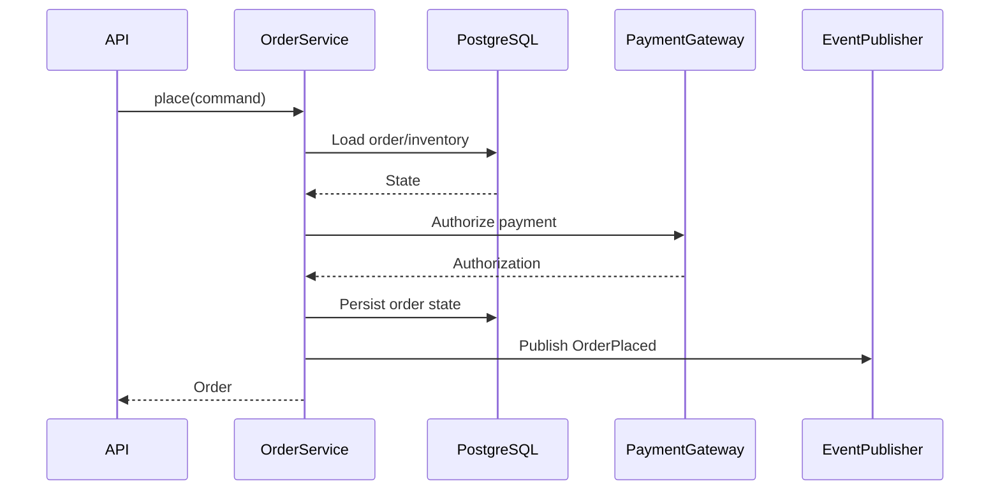

# 26- Service Layer

## Overview

A service layer is an application-level boundary that coordinates business operations across domain objects, repositories, external services, transactions, and other infrastructure.

In a backend application, the service layer typically sits between delivery mechanisms and lower-level infrastructure:

```text
HTTP / CLI / Worker / gRPC
            ↓
       Service Layer
            ↓
     Domain + Repositories
            ↓
 PostgreSQL / Redis / Kafka / APIs
```

The service layer is useful when an operation involves more than simple request-to-database mapping.

For example, placing all of this inside a FastAPI endpoint is difficult to maintain:

```text
validate request
check authorization
load order
check inventory
charge payment
update order
publish event
send notification
```

A service can instead expose a business operation:

```python
await order_service.place_order(command)
```

The HTTP layer handles HTTP concerns. The service coordinates the use case. Repositories and infrastructure components handle persistence and external communication.

A service layer is not automatically required for every Python application. Small applications can remain simpler. The architectural value appears when business workflows become substantial, reused across entry points, or difficult to test and reason about.

---

## Why the Service Layer Exists

Without a service layer, business logic often spreads across:

- FastAPI route handlers;
- Django views;
- serializers;
- ORM models;
- Celery tasks;
- CLI commands;
- webhook handlers;
- Kafka consumers.

This creates duplicated rules and inconsistent behavior.

For example:

```text
POST /orders
    └── calculates price

CLI create-order
    └── calculates price differently

Celery task
    └── calculates price again
```

A service layer provides one application-level implementation:

```text
                 ┌── FastAPI
                 ├── Django
                 ├── CLI
                 ├── Celery
                 └── Kafka Consumer
                         ↓
                    OrderService
                         ↓
                    Domain Logic
                         ↓
               Repositories / APIs
```

The goal is not to create another layer merely because architecture diagrams contain one.

The goal is to establish a clear **use-case boundary**.

---

## Service Layer Responsibilities

A service commonly coordinates:

- business workflows;
- transaction boundaries;
- domain operations;
- repository calls;
- external service calls;
- authorization decisions when they belong to the use case;
- idempotency;
- domain event publication;
- application-level validation;
- workflow state transitions;
- retry/degradation decisions.

It should generally not own:

- HTTP status codes;
- HTTP request parsing;
- SQL query construction;
- JSON serialization;
- terminal formatting;
- provider-specific transport details.

A useful rule is:

> The service should express what the application is doing, not how a particular transport or infrastructure system works.

---

## Service Layer vs Controller

A controller handles delivery concerns.

For an HTTP API:

```text
HTTP request
    ↓
Controller / Route
    ↓
Service
    ↓
Repository
```

The controller should translate:

```text
HTTP → application command
```

and:

```text
application result → HTTP response
```

Example:

```python
@router.post("/orders")
async def create_order(
    request: CreateOrderRequest,
    service: OrderService = Depends(get_order_service),
):
    order = await service.create_order(
        customer_id=request.customer_id,
        items=request.items,
    )

    return OrderResponse.from_domain(order)
```

The endpoint should not contain the entire order-creation workflow.

---

## Service Layer vs Repository

A repository handles persistence access.

```text
Service
   ↓
Repository
   ↓
PostgreSQL
```

A repository answers questions such as:

```text
How do I load an order?
How do I save an order?
How do I query eligible records?
```

A service answers:

```text
What should happen when an order is placed?
```

For example:

```python
class OrderRepository(Protocol):
    async def get(self, order_id: int) -> Order | None:
        ...

    async def save(self, order: Order) -> None:
        ...
```

The service coordinates the repository with other dependencies.

---

## Service Layer vs Domain Layer

These layers are related but not identical.

The **domain layer** represents business concepts and rules.

The **service layer** often coordinates a use case involving multiple domain objects or external dependencies.

For example:

```text
Order
 └── validates its own state

OrderService
 ├── loads Order
 ├── checks Inventory
 ├── charges PaymentGateway
 ├── saves Order
 └── publishes event
```

A useful distinction is:

```text
Domain
→ "What rules make this object/state valid?"

Service
→ "What steps accomplish this business operation?"
```

Not every application needs a heavily separated domain layer.

---

## Service Layer vs Application Service

The terms are often used interchangeably, but a useful distinction is:

```text
Application Service
→ coordinates a specific application use case

Domain Service
→ contains domain logic that does not naturally belong to one entity/value object
```

For example:

```python
class PlaceOrderService:
    async def execute(self, command: PlaceOrderCommand) -> Order:
        ...
```

is an application service.

A domain service might represent a business calculation involving multiple domain concepts:

```python
class ShippingCostCalculator:
    def calculate(
        self,
        order: Order,
        destination: Address,
    ) -> Money:
        ...
```

The exact naming matters less than keeping responsibilities clear.

---

## Use Cases as Service Boundaries

A mature service layer often maps to business use cases:

```text
CreateOrder
CancelOrder
RefundOrder
ShipOrder
ReconcilePayment
```

rather than generic technical operations:

```text
OrderService.create()
OrderService.update()
OrderService.delete()
```

Use-case-oriented services make business workflows more explicit.

---

## CRUD Services

CRUD-style services can be appropriate for simple systems:

```python
class UserService:
    async def create(...)
    async def get(...)
    async def update(...)
    async def delete(...)
```

However, complex business systems often benefit from operation-oriented APIs:

```python
class OrderService:
    async def place(...)
    async def cancel(...)
    async def refund(...)
    async def fulfill(...)
```

The latter expresses business semantics instead of exposing database operations.

---

## Transaction Boundary

One of the most important service-layer responsibilities is defining transaction scope.

For example:

```text
Place Order
    ↓
BEGIN
    ↓
load inventory
    ↓
reserve inventory
    ↓
create order
    ↓
COMMIT
```

The service or application boundary should coordinate the transaction rather than letting each repository independently commit.

Otherwise:

```text
Repository A → commit
Repository B → commit
Repository C → failure
```

can leave the workflow partially applied.

---

## Service + Unit of Work

A Unit of Work can make transaction ownership explicit:

```text
OrderService
     ↓
UnitOfWork
 ┌───┼────────────┐
 ↓   ↓            ↓
OrderRepo   InventoryRepo
     ↓
 PostgreSQL transaction
```

Example:

```python
async with unit_of_work:
    order = await unit_of_work.orders.get(order_id)

    order.cancel()

    await unit_of_work.orders.save(order)

    await unit_of_work.commit()
```

The exact implementation depends on the ORM or database layer.

Do not introduce a Unit of Work abstraction if the existing transaction API is already clear and sufficient.

---

## Transaction Scope

A service should avoid unnecessarily long transactions.

Bad:

```text
BEGIN
 ↓
database update
 ↓
HTTP request to payment provider
 ↓
wait 5 seconds
 ↓
Kafka publish
 ↓
COMMIT
```

This can hold:

- database connections;
- locks;
- snapshots;
- transaction resources.

Prefer:

```text
persist local state
 ↓
commit
 ↓
external workflow
```

with appropriate idempotency and recovery mechanisms.

---

## Service Layer and External APIs

Suppose an order requires payment:

```text
OrderService
    ↓
PaymentGateway
    ↓
External payment API
```

The service should depend on an abstraction:

```python
class PaymentGateway(Protocol):
    async def authorize(
        self,
        payment: Payment,
    ) -> AuthorizationResult:
        ...
```

The concrete implementation owns:

- HTTP;
- authentication;
- timeouts;
- retries;
- provider-specific serialization;
- provider-specific errors.

The service owns business decisions.

---

## Service Layer and HTTP Clients

Avoid embedding HTTP mechanics in the service:

```python
response = await httpx.post(...)
```

throughout business methods.

Prefer:

```python
await self.payment_gateway.authorize(payment)
```

This provides a clean boundary:

```text
Service
 ↓
Gateway Interface
 ↓
HTTP Client
 ↓
External API
```

It also simplifies testing and provider substitution.

---

## Service Layer and Redis

A service can depend on a cache abstraction:

```python
class OrderCache(Protocol):
    async def get(self, order_id: int) -> Order | None:
        ...

    async def set(self, order: Order, ttl: int) -> None:
        ...
```

The service should not need to know whether the implementation uses:

```text
Redis
local memory
another cache
```

unless those semantics materially affect business behavior.

---

## Service Layer and Kafka

A service may publish application events:

```python
class EventPublisher(Protocol):
    async def publish(self, event: DomainEvent) -> None:
        ...
```

The service can express:

```python
await publisher.publish(
    OrderPlaced(order_id=order.id)
)
```

rather than:

```python
await kafka_producer.send_and_wait(
    "orders",
    serialize(...),
)
```

The Kafka implementation remains infrastructure-specific.

---

## Transactional Outbox

If a service updates PostgreSQL and must publish an event reliably:

```text
OrderService
    ↓
PostgreSQL transaction
 ├── update order
 └── insert outbox event
        ↓
     COMMIT
        ↓
Outbox Publisher
        ↓
      Kafka
```

Do not assume that dependency injection or service-layer abstraction makes:

```text
database commit
+
Kafka publish
```

atomic.

The transactional outbox pattern addresses that consistency problem.

---

## Service Layer and Background Jobs

Celery tasks should generally invoke application services:

```python
@app.task
def reconcile_payment(payment_id: int) -> None:
    service = build_payment_service()
    service.reconcile(payment_id)
```

The task is an execution boundary.

The service contains the workflow.

This makes the same operation reusable from:

```text
API
CLI
Celery
scheduled job
```

---

## Service Layer and Webhooks

Webhook handlers should similarly delegate:

```text
Webhook
 ↓
Authentication
 ↓
Validation
 ↓
Persistence
 ↓
Service / Worker
```

For example:

```python
async def process_payment_webhook(
    event: PaymentWebhook,
    service: PaymentService,
) -> None:
    await service.apply_provider_event(event)
```

The service should handle business-state reconciliation rather than provider-specific HTTP parsing.

---

## Service Layer and CLI

A CLI can invoke the same application service:

```text
CLI
 ↓
OrderService
 ↓
OrderRepository
 ↓
PostgreSQL
```

This prevents administrative commands from developing their own business rules.

For example:

```python
def reconcile_command(
    service: PaymentService,
    payment_id: str,
) -> int:
    service.reconcile(payment_id)
    print("Reconciliation completed")
    return 0
```

The CLI handles terminal concerns while the service handles application behavior.

---

## Service Layer and gRPC

gRPC handlers should follow the same pattern:

```text
gRPC Request
    ↓
gRPC Handler
    ↓
Application Service
    ↓
Domain / Repository
```

The service should not depend on protobuf-generated request objects if avoidable.

Map transport DTOs to application commands at the boundary.

---

## Commands and Queries

A useful service-layer distinction is:

```text
Command
→ changes application state

Query
→ retrieves application state
```

Examples:

```text
PlaceOrderCommand
CancelOrderCommand
RefundOrderCommand

GetOrderQuery
ListOrdersQuery
```

This does not require full CQRS.

The distinction simply clarifies intent.

---

## Command Objects

Complex service operations can receive explicit command models:

```python
from dataclasses import dataclass


@dataclass(frozen=True)
class PlaceOrderCommand:
    customer_id: int
    product_ids: tuple[int, ...]
    shipping_address_id: int
```

Then:

```python
class OrderService:
    async def place(
        self,
        command: PlaceOrderCommand,
    ) -> Order:
        ...
```

This avoids methods with large numbers of loosely related arguments.

---

## Service Return Values

A service should return application-level results.

For example:

```python
order = await service.place(command)
```

rather than returning:

```text
FastAPI Response
Django HttpResponse
protobuf message
CLI output string
```

Transport-specific conversion belongs at the boundary.

---

## Service Exceptions

Services can expose application-level exceptions:

```python
class OrderNotFound(Exception):
    pass


class OrderAlreadyCancelled(Exception):
    pass


class InsufficientInventory(Exception):
    pass
```

The HTTP layer can map them:

```text
OrderNotFound
    ↓
404

InsufficientInventory
    ↓
409
```

The service should not raise `HTTPException` merely because it happens to be called by FastAPI.

---

## Error Mapping

A useful architecture is:

```text
Infrastructure Exception
        ↓
Infrastructure Adapter
        ↓
Application Exception
        ↓
Service
        ↓
Transport Adapter
        ↓
HTTP / gRPC / CLI semantics
```

For example:

```text
PaymentProviderTimeout
        ↓
PaymentUnavailable
        ↓
HTTP 503
```

This prevents infrastructure-specific exception types from leaking across the application.

---

## Service-Level Validation

Validation can exist at multiple layers.

```text
HTTP schema validation
        ↓
Application validation
        ↓
Domain validation
        ↓
Database constraints
```

The service is a good place for state-dependent rules:

```python
if order.status != OrderStatus.PENDING:
    raise OrderAlreadyProcessed()
```

The database should still enforce durable invariants such as uniqueness where concurrency requires it.

---

## Authorization in the Service Layer

Authorization can occur at the API boundary:

```text
HTTP
 ↓
authenticated user
 ↓
authorization
 ↓
service
```

But business-specific authorization can belong in the service:

```python
if not policy.can_refund(actor, order):
    raise PermissionDenied()
```

This is useful when the same operation can be invoked from:

- REST;
- CLI;
- worker;
- gRPC;
- internal automation.

Authorization rules should not be duplicated across every transport.

---

## Authentication vs Authorization

The service generally should not implement authentication protocols.

Authentication answers:

```text
Who is this caller?
```

Authorization answers:

```text
Can this caller perform this operation?
```

Authentication belongs primarily to the transport/security boundary.

Business authorization can be evaluated by application services or policy components.

---

## Service Layer and Idempotency

Services are often the right place to enforce application-level idempotency.

For example:

```text
PlaceOrder
   ↓
idempotency key
   ↓
existing result?
 ┌──────┴──────┐
yes           no
 ↓             ↓
return       execute
result       workflow
```

The database should provide durable uniqueness where required.

Idempotency cannot safely depend only on an in-memory Python dictionary in a multi-process backend.

---

## Service Layer and Concurrency

Services coordinate concurrent operations but should not assume that Python-level checks are sufficient.

Dangerous:

```python
if not await repository.exists(order_id):
    await repository.create(order)
```

Two concurrent requests can both observe absence.

Use database constraints or atomic operations:

```sql
INSERT INTO orders (...)
VALUES (...)
ON CONFLICT (external_id) DO NOTHING;
```

The service coordinates the operation; PostgreSQL enforces the durable invariant.

---

## Service Layer and Optimistic Concurrency

A service can enforce version-based updates:

```python
order = await repository.get(order_id)

if order.version != command.expected_version:
    raise ConcurrentModification()
```

The actual update should still be atomic:

```sql
UPDATE orders
SET status = $1,
    version = version + 1
WHERE id = $2
  AND version = $3;
```

The service interprets the result and maps it to application behavior.

---

## Service Layer and Pessimistic Locking

For workflows requiring row locking:

```text
Service
 ↓
Repository
 ↓
SELECT ... FOR UPDATE
```

The repository should encapsulate SQL mechanics while the service defines the transaction workflow.

For example:

```text
BEGIN
 ↓
lock account
 ↓
validate balance
 ↓
update balance
 ↓
COMMIT
```

Avoid holding locks while making unrelated network calls.

---

## Service Layer and Domain Events

A service can coordinate domain event creation:

```python
order.mark_paid()

event = OrderPaid(
    order_id=order.id,
)

await event_publisher.publish(event)
```

For durable delivery, persist the event through an outbox rather than assuming the external broker operation is atomic with the database transaction.

---

## Service Layer and Domain Events vs Integration Events

A domain event represents an internal business occurrence:

```text
OrderPaid
```

An integration event represents a message intentionally published to another boundary:

```text
order.paid.v1
```

A service may create the domain event while infrastructure translates or publishes it.

The distinction becomes valuable in larger systems with multiple bounded contexts.

---

## Service Layer and Caching

A service may coordinate cache usage:

```text
Service
 ↓
Cache
 ↓ cache miss
Repository
 ↓
Database
```

But cache invalidation must be deliberate.

For example:

```text
BEGIN
 ↓
update database
 ↓
COMMIT
 ↓
invalidate cache
```

If the cache is authoritative for some workflow, its consistency requirements must be explicitly designed.

---

## Service Layer and External Side Effects

A service may coordinate:

```text
database
payment provider
email provider
Kafka
```

but these systems usually cannot participate in one atomic transaction.

Use:

- state machines;
- outbox;
- idempotency;
- retries;
- reconciliation;
- compensating actions.

Do not make the service layer a place where distributed transaction assumptions are hidden.

---

## Service Layer as a Workflow Boundary

Complex operations can be represented explicitly:



In a production system, the exact transaction/event ordering must account for failure and consistency requirements. A transactional outbox is often preferable to directly publishing the event after a database commit.

---

## Service Layer and State Machines

Complex workflows benefit from explicit state transitions.

For example:

```text
PENDING
  ├── pay → PAID
  ├── cancel → CANCELLED
  └── expire → EXPIRED

PAID
  ├── ship → SHIPPED
  └── refund → REFUNDED
```

The service coordinates valid transitions:

```python
order.pay()
```

rather than directly assigning:

```python
order.status = "paid"
```

This keeps state invariants centralized.

---

## Service Layer and Repository Abstractions

A service often depends on repository protocols:

```python
class OrderRepository(Protocol):
    async def get(self, order_id: int) -> Order | None:
        ...

    async def save(self, order: Order) -> None:
        ...
```

The production implementation can use:

```text
SQLAlchemy
Django ORM
psycopg
```

without changing the service interface.

However, repository abstractions should be introduced where they provide meaningful architectural value.

A repository that simply mirrors every ORM method can become unnecessary indirection.

---

## Generic Repository Anti-Pattern

Avoid creating an abstraction such as:

```python
class GenericRepository[T]:
    async def create(...)
    async def get(...)
    async def update(...)
    async def delete(...)
```

for every entity without considering business requirements.

A generic CRUD abstraction can hide important differences between:

```text
Order
Payment
Inventory
LedgerEntry
```

Use domain-specific repositories when query and consistency semantics differ.

---

## Service Layer and ORM

A service can use an ORM through repositories or directly when the application is simple.

The important boundary is not:

```text
ORM is forbidden
```

but:

```text
business workflow should not become accidental ORM infrastructure code
```

A pragmatic Django application may use:

```python
class OrderService:
    def cancel(self, order_id: int) -> None:
        order = Order.objects.get(pk=order_id)
        order.cancel()
        order.save(update_fields=["status"])
```

This can be perfectly reasonable for moderate complexity.

Architecture should follow actual complexity.

---

## Service Layer in Django

A Django application often has:

```text
URL
 ↓
View
 ↓
Service
 ↓
ORM
```

For more complex systems:

```text
View
 ↓
Application Service
 ↓
Domain
 ↓
Repository
 ↓
ORM
```

Django's ORM and transaction APIs can remain infrastructure mechanisms while the service coordinates application behavior.

---

## Service Layer in FastAPI

FastAPI applications commonly use:

```text
Router
 ↓
Dependency Injection
 ↓
Service
 ↓
Repository
```

Example:

```python
@router.post("/orders/{order_id}/cancel")
async def cancel_order(
    order_id: int,
    service: OrderService = Depends(get_order_service),
):
    await service.cancel(order_id)

    return {"status": "cancelled"}
```

The route is responsible for HTTP semantics.

The service is responsible for the use case.

---

## Service Layer in CLI Applications

A CLI should be another delivery mechanism:

```text
CLI
 ↓
Service
 ↓
Application
```

For example:

```bash
myapp orders reconcile --order-id 123
```

should ideally invoke:

```python
await service.reconcile(123)
```

rather than duplicating reconciliation logic inside the CLI command.

---

## Service Layer in Celery

A Celery task should generally coordinate process execution:

```python
@app.task
def process_order(order_id: int) -> None:
    service = build_order_service()
    service.process(order_id)
```

The service should own:

- business state transitions;
- idempotency;
- application validation;
- repository coordination.

Celery owns:

- task delivery;
- retries;
- worker execution.

---

## Service Layer in Webhook Consumers

A webhook consumer can translate:

```text
Provider payload
 ↓
Provider adapter
 ↓
Application event
 ↓
Service
```

This avoids coupling business logic to the provider's schema.

For example:

```python
await payment_service.reconcile_provider_payment(
    payment_id=event.payment_id,
    provider_status=event.status,
)
```

---

## Service Layer and Configuration

Services should generally receive configured dependencies rather than read environment variables:

Bad:

```python
class PaymentService:
    def charge(self, payment):
        timeout = float(os.environ["PAYMENT_TIMEOUT"])
```

Better:

```python
class PaymentService:
    def __init__(
        self,
        gateway: PaymentGateway,
    ):
        self.gateway = gateway
```

Configuration is resolved during application composition.

---

## Service Layer and Dependency Injection

Dependency injection and service layers complement each other:

```text
Composition Root
      ↓
 ┌────┼─────────────┐
 ↓    ↓             ↓
Repo Gateway    Publisher
 └────┼─────────────┘
      ↓
 OrderService
```

The service declares what it needs.

The composition root decides what implementations to provide.

---

## Service Layer and Time

Time-dependent business rules should avoid directly scattering:

```python
datetime.now()
```

throughout service methods.

Inject a clock where deterministic behavior is important:

```python
class OrderService:
    def __init__(
        self,
        repository: OrderRepository,
        clock: Clock,
    ):
        self.repository = repository
        self.clock = clock
```

This makes expiration and scheduling rules easier to test.

---

## Service Layer and Feature Flags

Feature flags can influence service behavior:

```python
if self.features.enabled("new_pricing", customer_id):
    price = self.new_pricing.calculate(order)
else:
    price = self.legacy_pricing.calculate(order)
```

Keep feature-flag infrastructure behind a focused abstraction.

Avoid allowing feature-flag checks to spread through every domain object.

---

## Service Layer and Security

A service is an important security boundary because it may coordinate privileged operations.

For administrative operations:

```text
Authenticated Actor
       ↓
Authorization
       ↓
Service
       ↓
Privileged Repository
```

Validate authorization at the appropriate boundary and never assume that reaching an internal service method automatically implies permission.

---

## Multi-Tenant Services

In multi-tenant systems, services should preserve tenant context:

```text
Request
 ↓
Authenticated principal
 ↓
Tenant context
 ↓
Service
 ↓
Repository
 ↓
tenant-scoped query
```

Never rely solely on a caller-provided:

```text
tenant_id
```

without validating that the authenticated actor is allowed to operate on that tenant.

Where appropriate, enforce tenant isolation at the database layer as an additional defense.

---

## Service Layer and Observability

Services represent valuable business-level instrumentation points.

Useful metrics include:

```text
orders_created_total
orders_cancelled_total
payments_reconciled_total
order_processing_duration_seconds
```

Use business operation names rather than exposing implementation details.

Logs can include:

```text
service
operation
entity_id
request_id
trace_id
result
duration
```

Do not log sensitive payloads merely because they are available to the service.

---

## Service Layer Tracing

A distributed request may look like:

```text
HTTP Request
    ↓
OrderService.place
    ↓
PostgreSQL
    ↓
Payment API
    ↓
Kafka
```

Tracing should preserve correlation across these boundaries.

The service operation is often a useful span:

```text
span: order.place
```

with child spans for:

```text
database
HTTP
messaging
```

---

## Service-Level Performance

The service layer itself is usually inexpensive.

Performance is typically dominated by:

- database queries;
- network calls;
- serialization;
- external services;
- lock contention;
- excessive object creation.

The service layer can still introduce overhead through:

- unnecessary abstractions;
- repeated queries;
- duplicate validation;
- excessive mapping;
- unnecessary copies.

Measure actual bottlenecks rather than optimizing abstraction calls prematurely.

---

## N+1 Operations

A service can accidentally create N+1 database or network operations:

```python
for order in orders:
    customer = await customer_repository.get(order.customer_id)
```

This can produce:

```text
1 query for orders
+
N queries for customers
```

A better design may batch the lookup:

```text
load orders
 ↓
collect customer IDs
 ↓
load customers in one query
 ↓
map in memory
```

Service-layer orchestration should consider downstream operation complexity.

---

## Service Layer and Batching

Large operations should use bounded batches:

```text
Service
 ↓
1000 records
 ↓
process
 ↓
commit
 ↓
next 1000
```

Avoid loading millions of objects into memory.

Batch size should account for:

- memory;
- transaction duration;
- database capacity;
- external rate limits;
- worker concurrency.

---

## Service Layer and Caching Performance

Do not automatically add caching to every service method.

Caching introduces:

- invalidation;
- stale data;
- memory usage;
- serialization;
- consistency concerns.

A cache should exist because measured access patterns justify it.

The service can coordinate caching while the cache implementation remains separate.

---

## Service Layer and High Availability

A service should normally be stateless.

Avoid storing durable workflow state in:

```python
self.pending_orders = {}
```

inside a process-scoped service.

Use:

- PostgreSQL;
- Redis;
- Kafka;
- durable job state;

when state must survive process restarts or move between replicas.

---

## Service Layer and Kubernetes

In Kubernetes:

```text
Pod A → OrderService
Pod B → OrderService
Pod C → OrderService
```

each process has its own object graph.

Do not assume an in-memory service singleton is globally unique.

For shared coordination, use an appropriate external system.

---

## Service Layer and Disaster Recovery

Services should be designed around durable state and recoverable operations.

For important workflows:

```text
Service
 ↓
durable database state
 ↓
outbox / queue
 ↓
worker
```

Recovery should support:

- retry;
- replay;
- reconciliation;
- idempotent execution.

A service method should not depend on process memory as its only record of progress.

---

## Service Layer and Reliability

A service should define how failures propagate.

For example:

```text
Payment unavailable
    ↓
PaymentService
    ↓
PaymentUnavailable
    ↓
API → 503
```

or:

```text
Payment unavailable
    ↓
persist retryable state
    ↓
background job
```

The correct behavior depends on business semantics.

Do not blindly catch every exception and return success.

---

## Service Layer and Retries

Retry decisions should be made with knowledge of the operation's semantics.

For idempotent operations:

```text
retry
```

may be straightforward.

For non-idempotent operations:

```text
charge payment
```

use explicit provider idempotency mechanisms and durable state.

Do not place generic retry loops around entire service workflows without understanding which side effects may already have occurred.

---

## Service Layer and Compensation

Distributed workflows may require compensating operations.

Example:

```text
reserve inventory
 ↓
payment fails
 ↓
release inventory
```

The service can coordinate this workflow.

However, compensation is not equivalent to rollback.

Once an external side effect occurs, the system may only be able to perform another operation that restores business state approximately.

---

## Service Layer and Sagas

For multi-service workflows:

```text
Order Service
 ↓
Inventory Service
 ↓
Payment Service
 ↓
Shipping Service
```

a saga can coordinate local transactions and compensating actions.

The service layer can implement an orchestration step, while durable workflow state and message-driven execution are usually required for long-running processes.

Do not keep a distributed saga inside one synchronous HTTP request.

---

## Service Layer and API Boundaries

A service should expose stable application operations:

```text
place_order()
cancel_order()
refund_order()
```

rather than leaking transport-specific operations:

```text
handle_post_request()
serialize_json()
```

This allows the same use case to be consumed by multiple interfaces.

---

## Service Layer and Domain Purity

Not every service must be completely pure.

Real backend workflows often require:

```text
database
HTTP
cache
queue
clock
configuration
```

The goal is not to eliminate infrastructure dependencies.

The goal is to make those dependencies explicit and isolate them from business decisions.

---

## Service Layer and Simplicity

A service layer is not mandatory for every function.

This may be unnecessary:

```text
GET /health
 ↓
Service
 ↓
HealthRepository
 ↓
Database
```

when the endpoint can directly perform a simple health check.

Likewise, creating a service around a trivial CRUD operation can add unnecessary indirection.

Use a service when there is meaningful application behavior to coordinate.

---

## When to Introduce a Service Layer

A service layer becomes valuable when:

- business workflows span multiple components;
- multiple entry points perform the same operation;
- transaction boundaries need explicit coordination;
- business rules are spreading across controllers;
- external APIs participate in workflows;
- operations require idempotency or retries;
- application behavior needs isolated testing;
- domain complexity is increasing.

---

## When Not to Introduce One

Avoid adding a service solely because:

```text
"three-tier architecture requires it."
```

For a simple endpoint:

```text
HTTP → ORM → response
```

a service may provide little value.

Premature layers increase:

- code volume;
- navigation;
- indirection;
- maintenance cost.

Architecture should reflect actual complexity.

---

## Service Granularity

A service that handles:

```text
orders
payments
inventory
shipping
notifications
users
analytics
```

is likely too broad.

Prefer cohesive boundaries:

```text
OrderService
PaymentService
InventoryService
```

But avoid creating one class for every database table automatically.

The correct boundary is usually a business capability or use-case cluster.

---

## God Service Anti-Pattern

A common failure is:

```python
class ApplicationService:
    ...
```

containing hundreds of methods.

This becomes a new global dependency.

Instead, organize by capability:

```text
OrderService
PaymentService
InventoryService
ReconciliationService
```

and extract shared domain components where necessary.

---

## Anemic Service Anti-Pattern

The opposite problem is a service that only forwards every call:

```python
class OrderService:
    async def get(self, id):
        return await self.repository.get(id)
```

If every service method simply mirrors repository methods, the service layer may not be providing meaningful application behavior.

This is often a sign that the abstraction was introduced mechanically.

---

## Fat Controller Anti-Pattern

A controller containing:

```text
authorization
database queries
business rules
HTTP calls
transactions
messaging
```

is difficult to maintain.

Move application workflow into services while keeping transport-specific behavior at the boundary.

---

## Fat Repository Anti-Pattern

Repositories should not become business orchestration layers.

Avoid:

```python
repository.place_order_and_charge_payment_and_send_email(...)
```

Persistence and application workflow are different responsibilities.

---

## Service Layer Naming

Good names describe business behavior:

```text
PlaceOrder
RefundPayment
ReconcileShipment
DeactivateAccount
GenerateInvoice
```

Less useful names describe technical implementation:

```text
ProcessData
Manager
Helper
Handler
Utils
ServiceManager
```

Names should communicate intent.

---

## Service Method Design

Prefer:

```python
await service.cancel_order(
    order_id=order_id,
    actor=actor,
)
```

over:

```python
await service.update_order(
    order_id,
    {"status": "cancelled"},
)
```

The first expresses business intent and makes invariants easier to enforce.

---

## Service Method Contracts

A service method should make clear:

- required inputs;
- authorization expectations;
- state transitions;
- transaction behavior;
- side effects;
- idempotency semantics;
- expected exceptions;
- return value.

This is particularly important for critical operations such as payments, refunds, account deletion, and migrations.

---

## Service Layer Testing Strategy

Test services primarily through observable behavior.

Example:

```python
async def test_cancel_order():
    repository = FakeOrderRepository(
        Order(id=1, status=OrderStatus.PENDING)
    )

    service = OrderService(repository)

    await service.cancel_order(1)

    order = await repository.get(1)

    assert order.status == OrderStatus.CANCELLED
```

Also test:

- invalid state;
- authorization failures;
- duplicate operations;
- concurrent modification;
- external dependency failures;
- transaction rollback;
- event publication;
- retry behavior.

---

## Unit Tests vs Integration Tests

A service can be unit tested with fakes:

```text
Service
 ↓
Fake Repository
Fake Gateway
Fake Publisher
```

But important integration behavior should also be tested:

```text
Service
 ↓
Real PostgreSQL
Real Redis
Real HTTP test server
```

Do not assume mocks validate:

- SQL correctness;
- transaction behavior;
- database constraints;
- connection lifecycle;
- actual serialization.

---

## Service Contract Tests

When services depend on interfaces with multiple implementations:

```text
PaymentGateway
 ├── StripeGateway
 ├── AdyenGateway
 └── FakeGateway
```

contract tests can verify that each implementation satisfies expected semantics.

This is particularly useful when infrastructure providers can be swapped.

---

## Service Layer Code Review Checklist

Reviewers should ask:

- Is this a real business operation?
- Is the service boundary cohesive?
- Are dependencies explicit?
- Is transaction scope correct?
- Are external side effects handled safely?
- Is the operation idempotent where required?
- Are concurrency races handled?
- Are database constraints relied upon appropriately?
- Are retries bounded?
- Are errors mapped at the correct boundary?
- Is provider-specific logic isolated?
- Is request/transport logic leaking into the service?
- Is the service becoming too large?
- Are tests verifying behavior rather than implementation details?

---

## Recommended Architecture

A practical production Python backend can use:

```text
                    ┌───────────────┐
                    │ FastAPI /     │
                    │ Django / gRPC │
                    └───────┬───────┘
                            ↓
                    Application Services
                            ↓
                    Domain / Policies
                            ↓
                    Repository / Gateway
                     ↙      ↓       ↘
              PostgreSQL   Redis   External APIs
                            ↓
                         Outbox
                            ↓
                          Kafka
```

Other entry points can reuse the same services:

```text
CLI ──────────────┐
FastAPI ──────────┤
Django ───────────┼──→ Application Services
Celery ───────────┤
Webhook ──────────┤
Kafka Consumer ───┘
```

The service layer becomes the common application behavior boundary.

---

## Practical Example

A simplified production-oriented order service might look like:

```python
from dataclasses import dataclass
from typing import Protocol


@dataclass(frozen=True)
class PlaceOrderCommand:
    customer_id: int
    product_ids: tuple[int, ...]


class OrderRepository(Protocol):
    async def create(self, order: "Order") -> None:
        ...


class InventoryService(Protocol):
    async def reserve(
        self,
        product_ids: tuple[int, ...],
    ) -> None:
        ...


class PaymentGateway(Protocol):
    async def authorize(
        self,
        customer_id: int,
        amount: int,
    ) -> None:
        ...


class OrderService:
    def __init__(
        self,
        repository: OrderRepository,
        inventory: InventoryService,
        payment_gateway: PaymentGateway,
    ) -> None:
        self.repository = repository
        self.inventory = inventory
        self.payment_gateway = payment_gateway

    async def place(
        self,
        command: PlaceOrderCommand,
    ) -> Order:
        order = Order.create(
            customer_id=command.customer_id,
            product_ids=command.product_ids,
        )

        await self.inventory.reserve(command.product_ids)

        await self.payment_gateway.authorize(
            customer_id=command.customer_id,
            amount=order.total_minor,
        )

        order.mark_paid()

        await self.repository.create(order)

        return order
```

In a real production implementation, the ordering and consistency model would need more design.

For example, if inventory reservation and payment authorization are external operations, the workflow may require durable state, idempotency keys, compensation, or a saga rather than treating the entire method as one atomic transaction.

---

## Service Layer Decision Framework

Use a service layer when:

```text
Business operation
    +
Multiple steps
    +
Multiple dependencies
    +
Meaningful business rules
```

For simple operations:

```text
Controller → Repository
```

may be sufficient.

For complex workflows:

```text
Controller
    ↓
Service
    ↓
Domain + Repositories + Gateways
```

is usually easier to evolve.

The correct question is not:

> "Should every endpoint have a service?"

It is:

> "Where should this business operation live so that its rules, transaction boundary, dependencies, and side effects remain coherent?"

---

## Best Practices

- Model services around business capabilities or use cases rather than database tables.
- Keep HTTP, gRPC, CLI, webhook, and worker concerns outside the core service logic.
- Use dependency injection for repositories, gateways, clocks, publishers, and other meaningful collaborators.
- Keep transaction boundaries explicit and appropriately short.
- Use domain objects for invariants that naturally belong to the domain.
- Keep application services responsible for coordinating workflows.
- Keep repositories responsible for persistence concerns.
- Keep external-provider details behind focused adapters or gateways.
- Use application-level exceptions instead of transport-specific exceptions inside services.
- Design critical operations for idempotency.
- Rely on database constraints and atomic operations for concurrency-safe invariants.
- Use transactional outbox when database state and event publication must remain consistent.
- Treat retries, compensation, and external side effects as explicit workflow concerns.
- Keep services stateless unless durable state is deliberately stored elsewhere.
- Reuse application services across APIs, CLIs, Celery tasks, webhooks, and consumers where the use case is shared.
- Avoid generic CRUD services when business operations have richer semantics.
- Avoid god services and anemic services.
- Do not introduce repositories, Unit of Work abstractions, or DI containers without a concrete architectural benefit.
- Instrument meaningful service operations with structured logs, metrics, and traces.
- Test service behavior with fakes and complement unit tests with real infrastructure integration tests.
- Design services so operations can safely recover from partial failures and process restarts.
- Keep the service boundary understandable enough that a reviewer can identify the business workflow and its side effects quickly.

---

## Common Mistakes

### Putting Business Logic in Controllers

Controllers become large and difficult to reuse.

Move application workflows into services.

### Making Services Database Wrappers

A service that only calls:

```text
repository.get()
repository.save()
```

may not justify an additional layer.

Add the service boundary when it represents meaningful application behavior.

### Making Services Too Large

A single `ApplicationService` containing every workflow becomes another god object.

Split by cohesive business capability.

### Putting SQL in Services

Direct SQL can be acceptable in simple applications, but complex persistence logic is generally easier to isolate in repositories or data-access components.

### Putting Business Logic in Repositories

Repositories should not orchestrate payment, email, inventory, and messaging workflows.

Keep persistence separate from application coordination.

### Raising HTTP Exceptions from Services

This couples business logic to FastAPI or another transport.

Raise application-level exceptions and map them at the boundary.

### Injecting Framework Objects

Avoid making core services depend directly on:

```text
Request
Response
FastAPI Depends
Django HttpRequest
```

unless the component genuinely belongs to that framework boundary.

### Holding Transactions Across Network Calls

This can consume database connections and locks unnecessarily.

Keep database transactions short and design external workflows explicitly.

### Blindly Retrying Entire Service Methods

A retry may repeat an already-completed side effect.

Retry individual operations only when their failure and idempotency semantics are understood.

### Ignoring Concurrency

A Python-level existence check does not provide a database-level uniqueness guarantee.

Use atomic SQL and constraints for durable invariants.

### Mocking Everything

Mocks cannot prove that real database transactions, constraints, queries, and external integrations work.

Use integration tests for infrastructure behavior.

---

## Production Pitfalls

### Service Becomes a God Object

This often happens when every new feature is added to one central service.

Monitor class size, dependency count, and responsibility boundaries.

### Transaction Scope Is Too Large

Long-running service methods can accidentally hold database resources while waiting for APIs or queues.

Separate local transactions from external workflows.

### Hidden Side Effects

A method named:

```python
update_order()
```

that also sends email, charges a card, and publishes Kafka events is difficult to reason about.

Make important side effects explicit in the use-case design.

### Idempotency Is Missing

Requests, jobs, and webhooks can be retried.

Critical service operations should define duplicate behavior explicitly.

### Provider Logic Leaks Inward

If the service is filled with:

```python
stripe.PaymentIntent
```

or provider-specific response objects, provider coupling has crossed the architectural boundary.

Use an adapter.

### State Stored in Process Memory

Kubernetes can restart or reschedule any process.

Durable workflow state belongs in appropriate shared infrastructure.

### Service Calls Service Excessively

This can produce chains such as:

```text
OrderService
 ↓
PaymentService
 ↓
InventoryService
 ↓
ShippingService
 ↓
NotificationService
```

inside one synchronous request.

At scale, this can create latency amplification and tight coupling.

Consider domain boundaries, events, or workflow orchestration where appropriate.

### Duplicate Business Rules

If cancellation rules exist independently in:

```text
API
CLI
Celery
Service
```

they will eventually diverge.

Centralize reusable business behavior.

---

## Interview Traps

### Is the Service Layer the Same as the Business Logic Layer?

Not exactly. The service layer commonly orchestrates application use cases, while domain logic can live in entities, value objects, or domain services.

### Should Every API Endpoint Have a Service?

No. Simple endpoints may not need one. A service is valuable when the operation has meaningful business behavior or coordination.

### Should Services Know About HTTP?

Generally no. Services should expose application-level operations and let HTTP adapters translate requests, responses, and exceptions.

### Should Repositories Contain Business Logic?

Generally no. Repositories should focus on persistence. Services coordinate business workflows.

### Why Use Dependency Injection with Services?

It makes collaborators explicit, enables substitution in tests, isolates infrastructure, and makes lifecycle and architecture easier to reason about.

### Where Should Transactions Be Controlled?

At the application/use-case boundary that understands the complete workflow, rather than independently inside every repository method.

### Can a Service Call an External API Inside a Transaction?

Technically yes, but it is usually undesirable because it holds database resources while waiting on a network dependency. Prefer short local transactions and explicit distributed-workflow patterns.

### Does a Service Layer Solve Distributed Transactions?

No. It can coordinate a distributed workflow, but correctness requires mechanisms such as idempotency, transactional outbox, retries, compensation, reconciliation, or sagas.

### Why Not Use One Generic `Service` Class?

Because different business capabilities have different invariants, dependencies, transaction boundaries, and failure semantics. Generic service abstractions often hide meaningful differences.

### What Is the Most Important Service-Layer Design Question?

> "What business operation does this component own, what invariants must it preserve, and which dependencies and side effects are required to complete that operation safely?"

## Key Takeaways

- **A service layer is a use-case boundary:** it coordinates business workflows while keeping HTTP, CLI, gRPC, webhook, and worker transport concerns outside the application logic.
- **Separate responsibilities deliberately:** services coordinate, domain objects enforce domain invariants, repositories persist data, and infrastructure adapters handle external systems.
- **Transactions and side effects require explicit design:** keep database transactions short, use idempotency and concurrency controls, and use patterns such as transactional outbox or sagas when workflows cross system boundaries.
- **Do not create layers mechanically:** simple CRUD operations may not need services, while god services, generic CRUD abstractions, and anemic forwarding services add complexity without architectural value.
- **A good service is reusable and operationally safe:** APIs, CLIs, Celery tasks, webhooks, and consumers can share application services that are testable, observable, stateless where appropriate, and resilient to retries and partial failures.