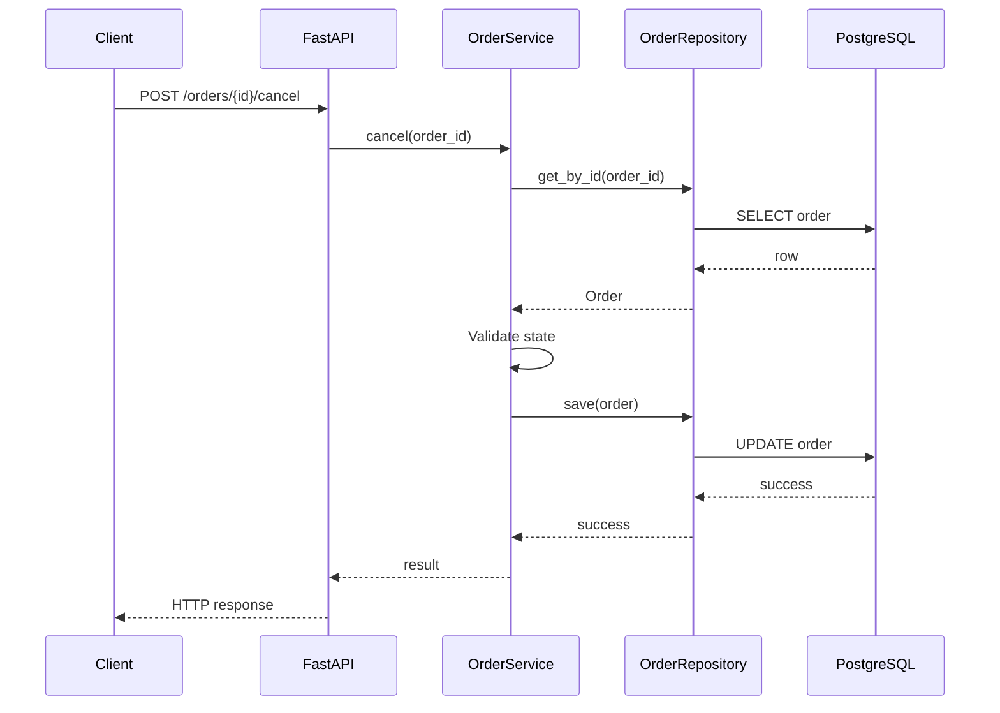

# 27- Repository Pattern

## Overview

The Repository Pattern provides an application-facing abstraction over data persistence.

Instead of allowing application services to depend directly on PostgreSQL, Django ORM, SQLAlchemy, or another persistence mechanism, a repository exposes operations expressed in terms of the application's data and use cases.

```text
HTTP / CLI / Worker
        ↓
   Service Layer
        ↓
    Repository
        ↓
 PostgreSQL / ORM
```

For example:

```python
order = await order_repository.get_by_id(order_id)
```

The service cares that an order can be retrieved. It does not necessarily need to know whether the implementation uses:

- PostgreSQL;
- SQLAlchemy;
- Django ORM;
- raw SQL;
- another database;
- a test fake.

The Repository Pattern is useful when persistence logic is sufficiently complex that separating it from application behavior improves maintainability, testing, transaction management, or architectural boundaries.

It is **not** a requirement for every Python application. Adding repositories mechanically around trivial ORM calls can create unnecessary abstraction.

---

## Why the Repository Pattern Exists

Without a repository boundary, application services may become coupled directly to persistence:

```python
class OrderService:
    async def cancel(self, order_id: int) -> None:
        order = await session.get(OrderModel, order_id)

        if order is None:
            raise OrderNotFound()

        if order.status != "pending":
            raise InvalidOrderState()

        order.status = "cancelled"
        await session.commit()
```

This combines:

- business rules;
- ORM operations;
- persistence lifecycle;
- transaction handling.

A repository can isolate persistence concerns:

```text
OrderService
    ↓
OrderRepository
    ↓
SQLAlchemy
    ↓
PostgreSQL
```

The service can focus on:

```text
Should the order be cancelled?
```

while the repository focuses on:

```text
How is the order loaded and persisted?
```

---

## Repository Responsibilities

A repository typically owns persistence operations such as:

- loading entities;
- querying aggregates;
- inserting records;
- updating records;
- deleting records;
- persistence-specific filtering;
- joins and eager-loading strategies;
- database-specific query optimization;
- mapping persistence models to application/domain models.

A repository should generally not own:

- HTTP behavior;
- business workflows;
- authentication;
- authorization policy unrelated to persistence;
- sending emails;
- charging payment providers;
- publishing unrelated external events;
- orchestrating multiple business capabilities.

A repository is a **data-access boundary**, not a general-purpose service.

---

## Service vs Repository

The distinction is fundamental:

| Concern | Service | Repository |
|---|---|---|
| Business workflow | Yes | No |
| Business state transitions | Usually | No |
| Persistence | Through repository | Yes |
| SQL | Usually no | Yes |
| ORM operations | Usually no | Yes |
| External API calls | Through gateway | No |
| Transaction coordination | Often | Participates |
| HTTP status codes | No | No |
| Domain rules | Coordinates/enforces | Should not own them |
| Database-specific optimization | No | Yes |

A useful mental model is:

```text
Service
→ decides what should happen

Repository
→ knows how application data is persisted
```

---

## Repository and Data Mapper

Repositories are often confused with ORMs.

An ORM such as SQLAlchemy or Django ORM maps database structures to Python objects.

A repository provides an application-facing persistence interface.

```text
Application
    ↓
Repository
    ↓
ORM
    ↓
Database
```

The ORM is an implementation technology.

The repository is an architectural boundary.

---

## Repository vs DAO

A Data Access Object (DAO) generally represents low-level data-access operations.

A repository usually provides a higher-level abstraction aligned with domain/application concepts.

For example:

```python
repository.get_pending_orders()
```

is application-oriented.

Whereas:

```python
dao.execute("SELECT ...")
```

is lower-level data access.

The terms overlap in real codebases, but repositories generally provide a more meaningful application boundary.

---

## Repository Interfaces

Python can define a repository contract using `Protocol`:

```python
from typing import Protocol


class OrderRepository(Protocol):
    async def get_by_id(
        self,
        order_id: int,
    ) -> "Order | None":
        ...

    async def save(self, order: "Order") -> None:
        ...
```

The service depends on the protocol:

```python
class OrderService:
    def __init__(
        self,
        repository: OrderRepository,
    ) -> None:
        self.repository = repository
```

A concrete implementation can use PostgreSQL.

---

## Concrete Repository

A SQLAlchemy implementation might look conceptually like:

```python
class SqlAlchemyOrderRepository:
    def __init__(self, session: AsyncSession) -> None:
        self.session = session

    async def get_by_id(
        self,
        order_id: int,
    ) -> Order | None:
        model = await self.session.get(OrderModel, order_id)

        if model is None:
            return None

        return to_domain_order(model)

    async def save(self, order: Order) -> None:
        model = to_persistence_model(order)
        self.session.add(model)
```

The repository handles persistence mechanics while the service remains independent of SQLAlchemy-specific APIs.

---

## Domain Models vs Persistence Models

A mature architecture may distinguish:

```text
Domain Model
    ↓
Repository
    ↓
Persistence Model
    ↓
PostgreSQL
```

For example:

```python
@dataclass
class Order:
    id: int
    customer_id: int
    status: OrderStatus
```

and:

```python
class OrderModel(Base):
    __tablename__ = "orders"

    id = mapped_column(Integer, primary_key=True)
    customer_id = mapped_column(Integer, nullable=False)
    status = mapped_column(String, nullable=False)
```

The repository maps between them.

This creates stronger isolation but also adds mapping code.

---

## When to Separate Models

Separate domain and persistence models when:

- domain behavior is substantial;
- persistence structure differs significantly from domain structure;
- multiple persistence mechanisms exist;
- database concerns should not leak into the domain;
- long-term architectural independence matters.

Keeping one ORM model can be perfectly reasonable when:

- the application is CRUD-heavy;
- domain logic is simple;
- Django's ORM model already serves as the application model;
- the mapping overhead provides little value.

Do not separate models purely because an architecture diagram says so.

---

## Repository and Aggregate Boundaries

In Domain-Driven Design, repositories often correspond to aggregate roots.

For example:

```text
Order
 ├── OrderItem
 └── Shipment
```

may form an aggregate.

The repository can expose:

```python
order = await order_repository.get(order_id)
```

rather than exposing independent persistence operations for every internal object.

This helps preserve aggregate invariants.

---

## Aggregate Root

An aggregate root is the boundary through which changes to an aggregate are coordinated.

For example:

```text
Order
 ├── OrderItem
 ├── OrderItem
 └── Shipment
```

The application should generally modify the aggregate through:

```python
order.add_item(...)
order.cancel()
order.ship(...)
```

rather than independently mutating:

```text
OrderItem
Shipment
Order
```

through unrelated repositories.

This is a DDD-specific use of repositories, not a requirement for all Python applications.

---

## Repository Methods Should Express Intent

Prefer:

```python
await repository.get_pending_by_customer(customer_id)
```

when that query has meaningful application semantics.

Avoid exposing a generic query language everywhere:

```python
await repository.find(
    filters={
        "status": "pending",
        "customer_id": customer_id,
    }
)
```

Generic repositories can become difficult to understand and can leak persistence concepts into application code.

---

## Query-Specific Repositories

Complex applications often need specialized query methods:

```python
class OrderRepository(Protocol):
    async def get_by_id(self, order_id: int) -> Order | None:
        ...

    async def list_pending(
        self,
        customer_id: int,
    ) -> list[Order]:
        ...

    async def count_active(
        self,
        customer_id: int,
    ) -> int:
        ...
```

This makes important query behavior explicit.

It also gives the implementation freedom to optimize the underlying SQL.

---

## Repositories Should Not Be Generic CRUD Wrappers

A common anti-pattern is:

```python
class GenericRepository[T]:
    async def create(...)
    async def get(...)
    async def update(...)
    async def delete(...)
```

followed by:

```text
UserRepository(GenericRepository)
OrderRepository(GenericRepository)
PaymentRepository(GenericRepository)
```

This can hide important differences in:

- query semantics;
- consistency requirements;
- transaction boundaries;
- locking;
- authorization;
- aggregate boundaries;
- performance.

Use generic infrastructure only where the underlying semantics are genuinely shared.

---

## Repository and Transactions

Repositories usually participate in transactions rather than independently owning them.

Prefer:

```text
Service
  ↓
Transaction
  ├── OrderRepository
  ├── InventoryRepository
  └── PaymentRepository
```

rather than:

```text
OrderRepository
  → commit()

InventoryRepository
  → commit()

PaymentRepository
  → commit()
```

Independent commits can make multi-step operations impossible to roll back atomically.

---

## Unit of Work

A Unit of Work can coordinate multiple repositories:

```text
UnitOfWork
 ├── orders
 ├── inventory
 └── payments
       ↓
 PostgreSQL transaction
```

Example:

```python
async with unit_of_work:
    order = await unit_of_work.orders.get_by_id(order_id)
    inventory = await unit_of_work.inventory.get(product_id)

    order.reserve()
    inventory.decrement()

    await unit_of_work.commit()
```

This can be useful when transaction coordination is a recurring architectural concern.

Do not add a Unit of Work abstraction if the existing database abstraction already provides a clear transaction boundary.

---

## Repository and Database Constraints

Repositories do not replace database constraints.

For example:

```sql
CREATE UNIQUE INDEX users_email_unique
ON users (email);
```

The database must enforce uniqueness because concurrent requests can race.

The repository can translate:

```text
UniqueViolation
```

into an application-level exception:

```text
EmailAlreadyRegistered
```

but it should not rely on:

```python
if not await repository.exists_by_email(email):
    await repository.create(...)
```

as the sole concurrency mechanism.

---

## Atomic Operations

Repositories are a good place to encapsulate atomic persistence operations.

For example:

```sql
UPDATE inventory
SET available = available - 1
WHERE product_id = $1
  AND available > 0;
```

The repository can expose:

```python
reserved = await repository.reserve_item(product_id)

if not reserved:
    raise InsufficientInventory()
```

This is safer than:

```text
SELECT available
↓
Python check
↓
UPDATE
```

because the latter creates a race window.

---

## Repository and Locking

Database locking is persistence-specific and therefore generally belongs inside the repository or data-access implementation.

For example:

```text
Service
 ↓
repository.get_for_update(order_id)
 ↓
SELECT ... FOR UPDATE
```

The service understands that exclusive access is needed.

The repository knows how PostgreSQL implements it.

---

## Repository and Optimistic Concurrency

A repository can encapsulate version-aware updates:

```sql
UPDATE orders
SET status = $1,
    version = version + 1
WHERE id = $2
  AND version = $3;
```

The repository can return whether the update succeeded.

The service then interprets:

```text
updated = false
    ↓
ConcurrentModification
```

This keeps SQL-specific optimistic locking mechanics out of the application layer.

---

## Repository and Pagination

Repositories should provide pagination semantics deliberately.

Offset pagination:

```python
await repository.list(
    limit=50,
    offset=1000,
)
```

can become expensive for large datasets.

Keyset pagination:

```python
await repository.list_after(
    cursor=last_order_id,
    limit=50,
)
```

can provide more stable performance for large ordered datasets.

The repository is an appropriate place to implement the underlying SQL strategy.

---

## Repository and Filtering

Avoid passing arbitrary user input directly into SQL.

For example:

```python
await repository.list(
    sort_by=request.sort_by,
)
```

must not translate blindly into:

```sql
ORDER BY {sort_by}
```

Column identifiers cannot generally be parameterized like values.

Use an allowlist:

```python
SORT_COLUMNS = {
    "created_at": OrderModel.created_at,
    "total": OrderModel.total,
}
```

The repository or application validation layer should ensure only approved fields are accepted.

---

## Repository and N+1 Queries

Repositories can hide query complexity, which makes N+1 bugs easier to create.

For example:

```python
orders = await repository.list()

for order in orders:
    customer = await customer_repository.get_by_id(order.customer_id)
```

can create:

```text
1 + N database queries
```

The repository should provide suitable query methods or loading strategies:

```python
orders = await repository.list_with_customers()
```

or:

```text
SELECT orders ...
JOIN customers ...
```

The correct solution depends on access patterns and data volume.

---

## Eager Loading

ORM repositories may use eager loading to avoid repeated queries.

For example, SQLAlchemy may use:

```python
select(OrderModel).options(
    selectinload(OrderModel.items)
)
```

The exact strategy depends on relationship cardinality and query requirements.

Possible strategies include:

- joined loading;
- select-in loading;
- explicit batch queries.

Do not assume eager loading is always faster. Large joins can multiply rows and increase memory usage.

---

## Selecting Required Columns

Repositories should avoid unnecessarily materializing large records.

Instead of:

```sql
SELECT *
FROM orders;
```

a query might need only:

```sql
SELECT id, status, total
FROM orders;
```

This reduces:

- network transfer;
- database work;
- ORM object construction;
- Python memory usage.

Repository design can make efficient query behavior easier to enforce.

---

## Repository and Read Models

Not every query needs a full domain entity.

A reporting query might return:

```python
@dataclass(frozen=True)
class OrderSummary:
    order_id: int
    customer_name: str
    total: int
```

The repository can provide:

```python
async def get_order_summary(
    self,
    order_id: int,
) -> OrderSummary | None:
    ...
```

This is often more efficient than loading a complete aggregate.

---

## Repository and CQRS

A repository can support separate command and query models:

```text
Commands
   ↓
Write Repository
   ↓
PostgreSQL

Queries
   ↓
Read Repository
   ↓
Optimized SQL / Read Model
```

Full CQRS is not required.

Even a simple separation between:

```text
domain repositories
query services/read repositories
```

can be useful for reporting-heavy applications.

---

## Repository and Caching

Caching can sit around or inside persistence access.

For example:

```text
Service
 ↓
Cached Repository
 ↓ cache miss
Postgres Repository
 ↓
PostgreSQL
```

The cache should not silently change correctness semantics.

Be explicit about:

- TTL;
- invalidation;
- stale reads;
- cache failures;
- serialization;
- consistency.

Redis should normally be treated as a performance layer unless the application's data model deliberately makes it authoritative.

---

## Repository Decorators

A repository can be wrapped with infrastructure behavior:

```text
OrderRepository
      ↑
CachedOrderRepository
      ↑
ObservedOrderRepository
```

For example:

```python
class CachedOrderRepository:
    def __init__(
        self,
        repository: OrderRepository,
        cache: Cache,
    ) -> None:
        self.repository = repository
        self.cache = cache
```

This can separate caching from core persistence logic.

Avoid excessive decorator layers that make debugging difficult.

---

## Repository and Observability

Repository operations are useful observability boundaries.

Useful measurements include:

- query latency;
- query count;
- error rate;
- rows returned;
- transaction duration;
- lock wait;
- connection pool wait.

Example structured event:

```text
repository=OrderRepository
operation=get_pending
duration_ms=14
rows=42
```

Avoid logging full SQL with sensitive parameters indiscriminately.

Use database-level query statistics and tracing where appropriate.

---

## Repository and Database Tracing

A request may flow through:

```text
HTTP
 ↓
OrderService
 ↓
OrderRepository
 ↓
SQLAlchemy
 ↓
PostgreSQL
```

Tracing should connect the repository operation with the database query.

This makes it possible to distinguish:

```text
service CPU time
database execution time
connection pool wait
application processing
```

during performance investigations.

---

## Repository and Connection Pooling

Repositories should not generally create their own database pool per operation.

Bad:

```text
repository call
 ↓
create engine
 ↓
create pool
 ↓
execute query
 ↓
destroy pool
```

Prefer:

```text
Process
 ↓
Database engine + pool
 ↓
Repository
 ↓
request transaction/session
```

Pool ownership should remain at the appropriate application/process lifecycle.

---

## Repository and Async Python

Async repositories should avoid blocking operations:

```python
async def get_by_id(...):
    ...
```

but `async` alone does not guarantee non-blocking behavior.

Avoid synchronous database drivers inside the asyncio event loop.

Use appropriate async-compatible drivers or run unavoidable blocking operations in controlled executors.

---

## Repository and Django ORM

Django often does not require a repository abstraction for simple applications.

Direct ORM usage can be reasonable:

```python
order = await Order.objects.aget(pk=order_id)
```

For complex applications, a repository can isolate persistence:

```text
OrderService
    ↓
OrderRepository
    ↓
Django ORM
```

Do not introduce repositories solely to hide every Django ORM call.

The Django ORM is already a mature data-access abstraction.

---

## Repository and SQLAlchemy

SQLAlchemy provides substantial data-access capabilities.

A repository can encapsulate:

- query construction;
- ORM mapping;
- eager loading;
- transactions;
- locking;
- database-specific optimizations.

Example:

```python
class SqlAlchemyOrderRepository:
    def __init__(self, session: AsyncSession):
        self.session = session

    async def get_pending(
        self,
        customer_id: int,
    ) -> list[Order]:
        statement = (
            select(OrderModel)
            .where(
                OrderModel.customer_id == customer_id,
                OrderModel.status == "pending",
            )
            .order_by(OrderModel.created_at.desc())
        )

        result = await self.session.scalars(statement)
        return [
            to_domain_order(model)
            for model in result
        ]
```

The repository owns SQLAlchemy-specific details.

---

## Repository and Raw SQL

Repositories can also use raw SQL when it provides meaningful benefits.

For example:

```python
async def reserve_inventory(
    self,
    product_id: int,
) -> bool:
    result = await self.session.execute(
        text(
            """
            UPDATE inventory
            SET available = available - 1
            WHERE product_id = :product_id
              AND available > 0
            """
        ),
        {"product_id": product_id},
    )

    return result.rowcount == 1
```

Raw SQL is not inherently bad.

The important requirements are:

- parameterize values;
- validate dynamic identifiers;
- understand transaction behavior;
- test against real PostgreSQL;
- monitor query performance.

---

## Repository and Database-Specific Features

A repository can hide PostgreSQL-specific features when appropriate:

- `ON CONFLICT`;
- `RETURNING`;
- partial indexes;
- JSONB operators;
- `FOR UPDATE`;
- `SKIP LOCKED`;
- PostgreSQL-specific functions;
- advisory locks.

For example:

```sql
INSERT INTO orders (external_id, customer_id)
VALUES ($1, $2)
ON CONFLICT (external_id)
DO NOTHING
RETURNING id;
```

The application can receive:

```text
created
or
already exists
```

without embedding PostgreSQL syntax into business logic.

---

## Repository and Portability

Repositories can improve portability, but complete database portability is rarely automatic.

PostgreSQL-specific semantics may still affect:

- isolation;
- locking;
- JSON behavior;
- indexes;
- SQL functions;
- transaction behavior;
- performance.

Do not promise that introducing a repository makes the application database-independent.

---

## Repository and Testing

Repositories provide a useful test boundary.

Unit tests can substitute:

```text
OrderRepository
    ↓
FakeOrderRepository
```

Example:

```python
class FakeOrderRepository:
    def __init__(self, orders: list[Order]) -> None:
        self.orders = {
            order.id: order
            for order in orders
        }

    async def get_by_id(
        self,
        order_id: int,
    ) -> Order | None:
        return self.orders.get(order_id)

    async def save(self, order: Order) -> None:
        self.orders[order.id] = order
```

This lets service tests focus on application behavior.

---

## Repository Integration Tests

Repository tests should usually run against the real database engine used in production.

For PostgreSQL repositories, test with PostgreSQL rather than relying only on:

```text
SQLite
```

because SQL semantics can differ significantly.

Integration tests should cover:

- query correctness;
- constraints;
- transactions;
- locking;
- pagination;
- unique conflicts;
- null behavior;
- indexes where performance matters;
- database-specific features.

---

## Repository Contract Tests

If multiple implementations satisfy the same repository protocol:

```text
OrderRepository
 ├── PostgreSQL
 ├── InMemory
 └── Test implementation
```

contract tests can verify common semantics.

However, an in-memory implementation should not be assumed to reproduce PostgreSQL behavior exactly.

Use it for service tests, not as proof that production persistence works.

---

## In-Memory Repository Limitations

A fake repository may not reproduce:

- transaction isolation;
- unique constraints;
- database locking;
- query planner behavior;
- serialization anomalies;
- concurrent updates.

Therefore:

```text
Fake repository
→ application unit testing

Real database
→ persistence integration testing
```

Both have different purposes.

---

## Repository and Transactions in Tests

Tests should verify transaction behavior where correctness depends on it.

Important cases include:

```text
BEGIN
 ↓
write A
 ↓
write B fails
 ↓
ROLLBACK
 ↓
A is not persisted
```

Mocking repository calls cannot prove this.

Use integration tests against the actual database.

---

## Repository and Migrations

Repositories depend on database schema contracts.

A schema migration must preserve compatibility during rolling deployments.

For example:

```text
Deploy 1
→ add nullable column

Deploy 2
→ application starts writing column

Deploy 3
→ enforce constraint after backfill
```

This expand-contract strategy reduces deployment coupling.

Repositories should be compatible with the migration sequence used in CI/CD and production.

---

## Repository and Database Performance

Repository abstractions should not hide performance-critical behavior.

For important queries, inspect:

```sql
EXPLAIN (ANALYZE, BUFFERS)
SELECT ...
```

Investigate:

- sequential scans;
- index usage;
- row estimates;
- join strategy;
- sort operations;
- buffer reads;
- execution time.

A repository method such as:

```python
list_recent_orders()
```

can become a production bottleneck if its SQL is inefficient.

---

## Repository and Query Complexity

Repository methods should have known data-access characteristics.

For example:

```text
get_by_id()
→ expected indexed lookup

list_recent(limit=50)
→ bounded result

export_all()
→ potentially millions of rows
```

Do not hide an unbounded database scan behind an innocuous method name.

Large operations may need:

- pagination;
- streaming;
- server-side cursors;
- batching;
- background jobs.

---

## Repository and Streaming

For large datasets:

```text
Repository
 ↓
database cursor
 ↓
batch
 ↓
service/worker
```

may be preferable to:

```python
rows = await repository.get_all()
```

which can materialize the entire result set.

Memory-efficient repository APIs should make bounded processing possible.

---

## Repository and Background Jobs

Celery workers can use repositories just like API requests:

```text
Celery Task
    ↓
Service
    ↓
Repository
    ↓
PostgreSQL
```

A worker processing thousands of records should avoid keeping:

- a transaction open indefinitely;
- millions of ORM objects in memory;
- database connections checked out unnecessarily.

Use bounded batches and explicit transaction boundaries.

---

## Repository and Kafka Consumers

Kafka consumers can invoke services that use repositories:

```text
Kafka
 ↓
Consumer
 ↓
Service
 ↓
Repository
 ↓
PostgreSQL
```

A consumer should generally commit/acknowledge the message only after the required database work is durably complete.

For stronger database/message consistency, use appropriate transactional or outbox patterns.

---

## Repository and Redis

Repositories can target Redis when Redis is the appropriate persistence mechanism:

```text
SessionRepository
      ↓
Redis
```

The repository abstraction can hide:

- key naming;
- serialization;
- TTL;
- Redis commands;
- connection details.

However, do not pretend Redis and PostgreSQL have identical transactional or consistency semantics.

The interface should represent behavior that is valid for the backing store.

---

## Repository and Object Storage

Not all repositories represent relational databases.

For example:

```text
FileRepository
    ↓
S3
```

could expose:

```python
class DocumentRepository(Protocol):
    async def get(self, document_id: str) -> bytes:
        ...

    async def put(
        self,
        document_id: str,
        content: bytes,
    ) -> None:
        ...
```

For large files, prefer streaming or object references rather than loading the entire object into memory.

---

## Repository and External APIs

Repositories are generally intended for persistence.

Do not use:

```text
PaymentRepository
    ↓
Stripe API
```

merely because the API stores or retrieves state.

An external API integration is usually clearer as a gateway/client:

```text
PaymentService
    ↓
PaymentGateway
    ↓
Payment API
```

Repositories and gateways represent different architectural concepts.

---

## Repository vs Gateway

| Component | Represents |
|---|---|
| Repository | Application data persistence |
| Gateway | External service/system |
| HTTP Client | Transport-level communication |
| Service | Business/application workflow |
| Controller | Delivery mechanism |

Example:

```text
OrderService
 ├── OrderRepository
 │      ↓
 │   PostgreSQL
 │
 └── PaymentGateway
        ↓
     Payment API
```

This distinction prevents external API concerns from being disguised as persistence.

---

## Repository and Dependency Injection

Repositories work naturally with dependency injection:

```python
class OrderService:
    def __init__(
        self,
        repository: OrderRepository,
    ) -> None:
        self.repository = repository
```

The composition root chooses:

```text
Production
→ SqlAlchemyOrderRepository

Unit tests
→ FakeOrderRepository
```

This keeps the service independent from infrastructure construction.

---

## Repository and Service Layer Together

A typical request flow is:



The service owns the workflow.

The repository owns persistence.

The API owns HTTP semantics.

---

## Repository Boundaries in a Production Application

A practical project structure might be:

```text
app/
├── api/
│   └── routes/
├── application/
│   └── services/
├── domain/
│   ├── models/
│   └── protocols/
├── infrastructure/
│   ├── database/
│   │   ├── models/
│   │   └── repositories/
│   ├── redis/
│   └── external/
└── main.py
```

For smaller applications, a simpler structure is preferable:

```text
app/
├── api/
├── services/
├── repositories/
├── models/
└── main.py
```

Architecture should scale with actual complexity.

---

## Repository Naming

Prefer names that describe the data boundary:

```text
OrderRepository
UserRepository
InvoiceRepository
SessionRepository
```

For specialized persistence behavior:

```text
OrderReadRepository
OrderWriteRepository
OrderSearchRepository
```

when the separation is justified.

Avoid vague names:

```text
DataManager
DatabaseHelper
StorageUtils
RepositoryManager
```

---

## Repository Method Naming

Good names communicate query semantics:

```text
get_by_id
get_by_external_id
list_pending
find_expiring
count_active
reserve
mark_processed
```

Avoid ambiguous methods such as:

```text
process()
handle()
fetch_data()
do_query()
```

Method names should help reviewers understand persistence behavior.

---

## Returning ORM Objects vs Domain Objects

There are three common approaches.

| Approach | Benefit | Cost |
|---|---|---|
| Return ORM models | Simple | ORM leaks upward |
| Return domain models | Strong separation | Mapping overhead |
| Return DTO/read models | Efficient queries | More model types |

Choose based on application complexity.

For CRUD-heavy Django applications, returning ORM models can be pragmatic.

For domain-heavy systems, domain models often provide stronger boundaries.

---

## Repository Mapping

If domain and persistence models are separate:

```python
def to_domain(model: OrderModel) -> Order:
    return Order(
        id=model.id,
        customer_id=model.customer_id,
        status=OrderStatus(model.status),
    )
```

and:

```python
def to_model(order: Order) -> OrderModel:
    return OrderModel(
        id=order.id,
        customer_id=order.customer_id,
        status=order.status.value,
    )
```

Mapping code should remain predictable and well tested.

Avoid embedding substantial business logic inside mapping functions.

---

## Repository and Serialization

Repositories should generally not return transport-specific JSON:

```python
return {"id": order.id, "status": order.status}
```

Instead return:

```text
domain model
application DTO
read model
```

The API layer can serialize it.

This keeps persistence independent from HTTP representation.

---

## Repository and Security

Repositories should enforce appropriate data-access boundaries.

For example, in a multi-tenant system:

```python
await repository.get_by_id(
    order_id=order_id,
    tenant_id=tenant_id,
)
```

can ensure the query itself is tenant-scoped.

Do not load arbitrary records and rely only on a later application check when database-level filtering can prevent accidental cross-tenant access.

Where appropriate, combine application isolation with PostgreSQL row-level security or other database-level controls.

---

## Repository and Authorization

Repositories should not generally contain business authorization policy:

```python
if user.is_admin:
    ...
```

But repository queries may enforce structural isolation:

```text
tenant_id
organization_id
account_id
```

A service or policy component can determine whether the actor is allowed to operate on that resource.

The repository ensures the requested data boundary is respected.

---

## Repository and Sensitive Data

Repositories are often closest to sensitive data.

Be careful about:

- selecting unnecessary columns;
- logging query parameters;
- returning secrets;
- serializing internal fields;
- exposing database metadata.

Use least-privilege database roles and select only required data.

---

## Repository and High Availability

Repositories should tolerate expected infrastructure failures.

For PostgreSQL:

```text
Application
 ↓
Connection Pool
 ↓
Primary
```

A failover architecture may involve:

```text
Application
 ↓
Database endpoint
 ↓
Primary / standby
```

The repository should not implement arbitrary retry behavior that can duplicate non-idempotent operations.

Connection and transaction failure semantics must be understood before retrying.

---

## Repository and Retries

Retrying database operations is not always safe.

Safe-ish candidates may include certain transient connection failures for operations whose transaction did not execute.

Dangerous:

```text
INSERT
 ↓
network timeout
 ↓
client does not know whether INSERT committed
 ↓
blind retry
```

The operation may have succeeded.

Use database constraints, idempotency keys, transactional semantics, and carefully classified retry policies.

---

## Repository and Disaster Recovery

Repositories depend on the durability and recovery characteristics of their backing stores.

For PostgreSQL, production planning should include:

- automated backups;
- point-in-time recovery;
- replication;
- restore testing;
- migration compatibility;
- recovery objectives.

A repository abstraction does not provide disaster recovery.

The persistence platform remains responsible for durable storage and recovery mechanisms.

---

## Repository and Scalability

Repository performance affects application throughput directly.

At scale, consider:

```text
query latency
connection pool capacity
database CPU
IOPS
locks
replication lag
result size
query frequency
```

Scaling the Python service horizontally can increase database load:

```text
10 pods
×
4 workers
×
pool size 10
=
up to ~400 connections
```

before accounting for overflow or other clients.

Repository design and connection-pool configuration must therefore be considered together.

---

## Repository and Read Replicas

Some read repositories can target replicas:

```text
Write Repository
    ↓
Primary

Read Repository
    ↓
Replica
```

But replicas can be stale.

Do not send read-after-write operations to replicas unless the consistency model permits it.

A service may need:

```text
strong read
→ primary

eventual read
→ replica
```

depending on the operation.

---

## Repository and Caching Strategy

A repository can be combined with Redis:

```text
Service
 ↓
Cached Repository
 ├── Redis
 └── PostgreSQL
```

But caching repository results introduces consistency requirements.

For write-heavy or correctness-sensitive operations, database state should remain authoritative unless the architecture explicitly defines otherwise.

---

## Repository and Background Processing

Large repository operations should be bounded:

```text
SELECT 1000 rows
 ↓
process
 ↓
commit
 ↓
next 1000
```

Avoid:

```python
rows = await repository.get_all()
```

for unbounded production datasets.

This reduces:

- Python memory pressure;
- database transaction duration;
- connection occupancy;
- worker instability.

---

## Common Mistakes

### Creating a Generic Repository for Everything

Generic CRUD repositories often hide domain-specific query and consistency requirements.

Use explicit repositories where persistence behavior is meaningful.

### Putting Business Logic in Repositories

Avoid:

```python
repository.cancel_order_and_charge_payment()
```

Persistence and business orchestration are separate concerns.

### Committing Inside Every Repository Method

This makes multi-repository transactions difficult.

Prefer transaction ownership at the application/use-case boundary.

### Returning HTTP Responses

Repositories should not return:

```python
JSONResponse(...)
```

or framework-specific response objects.

Return application data.

### Returning Raw ORM Objects Everywhere

This couples application logic to the persistence implementation.

Whether that coupling is acceptable depends on application complexity.

### Using SQLite as a PostgreSQL Substitute

Repository tests that pass on SQLite may fail on PostgreSQL because of differences in:

- SQL behavior;
- concurrency;
- locking;
- types;
- constraints;
- indexes.

Test PostgreSQL-specific behavior against PostgreSQL.

### Hiding Expensive Queries

A method named:

```python
get_all_orders()
```

may execute a huge query.

Repository APIs should make expensive operations obvious and preferably bounded.

### N+1 Queries

Convenient repository methods can accidentally generate one query per record.

Measure query counts and use batch/eager-loading strategies.

### Retrying Non-Idempotent Writes

A timeout does not prove that the write failed.

Retry semantics must account for ambiguous commit outcomes.

### Ignoring Tenant Boundaries

Loading by global ID without tenant scoping can create cross-tenant data exposure.

### Treating Redis Like PostgreSQL

Redis and PostgreSQL have different persistence, consistency, query, and transaction semantics.

Do not abstract away meaningful behavioral differences.

---

## Production Pitfalls

### Repository Becomes a God Object

A single repository containing every query for every entity becomes difficult to maintain.

Split repositories by meaningful data boundaries.

### Repository Becomes a Query Dump

Hundreds of nearly identical methods can indicate poor domain/query organization.

Group methods around actual application access patterns.

### ORM Leakage

If services depend heavily on:

```text
SQLAlchemy Session
Django QuerySet
ORM relationship internals
```

the repository boundary may not be providing useful isolation.

### Hidden Transactions

If repository methods silently open and commit transactions, callers may misunderstand atomicity.

Make transaction ownership explicit.

### Hidden N+1 Behavior

A repository method that lazily loads relationships can cause unexpected query amplification.

Document and test loading behavior for important paths.

### Large Result Materialization

Returning millions of ORM objects can exhaust worker memory.

Use pagination, streaming, or batch processing.

### Incorrect Pool Usage

Creating engines or pools inside repository constructors per request can exhaust database connections.

Repositories should receive appropriately scoped database resources.

### Over-Abstraction

A repository around one trivial ORM call may add no meaningful value.

Prefer direct ORM usage when the abstraction does not improve the architecture.

---

## Repository Decision Framework

Use a repository when one or more of these are true:

- persistence logic is complex;
- multiple services share persistence behavior;
- domain logic should be isolated from ORM details;
- database-specific query optimization needs a clear boundary;
- unit tests benefit from replacing persistence;
- multiple persistence implementations genuinely exist;
- aggregate boundaries need explicit persistence semantics.

Direct ORM usage may be better when:

- the application is small;
- CRUD dominates;
- the ORM already provides a sufficient abstraction;
- there is little domain behavior;
- repository methods would simply mirror ORM methods.

The decision should be based on complexity, not architectural fashion.

---

## Repository vs Direct ORM

| Situation | Recommended approach |
|---|---|
| Simple CRUD Django app | Direct ORM can be sufficient |
| Complex business workflows | Service + repository |
| Heavy domain model | Domain + repository |
| Complex SQL optimization | Repository often useful |
| Reporting/read-heavy system | Specialized read repositories |
| Multiple database implementations | Repository |
| One trivial ORM query | Direct ORM may be better |
| Large legacy system | Introduce boundaries incrementally |

---

## Recommended Architecture

For a moderately complex Python backend:

```text
                     ┌──────────────┐
                     │ FastAPI      │
                     │ Django       │
                     │ CLI / Worker │
                     └──────┬───────┘
                            ↓
                    Application Service
                            ↓
                       Domain Model
                            ↓
                    Repository Protocol
                            ↓
                 ┌──────────┴──────────┐
                 ↓                     ↓
        PostgreSQL Repository      Read Repository
                 ↓                     ↓
            PostgreSQL          Replica / Read DB
```

External systems should normally use gateways:

```text
Application Service
 ├── OrderRepository
 │       ↓
 │   PostgreSQL
 │
 ├── PaymentGateway
 │       ↓
 │   Payment API
 │
 └── EventPublisher
         ↓
       Kafka
```

This keeps persistence and external integration responsibilities distinct.

---

## Practical End-to-End Example

A service can depend on a repository protocol:

```python
from typing import Protocol


class OrderRepository(Protocol):
    async def get_by_id(
        self,
        order_id: int,
    ) -> "Order | None":
        ...

    async def save(self, order: "Order") -> None:
        ...


class OrderService:
    def __init__(
        self,
        repository: OrderRepository,
    ) -> None:
        self.repository = repository

    async def cancel(self, order_id: int) -> None:
        order = await self.repository.get_by_id(order_id)

        if order is None:
            raise OrderNotFound(order_id)

        order.cancel()

        await self.repository.save(order)
```

Production wiring:

```python
repository = SqlAlchemyOrderRepository(session)
service = OrderService(repository)
```

Test wiring:

```python
repository = FakeOrderRepository(...)
service = OrderService(repository)
```

The service does not change between environments.

---

## Repository Implementation Checklist

When implementing a repository, verify:

- What data boundary does it represent?
- Does the API express application/domain concepts?
- Is the transaction boundary clear?
- Are queries bounded where appropriate?
- Are user-controlled values parameterized?
- Are dynamic SQL identifiers allowlisted?
- Are indexes appropriate?
- Is N+1 behavior controlled?
- Are large result sets streamed or paginated?
- Are database constraints relied upon for concurrency safety?
- Are retries safe?
- Are ORM models leaking unnecessarily?
- Are tenant boundaries enforced?
- Are sensitive fields excluded when unnecessary?
- Are query latency and errors observable?
- Are repository integration tests executed against the production database engine?

---

## Testing Strategy

A practical testing pyramid is:

```text
                 End-to-End
                    /\
                   /  \
          Integration Tests
                 /      \
                /        \
         Service Unit Tests
              /            \
             /              \
      Domain / Pure Logic Tests
```

Repositories should have focused integration tests.

Services can use fake repositories for fast behavioral tests.

The database itself should be tested with the actual production database technology.

---

## Best Practices

- Treat repositories as persistence boundaries, not business-service replacements.
- Model repository interfaces around meaningful application/domain data access.
- Prefer narrow, explicit interfaces over generic CRUD abstractions.
- Keep transaction ownership explicit.
- Do not commit independently inside every repository method when a workflow requires atomicity.
- Use database constraints and atomic SQL for concurrency-safe invariants.
- Keep SQL and ORM-specific details inside repository implementations where a repository boundary exists.
- Avoid leaking HTTP, gRPC, CLI, or framework response objects through repositories.
- Avoid treating external APIs as repositories; use gateways or API clients.
- Use pagination, batching, or streaming for large datasets.
- Prevent N+1 queries through deliberate loading and query design.
- Select only the columns required by the operation.
- Use PostgreSQL-specific features when they materially improve correctness or performance; do not pretend the repository guarantees database portability.
- Test persistence behavior against the actual production database engine.
- Use fakes for service unit tests but do not treat fakes as substitutes for database integration tests.
- Keep repository methods observable through query latency, errors, row counts, and tracing where appropriate.
- Ensure tenant isolation and least-privilege access at appropriate layers.
- Keep database transactions short and avoid holding them during unrelated network calls.
- Coordinate repositories through application services or a Unit of Work when multiple writes must be atomic.
- Avoid introducing repositories when they only add one-to-one wrappers around a mature ORM without providing a meaningful boundary.
- Review repository APIs for hidden query amplification, unbounded result sets, and connection-pool pressure.
- Introduce repository boundaries incrementally when evolving an existing application rather than performing unnecessary architectural rewrites.

---

## Interview Traps

### Is a Repository the Same as an ORM?

No. An ORM maps database structures to application objects. A repository provides an application-facing persistence abstraction and may use an ORM internally.

### Should Every Database Table Have a Repository?

No. Repository boundaries should follow meaningful application or domain access patterns, not automatically mirror database tables.

### Should Repositories Contain Business Logic?

Generally no. Repositories should handle persistence concerns while services and domain objects handle business behavior.

### Should Repositories Commit Transactions?

Not necessarily. For multi-step workflows, transaction ownership usually belongs at the application/use-case boundary.

### Why Use a Repository if SQLAlchemy Already Abstracts SQL?

A repository can isolate application code from ORM-specific APIs, centralize persistence behavior, improve testing boundaries, and make complex query semantics explicit. But if those benefits do not exist, direct SQLAlchemy usage may be simpler.

### Are Repository Fakes Enough for Testing?

No. Fakes are useful for service unit tests, but only real database integration tests can reliably validate SQL, constraints, transactions, locking, and database-specific behavior.

### Can a Repository Call Redis?

Yes, if Redis is genuinely the persistence mechanism represented by that repository. But Redis semantics must not be hidden when they materially differ from a relational database.

### Is a Payment API a Repository?

Usually no. An external payment provider is better modeled as a gateway or client because it represents an external system rather than application persistence.

### Does a Repository Guarantee Database Portability?

No. Repository boundaries can reduce coupling, but SQL semantics, locking, transaction behavior, types, indexes, and performance remain database-specific.

### What Is the Most Important Repository Design Question?

> "What persistence behavior does the application need, and what database-specific details should remain behind that boundary?"

## Key Takeaways

- **Repositories isolate persistence concerns:** services express business workflows while repositories encapsulate SQL, ORM behavior, query strategies, and database-specific mechanics.
- **Repository boundaries should be meaningful:** prefer domain/application-oriented methods and narrow interfaces over generic CRUD wrappers that merely mirror an ORM.
- **Transactions and concurrency remain database concerns:** use explicit transaction boundaries, atomic SQL, constraints, and locking or optimistic concurrency where required.
- **Testing requires multiple levels:** fake repositories are valuable for service unit tests, but real PostgreSQL or production-equivalent integration tests are necessary to validate persistence behavior.
- **Do not add repositories mechanically:** direct Django ORM or SQLAlchemy usage can be the better design for simple applications; introduce repositories when they provide real separation, testability, query encapsulation, or architectural value.