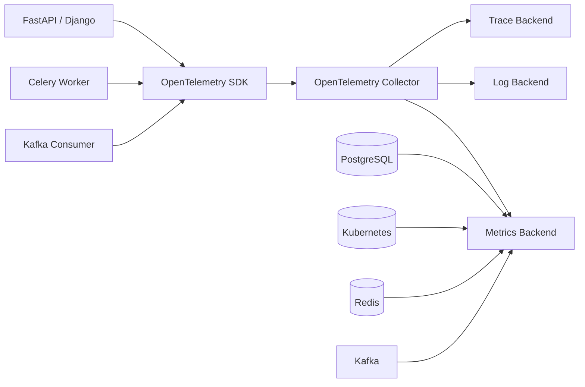

# 29- Observability

## Overview

Observability is the ability to understand a system's internal behavior from the signals it produces.

For backend systems, the primary observability signals are:

- **Logs** — detailed event records.
- **Metrics** — numerical measurements aggregated over time.
- **Traces** — request and operation flows across components.
- **Profiles** — CPU, memory, and runtime behavior.
- **Events** — durable business or operational state changes.

Observability answers questions such as:

```text
Is the service healthy?
Why did latency increase?
Which endpoint is failing?
Which dependency is slow?
Why are database connections exhausted?
Which Kubernetes pod is consuming memory?
Where did this request spend its time?
Is the problem isolated to one tenant, region, or deployment?
```

Monitoring usually asks:

> "Is something wrong?"

Observability enables deeper questions:

> "What is wrong, where is it happening, why is it happening, and what evidence supports that conclusion?"

A production Python service should be designed so that failures and performance problems can be investigated without attaching a debugger to live instances.

---

## Observability Signals

The traditional three pillars are:

```text
                 Observability
                      │
        ┌─────────────┼─────────────┐
        ↓             ↓             ↓
      Logs         Metrics        Traces
        │             │             │
 detailed events   aggregates   request flow
```

Modern systems often add:

```text
Profiles
Events
Continuous profiling
Runtime diagnostics
```

Each signal answers different questions.

| Signal | Best for | Example |
|---|---|---|
| Logs | Detailed events | `order_cancelled` |
| Metrics | Trends and alerting | `http_requests_total` |
| Traces | Request causality | API → DB → Redis |
| Profiles | CPU/memory hotspots | Function consuming CPU |
| Events | Durable state changes | `payment_captured` |

No single signal is sufficient for complex production debugging.

---

## Logs

Logs record individual events.

A structured log might contain:

```json
{
  "event": "order_cancelled",
  "order_id": "ord_123",
  "tenant_id": "tenant_42",
  "duration_ms": 18
}
```

Logs are useful for:

- debugging specific requests;
- understanding failures;
- recording operational state transitions;
- investigating unusual behavior;
- correlating application actions.

Python's standard `logging` module provides the basic logging infrastructure.

```python
import logging

logger = logging.getLogger(__name__)


def cancel_order(order_id: str) -> None:
    logger.info(
        "Order cancellation requested",
        extra={
            "event": "order_cancel_requested",
            "order_id": order_id,
        },
    )
```

For production systems, structured logging is generally preferable to unstructured strings because log fields can be indexed and queried reliably.

---

## Metrics

Metrics represent measurements over time.

Common backend metrics include:

```text
request rate
request latency
error rate
CPU utilization
memory usage
database connection utilization
queue depth
cache hit rate
```

Typical metric types include:

| Type | Meaning | Example |
|---|---|---|
| Counter | Monotonically increasing count | HTTP requests |
| Gauge | Current value | Queue depth |
| Histogram | Distribution | Request latency |
| Summary | Statistical distribution | Operation latency |

For latency, histograms are particularly useful because averages can hide tail behavior.

Instead of:

```text
average latency = 100 ms
```

measure:

```text
p50 = 40 ms
p95 = 180 ms
p99 = 800 ms
```

A service can have an excellent average while a meaningful percentage of requests experience severe latency.

---

## Traces

A distributed trace follows a logical operation through multiple components.

For example:

```text
HTTP request
    ↓
FastAPI
    ↓
OrderService
    ↓
PostgreSQL
    ↓
Redis
    ↓
Kafka
```

A trace is composed of spans.

```text
Trace
└── HTTP POST /orders
    ├── authentication
    ├── database query
    ├── Redis lookup
    └── Kafka publish
```

Each span can contain:

- start/end time;
- operation name;
- attributes;
- status;
- exceptions;
- parent/child relationships.

This makes distributed latency and failure propagation easier to diagnose.

---

## Logs vs Metrics vs Traces

| Question | Best signal |
|---|---|
| How many requests failed? | Metric |
| What percentage failed? | Metric |
| Which request failed? | Log |
| Why did this specific request fail? | Log + trace |
| Which dependency is slow? | Trace |
| Has latency increased over time? | Metric |
| Which function consumes CPU? | Profile |
| What business state changed? | Event |
| Are all pods experiencing the problem? | Metrics |
| Did one deployment introduce the problem? | Metrics + traces |

Use signals together rather than forcing one system to answer every question.

---

## OpenTelemetry

OpenTelemetry provides vendor-neutral instrumentation and telemetry APIs for:

- traces;
- metrics;
- logs;
- context propagation.

A common architecture is:

```text
Python Application
      ↓
OpenTelemetry SDK
      ↓
OTel Collector
      ↓
Observability Backend
 ┌────────┼────────┐
 ↓        ↓        ↓
Metrics  Traces   Logs
```

The collector can centralize processing, batching, filtering, sampling, and exporting.

This reduces direct coupling between application code and a specific observability vendor.

---

## Instrumentation

Instrumentation is the code or library support that produces telemetry.

There are two broad approaches:

### Automatic Instrumentation

Framework or library integrations generate telemetry automatically.

Examples include instrumentation for:

- FastAPI;
- Django;
- HTTP clients;
- SQLAlchemy;
- database drivers;
- Redis;
- messaging clients.

### Manual Instrumentation

Business-critical operations may need explicit spans or metrics:

```python
from opentelemetry import trace

tracer = trace.get_tracer(__name__)


async def reserve_inventory(product_id: int) -> None:
    with tracer.start_as_current_span("inventory.reserve") as span:
        span.set_attribute("inventory.product_id", product_id)

        await repository.reserve(product_id)
```

Manual instrumentation should focus on meaningful operations rather than instrumenting every line of code.

---

## Instrumentation Boundaries

Useful instrumentation boundaries often correspond to:

```text
HTTP request
Service method
Database operation
External API call
Cache operation
Queue publish
Queue consumption
Background job
Important business operation
```

For example:

```text
POST /orders
  └── OrderService.create
       ├── inventory.reserve
       ├── payment.authorize
       ├── database.commit
       └── event.publish
```

This gives enough context without creating excessive telemetry.

---

## Request Correlation

A request should have a correlation mechanism.

Common identifiers include:

```text
request_id
trace_id
span_id
```

A trace ID connects related spans across services.

A request ID can provide an application-level identifier useful for log searches.

Do not confuse:

```text
trace_id
```

with:

```text
user_id
```

or:

```text
request_id
```

They serve different purposes.

---

## Context Propagation

Distributed tracing relies on propagating context between services.

Conceptually:

```text
Service A
trace_id=abc
    ↓ HTTP
Service B
trace_id=abc
    ↓ gRPC
Service C
trace_id=abc
```

The receiving service extracts the tracing context and creates a child span.

This allows one user operation to be reconstructed across a microservice architecture.

---

## Python `contextvars`

Python's `contextvars` can store request-local context in asynchronous applications.

Example:

```python
from contextvars import ContextVar

request_id_var: ContextVar[str | None] = ContextVar(
    "request_id",
    default=None,
)
```

Middleware can establish the context:

```python
token = request_id_var.set(request_id)

try:
    await call_next(request)
finally:
    request_id_var.reset(token)
```

This is preferable to global mutable variables for request-scoped context.

---

## Async Context

With `asyncio`, multiple requests can execute within the same thread.

Therefore, this is dangerous:

```python
current_request_id = None
```

because concurrent tasks can overwrite shared state.

Use task-local context such as `contextvars` instead.

However, context propagation should still be tested across:

- task creation;
- thread pools;
- process boundaries;
- background jobs;
- message consumers.

---

## Background Job Correlation

HTTP requests often create asynchronous work:

```text
HTTP request
    ↓
Celery / Kafka
    ↓
Worker
    ↓
Database
```

Correlation should connect the asynchronous work to the initiating operation where useful.

For example:

```text
trace_id=abc123
job_id=job_789
```

A worker log can then reference the job and trace context.

Do not assume tracing automatically crosses every asynchronous messaging boundary correctly; configure explicit propagation where required.

---

## Structured Logging

Production logs should use stable fields.

Example:

```python
logger.info(
    "Order created",
    extra={
        "event": "order_created",
        "order_id": order.id,
        "tenant_id": order.tenant_id,
        "duration_ms": duration_ms,
    },
)
```

Prefer:

```text
event=order_created
```

over parsing:

```text
"Created order successfully after processing customer request"
```

Stable schemas make logs easier to query and aggregate.

---

## Logging Levels

Common Python logging levels are:

| Level | Typical use |
|---|---|
| `DEBUG` | Detailed development diagnostics |
| `INFO` | Normal operational events |
| `WARNING` | Unexpected but recoverable condition |
| `ERROR` | Failed operation |
| `CRITICAL` | Severe system failure |

Do not treat every exception as `CRITICAL`.

Logging severity should reflect operational impact.

---

## Exception Logging

Use exception logging when the traceback is valuable:

```python
try:
    await repository.save(order)
except DatabaseError:
    logger.exception(
        "Failed to persist order",
        extra={
            "event": "order_persistence_failed",
            "order_id": order.id,
        },
    )
    raise
```

Avoid:

```python
logger.error(str(exc))
```

when the traceback is necessary for diagnosis.

Also avoid logging secrets or sensitive payloads from exceptions.

---

## Log Cardinality

Logs can contain high-cardinality values:

```text
request_id
trace_id
order_id
user_id
```

That is often acceptable because logs are designed to represent individual events.

Metrics are different.

Avoid:

```text
http_requests_total{
    user_id="123456"
}
```

because millions of unique label values can create an expensive metric explosion.

A useful rule:

```text
High-cardinality identifier
→ usually log/trace attribute

Low-cardinality category
→ usually metric label
```

---

## Metrics Naming

Metric names should be:

- stable;
- descriptive;
- consistent;
- low-cardinality.

Examples:

```text
http_requests_total
http_request_duration_seconds
database_query_duration_seconds
queue_depth
cache_hits_total
cache_misses_total
```

Avoid embedding dynamic values in metric names:

```text
order_123_latency
customer_987_errors
```

Use labels only for dimensions that are bounded and operationally meaningful.

---

## RED Method

For request-driven services, the RED method is useful:

```text
Rate
Errors
Duration
```

Measure:

```text
request rate
error rate
request latency
```

For example:

```text
HTTP request rate
HTTP 5xx rate
HTTP p50/p95/p99 latency
```

This provides a strong baseline for service health.

---

## USE Method

For infrastructure resources, the USE method focuses on:

```text
Utilization
Saturation
Errors
```

Examples:

```text
CPU utilization
CPU throttling
memory utilization
database connections
connection pool wait
disk utilization
network saturation
```

Together, RED and USE provide useful application and infrastructure perspectives.

---

## Golden Signals

Another widely used service-level framework is:

- latency;
- traffic;
- errors;
- saturation.

These signals help identify whether a service is:

```text
busy
slow
failing
or resource constrained
```

No framework replaces domain-specific metrics, but these are strong starting points.

---

## Business Metrics

Technical metrics do not fully describe system health.

Useful business metrics might include:

```text
orders_created_total
payments_successful_total
payments_failed_total
checkout_conversion_rate
webhook_delivery_success_rate
```

A service can be technically healthy while business operations are failing.

For example:

```text
HTTP 200 rate = 99.9%
Payment success rate = 85%
```

The application may appear healthy from infrastructure metrics while customers experience serious business failure.

---

## Logs vs Business Events

Do not use logs as a durable business event store.

A log:

```text
order_created
```

is an operational record.

A Kafka event or database record may represent:

```text
OrderCreated
```

as a durable integration/business event.

Logs can be lost, sampled, rotated, or retained for limited periods.

Business events often require stronger durability guarantees.

---

## Health Checks

Backend services typically expose health endpoints.

Common distinctions are:

```text
Liveness
→ Is the process functioning?

Readiness
→ Can this instance safely receive traffic?

Startup
→ Has initialization completed?
```

For Kubernetes:

```text
startupProbe
readinessProbe
livenessProbe
```

should have deliberately different purposes.

---

## Liveness vs Readiness

A database outage does not necessarily mean the process is dead.

Bad liveness design:

```text
/database-health fails
        ↓
liveness fails
        ↓
Kubernetes restarts every pod
```

This can create a restart storm.

Often:

```text
readiness fails
→ remove pod from traffic
```

is more appropriate than restarting the process.

Liveness should identify unrecoverable process-level failure, not every dependency failure.

---

## Dependency Health

Health checks should avoid creating excessive load.

A readiness check that executes:

```text
PostgreSQL query
Redis query
Kafka query
External API call
```

every few seconds across hundreds of pods can itself become a dependency load generator.

Use lightweight checks and define carefully what "ready" means.

---

## Startup Observability

Log important lifecycle events:

```text
application_starting
configuration_loaded
database_pool_initialized
application_ready
```

Do not log secret values.

Startup logs are especially useful for:

- deployment failures;
- configuration errors;
- migration problems;
- dependency initialization;
- cold-start investigations.

---

## Graceful Shutdown

Shutdown should be observable:

```text
shutdown_requested
        ↓
stop accepting new work
        ↓
drain active requests/jobs
        ↓
close clients/pools
        ↓
shutdown_complete
```

For Python services, monitor:

- request draining;
- background task cancellation;
- Celery worker shutdown;
- Kafka consumer shutdown;
- DB connection closure.

Forced termination can cause incomplete work and misleading error metrics.

---

## Database Observability

Database-related telemetry should include:

```text
query latency
query errors
connection pool wait
active connections
transaction duration
lock wait
slow queries
replication lag
```

A request trace can show:

```text
HTTP span: 500 ms
 ├── service: 50 ms
 ├── DB query: 420 ms
 └── serialization: 30 ms
```

This immediately narrows the investigation.

---

## Connection Pool Observability

For Python database pools, measure:

```text
pool size
checked-out connections
available connections
pool acquisition wait
connection errors
```

A service can show low CPU while requests queue waiting for database connections.

This is a classic example of why resource saturation must be observable.

---

## Redis Observability

Useful Redis signals include:

```text
command latency
cache hit rate
cache miss rate
memory usage
evictions
connected clients
connection errors
hot keys
```

For a cache:

```text
hit rate = hits / (hits + misses)
```

should be interpreted alongside:

- latency;
- memory pressure;
- correctness;
- eviction behavior.

A high hit rate is not automatically evidence of a healthy cache.

---

## Kafka Observability

Kafka consumers should expose:

```text
consumer lag
records consumed
processing latency
commit failures
rebalance events
error rate
DLQ volume
```

Lag is particularly important:

```text
producer rate > consumer processing rate
        ↓
consumer lag increases
        ↓
event freshness deteriorates
```

Monitor both lag and the age of the oldest unprocessed record where appropriate.

---

## Celery Observability

For background jobs, measure:

```text
queue depth
job age
processing duration
success rate
failure rate
retry count
DLQ/failure count
worker utilization
```

A job can be "successful" eventually while still violating a business SLO because it waited too long in the queue.

Queue age is often more meaningful than queue depth alone.

---

## HTTP Client Observability

For outbound APIs, measure:

```text
request count
latency
timeouts
connection failures
HTTP status classes
retry count
circuit-breaker state
```

Separate:

```text
DNS/connect/TLS
server response
application processing
```

where the client library provides enough detail.

An external API failure should not be indistinguishable from an internal application error.

---

## Error Taxonomy

Not all errors should be counted together.

Distinguish:

```text
4xx client errors
5xx server errors
timeouts
connection failures
dependency failures
validation failures
authentication failures
authorization failures
```

For example:

```text
401 → authentication problem
403 → authorization problem
429 → rate limiting
502/503 → dependency/upstream availability
504 → timeout
```

Metrics should preserve meaningful categories.

---

## Error Budgets and SLOs

Observability should support explicit service objectives.

Example:

```text
Availability SLO:
99.9% successful requests

Latency SLO:
99% of requests < 500 ms
```

An error budget represents the amount of unreliability permitted by the SLO.

Observability provides the measurements required to determine:

```text
Are we meeting the SLO?
How quickly are we consuming the error budget?
Which component is responsible?
```

---

## Alerting

Alerts should represent actionable conditions.

Good:

```text
5xx rate exceeds threshold for 10 minutes
```

Potentially noisy:

```text
one request failed
```

Useful alert categories include:

- high error rate;
- severe latency degradation;
- resource saturation;
- database connection exhaustion;
- queue backlog;
- consumer lag;
- replication lag;
- certificate/credential expiration;
- failed deployments.

Every alert should have an associated response procedure.

---

## Alert Fatigue

Too many alerts cause engineers to ignore alerts.

Avoid alerting on every:

```text
warning
exception
CPU spike
temporary timeout
```

Prefer alerts based on:

```text
user impact
SLO violation
sustained saturation
critical infrastructure failure
```

Use dashboards and logs for lower-severity diagnostic information.

---

## Sampling

High-volume systems can generate enormous telemetry volumes.

Tracing systems may sample traces.

Common strategies include:

```text
head sampling
tail sampling
probabilistic sampling
error-prioritized sampling
```

A useful production strategy may retain:

```text
all or most error traces
sample successful traces
```

while preserving enough representative traffic for performance analysis.

Sampling should not silently remove the evidence required for critical investigations.

---

## Tail Sampling

Tail sampling makes sampling decisions after observing more of a trace.

For example:

```text
Trace begins
 ↓
many spans collected
 ↓
trace contains error / high latency
 ↓
retain full trace
```

This can preserve valuable failure traces while reducing storage costs.

It requires additional infrastructure and buffering.

---

## Observability Cost

Telemetry has real cost.

Costs come from:

- log ingestion;
- log storage;
- trace ingestion;
- metrics cardinality;
- retention;
- network transfer;
- observability platform queries;
- collector infrastructure.

A production system should control:

```text
volume
cardinality
payload size
retention
sampling
```

Do not solve every debugging problem by emitting more telemetry.

---

## High-Cardinality Costs

This is dangerous:

```text
metric{user_id="..."}
metric{order_id="..."}
metric{request_id="..."}
```

Each unique combination can become a distinct time series.

Use:

```text
logs → request_id/order_id/user_id
metrics → bounded dimensions
traces → request/operation context
```

This separation provides detail without exploding metric storage.

---

## Observability Security

Telemetry systems frequently contain sensitive information.

Protect:

- authorization headers;
- cookies;
- API keys;
- database URLs;
- personal information;
- payment information;
- internal topology;
- request payloads.

Use:

- field allowlists;
- redaction;
- access control;
- encryption in transit;
- encryption at rest;
- retention policies.

Observability systems are part of the production security boundary.

---

## Multi-Tenant Observability

Tenant identifiers can be useful:

```text
tenant_id
```

but must be handled carefully.

Use them in logs/traces when operationally necessary.

For metrics, only use tenant labels if tenant cardinality is small and controlled.

Avoid exposing one tenant's sensitive telemetry to another tenant.

Observability access should follow the same authorization principles as application data.

---

## PII and Observability

Avoid collecting personal information unless it is necessary.

Prefer:

```text
user_id=internal_identifier
```

over:

```text
email=user@example.com
phone=...
address=...
```

When identity is necessary for debugging, use stable internal identifiers and strict access controls.

Do not assume observability data is automatically safe because it is "internal."

---

## Observability and GDPR/Privacy

Retention and access policies should account for applicable privacy requirements.

Important controls include:

- data minimization;
- retention limits;
- deletion policies;
- access auditing;
- pseudonymization where appropriate;
- avoiding sensitive payload capture.

Observability should not become an uncontrolled secondary database of customer information.

---

## Performance Overhead

Instrumentation consumes resources.

Potential overhead includes:

```text
CPU
memory
network bandwidth
serialization
disk/storage
lock contention
```

Excessive logging inside hot loops can materially reduce throughput.

Prefer:

```python
logger.debug(
    "Processing order %s",
    order_id,
)
```

rather than eagerly constructing expensive diagnostic strings or serializing huge objects when debug logging is disabled.

---

## Async Logging

Blocking logging can hurt asynchronous applications.

For high-throughput services, consider:

```text
Application
 ↓
QueueHandler
 ↓
Logging worker
 ↓
stdout / collector
```

Avoid making request processing wait on a slow remote logging system.

Containerized applications commonly write logs to stdout/stderr and let the platform handle collection.

---

## Multiprocessing and Workers

Python deployments may have multiple processes:

```text
Kubernetes Pod
├── Worker 1
├── Worker 2
├── Worker 3
└── Worker 4
```

Each process can have separate:

- memory;
- metric state;
- connection pools;
- logging context;
- runtime profiles.

Metrics exporters and process aggregation must be configured appropriately.

Do not assume a metric maintained in one worker automatically represents the entire deployment.

---

## Kubernetes Observability

At Kubernetes scale, correlate:

```text
Application
 ↓
Pod
 ↓
Node
 ↓
Cluster
```

Useful dimensions include:

```text
service
environment
namespace
pod
container
region
deployment version
```

Avoid excessive cardinality such as using arbitrary request IDs as metric dimensions.

Deployment version labels are especially useful for identifying regressions.

---

## Deployment Correlation

A latency increase may correlate with:

```text
version=v1.8.3
```

rather than the entire service.

Record deployment/version metadata in:

- metrics;
- logs;
- traces.

Then investigations can answer:

```text
Did the problem begin after deployment v1.8.3?
```

This is especially useful during rolling deployments.

---

## AWS Observability

AWS deployments can combine application telemetry with infrastructure signals.

Examples include:

```text
CloudWatch
AWS X-Ray
OpenTelemetry
ALB metrics
RDS metrics
ElastiCache metrics
EKS metrics
```

The exact stack depends on the architecture.

The important principle is to correlate application and infrastructure signals rather than operating them as isolated dashboards.

---

## Observability Architecture

A production architecture may look like:



The collector can provide a common control point for:

- batching;
- filtering;
- enrichment;
- sampling;
- routing;
- export.

---

## Request Investigation Workflow

A useful production debugging workflow is:

```text
Alert
 ↓
Check SLO / service metrics
 ↓
Identify affected endpoint/version
 ↓
Inspect latency/error distributions
 ↓
Open representative traces
 ↓
Identify slow/failing dependency
 ↓
Search correlated logs
 ↓
Inspect database/queue/infrastructure metrics
 ↓
Form hypothesis
 ↓
Validate with targeted evidence
```

Avoid starting with thousands of raw log lines.

Begin with aggregate signals, then drill down.

---

## Example Incident

Suppose:

```text
HTTP p95 latency
200 ms → 1.5 s
```

Start with:

```text
request rate
error rate
deployment version
database latency
connection pool wait
```

Suppose traces show:

```text
HTTP request: 1500 ms
 ├── service: 100 ms
 ├── DB: 1300 ms
 └── serialization: 100 ms
```

Then investigate:

```text
database CPU
slow queries
locks
connection count
query plans
transaction duration
```

This is far more efficient than profiling the Python application immediately.

---

## Profiling vs Observability

Observability and profiling answer different questions.

| Tool | Question |
|---|---|
| Metrics | Is the system behaving differently? |
| Logs | What events occurred? |
| Traces | Where did the request spend time? |
| cProfile | Which Python functions consumed CPU? |
| tracemalloc | Where are Python allocations occurring? |
| Database `EXPLAIN` | Why is this query slow? |
| Load testing | How does the system behave under controlled load? |

A trace may tell you:

```text
service CPU = 800 ms
```

A profiler can tell you:

```text
parse_payload() = 500 ms
validate_items() = 250 ms
```

Use the right tool at the right level.

---

## Observability and Performance Optimization

A good optimization loop is:

```text
Measure
 ↓
Locate bottleneck
 ↓
Form hypothesis
 ↓
Change implementation
 ↓
Benchmark
 ↓
Load test
 ↓
Deploy safely
 ↓
Compare production telemetry
```

Do not optimize based solely on intuition.

Observability provides the production feedback loop required to determine whether an optimization actually helped.

---

## Observability and Memory

Memory-related telemetry should distinguish:

```text
RSS
Python allocations
heap/object retention
container memory
```

Useful signals include:

- process RSS;
- container memory usage;
- restart/OOM events;
- allocation snapshots;
- garbage collection behavior.

`tracemalloc` can identify Python allocation sources, but it does not account for all native memory.

Use it alongside infrastructure-level memory metrics.

---

## Observability and Concurrency

Concurrency problems may appear as:

```text
latency spikes
lock wait
queue buildup
event-loop blocking
thread exhaustion
connection pool exhaustion
```

For asyncio applications, monitor event-loop responsiveness where possible.

A single blocking operation can affect many concurrent requests:

```text
blocking function
      ↓
event loop stalls
      ↓
many requests delayed
```

This is a high-impact Python-specific failure mode.

---

## Event-Loop Blocking

A common mistake is calling synchronous blocking code from an async endpoint:

```python
@app.get("/orders")
async def get_orders():
    result = requests.get(...)
    return result.json()
```

The blocking call can stall the event loop.

Use an async-compatible client or explicitly isolate unavoidable blocking work.

Observability should make these problems visible through latency and event-loop metrics/profiling.

---

## Queue and Backpressure Observability

Backpressure should be observable.

For a worker system:

```text
Producer rate
Consumer rate
Queue depth
Queue age
Processing latency
Retry rate
```

If:

```text
producer rate > consumer rate
```

queue depth will eventually grow.

Monitoring only worker CPU may miss the actual customer-impacting problem.

---

## Observability for Retries

Retries can create hidden load amplification.

Track:

```text
requests_total
retries_total
retry_attempts
failed_operations
```

For example:

```text
100 original requests
300 retry attempts
```

may indicate a dependency problem that is much larger than the initial error rate suggests.

Retry metrics should be associated with the dependency and operation.

---

## Observability for Rate Limiting

Track:

```text
rate_limited_requests_total
429 responses
remaining quota where safely available
retry-after behavior
```

For external providers, distinguish:

```text
provider rate limit
application rate limit
database saturation
```

This makes capacity problems easier to identify.

---

## Observability and Caching

Useful cache metrics include:

```text
cache_hits_total
cache_misses_total
cache_errors_total
cache_operation_duration
evictions
```

A sudden drop in hit rate can explain increased database load:

```text
Cache hit rate ↓
      ↓
DB queries ↑
      ↓
DB latency ↑
      ↓
API latency ↑
```

Observability should make these relationships visible.

---

## Observability and Database Load

Application-level request metrics and database metrics should be correlated.

For example:

```text
HTTP latency ↑
       ↓
DB query latency ↑
       ↓
connection pool wait ↑
       ↓
DB CPU ↑
```

This indicates a likely database capacity or query-efficiency problem rather than a Python CPU problem.

---

## Observability and Graceful Degradation

Systems may intentionally degrade:

```text
Redis unavailable
 ↓
serve uncached data

Recommendation API unavailable
 ↓
return checkout without recommendations

Analytics unavailable
 ↓
accept transaction without analytics event
```

Telemetry should distinguish:

```text
successful request
```

from:

```text
successful request with degraded dependency
```

Otherwise important reliability problems can remain invisible.

---

## Synthetic Monitoring

Synthetic checks generate controlled requests against production-like endpoints.

They can detect:

- DNS problems;
- TLS failures;
- routing failures;
- authentication problems;
- API availability;
- end-to-end workflow failures.

Synthetic monitoring complements real-user telemetry.

It should not replace real traffic metrics.

---

## Testing Observability

Observability code should itself be tested where it affects correctness.

Test:

- required fields;
- trace propagation;
- sensitive-data redaction;
- metric labels;
- exception recording;
- request correlation;
- background job correlation.

For example:

```python
def test_authorization_header_is_not_logged():
    ...
```

Security-related telemetry tests are particularly valuable.

---

## Observability During CI/CD

Performance and reliability regressions can be detected before production.

CI can measure:

```text
test duration
query count
benchmark results
memory usage
container startup time
```

Production deployment can compare:

```text
before deployment
vs
after deployment
```

for:

- error rate;
- latency;
- CPU;
- memory;
- database load.

Automated rollback can be appropriate when defined health criteria are violated.

---

## Deployment Health

During a rolling deployment, compare:

```text
old version
new version
```

using:

- error rate;
- latency;
- saturation;
- dependency failures.

If:

```text
v1.8.2 → 0.2% errors
v1.8.3 → 4.8% errors
```

the deployment itself becomes a strong causal signal.

---

## Observability Data Retention

Different signals often require different retention periods.

| Data | Typical consideration |
|---|---|
| High-volume debug logs | Short |
| Application logs | Moderate |
| Metrics | Longer |
| Traces | Sampled/limited |
| Audit logs | Longer and stronger guarantees |
| Business events | Domain-dependent |

Retention should balance:

```text
investigation value
cost
privacy
compliance
security
```

Do not retain everything indefinitely.

---

## Audit Logging

Audit logs differ from ordinary operational logs.

An audit record may require:

- stronger durability;
- restricted access;
- tamper resistance;
- longer retention;
- explicit actor identity;
- precise timestamps.

Examples:

```text
user_permission_changed
production_secret_accessed
admin_role_granted
payment_refunded
```

Do not rely on ordinary application logs when regulatory or security requirements demand stronger audit guarantees.

---

## Observability Data Integrity

Telemetry can be incomplete because of:

- sampling;
- dropped logs;
- collector failures;
- network problems;
- exporter limits;
- application crashes.

Therefore:

```text
absence of telemetry
≠
absence of failure
```

Critical business state should remain in durable systems such as databases or event streams.

---

## Observability Failure Modes

The observability pipeline can fail too.

Consider:

```text
Application
 ↓
Collector unavailable
```

The application should not normally fail all requests merely because telemetry export is unavailable.

Use:

- asynchronous export;
- bounded queues;
- local buffering where appropriate;
- backpressure limits;
- graceful degradation.

Observability should help the system, not become its most fragile dependency.

---

## High Availability of Observability

For critical production environments:

```text
Application replicas
        ↓
Multiple collectors
        ↓
Durable telemetry backend
```

Avoid a single telemetry collector becoming a bottleneck or single point of failure.

The exact HA design depends on the telemetry backend and business requirements.

---

## Disaster Recovery

Observability DR requirements differ from application data DR.

Determine whether you need to preserve:

```text
metrics
logs
traces
audit records
business events
```

with different recovery objectives.

Audit and security telemetry may require stronger retention and recovery guarantees than ordinary debug logs.

---

## Operational Dashboard

A practical service dashboard might include:

```text
Traffic
 ├── requests/sec
 └── requests by endpoint

Reliability
 ├── error rate
 └── availability/SLO

Latency
 ├── p50
 ├── p95
 └── p99

Saturation
 ├── CPU
 ├── memory
 ├── DB connections
 └── queue depth

Dependencies
 ├── PostgreSQL latency
 ├── Redis errors
 ├── Kafka lag
 └── external API failures

Deployment
 └── version
```

A dashboard should support decisions, not merely display every available metric.

---

## Production Observability Checklist

### Logs

- [ ] Structured logs are used for important events.
- [ ] Request/trace correlation is available.
- [ ] Exceptions include useful context.
- [ ] Secrets and sensitive headers are excluded.
- [ ] Log volume is controlled.
- [ ] Log retention is defined.

### Metrics

- [ ] Request rate is measured.
- [ ] Error rate is measured.
- [ ] p50/p95/p99 latency is available.
- [ ] Resource saturation is visible.
- [ ] Database connection utilization is visible.
- [ ] Queue depth/age is visible where applicable.
- [ ] Metric cardinality is controlled.

### Traces

- [ ] Incoming HTTP requests are traced.
- [ ] Database calls are visible where appropriate.
- [ ] External API calls are traced.
- [ ] Redis/Kafka/Celery boundaries are correlated.
- [ ] Trace context propagates across services.
- [ ] Error and high-latency traces are retained appropriately.

### Reliability

- [ ] SLOs are defined for critical services.
- [ ] Alerts correspond to actionable conditions.
- [ ] Error budgets are monitored where appropriate.
- [ ] Deployment health is observable.
- [ ] Graceful shutdown is observable.

### Security

- [ ] Observability systems have access controls.
- [ ] Sensitive data is minimized.
- [ ] Authorization headers are redacted.
- [ ] PII is controlled.
- [ ] Audit logs have stronger protection where required.
- [ ] Telemetry retention follows security/privacy requirements.

---

## Common Mistakes

### Logging Everything

More logs do not automatically improve observability.

Excessive logs increase:

- cost;
- noise;
- storage;
- query difficulty;
- sensitive-data exposure.

Prefer meaningful structured events.

### Using Logs as Metrics

Searching logs to calculate every operational metric is inefficient and unreliable.

Emit dedicated metrics for frequently monitored aggregates.

### Using Metrics for High-Cardinality IDs

Avoid user IDs, request IDs, and order IDs as general metric labels.

Put them in logs or traces instead.

### No Correlation ID

Without request/trace correlation, investigating distributed failures becomes much harder.

### Logging Secrets

This creates a secondary credential store that is often much harder to secure.

### Health Check Does Too Much

A health endpoint that performs expensive dependency checks can amplify an outage.

### Liveness Restarts on Dependency Failure

A database outage should not necessarily cause every pod to restart.

### Alerting on Every Error

Transient errors can be normal.

Alert based on sustained user impact or meaningful operational conditions.

### No Tail Metrics

Average latency can hide severe p99 behavior.

### Instrumenting Every Function

Excessive tracing increases overhead and telemetry volume.

Instrument meaningful boundaries.

### Ignoring Telemetry Cost

High-cardinality metrics and unbounded logs can become expensive production infrastructure.

### Assuming Missing Telemetry Means Healthy

Telemetry pipelines can drop data.

Critical state should not depend on observability storage.

---

## Production Pitfalls

### Observability Becomes a Dependency

If an observability backend outage blocks application requests, the telemetry architecture is too tightly coupled.

### Context Gets Lost Across Async Boundaries

Request IDs may disappear when work moves to:

- Celery;
- Kafka;
- thread pools;
- background tasks.

Explicit propagation is required.

### Trace IDs Become Metric Labels

This can create enormous time-series cardinality.

Keep trace identifiers in traces and logs.

### Business Events Are Only Logged

If `payment_captured` is operationally important, a log record may not be enough.

Use a durable database/event mechanism where business guarantees require it.

### Sensitive Request Bodies Are Captured

Automatic HTTP instrumentation can accidentally record payloads or headers.

Review instrumentation defaults.

### Metrics Are Not Aggregated Across Workers

Multi-process Python services need correct metric collection/aggregation.

Otherwise each worker may report only its local state.

### Queue Depth Alone Is Monitored

Queue depth does not always reveal user impact.

Track queue age and processing latency too.

---

## Best Practices

- Design observability as part of the system architecture rather than adding it after deployment.
- Use logs, metrics, traces, and profiles for different investigative questions.
- Prefer structured logs with stable field and event names.
- Use request and trace correlation across service boundaries.
- Keep metric labels low-cardinality and operationally meaningful.
- Monitor p50, p95, and p99 latency rather than relying only on averages.
- Instrument HTTP, database, cache, messaging, external API, and background-job boundaries.
- Use OpenTelemetry when vendor-neutral instrumentation and distributed tracing are valuable.
- Keep observability exports asynchronous and bounded so telemetry failures do not take down application traffic.
- Make liveness and readiness checks represent different failure semantics.
- Measure database pool wait, transaction duration, query latency, and lock behavior.
- Monitor queue depth, queue age, consumer lag, retries, and processing latency.
- Correlate deployment versions with errors, latency, and resource usage.
- Treat observability data as sensitive production data.
- Never log secrets, authentication headers, private keys, or unnecessary personal information.
- Use sampling and retention policies to control telemetry cost.
- Preserve errors and high-latency traces preferentially when sampling.
- Define SLOs and build alerts around user impact and service reliability.
- Test redaction, context propagation, metric cardinality, and telemetry behavior.
- Keep durable business events separate from ephemeral operational logs.
- Include observability in incident response, capacity planning, performance optimization, and disaster recovery.
- Regularly review telemetry volume, storage cost, signal quality, and unused dashboards/alerts.

## Key Takeaways

- **Observability is evidence-driven system understanding:** logs explain events, metrics reveal trends and saturation, traces expose request causality, and profiles identify runtime hotspots.
- **Correlate signals across boundaries:** request IDs, trace context, deployment versions, database operations, queues, caches, and external APIs should allow one production problem to be followed end to end.
- **Design for actionable telemetry:** control metric cardinality, sample high-volume traces, avoid noisy logs, monitor tail latency, and alert on sustained user impact rather than every individual error.
- **Observability is part of the security and reliability boundary:** protect telemetry from secret and PII leakage, prevent telemetry outages from taking down applications, and define retention and access policies.
- **Use observability as an engineering feedback loop:** combine production telemetry with profiling, benchmarking, database analysis, load testing, and deployment comparison to diagnose and improve real system behavior.